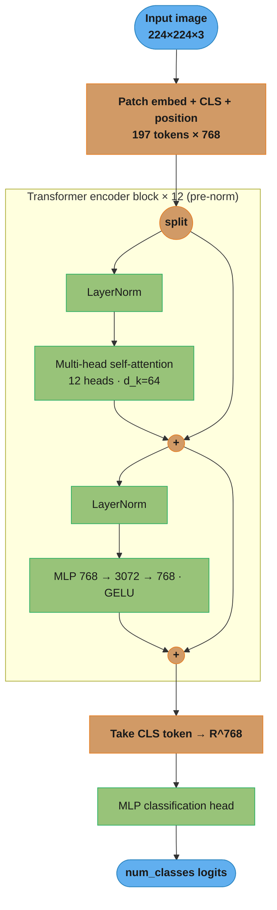
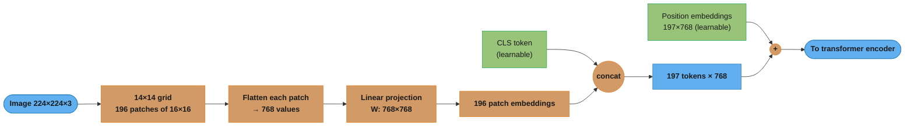
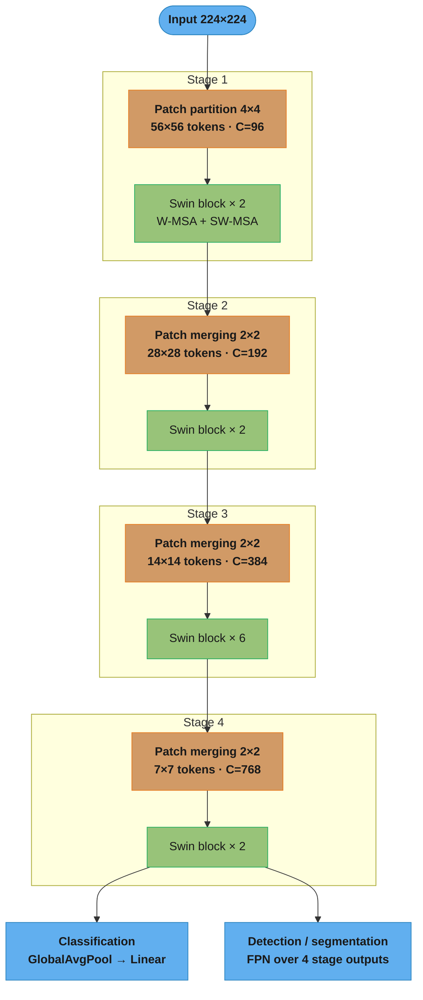
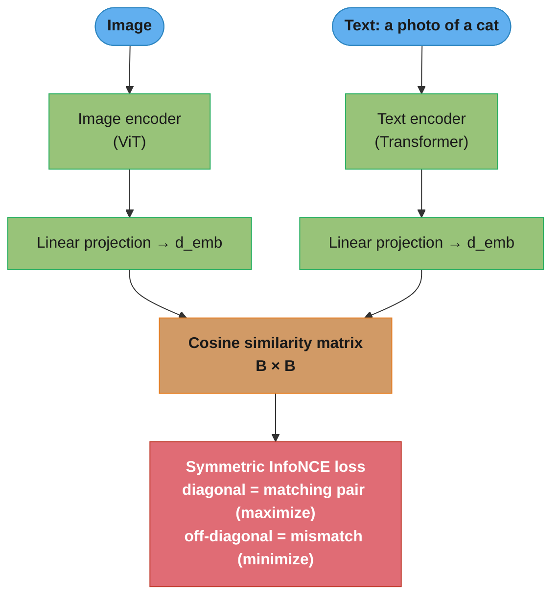

# Vision Transformers (ViT)

## 1. Concept Overview

Vision Transformers (ViT) apply the transformer architecture — originally designed for NLP — directly to images by splitting them into a sequence of fixed-size patches. Each patch is linearly projected to a vector (the patch embedding), position encodings are added, and the sequence is processed by standard transformer encoder blocks with multi-head self-attention.

ViT demonstrated in 2020 that pure self-attention, with sufficient training data, matches or surpasses convolutional neural networks on image classification. Subsequent work (DeiT, Swin, BEiT, DINOv2) extended ViT to work with less data, support dense prediction tasks (detection, segmentation), and provide general-purpose visual representations.

The paradigm shift: CNNs have strong spatial inductive biases (local connectivity, translation equivariance) built into their architecture. ViTs have almost none — they learn these biases from data, making them more flexible but requiring more data or stronger pretraining.

---

## 2. Intuition

Imagine reading a book vs. analyzing a photograph. Reading is sequential and local — you process words near each other. Analyzing a photograph is global — you immediately see relationships between distant parts (sky above, road below, car in middle). CNNs read images like text: local filters build up global understanding slowly through depth. ViTs analyze images more holistically: every patch attends to every other patch from the very first layer.

Key insight: the self-attention mechanism in ViT has O(n^2) complexity in the number of patches n. For a 224x224 image with 16x16 patches, n=196 — manageable. For higher resolutions or pixel-level tasks, this quadratic cost is a challenge that Swin Transformer solves with local windowed attention.

---

## 3. Core Principles

**Patch embedding**: divide the image into non-overlapping P×P patches. Flatten each patch to a vector and project with a linear layer to embedding dimension D. For ViT-B/16 on 224x224 images: P=16, patches=196, D=768.

**Positional encoding**: since self-attention is permutation-invariant, positional information must be injected explicitly. ViT uses 1D learnable position embeddings added to the patch embeddings. 2D sinusoidal and relative position encodings are used in variants for better interpolation to unseen resolutions.

**CLS token**: a learnable [class] token is prepended to the patch sequence. After passing through the transformer, the CLS token's output representation aggregates global image information and is fed into the classification head. DeiT adds a second [distillation] token.

**Multi-head self-attention (MHSA)**: each attention head computes Q, K, V projections from the token sequence. Attention weights A = softmax(QK^T / sqrt(d_k)) determine how much each token attends to each other. Multiple heads capture different relational patterns in parallel.

**Layer Normalization**: applied before (pre-norm in modern ViTs) rather than after each sub-layer, which stabilizes training of very deep models.

---

## 4. Types / Architectures / Strategies

### ViT Variants

| Model | Patches | Depth | Heads | D | Params | ImageNet Top-1 | Pretraining |
|-------|---------|-------|-------|---|--------|----------------|-------------|
| ViT-S/16 | 16×16 | 12 | 6 | 384 | 22M | 81.4% | ImageNet-21k |
| ViT-B/16 | 16×16 | 12 | 12 | 768 | 86M | 84.2% | ImageNet-21k |
| ViT-L/16 | 16×16 | 24 | 16 | 1024 | 307M | 86.4% | ImageNet-21k |
| ViT-H/14 | 14×14 | 32 | 16 | 1280 | 632M | 88.6% | JFT-3B |

### DeiT (Data-efficient Image Transformers)

DeiT achieves ViT-S-level accuracy training only on ImageNet-1k (1.28M images) without large proprietary datasets. Key innovations: (1) a distillation token that learns from a CNN teacher (RegNetY-16GF), receiving a "hard label" distillation loss alongside the standard classification loss; (2) stochastic depth regularization; (3) repeated augmentation (same image appears in the batch multiple times with different augmentations). DeiT-B reaches 83.4% top-1 on ImageNet-1k, competitive with ResNet-152.

### Swin Transformer

Swin addresses ViT's quadratic attention cost by computing self-attention within fixed local windows (7×7 patches by default) rather than globally. Shifted windows between layers enable cross-window connections. A hierarchical design (stages that merge patches) reduces the token count at each stage, enabling Swin to serve as a general-purpose backbone for detection and segmentation (unlike vanilla ViT, which only outputs a single-scale feature map).

| Model | Params | ImageNet Top-1 | COCO mAP | Notes |
|-------|--------|----------------|----------|-------|
| Swin-T | 29M | 81.3% | 50.5 | Tiny, comparable to ResNet-50 |
| Swin-B | 88M | 83.5% | 51.9 | Base |
| Swin-L | 197M | 86.3% | 53.5 | Large, SOTA before DINOv2 |

### CLIP (Contrastive Language-Image Pretraining)

CLIP trains a ViT image encoder and a GPT-like text encoder jointly on 400M image-text pairs from the web. The training objective maximizes cosine similarity of matching image-text pairs and minimizes it for non-matching pairs (contrastive loss). The result: a visual encoder whose embedding space is aligned with language. Zero-shot classification: embed the image; embed text prompts ("a photo of a cat"); compute cosine similarity; take argmax. CLIP ViT-L/14@336px achieves 76.2% zero-shot on ImageNet without any fine-tuning on ImageNet labels.

### DINOv2

DINOv2 pretrains ViT using self-supervised learning (see self_supervised_vision.md for DINO details) on a curated 142M image dataset. The resulting ViT-g/14 achieves 86.5% linear probing on ImageNet — the best visual representation quality of any model as of 2024, including CLIP. DINOv2 features emerge without any labels: depth estimation, semantic correspondence, and segmentation appear from probing intermediate layers.

---

## 5. Architecture Diagrams

### ViT End-to-End Pipeline



*The image becomes a 197-token sequence, every token attends to every other from the first layer, and the CLS token's final vector drives classification. The two `+` circles are the pre-norm residual adds — `x + MHSA(LN(x))` then `y + MLP(LN(y))` — which keep gradients flowing through the 12-block stack.*

### Patch, CLS, and Position Embedding



*Self-attention is permutation-invariant, so without the added position embeddings the 196 patches would be an unordered set and the model could not tell top from bottom. The learnable CLS token (green) is prepended before the encoder and later read out as the whole-image representation.*

### Swin Transformer Hierarchical Design



*Patch merging halves spatial resolution and doubles channels each stage, so Swin emits the same 4-scale feature pyramid as a ResNet — which is why detection and segmentation heads plug straight in. Attention is computed inside fixed 7×7 windows (W-MSA), cutting cost from O(n²) to O(n·W²); alternate blocks shift the window grid by (W/2, W/2) so information crosses window boundaries.*

### CLIP Contrastive Pretraining



*Training aligns the image and text embedding spaces so matching pairs land on the diagonal of the batch similarity matrix. At inference, zero-shot classification embeds the image once, embeds each class prompt ("a photo of a [class]"), and takes the argmax cosine similarity — no labeled fine-tuning required.*

---

## 6. How It Works — Detailed Mechanics

### Patch Embedding and Positional Encoding

```python
import torch
import torch.nn as nn
from torch import Tensor
import math


class PatchEmbedding(nn.Module):
    """
    Splits image into patches and projects to embedding dimension.
    Input:  (B, C, H, W)
    Output: (B, num_patches, embed_dim)
    """

    def __init__(self, img_size: int = 224,
                 patch_size: int = 16,
                 in_channels: int = 3,
                 embed_dim: int = 768) -> None:
        super().__init__()
        assert img_size % patch_size == 0, \
            f"Image size {img_size} must be divisible by patch size {patch_size}"
        self.num_patches = (img_size // patch_size) ** 2
        self.patch_size = patch_size
        # Equivalent to splitting + linear: use Conv2d with stride=patch_size
        self.projection = nn.Conv2d(in_channels, embed_dim,
                                     kernel_size=patch_size,
                                     stride=patch_size)

    def forward(self, x: Tensor) -> Tensor:
        # x: (B, C, H, W)
        x = self.projection(x)    # (B, embed_dim, H/P, W/P)
        x = x.flatten(2)          # (B, embed_dim, num_patches)
        x = x.transpose(1, 2)     # (B, num_patches, embed_dim)
        return x


class ViTEmbedding(nn.Module):
    """Full ViT input: patch embed + CLS token + position encoding."""

    def __init__(self, img_size: int = 224,
                 patch_size: int = 16,
                 in_channels: int = 3,
                 embed_dim: int = 768,
                 dropout: float = 0.0) -> None:
        super().__init__()
        self.patch_embed = PatchEmbedding(img_size, patch_size,
                                           in_channels, embed_dim)
        num_patches = self.patch_embed.num_patches

        self.cls_token = nn.Parameter(torch.zeros(1, 1, embed_dim))
        # Learnable 1D positional embeddings (num_patches + 1 for CLS)
        self.pos_embed = nn.Parameter(
            torch.zeros(1, num_patches + 1, embed_dim))
        self.dropout = nn.Dropout(dropout)
        self._init_weights()

    def _init_weights(self) -> None:
        nn.init.trunc_normal_(self.cls_token, std=0.02)
        nn.init.trunc_normal_(self.pos_embed, std=0.02)

    def forward(self, x: Tensor) -> Tensor:
        B = x.size(0)
        x = self.patch_embed(x)                            # (B, N, D)
        cls = self.cls_token.expand(B, -1, -1)             # (B, 1, D)
        x = torch.cat([cls, x], dim=1)                     # (B, N+1, D)
        x = x + self.pos_embed                             # (B, N+1, D)
        return self.dropout(x)
```

### Multi-Head Self-Attention Block

```python
class MultiHeadSelfAttention(nn.Module):
    """Standard MHSA for ViT with pre-norm."""

    def __init__(self, embed_dim: int = 768,
                 num_heads: int = 12,
                 attn_dropout: float = 0.0,
                 proj_dropout: float = 0.0) -> None:
        super().__init__()
        assert embed_dim % num_heads == 0
        self.num_heads = num_heads
        self.head_dim = embed_dim // num_heads
        self.scale = self.head_dim ** -0.5

        self.qkv = nn.Linear(embed_dim, embed_dim * 3, bias=True)
        self.attn_drop = nn.Dropout(attn_dropout)
        self.proj = nn.Linear(embed_dim, embed_dim)
        self.proj_drop = nn.Dropout(proj_dropout)

    def forward(self, x: Tensor) -> tuple[Tensor, Tensor]:
        B, N, D = x.shape
        qkv = self.qkv(x).reshape(B, N, 3, self.num_heads,
                                    self.head_dim).permute(2, 0, 3, 1, 4)
        q, k, v = qkv.unbind(0)  # each: (B, heads, N, head_dim)

        attn = (q @ k.transpose(-2, -1)) * self.scale  # (B, heads, N, N)
        attn = attn.softmax(dim=-1)
        attn = self.attn_drop(attn)

        out = (attn @ v).transpose(1, 2).reshape(B, N, D)
        out = self.proj_drop(self.proj(out))
        return out, attn  # return attn for visualization
```

### Fine-Tuning ViT with Layer-wise LR Decay

```python
from torch.optim import AdamW


def build_vit_optimizer(model: nn.Module,
                          base_lr: float = 1e-3,
                          layer_decay: float = 0.65,
                          weight_decay: float = 0.05) -> AdamW:
    """
    Layer-wise learning rate decay for ViT fine-tuning.
    Deeper layers (closer to input) get lower LR.
    layer_decay=0.65 is the standard value from ViT fine-tuning papers.
    """
    num_layers = 12  # ViT-B has 12 transformer blocks

    # Assign each parameter a layer index
    param_groups: list[dict] = []
    for name, param in model.named_parameters():
        if not param.requires_grad:
            continue

        # Determine layer depth
        if "patch_embed" in name or "cls_token" in name or "pos_embed" in name:
            layer_id = 0
        elif "blocks" in name:
            # e.g. "blocks.5.attn.qkv.weight" → layer 5
            block_idx = int(name.split(".")[1])
            layer_id = block_idx + 1
        else:  # head
            layer_id = num_layers + 1

        lr_scale = layer_decay ** (num_layers + 1 - layer_id)
        effective_lr = base_lr * lr_scale

        # Separate weight decay: do NOT apply to biases, norms, embeddings
        wd = 0.0 if (param.ndim == 1 or "bias" in name or
                      "norm" in name or "embed" in name) else weight_decay

        param_groups.append({
            "params": [param],
            "lr": effective_lr,
            "weight_decay": wd,
        })

    return AdamW(param_groups)
```

### CLIP Zero-Shot Classification

```python
import torch
import torch.nn.functional as F
from torch import Tensor


def clip_zero_shot_classify(image_features: Tensor,
                              class_names: list[str],
                              clip_model,
                              clip_tokenizer,
                              device: torch.device,
                              templates: list[str] = None) -> Tensor:
    """
    Zero-shot classification using CLIP text embeddings.
    image_features: (B, D) L2-normalized image embeddings
    Returns: (B, num_classes) probability distribution
    """
    if templates is None:
        templates = [
            "a photo of a {}.",
            "a photograph of a {}.",
            "an image of a {}.",
        ]

    # Build text embeddings for each class using multiple templates
    text_embeddings: list[Tensor] = []
    with torch.no_grad():
        for class_name in class_names:
            class_embeds = []
            for template in templates:
                prompt = template.format(class_name)
                tokens = clip_tokenizer(prompt).to(device)
                embed = clip_model.encode_text(tokens)
                embed = F.normalize(embed, dim=-1)
                class_embeds.append(embed)
            # Average over templates
            class_embed = torch.stack(class_embeds).mean(dim=0)
            class_embed = F.normalize(class_embed, dim=-1)
            text_embeddings.append(class_embed)

    text_emb_matrix = torch.cat(text_embeddings, dim=0)  # (C, D)

    # Cosine similarity = dot product of L2-normalized vectors
    logits = image_features @ text_emb_matrix.T  # (B, C)
    logits = logits * 100  # CLIP temperature scaling
    return F.softmax(logits, dim=-1)
```

---

## 7. Real-World Examples

**Google Search visual search**: ViT-G/14 (1.8B params) generates image embeddings for visual similarity search across Google Images. The model is distilled to a smaller ViT-S/16 for latency-constrained mobile search.

**OpenAI DALL-E 3**: uses a CLIP ViT image encoder as the image understanding backbone for the text-conditional diffusion model. CLIP embeddings condition the denoiser on semantic image content.

**Apple Face ID**: EfficientNet-like CNN was the original architecture; newer versions use ViT variants for better accuracy on diverse face conditions (glasses, partial occlusion, aging). Runs on Neural Engine in < 1ms.

**Meta content moderation**: CLIP ViT-L/14 embeds all uploaded images into a shared vision-language space. Text queries ("graphic violence", "nudity") are matched against image embeddings for zero-shot detection, bootstrapping a new category without per-category annotation.

**Tesla occupancy networks**: Swin Transformer backbone processes 8-camera surround view images to produce 3D occupancy voxel grids for the vehicle's world model. Hierarchical features from Swin's 4 stages are fused with BEV (bird's-eye-view) projections.

---

## 8. Tradeoffs

| Dimension | ViT (global attention) | Swin (local + shifted window) | CNN (ResNet/EfficientNet) |
|-----------|----------------------|-------------------------------|---------------------------|
| Inductive bias | None | Locality + hierarchy | Strong (locality, translation equiv.) |
| Data efficiency | Low | Medium | High |
| Scaling behavior | Excellent | Good | Diminishing returns |
| Dense prediction | Hard (single scale) | Native (multi-scale) | Native (FPN) |
| Attention complexity | O(n^2) | O(n · W^2) | N/A |
| Throughput (A100) | ViT-B: ~900 img/s | Swin-B: ~750 img/s | ResNet-50: ~1200 img/s |
| VRAM (224px, bs=32) | ~8GB | ~10GB | ~5GB |

| Model | Zero-shot ImageNet | Fine-tuned ImageNet | Requires large pretraining |
|-------|-------------------|--------------------|-----------------------------|
| CLIP ViT-L/14 | 76.2% | 87.8% | 400M pairs |
| DINOv2 ViT-g/14 | — (linear probe 86.5%) | 88.0% | 142M curated |
| ViT-H/14 (sup) | N/A | 88.6% | JFT-3B (3B images) |

---

## 9. When to Use / When NOT to Use

**Use ViT (ViT-B/16 or larger) when**:
- Strong pretrained checkpoint is available (ImageNet-21k, CLIP, DINOv2).
- Task benefits from long-range global context (whole-image reasoning, document understanding).
- You have a large fine-tuning dataset (> 100k images) to exploit the model's capacity.

**Use Swin Transformer when**:
- You need multi-scale features for detection or segmentation (no FPN needed).
- Input resolution is high (> 384px) — local windows make it tractable.
- You want a drop-in CNN replacement backbone for detection/segmentation frameworks.

**Use CLIP when**:
- You need zero-shot or few-shot classification across many categories.
- Your labels are described in natural language (no hard class boundaries).
- Building a semantic image search or recommendation system.

**Do NOT use ViT (from scratch) when**:
- Dataset is small (< 100k images) and no pretrained checkpoint is available.
- Latency budget is under 5ms on mobile — use MobileNetV3 or EfficientNet-Lite instead.
- Memory is limited — ViT-B at 224px requires ~4GB VRAM for inference at batch 64.

---

## 10. Common Pitfalls

**Pitfall 1: Fine-tuning at wrong resolution without interpolating position embeddings**
ViT-B/16 pretrained at 224x224 has position embeddings of shape (197, 768). Fine-tuning at 384x384 produces 576 patches — the position embeddings size mismatch causes a runtime error or, if carelessly ignored, produces random positional encodings for new positions. Fix: bicubic interpolation of the 2D position embeddings. In timm, `model.set_input_size((384, 384))` handles this automatically.

**Pitfall 2: Not using layer-wise LR decay for ViT fine-tuning**
Fine-tuning all ViT layers with the same learning rate causes catastrophic forgetting of early-layer representations. Early attention heads that detect edges and textures get overwritten. A team fine-tuning ViT-B for medical imaging with uniform LR 1e-4 got 74%; adding layer decay (0.65 per layer) improved it to 81% with no other change.

**Pitfall 3: Underestimating CLIP's sensitivity to prompt engineering**
CLIP zero-shot performance varies dramatically with prompt phrasing. A team got 61% zero-shot accuracy with class names alone ("cat", "dog") and 76% with "a photo of a [class]". Using an ensemble of 80 ImageNet templates (OpenAI standard) raised it further to 80%. For production, always test multiple prompt templates and ensemble their text embeddings.

**Pitfall 4: Ignoring attention map artifacts in CLS token**
ViT CLS tokens sometimes attend to background tokens rather than the object of interest, especially when trained on datasets with cluttered backgrounds. This causes GradCAM-equivalent visualizations to highlight uninformative regions. DINOv2 and models trained with DINO self-supervision have cleaner attention maps that genuinely focus on object regions.

**Pitfall 5: BatchNorm in ViT (do not)**
Some engineers port CNN code patterns to ViT and accidentally add BatchNorm layers. ViT uses Layer Normalization, not Batch Normalization. BN computes statistics over the batch dimension, which is problematic with variable sequence lengths. LN computes statistics over the feature dimension per sample. Mixing the two causes subtle numerical instabilities and 2-4% accuracy drops.

---

## 11. Technologies & Tools

| Tool | Purpose | Notes |
|------|---------|-------|
| timm (Hugging Face) | 700+ pretrained ViT/Swin/CNN models | Gold standard for CV model zoo |
| transformers (HF) | CLIP, BEiT, ViT with HF API | Best for CLIP and NLP-aligned models |
| open_clip | OpenCLIP (open-source CLIP reproduction) | More model variants than official CLIP |
| flash-attention | Efficient attention (FlashAttention-2) | 2-4x faster, sub-linear memory for long sequences |
| xformers | Memory-efficient attention ops | Alternative to FlashAttention |
| DINOv2 (Meta) | Best general-purpose visual features | Available via torch.hub |
| torchvision.transforms.v2 | Augmentation for ViT (MixUp, CutMix) | Use v2 for modern augmentation API |
| Triton Inference Server | ViT production serving | TensorRT FP16 export recommended |
| ONNX Runtime | CPU/edge ViT inference | DeiT-S achieves ~40ms CPU with ONNX |

---

## 12. Interview Questions with Answers

**Q: How does ViT convert an image into a sequence of tokens?**
ViT splits the input image into a grid of non-overlapping P×P patches. Each patch is flattened to a 1D vector of length P×P×C (for a 3-channel image). This vector is projected to the embedding dimension D using a learnable linear layer (equivalently, a Conv2d with kernel_size=P, stride=P). A learnable CLS token is prepended, and learnable 1D positional embeddings are added element-wise. For a 224×224 image with P=16: num_patches = 196, sequence length = 197 (including CLS).

**Q: Why does ViT need positional embeddings and what happens without them?**
Self-attention is permutation-invariant: the attention mechanism treats the input as a set, not a sequence. Without positional embeddings, shuffling all 196 patches produces the exact same output, which means the model cannot learn where objects are relative to each other. Positional embeddings inject location information. Without them, ViT performs ~15% worse on ImageNet. ViT uses learnable 1D embeddings; Swin uses relative position bias; modern models often use 2D sinusoidal or RoPE (Rotary Position Embedding).

**Q: What is the CLS token and why is it used for classification?**
The CLS (classification) token is a learnable vector prepended to the patch sequence before the transformer encoder. Through self-attention, it is free to attend to all patches and aggregate information from the entire image. After L transformer blocks, the CLS token's output is a global representation of the image, which is fed into the classification MLP head. This design is borrowed from BERT. An alternative (used in some ViT variants) is global average pooling over all patch tokens, which sometimes gives marginally better results.

**Q: What makes Swin Transformer more suitable than ViT for detection and segmentation?**
ViT has a single-scale feature map (all patches at the same resolution throughout), making it hard to build an FPN-style multi-scale hierarchy. Swin uses patch merging between stages to progressively reduce resolution and increase channels, producing hierarchical features at 4 scales — identical in structure to ResNet's C2–C5 stages. Detection and segmentation frameworks (Faster R-CNN, Mask R-CNN) can plug Swin in as a drop-in CNN backbone without architectural changes. Swin also uses local windowed attention (O(n·W²) vs O(n²)), making it tractable for high-resolution inputs.

**Q: How does CLIP enable zero-shot classification?**
CLIP trains a visual encoder and a text encoder jointly to produce aligned embeddings: matching image-text pairs are pulled together; non-matching pairs are pushed apart (InfoNCE loss). At inference, for each class name, a text prompt ("a photo of a [class]") is encoded by the text encoder. An image is encoded by the image encoder. The predicted class is the one whose text embedding has the highest cosine similarity to the image embedding. This requires no task-specific fine-tuning — the model generalizes to any class that can be described in text.

**Q: What is DeiT and how does it train efficiently on ImageNet-1k?**
DeiT (Data-efficient Image Transformers, 2021) achieves ViT-level accuracy using only ImageNet-1k (1.28M images) by introducing: (1) knowledge distillation — a DeiT distillation token learns from a CNN teacher's hard label in parallel with the CLS token's classification loss; (2) stochastic depth (drop path) regularization — randomly drops entire residual branches during training, acting as ensemble training; (3) strong augmentation — RandAugment, CutMix, Mixup, and repeated augmentation. The result: DeiT-B reaches 83.4% without any external data.

**Q: What is the computational complexity of self-attention and why is it a problem for high-resolution images?**
Self-attention has O(n²·d) complexity where n is the sequence length (number of patches) and d is the embedding dimension. For 224×224 with patch size 16: n=196, manageable. For 512×512 with patch size 8: n=4096, the attention matrix is 4096×4096 — ~16M elements per head, making it 44× more expensive than 224×224. FlashAttention reduces memory from O(n²) to O(n) by tiling the computation, but the FLOPs are still O(n²). Swin's local window attention reduces this to O(n·W²) where W=7 is the window size.

**Q: How do you fine-tune a pretrained ViT on a small custom dataset (< 10k images)?**
Use a heavily pretrained checkpoint (ImageNet-21k, CLIP, DINOv2) rather than ImageNet-1k only. Freeze the backbone and train only the head for the first 10 epochs (linear probing) to establish a good starting point without corrupting pretrained features. Then unfreeze the full model with layer-wise LR decay (decay=0.65, base LR 1e-4) for 50–100 epochs. Use aggressive augmentation (RandAugment, CutMix) and dropout (p=0.2 in the head). Stochastic depth (drop_path_rate=0.1) reduces overfitting. Expect 3–5% less accuracy than equivalent data with a CNN due to weaker inductive bias.

**Q: What is FlashAttention and how does it help ViT training?**
FlashAttention (Dao et al., 2022) is an IO-aware exact attention algorithm that tiles the attention computation to keep data in GPU SRAM, avoiding expensive HBM reads/writes of the O(n²) attention matrix. FlashAttention-2 achieves ~2x throughput over standard PyTorch attention and reduces peak memory from O(n²) to O(n). For ViT-L fine-tuning at 384×384 resolution (n=576), FlashAttention reduces peak VRAM by ~4× and training time by ~2×. It is enabled via `torch.nn.functional.scaled_dot_product_attention` in PyTorch 2.0+.

**Q: What is the difference between relative and absolute positional encodings?**
Absolute positional encodings assign a fixed or learned embedding to each position index, which does not generalize to sequence lengths unseen during training. If ViT is pretrained at 224px and fine-tuned at 384px, absolute encodings must be interpolated. Relative positional encodings encode the offset between pairs of tokens rather than absolute positions. Swin uses relative position bias: a learnable bias matrix indexed by (row_offset, col_offset) between token pairs. Relative encodings generalize better to different resolutions and naturally capture spatial relationships. RoPE (Rotary Position Embedding) is the latest approach, used in modern language models and increasingly in vision models.

**Q: How does the Swin Transformer's shifted window mechanism work?**
In each Swin block pair, Window Multi-head Self-Attention (W-MSA) computes attention within fixed M×M windows (M=7). The next block uses Shifted Window Multi-head Self-Attention (SW-MSA), where windows are shifted by (M/2, M/2) pixels before partitioning. This means tokens at window boundaries in W-MSA are now in the interior of a shifted window, enabling cross-window information flow. Efficient cyclic shift + masking implements this without padding overhead. Without shifted windows, the model cannot capture global context across arbitrary token pairs.

**Q: What is DINOv2 and why does it produce the best general-purpose visual features?**
DINOv2 (Oquab et al., 2023) trains ViT using a self-supervised DINO objective on a curated 142M image dataset. The curation pipeline (deduplication, quality filtering, clustering) is as important as the training objective. The key insight: with a large, diverse, curated dataset and a self-distillation objective, ViTs learn representations that are superior to supervised ImageNet training for downstream tasks. DINOv2 ViT-g/14 achieves 86.5% linear probing on ImageNet — better than any supervised model on a linear probe, meaning the features encode more linearly separable information. Depth estimation, segmentation, and semantic correspondence emerge without any label supervision.

**Q: How does ViT attention differ from CNN feature maps in terms of interpretability?**
CNN feature maps can be visualized with Grad-CAM: compute gradients of the target class score with respect to the last convolutional feature map and weight-sum the feature channels. This produces a heatmap highlighting discriminative regions. ViT attention maps from the last transformer block (especially the CLS token's attention to patch tokens) can sometimes reveal the attended regions, but they are noisier and less reliable than Grad-CAM. DINO-pretrained ViTs have cleaner attention that genuinely segments objects. For production explainability with ViTs, Attention Rollout (averaging attention maps across layers and heads) or GradCAM applied to the patch tokens gives more reliable attribution.

**Q: What tradeoffs exist between patch size 16×16 vs 8×8 in ViT?**
Patch size 16×16 on 224×224 input gives 196 tokens — manageable attention cost (O(196²) per head). Patch size 8×8 gives 784 tokens — 16× more expensive attention. Smaller patches provide finer spatial resolution, which improves performance on dense prediction tasks and on images with small objects. ViT-B/8 outperforms ViT-B/16 on ImageNet by ~2% top-1 but requires 4× more computation and memory. For classification, 16×16 is standard. For segmentation and detection where spatial precision matters, 8×8 or Swin's hierarchical approach is preferred.

**Q: Why do Vision Transformers require more training data than CNNs?**
Vision Transformers lack the spatial inductive biases — locality and translation equivariance — that CNNs bake into their architecture, so they must learn those patterns from data instead. A convolution kernel hard-codes that nearby pixels are related and that a feature detector should behave identically everywhere in the image; ViT starts with none of this and can attend from any patch to any other from the first layer, giving more flexibility but no built-in priors. Trained from scratch on ImageNet-1k, ViT trails a comparable ResNet by several points; the advantage only appears once pretraining reaches ImageNet-21k (14M) or JFT (300M+) scale. In practice, always start from a strong pretrained checkpoint rather than training ViT from scratch on under 1M images.

**Q: Can you replace the CLS token with global average pooling, and does it matter?**
Yes, global average pooling over all patch tokens is a drop-in alternative to the CLS token and often gives marginally better accuracy. The original ViT used a BERT-style CLS token, but ablations show that mean-pooling the final patch tokens works about as well or slightly better, provided the head learning rate is tuned separately (GAP prefers a lower head LR). DINOv2 and several modern ViTs pool patch tokens rather than relying on a CLS token. The tradeoff: the CLS token gives one natural aggregation point for attention-map visualization, while GAP spreads the signal across all tokens and can be more robust when the CLS token attends to background clutter.

**Q: How do Vision Transformers scale with more data and parameters compared to CNNs?**
ViTs keep gaining accuracy as data and model size grow, while CNNs hit diminishing returns — ViT-H/14 pretrained on JFT-3B reaches 88.6% ImageNet top-1. This favorable scaling is the core reason ViT displaced CNNs at the high end: doubling parameters and data yields a predictable gain that does not plateau as early as the ResNet/EfficientNet families. The flip side is data hunger in the low regime — the same architecture that scales beautifully to billions of images is worse than a ResNet on 100k. Choose ViT when you can supply scale (data, compute, or a large pretrained checkpoint); choose a CNN when you cannot.

---

## 13. Best Practices

1. Always start from the strongest available pretrained checkpoint: for general vision tasks, DINOv2 ViT-L/14; for vision-language tasks, CLIP ViT-L/14 or OpenCLIP ViT-G/14. Training ViT from scratch on fewer than 1M images is almost never justified.
2. Use layer-wise LR decay with decay=0.65 for all ViT fine-tuning. This single change routinely gives 3–7% improvement over uniform LR.
3. Enable FlashAttention-2 (via `torch.nn.functional.scaled_dot_product_attention` in PyTorch 2.0+ or `xformers`) to reduce memory and speed up training by 2×.
4. For CLIP-based classification, always use an ensemble of 7–80 text prompt templates and average their text embeddings. The OpenAI ImageNet template set is publicly available and provides +5% over single templates.
5. When fine-tuning ViT at a different resolution from pretraining, interpolate positional embeddings: use `timm`'s built-in `resize_pos_embed` utility or call `model.set_input_size(new_size)`.
6. Apply stochastic depth (drop path) regularization: `drop_path_rate=0.1` for ViT-S, 0.2 for ViT-B, 0.3 for ViT-L. This significantly reduces overfitting on small-to-medium fine-tuning sets.
7. Use EMA (Exponential Moving Average) of model weights during fine-tuning: decay=0.9999, evaluated every epoch. EMA typically improves top-1 accuracy by 0.2–0.5% with zero inference overhead.
8. For Swin-based detection, the recommended fine-tuning schedule is 12 epochs (1x schedule) with AdamW, LR 1e-4, weight decay 0.05, cosine schedule. Adding a 36-epoch schedule rarely improves by more than 1 mAP for most practical datasets.
9. Monitor attention entropy during training — if all attention heads collapse to attending to a single patch (entropy near 0), the model is stuck. Reduce learning rate or add more dropout.
10. For production serving of ViT-B: export to ONNX, run through TensorRT FP16 on A100. Expected throughput: ~1400 images/sec at batch=64 vs ~900 imgs/sec in PyTorch eager.

---

## 14. Case Study

**Problem**: A fashion e-commerce platform needs to retrieve visually similar products from a catalog of 5M items. Queries come from user-uploaded photos (varied backgrounds, lighting, angles). Target: top-10 recall > 85% on a benchmark of 10k query-gallery pairs.

**Architecture**: CLIP ViT-L/14 as the image encoder (fine-tuned for fashion). The text encoder is discarded at inference. Image embeddings are stored in a FAISS IVF-PQ index for approximate nearest neighbor search.

**Fine-tuning**: Triplet loss with hard negative mining on 2M (anchor, positive, negative) triplets. Anchor: product catalog image; positive: user photo of the same product; negative: hard negative from same category (different product). LR 5e-5 with layer decay 0.75, 30 epochs, batch 512 on 8× A100.

**Baseline** (CLIP zero-shot, no fine-tuning): top-10 recall = 62%. After fine-tuning: 83%.

**Problem**: 62→83% leaves a gap to target 85%. Analysis: failures concentrated in subcategories with high visual similarity (blue jeans, plain white shirts). The model could not distinguish subtle differences (pocket style, fabric texture).

**Fix**: Added a second stage of contrastive fine-tuning on sub-category hard negatives, mined by running k-NN at the sub-category level. Recall reached 87%.

**Production deployment**: ViT-L/14 encoder exported to TensorRT FP16, 8ms per image on T4 GPU. FAISS IVFFlat with nlist=4096, nprobe=64: search over 5M vectors in ~3ms with recall@100 = 99.5% vs exact search. End-to-end query latency P99 = 25ms. Index stored in 5GB (d=768 float16 vectors, 5M items = 7.2GB raw, compressed by IVF-PQ to 5GB).
