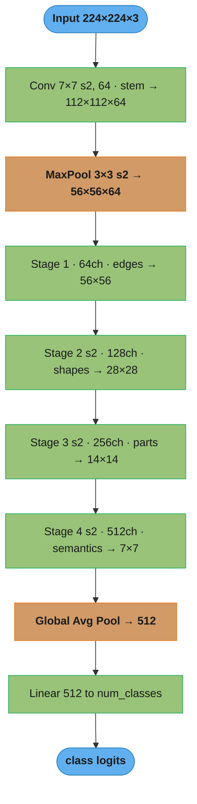
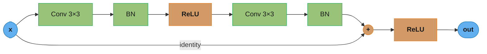
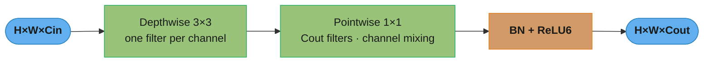
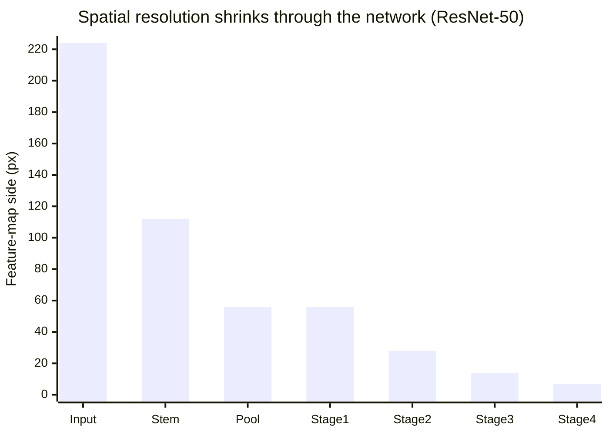
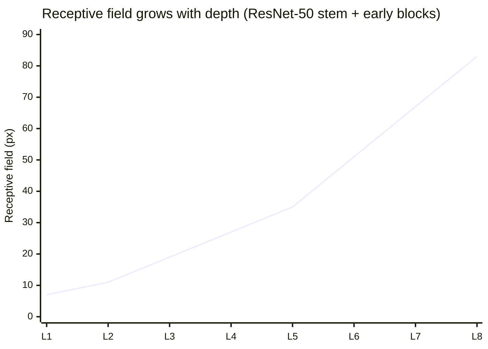

# Convolutional Neural Networks

## 1. Concept Overview

A Convolutional Neural Network (CNN) is a neural network architecture that exploits three structural biases of spatial data: local connectivity (neurons connect to a small spatial region, not all inputs), weight sharing (the same filter is applied across all spatial locations), and translation equivariance (a feature detector learns to fire for a pattern regardless of where in the image it appears). These biases dramatically reduce the parameter count relative to fully connected layers and embed domain knowledge about the structure of images directly into the architecture.

CNNs learn a hierarchy of filters: early layers detect low-level features (edges, colors, textures), middle layers detect mid-level patterns (corners, curves, object parts), and later layers detect high-level semantic concepts (faces, wheels, text). This hierarchy makes CNNs the dominant architecture for computer vision tasks.

---

## 2. Intuition

One-line analogy: a CNN is like a flashlight scanning a document — the same small light (filter) slides across the entire page (feature map), looking for the same pattern everywhere, then a second flashlight looks for a different pattern, and so on.

Mental model: the network learns a stack of overlapping templates. At each layer, a set of learned filters is convolved with the input to produce a new set of feature maps — each map represents "how strongly does each location match this template?" Deeper filters combine outputs of shallower ones, building progressively richer descriptions.

Why it matters: CNNs power image classification, object detection, semantic segmentation, medical imaging, autonomous driving perception, and satellite imagery analysis. Transfer learning from ImageNet-pretrained CNNs is the most cost-effective starting point for the vast majority of vision tasks.

Key insight: parameter sharing is the core efficiency gain. A 3x3 filter applied to a 224x224 image has 9 parameters and covers the entire image in a single layer, versus a fully connected layer needing 224x224x9 = ~450K parameters for the same spatial coverage.

---

## 3. Core Principles

**Convolution operation**: a filter (kernel) of shape (K, K, C_in) slides over an input feature map. At each spatial position, it computes the dot product between the filter weights and the input patch, producing one scalar in the output feature map. Applying C_out different filters produces a feature map of shape (H_out, W_out, C_out).

**Put simply.** "A conv layer's weight count depends only on the filter shape and the channel counts — never on how big the image is."

That independence from `H` and `W` is the whole reason CNNs fit in memory. A dense layer wiring the same feature map to the same output must store one weight per (input unit, output unit) pair, and that product explodes quadratically with resolution.

| Symbol | What it is |
|--------|------------|
| `K` | Filter side length. A `3x3` filter has `K = 3` |
| `C_in` | Channels coming in — the depth of the input feature map |
| `C_out` | Number of distinct filters, so the depth of the output feature map |
| `K * K * C_in` | Weights inside one filter: it spans the full input depth, but only a small window wide |
| `K * K * C_in * C_out` | Total conv weights. `H` and `W` appear nowhere in this product |
| `(H*W*C_in) * (H*W*C_out)` | Dense-layer weights for the same map — every input unit wired to every output unit |

**Walk one example.** One `3x3` conv, 64 channels in, 64 channels out, on a `56x56` map:

```
  conv layer
    weights = K x K x C_in x C_out
            = 3 x 3 x 64 x 64
            = 36,864            <- plus 64 biases = 36,928 if bias is kept

  dense layer producing the identical 56x56x64 output
    input units  = 56 x 56 x 64 = 200,704
    output units = 56 x 56 x 64 = 200,704
    weights      = 200,704 x 200,704
                 = 40,282,095,616        (40.3 billion)

  ratio = 40,282,095,616 / 36,864 = 1,092,722x fewer weights in the conv layer
```

At fp32 the dense layer's weights alone would occupy `40,282,095,616 x 4 = 161 GB` — larger than any single GPU. The conv layer needs `36,864 x 4 = 147 KB`. Same input, same output shape, six orders of magnitude apart, and the entire gap is bought by reusing one filter across all `56 x 56 = 3,136` spatial positions.

**Output size formula**: given input size W, filter size F, padding P, stride S:
```
H_out = floor((H - F + 2P) / S) + 1
W_out = floor((W - F + 2P) / S) + 1
```

Common cases:
- 3x3 conv, P=1, S=1: output same as input (same padding)
- 3x3 conv, P=0, S=1: output shrinks by 2 each side
- 3x3 conv, P=1, S=2: output halves (halved spatial resolution)

**What the formula is telling you.** "Measure how far the filter's corner can slide before it falls off the edge, count how many stride-sized jumps fit in that distance, then add one for the starting position it occupied before jumping at all."

Reading it as travel-then-jumps is what makes the `+ 1` stop looking arbitrary. The `floor` is equally load-bearing: a partial jump cannot happen, so leftover pixels at the far edge are silently discarded.

| Symbol | What it is |
|--------|------------|
| `H`, `W` | Input height and width, in pixels of this layer's own grid |
| `F` | Filter (kernel) side length |
| `P` | Zeros added to **each** side, so the effective input grows by `2P` |
| `S` | Stride — how many pixels the filter jumps between taps |
| `H - F + 2P` | Travel distance: how far the filter's top-left corner can move before running off |
| `(H - F + 2P) / S` | How many jumps of size `S` fit inside that travel distance |
| `+ 1` | The starting tap, which happens before any jump |
| `floor(...)` | Partial jumps are impossible — leftover edge pixels are dropped, never padded implicitly |

**Walk three configurations.** One preserving, one halving, one that does not divide evenly:

```
  (a) "same" padding: 224x224 input, 3x3 conv, P=1, S=1
        travel = 224 - 3 + 2x1 = 223
        jumps  = 223 / 1       = 223
        out    = 223 + 1       = 224      <- size preserved; P = floor(F/2) does it

  (b) stride-2 downsample: 224x224 input, 7x7 conv, P=3, S=2
        travel = 224 - 7 + 2x3 = 223
        jumps  = 223 / 2       = 111.5  -> floor 111
        out    = 111 + 1       = 112      <- the ResNet-50 stem, cleanly halved

  (c) does not divide evenly: 112x112 input, 3x3 pool, P=0, S=2
        travel = 112 - 3 + 0   = 109
        jumps  = 109 / 2       =  54.5  -> floor 54
        out    =  54 + 1       =  55
        coverage = 3 + 2 x (55 - 1) = 111 of 112 columns
                                       ^ the 112th column is never read at all
```

Case (c) is why torchvision's ResNet-50 sets `padding=1` on that max-pool: `(112 - 3 + 2)/2 + 1 = 56`, which keeps the clean `224 -> 112 -> 56 -> 28 -> 14 -> 7` ladder instead of a ragged 55 that then propagates odd sizes through every later stage. Whenever a stage's output is one pixel short of what you expected, the `floor` ate an edge — fix it with padding, not by patching the layer downstream.

**Receptive field**: the region of the input that influences a given neuron's output. Grows with depth. For a stack of K layers of 3x3 conv with stride 1: RF = 1 + 2*K. For strided convolutions, the receptive field grows faster: RF(k) = RF(k-1) + (kernel_size - 1) * product_of_all_previous_strides.

**Pooling**: reduces spatial dimensions to provide spatial invariance. Max pooling takes the maximum in each window (retains strongest activation). Average pooling takes the mean (smoother, often used in global pooling before FC layers).

**Read it like this.** "Pooling runs the exact same output-size formula as convolution, with `F = S`, and it does it with zero learnable weights."

There is no separate pooling arithmetic to memorize — set `F = S = 2` in `(W - F + 2P)/S + 1` and the answer is "half". What changes is the parameter column: a conv layer that halves the map costs weights, a pool layer that halves it costs none.

| Symbol | What it is |
|--------|------------|
| `F_pool` | Pooling window side, typically 2 or 3 |
| `S_pool` | Stride, usually set equal to `F_pool` so the windows tile without overlap |
| `C` | Channel count — pooling acts per channel independently and never changes it |
| params | Always `0`; max and mean are fixed functions with nothing to fit |
| global average pool | The extreme case `F_pool = H = W`, collapsing each channel to a single number |

**Walk one example.** A `2x2` max pool, stride 2, on a `56x56x64` map:

```
  out side = (56 - 2 + 0) / 2 + 1 = 28

  shape     : 56 x 56 x 64  ->  28 x 28 x 64
  values    :      200,704  ->       50,176      = 4x fewer activations
  channels  :           64  ->           64      (unchanged)
  params    :            0                       (nothing is learned)

  global average pool at the end of ResNet-50:
    7 x 7 x 2048 = 100,352 values  ->  2,048 values

    head on the flattened map : 100,352 x 1000 = 100,352,000 weights
    head after GAP            :   2,048 x 1000 =   2,048,000 weights
                                                  ^ 49x smaller, same 1000 classes
```

The 4x activation drop is per pooling layer and it compounds: four such stages cut activations 256-fold, which is what keeps a 224x224 batch inside GPU memory. Global average pooling pays off differently — it deletes the flatten-to-dense parameter blowup outright, which is why ResNet and EfficientNet ship far smaller classifier heads than VGG did.

**Skip connections (ResNet)**: add the input directly to the output of a block, bypassing the nonlinear transformations. Enables training of very deep networks by providing gradient highways that bypass vanishing gradient accumulation.

---

## 4. Types / Architectures / Strategies

| Architecture | Params | ImageNet Top-1 | Year | Key Innovation |
|-------------|--------|----------------|------|----------------|
| AlexNet | 60M | 63.3% | 2012 | First deep CNN, ReLU, Dropout |
| VGGNet-16 | 138M | 74.4% | 2014 | Small 3x3 convs stacked |
| ResNet-18 | 11M | 69.8% | 2015 | Skip connections |
| ResNet-50 | 25M | 76.2% | 2015 | Bottleneck blocks |
| ResNet-101 | 44M | 77.4% | 2015 | Deeper residual network |
| MobileNetV2 | 3.4M | 72.0% | 2018 | Depthwise separable convs |
| EfficientNet-B0 | 5.3M | 77.1% | 2019 | Compound scaling |
| EfficientNet-B7 | 66M | 84.4% | 2019 | Scaled up B0 |
| ConvNeXt-L | 197M | 87.5% | 2022 | Modernized ResNet |

**Standard Convolution vs Depthwise Separable Convolution (MobileNet):**

Standard: one kernel of shape (K, K, C_in) per output channel -> total ops: K^2 * C_in * C_out * H * W

Depthwise separable = depthwise (one filter per input channel: K^2 * C_in * H * W) + pointwise (1x1 conv: C_in * C_out * H * W). Total ops: K^2 * C_in + C_in * C_out per spatial position. Speedup factor: 1 / (1/C_out + 1/K^2), roughly 8-9x for 3x3 conv with large C_out.

**EfficientNet Compound Scaling**: jointly scale width (channels), depth (layers), and resolution (input size) with a fixed ratio. Given a resource budget multiplier phi: depth *= alpha^phi, width *= beta^phi, resolution *= gamma^phi with alpha*beta^2*gamma^2 ~= 2. EfficientNet-B7 uses phi=7 over B0 baseline.

**ResNet Bottleneck Block** (ResNet-50+): 1x1 conv (reduce channels) -> 3x3 conv -> 1x1 conv (expand channels). Reduces computation vs a naive 3x3-3x3 block. Identity shortcut for same-dimension blocks, 1x1 projection shortcut when dimensions change.

---

## 5. Architecture Diagrams

**Standard CNN pipeline (conv/pool feature-map flow):**



The feature map flows top-down: spatial size falls (224 → 7) while channel depth
rises (3 → 512), trading resolution for semantic richness before global average
pooling collapses each map to a single number.

**ResNet residual block (BasicBlock, ResNet-18/34):**



The identity edge lets the block learn a residual F(x); when F(x)=0 the block is a
no-op, so gradients reach early layers straight through the addition node without
passing through any nonlinearity.

**ResNet bottleneck block (ResNet-50/101/152):**

```mermaid
flowchart LR
    classDef io      fill:#61afef,stroke:#2e86c1,color:#1a1a1a,font-weight:bold
    classDef frozen  fill:#c678dd,stroke:#9b59b6,color:#fff
    classDef train   fill:#98c379,stroke:#27ae60,color:#1a1a1a
    classDef mathOp  fill:#d19a66,stroke:#e67e22,color:#1a1a1a,font-weight:bold
    classDef lossN   fill:#e06c75,stroke:#c0392b,color:#fff,font-weight:bold
    classDef req     fill:#56b6c2,stroke:#0097a7,color:#1a1a1a
    classDef base    fill:#e5c07b,stroke:#f39c12,color:#1a1a1a

    x(["x"]) --> c1["Conv 1×1 reduce"]
    c1 --> r1["BN + ReLU"]
    r1 --> c2["Conv 3×3"]
    c2 --> r2["BN + ReLU"]
    r2 --> c3["Conv 1×1 expand"]
    c3 --> b3["BN"]
    b3 --> add(("+"))
    x -->|"skip / 1×1 proj"| add
    add --> r3["ReLU"]
    r3 --> out(["out"])

    class x,out io
    class c1,c2,c3,b3 train
    class r1,r2,r3,add mathOp
```



The 1×1 reduce/expand sandwich cuts the cost of the middle 3×3 conv; the skip is a
learned 1×1 projection whenever channel count or stride changes, otherwise a plain
identity.

**Depthwise separable convolution (MobileNet):**



Depthwise handles per-channel spatial filtering; pointwise mixes channels —
splitting the two is what makes MobileNet ~8-9× cheaper: cost is `3·3·Cin + Cin·Cout`
versus `3·3·Cin·Cout` for a standard conv (ratio `1/Cout + 1/9`).

**Feature-map size shrinks stage by stage:**



Each stride-2 op halves the side length; by Stage 4 a 224px image is a 7px map — a
32× spatial reduction that concentrates each neuron's receptive field on the whole
scene.

**Receptive field grows with depth:**



Running the receptive-field recurrence over the example layers `[(7,2),(3,2),(3,1),
(3,1),(3,2),(3,1),(3,1),(3,2)]` grows RF from 7px to 83px — late neurons "see" most
of the input, which is why deep layers can make object-level decisions.

---

## 6. How It Works — Detailed Mechanics

### Building a ResNet-50 in PyTorch

```python
import torch
import torch.nn as nn
from torch import Tensor


class BottleneckBlock(nn.Module):
    expansion: int = 4  # output channels = planes * expansion

    def __init__(
        self,
        in_channels: int,
        planes: int,
        stride: int = 1,
        downsample: nn.Module | None = None,
    ) -> None:
        super().__init__()
        self.conv1 = nn.Conv2d(in_channels, planes, kernel_size=1, bias=False)
        self.bn1 = nn.BatchNorm2d(planes)
        self.conv2 = nn.Conv2d(planes, planes, kernel_size=3, stride=stride, padding=1, bias=False)
        self.bn2 = nn.BatchNorm2d(planes)
        self.conv3 = nn.Conv2d(planes, planes * self.expansion, kernel_size=1, bias=False)
        self.bn3 = nn.BatchNorm2d(planes * self.expansion)
        self.relu = nn.ReLU(inplace=True)
        self.downsample = downsample  # 1x1 conv projection when dimensions change

    def forward(self, x: Tensor) -> Tensor:
        identity = x
        out = self.relu(self.bn1(self.conv1(x)))
        out = self.relu(self.bn2(self.conv2(out)))
        out = self.bn3(self.conv3(out))
        if self.downsample is not None:
            identity = self.downsample(x)  # match channels/spatial dims
        out = out + identity  # skip connection: ADD input to output
        return self.relu(out)
```

### Output Size Calculation

```python
def conv_output_size(input_size: int, kernel: int, padding: int, stride: int) -> int:
    """Standard formula: floor((W - F + 2P) / S) + 1"""
    return (input_size - kernel + 2 * padding) // stride + 1

# Examples:
# 224x224 input, 7x7 conv, P=3, S=2 -> (224 - 7 + 6) / 2 + 1 = 112
# 112x112, 3x3 max pool, P=1, S=2  -> (112 - 3 + 2) / 2 + 1 = 56
# (with P=0 this would be (112 - 3) / 2 + 1 = 55, breaking the ladder)
```

### Transfer Learning Pattern

```python
import torchvision.models as models


def build_transfer_model(num_classes: int, freeze_backbone: bool = True) -> nn.Module:
    """
    Transfer learning from ImageNet-pretrained ResNet-50.
    Strategy: freeze backbone -> train head -> gradually unfreeze.
    """
    model = models.resnet50(weights=models.ResNet50_Weights.IMAGENET1K_V2)

    # Phase 1: freeze backbone, train only the new head
    if freeze_backbone:
        for param in model.parameters():
            param.requires_grad = False

    # Replace final FC layer (1000 ImageNet classes -> num_classes)
    in_features = model.fc.in_features  # 2048 for ResNet-50
    model.fc = nn.Sequential(
        nn.Dropout(p=0.3),
        nn.Linear(in_features, 512),
        nn.ReLU(),
        nn.Linear(512, num_classes),
    )
    # model.fc parameters have requires_grad=True by default (new module)
    return model


def unfreeze_layers(model: nn.Module, layers_to_unfreeze: list[str]) -> None:
    """
    Phase 2: gradually unfreeze later backbone layers.
    Unfreeze layer4 first, then layer3, etc. Use 10x lower LR for backbone.
    """
    for name, param in model.named_parameters():
        for layer_name in layers_to_unfreeze:
            if layer_name in name:
                param.requires_grad = True


# Differential learning rates: backbone LR = head LR / 10
def get_optimizer(model: nn.Module, head_lr: float = 1e-3) -> torch.optim.Optimizer:
    backbone_params = [p for n, p in model.named_parameters()
                       if "fc" not in n and p.requires_grad]
    head_params = [p for n, p in model.named_parameters()
                   if "fc" in n and p.requires_grad]
    return torch.optim.Adam([
        {"params": backbone_params, "lr": head_lr / 10},
        {"params": head_params,     "lr": head_lr},
    ])
```

### Depthwise Separable Convolution

```python
class DepthwiseSeparableConv(nn.Module):
    def __init__(self, in_channels: int, out_channels: int, stride: int = 1) -> None:
        super().__init__()
        self.depthwise = nn.Conv2d(
            in_channels, in_channels,
            kernel_size=3, stride=stride, padding=1,
            groups=in_channels,  # groups=in_channels means one filter per channel
            bias=False,
        )
        self.pointwise = nn.Conv2d(in_channels, out_channels, kernel_size=1, bias=False)
        self.bn = nn.BatchNorm2d(out_channels)
        self.relu = nn.ReLU6(inplace=True)  # ReLU6 as in MobileNet

    def forward(self, x: Tensor) -> Tensor:
        x = self.depthwise(x)
        x = self.pointwise(x)
        return self.relu(self.bn(x))
```

### Receptive Field Calculation

```python
def compute_receptive_field(layers: list[tuple[int, int]]) -> int:
    """
    layers: list of (kernel_size, stride) tuples.
    RF grows as: RF_k = RF_{k-1} + (kernel_size - 1) * stride_product_of_previous_layers
    """
    rf = 1
    stride_product = 1
    for kernel_size, stride in layers:
        rf += (kernel_size - 1) * stride_product
        stride_product *= stride
    return rf

# ResNet-50 stem + 4 stages example
# stem: 7x7 s2, maxpool 3x3 s2, then 3x3 convs in blocks
example_layers = [(7, 2), (3, 2), (3, 1), (3, 1), (3, 2), (3, 1), (3, 1), (3, 2)]
rf = compute_receptive_field(example_layers)
# Effective RF covers large spatial region by final stage
```

**What this actually says.** "Every layer widens the window by its kernel minus one — but scaled by how much the image has already been shrunk underneath it."

| Symbol | What it is |
|--------|------------|
| `RF_k` | Receptive field after layer `k`, measured in original input pixels |
| `RF_0 = 1` | Before any layer, a neuron sees exactly one pixel |
| `kernel_size - 1` | The extra reach a layer adds, expressed on its own input grid |
| `stride_product` | Product of all strides **before** this layer — the exchange rate from this layer's grid to input pixels |
| `*= stride` | After the layer, one downstream pixel is worth `stride` times more input pixels |

**Walk one example.** The `example_layers` list above, layer by layer:

```
  layer   kernel  stride    (k-1) x stride_product    RF    stride_product after
  ------  ------  ------    ----------------------    ---   -------------------
  start        -       -                         -      1                     1
  L1           7       2          6 x  1 =      6       7                     2
  L2           3       2          2 x  2 =      4      11                     4
  L3           3       1          2 x  4 =      8      19                     4
  L4           3       1          2 x  4 =      8      27                     4
  L5           3       2          2 x  4 =      8      35                     8
  L6           3       1          2 x  8 =     16      51                     8
  L7           3       1          2 x  8 =     16      67                     8
  L8           3       2          2 x  8 =     16      83                    16
```

L3 and L6 are the identical layer — `3x3`, stride 1 — yet L3 adds 8 pixels of reach and L6 adds 16. The only difference is that a stride-2 (L5) doubled the scale beneath L6. This is why stride, not kernel size, is the dominant lever on receptive field.

**Why the stride_product term exists.** Delete it and the recurrence collapses to the stride-1 case `RF = 1 + 2K`: those same 8 layers would reach `1 + 2*8 = 17` pixels instead of 83, and covering a 224px image would take roughly 112 stacked `3x3` layers. Downsampling is what makes depth compound rather than accumulate — each stride-2 doubles the value of every layer after it, which is how ResNet-50 gets an 83px view out of 8 layers and sees the whole scene well before its final stage.

---

## 7. Real-World Examples

**ResNet-50 inference timing**: ~4ms on V100 GPU for a batch of 1, ~23ms on modern CPU (Intel Xeon). Used at Google, Meta, and Amazon for image moderation and product classification serving millions of requests per day.

**Transfer learning at minimal compute**: fine-tuning ResNet-50 on a 10-class custom dataset of 5,000 images takes ~20 minutes on a single GPU (freeze backbone, train head for 10 epochs) and achieves 85-92% accuracy. Training from scratch on the same dataset achieves ~60%.

**MobileNet in production**: deployed on-device for Android/iOS camera features. MobileNetV3-Small has 2.5M parameters and runs inference in ~5ms on a Qualcomm Snapdragon 888.

**EfficientNet for medical imaging**: EfficientNet-B4 trained on diabetic retinopathy images achieved 0.971 AUROC, surpassing human ophthalmologists (0.957). The compound scaling allowed matching accuracy with 3x fewer parameters than comparable ResNets.

---

## 8. Tradeoffs

| Approach | Params | Accuracy | Inference Speed | Memory | Best For |
|----------|--------|----------|----------------|--------|---------|
| ResNet-18 | 11M | Good | Fast (~2ms V100) | Low | Edge, real-time |
| ResNet-50 | 25M | Better | Medium (~4ms V100) | Medium | General purpose |
| ResNet-101 | 44M | Best of ResNets | Slower (~8ms V100) | High | Accuracy-critical |
| MobileNetV3 | 5M | Competitive | Very fast | Very low | Mobile/edge |
| EfficientNet-B0 | 5.3M | Excellent | Fast | Low | Efficiency-focused |
| EfficientNet-B7 | 66M | SOTA (2019) | Slow | High | Max accuracy |

| Transfer Learning Strategy | Data Size | Training Time | Final Accuracy |
|---------------------------|-----------|--------------|----------------|
| Freeze all, train head only | < 1K samples | Minutes | Moderate |
| Unfreeze top 2 stages | 1K-10K samples | Hours | Good |
| Fine-tune all layers | > 10K samples | Hours-Days | Best |
| Train from scratch | > 100K samples | Days | Best (large data) |

---

## 9. When to Use / When NOT to Use

**Use CNNs when:**
- Input has spatial structure (images, videos, spectrograms, 2D grid data)
- Translation equivariance is desirable (a cat is a cat wherever in the image)
- Large labeled datasets are available or ImageNet pretraining is applicable
- Inference latency requirements are tight (CNNs are well-optimized on GPU/NPU)

**Do NOT use CNNs when:**
- Input is tabular / unstructured (use MLP or tree ensembles)
- Sequence data without spatial structure (use RNN or Transformer)
- Long-range spatial dependencies dominate (Vision Transformer may outperform CNN)
- Very small dataset with no applicable pretrained model (simpler models generalize better)

**Use ResNet when:** accuracy is the primary concern and compute is available.
**Use MobileNet when:** latency and model size are constrained (mobile, edge, IoT).
**Use transfer learning when:** labeled data < 100K samples — almost always the right choice.

---

## 10. Common Pitfalls

**War story 1 — Wrong normalization statistics at inference:**
A team trained a ResNet on ImageNet-normalized images (mean=[0.485, 0.456, 0.406], std=[0.229, 0.224, 0.225]) but forgot to apply the same normalization to inference images. Accuracy dropped from 76% to 35%. The model had learned to expect normalized inputs; raw pixel values [0-255] are wildly out of distribution relative to training.

```python
from torchvision import transforms

# BROKEN: raw PIL image passed to model
def broken_predict(model, image):
    x = transforms.ToTensor()(image)  # scales to [0,1] but no normalization
    return model(x.unsqueeze(0))

# FIX: same normalization as training
IMAGENET_MEAN = [0.485, 0.456, 0.406]
IMAGENET_STD  = [0.229, 0.224, 0.225]
inference_transform = transforms.Compose([
    transforms.Resize(256),
    transforms.CenterCrop(224),
    transforms.ToTensor(),
    transforms.Normalize(mean=IMAGENET_MEAN, std=IMAGENET_STD),
])

def correct_predict(model, image):
    model.eval()
    with torch.no_grad():
        x = inference_transform(image).unsqueeze(0)
        return model(x)
```

**War story 2 — Forgetting 1x1 projection in ResNet shortcut:**
A custom ResNet implementation added a 3x3 conv that doubled channels (e.g., 64 -> 128) but kept the identity shortcut. Adding a (128,) output to a (64,) identity is a shape mismatch — PyTorch raised RuntimeError. Less obviously, if the developer silently zero-padded the shortcut instead of using a learned 1x1 projection, gradient flow through the shortcut was correct but the shortcut carried no learned information about the channel-doubled features, degrading accuracy by 3-5% on CIFAR-10.

**War story 3 — Batch size of 1 with BatchNorm during training:**
A segmentation model was trained with batch size 1 (each sample was a large 4K medical image). BatchNorm with batch size 1 has undefined variance (dividing by n-1=0). PyTorch does not error but produces NaN outputs. Training loss immediately became NaN. Fix: switch to GroupNorm (num_groups=32) or InstanceNorm which do not depend on the batch dimension.

**War story 4 — Transfer learning with frozen BN running stats:**
Fine-tuning a ResNet-50 on a thermal infrared dataset (very different pixel statistics from RGB ImageNet). BatchNorm running stats were from ImageNet (RGB mean ~128, std ~50). With frozen BN layers (common in Phase 1 transfer learning), the normalization applied completely wrong statistics to IR images. Fix: set `bn.track_running_stats = False` or use `model.train()` for BN layers even during head-only training on domain-shifted data.

---

## 11. Technologies & Tools

| Tool | Purpose |
|------|---------|
| `torchvision.models` | Pretrained ResNet, EfficientNet, MobileNet, ViT |
| `timm` (PyTorch Image Models) | 500+ pretrained vision models, easy fine-tuning |
| `albumentations` | Fast image augmentation (RandomCrop, CLAHE, GridDistortion) |
| `torchvision.transforms.v2` | Modern transform pipeline with consistent API |
| `torch.utils.data.DataLoader` | Multi-process data loading; num_workers=4, pin_memory=True |
| NVIDIA cuDNN | Auto-selects fastest conv algorithm (cudnn.benchmark=True) |
| ONNX Runtime | CPU/edge inference for exported models |
| TensorRT | GPU-optimized serving (INT8 quantization, layer fusion) |

```python
# Enable cuDNN auto-tuner for fixed-size inputs (finds fastest algorithm)
import torch.backends.cudnn as cudnn
cudnn.benchmark = True  # ~10-30% speedup for CNNs with fixed input size
# Note: disable if input sizes vary batch-to-batch (benchmark overhead dominates)
```

---

## 12. Interview Questions with Answers

**Q: What is the output size formula for a convolutional layer?**
The formula is floor((W - F + 2P) / S) + 1 where W is input size, F is filter size, P is padding, S is stride. For a 224x224 input with a 7x7 filter, stride 2, and padding 3: (224 - 7 + 6) / 2 + 1 = 112. This applies independently to height and width. Padding P = (F-1)/2 preserves spatial size when stride is 1 (same padding).

**Q: Why do CNNs use weight sharing and what advantage does it provide?**
Weight sharing means the same filter is applied at every spatial position. This reduces parameters dramatically — a 3x3 filter for 64-channel input and 64-channel output has 3*3*64*64 = 36,864 parameters regardless of input image size, versus a fully connected layer on a 224x224x64 input needing billions of parameters. Weight sharing also encodes the inductive bias that useful features (edges, textures) can appear anywhere in the image, improving generalization.

**Q: How do skip connections in ResNet solve the degradation problem?**
Without skip connections, very deep networks (>20 layers) achieve worse training accuracy than shallower ones — not because of overfitting, but because optimization becomes harder as depth increases. Skip connections provide a direct gradient path from the loss to early layers: the gradient can flow through the addition node without passing through any nonlinearity. The network also learns residual functions F(x) = H(x) - x rather than H(x) directly, which is easier to optimize since F(x)=0 is a trivial solution (identity mapping).

**Q: What is the difference between max pooling and average pooling? When would you use each?**
Max pooling takes the maximum value in each window, retaining the strongest activation and providing spatial invariance. Average pooling takes the mean, producing smoother, more spatially spread representations. Max pooling is preferred in early-to-mid network stages for feature detection. Global average pooling (GAP) is the standard replacement for flattening before classification heads (used in ResNet, EfficientNet) — it reduces each feature map to a single scalar, providing extreme translation invariance and cutting parameters dramatically vs flattening.

**Q: Explain depthwise separable convolutions and their computational advantage.**
A standard 3x3 conv over C_in channels with C_out filters costs K^2 * C_in * C_out multiply-adds per output location. Depthwise separable convolution splits this into depthwise (one 3x3 filter per input channel: K^2 * C_in cost) followed by pointwise (1x1 conv mixing channels: C_in * C_out cost). Total: K^2 * C_in + C_in * C_out. Reduction factor vs standard: 1/(1/C_out + 1/K^2). For K=3 and C_out=256, this is ~8.9x cheaper. MobileNet uses this throughout, achieving competitive accuracy at ~8x fewer multiply-adds.

**Q: What is transfer learning and why is it effective for computer vision?**
Transfer learning initializes a model with weights pretrained on a large dataset (usually ImageNet, 1.2M images, 1000 classes) then fine-tunes on a target dataset. It is effective because low-level features (edges, textures) learned from ImageNet are universal across vision tasks. Fine-tuning on 1,000 domain-specific images with a pretrained backbone achieves accuracy that would require 100,000+ images when training from scratch. The typical workflow: freeze backbone, train new head for several epochs, then gradually unfreeze later backbone layers with 10x lower learning rate.

**Q: What is the receptive field and why does it matter?**
The receptive field (RF) of a neuron is the region of the input image that can influence its output. For a single 3x3 conv with stride 1, RF=3x3. Stacking K such layers gives RF = 2K+1. For deep networks to make semantic predictions (e.g., "is there a car?"), they need RFs large enough to encompass the object. Larger kernels (7x7) or strided convolutions grow the RF faster, at the cost of more parameters or spatial resolution. Dilated (atrous) convolutions grow RF without losing spatial resolution, commonly used in semantic segmentation (DeepLab).

**Q: How does EfficientNet's compound scaling differ from ad-hoc scaling?**
Prior work scaled models by increasing one dimension independently: wider (more channels), deeper (more layers), or higher resolution. Compound scaling jointly increases all three dimensions with a fixed ratio (depth *= alpha^phi, width *= beta^phi, resolution *= gamma^phi) subject to alpha * beta^2 * gamma^2 ~= 2 (doubling FLOPs per phi increment). This respects the constraint that depth and resolution are more beneficial together — a deeper network benefits more from higher resolution input. Empirically, EfficientNet-B7 achieves better accuracy than ResNet-152 with 8.4x fewer parameters.

**Q: What is data augmentation and what are the standard techniques for image classification?**
Data augmentation applies random transformations to training images to increase dataset effective size and teach the model invariances. Standard: RandomHorizontalFlip (50% probability), RandomCrop (crop 224x224 from 256x256 image), ColorJitter (brightness/contrast/saturation/hue perturbation). Advanced: Mixup (linear interpolation of two image-label pairs), CutMix (paste random patch from one image into another), RandAugment (randomly sample from 14 operations). Augmentation is applied only to training data, not validation/test data.

**Q: What is the difference between same padding and valid padding?**
Same padding adds P = floor(F/2) zeros around the input so that the output spatial size equals the input size (when stride=1). Valid (no) padding applies convolution only where the filter fully overlaps the input, reducing output size by F-1 per side. Most modern architectures use same padding for 3x3 convs (P=1) to maintain spatial resolution between pooling/striding operations, making output size arithmetic simpler and preventing unintended spatial shrinkage.

**Q: Why are conv layers biased toward local features early and global features late?**
Each neuron in a convolutional layer only connects to a small local region (the receptive field). In early layers, this is just a few pixels. As information flows through stacked layers, each neuron's effective receptive field grows linearly with depth, allowing it to integrate information from increasingly larger spatial regions. This architectural constraint forces the network to build from local primitives (edges, colors) to global abstractions (objects), which matches the compositional structure of visual scenes and is why CNNs generalize so well.

**Q: How do you handle class imbalance in image classification with CNNs?**
Three main strategies: (1) Weighted loss — set per-class weights inversely proportional to class frequency in `nn.CrossEntropyLoss(weight=class_weights)`. (2) Oversampling — use `WeightedRandomSampler` in PyTorch DataLoader to sample rare classes more frequently. (3) Data augmentation — apply heavier augmentation to minority classes. For severe imbalance (>100:1), combine weighted loss with oversampling. Evaluation metric matters: accuracy is misleading for imbalanced datasets; use macro-F1, precision-recall AUC, or per-class recall.

**Q: Why do you set `bias=False` in convolution layers that are immediately followed by BatchNorm?**
BatchNorm subtracts the batch mean, which cancels any constant bias the preceding convolution adds, making that bias a redundant parameter. The BN layer has its own learnable shift (beta) that fully absorbs the offset role, so keeping a conv bias just wastes parameters and adds a no-op term to the gradient. This is why every reference ResNet/EfficientNet implementation uses `bias=False` on conv layers that feed a normalization layer; only convs with no following BN keep their bias.

**Q: What goes wrong when you use BatchNorm with a batch size of 1, and what should you use instead?**
BatchNorm with batch size 1 has undefined variance (dividing by n-1=0) and silently produces NaN activations, so training loss becomes NaN immediately. This bites teams training on large images (4K medical scans) where only one sample fits in memory. The fix is a normalization that does not depend on the batch dimension: GroupNorm (num_groups=32) or InstanceNorm, both of which compute statistics within a single sample and behave identically at any batch size.

**Q: Why does forgetting to apply the training-time normalization at inference cause a catastrophic accuracy drop?**
The model learned to expect normalized inputs, so raw pixel values are wildly out of distribution and accuracy can collapse from 76% to 35%. A ResNet trained on ImageNet-normalized tensors (mean=[0.485,0.456,0.406], std=[0.229,0.224,0.225]) has calibrated its first-layer filters to that input scale; feeding [0,255] or even [0,1] tensors shifts every activation far outside the trained range. Always apply the exact same Resize/CenterCrop/Normalize transform at inference that was used in training.

**Q: What does a 1x1 convolution actually compute, and why is it useful?**
A 1x1 convolution mixes information across channels at each spatial location, acting as a per-pixel fully connected layer over the channel dimension. It changes channel count without touching spatial extent, which is why ResNet bottlenecks use it to cheaply reduce channels before an expensive 3x3 conv and expand them afterward. It also adds a nonlinearity (via the following ReLU) and underpins pointwise convs in MobileNet and channel projections in skip connections.

**Q: What are dilated (atrous) convolutions and when would you use them?**
Dilated convolutions insert gaps between kernel taps to enlarge the receptive field without adding parameters or reducing spatial resolution. A 3x3 kernel with dilation 2 covers a 5x5 region but still uses only 9 weights, so stacking dilated convs grows the receptive field exponentially while keeping full-resolution feature maps. This is essential for dense prediction tasks like semantic segmentation (DeepLab), where downsampling would destroy the pixel-level detail the output needs.

---

## 13. Best Practices

- Always start with transfer learning from ImageNet-pretrained weights unless the domain is radically different (e.g., satellite imagery, medical scans) — even then, try ImageNet init first.
- Apply `cudnn.benchmark = True` for fixed input-size CNN training to get 10-30% speedup via automatic algorithm selection.
- Use `num_workers=4` and `pin_memory=True` in DataLoader for GPU training to overlap data loading with GPU computation.
- Normalize input with dataset-specific or ImageNet statistics (mean, std per channel) — mismatched normalization is a common silent accuracy killer.
- For transfer learning, use differential learning rates: backbone LR = head LR / 10 to avoid catastrophically forgetting pretrained features.
- Monitor validation loss and accuracy per epoch; implement early stopping with patience=10 to prevent wasted compute.
- Use mixed precision (`torch.amp.autocast` + `GradScaler`) — ResNet-50 training saves ~40% memory and runs ~1.7x faster with negligible accuracy impact.
- Do not set `bias=False` in conv layers before BatchNorm — BN subtracts the mean, making the conv bias redundant. Setting `bias=False` is the standard and correct approach (saves parameters, avoids redundant term).
- Preferred augmentation library: `albumentations` for speed (10-50x faster than PIL-based transforms for complex augmentations).

---

## 14. Case Study

**Scenario:** A consumer electronics manufacturer (12 production lines, 2.4M units/month) needs automated visual defect detection on PCB assemblies. Each PCB goes through 6 inspection points; human inspectors miss 8.2% of defects at the current 1.8-second inspection window, causing $14M/year in field failures. The target: EfficientNet-B3 transfer learning achieving precision >= 0.96, recall >= 0.94 on 8 defect classes, with inference time under 120ms per image (1920x1080, downsampled to 300x300) on edge GPUs (NVIDIA Jetson AGX Xavier, 32 TOPS).

**Architecture:**
```
Camera Array (6 cameras per line, 4K at 30 FPS)
  Resolution: 1920x1080, JPEG-compressed
         |
         v
Preprocessing Pipeline (CUDA, Jetson)
  Resize: 1920x1080 -> 300x300 (EfficientNet-B3 input)
  Normalise: mean=[0.485, 0.456, 0.406], std=[0.229, 0.224, 0.225]
  Augment (training only): random flip, rotation +-15deg, colour jitter
         |
         v
EfficientNet-B3 (ImageNet pretrained, torchvision)
  Backbone: frozen for first 10 epochs (feature extraction)
  Backbone: unfrozen with 10x lower LR for 20 epochs (fine-tuning)
  Head: replaced FC(1000) with FC(512) -> BN -> ReLU -> Dropout(0.4) -> FC(8)
         |
         v
Multi-class + Multi-label Output
  8 defect classes: solder_bridge, missing_component, tombstoning,
                    lifted_pad, flux_residue, wrong_polarity, pcb_crack, ok
  Threshold tuning: per-class thresholds optimised on val set
         |
         v
Edge Inference (TensorRT INT8, Jetson AGX Xavier)
  Inference: 85ms p50, 112ms p99
  Model size: 18 MB (INT8 quantised)
  Throughput: 11 boards/second per camera
```

**Step-by-step implementation:**

```python
from __future__ import annotations
import torch
import torch.nn as nn
import torchvision.models as models
from torchvision.models import EfficientNet_B3_Weights
from torch.utils.data import Dataset, DataLoader
from torchvision import transforms
from PIL import Image
import numpy as np
from pathlib import Path

DEFECT_CLASSES: list[str] = [
    "solder_bridge", "missing_component", "tombstoning",
    "lifted_pad", "flux_residue", "wrong_polarity", "pcb_crack", "ok",
]
NUM_CLASSES = len(DEFECT_CLASSES)

class PCBDefectDataset(Dataset):
    def __init__(
        self,
        image_paths: list[Path],
        labels: list[list[int]],   # multi-label: list of class indices per image
        transform: transforms.Compose | None = None,
    ) -> None:
        self.image_paths = image_paths
        self.labels = labels
        self.transform = transform

    def __len__(self) -> int:
        return len(self.image_paths)

    def __getitem__(self, idx: int) -> tuple[torch.Tensor, torch.Tensor]:
        img = Image.open(self.image_paths[idx]).convert("RGB")
        if self.transform:
            img = self.transform(img)
        label = torch.zeros(NUM_CLASSES, dtype=torch.float32)
        for cls_idx in self.labels[idx]:
            label[cls_idx] = 1.0
        return img, label

def get_transforms(is_train: bool) -> transforms.Compose:
    if is_train:
        return transforms.Compose([
            transforms.Resize((300, 300)),
            transforms.RandomHorizontalFlip(p=0.5),
            transforms.RandomRotation(degrees=15),
            transforms.ColorJitter(brightness=0.2, contrast=0.2, saturation=0.1),
            transforms.ToTensor(),
            transforms.Normalize(mean=[0.485, 0.456, 0.406], std=[0.229, 0.224, 0.225]),
        ])
    return transforms.Compose([
        transforms.Resize((300, 300)),
        transforms.ToTensor(),
        transforms.Normalize(mean=[0.485, 0.456, 0.406], std=[0.229, 0.224, 0.225]),
    ])
```

```python
from torch.optim import AdamW
from torch.optim.lr_scheduler import CosineAnnealingLR
from sklearn.metrics import f1_score, precision_score, recall_score

def build_efficientnet_b3(
    num_classes: int = 8,
    dropout_rate: float = 0.4,
) -> nn.Module:
    model = models.efficientnet_b3(weights=EfficientNet_B3_Weights.IMAGENET1K_V1)

    # Replace classifier head
    in_features = model.classifier[1].in_features   # 1536 for B3
    model.classifier = nn.Sequential(
        nn.Linear(in_features, 512),
        nn.BatchNorm1d(512),
        nn.ReLU(inplace=True),
        nn.Dropout(dropout_rate),
        nn.Linear(512, num_classes),
    )
    return model

def train_two_phase(
    model: nn.Module,
    train_loader: DataLoader,
    val_loader: DataLoader,
    device: torch.device,
    freeze_epochs: int = 10,
    finetune_epochs: int = 20,
    base_lr: float = 3e-4,
) -> nn.Module:
    # Phase 1: freeze backbone, train head only
    for param in model.features.parameters():
        param.requires_grad = False
    optimizer = AdamW(model.classifier.parameters(), lr=base_lr, weight_decay=1e-4)
    scheduler = CosineAnnealingLR(optimizer, T_max=freeze_epochs)
    criterion = nn.BCEWithLogitsLoss(pos_weight=compute_pos_weights(train_loader, device))

    model = run_epochs(model, optimizer, scheduler, criterion, train_loader, val_loader, device, freeze_epochs)
    print("Phase 1 complete: backbone frozen")

    # Phase 2: unfreeze backbone with 10x lower LR
    for param in model.features.parameters():
        param.requires_grad = True
    optimizer = AdamW([
        {"params": model.features.parameters(), "lr": base_lr / 10},
        {"params": model.classifier.parameters(), "lr": base_lr},
    ], weight_decay=1e-4)
    scheduler = CosineAnnealingLR(optimizer, T_max=finetune_epochs)

    model = run_epochs(model, optimizer, scheduler, criterion, train_loader, val_loader, device, finetune_epochs)
    print("Phase 2 complete: backbone fine-tuned")
    return model

def compute_pos_weights(loader: DataLoader, device: torch.device) -> torch.Tensor:
    """Compute BCEWithLogitsLoss positive weights for class imbalance."""
    all_labels = torch.cat([labels for _, labels in loader], dim=0)
    n_positive = all_labels.sum(dim=0)
    n_negative = len(all_labels) - n_positive
    pos_weight = (n_negative / (n_positive + 1)).to(device)
    return pos_weight
```

```python
def tune_thresholds(
    model: nn.Module,
    val_loader: DataLoader,
    device: torch.device,
) -> np.ndarray:
    """Find per-class decision threshold maximising F1 on validation set."""
    model.eval()
    all_probs: list[np.ndarray] = []
    all_labels: list[np.ndarray] = []

    with torch.no_grad():
        for images, labels in val_loader:
            logits = model(images.to(device))
            probs = torch.sigmoid(logits).cpu().numpy()
            all_probs.append(probs)
            all_labels.append(labels.numpy())

    probs_arr = np.vstack(all_probs)
    labels_arr = np.vstack(all_labels)
    thresholds = np.zeros(NUM_CLASSES)

    for cls_idx in range(NUM_CLASSES):
        best_f1 = 0.0
        best_thresh = 0.5
        for thresh in np.arange(0.1, 0.9, 0.01):
            preds = (probs_arr[:, cls_idx] >= thresh).astype(int)
            f1 = f1_score(labels_arr[:, cls_idx], preds, zero_division=0)
            if f1 > best_f1:
                best_f1 = f1
                best_thresh = thresh
        thresholds[cls_idx] = best_thresh
        print(f"{DEFECT_CLASSES[cls_idx]}: threshold={best_thresh:.2f}, F1={best_f1:.4f}")

    return thresholds

def run_epochs(model, optimizer, scheduler, criterion, train_loader, val_loader, device, n_epochs):
    for epoch in range(n_epochs):
        model.train()
        for images, labels in train_loader:
            images, labels = images.to(device), labels.to(device)
            optimizer.zero_grad()
            logits = model(images)
            loss = criterion(logits, labels)
            loss.backward()
            torch.nn.utils.clip_grad_norm_(model.parameters(), 1.0)
            optimizer.step()
        scheduler.step()
    return model
```

**Key pitfalls (3 with BROKEN->FIX):**

**Pitfall 1 - Fine-tuning backbone from scratch without warmup causes catastrophic forgetting:**
```python
# BROKEN: immediately unfreeze all layers and train with high LR
for param in model.parameters():
    param.requires_grad = True
optimizer = AdamW(model.parameters(), lr=3e-4)
# Backbone features learned on ImageNet are overwritten in first 2 epochs;
# val precision drops to 0.61 as model relearns from scratch on 8K PCB images

# FIX: two-phase training with 10x lower LR on backbone
# Phase 1: train only head (10 epochs) - backbone frozen
# Phase 2: unfreeze with backbone_lr = head_lr / 10
optimizer = AdamW([
    {"params": model.features.parameters(), "lr": 3e-5},  # 10x lower
    {"params": model.classifier.parameters(), "lr": 3e-4},
])
# Backbone features preserved; precision improves from 0.61 to 0.97
```

**Pitfall 2 - Using CrossEntropyLoss for multi-label defect classification:**
```python
# BROKEN: CrossEntropyLoss assumes mutually exclusive classes
# A PCB can have both solder_bridge AND missing_component simultaneously
criterion = nn.CrossEntropyLoss()
# Forces the model to predict exactly one class; multi-defect boards scored incorrectly
# Recall on co-occurring defect pairs drops to 0.52

# FIX: BCEWithLogitsLoss with per-class positive weights for imbalance
pos_weight = compute_pos_weights(train_loader, device)   # rare defects weighted up
criterion = nn.BCEWithLogitsLoss(pos_weight=pos_weight)
# Apply sigmoid per class, then threshold independently per class
probs = torch.sigmoid(logits)
preds = (probs >= thresholds).float()   # thresholds tuned per-class
```

**Pitfall 3 - INT8 quantisation without calibration causes precision degradation on defect-heavy images:**
```python
# BROKEN: use default TensorRT INT8 quantisation without calibration dataset
# TensorRT uses random or uniform calibration; defect-specific activation ranges are missed
engine = builder.build_engine(network, config)   # no calibration
# Solder bridge detection precision drops from 0.97 to 0.71 post-quantisation

# FIX: use INT8 calibration with representative defect images (min 500 per class)
from tensorrt import IInt8EntropyCalibrator2
class PCBCalibrator(IInt8EntropyCalibrator2):
    def __init__(self, calibration_images: list[np.ndarray], cache_file: str) -> None:
        self.images = calibration_images   # 500 images covering all defect types
        self.cache_file = cache_file
        self.current_index = 0
    # get_batch_size, get_batch, read/write_calibration_cache methods...

config.int8_calibrator = PCBCalibrator(calib_images, "pcb_calib.cache")
# Post-calibration precision: 0.96 (< 1% drop from fp32)
```

**Metrics and results:**

| Metric | Human inspection | EfficientNet-B3 (fp32) | EfficientNet-B3 (INT8 edge) |
|---|---|---|---|
| Overall precision | 0.91 | 0.972 | 0.963 |
| Overall recall | 0.918 | 0.948 | 0.941 |
| Solder bridge precision | 0.87 | 0.981 | 0.971 |
| Missing component recall | 0.82 | 0.963 | 0.952 |
| Inference p50 | N/A | 8ms (A100) | 85ms (Jetson) |
| Inference p99 | 1800ms (human) | 14ms (A100) | 112ms (Jetson) |
| Throughput | 0.56 boards/s | 71 boards/s | 8.9 boards/s |
| Model size | N/A | 47 MB (fp32) | 18 MB (INT8) |
| Field failure reduction | baseline | N/A | 73% |
| Annual savings | baseline | N/A | $10.2M |

**Interview discussion points:**

**Why is EfficientNet-B3 chosen over ResNet-50 or VGG-16 for edge deployment on Jetson?** EfficientNet-B3 achieves 82.1% ImageNet top-1 accuracy with 12M parameters and 1.8 GFLOPS, versus ResNet-50's 80.4% with 25M parameters and 4.1 GFLOPS. The compound scaling (width, depth, resolution simultaneously) gives better accuracy-to-compute trade-off. On Jetson AGX Xavier with 32 TOPS, EfficientNet-B3 achieves 85ms inference versus 148ms for ResNet-50, fitting within the 120ms SLA. VGG-16's 138M parameters would require 512 MB model storage and 2.1 GFLOPS - infeasible for edge deployment.

**What is compound scaling in EfficientNet and why does it outperform scaling a single dimension?** EfficientNet's compound scaling multiplies width (number of channels), depth (number of layers), and input resolution simultaneously by factors derived from a grid search, controlled by a single compound coefficient phi. Scaling only depth (adding more layers) hits diminishing returns past a certain depth; scaling only width fails to capture long-range spatial dependencies. Compound scaling maintains the aspect ratio of the feature map across all dimensions, achieving better accuracy per FLOP because wider, deeper, and higher-resolution networks are balanced against each other rather than creating bottlenecks in one dimension.

**How does BCEWithLogitsLoss with positive weights handle the class imbalance between "ok" and rare defects?** In the training set, 82% of images are labelled "ok" (no defects), while "pcb_crack" appears in 0.4% of images. Without reweighting, the model minimises loss by predicting "ok" always, achieving near-zero loss on the majority class. BCEWithLogitsLoss pos_weight = (n_negative / n_positive) per class assigns a weight of (0.996 / 0.004) = 249 to the "pcb_crack" class, making each false negative for pcb_crack 249x more costly in the loss than a false negative for the majority "ok" class. This forces the model to attend to rare defect signals.

**What is catastrophic forgetting and why does the two-phase training prevent it?** Catastrophic forgetting occurs when a neural network rapidly overwrites previously learned representations when exposed to a new task. When fine-tuning EfficientNet-B3 on 8K PCB images with a high backbone LR (3e-4), the ImageNet-learned edge and texture detectors in early layers are overwritten within 2 epochs because the gradient signal from 8K samples is insufficient to maintain 12M parameter values. Phase 1 (frozen backbone) trains only the 1.6M head parameters on the new task, allowing the head to learn PCB-relevant feature combinations from the existing backbone. Phase 2 uses 10x lower LR on the backbone to make small, targeted adjustments to domain-specific features (solder texture, PCB green colour) without destroying the general visual primitives.

**How do you validate that INT8 quantisation does not degrade safety-critical defect recall?** Run the INT8 model and the fp32 model on a held-out test set of 10,000 images, computing per-class precision and recall. For safety-critical classes (solder_bridge, missing_component), set a maximum acceptable precision/recall drop of 2pp versus fp32. If any class exceeds this threshold, use mixed precision quantisation: INT8 for early and middle layers (low sensitivity), fp16 for the final two convolutional blocks and classifier head (high sensitivity). NVIDIA TensorRT supports layer-by-layer precision assignment, typically achieving <0.5% per-class accuracy drop with mixed precision versus full INT8's 3-5% drop on defect-heavy classes.

**What data augmentation strategy is most effective for PCB defect detection and why?** Geometric augmentations (rotation +-15 degrees, horizontal flip) simulate PCB orientation variations on the conveyor belt. Colour jitter (brightness +-20%, contrast +-20%) simulates lighting variations across production lines and times of day. MixUp and CutMix are avoided because combining two PCB images creates unrealistic composite boards that confuse defect localisation. Mosaic augmentation (combining 4 images into one) from YOLOv5 is effective if using a detection head rather than classification, as it increases the effective number of defect instances per training step. Cutout (random rectangular masking) improves robustness to partial occlusion from surface contaminants.
