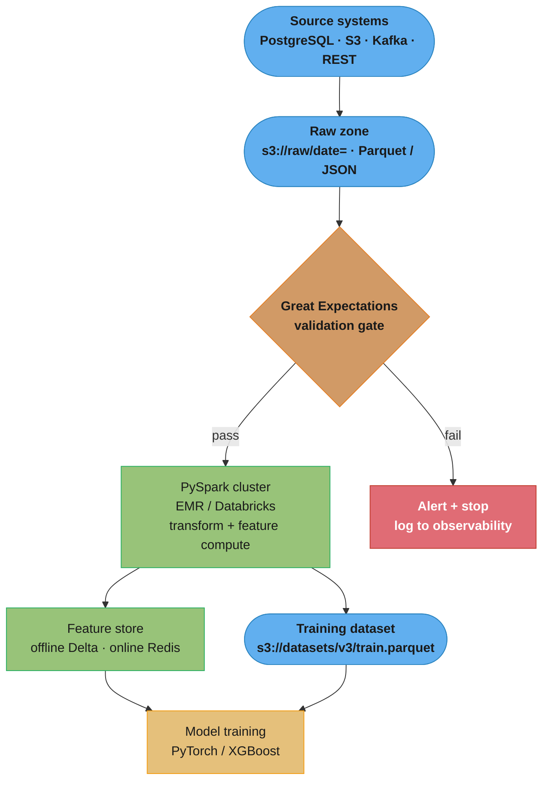
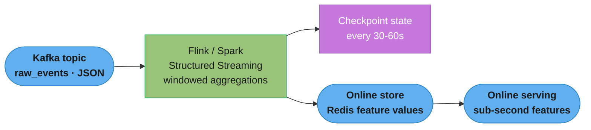
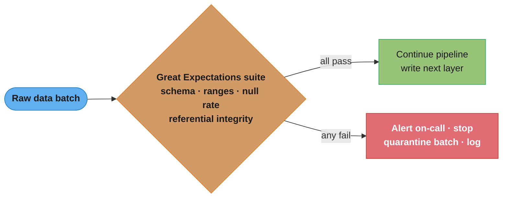
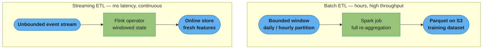

# Data Pipelines and Processing for ML

## 1. Concept Overview

A data pipeline for ML is the automated system that moves raw data from source systems through transformation steps into a form suitable for model training and serving. Unlike traditional ETL (Extract, Transform, Load) pipelines built for reporting, ML pipelines must produce reproducible, versioned, and statistically validated datasets — because model quality is directly bounded by data quality.

The three phases are:

- **Extract**: pull data from relational databases (PostgreSQL, MySQL), object storage (S3, GCS), event streams (Kafka), or REST APIs
- **Transform**: clean nulls, normalize distributions, compute features, join datasets, enforce schema
- **Load**: write to a feature store (Feast, Tecton), a training dataset (Parquet on S3), or a model-ready tensor format (TFRecord, Arrow)

ML pipelines add requirements not present in BI pipelines: point-in-time correctness (no future leakage), data versioning (DVC, Delta Lake), schema registries (Avro/Protobuf), and statistical validation gates (Great Expectations).

---

## 2. Intuition

One-line analogy: a data pipeline for ML is a factory assembly line where the finished product is a training dataset — every workstation (transformation step) must be auditable, reproducible, and measurable, because a single defective part poisons all downstream models.

Mental model: think of each pipeline stage as a pure function with a typed contract. Given the same inputs and code version, the output must be identical. Lazy evaluation (Spark) means the computation graph is built before any data moves — the optimizer can rearrange steps, which is why the API looks like SQL.

Why it matters: 80% of ML project time is data work. A pipeline that silently corrupts features (wrong join key, timezone drift, training/serving skew) will make a model that scores well in offline evaluation and fails in production — the worst class of failure because it is invisible at deployment time.

Key insight: the pipeline is not separate from the model — it IS part of the model. The feature computation logic deployed at serving time must be byte-for-byte identical to the logic used at training time. Any divergence is training/serving skew.

---

## 3. Core Principles

**Idempotency**: running the pipeline twice with the same inputs produces the same outputs. Achieved by writing to deterministic output paths (keyed by date partition + pipeline version) and using OVERWRITE semantics.

**Point-in-time correctness**: when building a training dataset for time-series or event data, every feature value for a sample must be the value that would have been available at prediction time — no future data. Implemented via temporal joins (AS OF joins in Feast/Tecton).

**Schema enforcement at ingress**: reject bad data at the source boundary rather than propagating it. Use schema registries (Confluent Schema Registry with Avro) or Great Expectations suites applied as the first pipeline stage.

**Separation of feature logic and pipeline orchestration**: feature computation (Python/PySpark functions) must live in a versioned library shared by both the training pipeline and the serving stack. The orchestrator (Airflow, Prefect) only wires together the DAG.

**Immutable intermediate artifacts**: never overwrite intermediate data in place. Write to versioned paths (s3://bucket/features/v3/2024-01-15/). This enables reruns, debugging, and rollback.

**Lineage tracking**: every output dataset records its inputs, code version, and parameters. DVC, Delta Lake, and commercial tools (Marquez, OpenLineage) provide this automatically.

---

## 4. Types / Architectures / Strategies

**Batch pipelines**: scheduled (daily, hourly), process a fixed time window, write Parquet to object storage, used for training datasets and batch inference. Tools: PySpark, dbt, Apache Beam.

**Streaming pipelines**: process events as they arrive (sub-second latency), used for real-time feature updates in online serving. Tools: Apache Kafka + Flink, Spark Structured Streaming, Apache Beam Dataflow.

**Lambda architecture**: batch layer (accurate, high-latency) + speed layer (approximate, low-latency) + serving layer merges both. Operationally complex — two codebases for the same logic.

**Kappa architecture**: streaming-only pipeline stores all raw events immutably; replay the stream to rebuild batch results. Simpler than Lambda but requires a distributed log (Kafka with long retention).

**Feature store architecture**: centralized system that separates feature computation from model training. Offline store (Parquet/Delta on S3) for training; online store (Redis, Cassandra) for low-latency serving. Feature definitions are versioned and shared across teams.

**Push vs Pull**:
- Push: upstream system writes to the pipeline queue (Kafka producer)
- Pull: pipeline polls sources on a schedule (Airflow DAG hitting a REST API)

**Data validation strategies**:
- Schema validation: column types, null constraints, value ranges
- Distribution validation: PSI (Population Stability Index) > 0.2 signals significant drift; KS test for continuous distributions
- Referential integrity: foreign keys resolve, no orphaned IDs
- Business rules: e.g., order_amount > 0, age between 0 and 130

---

## 5. Architecture Diagrams

### Batch training pipeline (source → validate → Spark → training)



The validation gate is the first stage after extraction so bad data fails fast, before the expensive Spark transform; the same feature-compute output fans out to both the feature store (serving) and the training dataset (offline), which is what keeps training and serving in sync.

### Streaming pipeline (online feature updates)



Events flow continuously into a stateful stream operator whose windowed aggregations land in a low-latency online store; the periodic checkpoint is what lets Flink/Spark recover state after a task failure without replaying the whole stream.

### Data-validation gate (pass → continue, fail → stop)



A single failing expectation halts the pipeline and pages on-call rather than letting corrupt data reach the feature store — this "shift data quality left" is why the gate sits before every write.

### Batch vs streaming ETL



Batch reprocesses a fixed window and can recompute the whole aggregate cheaply on spot instances; streaming maintains incremental state over an unbounded stream for freshness under a second — the split in latency vs cost is why most stacks run both (Lambda/Kappa).

### Spark stages: narrow vs wide transformations


Spark splits a job into stages at every shuffle boundary: narrow transformations stay inside a partition (Stage 1, cheap), while the wide `groupBy`/`join` forces a network exchange (Stage 2) — the shuffle is where skew, spill, and OOM originate, so tuning `spark.sql.shuffle.partitions` targets exactly this edge.

---

## 6. How It Works — Detailed Mechanics

### PySpark DataFrame Feature Computation

```python
from pyspark.sql import SparkSession, DataFrame
from pyspark.sql import functions as F
from pyspark.sql.types import StructType, StructField, StringType, DoubleType, LongType
from pyspark.sql.window import Window
from typing import Optional
import great_expectations as ge
from datetime import date

def create_spark_session(app_name: str, shuffle_partitions: int = 200) -> SparkSession:
    """
    Create a configured SparkSession.
    Default shuffle partitions is 200 in Spark 3 — tune based on data size.
    Rule of thumb: target 128-256 MB per partition.
    """
    return (
        SparkSession.builder
        .appName(app_name)
        .config("spark.sql.shuffle.partitions", str(shuffle_partitions))
        .config("spark.sql.adaptive.enabled", "true")          # AQE: Spark 3.0+
        .config("spark.sql.adaptive.coalescePartitions.enabled", "true")
        .config("spark.serializer", "org.apache.spark.serializer.KryoSerializer")
        .getOrCreate()
    )


def compute_user_features(
    spark: SparkSession,
    events_path: str,
    users_path: str,
    cutoff_date: date,
    lookback_days: int = 30,
) -> DataFrame:
    """
    Compute user-level features from raw event logs.
    Enforces point-in-time correctness: only use data before cutoff_date.
    """
    # Load with schema inference disabled — always specify schema explicitly
    events_schema = StructType([
        StructField("user_id", StringType(), nullable=False),
        StructField("event_type", StringType(), nullable=True),
        StructField("amount", DoubleType(), nullable=True),
        StructField("event_ts", LongType(), nullable=False),   # Unix epoch ms
    ])

    events = (
        spark.read
        .schema(events_schema)
        .parquet(events_path)
        # Point-in-time correctness: filter to lookback window
        .filter(F.col("event_ts") < F.lit(cutoff_date.strftime("%Y-%m-%d")).cast("timestamp").cast("long") * 1000)
        .filter(F.col("event_ts") >= F.lit(cutoff_date).cast("timestamp").cast("long") * 1000
                - lookback_days * 86400 * 1000)
    )

    # Narrow transformation: filter, select (no shuffle)
    purchase_events = events.filter(F.col("event_type") == "purchase")

    # Wide transformation: groupBy triggers shuffle across partitions
    user_purchase_features = purchase_events.groupBy("user_id").agg(
        F.count("*").alias("purchase_count_30d"),
        F.sum("amount").alias("total_spend_30d"),
        F.avg("amount").alias("avg_spend_30d"),
        F.max("amount").alias("max_spend_30d"),
        F.stddev("amount").alias("stddev_spend_30d"),
    )

    # Session features: window function (wide transformation)
    window_spec = Window.partitionBy("user_id").orderBy("event_ts")
    events_with_prev = events.withColumn(
        "prev_ts", F.lag("event_ts", 1).over(window_spec)
    ).withColumn(
        "session_gap_minutes",
        (F.col("event_ts") - F.col("prev_ts")) / (1000 * 60)
    )

    user_session_features = events_with_prev.groupBy("user_id").agg(
        F.avg("session_gap_minutes").alias("avg_session_gap_minutes"),
        F.count(F.when(F.col("session_gap_minutes") > 30, 1)).alias("session_count_30d"),
    )

    users = spark.read.parquet(users_path)

    # Join — ensure join key cardinality is understood; broadcast small tables
    features = (
        users
        .join(user_purchase_features, on="user_id", how="left")
        .join(user_session_features, on="user_id", how="left")
        .fillna(0.0, subset=["purchase_count_30d", "total_spend_30d", "avg_spend_30d"])
    )

    return features


def validate_with_great_expectations(df_pandas, suite_name: str) -> bool:
    """
    Run Great Expectations validation suite.
    Returns True if all expectations pass.
    """
    ge_df = ge.from_pandas(df_pandas)

    results = ge_df.validate(expectation_suite={
        "expectation_suite_name": suite_name,
        "expectations": [
            {
                "expectation_type": "expect_column_values_to_not_be_null",
                "kwargs": {"column": "user_id"}
            },
            {
                "expectation_type": "expect_column_values_to_be_between",
                "kwargs": {"column": "purchase_count_30d", "min_value": 0, "max_value": 10000}
            },
            {
                "expectation_type": "expect_column_values_to_be_between",
                "kwargs": {"column": "total_spend_30d", "min_value": 0.0}
            },
            {
                "expectation_type": "expect_column_proportion_of_unique_values_to_be_between",
                "kwargs": {"column": "user_id", "min_value": 0.99}  # near-unique
            },
        ]
    })

    success = results["success"]
    if not success:
        failed = [r for r in results["results"] if not r["success"]]
        print(f"Validation FAILED. {len(failed)} expectations violated:")
        for r in failed:
            print(f"  - {r['expectation_config']['expectation_type']}: {r['result']}")
    return success


def write_features_versioned(
    df: DataFrame,
    output_path: str,
    partition_cols: list[str] = ["date_partition"],
    mode: str = "overwrite",
) -> None:
    """
    Write features to versioned Parquet path.
    Always use OVERWRITE for idempotency — never APPEND to existing partitions.
    """
    (
        df.write
        .mode(mode)
        .partitionBy(*partition_cols)
        .parquet(output_path)
    )


# Schema evolution helper — backward-compatible check
def check_schema_compatibility(current_schema: StructType, new_schema: StructType) -> list[str]:
    """
    Returns list of BREAKING changes.
    Additive changes (new columns) are backward-compatible — not reported.
    Removing or renaming columns breaks downstream consumers.
    """
    current_fields = {f.name: f.dataType for f in current_schema.fields}
    new_fields = {f.name: f.dataType for f in new_schema.fields}

    breaking = []
    for name, dtype in current_fields.items():
        if name not in new_fields:
            breaking.append(f"REMOVED column '{name}' (type {dtype})")
        elif new_fields[name] != dtype:
            breaking.append(f"TYPE CHANGE column '{name}': {dtype} -> {new_fields[name]}")
    return breaking
```

### Decoding the throughput and data-volume budget

Sizing a pipeline is four divisions. The Section 14 case study states the inputs (500 GB/day of
clickstream, ~2 GB/min sustained on a 20-node cluster, "roughly 4 hours") without showing the
arithmetic that links them:

```
  job_minutes      = bytes_to_process / cluster_throughput
  arrival_rate     = bytes_per_day / 86,400
  headroom         = cluster_throughput / arrival_rate
  per_node_rate    = cluster_throughput / node_count
```

**Put simply.** "How long the job runs is just volume divided by speed; whether the pipeline is
viable at all is whether that speed beats the rate data is showing up."

Those are two different questions and interviewers ask the second one. A job that finishes in 4
hours is fine; a job that finishes in 26 hours on a daily schedule is a pipeline that falls
permanently behind, one day per day, until the backlog is unrecoverable.

| Symbol | What it is |
|--------|------------|
| `bytes_to_process` | The batch's input size. 500 GB for one daily partition here |
| `cluster_throughput` | Sustained end-to-end rate the cluster achieves, not peak read bandwidth. 2 GB/min measured |
| `86,400` | Seconds in a day. The only constant you need to turn "per day" into "per second" |
| `arrival_rate` | How fast new data lands. The floor the cluster must beat |
| `headroom` | Ratio of the two. `1.0` = exactly keeping up with zero margin; below `1.0` = falling behind forever |
| `per_node_rate` | Throughput divided by node count. What you multiply when you scale out |

**Walk one example.** The case study's own numbers, end to end:

```
  bytes_to_process   = 500 GB/day
  cluster_throughput = 2 GB/min   on 20 nodes

  job_minutes   = 500 / 2            = 250 min  = 4.17 hours     <- the "roughly 4 hours"
  duty cycle    = 4.17 / 24          = 17.4% of the day busy

  Now in absolute rates, to compare against arrival:
  cluster       = 2 GB/min           = 2 x 1024 / 60      = 34.13 MB/s
  arrival       = 500 GB/day         = 500 x 1024 / 86400 =  5.93 MB/s
  headroom      = 34.13 / 5.93       = 5.76x

  per_node_rate = 2 / 20 = 0.10 GB/min/node = 1.71 MB/s per node
```

Read the `5.76x` as the actual safety margin. It says the cluster could absorb a 5.7x traffic spike,
or survive a 4-hour outage and still catch up within the same day. It also sizes the recovery
question directly: at 34.13 MB/s a 3-day backlog of 1,500 GB takes `1500 / 2 = 750 min = 12.5 hours`
to drain, which fits inside one day's 17.4% duty cycle with room to spare. Halve the cluster to 10
nodes and headroom drops to 2.88x with a job time of 8.3 hours -- still viable; quarter it to 5
nodes and the job takes 16.7 hours at 1.44x headroom, which is the point where a single bad day
cascades.

The `per_node_rate` is the number to scale with, and it is the one people skip. At 1.71 MB/s per
node, hitting a 10 GB/min target needs `10 / 0.10 = 100 nodes` -- assuming the rate stays linear,
which it does only for the narrow (shuffle-free) part of the job. The shuffle does not scale
linearly, which is what the next two decoders are about.

Volume estimation runs the same divisions backwards, from an event count. Section 7's Spotify figure
of ~600 billion events/day, at an assumed 200 bytes per serialized event:

```
  events/sec  = 600e9 / 86,400        = 6,944,444 events/s     (~6.9M/s)
  bytes/day   = 600e9 x 200 bytes     = 120 TB/day  (109.1 TiB)
  at 34 MB/s  = 120e12 / 34.13e6      = 3.5e6 s = 40.7 days     <- one cluster cannot
```

That last line is the point of doing the estimate at all: it converts "600 billion events" from an
impressive number into a hard verdict that the 20-node shape above is off by roughly two orders of
magnitude, before anyone provisions anything.

### Decoding the shuffle partition count

Pitfall 3 below gives the sizing rule as a bare expression:

```
  shuffle_partitions = (input_size_gb * 1024) / 128
```

**What the formula is telling you.** "Convert the dataset to megabytes, then ask how many 128 MB
chunks it takes -- because 128 MB is the amount of data one Spark task should hold at once."

| Symbol | What it is |
|--------|------------|
| `input_size_gb` | Size of the data crossing the shuffle, in GB — not the raw source size if you filtered first |
| `1024` | GB to MB. Purely a unit conversion |
| `128` | Target MB per partition. The 128-256 MB rule of thumb from `create_spark_session` above |
| result | Number of post-shuffle partitions, i.e. the number of tasks in the next stage |
| `spark.sql.shuffle.partitions` | The knob this sets. Default `200`, which is a constant unrelated to your data |

**Walk one example.** The default versus the rule, at two scales:

```
  dataset    default 200 partitions        rule: (GB x 1024) / 128        per partition
  500 GB     500 / 200   = 2.5 GB each     (500 x 1024)/128   = 4,000       128 MB
  5 TB       5120 / 200  = 25.6 GB each    (5120 x 1024)/128  = 40,960      128 MB

  The default does not scale. It is a fixed 200 regardless of input, so
  "MB per task" is whatever your data happens to make it -- 2.5 GB at 500 GB,
  25.6 GB at 5 TB, both far past the 128-256 MB a task should carry.
```

The reason 128 MB is the target and not "as big as fits" is that partition size sets three things at
once: task memory (a 25.6 GB partition cannot fit an executor heap, so it spills to disk or OOMs --
exactly Pitfall 3's failure), scheduling granularity (fewer, longer tasks mean a straggler cannot be
re-balanced, and a lost task re-does hours of work), and output file size (one task usually writes
one file, so partition count is also file count).

That last coupling is why the rule cuts both ways and why the small-files problem exists. Over-shoot
the partition count and you get the mirror-image failure:

```
  500 GB with 4,000 partitions   -> 128 MB per output file      healthy
  500 GB with 200,000 partitions -> 2.6 MB per output file      small-files problem
  10 GB  with the default 200    -> 51 MB per output file       acceptable
  10 GB  with 4,000 partitions   -> 2.6 MB per output file      small-files problem

  Each file costs a metadata listing call and a task on every downstream read.
```

AQE (`spark.sql.adaptive.coalescePartitions.enabled`, set in `create_spark_session` above) exists
precisely to repair the over-shoot direction at runtime: it starts with a deliberately high
partition count and merges the small ones after it has measured the actual shuffle output. It cannot
repair the under-shoot direction as well, which is why the explicit setting is still best practice.

### Decoding skew and shuffle cost: what a bad partition key costs

The partition-count rule assumes rows spread evenly across keys. They never do. `gold_user_features`
in Section 14 salts the key for exactly this reason, and the arithmetic behind that choice is:

```
  ideal_bytes_per_partition = total_shuffle_bytes / partition_count
  hot_key_bytes             = total_shuffle_bytes * hot_key_share
  skew_ratio                = hot_key_bytes / ideal_bytes_per_partition
  stage_wall_clock          = time of the SLOWEST task, not the average
```

**What it means.** "A shuffle stage is only as fast as its single fattest partition, and the
partition key alone decides how fat that is."

The last line is the whole lesson. Spark parallelism is bounded below by the largest key, because a
single key's rows cannot be split across two reducers -- hashing sends them all to one place. Adding
nodes does not help; the fat task is still one task on one core.

| Symbol | What it is |
|--------|------------|
| `total_shuffle_bytes` | Bytes crossing the network at this shuffle boundary |
| `partition_count` | Post-shuffle partitions, i.e. `spark.sql.shuffle.partitions` from the rule above |
| `hot_key_share` | Fraction of all rows carried by the single most frequent key value |
| `skew_ratio` | How many times bigger the hot partition is than a healthy one. `1.0` = perfectly even |
| `salt_buckets` | How many sub-keys a hot key is split into (`salt_buckets = 50` in the code above) |

**Walk one example.** 500 GB shuffled, correctly sized at 4,000 partitions, grouped by a key where
one value (`country = 'US'`) holds 80% of rows. Assume a healthy 128 MB task takes 3 s:

```
  total_shuffle_bytes = 500 GB = 512,000 MB      partition_count = 4,000
  ideal per partition = 512,000 / 4,000                     = 128.0 MB   (3 s)

  hot key 'US' at 80% = 512,000 x 0.80 = 409,600 MB = 400 GB  -> ONE partition
  the other 20%       = 102,400 MB spread over 3,999          = 25.6 MB each

  skew_ratio  = 409,600 / 25.6                              = 16,000x

  hot task    = 409,600 / 128 x 3 s = 9,600 s               = 2.67 hours
  all 4,000 tasks of work = 4,000 x 3 s = 12,000 task-s
  on 20 nodes x 8 cores = 160 slots  ->  12,000 / 160       = 75 s if even

  stage wall clock = 9,600 s (the one fat task), not 75 s.
  Cost of the bad partition key: 128x slower, on the same hardware.
```

The `128x` is the answer to "what does a bad partition key cost", and note what it is *not*: it is
not a memory error, not a crash, not anything that appears in a log as a failure. The job succeeds.
It just takes 2.67 hours instead of 75 seconds, and 3,999 of your 4,000 tasks finish in the first
minute and then sit idle. The symptom is a Spark UI stage stuck at "3,999/4,000 completed" -- which
is the single most recognizable skew signature there is.

**What salting buys, in numbers.** Splitting the hot key across `salt_buckets` sub-keys divides its
bytes by that factor, then a second aggregation re-combines them:

```
  salt_buckets = 50  (the default in gold_user_features above)

    hot key per sub-key = 409,600 / 50 = 8,192 MB = 8 GB
    hot task            = 8,192 / 128 x 3 s = 192 s = 3.2 min
    speedup             = 9,600 / 192 = 50x        (exactly salt_buckets)

  Speedup equals salt_buckets, so pick it from the target, not by habit:
    buckets needed to reach 128 MB = 409,600 / 128 = 3,200

  50 buckets: 2.67 h -> 3.2 min.  Good enough for most jobs.
  3,200 buckets: fully even, but adds 3,200 partial rows per hot key
                 to the second aggregation. Diminishing returns past ~a few hundred.
```

Salting is not free -- it turns one shuffle into two -- which is why it is a targeted fix for known
hot keys rather than a default. The cheaper fix, when one side of a join is small, is to avoid the
shuffle entirely:

```
  500 GB fact table joined to a 10 MB dimension table

  shuffle join   : both sides re-partitioned by key across the network
                   bytes moved ~ 500 GB + 10 MB    ~ 500 GB
  broadcast join : dimension copied once to each executor, fact stays put
                   bytes moved = 10 MB x 20 nodes  = 200 MB

  ratio = 512,000 MB / 200 MB = 2,560x less network traffic
```

That 2,560x is why `spark.sql.autoBroadcastJoinThreshold` (default 10 MB) is the first thing to
check on a slow join, and why the broadcast side must stay under ~100 MB: the driver collects it
first, then every one of the 20 executors holds a full copy, so the memory cost is
`table_size x (1 + node_count)` -- 200 MB total at 10 MB, but 2.1 GB at 100 MB and 21 GB at 1 GB.

---

## 7. Real-World Examples

**Spotify**: processes ~600 billion events/day through Apache Beam pipelines on Google Dataflow. Features for music recommendation (skip rate, play duration, playlist additions) computed in hourly batch jobs. Feature store (Feathr) ensures training/serving consistency.

**Uber**: Michelangelo platform. Offline feature computation on Spark (HDFS), online feature serving from Cassandra. Over 10,000 features maintained across teams. Temporal joins prevent future leakage in trip demand forecasting.

**Airbnb**: Zipline feature store. Search ranking model requires 200+ features computed from host/listing/guest interaction history. Strict schema registry (Thrift) enforced at every pipeline stage — a schema change requires a migration PR reviewed by the data platform team.

**Netflix**: "Meson" pipeline orchestration. Video quality prediction requires frame-level encoding features joined with CDN delivery metrics — two disparate source systems. Point-in-time joins ensure the training dataset reflects what Netflix knew at the time of stream start, not what happened during the stream.

---

## 8. Tradeoffs

| Approach | Latency | Throughput | Complexity | Cost | Best For |
|---|---|---|---|---|---|
| Batch (Spark/EMR) | Hours | Very high | Medium | Low (spot instances) | Training datasets, daily features |
| Streaming (Flink) | Milliseconds | High | High | Medium-High | Real-time recommendation features |
| Lambda (Batch + Stream) | Mixed | Very high | Very high | High | When both latency requirements exist |
| Kappa (Stream only) | Milliseconds | High | Medium | Medium | Unified codebase preferred |
| dbt (SQL transforms) | Minutes | Medium | Low | Low | Structured warehouse data |

| Validation Tool | Ease | Power | Integration |
|---|---|---|---|
| Great Expectations | Medium | High | Airflow, dbt, Spark |
| Pandera | Easy | Medium | Pandas, Spark |
| TFX Data Validation | Hard | Very high | TensorFlow ecosystem |
| Custom SQL assertions | Easy | Low | Any warehouse |

---

## 9. When to Use / When NOT to Use

**Use batch pipelines when**:
- Training data is refreshed daily or weekly
- Dataset fits in cluster memory at scale (Spark can handle TB range)
- Cost matters — spot/preemptible instances for batch jobs cut costs 60-80%
- Reproducibility is critical (reruns must be possible months later)

**Use streaming pipelines when**:
- Online serving requires features fresher than 1 hour
- Event volumes are high but individual processing is cheap (click/view events)
- You need to react to data in real time (fraud detection, live recommendations)

**Do NOT use streaming when**:
- Feature logic requires global aggregations over large time windows — streaming windows are bounded; full history requires batch
- Team lacks expertise — streaming systems (Flink, Kafka) have steep operational overhead
- Data volume is low — a cron job with pandas is simpler and cheaper

**Do NOT use Spark when**:
- Dataset fits in a single machine (< 50 GB) — Spark overhead is not worth it
- You need sub-minute iteration cycles — Spark startup time (JVM, cluster allocation) is 2-5 minutes

---

## 10. Common Pitfalls

**Pitfall 1 — Training/serving skew (the silent killer)**
Production incident: a team computed a "days since last purchase" feature in the training pipeline using Python datetime with the server's local timezone (EST). The serving stack was in UTC. During winter, the skew was 5 hours; during daylight saving, 4 hours. The feature values diverged by 0-1 days, degrading model AUC by 3%. Discovered only after 6 weeks when A/B test results were statistically below baseline. Fix: always use UTC timestamps everywhere; store feature logic as versioned shared library used by both training and serving.

**Pitfall 2 — Data leakage via improper temporal joins**
A churn prediction model joined user features computed using the entire history up to TODAY, then filtered training samples to last year. The label (churned next month) was in the past but the features included events from after the label date. Model had 0.91 AUC in validation but 0.64 AUC in production. Fix: implement point-in-time joins — for each training sample at time T, join only features computed from data available before T.

**Pitfall 3 — Spark shuffle partition default (200) causing skew**
Default `spark.sql.shuffle.partitions=200` is fine for small datasets but catastrophic for large ones. A 5 TB dataset with 200 partitions gives 25 GB per partition — each task runs for hours, causing executor OOM. Fix: set shuffle partitions to `(input_size_gb * 1024) / 128` (target 128 MB per partition). With Spark 3 AQE enabled, this is partially auto-tuned, but explicit configuration is still best practice.

**Pitfall 4 — Schema evolution breaking downstream consumers**
Team renamed column `user_revenue` to `user_total_revenue` in a Parquet dataset. Downstream training jobs failed at runtime (Spark reads old column name, returns null). Fix: use Avro or Protobuf with a schema registry (Confluent) that enforces backward compatibility rules. Additive changes (new columns) are allowed; deletions and renames require explicit migration.

**Pitfall 5 — Null handling inconsistency**
Training pipeline uses `.fillna(0)` for missing purchase features. Serving pipeline returns `None` when the user has no purchase history (different code path). Model learned that 0 means "new user" but at serving time receives None — feature value treated as 0 or NaN depending on the serving framework. Fix: encode missing as a sentinel value (-1 for "no history") consistently, or use a dedicated `has_purchase_history` boolean feature.

---

## 11. Technologies & Tools

| Tool | Category | Use Case |
|---|---|---|
| Apache Spark (PySpark) | Distributed compute | Large-scale batch feature computation |
| Apache Flink | Stream processing | Real-time feature computation |
| Apache Kafka | Message queue | Event streaming source |
| Apache Beam | Unified batch/stream | Portable pipelines (runs on Flink, Dataflow, Spark) |
| dbt | SQL transforms | Warehouse-based feature computation |
| Great Expectations | Data validation | Expectation suites, data docs |
| Pandera | Schema validation | Pandas/Spark DataFrame schema enforcement |
| DVC | Data versioning | Git for datasets, reproducible pipelines |
| Delta Lake | Storage format | ACID transactions on Parquet, schema enforcement |
| Feast | Feature store | Offline + online feature serving, point-in-time joins |
| Tecton | Feature store (managed) | Enterprise managed feature platform |
| Apache Airflow | Orchestration | DAG scheduling, dependency management |
| Prefect | Orchestration | Python-native DAGs, better error handling than Airflow |
| AWS EMR | Managed Spark | Spot instance Spark clusters |
| Databricks | Managed Spark | Unified analytics + ML platform |
| OpenLineage | Lineage | Vendor-neutral data lineage standard |

---

## 12. Interview Questions with Answers

**Q: What is training/serving skew and how do you prevent it?**
Training/serving skew occurs when the feature values computed during training differ from those computed at serving time, due to different code, data sources, or time references. It is the most common silent failure mode in production ML. Prevention requires: (1) a shared feature computation library used identically in both offline training and online serving, (2) logging serving-time feature values and comparing distributions to training data distributions, (3) shadow-mode validation where the serving pipeline's features are compared to the training pipeline's features on the same inputs.

**Q: What is point-in-time correctness and why does it matter?**
Point-in-time correctness means that for each training sample at time T, only feature values computed from data available before T are used. It matters because violating it causes data leakage — the model implicitly uses future information during training, producing overoptimistic offline metrics that collapse in production. Feature stores like Feast implement this via AS-OF joins: given a list of (entity_id, timestamp) pairs, fetch the feature values that were valid at each timestamp.

**Q: How does PySpark's lazy evaluation work and why does it matter for ML pipelines?**
PySpark builds a logical computation plan (DAG of transformations) without executing any data movement. Execution only happens when an action is called (.collect(), .write(), .count()). This matters because Spark's Catalyst optimizer can reorder, push down, and combine operations before execution — a filter applied after a join may be pushed before the join to reduce data shuffled. For ML pipelines, this means you can chain many transformation steps without paying per-step overhead; the optimizer produces an efficient physical plan automatically.

**Q: What is the difference between narrow and wide transformations in Spark?**
Narrow transformations (map, filter, select, flatMap) process each partition independently with no data movement between partitions. Wide transformations (groupBy, join, distinct, repartition) require a shuffle — data is exchanged between executors across the network. Wide transformations are expensive: they involve serialization, network I/O, and disk spill if memory is insufficient. ML pipelines should minimize wide transformations, broadcast small lookup tables (< 100 MB) to avoid shuffle joins, and ensure the largest table drives the join order.

**Q: How does DVC enable reproducibility in ML data pipelines?**
DVC tracks dataset files using content-addressable hashes stored in git (a .dvc file), while the actual data lives in a remote storage backend (S3, GCS). Running `dvc repro` executes a DAG of pipeline stages defined in dvc.yaml, skipping stages whose inputs/outputs have not changed (hash-based caching). This means: given a git commit, you can deterministically reproduce the exact dataset and model by running `git checkout <sha> && dvc pull && dvc repro`. Code version + data version + pipeline definition = fully reproducible experiment.

**Q: What is PSI (Population Stability Index) and when should you use it?**
PSI measures how much a feature's distribution has shifted between a reference period (training data) and a current period (serving data). Computed as `sum((actual% - expected%) * ln(actual% / expected%))` over buckets of the feature range. Rules of thumb: PSI < 0.1 = no significant shift; 0.1-0.2 = moderate shift worth monitoring; > 0.2 = significant shift requiring investigation or model retraining. Use PSI to detect training/serving distribution drift before it degrades model performance — it catches shifts that accuracy metrics miss when labels are delayed.

**Q: How should you handle schema evolution in ML data pipelines?**
Use a schema registry (Confluent Schema Registry with Avro, or Protobuf) that enforces compatibility rules at write time. Backward-compatible changes (adding optional fields with defaults) are allowed. Breaking changes (removing fields, renaming, changing types) require: (1) a new schema version, (2) a migration pipeline that backfills historical data, (3) versioned output paths so old consumers continue working. Never overwrite existing schema-versioned data in place. For Parquet-based pipelines, Delta Lake provides schema enforcement and schema evolution primitives (ALTER TABLE ADD COLUMN).

**Q: What causes data pipeline OOM on Spark and how do you fix it?**
Common causes: (1) cartesian product joins (missing join condition — use .join(df2, on=key, how=...) always), (2) collect() on large DataFrames to driver, (3) shuffle partitions too large (default 200 with terabyte data = 5 GB per partition), (4) UDFs that hold large objects in closure, (5) skewed data where one partition has 100x more rows than others. Fixes: increase executor memory, tune shuffle partitions, use salting for skewed joins, replace collect() with write(), replace UDFs with built-in Spark functions where possible (native functions avoid Python serialization overhead).

**Q: What is a feature store and what problems does it solve?**
A feature store is a centralized system for storing, versioning, and serving ML features. It solves: (1) feature duplication — multiple teams compute the same feature independently with subtle differences; (2) training/serving skew — offline store (Parquet/Delta) for training, online store (Redis/Cassandra) for low-latency serving, both populated by the same computation logic; (3) point-in-time correctness for training dataset generation; (4) feature discoverability — catalog of available features with owners and statistics. Feast (open-source), Tecton (managed), and SageMaker Feature Store are common options.

**Q: How do you validate data quality before training a model?**
A multi-layer approach: (1) schema validation — column names, types, null constraints enforced at ingress; (2) statistical validation — null rate < threshold, value range checks, cardinality sanity checks using Great Expectations or Pandera; (3) distribution validation — PSI < 0.2 compared to reference dataset, KS test for continuous features; (4) business rule validation — domain-specific assertions (order amount > 0, age < 130); (5) referential integrity — all foreign keys resolve. Validation failures should halt the pipeline and alert the on-call engineer — never silently propagate bad data to training.

**Q: What is the difference between Avro and Parquet, and when do you use each?**
Avro is a row-oriented binary format with a JSON schema embedded in the file header — ideal for write-heavy streaming pipelines (Kafka messages, event logs) because appending rows is efficient and schema is self-describing. Parquet is a column-oriented binary format — ideal for read-heavy analytical workloads where queries filter and aggregate specific columns (ML feature computation reads "user_id" and "purchase_amount" but not all 50 columns). For ML pipelines: use Avro for Kafka topics and event ingestion; use Parquet (or Delta Lake) for feature datasets and training data.

**Q: When should you use a batch pipeline versus a streaming pipeline?**
Use batch when features can be refreshed on a schedule and cost matters; use streaming only when online serving needs features fresher than about an hour. Batch processes a bounded window, runs on cheap spot/preemptible instances (60-80% cost savings), and is trivially reproducible — the default for training datasets and daily features. Streaming pays a steep operational and cost premium (Flink/Kafka clusters run 24/7, steep expertise curve) that is only justified by real-time reactions: fraud scoring, live recommendations, or session features that decay in minutes. The trap is reaching for streaming by default — if data volume is low or windows span the full history, a cron job with pandas or a nightly Spark batch is simpler, cheaper, and easier to debug.

**Q: What is the difference between Lambda and Kappa architectures?**
Lambda runs a batch layer and a speed layer in parallel and merges them at serving time; Kappa is streaming-only and replays the immutable log to rebuild historical results. Lambda gives you an accurate but high-latency batch view plus an approximate low-latency streaming view, at the cost of maintaining the same feature logic in two codebases — a notorious source of training/serving skew when the two drift apart. Kappa collapses this to one codebase by treating everything as a stream and reprocessing from a long-retention Kafka log when logic changes, trading the operational simplicity of one code path for the requirement of a durable, replayable event store. Choose Kappa when a single codebase matters more than squeezing out the last bit of batch accuracy.

**Q: What is idempotency in a data pipeline and how do you guarantee it?**
Idempotency means re-running the pipeline on the same input produces the same output, guaranteed by deterministic output paths plus overwrite (not append) semantics. Write to a path keyed by date partition and pipeline version (`s3://features/v3/2024-01-15/`) and use `mode("overwrite")` so a retried batch replaces rather than duplicates data. The classic violation is `mode("append")` on a partition: a re-run after a mid-job failure double-counts every row, silently inflating every downstream aggregate. Deduplicating on a natural key (event_id) early in the pipeline reinforces idempotency because upstream at-least-once delivery otherwise leaks duplicates into the output.

**Q: What is a broadcast join and when does Spark use it?**
A broadcast join ships a small table to every executor so the large table never shuffles, eliminating the network exchange a normal (shuffle) join requires. Spark auto-broadcasts a side smaller than `spark.sql.autoBroadcastJoinThreshold` (default 10 MB), or you force it with `F.broadcast(small_df)`. It is the single most effective fix for a slow join against a lookup/dimension table — the big fact table stays partitioned in place and each executor joins locally against its in-memory copy of the small table. The failure mode is broadcasting a table that is actually large: it OOMs the driver (which collects it first) and every executor (which holds a full copy), so only broadcast tables comfortably under ~100 MB.

**Q: What is the small-files problem in Spark and how do you fix it?**
The small-files problem is thousands of tiny output files that overwhelm the driver and schedulers with metadata and make every downstream read slow. It happens when a job writes one file per task with high parallelism — e.g., 2,000 shuffle partitions each emitting a few KB. Each file costs a listing call and a task, so reads spend more time on metadata than data, and object stores like S3 throttle on request volume. Fix by coalescing before write (`df.coalesce(n)` or `repartition(n)` targeting 128-256 MB per file), enabling Spark 3 AQE to auto-coalesce small shuffle partitions, or running a periodic compaction job (Delta Lake `OPTIMIZE`) that rewrites small files into large ones.

**Q: How do you handle late-arriving data in a streaming pipeline?**
Use event-time windows with a watermark that defines how long to wait for late events before finalizing a window and dropping later stragglers. Processing time is unreliable — a mobile client may buffer events offline and deliver them hours late — so aggregations must key on the event's own timestamp, not arrival time. The watermark (e.g., "allow lateness up to 10 minutes") bounds how long state is retained: events within the watermark update their window; events past it are dropped or routed to a side output for reconciliation. Set the watermark too tight and you silently lose valid late data; too loose and streaming state grows unbounded.

**Q: What is data lineage and why does it matter for ML pipelines?**
Data lineage records the inputs, code version, and parameters that produced each dataset, so any feature or model can be traced back to its exact source. When a model degrades, lineage lets you answer "which upstream table changed and when" instead of guessing — the difference between a one-hour and a one-week investigation. It is also a compliance requirement in regulated domains (you must prove what data trained a decisioning model) and the foundation of reproducibility: git SHA plus data hash plus pipeline definition pins an experiment exactly. Tools like OpenLineage, Marquez, DVC, and Delta Lake capture lineage automatically rather than relying on tribal knowledge.

**Q: What is the difference between at-least-once and exactly-once processing?**
At-least-once may reprocess an event on failure and risk duplicates; exactly-once guarantees each event affects the result once, via idempotent writes or transactional checkpoints. Pure at-least-once (the default for many Kafka consumers) is cheap but requires downstream dedup to avoid double-counting. Exactly-once is achieved not by magic but by combining a replayable source, atomic checkpointed state (Flink's barrier snapshots), and transactional or idempotent sinks so a replay overwrites rather than appends. For ML features, at-least-once plus idempotent (overwrite) sinks usually delivers effectively-once results at far lower cost than strict end-to-end exactly-once.

---

## 13. Best Practices

- Always specify DataFrame schemas explicitly — never rely on Spark schema inference in production (inference reads the data, is slow, and may guess wrong types)
- Set `spark.sql.adaptive.enabled=true` (AQE, Spark 3.0+) to let the optimizer dynamically coalesce small shuffle partitions and fix skewed joins at runtime
- Use `broadcast()` hint for lookup tables under 100 MB to eliminate shuffle joins entirely
- Write intermediate results as versioned Parquet partitions — never overwrite; use `mode("overwrite")` with deterministic output paths keyed by date + pipeline version
- Apply Great Expectations validation as the first stage after data extraction — fail fast on bad data before expensive transformations
- Store all pipeline parameters in a versioned config file (YAML) committed alongside the code — never hardcode thresholds or paths
- Use column pruning aggressively: select only columns needed for downstream steps; Parquet's column-oriented storage makes this free
- Cache DataFrames that are used in multiple downstream joins: `df.cache()` after an expensive aggregation if the result is consumed more than once
- Monitor pipeline SLAs with data freshness alerts: if the feature dataset for date D is not available by H+2 hours, page on-call
- For streaming pipelines, set checkpointing intervals (every 30-60 seconds) to enable recovery from Flink/Spark task failures without data loss or duplication

---

## 14. Case Study

**Scenario: A medallion (Bronze/Silver/Gold) PySpark pipeline for clickstream.** A product analytics team ingests 500GB/day of raw clickstream JSON. The pipeline lands raw events (Bronze), cleans and deduplicates (Silver), then aggregates into ML-ready features (Gold). Great Expectations validates each layer; DVC versions the curated datasets. On a 20-node Spark cluster the pipeline sustains ~2GB/min, finishing the daily batch in roughly 4 hours.

```
S3 raw JSON (500GB/day)
        |
   BRONZE  (raw, append-only, partitioned by ingest_date)
        |  schema-on-read, no transformation
        v
   SILVER  (cleaned, deduplicated, typed Parquet)
        |  drop malformed, dedupe by event_id, cast types
        |  Great Expectations gate: not-null keys, value ranges
        v
   GOLD    (aggregated session/user features)
        |  group-by user/session, window aggregations
        v
   Feature store / warehouse  (consumed by training)

DVC tracks Gold dataset hash per run; lineage = git SHA + data hash
```

Throughput 2GB/min on 20 nodes; Silver dedupe removes ~3% duplicate events; Great Expectations catches schema regressions before they reach Gold. Schema evolution (adding a column to 2TB of historical Parquet) is handled without a full rewrite via `mergeSchema`.

**Bronze to Silver with deduplication and validation:**

```python
from pyspark.sql import DataFrame, SparkSession
from pyspark.sql import functions as F

def bronze_to_silver(spark: SparkSession, bronze_path: str,
                     silver_path: str) -> None:
    raw = spark.read.json(bronze_path)
    cleaned = (
        raw
        .filter(F.col("event_id").isNotNull() & F.col("user_id").isNotNull())
        .withColumn("event_ts", F.to_timestamp("event_ts"))
        .dropDuplicates(["event_id"])          # idempotent re-runs
    )
    (cleaned.write
        .mode("overwrite")
        .partitionBy("ingest_date")
        .parquet(silver_path))
```

**Great Expectations gate between layers:**

```python
import great_expectations as gx

def validate_silver(df) -> bool:
    ctx = gx.get_context()
    validator = ctx.sources.add_spark("spark").add_dataframe_asset(
        "silver", dataframe=df
    ).build_batch_request()
    v = ctx.get_validator(batch_request=validator)
    v.expect_column_values_to_not_be_null("user_id")
    v.expect_column_values_to_be_between("session_duration_s", 0, 86_400)
    v.expect_column_values_to_be_unique("event_id")
    result = v.validate()
    return bool(result.success)   # fail the job if False; do not write Gold
```

**Skew-aware Gold aggregation with salting:**

```python
from pyspark.sql import DataFrame
from pyspark.sql import functions as F

def gold_user_features(silver: DataFrame, salt_buckets: int = 50) -> DataFrame:
    # salt the hot keys so a few power users do not overload one partition
    salted = silver.withColumn(
        "salt", (F.rand() * salt_buckets).cast("int")
    )
    partial = salted.groupBy("user_id", "salt").agg(
        F.count("*").alias("events"),
        F.sum("revenue").alias("revenue"),
    )
    return partial.groupBy("user_id").agg(
        F.sum("events").alias("events_total"),
        F.sum("revenue").alias("revenue_total"),
    )
```

**Pitfall 1 — Data skew on a wide transformation.** Grouping by user_id where 0.1% of users generate 80% of events sends those keys to a single overloaded executor; the stage hangs on one straggler task.

```python
# BROKEN: a few hot keys -> one task processes 80% of the data, OOM/straggler
df.groupBy("user_id").agg(F.sum("revenue"))

# FIX: salt the key into N buckets, aggregate twice (partial then final),
# spreading hot keys across executors (see gold_user_features above).
```

**Pitfall 2 — Collecting a large DataFrame to the driver.** Calling `.collect()` on a multi-GB result pulls everything into driver memory and OOMs the driver.

```python
# BROKEN: pulls the entire result into the driver JVM heap -> OOM
rows = gold_df.collect()
write_somewhere(rows)

# FIX: write distributed from the executors; never materialize on the driver.
gold_df.write.mode("overwrite").parquet("s3://.../gold/")
```

**Pitfall 3 — Schema evolution breaking downstream readers.** A new column is added to today's partition; readers that infer schema from an old partition fail or silently drop the column.

```python
# BROKEN: default read infers schema from one file; new column is lost/errors
spark.read.parquet("s3://.../gold/")

# FIX: mergeSchema reconciles old and new partitions; enforce backward-compatible
# changes (add nullable columns only, never rename/retype in place).
spark.read.option("mergeSchema", "true").parquet("s3://.../gold/")
```

**Interview Q&A:**

**Why use the medallion (Bronze/Silver/Gold) architecture?** It separates concerns and enables replay. Bronze is an immutable raw landing zone so you can reprocess if a downstream bug is found; Silver is the single cleaned source of truth; Gold is purpose-built aggregates. If a transformation bug ships, you fix the code and rebuild Silver/Gold from Bronze without re-ingesting from source.

**What causes data skew in Spark and how do you fix it?** Skew arises when a shuffle key has a few extremely frequent values, so one partition gets most rows. Symptoms are one task running far longer than the rest. Fixes include salting the key, broadcast joins for small dimension tables, `repartition` on a balanced key, and adaptive query execution (AQE) skew-join handling.

**Why is dedupe by event_id important and where is it placed?** Upstream at-least-once delivery means duplicate events. Deduping in Silver makes the pipeline idempotent: re-running a failed batch produces the same Silver output, so downstream aggregates are not double-counted. Placing it early prevents duplicates from inflating every Gold metric.

**How do you version data alongside code for reproducibility?** DVC stores a content hash of the Gold dataset and the pointer is committed to git, so each experiment pins both the code (git SHA) and the exact data (DVC hash). Reproducing a model means checking out the SHA and `dvc pull`, which retrieves the identical dataset version from remote storage.

**Why prefer narrow over wide transformations when possible?** Narrow transformations (map, filter) require no shuffle and stay within a partition, so they are cheap and parallelize cleanly. Wide transformations (groupBy, join, distinct) trigger a shuffle that moves data across the network and is the main source of skew, spill, and slowdowns. Minimizing and tuning shuffles is the core of Spark performance work.

**How do you safely evolve a schema over 2TB of historical Parquet?** Only make backward-compatible changes, add nullable columns, never rename or retype in place. Use `mergeSchema` on read so old and new partitions reconcile, and version the schema. For breaking changes, write a new dataset version and migrate readers deliberately rather than mutating history.

**Pitfall — Schema evolution in Parquet breaks downstream readers silently.**

```python
# BROKEN: Spark job adds a new column "user_tier" to the feature table
# Downstream training job reads with schema from 3 months ago → missing column
# pandas read_parquet returns None for "user_tier" without raising an error
import pandas as pd

# Writer adds column:
df["user_tier"] = compute_user_tier(df)
df.to_parquet("features/2024-10-01.parquet")

# Reader (old code):
df = pd.read_parquet("features/")   # merges all files
# "user_tier" is None/NaN for all rows before 2024-10-01 → model trains on NaN

# FIX: use Delta Lake or Iceberg with schema evolution tracking
# Delta Lake enforces schema compatibility on write:
from delta.tables import DeltaTable
DeltaTable.forPath(spark, "features/").toDF()  # schema is versioned
# New column: use ALTER TABLE ADD COLUMN with a default value
spark.sql("ALTER TABLE features ADD COLUMNS (user_tier STRING DEFAULT 'standard')")
# All historical rows get the default → no NaN pollution
```

**How does Apache Spark handle data skew in joins, and what is the remedy?** Data skew occurs when a small number of partition keys hold a disproportionate fraction of data — e.g., 80% of records have `country='US'`. The `US` partition task takes 100× longer than others, stalling the job. Remedy: (1) salting — append a random suffix to the skewed key before join, broadcast the small table with the suffix expanded, then aggregate results: `df.withColumn("salt", F.concat("country", F.lit("_"), (F.rand() * 100).cast("int")))`; (2) broadcast join — if the small table fits in memory (< 8MB default), use `F.broadcast(small_df)` to avoid the shuffle entirely; (3) skew join hint in Spark 3.x: `spark.sql.adaptive.skewJoin.enabled=true` detects and splits skewed partitions automatically.

**What is the role of Great Expectations in a production data pipeline?** Great Expectations defines data quality rules ("expectations") as code and validates them at pipeline boundaries. An expectation like `expect_column_values_to_be_between("price", 0.01, 10_000)` runs on every batch — if any row violates it, the pipeline fails and an alert fires before bad data reaches the feature store or model. This shifts data quality left: instead of discovering that the model degraded because price was encoded as negative numbers 3 days after it happened, you catch the anomaly at ingestion time. Store expectations in version control alongside pipeline code so they evolve with schema changes.
