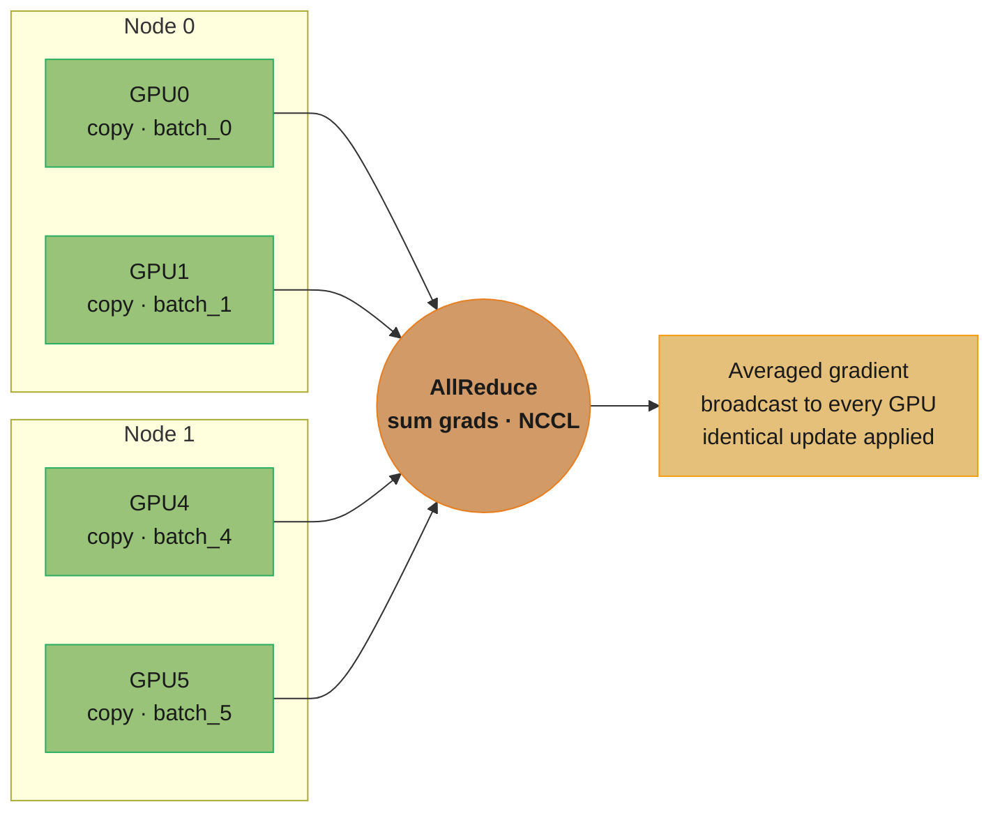
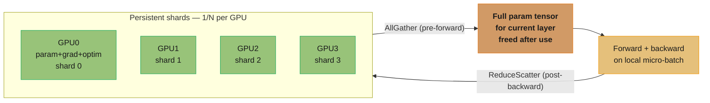
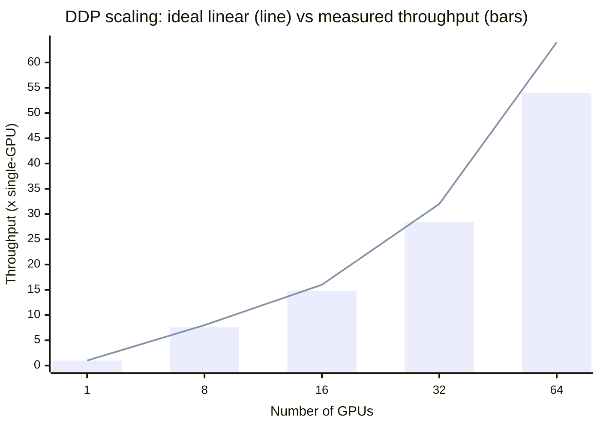
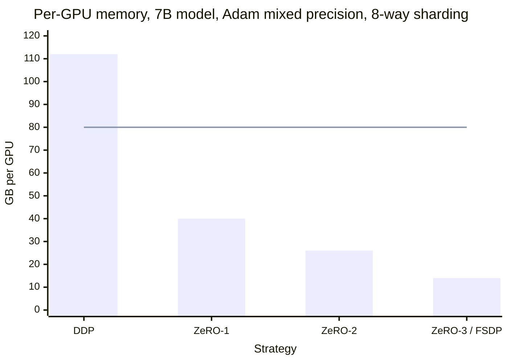

# Distributed Training for ML

## 1. Concept Overview

Distributed training splits the work of training a machine learning model across multiple devices (GPUs) or multiple machines (nodes). It is necessary when either the dataset is too large to iterate over in reasonable time on a single GPU, or the model itself is too large to fit in a single GPU's VRAM.

There are two fundamental decomposition strategies:

- **Data parallelism**: each GPU holds a full copy of the model, processes a different batch of data, and gradients are synchronized across all GPUs after each backward pass. Linear throughput scaling: N GPUs = N times the batch per second.
- **Model parallelism**: the model is partitioned across GPUs so each GPU holds only a portion of the parameters. Required when the model does not fit on a single device. Subdivides into tensor parallelism (split within a layer) and pipeline parallelism (split between layers).

Modern large model training combines all three: data parallelism across nodes, tensor parallelism within a node (fast NVLink), and pipeline parallelism across nodes (slower interconnect).

The primary communication primitive underlying distributed training is **AllReduce**: every GPU sends its gradient tensor, the reduce operation (sum) is applied across all GPUs, and every GPU receives the result. NCCL (NVIDIA Collective Communications Library) implements AllReduce efficiently over NVLink and InfiniBand.

---

## 2. Intuition

One-line analogy: training a model across multiple GPUs is like having N employees each read a different chapter of a book, then voting on the best summary — each employee's "vote" (gradient) must be collected, averaged, and broadcast back to everyone before the next chapter begins.

Mental model: think of DDP (DistributedDataParallel) as a synchronized ensemble. At each step: (1) each GPU independently computes a forward pass and backward pass on its local data batch; (2) the NCCL AllReduce operation sums and averages gradients across all GPUs — this is the synchronization point; (3) every GPU applies the identical gradient update to its model copy. All copies stay in sync because they start from the same weights and receive the same gradient delta.

Why it matters: GPT-3 (175B parameters) training required approximately 3.14 × 10^23 FLOP — on a single A100 GPU (312 TFLOP/s, ~40% utilization) this would take 8,000 years. With 1,024 A100 GPUs and 45% MFU (model FLOP utilization), actual training time was ~34 days.

Key insight: communication is the bottleneck in distributed training, not compute. GPU compute has scaled 100x in 10 years; network bandwidth has scaled 10x. Reducing communication volume (gradient compression, mixed precision, FSDP sharding) is as important as increasing FLOP/s.

---

## 3. Core Principles

**Synchronous vs asynchronous training**: synchronous (the default) requires all GPUs to complete their backward pass before AllReduce — stragglers slow everyone down. Asynchronous (parameter server pattern) allows parameter updates without waiting — risk of stale gradients causing convergence instability. Synchronous DDP is the production standard.

**Linear scaling rule**: when scaling from 1 GPU to N GPUs, the global batch size scales proportionally (local_batch × N), and the learning rate should scale by the same factor. For large scale-ups (> 32x), linear LR scaling diverges; use warmup (ramp LR over 5 epochs) to stabilize.

**What this actually says.** "Adding GPUs does not make each step better-informed for free — it silently makes your batch N times bigger, and a batch N times bigger deserves a step N times longer, or you are throwing away the extra information you just paid for."

The rule is a statement about *keeping training equivalent*, not about going faster. Scale the GPUs and leave the LR alone, and you will train the same number of steps on N times more data per step while moving the same distance each step — you have bought N times the compute and converted it into nothing.

| Symbol | What it is |
|--------|------------|
| `local_batch` | Samples processed per GPU per step. Set by what fits in VRAM, not by the math |
| `N` | Number of data-parallel workers (`world_size`). The multiplier on everything |
| `global_batch` | `local_batch x N`. The batch the optimizer actually sees, since AllReduce averages across all ranks |
| `base_lr` | The learning rate tuned for the single-GPU baseline. Meaningless without the batch size it was tuned at |
| `scaled_lr` | `base_lr x N`. The rate that keeps per-epoch progress equivalent |
| warmup | Ramping `base_lr -> scaled_lr` over the first few epochs, because the full scaled LR is unstable on a randomly-initialized model |

**Walk one example.** A run tuned at `local_batch = 64`, `base_lr = 1e-3` on one GPU, moved to 8 GPUs:

```
  1 GPU  : global batch =  64 x 1 =   64      lr = 0.001
  8 GPUs : global batch =  64 x 8 =  512      lr = 0.001 x 8 = 0.008

  Steps per epoch on a 1M-sample dataset:
    1 GPU  : 1,000,000 /  64 = 15,625 steps
    8 GPUs : 1,000,000 / 512 =  1,953 steps    <- 8x fewer optimizer steps

  Same ground covered per epoch: 1,953 steps x 0.008 == 15,625 steps x 0.001
```

The published reference point is Goyal et al.'s ResNet-50 result: batch 256 at `lr = 0.1`, scaled to batch 8,192 (a `32x` jump) at `lr = 3.2`, matching single-node accuracy — but only with a 5-epoch warmup. Without warmup that same run diverges in the first few hundred steps, because an untrained network's gradients are large and nearly random, and a `32x` step on a random direction destroys the initialization before the loss surface has any structure to follow.

**Gradient accumulation**: simulate a larger batch without more GPUs by accumulating gradients over M steps before calling `optimizer.step()`. Effective batch = local_batch × n_gpus × accumulation_steps. Useful when a single step's batch does not fit in VRAM.

**Put simply.** "Run the batch you can afford several times in a row, add up the gradients instead of applying them, and only step the optimizer once at the end — the optimizer cannot tell the difference between that and one big batch."

Trading wall-clock time for VRAM is the entire deal. Accumulation buys you the *statistics* of a large batch on hardware that can only hold a small one; it buys you no speed whatsoever, and if implemented carelessly it costs speed.

| Symbol | What it is |
|--------|------------|
| `M` | `accumulation_steps` — how many micro-batches you sum before stepping |
| `local_batch` | The micro-batch that actually fits in VRAM. The binding constraint |
| `n_gpus` | Data-parallel world size. Multiplies in exactly as it does without accumulation |
| effective batch | `local_batch x n_gpus x M`. The batch the optimizer's update statistically corresponds to |
| `loss / M` | The rescaling you must not forget — summing `M` gradients without it gives an `M`-times-too-large step |
| `no_sync()` | Suppresses AllReduce on the `M-1` intermediate backward passes. Without it you pay `M x` the communication |

**Walk one example.** Target effective batch of 256, reached three different ways:

```
  route                     local  x  gpus  x  M   =  effective   optimizer steps/epoch
  ------------------------------------------------------------------------------------
  32 GPUs, no accumulation     8   x   32   x  1   =    256           N
  8 GPUs, M = 4                8   x    8   x  4   =    256           N
  1 GPU,  M = 32               8   x    1   x 32   =    256           N

  All three produce the SAME update. They differ only in wall-clock time.
```

**What it costs.** On the 8-GPU, `M = 4` route:

```
  forward+backward passes per optimizer step :  4x   (unavoidable -- this IS the mechanism)
  wall-clock per optimizer step              :  ~4x
  activation memory held                     :  1x   (freed after each micro-batch)
  gradient memory held                       :  1x   (accumulated in place, not stacked)

  AllReduce calls per optimizer step:
    with    no_sync()  :  1     <- correct
    without no_sync()  :  4     <- 4x the communication for zero benefit
```

The memory rows are the point: activations are freed after each micro-batch, and gradients accumulate into the same buffer rather than stacking, so peak VRAM tracks `local_batch` and not the effective batch. The `no_sync()` row is Pitfall 5 in Section 10 — a team that skipped it paid `4x` the communication and ran 2.8x slower than plain DDP.

**Checkpointing discipline**: in distributed training, only rank 0 should write checkpoints to avoid N processes writing the same file simultaneously. With FSDP, each rank holds a shard — use FSDP's built-in `state_dict_type` context manager to gather and save.

**MFU (Model FLOP Utilization)**: actual FLOP/s ÷ peak theoretical FLOP/s. A100 peak is 312 TFLOP/s (BF16 with sparsity). Well-tuned LLM training achieves 38-45% MFU. Memory-bound operations (layer norms, embeddings) drag MFU down; computation-bound (large matmuls) push it up.

---

## 4. Types / Architectures / Strategies

**DataParallel (DP) — deprecated for multi-GPU**
Single-process, multi-thread, one GPU is the master. Master sends model to other GPUs, collects gradients back — creates a bottleneck on the master GPU. Memory imbalanced (master holds activations + gradients for all GPUs). Not recommended; use DDP instead.

**DistributedDataParallel (DDP)**
Multi-process (one process per GPU), symmetric AllReduce — no master bottleneck. Uses NCCL backend over NVLink/InfiniBand. Overlaps gradient communication with backward computation (gradient buckets: default bucket size 25 MB). The production standard for data-parallel training on 1-64 GPUs.

**FSDP (Fully Sharded Data Parallel)**
PyTorch 1.12+. Shards model parameters, gradients, and optimizer states across all ranks. Each rank holds 1/N of every parameter. Before each forward pass, parameters are gathered via AllGather; after backward pass, gradients are reduced via ReduceScatter. Memory per GPU scales as ~1/N of model size, enabling training models that exceed single-GPU VRAM. Overhead: 2x communication compared to DDP, but enables models 10-100x larger.

**DeepSpeed ZeRO**
Stage 1: shard only optimizer states — 4x memory reduction. Stage 2: + gradient sharding — 8x memory reduction. Stage 3: + parameter sharding — equal to FSDP in memory but with more communication. ZeRO-Infinity offloads to CPU RAM and NVMe SSD for near-infinite model capacity.

**Tensor Parallelism (TP)**
Split individual matrix multiplications across GPUs. A linear layer (A × W) with weight W split column-wise: each GPU computes partial results, then AllReduce to combine. Requires fast NVLink (within a node, 600 GB/s A100). Megatron-LM implements column-parallel and row-parallel linear layers.

**Pipeline Parallelism (PP)**
Split model layers into stages, each stage on a different node. Data flows forward through stages (forward pass) then backward through stages (backward pass). GPUs are idle while waiting for the next micro-batch — "pipeline bubble." GPipe, PipeDream, and 1F1B (interleaved) schedules minimize bubble overhead.

**3D Parallelism**
DP × TP × PP: data parallel across super-nodes, tensor parallel within a node, pipeline parallel across nodes. Used for 100B+ parameter models. Megatron-Turing NLG (530B) used 280 × 8-way TP × 35-way PP.

### The Scaling Math: Data Parallel vs Model Parallel

The two strategies divide different quantities, and that single difference determines everything else:

```
  Data parallel across N devices:
    memory per device      = M                (unchanged -- full replica)
    throughput             = N x single       (each device does a full step)
    sync points per step   = 1                (one gradient AllReduce)
    max trainable model    = whatever fits on ONE device

  Model parallel across N devices:
    memory per device      = M / N            (each holds a slice)
    throughput             = ~1 x single      (devices work on the SAME sample)
    sync points per step   = 2 per layer (TP) or 1 per stage boundary (PP)
    max trainable model    = N x device VRAM
```

**The idea behind it.** "Data parallel divides the *work* and leaves the memory alone; model parallel divides the *memory* and leaves the work alone. You add data parallelism to go faster, and model parallelism only when you have no choice."

Reading them as substitutes is the classic mistake. Model parallelism does not make training faster — eight GPUs holding eight slices of one model process roughly the same samples per second as one GPU would if the model fit, minus the sync overhead. It is a technique for making the impossible possible, not the slow fast.

| Symbol | What it is |
|--------|------------|
| `M` | Total resident state per model replica: params + grads + optimizer state (see the 16 bytes/param breakdown in Section 5) |
| `N` | Number of devices the strategy spans |
| throughput | Samples processed per second, relative to one device |
| sync point | A collective every device must reach before proceeding. Each one exposes network latency |
| TP | Tensor parallel — splits a single matmul. Two AllReduces per transformer block, so it needs NVLink |
| PP | Pipeline parallel — splits the layer stack. Only activations cross stage boundaries, so it tolerates Ethernet |

**Walk one example.** A 7B model in BF16 with Adam needs `M = 112 GB` of resident state against an 80 GB A100:

```
  8 GPUs, pure data parallel:
    memory per GPU   = 112 GB        -> EXCEEDS 80 GB. Will not launch.
    throughput       = 8x
    verdict          : fastest option, but impossible for this model

  8 GPUs, pure model parallel (8-way TP):
    memory per GPU   = 112 / 8 = 14 GB   -> fits comfortably
    throughput       = ~1x               -> all 8 GPUs serve one sample stream
    verdict          : it runs, but you bought 8 GPUs of compute and got 1

  8 GPUs, FSDP / ZeRO-3 (shards state, keeps data parallelism):
    memory per GPU   = 112 / 8 = 14 GB   -> fits
    throughput       = ~7x               -> still 8 independent data shards
    verdict          : the reason FSDP exists
```

FSDP is the resolution of the dilemma: it achieves model-parallel *memory* while preserving data-parallel *throughput*, paying for it with roughly 2x the communication of DDP. That is why the decision tree in Section 9 sends you to DDP first, FSDP when memory fails, and true tensor parallelism only when even a single layer will not fit — at which point you are forced into the 1x-throughput regime and must recover the loss by stacking data parallelism on top, which is exactly what 3D parallelism is.

**Why 3D parallelism has the shape it does.** Megatron-Turing NLG's `280 x 8-way TP x 35-way PP` layout is not arbitrary: TP is set to 8 because that is the number of GPUs sharing one node's NVLink fabric, PP spans nodes because it only ships activations across the slow link, and DP takes whatever is left over to recover throughput. Each axis is matched to the interconnect that can afford its traffic.

---

## 5. Architecture Diagrams

### Three ways to split the work: data vs tensor vs pipeline parallel

```mermaid
flowchart TD
    classDef io      fill:#61afef,stroke:#2e86c1,color:#1a1a1a,font-weight:bold
    classDef frozen  fill:#c678dd,stroke:#9b59b6,color:#fff
    classDef train   fill:#98c379,stroke:#27ae60,color:#1a1a1a
    classDef mathOp  fill:#d19a66,stroke:#e67e22,color:#1a1a1a,font-weight:bold
    classDef lossN   fill:#e06c75,stroke:#c0392b,color:#fff,font-weight:bold
    classDef req     fill:#56b6c2,stroke:#0097a7,color:#1a1a1a
    classDef base    fill:#e5c07b,stroke:#f39c12,color:#1a1a1a

    subgraph DP["Data parallel — split the batch"]
        dp0["GPU0\nfull model\nbatch shard 0"]
        dp1["GPU1\nfull model\nbatch shard 1"]
        dp0 <-->|"AllReduce grads"| dp1
    end
    subgraph TP["Tensor parallel — split each layer"]
        tp0["GPU0\nW columns 0..k/2"]
        tp1["GPU1\nW columns k/2..k"]
        tp0 <-->|"AllReduce per layer"| tp1
    end
    subgraph PP["Pipeline parallel — split the layers"]
        pp0["GPU0\nlayers 0..15"] --> pp1["GPU1\nlayers 16..31"]
    end

    class dp0,dp1 train
    class tp0,tp1 mathOp
    class pp0,pp1 base
```



Data parallel replicates the whole model and only syncs gradients (one AllReduce per step); tensor parallel splits a single weight matrix and syncs inside every layer (needs NVLink); pipeline parallel splits the layer stack and passes activations between stages. 3D parallelism combines all three: TP inside a node, PP across nodes, DP across replica groups.

### DDP: data-parallel training with gradient AllReduce



Every GPU holds a full model copy and a different data shard; after the backward pass NCCL AllReduce sums and averages gradients across all 8 GPUs, then each GPU applies the identical update — which is why all copies stay in lockstep with no master bottleneck.

### FSDP / ZeRO-3: shard params, grads, and optimizer state



Each rank permanently holds only 1/N of parameters, gradients, and optimizer state (~10M/N bytes total). Before a layer runs, AllGather transiently materializes its full weights, which are freed right after; after backward, ReduceScatter distributes reduced gradients back to shards — trading roughly 2× the communication of DDP for a linear cut in per-GPU memory.

### Pipeline parallelism: 1F1B schedule and the bubble

```
Pipeline Parallelism (4 stages, 4 micro-batches, 1F1B schedule)

Stage 0 [F1][F2][F3][F4][B4][B3][B2][B1]
Stage 1      [F1][F2][F3][F4][B4][B3][B2][B1]
Stage 2           [F1][F2][F3][F4][B4][B3][B2][B1]
Stage 3                [F1][F2][F3][F4][B4][B3][B2][B1]
                                    ^--- steady state: all stages active
F=forward, B=backward, pipeline bubble at start/end
```

Each stage owns a slice of layers; the horizontal offset is the fill/drain "bubble" where a stage sits idle waiting for its first micro-batch — bubble fraction is (p−1)/m for p stages and m micro-batches, which is why more micro-batches amortize the idle time. (Kept as ASCII because the exact per-stage offsets carry the meaning.)

### DDP scaling efficiency: ideal vs measured



The straight line is perfect linear scaling; the bars are realistic measured throughput. The gap widens with scale because AllReduce communication grows with GPU count — the reason well-tuned DDP lands at ~90-95% efficiency and why communication, not compute, is the scaling bottleneck.

Where those bar heights come from:

```
  efficiency = T_compute / (T_compute + T_comm_exposed)
  speedup    = N x efficiency

  T_comm_exposed = T_comm x (1 - overlap_fraction)
```

**Stated plainly.** "You only get credit for the fraction of the step spent doing math. Every millisecond a GPU spends waiting on the network — and cannot hide behind computation it was going to do anyway — comes straight off your speedup."

The `overlap_fraction` term is the one people forget, and it is what DDP's `bucket_cap_mb=25` setting exists to control. Gradients for the last layers are ready long before the backward pass reaches the first layer, so DDP fires an AllReduce per full 25 MB bucket while the backward pass continues. Communication that overlaps with compute is invisible; only the leftover is charged.

| Symbol | What it is |
|--------|------------|
| `T_compute` | Time for one local forward + backward. Constant per GPU under weak scaling — this is why the batch grows with `N` |
| `T_comm` | Total wall-clock the AllReduce would take if nothing overlapped it |
| overlap_fraction | Share of `T_comm` hidden behind the backward pass by gradient bucketing. `0.75` is typical for a well-tuned run |
| `T_comm_exposed` | The un-hidden remainder. The only communication that actually costs you |
| efficiency | Fraction of ideal linear scaling achieved. `1.0` would be perfect |
| `N x efficiency` | The bar height on the chart above |

**Walk one example.** A 1.5B model (gradients in BF16 = 3.0 GB) on 8 GPUs, `T_compute = 100 ms`, intra-node NVLink at 250 GB/s effective NCCL bandwidth:

```
  ring volume per GPU = 2 x (8 - 1) / 8 x 3.0 GB     = 5.25 GB
  T_comm              = 5.25 GB / 250 GB/s           = 21.0 ms

  Without overlap:
    step time  = 100 + 21.0                          = 121.0 ms
    efficiency = 100 / 121.0                         = 82.6%
    speedup    = 8 x 0.826                           = 6.6x

  With 75% of communication hidden behind the backward pass:
    T_comm_exposed = 21.0 x 0.25                     =   5.25 ms
    step time      = 100 + 5.25                      = 105.25 ms
    efficiency     = 100 / 105.25                    = 95.0%
    speedup        = 8 x 0.950                       = 7.60x    <- the chart's bar
```

That 6.6x-to-7.6x jump is bought entirely by bucketing, with no change to hardware, batch size, or model — which is why `bucket_cap_mb` is worth tuning and why `find_unused_parameters=True` (which forces DDP to wait and re-scan the graph before it can bucket) is called out as costly in the Section 6 code.

**Why the gap widens at 64 GPUs.** Not because the volume grows — it barely does:

```
    N = 8   ->  ring volume 5.250 GB
    N = 64  ->  ring volume 5.906 GB     (only 12.5% more data)
```

The damage is that the traffic now crosses node boundaries. At 80 GB/s effective inter-node bandwidth instead of NVLink's 250 GB/s:

```
  T_comm         = 5.906 GB / 80 GB/s   = 73.8 ms
  T_comm_exposed = 73.8 x 0.25          = 18.5 ms
  efficiency     = 100 / 118.5          = 84.4%
  speedup        = 64 x 0.844           = 54.0x    <- the chart's 64-GPU bar
```

Efficiency fell from 95% to 84% almost entirely because the interconnect got ~3x slower, not because there is more to send. This is the quantitative version of "communication is the bottleneck": the scaling curve bends at the node boundary, and every mitigation in this module — mixed precision (halves the gradient bytes), gradient compression, hierarchical AllReduce (reduce within a node over NVLink first, then across nodes) — is an attack on one of the three numbers in that division.

### Per-GPU memory by sharding strategy (7B model)



DDP replicates all ~16 bytes/param (params + grads + fp32 master + Adam m/v) = 112 GB, which does not fit under the 80 GB A100 ceiling (the flat line); ZeRO-1 shards optimizer state, ZeRO-2 adds gradients, and ZeRO-3/FSDP shards everything down to ~14 GB — each stage trading more communication for less resident memory.

The "16 bytes/param" is not a rule of thumb; it is an itemized bill:

```
  bytes_per_param = 2 (BF16 param) + 2 (BF16 grad)
                  + 4 (FP32 master weight) + 4 (Adam m) + 4 (Adam v)
                  = 16

  memory_per_gpu = params x bytes_per_param, with each term divided
                   by N only if that ZeRO stage shards it
```

**In plain terms.** "Every parameter you train drags four extra copies of itself around — a gradient, a full-precision master copy, and Adam's two running statistics — so the weights themselves are only one-eighth of what actually sits in VRAM."

This is the number that decides whether a job launches at all, and it explains why "the model is 7B, the GPU has 80 GB, it should fit" is wrong by a factor of 1.4. The parameters are 14 GB. The other 98 GB is bookkeeping.

| Symbol | What it is |
|--------|------------|
| BF16 param | 2 bytes. The working copy used in the forward and backward pass |
| BF16 grad | 2 bytes. One per parameter, produced every backward pass |
| FP32 master | 4 bytes. The authoritative copy the optimizer updates — BF16 has too few mantissa bits to accumulate small updates without losing them |
| Adam `m` | 4 bytes. Exponential moving average of the gradient (first moment) |
| Adam `v` | 4 bytes. Exponential moving average of the squared gradient (second moment) |
| activations | Not in this 16 — they scale with batch and sequence length, and are what gradient checkpointing attacks |

**Walk one example.** A 7B model on 8 GPUs, tracing each ZeRO stage:

```
  Total state = 7e9 x 16 bytes = 112 GB   (per replica)

                params    grads          optimizer (12 B/param)     total/GPU
  ---------------------------------------------------------------------------
  DDP           14 GB     14 GB          84 GB                      112.00 GB
  ZeRO-1        14 GB     14 GB          84 / 8 = 10.5 GB            38.50 GB
  ZeRO-2        14 GB     14 / 8 = 1.75  84 / 8 = 10.5 GB            26.25 GB
  ZeRO-3        1.75 GB   1.75 GB        10.5 GB                     14.00 GB

  A100 ceiling: 80 GB.  DDP is 1.4x over. Every ZeRO stage fits.
```

Notice where the big win is: going DDP -> ZeRO-1 removes 73.5 GB by sharding *only* the optimizer state, because optimizer state is 12 of the 16 bytes — three-quarters of the bill. That is why Stage 1 is nearly free (optimizer state is touched once per step, so sharding it costs almost no extra communication) and delivers the single largest reduction, while Stage 3 sheds only another 12 GB but must AllGather parameters before *every* layer's forward pass. The stages are ordered by exactly this ratio of memory saved to communication added.

---

## 6. How It Works — Detailed Mechanics

### PyTorch DDP — Correct Setup

```python
import os
import torch
import torch.distributed as dist
from torch.nn.parallel import DistributedDataParallel as DDP
from torch.utils.data import DataLoader, DistributedSampler
from torch.cuda.amp import GradScaler, autocast
from torch import nn
from typing import Optional


def setup_distributed(backend: str = "nccl") -> tuple[int, int]:
    """
    Initialize process group. Called once per process.
    Reads RANK, LOCAL_RANK, WORLD_SIZE from environment (set by torchrun).
    Returns (rank, world_size).
    """
    dist.init_process_group(backend=backend)
    rank = dist.get_rank()
    world_size = dist.get_world_size()
    local_rank = int(os.environ["LOCAL_RANK"])
    torch.cuda.set_device(local_rank)
    return rank, world_size


def cleanup_distributed() -> None:
    dist.destroy_process_group()


def train_ddp(
    model: nn.Module,
    dataset,
    epochs: int = 10,
    batch_size: int = 64,
    lr: float = 1e-3,
    gradient_accumulation_steps: int = 4,
) -> None:
    rank, world_size = setup_distributed()
    device = torch.device(f"cuda:{int(os.environ['LOCAL_RANK'])}")

    # Move model to device BEFORE wrapping with DDP
    model = model.to(device)
    model = DDP(
        model,
        device_ids=[int(os.environ["LOCAL_RANK"])],
        # find_unused_parameters=True adds overhead; only enable if needed
        find_unused_parameters=False,
        # Gradient bucket size: larger = fewer AllReduce calls, more memory
        bucket_cap_mb=25,
    )

    # DistributedSampler ensures each rank gets a different data slice
    sampler = DistributedSampler(
        dataset,
        num_replicas=world_size,
        rank=rank,
        shuffle=True,
        drop_last=True,  # avoid uneven batch sizes across ranks
    )
    loader = DataLoader(dataset, batch_size=batch_size, sampler=sampler, num_workers=4, pin_memory=True)

    optimizer = torch.optim.AdamW(model.parameters(), lr=lr)
    # BF16: better numerical range than FP16, no GradScaler needed on A100/H100
    # FP16: use GradScaler to handle underflow
    scaler = GradScaler()  # for FP16 training

    for epoch in range(epochs):
        # Must set epoch so DistributedSampler reshuffles correctly each epoch
        sampler.set_epoch(epoch)
        optimizer.zero_grad()

        for step, (inputs, labels) in enumerate(loader):
            inputs, labels = inputs.to(device), labels.to(device)

            # Gradient accumulation: disable sync on all but the last step
            sync_context = (
                model.no_sync()
                if (step + 1) % gradient_accumulation_steps != 0
                else contextlib.nullcontext()
            )

            with sync_context:
                with autocast(dtype=torch.float16):  # use torch.bfloat16 on A100
                    outputs = model(inputs)
                    loss = criterion(outputs, labels)
                    loss = loss / gradient_accumulation_steps

                scaler.scale(loss).backward()

            if (step + 1) % gradient_accumulation_steps == 0:
                # Unscale before gradient clipping
                scaler.unscale_(optimizer)
                torch.nn.utils.clip_grad_norm_(model.parameters(), max_norm=1.0)
                scaler.step(optimizer)
                scaler.update()
                optimizer.zero_grad()

        # Only rank 0 saves checkpoint
        if rank == 0:
            torch.save({
                "epoch": epoch,
                "model_state_dict": model.module.state_dict(),  # .module to unwrap DDP
                "optimizer_state_dict": optimizer.state_dict(),
            }, f"checkpoint_epoch_{epoch}.pt")

    cleanup_distributed()


# Launch with: torchrun --nproc_per_node=8 --nnodes=2 --node_rank=0 \
#              --master_addr=<ip> --master_port=29500 train.py
```

### Ring AllReduce — the Communication Volume Formula

The `DDP(...)` wrapper above hides one collective, and this is its cost model. Ring AllReduce runs in two phases around a logical ring — ReduceScatter, then AllGather — and the bytes each GPU pushes onto the wire are:

```
  bytes_per_gpu = 2 x (N - 1) / N x params x bytes_per_param

  Phase 1, ReduceScatter : N - 1 steps, each sending params/N   (the "2 x" first half)
  Phase 2, AllGather     : N - 1 steps, each sending params/N   (the "2 x" second half)

  total steps = 2 x (N - 1)
  chunk size  = params / N
```

**Read it like this.** "Chop the gradient into N pieces, pass the pieces around the circle twice — once to add them up, once to hand the finished sums back — so nobody ever sends the whole tensor and nobody ever sits idle."

The naive alternative is the reason this matters: a single-master gather would push `(N-1) x params` into one GPU's NIC, so cost grows linearly with cluster size and the master's link becomes the ceiling. The ring makes every GPU send and receive simultaneously and caps the per-GPU volume at a constant.

| Symbol | What it is |
|--------|------------|
| `N` | Number of GPUs in the ring (`world_size`) |
| `params` | Parameter count. The gradient tensor has exactly one entry per parameter |
| `bytes_per_param` | `2` for BF16/FP16 gradients, `4` for FP32. Halving this halves the whole bill — the hidden reason mixed precision speeds up multi-GPU runs |
| `(N - 1)` | Number of hops each chunk makes to visit every other GPU. Both phases need it |
| `/ N` | Each hop carries only `1/N` of the tensor, because the work was split into `N` chunks |
| `2 x` | Two phases. ReduceScatter leaves each GPU owning one fully-reduced chunk; AllGather distributes those chunks back |

**Walk one example.** A 1.5B-parameter model with BF16 gradients (`3.0 GB`) on 8 GPUs:

```
  chunk size    = 1.5e9 / 8               = 187.5 M params = 0.375 GB

  ReduceScatter : 7 steps x 0.375 GB      = 2.625 GB sent
  AllGather     : 7 steps x 0.375 GB      = 2.625 GB sent
                                            ---------
  bytes_per_gpu                           = 5.250 GB

  Check against the formula:
    2 x (8 - 1) / 8 x 3.0 GB = 2 x 0.875 x 3.0 = 5.25 GB   agrees

  At 250 GB/s effective NCCL bandwidth: 5.25 / 250 = 21 ms per step.
```

**The property the whole design rests on.** Watch the coefficient `2(N-1)/N` as the cluster grows:

```
    N        2(N-1)/N     bytes moved per GPU      total hops
  --------------------------------------------------------------
      2        1.000            3.00 GB                2
      4        1.500            4.50 GB                6
      8        1.750            5.25 GB               14
     16        1.875            5.63 GB               30
     64        1.969            5.91 GB              126
   1024        1.998            6.00 GB             2046

                                 ^ converges to 2 x gradient size
```

Per-GPU communication volume is **bounded by twice the gradient size no matter how many GPUs you add** — going from 8 GPUs to 1,024 raises it by only 14%. This is what "bandwidth-optimal" means, and it is why data-parallel training scales to thousands of GPUs at all.

**So why does scaling still degrade?** Because the right-hand column is not bounded. Step count is `2(N-1)`, growing linearly forever, and every step pays one network latency. At `N = 8` you eat 14 latencies; at `N = 1024`, 2,046 of them. With a 5 microsecond hop that is 70 microseconds versus 10 milliseconds — the volume stayed flat while the latency floor rose 146x. That is the real reason large clusters move to hierarchical AllReduce: reduce inside each node over NVLink first, then run a much shorter ring of 128 nodes rather than one ring of 1,024 GPUs.

### PyTorch FSDP — Large Model Training

```python
import torch
from torch.distributed.fsdp import (
    FullyShardedDataParallel as FSDP,
    MixedPrecision,
    ShardingStrategy,
    StateDictType,
    FullStateDictConfig,
)
from torch.distributed.fsdp.wrap import size_based_auto_wrap_policy
import functools
from transformers import AutoModelForCausalLM


def setup_fsdp_model(model_name: str, min_num_params: int = 1_000_000) -> FSDP:
    """
    Wrap a HuggingFace model with FSDP.
    size_based_auto_wrap_policy wraps any submodule with >= min_num_params parameters.
    For a 7B model with 32 transformer blocks, each block is ~218M params — all wrapped.
    """
    model = AutoModelForCausalLM.from_pretrained(model_name, torch_dtype=torch.bfloat16)

    # Auto-wrap policy: wrap modules with >= 1M parameters
    auto_wrap_policy = functools.partial(
        size_based_auto_wrap_policy,
        min_num_params=min_num_params,
    )

    # BF16 mixed precision: safe on A100/H100, avoids FP16 overflow
    bf16_policy = MixedPrecision(
        param_dtype=torch.bfloat16,
        reduce_dtype=torch.bfloat16,
        buffer_dtype=torch.bfloat16,
    )

    fsdp_model = FSDP(
        model,
        auto_wrap_policy=auto_wrap_policy,
        mixed_precision=bf16_policy,
        sharding_strategy=ShardingStrategy.FULL_SHARD,  # ZeRO Stage 3 equivalent
        # SHARD_GRAD_OP = ZeRO Stage 2 (shard grads + optimizer, not params)
        device_id=torch.cuda.current_device(),
        use_orig_params=True,  # required for torch.compile compatibility
    )
    return fsdp_model


def save_fsdp_checkpoint(fsdp_model: FSDP, save_path: str, rank: int) -> None:
    """
    Save FSDP model checkpoint. Must gather shards to rank 0 first.
    """
    save_policy = FullStateDictConfig(offload_to_cpu=True, rank0_only=True)
    with FSDP.state_dict_type(fsdp_model, StateDictType.FULL_STATE_DICT, save_policy):
        cpu_state = fsdp_model.state_dict()

    if rank == 0:
        torch.save(cpu_state, save_path)
```

### DeepSpeed ZeRO Configuration

```python
# deepspeed_config.json — ZeRO Stage 2
ds_config = {
    "train_batch_size": 256,
    "train_micro_batch_size_per_gpu": 8,     # effective batch = 256 across 32 GPUs
    "gradient_accumulation_steps": 1,
    "bf16": {"enabled": True},
    "zero_optimization": {
        "stage": 2,                           # Stage 2: optimizer + gradient sharding
        "allgather_partitions": True,
        "allgather_bucket_size": 500_000_000, # 500 MB AllGather bucket
        "overlap_comm": True,                 # overlap gradient comm with backward pass
        "reduce_scatter": True,
        "reduce_bucket_size": 500_000_000,
        "contiguous_gradients": True,         # reduces memory fragmentation
    },
    "gradient_clipping": 1.0,
    "optimizer": {
        "type": "AdamW",
        "params": {"lr": 1e-4, "betas": [0.9, 0.95], "eps": 1e-8, "weight_decay": 0.1}
    },
    "scheduler": {
        "type": "WarmupDecayLR",
        "params": {"warmup_min_lr": 0, "warmup_max_lr": 1e-4, "warmup_num_steps": 2000, "total_num_steps": 100000}
    }
}
```

---

## 7. Real-World Examples

**Meta — LLaMA 3 (70B)**: trained on 15 trillion tokens using 2,048 H100 GPUs. Used 3D parallelism: 8-way tensor parallelism within a node (NVLink), 16-way pipeline parallelism across nodes, data parallelism across super-nodes. Achieved ~38% MFU. Training took approximately 3.4 million GPU-hours.

**Google — PaLM (540B)**: trained on 6,144 TPU v4 chips using Pathways (a cross-accelerator system). 12-way model parallelism, 24-way pipeline parallelism, data parallel across pods. TPU interconnect (ICI, 600 GB/s) enabled aggressive tensor parallelism.

**OpenAI — GPT-4 (rumored ~1.8T MoE)**: distributed training details not disclosed, but inference is served from multi-node A100 clusters with tensor parallelism.

**Hugging Face — community fine-tuning**: standard pattern is DDP with 8 A100 GPUs for 7B-13B models, FSDP or DeepSpeed ZeRO-3 for 70B models. QLoRA + DDP fits 70B fine-tuning on 4x A100 40GB.

---

## 8. Tradeoffs

| Strategy | Memory/GPU | Communication | Complexity | Max Model Size | Use When |
|---|---|---|---|---|---|
| DDP | Full model × N | AllReduce (gradients only) | Low | Fits in 1 GPU | Standard multi-GPU training |
| FSDP SHARD_GRAD_OP | Full params + 1/N optimizer+grad | ReduceScatter + AllGather | Medium | ~1.5x single GPU | Model just exceeds GPU memory |
| FSDP FULL_SHARD | 1/N params + 1/N optimizer+grad | 2× communication | Medium | N × GPU VRAM | Large models (7B-70B) |
| DeepSpeed ZeRO-3 | Same as FSDP FULL_SHARD | Similar | High (JSON config) | N × GPU VRAM | Large models, DeepSpeed ecosystem |
| ZeRO-Infinity | ~1/N GPU + CPU/NVMe | Much slower | Very high | Virtually unlimited | Research, very large models |

| Precision | Memory | Stability | Hardware | Notes |
|---|---|---|---|---|
| FP32 | 4 bytes/param | Very stable | All GPUs | Too slow and large for LLMs |
| FP16 | 2 bytes/param | Overflow risk | All GPUs | Needs GradScaler; master weights in FP32 |
| BF16 | 2 bytes/param | Stable (same range as FP32) | A100/H100/TPU | Preferred for modern LLM training |

---

## 9. When to Use / When NOT to Use

**Use DDP when**: model fits on a single GPU, you want maximum simplicity, training on 2-64 GPUs, team is familiar with PyTorch but not distributed systems.

**Use FSDP when**: model parameters exceed single GPU VRAM, training 7B-70B parameter models, using PyTorch 1.12+ and want native PyTorch solution without external dependencies.

**Use DeepSpeed ZeRO when**: working in a DeepSpeed ecosystem (Megatron-DeepSpeed), need ZeRO-Infinity (NVMe offload) for very large models, need CPU-Adam optimizer for massive optimizer state offload.

**Use tensor parallelism when**: working within a single node with fast NVLink interconnect, model width (hidden dimension) is large enough to split (Megatron-style TP works well for hidden_dim >= 4096), using Megatron-LM or compatible framework.

**Do NOT use DDP when**: model does not fit in a single GPU's VRAM — DDP keeps a full copy on each GPU.

**Do NOT use FSDP with tiny models**: the AllGather/ReduceScatter overhead dominates for small models (< 1B parameters). DDP is faster.

**Do NOT mix tensor parallelism with slow interconnect**: tensor parallelism requires multiple AllReduce operations per layer during forward and backward passes — running TP across nodes over Ethernet (10 Gbps) instead of NVLink (600 Gbps) will make training slower than single-GPU.

---

## 10. Common Pitfalls

**Pitfall 1 — Forgetting sampler.set_epoch(epoch)**
Production incident: a team used `DistributedSampler` but did not call `sampler.set_epoch(epoch)` at the start of each epoch. The sampler uses the epoch number to seed its shuffle — without updating it, all epochs trained on the same data order. The model converged to a worse local minimum (0.7% lower accuracy) and the team spent 2 weeks investigating optimizer hyperparameters before discovering the root cause. Fix: always call `sampler.set_epoch(epoch)` at the top of the epoch loop.

**Pitfall 2 — Saving checkpoint from all ranks**
In DDP training, a team had every process call `torch.save(model.state_dict(), path)`. With 64 processes all writing to the same NFS path simultaneously, they hit filesystem corruption (partial overwrites). Fix: gate checkpoint writes with `if dist.get_rank() == 0`. For FSDP, use `StateDictType.FULL_STATE_DICT` with `rank0_only=True` to gather the full model only on rank 0 before saving.

**Pitfall 3 — Using DataParallel instead of DDP**
A team's training throughput scaled from 1 GPU to 4 GPUs as: 1 GPU → 3.2x (not 4x). They were using `nn.DataParallel` (single-process, all GPUs on one thread). The master GPU held all activations for all sub-batches before the gather step — causing 70% GPU memory utilization on rank 0 and only 30% on ranks 1-3. Migrating to `torchrun` + DDP achieved 3.8x speedup with 4 GPUs. DP is single-process; DDP is multi-process — always use DDP.

**Pitfall 4 — FSDP and non-wrapped shared parameters**
A model had an embedding layer shared (tied weights) between the input embedding and the output projection (standard in transformer LMs). FSDP wrapped them separately, creating two shards of what should be one tensor. Gradient updates desynchronized the tied weights over training — loss oscillated instead of decreasing. Fix: use `FSDP.set_state_dict_type` and handle tied weights explicitly; or apply `ignored_modules` to one of the tied layers so FSDP does not shard it independently.

**Pitfall 5 — Gradient accumulation without no_sync()**
A team implemented gradient accumulation with FSDP but did not use `model.no_sync()` for the non-update steps. Each backward pass triggered a ReduceScatter (gradient sync), not just the final step. With 4 accumulation steps, they paid 4x the communication cost instead of 1x. This made training 2.8x slower than DDP despite the memory savings. Fix: wrap intermediate backward passes with `model.no_sync()` context manager.

---

## 11. Technologies & Tools

| Tool | Purpose |
|---|---|
| PyTorch DDP | Standard data-parallel training (multi-process) |
| PyTorch FSDP | Fully sharded data parallel (ZeRO-3 equivalent) |
| DeepSpeed | ZeRO optimizer, ZeRO-Infinity, pipeline parallelism |
| Megatron-LM | Tensor + pipeline parallelism for LLMs (NVIDIA) |
| torchrun | PyTorch distributed launcher (replaces torch.multiprocessing.spawn) |
| NCCL | GPU collective communication library (AllReduce, AllGather) |
| Horovod | Uber's distributed training library (less common now) |
| Accelerate (HuggingFace) | Abstraction over DDP/FSDP/DeepSpeed with minimal code change |
| PyTorch Lightning | Higher-level training loop with distributed strategy plugins |
| TensorFlow MirroredStrategy | TF equivalent of DDP |
| Vertex AI Training | Managed distributed training on Google Cloud |
| AWS SageMaker Training | Managed distributed training with SMP library |
| Weights & Biases | Experiment tracking for distributed runs |
| NVIDIA Nsight Systems | GPU profiling for identifying bottlenecks |

---

## 12. Interview Questions with Answers

**Q: What is the difference between DataParallel and DistributedDataParallel?**
DataParallel uses a single process with multiple threads — one GPU is the master that scatters input data, gathers outputs and gradients, and applies updates. This creates a memory imbalance (master GPU uses more VRAM) and a GIL bottleneck (Python's GIL limits parallelism). DistributedDataParallel uses one process per GPU with no master — each process computes its own forward and backward pass, then NCCL performs AllReduce to synchronize gradients symmetrically. DDP consistently achieves 90-95% linear scaling efficiency; DataParallel typically achieves 60-75%. Always use DDP for new training code.

**Q: How does AllReduce work and which backend should you use?**
AllReduce is a collective operation: every process sends its tensor, the operation (typically sum) is applied element-wise across all tensors, and every process receives the result. In Ring-AllReduce (the standard algorithm), data is sent around a logical ring of processes in two phases: ReduceScatter (each process sends and accumulates a chunk) then AllGather (each process broadcasts its chunk). Use NCCL backend for GPU-to-GPU communication — it leverages NVLink (600 GB/s, A100) and InfiniBand (400 Gb/s HDR). Use Gloo backend only for CPU training. MPI backend is available but NCCL outperforms it for GPU workloads.

**Q: What is gradient accumulation and when should you use it?**
Gradient accumulation postpones the optimizer update by accumulating gradients across M steps before calling `optimizer.step()`. The effective batch size becomes `local_batch × n_gpus × M`. Use it when: (1) the target batch size exceeds what fits in VRAM for a single step; (2) you want to match a larger-batch baseline without adding GPUs; (3) training with FSDP/ZeRO where per-GPU batch is small. Critical implementation detail: in DDP, use `model.no_sync()` for all non-update steps to suppress AllReduce on each intermediate backward pass — only AllReduce on the final accumulation step.

**Q: How does FSDP reduce memory usage compared to DDP?**
In DDP, each GPU holds: full model parameters (M bytes) + full gradients (M bytes) + full optimizer states (for Adam: 8M bytes for momentum and variance) = ~10M bytes total. With FSDP FULL_SHARD across N GPUs, each GPU holds: M/N bytes for parameters + M/N bytes for gradients + 8M/N bytes for optimizer states ≈ 10M/N bytes total — a linear memory reduction. Before each forward pass, FSDP issues AllGather to temporarily materialize the full parameter tensor on each GPU (then frees after use). This means peak memory during forward pass exceeds 1/N, but the steady-state footprint is 1/N.

**Q: What is ZeRO and how do its stages differ?**
ZeRO (Zero Redundancy Optimizer, from DeepSpeed) progressively eliminates memory redundancy across data-parallel ranks: Stage 1 shards optimizer states (Adam m/v) — each rank holds 1/N of optimizer state, reducing optimizer memory by N×. Stage 2 additionally shards gradients — gradients are immediately discarded on each rank after ReduceScatter, saving another ~M bytes. Stage 3 additionally shards parameters — equivalent to FSDP FULL_SHARD. ZeRO-Infinity extends Stage 3 by offloading parameter and optimizer shards to CPU RAM and NVMe storage, enabling trillion-parameter models at the cost of slower training (PCIe bandwidth ~32 GB/s vs NVLink 600 GB/s).

**Q: Why is BF16 preferred over FP16 for training large language models?**
BF16 (Brain Float 16) and FP16 both use 2 bytes per value, but BF16 allocates 8 exponent bits (same as FP32) and 7 mantissa bits; FP16 allocates 5 exponent bits and 10 mantissa bits. The larger exponent range in BF16 (same as FP32) prevents the gradient underflow/overflow that requires GradScaler in FP16 training. LLM training frequently encounters large gradient values during attention head training — FP16 overflows to infinity, causing NaN loss and training instability. BF16 handles these ranges natively. BF16 is supported natively on A100, H100, TPU v3+, and RTX 30/40 series. For older GPUs (V100), FP16 + GradScaler is the only option.

**Q: How do you implement checkpointing in distributed training without bugs?**
Three rules: (1) only rank 0 writes checkpoints — gate all save calls with `if dist.get_rank() == 0`; (2) add a `dist.barrier()` after the save so no other rank proceeds until rank 0 finishes writing (prevents processes from loading a partially-written checkpoint); (3) save `model.module.state_dict()` (unwrap DDP) not `model.state_dict()`. For FSDP: use `FSDP.state_dict_type(model, StateDictType.FULL_STATE_DICT, FullStateDictConfig(offload_to_cpu=True, rank0_only=True))` context manager to gather all shards to rank 0's CPU RAM before saving — this keeps checkpoint files identical to non-FSDP checkpoints.

**Q: What is the linear scaling rule and when does it break down?**
The linear scaling rule states: when multiplying the number of data-parallel workers by N, multiply the learning rate by N (keeping the number of steps constant). The intuition: N workers process N times the data per step, so each gradient update is based on N times more signal and should take N times larger steps. It holds reliably for scale factors up to ~8x. Beyond 8x, gradient noise increases (larger batch means less noisy gradient, but LR cannot scale indefinitely without divergence). Practical fix: use a warmup phase — start with 1× LR, linearly increase to N× LR over the first 5-10 epochs, then apply the schedule normally.

**Q: How does pipeline parallelism work and what is the pipeline bubble?**
Pipeline parallelism assigns consecutive transformer layers to different GPUs (e.g., layers 0-7 on GPU 0, layers 8-15 on GPU 1). Data flows through stages in sequence. The "pipeline bubble" is the startup/teardown idle time: in a standard schedule, GPU 1 cannot start until GPU 0 finishes its forward pass on the first micro-batch; during the backward pass, GPU 0 is idle while GPU 1 computes backward. The bubble fraction is (p-1)/m where p = number of pipeline stages and m = number of micro-batches. With p=4 stages and m=8 micro-batches, bubble = 3/8 = 37.5% wasted. 1F1B (one-forward-one-backward) interleaving reduces bubble to (p-1)/(m×k) where k = number of virtual stages.

**Q: What is model FLOP utilization (MFU) and what numbers should you target?**
MFU = (actual FLOP/s achieved) / (peak theoretical FLOP/s of hardware). For an A100 80GB with BF16 Tensor Cores, peak is 312 TFLOP/s. Actual FLOP/s is estimated from the number of forward and backward pass operations per step (approximately 6 × parameter_count × tokens_per_step). Well-tuned transformer LLM training on A100 clusters achieves 38-45% MFU. Values below 30% indicate a bottleneck: data loading (IO-bound), excessive communication overhead (poorly tuned TP/PP), memory-bound operations (layer norms on small batches), or suboptimal parallelism configuration. Target: ≥ 40% MFU for production training runs.

**Q: What is gradient checkpointing and when should you use it?**
Gradient checkpointing (also called activation recomputation) trades compute for memory: instead of storing all intermediate activations in memory during the forward pass, only a subset of "checkpoint" tensors are stored. During the backward pass, the omitted activations are recomputed from the nearest checkpoint. This reduces activation memory from O(layers × batch × sequence × hidden) to O(sqrt(layers) × batch × sequence × hidden) with optimal placement — roughly a 33-40% reduction in activation memory for transformers. Use it when VRAM is the bottleneck (not compute) — it adds approximately 33% extra compute (one extra forward pass per layer) but reduces peak memory enough to increase batch size or train a larger model.

**Q: Why is communication, not compute, the bottleneck in distributed training?**
Because GPU compute has scaled roughly 100× in a decade while network bandwidth scaled only about 10×, so synchronizing gradients now dominates each step. Every synchronous step must move gradient tensors between GPUs — over NVLink (600 GB/s) intra-node or InfiniBand (400 Gb/s) inter-node — and this AllReduce time does not shrink as you add compute; it grows with model size and GPU count. That is why the highest-leverage optimizations reduce communication *volume* (mixed precision halves gradient bytes, FSDP/ZeRO shard state, gradient compression), and why techniques that overlap communication with the backward pass (gradient bucketing, `overlap_comm`) matter as much as raw FLOP/s. Adding nodes to a communication-bound job makes it slower, not faster.

**Q: What is the difference between synchronous and asynchronous distributed training?**
Synchronous training waits for all workers to finish the backward pass before syncing gradients, so every replica stays identical. Asynchronous training lets each worker update a shared parameter server without waiting, at the risk of stale gradients. Synchronous DDP is the production standard because the gradient every GPU applies is the exact average across all GPUs, giving deterministic, reproducible convergence — its weakness is that the slowest worker gates every step. The asynchronous parameter-server pattern removes that wait and tolerates heterogeneous hardware, but a worker computing on weights that are several updates old injects stale gradients that destabilize convergence, so it is rarely used for modern large-model training.

**Q: What is a straggler in synchronous training and how do you mitigate it?**
A straggler is the slowest worker in a synchronous step; because AllReduce waits for everyone, one slow GPU stalls the entire cluster. Causes include an unbalanced data shard (one rank gets larger samples), a thermally throttled or faulty GPU, contended data loading, or a slow network link on one node. Mitigations: use `DistributedSampler(drop_last=True)` so every rank processes equal-size batches, pin data-loader workers and prefetch to hide I/O, monitor per-rank GPU utilization (uneven utilization is the tell), and enable backup/elastic workers where the framework supports them. In practice, most stragglers trace back to data skew or a single degraded node, so per-rank profiling is the first diagnostic step.

**Q: What causes a NCCL hang or timeout, and how do you debug it?**
A NCCL hang is usually a collective mismatch — one rank calls a different collective, shape, or dtype than the others, so all ranks block forever waiting to rendezvous. Common triggers: a conditional code path that skips an AllReduce on some ranks (e.g., an early `continue` in the loop), uneven batch counts across ranks (fix with `drop_last=True`), or `find_unused_parameters=False` when the model actually has unused parameters. Debug by setting `NCCL_DEBUG=INFO` to see which collective and transport each rank reached, `TORCH_DISTRIBUTED_DEBUG=DETAIL` to catch shape/param mismatches, and check that every rank executes the same number of forward/backward passes. Timeouts also appear when one rank crashes silently — inspect all rank logs, not just rank 0.

**Q: Why is Ring-AllReduce bandwidth-optimal, and how does its cost scale with GPU count?**
Ring-AllReduce moves each gradient chunk around a logical ring so the total data each GPU sends is ~2×(N−1)/N of the gradient size — nearly constant and independent of N. It runs in two phases: ReduceScatter (each GPU accumulates one chunk as it travels the ring) then AllGather (each GPU broadcasts its finished chunk), each taking N−1 steps of size M/N. The key property is that per-GPU bandwidth does not blow up as you add GPUs — unlike a naive scheme where a parameter server's ingress scales with N — which is why NCCL uses ring (and tree/hierarchical variants) to keep AllReduce time bounded at scale. Latency still grows with N (more hops), so very large clusters use hierarchical topology-aware collectives.

**Q: How does FP16 mixed-precision training use a GradScaler and FP32 master weights?**
FP16 training keeps an FP32 master copy of the weights and multiplies the loss by a scale factor so small gradients do not underflow to zero in FP16. The forward and backward passes run in FP16 for speed and memory, but FP16's narrow range (5 exponent bits) means tiny gradient values round to zero — the `GradScaler` multiplies the loss by a large factor (e.g., 2^16) before backward, unscales the gradients before the optimizer step, and dynamically halves the scale if it detects inf/NaN. The optimizer updates the FP32 master weights (so small updates are not lost to FP16 rounding), which are then cast back to FP16 for the next step. BF16 avoids all of this because its FP32-equivalent exponent range does not underflow — which is why BF16 needs no GradScaler on A100/H100.

**Q: What is the difference between weak scaling and strong scaling?**
Weak scaling grows the total problem with the GPU count so work per GPU stays fixed (e.g., keep local batch constant, global batch grows with N); strong scaling keeps the problem fixed and adds GPUs to finish it faster. Distributed training is almost always weak scaling: you add GPUs to process a larger global batch per step, then apply the linear scaling rule to the learning rate. Strong scaling — splitting a fixed batch across more GPUs — hits diminishing returns quickly because per-GPU compute shrinks while communication stays constant, so the communication-to-compute ratio worsens. Understanding which regime you are in tells you whether adding GPUs will actually speed up your run.

**Q: What is ZeRO-Infinity and what is the tradeoff of CPU/NVMe offloading?**
ZeRO-Infinity extends ZeRO-3 by offloading parameter and optimizer shards to CPU RAM and NVMe SSD, enabling near-unlimited model size at the cost of speed. When even ZeRO-3's 1/N GPU footprint is too large, ZeRO-Infinity stages shards on host memory and disk, streaming them to the GPU just in time for each layer. This lets a small GPU cluster train trillion-parameter models, but throughput drops sharply because PCIe (~32 GB/s) and NVMe are far slower than NVLink (600 GB/s) — the data movement becomes the bottleneck. Use it only for research or capacity-constrained runs where fitting the model at all matters more than training speed; for production, keep state on the GPU (`offload_optimizer: none`) whenever it fits.

---

## 13. Best Practices

- Always use `torchrun` (not `torch.multiprocessing.spawn`) for launching distributed jobs — torchrun handles rank assignment, fault tolerance signaling, and rendezvous automatically
- Set `NCCL_DEBUG=INFO` in early development to verify NCCL is using the correct transport (NVLink for intra-node, InfiniBand for inter-node) and detect misconfiguration
- Use `find_unused_parameters=False` in DDP unless the model has conditional computation paths — the default True adds a hook per parameter and up to 10% overhead
- Apply BF16 mixed precision on A100/H100 hardware — do not use FP16 for training LLMs (overflow risk); use FP32 for loss computation and accumulation in scaler if FP16 is unavoidable
- Profile with `torch.profiler.profile()` for 2-3 steps before tuning — identify whether training is compute-bound or communication-bound before adding nodes
- Match global batch size to the `O(sqrt(dataset_size))` heuristic for stable training; do not increase batch size purely because more GPUs are available without adjusting LR
- Use `torch.compile()` (PyTorch 2.0+) together with FSDP and `use_orig_params=True` for up to 20-30% additional throughput from kernel fusion and graph optimization
- Monitor GPU utilization per rank with `nvidia-smi dmon` or W&B system metrics — uneven utilization across ranks indicates data skew or communication bottlenecks
- Set `drop_last=True` in DistributedSampler to avoid incomplete batches that cause hangs when all-reduce operations expect equal-size inputs from all ranks

---

## 14. Case Study

**Scenario: Training a 7B-parameter LLaMA-style model with DeepSpeed ZeRO-3.** The cluster is 64 A100 80GB GPUs (8 nodes x 8 GPUs), NVLink within a node and InfiniBand between nodes. ZeRO-3 partitions optimizer states, gradients, AND parameters across all 64 ranks, so each GPU holds 7B/64 ~ 110M parameters resident. Global batch size 512 with gradient accumulation 4 and micro-batch 2 per GPU.

```
8 nodes x 8 A100 = 64 ranks
  intra-node: NVLink (fast all-reduce within node)
  inter-node: InfiniBand (200Gb/s)

ZeRO-3 sharding (per rank holds 1/64 of):
  parameters  (fp16)   : 7B/64  ~ 110M
  gradients   (fp16)   : 7B/64
  optimizer   (fp32 m,v): 7B/64    <- Adam states dominate memory

forward/backward: all-gather params for the layer in use, then free
global batch = micro(2) x grad_accum(4) x ranks(64) = 512
```

Throughput 85 TFLOPS/GPU = ~57% Model FLOPs Utilization (MFU), strong for a 7B run at this scale. Checkpoints every 500 steps to object storage. Without ZeRO-3, a 7B model with Adam (params + grads + fp32 m/v + fp32 master ~ 16 bytes/param = 112GB) would not fit on a single 80GB GPU.

**DeepSpeed ZeRO-3 config and launch:**

```python
ds_config = {
    "train_micro_batch_size_per_gpu": 2,
    "gradient_accumulation_steps": 4,
    "gradient_clipping": 1.0,                # prevents grad-norm explosion
    "bf16": {"enabled": True},               # bf16 mixed precision
    "zero_optimization": {
        "stage": 3,
        "overlap_comm": True,                # overlap all-gather with compute
        "contiguous_gradients": True,
        "stage3_max_live_parameters": 1_000_000_000,
        "offload_optimizer": {"device": "none"},  # keep on GPU at this scale
    },
}
```

```python
import deepspeed
import torch

def setup(model: torch.nn.Module, params, ds_config: dict):
    engine, optimizer, _, _ = deepspeed.initialize(
        model=model, model_parameters=params, config=ds_config,
    )
    return engine, optimizer
```

**Training loop with periodic checkpointing:**

```python
import deepspeed

def train(engine, loader, total_steps: int, ckpt_dir: str,
          ckpt_every: int = 500) -> None:
    step = 0
    for batch in loader:
        loss = engine(batch["input_ids"], labels=batch["labels"]).loss
        engine.backward(loss)        # grad accumulation handled internally
        engine.step()                # all-reduce + clip + optimizer step
        step += 1
        if step % ckpt_every == 0:
            # DeepSpeed saves sharded optimizer + params across all ranks
            engine.save_checkpoint(ckpt_dir, tag=f"step_{step}")
        if step >= total_steps:
            break
```

**Pitfall 1 — Gradient-norm explosion.** Long-context language modeling can produce occasional huge gradients; without clipping the loss spikes to NaN and the run is dead.

```python
# BROKEN: no gradient clipping -> a single bad batch sends loss to NaN
engine.backward(loss)
engine.step()

# FIX: clip global grad norm (set in ds_config so DeepSpeed applies it
# correctly across the ZeRO shards).
ds_config["gradient_clipping"] = 1.0
```

**Pitfall 2 — Checkpointing too infrequently.** A node fails 6 hours into training; if the last checkpoint was at the start, 6 hours of GPU time (and thousands of dollars) is lost.

```python
# BROKEN: checkpoint once per epoch -> a mid-epoch node failure loses hours
if epoch_done:
    engine.save_checkpoint(ckpt_dir)

# FIX: checkpoint every N steps so worst-case loss is bounded to N steps,
# and write asynchronously to object storage to hide I/O latency.
if step % 500 == 0:
    engine.save_checkpoint(ckpt_dir, tag=f"step_{step}")
```

**Pitfall 3 — Communication bottleneck on slow links.** Putting all 64 GPUs in one flat all-reduce over the slowest link wastes the fast NVLink and stalls on inter-node bandwidth.

```python
# BROKEN: topology-unaware collectives saturate the slow inter-node link
# (all ranks treated identically, NVLink advantage wasted)

# FIX: hierarchical communication, NVLink within node, InfiniBand between
# nodes; enable overlap_comm so all-gather overlaps with compute.
ds_config["zero_optimization"]["overlap_comm"] = True
# launch with NCCL topology awareness:  NCCL_NET_GDR_LEVEL, NCCL_IB_HCA set
```

**Interview Q&A:**

**What does each ZeRO stage partition, and why does stage 3 enable 7B on 80GB GPUs?** Stage 1 partitions optimizer states, stage 2 adds gradients, stage 3 adds the parameters themselves. With Adam, optimizer states (fp32 momentum + variance + master weights) are the largest memory consumer; sharding all three across 64 ranks means each holds only 1/64 of everything, so the per-GPU footprint drops from ~112GB to single-digit GB plus transient all-gathered layers.

**What is MFU and why is 57% considered good?** Model FLOPs Utilization is achieved FLOPs divided by the hardware peak. Communication, memory stalls, data loading, and bubble time all reduce it. For large distributed training, 50-60% MFU is strong; below 35% usually signals a data-loading or communication bottleneck worth profiling.

**Why bf16 instead of fp16 for the 7B run?** bf16 has the same exponent range as fp32, so it avoids the gradient-underflow and overflow problems that force fp16 to use loss scaling. On A100 the throughput is comparable, and bf16 training is more numerically stable for large models, which is why it is the default for modern LLM pretraining.

**How does gradient accumulation interact with global batch size?** Global batch = micro-batch x accumulation steps x number of ranks. Accumulation lets you reach a large effective batch (512 here) without the memory of holding it all at once: gradients sum over several micro-batches before a single optimizer step. The all-reduce happens once per optimizer step, not per micro-batch.

**Why checkpoint every 500 steps rather than per epoch?** At 64-GPU scale, epochs are long and hardware failures are frequent enough that per-epoch checkpointing risks losing hours of compute. Step-level checkpointing bounds the worst-case loss to N steps. Writing asynchronously to durable object storage keeps the checkpoint off the critical path so it does not stall training.

**How do you diagnose a communication bottleneck?** Profile with the PyTorch profiler or DeepSpeed's wall-clock breakdown and look for high all-gather/all-reduce time relative to compute. Fixes include enabling overlap_comm so communication hides behind compute, ensuring NVLink is used intra-node and InfiniBand inter-node, tuning NCCL environment variables, and increasing micro-batch size to improve the compute-to-communication ratio.

**Pitfall — DDP bucket size too small causes excessive AllReduce communication.**

```python
# BROKEN: default DDP bucket_cap_mb=25 creates 40 small AllReduce calls
# for a 1B-param model → communication overhead dominates at scale
from torch.nn.parallel import DistributedDataParallel as DDP
model = DDP(model)   # default 25MB buckets → 40 AllReduce calls per backward pass

# FIX: increase bucket size to reduce AllReduce frequency
model = DDP(model, bucket_cap_mb=100)  # 10 AllReduce calls → 2× throughput
# Tune: larger buckets reduce communication calls but delay gradient synchronization
# Target: bucket_cap_mb = total_params_bytes / (desired_allreduce_calls × num_gpus)
```

**How does ZeRO Stage 3 achieve linear memory scaling with the number of GPUs?** ZeRO Stage 3 shards optimizer states (Stage 1), gradients (Stage 2), and model parameters (Stage 3) across all GPU workers. With N GPUs and a 70B-parameter model: each GPU holds only 1/N of the parameters in memory at any time (70B/N × 2 bytes/param for BF16). During the forward pass, parameters are gathered from all GPUs via `all_gather`, used locally, then freed. This reduces per-GPU memory from O(model_size) to O(model_size/N), enabling models larger than single-GPU VRAM. The cost: 3× more `all_gather` communication volume vs. DDP.

**When should you prefer FSDP over DDP for model training?** Use DDP when the model fits in single-GPU memory with a reasonable batch size — DDP is simpler and faster (no sharding overhead). Switch to FSDP (or DeepSpeed ZeRO) when: (1) the model doesn't fit in single-GPU memory (e.g., > 40GB on an 80GB A100 with activations + optimizer states); (2) you want to scale to hundreds of GPUs without pipeline parallelism complexity; (3) you need gradient checkpointing combined with sharding. FSDP's `auto_wrap_policy` with `transformer_auto_wrap_policy` is the standard setup for LLM training.

**What is gradient accumulation and when does it substitute for a larger batch size?** Gradient accumulation runs N forward-backward passes before calling `optimizer.step()`, simulating an effective batch size of `batch_size × N`. It allows training with effective batch sizes (e.g., 4096) on GPUs with limited VRAM (which can only fit 256 samples per step) without multi-GPU infrastructure. The trade-off: N sequential passes take N× longer than one large batch would — throughput is identical to a smaller batch but memory is lower. Use gradient accumulation when: you need a large batch size for training stability (LLM training typically uses effective batch 1M+ tokens), but GPU VRAM limits the physical batch size.

**What is tensor parallelism and when is it preferable to data parallelism?** Tensor parallelism (TP) splits individual weight matrices across GPUs — for a linear layer `Y = XW`, TP splits `W` column-wise across GPUs, each computing part of the output. TP requires `all_reduce` after every linear layer (per-layer synchronization), so it is only efficient with high-bandwidth interconnects (NVLink: 600GB/s, vs. PCIe: 32GB/s). Use TP when a single layer's weights don't fit in one GPU's VRAM (e.g., a 40,000×40,000 attention projection at FP16 = 3.2GB per matrix). Data parallelism scales easily across nodes with slower interconnects (Ethernet); TP is for intra-node scaling on NVLink-connected GPU clusters.

**How does pipeline parallelism differ from tensor parallelism, and when do you combine them?** Pipeline parallelism (PP) splits model layers across GPUs — GPU 0 runs layers 1-8, GPU 1 runs layers 9-16, etc. Each micro-batch flows through the pipeline sequentially; multiple micro-batches are interleaved to reduce pipeline bubbles (idle time). PP requires only forward activations to be transferred between pipeline stages (lower bandwidth than TP's all-reduce), making it suitable for slower inter-node connections. In Megatron-LM and DeepSpeed, both are combined (3D parallelism): TP within a node (NVLink), PP across nodes (InfiniBand), DP across replica groups — enabling training of models with 100B+ parameters across 1000+ GPUs.

---

**Quick-reference comparison table:**

| Approach | When to use | Trade-off |
|---|---|---|
| Rule-based baseline | Always — establish before ML | Interpretable, brittle on edge cases |
| Simple ML (LR, RF) | < 100k rows, tabular, fast iteration | Lower ceiling than deep models |
| Deep learning | Large data, unstructured input (images/text) | Expensive training, needs GPU |
| Ensembling | Final 1-2% accuracy gain in competition | Complexity, inference latency |
| Distillation/quantization | Inference cost reduction | Accuracy-efficiency trade-off |

---

## See Also
- [Training Infrastructure (LLM)](../../llm/training_infrastructure/README.md) — tensor/pipeline parallelism, ZeRO, FSDP at LLM scale (70B+ parameters)
- [ML Platform & GPU Infrastructure (DevOps)](../../devops/ml_platform_and_gpu_infrastructure/README.md) — GPU node lifecycle, cluster orchestration, cost management
