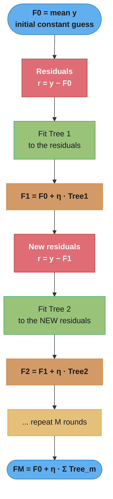
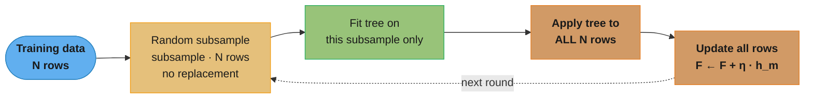
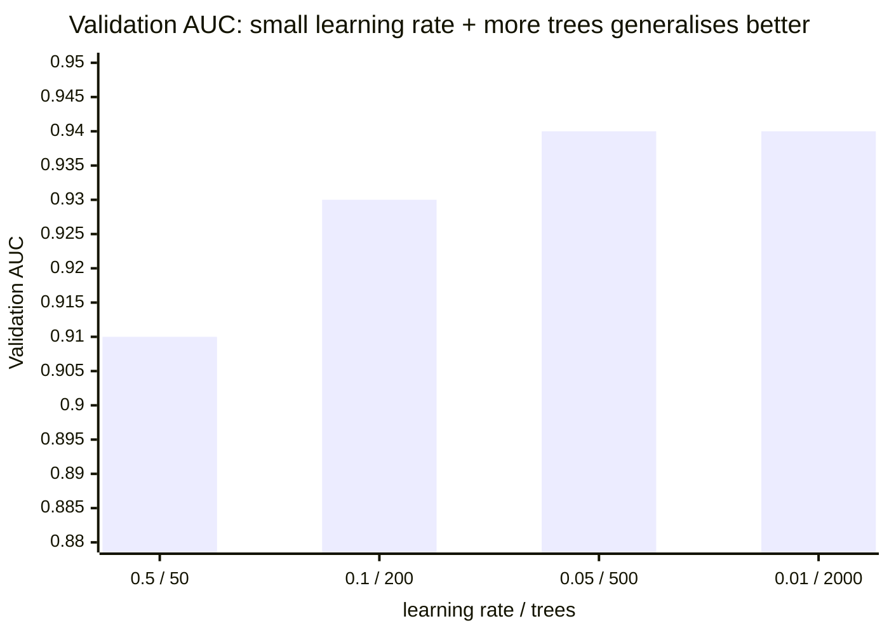
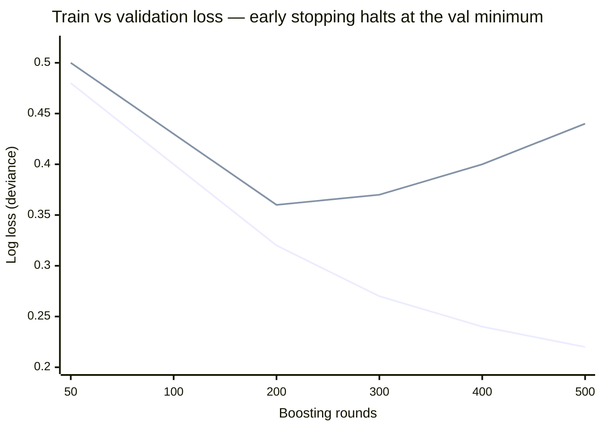

# Gradient Boosting — Deep Dive

## 1. Concept Overview

Gradient Boosting is a sequential ensemble method that builds an additive model by fitting a new weak learner at each step to the negative gradient of the loss function with respect to the current ensemble's predictions. The final model is a weighted sum of weak learners (typically shallow decision trees):

```
F_M(x) = F_0(x) + Σ_{m=1}^{M} η * h_m(x)
```

where η is the learning rate (shrinkage), h_m are weak learners, and F_0 is the initial prediction (usually the log-odds for binary classification or the mean for regression).

Unlike bagging (which reduces variance), gradient boosting primarily reduces **bias** by iteratively correcting the ensemble's mistakes. The sequential nature means each tree depends on all previous trees, creating powerful but computationally sequential training. Stochastic gradient boosting (random subsampling) adds variance reduction on top of bias reduction.

---

## 2. Intuition

One-line analogy: gradient boosting is like a student who takes many small tests, each focused on the questions they got wrong last time, gradually mastering all the material.

Mental model: imagine a group of friends trying to estimate the price of a house. The first person makes a rough guess of $300K. The second person focuses only on the gap (residual) between that guess and the actual $350K — they predict the residual $50K. The third person focuses on whatever residual remains. Each person becomes an expert in the mistakes of the group so far. Their combined prediction: $300K + $50K + ... converges to the true price. Shrinkage (learning rate) means each person only contributes a fraction of their correction, requiring more people but producing a more conservative, robust final answer.

Why it matters: gradient boosting with XGBoost or LightGBM wins the majority of Kaggle structured data competitions and is the dominant production algorithm for tabular ML. The framework is general: by changing the loss function you get regression, classification, ranking, survival analysis, or any custom objective.

Key insight: fitting the negative gradient is gradient descent in function space. The "direction" that reduces loss most steeply is the negative gradient; each weak learner approximates a step in that direction. This unification — boosting as gradient descent — is due to Friedman (2001) and is what makes GBDT generalisable to arbitrary differentiable losses.

---

## 3. Core Principles

### Additive Model

```
F_0(x) = argmin_γ Σ_i L(y_i, γ)   (initial constant prediction)

For m = 1, 2, ..., M:
    r_im = -[∂L(y_i, F(x_i)) / ∂F(x_i)]_{F=F_{m-1}}   (pseudo-residuals)
    h_m(x) = tree fit to {(x_i, r_im)}   (weak learner)
    γ_m = argmin_γ Σ_i L(y_i, F_{m-1}(x_i) + γ*h_m(x_i))  (line search)
    F_m(x) = F_{m-1}(x) + η * γ_m * h_m(x)
```

### Why Negative Gradient, Not Raw Residuals

For squared error loss L = (y - F(x))^2 / 2:
```
-∂L/∂F = -(F(x) - y) = y - F(x) = residual
```
Here the negative gradient IS the raw residual. For log loss (binary cross-entropy):
```
L = -[y*log(p) + (1-y)*log(1-p)],  p = sigmoid(F(x))
-∂L/∂F = y - p
```
This is the residual in probability space, not raw residual. For MAE L = |y - F(x)|:
```
-∂L/∂F = sign(y - F(x))   (subgradient)
```
Fitting this produces a boosted quantile (median) regressor. The pseudo-residual formulation unifies all these cases.

### Bias Reduction Mechanism

GBDT starts with a high-bias model (F_0 = constant) and iteratively reduces bias by targeting current errors. After M steps, if the trees are expressive enough, bias can be reduced to near zero — at the risk of overfitting (high variance). Regularisation (shrinkage, max_depth, subsampling) limits variance.

### The Fundamental Tradeoff: Learning Rate vs N_estimators

```
Small η (e.g., 0.01) + large M (e.g., 5000):
    - Each step makes a tiny correction
    - Better generalisation (individual trees have less influence)
    - Much slower to train
    - Must use early stopping to find optimal M

Large η (e.g., 0.3) + small M (e.g., 100):
    - Faster convergence to training loss
    - Tends to overfit (trees have large, greedy corrections)
    - Training is fast but risk of overfitting is high

Rule of thumb: η=0.05 with early stopping and max M=2000 is a good default
```

---

## 4. Types / Architectures / Strategies

### 4.1 Vanilla Gradient Boosting (Friedman 2001)

- No regularisation beyond tree depth constraints and learning rate
- sklearn's GradientBoostingClassifier — correct but slow (pure Python tree builder)

### 4.2 Stochastic Gradient Boosting

- subsample < 1.0: each tree trained on a random fraction of training rows
- Reduces correlation between trees (like bagging), reduces overfitting, speeds up training
- subsample=0.8 is typical; lower values increase randomness

### 4.3 XGBoost

- Regularised objective: adds L1 (alpha) and L2 (lambda) penalties on leaf weights
- Second-order Taylor expansion of the loss
- Approximate split finding with column blocks
- Hardware-optimised (see xgboost_lightgbm.md for full deep dive)

### 4.4 LightGBM

- GOSS + EFB + histogram binning + leaf-wise growth
- 3-5× faster than XGBoost on CPU; similar GPU speed
- See xgboost_lightgbm.md for full deep dive

### 4.5 CatBoost

- Ordered boosting: uses permutation of training rows to avoid target leakage in categorical feature processing
- Native categorical support without preprocessing
- Symmetric trees (all leaves at same depth) for fast CPU prediction

### 4.6 AdaBoost vs Gradient Boosting

| Property | AdaBoost | Gradient Boosting |
|----------|----------|-------------------|
| Update mechanism | Re-weight misclassified samples | Fit negative gradient |
| Loss function | Fixed: exponential | Any differentiable loss |
| Weak learner | Stumps (1-level trees) typical | Trees of depth 2-8 |
| Sensitivity to noise | High (outlier amplification) | Lower (with Huber loss) |
| Relation | Special case of GBM with exponential loss | General framework |

### 4.7 sklearn HistGradientBoostingClassifier

- Histogram-based binning (255 bins per feature) — same idea as LightGBM
- Significantly faster than GradientBoostingClassifier for large datasets
- Native missing value support (sklearn 0.21+)
- Use this over GradientBoostingClassifier for any dataset > 10K rows

---

## 5. Architecture Diagrams

### Gradient Boosting Sequential Training



Each tree is trained not on the labels but on the current residuals (the red nodes — the negative gradient of the loss). The ensemble adds a shrunken slice `η · Tree_m` of each correction, so the prediction crawls toward the target one small step at a time. Unlike bagging, the trees are strictly sequential: Tree 2 cannot start until F1 exists.

### Loss Functions and Their Pseudo-Residuals

```
Regression:
    Squared Error:   r_i = y_i - F(x_i)
    MAE:             r_i = sign(y_i - F(x_i))
    Huber (delta):   r_i = y_i - F(x_i)     if |y_i - F(x_i)| <= delta
                     r_i = delta * sign(...)  otherwise

Classification (binary):
    Log Loss:        r_i = y_i - sigmoid(F(x_i))

Classification (multiclass, K classes):
    Softmax:         r_{ik} = 1[y_i=k] - softmax(F_k(x_i))
    (K separate trees per round)

Ranking:
    LambdaMART:      r_i = Σ_j λ_{ij}   (gradient from pairwise comparison)
```

### Stochastic Gradient Boosting with Subsampling



Each round fits its tree on a fresh random fraction (typically 0.8) of the rows drawn without replacement, then applies that tree to every row to update predictions. The per-round randomness de-correlates trees and acts as regularization — the same intuition as stochastic gradient descent injecting noise into each step.

### Regularisation Knobs and Their Effects

```
                  REGULARISATION DIAGRAM

Variance                              Bias
|<--- More regularisation ---------->|<--- Less --->|

Tree depth:    max_depth=2    ...    max_depth=8    unlimited
Shrinkage:     η=0.01         ...    η=0.1          η=0.5
Subsample:     0.5            ...    0.8            1.0
Min leaf:      min_child_w=10 ...    min_child_w=1
```

### Learning Rate vs n_estimators Tradeoff



Shrinkage and tree count trade off directly. A big step (η=0.5) with few trees overshoots and overfits; halving the rate and multiplying the tree count buys better generalization — up to a plateau where more trees stop helping. This is why the recipe is "set η small, set n_estimators high, and let early stopping pick the count."

### Train vs Validation Loss — Why Early Stopping Exists



The lower line (train loss) falls monotonically toward zero as trees keep memorizing; the upper line (validation loss) bottoms out around round 200 and then rises as the model overfits. Early stopping monitors that upper curve and halts at its minimum — the extra 300 rounds only hurt.

---

## 6. How It Works — Detailed Mechanics

### Implementing Gradient Boosting from Scratch (Squared Error)

```python
from __future__ import annotations

import numpy as np
from sklearn.tree import DecisionTreeRegressor
from sklearn.metrics import mean_squared_error


class SimpleGradientBooster:
    """Gradient boosting with squared error loss for demonstration."""

    def __init__(
        self,
        n_estimators: int = 100,
        learning_rate: float = 0.1,
        max_depth: int = 3,
    ) -> None:
        self.n_estimators = n_estimators
        self.learning_rate = learning_rate
        self.max_depth = max_depth
        self.trees_: list[DecisionTreeRegressor] = []
        self.F0_: float = 0.0

    def fit(self, X: np.ndarray, y: np.ndarray) -> "SimpleGradientBooster":
        # Initial prediction: mean (minimises squared error)
        self.F0_ = y.mean()
        F = np.full(len(y), self.F0_)

        for _ in range(self.n_estimators):
            # Pseudo-residuals = negative gradient of squared error
            # -∂(y-F)^2/2 / ∂F = y - F
            residuals = y - F   # for squared error: residual == negative gradient

            # Fit a shallow tree to the residuals
            tree = DecisionTreeRegressor(max_depth=self.max_depth)
            tree.fit(X, residuals)
            self.trees_.append(tree)

            # Update predictions with shrinkage
            F += self.learning_rate * tree.predict(X)

        return self

    def predict(self, X: np.ndarray) -> np.ndarray:
        F = np.full(X.shape[0], self.F0_)
        for tree in self.trees_:
            F += self.learning_rate * tree.predict(X)
        return F


# Test: compare to sklearn
from sklearn.datasets import make_regression
from sklearn.model_selection import train_test_split
from sklearn.ensemble import GradientBoostingRegressor

X, y = make_regression(n_samples=5_000, n_features=20, noise=10, random_state=42)
X_train, X_test, y_train, y_test = train_test_split(X, y, test_size=0.2, random_state=42)

custom_gb = SimpleGradientBooster(n_estimators=100, learning_rate=0.1, max_depth=3)
custom_gb.fit(X_train, y_train)
custom_rmse = np.sqrt(mean_squared_error(y_test, custom_gb.predict(X_test)))

sklearn_gb = GradientBoostingRegressor(n_estimators=100, learning_rate=0.1, max_depth=3)
sklearn_gb.fit(X_train, y_train)
sklearn_rmse = np.sqrt(mean_squared_error(y_test, sklearn_gb.predict(X_test)))

print(f"Custom GB RMSE: {custom_rmse:.4f}")
print(f"sklearn GB RMSE: {sklearn_rmse:.4f}")
# Should be nearly identical
```

### Production GBDT with Early Stopping

```python
import numpy as np
import pandas as pd
from sklearn.datasets import make_classification
from sklearn.model_selection import train_test_split, StratifiedKFold, cross_val_score
from sklearn.ensemble import (
    GradientBoostingClassifier,
    HistGradientBoostingClassifier,
)
from sklearn.metrics import roc_auc_score


X, y = make_classification(
    n_samples=100_000,
    n_features=50,
    n_informative=30,
    random_state=42,
)
X_train, X_test, y_train, y_test = train_test_split(
    X, y, test_size=0.2, random_state=42, stratify=y
)
X_train2, X_val, y_train2, y_val = train_test_split(
    X_train, y_train, test_size=0.2, random_state=42, stratify=y_train
)

# --- Option 1: HistGradientBoostingClassifier (sklearn) — fast, native missing ---
hist_gb = HistGradientBoostingClassifier(
    max_iter=1000,              # upper bound; early stopping will stop earlier
    learning_rate=0.05,
    max_depth=None,             # leaf-wise equivalent: use max_leaf_nodes
    max_leaf_nodes=63,          # 2^6 - 1; controls tree complexity
    min_samples_leaf=20,
    l2_regularization=0.1,
    early_stopping=True,        # built-in early stopping
    validation_fraction=0.1,
    n_iter_no_change=50,        # stop if no improvement for 50 rounds
    tol=1e-4,
    scoring="roc_auc",
    random_state=42,
)
hist_gb.fit(X_train, y_train)
print(f"HistGB AUC: {roc_auc_score(y_test, hist_gb.predict_proba(X_test)[:, 1]):.4f}")
print(f"Stopped at iteration: {hist_gb.n_iter_}")
```

### Effect of Learning Rate and n_estimators

```python
# Demonstrate shrinkage: small lr + more trees = better generalisation
from sklearn.metrics import roc_auc_score

configs: list[dict] = [
    {"learning_rate": 0.5, "max_iter": 50},
    {"learning_rate": 0.1, "max_iter": 200},
    {"learning_rate": 0.05, "max_iter": 500},
    {"learning_rate": 0.01, "max_iter": 2000},
]

for cfg in configs:
    model = HistGradientBoostingClassifier(
        **cfg,
        max_leaf_nodes=31,
        random_state=42,
        early_stopping=False,   # disable to compare at fixed n_estimators
    )
    model.fit(X_train2, y_train2)
    train_auc = roc_auc_score(y_train2, model.predict_proba(X_train2)[:, 1])
    val_auc = roc_auc_score(y_val, model.predict_proba(X_val)[:, 1])
    print(
        f"lr={cfg['learning_rate']:.2f}, "
        f"trees={cfg['max_iter']:4d}, "
        f"train_auc={train_auc:.4f}, "
        f"val_auc={val_auc:.4f}"
    )
# Expected: small lr + many trees gets best val_auc but equal-or-worse train_auc
# lr=0.5, trees=50:    train=0.98, val=0.91  (overfit, high variance)
# lr=0.1, trees=200:   train=0.97, val=0.93
# lr=0.05, trees=500:  train=0.96, val=0.94
# lr=0.01, trees=2000: train=0.94, val=0.94  (still converging; need more trees)
```

### Subsampling (Stochastic Gradient Boosting)

```python
# Compare no subsample vs subsample=0.8
from sklearn.ensemble import GradientBoostingClassifier

gb_full = GradientBoostingClassifier(
    n_estimators=200,
    learning_rate=0.1,
    max_depth=4,
    subsample=1.0,       # no subsampling
    random_state=42,
)

gb_stochastic = GradientBoostingClassifier(
    n_estimators=200,
    learning_rate=0.1,
    max_depth=4,
    subsample=0.8,       # 80% of rows per tree
    random_state=42,
)

gb_full.fit(X_train2, y_train2)
gb_stochastic.fit(X_train2, y_train2)

auc_full = roc_auc_score(y_val, gb_full.predict_proba(X_val)[:, 1])
auc_stoch = roc_auc_score(y_val, gb_stochastic.predict_proba(X_val)[:, 1])
print(f"Full data AUC: {auc_full:.4f}")
print(f"Stochastic AUC: {auc_stoch:.4f}")
# Stochastic typically 0.1-0.5% better on noisy datasets due to variance reduction
```

### Custom Loss Function

```python
# Huber loss for robust regression (less sensitive to outliers than squared error)
from sklearn.ensemble import GradientBoostingRegressor

gb_huber = GradientBoostingRegressor(
    loss="huber",
    alpha=0.9,         # quantile parameter for huber; also controls robustness
    n_estimators=300,
    learning_rate=0.05,
    max_depth=4,
    subsample=0.8,
    random_state=42,
)
# Huber loss: for |residual| <= delta, use squared error; else use delta*|residual| - delta^2/2
# Robust to outliers because large residuals don't get squared amplification

# Quantile regression: predict 90th percentile instead of mean
gb_quantile = GradientBoostingRegressor(
    loss="quantile",
    alpha=0.9,          # predict 90th percentile
    n_estimators=300,
    learning_rate=0.05,
    random_state=42,
)
```

### Learning Curve Analysis

```python
# Track train vs validation loss per round (staged_predict_proba for sklearn)
from sklearn.metrics import log_loss

gb_staged = GradientBoostingClassifier(
    n_estimators=500,
    learning_rate=0.1,
    max_depth=4,
    subsample=0.8,
    random_state=42,
)
gb_staged.fit(X_train2, y_train2)

train_deviance: list[float] = []
val_deviance: list[float] = []

for y_pred in gb_staged.staged_predict_proba(X_train2):
    train_deviance.append(log_loss(y_train2, y_pred))

for y_pred in gb_staged.staged_predict_proba(X_val):
    val_deviance.append(log_loss(y_val, y_pred))

optimal_iter = int(np.argmin(val_deviance)) + 1
print(f"Optimal n_estimators: {optimal_iter}")
print(f"Min val log loss: {min(val_deviance):.4f}")
print(f"Train log loss at optimum: {train_deviance[optimal_iter-1]:.4f}")
# Large gap between train and val loss at optimum indicates overfitting
# Increase subsample, decrease max_depth, increase learning_rate slightly
```

---

## 7. Real-World Examples

### Search Ranking (LambdaMART)

Web search ranking uses gradient boosting with LambdaMART loss — a ranking loss that directly optimises NDCG (Normalised Discounted Cumulative Gain). Microsoft's original RankNet/LambdaMART paper showed GBDT outperforms pointwise regression for ranking. Production: ~50 features per (query, document) pair, 300 rounds, learning_rate=0.05, max_depth=6. Serving: ~2ms for 1000 candidate documents.

### Insurance Premium Pricing

- Loss function: Tweedie loss (power=1.5) for non-negative, right-skewed claims amounts
- n_estimators=500, learning_rate=0.03, early stopping on a 20% holdout
- 42 features: vehicle attributes, driver history, geographic risk scores
- Val RMSE improved 12% over actuarial linear model
- Subsampling=0.8 reduced overfitting on the 15% of customers with multiple claims

### Click-Through Rate Prediction

Standard industry setup: offline training on 7 days of click logs (100M rows), GBDT with log loss, deployed to serve in-memory predictions for millions of ad auctions per second. Key: each decision tree has max_depth=6 (at most 64 leaves), so prediction is a 64-entry table lookup per tree — extremely fast. 500 trees × 64-leaf lookup = 500 memory accesses per prediction, ~0.1ms on warm cache.

---

## 8. Tradeoffs

### Loss Function Comparison

| Loss | Use Case | Robustness to Outliers | Notes |
|------|----------|----------------------|-------|
| Squared error | Regression, outliers few | Low | Fastest to converge |
| Huber | Regression, outliers present | High | delta must be tuned |
| MAE | Median regression | Very High | Slow convergence, subgradient |
| Log loss | Binary classification | Medium | Standard for binary |
| Softmax | Multiclass | Medium | K trees per round |
| Quantile | Prediction intervals | High | For uncertainty estimation |
| Tweedie | Insurance, counts | Medium | Non-negative responses |

### Gradient Boosting vs Random Forest

| Dimension | Gradient Boosting | Random Forest |
|-----------|------------------|---------------|
| Training | Sequential (slow) | Parallel (fast) |
| Bias | Very low | Low |
| Variance | Low (w/ regularisation) | Low |
| Hyperparameter sensitivity | High | Low |
| Missing value handling | XGB/LGB: yes, sklearn GBT: no | No |
| Default accuracy on tabular | Best | Good |
| Overfitting risk | Medium | Low |
| Interpretability (SHAP) | Yes (TreeSHAP) | Yes (TreeSHAP) |

---

## 9. When to Use / When NOT to Use

### When to Use GBDT

- Primary algorithm for tabular/structured data competitions and production
- When you need the highest possible AUC and have tuning budget
- Imbalanced datasets: scale_pos_weight in XGBoost, is_unbalance in LightGBM
- Mixed data (numeric + categorical): XGBoost/LightGBM handle both natively
- Noisy targets/outliers: use Huber loss
- Ranking tasks: LambdaRank/LambdaMART loss
- When missing values are present in features: XGBoost/LightGBM handle natively

### When NOT to Use

- Image, audio, text: deep learning dominates
- Tiny datasets (< 500 rows): single tree or logistic regression + regularisation
- Real-time inference < 1ms latency with very large models: use quantised neural nets or linear models
- Strong temporal dependencies: GBDT has no sequential structure; LSTM/Transformer better
- When you need online learning (streaming updates): GBDT is batch; use online boosting variants

---

## 10. Common Pitfalls

### Pitfall 1: Not Using Early Stopping

The single most common mistake: setting n_estimators=1000 and not monitoring validation loss.

```python
# BROKEN: no early stopping, guaranteed to overfit at some point
gb_bad = GradientBoostingClassifier(n_estimators=1000, learning_rate=0.1)
gb_bad.fit(X_train, y_train)
# Training loss → 0, but validation loss starts increasing after ~200 rounds

# FIXED with HistGradientBoosting
gb_good = HistGradientBoostingClassifier(
    max_iter=2000,
    learning_rate=0.05,
    early_stopping=True,
    n_iter_no_change=50,
    validation_fraction=0.15,
    scoring="roc_auc",
    random_state=42,
)
gb_good.fit(X_train, y_train)
print(f"Stopped at {gb_good.n_iter_} iterations")
```

### Pitfall 2: Large Learning Rate with Few Trees

Many practitioners set learning_rate=0.3 (XGBoost default) with n_estimators=100 and call it tuned. The model trains fast and looks reasonable but leaves 1-2% AUC on the table compared to learning_rate=0.05 with 500+ rounds.

```python
# BROKEN: high lr, too few trees
xgb_bad = xgb.XGBClassifier(learning_rate=0.3, n_estimators=100)

# FIXED
xgb_good = xgb.XGBClassifier(
    learning_rate=0.05,
    n_estimators=2000,            # set high; early stopping will find optimum
    early_stopping_rounds=50,
    eval_metric="auc",
    random_state=42,
)
xgb_good.fit(
    X_train2, y_train2,
    eval_set=[(X_val, y_val)],
    verbose=False,
)
print(f"Best iteration: {xgb_good.best_iteration}")
```

### Pitfall 3: Target Leakage Through the Boosting Rounds

A team building a churn model included "days_since_last_purchase" computed on the prediction date. During training, this feature was computed correctly. In production, there was a 24-hour delay in the feature pipeline, so the feature was stale. Because GBDT aggressively uses the most predictive features at top splits, this feature dominated all trees. When the feature pipeline was delayed, AUC dropped from 0.89 to 0.74 overnight.

Diagnosis: SHAP value for "days_since_last_purchase" was the dominant feature. Any single feature with SHAP value > 5× the next feature is a leakage red flag. Always audit top-5 SHAP features against their data pipeline freshness.

### Pitfall 4: Incorrect eval_set Usage in XGBoost

```python
import xgboost as xgb

# BROKEN: eval_set uses training data — no early stopping signal
xgb_bad = xgb.XGBClassifier(n_estimators=500, early_stopping_rounds=50)
xgb_bad.fit(
    X_train, y_train,
    eval_set=[(X_train, y_train)],  # WRONG: training loss always decreases
    verbose=False,
)

# FIXED: eval_set must be a held-out validation set
xgb_good = xgb.XGBClassifier(n_estimators=1000, early_stopping_rounds=50, eval_metric="auc")
xgb_good.fit(
    X_train2, y_train2,
    eval_set=[(X_val, y_val)],      # held-out validation set
    verbose=False,
)
```

### Pitfall 5: AdaBoost Amplifying Label Noise

AdaBoost assigns exponentially growing weights to misclassified samples. If training labels are noisy (5% mislabelled), AdaBoost can focus almost entirely on the mislabelled samples after a few rounds, destroying generalisation. Use gradient boosting with a robust loss (Huber or log loss) instead. Gradient boosting's pseudo-residuals naturally bound the update magnitude at each step.

---

## 11. Technologies & Tools

| Tool | Key Feature for GBDT |
|------|---------------------|
| sklearn GradientBoostingClassifier | Reference implementation; slow for large data |
| sklearn HistGradientBoostingClassifier | Histogram-based, fast, native NaN handling |
| XGBoost 2.0+ | GPU hist, regularised objective, multi-output support |
| LightGBM 4.0+ | GOSS, EFB, fastest CPU training, categorical support |
| CatBoost 1.2+ | Ordered boosting, native categoricals, symmetric trees |
| SHAP 0.44+ | TreeSHAP: O(TLD^2) Shapley values; works on all tree ensembles |
| Optuna 3.3+ | Hyperparameter search with pruning (stops unpromising trials early) |
| MLflow 2.10+ | GBDT auto-logging: params, metrics, model artifact |
| scikit-optimize | Bayesian optimisation for GBDT hyperparameters |

---

## 12. Interview Questions with Answers

**Q: What is gradient boosting and why does it fit the negative gradient rather than raw residuals?**
Gradient boosting constructs an additive model F_M(x) = Σ η*h_m(x) by sequentially fitting weak learners h_m to the negative gradient of the loss with respect to the current predictions. For squared error loss, the negative gradient equals the raw residual y - F(x), so the two are identical. For other losses (log loss, MAE, Huber), the negative gradient is a different quantity — for log loss it is y - sigmoid(F(x)), the residual in probability space. Framing boosting as gradient descent in function space unifies all loss functions: by choosing different loss functions, you get regression, classification, ranking, and quantile regression from the same algorithmic framework.

**Q: What is shrinkage (learning rate) in gradient boosting and what tradeoff does it introduce?**
Shrinkage scales each tree's contribution by η: F_m(x) = F_{m-1}(x) + η*h_m(x). A smaller η requires more trees to reach the same training loss but typically achieves better generalisation — each tree makes a conservative, partial correction rather than a full step. This is analogous to gradient descent with a small step size: it takes more iterations but avoids overshooting the minimum. The practical tradeoff: η=0.01 needs 5000 trees (slow training) but generalises well; η=0.3 with 100 trees trains fast but often overfits. Best practice: set η=0.05, set n_estimators very high, and use early stopping to find the optimal number of trees on a validation set.

**Q: What is the difference between AdaBoost and gradient boosting?**
AdaBoost updates a sample weight distribution after each round: misclassified samples receive higher weight so subsequent learners focus on them. It uses a fixed exponential loss and typically uses stumps (max_depth=1). Gradient boosting fits the negative gradient of any differentiable loss using standard (unweighted) trees at each step. Key differences: (1) Loss function — AdaBoost is locked to exponential loss; GBDT accepts any differentiable loss; (2) Noise sensitivity — exponential loss amplifies outlier weights exponentially, making AdaBoost brittle to label noise; GBDT with Huber loss is robust; (3) Flexibility — GBDT subsumes AdaBoost (AdaBoost is a special case with exponential loss and stagewise additive modelling).

**Q: Why does gradient boosting overfit as you add trees, while Random Forest does not?**
Because boosting fits trees sequentially to the current residuals, so each extra tree keeps chasing the remaining errors — including noise — and validation loss eventually rises. Random Forest instead grows independent trees on separate bootstrap samples and averages them, so adding trees only reduces variance toward the correlation floor and never increases overfitting. The practical consequence is that n_estimators is a critical, must-tune hyperparameter for boosting (via early stopping) but is merely "set it high enough" for Random Forest. This is the single most important behavioral difference between the two ensembles.

**Q: Do you need to scale features or one-hot encode categoricals before gradient boosting?**
No feature scaling is needed — like all tree ensembles, gradient boosting is invariant to monotonic transforms, so standardizing or normalizing changes nothing. Categorical handling depends on the library: sklearn's GradientBoostingClassifier needs numeric encoding (ordinal or target encoding, not one-hot, which explodes dimensionality and starves splits), whereas LightGBM and CatBoost accept categoricals natively and CatBoost's ordered target statistics avoid the leakage that naive target encoding introduces. One-hot encoding a high-cardinality categorical is a common mistake that both slows training and weakens splits.

**Q: How does stochastic gradient boosting work and what problem does it solve?**
Stochastic gradient boosting (subsample < 1.0) trains each tree on a random fraction of the training rows drawn without replacement. This introduces variance into the boosting process: each tree sees a different subset of the data, reducing correlation between trees and acting as a form of regularisation. The mechanism is analogous to the stochastic in stochastic gradient descent — introducing noise into the gradient estimate can help escape local optima and reduce overfitting. Typical value: subsample=0.8 (train each tree on 80% of rows). Column subsampling (colsample_bytree, colsample_bylevel) adds feature-level randomness, similar to Random Forest's max_features.

**Q: What is the role of max_depth in gradient boosting versus Random Forest?**
In Random Forest, max_depth controls individual tree quality but deep trees are desirable (low bias), as variance is controlled by averaging. In gradient boosting, max_depth controls the order of feature interactions captured by each tree: max_depth=1 (stumps) captures no interactions; max_depth=6 captures up to 6-way interactions. Deeper trees in GBDT lead to faster bias reduction (fewer rounds needed) but higher risk of overfitting — variance is harder to control because trees are not independent. Typical values: max_depth=4-8 for XGBoost/sklearn; LightGBM uses num_leaves (max_depth is capped at 31 by default but leaves control actual complexity). Shallow trees + more rounds (with shrinkage) usually generalise better than deep trees + fewer rounds.

**Q: How do you select the optimal number of boosting rounds (n_estimators)?**
Use early stopping: train on a training set, monitor validation loss every round, stop when validation loss has not improved for N consecutive rounds (typically 50-100). This is the correct approach. Alternatives: (1) staged_predict / staged_predict_proba in sklearn GradientBoosting — evaluate all intermediate stages post-hoc; (2) cross-validated learning curves — expensive but provides variance estimate of optimal rounds; (3) Rule of thumb: use n_estimators=2000, learning_rate=0.05, early_stopping_rounds=100 as starting point for any new dataset. Never fix n_estimators based on training time alone — that is the recipe for either underfitting or overfitting.

**Q: What happens when you set max_depth=1 (stumps) in gradient boosting?**
Each tree is a single split — a decision stump that partitions the space on one feature. This creates a gradient boosting model with no feature interactions: the model is an additive combination of single-feature thresholds. It will have high bias on datasets with interactions but is very regularised and unlikely to overfit. This is actually AdaBoost's default setup. For complex real-world data, max_depth >= 3 is typically needed. max_depth=1 can be used as a diagnostic: if GBDT with stumps achieves similar validation AUC as max_depth=6, your features likely do not have important interactions (consider a linear model instead).

**Q: Why is Huber loss preferred over squared error loss for regression with outliers?**
Squared error penalises large residuals quadratically: a residual of 10 contributes 100 to the loss, focusing all gradient boosting rounds on fitting that point. For noisy data, outliers (mislabelled samples or rare events) can dominate training. Huber loss uses squared error for small residuals (|r| <= delta) and linear loss for large residuals (|r| > delta), bounding the gradient magnitude at delta. This prevents any single outlier from receiving runaway weight in gradient updates. The parameter delta controls the boundary (typically set to the 90th percentile of absolute residuals). MAE is even more robust but converges slowly because its gradient (±1) has no magnitude information.

**Q: What is the relationship between gradient boosting and gradient descent?**
Both perform iterative optimisation by following the negative gradient. In standard gradient descent, you update parameters θ: θ ← θ - η * ∇_θ L. In gradient boosting, you update a function F: F ← F + η * h, where h is a tree that approximates the negative gradient of L with respect to the current function values. The analogy: parameters θ correspond to the function F; updating θ by -∇_θ L corresponds to updating F by adding a tree fit to the pseudo-residuals (negative gradient). The "function space" framing is due to Friedman: instead of optimising in parameter space, you optimise in function space where each tree is a basis function.

**Q: How does gradient boosting handle multiclass classification?**
With K classes, gradient boosting trains K trees per round — one per class. Each tree predicts the pseudo-residual for one class from the softmax multinomial deviance loss. The predicted log-odds for class k at round m: F_{m,k}(x) = F_{m-1,k}(x) + η * h_{m,k}(x). This means a model with 500 rounds and 10 classes trains 5000 trees total. XGBoost and LightGBM optimise this: they can train all K trees in one pass and exploit vector operations. For large K (e.g., 1000 product categories), a two-stage approach (GBDT for top-100, linear model for final ranking) is common.

**Q: What are the key regularisation hyperparameters for XGBoost and what does each control?**
(1) max_depth (default 6): maximum tree depth; directly controls model complexity and interaction order. (2) min_child_weight (default 1): minimum sum of instance weights in a leaf; higher values prevent splitting on small groups. (3) subsample (default 1.0): fraction of training rows per tree; acts like stochastic GBM. (4) colsample_bytree / colsample_bylevel / colsample_bynode: fraction of features at tree/level/node level. (5) lambda (default 1): L2 regularisation on leaf weights; prevents leaf weights from becoming extreme. (6) alpha (default 0): L1 regularisation on leaf weights; promotes sparsity in leaf weights. (7) gamma (default 0): minimum loss reduction required to split; acts as pruning. Start with max_depth and min_child_weight as primary knobs; subsample and colsample_bytree for regularisation; lambda for weight regularisation.

**Q: How do you detect and prevent overfitting in gradient boosting?**
Detection: plot training loss vs validation loss across rounds — the point where they diverge is the overfitting threshold. If training AUC reaches 0.99 while validation AUC plateaus at 0.88, you have overfit. Prevention strategies in priority order: (1) Early stopping — most effective, always use it; (2) Reduce learning rate + increase n_estimators; (3) Reduce max_depth (from 6 to 3-4); (4) Increase min_child_weight or min_samples_leaf; (5) Add subsampling (subsample=0.8); (6) Add L2 regularisation (lambda=5-10 in XGBoost); (7) Reduce max_features (colsample_bytree=0.7). Apply in this order — early stopping fixes most overfitting cases; the rest are for marginal improvements.

**Q: When should you prefer sklearn's GradientBoostingClassifier vs HistGradientBoostingClassifier?**
Prefer HistGradientBoostingClassifier (HGBT) almost always for datasets > 10K rows. HGBT uses histogram-based binning (discretises features into <= 255 bins) which reduces the split-finding complexity from O(N log N) to O(N + B * K) where B=255 bins, K=n_features. Training is 10-100x faster. HGBT also supports native NaN handling, monotone constraints, and interaction constraints. Use the original GradientBoostingClassifier only when: (a) you need exact split points (not binned approximations) on a small dataset; (b) you need access to staged predictions (staged_predict_proba) which HGBT does not support as of sklearn 1.4. For production on any non-trivial dataset, HGBT or XGBoost/LightGBM are the correct choices.

**Q: What is the deviance in gradient boosting and how is it different from the loss?**
In sklearn's GradientBoostingClassifier, deviance refers to the per-sample negative log-likelihood — it is used as the training and validation loss metric displayed during training. For binary classification with log loss: deviance_i = -[y_i * log(p_i) + (1-y_i) * log(1-p_i)]. The term "deviance" comes from generalised linear model terminology where it measures goodness of fit. It is equivalent to cross-entropy loss and is the same quantity minimised by logistic regression. In the staged_deviance_ attribute, sklearn stores the training and test deviance per round — useful for plotting learning curves and diagnosing overfitting without re-running staged_predict_proba.

**Q: What is the difference between level-wise (depth-wise) and leaf-wise tree growth in gradient boosting?**
Level-wise growth (XGBoost's default) expands every node at a depth before going deeper, while leaf-wise growth (LightGBM's default) always splits the leaf with the highest loss reduction. Level-wise keeps trees balanced; leaf-wise produces deeper, asymmetric trees. Leaf-wise converges faster and often reaches lower loss for the same number of leaves because it always chases the biggest available gain, but it overfits more easily on small datasets — which is why LightGBM exposes num_leaves and min_child_samples as the primary guards rather than max_depth. Level-wise is more conservative and easier to regularize with a simple depth cap. CatBoost takes a third path: symmetric (oblivious) trees that use the same split across an entire level for very fast inference.

---

## 13. Best Practices

1. Always use early stopping. Set n_estimators very high (2000+) and let the validation set determine when to stop.
2. Use learning_rate=0.05 as default; tune max_depth and subsample before lowering learning rate further.
3. Prefer HistGradientBoostingClassifier (sklearn) or LightGBM over the original GradientBoostingClassifier for any dataset > 10K rows.
4. Use subsample=0.8 and colsample_bytree=0.8 as defaults — they add beneficial stochasticity with minimal performance cost.
5. For class imbalance, use scale_pos_weight (XGBoost) or is_unbalance/class_weight (LightGBM) rather than resampling.
6. Audit the top-5 SHAP features after every model retrain in production — sudden SHAP dominance by a single feature is a leakage or pipeline freshness alert.
7. Use Huber loss for regression problems if you suspect outliers; it is more robust than squared error with minimal additional tuning.
8. For multiclass with many classes (> 50), consider hierarchical classification or a two-stage approach (GBDT for top-K, linear model for final ranking) to control training time.
9. When using cross-validation, split by time (TimeSeriesSplit) for temporal data — random CV on time series leaks future data.
10. Monitor validation AUC, not just training AUC, for every production model retrain. A model that trains faster because it overfit the training set is not an improvement.

---

## 14. Case Study

### Problem: Predicting Hospital Readmission Risk

**Context**: 120K patient records, binary classification (readmission within 30 days), 85 features (lab values, diagnoses, procedure codes, insurance type), severe class imbalance (12% positive). Regulatory requirement: model must be explainable to clinicians.

**Challenge**: large number of ICD-10 diagnosis codes (categorical, 8000 unique values), missing lab values (~30% of rows), noisy labels (some readmissions miscoded), clinical importance of recall (missing a high-risk patient is worse than a false alarm).

**Model development**:

```python
import lightgbm as lgb
from sklearn.model_selection import StratifiedKFold
import shap

params = {
    "objective": "binary",
    "metric": "auc",
    "n_estimators": 2000,
    "learning_rate": 0.03,
    "num_leaves": 63,
    "max_depth": -1,
    "min_child_samples": 30,     # equivalent to min_samples_leaf
    "subsample": 0.8,
    "colsample_bytree": 0.7,
    "reg_alpha": 0.1,
    "reg_lambda": 1.0,
    "scale_pos_weight": 7,       # ~1/(0.12) for balanced gradient signal
    "n_jobs": -1,
    "random_state": 42,
    "verbose": -1,
}

# 5-fold CV with early stopping per fold
cv = StratifiedKFold(n_splits=5, shuffle=True, random_state=42)
oof_preds = np.zeros(len(y))

for fold, (tr_idx, val_idx) in enumerate(cv.split(X, y)):
    X_tr, X_val_fold = X.iloc[tr_idx], X.iloc[val_idx]
    y_tr, y_val_fold = y.iloc[tr_idx], y.iloc[val_idx]

    model = lgb.LGBMClassifier(**params)
    model.fit(
        X_tr, y_tr,
        eval_set=[(X_val_fold, y_val_fold)],
        callbacks=[
            lgb.early_stopping(stopping_rounds=100, verbose=False),
            lgb.log_evaluation(period=-1),
        ],
    )
    oof_preds[val_idx] = model.predict_proba(X_val_fold)[:, 1]
    print(f"Fold {fold+1} AUC: {roc_auc_score(y_val_fold, oof_preds[val_idx]):.4f}")

print(f"OOF AUC: {roc_auc_score(y, oof_preds):.4f}")
# Result: OOF AUC 0.823

# Retrain on full data for final model
final_model = lgb.LGBMClassifier(**{**params, "n_estimators": int(np.mean([m.best_iteration_ for m in fold_models]))})
final_model.fit(X, y)
```

**Explainability for clinicians**:

```python
explainer = shap.TreeExplainer(final_model)
shap_values = explainer.shap_values(X_test)

# For each high-risk patient, show the top 5 contributing features
for patient_idx in high_risk_patients:
    patient_shap = shap_values[1][patient_idx]  # SHAP for positive class
    top_features = pd.Series(patient_shap, index=X.columns).abs().nlargest(5)
    print(f"Patient {patient_idx}: Top risk factors:")
    print(top_features)
```

**Outcome**: OOF AUC 0.823 vs baseline logistic regression 0.771. At the clinically agreed threshold (top 20% risk score), recall for true readmissions improved from 48% to 67%. SHAP explanations accepted by clinical review board — each high-risk patient's alert included the top 3 contributing factors in natural language derived from SHAP values.
