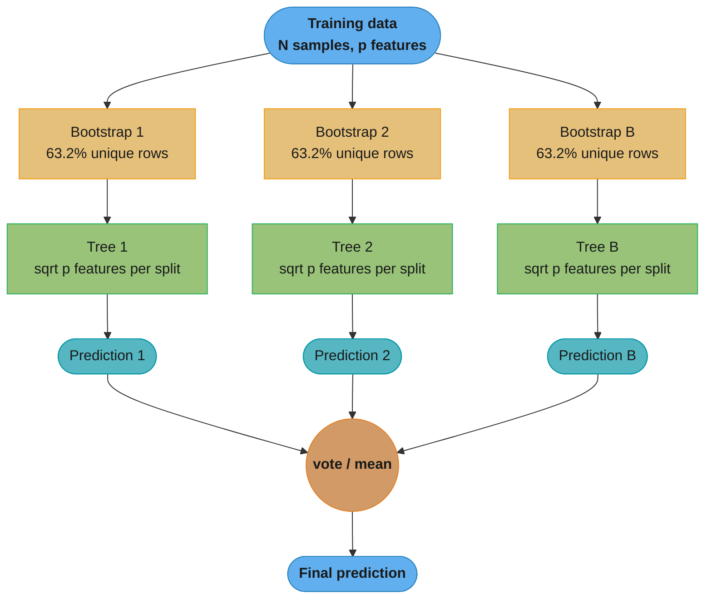
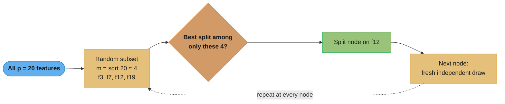
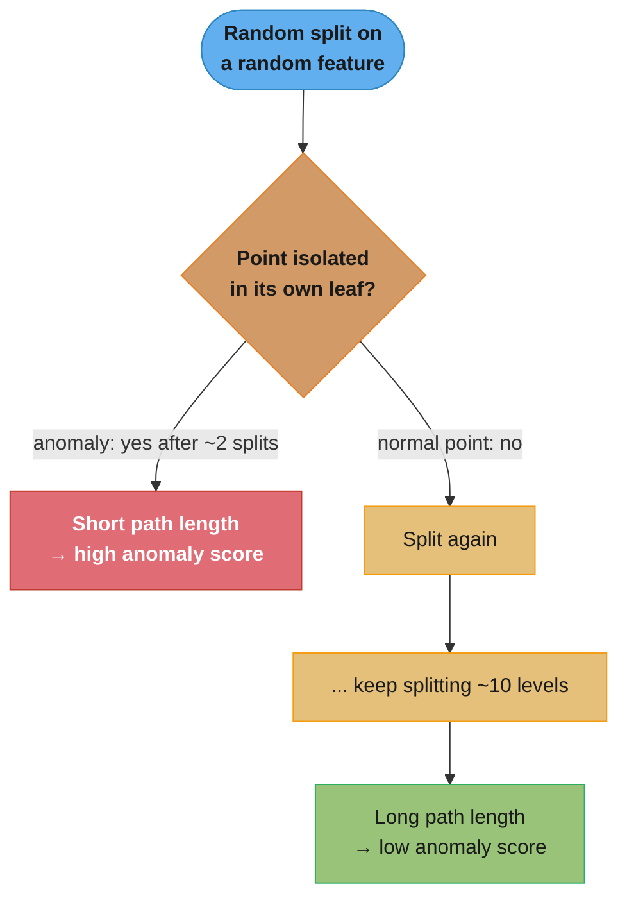
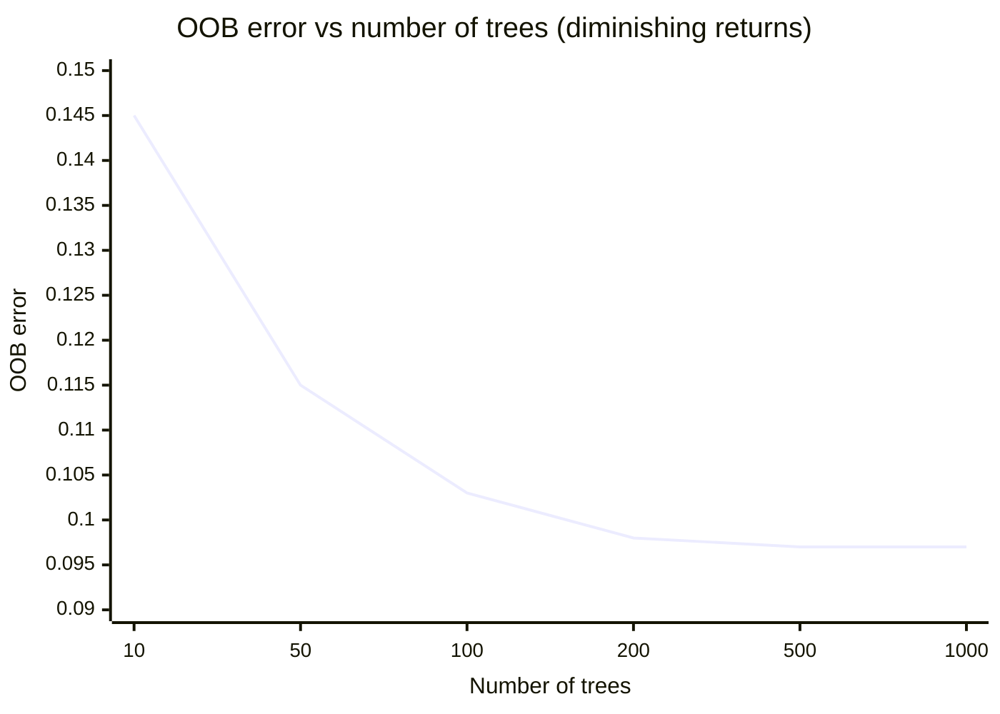

# Random Forests — Deep Dive

## 1. Concept Overview

Random Forest is a bagging ensemble that trains B decision trees, each on a bootstrap sample of the training data, with an additional source of randomness: at each split, only a random subset of features is considered. Predictions are aggregated by majority vote (classification) or averaging (regression). The two sources of randomness — bootstrap sampling and feature subsampling — de-correlate the trees, enabling variance reduction far beyond what simple bagging of full decision trees achieves.

Random Forests are the canonical high-variance, low-bias ensemble. They are highly parallelisable (trees are independent), require minimal preprocessing (no scaling, handle missing values with imputation or surrogate splits), and provide three free diagnostics: OOB error, feature importance, and proximity matrix.

---

## 2. Intuition

One-line analogy: a random forest asks 500 different "experts," each trained on different data and each limited to consulting a random subset of evidence, then combines their votes.

Mental model: suppose each tree makes random, independent errors. The probability that more than half the trees err simultaneously is extremely small. The key realisation: trees trained on the full feature set tend to all make the same mistakes (correlated errors); restricting features at each split forces trees to find different decision boundaries, reducing that correlation.

Why it matters: Random Forest is the go-to first model for tabular ML. It trains in minutes, is insensitive to hyperparameters, provides honest OOB validation without a separate hold-out, and computes feature importance as a byproduct of training. Its main competitor on tabular data is gradient boosting (XGBoost/LightGBM), which typically achieves 1-3% better AUC but requires more tuning.

Key insight: the feature subsampling at each split (not just at tree level) is what makes Random Forest superior to plain bagging of trees. Without it, the trees would all select the same strong features at the root and be highly correlated.

---

## 3. Core Principles

### Bootstrap Aggregating (Bagging)

A bootstrap sample of size N is drawn with replacement from the training set of size N. Probability a given sample is NOT selected: (1 - 1/N)^N → e^{-1} ≈ 0.368 as N → ∞. Each tree sees approximately 63.2% of training samples; the remaining ~36.8% form the OOB (out-of-bag) set for that tree.

**Stated plainly.** "Draw N tickets out of a hat of N, putting each one back after you read it — and about a third of the tickets never come out at all."

That leftover third is not waste, it is a free validation set. Every tree can be scored on exactly the rows it never trained on, which is why a Random Forest needs no separate hold-out to report an honest error estimate.

| Symbol | What it is |
|--------|------------|
| `N` | Training-set size — and also the number of draws, since a bootstrap is the same size as the original |
| `1/N` | Chance one specific row is picked on one specific draw |
| `1 - 1/N` | Chance that row is missed on one draw |
| `(1 - 1/N)^N` | Chance it is missed on all N draws in a row — draws are independent, so multiply |
| `e^{-1}` | The value that expression converges to, `0.368`. Euler's constant turning up where a "miss it every time" product does |

**Walk it across dataset sizes.** The fraction stabilises almost immediately:

```
      N          (1 - 1/N)^N        % out-of-bag     % in-bag (unique rows)
      5           0.327680             32.77                67.23
     10           0.348678             34.87                65.13
     25           0.360397             36.04                63.96
     50           0.364170             36.42                63.58
    100           0.366032             36.60                63.40
   1000           0.367695             36.77                63.23
  10000           0.367861             36.79                63.21
  N -> infinity   1/e = 0.367879       36.79                63.21

  At N = 100 the value is already within 0.002 of the limit, so the
  "63.2% in-bag / 36.8% out-of-bag" split is safe to quote for any real dataset.
```

**Why the answer does not depend on N.** As N grows, a miss on any single draw becomes *more* likely (`1 - 1/N` rises toward 1), but you take proportionally more draws. The two effects cancel exactly in the limit, which is what `(1 - 1/N)^N -> e^{-1}` encodes. Without that cancellation the OOB set would shrink to nothing on large data and the free validation signal would disappear.

### Feature Subsampling at Each Split

At every node, m features are randomly sampled from all p features. Only these m features are candidates for splitting. sklearn defaults:

- Classification: m = sqrt(p) — empirically shown by Breiman (2001)
- Regression: m = p/3 — Breiman's recommendation; sklearn uses max_features=1.0 by default (changed in 1.1; before it was "auto" = sqrt)

Setting max_features=1.0 gives bagging of full trees (no extra randomisation); decreasing it increases diversity at the cost of individual tree accuracy.

**What the formula is telling you.** "At every node, hide all but `m` of the columns, so the one dominant feature cannot be chosen everywhere by every tree."

This is the lever that sets `ρ` in the variance formula below. Bootstrap alone leaves trees highly correlated because they all still find the same strong feature at the root; `m` is what breaks that tie.

| Symbol | What it is |
|--------|------------|
| `p` | Total number of features in the dataset |
| `m` (mtry / `max_features`) | How many features are offered as split candidates at one node — redrawn at every node |
| `sqrt(p)` | Classification default. `p = 40` → `m ≈ 6` |
| `p/3` | Breiman's regression recommendation. `p = 40` → `m ≈ 13` |
| `m/p` | Probability any one named feature is even offered at a given node |
| `1 - (1 - m/p)^d` | Probability it is offered at least once along a path of `d` nodes |

**Push the p = 40 dataset through it.** These are the 40 features used by the fitting code in Section 6:

```
  p = 40, classification default m = sqrt(40) = 6.325 -> 6 candidates per node

  P(the single strongest feature is offered at the root)
      = m / p = 6.325 / 40 = 0.1581

  So only ~16% of trees can split on the best feature first. The other ~84%
  are forced to build their root on a substitute.

  P(offered at least once along a path of d nodes) = 1 - (1 - 0.1581)^d
      d =  1   ->  0.1581
      d =  5   ->  0.5771
      d = 10   ->  0.8211
      d = 20   ->  0.9680

  Contrast max_features = 1.0 (plain bagging of trees):
      m / p = 40 / 40 = 1.0  ->  EVERY tree splits on the strongest feature
      at the root. Every tree starts identically, so rho stays high.
```

The squeeze gets tighter as `p` grows, which is the point: `sqrt(p)/p = 1/sqrt(p)`, so wider data is randomised harder.

```
  p =   40   ->  m = 6.325    ->  m/p = 0.1581   (15.81% of columns per node)
  p =  100   ->  m = 10.000   ->  m/p = 0.1000   (10.00%)
  p =  500   ->  m = 22.361   ->  m/p = 0.0447   ( 4.47%)
  p = 2048   ->  m = 45.255   ->  m/p = 0.0221   ( 2.21%)

  The 2048-feature medical case in Section 7 sets max_features = 0.1 instead
  (~205 candidates), deliberately loosening this because its features are
  sparse and individually weak -- 45 random columns often contain no signal.
```

Each tree gets slightly *worse* on its own — it is frequently denied its best split. The ensemble gets better anyway, because the individual-accuracy loss is smaller than the correlation win, which the next formula makes numeric.

### Variance Reduction Math

For B trees with pairwise correlation ρ and individual variance σ^2:

```
Var(average of B trees) = ρ*σ^2 + ((1-ρ)/B) * σ^2
```

- First term ρ*σ^2: irreducible variance floor (correlated errors)
- Second term decreases with B
- Feature subsampling reduces ρ; more trees reduce the second term

**Read it like this.** "Averaging B trees divides away only the part of their error that is independent. The part they share survives untouched, no matter how many trees you add."

Start from the textbook case everyone quotes. Average `B` **independent** estimators each with variance `σ^2` and you get `σ^2/B` — the classic "variance divided by n" result behind every ensemble. That is the second term of the formula with `ρ = 0`. The whole reason Random Forest needs a *second* source of randomness is that decision trees trained on bootstraps of the same data are nowhere near independent, and `ρ` is the correction term that admits it.

| Symbol | What it is |
|--------|------------|
| `σ^2` | Variance of a single tree's prediction — how much one tree's answer jumps if you reshuffle its training data |
| `B` | Number of trees in the forest (`n_estimators`) |
| `ρ` | Average pairwise correlation between two trees' predictions. `0` = fully independent, `1` = identical trees |
| `ρ*σ^2` | The floor. Shared, correlated error. `B` does not appear in it, so no amount of trees touches it |
| `((1-ρ)/B) * σ^2` | The independent slice, shrinking as `1/B` |
| `σ^2/B` | What the whole thing collapses to when `ρ = 0` |

**Sweep B with independent trees first.** Fix `σ^2 = 1.0`, set `ρ = 0`:

```
  sigma^2 = 1.0, rho = 0  (the fantasy case: perfectly independent trees)

       B      Var = rho*sigma^2 + (1-rho)*sigma^2/B
       1        0 + 1.000/1     = 1.000000
      10        0 + 1.000/10    = 0.100000
     100        0 + 1.000/100   = 0.010000
    1000        0 + 1.000/1000  = 0.001000

  Variance heads to 0. If this were the real world, more trees would be a
  free lunch with no limit, and n_estimators would only ever be a budget question.
```

**Now repeat it at a realistic correlation.** Bagged full-depth trees on the same dataset typically land around `ρ = 0.6`:

```
  sigma^2 = 1.0, rho = 0.6  (trees that largely repeat each other's mistakes)

       B      rho*sigma^2  +  (1-rho)*sigma^2/B   =   Var
       1         0.600     +     0.400/1          =  1.000000
      10         0.600     +     0.040            =  0.640000
     100         0.600     +     0.004            =  0.604000
    1000         0.600     +     0.0004           =  0.600400

  Delta from    10 ->  100 trees:  0.6400 - 0.6040 = 0.0360
  Delta from   100 -> 1000 trees:  0.6040 - 0.6004 = 0.0036

  10x the compute buys a 0.596% variance reduction. The curve has PLATEAUED
  at rho*sigma^2 = 0.600 and NOTHING below that is reachable by adding trees.
```

That plateau is the entire argument for the second randomness source. `ρ*σ^2` is a hard floor set before you choose `B`, so the only way down is to attack `ρ` itself — which is exactly what per-node feature subsampling does:

```
  At a fixed B = 500 trees:

    rho = 0.60  ->  Var = 0.600 + 0.400/500 = 0.600800
    rho = 0.15  ->  Var = 0.150 + 0.850/500 = 0.151700

  Cutting rho from 0.60 to 0.15 cuts variance by 74.75%.
  Going from 100 to 1000 trees at rho = 0.60 cut it by 0.60%.

  One max_features setting is worth more than 10x the hardware.
```

**Why both terms have to be there.** Drop `ρ*σ^2` and the formula predicts that a 10,000-tree forest is perfect, which no practitioner has ever observed — OOB error visibly flattens (see the diagram in Section 5). Drop the `1/B` term and the formula says adding trees never helps at all, contradicting the steep improvement everyone sees over the first ~100 trees. The two terms together are the reason the standard advice is "300-500 trees, then stop and go tune `max_features` instead."

### Depth and Tree Size

Full/max-depth trees are low-bias, high-variance. Random Forest exploits this: each tree overfits its bootstrap sample but errors are diverse. Averaging cancels variance. Typical: max_depth=None (fully grown), min_samples_leaf=1.

---

## 4. Types / Architectures / Strategies

### 4.1 Standard Random Forest

- Bootstrap sampling: yes
- Feature subsampling: sqrt(p) classification, p/3 regression
- Tree depth: unlimited (fully grown)
- Aggregation: majority vote / mean

### 4.2 Extra Trees (Extremely Randomised Trees)

- Bootstrap sampling: no (uses full dataset)
- Feature subsampling: same as RF
- Split threshold: random (does NOT search for optimal threshold — picks random thresholds and selects best)
- Effect: even lower variance, higher bias than RF; faster to train (no sort step)

### 4.3 Random Subspaces

- No bootstrap; each tree sees all samples
- Feature subsampling only (max_features < 1.0)
- Useful when n_samples is small

### 4.4 Random Patches

- Bootstrap subsampling of both samples and features
- Maximum diversity; useful for very large datasets

### 4.5 Isolation Forest (Anomaly Detection)

- Randomly selects a feature and a split value between min and max
- Anomalies require fewer splits to isolate → shorter path lengths
- contamination parameter controls anomaly threshold

---

## 5. Architecture Diagrams

### Full Random Forest Architecture (Bagging: Bootstrap + Aggregate)



Bagging in one picture: one dataset spawns B independent bootstrap samples (each ~63.2% unique rows), each grows a tree with per-split feature subsampling, and the B predictions are combined by majority vote (classification) or mean (regression). Because the trees never see each other, this whole fan-out is embarrassingly parallel.

### Bootstrap Sampling and OOB

```
Training Data: N samples [1 ... N]

Tree 1 Bootstrap:  [1,1,3,5,5,7,8,8,10,...] (with replacement)
    OOB for Tree 1: [2,4,6,9,...] (~37% of samples)

Tree 2 Bootstrap:  [2,2,3,3,5,6,9,10,...] (different sample)
    OOB for Tree 2: [1,4,7,8,...] (~37% of samples)

OOB Error for sample i:
    Collect predictions from all trees whose OOB set contains sample i
    Average those predictions / take majority vote
    Compare to true label
```

### Feature Subsampling at Each Node



Each node re-draws a fresh random subset of `m ≈ sqrt(p)` candidate features before choosing its split. Restricting the candidates node-by-node — not just once per tree — is what forces different trees down different decision paths and de-correlates their errors.

### Full Random Forest Architecture

```
                Training Data (N samples, p features)
                           |
        +------------------+------------------+
        |                  |                  |
   Bootstrap_1        Bootstrap_2        Bootstrap_B
   (63.2% unique)    (63.2% unique)    (63.2% unique)
        |                  |                  |
  Decision Tree_1    Decision Tree_2    Decision Tree_B
  (max_features=sqrt(p) at each split)
        |                  |                  |
   Prediction_1       Prediction_2       Prediction_B
        |                  |                  |
        +------------------+------------------+
                           |
                Classification:        Regression:
                Majority vote          Mean of predictions
                           |
                    Final Prediction

OOB Evaluation:
  For each sample i:
    Collect trees where i was NOT in bootstrap
    Average their predictions → OOB prediction for i
  OOB error = metric(true_labels, OOB_predictions)
```

### Feature Importance (MDI) Computation

```
For each feature f:
    total_importance(f) = 0
    For each tree t in forest:
        For each node n in tree t that splits on f:
            total_importance(f) += w(n) * ΔImpurity(n)
    where w(n) = fraction of training samples reaching node n

Normalise so all importances sum to 1
```

**The idea behind it.** "Give each feature credit for every bit of mess it cleaned up, weighted by how many training samples were standing at that node when it did the cleaning."

MDI is free because the forest already computed every `ΔImpurity` while deciding where to split. Nothing extra is evaluated — which is both why it costs nothing and why it is measured on training data, the root of its bias.

| Symbol | What it is |
|--------|------------|
| `f` | The feature being scored |
| `n` | A single node inside a single tree that split on `f` |
| `w(n)` | Fraction of training samples that reached node `n`. Root = `1.0`; deep nodes are tiny |
| `ΔImpurity(n)` | Impurity of the parent minus the sample-weighted impurity of its two children — how much purer the split made things |
| `Σ over nodes and trees` | Same feature can split many times per tree and in every tree; all contributions add up |
| Normalisation | Divide by the total across all features so the vector sums to `1.0` (this is `feature_importances_`) |

**Walk two nodes for one feature.** Gini impurity, `gini = 1 - p^2 - (1-p)^2`, on a 1000-sample tree:

```
  Node A (root): 1000 samples, 500 positive -> p = 0.500, gini = 0.5000
    split on f  ->  left  600 samples, gini 0.1800
                    right 400 samples, gini 0.1800
    weighted children = (600/1000)*0.18 + (400/1000)*0.18 = 0.1800
    ImpurityDelta   = 0.5000 - 0.1800 = 0.3200
    w(A) = 1000/1000 = 1.00
    contribution    = 1.00 x 0.3200 = 0.3200

  Node B (depth 1): 600 samples, 540 positive -> p = 0.900, gini = 0.1800
    split on f  ->  left  400 samples, 388 pos, gini 0.0582
                    right 200 samples, 152 pos, gini 0.3648
    weighted children = (400/600)*0.0582 + (200/600)*0.3648 = 0.1604
    ImpurityDelta   = 0.1800 - 0.1604 = 0.0196
    w(B) = 600/1000 = 0.60
    contribution    = 0.60 x 0.0196 = 0.0118

  total_importance(f) = 0.3200 + 0.0118 = 0.3318

  The root split carries 96.4% of it; the depth-1 split carries 3.6%.
```

**Why `w(n)` is the term that matters.** Without it, a split on 8 samples deep in a fully grown tree would count as much as the root split on all 1000. Deep trees have thousands of tiny leaves, so importance would be dominated by noise-level splits. Weighting by reach is what keeps MDI anchored to decisions that affected real volumes of data.

That same weighting is also where the bias in Pitfall 2 comes from. A high-cardinality feature (product ID, 50K values) gets offered far more distinct thresholds to try, so it wins more splits and accumulates more small positive `ΔImpurity` terms — every one of them measured on the training rows it just memorised. Permutation importance dodges this by scoring the drop in a real metric on held-out data instead of summing training-time impurity gains.

### Isolation Forest — Path Length Isolates Anomalies



Isolation Forest inverts the usual tree logic: instead of separating classes it counts how many random splits it takes to isolate a point. Anomalies sit in sparse regions and get carved off in only a few splits (short path → high score); normal points are buried among neighbours and need many splits (long path → low score).

### OOB Error vs Number of Trees (Diminishing Returns)



Illustrative curve: OOB error falls steeply through the first ~100 trees, flattens by ~200–300, and is essentially at its floor by 500 — beyond which extra trees only cost compute. This is why 300–500 is the usual production range and more trees never hurt accuracy, only latency.

---

## 6. How It Works — Detailed Mechanics

### Fitting a Random Forest

```python
from __future__ import annotations

import numpy as np
import pandas as pd
from sklearn.datasets import make_classification, make_regression
from sklearn.ensemble import RandomForestClassifier, RandomForestRegressor, ExtraTreesClassifier
from sklearn.inspection import permutation_importance
from sklearn.model_selection import StratifiedKFold, cross_val_score
from sklearn.metrics import roc_auc_score
from sklearn.preprocessing import StandardScaler
import matplotlib.pyplot as plt


# --- Classification example ---
X, y = make_classification(
    n_samples=50_000,
    n_features=40,
    n_informative=20,
    n_redundant=5,
    n_repeated=2,
    random_state=42,
)

# WRONG: default n_estimators=100 is too low for production
rf_weak = RandomForestClassifier(n_estimators=100, random_state=42)

# CORRECT: 300-500 trees; OOB enabled; n_jobs=-1 for all cores
rf = RandomForestClassifier(
    n_estimators=500,
    max_features="sqrt",      # sqrt(p) for classification
    max_depth=None,           # fully grown trees
    min_samples_leaf=1,
    min_samples_split=2,
    bootstrap=True,           # default; set False for random subspaces
    oob_score=True,           # compute OOB error automatically
    n_jobs=-1,
    random_state=42,
    class_weight="balanced",  # for imbalanced datasets
)

rf.fit(X, y)
print(f"OOB AUC: {rf.oob_score_:.4f}")
# OOB ~= 3-fold CV error, computed for free during training
```

### OOB Error vs Cross-Validation Comparison

```python
from sklearn.model_selection import cross_val_score

# Compare OOB to 5-fold CV (OOB is typically slightly pessimistic but close)
rf_oob = RandomForestClassifier(
    n_estimators=500,
    oob_score=True,
    n_jobs=-1,
    random_state=42,
)
rf_oob.fit(X, y)
oob_accuracy = rf_oob.oob_score_
print(f"OOB accuracy: {oob_accuracy:.4f}")

cv_scores = cross_val_score(rf_oob, X, y, cv=5, scoring="accuracy", n_jobs=-1)
print(f"5-fold CV accuracy: {cv_scores.mean():.4f} ± {cv_scores.std():.4f}")
# Typical: OOB ~ 5-fold CV ± 0.005
```

### Studying OOB Error vs n_estimators (to find stabilisation point)

```python
oob_errors: list[float] = []
n_estimators_range = range(10, 501, 10)

for n_est in n_estimators_range:
    rf_tmp = RandomForestClassifier(
        n_estimators=n_est,
        oob_score=True,
        n_jobs=-1,
        random_state=42,
    )
    rf_tmp.fit(X, y)
    oob_errors.append(1 - rf_tmp.oob_score_)

# Plot shows OOB error stabilises around 200-300 trees for most datasets
# Beyond 500 trees, improvement is negligible (< 0.01%)
optimal_n = n_estimators_range[np.argmin(oob_errors)]
print(f"OOB error stabilises around {optimal_n} trees")
```

### Feature Importance: MDI vs Permutation

```python
# --- MDI importance (fast, built-in, but biased) ---
rf_importance = RandomForestClassifier(
    n_estimators=300,
    oob_score=True,
    n_jobs=-1,
    random_state=42,
)
rf_importance.fit(X, y)

mdi_importances = pd.Series(
    rf_importance.feature_importances_,
    index=[f"feature_{i}" for i in range(X.shape[1])],
).sort_values(ascending=False)

print("Top 10 MDI importances:")
print(mdi_importances.head(10))
# WARNING: MDI is biased toward high-cardinality / continuous features
# A feature with 1000 unique values will appear more important than a
# binary feature even if both are equally predictive

# --- Permutation importance (unbiased, requires evaluation set) ---
from sklearn.model_selection import train_test_split

X_train, X_val, y_train, y_val = train_test_split(
    X, y, test_size=0.2, random_state=42, stratify=y
)
rf_importance.fit(X_train, y_train)

perm_imp = permutation_importance(
    rf_importance,
    X_val,
    y_val,
    n_repeats=10,       # shuffle each feature 10 times, take mean
    scoring="roc_auc",
    n_jobs=-1,
    random_state=42,
)

perm_importances = pd.DataFrame({
    "feature": [f"feature_{i}" for i in range(X.shape[1])],
    "importance_mean": perm_imp.importances_mean,
    "importance_std": perm_imp.importances_std,
}).sort_values("importance_mean", ascending=False)

print("\nTop 10 Permutation importances:")
print(perm_importances.head(10))
# Permutation importance is measured in AUC drop, so directly interpretable
# Features with importance_mean close to 0 can be dropped safely
```

### Proximity Matrix and Outlier Detection

```python
def compute_proximity_matrix(
    forest: RandomForestClassifier,
    X: np.ndarray,
) -> np.ndarray:
    """
    Two samples are 'proximate' if they end up in the same leaf
    across many trees. Proximity(i,j) = fraction of trees where i,j share a leaf.
    High inliers have many proximate neighbours; outliers have few.
    O(B * N^2) -- expensive for large N; sample or use leaf_node_ids trick.
    """
    n_samples = X.shape[0]
    # apply: (n_samples, n_trees) matrix of leaf indices
    leaf_indices = forest.apply(X)  # shape: (n_samples, n_estimators)

    proximity = np.zeros((n_samples, n_samples))
    for tree_leaves in leaf_indices.T:  # iterate over trees
        # samples in same leaf get +1
        same_leaf = tree_leaves[:, None] == tree_leaves[None, :]
        proximity += same_leaf.astype(float)

    proximity /= forest.n_estimators
    return proximity


# Outlier score: samples with low average proximity to all others
def outlier_scores(proximity: np.ndarray) -> np.ndarray:
    """Lower score = more of an outlier."""
    return proximity.mean(axis=1)


# For large datasets, use sklearn's IsolationForest instead
from sklearn.ensemble import IsolationForest

iso_forest = IsolationForest(
    n_estimators=300,
    contamination=0.05,  # expected 5% outliers
    n_jobs=-1,
    random_state=42,
)
outlier_labels = iso_forest.fit_predict(X)  # -1 = outlier, 1 = inlier
anomaly_scores = iso_forest.decision_function(X)  # lower = more anomalous
print(f"Detected {(outlier_labels == -1).sum()} outliers out of {len(X)} samples")
```

### Hyperparameter Tuning with OOB

```python
import optuna

def objective(trial: optuna.Trial) -> float:
    params = {
        "n_estimators": trial.suggest_int("n_estimators", 200, 600, step=100),
        "max_features": trial.suggest_float("max_features", 0.1, 1.0),
        "max_depth": trial.suggest_categorical("max_depth", [None, 10, 20, 30]),
        "min_samples_leaf": trial.suggest_int("min_samples_leaf", 1, 20),
        "min_samples_split": trial.suggest_int("min_samples_split", 2, 20),
        "bootstrap": True,
        "oob_score": True,
        "n_jobs": -1,
        "random_state": 42,
    }
    rf_trial = RandomForestClassifier(**params)
    rf_trial.fit(X_train, y_train)
    return rf_trial.oob_score_  # maximise OOB accuracy


study = optuna.create_study(direction="maximize")
study.optimize(objective, n_trials=50, n_jobs=1)
print(f"Best OOB: {study.best_value:.4f}, params: {study.best_params}")
```

### Handling Class Imbalance

```python
# Option 1: class_weight="balanced" — scales loss by class frequency
rf_balanced = RandomForestClassifier(
    n_estimators=300,
    class_weight="balanced",   # weight_c = N / (n_classes * count_c)
    oob_score=True,
    n_jobs=-1,
    random_state=42,
)

# Option 2: class_weight="balanced_subsample" — recomputes weights per bootstrap
# Slightly different from "balanced": weights are recomputed on each bootstrap sample
rf_balanced_sub = RandomForestClassifier(
    n_estimators=300,
    class_weight="balanced_subsample",
    oob_score=True,
    n_jobs=-1,
    random_state=42,
)

# Option 3: SMOTE before RF (usually not necessary if using class_weight)
# Only use SMOTE if balanced class_weight is insufficient
```

---

## 7. Real-World Examples

### Medical Diagnosis (High Recall Required)

Radiological image feature vectors (2048 features from CNN backbone) fed into Random Forest for cancer screening.
- max_features=0.1 (very sparse features — reduce to ~200 per split)
- class_weight={0: 1, 1: 10} (false negatives cost 10x more than false positives)
- threshold lowered to 0.3 (increases recall at cost of precision)
- Proximity matrix used to find mislabelled training samples before retraining

### Algorithmic Trading (Feature Selection)

1000 technical indicators (many correlated) computed per stock per day.
- Permutation importance on 20% holdout identifies ~50 truly predictive features
- Correlated feature groups identified by clustering proximity matrix
- Final production model uses only top 50 features — latency drops from 8ms to 2ms per prediction batch

### Real-Time Fraud Detection

Feature vector: 85 features (transaction velocity, merchant category, device fingerprint).
- RF with n_estimators=500, max_depth=15, trained in parallel
- OOB score used as proxy for live AUC during model versioning
- Prediction time: ~3ms for a single sample (500 trees × depth 15) on 4-core CPU
- Proximity-based outlier scoring used for cold-start (new customers with no history)

---

## 8. Tradeoffs

### Random Forest vs Extra Trees vs Gradient Boosting

| Property | Random Forest | Extra Trees | Gradient Boosting |
|----------|--------------|-------------|-------------------|
| Training speed | Medium (parallel) | Faster (no best split search) | Slower (sequential) |
| Prediction speed | Medium (500 trees) | Same | Similar |
| Bias | Low | Slightly higher | Lower (iterative correction) |
| Variance | Low (after ~300 trees) | Lower | Lower (with regularisation) |
| Hyperparameter sensitivity | Low | Lower | High |
| Handles missing values | No (requires imputation) | No | Yes (XGB/LGB) |
| Feature importance | MDI (biased) + permutation | Same | Same + SHAP |
| Interpretability | Low | Low | Low (SHAP helps) |
| Best AUC on tabular | Good | Slightly worse | Best |

### max_features Impact

```
max_features    Tree Diversity    Individual Tree Accuracy    Ensemble Accuracy
----------------------------------------------------------------------
1.0 (all)       Low               High                        Medium
sqrt(p)         Medium            Medium                      High (default)
log2(p)         High              Lower                       Good
0.1*p           Very High         Low                         Depends on p
```

### n_estimators Diminishing Returns

```
Trees    OOB Error    Marginal Improvement
------------------------------------------
10       High         Large
50       Medium       Significant
100      Lower        Moderate
200      Near floor   Small
500      At floor     Negligible (< 0.01%)
1000     At floor     None
```

---

## 9. When to Use / When NOT to Use

### When to Use Random Forest

- Baseline model for any tabular classification/regression task
- When you need a free validation signal (OOB) without a separate hold-out (small dataset < 10K)
- When you need built-in feature importance for feature selection
- When data has missing values mixed with complete cases (impute then RF, or use RF for imputation via proximity)
- Anomaly/outlier detection via proximity matrix or Isolation Forest
- When training time matters and gradient boosting is too slow (RF is embarrassingly parallel)
- When robustness to hyperparameters is important (production with limited tuning budget)

### When NOT to Use

- When gradient boosting achieves meaningfully better AUC and you have tuning budget
- Image, text, audio data (deep learning dominates)
- Datasets with < 500 samples (trees overfit; use cross-validated logistic regression)
- When single-sample prediction latency must be < 1ms (500 deep trees on 40 features can be slow)
- When a fully interpretable model is legally required (single decision tree + expert rules)
- Time series with strong temporal patterns (RF has no temporal awareness; use LSTM or temporal CV)

---

## 10. Common Pitfalls

### Pitfall 1: n_estimators=100 in Production

The sklearn default is 100 trees. For most real datasets, OOB error has NOT stabilised at 100 trees — it is still decreasing. A team at a fintech company deployed a random forest with 100 trees because "it looked fine in development" on a fast laptop. The OOB score was 0.891. After increasing to 500 trees, the OOB stabilised at 0.897. The difference on 2 million daily predictions meant ~1200 more correctly classified fraud cases per day.

```python
# BROKEN: OOB not stabilised
rf_bad = RandomForestClassifier(n_estimators=100)

# FIXED: plot OOB error vs n_estimators and find the elbow
# Minimum 300 for any serious dataset
rf_good = RandomForestClassifier(n_estimators=500, oob_score=True, n_jobs=-1)
```

### Pitfall 2: Using MDI Importance for Feature Selection

A data scientist at an e-commerce company selected the top 20 features by MDI importance and retrained. Performance dropped 2% AUC. Investigation revealed that a high-cardinality categorical feature (product ID, 50K unique values) had the highest MDI importance, but permutation importance showed it was nearly useless — it was just noisy. MDI was inflated by the sheer number of split opportunities.

```python
# BROKEN: MDI for feature selection
selector = SelectFromModel(RandomForestClassifier(n_estimators=100))
selector.fit(X_train, y_train)
X_selected = selector.transform(X_train)  # may select high-cardinality noise

# FIXED: permutation importance on held-out set
result = permutation_importance(rf, X_val, y_val, n_repeats=20, scoring="roc_auc")
# Drop features where importance_mean < 0 or importance_mean / importance_std < 1
safe_features = np.where(result.importances_mean > 0.001)[0]
```

### Pitfall 3: Not Stratifying Bootstrap for Severely Imbalanced Data

With 1% positive rate and no class balancing, some bootstrap samples may contain very few positives, producing trees that predict only the majority class. The ensemble average can still look good on accuracy while recall is near zero.

```python
# BROKEN: no class weight
rf_imbalanced = RandomForestClassifier(n_estimators=300)
# Accuracy: 0.99 (predicts all negative), Recall on positives: 0.05

# FIXED
rf_balanced = RandomForestClassifier(
    n_estimators=300,
    class_weight="balanced_subsample",
    oob_score=True,
    n_jobs=-1,
)
```

### Pitfall 4: max_depth on Small Datasets

Fully grown trees on small datasets (<2K samples) memorise the bootstrap sample. OOB error looks fine but generalisation fails on shifted distributions.

```python
# For small datasets, add tree depth constraints
rf_small = RandomForestClassifier(
    n_estimators=300,
    max_depth=10,             # prevents overfitting on small datasets
    min_samples_leaf=5,       # each leaf must have >= 5 samples
    min_samples_split=10,
    oob_score=True,
    n_jobs=-1,
)
```

### Pitfall 5: Memory Explosion with Large n_estimators and Deep Trees

A production Random Forest with n_estimators=1000 and max_depth=None on 500 features and 5M rows consumed 48GB RAM. Trees were fully grown to 2^20 nodes each. Solution: set max_depth=20 or max_leaf_nodes=10000; trade tiny accuracy for 10x memory reduction.

```python
# FIXED: memory-efficient RF
rf_efficient = RandomForestClassifier(
    n_estimators=300,
    max_leaf_nodes=5_000,     # hard cap on tree size
    min_samples_leaf=10,
    n_jobs=-1,
    oob_score=True,
)
```

---

## 11. Technologies & Tools

| Tool | Version | Feature |
|------|---------|---------|
| scikit-learn | 1.4+ | RandomForestClassifier/Regressor, ExtraTreesClassifier, IsolationForest, permutation_importance |
| scikit-learn | 1.4+ | RandomForestClassifier.oob_decision_function_ for OOB probabilities |
| SHAP | 0.44+ | TreeSHAP: O(TLD^2) exact Shapley values for RF, works on sklearn models |
| joblib | 1.3+ | Parallelism backend for n_jobs=-1 (used internally by sklearn) |
| Optuna | 3.3+ | Hyperparameter tuning with OOB as objective (no CV needed, fast) |
| imbalanced-learn | 0.11+ | BalancedRandomForestClassifier: undersamples majority in each bootstrap |
| MLflow | 2.10+ | Auto-logging for sklearn: logs n_estimators, max_features, OOB score |

---

## 12. Interview Questions with Answers

**Q: How does bootstrap sampling work in Random Forest and what is the expected fraction of OOB samples?**
Each bootstrap sample draws N examples with replacement from the N-row training set. The probability that a specific sample is NOT selected in a single draw is (N-1)/N; over N draws the probability it is never selected is ((N-1)/N)^N → (1-1/N)^N → e^{-1} ≈ 0.368 as N → ∞. So approximately 36.8% of training samples are left out of each tree's training set. These form the OOB set for that tree. For finite N, even N=100 gives ~36% OOB; the approximation is very close. This means Random Forest gets a free, nearly unbiased validation estimate without any data held out from training.

**Q: Why does feature subsampling at each split (not just at tree level) reduce tree correlation?**
If you only bootstrap-sample training rows but allow each tree to see all features, they all tend to select the same dominant features at their root splits, producing similar decision boundaries and highly correlated predictions. The variance reduction from averaging correlated estimators is Var(avg) = ρσ^2 + (1-ρ)σ^2/B; high ρ means the floor ρσ^2 is high. By restricting each node to m << p features, different trees are forced to use different features even for the root split, reducing ρ. This is Breiman's key insight distinguishing Random Forests from plain bagging.

**Q: What is the difference between MDI and permutation feature importance, and when should you use each?**
MDI (Mean Decrease in Impurity) sums the weighted impurity reduction across all splits on a feature across all trees. It is computed during training, requires no additional data pass, and is fast. However, it is biased toward high-cardinality and continuous features because they offer more split opportunities. Permutation importance shuffles one feature's values on a held-out set and measures the drop in a chosen metric (AUC, F1, etc.). It is unbiased with respect to cardinality, directly interpretable in metric units, but requires a test set and is O(n_features) additional evaluation passes. Use MDI for quick exploration; always confirm feature selection decisions with permutation importance on a held-out set.

**Q: Do you need to scale or standardize features before training a Random Forest?**
No — Random Forests are invariant to any monotonic feature transformation, so scaling, standardizing, or normalizing has zero effect on the splits. Each split is a threshold test of the form "feature > t", and the same ordering of samples (and therefore the same candidate thresholds and impurity gains) is preserved under scaling, log, or rank transforms. This is a frequent interview trap: candidates apply StandardScaler out of habit as they would for logistic regression or SVMs, wasting a pipeline step and, worse, leaking test statistics if the scaler is fit on the full dataset. The only preprocessing RF genuinely needs is encoding categoricals and imputing NaNs (sklearn's implementation rejects NaN).

**Q: Can a Random Forest regressor extrapolate beyond the range of target values seen in training?**
No — a Random Forest regressor can never predict a value outside the min–max range of the training targets. Every prediction is an average of leaf values, and each leaf value is itself the mean of training targets that fell into it, so the ensemble output is bounded by the training target range. This makes RF unsuitable for trending time series or any problem where the target grows beyond historical values (e.g., forecasting revenue that is monotonically increasing). Gradient boosting shares this limitation; if extrapolation is required, use a linear or additive model, or detrend the target first and let RF model the residual.

**Q: OOB error is said to approximate 3-fold CV. Why 3-fold specifically?**
With 3-fold CV, each model trains on 2/3 (≈ 66.7%) of the data and validates on 1/3 (≈ 33.3%). The OOB holdout fraction is approximately 36.8% per tree (vs 33.3% for 3-fold), making the holdout sizes nearly identical. The analogy is not exact: in 3-fold CV the fold assignments are deterministic, whereas OOB sets are random per tree and overlap — the OOB estimate averages many slightly different holdout evaluations. This makes OOB slightly noisier than 3-fold CV but the bias is minimal. For a 500-tree forest the averaging over 500 different ~37% holdouts gives a stable estimate.

**Q: What is the proximity matrix in Random Forest and what is it used for?**
The proximity matrix P is an N×N matrix where P(i,j) = fraction of trees in which samples i and j end up in the same leaf node. Samples that are similar (frequent co-leaf) have high proximity; dissimilar samples have near-zero proximity. Uses: (1) Outlier detection — a sample with low average proximity to all others is likely anomalous; (2) Imputation — fill missing values with the weighted mean/mode of samples with highest proximity; (3) Visualisation — embed the proximity matrix with MDS (multi-dimensional scaling) for a 2D projection of the data in "Random Forest space." The main limitation is O(N^2) memory — impractical beyond ~50K samples; use Isolation Forest instead for pure anomaly detection.

**Q: What are the key hyperparameters to tune for Random Forest and in what order?**
Priority order: (1) n_estimators — set to 300-500 first, use OOB to confirm stabilisation; (2) max_features — tune in range [0.1, 1.0] or among {"sqrt", "log2"}, most impactful after n_estimators; (3) min_samples_leaf / min_samples_split — controls regularisation, important for small/noisy datasets; (4) max_depth / max_leaf_nodes — rarely needed for large datasets, important for memory control; (5) class_weight — for imbalanced classes. n_estimators is not a regularisation hyperparameter; more trees never hurt (just cost compute). max_features is the primary regularisation knob.

**Q: How does Random Forest handle missing values?**
Sklearn's RandomForestClassifier does NOT handle missing values — NaN inputs raise an error. Three approaches: (1) Simple imputation (mean/median/mode) before fitting; (2) RandomForestImputer — fit RF, compute proximity matrix, fill missing with proximity-weighted mean/mode, repeat 4-6 times until convergence; (3) Use a library that handles missing natively (XGBoost, LightGBM). The RandomForestImputer approach produces high-quality imputations because it respects the multivariate structure (similar samples as measured by the forest fill in the gaps), but it is expensive (multiple RF training rounds).

**Q: Extra Trees is faster than Random Forest — when should you prefer it?**
Extra Trees skips the step of finding the optimal split threshold for each candidate feature: instead it draws random thresholds and picks the best among random (threshold, feature) pairs. This eliminates the O(N log N) sort per feature per split, making training faster, especially for large N. Extra Trees typically has lower variance than RF (more randomness) but slightly higher bias (worse individual tree quality). Prefer Extra Trees when: (a) dataset is very large and training time is the bottleneck; (b) features are already informative and the exact split threshold matters less; (c) you want maximum regularisation (smallest trees). Prefer RF when you want the best balance of bias/variance or when features are dense and optimal splits matter.

**Q: Can Random Forest overfit? What prevents or causes it?**
Random Forests are relatively resistant to overfitting due to averaging and bootstrap diversity, but they can overfit in two scenarios: (1) Very small datasets with many features — each tree memorises its bootstrap sample, and there are few enough OOB samples that the OOB estimate is noisy; (2) Data with noise features and no feature subsampling (max_features=1.0) — trees may consistently split on noise. Prevention: min_samples_leaf >= 5 for small datasets, max_depth limit, use class_weight for imbalance. The critical observation: adding more trees never causes overfitting — it only reduces variance toward the correlation floor. Overfitting comes from individual tree depth and small data, not from large B.

**Q: What is the relationship between Random Forest and the bias-variance tradeoff for individual trees?**
Fully grown decision trees are classic high-variance, low-bias models — they memorise training data (zero training error) but vary wildly across different training sets. Random Forest exploits this: it averages many high-variance estimators, dramatically reducing variance while keeping bias the same (the average of unbiased estimators is unbiased). This is why increasing tree depth (lower bias per tree) is beneficial in RF — the variance is controlled by averaging. In contrast, pruned/shallow trees would reduce variance at the cost of higher bias per tree; averaging them would not help as much because the limiting factor becomes bias.

**Q: How does class_weight="balanced_subsample" differ from class_weight="balanced"?**
With class_weight="balanced", class weights are computed once from the full training set as N/(n_classes * class_count) and applied uniformly to all trees. With class_weight="balanced_subsample", class weights are recomputed for each tree's bootstrap sample — since bootstrap samples have random class proportions (especially for rare classes), each tree adapts its weights to its own sample distribution. In practice "balanced_subsample" produces better results for severe class imbalance because it accounts for the variation in class representation across bootstrap samples; "balanced" uses the same weights everywhere. The difference is most pronounced when positive rate < 5%.

**Q: How would you use Random Forest for a regression problem, and what changes from classification?**
For regression, use RandomForestRegressor. Key differences: (1) Default max_features changes from "sqrt" to 1.0 in sklearn ≥ 1.1 (previous default was "auto" = n_features/3); set max_features=n_features//3 explicitly for Breiman's recommendation; (2) Aggregation is mean instead of majority vote; (3) OOB score reports R^2 instead of accuracy; (4) class_weight is not applicable; (5) Feature importance via MDI uses variance reduction instead of Gini impurity. Permutation importance is especially valuable for regression because the metric (R^2, RMSE) is directly interpretable. The bias-variance analysis is identical: averaging reduces variance, bias is unchanged.

**Q: How do you diagnose whether your Random Forest is underfitting or overfitting?**
Compare training error and OOB error. If training error is near zero and OOB error is high: overfitting per tree — try max_depth, min_samples_leaf, smaller max_features. If both training error and OOB error are high: high bias — the trees are too shallow or the features are not predictive. If OOB error is much higher than CV error on a separate test set: OOB estimate is noisy (likely small dataset or too few trees — increase n_estimators). If training error > 0 with fully grown trees: there is noise in labels or duplicate rows with conflicting labels. Monitor OOB error stability over n_estimators as the primary diagnostic.

**Q: What is the warm_start parameter in RandomForestClassifier and when is it useful?**
warm_start=True tells sklearn to reuse the already-fitted trees and add more rather than retraining from scratch. This allows incremental growth: you can start with n_estimators=100, check OOB error, increase to 200, check again, without retraining the first 100 trees. Useful for: (a) Finding the elbow in n_estimators vs OOB error without full retraining; (b) Online/incremental updates where you want to add trees as new data arrives. Caveat: warm_start does not update existing trees with new data — new trees are trained on the current training set, not incrementally. For true incremental learning, Mondrian Forests (not in sklearn) are more appropriate.

**Q: What is Balanced Random Forest from imbalanced-learn and how does it differ from class_weight="balanced"?**
BalancedRandomForestClassifier (imbalanced-learn) performs random undersampling of the majority class in each bootstrap sample to achieve 50/50 class balance before training each tree, rather than reweighting. This means each tree actually sees balanced class distributions rather than the original imbalance. The effect: trees are more sensitive to minority class patterns (they see equal representation), but each tree sees less majority-class data. In contrast, class_weight="balanced" keeps all majority samples but penalises misclassification of minority samples more. In practice, BalancedRF often achieves better recall on the minority class; class_weight preserves more AUC. Choose based on whether recall or AUC is your primary metric.

**Q: Why are Random Forest predict_proba outputs often poorly calibrated, and how do you fix it?**
Random Forest probabilities are averaged vote fractions across trees and tend to be biased toward the middle of the range, so they are often poorly calibrated for decision thresholds. Because each fully grown tree outputs near-0 or near-1 leaf probabilities and the forest averages many of these noisy votes, the ensemble rarely emits confident 0.0 or 1.0 scores and pushes extremes toward the center — the reliability curve is typically S-shaped. Fix it by wrapping the forest in CalibratedClassifierCV with method="isotonic" (needs enough data) or method="sigmoid" (Platt scaling, better for small sets), fit on a held-out calibration split. Calibration matters whenever you threshold on a probability or feed scores into expected-value calculations, not just rank.

**Q: Why is Random Forest described as embarrassingly parallel, and does training scale linearly with cores?**
Because each tree is trained independently on its own bootstrap sample with no communication between trees, so all B trees can be built simultaneously. Setting n_jobs=-1 dispatches tree construction across all cores via joblib, and training time scales close to linearly with core count until you hit memory bandwidth or the joblib dispatch overhead on very small trees. Prediction is equally parallel — each tree scores the sample independently before aggregation. This is a core advantage over gradient boosting, which is inherently sequential (each tree depends on the previous ensemble's residuals) and cannot parallelize across the boosting dimension.

**Q: What does the max_samples parameter control and when would you reduce it below 1.0?**
max_samples sets the number (or fraction) of rows drawn for each bootstrap sample, defaulting to N (the full training size, still with replacement). Reducing it below 1.0 trains each tree on fewer rows, which speeds up training on very large datasets, lowers memory per tree, and increases diversity between trees by making bootstraps overlap less. The tradeoff is that each tree sees less data so individual trees are weaker; on huge datasets (millions of rows) max_samples=0.3–0.5 often trains 2–3× faster with negligible accuracy loss. It only applies when bootstrap=True.

---

## 13. Best Practices

1. Set n_estimators >= 300 for any production model; plot OOB error vs n_estimators and stop at the elbow (typically 200-400 trees).
2. Enable oob_score=True to get free validation without holding out data; it approximates 3-fold CV.
3. Always compute permutation importance (not MDI) for feature selection decisions on a held-out set.
4. For imbalanced data, use class_weight="balanced_subsample" rather than no weighting.
5. Set n_jobs=-1 always — Random Forest is embarrassingly parallel and scales linearly with CPU cores.
6. For memory constraints, set max_leaf_nodes or max_depth rather than reducing n_estimators below 300.
7. Monitor OOB error across model versions as a cheap sanity check; alert if OOB degrades > 0.5%.
8. For outlier/anomaly detection, prefer Isolation Forest over proximity-matrix-based scoring for datasets > 50K rows.
9. Use warm_start=True when exploring n_estimators to avoid retraining from scratch at each step.
10. For high-cardinality categoricals, encode with target encoding or ordinal encoding before RF — one-hot encoding of a 10K-category feature creates 10K binary columns that inflate MDI importance artificially.
11. When using RF for feature selection, run permutation importance multiple times with different random seeds and average — single-run estimates have variance.

---

## 14. Case Study

### Problem: Feature Selection for a 500-Feature Credit Risk Model

**Context**: 50K loan applications with 500 engineered features (many correlated: raw + log + bin transformations of the same variables). Goal: reduce to < 50 features for regulatory auditability and latency requirements (< 10ms per prediction), while losing < 0.5% AUC.

**Step 1 — Baseline**

```python
rf_base = RandomForestClassifier(
    n_estimators=500,
    max_features="sqrt",
    oob_score=True,
    n_jobs=-1,
    random_state=42,
    class_weight="balanced_subsample",
)
rf_base.fit(X_train, y_train)
print(f"Baseline OOB AUC: {rf_base.oob_score_:.4f}")  # 0.857
```

**Step 2 — MDI pre-filter**

Drop features with MDI < 0.0001 (near-zero splits): removed 150 features (mostly constant or near-constant), 350 remain.

**Step 3 — Permutation importance on validation set**

```python
perm = permutation_importance(
    rf_base, X_val, y_val,
    n_repeats=20,
    scoring="roc_auc",
    n_jobs=-1,
    random_state=42,
)

# Keep features where mean > 0.001 AND mean/std > 1 (signal > noise)
mask = (perm.importances_mean > 0.001) & (perm.importances_mean / perm.importances_std > 1)
X_train_reduced = X_train[:, mask]  # 73 features remain
```

**Step 4 — Recursive pruning**

Iteratively drop the least important feature, refit, check OOB. Stopping criterion: OOB AUC drops > 0.001 from previous step. Converged at 47 features; OOB AUC = 0.854 (loss of 0.003 — within budget).

**Step 5 — Final model with selected features**

```python
rf_final = RandomForestClassifier(
    n_estimators=500,
    max_features="sqrt",
    min_samples_leaf=5,    # slight regularisation with fewer features
    oob_score=True,
    n_jobs=-1,
    random_state=42,
    class_weight="balanced_subsample",
)
rf_final.fit(X_train_reduced, y_train)
print(f"Final OOB AUC: {rf_final.oob_score_:.4f}")   # 0.854
# Prediction time on 47 features: 1.2ms per sample (was 8.5ms with 500 features)
```

**Outcome**: AUC loss of 0.003 (within the 0.005 budget). Prediction latency dropped from 8.5ms to 1.2ms. The regulatory team approved the 47-feature model because each feature had a clear business interpretation supported by permutation importance values — MDI alone could not have provided this justification.
