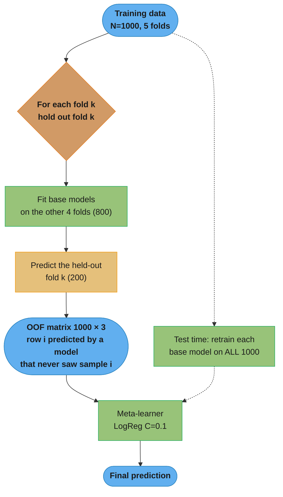
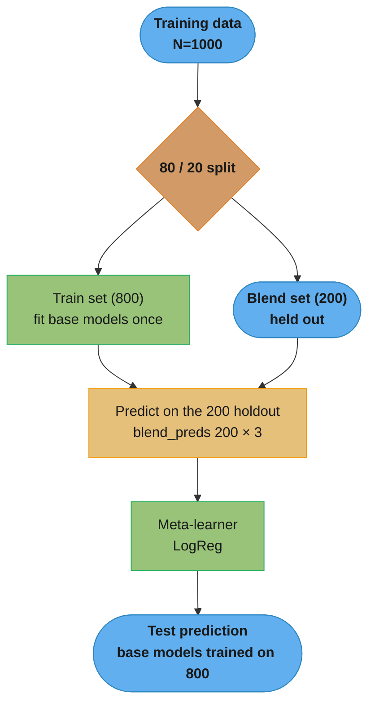
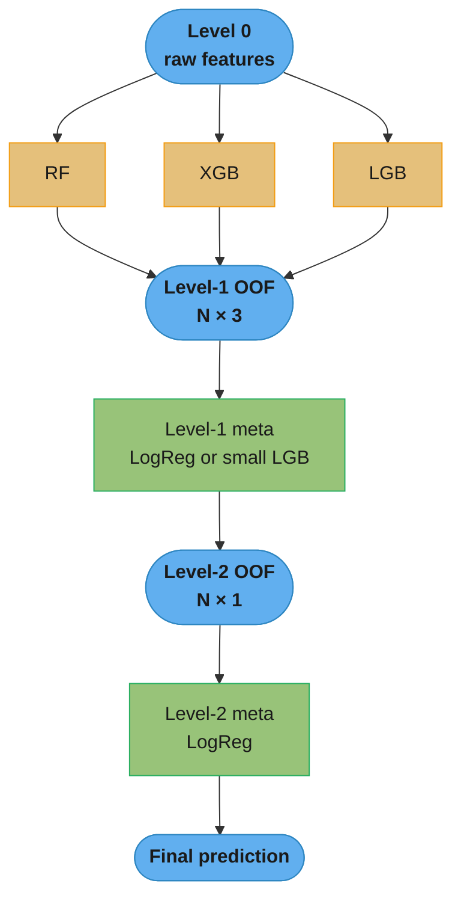
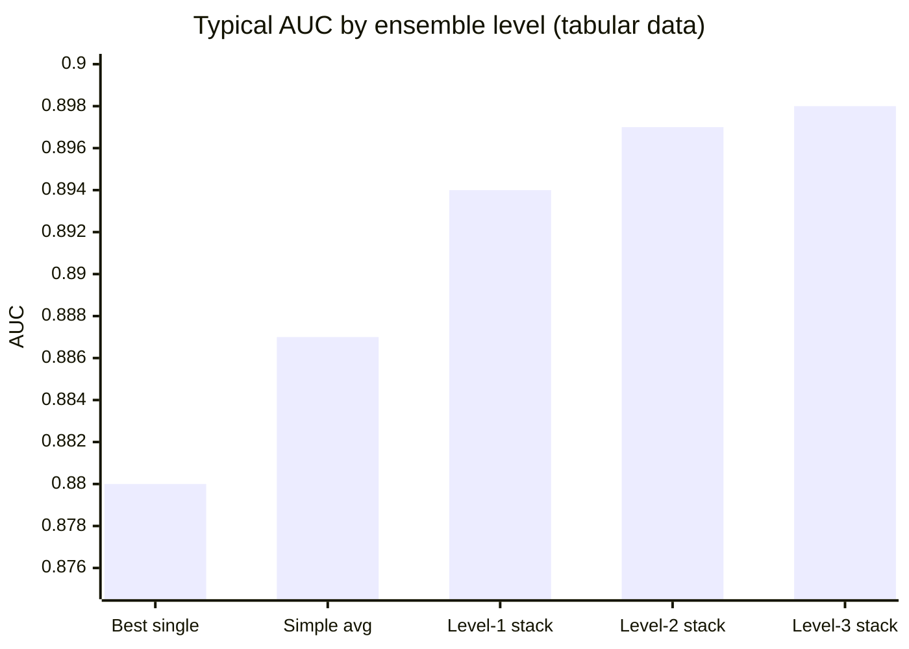

# Stacking and Blending — Deep Dive (Meta-Learning)

## 1. Concept Overview

Stacking (stacked generalisation, Wolpert 1992) and blending are meta-learning ensemble techniques where a second-level model (the meta-learner) learns to combine the predictions of multiple first-level base models. Unlike voting or averaging (which use fixed combination rules), the meta-learner discovers the optimal weighting and interaction between base models from data.

The core insight: different models make different kinds of errors. A neural network may fail on structured decision-boundary examples that a gradient boosted tree handles easily, and vice versa. The meta-learner learns when to trust each base model based on what part of the input space it handles well.

**Stacking** uses K-fold cross-validation to generate out-of-fold (OOF) predictions for all training samples — avoiding data leakage. **Blending** uses a single holdout set, trading correctness for speed.

Typical gain from stacking 3-5 diverse base models: 0.5-2.0% AUC improvement over the best single model.

---

## 2. Intuition

One-line analogy: stacking is a sports analyst who watches experts (base models) make predictions all season and learns exactly when each expert is right or wrong — then synthesises their views for the final game.

Mental model: imagine you have three doctors diagnosing a patient. Doctor A (logistic regression) is excellent at common diseases with clear symptoms. Doctor B (random forest) is excellent at complex multi-symptom interactions. Doctor C (XGBoost) is excellent at rare presentations. A supervising doctor (meta-learner) has observed hundreds of cases where each doctor was right or wrong. For a new patient, the supervisor does not average the votes — they reason: "Doctor A is very confident AND Doctor B agrees, so that diagnosis is likely correct. But when Doctor C disagrees strongly, it has historically meant an unusual case."

Key insight: **the meta-learner's input is base model confidence, not raw features**. When base models agree confidently, the meta-learner confirms; when they disagree, it must learn which to trust in which regime. This is why diversity of base models is essential.

---

## 3. Core Principles

### Why OOF Predictions Prevent Data Leakage

If you train base models on all training data and use their predictions as features for the meta-learner on the same data, the meta-learner receives "memorised" predictions — base models have near-zero training error on data they trained on. The meta-learner learns from signals that do not exist at test time.

OOF (out-of-fold) solution: for every training sample, the prediction used as a meta-feature comes from a base model that **never saw that sample during training**. This produces honest, generalisation-quality predictions.

```
5-fold OOF for 1000 training samples:

Fold 1: base models trained on folds 2-5 (800 samples) → predict fold 1 (200 samples)
Fold 2: base models trained on folds 1,3-5 (800 samples) → predict fold 2 (200 samples)
...
Fold 5: base models trained on folds 1-4 (800 samples) → predict fold 5 (200 samples)

Result: 1000 OOF predictions, each from a model that never saw that sample
Meta-learner trains on these 1000 honest predictions
```

### Diversity Requirement

Meta-learner gains come entirely from diversity between base models. If two base models are highly correlated (error correlation > 0.9), the second adds almost nothing. Diversity sources:

1. Different algorithm families (RF + GBT + SVM + neural net)
2. Different hyperparameters on the same algorithm (RF with sqrt vs 0.5 max_features)
3. Different feature sets or feature engineering
4. Different training data (different time periods)
5. Different random seeds on the same algorithm

### Meta-Learner Properties

The meta-learner trains on B-dimensional feature vectors (one per base model, plus optionally the original features). It should be:
- Simple (low-variance): LogisticRegression or Ridge to avoid overfitting the meta-feature space
- Regularised: the meta-feature space has only B features (typically 3-10) with potentially noisy signals
- Calibrated: produces well-calibrated probabilities for the next stacking level or final output

---

## 4. Types / Architectures / Strategies

### 4.1 K-Fold Stacking

- Generate OOF predictions via K-fold CV for each base model
- Train meta-learner on OOF predictions + true labels
- Test time: each base model trained on all training data, predictions averaged (or use last fold model)
- Pros: uses all training data, unbiased OOF predictions
- Cons: K× training cost per base model

### 4.2 Holdout Blending

- Reserve 20-30% of training data as a holdout blending set
- Train base models on the remaining 70-80%
- Generate predictions on the holdout set → train meta-learner on those
- Test time: base models trained on 70-80%; predictions from these models
- Pros: simple, fast, no repeated training
- Cons: wastes 20-30% of training data for meta-features; smaller base model training set

### 4.3 Multi-Level Stacking

- Level 1: base models generate OOF predictions
- Level 2: meta-learner generates OOF predictions from level-1 OOF
- Level 3: second meta-learner trains on level-2 OOF

Diminishing returns: level-2 adds 0.5-2% AUC over level-1 stacking; level-3 adds 0.1-0.5% marginal gain. In practice, 2 levels is the economic maximum for production; 3 levels is only justified in competitions.

### 4.4 Feature-Weighted Linear Stacking

Original features + OOF predictions + feature×OOF interactions as meta-features. The meta-learner learns: "when feature X is above threshold, trust model A over model B." This is more powerful than probability-only stacking but requires more data to avoid overfitting the interaction terms.

### 4.5 Voting vs Stacking

| Aspect | Soft Voting | Stacking |
|--------|------------|---------|
| Weights | Fixed (equal or manual) | Learned from data |
| Leakage risk | None | High if OOF not used |
| Data requirement | None extra | K× training runs |
| Meta-learner | None | LogisticRegression etc. |
| AUC gain typical | 0.2-0.8% | 0.5-2.0% |
| Complexity | Low | High |

---

## 5. Architecture Diagrams

### K-Fold Stacking Architecture (5-fold, 3 base models)



Caption: the loop guarantees every training row's meta-feature comes from a base model that never saw it (out-of-fold), so the meta-learner trains on honest, generalisation-quality predictions; the dotted path shows test time uses base models refit on all 1000 rows.

### Blending Architecture



Caption: blending trains each base model once on 80% of data and builds meta-features from a single 20% holdout — simpler and K× cheaper than K-fold stacking, but it discards that 20% from base-model training, so OOF quality is slightly lower.

### Multi-Level Stacking



Caption: each level trains on the OOF predictions of the level below via its own round of K-fold CV; level-2 typically adds 0.1-0.5% AUC over level-1, level-3 adds under 0.1%, so two levels is the economic ceiling outside competitions.

---

## 6. How It Works — Detailed Mechanics

### Manual K-Fold Stacking

```python
from __future__ import annotations

import numpy as np
import pandas as pd
from sklearn.datasets import make_classification
from sklearn.model_selection import StratifiedKFold, train_test_split
from sklearn.metrics import roc_auc_score
from sklearn.linear_model import LogisticRegression
from sklearn.ensemble import RandomForestClassifier
from sklearn.base import BaseEstimator, ClassifierMixin
import xgboost as xgb
import lightgbm as lgb


X, y = make_classification(
    n_samples=20_000,
    n_features=40,
    n_informative=25,
    random_state=42,
)
X_train, X_test, y_train, y_test = train_test_split(
    X, y, test_size=0.2, stratify=y, random_state=42
)

# --- BROKEN: data leakage in stacking ---
def leaky_stack(X_train: np.ndarray, y_train: np.ndarray) -> np.ndarray:
    rf = RandomForestClassifier(n_estimators=300, n_jobs=-1, random_state=42)
    xgb_m = xgb.XGBClassifier(n_estimators=200, random_state=42)
    rf.fit(X_train, y_train)
    xgb_m.fit(X_train, y_train)
    # WRONG: predicting on training data → memorised predictions → meta-learner overfits
    meta_X = np.column_stack([
        rf.predict_proba(X_train)[:, 1],
        xgb_m.predict_proba(X_train)[:, 1],
    ])
    return meta_X


# --- CORRECT: OOF stacking ---
def oof_stacking(
    base_models: list,
    X_train: np.ndarray,
    y_train: np.ndarray,
    X_test: np.ndarray,
    n_folds: int = 5,
) -> tuple[np.ndarray, np.ndarray]:
    """
    Generate OOF predictions for training and test.
    Returns: (oof_train, test_preds)
    oof_train shape: (n_train, n_models)
    test_preds shape: (n_test, n_models)
    """
    n_train = X_train.shape[0]
    n_test = X_test.shape[0]
    n_models = len(base_models)

    oof_train = np.zeros((n_train, n_models))
    test_preds_per_fold = np.zeros((n_test, n_models, n_folds))

    cv = StratifiedKFold(n_splits=n_folds, shuffle=True, random_state=42)

    for model_idx, model in enumerate(base_models):
        for fold_idx, (tr_idx, val_idx) in enumerate(cv.split(X_train, y_train)):
            X_tr, X_val = X_train[tr_idx], X_train[val_idx]
            y_tr, y_val = y_train[tr_idx], y_train[val_idx]

            # Clone model to avoid state sharing between folds
            import copy
            fold_model = copy.deepcopy(model)
            fold_model.fit(X_tr, y_tr)

            # OOF predictions for validation fold
            oof_train[val_idx, model_idx] = fold_model.predict_proba(X_val)[:, 1]

            # Test predictions (from this fold's model)
            test_preds_per_fold[:, model_idx, fold_idx] = fold_model.predict_proba(X_test)[:, 1]

        print(
            f"Model {model_idx} OOF AUC: "
            f"{roc_auc_score(y_train, oof_train[:, model_idx]):.4f}"
        )

    # Average test predictions across folds
    test_preds = test_preds_per_fold.mean(axis=2)
    return oof_train, test_preds


# Define diverse base models
base_models = [
    RandomForestClassifier(n_estimators=300, max_features="sqrt", n_jobs=-1, random_state=42),
    xgb.XGBClassifier(
        n_estimators=300, learning_rate=0.05, max_depth=6,
        subsample=0.8, colsample_bytree=0.8, random_state=42, n_jobs=-1, verbosity=0,
    ),
    lgb.LGBMClassifier(
        n_estimators=300, learning_rate=0.05, num_leaves=63,
        subsample=0.8, colsample_bytree=0.8, random_state=42, n_jobs=-1, verbose=-1,
    ),
]

print("Generating OOF predictions...")
oof_train, test_preds = oof_stacking(base_models, X_train, y_train, X_test, n_folds=5)

# Train meta-learner on OOF predictions
meta_learner = LogisticRegression(C=0.1, max_iter=1000)
meta_learner.fit(oof_train, y_train)

# Final predictions
final_test_preds = meta_learner.predict_proba(test_preds)[:, 1]

# Individual base model AUCs
for i, model in enumerate(base_models):
    model.fit(X_train, y_train)
    base_auc = roc_auc_score(y_test, model.predict_proba(X_test)[:, 1])
    print(f"Base model {i} test AUC: {base_auc:.4f}")

# Ensemble AUC
stack_auc = roc_auc_score(y_test, final_test_preds)
print(f"Stacking ensemble test AUC: {stack_auc:.4f}")
# Typical: stacking improves by 0.5-1.5% over best single model
```

### Using sklearn's StackingClassifier

```python
from sklearn.ensemble import StackingClassifier
from sklearn.linear_model import LogisticRegression
from sklearn.ensemble import RandomForestClassifier
import xgboost as xgb
import lightgbm as lgb
from sklearn.model_selection import cross_val_score, StratifiedKFold
from sklearn.metrics import roc_auc_score

# sklearn StackingClassifier handles OOF automatically
stacking_clf = StackingClassifier(
    estimators=[
        ("rf", RandomForestClassifier(n_estimators=300, n_jobs=-1, random_state=42)),
        ("xgb", xgb.XGBClassifier(
            n_estimators=200, learning_rate=0.05, max_depth=6,
            random_state=42, n_jobs=-1, verbosity=0,
        )),
        ("lgb", lgb.LGBMClassifier(
            n_estimators=200, learning_rate=0.05, num_leaves=63,
            random_state=42, n_jobs=-1, verbose=-1,
        )),
    ],
    final_estimator=LogisticRegression(C=0.1, max_iter=1000),
    cv=5,                     # 5-fold OOF for base models
    stack_method="predict_proba",  # use probabilities as meta-features
    n_jobs=-1,
    passthrough=False,        # if True: also pass original features to meta-learner
)

# Cross-validate the entire stacking pipeline
cv = StratifiedKFold(n_splits=5, shuffle=True, random_state=42)
scores = cross_val_score(stacking_clf, X_train, y_train, cv=cv, scoring="roc_auc")
print(f"Stacking CV AUC: {scores.mean():.4f} ± {scores.std():.4f}")

# Final fit and test evaluation
stacking_clf.fit(X_train, y_train)
test_auc = roc_auc_score(y_test, stacking_clf.predict_proba(X_test)[:, 1])
print(f"Stacking test AUC: {test_auc:.4f}")
```

### Adding Original Features to Meta-Learner (passthrough)

```python
# passthrough=True passes original features alongside OOF predictions to meta-learner
# Allows meta-learner to learn "trust model A when feature_3 > 0.5"
stacking_with_features = StackingClassifier(
    estimators=[
        ("rf", RandomForestClassifier(n_estimators=300, n_jobs=-1, random_state=42)),
        ("xgb", xgb.XGBClassifier(n_estimators=200, learning_rate=0.05, random_state=42, verbosity=0)),
    ],
    final_estimator=lgb.LGBMClassifier(
        n_estimators=100,       # keep meta-learner simple to avoid overfitting
        learning_rate=0.05,
        num_leaves=15,          # small; only 2 + n_features meta-features
        verbose=-1,
        random_state=42,
    ),
    cv=5,
    stack_method="predict_proba",
    passthrough=True,           # original features included
)
```

### Blending (Holdout Approach)

```python
import numpy as np
from sklearn.model_selection import train_test_split

# Split training data: 80% for base models, 20% for blending
X_base, X_blend, y_base, y_blend = train_test_split(
    X_train, y_train, test_size=0.2, stratify=y_train, random_state=42
)

# Train base models on X_base
rf = RandomForestClassifier(n_estimators=300, n_jobs=-1, random_state=42)
xgb_model = xgb.XGBClassifier(n_estimators=200, learning_rate=0.05, random_state=42, verbosity=0)
lgb_model = lgb.LGBMClassifier(n_estimators=200, learning_rate=0.05, random_state=42, verbose=-1)

for m in [rf, xgb_model, lgb_model]:
    m.fit(X_base, y_base)

# Generate blend predictions (no leakage: base models never saw X_blend)
blend_preds = np.column_stack([
    rf.predict_proba(X_blend)[:, 1],
    xgb_model.predict_proba(X_blend)[:, 1],
    lgb_model.predict_proba(X_blend)[:, 1],
])

# Train meta-learner on blend predictions
meta = LogisticRegression(C=0.1, max_iter=1000)
meta.fit(blend_preds, y_blend)

# Test predictions: base models (trained on 80% data) → meta-learner
test_preds_blend = np.column_stack([
    rf.predict_proba(X_test)[:, 1],
    xgb_model.predict_proba(X_test)[:, 1],
    lgb_model.predict_proba(X_test)[:, 1],
])
blend_test_auc = roc_auc_score(y_test, meta.predict_proba(test_preds_blend)[:, 1])
print(f"Blending test AUC: {blend_test_auc:.4f}")
# Blending is typically 0.1-0.3% lower than K-fold stacking due to smaller base model training set
```

### Meta-Learner Selection

```python
from sklearn.linear_model import LogisticRegression, Ridge
from sklearn.svm import SVC
import lightgbm as lgb

# Most common meta-learners and their tradeoffs

# Option 1: Logistic Regression (most common, rarely overfits)
meta_lr = LogisticRegression(C=0.1, max_iter=1000)
# Pros: fast, simple, interpretable weights on base models, rarely overfits
# Cons: cannot capture nonlinear interactions between base model predictions

# Option 2: Ridge (for regression tasks)
meta_ridge = Ridge(alpha=10.0)
# Pros: equivalent to LogReg for regression; always prefers lower weights

# Option 3: LightGBM meta-learner (for complex stacking with many base models)
meta_lgb = lgb.LGBMClassifier(
    n_estimators=50,      # very few; meta-feature space is tiny
    num_leaves=7,         # tiny model to prevent overfit
    learning_rate=0.05,
    min_child_samples=50,
    verbose=-1,
    random_state=42,
)
# Pros: captures nonlinear combinations; can use passthrough features
# Cons: can overfit if meta-features are too few or noisy

# Compare meta-learners on OOF data
for name, meta in [("LR", meta_lr), ("LGB", meta_lgb)]:
    meta.fit(oof_train, y_train)
    # Evaluate using nested CV or on held-out test
    meta_preds = meta.predict_proba(test_preds)[:, 1]
    auc = roc_auc_score(y_test, meta_preds)
    print(f"Meta-learner {name}: test AUC = {auc:.4f}")
```

### Optimising Blend Weights

```python
from scipy.optimize import minimize

def neg_auc(weights: np.ndarray, preds_matrix: np.ndarray, y_true: np.ndarray) -> float:
    """Objective: negative AUC (we want to maximise AUC)."""
    weights = np.abs(weights)
    weights /= weights.sum()    # normalise to sum to 1
    blended = preds_matrix @ weights
    return -roc_auc_score(y_true, blended)


# oof_train: (n_train, n_models) matrix of OOF predictions
# Optimise blend weights using OOF predictions + true labels

initial_weights = np.ones(len(base_models)) / len(base_models)
result = minimize(
    neg_auc,
    initial_weights,
    args=(oof_train, y_train),
    method="SLSQP",
    bounds=[(0, 1)] * len(base_models),
    options={"ftol": 1e-9, "maxiter": 1000},
)

optimal_weights = np.abs(result.x)
optimal_weights /= optimal_weights.sum()
print(f"Optimal blend weights: {optimal_weights}")
# E.g., [0.25, 0.45, 0.30] → XGBoost gets highest weight

# Apply to test predictions
optimised_test_preds = test_preds @ optimal_weights
opt_auc = roc_auc_score(y_test, optimised_test_preds)
print(f"Optimised blend test AUC: {opt_auc:.4f}")
# This often beats equal-weight averaging by 0.1-0.3%
```

---

## 7. Real-World Examples

### Kaggle Patterns: 2018 Avito Demand Prediction

1st place used 3-level stacking:
- Level 1: LightGBM, XGBoost, CatBoost, FastText, ridge regression, neural network (6 models)
- Level 2: LightGBM trained on level-1 OOF predictions + 20 original features
- Level 3: Simple linear combination of level-2 predictions from different CV seeds

The 6 base models covered radically different approaches: tree ensembles for tabular features, neural nets for image features, FastText for text. Diversity was maximum because modalities were different. AUC gain from stacking: ~1.8% over best single model.

### Netflix Prize (2009)

The winning solution (BellKor's Pragmatic Chaos) used a 3-tier ensemble of 107 different collaborative filtering algorithms. The blending layer used linear regression with cross-validated weights. The key lesson: stacking 107 similar models produces diminishing returns; the ~20% RMSE improvement over Netflix's baseline came primarily from algorithm diversity (SVD, RBM, KNN, temporal models) rather than sheer number of models.

### Production Fraud Detection (Major Bank)

- Base models: LightGBM (primary, tabular features), neural net (sequence model on transaction history), logistic regression (interpretable for regulatory audit)
- Meta-learner: Logistic regression with C=0.05 (heavily regularised)
- OOF: 10-fold (chosen over 5-fold because dataset is 50K samples — higher fold count = more training data per fold model)
- Business constraint: meta-learner weights must be non-negative (interpretability: each base model can only increase, not decrease, the ensemble's fraud score)
- AUC: 0.927 stacking vs 0.915 best single model (LightGBM)

---

## 8. Tradeoffs

### K-Fold Stacking vs Blending

| Dimension | K-Fold Stacking | Blending |
|-----------|----------------|---------|
| Training cost | K × n_models more | 1 × n_models |
| Data efficiency | Uses all training data for OOF | Loses 20-30% to holdout |
| OOF prediction quality | High (each model sees 80%) | Moderate (model sees 70-80%) |
| Implementation complexity | High | Low |
| Leakage risk | Low (if implemented correctly) | Low (holdout is separate) |
| AUC improvement typical | 0.5-2.0% | 0.3-1.5% |
| Preferred in | Competitions, production | Quick prototypes |

### Meta-Learner Complexity

| Meta-Learner | Risk of Overfit | Captures Nonlinearity | Speed |
|-------------|----------------|----------------------|-------|
| Equal-weight average | None | No | Instant |
| Optimised weights | Low | No | Fast |
| Logistic Regression | Very Low | No | Fast |
| Ridge Regression | Very Low | No | Fast |
| Small LightGBM | Medium | Yes | Medium |
| Deep neural net | High | Yes | Slow |

### Number of Stacking Levels (Typical AUC on tabular data)



Caption: the jump from best-single to level-1 stacking captures most of the gain (0.880 to 0.894); each further level flattens toward a ceiling while training cost keeps multiplying — the visual argument for stopping at level 2.

| Ensemble | AUC (typical) | Training cost |
|----------|--------------|---------------|
| Best single | 0.880 | 1x |
| Simple average | 0.887 | 3x |
| Level-1 stack | 0.894 | 18x (5 folds × 3 models + meta) |
| Level-2 stack | 0.897 | 90x+ |
| Level-3 stack | 0.898 | 450x+ |

Beyond level 2, each level adds marginal gain at exponential compute cost.

---

## 9. When to Use / When NOT to Use

### When to Use Stacking

- Competition setting: stacking is almost always worth it for the final submission
- Production when AUC gain of 0.5%+ translates to significant business value (e.g., $1M+ in fraud prevented, 1% lift in CTR)
- When you have 3+ diverse base models (different algorithms or modalities)
- When you have sufficient training data (rule of thumb: at least 5000 samples per base model for reliable OOF estimates)
- When regulatory requirements allow black-box models (stacking reduces interpretability)

### When to Use Blending

- Quick prototyping: evaluate whether stacking improves over single models before investing in full OOF implementation
- When training K× base models is infeasible (very large datasets, very slow models)
- When the holdout blending set is representative enough (time-series data: blending set = last time period)

### When NOT to Use Stacking

- Small datasets (< 2000 samples): OOF predictions are noisy; meta-learner overfits meta-feature space
- When best single model already hits diminishing-return territory for the business use case
- When serving latency budget cannot accommodate multiple sequential model calls
- When regulatory interpretability requires a single auditable model
- When model retraining is daily/hourly and stacking K× multiplies retraining time K-fold

---

## 10. Common Pitfalls

### Pitfall 1: Data Leakage in Stacking (Most Damaging)

Described in Section 3. An ML engineer at a retail company trained base models on all training data, then stacked. Offline AUC: 0.912. Online A/B test: no improvement over single model. Investigation revealed that XGBoost's OOF predictions on training data were essentially memorised (training AUC: 0.998), so the meta-learner learned "trust XGBoost's overfit confidence" — a signal that did not exist in production.

```python
# BROKEN: fit base models on ALL training data, then generate meta-features on same data
rf.fit(X_train, y_train)
xgb_m.fit(X_train, y_train)
meta_X_TRAIN = np.column_stack([
    rf.predict_proba(X_train)[:, 1],   # LEAKAGE: memorised predictions
    xgb_m.predict_proba(X_train)[:, 1],
])
meta.fit(meta_X_TRAIN, y_train)        # meta-learner trains on garbage signal

# FIXED: use sklearn's StackingClassifier or manual OOF as shown in Section 6
```

### Pitfall 2: Correlated Base Models

A team built a 5-model stack: XGBoost with 5 different random seeds. Pairwise AUC correlation between all models: 0.99+. The stack improved AUC by 0.05% — essentially noise. The compute cost was 5×. Switching to RF + XGBoost + neural net improved AUC by 1.3%.

Diagnosis: compute the pairwise Pearson correlation of OOF predictions. If any pair has correlation > 0.95, they are too similar to both include.

```python
import pandas as pd

oof_df = pd.DataFrame(
    oof_train,
    columns=["RF", "XGB", "LGB"]
)
print(oof_df.corr())
# If RF-XGB correlation > 0.95: drop one or replace with a more diverse model
# Target: pairwise correlations < 0.90 for meaningful diversity
```

### Pitfall 3: Meta-Learner Too Complex

A data scientist used a full LightGBM with num_leaves=127 and passthrough features as the meta-learner. The meta-feature space has only 3 base model predictions + 40 features = 43 meta-features, with 16K training samples. The LightGBM meta-learner overfit the meta-feature space: CV AUC looked great (0.921) but test set AUC was 0.902 — worse than simple logistic regression meta (0.908).

```python
# BROKEN: overpowered meta-learner
meta_complex = lgb.LGBMClassifier(num_leaves=127, n_estimators=500)

# FIXED: keep meta-learner simple
meta_simple = LogisticRegression(C=0.1, max_iter=1000)
# Or if passthrough=True and more meta-features:
meta_moderate = lgb.LGBMClassifier(
    num_leaves=7,         # tiny
    n_estimators=50,      # few rounds
    min_child_samples=50, # strong regularisation
    verbose=-1,
)
```

### Pitfall 4: Not Averaging Test Predictions Across Folds

A common implementation error: use only the last fold's base model to predict on the test set. The last fold's model trained on 4/5 of training data; test predictions from one fold's model have high variance.

```python
# BROKEN: predict on test using only the last fold's model
for fold_idx, (tr_idx, val_idx) in enumerate(cv.split(X_train, y_train)):
    fold_model.fit(X_train[tr_idx], y_train[tr_idx])
    oof_train[val_idx] = fold_model.predict_proba(X_train[val_idx])[:, 1]
# WRONG: only the last fold_model used for test prediction
test_preds = fold_model.predict_proba(X_test)[:, 1]

# FIXED: average predictions from all K fold models
test_preds_all_folds = np.zeros((len(X_test), n_folds))
for fold_idx, ...:
    fold_model.fit(...)
    test_preds_all_folds[:, fold_idx] = fold_model.predict_proba(X_test)[:, 1]
test_preds = test_preds_all_folds.mean(axis=1)  # average across folds
```

### Pitfall 5: Time Series Data Without Temporal CV

Standard K-fold shuffles data — this creates leakage when samples are from a time series (future data trains models that predict the past). For time series, stacking must use temporal folds: each OOF prediction uses only past data.

```python
from sklearn.model_selection import TimeSeriesSplit

# For time series: use TimeSeriesSplit to prevent future leakage
tscv = TimeSeriesSplit(n_splits=5)
# Each fold: train on samples 0..k, predict on samples k..k+delta
# Never use StratifiedKFold on time series data
```

### Pitfall 6: Forgetting to Retrain Base Models on Full Data for Test Predictions

After generating OOF predictions and training the meta-learner, a model must be retrained on all training data for final test predictions — the K fold models each saw only (K-1)/K of the training data.

```python
# After OOF generation, retrain base models on FULL training set
final_base_models = []
for model in base_models:
    import copy
    full_model = copy.deepcopy(model)
    full_model.fit(X_train, y_train)   # full training set
    final_base_models.append(full_model)

# Test predictions from full-data base models
test_meta_features = np.column_stack([
    m.predict_proba(X_test)[:, 1] for m in final_base_models
])
final_preds = meta_learner.predict_proba(test_meta_features)[:, 1]
```

---

## 11. Technologies & Tools

| Tool | Feature |
|------|---------|
| scikit-learn StackingClassifier | Built-in K-fold OOF stacking; passthrough option; n_jobs parallel |
| scikit-learn StackingRegressor | Regression variant; uses cross_val_predict internally |
| mlxtend StackingClassifier | Extended stacking with use_probas, average_probas, verbose options |
| mlxtend EnsembleVoteClassifier | Soft/hard voting with optional weights |
| Optuna | Optimise blend weights or meta-learner hyperparameters |
| scipy.optimize.minimize | Manual blend weight optimisation (SLSQP, L-BFGS-B) |
| MLflow | Track per-model and ensemble AUC; log meta-learner weights |

---

## 12. Interview Questions with Answers

**Q: What is stacking and how does it differ from voting?**
Stacking trains a meta-learner on the predictions of base models, learning optimal combination weights and interactions from data. Voting uses a fixed combination rule — equal weights for simple averaging, or manually specified weights. The meta-learner in stacking can capture: (1) that model A is more reliable than model B overall; (2) that model B should be trusted more for certain regions of input space (especially with passthrough features). Voting cannot capture these patterns. The cost: stacking requires K× base model training runs to generate OOF predictions without leakage; voting requires no additional training.

**Q: Why is data leakage the most critical pitfall in stacking and how do OOF predictions prevent it?**
If base models are trained on all training data and used to predict on that same training data to create meta-features, the meta-learner sees "memorised" predictions. High-capacity models like XGBoost have near-zero training error, so their predictions on training data are almost perfect — a signal that does not exist at test time. The meta-learner then learns "trust whichever model predicts most confidently" based on training-set confidence, which does not generalise. OOF (out-of-fold) predictions fix this: each training sample is predicted by a base model that never saw it during training, producing honest predictions that reflect true generalisation quality. The meta-learner learns from signals that will also exist at test time.

**Q: Why must all base models use the same fold splits when generating OOF predictions?**
Because meta-features must be aligned: row i's OOF prediction from every base model must come from a fold where row i was held out. If base models use different fold assignments, then for a given row one model's prediction is honest (out-of-fold) while another's is in-fold and memorised — the meta-learner trains on a mix of leaked and clean signals per row and its learned weights become meaningless. Fix: create one StratifiedKFold (or KFold) split object with a fixed random_state and reuse the exact same tr_idx/val_idx for every base model. This is why sklearn's StackingClassifier uses a single internal cv object shared across all estimators.

**Q: Should you use predicted probabilities or hard class labels as meta-features in stacking?**
Use predicted probabilities (predict_proba), not hard 0/1 labels. Probabilities carry each base model's confidence, which is exactly the signal the meta-learner needs to arbitrate between models; collapsing to hard labels discards that confidence and typically costs 0.3-1% AUC. sklearn exposes this as stack_method="predict_proba" (the default when the estimator supports it). The one caveat: with many classes, predict_proba adds one column per class per model, so the meta-feature space grows — keep the meta-learner regularised to match.

**Q: Can a stacking ensemble perform worse than its best single base model, and why?**
Yes — stacking can underperform the best base model when the meta-learner overfits the meta-feature space or when the base models are highly correlated. Common causes: too little data for reliable OOF estimates (< 2000 samples), a too-complex meta-learner (deep LightGBM instead of regularised LogReg), passthrough features that let the meta-learner overfit the original dimensions, or leakage that inflates offline AUC but collapses on the test set. The fix is a simple heavily regularised meta-learner (LogReg C=0.1), diverse-but-not-correlated base models, and honest OOF predictions; if stacking still loses, ship the single model.

**Q: When should you use blending instead of K-fold stacking?**
Blending is preferred when: (1) training is very expensive — blending trains each base model once; stacking trains K times; (2) quick prototyping — blending is simpler to implement correctly; (3) the holdout set is naturally defined (e.g., time series: last month is the blending set, prior months are training). Stacking is preferred when: data is limited and you cannot afford to throw away 20-30% as a blending holdout; when you want OOF predictions to serve as regularised features for the meta-learner. In production, stacking is almost always worth the implementation cost if the AUC gain justifies serving and retraining complexity.

**Q: What properties should the meta-learner have, and why is Logistic Regression the most common choice?**
The meta-learner operates on B-dimensional feature vectors (B = number of base models, typically 3-10 + possibly original features). It should be: (1) low-variance — the meta-feature space has few dimensions and OOF predictions have limited statistical independence; (2) well-calibrated — its output probabilities feed directly into decisions or the next stacking level; (3) fast to train — meta-learning should be the cheap part. Logistic Regression with L2 regularisation satisfies all three: it is low-variance (C=0.1 is heavily regularised), produces calibrated probabilities via sigmoid, and trains in milliseconds. It fails when base model predictions have strong nonlinear interactions — then a small LightGBM with num_leaves=7-15 is used.

**Q: How do you measure diversity between base models in a stack, and why does it matter?**
Diversity can be measured as the Pearson correlation between base models' OOF predictions (lower is more diverse) or as the Q-statistic (measures co-failure probability). Diversity matters because variance reduction from averaging depends on correlation: Var(average) = ρσ^2 + (1-ρ)σ^2/B. High correlation (ρ → 1) means the ensemble AUC approaches the average of individual AUCs, not the maximum. In practice: if two base models have OOF prediction correlation > 0.95, the second adds negligible value. Aim for pairwise correlation < 0.90 for meaningful stacking gains.

**Q: What is multi-level stacking and when is it worth the added complexity?**
Multi-level stacking adds stacking layers on top of the first: level-2 trains a meta-learner on level-1's OOF predictions; level-3 trains on level-2's OOF. Each level requires an additional round of K-fold CV per model, multiplying training cost. Typical gains: level-1 stacking gives 0.5-2.0% AUC over the best single model; level-2 adds 0.1-0.5% marginal gain; level-3 adds < 0.1%. The exponential compute cost and negligible marginal gain make level-3 stacking impractical outside of high-stakes competitions. In production, a well-implemented level-1 stack is almost always sufficient.

**Q: How do you handle the test set predictions in K-fold stacking — specifically, how do you aggregate test predictions across folds?**
During K-fold OOF generation, each fold produces a base model trained on (K-1)/K of training data. This fold-specific model can predict on the test set. Two approaches: (1) Average test predictions across all K fold models — this is the standard approach and reduces variance by averaging K slightly different models; (2) Retrain each base model on all training data and use that single model for test predictions — this produces test predictions from a model trained on more data, but only one model rather than the averaged K. Approach 1 is slightly more accurate due to averaging; approach 2 ensures consistency between training and test data sizes. Most production implementations use approach 1 (average across K fold models).

**Q: Can you use the original training features as additional meta-features (passthrough), and when should you?**
Yes — sklearn's StackingClassifier supports passthrough=True, which concatenates base model OOF predictions with original features as input to the meta-learner. This allows the meta-learner to learn "trust model A when feature_7 > 0.5 AND trust model B when feature_12 < -0.3." Use passthrough when: the original features contain information that helps arbitrate between base models; when base models have complementary regional strengths visible in the feature space; when you have enough training data to avoid overfitting the higher-dimensional meta-feature space. Do NOT use passthrough when training data is small (< 10K) — the meta-learner will overfit the original feature dimensions.

**Q: What is the typical AUC improvement from stacking, and what factors determine how much gain you get?**
Typical gain: 0.5-2.0% AUC over the best single model. Factors that increase gain: (1) High diversity between base models — different algorithms, different modalities; (2) No single dominant model — if one model is already very strong and others are weak, stacking degrades toward that model; (3) Sufficient training data — at least 5000 samples for reliable OOF estimates; (4) Optimal meta-learner — using LightGBM instead of LogReg when nonlinear interactions exist. Factors that decrease gain: (1) High correlation between base models; (2) Small training data; (3) The problem is already at the theoretical performance ceiling (AUC > 0.98); (4) Label noise — stacking amplifies noise patterns as much as signal patterns.

**Q: How do you prevent a single base model from dominating the meta-learner?**
A dominant base model (much higher OOF AUC than others) will have its predictions assigned very high weight by the meta-learner, effectively ignoring the other models. Prevention strategies: (1) Only include base models within ~2% AUC of the best — drop clearly inferior models; (2) Use a strongly regularised meta-learner (C=0.01 for LogReg) that shrinks all weights toward equal; (3) Add interaction terms (OOF predictions × original features) to give weaker models domain-specific influence; (4) Weight base models in the meta-training by inverse-AUC-variance to account for uncertainty. In practice, a LogReg meta-learner with C=0.1 naturally handles dominance by regularising extreme weights.

**Q: How do you approach stacking in a time series prediction problem?**
Standard K-fold CV leaks future information into the past for time series. For stacking on time series: (1) Use TimeSeriesSplit for OOF generation — each fold's training set contains only samples before the validation period; (2) For the meta-learner, use only temporal OOF predictions (no shuffled folds); (3) For the blending approach: use the last time period as the holdout blending set, previous periods as base model training; (4) Ensure all feature engineering pipelines also respect temporal order — no lookahead in aggregations or lag features. The gain from stacking is often smaller on time series data because the temporal structure limits diversity (base models tend to make errors in the same time periods).

**Q: What is the role of calibration in stacking, and when should you calibrate base models before stacking?**
Calibration refers to whether model probabilities accurately reflect true outcome frequencies — a probability of 0.8 should mean the event occurs 80% of the time. When base models are poorly calibrated (e.g., Random Forest probabilities are often too extreme near 0 and 1; naive Bayes can be very miscalibrated), the meta-learner receives distorted inputs. A LogReg meta-learner can partially compensate by learning the appropriate rescaling, but a badly calibrated model provides less information to the meta-learner. For stacking with a simple LogReg meta-learner, apply Platt scaling (sigmoid calibration) or isotonic regression to each base model's OOF predictions before training the meta-learner. This is especially important when combining models from different families (SVM + naive Bayes + tree models).

**Q: How would you implement stacking in a production ML system with daily retraining?**
Production stacking with daily retraining introduces several engineering constraints: (1) Retraining cost — K×n_models base model training runs must complete within the retraining window; for a 24-hour window, 5-fold × 3 models = 15 training runs must finish in time; (2) Version alignment — base models and meta-learner must be updated together (atomic deployment); (3) OOF generation — store OOF predictions from the previous training cycle to warm-start or avoid recomputing; (4) Monitoring — track each base model's AUC independently; a silent degradation in one base model may be masked by the ensemble but indicates data drift; (5) Rollback — maintain the last N model sets (base + meta) as a rollback target. A practical approach: schedule K-fold stacking weekly, use blending (1 holdout split) for daily retraining cycles.

**Q: What are the typical Kaggle patterns for stacking in top finishes?**
Top-10 Kaggle finishes on tabular data typically follow this pattern: (1) 3-5 diverse base models — LightGBM (primary), XGBoost, CatBoost, Random Forest, neural network; (2) 5-fold OOF generation with the same fold splits for all models; (3) Simple meta-learner — Logistic Regression or Ridge for regression; (4) Optionally include original features (passthrough) if the meta-learner can handle the dimensionality; (5) Two levels at most — the marginal gain of a third level rarely justifies the complexity in 4-6 week competitions. The stacking typically provides 0.5-1.5% AUC gain. Beyond this, additional gains come from feature engineering and model tuning, not from adding more stacking levels.

**Q: How many CV folds should you use for OOF generation, and what is the tradeoff?**
Use 5 folds as the default; increase to 10 for smaller datasets. More folds mean each base model trains on a larger fraction (K-1)/K of the data — 90% at 10-fold vs 80% at 5-fold — producing OOF predictions closer to the full-data model, but at proportionally higher compute (10x vs 5x base training runs). For large datasets (> 100K rows) 5 folds is plenty and cheaper; for small datasets (5-50K) 10 folds squeezes out more training data per fold and reduces OOF variance. Always use StratifiedKFold for classification so class balance is preserved across folds, and TimeSeriesSplit for temporal data.

**Q: How does stacking differ from bagging and boosting?**
Stacking combines different model families with a learned meta-learner, while bagging and boosting build many instances of the same base learner with a fixed combination rule. Bagging (e.g. Random Forest) trains models in parallel on bootstrap samples and averages them to reduce variance; boosting (e.g. XGBoost) trains models sequentially, each correcting the previous residuals, to reduce bias. Stacking is heterogeneous and learns the combination weights from OOF predictions, so it exploits complementary strengths across algorithm families. In practice stacking sits on top of bagging/boosting models — a Random Forest and an XGBoost can both be base models feeding a stacked meta-learner.

**Q: What is the connection between stacking and Bayesian Model Combination?**
Stacking can be seen as an empirical approximation to Bayesian Model Averaging (BMA). BMA computes the posterior probability of each model given the data: P(model_k | data) ∝ P(data | model_k) * P(model_k), then weights predictions by these posteriors. Stacking approximates this by learning the combination weights discriminatively from OOF predictions. Key differences: BMA requires a proper probabilistic model for each base model (strong assumption); stacking is non-parametric and directly optimises the combination. In practice stacking outperforms BMA on most ML tasks because BMA assumes models are correct probabilistic models of the data, which tree ensembles are not. The meta-learner in stacking can be seen as approximating the posterior model weights using OOF cross-validation evidence.

---

## 13. Best Practices

1. Always use OOF predictions for the meta-learner training set — never train base models on the same data you use to generate meta-features.
2. Use the same fold splits for all base models — ensures meta-features are aligned (row i's RF OOF and XGBoost OOF both excluded row i's true label).
3. Start with Logistic Regression (C=0.1) as the meta-learner — it rarely overfits and is interpretable via weights.
4. Measure pairwise correlation of OOF predictions before adding a model to the stack — drop models with correlation > 0.95 to any existing model.
5. Retrain all base models on the full training set for final test predictions; do not reuse fold-specific models.
6. For test predictions, average across all K fold models rather than using only the final fold's model.
7. For time series data, use TimeSeriesSplit for OOF — random K-fold leaks future data.
8. When using passthrough features, use a small, heavily regularised meta-learner (num_leaves=7, min_child_samples=50 for LightGBM).
9. In production, track each base model's AUC independently — a drop in one base model hidden by the ensemble indicates silent drift.
10. For daily retraining, use blending (1 holdout) rather than K-fold stacking to control retraining time; reserve K-fold for weekly or monthly full retraining.
11. Do not add more than 5 base models — beyond 5, compute cost grows linearly but diversity gains plateau.
12. Optimise blend weights with scipy.optimize.minimize on OOF data as a simple alternative to a full meta-learner — it is less likely to overfit on small datasets.

---

## 14. Case Study

### Problem: Kaggle-Style Competition — Customer Lifetime Value Prediction

**Context**: 30K customers, predict 12-month LTV (continuous regression), 80 features (demographics, transaction history, product usage). RMSE is the evaluation metric. Training time budget: 4 hours on 16-core machine.

**Baseline single model**: LightGBM with early stopping, RMSE 48.3.

**Stacking strategy**:

```python
import numpy as np
import pandas as pd
from sklearn.model_selection import KFold
from sklearn.linear_model import Ridge
from sklearn.metrics import mean_squared_error
import lightgbm as lgb
import xgboost as xgb
from sklearn.ensemble import RandomForestRegressor, ExtraTreesRegressor
import copy


# Regression target
X_train = ...  # 30K × 80 features
y_train = ...  # 30K target LTV values
X_test = ...   # 10K test samples

kf = KFold(n_splits=5, shuffle=True, random_state=42)

base_models = {
    "lgb": lgb.LGBMRegressor(
        n_estimators=1000, learning_rate=0.03, num_leaves=63,
        subsample=0.8, colsample_bytree=0.7, verbose=-1, random_state=42,
    ),
    "xgb": xgb.XGBRegressor(
        n_estimators=800, learning_rate=0.03, max_depth=6,
        subsample=0.8, colsample_bytree=0.7, verbosity=0, random_state=42,
    ),
    "rf": RandomForestRegressor(
        n_estimators=500, max_features=0.4, n_jobs=-1, random_state=42
    ),
    "et": ExtraTreesRegressor(
        n_estimators=500, max_features=0.4, n_jobs=-1, random_state=42
    ),
}

n_train = len(X_train)
n_test = len(X_test)
oof_predictions = np.zeros((n_train, len(base_models)))
test_predictions = np.zeros((n_test, len(base_models)))

for model_idx, (model_name, model) in enumerate(base_models.items()):
    test_preds_folds = np.zeros((n_test, 5))

    for fold_idx, (tr_idx, val_idx) in enumerate(kf.split(X_train)):
        X_tr, X_val = X_train[tr_idx], X_train[val_idx]
        y_tr, y_val = y_train[tr_idx], y_train[val_idx]

        fold_model = copy.deepcopy(model)

        # LGB/XGB: use early stopping
        if model_name in ["lgb", "xgb"]:
            if model_name == "lgb":
                fold_model.fit(
                    X_tr, y_tr,
                    eval_set=[(X_val, y_val)],
                    callbacks=[lgb.early_stopping(100, verbose=False), lgb.log_evaluation(-1)],
                )
            else:
                fold_model.fit(
                    X_tr, y_tr,
                    eval_set=[(X_val, y_val)],
                    early_stopping_rounds=100,
                    verbose=False,
                )
        else:
            fold_model.fit(X_tr, y_tr)

        oof_predictions[val_idx, model_idx] = fold_model.predict(X_val)
        test_preds_folds[:, fold_idx] = fold_model.predict(X_test)

    test_predictions[:, model_idx] = test_preds_folds.mean(axis=1)

    fold_rmse = np.sqrt(mean_squared_error(y_train, oof_predictions[:, model_idx]))
    print(f"{model_name} OOF RMSE: {fold_rmse:.4f}")

# Check diversity
oof_df = pd.DataFrame(oof_predictions, columns=list(base_models.keys()))
print("\nOOF Prediction Correlations:")
print(oof_df.corr().round(3))
# Expected: LGB-XGB ~0.93, LGB-RF ~0.85, LGB-ET ~0.80 — good diversity

# Meta-learner: Ridge regression for regression
meta_learner = Ridge(alpha=50.0)
meta_learner.fit(oof_predictions, y_train)

oof_rmse_ensemble = np.sqrt(
    mean_squared_error(y_train, meta_learner.predict(oof_predictions))
)
print(f"\nEnsemble OOF RMSE: {oof_rmse_ensemble:.4f}")
print(f"Meta-learner weights: {dict(zip(base_models.keys(), meta_learner.coef_))}")

# Final test predictions
final_test = meta_learner.predict(test_predictions)
```

**Results**:

| Model | OOF RMSE |
|-------|----------|
| LightGBM | 48.3 |
| XGBoost | 49.1 |
| Random Forest | 51.2 |
| Extra Trees | 52.0 |
| Ridge Ensemble | **45.7** |

The stacking ensemble achieved RMSE 45.7 — a 2.6-point improvement (5.4% reduction) over the best single model. Meta-learner weights: LGB 0.55, XGB 0.28, RF 0.12, ET 0.05 — reflecting the models' relative quality while still benefiting from diversity. Training time: ~3.1 hours for all 5×4=20 fold models plus meta-learner — well within the 4-hour budget.
