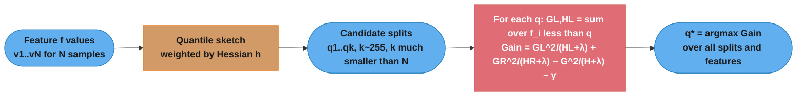
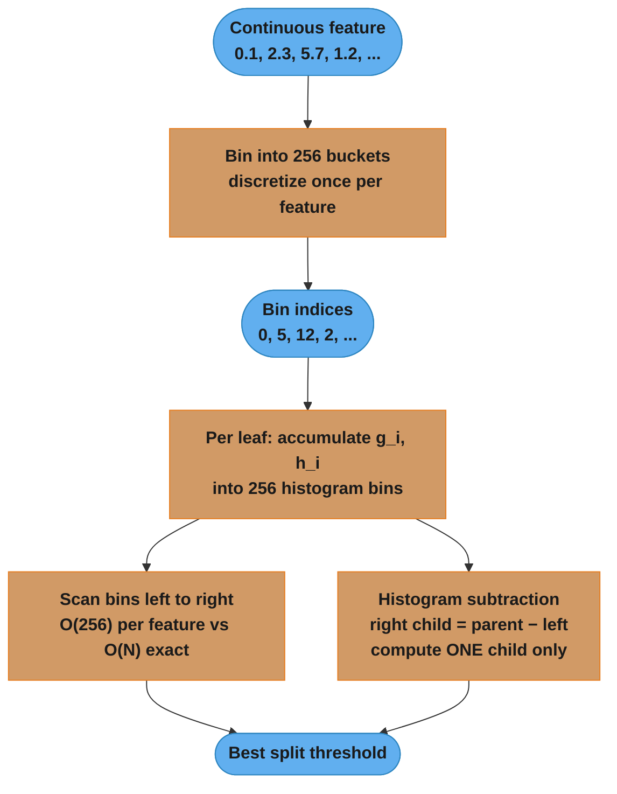
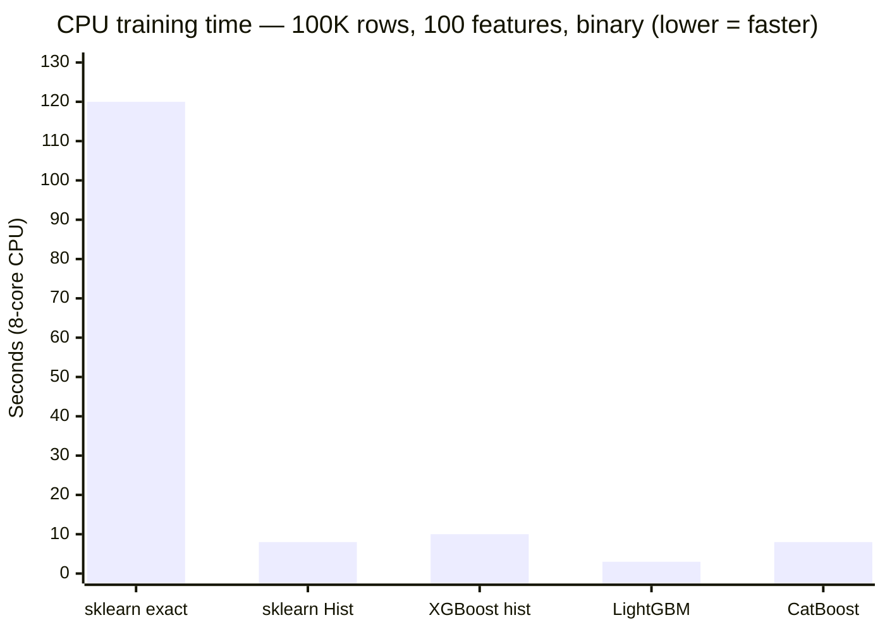
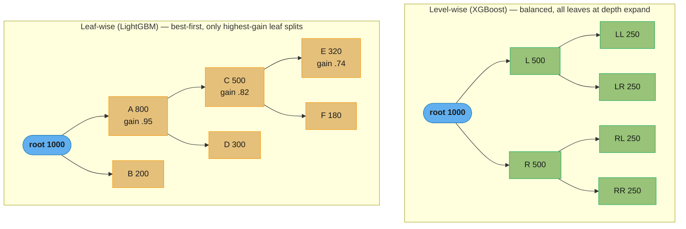

# XGBoost and LightGBM — Deep Dive

## 1. Concept Overview

XGBoost (Extreme Gradient Boosting, Chen & Guestrin 2016) and LightGBM (Light Gradient Boosting Machine, Ke et al. 2017) are production-grade gradient boosted decision tree (GBDT) implementations that dominate tabular ML benchmarks. Both implement the same core algorithmic framework as vanilla gradient boosting but introduce critical engineering innovations that make them 10-100x faster, more memory-efficient, and more accurate than sklearn's GradientBoostingClassifier.

XGBoost innovations: regularised objective with L1+L2 on leaf weights, second-order Taylor expansion of the loss function for more accurate split scoring, approximate split finding with compressed column blocks, and sparsity-aware split for missing value handling.

LightGBM innovations: Gradient-based One-Side Sampling (GOSS), Exclusive Feature Bundling (EFB), histogram-based binning (256 bins), and leaf-wise (best-first) tree growth instead of level-wise. Together these reduce training time by 3-5x compared to XGBoost on CPU.

CatBoost (Yandex 2017) adds ordered boosting to prevent target leakage in categorical feature processing and symmetric (oblivious) trees for fast CPU scoring.

---

## 2. Intuition

One-line analogy: XGBoost is a precision craftsman who uses both first and second derivatives of the loss to find the optimal cut; LightGBM is a speed racer who skips the easy pieces and focuses on the hard ones.

Mental model for XGBoost: vanilla gradient boosting uses only the first derivative (gradient) to score splits. XGBoost additionally uses the second derivative (Hessian), which provides curvature information — like knowing not just which direction is downhill but how steeply curved the valley is. This allows more accurate step-size estimation and better split quality.

Mental model for LightGBM: in a typical GBDT round, 80% of samples have small gradients (already well-predicted) and contribute little to split quality. GOSS keeps all large-gradient samples and randomly samples 10% of small-gradient ones — you get 90%+ of the information gain estimate while evaluating 30-50% fewer samples.

Key insight: XGBoost improved gradient boosting's objective; LightGBM improved gradient boosting's sampling and data structure. Both innovations are independent and complementary — LightGBM also uses a second-order approximation internally.

---

## 3. Core Principles

### XGBoost Regularised Objective

Standard gradient boosting minimises the loss L = Σ_i l(y_i, ŷ_i). XGBoost adds a regularisation term Ω for each tree:

```
Obj = Σ_i l(y_i, ŷ_i^{(t)}) + Σ_k Ω(f_k)

where Ω(f) = γ*T + (λ/2)*Σ_j w_j^2 + α*Σ_j |w_j|

T = number of leaves
w_j = leaf weights (predicted values)
γ = minimum loss reduction to make a split (pruning)
λ = L2 regularisation on leaf weights
α = L1 regularisation on leaf weights
```

**What this actually says.** "Fit the data, but pay a fee for every leaf you add and a second fee for every leaf whose prediction is large."

The framing matters because the fees are *inside* the thing being optimised. Vanilla gradient boosting grows a tree to minimise loss and only afterwards prunes or shrinks it; XGBoost's split search already knows the price, so a split that is not worth γ is never made in the first place.

| Symbol | What it is |
|--------|------------|
| `Σ_i l(y_i, ŷ_i)` | The ordinary training loss, summed over rows. "Am I predicting well?" |
| `Σ_k Ω(f_k)` | Complexity fee, summed over every tree `f_k` built so far |
| `T` | Number of leaves in the tree. A proxy for "how many rules did I invent?" |
| `w_j` | The value leaf `j` predicts (in log-odds for classification, not probability) |
| `γ` | Price per leaf. A split only survives if it buys more loss reduction than γ costs |
| `λ` | L2 rate. Shrinks every `w_j` toward zero, smoothly, without deleting leaves |
| `α` | L1 rate. Pushes small `w_j` exactly to zero — the sparsity-flavoured version |

**Walk one example.** Two trees fitting the same data equally well, γ = 1.0, λ = 1.0, α = 0:

```
                        leaves T    sum w_j^2    training loss
  tree P (simple)          4          0.90          42.0
  tree Q (complex)        12          3.20          40.4

  Omega(P) = 1.0 x 4  + (1.0/2) x 0.90 = 4.00 + 0.45 = 4.45
  Omega(Q) = 1.0 x 12 + (1.0/2) x 3.20 = 12.00 + 1.60 = 13.60

  Obj(P) = 42.0 + 4.45  = 46.45      <- wins
  Obj(Q) = 40.4 + 13.60 = 54.00

  Q fits the data better by 1.6, but pays 9.15 more in fees. XGBoost keeps P.
```

**What each knob actually buys you.** γ buys you *fewer rules*: it is a floor on split quality, so raising it deletes whole branches and the tree gets structurally smaller. λ buys you *quieter rules*: the leaf count is untouched, but every prediction is pulled toward zero so no single leaf can swing the ensemble hard. With γ = 0 and λ = 0 the objective collapses back to plain gradient boosting, and a tree is free to grow one leaf per row and memorise the training set.

This is built into the objective — every split must overcome the γ penalty, every leaf weight is shrunk by λ/2. This is regularisation at the model structure level, not just the training algorithm level.

### Second-Order Taylor Expansion

At round t, expand the loss around current predictions F_{t-1}(x):

```
l(y_i, ŷ_i^{(t)}) ≈ l(y_i, ŷ_i^{(t-1)}) + g_i * f_t(x_i) + (h_i/2) * f_t(x_i)^2

where g_i = ∂l/∂ŷ^{(t-1)}   (first derivative = gradient)
      h_i = ∂^2l/∂(ŷ^{(t-1)})^2  (second derivative = Hessian)
```

**Read it like this.** "Replace the real loss curve with the parabola that touches it at the current prediction — then you can solve for the best next step in closed form instead of searching for it."

A parabola is the simplest shape that has both a slope and a curvature, and those two numbers are exactly what you need to jump straight to a minimum. That is the entire reason XGBoost only ever asks a custom objective for `(g_i, h_i)`: given those, every downstream formula is fixed.

| Symbol | What it is |
|--------|------------|
| `ŷ_i^{(t-1)}` | The prediction the ensemble already makes for row `i`, before this round's tree |
| `f_t(x_i)` | The correction this round's tree wants to add for row `i` |
| `g_i` | Slope of the loss at the current prediction. Sign = which way is downhill, size = how urgent |
| `h_i` | Curvature. Large = the loss punishes overshooting, so take a small step |
| `g_i * f_t(x_i)` | Linear term: reward for moving downhill |
| `(h_i/2) * f_t(x_i)^2` | Quadratic term: penalty for moving far. This is what caps the step |
| `l(y_i, ŷ_i^{(t-1)})` | A constant this round — it does not depend on the new tree, so it drops out |

**Walk one example.** Log loss, `g_i = p_i - y_i` and `h_i = p_i(1-p_i)`, for three rows:

```
                   y     p        g = p - y     h = p(1-p)     reading
  row 1 (fresh)    1    0.50        -0.50          0.2500      undecided, max influence
  row 2 (solid)    1    0.90        -0.10          0.0900      mostly right, some pull
  row 3 (settled)  1    0.99        -0.01          0.0099      done; contributes ~nothing

  Ratio of influence, row 1 vs row 3:  h = 0.2500 / 0.0099 = 25x
```

Row 3 is already correct and confident, so both its gradient and its Hessian have nearly vanished — it neither steers the split nor votes on leaf size. This self-damping is what makes the Hessian a *natural sample weight*, and it is the same fact GOSS exploits below when it throws small-gradient rows away.

This lets you derive the optimal leaf weight analytically:

```
w_j* = -G_j / (H_j + λ)

where G_j = Σ_{i∈leaf_j} g_i
      H_j = Σ_{i∈leaf_j} h_i

Split gain = (G_L^2/(H_L+λ) + G_R^2/(H_R+λ) - (G_L+G_R)^2/(H_L+H_R+λ)) / 2 - γ
```

**The idea behind it.** "A leaf should predict the average error it is asked to fix, damped by how confidently that error is measured — and a split is worth making only if cutting the group in two explains more than keeping it whole."

The quantity `G^2/(H+λ)` is worth naming: it is the **similarity score**, and it measures how *agreeing* the rows in a node are. Rows whose gradients all point the same way add up to a big `G`, so `G^2` is big. Rows whose gradients cancel leave `G` near zero and the score collapses — which is precisely the signal that the node holds a mixture worth splitting.

| Symbol | What it is |
|--------|------------|
| `G_j` | Sum of gradients in leaf `j`. "Total error, with sign" |
| `H_j` | Sum of Hessians in leaf `j`. "How much confident evidence is in here" |
| `w_j* = -G_j/(H_j+λ)` | The leaf's output. Minus sign = step opposite the gradient, i.e. downhill |
| `G^2/(H+λ)` | Similarity score. High = rows agree; near zero = rows disagree and cancel |
| `G_L, H_L` | Sums over rows going left; `G_R, H_R` over rows going right |
| `(G_L+G_R)^2/(H_L+H_R+λ)` | The parent's score — what you already had before splitting |
| `/ 2` | Falls out of the `h/2` in the Taylor quadratic; scales gain, never changes its ranking |
| `- γ` | The toll booth. Pay γ or the split does not happen |

**Walk one example.** A node holding 8 rows on the first boosting round, so every `p_i = 0.5`, giving `g_i = 0.5 - y_i` and `h_i = 0.25` for all of them. Candidate split sends 3 rows left, 5 right; `λ = 1`:

```
  LEFT   y = [1, 1, 1]           g = [-0.5, -0.5, -0.5]
         G_L = -1.5              H_L = 3 x 0.25 = 0.75

  RIGHT  y = [0, 0, 0, 0, 1]     g = [+0.5, +0.5, +0.5, +0.5, -0.5]
         G_R = +1.5              H_R = 5 x 0.25 = 1.25

  PARENT G = -1.5 + 1.5 = 0.0    H = 0.75 + 1.25 = 2.00

  similarity(left)   = (-1.5)^2 / (0.75 + 1) = 2.25 / 1.75 = 1.2857
  similarity(right)  = (+1.5)^2 / (1.25 + 1) = 2.25 / 2.25 = 1.0000
  similarity(parent) = ( 0.0)^2 / (2.00 + 1) = 0.00 / 3.00 = 0.0000

  Gain = 0.5 x (1.2857 + 1.0000 - 0.0000) - gamma
       = 0.5 x 2.2857 - gamma
       = 1.1429 - gamma
```

The parent's score is exactly `0` because its gradients cancel perfectly: three rows pull down, three of the five pull up with equal force. That is a node with no usable single answer, and the split rescues 1.1429 of structure from it. Note that a *useless* split — one that scatters the same mix into both children — would leave both child scores near zero too, and the gain would be near zero. **Gain measures un-mixing, not size.**

**Now watch γ act as a toll booth.** Same split, same 1.1429 of raw gain, three settings:

```
  gamma = 0.0   ->  net gain = 1.1429 - 0.0 = +1.1429   ACCEPT  (default; nothing pruned)
  gamma = 1.0   ->  net gain = 1.1429 - 1.0 = +0.1429   ACCEPT  (barely clears the toll)
  gamma = 2.0   ->  net gain = 1.1429 - 2.0 = -0.8571   REJECT  (split never made)
```

At `gamma = 2.0` this split — a genuinely informative one that cleanly separates three positives — is discarded, and the node stays a leaf. This is why γ is *pre-pruning* and why raising it past 1-2 shrinks trees fast: it is applied to every candidate at every node, so a small increase compounds down the depth of the tree.

**And watch λ shrink the leaf toward zero.** Left leaf only, `G_L = -1.5`, `H_L = 0.75`, so `w_L* = 1.5/(0.75+λ)`:

```
  lambda    w_L* = 1.5 / (0.75 + lambda)      raw gain 0.5 x (simL + simR - simP)
  ------    ----------------------------      ---------------------------------
    0            2.0000                                   2.4000
    1            0.8571                                   1.1429
    5            0.2609                                   0.3757
   20            0.0723                                   0.1071
```

Two things move together. The leaf's output collapses from `2.0000` to `0.0723` — a 28x reduction — so the tree still has the same shape but whispers instead of shouting. And the gain shrinks too, from `2.4000` to `0.1071`, which means **λ quietly does γ's job as well**: at `λ = 20` this split would fail even a modest `gamma = 0.2` toll. That coupling is why tuning both at once is confusing, and why the standard advice is to move λ first and reach for γ only when the tree is still too bushy.

The `+λ` in the denominator also does defensive work. A leaf holding one confidently-predicted row has `H_j ≈ 0.0099`; without λ the weight would be `G/H`, a division by nearly zero that explodes into an enormous prediction. With `λ = 1` the denominator can never drop below 1, so the weight is bounded no matter how sparse the leaf. Set `λ = 0` on noisy data and this is the failure you get.

The Hessian H_j acts as a natural weight for each split candidate, giving more accurate gain estimates for convex losses. For log loss: h_i = p_i(1-p_i), which is small for confident predictions (p near 0 or 1) — those samples have little influence on the tree structure.

### LightGBM GOSS (Gradient-Based One-Side Sampling)

```
Algorithm GOSS:
1. Sort samples by |gradient| in descending order
2. Keep top a% samples (large gradients) → set A
3. Randomly sample b% from remaining (small gradients) → set B
4. To maintain gradient statistics:
   weight small-gradient samples by (1-a)/b when computing gain

Variance of gain estimate with GOSS: nearly identical to using all samples
when a≥5% and b≥10% (theoretical bound in the paper)
```

**Put simply.** "Keep every row the model is still getting badly wrong, throw away most of the rows it has already mastered — then shout the survivors' votes louder so the tally still comes out right."

The amplification factor `(1-a)/b` is the whole trick and the only subtle part. Dropping rows is easy; dropping them *without biasing the split scores* is what needs the correction. The kept small-gradient sample is a stand-in for a much larger group, so it must vote with that group's weight.

| Symbol | What it is |
|--------|------------|
| `\|gradient\|` | How wrong the model still is on a row. Large = hard/informative, small = already solved |
| `a` | Fraction kept from the top of the sorted list. All of these survive, none are sampled away |
| `b` | Sampling rate for the small-gradient remainder |
| set `A` | The large-gradient rows. Kept whole, weight 1 |
| set `B` | The random small-gradient survivors. Kept few, weight `(1-a)/b` |
| `(1-a)/b` | Amplification. "Each survivor speaks for this many rows that were dropped" |

**Walk one example.** `N = 100,000` rows, `a = 0.2`, `b = 0.1`:

```
  sort by |g|, keep top 20%       ->  set A =  20,000 rows, weight 1.0
  remainder                       ->            80,000 rows, small gradients
  sample b x N from the remainder ->  set B =  10,000 rows, weight (1-a)/b

  amplification = (1 - 0.2) / 0.1 = 0.8 / 0.1 = 8.0

  set B's represented mass = 10,000 x 8.0 = 80,000   <- exactly the group it stands for

  rows actually scanned = 20,000 + 10,000 = 30,000 = 30% of N
  histogram work saved  = 70%
```

The line `10,000 x 8.0 = 80,000` is the check that matters: the amplified survivors carry precisely the mass of the 80,000-row remainder they replaced, so `G` and `H` sums come out unbiased and the gain formula above is unaffected. (Reading `b` instead as "10% of the remaining 80%" gives 8,000 sampled rows and the `(a + b*(1-a)) * N = 0.28 * N` figure quoted in the Q&A and intuition sections — same story, ~70% of rows skipped either way.)

**What breaks without the amplification.** Drop the `(1-a)/b` factor and every small-gradient row counts once instead of eight times. The easy rows are then massively under-represented in `G_L`, `G_R`, `H_L`, `H_R`, so the model sees a training set that looks far harder than it is, over-corrects on the difficult tail, and the split gains are systematically wrong. GOSS without its weight is just biased subsampling.

### LightGBM EFB (Exclusive Feature Bundling)

High-dimensional sparse datasets (one-hot encoded categoricals, text features) have many features that are mutually exclusive: a sample is non-zero for at most one feature in a group. EFB bundles such features into a single dense feature:

```
Feature A (binary): [0, 1, 0, 0, 1, 0]
Feature B (binary): [1, 0, 0, 1, 0, 0]
Feature C (binary): [0, 0, 1, 0, 0, 1]
→ Bundled: [B=1, A=2, C=3, B=4, A=5, C=6]  (encode which feature is active)
```

**Stated plainly.** "If two columns are never non-zero on the same row, they were never really two columns — store them as one, and remember which one was active by the value you write."

The encoding above is doing exactly that: A occupies value range 1-2, B occupies 3-4, C occupies 5-6, so a single integer says both *which feature* fired and *what it held*. Nothing is lost because, by construction, no row needed to say two things at once.

| Symbol | What it is |
|--------|------------|
| "mutually exclusive" | At most one of the group is non-zero on any given row. One-hot columns are the pure case |
| "conflict" | A row where two candidate features are non-zero together. The reason a bundle may be refused |
| bundle value | An offset integer: which feature is live, plus its value, packed into one number |
| bundle count | The new feature count after packing. This is what split search now iterates over |

**Walk one example.** A one-hot dataset with 1,000 sparse columns that pack into 100 bundles, LightGBM's 256-bin histograms:

```
  histogram work per node = n_features x n_bins

  before EFB : 1,000 features x 256 bins = 256,000 accumulate ops
  after  EFB :   100 bundles  x 256 bins =  25,600 accumulate ops

  reduction = 256,000 / 25,600 = 10x fewer operations per node
```

Compare that to what binning alone already bought, on 100K rows and 100 dense features: exact split search touches `100 x 100,000 = 10,000,000` values per node, histograms touch `100 x 256 = 25,600` — a 390x cut. EFB and binning attack different axes of the same `n_features x n_rows` cost: binning shrinks the row axis to a constant 256, EFB shrinks the feature axis. Stack them and a wide sparse dataset becomes tractable.

EFB reduces n_features from thousands to hundreds for one-hot data, dramatically reducing the number of splits to evaluate.

### LightGBM Leaf-Wise vs Level-Wise Growth

```
Level-wise (XGBoost default):          Leaf-wise (LightGBM default):
  Expand all leaves at depth d           Expand the single leaf with highest gain

Depth 1:  [root] → [L, R]             Step 1: Split root → [L, R]
Depth 2:  [L,R] → [LL,LR,RL,RR]      Step 2: Split L (largest gain) → [LL, LR, R]
                                        Step 3: Split R (largest gain) → [LL, LR, RL, RR]

Level-wise: balanced trees, lower variance, slower bias reduction
Leaf-wise: asymmetric trees, faster bias reduction, higher overfitting risk on small data
→ Control with num_leaves (not max_depth) for LightGBM
```

**In plain terms.** "Level-wise spends its next split on every leaf at the current depth whether they deserve it or not; leaf-wise spends it on the one leaf that will pay back the most."

Both strategies are just different answers to "which node do I split next?", and the gain formula from Section 3 is the scorer in both cases. Level-wise ignores the ranking and expands a whole row; leaf-wise sorts by gain and takes the top one.

| Symbol | What it is |
|--------|------------|
| depth `d` | Levels below the root. Level-wise fills each one completely before descending |
| `2^d` | Leaves a full level-wise tree has at depth `d` — growth is forced and exponential |
| `num_leaves` | LightGBM's hard cap on leaf count. The real complexity knob when growth is leaf-wise |
| "highest gain leaf" | The leaf whose best candidate split scores highest under `Gain` from Section 3 |
| `min_child_samples` | Floor on rows per leaf. The guard that stops leaf-wise from carving out tiny leaves |

**Walk one example.** Getting to 64 leaves under each strategy:

```
  LEVEL-WISE (must complete each level)
    depth 5  ->  2^5 =  32 leaves,  31 splits
    depth 6  ->  2^6 =  64 leaves,  63 splits      <- 64 is reachable only as a full level
    depth 7  ->  2^7 = 128 leaves, 127 splits      <- next stop; no way to stop at 80

  LEAF-WISE (one split = one extra leaf)
    63 splits -> 64 leaves, and the depths are whatever the gains dictated
    stopping at 80 leaves costs exactly 79 splits
```

Leaf-wise makes the leaf count a *continuous* dial while level-wise makes it a power of two, which is the practical reason LightGBM tunes `num_leaves` and XGBoost tunes `max_depth`. The cost is that the 63 splits are free to pile onto one branch: 63 leaves could mean a balanced depth-6 tree or a depth-30 chain isolating a handful of rows. Setting `max_depth=-1` and forgetting `min_child_samples` is exactly how the small-data overfitting in Pitfall 2 happens.

---

## 4. Types / Architectures / Strategies

### XGBoost Tree Methods

| tree_method | Use Case | Notes |
|-------------|----------|-------|
| hist (default) | All datasets | Histogram-based, fast, recommended |
| approx | Large datasets | Approximate quantile sketch |
| exact | Small datasets | Exact optimal splits, O(NlogN) |
| gpu_hist | GPU training | Same as hist but on GPU |

### LightGBM Key Configurations

| Parameter | Classification Default | Regression Default | Notes |
|-----------|----------------------|-------------------|-------|
| num_leaves | 31 | 31 | Primary complexity control |
| max_depth | -1 (unlimited) | -1 | Secondary guard against very deep trees |
| min_child_samples | 20 | 20 | Minimum leaf size (equivalent to min_samples_leaf) |
| learning_rate | 0.1 | 0.1 | Start at 0.05 for production |
| n_estimators | 100 | 100 | Always use early stopping |

### CatBoost Key Features

| Feature | Benefit |
|---------|---------|
| Ordered boosting | Prevents target statistics leakage in categoricals by computing stats on permuted data |
| Native categorical handling | No preprocessing needed; internally uses ordered target encoding |
| Symmetric trees | All branches at same depth; prediction = walk down one balanced tree → fast inference |
| Oblivious decision trees | Same split feature/threshold at all nodes of same depth → cache-efficient |

---

## 5. Architecture Diagrams

### XGBoost Split Finding (Approximate)



Caption: instead of testing every one of N raw values, XGBoost proposes ~255 Hessian-weighted quantile candidates per feature, then scores each with the regularised gain formula — turning O(N) split search into O(k).

### LightGBM Histogram Building



Caption: binning collapses the continuous feature to 256 integer buckets once, so every subsequent split scan costs O(256) not O(N); the subtraction trick means only the smaller child's histogram is built — the sibling is the parent minus it.

### Training Time on 100K rows, 100 features, binary classification (approximate)



Caption: histogram methods (sklearn Hist, XGBoost hist, LightGBM, CatBoost) collapse a two-minute exact fit to single-digit seconds; LightGBM's GOSS + leaf-wise growth make it the fastest at ~3s.

| Method | CPU (8-core) | GPU | Memory |
|--------|-------------|-----|--------|
| sklearn GBDT (exact) | ~120s | N/A | ~300MB |
| sklearn HistGBT | ~8s | N/A | ~300MB |
| XGBoost (tree_method=hist) | ~10s | ~0.3s | ~500MB |
| LightGBM (default) | ~3s | ~0.3s | ~300MB |
| CatBoost | ~8s | ~0.5s | ~500MB |

### Level-Wise vs Leaf-Wise Tree Growth Comparison



Caption: level-wise grows every leaf at a depth (symmetric 8-leaf tree); leaf-wise repeatedly splits only the single highest-gain leaf, so branch B stays shallow while A→C→E deepens — faster loss reduction but higher overfit risk, which `min_child_samples` and `num_leaves` bound.

---

## 6. How It Works — Detailed Mechanics

### XGBoost: Full Production Setup

```python
from __future__ import annotations

import numpy as np
import pandas as pd
import xgboost as xgb
from sklearn.datasets import make_classification
from sklearn.model_selection import train_test_split, StratifiedKFold
from sklearn.metrics import roc_auc_score
import shap

X, y = make_classification(
    n_samples=100_000,
    n_features=50,
    n_informative=30,
    random_state=42,
)
X_train, X_test, y_train, y_test = train_test_split(
    X, y, test_size=0.2, stratify=y, random_state=42
)
X_train2, X_val, y_train2, y_val = train_test_split(
    X_train, y_train, test_size=0.2, stratify=y_train, random_state=42
)

# --- WRONG: no early stopping, high learning rate, default n_estimators ---
xgb_bad = xgb.XGBClassifier(
    learning_rate=0.3,      # XGBoost default but often too high
    n_estimators=100,       # too few, training stops before convergence
    random_state=42,
)

# --- CORRECT: early stopping, tuned regularisation ---
xgb_model = xgb.XGBClassifier(
    # Core GBDT parameters
    n_estimators=2000,         # high ceiling; early stopping finds actual optimum
    learning_rate=0.05,
    max_depth=6,               # typical sweet spot; try 4-8
    min_child_weight=5,        # minimum sum of Hessians in leaf; regularisation
    subsample=0.8,             # 80% of rows per tree
    colsample_bytree=0.8,      # 80% of features per tree
    colsample_bylevel=1.0,     # 100% per level (tune if needed)

    # XGBoost regularisation
    reg_alpha=0.1,             # L1 on leaf weights (feature selection effect)
    reg_lambda=1.0,            # L2 on leaf weights (default=1, increase for regularisation)
    gamma=0.0,                 # minimum gain for split; 0-5 range; increase to prune

    # Training
    tree_method="hist",        # always use hist for speed (was gpu_hist, now unified)
    device="cpu",              # set "cuda" for GPU
    eval_metric="auc",         # validation metric for early stopping
    early_stopping_rounds=100, # stop if AUC doesn't improve for 100 rounds

    # Other
    scale_pos_weight=1.0,      # for imbalanced: sum(neg)/sum(pos)
    use_label_encoder=False,
    random_state=42,
    n_jobs=-1,
)

xgb_model.fit(
    X_train2, y_train2,
    eval_set=[(X_val, y_val)],  # must be a held-out set, NOT training set
    verbose=False,
)
print(f"XGBoost best iteration: {xgb_model.best_iteration}")
print(f"XGBoost test AUC: {roc_auc_score(y_test, xgb_model.predict_proba(X_test)[:, 1]):.4f}")
```

### LightGBM: Full Production Setup

```python
import lightgbm as lgb

# --- CORRECT LightGBM setup ---
lgb_model = lgb.LGBMClassifier(
    # Core parameters
    n_estimators=2000,
    learning_rate=0.05,
    num_leaves=63,             # 2^max_depth - 1 equivalent; primary complexity knob
    max_depth=-1,              # unlimited depth (num_leaves controls it)
    min_child_samples=20,      # minimum samples in leaf; key regularisation knob

    # Sampling
    subsample=0.8,             # row subsampling (equivalent to subsample in XGBoost)
    colsample_bytree=0.8,      # column subsampling per tree
    subsample_freq=5,          # apply subsample every 5 rounds (0=disabled)

    # Regularisation
    reg_alpha=0.1,             # L1
    reg_lambda=1.0,            # L2
    min_split_gain=0.0,        # minimum gain for split (equivalent to gamma)

    # LightGBM-specific
    boosting_type="gbdt",      # options: gbdt, dart, goss (GOSS now default in some versions)
    n_jobs=-1,
    random_state=42,
    verbose=-1,                # suppress training output
)

callbacks = [
    lgb.early_stopping(stopping_rounds=100, verbose=False),
    lgb.log_evaluation(period=-1),
]

lgb_model.fit(
    X_train2, y_train2,
    eval_set=[(X_val, y_val)],
    eval_metric="auc",
    callbacks=callbacks,
)
print(f"LightGBM best iteration: {lgb_model.best_iteration_}")
print(f"LightGBM test AUC: {roc_auc_score(y_test, lgb_model.predict_proba(X_test)[:, 1]):.4f}")
```

### Handling Categorical Features Natively

```python
import pandas as pd
import lightgbm as lgb
from sklearn.preprocessing import OrdinalEncoder

# Synthetic data with categoricals
df = pd.DataFrame({
    "age": np.random.randint(18, 70, 10_000),
    "income": np.random.exponential(50_000, 10_000),
    "city": np.random.choice(["NYC", "LA", "Chicago", "Houston", "Phoenix"], 10_000),
    "product": np.random.choice([f"prod_{i}" for i in range(100)], 10_000),
})
target = (df["income"] > 50_000).astype(int).values

# LightGBM native categoricals — no OrdinalEncoder needed
# Just cast to pandas Categorical dtype
df["city"] = df["city"].astype("category")
df["product"] = df["product"].astype("category")

lgb_cat = lgb.LGBMClassifier(
    n_estimators=200,
    learning_rate=0.05,
    num_leaves=31,
    verbose=-1,
    random_state=42,
)
lgb_cat.fit(df, target)
# LightGBM automatically detects category dtype and uses optimal split finding
# for categoricals (finds best subset of categories to put in left leaf)
# Up to num_cat_smooth=10 categories: exhaustive; > 10: Fisher's optimal split

# XGBoost native categoricals (XGBoost 1.6+)
import xgboost as xgb

xgb_cat = xgb.XGBClassifier(
    n_estimators=200,
    learning_rate=0.05,
    enable_categorical=True,   # XGBoost 1.6+
    tree_method="hist",
    random_state=42,
)
xgb_cat.fit(df, target)
```

### GPU Training

```python
import xgboost as xgb
import lightgbm as lgb
import time

# XGBoost GPU (single GPU)
xgb_gpu = xgb.XGBClassifier(
    n_estimators=500,
    learning_rate=0.05,
    max_depth=6,
    tree_method="hist",
    device="cuda",          # "cuda" (XGBoost 2.0+), was "gpu_hist" before
    random_state=42,
)

start = time.time()
xgb_gpu.fit(X_train, y_train, eval_set=[(X_val, y_val)], verbose=False)
print(f"XGBoost GPU training: {time.time() - start:.2f}s")
# ~0.3s for 100K rows vs ~10s on CPU

# LightGBM GPU
lgb_gpu = lgb.LGBMClassifier(
    n_estimators=500,
    learning_rate=0.05,
    num_leaves=63,
    device="gpu",           # requires compilation with CMAKE_BUILD_TYPE=GPU
    gpu_platform_id=0,
    gpu_device_id=0,
    verbose=-1,
    random_state=42,
)

start = time.time()
lgb_gpu.fit(X_train, y_train, eval_set=[(X_val, y_val)],
            callbacks=[lgb.early_stopping(50, verbose=False)])
print(f"LightGBM GPU training: {time.time() - start:.2f}s")
# ~0.3s for 100K rows
```

### Hyperparameter Tuning with Optuna

```python
import optuna
from sklearn.model_selection import StratifiedKFold, cross_val_score
import lightgbm as lgb

def lgb_objective(trial: optuna.Trial) -> float:
    params = {
        "n_estimators": 1000,          # fixed; early stopping handles this
        "learning_rate": trial.suggest_float("learning_rate", 0.01, 0.3, log=True),
        "num_leaves": trial.suggest_int("num_leaves", 20, 300),
        "min_child_samples": trial.suggest_int("min_child_samples", 5, 100),
        "subsample": trial.suggest_float("subsample", 0.5, 1.0),
        "colsample_bytree": trial.suggest_float("colsample_bytree", 0.5, 1.0),
        "reg_alpha": trial.suggest_float("reg_alpha", 1e-4, 10.0, log=True),
        "reg_lambda": trial.suggest_float("reg_lambda", 1e-4, 10.0, log=True),
        "verbose": -1,
        "random_state": 42,
        "n_jobs": -1,
    }

    cv = StratifiedKFold(n_splits=5, shuffle=True, random_state=42)
    model = lgb.LGBMClassifier(**params)
    scores = cross_val_score(model, X_train, y_train, cv=cv, scoring="roc_auc", n_jobs=1)
    return scores.mean()


study = optuna.create_study(
    direction="maximize",
    sampler=optuna.samplers.TPESampler(seed=42),
    pruner=optuna.pruners.MedianPruner(n_startup_trials=10),
)
study.optimize(lgb_objective, n_trials=100, n_jobs=1)
print(f"Best AUC: {study.best_value:.4f}")
print(f"Best params: {study.best_params}")
```

### SHAP for Model Explanation

```python
import shap

# TreeSHAP works efficiently on XGBoost, LightGBM, CatBoost, sklearn RF
# O(T * L * D^2) exact Shapley values

# Train model on full dataset
xgb_model.fit(X_train, y_train)
explainer = shap.TreeExplainer(xgb_model)
shap_values = explainer.shap_values(X_test)

# Global importance: mean |SHAP value| per feature
feature_names = [f"feature_{i}" for i in range(X.shape[1])]
shap_importance = pd.Series(
    np.abs(shap_values).mean(axis=0),
    index=feature_names,
).sort_values(ascending=False)
print("Top 10 features by mean |SHAP|:")
print(shap_importance.head(10))

# Local explanation for a single prediction
sample_idx = 42
shap_waterfall = dict(zip(feature_names, shap_values[sample_idx]))
top_contributors = sorted(shap_waterfall.items(), key=lambda x: abs(x[1]), reverse=True)[:5]
print(f"\nSample {sample_idx} prediction drivers:")
for feat, val in top_contributors:
    direction = "increases" if val > 0 else "decreases"
    print(f"  {feat}: {val:+.4f} ({direction} probability)")
```

### XGBoost vs LightGBM Speed Benchmark

```python
import time
import numpy as np
from sklearn.datasets import make_classification
import xgboost as xgb
import lightgbm as lgb

X_bench, y_bench = make_classification(
    n_samples=100_000, n_features=100, n_informative=60, random_state=42
)

# XGBoost 500 rounds
start = time.perf_counter()
xgb_bench = xgb.XGBClassifier(
    n_estimators=500, learning_rate=0.05, max_depth=6,
    tree_method="hist", n_jobs=-1, random_state=42, verbosity=0,
)
xgb_bench.fit(X_bench, y_bench)
xgb_time = time.perf_counter() - start
print(f"XGBoost 500 rounds: {xgb_time:.2f}s")

# LightGBM 500 rounds
start = time.perf_counter()
lgb_bench = lgb.LGBMClassifier(
    n_estimators=500, learning_rate=0.05, num_leaves=63,
    n_jobs=-1, random_state=42, verbose=-1,
)
lgb_bench.fit(X_bench, y_bench)
lgb_time = time.perf_counter() - start
print(f"LightGBM 500 rounds: {lgb_time:.2f}s")
print(f"LightGBM speedup: {xgb_time/lgb_time:.1f}x")
# Typical: LightGBM 3-5x faster than XGBoost on CPU for n>=10K rows
```

---

## 7. Real-World Examples

### Netflix: Recommendation Ranking

Offline A/B tests use LightGBM to rank candidate items. ~200 features per (user, item) pair — user watch history aggregations, item popularity, contextual features. LightGBM chosen for training throughput: daily retraining on 500M rows, ~3 hours on 64-core cluster. Early stopping on a 1-week holdout prevents temporal leakage. num_leaves=255, learning_rate=0.02, 2000 rounds.

### Booking.com: Price Prediction

XGBoost with GPU training (8× V100 GPUs), custom Tweedie loss for non-negative price distribution. The second-order Hessian approximation of Tweedie loss is numerically more stable than sklearn's implementation. 48 features. GPU reduces training from 15 minutes to 45 seconds per run, enabling daily retraining and hyperparameter search.

### Ant Financial: Credit Scoring

CatBoost with 40 categorical features (occupation code, loan purpose, region code). Ordered boosting prevents target statistics leakage that would have inflated AUC by ~2% during offline evaluation. Symmetric trees enable batch prediction at 50K samples/second on a single CPU core — critical for real-time decisioning at scale.

### Kaggle: Home Credit Default Risk (2018)

1st place solution used LightGBM as the primary base model with 800+ engineered features. Key: GOSS + EFB reduced training time from 6 hours (without) to 1.5 hours for the full feature set, enabling 4× more hyperparameter trials. Final model: LightGBM with num_leaves=127, learning_rate=0.02, 5000 rounds with early stopping. AUC: 0.802 on leaderboard.

---

## 8. Tradeoffs

### XGBoost vs LightGBM vs CatBoost

| Dimension | XGBoost | LightGBM | CatBoost |
|-----------|---------|----------|----------|
| CPU training speed | Medium | Fast (3-5x XGB) | Medium |
| GPU training speed | Fast | Fast | Fast |
| Memory usage | Medium | Low | Medium |
| Default accuracy | High | High | High |
| Categorical features | Encoding needed (1.6+: native) | Native (category dtype) | Native (no preprocessing) |
| Missing value handling | Native (learns direction) | Native | Native |
| Tree growth strategy | Level-wise | Leaf-wise | Level-wise (symmetric) |
| Prediction speed | Fast | Fast | Very fast (symmetric trees) |
| Overfitting on small data | Medium | Higher risk (leaf-wise) | Lower (ordered boosting) |
| Hyperparameter count | Many | Many | Fewer |
| Ecosystem/maturity | Most mature | Mature | Mature |

### num_leaves vs max_depth for LightGBM

```
num_leaves    Equivalent max_depth    Complexity    Use Case
--------------------------------------------------------------
31            5                       Low           Quick baseline
63            6                       Medium        Most production models
127           7                       Medium-High   Kaggle / complex datasets
255           8                       High          Large datasets, competition
511+          9+                      Very High     Rarely needed; overfit risk
```

**What it means.** "The 'equivalent max_depth' column is just `log2(num_leaves)` — the depth a *balanced* tree would need to hold that many leaves, which is the fairest way to compare a LightGBM setting to an XGBoost one."

| Symbol | What it is |
|--------|------------|
| `num_leaves` | Actual cap on terminal nodes in one LightGBM tree |
| `2^max_depth` | Leaf count of a fully-grown balanced XGBoost tree at that depth |
| "equivalent max_depth" | `log2(num_leaves)`, rounded — the balanced-tree depth of the same capacity |
| `num_leaves < 2^max_depth` | The safety rule: stay under what a balanced tree of that depth could hold |

**Walk one example.** Checking the table's own rows:

```
  num_leaves   2^max_depth at listed depth   num_leaves < 2^depth ?
      31            2^5  =   32                 31 <  32   ok, just under
      63            2^6  =   64                 63 <  64   ok, just under
     127            2^7  =  128                127 < 128   ok, just under
     255            2^8  =  256                255 < 256   ok, just under

  Each row sits exactly one leaf below a full balanced tree: num_leaves = 2^d - 1.
```

That `2^d - 1` pattern is why the defaults look like 31, 63, 127, 255 rather than round numbers. Violating the rule — say `num_leaves=200` with `max_depth=6`, which caps capacity at 64 — means the leaf budget can never be spent and `num_leaves` silently stops being the knob you are turning.

Rule: num_leaves should be < 2^max_depth. Setting num_leaves=127 with no max_depth allows asymmetric trees that are effectively depth-7 in the best-case branch.

### Regularisation Parameters Reference

```
Parameter      XGBoost Name    LightGBM Name       Typical Range
-----------------------------------------------------------------
L2 weight      reg_lambda      reg_lambda          0.1 – 10
L1 weight      reg_alpha       reg_alpha           0 – 1
Min leaf size  min_child_wt    min_child_samples   5 – 50
Min split gain gamma           min_split_gain      0 – 5
Row subsample  subsample       subsample           0.5 – 1.0
Col subsample  colsample_bytree colsample_bytree   0.5 – 1.0
```

**What the formula is telling you.** Three of these rows hide arithmetic that the parameter name does not reveal — the shrinkage update, the column-sampling product, and the fact that `min_child_weight` counts Hessians rather than rows.

| Symbol | What it is |
|--------|------------|
| `learning_rate` (η) | Shrinkage. Each tree's leaf weights are multiplied by η before being added |
| `F_t = F_{t-1} + η * w*` | The actual update rule. Without η, one tree could jump the whole distance |
| `colsample_bytree/bylevel/bynode` | Feature fractions at tree, level, and node scope — they multiply |
| `min_child_weight` | Minimum **sum of Hessians** in a leaf, not a row count |
| `min_child_samples` | LightGBM's literal row count. Different quantity, similar name |
| `min_split_gain` | LightGBM's name for γ — the same toll booth from Section 3 |

**Walk one example — shrinkage.** The left leaf computed earlier had `w* = 0.8571` in log-odds, starting from `p = 0.5` (logit 0):

```
  eta = 0.30   step = 0.30 x 0.8571 = 0.2571   p after 1 round = 0.5639
  eta = 0.05   step = 0.05 x 0.8571 = 0.0429   p after 1 round = 0.5107

  applying the full weight at once  ->  p = 0.7021
  eta = 0.05 needs 1 / 0.05 = 20 rounds to accumulate that same 0.8571
  eta = 0.02 needs 1 / 0.02 = 50 rounds
```

Halving η exactly doubles the rounds needed for the same cumulative movement — that is the `0.1 -> 0.05` doubling rule, arrived at arithmetically. The 20 small steps beat 1 big step because each intervening step recomputes `g_i` and `h_i` against the updated predictions, so later trees correct what earlier ones overshot.

**Walk one example — column sampling.** All three set to 0.8, on 150 features:

```
  per tree  : 150 x 0.8 = 120 features available
  per level : 120 x 0.8 =  96 features available
  per node  :  96 x 0.8 =  76 features available (76.8 rounded)

  fraction seen at a single split = 0.8 x 0.8 x 0.8 = 0.512  -> about 51%
```

**Walk one example — min_child_weight is not a row count.** With log loss `h_i = p_i(1-p_i)`, so `min_child_weight=5` translates into wildly different row counts depending on confidence:

```
  rows at p = 0.50  ->  h = 0.2500 each  ->  need ceil(5 / 0.2500) =  20 rows
  rows at p = 0.90  ->  h = 0.0900 each  ->  need ceil(5 / 0.0900) =  56 rows
  rows at p = 0.99  ->  h = 0.0099 each  ->  need ceil(5 / 0.0099) = 506 rows
```

Same setting, `20` rows or `506` rows depending only on how confident the model already is. Late in boosting most rows are confident, so `min_child_weight` tightens automatically as training proceeds — a useful property, and a genuine trap if you read it as "at least 5 samples."

---

## 9. When to Use / When NOT to Use

### When to Use XGBoost

- When you need GPU training and the CUDA ecosystem is already set up
- When you need multi-output regression (XGBoost 1.6+)
- When interpretability via SHAP is critical (best XGBoost SHAP integration)
- When using XGBoost's ranking (xgb.train with objective=rank:pairwise)
- When the team already has XGBoost expertise and tuned pipelines

### When to Use LightGBM

- When training time is the bottleneck on CPU (3-5x faster than XGBoost)
- When dataset has > 50K rows and training/hyperparameter search speed matters
- When dataset has many categorical features (native support without label encoding)
- When memory is constrained (EFB reduces feature count automatically)
- First choice for Kaggle competitions on tabular data due to speed/accuracy tradeoff

### When to Use CatBoost

- When categorical features dominate and you want zero preprocessing
- When ordered boosting prevents leakage (especially with many categories)
- When prediction latency must be minimal (symmetric trees = cache-efficient)
- When you need built-in cross-validation with categorical support

### When NOT to Use Any of These

- Image/text/audio classification: deep learning models dominate
- Datasets with < 500 samples: regularised logistic regression or SVM
- Real-time latency < 0.5ms requirements: single linear model or quantised net
- Deployment environment without Python/C++ dependencies: linear models in Java/Go

---

## 10. Common Pitfalls

### Pitfall 1: Wrong eval_set (Data Leakage in Early Stopping)

```python
# BROKEN: eval_set = training data → training loss always decreases → never stops
xgb_bad = xgb.XGBClassifier(n_estimators=1000, early_stopping_rounds=50)
xgb_bad.fit(X_train, y_train, eval_set=[(X_train, y_train)])
# Model uses all 1000 trees, massively overfit

# FIXED: separate validation set
X_tr, X_val, y_tr, y_val = train_test_split(X_train, y_train, test_size=0.15, stratify=y_train)
xgb_good = xgb.XGBClassifier(n_estimators=1000, early_stopping_rounds=100)
xgb_good.fit(X_tr, y_tr, eval_set=[(X_val, y_val)], verbose=False)
```

### Pitfall 2: LightGBM Leaf-Wise Overfitting on Small Data

LightGBM's leaf-wise growth can create very deep individual branches. On datasets with < 5K rows this leads to overfitting that is not obvious from training AUC.

```python
# BROKEN: num_leaves too high for small dataset
lgb_bad = lgb.LGBMClassifier(num_leaves=127, min_child_samples=1)
# Some leaves may contain only 1-2 samples → perfect overfit

# FIXED: restrict both leaf count and minimum leaf size
lgb_good = lgb.LGBMClassifier(
    num_leaves=31,              # lower for small data
    min_child_samples=30,       # at least 30 samples per leaf
    reg_lambda=5.0,             # strong L2 for small data
    verbose=-1,
)
```

### Pitfall 3: Not Converting Categoricals to Category dtype for LightGBM

```python
import pandas as pd
import lightgbm as lgb

# BROKEN: object dtype — LightGBM treats as string, raises error or ignores
df["city"] = ["NYC", "LA", "Chicago", ...]  # object dtype
lgb_model.fit(df, y)  # Either errors or silently mishandles the column

# FIXED: cast to pandas Categorical before fitting
df["city"] = df["city"].astype("category")
df["product_id"] = df["product_id"].astype("category")
lgb_model.fit(df, y)
# LightGBM now uses its optimal categorical split finding
```

### Pitfall 4: XGBoost n_estimators After Cross-Validation

A common mistake: run cross-validation to find the best n_estimators (best_iteration from early stopping), then retrain on full data with that fixed n_estimators. But CV uses 80% of data; full data models need more rounds to converge.

```python
# After finding optimal rounds from CV (e.g., 350)
cv_best_rounds = 350

# BROKEN: use exact CV rounds on full data
final_model = xgb.XGBClassifier(n_estimators=350)
final_model.fit(X_all, y_all)  # Likely slightly underfit (trained on more data)

# FIXED: scale up by ~1/(1-1/K) factor or use a small holdout for final stopping
# For 5-fold CV: training uses 80% data; full data uses 100% → multiply by 1.0/0.8 = 1.25
final_n_estimators = int(cv_best_rounds * 1.25)
final_model = xgb.XGBClassifier(n_estimators=final_n_estimators)
final_model.fit(X_all, y_all)
```

### Pitfall 5: Forgetting verbose=-1 in LightGBM in Production Logs

LightGBM prints training logs (one line per round) to stdout by default. A 2000-round model floods production logs with 2000 lines per training run. Many teams discovered this during incident postmortems when logs were overwhelmed.

```python
# BROKEN: default verbose=1 — floods logs
lgb_model = lgb.LGBMClassifier(n_estimators=2000)

# FIXED
lgb_model = lgb.LGBMClassifier(n_estimators=2000, verbose=-1)
# Or control via callbacks:
lgb_model.fit(X, y, callbacks=[lgb.log_evaluation(period=-1)])
```

### Pitfall 6: XGBoost Missing Value Handling Assumption

XGBoost learns a default direction for missing values at each split. This works correctly when missingness in training data matches missingness patterns at inference. If a feature is completely observed in training (no NaNs) but has NaNs at inference, XGBoost will use the learned default direction — which was fit on zero missing samples and is essentially random.

Always ensure training data missingness patterns match production. If a feature can be missing at inference, introduce artificial NaNs during training.

---

## 11. Technologies & Tools

| Tool | Version | Notes |
|------|---------|-------|
| XGBoost | 2.0+ | Unified hist method (cpu+gpu), native categoricals, multi-output |
| LightGBM | 4.0+ | GOSS default in some configs, Arrow/Pandas 2.0 support |
| CatBoost | 1.2+ | text features, embeddings, monotone constraints |
| SHAP | 0.44+ | TreeSHAP on all three (XGB/LGB/CB); GPU-accelerated SHAP coming |
| Optuna | 3.3+ | Integrated XGBoost/LightGBM callbacks for pruning |
| MLflow | 2.10+ | Auto-logging for all three: params, metrics, artifacts |
| Ray Tune | 2.9+ | Distributed hyperparameter search for XGB/LGB |
| XGBoost Dask | 2.0+ | Distributed XGBoost training on multi-node clusters |
| LightGBM MPI | 4.0+ | Distributed LightGBM training |

---

## 12. Interview Questions with Answers

**Q: What are the key innovations of XGBoost over vanilla gradient boosting?**
Four core innovations: (1) Regularised objective — L1 (alpha) and L2 (lambda) penalties on leaf weights are part of the objective function, not applied post-hoc; this means the split-gain formula automatically accounts for regularisation when evaluating candidate splits; (2) Second-order Taylor expansion — uses both gradient g_i and Hessian h_i for each sample, enabling more accurate leaf weight computation (optimal weight = -G_j/(H_j+λ)) and better split scoring for any differentiable loss; (3) Approximate split finding with column blocks — pre-sorts features into compressed column blocks enabling parallelism and cache-efficient access; (4) Sparsity-aware split — for missing/zero values, learns a default branch direction during training.

**Q: What is GOSS in LightGBM and how does it speed up training without sacrificing much accuracy?**
GOSS (Gradient-based One-Side Sampling) exploits the insight that gradient magnitude indicates how "wrong" the current model is on a sample — large-gradient samples are hard, small-gradient samples are already well-predicted. GOSS keeps all large-gradient samples (top a%) and randomly samples a fraction b of the small-gradient samples. To maintain unbiased gradient statistics, the small-gradient samples receive a weight (1-a)/b when computing histogram statistics. This reduces the effective dataset size per round from N to approximately (a + b*(1-a)) * N. With a=0.2, b=0.1: effective size = (0.2 + 0.1*0.8) = 0.28*N — a 72% reduction with bounded variance increase on the gradient estimate.

**Q: What is EFB (Exclusive Feature Bundling) in LightGBM and when does it help most?**
EFB bundles mutually exclusive sparse features — features that rarely have non-zero values simultaneously — into a single dense feature. This is common after one-hot encoding: a 5-category variable creates 5 binary columns, but each row has exactly one non-zero. EFB merges these into a single integer feature (value 0-4), reducing n_features from 5 to 1. The algorithm uses a graph-theoretic approach: features are nodes, conflicts (co-occurring non-zeros) are edges, and it finds a near-optimal bundling via a greedy graph colouring. EFB helps most on datasets with high-dimensional sparse features — NLP TF-IDF matrices, one-hot encoded high-cardinality categoricals. On dense numerical-only datasets, EFB has minimal effect.

**Q: What is the difference between level-wise and leaf-wise tree growth, and when does leaf-wise cause problems?**
Level-wise growth expands all leaf nodes at the current depth before going deeper — producing balanced trees. Leaf-wise growth always expands the single leaf with the highest potential gain, producing asymmetric trees that can become very deep in some branches. Leaf-wise converges faster to low training loss (fewer rounds for the same training accuracy) but produces more complex, harder-to-regularise trees. Problems arise on small datasets (< 5K rows) where leaf-wise can create very deep branches with few samples per leaf — classic overfitting. Fix: set min_child_samples (minimum leaf size) high (20-50 for small data) and keep num_leaves moderate. On large datasets leaf-wise is safe and beneficial.

**Q: What is the difference between min_child_weight in XGBoost and min_child_samples in LightGBM?**
min_child_weight is a minimum sum of Hessians in a leaf, not a count of samples. In XGBoost, each sample contributes h_i to a leaf, and for log loss h_i = p_i(1-p_i), so confident predictions contribute almost nothing — a leaf can hold many confident samples yet still fall below min_child_weight and be pruned. LightGBM's min_child_samples is a literal integer count of rows in the leaf. The trap: setting min_child_weight=20 does NOT mean "at least 20 samples"; it can mean far more samples if they are confidently predicted, or as few as one if a sample has a large Hessian. Tune min_child_weight in the 1-10 range for XGBoost and min_child_samples in the 20-100 range for LightGBM, and never assume they are interchangeable.

**Q: Why does lowering learning_rate require raising n_estimators, and what is the practical rule?**
learning_rate shrinks each tree's contribution, so a smaller step size needs more trees to reach the same cumulative fit. Halving learning_rate roughly doubles the number of trees needed to converge — learning_rate=0.02 may need 2000+ rounds where learning_rate=0.1 converges in ~400. The practical rule: set learning_rate=0.05 with n_estimators=2000 and early stopping for most work, and only drop to 0.01-0.02 for final competition models where the extra 5-10x training time buys a small accuracy gain. Never lower learning_rate without also raising the n_estimators ceiling, or the model stops before converging and silently underfits.

**Q: What is the difference between tree_method=hist, exact, and approx in XGBoost?**
hist bins each feature into ~256 buckets and scans histograms, exact evaluates every candidate split on sorted raw values, and approx uses per-tree quantile sketches. exact is O(N log N) per feature and finds the truly optimal split but is impractical beyond ~10K rows; hist trades a negligible accuracy loss for a 10-50x speedup and is the recommended default for all dataset sizes; approx sits between them and was largely superseded by hist. Since XGBoost 2.0, hist is the unified method for both CPU and GPU (device="cuda"), so hist is the right choice unless you have a small dataset where exact's marginal accuracy is worth the cost.

**Q: How does CatBoost's ordered boosting differ from standard GBDT and why does it matter for categorical features?**
Standard target encoding for categoricals (mean target per category) uses the entire training set, including the current sample, to compute the encoding — this leaks target information into the feature. CatBoost's ordered boosting processes samples in a random permutation; when computing the target statistic for sample i, it uses only the preceding samples in the permutation (not sample i itself), preventing leakage. This is why CatBoost's categorical handling is more robust than simple target encoding and why its offline AUC is more honest — it does not overestimate generalisation due to leakage.

**Q: How do you select num_leaves for LightGBM, and how is it different from max_depth in XGBoost?**
num_leaves directly controls the maximum number of leaves in any single tree. A tree with num_leaves=63 can have up to 63 terminal nodes regardless of depth (because leaf-wise growth creates unbalanced trees). max_depth=6 in a level-wise tree produces exactly 64 leaves at maximum. The two approaches differ: XGBoost max_depth=6 guarantees all paths have depth ≤ 6; LightGBM num_leaves=63 allows some paths to be very deep (depth 30+) while others are shallow. General guidance: num_leaves=31 for baseline, 63 for medium complexity, 127-255 for competition models. Always pair with min_child_samples ≥ 20 to prevent deep narrow branches from overfitting.

**Q: What is scale_pos_weight in XGBoost and how should you set it?**
scale_pos_weight multiplies the gradient of positive samples by this value, effectively giving positive examples more weight in split scoring. For imbalanced binary classification: set scale_pos_weight = count(negative) / count(positive). For 95% negative, 5% positive: 95/5 = 19. This makes the model focus equally on both classes in gradient computation. It is equivalent to class weighting in sklearn. A common production mistake: forgetting to adjust scale_pos_weight when the class ratio changes with new training data — always compute it dynamically from the training labels rather than hardcoding.

**Q: What is early stopping in XGBoost/LightGBM and what are the correct parameters to set?**
Early stopping monitors a validation metric after each round and stops training when the metric has not improved for early_stopping_rounds consecutive rounds. Key parameters: (1) eval_set — must be a held-out validation set, never the training set; (2) eval_metric — the metric to monitor ("auc", "logloss", "rmse"); (3) early_stopping_rounds — 50-100 typically; smaller values stop sooner and may underfit, larger values may waste computation; (4) verbose — controls logging frequency. After fitting, best_iteration (XGBoost) or best_iteration_ (LightGBM) contains the optimal round. When retraining on full data, multiply by approximately 1.0/(1 - 1/K) for K-fold CV training fractions.

**Q: Why is LightGBM's prediction faster than XGBoost on CPU for the same model complexity?**
Three factors: (1) Histogram representation — LightGBM stores trees as histogram bins (integer lookups) rather than exact float thresholds; traversal involves integer comparisons against bin indices, which are faster than float comparisons; (2) Leaf-wise tree structure means some branches reach predictions in fewer comparisons; (3) Data layout optimisation — LightGBM uses column-wise data layout in memory, which is more cache-friendly for tree traversal. CatBoost's symmetric trees are even faster for prediction because all paths in the tree have the same depth and the same split features at each depth level — the entire tree becomes a lookup table indexed by a bit vector.

**Q: How do you handle a dataset that is too large to fit in memory for XGBoost/LightGBM?**
Four approaches: (1) XGBoost DMatrix from file — XGBoost can read data from libsvm or CSV format directly without loading all data into RAM; (2) LightGBM Dataset from file with two_round=True — processes data in two passes, never loading it all at once; (3) Chunked feature engineering + incremental training — use Dask or Polars to compute features in chunks, write parquet, then pass to XGBoost/LightGBM; (4) Distributed training — XGBoost with Dask or LightGBM with MPI for multi-node training where each worker holds a partition. For datasets > 100GB, distributed training with Dask + XGBoost is the standard approach.

**Q: What is the second-order Taylor expansion in XGBoost and why does it matter for custom loss functions?**
For a general loss l(y, ŷ), the gain from a split is approximated using the second-order Taylor expansion around current predictions. This requires computing g_i = ∂l/∂ŷ (gradient) and h_i = ∂²l/∂ŷ² (Hessian) for each sample. The optimal leaf weight is -G/(H+λ) and split gain is G_L²/(H_L+λ) + G_R²/(H_R+λ) - G²/(H+λ) - γ. For custom objectives (survival analysis, ordinal regression, custom business loss), you only need to provide the (gradient, Hessian) computation — XGBoost handles the rest automatically. First-order methods (standard gradient boosting) would require a separate line search at each node to find the optimal weight; the second-order approximation provides it analytically, making custom losses efficient.

**Q: How does XGBoost handle missing values internally, and when can this go wrong?**
XGBoost learns a default direction (left or right branch) for missing values at each split node. During training, it tries both directions for each split and picks the one that maximises gain. At inference, a sample with a missing value follows this learned default direction. This works well when missingness patterns in training and inference are similar. Problems occur when: (1) A feature has no missing values in training (learned direction is essentially uninformed) but has missing values at inference; (2) The meaning of missingness changes between train and inference (e.g., feature pipeline change). Fix: if a feature can be missing at inference, inject artificial NaNs in a fraction of training samples for that feature so XGBoost learns a meaningful default direction.

**Q: How would you compare XGBoost and LightGBM on a 1 billion row dataset?**
At this scale: (1) LightGBM wins on CPU training due to GOSS (only evaluates ~28% of samples per round) and EFB; estimated 3-5x speedup over XGBoost; (2) GPU training is competitive: both achieve similar throughput on GPU; LightGBM requires custom compilation for GPU while XGBoost GPU support is built-in with device="cuda"; (3) Distributed training: XGBoost Dask integration is more mature and production-tested at this scale (used by companies like Uber and Lyft); LightGBM MPI requires more infrastructure setup; (4) Memory: LightGBM's histogram binning uses int16 per bin vs float32 in XGBoost, roughly 50% lower memory per feature. For a 1B row Kaggle-style dataset: LightGBM with GPU + Dask is recommended; for a multi-node production cluster: XGBoost + Dask is more battle-tested.

**Q: What is the difference between gamma (min_split_gain) and reg_lambda in XGBoost?**
gamma is the minimum loss reduction required to make a split, while reg_lambda is an L2 penalty on leaf weights. gamma acts as pre-pruning: a candidate split is only accepted if its gain exceeds gamma, so raising gamma produces fewer, higher-quality splits and shallower trees. reg_lambda instead shrinks every leaf's optimal weight toward zero via the -G/(H+λ) formula, dampening the magnitude of predictions without changing tree structure. They are complementary regularisers: gamma controls how many splits happen (structure), reg_lambda controls how large the outputs are (magnitude). For an overfitting model, increase gamma to 1-5 and reg_lambda to 5-10 rather than relying on either alone.

**Q: What do colsample_bytree, colsample_bylevel, and colsample_bynode do, and how do they combine?**
They are feature-subsampling ratios applied at three different granularities, and they multiply. colsample_bytree=0.8 samples 80% of features once per tree; colsample_bylevel=0.8 samples 80% of the remaining features at each new depth level; colsample_bynode=0.8 samples 80% again at each split node. With all three at 0.8, a single split sees 0.8 × 0.8 × 0.8 = 51% of features. Feature subsampling decorrelates trees (the random-forest intuition inside boosting) and speeds training. Start by tuning colsample_bytree in the 0.5-1.0 range; only reach for bylevel/bynode on very high-dimensional data where extra decorrelation helps.

**Q: Why is native categorical handling better than one-hot encoding for high-cardinality features in LightGBM?**
Native handling finds the optimal partition of categories into left/right at each split, whereas one-hot forces one binary axis-aligned split per category. One-hot on a 100-category feature creates 100 sparse columns, and each tree split can only isolate a single category (is_city_NYC yes/no), so capturing "NYC or LA or Chicago go left" needs several stacked splits and deep trees. LightGBM sorts categories by their gradient statistics and finds the best subset boundary in one split (exhaustive up to a threshold, then Fisher's optimal ordering), so it expresses multi-category groupings in a single node. Cast the column to pandas category dtype; do not one-hot high-cardinality categoricals, which explodes feature count, defeats EFB, and produces weaker trees.

**Q: What is the DART boosting type in LightGBM and XGBoost?**
DART (Dropouts meet Multiple Additive Regression Trees) applies the dropout regularisation idea from neural networks to GBDT. At each round, a random subset of existing trees is dropped (their predictions are removed from the ensemble) and the new tree fits the residuals as if those trees never existed. After training, the dropped trees are restored and the new tree's contribution is scaled. DART reduces overfitting by preventing any single tree from having disproportionate influence. It typically achieves 0.1-0.5% better AUC than standard GBDT at the cost of: (1) No early stopping support (dropping affects optimal stopping criterion); (2) Slower inference (DART model cannot use the sequential optimisation tricks); (3) Longer training. Use DART for competitions where marginal accuracy gains justify the cost; stick to gbdt for production.

**Q: How do monotone constraints work in XGBoost/LightGBM and when are they used?**
Monotone constraints force the model to be monotonically increasing or decreasing with respect to a specified feature. For example, in credit scoring, higher income should only increase (or maintain) creditworthiness — never decrease it. XGBoost: monotone_constraints=(0, 0, 1, -1, 0) where 1=increasing, -1=decreasing, 0=unconstrained. LightGBM: monotone_constraints=[0, 0, 1, -1, 0]. Internally, XGBoost/LightGBM modifies the split-finding algorithm to only consider splits that maintain the constraint, and applies post-processing to leaf weights that violate constraints. Use cases: regulatory compliance (credit, insurance), domain knowledge enforcement (dose-response curves), business rule alignment. Monotone constraints typically reduce AUC by 0.5-2% but provide legally defensible models.

---

## 13. Best Practices

1. Set n_estimators=2000 and always use early stopping — let the validation metric determine the actual round count.
2. Use learning_rate=0.05 as default; only lower to 0.01-0.02 for final competition models where maximum accuracy justifies 5-10x longer training.
3. For LightGBM, always set verbose=-1 or use log_evaluation(period=-1) callback in production to prevent log flooding.
4. Prefer LightGBM on CPU for datasets > 50K rows; XGBoost on GPU for datasets where GPU is available.
5. Cast categorical columns to pandas category dtype before fitting LightGBM — do not rely on label encoding for high-cardinality features.
6. For XGBoost, always compute scale_pos_weight dynamically: y_train.value_counts()[0] / y_train.value_counts()[1].
7. After cross-validation, scale the best_iteration by 1/(1-1/K) when retraining on full data.
8. Use SHAP TreeSHAP (not the built-in feature importance) for production model explanation — it is consistent, unbiased, and directly interpretable.
9. Profile training and prediction time separately: training optimisation is a throughput problem; prediction optimisation is a latency problem (consider CatBoost's symmetric trees for lowest latency).
10. Monitor the model's distribution shift per feature with PSI (Population Stability Index) monthly; alert if PSI > 0.2 for any top-10 SHAP feature.
11. Set min_child_samples >= 20 for LightGBM on any production dataset; default of 20 is reasonable but may need to increase to 50+ for small datasets.
12. Test DART for final competition submissions if compute allows; do not use DART in production due to inference overhead.

---

## 14. Case Study

### Problem: Real-Time Ad Click Prediction at 100K QPS

**Context**: Online advertising platform, binary classification (will user click?), 500K training rows (1 day of logs), 150 features (user embeddings, ad features, context), serving latency SLA: < 5ms p99 for single sample prediction, model retrained daily.

**Algorithm selection rationale**:
- Daily retraining on new click logs: LightGBM chosen for 3x faster training vs XGBoost
- 15 categorical features (ad category, publisher, device type): LightGBM native support
- 5ms prediction latency: LightGBM leaf-wise trees with num_leaves=63, max_depth=8 constraint

**Training pipeline**:

```python
import lightgbm as lgb
import numpy as np

params = {
    "objective": "binary",
    "metric": "auc",
    "n_estimators": 1500,
    "learning_rate": 0.05,
    "num_leaves": 63,
    "max_depth": 8,              # depth cap for prediction latency
    "min_child_samples": 50,     # prevent overfit on noisy click labels
    "subsample": 0.8,
    "colsample_bytree": 0.8,
    "reg_alpha": 0.1,
    "reg_lambda": 2.0,
    "scale_pos_weight": 9,       # ~10% CTR
    "n_jobs": 32,                # 32-core training server
    "random_state": 42,
    "verbose": -1,
}

model = lgb.LGBMClassifier(**params)
model.fit(
    X_train, y_train,
    eval_set=[(X_val, y_val)],
    eval_metric="auc",
    callbacks=[
        lgb.early_stopping(stopping_rounds=100, verbose=False),
        lgb.log_evaluation(period=-1),
    ],
)
# Training time: ~45s on 32-core server for 500K rows
# Stopped at iteration: ~680 (out of 1500)
# Val AUC: 0.793
```

**Prediction latency benchmark**:

```python
import time

# Warm-up
_ = model.predict_proba(X_test[:100])

# Benchmark single-sample prediction
latencies = []
for _ in range(10_000):
    start = time.perf_counter()
    _ = model.predict_proba(X_test[0:1])
    latencies.append(time.perf_counter() - start)

p50 = np.percentile(latencies, 50) * 1000
p99 = np.percentile(latencies, 99) * 1000
print(f"Single-sample p50: {p50:.2f}ms, p99: {p99:.2f}ms")
# Typical: p50=0.8ms, p99=1.5ms — well within 5ms SLA

# Batch prediction for 1000 samples
start = time.perf_counter()
_ = model.predict_proba(X_test[:1000])
batch_time = (time.perf_counter() - start) * 1000
print(f"1000-sample batch: {batch_time:.2f}ms")
# Typical: 3-5ms for 1000 samples
```

**Daily retraining automation**:
- Triggered at 02:00 UTC on previous day's click logs
- Training: ~45 seconds on 32-core training server
- Validation: AUC computed on last 6 hours of logs (time-based split)
- Auto-deploy if validation AUC >= 0.78 (minimum bar) AND >= previous model - 0.005
- Shadow deploy for 30 minutes before full traffic cutover
- Rollback: if live CTR (1-hour rolling) drops > 3% vs previous model, automatic rollback

**Outcome**: 1.8% AUC improvement over previous XGBoost model (0.793 vs 0.775), translating to 0.7% CTR improvement and $2.4M monthly additional revenue. Training time reduction (45s vs 135s) enabled 3 model versions per day (morning/afternoon/evening traffic pattern adaptation), a capability not feasible with XGBoost.
