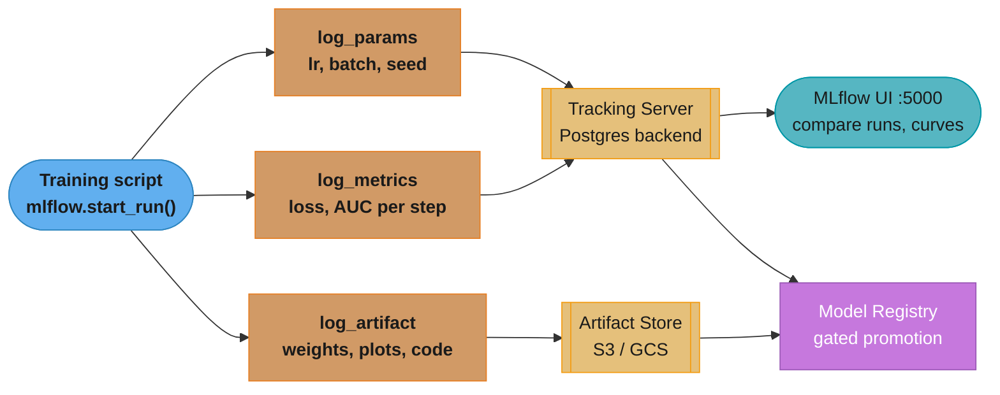
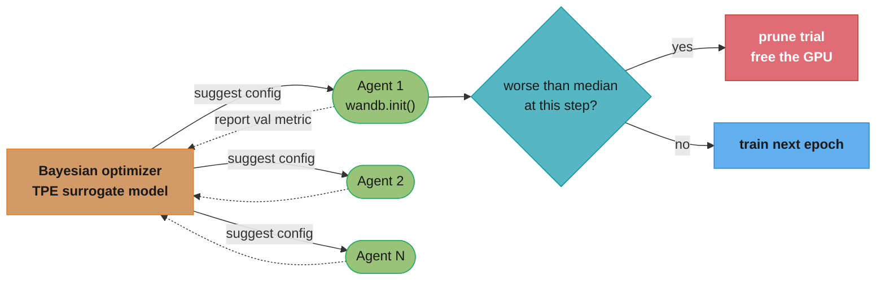
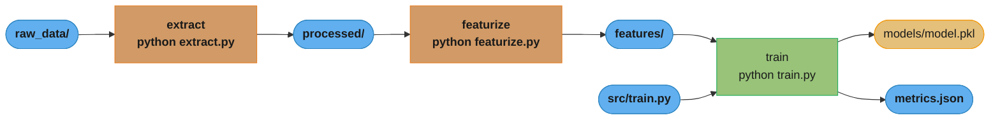
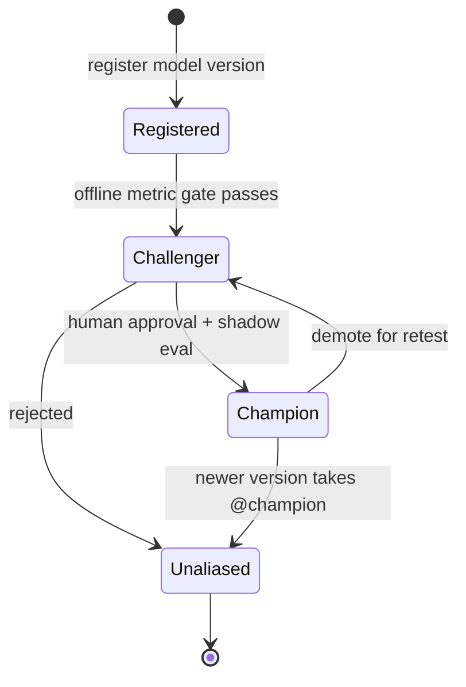
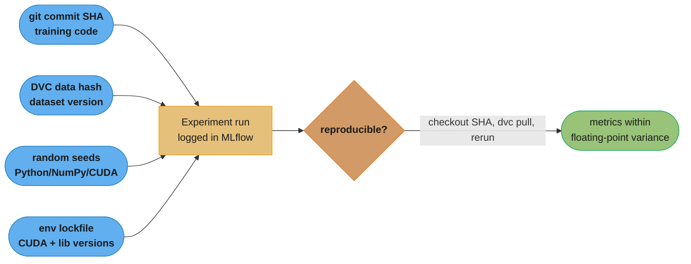

# Experiment Tracking and Versioning

<!-- tiers: senior -->

## 1. Concept Overview

Experiment tracking is the practice of recording every parameter, metric, artifact, and environmental detail of an ML training run so that results are reproducible, comparable, and auditable. Versioning extends this to the data, code, and environment — ensuring that the exact conditions of a successful experiment can be reconstructed months later.

Without experiment tracking, ML development degrades into a local notebook loop where: a model that worked "last Tuesday" cannot be reproduced, hyperparameter search results are forgotten, team members cannot build on each other's experiments, and the best model artifact cannot be linked to the training conditions that produced it.

The four axes of ML reproducibility:

- **Code versioning**: git commit SHA pinned to every run
- **Data versioning**: dataset hash or DVC ref pinned to every run
- **Experiment tracking**: hyperparameters, metrics, and artifacts logged per run (MLflow, W&B)
- **Environment versioning**: Python version, library versions, CUDA version recorded (requirements.txt, Docker image SHA)

A fully reproducible experiment is one where, given the git SHA + data ref + hardware type, any engineer can run the exact same training job and get metrics within floating-point variance of the original.

---

## 2. Intuition

One-line analogy: experiment tracking is a lab notebook for ML — every trial needs a dated entry with exact conditions, observations, and results, because the one experiment you forget to record is always the one that worked.

Mental model: think of each training run as an immutable document with five fields: (1) what you tried (hyperparameters), (2) what happened (metrics over time), (3) what you produced (model artifacts), (4) what data you used (dataset version), (5) when and where you ran it (timestamp, machine, git SHA). An experiment tracker (MLflow, W&B) is a database that stores and indexes these documents.

Why it matters: hyperparameter search is a high-dimensional optimization problem. Without logging all runs, engineers re-discover the same bad configurations repeatedly, and the relationship between hyperparameters and outcomes is invisible. With proper tracking, sequential methods (random search, then Bayesian optimization) reuse every past trial instead of discarding it, which is what makes them cheaper than a grid — the size of the win is problem-dependent, not a fixed multiple.

Key insight: the goal is not to log more data — it is to log the right data so that any run can be exactly reproduced and directly compared to any other run. Partial logging (only final accuracy, not per-epoch curves) makes debugging impossible.

---

## 3. Core Principles

**Log everything at run start, not at run end**: hyperparameters, dataset version, git SHA, and environment must be captured before training begins. A crash mid-run should still leave a partial record.

**Immutability of runs**: a completed run's logged data should never be edited. If you want to add notes, use tags or a separate linked artifact — don't mutate the original metrics.

**Metric naming consistency**: use the same metric names across all experiments (val_loss not validation_loss in some runs, val_loss in others). Schema drift in metric names makes comparison impossible.

**Artifact versioning**: every model checkpoint saved must be linked to the run that produced it. Never save checkpoints to a flat directory — version by run ID and epoch.

**Reproducibility over ergonomics**: it is better to log too much than too little. The cost of storage is negligible; the cost of being unable to reproduce a result is hours of re-training.

**Separation of concerns**: the training loop should not know which tracking backend is used. Abstract the logging calls behind a thin interface so you can swap MLflow for W&B without modifying training code.

---

## 4. Types / Architectures / Strategies

**MLflow Tracking**
Open-source, self-hosted or Databricks-managed. Runs are grouped under Experiments. Logs: params (str key, str value), metrics (float, with step), artifacts (any file). Auto-logging captures common framework calls automatically — `mlflow.sklearn.autolog()` patches `fit()`, while `mlflow.pytorch.autolog()` hooks **PyTorch Lightning's `Trainer.fit()` only** and is a no-op for a hand-written PyTorch loop. MLflow Model Registry adds model lifecycle management: numbered model versions carry mutable **aliases** (`@champion`, `@challenger`) plus version **tags** (`validation_status: passed`), and serving resolves a model by alias URI — `models:/fraud-model@champion`.

**Weights & Biases (W&B)**
SaaS (with self-hosted option). Richer visualizations than MLflow (interactive charts, side-by-side run comparison, media logging — images, audio, video). W&B Sweeps: define a hyperparameter search space, launch agents that query W&B's Bayesian optimizer for the next configuration. W&B Artifacts: versioned datasets, models, and evaluation results with lineage graph between them.

**Comet ML**
SaaS, automatic code capturing, diff logging. Strong in NLP research community.

**DVC (Data Version Control)**
Open-source, git-native. Tracks data files and pipeline stages (not experiments directly). `dvc stage add` defines a stage in dvc.yaml and `dvc repro` executes the pipeline DAG, caching intermediate outputs by content hash. `dvc exp run` for experiment tracking — lightweight, storing each experiment under hidden custom git refs (`refs/exps/...`) rather than as a real branch. Pairs with MLflow/W&B for full solution.

**Hyperparameter Optimization Strategies**:
- Grid search: all combinations — O(N^k) for N values per k hyperparameters; feasible only for 1-2 hyperparameters
- Random search: sample configurations uniformly — beats grid search in high-dimensional spaces because most hyperparameters do not matter and the ones that do differ per dataset (Bergstra & Bengio, JMLR 2012). Its guarantee is dimension-independent: if the near-optimal region occupies 5% of the search volume, `T` random draws miss it with probability `0.95^T`, so `T = 60` hits it with probability `1 - 0.95^60 = 95%` — the same 60 trials whether the space is 2-D or 100-D
- Bayesian optimization (Optuna TPE, SMAC): fit a surrogate model (tree-structured Parzen estimator or Gaussian process) to past results; sample next configuration in regions likely to improve over the current best — usually a few-fold saving over random search on the same problem, but the factor is problem-dependent, not a published constant
- Population-based training (PBT): asynchronously train a population of models; exploit good performers by copying their weights, explore by perturbing their hyperparameters mid-training

**What this actually says.** `O(N^k)` means "every hyperparameter you add multiplies the entire search you already had by N" — grid search does not get gradually more expensive, it gets exponentially more expensive.

That is why the guidance is a hard cutoff ("feasible only for 1-2 hyperparameters") rather than a soft preference. The exponent is the number of knobs, and you rarely have only two.

| Symbol | What it is |
|--------|------------|
| `N` | How many values you list for one hyperparameter (e.g. lr in `[1e-5, 1e-4, 1e-3, 1e-2, 1e-1]` -> N = 5) |
| `k` | How many hyperparameters you are tuning at once — the exponent, and the thing that hurts |
| `N^k` | Total configurations grid search must train. Every one is a full training run |
| "top 5% of the volume" | The fraction of the search space treated as near-optimal — the bar the 60-trial random-search argument is measured against, not a proof of optimality |

**Walk one example.** Hold `N = 5` fixed and add one hyperparameter at a time:

```
  k = 1   ->  5^1  =         5 configs    a coffee break
  k = 2   ->  5^2  =        25 configs    still fine -- this is grid search's home turf
  k = 3   ->  5^3  =       125 configs    already an overnight job
  k = 5   ->  5^5  =     3,125 configs    a GPU-week
  k = 10  ->  5^10 = 9,765,625 configs    never finishing

  Adding ONE hyperparameter at k = 5 does not add 5 runs -- it adds 4 x 3,125 = 12,500.
```

Random search's budget is the other side of the same arithmetic — it is a number you pick, and the exponent never appears:

```
  grid  : k = 10, N = 5   ->  5^10   = 9,765,625 runs
          even N = 2.51 (the coarsest useful grid) -> 2.51^10 = 10,000 runs
                                  a grid so coarse it tests ~2 values per knob

  random: T = 60 runs     ->  P(hit the top-5% region) = 1 - 0.95^60 = 95%
                              and T = 60 is 60 whether k = 2 or k = 100
```

**Why the exponent, not the base, is the enemy.** Halving `N` (5 values -> 2 or 3 per knob) buys you one factor; that is what the 2.51-per-dimension grid above already did, and it still needs 10,000 runs. Random search escapes because its cost is set by the trial budget you choose, not by `N^k` — the space's dimensionality never enters the count. Bayesian optimization then spends that fixed budget better by fitting a surrogate over the trials already finished.

Note what the 60-trial number is and is not: it is a statement about **volume**, so it assumes the near-optimal region really is ~5% of the space you sampled. Bergstra & Bengio's own measured results are smaller and problem-specific — 8 to 16 random trials sufficed on their 7-hyperparameter neural-network tasks, where a 4-value grid on the same axes would already have cost 256 runs.

---

## 5. Architecture Diagrams

**MLflow tracking architecture — where params, metrics, and artifacts flow**


```mermaid
flowchart LR
    classDef io      fill:#61afef,stroke:#2e86c1,color:#1a1a1a,font-weight:bold
    classDef frozen  fill:#c678dd,stroke:#9b59b6,color:#fff
    classDef train   fill:#98c379,stroke:#27ae60,color:#1a1a1a
    classDef mathOp  fill:#d19a66,stroke:#e67e22,color:#1a1a1a,font-weight:bold
    classDef lossN   fill:#e06c75,stroke:#c0392b,color:#fff,font-weight:bold
    classDef req     fill:#56b6c2,stroke:#0097a7,color:#1a1a1a
    classDef base    fill:#e5c07b,stroke:#f39c12,color:#1a1a1a

    script(["Training script\nmlflow.start_run()"]) --> params["log_params\nlr, batch, seed"]
    script --> metrics["log_metrics\nloss, AUC per step"]
    script --> artifacts["log_artifact\nweights, plots, code"]
    params --> server[["Tracking Server\nPostgres backend"]]
    metrics --> server
    artifacts --> store[["Artifact Store\nS3 / GCS"]]
    server --> ui(["MLflow UI :5000\ncompare runs, curves"])
    server --> registry["Model Registry\ngated promotion"]
    store --> registry

    class script io
    class params,metrics,artifacts mathOp
    class server,store base
    class ui req
    class registry frozen
```

A run streams small key-value params and time-series metrics to the SQL tracking
server, and large files (weights, plots) to the object store; the registry links
the winning run's artifact to a gated deployment stage. Use PostgreSQL, not SQLite,
so concurrent runs do not collide on the write lock.

**Hyperparameter sweep loop — optimizer suggests, agents train, poor trials pruned**


```mermaid
flowchart LR
    classDef io      fill:#61afef,stroke:#2e86c1,color:#1a1a1a,font-weight:bold
    classDef frozen  fill:#c678dd,stroke:#9b59b6,color:#fff
    classDef train   fill:#98c379,stroke:#27ae60,color:#1a1a1a
    classDef mathOp  fill:#d19a66,stroke:#e67e22,color:#1a1a1a,font-weight:bold
    classDef lossN   fill:#e06c75,stroke:#c0392b,color:#fff,font-weight:bold
    classDef req     fill:#56b6c2,stroke:#0097a7,color:#1a1a1a
    classDef base    fill:#e5c07b,stroke:#f39c12,color:#1a1a1a

    opt["Bayesian optimizer\nTPE surrogate model"] -->|"suggest config"| a1(["Agent 1\nwandb.init()"])
    opt -->|"suggest config"| a2(["Agent 2"])
    opt -->|"suggest config"| aN(["Agent N"])
    a1 -.->|"report val metric"| opt
    a2 -.-> opt
    aN -.-> opt
    a1 --> prune{"worse than median\nat this step?"}
    prune -->|"yes"| kill["prune trial\nfree the GPU"]
    prune -->|"no"| cont["train next epoch"]

    class a1,a2,aN train
    class opt mathOp
    class prune req
    class kill lossN
    class cont io
```

The optimizer fits a surrogate over past results and hands each parallel agent a
promising config (dotted arrows carry the reported metric back). A pruner
(MedianPruner / Hyperband) kills any trial already worse than the median, cutting
GPU hours by roughly 0.9x the prune rate for the same number of useful trials.

**DVC pipeline DAG — content-addressed, incremental reruns**


```mermaid
flowchart LR
    classDef io      fill:#61afef,stroke:#2e86c1,color:#1a1a1a,font-weight:bold
    classDef frozen  fill:#c678dd,stroke:#9b59b6,color:#fff
    classDef train   fill:#98c379,stroke:#27ae60,color:#1a1a1a
    classDef mathOp  fill:#d19a66,stroke:#e67e22,color:#1a1a1a,font-weight:bold
    classDef lossN   fill:#e06c75,stroke:#c0392b,color:#fff,font-weight:bold
    classDef req     fill:#56b6c2,stroke:#0097a7,color:#1a1a1a
    classDef base    fill:#e5c07b,stroke:#f39c12,color:#1a1a1a

    raw(["raw_data/"]) --> extract["extract\npython extract.py"]
    extract --> processed(["processed/"])
    processed --> featurize["featurize\npython featurize.py"]
    featurize --> features(["features/"])
    features --> train["train\npython train.py"]
    src(["src/train.py"]) --> train
    train --> model(["models/model.pkl"])
    train --> metrics(["metrics.json"])

    class raw,processed,features,src,metrics io
    class extract,featurize mathOp
    class train train
    class model base
```

`dvc repro` walks this DAG and reruns only stages whose input content hash changed;
`dvc push`/`pull` sync the actual data blobs with S3 while git tracks only the small
`.dvc` pointers.

**Model Registry lifecycle — the gate between experimentation and deployment**


```mermaid
stateDiagram-v2
    [*] --> Registered: register model version
    Registered --> Challenger: offline metric gate passes
    Challenger --> Champion: human approval + shadow eval
    Challenger --> Unaliased: rejected
    Champion --> Unaliased: newer version takes @champion
    Champion --> Challenger: demote for retest
    Unaliased --> [*]
```

A model enters the registry linked to one run, then earns aliases through gated
steps. Promotion is an alias move — pure metadata — so rollback is instant: the
older version is untouched on disk and `@champion` is simply pointed back at it,
with no redeploy. Aliases plus version tags beat a single status field because one
version can carry several labels at once (`@champion` for one deployment,
`@challenger` for another) while `validation_status: passed` records *why* it was
eligible.

**Reproducibility chain — the four axes that must all be pinned**


```mermaid
flowchart LR
    classDef io      fill:#61afef,stroke:#2e86c1,color:#1a1a1a,font-weight:bold
    classDef frozen  fill:#c678dd,stroke:#9b59b6,color:#fff
    classDef train   fill:#98c379,stroke:#27ae60,color:#1a1a1a
    classDef mathOp  fill:#d19a66,stroke:#e67e22,color:#1a1a1a,font-weight:bold
    classDef lossN   fill:#e06c75,stroke:#c0392b,color:#fff,font-weight:bold
    classDef req     fill:#56b6c2,stroke:#0097a7,color:#1a1a1a
    classDef base    fill:#e5c07b,stroke:#f39c12,color:#1a1a1a

    code(["git commit SHA\ntraining code"]) --> run["Experiment run\nlogged in MLflow"]
    data(["DVC data hash\ndataset version"]) --> run
    seeds(["random seeds\nPython/NumPy/CUDA"]) --> run
    env(["env lockfile\nCUDA + lib versions"]) --> run
    run --> q{"reproducible?"}
    q -->|"checkout SHA, dvc pull, rerun"| exact(["metrics within\nfloating-point variance"])

    class code,data,seeds,env io
    class run base
    class q mathOp
    class exact train
```

Reproducibility fails the moment any one axis is unpinned; teams usually log
hyperparameters but forget the data hash and the seeds, which are the two most
common sources of "it worked last Tuesday."

---

## 6. How It Works — Detailed Mechanics

### MLflow Tracking — Complete Training Loop

```python
import mlflow
import mlflow.pytorch
import torch
import torch.nn as nn
from torch.utils.data import DataLoader
from pathlib import Path
from typing import Any
import subprocess
import platform
import json


def get_git_sha() -> str:
    """Get current git commit SHA for reproducibility logging."""
    try:
        return subprocess.check_output(["git", "rev-parse", "HEAD"]).decode().strip()
    except Exception:
        return "unknown"


def log_environment(run: mlflow.ActiveRun) -> None:
    """Log Python, CUDA, and key library versions."""
    import torch, sys
    mlflow.log_params({
        "python_version": sys.version,
        "pytorch_version": torch.__version__,
        "cuda_version": torch.version.cuda or "cpu",
        "platform": platform.platform(),
        "git_sha": get_git_sha(),
    })


def train_with_mlflow(
    model: nn.Module,
    train_loader: DataLoader,
    val_loader: DataLoader,
    config: dict[str, Any],
    experiment_name: str = "my-model-experiment",
    tracking_uri: str = "http://mlflow-server:5000",
) -> str:
    """
    Full training loop with MLflow tracking.
    Returns the run_id of the completed run.
    """
    mlflow.set_tracking_uri(tracking_uri)
    mlflow.set_experiment(experiment_name)

    # NOTE: mlflow.pytorch.autolog() hooks PyTorch Lightning's Trainer.fit() ONLY.
    # The hand-written loop below is NOT covered by it, which is exactly why every
    # param and metric is logged explicitly. Enable it only if you switch to Lightning:
    #   mlflow.pytorch.autolog(log_every_n_epoch=1, log_models=False)

    with mlflow.start_run(run_name=f"lr_{config['lr']}_bs_{config['batch_size']}") as run:
        # Log all hyperparameters at run start — BEFORE training begins
        # If job crashes at epoch 5, you still have the config recorded
        mlflow.log_params({
            "learning_rate": config["lr"],
            "batch_size": config["batch_size"],
            "epochs": config["epochs"],
            "optimizer": config["optimizer"],
            "weight_decay": config.get("weight_decay", 0.0),
            "dropout": config.get("dropout", 0.0),
            "dataset_version": config["dataset_version"],
            "model_architecture": config["architecture"],
        })
        log_environment(run)

        # Log dataset hash for reproducibility
        mlflow.set_tag("dataset_sha256", config["dataset_sha256"])
        mlflow.set_tag("experiment_purpose", config.get("purpose", "hyperparameter_search"))

        optimizer = torch.optim.AdamW(
            model.parameters(),
            lr=config["lr"],
            weight_decay=config.get("weight_decay", 0.01),
        )
        criterion = nn.CrossEntropyLoss()
        best_val_loss = float("inf")

        for epoch in range(config["epochs"]):
            model.train()
            train_loss, train_correct, train_total = 0.0, 0, 0

            for batch_idx, (inputs, labels) in enumerate(train_loader):
                optimizer.zero_grad()
                outputs = model(inputs)
                loss = criterion(outputs, labels)
                loss.backward()
                optimizer.step()

                train_loss += loss.item()
                _, predicted = outputs.max(1)
                train_correct += predicted.eq(labels).sum().item()
                train_total += labels.size(0)

            # Validate
            model.eval()
            val_loss, val_correct, val_total = 0.0, 0, 0
            with torch.no_grad():
                for inputs, labels in val_loader:
                    outputs = model(inputs)
                    val_loss += criterion(outputs, labels).item()
                    _, predicted = outputs.max(1)
                    val_correct += predicted.eq(labels).sum().item()
                    val_total += labels.size(0)

            metrics = {
                "train_loss": train_loss / len(train_loader),
                "train_accuracy": train_correct / train_total,
                "val_loss": val_loss / len(val_loader),
                "val_accuracy": val_correct / val_total,
                "learning_rate": optimizer.param_groups[0]["lr"],
            }

            # Log metrics with step (epoch) for time-series visualization
            mlflow.log_metrics(metrics, step=epoch)

            # Save best model checkpoint as artifact
            if metrics["val_loss"] < best_val_loss:
                best_val_loss = metrics["val_loss"]
                checkpoint_path = Path(f"/tmp/best_model_run_{run.info.run_id}.pt")
                torch.save({
                    "epoch": epoch,
                    "model_state_dict": model.state_dict(),
                    "val_loss": best_val_loss,
                    "config": config,
                }, checkpoint_path)
                mlflow.log_artifact(str(checkpoint_path), artifact_path="checkpoints")

        # Log final summary metrics as params (searchable in UI)
        mlflow.log_params({
            "final_val_accuracy": round(val_correct / val_total, 4),
            "best_val_loss": round(best_val_loss, 4),
        })

        return run.info.run_id
```

### Optuna Hyperparameter Optimization with MLflow Integration

```python
import optuna
from optuna.samplers import TPESampler
from optuna.pruners import MedianPruner


def objective(trial: optuna.Trial) -> float:
    """
    Optuna objective function.
    Returns validation loss (minimize).
    Integrated with MLflow: each trial is a separate MLflow run.
    """
    # Define hyperparameter search space
    config = {
        "lr": trial.suggest_float("lr", 1e-5, 1e-2, log=True),
        "batch_size": trial.suggest_categorical("batch_size", [32, 64, 128, 256]),
        "weight_decay": trial.suggest_float("weight_decay", 1e-6, 1e-2, log=True),
        "dropout": trial.suggest_float("dropout", 0.0, 0.5),
        "hidden_dim": trial.suggest_categorical("hidden_dim", [256, 512, 1024]),
        "epochs": 20,
        "optimizer": "adamw",
        "dataset_version": "v3",
        "dataset_sha256": "abc123...",
        "architecture": "mlp",
    }

    model = build_model(config)

    with mlflow.start_run(run_name=f"trial_{trial.number}", nested=True):
        mlflow.log_params(config)
        mlflow.set_tag("optuna_trial_number", trial.number)

        for epoch in range(config["epochs"]):
            val_loss = train_one_epoch(model, epoch, config)
            mlflow.log_metric("val_loss", val_loss, step=epoch)

            # Report intermediate value to Optuna for pruning
            trial.report(val_loss, epoch)

            # MedianPruner: stop if this trial is worse than median at this step
            if trial.should_prune():
                raise optuna.exceptions.TrialPruned()

    return val_loss


def run_hyperparameter_search(n_trials: int = 100) -> optuna.Study:
    """
    Run Bayesian hyperparameter optimization.
    TPE (Tree-structured Parzen Estimator) reuses every finished trial, so it
    typically needs fewer trials than random search to reach the same metric.
    """
    with mlflow.start_run(run_name="hpo_study"):
        study = optuna.create_study(
            direction="minimize",
            # TPESampler takes keyword arguments only
            sampler=TPESampler(n_startup_trials=10),  # random for first 10 trials, then TPE
            pruner=MedianPruner(n_startup_trials=5, n_warmup_steps=5),
        )
        # n_jobs stays 1 on purpose. Optuna's n_jobs is THREAD-based, and MLflow's
        # active-run stack is thread-local, so worker threads would not see the
        # parent run and every `start_run(nested=True)` would silently become a
        # flat top-level run. For real parallelism run separate processes against
        # a shared Optuna storage and pass the parent explicitly:
        #   mlflow.start_run(nested=True, parent_run_id=parent_id)
        study.optimize(objective, n_trials=n_trials, n_jobs=1)

        # Log best hyperparameters to parent run
        mlflow.log_params({f"best_{k}": v for k, v in study.best_params.items()})
        mlflow.log_metric("best_val_loss", study.best_value)

    return study
```

### W&B Sweep Configuration

```python
import wandb
from typing import Any


# Define sweep configuration (YAML or dict)
sweep_config = {
    "method": "bayes",          # "grid", "random", or "bayes"
    "metric": {"name": "val_accuracy", "goal": "maximize"},
    "parameters": {
        "lr": {"distribution": "log_uniform_values", "min": 1e-5, "max": 1e-2},
        "batch_size": {"values": [32, 64, 128]},
        "weight_decay": {"distribution": "log_uniform_values", "min": 1e-6, "max": 1e-2},
        "dropout": {"distribution": "uniform", "min": 0.0, "max": 0.5},
    },
    "early_terminate": {
        "type": "hyperband",
        "min_iter": 5,       # don't prune before 5 epochs
        "eta": 3,            # promotion factor
    }
}


def train_with_wandb(config: dict[str, Any] | None = None) -> None:
    """
    Training function called by W&B sweep agent.
    wandb.config is populated automatically by the sweep controller.
    """
    with wandb.init(config=config) as run:
        cfg = wandb.config  # hyperparameters injected by sweep

        wandb.log({"dataset_version": "v3", "git_sha": get_git_sha()})

        model = build_model(cfg)
        optimizer = torch.optim.AdamW(model.parameters(), lr=cfg.lr)

        for epoch in range(20):
            train_loss = run_train_epoch(model, optimizer)
            val_loss, val_acc = run_val_epoch(model)

            wandb.log({
                "epoch": epoch,
                "train_loss": train_loss,
                "val_loss": val_loss,
                "val_accuracy": val_acc,
                "lr": optimizer.param_groups[0]["lr"],
            })

        # Log model artifact linked to this run
        artifact = wandb.Artifact(f"model-{run.id}", type="model")
        artifact.add_file("best_model.pt")
        run.log_artifact(artifact)


def launch_wandb_sweep() -> None:
    sweep_id = wandb.sweep(sweep_config, project="my-model-project")
    # One agent, running up to 25 training jobs sequentially. For N parallel
    # agents, start this same call in N separate processes/machines with the
    # SAME sweep_id — the sweep controller hands each one different configs.
    wandb.agent(sweep_id, function=train_with_wandb, count=25)
```

---

## 7. Real-World Examples

**Google DeepMind** (Google Brain merged into DeepMind in April 2023): frontier-model research runs on internal tracking infrastructure, not a public tool. Note the limit of what tracking buys the *reader*: the Gemini technical reports deliberately withhold model sizes, exact hyperparameters, and data-mixture proportions. Internal reproducibility and external disclosure are separate decisions — good tracking enables the first and says nothing about the second.

**Hugging Face**: model hub acts as a public artifact registry. Every model card (README.md) links to training data, training code, and evaluation results. `push_to_hub()` is the equivalent of `mlflow.log_artifact()` in the HF ecosystem.

**Spotify**: runs a centralized in-house ML platform (Hendrix) rather than a stock tracker — originally TensorFlow Extended plus Kubeflow Pipelines on Kubernetes (2018-2019), extended from 2023 with a managed Ray platform on GKE via KubeRay so PyTorch, XGBoost, GNN and RL workloads scale under one system. The pattern to take from it: at organization scale, tracking is usually absorbed into a platform that also owns orchestration and the feature store.

**Weights & Biases customers**: OpenAI and Toyota Research Institute are both publicly named W&B customers, OpenAI citing experiment logging and W&B Sweeps for hyperparameter sensitivity work. *Illustrative* shape of such a sweep (not a published figure): 100 trials, 3 epochs each, Bayesian sampler with Hyperband early termination, most of the budget spent on the ~40 trials that survive the first bracket.

---

## 8. Tradeoffs

| Tool | Hosting | Cost | Visualization | Hyperparameter Search | Data Versioning |
|---|---|---|---|---|---|
| MLflow | Self-hosted / Databricks | Free (self-host) | Basic | Via Optuna integration | No (use DVC) |
| W&B | SaaS / self-hosted | Free tier (5 GB/mo storage), then paid | Excellent | Built-in Sweeps | W&B Artifacts |
| Comet ML | SaaS | Free tier, then paid | Good | No built-in | No |
| DVC | Self-hosted (git + remote) | Free | Via DVCLive | Via DVC Experiments | Yes (core feature) |

| HPO Strategy | Sample Efficiency | Parallelism | Implementation Complexity |
|---|---|---|---|
| Grid search | Poor (exponential) | Easy | None |
| Random search | Moderate | Easy | None |
| Bayesian (Optuna TPE) | High | Medium (async) | Low (Optuna) |
| Population-based training | High (online) | Complex | High (Ray Tune PBT) |
| Hyperband | High (early stopping) | Easy | Low |

---

## 9. When to Use / When NOT to Use

**Use MLflow when**: team is self-hosted, already on Databricks, needs open-source with no SaaS dependency, codebase uses scikit-learn/XGBoost/LightGBM (autolog is excellent), or you need an on-premise model registry.

**Use W&B when**: team needs rich visualizations, collaborative run comparison, built-in hyperparameter search, or logging of media artifacts (images, audio, attention maps). Excellent for research teams and LLM fine-tuning.

**Use DVC when**: data versioning is the primary need, you want git-native workflow, the team is already comfortable with git, or you need reproducible multi-stage pipelines with dependency tracking.

**Use Optuna when**: hyperparameter search is needed independently of the experiment tracking backend — Optuna integrates with MLflow, W&B, and Comet simultaneously.

**Do NOT use grid search when**: search space has more than 2-3 hyperparameters or more than 5 values per hyperparameter — combination explosion makes it infeasible.

**Do NOT skip data versioning**: logging hyperparameters without recording the exact dataset version means the run is not reproducible. If the dataset is updated between runs, old run metrics are no longer comparable.

**Do NOT use W&B in air-gapped environments**: W&B requires outbound internet access (or a self-hosted installation) — verify network requirements before adopting in regulated industries.

---

## 10. Common Pitfalls

**Pitfall 1 — Logging only final metrics, not per-epoch curves**
Production incident: a team logged only final val_accuracy (run end) in MLflow. Two models had nearly identical final accuracy (0.912 vs 0.914). The 0.914 model was promoted to production. Post-deployment, its performance was unstable. Later analysis showed the 0.914 model's val_loss had been increasing for the last 5 epochs (overfitting) while the 0.912 model's val_loss was still decreasing — the better model was the one still improving. With per-epoch logging, this would have been visible in the loss curves. Fix: always log metrics with the step argument at every epoch.

**Pitfall 2 — Experiment naming collisions**
A team used run names like "experiment_1", "experiment_2" without encoding hyperparameters in the name. After 200 runs, it was impossible to find the run with lr=3e-4 without clicking through each one. Fix: embed key hyperparameters in the run name: `f"lr_{lr}_bs_{batch_size}_wd_{weight_decay}"`. Use MLflow tags for free-text annotations.

**Pitfall 3 — Not pinning dataset version**
A team retrained the same model config 3 months later and got 2% lower accuracy. The dataset had been updated (new data added, some old data cleaned). The original training run had no record of which dataset version it used. The team spent 2 weeks debugging model code before discovering the root cause. Fix: always log dataset version as a run parameter — either a DVC commit ref, an S3 URI with version ID, or a dataset content hash.

**Pitfall 4 — Hyperparameter search without pruning**
A team ran 200 Optuna trials without early stopping (no pruner). Each trial trained for 50 epochs. 60% of trials were clearly worse by epoch 5 (val_loss 2x the best trial's loss at epoch 5) but ran to completion, consuming 60% of the GPU budget for no information gain. Fix: add `MedianPruner(n_startup_trials=5, n_warmup_steps=5)` — prune any trial worse than the median at each step. The saving is `(epochs - warmup)/epochs` times the prune rate — here `45/50 = 0.9`, so a 40-60% prune rate returns 36-54% of the GPU hours with the same number of useful trials.

**Read it like this.** The unit of GPU spend in a sweep is not the trial, it is the *trial-epoch* — so a pruner does not remove trials from the budget, it truncates them, and the saving is whatever fraction of the epoch grid you never ran.

| Symbol | What it is |
|--------|------------|
| `n_trials` | Configurations the sampler will propose. `200` here |
| `epochs` | Full training length of one trial. `50` here |
| trial-epochs | `n_trials x epochs` — the real budget, since GPU time scales with epochs, not trials |
| `n_warmup_steps` | Epochs a trial is immune from pruning. `5` — a config cannot be judged at epoch 0 |
| `n_startup_trials` | Trials run in full before pruning turns on. `5` — the pruner needs a median to compare against |
| prune rate | Fraction of trials killed at the warmup boundary. `60%` in this incident |

**Walk one example.** The exact 200-trial study from the incident, with and without the pruner:

```
  no pruner : 200 trials x 50 epochs                    = 10,000 trial-epochs

  pruner on : 120 pruned trials (60%) x  5 epochs       =    600
              80 surviving trials      x 50 epochs      =  4,000
                                                          ------
                                                           4,600 trial-epochs

  saved     = 10,000 - 4,600 = 5,400   ->  5,400 / 10,000 = 54%   <- 0.9 x the 60% prune rate
  useful results are unchanged: the same 80 good configs still trained to epoch 50.
```

The low end is just a lower prune rate, not a different mechanism — at 40% pruned the arithmetic is `80 x 5 + 120 x 50 = 6,400`, a 36% saving. Every extra point of prune rate converts a 50-epoch run into a 5-epoch run, so the saving is exactly `(50 - 5)/50 = 0.9` times the prune rate. That closed form is where the numbers in this module come from — no vendor publishes a measured prune-rate benchmark, so treat 40-60% pruned (36-54% saved) as a planning band set by your own warmup and epoch budget, not as a reported result.

**Why the warmup epochs exist.** With `n_warmup_steps = 0` the pruner would compare trials at epoch 0, where the ranking is pure initialization noise, and would happily kill the eventual winner — a config with a warmup learning-rate schedule looks terrible for its first few epochs by design. The 5-epoch grace period costs `200 x 5 = 1,000` trial-epochs of the 10,000 and buys the signal that makes the median comparison meaningful.

**Pitfall 5 — Shared artifact directory across experiments**
A team saved all model checkpoints to `s3://bucket/models/best_model.pt` — overwriting on every run. After a weekend sweep of 50 runs, the checkpoint corresponded to the last run (not the best run). The best run's model was gone. Fix: always save artifacts to paths keyed by run ID: `s3://bucket/models/{run_id}/best_model.pt`. MLflow and W&B do this automatically when you use `mlflow.log_artifact()` or `wandb.log_artifact()`.

---

## 11. Technologies & Tools

| Tool | Category | Key Feature |
|---|---|---|
| MLflow Tracking | Experiment tracking | Open-source, SQL backend, model registry |
| MLflow Model Registry | Model lifecycle | Version aliases (`@champion`, `@challenger`) + version tags |
| Weights & Biases | Experiment tracking | Rich visualization, Sweeps, Artifacts |
| Comet ML | Experiment tracking | Auto code capture, diff logging |
| Optuna | HPO | TPE sampler, Hyperband pruner, distributed |
| Ray Tune | HPO | Distributed HPO, PBT, integrates with all trackers |
| Hyperopt | HPO | TPE-based, older but widely used |
| DVC | Data + pipeline versioning | Git-native, content-addressable storage |
| DVCLive | Metric logging for DVC | Integrates with DVC pipelines |
| Delta Lake | Data versioning | ACID Parquet, time travel queries |
| Git LFS | Large file versioning | Simple but not ML-optimized |
| Pachyderm | Data versioning | Kubernetes-native, strong lineage |
| W&B Artifacts | Artifact versioning | Lineage graph between datasets + models |
| Marquez / OpenLineage | Data lineage | Vendor-neutral lineage standard |

---

## 12. Interview Questions with Answers

**Q: What is the minimum set of information needed to make an ML experiment reproducible?**
**Short:** Reliable ML reproducibility requires recording code version, data version, hyperparameters, random seeds, and environment together, since missing any one breaks it.
Five things must be recorded: code version, data version, hyperparameters, random seeds, and environment. Concretely: (1) code version — git commit SHA of the training script and all imported libraries; (2) data version — content hash or DVC ref of every input dataset; (3) hyperparameters — all of them, including defaults that were not tuned; (4) random seeds — Python random seed, NumPy seed, PyTorch seed, and CUDA determinism settings; (5) environment — Python version, library versions (requirements.txt with hashes), CUDA version, and GPU type. Missing any one of these makes reproduction unreliable. Most teams log hyperparameters but forget data version and random seeds — those are the most common sources of irreproducibility.

**Q: How does Bayesian optimization (Optuna TPE) work and why is it more efficient than random search?**
**Short:** Optuna's TPE models good-trial versus bad-trial distributions and picks the next config by maximizing l(x)/g(x), usually needing fewer trials than random search.
Bayesian optimization maintains a probabilistic surrogate model of the objective function built from past trial results. Tree-structured Parzen Estimator (TPE) splits finished trials into a "good" set and a "bad" set and fits a density to each: `l(x)` over the good trials, `g(x)` over the rest. Optuna's default split is the top `min(ceil(0.1 * n), 25)` trials — roughly the top 10%, capped at 25 — and by default it fits those densities per hyperparameter, with `multivariate=True` needed for a joint model. The next configuration is chosen to maximize the `l(x)/g(x)` ratio, which is monotonic in expected improvement, focusing new trials on promising regions. TPE usually reaches a given validation metric in fewer trials than random search, but the saving is problem-dependent — treat any fixed multiple you have seen quoted as a rule of thumb, not a measured constant.

**Q: What is the difference between MLflow params, metrics, and tags?**
**Short:** MLflow params are immutable per-run hyperparameters, metrics are step-indexed numeric time series, and tags are the only one of the three that's updatable after the run.
Params are hyperparameters — immutable string key-value pairs logged once per run (learning_rate, batch_size, model_architecture). They cannot be updated after logging. Metrics are time-series float values logged with a step (epoch, iteration) — train_loss, val_accuracy, learning_rate. They support per-step history for visualization. Tags are free-form string annotations that CAN be updated after the run completes — used for labels like "best_model", "failed", "dataset_v3". All three are first-class in `search_runs()` filter strings (`params.lr = '0.001'`, `metrics.val_auc > 0.9`, `tags.owner = 'fraud-team'`); the real search difference is that metrics get numeric comparators while params and tags, being strings, only get `=`, `!=`, `LIKE`, `ILIKE` and `IN` — which is why a number you want to sort or threshold on must be logged as a metric, not a param.

**Q: How do you use DVC to version a dataset and ensure reproducibility?**
**Short:** DVC versions large data by committing a small content-hash pointer file to git while pushing the actual data to remote object storage like S3 or GCS.
Four commands: `dvc add data/train.csv` creates a small YAML `data/train.csv.dvc` pointer (holding the content hash — MD5 by default in DVC 3.x, not SHA256) and adds the real data to .gitignore. `git add data/train.csv.dvc && git commit -m "add training data v3"` records the data version in git history. `dvc push` uploads the actual data to the configured remote (S3, GCS). Later, `git checkout <sha> && dvc pull` restores the exact dataset version corresponding to that git commit. The .dvc file is the bridge between git (code history) and the object storage (data). `dvc repro` executes the pipeline DAG, using cached outputs for stages whose inputs have not changed.

**Q: When should you use W&B Sweeps vs Optuna for hyperparameter search?**
**Short:** Choose W&B Sweeps for managed distributed agents inside an existing W&B workflow, and Optuna when you need sampler and pruner control independent of any tracker.
Pick W&B Sweeps if you already live in W&B and want managed distributed agents; pick Optuna if you want sampler and pruner control independent of any tracker. Use W&B Sweeps when: the team already uses W&B for experiment tracking (runs appear in the same project dashboard), you need distributed agents across multiple machines without managing a database, or you want the sweep results visualized in W&B's parallel coordinates plot. Use Optuna when: you need more control over the sampler (custom TPE, CMA-ES, grid), you use a different tracking backend (MLflow, no tracker), you want advanced pruning (MedianPruner, Hyperband, SuccessiveHalving), or you are running HPO programmatically in a Python script without a SaaS dependency. Both support Bayesian optimization; Optuna has richer built-in pruning support.

**Q: What is MLflow Model Registry and how does it relate to experiment tracking?**
**Short:** MLflow Model Registry is the deployment-side counterpart to tracking: it holds numbered model versions and labels the live one with mutable aliases such as @champion plus version tags.
MLflow Model Registry is a model lifecycle management system separate from (but linked to) the tracking server. A model is registered by linking an artifact from a completed run: `mlflow.register_model(f"runs:/{run_id}/model", "MyModel")`. The registry manages version numbers plus the labels that say which version is live. Those labels are `client.set_registered_model_alias(name, "champion", version)` plus version tags such as `validation_status: passed`, which lets one version hold several labels at once and lets you split environments into separate registered models. Teams gate production deployment on that label: CI/CD checks that the alias was moved only after human approval and validation tests passing. This creates an audit trail: every production model links back to the exact training run (and thus the exact hyperparameters, dataset version, and git SHA) that produced it.

**Q: How do you handle random seeds for reproducibility in PyTorch?**
**Short:** Full PyTorch determinism requires seeding Python, NumPy, and all CUDA devices, then disabling cuDNN's auto-tuning benchmark mode.
Set seeds for all sources of randomness: `random.seed(seed)` (Python), `np.random.seed(seed)` (NumPy), `torch.manual_seed(seed)` (CPU), `torch.cuda.manual_seed_all(seed)` (all GPUs). Then call `torch.use_deterministic_algorithms(True)`, which is the modern umbrella switch and raises on any op with no deterministic implementation, and set `torch.backends.cudnn.benchmark = False` to disable cuDNN's auto-tuner, which otherwise picks different (faster) algorithms across runs. `torch.backends.cudnn.deterministic = True` is the older, narrower flag — it constrains cuDNN convolutions only. PyTorch documents that deterministic ops are often slower but publishes no figure; measure the cost on your own model rather than assuming one. For distributed training, also set the seed per rank: `torch.manual_seed(seed + rank)` to ensure different data ordering per rank while remaining deterministic across runs.

**Q: What is the difference between MLflow autolog and manual logging, and when do you use each?**
**Short:** MLflow autolog monkey-patches a framework's fit() entry point, so it logs nothing from a hand-written PyTorch loop, which needs manual logging instead.
Autolog uses monkey-patching to intercept a framework's training entry point and log automatically: `mlflow.sklearn.autolog()` patches `fit()`, and `mlflow.pytorch.autolog()` patches PyTorch Lightning's `Trainer.fit()`. That last one is the classic trap — it is Lightning-specific and logs nothing at all from a hand-written PyTorch loop, so a run that looks "instrumented" comes back empty. Use autolog for: rapid prototyping, standard model types where the framework API is the training entry point, cases where you do not want to modify training code. Use manual logging when: your training loop is a raw loop rather than a framework `fit()`, you need full control over what is logged and when, you want to log custom metrics not captured by autolog, or you are logging to multiple backends simultaneously (mlflow.log_metric() + wandb.log()).

**Q: How should you structure MLflow experiments for a team working on multiple projects?**
**Short:** Structure MLflow experiments as one per model family, dataset, and objective, using tags for team owner, ticket, and run purpose instead of ad hoc naming.
Use the experiment hierarchy as: one experiment per (model_family, dataset, objective). For example: "fraud_detection/xgboost/auc_maximize", "fraud_detection/lstm/auc_maximize", "churn_prediction/lgbm/f1_maximize". Within an experiment, use tags to annotate: team owner, JIRA ticket, purpose (prod_candidate, ablation, debug). Use run names to encode key hyperparameters. Set up MLflow with a PostgreSQL backend (not SQLite — SQLite has locking issues with concurrent writes) and an S3 artifact store. Access control: open-source MLflow ships a built-in auth plugin (`mlflow server --app-name basic-auth`) with READ / EDIT / MANAGE / NO_PERMISSIONS grants per experiment and registered model — it is basic-auth based and still marked experimental, so back it with bucket-level S3 IAM policies to isolate team namespaces, or use the managed access control on Databricks.

**Q: What is DVCLive and how does it integrate experiment tracking with DVC?**
**Short:** DVCLive writes metrics to git-tracked files integrated with DVC pipelines, avoiding the central-server dependency that MLflow or W&B require.
DVCLive is DVC's built-in metric logging library that writes metrics to files (metrics.json, dvclive/plots/) instead of a central server. It integrates with DVC's pipeline system: when `dvc repro` runs a training stage, DVCLive writes metrics to tracked output files, which DVC versions alongside the model artifacts. `dvc exp run` and `dvc exp show` provide a local, git-native experiment comparison table. Advantage: no external server dependency, works offline, metrics are git-versioned. Disadvantage: less rich visualization than W&B, no collaborative sharing without a git host. Best for: individual researchers, regulated environments without SaaS access, or as a supplement to DVC pipelines when W&B/MLflow is also used.

**Q: How do you compare two MLflow runs programmatically to select the best model?**
**Short:** Use MlflowClient().search_runs() with a metric filter and order_by clause to programmatically rank runs and pick the best model for registry promotion.
Use the MLflow tracking client: `MlflowClient().search_runs(experiment_ids=["1"], filter_string="metrics.val_accuracy > 0.90", order_by=["metrics.val_accuracy DESC"], max_results=10)`. This returns Run objects with params, metrics, and artifact URIs. Best practice for model selection pipelines: (1) filter by minimum quality threshold (val_accuracy > 0.90), (2) sort by primary metric (val_accuracy), (3) apply secondary filter if needed (training_time < 4 hours), (4) fetch the best run's artifact URI and register it to the Model Registry. Automate this in a CI/CD step that runs after the sweep completes.

**Q: Why must hyperparameters be logged at run start rather than at run end?**
**Short:** Logging hyperparameters before training starts, not at the end, ensures a mid-training crash still leaves a reproducible parameter record.
Logging at run start means a mid-training crash still leaves a complete parameter record you can reproduce from. If you log the config only on the last line of the training loop, a job that dies at epoch 5 leaves an orphan run with metrics but no idea which learning rate or batch size produced them — the record is useless. Capture params, dataset version, git SHA, and environment before the first forward pass; treat run-start logging as the commit that makes the run recoverable.

**Q: Why is SQLite a poor tracking backend for a team running concurrent experiments?**
**Short:** SQLite's single-file write lock causes "database is locked" errors under concurrent runs, so team or parallel-HPO setups need PostgreSQL or MySQL instead.
SQLite serializes writes behind a single file lock, so concurrent runs collide and block, and a distributed sweep will throw "database is locked" errors. It is fine for a single-user local prototype but does not survive multiple agents logging metrics simultaneously. Use PostgreSQL (or MySQL) as the MLflow backend store for any team or parallel-HPO setup, with an S3/GCS artifact store alongside it. The switch is a one-line `--backend-store-uri` change and removes the entire class of concurrency failures.

**Q: Why should model checkpoints never be written to a single shared path like models/best_model.pt?**
**Short:** Writing every checkpoint to one shared path like models/best_model.pt lets each run overwrite it, so only the last run's weights survive a sweep, not the best one.
A shared flat path is overwritten by every run, so after a sweep only the last run's weights survive — not the best run's. This is the classic "weekend sweep of 50 runs and the good model is gone" incident. Always key artifact paths by run ID, e.g. `s3://bucket/models/{run_id}/best_model.pt`; MLflow's `log_artifact()` and W&B's `log_artifact()` do this isolation automatically, which is the main reason to log through the tracker rather than saving files by hand.

**Q: Why does inconsistent metric naming across runs make experiments impossible to compare?**
**Short:** Inconsistent metric names like val_loss versus validation_loss across runs fragment comparison dashboards, so teams need one fixed metric-name vocabulary.
Comparison and search queries key on exact metric names, so `val_loss` in one run and `validation_loss` in another never line up on the same axis. Schema drift in metric names silently fragments a dashboard: half your runs plot on one chart and half vanish. Enforce a fixed metric vocabulary (a shared logging helper or constants module) so every run reports `val_loss`, `val_accuracy`, `train_loss` under identical keys — the same discipline applies to param names used in `search_runs()` filters.

**Q: How do early-stopping pruners like MedianPruner and Hyperband reduce hyperparameter-search cost?**
**Short:** MedianPruner and Hyperband kill trials already worse than the median at a given step, typically pruning 40-60% of trials to save GPU budget.
They kill trials that are already worse than the median at a given step, freeing GPU budget for promising configs instead of running every trial to completion. In a 200-trial Optuna study where 60% of configs are clearly bad by epoch 5, running them for the full 50 epochs wastes most of the budget for zero information gain. `MedianPruner(n_startup_trials=5, n_warmup_steps=5)` or Hyperband typically prunes 40-60% of trials. The GPU-hour saving is not that number — it is the fraction of the trial-epoch grid you never ran, which for a 50-epoch budget with 5 warmup epochs works out to `(50-5)/50 = 0.9` times the prune rate, so 36-54% across that band. Pruning requires reporting an intermediate value each step via `trial.report()`.

**Q: Why does random search outperform grid search in high-dimensional hyperparameter spaces?**
**Short:** Random search beats grid search in high dimensions because it samples the few hyperparameters that actually matter, while grid search's cost scales as O(N^k).
Random search spends its budget across the few hyperparameters that actually matter, instead of wasting it re-sampling unimportant dimensions on a rigid grid. Bergstra and Bengio (JMLR 2012) showed the objective has low effective dimensionality — only a few hyperparameters matter, and which ones differ per dataset, so no fixed grid can cover them; on their 7-hyperparameter neural-network tasks random search matched or beat a grid using 8-16 trials, where a 4-value grid on the same axes would have needed 256. The dimension-independent version of the argument: if the near-optimal region is 5% of the volume, 60 random draws hit it with probability `1 - 0.95^60 = 95%`, regardless of how many hyperparameters there are. Grid search is only viable for 1-2 hyperparameters; beyond that its cost is O(N^k) and it repeatedly evaluates the same value of an irrelevant dimension. For anything larger, use random search as a floor and Bayesian optimization for sample efficiency.

**Q: What is population-based training (PBT) and when is it preferable to Bayesian optimization?**
**Short:** Population-based training perturbs hyperparameters online across a population of parallel models, discovering schedules rather than the single static config Bayesian optimization picks per trial.
PBT trains a population of models in parallel, periodically copying the best performers' weights and perturbing their hyperparameters mid-run. Unlike Bayesian optimization, which picks a fixed config per trial and trains it to completion, PBT adapts hyperparameters online — so it can discover schedules (e.g. a decaying learning rate or entropy coefficient) rather than a single static value. It shines for RL and long training runs where the optimal hyperparameter changes over the course of training, at the cost of higher orchestration complexity (Ray Tune PBT).

**Q: How do nested runs keep a large hyperparameter sweep organized in MLflow?**
**Short:** Nested MLflow runs group an HPO sweep's trials as child runs under one parent run, keeping large sweeps organized instead of scattering hundreds of sibling runs.
A parent run represents the whole sweep and each trial is a nested child run, so the UI groups configs together instead of scattering 200 sibling runs across the experiment list. Start the parent with `mlflow.start_run(run_name="hpo_study")` and each trial with `mlflow.start_run(nested=True)`; the parent can then hold aggregate tags and the best hyperparameters, while children hold per-trial params and metrics. This mirrors how Optuna studies map onto MLflow and makes sweep-level comparison a single click.

---

## 13. Best Practices

- Log ALL hyperparameters — including defaults — not just the ones you tuned; the "default" values are often the source of reproducibility failures when library versions change defaults
- Use nested runs in MLflow (parent = HPO study, child = individual trial) to maintain clean experiment hierarchy and enable sweep-level aggregation
- Pin every dependency with exact versions and hashes in requirements.txt (`pip freeze > requirements.txt`) — library updates can change default behavior and break reproducibility
- Set random seeds as the very first lines of the training script, before any imports that might initialize RNGs
- Store artifact paths relative to the run ID, never as absolute paths or shared names — `s3://bucket/artifacts/{run_id}/` ensures isolation
- Use `mlflow.set_tag("model_status", "candidate")` after successful training and `"model_status", "promoted"` after production deployment — creates an audit trail without modifying runs
- Run hyperparameter search with Hyperband or MedianPruner to avoid wasting GPU hours on clearly poor configurations — target 40-60% trial pruning rate for efficiency
- Validate the experiment setup by running a sanity-check trial for 1 epoch before launching a full sweep — catches data loading errors, OOM, and logging misconfigurations cheaply
- Archive (do not delete) failed or suboptimal runs — negative results have information value; failed runs reveal what does NOT work, which guides future searches

---

## 14. Case Study

**Scenario: Experiment tracking for a 12-person ML team running 500 experiments/week.** Without discipline, results are irreproducible and the team re-runs the same failed configs. MLflow centralizes params, metrics, and artifacts; DVC versions large datasets; the Model Registry gates the `@challenger` -> `@champion` promotion. Every run is pinned to a git commit SHA and a DVC data hash, so any model can be reproduced exactly.

```
experiment run
  +-- mlflow.log_params()    (lr, batch, arch, seed)
  +-- mlflow.log_metrics()   (loss/AUC every 100 steps)
  +-- mlflow.log_artifact()  (weights, confusion matrix, preprocessing code)
  +-- tags: git_sha, dvc_data_hash
        |
   MLflow Tracking Server (Postgres backend + S3 artifact store)
        |
   Model Registry:  v7 --tag validation_status=passed--> @challenger --> @champion
                    (rollback = point @champion at the previous version)
        |
   reproduce = checkout(git_sha) + dvc pull(data_hash) + load run params
```

500 experiments/week become searchable and comparable; taking `@champion` requires passing the challenger gate (offline metric threshold + shadow eval). Reproducibility holds because both code (SHA) and data (DVC hash) are pinned per run.

**Logging an experiment correctly (throttled metrics, full artifacts):**

```python
import mlflow

def run_experiment(model, train_fn, params: dict, data_hash: str) -> str:
    mlflow.set_experiment("ticket-classifier")
    with mlflow.start_run() as run:
        mlflow.log_params(params)
        mlflow.set_tag("dvc_data_hash", data_hash)
        mlflow.set_tag("git_sha", current_git_sha())
        for step, (loss, auc) in enumerate(train_fn(model, params)):
            if step % 100 == 0:                       # throttle UI load
                mlflow.log_metric("loss", loss, step=step)
                mlflow.log_metric("auc", auc, step=step)
        mlflow.log_artifact("preprocessing.py")        # reproducibility
        mlflow.sklearn.log_model(model, name="model")  # `name=` names the artifact
        return run.info.run_id
```

**Hyperparameter sweep with nested runs:**

```python
import mlflow, itertools

def sweep(train_fn, grid: dict[str, list]) -> None:
    with mlflow.start_run(run_name="lr_sweep") as parent:   # one parent
        for combo in (dict(zip(grid, v)) for v in itertools.product(*grid.values())):
            with mlflow.start_run(nested=True):            # child per config
                mlflow.log_params(combo)
                final_auc = train_fn(combo)
                mlflow.log_metric("final_auc", final_auc)
        mlflow.set_tag("status", f"swept_{len(grid)}_dims")
```

**Registry promotion workflow:**

```python
from mlflow.tracking import MlflowClient

def promote(run_id: str, name: str, min_auc: float) -> str:
    client = MlflowClient()
    auc = client.get_run(run_id).data.metrics["auc"]
    if auc < min_auc:
        return "rejected"
    mv = client.create_model_version(name, f"runs:/{run_id}/model", run_id)
    # A tag records WHY the version is eligible; an alias records WHERE it is live.
    client.set_model_version_tag(name, mv.version, "validation_status", "passed")
    client.set_registered_model_alias(name, "challenger", mv.version)
    return f"{name} v{mv.version} -> @challenger"
```

Promotion to live traffic is then a second alias move — `set_registered_model_alias(name, "champion", mv.version)` — and rollback is the same call pointing back at the previous version. A version can carry `@champion` and `@canary` at once, and you can invent whatever alias vocabulary your rollout actually uses — which is why a fixed status field is the wrong shape for this problem.

**Pitfall 1 — Logging metrics every step.** Logging on every training step generates millions of points; the MLflow UI becomes unusable and the backend store bloats.

```python
# BROKEN: log on every step -> 1M+ points per run, UI crashes
for step, (loss, auc) in enumerate(train_fn(...)):
    mlflow.log_metric("loss", loss, step=step)   # every single step

# FIX: throttle to every N steps (and/or log epoch-level summaries).
if step % 100 == 0:
    mlflow.log_metric("loss", loss, step=step)
```

**Pitfall 2 — Not logging artifacts, so a run is not reproducible.** Logging only metrics but not the model weights or preprocessing code means a good run cannot be reconstructed later.

```python
# BROKEN: only metrics logged -> "best" run cannot be rebuilt
mlflow.log_metric("auc", auc)

# FIX: always log the model, the preprocessing code, and the data hash so the
# run is fully reproducible.
mlflow.sklearn.log_model(model, name="model")
mlflow.log_artifact("preprocessing.py")
mlflow.set_tag("dvc_data_hash", data_hash)
```

**Pitfall 3 — Flat sweep runs clutter the UI.** Logging 200 sweep configs as top-level runs makes the experiment list unnavigable and hides the relationship between them.

```python
# BROKEN: each config is a separate top-level run -> 200 sibling runs
for combo in configs:
    with mlflow.start_run():    # all flat, no grouping
        ...

# FIX: a parent run for the sweep with nested child runs (see sweep()).
with mlflow.start_run(run_name="sweep"):
    for combo in configs:
        with mlflow.start_run(nested=True):
            ...
```

**Interview Q&A:**

**What makes an ML experiment reproducible?** Pinning everything that affects the result: code (git SHA), data (DVC content hash), hyperparameters and random seeds (logged params), environment (dependency lockfile or container image), and the trained artifacts. With those, checking out the SHA, pulling the exact data, and rerunning with the logged params reproduces the run.

**Why version data separately with DVC instead of committing it to git?** Git is built for text and chokes on large binary datasets. DVC stores a small pointer (content hash) in git and the actual data in remote object storage, so git stays lightweight while the dataset version is still pinned and retrievable with `dvc pull`. This couples code and data versions without bloating the repository.

**What is the role of the Model Registry?** It is the source of truth for which model version is currently live, decoupling experimentation from deployment. Serving infrastructure loads a version by reference — in MLflow that means an alias URI such as `models:/fraud-model@champion` — so promotion and rollback are metadata operations rather than redeploys, with an audit trail of who moved the alias.

**Why throttle metric logging?** Logging every step produces enormous numbers of points that slow the tracking backend and make charts unreadable, and the marginal information per extra point is tiny. Logging every N steps (plus epoch summaries) keeps the curves informative while keeping the store and UI responsive.

**How do you organize a large hyperparameter sweep in MLflow?** Use a single parent run for the sweep and nested child runs per configuration. The parent groups the sweep and can hold aggregate tags; children hold individual params and metrics. This keeps the experiment list clean and makes it easy to compare configs within one sweep.

**How do you decide when to promote a model from challenger to champion?** Gate on objective criteria: the offline metric must beat the current champion by a meaningful margin on a fixed hold-out, it must pass a shadow-mode evaluation on live traffic, and it must meet latency and fairness checks. Promotion is then one alias move, and the previous version stays in the registry unchanged so rollback is the same move in reverse.

**Pitfall — Logging metrics inside the training loop at every step causes I/O bottleneck.**

```python
# BROKEN: logging every batch — 10k steps × 5 metrics = 50k MLflow API calls/epoch
# I/O latency of 5ms × 50k = 250s of blocked training per epoch
for step, (X_batch, y_batch) in enumerate(dataloader):
    loss = train_step(X_batch, y_batch)
    mlflow.log_metric("loss", loss, step=step)   # every single step!

# FIX: log every N steps (every 100 steps reduces API calls 100×)
LOG_INTERVAL = 100
for step, (X_batch, y_batch) in enumerate(dataloader):
    loss = train_step(X_batch, y_batch)
    if step % LOG_INTERVAL == 0:
        mlflow.log_metric("loss", float(loss), step=step)
# Alternatively: use mlflow.log_metrics() with a dict to batch multiple metrics
# in a single API call, reducing call count further
```

**Put simply.** Blocked training time is `steps x metrics x latency` — three numbers you fully control, and the one that silently explodes is the count of API calls, not the latency of any single one.

| Symbol | What it is |
|--------|------------|
| steps/epoch | Batches per epoch. `10,000` here — one logging opportunity each |
| metrics/step | Distinct scalars logged per step. `5` (loss, acc, val_loss, val_acc, lr) |
| latency | Round-trip cost of one tracking API call. `5 ms` to a remote server |
| `LOG_INTERVAL` | Log only every Nth step. `100` — the single knob that divides call count |
| batching | One `log_metrics(dict)` instead of five `log_metric()` calls — divides by metrics/step |

**Walk one example.** The same epoch, logged three ways:

```
  every step, one call per metric
    10,000 steps x 5 metrics       = 50,000 calls
    50,000 x 5 ms                  =    250 s blocked per epoch  (4 min 10 s)
    over a 20-epoch run            =  5,000 s = 1 h 23 m of pure logging wait

  every 100th step, one call per metric
    10,000 / 100 = 100 log points x 5 = 500 calls    <- 100x fewer
    500 x 5 ms                        = 2.5 s per epoch, 50 s over 20 epochs

  every 100th step, batched log_metrics(dict)
    100 log points x 1 call           = 100 calls
    100 x 5 ms                        = 0.5 s per epoch
```

The two fixes compose: throttling divides by `LOG_INTERVAL` (100x) and batching divides by metrics-per-step (a further 5x), for 500x fewer calls than the broken loop. What you give up is resolution — 100 points per epoch instead of 10,000 — which no chart can render anyway.

**Why this shows up as "slow training" and not "slow logging."** The calls are synchronous and sit inside the step loop, so the 250 s is charged to wall-clock training time and shows as poor GPU utilization; profilers point at the data loader and the real culprit hides in a one-line `log_metric`. The tell is that utilization drops as the metric count grows, which no data-loading bug would explain.

**How do you version datasets alongside models to ensure reproducibility?** Use DVC (Data Version Control) to track datasets in Git-compatible fashion without storing large files in Git. `dvc add data/features.parquet` creates `data/features.parquet.dvc` (a small YAML pointer holding the content hash, MD5 by default) that is committed to Git. The actual data is stored in a remote (S3, GCS). When reproducing a historical experiment, check out the Git commit and `dvc pull` — you get the exact dataset used. Link the DVC dataset hash to the MLflow run via `mlflow.log_param("dataset_hash", dvc_hash)`. This creates an auditable chain: Git commit → MLflow run ID → DVC dataset hash → S3 data.

**What is an experiment tracking system's role in the ML lifecycle vs. a model registry?** An experiment tracking system (MLflow Tracking, W&B, Comet) logs the process: metrics over time, parameters, artifacts (model weights, confusion matrices, plots) for every training run. It answers "what happened during training." A model registry (MLflow Model Registry, Vertex AI Model Registry) manages the outcome: which version currently holds `@champion` versus `@challenger`, who approved it, what tags it carries, and its lineage. The registry answers "what is currently deployed and what was deployed before." Use tracking for all experiments (including failed runs); promote only production-ready models to the registry with a review + approval process.

**What is the difference between a run, an experiment, and a registered model in MLflow?** A run is a single training execution: it captures parameters, metrics, and artifacts (model weights, plots) for one specific configuration. An experiment is a named collection of runs — e.g., "fraud-model-v2-hyperparameter-search" contains 50 runs with different learning rates and regularization values. A registered model is a named entity in the model registry (separate from tracking) that links to the best run's artifact, carries numbered versions labelled by aliases and tags, and enables promotion workflows. Runs are cheap to create (log everything); experiments organize related runs; the registry manages the subset of runs that become deployable artifacts.

---

**Quick-reference comparison table:**

| Approach | When to use | Trade-off |
|---|---|---|
| Rule-based baseline | Always — establish before ML | Interpretable, brittle on edge cases |
| Simple ML (LR, RF) | < 100k rows, tabular, fast iteration | Lower ceiling than deep models |
| Deep learning | Large data, unstructured input (images/text) | Expensive training, needs GPU |
| Ensembling | Final 1-2% accuracy gain in competition | Complexity, inference latency |
| Distillation/quantization | Inference cost reduction | Accuracy-efficiency trade-off |
