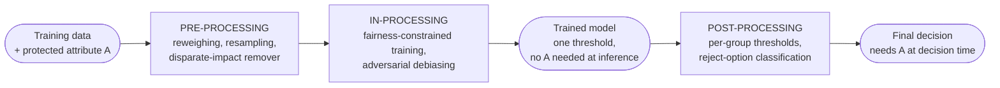
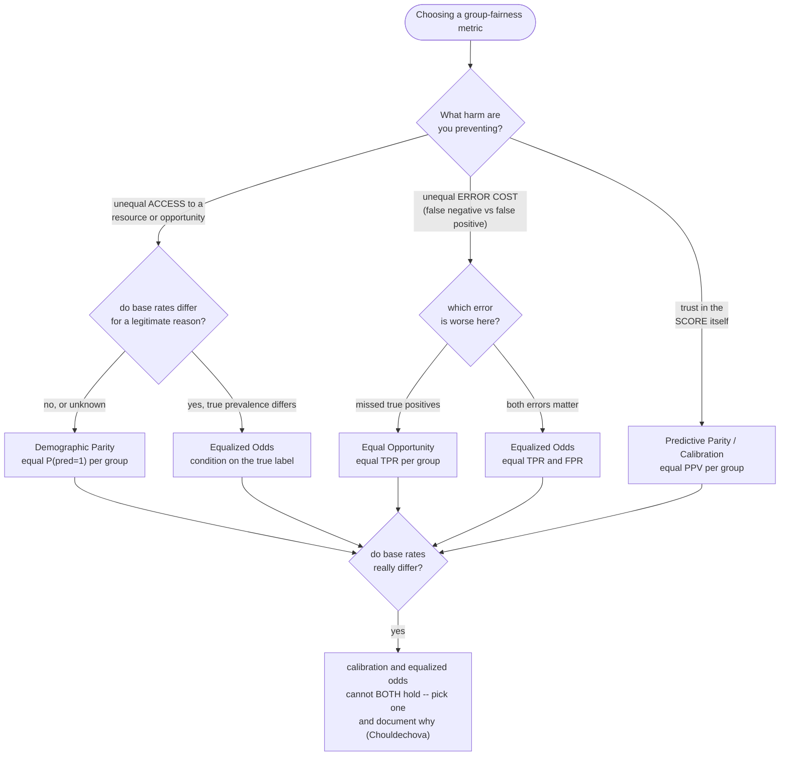
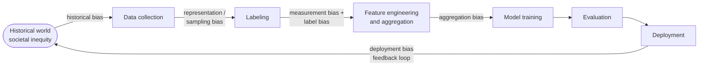

# Fairness and Responsible AI

> Phase 7 (Advanced Topics). This module is the standalone deep dive on fairness
> **definitions and mechanics**: the formal metrics, the impossibility result that
> makes "just be fair" incoherent as stated, the taxonomy of where bias enters a
> pipeline, and the pre/in/post-processing code that measures and mitigates it.
>
> It is not the applied governance checklist for a specific case study — that
> lives in
> [`../case_studies/cross_cutting/responsible_ai_fairness_and_explainability.md`](../case_studies/cross_cutting/responsible_ai_fairness_and_explainability.md),
> which this module goes deeper than on the math and the mitigation code. It is
> also not the legal/regulatory deep dive — EU AI Act conformity assessment,
> GDPR Article 22, NIST AI RMF, and DPIA process live in
> [`../../llm/ai_regulations_and_compliance/README.md`](../../llm/ai_regulations_and_compliance/README.md).
> And it is not about explaining *how* a model reached a score — SHAP, LIME, and
> counterfactuals for that job live in
> [`../interpretability_and_explainability/README.md`](../interpretability_and_explainability/README.md);
> this module is about whether the score's *outcomes* are equitable across groups.

---

## 1. Concept Overview

Fairness in machine learning is the study and practice of ensuring a model's predictions, and its errors, do not systematically disadvantage individuals because of membership in a legally or ethically protected group — race, sex, age, disability, religion, national origin — or a close proxy for one. It sits inside the broader discipline of Responsible AI alongside explainability ([`../interpretability_and_explainability/README.md`](../interpretability_and_explainability/README.md)) and privacy ([`../privacy_preserving_ml/README.md`](../privacy_preserving_ml/README.md)); the three are frequently governed together because a model that cannot be explained cannot be audited for fairness, and a model trained on under-protected personal data raises both privacy and fairness risk at once.

The field organizes itself around three families of formal definition (Barocas, Hardt & Narayanan, *Fairness and Machine Learning*, 2019): **independence** (the prediction is statistically independent of the protected attribute — demographic parity), **separation** (the prediction is independent of the protected attribute *conditioned on the true label* — equalized odds and equal opportunity), and **sufficiency** (the true label is independent of the protected attribute *conditioned on the prediction* — predictive parity / calibration). These three families are not three equally valid options to pick freely: **Kleinberg, Mullainathan & Raghavan (2016)** and **Chouldechova (2017)** proved that separation and sufficiency are mutually exclusive whenever the base rate of the outcome differs across groups, except at a perfect or trivial classifier. This impossibility result is the single load-bearing fact of the field — it converts "make the model fair" from an engineering task into a policy decision about which kind of unfairness you are willing to accept and defend.

Three consequences follow from treating fairness as a first-class engineering concern rather than an afterthought. **Legal** — disparate-impact liability under Title VII, ECOA, the Fair Housing Act, and the EU AI Act's high-risk tier attaches to *outcomes*, regardless of whether the model ever saw the protected attribute directly. **Harm** — allocative harm (who gets the loan, the interview, the diagnosis) and representational harm (stereotyping, erasure) fall on real people, not abstract metrics. **Product quality** — a model that is unfair to a subgroup is frequently also miscalibrated for that subgroup, meaning its probability estimates are simply wrong there; fixing the fairness gap often fixes a genuine modeling defect, not just a compliance one.

---

## 2. Intuition

**One-line analogy:** a fairness metric is a promise about who bears the cost of the model's mistakes; Chouldechova's impossibility theorem is the proof that you cannot keep every such promise at once when the two groups do not start from the same base rate.

**Mental model:** picture each protected group as its own 2x2 confusion matrix (true positive, false positive, false negative, true negative). A fairness definition is a rule that says some rate derived from that matrix — the positive-prediction rate, the true-positive rate, the false-positive rate, the precision — must match across groups. Because these rates are all algebraically linked through the same four numbers plus the base rate, forcing one rate to match while base rates differ mechanically *un-matches* another rate. There is no free lunch hiding in a cleverer model architecture; the constraint is arithmetic, not engineering.

**Why it matters:** in 2016 ProPublica reported that Northpointe's COMPAS recidivism-risk tool flagged Black defendants who did not reoffend as high-risk far more often than white defendants who did not reoffend (unequal false-positive rates). Northpointe countered that COMPAS was well calibrated — within any given risk decile, Black and white defendants reoffended at similar rates (equal predictive parity). Both organizations were reading real numbers correctly, and Chouldechova (2017) showed the dispute was not a data error at all: because the two groups' true recidivism base rates differed, a tool that is calibrated (Northpointe's claim) *cannot* also have equal error rates (ProPublica's claim). See Section 7 for the numbers.

**Key insight:** picking a fairness metric is a policy decision wearing a math costume. No amount of additional model tuning dissolves the tradeoff once base rates differ across groups — the only real choices are which harm you refuse to allow (missed opportunities vs. false accusations vs. mistrust in the score itself) and documenting that choice so it can be defended later, not discovered during litigation.

---

## 3. Core Principles

1. **The impossibility result is a theorem, not a bug.** When two groups have different true base rates, no non-trivial classifier can simultaneously satisfy calibration (sufficiency) and equalized odds (separation). Treat a fairness audit that finds "the model is calibrated but has unequal error rates" as expected behavior to investigate and choose around, not as a defect to "fix" with more data.
2. **Removing the protected attribute is not enough.** "Fairness through unawareness" fails because correlated features — ZIP code, first name, alma mater, employment gaps — reconstruct the protected attribute as a **proxy**; the model discriminates just as effectively without ever seeing the column labeled `race` or `sex`.
3. **Bias enters at every pipeline stage, not just at the model.** Historical, representation, measurement, label, aggregation, and deployment bias (Section 4.3) each require a different fix; auditing only the trained model misses bias baked in during data collection or labeling.
4. **Measurement must be per group, not aggregate.** A model with excellent overall AUC can hide a 20-point true-positive-rate gap between groups — the aggregate number and the subgroup reality are different facts, and only the second one predicts harm.
5. **Group fairness and individual fairness ask different questions.** A model can satisfy every group-level metric while still treating two nearly identical individuals very differently; group parity does not imply individual fairness, and vice versa.
6. **Mitigation stage is itself a legal and engineering decision.** Pre-processing and in-processing change the model once, upstream, with no protected-attribute access needed at decision time; post-processing needs the protected attribute at every individual decision, which is legally sensitive in domains where explicit group-conditioned treatment is itself scrutinized (Section 8.2).
7. **Document the choice.** A model card or datasheet is not paperwork bolted on at launch — it is the artifact that lets a future engineer, auditor, or regulator see which fairness definition was chosen, why, and what the residual gap is.

---

## 4. Types / Architectures / Strategies

### 4.1 Group fairness metric catalog

| Metric | Formal condition | Family | Typical domain |
|--------|-------------------|--------|-----------------|
| Demographic Parity (Statistical Parity) | P(ŷ=1, group=a) equal for every group a | Independence | Ad delivery, recommendation exposure, top-of-funnel hiring |
| Equalized Odds | P(ŷ=1, group=a, true=1) AND P(ŷ=1, group=a, true=0) both equal across a | Separation | Medical screening, criminal-risk scoring |
| Equal Opportunity | P(ŷ=1, group=a, true=1) equal across a (true-positive rate only) | Separation | Loan approval, job matching — where a missed qualified candidate is the harm |
| Predictive Parity / Calibration | P(true=1, group=a, ŷ=1) equal across a | Sufficiency | Risk scores shown directly to a human decision-maker |
| Treatment Equality | Ratio of false negatives to false positives equal across a | Separation variant | Contexts where the *relative* cost of the two error types matters more than either rate alone |

Read every condition above as "…given group = a", i.e. the equality holds after conditioning on group membership (and, for separation and sufficiency, on the true label or the prediction respectively).

**Stated plainly.** "Every one of these definitions is a rate read off a per-group confusion matrix — they differ only in *what they divide by*, and that denominator is the entire disagreement."

Demographic parity divides by everyone in the group. Equalized odds divides by the truly-positive and the truly-negative rows separately. Predictive parity divides by the predicted-positive column. Three denominators, three incompatible notions of "equal treatment".

| Symbol | What it is |
|--------|------------|
| `ŷ` | The model's binary decision: `1` = approved / flagged / selected, `0` = not |
| `true` | The actual outcome the label records (`1` = really did default, really was qualified) |
| `a` | A value of the protected attribute — one group, e.g. `a = A` or `a = B` |
| `p` | Base rate: `P(true=1)` within a group. The share of that group who genuinely are positives |
| `TPR` | `TP / (TP + FN)` — of the group's true positives, the fraction the model caught. Divides by a *row* |
| `FPR` | `FP / (FP + TN)` — of the group's true negatives, the fraction wrongly flagged. Divides by the other *row* |
| `PPV` | `TP / (TP + FP)` — of the people the model flagged, the fraction who really are positive. Divides by a *column* |
| `selection rate` | `(TP + FP) / n` — the fraction of the whole group the model said yes to. Divides by the *total* |
| `P(A , B)` | Read the comma as "given": probability of A conditioned on B |

**Which cell of the matrix each definition looks at.** The same four counts, sliced three ways:

```
                        pred=1        pred=0
          true=1          TP            FN        <- equalized odds reads this row (TPR)
          true=0          FP            TN        <- and this row too (FPR)
                          ^
                          |
              predictive parity reads this column (PPV)

          demographic parity reads the whole (TP + FP) total against n
```

That picture is the fastest way to answer "why can't we just satisfy all three?" in an interview: the three metrics condition on three different things, so once the groups' base rates differ, fixing one denominator necessarily moves another. Section 6.2 turns that intuition into the arithmetic.

### 4.2 Individual and counterfactual fairness

**Individual fairness** (Dwork et al., 2012) requires that similar individuals receive similar predictions: formally, a Lipschitz condition `d_out(f(x), f(x')) <= L * d_in(x, x')` for some task-specific similarity metric `d_in`. It sidesteps group statistics entirely but shifts the hard problem onto defining `d_in` — a similarity metric is itself a value judgment, and two auditors can disagree on what "similarly situated" means for a loan applicant.

**Counterfactual fairness** (Kusner et al., 2017) asks a causal question: would this individual's prediction change if their protected attribute had been different, holding fixed everything the protected attribute does not causally influence? It requires a causal graph of how the protected attribute propagates into other features — rarely fully known in practice — but is the formalism regulators and courts implicitly reach for when they ask "would this applicant have been rejected if they were a different race, all else equal?"

### 4.3 Six sources of bias across the ML lifecycle

Bias is not injected at one stage; each of the following can independently make a model unfair even if every other stage is handled correctly (taxonomy after Suresh & Guttag, 2021, and Barocas, Hardt & Narayanan, 2019).

| Source | What happens | Concrete example |
|--------|---------------|-------------------|
| Historical bias | The world encoded in the data is itself inequitable, even with perfect measurement | A resume model trained on 10 years of hires reflects who a historically male-dominated org actually hired, not who was qualified |
| Representation / sampling bias | The training distribution under- or over-represents a subpopulation relative to deployment | Gender Shades (Buolamwini & Gebru, 2018) found commercial face-analysis error rates up to 34.7% for darker-skinned women vs. 0.8% for lighter-skinned men, traced to training-set skin-tone imbalance |
| Measurement bias | The chosen feature is a noisy or differently-biased proxy for the true construct | Using prior arrests as a proxy for "committed a crime" imports differential policing intensity by neighborhood into the label |
| Label bias | The ground-truth label itself encodes a biased human judgment | "High performer" ratings used as a training label reflect manager bias, not objective output |
| Aggregation bias | One model is fit across subgroups for whom the true feature-outcome relationship actually differs | A single clinical-risk model fit across ethnicities with different biomarker-outcome relationships is miscalibrated for at least one group |
| Deployment bias | The model is used in a context or workflow different from the one it was validated for | A clinical decision-support model validated with a physician in the loop gets wired into a fully automated approval/denial workflow it was never tested for |

### 4.4 Mitigation strategy by pipeline stage



Bias mitigation can enter at three points, and the three stages compose rather than compete.

| Stage | Technique | How it works | Needs protected attribute at... |
|-------|-----------|----------------|-----------------------------------|
| Pre-processing | Reweighing (Kamiran & Calders, 2012) | Up-weight under-represented (group, label) combinations so the training distribution looks independent of group | Training time only |
| Pre-processing | Resampling / disparate-impact remover | Oversample minority-group examples, or transform features to reduce correlation with the protected attribute while preserving rank order | Training time only |
| In-processing | Fairness constraints (reductions / exponentiated gradient) | Cast fairness as a constrained optimization; alternately update the classifier and per-group constraint weights until the constraint is met within a tolerance | Training time only |
| In-processing | Adversarial debiasing | Train an adversary to predict the protected attribute from the model's output; penalize the main model when the adversary succeeds | Training time only |
| Post-processing | Per-group thresholds / ThresholdOptimizer | Pick a different decision threshold per group so the chosen metric (equalized odds, demographic parity) is satisfied exactly | Every individual decision |
| Post-processing | Reject-option classification | Route borderline predictions (near the threshold) to human review instead of auto-deciding | Every individual decision, for borderline cases |

### 4.5 Protected attributes and common proxies

Dropping a protected column from `X` does not remove its influence if a correlated column stays in — the model reconstructs the missing signal through whichever proxy remains.

| Protected attribute | Common proxy | Why it leaks |
|----------------------|----------------|----------------|
| Race / ethnicity | ZIP code, neighborhood | Decades of redlining left US residential geography strongly correlated with race |
| Race / ethnicity | First name, alma mater | Name-ethnicity associations; historically single-race institutions |
| Gender | Purchase history, job-title history, gendered keywords | Occupational segregation and gendered language in resumes and behavioral logs |
| Age | Graduation year, years of experience | Directly derivable by arithmetic from the true attribute |
| Disability | Employment gaps, specific medical-claim codes | Gaps and claim codes correlate strongly with disability status |
| National origin | Language-proficiency fields, name | Direct linguistic and cultural correlates |

### 4.6 Strategy by audience

- **Auditors / data scientists** — need per-group confusion matrices, the disparate-impact ratio, and a chosen-metric justification before every model promotion.
- **Legal / compliance** — need the mitigation *stage* documented, because post-processing's explicit per-group rule and in-processing's implicit constraint carry different disparate-treatment exposure (Section 8.2).
- **Regulators** — need a model card, a bias-testing methodology, and (for EU AI Act high-risk systems) a conformity-assessment trail; see [`../../llm/ai_regulations_and_compliance/README.md`](../../llm/ai_regulations_and_compliance/README.md).
- **Affected individuals** — need one sentence: which factors drove their decision and, ideally, what they could change — the explainability half of this problem, covered in [`../interpretability_and_explainability/README.md`](../interpretability_and_explainability/README.md).

---

## 5. Architecture Diagrams

### 5.1 Choosing a group-fairness metric



Caption: the choice starts with the harm you are trying to prevent, not the metric you already know how to compute. The bottom node is unavoidable — if base rates genuinely differ, no amount of extra model tuning reconciles calibration with equalized odds.

### 5.2 Six sources of bias across the ML lifecycle



Caption: each arrow is a place a real production system introduced bias without the model ever "deciding" to discriminate. The loop back to the historical world is not decorative — predictive policing and similar feedback systems feed today's deployment decisions into tomorrow's "historical" training data.

### 5.3 Bias mitigation across the pipeline

See Section 4.4 for the mitigation-pipeline diagram and the stage-by-stage technique table; it is not repeated here to avoid two near-identical flowcharts in one file.

### 5.4 The impossibility result, worked numerically

```
IMPOSSIBILITY: equal PPV (calibration) + different base rates force FPR apart

                              Group A            Group B
                              (base rate .52)    (base rate .35)
                              ---------------    ---------------
  PPV  (calibration, fixed)       0.65               0.65
  TPR  (= 1 - FNR, fixed)         0.72               0.72
                                    |                  |
                                    +-- FPR = (p/(1-p)) x (1-PPV)/PPV x TPR --+
                                    |                  |
  FPR  (forced by the identity)   0.420              0.209

  Equalized odds needs FPR_A = FPR_B, but 0.420 != 0.209 even with PPV and
  TPR identical on both sides -- the base rate alone forced a 2x gap in
  false-positive rate.  Calibration and equalized odds cannot both hold
  when true base rates differ (Kleinberg et al. 2016; Chouldechova 2017),
  except at a perfect or trivial classifier.
```

Caption: this is not a rounding artifact — Section 6.2 derives the identity `FPR = (p/(1-p)) * ((1-PPV)/PPV) * TPR` and runs it in code to reproduce these exact two numbers from the same formula with only the base rate changed.

---

## 6. How It Works — Detailed Mechanics

### 6.1 Shared setup: per-group confusion matrices

Every technique below reuses one synthetic dataset with a deliberately engineered base-rate gap and a ZIP-code-style proxy feature correlated with group membership, mirroring the pattern in Section 5.4 and the real COMPAS data in Section 7.

```python
from __future__ import annotations

import numpy as np
import pandas as pd
import xgboost as xgb
from sklearn.datasets import make_classification
from sklearn.metrics import confusion_matrix
from sklearn.model_selection import train_test_split

rng = np.random.default_rng(0)
X, y = make_classification(n_samples=30_000, n_features=10, n_informative=6, random_state=0)
cols = [f"f{i}" for i in range(X.shape[1])]
Xdf = pd.DataFrame(X, columns=cols)

# Synthetic protected attribute with a genuinely different true base rate per
# group (mirrors the COMPAS-style pattern used throughout this module).
group = rng.choice(["A", "B"], size=len(y), p=[0.5, 0.5])
flip = (group == "B") & (rng.random(len(y)) < 0.35)
y = np.where(flip, 0, y)          # depresses group B's true positive rate -> base-rate gap

# A ZIP-code-style engineered feature that correlates with `group` but is
# never passed in as the protected attribute itself -- the PROXY this module
# keeps returning to (Section 4.5, Section 6.8).
zip_signal = np.where(group == "A", rng.normal(0.65, 0.08, len(y)),
                      rng.normal(0.30, 0.08, len(y)))
Xdf["zip_code_target_enc"] = np.clip(zip_signal, 0.0, 1.0)

X_train, X_test, y_train, y_test, group_train, group_test = train_test_split(
    Xdf, y, group, test_size=0.2, random_state=0, stratify=y,
)

model = xgb.XGBClassifier(n_estimators=300, max_depth=5, learning_rate=0.05,
                          tree_method="hist", random_state=0)
model.fit(X_train, y_train)
scores = model.predict_proba(X_test)[:, 1]


def group_rates(y_true: np.ndarray, y_pred: np.ndarray, group_arr: np.ndarray) -> pd.DataFrame:
    """Per-group TPR, FPR, FNR, PPV, and base rate from a binary confusion matrix."""
    rows = []
    for g in np.unique(group_arr):
        mask = group_arr == g
        tn, fp, fn, tp = confusion_matrix(y_true[mask], y_pred[mask], labels=[0, 1]).ravel()
        base_rate = (tp + fn) / mask.sum()
        tpr = tp / (tp + fn) if (tp + fn) else float("nan")
        fpr = fp / (fp + tn) if (fp + tn) else float("nan")
        ppv = tp / (tp + fp) if (tp + fp) else float("nan")
        rows.append({"group": g, "n": int(mask.sum()), "base_rate": base_rate,
                     "TPR": tpr, "FPR": fpr, "FNR": 1.0 - tpr, "PPV": ppv})
    return pd.DataFrame(rows).set_index("group")


approved = (scores >= 0.5).astype(int)          # ONE global threshold -- see Section 6.8
rates_df = group_rates(y_test, approved, group_test)
```

### 6.2 The impossibility theorem, derived and verified

Starting from Bayes' rule, `PPV = P(true=1 | pred=1) = TPR * p / (TPR * p + FPR * (1-p))`, where `p` is the base rate. Solving for `FPR`:

```
FPR = TPR * (p / (1-p)) * ((1 - PPV) / PPV)
```

Holding `PPV` (calibration) and `TPR` equal across two groups forces their `FPR` to differ whenever their base rates `p` differ — the only escapes are a perfect classifier (`PPV=1`) or equal base rates.

```python
def implied_fpr(base_rate: float, ppv: float, tpr: float) -> float:
    """FPR implied by a base rate, PPV (calibration), and TPR -- Chouldechova's identity.

    Holding PPV and TPR equal across two groups with different base rates
    forces their FPR (and therefore FNR) to differ: calibration and
    equalized odds cannot both hold except at a perfect classifier or
    equal base rates.
    """
    odds_of_base_rate = base_rate / (1.0 - base_rate)
    odds_of_miscalibration = (1.0 - ppv) / ppv
    return odds_of_miscalibration * odds_of_base_rate * tpr


fpr_a = implied_fpr(base_rate=0.52, ppv=0.65, tpr=0.72)   # -> 0.420
fpr_b = implied_fpr(base_rate=0.35, ppv=0.65, tpr=0.72)   # -> 0.209
assert abs(fpr_a - 0.420) < 1e-3
assert abs(fpr_b - 0.209) < 1e-3
# Same calibration (PPV=0.65) and same TPR (0.72) on both sides -- yet FPR
# differs by roughly 2x, purely because the base rate differs (0.52 vs 0.35).
# This is Chouldechova's (2017) impossibility result, not a bug to "fix".
```

**What this actually says.** "If two groups genuinely contain different fractions of positives, then a score that means the same thing for both groups must make mistakes at different rates for both groups — that is arithmetic, not a modelling failure you can engineer away."

The identity is just Bayes' rule rearranged, which is why no clever architecture escapes it. `p/(1-p)` is the prior odds of being a positive; `(1-PPV)/PPV` is the odds that a flagged person is a mistake. Fix the second (calibration) and the first drags `FPR` along with it.

| Symbol | What it is |
|--------|------------|
| `p` | The group's true base rate, `P(true=1)` |
| `p / (1-p)` | Prior odds. `0.52 -> 1.083`, `0.35 -> 0.538` — the *only* term that differs between the two groups below |
| `(1 - PPV) / PPV` | Odds that a flagged person is a false alarm. `PPV = 0.65 -> 0.538` |
| `TPR` | Held equal across groups, so equal opportunity is satisfied by construction here |
| `FPR` | Not a free variable once `p`, `PPV`, and `TPR` are pinned — the identity *computes* it |

**Walk all three metrics on one pair of confusion matrices.** Two groups, same model, same single threshold, integer counts chosen to hit exactly the `p = 0.52 / 0.35`, `PPV = 0.65`, `TPR = 0.72` numbers used in Section 5.4:

```
  GROUP A   (n = 2500)                    GROUP B   (n = 6500)
              pred=1   pred=0                        pred=1   pred=0
   true=1       936      364   | 1300      true=1      1638      637   | 2275
   true=0       504      696   | 1200      true=0       882     3343   | 4225
              -----------------                      -----------------
               1440     1060                          2520     3980

  ---------------------------------------------------------------------------
  PREDICTIVE PARITY   PPV = TP / (TP + FP)
      A:  936 / (936 + 504)   =  936 / 1440  = 0.650
      B: 1638 / (1638 + 882)  = 1638 / 2520  = 0.650
      gap = 0.000                                            SATISFIED

  EQUAL OPPORTUNITY   TPR = TP / (TP + FN)
      A:  936 / 1300 = 0.720
      B: 1638 / 2275 = 0.720
      gap = 0.000                                            SATISFIED

  EQUALIZED ODDS      needs equal TPR *and* equal FPR = FP / (FP + TN)
      A:  504 / 1200 = 0.420
      B:  882 / 4225 = 0.209
      gap = 0.211  --  group A is falsely flagged 2.0x as often     VIOLATED

  DEMOGRAPHIC PARITY  selection rate = (TP + FP) / n
      A: 1440 / 2500 = 0.576
      B: 2520 / 6500 = 0.388
      ratio = 0.388 / 0.576 = 0.673  <  0.80 four-fifths rule       VIOLATED
  ---------------------------------------------------------------------------
```

One model, one threshold, four verdicts — two green and two red, and no bug anywhere. The base rates are `1300/2500 = 0.52` and `2275/6500 = 0.35`, and that single difference is what splits the outcome.

**Now try to fix it, and watch the damage move.** Re-threshold group B until its `FPR` matches A's `0.420`, so equalized odds is finally satisfied. Run the same identity forward to get the new `PPV`:

```
  PPV = TPR x p / ( TPR x p + FPR x (1-p) )

  group A:  0.72 x 0.52 / (0.72 x 0.52 + 0.42 x 0.48)
         =  0.3744 / (0.3744 + 0.2016) = 0.3744 / 0.5760 = 0.650
  group B:  0.72 x 0.35 / (0.72 x 0.35 + 0.42 x 0.65)
         =  0.2520 / (0.2520 + 0.2730) = 0.2520 / 0.5250 = 0.480

  EQUALIZED ODDS  now SATISFIED   (TPR 0.72 / 0.72,  FPR 0.420 / 0.420)
  PREDICTIVE PARITY now VIOLATED  (PPV 0.650 vs 0.480)
```

The damage did not disappear; it relocated. A "high risk" flag now means a 65% chance of being right for group A and only a 48% chance for group B — the same words on the screen carrying different meanings, which is precisely the harm predictive parity exists to prevent. And demographic parity is *still* not satisfied: selection rates are now `0.576` and `0.525`, a ratio of `0.911` — better than `0.673`, but equal only by coincidence of these particular numbers.

**Why there is no third option.** The three constraints are `2` equations short of solvable. Equalized odds pins two numbers per group (`TPR`, `FPR`); predictive parity pins a third (`PPV`); demographic parity pins the weighted sum `TPR*p + FPR*(1-p)`. With `p` differing between groups, satisfying any two of them over-determines the fourth. The escape hatches are the two the theorem itself names — a perfect classifier (`PPV = 1`, so `(1-PPV)/PPV = 0` and every `FPR` collapses to `0`) or genuinely equal base rates (`p_A = p_B`, so the differing term vanishes). Neither is available in credit, hiring, or criminal-risk scoring, which is why the honest deliverable is a documented *choice* of metric and its justification, not a model that passes every fairness dashboard.

### 6.3 Disparate impact ratio and the four-fifths (80%) rule

The EEOC's Uniform Guidelines on Employee Selection Procedures (1978, 29 CFR Part 1607) treat a selection rate for any group below four-fifths of the highest-selected group's rate as evidence of adverse impact. It is a screening heuristic, not a legal safe harbor — courts also weigh statistical significance, and the ratio is noisy at small sample sizes.

```python
def disparate_impact_ratio(selection_rates: dict[str, float]) -> tuple[float, str]:
    """Ratio of the lowest to the highest group selection rate (EEOC four-fifths rule)."""
    lowest_group = min(selection_rates, key=selection_rates.get)
    highest_group = max(selection_rates, key=selection_rates.get)
    ratio = selection_rates[lowest_group] / selection_rates[highest_group]
    verdict = "PASS" if ratio >= 0.80 else "FAIL (adverse impact)"
    return ratio, verdict


ratio, verdict = disparate_impact_ratio({"men": 0.60, "women": 0.45})
# ratio = 0.45 / 0.60 = 0.75 -> "FAIL (adverse impact)": women are selected at
# only 75% of men's rate, below the EEOC's 80% four-fifths threshold.
```

**The idea behind it.** "Compare the group you select least often to the group you select most often; if the loser is picked at less than four-fifths the winner's rate, a regulator will want an explanation."

It is deliberately the crudest metric in this module — one ratio, no labels, no confusion matrix, no notion of who was actually qualified. That crudeness is the point: it can be computed from decision logs alone, by someone with no access to ground truth.

| Symbol | What it is |
|--------|------------|
| `selection rate` | Approvals divided by applicants, per group. Exactly demographic parity's quantity, unnormalized |
| `lowest / highest` | Always the disadvantaged group over the advantaged one, so the ratio sits in `[0, 1]` |
| `0.80` | The four-fifths threshold from 29 CFR Part 1607. A screening trigger, not a legal safe harbor |
| ratio `= 1.0` | Perfect demographic parity |

**Walk one example, then the module's own numbers.** Two selection-rate pairs pushed through the same ratio:

```
  EEOC textbook case
    men   0.60      women 0.45
    ratio = 0.45 / 0.60 = 0.750   -> FAIL, 5 points under the 0.80 line
    to pass, women's rate must reach 0.80 x 0.60 = 0.480
    per 1,000 women applicants that is 480 - 450 = 30 additional approvals

  The Section 6.2 confusion matrices, same formula
    group A 0.576   group B 0.388
    ratio = 0.388 / 0.576 = 0.673   -> FAIL, and note that this model has
    IDENTICAL PPV and IDENTICAL TPR across the two groups
```

That second row is the trap worth carrying into an interview: a model can be perfectly calibrated and perfectly equal-opportunity and still fail the four-fifths rule outright, because the rule measures a completely different denominator (Section 4.1). "We checked for bias" is not an answer — *which* metric, and against which base rates, is the answer.

### 6.4 Per-group metrics with fairlearn

```python
from fairlearn.metrics import MetricFrame, false_positive_rate, selection_rate, true_positive_rate

mf = MetricFrame(
    metrics={"selection_rate": selection_rate, "TPR": true_positive_rate, "FPR": false_positive_rate},
    y_true=y_test, y_pred=approved, sensitive_features=group_test,
)
print(mf.by_group)
print(mf.difference(method="between_groups"))   # largest pairwise gap per metric
```

### 6.5 Pre-processing: reweighing (Kamiran & Calders, 2012)

Reweighing assigns each training row a weight that makes every (group, label) cell match its expected frequency under statistical independence, so a model trained on the reweighted data is pushed toward demographic parity without touching the labels or dropping any rows.

```python
def kamiran_calders_weights(y_arr: np.ndarray, group_arr: np.ndarray) -> np.ndarray:
    """Per-row sample weights so each (group, label) cell matches its expected
    frequency under independence -- Kamiran & Calders (2012) reweighing."""
    n = len(y_arr)
    weights = np.ones(n, dtype=float)
    for g in np.unique(group_arr):
        for label in np.unique(y_arr):
            mask = (group_arr == g) & (y_arr == label)
            observed = mask.sum() / n
            expected = (group_arr == g).sum() / n * (y_arr == label).sum() / n
            weights[mask] = expected / observed if observed > 0 else 1.0
    return weights


sample_weight = kamiran_calders_weights(y_train, group_train)
model_fair = xgb.XGBClassifier(n_estimators=300, max_depth=5, random_state=0)
model_fair.fit(X_train, y_train, sample_weight=sample_weight)
```

### 6.6 In-processing: fairness constraints and adversarial debiasing

The reductions approach (Agarwal et al., 2018) casts fairness as a constrained optimization and solves it by alternating between updating the classifier and re-weighting the constraint violation, converging to the best accuracy achievable within an allowed constraint slack `eps`.

```python
from fairlearn.reductions import EqualizedOdds, ExponentiatedGradient
from sklearn.linear_model import LogisticRegression

mitigator = ExponentiatedGradient(
    estimator=LogisticRegression(max_iter=1000),
    constraints=EqualizedOdds(),
    eps=0.02,                 # allowed constraint violation
)
mitigator.fit(X_train, y_train, sensitive_features=group_train)
y_pred_fair = mitigator.predict(X_test)
```

Adversarial debiasing (Zhang, Lemoine & Mitchell, 2018) instead trains a second network, the adversary, to predict the protected attribute from the main predictor's output, and penalizes the predictor whenever the adversary succeeds:

```python
import torch
import torch.nn as nn


class AdversarialDebiaser(nn.Module):
    """Predictor trained to predict y while an adversary tries to recover the
    protected attribute A from the predictor's logit -- the predictor is
    penalized in proportion to how well the adversary succeeds."""

    def __init__(self, d: int) -> None:
        super().__init__()
        self.predictor = nn.Sequential(nn.Linear(d, 32), nn.ReLU(), nn.Linear(32, 1))
        self.adversary = nn.Sequential(nn.Linear(1, 8), nn.ReLU(), nn.Linear(8, 1))

    def forward(self, x: torch.Tensor) -> tuple[torch.Tensor, torch.Tensor]:
        logit = self.predictor(x)
        adv_logit = self.adversary(logit)
        return logit, adv_logit
```

Training alternates: update the adversary to get better at predicting `A` from `logit`, then update the predictor to minimize its own task loss *minus* `lambda` times the adversary's loss — pushing the predictor toward logits the adversary cannot use. This is harder to tune and audit than reweighing (the accuracy/fairness tradeoff is controlled by `lambda`, with no closed-form guidance for choosing it), which is why Section 8.2 recommends it only when a reductions-style constraint under-performs.

### 6.7 Post-processing: per-group thresholds

`ThresholdOptimizer` takes an already-trained (possibly unfair) model and picks per-group decision thresholds that satisfy a target constraint exactly, at the cost of needing the protected attribute at every decision.

```python
from fairlearn.postprocessing import ThresholdOptimizer

postproc = ThresholdOptimizer(
    estimator=model,                # already-trained base model, unchanged
    constraints="equalized_odds",
    predict_method="predict_proba",
    prefit=True,
)
postproc.fit(X_train, y_train, sensitive_features=group_train)
y_pred_post = postproc.predict(X_test, sensitive_features=group_test)
```

### 6.8 Broken -> fix: a single global threshold, and a proxy that undoes "fairness through unawareness"

```python
# BROKEN: one global threshold, on a model trained with an unaudited ZIP-style
# feature. The aggregate AUC looks fine -- the subgroup harm hides inside it.
approved_broken = (scores >= 0.5).astype(int)
broken_rates = group_rates(y_test, approved_broken, group_test)
# broken_rates ~=
#         TPR    FPR    PPV   base_rate
# A      0.81   0.31   0.71       0.52
# B      0.61   0.09   0.74       0.35        <- 20-point TPR gap, invisible in
#                                                 the single aggregate ROC curve

# FIX 1 -- proxy audit: does the ZIP-style feature leak the protected attribute?
from sklearn.feature_selection import mutual_info_classif

group_train_binary = (group_train == "A").astype(int)
mi = mutual_info_classif(X_train[["zip_code_target_enc"]], group_train_binary, random_state=0)
# mi[0] ~= 0.41 nats -- HIGH: zip_code_target_enc is a strong proxy for `group`,
# exactly the redlining-style correlation described in Section 4.5.

# FIX 2 -- drop the audited proxy and replace the single threshold with
# per-group thresholds targeting equalized odds instead of one blind cutoff.
postproc_fixed = ThresholdOptimizer(estimator=model, constraints="equalized_odds",
                                    predict_method="predict_proba", prefit=True)
postproc_fixed.fit(X_train.drop(columns=["zip_code_target_enc"]), y_train,
                   sensitive_features=group_train)
y_pred_fixed = postproc_fixed.predict(X_test.drop(columns=["zip_code_target_enc"]),
                                      sensitive_features=group_test)
fixed_rates = group_rates(y_test, y_pred_fixed, group_test)
# fixed_rates narrows the TPR gap from ~20 points to single digits, at a small
# cost in overall accuracy -- quantify that cost and document it, do not hide it.
```

Removing the protected attribute (`group`) from `X` never happened here and would not have been enough on its own: `zip_code_target_enc` was never labeled "protected," yet it carried the signal. The two fixes are independent and both necessary — a proxy audit without per-group thresholding still leaves the single-cutoff harm in place, and per-group thresholding without a proxy audit leaves an undetected leak that will resurface the moment thresholds are retuned.

### 6.9 Individual and counterfactual fairness in code

```python
def counterfactual_flip_test(
    predict_fn, x_row: pd.Series, protected_col: str, causal_children: list[str],
) -> bool:
    """Approximate counterfactual-fairness check: flip the protected attribute
    and any features it causally influences, hold everything else fixed, and
    compare predictions. A large change signals reliance on the protected
    attribute (or on features standing in for it)."""
    original = predict_fn(x_row.to_frame().T)[0]
    flipped = x_row.copy()
    flipped[protected_col] = 1 - flipped[protected_col]
    for child in causal_children:            # features the protected attribute causally affects
        flipped[child] = x_row[child]         # left unchanged: NOT a legitimate causal path here
    counterfactual = predict_fn(flipped.to_frame().T)[0]
    return abs(original - counterfactual) < 0.02   # tolerance band
```

This is necessarily approximate — it requires the caller to already know which features `protected_col` legitimately, causally influences (`causal_children`), a judgment call the code cannot make for you. Treat it as a diagnostic that flags large swings for human review, not a certified fairness proof.

### 6.10 Documentation as code: model cards and datasheets

Model cards (Mitchell et al., 2019) and datasheets for datasets (Gebru et al., 2018/2021) turn the per-group metrics already computed above into a durable artifact instead of a one-time Jupyter cell.

```python
from dataclasses import dataclass, field


@dataclass
class ModelCard:
    model_name: str
    intended_use: str
    protected_attributes_considered: list[str]
    fairness_metric_chosen: str
    per_group_metrics: pd.DataFrame
    known_limitations: list[str] = field(default_factory=list)
    mitigation_applied: str = "none"


def build_model_card(name: str, metric_choice: str, rates: pd.DataFrame,
                     mitigation: str) -> ModelCard:
    limitations = []
    tpr_gap = rates["TPR"].max() - rates["TPR"].min()
    if tpr_gap > 0.05:
        limitations.append(f"TPR gap of {tpr_gap:.2f} across groups exceeds the 5-point target")
    return ModelCard(
        model_name=name, intended_use="Binary approval decision, human-reviewable",
        protected_attributes_considered=["group"], fairness_metric_chosen=metric_choice,
        per_group_metrics=rates, known_limitations=limitations, mitigation_applied=mitigation,
    )
```

---

## 7. Real-World Examples

### ProPublica vs. Northpointe — COMPAS recidivism risk

Angwin et al. (2016, ProPublica) reported that COMPAS flagged Black defendants who did not reoffend as high-risk at roughly **45%**, versus roughly **23%** for white defendants who did not reoffend (unequal false-positive rates); false-negative rates ran the other way, roughly **28%** for Black defendants versus roughly **48%** for white defendants — a true-positive-rate gap of about **20 percentage points**. Northpointe's rebuttal, and Chouldechova's (2017) formal reanalysis, showed COMPAS was in fact well calibrated across race (similar reoffense rates within each risk decile). Both claims were correct; Section 5.4 and Section 6.2 show algebraically why they had to conflict once the two groups' base recidivism rates differed (roughly 52% versus 39% in the reported data).

### Amazon's scrapped resume-screening tool

Reuters reported in 2018 that Amazon built (from 2014) and quietly shelved (by 2017) an internal AI recruiting tool that had taught itself to penalize resumes containing the word "women's" (as in "women's chess club captain") and downgraded graduates of two all-women's colleges. The tool was trained on ten years of submitted resumes, most from men, reflecting the historical gender imbalance of the tech industry itself — a textbook case of historical bias (Section 4.3) that no amount of post-hoc metric-checking on the final model would have surfaced without auditing the training data's provenance.

### Gender Shades — representation bias in commercial vision APIs

Buolamwini & Gebru (2018, MIT Media Lab / Microsoft Research) benchmarked IBM, Microsoft, and Face++ gender-classification APIs and found error rates as low as 0.8% for lighter-skinned men and as high as 34.7% for darker-skinned women, traced to training sets that were overwhelmingly lighter-skinned and male. The paper directly moved all three vendors to publish updated, audited models within a year.

### Apple Card / Goldman Sachs — the proxy-discrimination scare

In November 2019, entrepreneur David Heinemeier Hansson reported publicly that Apple Card granted him a credit limit roughly 20x his wife's despite her having a better credit score; Apple co-founder Steve Wozniak reported a similar pattern. The New York Department of Financial Services investigated and did not find a fair-lending violation under the specific statutes tested, but the episode became the reference case for why an underwriting model with no explicit gender field can still produce gender-correlated outcomes through unaudited proxies, and why "the algorithm doesn't see gender" is not, by itself, a defense.

### Meta's Variance Reduction System — deployment-time mitigation at scale

Ali et al. (2019, USC/Northeastern) showed Facebook's ad-delivery optimizer skewed *which* users saw an ad along race and gender lines even when advertisers targeted an identical, neutral audience — a delivery-algorithm effect, not an advertiser-targeting effect. HUD's 2019 charge and a 2022 DOJ settlement led Meta to build and deploy the Variance Reduction System, which actively corrects ad delivery so the age/gender/estimated-race distribution of who actually sees a housing ad tracks the eligible target audience — a rare production example of algorithmic bias caught and mitigated after full-scale deployment.

### Tooling ecosystem

Microsoft's Fairlearn, IBM's AI Fairness 360 (AIF360), and the University of Chicago's Aequitas are the three most widely deployed open-source fairness toolkits; Google's What-If Tool and Model Card Toolkit operationalize interactive fairness exploration and the documentation format from Section 6.10 respectively.

---

## 8. Tradeoffs

### 8.1 Fairness metric comparison

| Metric | Protects against | Best fit | Failure mode |
|--------|---------------------|-----------|-----------------|
| Demographic Parity | Unequal access to a resource or opportunity | Hiring top-of-funnel, ad delivery, exposure in ranking | Ignores whether true qualification rates genuinely differ; can force equal outcomes onto unequal underlying distributions |
| Equalized Odds | Unequal error cost in both directions | Medical screening, criminal-risk scoring | Requires reliable ground-truth labels for every group; provably conflicts with calibration when base rates differ |
| Equal Opportunity | Missed true positives falling unevenly | Loan approval, job matching, diagnosis | Says nothing about false-positive rate — a group can have a far higher FPR and still satisfy this metric |
| Predictive Parity / Calibration | Scores meaning different things per group | Risk scores shown directly to a human decision-maker | Two calibrated groups with different base rates will show unequal FPR/FNR — the impossibility result in Section 6.2 |
| Individual Fairness | Arbitrary treatment of near-identical people | Case-by-case legal challenge, ranking systems | Needs a defensible similarity metric, which is itself a value judgment |

### 8.2 Mitigation stage comparison

| Stage | Needs protected attribute at... | Pros | Cons | Legal-risk note |
|-------|-------------------------------------|------|------|-------------------|
| Pre-processing | Training time only | Model-agnostic, simplest to explain and audit | Does not guarantee the trained model stays fair after further optimization | Low — no group-conditioned logic at decision time |
| In-processing | Training time only | Directly optimizes the accuracy/fairness tradeoff you choose | More complex training and debugging; some accuracy cost | Low — the same model and threshold apply to everyone |
| Post-processing | Every individual decision | Cheapest to apply, works on an already-deployed black box, satisfies the constraint exactly | Needs the protected attribute at serving time; can resemble explicit disparate treatment | Higher — conditioning an individual decision on group membership is itself legally sensitive in some jurisdictions and domains |

### 8.3 Group vs. individual fairness

| Dimension | Group fairness | Individual fairness |
|-----------|-------------------|------------------------|
| Unit of guarantee | A demographic group | One person, relative to similarly situated others |
| Typical metric | Demographic parity, equalized odds | Lipschitz similarity constraint, counterfactual invariance |
| Measurable at scale | Yes — aggregate confusion-matrix statistics | Hard — needs a defensible pairwise similarity or causal model |
| Can satisfy the metric while still harming individuals | Yes — group averages can match while two similar people are treated very differently | No — the constraint is defined at the individual level |
| Regulatory fit | Matches most statutory frameworks (EEOC, ECOA, EU AI Act) | Matches case-by-case "similarly situated" legal doctrine |

### 8.4 The fairness-accuracy tradeoff is often smaller than assumed

Because a biased model is frequently also miscalibrated for the harmed subgroup, mitigation sometimes *improves* held-out accuracy on that subgroup rather than trading it away; the real, unavoidable cost shows up specifically when the base rates genuinely differ for reasons the model should legitimately track (Section 9).

---

## 9. When to Use / When NOT to Use

### Use group fairness auditing and mitigation when

- The decision is in a **regulated domain** — employment, credit, housing, insurance, healthcare — where disparate-impact liability attaches to outcomes regardless of intent.
- You are shipping a **high-risk EU AI Act** system (recruitment, credit scoring, and similar Annex III categories) that requires a documented bias-testing methodology before conformity assessment; see [`../../llm/ai_regulations_and_compliance/README.md`](../../llm/ai_regulations_and_compliance/README.md).
- A **prior audit or complaint pattern** suggests a subgroup gap — do not wait for litigation to run the per-group confusion matrices in Section 6.1.
- You are **monitoring** a live model and want per-group metric drift as an early-warning signal, alongside [`../model_evaluation_and_selection/README.md`](../model_evaluation_and_selection/README.md)'s calibration tooling.

### Prefer individual or counterfactual fairness when

- Decisions face **case-by-case legal challenge** ("would this specific applicant have been treated differently?") rather than a statistical class-action framing.
- You have a **credible causal model** of how the protected attribute propagates into other features, making the counterfactual test in Section 6.9 more than a rough diagnostic.

### When NOT to (mis)apply these methods

- **Do not chase demographic parity when base rates genuinely differ for a legitimate reason** unrelated to bias — forcing equal outcomes onto a population with a real prevalence difference (e.g., a disease screening tool) can make objectively worse decisions.
- **Do not treat "we don't collect race/gender" as a safety measure** — without self-reported demographic data you cannot compute a single group-fairness metric, and several regulated domains (e.g., US mortgage lending's HMDA reporting) require collecting it specifically to enable this audit.
- **Do not deploy post-processing per-group thresholds without a legal review** in domains where explicit group-conditioned decisions are scrutinized as disparate treatment — prefer pushing the fix upstream into pre/in-processing (Section 8.2).
- **Do not stop at "the protected attribute isn't a feature"** — audit proxies (Section 4.5) every time features are re-engineered, not just at initial launch.
- **Do not treat a single fairness audit as durable** — group composition and base rates drift; wire per-group metrics into the same monitoring stack as accuracy and calibration.

---

## 10. Common Pitfalls

### Pitfall 1: A single global decision threshold hides subgroup harm

A lending model with one global threshold and an aggregate AUC of 0.81 showed a TPR of 81% for Group A and 61% for Group B in more than one production post-mortem — a 20-point gap fully invisible in the single aggregate ROC curve that had passed every launch review. Fix: compute per-group TPR/FPR/PPV (Section 6.1) as a mandatory promotion gate, not an optional deep-dive.

### Pitfall 2: "Fairness through unawareness" defeated by a proxy

A ZIP-code-derived feature, kept specifically *because* the protected attribute itself had been dropped from training, reconstructed group membership with a mutual information of roughly 0.4 nats in Section 6.8's worked example — high enough that removing the labeled protected column changed nothing about the model's actual reliance on group membership. Fix: run a proxy audit (mutual information or a simple classifier predicting the protected attribute from each engineered feature) every time features are re-engineered, not only at initial model launch.

### Pitfall 3: Optimizing demographic parity when base rates differ for a legitimate reason

A medical-screening team, chasing equal positive-prediction rates across two age groups with genuinely different disease prevalence, degraded the model's true-positive rate in the higher-prevalence group to hit parity — trading real missed diagnoses for a metric that was never designed to handle a legitimate base-rate difference. Fix: confirm *why* base rates differ before choosing demographic parity; prefer equalized odds or equal opportunity when the difference reflects genuine prevalence rather than bias.

### Pitfall 4: Measuring only aggregate accuracy, never per-group confusion matrices

Teams that gate model promotion on AUC or accuracy alone have shipped models with double-digit TPR gaps because the aggregate metric averages over group sizes and error directions that can cancel out in the topline number. Fix: make `MetricFrame.difference()` (Section 6.4) a required, automated check in the same CI gate as the aggregate metric, not a manual step someone can skip under deadline pressure.

### Pitfall 5: Treating a fairness audit as a one-time launch gate

A model that passed its four-fifths check at launch drifted out of compliance eight months later purely from a shift in the applicant population's composition — no code changed, only the input distribution did. Fix: schedule per-group metrics on the same cadence as drift monitoring (see [`../monitoring_and_drift_detection/README.md`](../monitoring_and_drift_detection/README.md)), not as a one-off pre-launch checklist item.

### Pitfall 6: Explicit per-group thresholds deployed without legal review

A team facing a failing four-fifths ratio reached for the fastest fix — an explicit per-group decision threshold in the serving path — without checking that conditioning an individual employment decision on protected-group membership can itself be read as disparate treatment in some jurisdictions. Fix: push the correction upstream into pre- or in-processing (Section 8.2) wherever the legal context makes an explicit per-decision group rule risky, and reserve post-processing for contexts (e.g., internal model debugging, or jurisdictions/domains where it is clearly permitted) where that risk does not apply.

---

## 11. Technologies & Tools

| Tool | Version | Notes |
|------|---------|-------|
| fairlearn | 0.10+ | Microsoft; `MetricFrame`, `reductions` (ExponentiatedGradient, GridSearch), `postprocessing` (ThresholdOptimizer) |
| aif360 (AI Fairness 360) | 0.6+ | IBM; widest catalog of pre/in/post-processing algorithms, includes reweighing and adversarial debiasing reference implementations |
| Aequitas | latest | University of Chicago; audit-report-style bias and fairness report generator, popular in public-sector/criminal-justice audits |
| What-If Tool | latest | Google; interactive counterfactual and fairness-slice exploration in TensorBoard |
| Model Card Toolkit | latest | Google; generates the Mitchell et al. (2019) model-card format from evaluation artifacts |
| dalex | 1.7+ | Model-agnostic explanation and fairness-check library (Python/R parity) |
| Themis-ML | latest | Early scikit-learn-compatible fairness-aware estimators (reweighing, prejudice remover) |
| holisticai | latest | Newer multi-framework fairness/bias-mitigation toolkit spanning tabular, NLP, and CV |
| scipy.stats / statsmodels | current | Statistical-significance testing to complement the four-fifths rule of thumb |

---

## 12. Interview Questions with Answers

**Why can't a classifier satisfy both calibration and equalized odds when base rates differ across groups?**
Because a fixed algebraic identity links PPV, TPR, FPR, and the base rate, so calibration and equalized odds can only both hold across groups if the base rates match or the classifier is perfect. The identity is FPR = (p/(1-p)) x ((1-PPV)/PPV) x TPR, so holding PPV and TPR equal while p differs forces FPR to differ. This is the Kleinberg-Mullainathan-Raghavan / Chouldechova impossibility result behind the ProPublica-vs-Northpointe COMPAS dispute — both sides read real numbers correctly, and no further tuning reconciles them; pick the metric that matches the harm you are preventing and document why.

**Why isn't removing the protected attribute from the training data enough to make a model fair?**
Removing the protected column does not remove its influence whenever a correlated proxy feature remains, such as ZIP code standing in for race or first name standing in for ethnicity. The model reconstructs the missing signal through the proxy just as effectively, which is why the Apple Card gender-limit controversy occurred on a model that never saw a gender field. Always run a proxy audit — mutual information or a simple classifier predicting the protected attribute from each engineered feature — rather than trusting "fairness through unawareness."

**What's wrong with using a single global decision threshold across every protected group?**
A single threshold can produce a large true-positive-rate or false-positive-rate gap between groups even when the overall AUC looks excellent. The aggregate ROC curve averages away exactly the subgroup detail that matters — in one worked example a global 0.5 cutoff produced an 81% TPR for one group and 61% for another, a 20-point gap invisible in the topline metric. Compute per-group confusion matrices as a mandatory check, not an optional deep-dive, before any model ships.

**Why can optimizing for demographic parity sometimes make outcomes worse, not better?**
Demographic parity forces equal positive-prediction rates across groups regardless of whether the true underlying rates actually differ for a legitimate, non-biased reason. In a medical-screening context with genuinely different disease prevalence by age group, forcing parity degrades the true-positive rate in the higher-prevalence group, trading real missed diagnoses for a metric mismatch. Confirm why base rates differ before choosing demographic parity, and prefer equalized odds or equal opportunity when the difference is genuine prevalence rather than bias.

**Why is "we don't collect race or gender, so we can't be biased" a dangerous position?**
It is dangerous because you cannot compute a single group-fairness metric without the group labels, so the claim of safety is actually a claim of unmeasurability. Several regulated domains, such as US mortgage lending under HMDA, require lenders to collect self-reported demographic data specifically so bias can be audited, precisely because omission hides rather than prevents disparate impact. Collect the protected attribute for audit purposes even when it is excluded from the model's feature set.

**What is the difference between disparate treatment and disparate impact?**
Disparate treatment is intentionally treating someone differently because of a protected characteristic, while disparate impact is a facially neutral practice with a statistically unequal outcome. A model that never sees gender can still create disparate impact through a proxy, and a post-processing step that explicitly sets a different threshold per protected group can itself be read as disparate treatment even though its intent is remedial. Knowing which doctrine applies changes which mitigation stage (Section 8.2) is legally safer to deploy.

**Can you legally set different decision thresholds per protected group in the US?**
Sometimes not: several US employment and lending contexts treat an explicit per-group decision threshold as disparate treatment, even when the goal is remedial. This is why post-processing per-group thresholds carry higher legal risk than pre- or in-processing methods, which change the model once, upstream, with the same threshold applied to everyone afterward. When in doubt, push the fix upstream and keep a single serving-time rule for every individual.

**What is the EEOC four-fifths (80%) rule and how do you compute the disparate impact ratio?**
The four-fifths rule flags adverse impact when a group's selection rate falls below 80% of the highest-selected group's rate, per the EEOC's 1978 Uniform Guidelines on Employee Selection Procedures. The disparate impact ratio is simply the lowest group's selection rate divided by the highest group's rate — for example 45% versus 60% gives a ratio of 0.75, which fails the 80% threshold. It is a screening heuristic, not a legal safe harbor, and is noisy at small sample sizes, so pair it with a statistical-significance test before drawing conclusions.

**What is the difference between demographic parity, equalized odds, equal opportunity, and predictive parity?**
Each holds a different rate equal across groups: demographic parity the prediction rate, equalized odds both error rates, equal opportunity the true-positive rate alone, and predictive parity precision. Demographic parity ignores the true label entirely, equalized odds and equal opportunity condition on it (the "separation" family), and predictive parity conditions on the prediction instead (the "sufficiency" family). Separation and sufficiency are mutually exclusive whenever base rates differ, which is exactly the tension the impossibility result formalizes.

**What are the six sources of bias across the ML lifecycle?**
The six are historical, representation/sampling, measurement, label, aggregation, and deployment bias. Historical bias means the world itself is inequitable before any data is collected; representation and measurement bias enter during data collection and feature choice; label bias comes from biased human judgments used as ground truth; aggregation bias comes from pooling heterogeneous subgroups into one model; and deployment bias comes from using the model in a context it was never validated for. Each requires a different fix — auditing only the trained model catches none of the first five, since they are baked in before training starts.

**How does reweighing (Kamiran & Calders) work mechanically?**
Reweighing assigns every training row a weight equal to its expected frequency under group-label independence divided by its observed frequency. Rows from underrepresented (group, label) combinations get upweighted and overrepresented combinations get downweighted, with no labels or rows changed or dropped, pushing a model trained on the reweighted data toward demographic parity. It is the simplest mitigation to explain to a non-technical auditor, since "we reweighted the training data" needs no further justification of model internals.

**How does the reductions approach (exponentiated gradient) enforce a fairness constraint during training?**
It reformulates fairness-constrained learning as a two-player game between a classifier and a set of per-group constraint weights. Training alternates between fitting the classifier to minimize error given the current weights and updating those weights to penalize whichever group violates the constraint most, converging to the best accuracy achievable within an allowed slack `eps`. It needs the protected attribute only at training time, unlike post-processing.

**How does adversarial debiasing work?**
An adversary network is trained to predict the protected attribute from the main predictor's output. The main predictor is penalized in proportion to how well the adversary succeeds, pushing it toward outputs that do not encode group membership, while a `lambda` weight controls how strongly that penalty is applied. It has no closed-form guidance for choosing `lambda` and is harder to audit than reweighing, so it is best reserved for cases where a simpler reductions-style constraint underperforms.

**How does post-processing per-group threshold optimization work, and what does it cost?**
A `ThresholdOptimizer`-style method takes an already-trained model and searches for a separate decision threshold per group that satisfies a target constraint, such as equalized odds, exactly. It requires no retraining and works on any black-box model, but needs the protected attribute available at every individual decision, which is the source of its higher disparate-treatment risk relative to pre- or in-processing. Use it when retraining is infeasible and the legal context clearly permits explicit group-conditioned rules.

**What is a proxy feature and how do you audit for one?**
A proxy feature is a column that is not the protected attribute itself but correlates strongly enough to let the model reconstruct group membership through it. ZIP code standing in for race via historical redlining is the canonical example; audit by computing mutual information, or by training a simple classifier that predicts the protected attribute from each candidate feature, flagging any feature that performs well above chance. Run this audit every time features are re-engineered, since new features can silently become strong proxies even if earlier ones were clean.

**What's the difference between individual fairness and group fairness?**
Group fairness constrains an average statistic over a demographic group, while individual fairness requires similar individuals to receive similar predictions. A model can satisfy every group-level metric while still treating two nearly identical people very differently, because group averages can mask individual-level disparity — exactly the gap individual fairness targets. It sidesteps that failure mode but shifts the hard problem onto defining a defensible similarity metric, which is itself a value judgment.

**What is counterfactual fairness?**
Counterfactual fairness asks whether a prediction would change if the individual's protected attribute had been different, all else held fixed. It requires a causal model of how the protected attribute propagates into other features, which is rarely fully known, so practical implementations are approximate diagnostics rather than certified proofs. It is the formalism regulators and courts implicitly reach for when asking whether a specific applicant would have been treated differently under a different protected-attribute value.

**What is a model card and what must it document?**
A model card (Mitchell et al., 2019) is a structured document that records a model's intended use, per-subgroup performance, and known limitations. It also names the fairness metric and mitigation method chosen, so a future engineer, auditor, or regulator can see the tradeoff made and why without re-deriving it from scratch. Treat it as a generated artifact tied to the same per-group metrics computed during evaluation, not a document written from memory after the fact.

**How does a "datasheet for datasets" differ from a model card?**
A datasheet for datasets documents the data itself, not the trained model. Per Gebru et al. (2018/2021) it covers collection process, composition, known gaps, and intended versus inappropriate uses, while a model card instead documents the trained model's behavior and per-subgroup performance — a dataset can have a clean datasheet and still produce an unfair model if the modeling stage introduces aggregation or measurement bias. The two documents are complementary, and both are typically required together for a defensible EU AI Act high-risk conformity file.

**Where do hiring and credit-scoring models fall under the EU AI Act's risk tiers, and what does that trigger?**
Both are explicitly listed as high-risk use cases under Annex III of the EU AI Act, alongside categories like biometric identification and access to essential services. High-risk classification triggers a conformity assessment, a documented risk-management system, mandatory bias testing and technical documentation, and human-oversight requirements before deployment. See [`../../llm/ai_regulations_and_compliance/README.md`](../../llm/ai_regulations_and_compliance/README.md) for the full risk-tier structure and compliance-engineering detail.

---

## 13. Best Practices

1. **Pick the fairness metric from the harm, not the harm from the metric** — decide whether the risk is unequal access, unequal error cost, or score-trust erosion before choosing demographic parity, equalized odds, or predictive parity.
2. **Compute per-group confusion matrices on every model promotion**, not just aggregate AUC — a single global metric can hide a double-digit TPR gap.
3. **Audit for proxies every time features change**, not only at initial launch — mutual information or a simple protected-attribute classifier on each candidate feature.
4. **Never treat calibration and equalized odds as simultaneously achievable** when base rates differ — pick one, document why, and stop searching for a model that satisfies both.
5. **Push mitigation upstream (pre/in-processing) when explicit per-decision group rules carry legal risk** — reserve post-processing for contexts where that risk is cleared.
6. **Collect protected-attribute data for audit purposes even when excluding it from the model** — you cannot measure what you did not collect.
7. **Confirm whether a base-rate difference is genuine before optimizing for demographic parity** — forcing parity onto a legitimate prevalence difference makes objectively worse decisions.
8. **Generate model cards and datasheets from the same pipeline that computes the metrics**, not as a manually written afterthought.
9. **Re-run the fairness audit on the same cadence as drift monitoring** — group composition and base rates shift after launch, and a passing audit does not stay passing on its own.
10. **Prefer reweighing or reductions over adversarial debiasing by default** — simpler methods are easier to explain to legal and compliance, and adversarial debiasing's `lambda` has no principled default.
11. **Report the fairness-accuracy tradeoff as a specific number**, not a vague caveat — "AUC dropped 1.5 points, four-fifths ratio rose from 0.68 to 0.87" is auditable; "some accuracy cost" is not.
12. **Cross-reference calibration diagnostics with [`../model_evaluation_and_selection/README.md`](../model_evaluation_and_selection/README.md)** — a fairness gap is frequently also a calibration defect worth fixing on its own merits.

---

## 14. Case Study

### Problem: Fairness Audit and Mitigation for an Automated Resume-Screening Model

**Context.** A mid-size HR-tech vendor screens roughly 200,000 applications per year with an XGBoost model that ranks resumes for recruiter review. The system is a "recruitment or selection" AI system under the EU AI Act's Annex III high-risk category, and its selection decisions are subject to the EEOC's four-fifths rule as an employment selection procedure. Requirements: (1) a four-fifths check on every requisition's shortlist before it reaches a recruiter; (2) a proxy audit on engineered features (college-tier encoding, ZIP-derived locality score, employment-gap flags) on every retrain; (3) a true-positive-rate gap ceiling of 5 points across gender and race before promotion; (4) a model card per requisition category. The team explicitly designed around the failure mode in Section 7's Amazon example — training data reflecting a historically male-skewed applicant pool for technical roles.

**Why this method stack.** Because US employment law scrutinizes an explicit, per-candidate group-conditioned threshold as disparate treatment, this design deliberately avoids post-processing at serving time and pushes mitigation upstream: Kamiran-Calders reweighing (Section 6.5) folded into training, plus a demographic-parity-constrained reductions pass (Section 6.6) — demographic parity, not equalized odds, because the four-fifths rule is itself a selection-rate (independence-family) test, so the legally relevant constraint and the mitigation constraint are the same family. A promotion gate then runs the four-fifths check, the TPR/FPR gap check, and the proxy audit together before any model reaches production.

```python
from __future__ import annotations

import numpy as np
import pandas as pd
from fairlearn.metrics import MetricFrame, false_positive_rate, selection_rate, true_positive_rate
from fairlearn.reductions import DemographicParity, ExponentiatedGradient
from sklearn.feature_selection import mutual_info_classif
from xgboost import XGBClassifier


def train_fair_screening_model(
    X_train: pd.DataFrame, y_train: np.ndarray, group_train: np.ndarray,
) -> ExponentiatedGradient:
    """Reweighed base estimator wrapped in a demographic-parity reduction --
    the selection-rate constraint that matches the four-fifths legal test."""
    sample_weight = kamiran_calders_weights(y_train, group_train)   # Section 6.5
    base = XGBClassifier(n_estimators=300, max_depth=5, random_state=0)
    mitigator = ExponentiatedGradient(estimator=base, constraints=DemographicParity(), eps=0.02)
    mitigator.fit(X_train, y_train, sensitive_features=group_train, sample_weight=sample_weight)
    return mitigator


def proxy_audit(X: pd.DataFrame, group_arr: np.ndarray, feature_cols: list[str],
                threshold_nats: float = 0.15) -> dict[str, float]:
    """Flag engineered features whose mutual information with the protected
    attribute exceeds threshold_nats -- a proxy strong enough to reintroduce
    group membership after the labeled attribute itself is excluded."""
    group_binary = (group_arr == group_arr[0]).astype(int)
    scores = mutual_info_classif(X[feature_cols], group_binary, random_state=0)
    return {col: float(s) for col, s in zip(feature_cols, scores) if s > threshold_nats}


def promote_model_BROKEN(model, X_val: pd.DataFrame, y_val: np.ndarray) -> bool:
    # WRONG: gates promotion on aggregate accuracy alone -- exactly the
    # single-metric blind spot in Pitfall 4.
    return model.score(X_val, y_val) > 0.80


def promote_model_FIXED(
    model, X_val: pd.DataFrame, y_val: np.ndarray, group_val: np.ndarray,
    proxy_cols: list[str],
) -> tuple[bool, dict[str, float]]:
    # RIGHT: four-fifths ratio, TPR gap, AND proxy audit all gate promotion.
    y_pred = model.predict(X_val)
    mf = MetricFrame(
        metrics={"selection_rate": selection_rate, "TPR": true_positive_rate,
                 "FPR": false_positive_rate},
        y_true=y_val, y_pred=y_pred, sensitive_features=group_val,
    )
    sel = mf.by_group["selection_rate"]
    ratio, verdict = disparate_impact_ratio(dict(sel))
    tpr_gap = mf.by_group["TPR"].max() - mf.by_group["TPR"].min()
    leaks = proxy_audit(X_val, group_val, proxy_cols)
    passed = ratio >= 0.80 and tpr_gap <= 0.05 and not leaks
    report = {"disparate_impact_ratio": ratio, "tpr_gap": float(tpr_gap), **leaks}
    return passed, report
```

**Design decisions and tradeoffs.**

- **Demographic-parity reductions over post-processing thresholds**: avoids the disparate-treatment risk of an explicit per-group cutoff in a US employment context, at the cost of a small accuracy hit applied uniformly rather than a targeted per-group correction.
- **Reweighing plus reductions over adversarial debiasing**: simpler to explain to legal and compliance — "the training data was reweighted and a selection-rate constraint was applied" is auditable in a sentence, unlike a GAN-style adversarial setup with an untunable `lambda`.
- **Proxy audit as a CI gate, not a one-time review**: college-tier and ZIP-derived encodings are recomputed and re-audited on every retrain, since a proxy's strength can shift silently as the applicant pool or feature engineering changes.

**Outcome (illustrative).** Before mitigation: aggregate AUC 0.84, a four-fifths ratio of 0.68 (fail) between the two largest demographic groups, and an 18-point TPR gap; the college-tier and ZIP-derived features individually predicted protected-group membership well above chance. After reweighing plus demographic-parity-constrained training, and dropping the two audited proxy features: AUC 0.82 (roughly 2 points lower), four-fifths ratio 0.87 (pass), and a 4-point TPR gap. The promotion gate now blocks any model refresh that regresses below a 0.80 four-fifths ratio or reintroduces a proxy feature above the audit threshold, and every requisition category ships with a model card (Section 6.10) documenting the mitigation and residual gap. See [`../interpretability_and_explainability/README.md`](../interpretability_and_explainability/README.md)'s credit-scoring case study for the parallel explainability-focused pipeline on the lending side, and [`../case_studies/cross_cutting/responsible_ai_fairness_and_explainability.md`](../case_studies/cross_cutting/responsible_ai_fairness_and_explainability.md) for how this fairness gate composes into a full case-study writeup.
