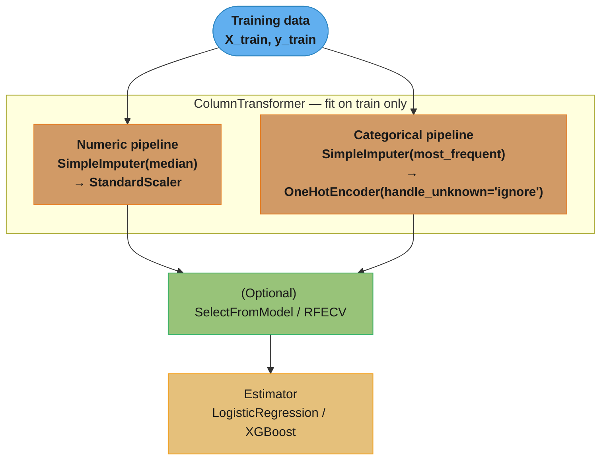
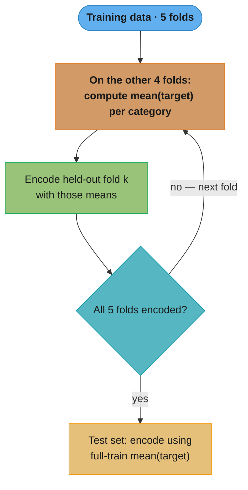
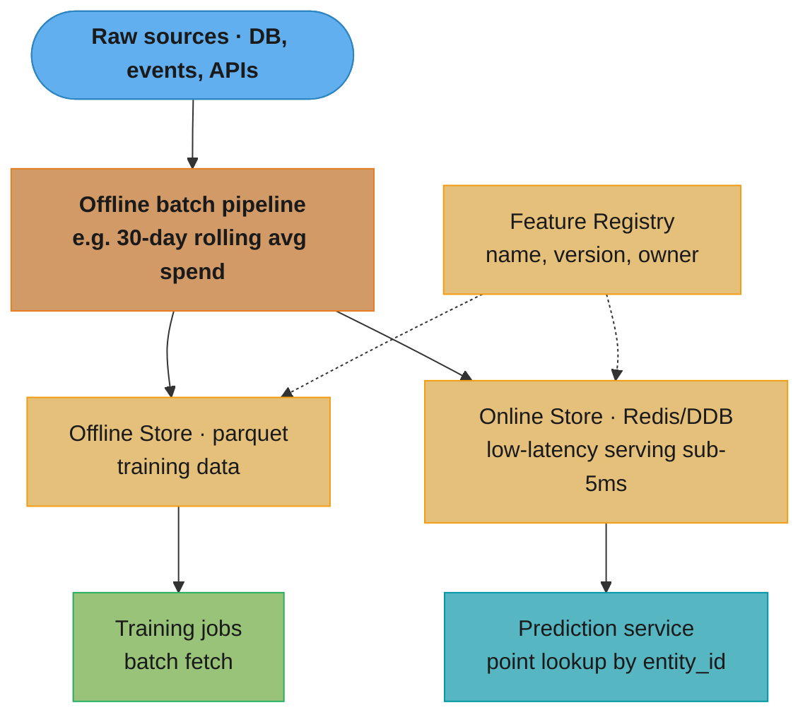
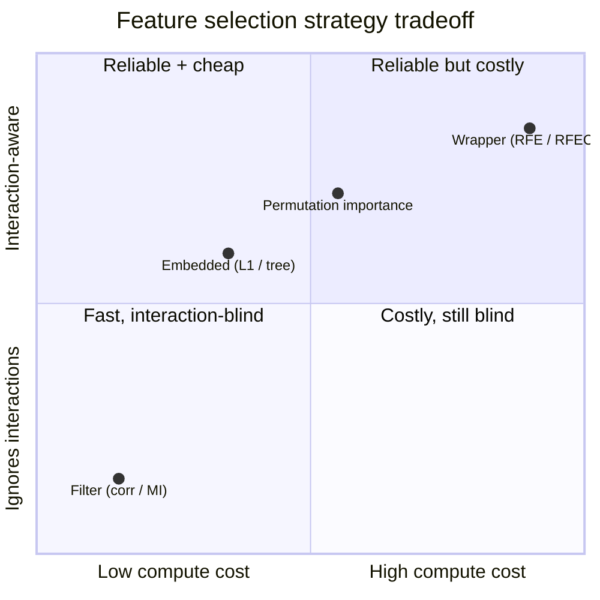
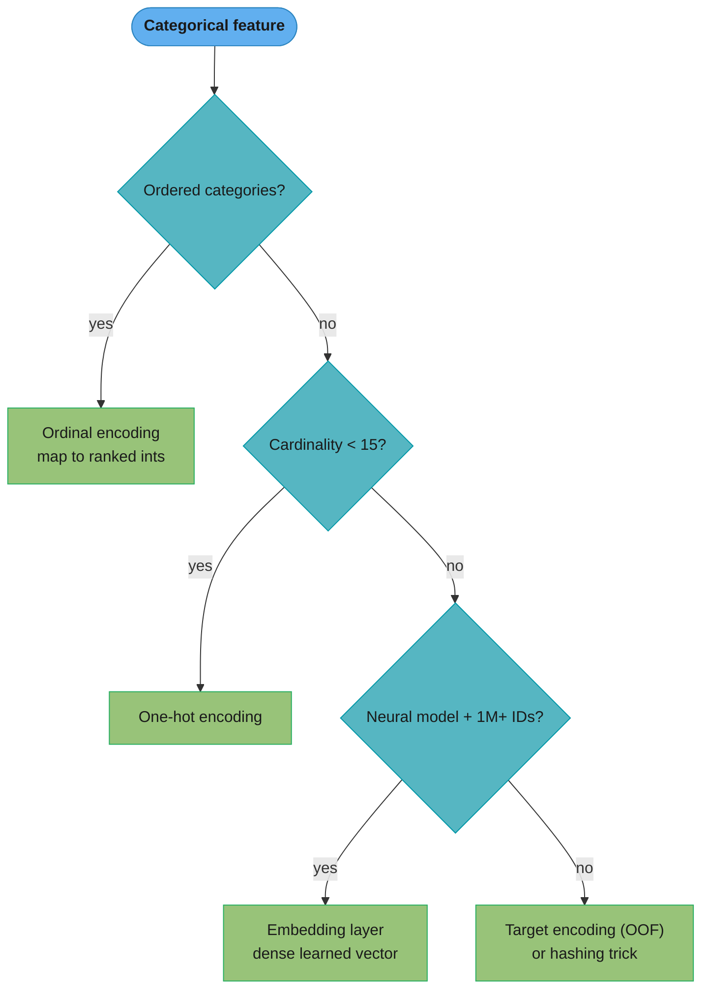

# Feature Engineering

## 1. Concept Overview

Feature engineering is the process of transforming raw data into representations that machine learning algorithms can learn from effectively. It encompasses encoding categorical variables, transforming numeric distributions, imputing missing values, selecting informative features, and constructing new features from existing ones. The quality of features often matters more than the choice of algorithm — a linear model with well-engineered features routinely outperforms a gradient boosted tree with raw inputs.

Core tasks:
- **Categorical encoding**: convert categories to numbers without introducing false ordinal relationships
- **Numeric transformations**: correct skew, stabilize variance, bring features to comparable scales
- **Missing value imputation**: fill gaps without leaking target information
- **Feature selection**: identify and retain only features that add predictive signal
- **Feature construction**: create interaction terms, ratio features, and domain-derived attributes
- **Feature stores**: manage, version, and serve features at scale in production

---

## 2. Intuition

One-line analogy: feature engineering is like translating a handwritten letter into a format a computer can parse — the underlying meaning stays the same, but the representation becomes machine-readable and comparable.

Mental model:
- Encoding = giving the algorithm a language to read categories
- Scaling = making sure all words in that language are the same font size
- Imputation = filling in torn pages without guessing the wrong content
- Feature selection = removing filler words that add noise but no meaning

Why it matters: most algorithms operate on numeric vectors. A raw pandas DataFrame with strings, nulls, and mismatched scales will either crash or produce garbage predictions. Thoughtful feature engineering directly controls the signal-to-noise ratio the model sees.

Key insight: data leakage is the most dangerous feature engineering mistake — applying transformations that use test-set or target information during training produces optimistic metrics that collapse in production.

---

## 3. Core Principles

1. **No leakage**: all transformers must be fit on training data only, then applied to validation/test sets. Use sklearn Pipelines to enforce this mechanically.
2. **Preserve distribution shape awareness**: know whether a transformation assumes normality (Box-Cox requires positive values), handles zeros (log1p vs log), or is sensitive to outliers (StandardScaler vs RobustScaler).
3. **High cardinality requires special handling**: one-hot encoding a column with 500 unique values creates 500 sparse binary columns — curse of dimensionality applies immediately.
4. **Missing values carry signal**: always consider adding a binary `feature_was_missing` indicator before imputing; the fact that a value is absent is often informative (e.g., "no prior purchase" vs "purchase amount unknown").
5. **Feature selection is regularization**: irrelevant features add noise, inflate computation, and can cause multicollinearity. Select aggressively, then add back if model performance drops.

---

## 4. Types / Architectures / Strategies

### Categorical Encoding

| Method               | When to use                                  | Cardinality | Risk |
|----------------------|----------------------------------------------|-------------|------|
| One-hot encoding     | Nominal, low cardinality (< 15 categories)   | Low         | Curse of dimensionality for high-card |
| Ordinal encoding     | Ordered categories (cold < warm < hot)       | Any         | Wrong order = wrong signal |
| Label encoding       | Tree-based models only, ordinal-ish          | Any         | Linear models interpret numbers as ordered |
| Target encoding      | High cardinality (> 15–50)                   | High        | Data leakage without CV folds |
| Binary / Hash encoding| High cardinality, space-efficient           | Very high   | Hash collisions |
| Embedding (neural)   | Very high cardinality (IDs, zip codes)       | 1M+         | Requires neural model |

### Numeric Transformations

| Transform         | Purpose                           | Requirement         |
|-------------------|-----------------------------------|---------------------|
| log / log1p       | Right-skewed distributions        | Values >= 0 (log1p handles zeros) |
| sqrt              | Moderate right skew, count data   | Values >= 0         |
| Box-Cox           | Optimal power transform (parameterized) | Values > 0    |
| Yeo-Johnson       | Box-Cox extended to negatives     | Any                 |
| StandardScaler    | Zero mean, unit variance          | Approx. normal distribution |
| MinMaxScaler      | Scale to [0, 1]                   | Bounded data; sensitive to outliers |
| RobustScaler      | Scale using median and IQR        | Outlier-heavy data  |

### Missing Value Imputation

| Method               | Best for                          | Risk |
|----------------------|-----------------------------------|------|
| Mean imputation      | Symmetric continuous, few nulls   | Distorts variance |
| Median imputation    | Skewed continuous, outliers       | Ignores feature correlations |
| Mode imputation      | Categorical features              | Overrepresents most frequent |
| KNN imputer          | Correlated features, small n      | Slow on large n |
| Iterative imputer    | Complex multivariate relationships | Slow, can overfit |
| Constant fill        | Categorical "unknown" class       | Creates new category |
| Indicator + impute   | Missing mechanism is informative  | Doubles feature count |

### Feature Selection

| Strategy   | Method                              | Pros               | Cons |
|------------|-------------------------------------|--------------------|------|
| Filter     | Pearson correlation, mutual info, chi-squared | Fast, model-agnostic | Ignores interactions |
| Wrapper    | RFE, RFECV                          | Finds feature subsets | Expensive |
| Embedded   | L1 penalty, tree feature importance | Efficient, integrated | Model-specific |
| Permutation| Permutation importance on held-out set | Reliable for any model | Requires trained model |

---

## 5. Architecture Diagrams

### sklearn Pipeline (prevents leakage)



Every transformer is fitted only inside `pipeline.fit(X_train, y_train)`; at inference `pipeline.predict(X_test)` calls `transform` alone, so test-set statistics never leak into the fitted imputers, scalers, or encoders. Wrapping the whole chain in one Pipeline object enforces this mechanically rather than by discipline.

### Target Encoding with Out-of-Fold (prevents leakage)



Each fold k is encoded using target statistics computed from the other folds only, so a row's own label never influences its own encoded value — that is what prevents the target from leaking into the feature. The held-out test set can safely use the full-train category means because it played no part in fitting.

### Feature Store Architecture



One feature computation feeds two stores that share definitions from the registry: the offline (parquet) store serves batch training, and the online (Redis/DDB) store serves sub-5ms point lookups at inference. Computing the feature once for both paths is what guarantees train/serve consistency and avoids training-serving skew.

### Feature Selection — Cost vs Interaction-Awareness Tradeoff



Filter methods are cheap but rank features one at a time, missing interactions (bottom-left); wrapper methods like RFECV retrain the model on every subset, so they capture interactions but cost O(n_features × cv_folds) fits (top-right). The practical recipe is to move up-left: use embedded L1 or tree importance for a fast first cut, then RFECV to fine-tune the surviving subset.

### Choosing a Categorical Encoder by Cardinality



Cardinality drives the choice: low-cardinality nominal columns get one-hot, ordered columns get ordinal, and high-cardinality columns get out-of-fold target encoding (or the hashing trick), with learned embeddings reserved for neural models over huge ID spaces. Reaching for one-hot on a 12,000-value zip_code is the classic mistake this tree avoids.

---

## 6. How It Works — Detailed Mechanics

```python
from __future__ import annotations

import numpy as np
import pandas as pd
from sklearn.base import BaseEstimator, TransformerMixin
from sklearn.compose import ColumnTransformer
from sklearn.ensemble import GradientBoostingClassifier, RandomForestClassifier
from sklearn.feature_selection import (
    RFECV,
    SelectFromModel,
    SelectKBest,
    mutual_info_classif,
)
from sklearn.impute import IterativeImputer, KNNImputer, SimpleImputer
from sklearn.linear_model import LogisticRegression
from sklearn.model_selection import StratifiedKFold, cross_val_score
from sklearn.pipeline import Pipeline
from sklearn.preprocessing import (
    MinMaxScaler,
    OneHotEncoder,
    OrdinalEncoder,
    PowerTransformer,
    RobustScaler,
    StandardScaler,
)
from typing import Any


# ── Target Encoding (out-of-fold to prevent leakage) ──────────────────────────

class TargetEncoder(BaseEstimator, TransformerMixin):
    """
    Mean-target encoding with smoothing and out-of-fold fitting.

    Formula per category c:
        encoded(c) = (n_c * mean_c + m * global_mean) / (n_c + m)

    where m (smoothing) controls how much we trust the global mean
    vs the category-level mean. m=10 is a common starting point.

    High cardinality (> ~50 unique values): use this instead of one-hot.
    CRITICAL: fit only on training fold, never on full dataset before split.
    """

    def __init__(self, smoothing: float = 10.0, min_samples_leaf: int = 1) -> None:
        self.smoothing = smoothing
        self.min_samples_leaf = min_samples_leaf
        self.encoding_map_: dict[str, dict[Any, float]] = {}
        self.global_mean_: float = 0.0

    def fit(self, X: pd.DataFrame, y: pd.Series) -> "TargetEncoder":
        self.global_mean_ = float(y.mean())
        for col in X.columns:
            stats = y.groupby(X[col]).agg(["mean", "count"])
            # Smoothed encoding: pull low-count categories toward global mean
            smoother = 1 / (1 + np.exp(-(stats["count"] - self.min_samples_leaf) / self.smoothing))
            encoded = smoother * stats["mean"] + (1 - smoother) * self.global_mean_
            self.encoding_map_[col] = encoded.to_dict()
        return self

    def transform(self, X: pd.DataFrame) -> np.ndarray:
        result = X.copy()
        for col in X.columns:
            # Unseen categories get global mean (avoids NaN at inference)
            result[col] = X[col].map(self.encoding_map_[col]).fillna(self.global_mean_)
        return result.values.astype(float)


# ── sklearn Pipeline (the canonical leakage-free pattern) ─────────────────────

def build_pipeline(
    numeric_cols: list[str],
    low_card_cat_cols: list[str],   # < 15 unique values
    high_card_cat_cols: list[str],  # >= 15 unique values
) -> Pipeline:
    """
    Numeric: median imputation + RobustScaler (handles outliers better than Standard).
    Low-card categorical: mode imputation + one-hot.
    High-card categorical: TargetEncoder (must be fit inside CV fold, not here directly
        — use TransformedTargetRegressor or custom CV for target-encoded columns).
    """
    numeric_transformer = Pipeline([
        ("impute", SimpleImputer(strategy="median")),
        ("scale", RobustScaler()),
    ])

    low_cat_transformer = Pipeline([
        ("impute", SimpleImputer(strategy="most_frequent")),
        ("encode", OneHotEncoder(handle_unknown="ignore", sparse_output=True)),
    ])

    # For demo purposes — in production wrap with CV-aware target encoding
    high_cat_transformer = Pipeline([
        ("impute", SimpleImputer(strategy="most_frequent")),
        ("encode", OrdinalEncoder(handle_unknown="use_encoded_value", unknown_value=-1)),
    ])

    preprocessor = ColumnTransformer([
        ("num", numeric_transformer, numeric_cols),
        ("low_cat", low_cat_transformer, low_card_cat_cols),
        ("high_cat", high_cat_transformer, high_card_cat_cols),
    ], remainder="drop")

    pipeline = Pipeline([
        ("preprocess", preprocessor),
        ("clf", GradientBoostingClassifier(n_estimators=200, random_state=42)),
    ])
    return pipeline


# ── Missing value indicator pattern ───────────────────────────────────────────

def add_missing_indicators(df: pd.DataFrame, cols: list[str]) -> pd.DataFrame:
    """
    For columns where missingness is informative (e.g., credit_score absent
    often means no credit history), add binary flag before imputing.
    """
    for col in cols:
        if df[col].isna().any():
            df[f"{col}_was_missing"] = df[col].isna().astype(int)
    return df


# ── Feature selection strategies ──────────────────────────────────────────────

def select_features_filter(
    X: np.ndarray,
    y: np.ndarray,
    k: int = 20,
) -> tuple[np.ndarray, np.ndarray]:
    """
    Filter method: SelectKBest with mutual information.
    Mutual info captures non-linear dependencies (unlike Pearson).
    Does NOT consider interactions between features.
    """
    selector = SelectKBest(score_func=mutual_info_classif, k=k)
    X_selected = selector.fit_transform(X, y)
    selected_indices = selector.get_support(indices=True)
    print(f"Selected {len(selected_indices)} features out of {X.shape[1]}")
    return X_selected, selected_indices


def select_features_rfecv(
    X: np.ndarray,
    y: np.ndarray,
    estimator: Any = None,
    cv_folds: int = 5,
) -> tuple[np.ndarray, np.ndarray]:
    """
    RFECV: wrapper method.
    Repeatedly fits estimator, removes weakest feature by coefficient/importance.
    Cross-validates at each step to find optimal subset.
    Expensive but gives the most reliable subset.
    Use a fast estimator (LogisticRegression, LinearSVC) to keep runtime manageable.
    """
    if estimator is None:
        estimator = LogisticRegression(max_iter=1000, C=1.0)

    rfecv = RFECV(
        estimator=estimator,
        step=1,
        cv=StratifiedKFold(n_splits=cv_folds),
        scoring="roc_auc",
        min_features_to_select=5,
        n_jobs=-1,
    )
    X_selected = rfecv.fit_transform(X, y)
    print(f"Optimal number of features: {rfecv.n_features_}")
    print(f"CV score at optimal: {rfecv.cv_results_['mean_test_score'][rfecv.n_features_-1]:.4f}")
    return X_selected, rfecv.get_support(indices=True)


def select_features_l1(
    X: np.ndarray,
    y: np.ndarray,
    C: float = 0.1,
) -> tuple[np.ndarray, np.ndarray]:
    """
    L1-based embedded selection.
    L1 (Lasso) penalty drives weak feature coefficients to exactly zero.
    C=0.1 is moderately aggressive; lower C removes more features.
    """
    lasso = LogisticRegression(penalty="l1", solver="liblinear", C=C, max_iter=500)
    selector = SelectFromModel(lasso, threshold="mean")
    X_selected = selector.fit_transform(X, y)
    selected_indices = selector.get_support(indices=True)
    print(f"L1 selected {len(selected_indices)} features")
    return X_selected, selected_indices


# ── Numeric transformations ───────────────────────────────────────────────────

def transform_numeric(
    df: pd.DataFrame,
    right_skewed_cols: list[str],
    scale_cols: list[str],
) -> pd.DataFrame:
    """
    Log1p for right-skewed non-negative features (income, page views, amount).
    log1p(x) = log(x + 1) — handles zero values gracefully.
    StandardScaler after transformation for gradient-based models.
    """
    df = df.copy()
    for col in right_skewed_cols:
        assert (df[col] >= 0).all(), f"{col} has negative values; use Yeo-Johnson instead"
        df[col] = np.log1p(df[col])

    # Yeo-Johnson works on negative values too
    pt = PowerTransformer(method="yeo-johnson", standardize=True)
    # pt.fit_transform(df[scale_cols])  # would apply in pipeline context

    return df


# ── Interaction features ───────────────────────────────────────────────────────

def create_interaction_features(df: pd.DataFrame) -> pd.DataFrame:
    """
    Manual interaction features often beat polynomial expansion for interpretability.
    Ratio features encode domain relationships (e.g., debt-to-income).
    """
    df = df.copy()
    if "debt" in df.columns and "income" in df.columns:
        df["debt_to_income"] = df["debt"] / (df["income"] + 1e-6)
    if "clicks" in df.columns and "impressions" in df.columns:
        df["ctr"] = df["clicks"] / (df["impressions"] + 1)
    if "total_spend" in df.columns and "num_orders" in df.columns:
        df["avg_order_value"] = df["total_spend"] / (df["num_orders"] + 1)
    return df
```

### Decoding the two scalers: min-max normalization and z-score standardization

The `MinMaxScaler` and `StandardScaler` rows in the tables above hide two one-line formulas that
behave very differently the moment an outlier shows up:

```
  min-max (normalization)  :  x' = (x - min) / (max - min)
  z-score (standardization):  x' = (x - mean) / std
```

**In plain terms.** "Min-max asks *where does this value sit between the smallest and the largest
one I ever saw* — and answers on a 0-to-1 ruler."

The denominator `max - min` is the entire range of the training column. That is the whole story of
min-max's fragility: the ruler is defined by exactly two data points, and either of them can be a
typo.

| Symbol | What it is |
|--------|------------|
| `x` | The raw value being rescaled |
| `min`, `max` | Smallest and largest value **in the training set** — fitted parameters, not recomputed at inference |
| `max - min` | The range. The full width of the ruler; everything is measured as a fraction of it |
| `x'` | Output, guaranteed in `[0, 1]` for training data (test values outside the fitted range go outside it) |

**What this actually says.** "Z-score asks *how many typical wobbles away from average is this
value* — and answers in units of standard deviation."

| Symbol | What it is |
|--------|------------|
| `mean` | The training column's average. Subtracting it re-centres the column on 0 |
| `std` | Standard deviation — the average size of a deviation from the mean. The unit of the new ruler |
| `x - mean` | The raw deviation, still in the original units (dollars, years) |
| `x'` | Output in "sigmas". `0` = exactly average, `+2` = two standard deviations above, unbounded |

**Walk one example.** The same five values through both, then the same five with one outlier added:

```
  clean column: 10, 20, 30, 40, 50      min=10  max=50  range=40
                                        mean=30.0  std=14.1421

     x     min-max = (x-10)/40     z-score = (x-30)/14.1421
    10          0.0000                   -1.4142
    20          0.2500                   -0.7071
    30          0.5000                    0.0000
    40          0.7500                   +0.7071
    50          1.0000                   +1.4142

  Both spread the five values evenly. Nothing to choose between them yet.
```

Now add a single outlier -- one fat-fingered `500` in a column of two-digit numbers:

```
  with outlier: 10, 20, 30, 40, 50, 500  min=10  max=500  range=490
                                         mean=108.3333  std=175.6338

     x     min-max = (x-10)/490    z-score = (x-108.3333)/175.6338
    10          0.0000                   -0.5599
    20          0.0204                   -0.5029
    30          0.0408                   -0.4460
    40          0.0612                   -0.3891
    50          0.0816                   -0.3321
   500          1.0000                   +2.2300

  min-max: the five real values now live in [0.0000, 0.0816] -- 8% of the ruler.
           They were spread over 100% of it before. The signal is crushed flat.
  z-score: the five real values live in [-0.5599, -0.3321] -- a 0.23-wide band.
           Crushed too, but less: they stay distinguishable to 2 decimal places.
```

The asymmetry is worth stating precisely, because interviewers ask for the *mechanism*, not the
verdict. Min-max is hurt because `max` enters the denominator **directly** — one bad value moves the
range from 40 to 490, a 12.25x dilation, and every other value shrinks by that exact factor.
Standardization is hurt **indirectly**: the outlier inflates `std` from 14.1421 to 175.6338 (12.4x),
which is a comparable dilation, but it also drags `mean` from 30.0 to 108.3333, so the surviving
values at least keep a sign and a rank that a model can read. Neither is safe. `RobustScaler` is,
because it swaps in statistics an outlier cannot move:

```
  robust: x' = (x - median) / IQR      median=35.0  Q1=22.5  Q3=47.5  IQR=25.0

     x     robust = (x-35)/25
    10         -1.00
    20         -0.60
    30         -0.20
    40         +0.20
    50         +0.60
   500        +18.60      <- the outlier is flagged, not the other five

  The five real values keep their original 1.6-wide spread. Only the outlier moves.
```

That is the entire argument for `RobustScaler` on fraud amounts and sensor spikes: the median and
the IQR are order statistics, so a value at 500 or at 5,000,000 changes them identically -- not at
all.

### Decoding smoothed target encoding, and exactly how it leaks

The `TargetEncoder` docstring above gives the smoothing formula:

```
  encoded(c) = (n_c * mean_c + m * global_mean) / (n_c + m)
```

**The idea behind it.** "Trust a category's own default rate only in proportion to how many rows
back it up; borrow the rest of your belief from the global average."

| Symbol | What it is |
|--------|------------|
| `c` | One category value, e.g. the employer name `ACME` |
| `n_c` | How many training rows carry that category. The evidence count |
| `mean_c` | Mean target for those rows — the raw, unsmoothed encoding |
| `global_mean` | Mean target over the whole training set. The fallback belief |
| `m` | Smoothing strength (`smoothing=10.0` in the code). Read it as "m imaginary rows already voting for the global mean" |
| `n_c / (n_c + m)` | The trust weight. This is the formula rewritten as a blend, and it is the useful reading |

**Walk one example.** Rewriting the formula as a weighted average makes the behaviour obvious. Six
training rows, `global_mean = 0.5` (3 defaults of 6), `m = 10`:

```
  employer   rows (labels)   n_c   mean_c    weight = n_c/(n_c+10)   encoded
  ACME       1, 1, 0          3    0.6667          0.2308            0.5385
  BOLT       0, 0             2    0.0000          0.1667            0.4167
  ZORP       1                1    1.0000          0.0909            0.5455

  ACME check: (3 x 0.6667 + 10 x 0.5) / (3 + 10) = (2.0 + 5.0) / 13 = 0.5385
```

Read the `weight` column: with only 1-3 rows of evidence, every category is pulled to within 0.05 of
the global 0.5. Raw `mean_c` said ZORP was a certain default (`1.0000`) and BOLT a certain repayer
(`0.0000`); smoothing says both are basically unknown. Push `n_c` up and the weight climbs -- at
`n_c = 40` the weight is 0.80, and at `n_c = 4000` it is 0.9975, so a large category is encoded at
essentially its own mean. That is the design goal: **`m` sets the sample size at which a category
earns the right to speak for itself** (at `n_c = m` the weight is exactly 0.5).

The case study in Section 14 runs this same formula for a 2-borrower employer at `k = 10` with an 8%
global rate: `(2 x 0.5 + 10 x 0.08) / 12 = 1.8 / 12 = 0.150`, i.e. 15.0% instead of the raw 50%.

**Now watch it leak.** The danger is not the formula, it is *which rows you feed it*. Look at ZORP
again -- one row, label `1`:

```
  Fitted on the FULL training set, then used as a training feature:

    row for ZORP:  label = 1     encoded feature = 1.0000  (raw)  or 0.5455 (smoothed)
                                                    ^
                                    this number was computed FROM this row's own label

  Unsmoothed, a singleton category's encoding IS its label, copied into a feature column.
  The model does not learn "employer risk". It learns "read column 7, that is the answer."

  ACME, row 1 (label 1):
    encoded with all 3 rows        = (1 + 1 + 0) / 3 = 0.6667   <- includes own label
    encoded with the other 2 rows  = (1 + 0) / 2     = 0.5000   <- leave-one-out, honest
    gap = 0.1667 of pure label information handed to the model for free
```

That gap is why Pitfall 2 above reports validation AUC 0.88 against a real test AUC of 0.74. The
model scored a feature it will never have at inference time -- in production, a new applicant's own
label does not exist yet.

**What out-of-fold encoding fixes.** Split the training rows into K folds and encode fold `k` using
target statistics computed from the other `K-1` folds only:

```
  5-fold OOF, encoding fold 3:

    statistics come from folds 1, 2, 4, 5      fold 3 rows are encoded, never counted
    -> a row's own label is arithmetically absent from its own encoded value
    -> a category that appears ONLY in fold 3 is unseen in folds 1,2,4,5
       and falls back to global_mean = 0.5 -- exactly what would happen
       to a brand-new employer at inference time

  Test set: encode with the FULL-train means. Safe, because the test labels
  played no part in computing them.
```

The second bullet is the underrated one. OOF does not merely remove the leak; it makes the training
distribution of the feature *match the serving distribution*, because rare categories hit the
global-mean fallback during training exactly as often as they will in production. Smoothing and OOF
solve two different problems and you need both: smoothing fixes **noisy** estimates, OOF fixes
**leaked** ones. Smoothing alone still leaks (ZORP's 0.5455 is still a function of its own label);
OOF alone still produces a wild 0.0000/1.0000 encoding for any category with 1-2 rows in the
training folds.

### Decoding binning: equal-width vs equal-frequency

Discretizing a numeric column into `k` bins has two standard cut rules, and they answer different
questions:

```
  equal-width      : edge_i = min + i * (max - min) / k        for i = 0..k
  equal-frequency  : edge_i = the (100 * i / k)-th percentile  for i = 0..k
```

**Read it like this.** "Equal-width chops the *ruler* into k equal pieces; equal-frequency chops the
*sorted rows* into k equal piles."

| Symbol | What it is |
|--------|------------|
| `k` | Number of bins requested (`pd.cut(x, bins=k)` / `pd.qcut(x, q=k)`) |
| `min`, `max` | Column extremes — used by equal-width only, which is why it inherits min-max's outlier fragility |
| `(max - min) / k` | Bin width. Constant across bins; bin *counts* are whatever they turn out to be |
| percentile edges | Equal-frequency's cut points. Bin *counts* are constant; widths are whatever they turn out to be |

**Walk one example.** Ten ages, `k = 3`, so both rules cut at two interior edges:

```
  ages (sorted): 22 25 27 31 35 38 42 55 61 78
  min = 22   max = 78   range = 56   width = 56/3 = 18.6667

  EQUAL-WIDTH   edges: 22.00 | 40.67 | 59.33 | 78.00     (each bin 18.67 wide)
    bin 0  [22.00, 40.67]   22 25 27 31 35 38      -> 6 rows
    bin 1  (40.67, 59.33]   42 55                  -> 2 rows
    bin 2  (59.33, 78.00]   61 78                  -> 2 rows
    widths equal (18.67 each), counts lopsided (6 / 2 / 2)

  EQUAL-FREQUENCY  edges: 22 | 31 | 42 | 78       (33rd and 67th percentiles)
    bin 0  [22, 31]         22 25 27 31           -> 4 rows   width  9
    bin 1  (31, 42]         35 38 42              -> 3 rows   width 11
    bin 2  (42, 78]         55 61 78              -> 3 rows   width 36
    counts near-equal (4 / 3 / 3), widths lopsided (9 / 11 / 36)
```

The trade reads straight off the two tables. Equal-width keeps the bin labels **interpretable** -- a
regulator can be told "bin 1 is ages 41 to 59" -- but on the skewed columns that dominate real data
(income, purchase amount, session length) it will pile 90% of rows into bin 0 and leave the top bins
nearly empty, which is a feature carrying almost no information. Equal-frequency guarantees every
bin has enough rows to estimate a target rate from, which is what you want when the bin is about to
be target-encoded or used as a scorecard band -- at the cost of a bin 2 that lumps ages 55 and 78
together, 36 years wide, because that is where the data thinned out.

Equal-width also inherits the min-max failure mode exactly: one age typed as `780` moves `max` to
780, the width to 252.67, and drops all ten real ages into bin 0. Equal-frequency does not move at
all, because percentiles are order statistics.

### Quantifying the curse of dimensionality

Principle 3 above says one-hot encoding a 500-value column "makes the curse of dimensionality apply
immediately", and the Section 12 answer says points "become equidistant". Both are true; neither is
a number. Here are the two counts that make it concrete:

```
  points to keep a fixed density :  N = b^d        (b points per axis, d dimensions)
  fraction of a hypercube's volume
  lying in its outer 10% shell   :  f = 1 - 0.8^d  (inner cube has side 1 - 2 x 0.1)
```

**Stated plainly.** "Every dimension you add multiplies the volume you have to fill, but your row
count stays the same -- so the same data gets exponentially more spread out, and nearly all of it
ends up hugging the boundary rather than sitting in the middle."

| Symbol | What it is |
|--------|------------|
| `d` | Number of features (dimensions) after encoding |
| `b` | Sampling resolution per axis. `b = 10` means "10 points along each feature, enough to see its shape" |
| `b^d` | Rows needed to keep that resolution in `d` dimensions. The exponent is the curse |
| `0.8^d` | Volume of the inner cube (side `0.8`) as a fraction of the unit cube's volume `1^d` |
| `1 - 0.8^d` | Everything left over: the fraction of the space within 10% of some face — the "shell" |

**Walk one example.** Both quantities, side by side, as `d` climbs:

```
    d      rows for 10 per axis (10^d)     fraction in the outer 10% shell
    1              10                              0.2000
    2             100                              0.3600
    3           1,000                              0.4880
    5         100,000                              0.6723
   10  10,000,000,000                              0.8926
   20           1e+20                              0.9885
   50           1e+50                              0.9999
  100          1e+100                              1.0000

  d = 3 : 1,000 rows give you 10-per-axis coverage. Easy.
  d = 10: you would need 10 billion rows. You have 3.2 million (Section 14).
  d = 20: 89% -> 99% of the space is boundary. "Interior" stops existing.
```

Read the right-hand column as the death of nearest-neighbour reasoning. At `d = 1` a point is
usually in the middle of the interval and its neighbours surround it. At `d = 20`, 98.85% of points
sit in the outer shell, so almost every point is near a face and *far from most other points* --
which is the equidistance the interview answer names. k-NN, RBF-kernel SVM, and k-means all rank
candidates by distance, so when every distance converges to the same value, the ranking is noise.

Now put the file's own numbers into the left-hand column. The fintech's `zip_code` had 12,000 unique
values; one-hot encodes it as `d = 12,000`. The Section 14 platform has 3.2M borrowers -- which is
`10^6.5`, enough for roughly `d = 6` at 10-per-axis density, not 12,000. That gap, not the memory
cost, is the real reason the 12,000-column sparse matrix bought "no accuracy gain": each column had
on average `3,200,000 / 12,000 = 266.7` rows to learn from, and thousands of zip codes had single
digits. Target encoding collapses those 12,000 axes to **one**, and the smoothing term above is what
protects the 266-row (and 2-row) categories once they get there. Feature selection attacks the same
exponent from the other side -- dropping 280 of 342 features, as the RTB example did, takes the
volume the model must generalize over from `10^342` to `10^62` at the same 10-per-axis density,
which is why the same AUC (0.764) survived on 18% of the features.

---

## 7. Real-World Examples

**Credit scoring (target encoding + indicator):** A fintech startup had a `zip_code` column with 12,000 unique values. One-hot encoding created a 12,000-column sparse matrix that made gradient boosting 20x slower with no accuracy gain. Replacing with smoothed target encoding (mean default rate per zip, smoothed toward global mean) reduced feature count by 99.9% while improving AUC from 0.782 to 0.791.

**E-commerce churn (log transform):** Customer purchase amounts spanned 4 orders of magnitude ($1 to $50,000). A logistic regression trained on raw `purchase_amount` converged poorly and gave large weight to extreme purchases. After `log1p` transform, residuals normalized and coefficient for purchase_amount became interpretable (one unit log increase correlated with 12% reduced churn probability).

**Healthcare (KNN imputation):** Patient lab results had 15% random missing values across 8 correlated biomarkers (CRP correlated 0.73 with ESR). KNN imputer (k=5) on normalized values preserved feature correlations better than mean imputation, improving downstream mortality prediction F1 by 0.04. Mean imputation had collapsed the CRP-ESR correlation from 0.73 to 0.41 by filling both independently.

**Ad click prediction (L1 selection):** RTB model had 342 engineered features. L1 logistic regression with C=0.05 eliminated 280 features (82%). Remaining 62 features produced same AUC (0.764) on held-out week as all 342 features. Model inference latency dropped from 8ms to 1.2ms — critical for sub-100ms ad auction response time requirement.

---

## 8. Tradeoffs

| Encoding         | Pros                                  | Cons                               |
|------------------|---------------------------------------|------------------------------------|
| One-hot          | No ordinal assumption, interpretable  | Explosion for high cardinality     |
| Target encoding  | Handles high cardinality, informative | Leakage if not done with CV folds  |
| Ordinal encoding | Single column, tree-friendly          | Implies order that may not exist   |
| Embedding        | Rich representation, handles 1M+ cats | Requires neural model, black box   |

| Imputer          | Pros                              | Cons                            |
|------------------|-----------------------------------|---------------------------------|
| Mean/Median      | Fast, simple                      | Ignores correlations            |
| KNN              | Correlation-aware                 | O(n^2) memory for large n       |
| Iterative (MICE) | Best statistical properties       | Slow, hyperparameter-sensitive  |
| Indicator + fill | Preserves missingness signal      | Doubles features                |

| Scaler           | Handles outliers | Output range       | Use when |
|------------------|------------------|--------------------|----------|
| StandardScaler   | No               | Unbounded          | Approx. normal, few outliers |
| MinMaxScaler     | No               | [0, 1]             | Bounded data, neural networks |
| RobustScaler     | Yes (IQR-based)  | Unbounded           | Skewed data, many outliers |
| MaxAbsScaler     | No               | [-1, 1]            | Sparse data (preserves zeros) |

---

## 9. When to Use / When NOT to Use

**One-hot encoding — use when:** nominal categorical, <= 15 unique values, tree or linear model.
**One-hot encoding — do NOT use when:** > 50 unique values (use target encoding or hashing), ordinal data (use ordinal encoder).

**Target encoding — use when:** high cardinality (zip codes, product IDs, user IDs), gradient boosted trees where mean target per category is a strong signal.
**Target encoding — do NOT use when:** very small datasets (< 1,000 rows per category mean is noisy), applying without cross-validation guard (produces leakage).

**StandardScaler — use when:** logistic regression, SVM, neural networks, PCA.
**RobustScaler — use when:** data has meaningful outliers you want to keep (fraud amounts, sensor spikes).
**MinMaxScaler — use when:** neural network inputs expected in [0,1], image pixel normalization.
**No scaling needed when:** tree-based models (decision trees, random forest, XGBoost) — they are invariant to monotonic feature transformations.

**KNN imputer — do NOT use when:** n > 100,000 (quadratic time/memory); use iterative imputer or simple imputer with indicator instead.

**RFECV — use when:** you need the most reliable feature subset and have compute budget. Expect O(n_features * cv_folds) model fits.

---

## 10. Common Pitfalls

**Pitfall 1: Scaling before train/test split (the most common leakage bug).**
A team fit `StandardScaler` on the entire dataset, then split into train and test.

```python
# BROKEN — test statistics leak into training through the scaler
scaler = StandardScaler()
X_scaled = scaler.fit_transform(X)           # uses test set mean/std!
X_train, X_test, y_train, y_test = train_test_split(X_scaled, y, test_size=0.2)

# FIXED — fit scaler only on training data
X_train, X_test, y_train, y_test = train_test_split(X, y, test_size=0.2)
scaler = StandardScaler()
X_train_scaled = scaler.fit_transform(X_train)   # fit on train only
X_test_scaled = scaler.transform(X_test)         # transform test with train stats
# Better: wrap in a Pipeline so this is enforced mechanically
```

The model appeared to perform well (test AUC 0.84) but degraded to 0.79 in production — the gap was entirely explained by mean/std leakage from the 100,000-row test set.

**Pitfall 2: Target encoding without out-of-fold protection.**
A data scientist computed `mean(conversion_rate) per user_city` on the entire training set, then used it as a feature in cross-validation. Validation folds saw their own target values incorporated into the feature — validation AUC was 0.88 vs actual test AUC of 0.74. Fix: use cross-validated target encoding (encode fold k using the mean from folds 1..k-1, k+1..n).

**Pitfall 3: Imputing before train/test split.**
KNN imputer fit on full dataset shares missingness patterns from test rows. Fix: imputer always goes inside the Pipeline.

**Pitfall 4: One-hot encoding unseen categories at inference.**
Model trained on `OneHotEncoder` saw categories A, B, C in training. At inference, category D appeared and the encoder raised `ValueError`. Fix: set `handle_unknown="ignore"` in sklearn's `OneHotEncoder` — unseen categories produce an all-zero row.

**Pitfall 5: Ignoring missing value mechanism (MCAR vs MAR vs MNAR).**
A fraud team imputed missing `device_age` with the median. Missing device_age was actually MNAR — fraudsters deliberately withheld device info 3x more often than legitimate users. Imputing destroyed this signal. Fix: add `device_age_was_missing` indicator column before imputing.

**Pitfall 6: Log transforming zero or negative values.**
`np.log(x)` on a column with zeros produces `-inf`; on negatives, `nan`. A pipeline silently passed NaN through to the model, which then predicted garbage.

```python
# BROKEN
df["amount_log"] = np.log(df["amount"])   # blows up for amount == 0

# FIXED — log1p for non-negative with zeros
df["amount_log"] = np.log1p(df["amount"])  # log(1 + amount), safe for 0
# OR — Yeo-Johnson for data with negatives
from sklearn.preprocessing import PowerTransformer
pt = PowerTransformer(method="yeo-johnson")
df["amount_transformed"] = pt.fit_transform(df[["amount"]])
```

---

## 11. Technologies & Tools

| Tool                         | Purpose                                   | Notes |
|------------------------------|-------------------------------------------|-------|
| scikit-learn Pipeline        | Leakage-free feature transformation       | Production standard |
| category_encoders (pip)      | TargetEncoder, BinaryEncoder, HashingEncoder | Richer than sklearn encoders |
| feature-engine (pip)         | Outlier cappers, lag features, cyclic encoding | Time-series friendly |
| featuretools (pip)            | Automated deep feature synthesis          | Relational data |
| Feast                        | Open-source feature store                 | Offline + online serving |
| Tecton                       | Managed feature platform                  | Real-time streaming features |
| Hopsworks                    | Open feature store                        | Spark + Python |
| pandas + numpy               | Custom transformations                    | Always needed |
| Great Expectations           | Feature validation / data quality         | Catch drift pre-pipeline |

---

## 12. Interview Questions with Answers

**Q: What is data leakage in feature engineering and how do you prevent it?**
Data leakage occurs when information from outside the training set (including the test set or future data) contaminates the training process, producing overly optimistic validation metrics that fail in production. Common forms include: scaling on the full dataset before splitting, target encoding without cross-validation, and including future-derived features (e.g., 30-day average computed using future rows). Prevention: always use sklearn `Pipeline` so all transformers are fit only on training data, and use time-based splits for temporal data.

**Q: When would you use target encoding versus one-hot encoding?**
Use target encoding when a categorical feature has more than ~15–50 unique values (high cardinality) and the category has a meaningful relationship with the target. One-hot becomes impractical at high cardinality due to dimensionality explosion. Target encoding requires cross-validation guards to prevent leakage — fit the encoder on k-1 folds and apply to the kth fold. For very low cardinality (2–15 categories) with no natural order, one-hot is simpler and transparent.

**Q: Explain the target encoding formula with smoothing.**
The smoothed target encoding for category c is: `(n_c * mean_c + m * global_mean) / (n_c + m)` where `n_c` is the count of observations with category c, `mean_c` is the mean target for category c, `global_mean` is the overall target mean, and `m` is the smoothing parameter. When `n_c` is small (few samples for that category), the estimate pulls strongly toward the global mean (regularization). When `n_c` is large, the category-level mean dominates. `m=10` is a common default.

**Q: What is the difference between StandardScaler, MinMaxScaler, and RobustScaler?**
`StandardScaler` subtracts the mean and divides by standard deviation; output is unbounded with mean 0 and variance 1; sensitive to outliers because outliers inflate the standard deviation. `MinMaxScaler` scales to [0, 1]; sensitive to outliers (one extreme value compresses all others). `RobustScaler` uses median and interquartile range (IQR) instead of mean and std — outliers have minimal effect. Use RobustScaler when data has meaningful outliers that you want to keep, StandardScaler for roughly normal distributions, MinMaxScaler for neural networks expecting bounded inputs.

**Q: How would you handle a categorical feature with 50,000 unique user IDs?**
One-hot would create 50,000 columns — infeasible. Options: (1) target encoding with out-of-fold CV (effective if IDs have distinct behavior patterns), (2) embedding layer if using a neural network (represent each ID as a dense 32-dim vector learned during training), (3) hashing trick (hash IDs to a fixed-size space of, e.g., 1,000 buckets — fast but loses some information via collisions), (4) aggregate features at the user level (mean spend, count of actions) to replace the raw ID.

**Q: When should you add a missing indicator column instead of just imputing?**
Add a missing indicator when the fact that a value is absent carries predictive signal (missing not at random, MNAR). Examples: a missing `credit_score` field often means no credit history (different risk than a low score); a missing `response_time` in an API log often means the request timed out (different from a fast response). Always add the indicator before imputing so the signal is preserved regardless of what imputation fills in.

**Q: What is the difference between filter, wrapper, and embedded feature selection methods?**
Filter methods (correlation, mutual information) rank features independently of the model — fast but ignore feature interactions. Wrapper methods (RFE, RFECV) train the model repeatedly with different feature subsets — expensive but find interaction-aware subsets. Embedded methods (L1 penalty, tree feature importance) perform selection during model training itself — efficient and model-specific. For production, use embedded methods (L1 or tree importance) for initial reduction, then RFECV to fine-tune the final subset.

**Q: How does RFECV work and what estimator should you use inside it?**
RFECV (Recursive Feature Elimination with Cross-Validation) starts with all features, trains the estimator, removes the feature with the lowest importance/coefficient magnitude, and repeats. At each step it cross-validates to measure performance, ultimately selecting the feature count that maximizes CV score. Use a fast linear estimator (`LogisticRegression`, `LinearSVC`) to keep runtime manageable — avoid `GradientBoosting` inside RFECV on large datasets (O(n_features * cv_folds) fits, each potentially slow).

**Q: What is the curse of dimensionality and how does feature selection address it?**
In high dimensions, data points become equidistant from each other — distance-based algorithms (k-NN, SVM with RBF kernel, k-means) lose discriminative power. Feature selection removes irrelevant and redundant dimensions, concentrating signal. Additionally, models with many irrelevant features overfit (high variance) because the optimizer assigns weight to noise. L1 regularization and tree importance-based selection are the most efficient mitigations.

**Q: How do you prevent the one-hot encoder from crashing on unseen categories at inference?**
Set `handle_unknown="ignore"` in sklearn's `OneHotEncoder`. Unseen categories produce an all-zero row for that feature (as if the category does not exist), which is the safest fallback for most models. Alternatively, add an "other" category during training to catch rare categories, and map any unseen inference value to "other". Always wrap encoders inside a Pipeline so the same fitted encoder is used at inference as during training.

**Q: What are polynomial features and when are they risky?**
Polynomial features create all combinations of input features up to a specified degree (e.g., degree=2 adds x1^2, x2^2, x1*x2 for every pair). They allow linear models to fit non-linear decision boundaries. Risks: with d features and degree=2, output is O(d^2) features — 100 input features become ~5,000; with degree=3, ~170,000. This dramatically increases overfitting risk and training time. Prefer tree-based models (which find interactions natively) or domain-driven manual interaction features over automated polynomial expansion above degree=2.

**Q: Why don't tree-based models require feature scaling?**
Tree-based models split on feature thresholds, so they are invariant to any monotonic rescaling — scaling changes nothing about which split points are chosen. A decision tree asks "is age > 30?"; whether age is stored as raw years or standardized z-scores, the same rows fall on each side, so random forests, gradient boosting, and XGBoost see identical trees. Distance-based and gradient-based models (k-NN, SVM, logistic/linear regression, neural nets, PCA) do need scaling because a large-range feature dominates the distance metric or the gradient. Scaling tree inputs is harmless but wasted effort.

**Q: When should you use a log transform versus Box-Cox versus Yeo-Johnson?**
Use log1p for right-skewed non-negative data, Box-Cox when all values are strictly positive, and Yeo-Johnson when the feature contains zeros or negatives. Plain `np.log` produces `-inf` at zero and `nan` on negatives, so `log1p(x) = log(1 + x)` is the safe default for counts and amounts. Box-Cox searches for the power parameter lambda that best normalizes strictly-positive data, and Yeo-Johnson extends that same optimization to the whole real line — making it the most general choice when signs are mixed.

**Q: What is the difference between fit, transform, and fit_transform, and why does it matter for leakage?**
`fit` learns parameters (mean, std, category means, IQR) from data, `transform` applies them, and `fit_transform` does both in one call — and you must call fit only on the training set. Calling `fit_transform` on the test set (or on the full dataset before splitting) lets test statistics leak into your features, inflating validation scores that then collapse in production. The safe pattern is `scaler.fit_transform(X_train)` followed by `scaler.transform(X_test)`, best enforced by wrapping every transformer in a sklearn Pipeline.

**Q: What is the difference between normalization and standardization?**
Normalization (min-max scaling) rescales features to a fixed bounded range such as [0, 1], while standardization (z-score) centers to zero mean and unit variance with an unbounded range. Normalization is preferred when a model expects bounded inputs (neural-net activations, image pixels) but a single extreme outlier compresses all other values toward zero. Standardization suits roughly Gaussian features and algorithms that assume centered data (PCA, logistic regression), and RobustScaler (median/IQR) is the outlier-resistant middle ground.

**Q: What is the hashing trick and when do you use it?**
The hashing trick maps categories to a fixed number of buckets via a hash function, giving constant memory regardless of cardinality. Because it is stateless — no fitted vocabulary to store — it handles previously unseen categories automatically and works in streaming or online-learning settings where the category set grows over time. The cost is collisions: two distinct categories can hash to the same bucket and become indistinguishable, so you size the bucket count to trade memory against collision rate, and you lose the interpretability that named one-hot columns provide.

**Q: How do you encode cyclical features like hour of day or month?**
Encode cyclical features with paired sine and cosine transforms so that the values wrap around — hour 23 sits right next to hour 0. Raw integer encoding tells the model that hour 23 and hour 0 are 23 units apart when they are actually one hour apart, distorting any distance- or gradient-based model. Mapping each value to `(sin(2*pi*x / period), cos(2*pi*x / period))` places it on a circle so adjacent times are adjacent in feature space; the same trick applies to day-of-week, month, and compass bearing.

**Q: How do you detect and handle multicollinearity among features?**
Detect multicollinearity with a correlation matrix or the Variance Inflation Factor (VIF), then drop or combine features with |correlation| > 0.95 or VIF > 10. Highly correlated inputs make linear-model coefficients unstable and hard to interpret — the model cannot attribute effect between two features that move together — even though predictive accuracy may be unaffected. Tree-based models are far more robust to it, but for interpretability and coefficient stability you remove one of each redundant pair or replace the group with a PCA component or a domain-derived ratio feature.

---

## 13. Best Practices

1. Always build a sklearn `Pipeline` wrapping all transformers and the estimator — this mechanically prevents all leakage.
2. Fit scalers, imputers, and encoders exclusively on training data; call `.transform()` on validation and test sets.
3. For categorical features with > 15 unique values, try target encoding with out-of-fold CV before one-hot.
4. Add `feature_was_missing` binary indicator before imputing whenever missingness is informative (MNAR data).
5. Use `log1p` for right-skewed non-negative features; `PowerTransformer(method="yeo-johnson")` for features with negatives.
6. Use `RobustScaler` when outliers are present and meaningful; `StandardScaler` otherwise; `MinMaxScaler` for neural nets.
7. Run `SelectFromModel` (L1 / tree importance) first for fast reduction, then RFECV on the surviving subset for final selection.
8. Check Pearson correlation matrix and remove features with |corr| > 0.95 (one of the pair adds no new information).
9. Validate the pipeline end-to-end on a temporal hold-out (most recent 20% of data) to detect time-based leakage.
10. Use `category_encoders` library for richer encoding options (binary, hash, James-Stein) that sklearn lacks.

---

## 14. Case Study

**Scenario:** A consumer lending platform (3.2M active borrowers, $4.8B loan book) needs to rebuild its credit scoring pipeline. The current system uses 28 manually crafted features and a logistic regression, yielding a Gini coefficient of 0.61 and 18% default rate on approved loans. The target: Gini >= 0.74, default rate <= 12% on same approval volume, using a feature store that serves 250 features in under 5ms for real-time decisions at 800 applications per minute, with automated feature freshness enforcement (no stale features older than 24h).

**Architecture:**
```
Raw Data Sources
  - Bureau: Equifax tradeline pull (monthly batch)
  - Internal: payment history, product usage (real-time CDC)
  - Behavioural: app session logs (Kafka streaming)
  - Alternative: bank statement parsing (async, 4h SLA)
         |
         v
Feature Engineering Pipeline (Apache Spark + Feast)
  +-----------------+------------------+-------------------+
  |  Batch Features |  Streaming Feats |  On-Demand Feats  |
  |  (daily cron)   |  (Flink, 30s lag)|  (at inference)   |
  |  bureau ratios  |  velocity counts |  application form |
  |  historical LTV |  session depth   |  income vs request|
  +-----------------+------------------+-------------------+
         |
         v
Feature Store (Feast + Redis online, S3 offline)
  250 features per entity (borrower_id)
  TTL enforcement: 24h for behavioural, 30d for bureau
         |
         v
GBM Scoring Model (LightGBM, 500 trees)
  trained on 3-year historical cohort
  target encoding for high-cardinality categoricals
  monotonic constraints on income, DTI features
         |
         v
Decision Engine (800 applications/min, p99 < 15ms)
  score -> approve/decline/refer-to-underwriter
```

**Step-by-step implementation:**

```python
from __future__ import annotations
import numpy as np
import pandas as pd
from category_encoders import TargetEncoder
from sklearn.model_selection import StratifiedKFold
from sklearn.pipeline import Pipeline
import lightgbm as lgb

# High-cardinality: employer_name (40K categories), zip_code (30K), occupation (1.2K)
HIGH_CARDINALITY_COLS: list[str] = ["employer_name", "zip_code", "occupation_code"]
NUMERIC_COLS: list[str] = [
    "annual_income", "dti_ratio", "months_employed", "utilisation_rate",
    "num_open_trades", "delinquency_score", "revolving_balance",
]

def build_target_encoder_cv(
    X_train: pd.DataFrame,
    y_train: pd.Series,
    cat_cols: list[str],
    n_splits: int = 5,
    smoothing: float = 10.0,
) -> TargetEncoder:
    """Fit TargetEncoder using cross-validated mean to avoid leakage."""
    encoder = TargetEncoder(
        cols=cat_cols,
        smoothing=smoothing,     # shrink toward global mean for rare categories
        return_df=True,
    )
    # Must fit only on training folds; outer CV handles this
    encoder.fit(X_train, y_train)
    return encoder

def compute_bureau_ratios(df: pd.DataFrame) -> pd.DataFrame:
    """Derive credit bureau ratio features with null safety."""
    df = df.copy()
    df["credit_utilisation"] = np.where(
        df["credit_limit"] > 0,
        df["revolving_balance"] / df["credit_limit"],
        np.nan,   # missing limit = unknown, not 0
    ).clip(0, 2.0)   # cap at 200% (over-limit accounts)

    df["payment_ratio"] = np.where(
        df["scheduled_payment"] > 0,
        df["actual_payment"] / df["scheduled_payment"],
        1.0,   # no payment due -> full compliance
    ).clip(0, 5.0)

    df["months_since_delinquency"] = (
        df["last_delinquency_date"]
        .apply(lambda d: (pd.Timestamp.now() - d).days // 30 if pd.notnull(d) else 999)
    )
    return df
```

```python
import lightgbm as lgb
from sklearn.metrics import roc_auc_score

MONOTONE_CONSTRAINTS: dict[str, int] = {
    # +1: higher value -> higher score (less risky)
    "annual_income": 1,
    "payment_ratio": 1,
    "months_employed": 1,
    # -1: higher value -> lower score (more risky)
    "dti_ratio": -1,
    "credit_utilisation": -1,
    "num_delinquencies_24m": -1,
}

def train_lgbm_with_constraints(
    X_train: pd.DataFrame,
    y_train: pd.Series,
    feature_names: list[str],
) -> lgb.Booster:
    constraint_list = [MONOTONE_CONSTRAINTS.get(f, 0) for f in feature_names]

    params: dict = {
        "objective": "binary",
        "metric": "auc",
        "learning_rate": 0.02,
        "num_leaves": 63,
        "min_child_samples": 200,   # avoid overfit on rare borrower segments
        "feature_fraction": 0.8,
        "bagging_fraction": 0.8,
        "bagging_freq": 5,
        "monotone_constraints": constraint_list,
        "monotone_constraints_method": "advanced",   # more powerful than basic
        "lambda_l1": 0.1,
        "lambda_l2": 0.5,
        "seed": 42,
        "n_jobs": -1,
        "verbose": -1,
    }
    dtrain = lgb.Dataset(X_train, label=y_train, feature_name=feature_names)
    model = lgb.train(
        params,
        dtrain,
        num_boost_round=2000,
        callbacks=[lgb.early_stopping(50), lgb.log_evaluation(100)],
    )
    return model

def cross_validate_pipeline(
    X: pd.DataFrame, y: pd.Series, n_splits: int = 5
) -> dict[str, float]:
    skf = StratifiedKFold(n_splits=n_splits, shuffle=True, random_state=42)
    auc_scores: list[float] = []
    gini_scores: list[float] = []

    for train_idx, val_idx in skf.split(X, y):
        X_tr, X_val = X.iloc[train_idx], X.iloc[val_idx]
        y_tr, y_val = y.iloc[train_idx], y.iloc[val_idx]

        X_tr = compute_bureau_ratios(X_tr)
        X_val = compute_bureau_ratios(X_val)

        encoder = build_target_encoder_cv(X_tr, y_tr, HIGH_CARDINALITY_COLS)
        X_tr_enc = encoder.transform(X_tr)
        X_val_enc = encoder.transform(X_val)

        model = train_lgbm_with_constraints(X_tr_enc, y_tr, list(X_tr_enc.columns))
        preds = model.predict(X_val_enc)
        auc = roc_auc_score(y_val, preds)
        auc_scores.append(auc)
        gini_scores.append(2 * auc - 1)

    return {"mean_gini": float(np.mean(gini_scores)), "mean_auc": float(np.mean(auc_scores))}
```

```python
import feast
from feast import FeatureStore
from datetime import datetime, timedelta

def serve_features_realtime(
    borrower_id: str,
    feature_store: FeatureStore,
    max_age_hours: int = 24,
) -> dict[str, float]:
    """Retrieve features with staleness enforcement."""
    feature_refs = [
        "borrower_features:credit_utilisation",
        "borrower_features:dti_ratio",
        "borrower_features:months_employed",
        "behavioural_features:session_depth_7d",
        "velocity_features:app_logins_24h",
    ]
    online_features = feature_store.get_online_features(
        features=feature_refs,
        entity_rows=[{"borrower_id": borrower_id}],
    ).to_dict()

    # Enforce TTL: reject stale bureau features
    bureau_age_hours = online_features.get("bureau_pull_age_hours", [999])[0]
    if bureau_age_hours > 720:  # 30 days
        raise ValueError(f"Bureau data stale: {bureau_age_hours:.0f}h old; re-pull required")

    behavioural_age_hours = online_features.get("behavioural_age_hours", [999])[0]
    if behavioural_age_hours > max_age_hours:
        # Fallback: use defaults for behavioural features rather than failing
        online_features["session_depth_7d"] = [0.0]
        online_features["app_logins_24h"] = [0.0]

    return {k: v[0] for k, v in online_features.items()}
```

**Key pitfalls (3 with BROKEN->FIX):**

**Pitfall 1 - Target encoding leakage when fitted on full training set:**
```python
# BROKEN: encoder sees y for all samples during fit, leaks target into training features
encoder = TargetEncoder(cols=["employer_name"])
X_train["employer_name_enc"] = encoder.fit_transform(X_train, y_train)
# AUC on CV fold inflated by ~0.03 vs held-out test

# FIX: fit encoder only on training split within each CV fold
skf = StratifiedKFold(n_splits=5)
for train_idx, val_idx in skf.split(X, y):
    enc = TargetEncoder(cols=["employer_name"], smoothing=10)
    enc.fit(X.iloc[train_idx], y.iloc[train_idx])        # fit on fold train
    X_train_enc = enc.transform(X.iloc[train_idx])       # transform fold train
    X_val_enc = enc.transform(X.iloc[val_idx])           # transform fold val (no leakage)
```

**Pitfall 2 - Dividing by zero in ratio features causes inf/-inf in tree models:**
```python
# BROKEN: LightGBM silently treats inf as missing; behaviour unpredictable
df["utilisation"] = df["revolving_balance"] / df["credit_limit"]
# When credit_limit = 0 -> inf; LightGBM sends inf to left child arbitrarily

# FIX: explicit null assignment for invalid denominator
df["utilisation"] = np.where(
    df["credit_limit"] > 0,
    (df["revolving_balance"] / df["credit_limit"]).clip(0, 2.0),
    np.nan,   # nan is correctly handled by LightGBM as missing
)
```

**Pitfall 3 - Missing monotonic constraints allows counter-intuitive scorecard behaviour:**
```python
# BROKEN: unconstrained model learns that very high income sometimes predicts default
# (true for a small segment of high-income fraudsters in training data)
# This creates regulatory and explainability issues
model = lgb.train(params_without_constraints, dtrain)
# Feature importance shows income with negative SHAP for high earners - rejected by compliance

# FIX: enforce monotone constraints matching domain knowledge
params["monotone_constraints"] = [1, -1, 1, -1, 1, 0, 0]  # income+, dti-, employed+, util-, payment+
params["monotone_constraints_method"] = "advanced"
model = lgb.train(params, dtrain)
# Income is now monotonically associated with lower risk at all values
```

**Metrics and results:**

| Metric | Logistic Regression baseline | LightGBM + Feature Store |
|---|---|---|
| Gini coefficient | 0.61 | 0.76 |
| AUC-ROC | 0.805 | 0.880 |
| Default rate (same approval vol) | 18.0% | 11.4% |
| Feature count | 28 manual | 250 automated |
| Feature serving p50 | 2ms | 3ms |
| Feature serving p99 | 8ms | 12ms |
| Stale feature incidents/month | 7 | 0 |
| Model training time | 4 min | 28 min |
| Retraining cadence | quarterly | monthly |

**Interview discussion points:**

**Why is smoothing in TargetEncoder critical for high-cardinality credit features?** Without smoothing, rare employer names (e.g., a company with 2 borrowers in training, 1 defaulted) get encoded as 50% default rate - wildly overestimated. Smoothing shrinks rare category estimates toward the global mean proportionally to sample size: encoded_value = (n * category_mean + k * global_mean) / (n + k) where k is the smoothing factor. With k=10, the 2-sample employer gets 2/(2+10) * 50% + 10/(2+10) * 8% = 15.0% rather than 50%, preventing the model from over-indexing on rare employers.

**How do you prevent feature staleness from silently corrupting model scores?** Each feature in the Feast feature store is registered with a TTL (time-to-live) metadata field. The serving layer checks feature_timestamp - now() against the TTL before returning features. For bureau features (TTL=30d), stale data triggers a re-pull request queued for next-day batch; the application is placed in a "pending bureau refresh" queue rather than scored with stale data. For behavioural features (TTL=24h), the fallback is global-mean imputation, logged as a data quality event for monitoring.

**What are monotonic constraints in LightGBM and why are they required for credit scoring?** Monotonic constraints force the model's prediction to be non-decreasing (constraint=+1) or non-increasing (constraint=-1) with respect to a feature, holding all others constant. In credit, regulators and compliance teams require that higher income never increases predicted default probability - a reversal would constitute disparate impact. The `advanced` method enforces constraints at leaf level using a repair step after each split, reducing Gini by only 0.008 versus unconstrained while eliminating all constraint violations.

**How does the Feast feature store handle the read-after-write consistency problem for real-time features?** When a borrower submits an application, in-session behavioural features (clicks, form field changes) are written to Kafka, consumed by Flink within 30 seconds, and materialised to Redis. However, the scoring request can arrive within milliseconds of the session start, before Flink processes the event. The fix is a two-layer lookup: first check Redis for the materialised feature; if missing (TTL expired or not yet written), fall back to computing the feature on-demand from the Kafka consumer group offset, accepting 200ms additional latency for the first request from a cold-start session.

**Why is cross-validated target encoding preferable to leave-one-out encoding for credit scoring?** Leave-one-out (LOO) encoding computes each sample's encoding using all other samples' target values, which is leak-free but computationally expensive for 3M borrowers and unstable for rare categories. Cross-validated target encoding divides training data into K folds, encoding each fold using the remaining K-1 folds. This is equivalent to LOO in expectation but runs in O(K * n) rather than O(n^2), and produces stable estimates for rare categories because each encoding uses n*(K-1)/K samples rather than n-1 samples (effectively the same for large datasets).

**What is the population stability index (PSI) and when do you trigger model retraining?** PSI measures how much the distribution of a feature or model score has shifted between a baseline (training) period and current production: PSI = sum((actual_% - expected_%) * ln(actual_% / expected_%)) across bins. PSI < 0.1 means no significant shift (no action), 0.1-0.2 means moderate shift (investigate), >0.2 means major shift (retrain required). We monitor PSI daily on the model output score distribution and on the top 20 input features; PSI > 0.2 on the score distribution or > 0.25 on income/DTI triggers an emergency retraining pipeline.
