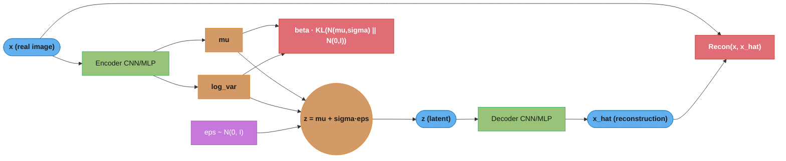
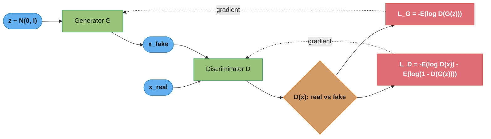
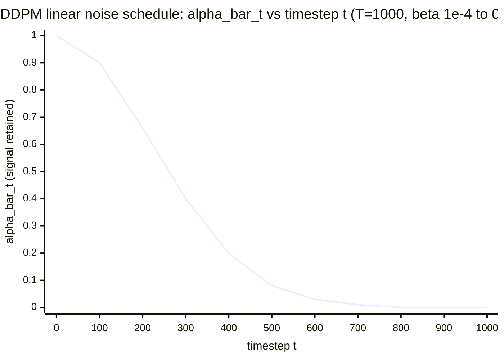

# Generative Models (GANs, VAEs, Diffusion)

## 1. Concept Overview

Generative models learn the underlying data distribution p(x) and can sample new examples that look like they came from that distribution. Three dominant paradigms exist today: Variational Autoencoders (VAEs), Generative Adversarial Networks (GANs), and Diffusion Models. Each uses a fundamentally different principle to model and sample from complex high-dimensional distributions (images, audio, video, molecules, text).

VAEs use variational inference to learn a structured latent space — they are stable to train and support smooth interpolation between concepts, but tend to produce blurry samples due to the Gaussian assumption. GANs pit a generator against a discriminator in an adversarial game, producing sharp photorealistic samples, but suffer from training instability and mode collapse. Diffusion models iteratively denoise random noise into structured data, achieving state-of-the-art image quality (Stable Diffusion, DALL-E 2, Imagen) at the cost of slower multi-step sampling.

---

## 2. Intuition

VAE analogy: a VAE is a compression algorithm that learns to encode images into a compact code (latent vector) and decode them back, with the constraint that codes must form a nice Gaussian-like cloud in latent space — so you can sample anywhere in that cloud and get a realistic image.

GAN analogy: a GAN is a counterfeiter (generator) vs a detective (discriminator) game. The counterfeiter learns to forge increasingly convincing fake bills; the detective learns to spot them. At equilibrium, the fakes are indistinguishable from real bills.

Diffusion model analogy: a diffusion model is like learning to restore a photo from a sandstorm — you add sand (noise) step by step, then train a network to remove it step by step. At inference, you start with pure sand (Gaussian noise) and denoise for 1000 steps.

Key insight: the field has converged on diffusion models for image generation due to their superior sample quality, stability, and controllability (classifier-free guidance). GANs are still dominant for real-time applications (single forward pass) and video generation. VAEs remain valuable for structured latent space applications (interpolation, editing, downstream tasks).

---

## 3. Core Principles

**VAE ELBO**: the Evidence Lower BOund is the VAE training objective, derived by lower-bounding the log-likelihood log p(x): `ELBO = E[log p(x|z)] - KL(q(z|x) || p(z))`. The first term is reconstruction loss (push decoder to reproduce input); the second is KL divergence (push encoder distribution toward the standard Gaussian prior). Trading off these two terms is the core tension in VAEs.

**Reparameterization trick**: to backpropagate through a sampling operation z ~ N(mu, sigma^2), reparameterize as z = mu + epsilon * sigma where epsilon ~ N(0,1). Gradients flow through mu and sigma (deterministic functions of the encoder), not through the sampling operation (epsilon is treated as a fixed random constant).

**GAN min-max game**: the generator G minimizes and the discriminator D maximizes: `V(G,D) = E[log D(x)] + E[log(1 - D(G(z)))]`. At equilibrium, D(x) = 0.5 everywhere (cannot distinguish real from fake) and G generates samples matching the true data distribution.

**Mode collapse**: the generator learns to produce one or a few modes of the distribution, ignoring the rest. D becomes confused and provides no useful gradient signal. The generator never improves beyond a narrow region.

**Diffusion forward process**: add Gaussian noise over T steps (T=1000 typical) following a variance schedule: `q(x_t | x_{t-1}) = N(x_t; sqrt(1-beta_t)*x_{t-1}, beta_t*I)`. After T steps, x_T is approximately Gaussian noise. The reverse process learns to denoise: `p_theta(x_{t-1}|x_t)`.

**Noise prediction**: DDPM trains a U-Net to predict the noise epsilon added at each step given the noisy image x_t and timestep t: `loss = ||epsilon - epsilon_theta(x_t, t)||^2`. At inference, iteratively apply the learned denoising: start from x_T ~ N(0,I), compute x_0 in T reverse steps.

---

## 4. Types / Architectures / Strategies

**VAE Variants:**

| Variant | Key Modification | Use Case |
|---------|----------------|---------|
| Standard VAE | Gaussian encoder/decoder | Tabular, images |
| beta-VAE | KL weight > 1 (disentanglement) | Disentangled representations |
| VQ-VAE | Discrete latent codes (codebook) | Autoregressive image generation |
| Conditional VAE | Condition latent on label/text | Controlled generation |

**GAN Variants:**

| Variant | Key Innovation | Problem Solved |
|---------|--------------|---------------|
| Vanilla GAN | Original adversarial game | — (mode collapse, instability) |
| DCGAN | Convolutional architecture guidelines | Training stability |
| WGAN | Earth Mover distance, no log | Mode collapse, gradient vanishing |
| WGAN-GP | Gradient penalty (lambda=10) | Lipschitz constraint enforcement |
| StyleGAN2 | Style-based generator, path length reg | High-res face generation, disentanglement |
| BigGAN | Class conditioning, orthogonal reg | Large-scale conditional generation |

**Diffusion Model Variants:**

| Variant | Key Innovation | Sampling Steps |
|---------|--------------|---------------|
| DDPM | Original denoising diffusion | 1000 |
| DDIM | Deterministic sampling | 50 (20x faster) |
| LDM (Latent Diffusion) | Diffuse in VAE latent space (Stable Diffusion) | 50 in latent space |
| Score Matching (SGM) | Score-based continuous SDE | Variable |
| Consistency Models | Single-step distillation from diffusion | 1-2 |

**FID Score (Frechet Inception Distance)**: measures quality and diversity of generated images by comparing statistics of Inception-v3 feature distributions between real and generated sets. Lower FID = better. Computed as: `FID = ||mu_r - mu_g||^2 + Tr(Sigma_r + Sigma_g - 2*(Sigma_r * Sigma_g)^{1/2})`. Requires ~50K generated and real samples for reliable estimates. A FID of 0 would mean identical distributions; DDPM achieves FID ~3.17 on CIFAR-10 (compare: GAN ~4-10).

---

## 5. Architecture Diagrams

### VAE



The encoder emits (mu, log_var); the reparameterization trick z = mu + sigma·eps (sigma = exp(0.5·log_var)) keeps eps a fixed, no-gradient noise draw so gradients still flow through mu and sigma. The objective sums reconstruction against beta·KL toward the N(0, I) prior. Because that KL keeps the latent space a continuous Gaussian, linear interpolation z_interp = (1-t)·z_a + t·z_b for t in [0, 1] decodes to smooth intermediate images.

### GAN



Generator G turns noise into x_fake; discriminator D scores real vs fake and the two networks train against opposed losses (dotted arrows are the gradient signals flowing back to each network). At equilibrium D(x) = 0.5 everywhere and G matches the data distribution.

### Diffusion (DDPM) — Forward and Reverse

```mermaid
flowchart LR
    classDef io      fill:#61afef,stroke:#2e86c1,color:#1a1a1a,font-weight:bold
    classDef frozen  fill:#c678dd,stroke:#9b59b6,color:#fff
    classDef train   fill:#98c379,stroke:#27ae60,color:#1a1a1a
    classDef mathOp  fill:#d19a66,stroke:#e67e22,color:#1a1a1a,font-weight:bold
    classDef lossN   fill:#e06c75,stroke:#c0392b,color:#fff,font-weight:bold
    classDef req     fill:#56b6c2,stroke:#0097a7,color:#1a1a1a
    classDef base    fill:#e5c07b,stroke:#f39c12,color:#1a1a1a

    x0(["x_0 (real)"]) -->|"add noise"| x1(["x_1"])
    x1 -->|"add noise"| xt(["x_t"])
    xt -->|"add noise"| xT(["x_T (pure noise)"])
    xT -.->|"denoise"| unet["U-Net + t embedding"]
    unet -.-> eps(("predict epsilon"))
    eps -.->|"denoise step"| xprev(["x_(t-1)"])
    xprev -.-> x0gen(["x_0 (generated)"])

    class x0,x1,xt,xT,xprev,x0gen io
    class unet train
    class eps mathOp
```



The forward process (solid) is parameter-free noise addition over T=1000 steps and admits the one-step closed form q(x_t | x_0) = N(sqrt(alpha_bar_t)·x_0, (1 - alpha_bar_t)·I). The reverse process (dotted) is learned: the U-Net predicts the noise epsilon at each (x_t, t), and iterating the denoise step from x_T ~ N(0, I) recovers x_0.

### U-Net (Diffusion Backbone)

```mermaid
flowchart LR
    classDef io      fill:#61afef,stroke:#2e86c1,color:#1a1a1a,font-weight:bold
    classDef frozen  fill:#c678dd,stroke:#9b59b6,color:#fff
    classDef train   fill:#98c379,stroke:#27ae60,color:#1a1a1a
    classDef mathOp  fill:#d19a66,stroke:#e67e22,color:#1a1a1a,font-weight:bold
    classDef lossN   fill:#e06c75,stroke:#c0392b,color:#fff,font-weight:bold
    classDef req     fill:#56b6c2,stroke:#0097a7,color:#1a1a1a
    classDef base    fill:#e5c07b,stroke:#f39c12,color:#1a1a1a

    xt(["x_t"]) --> e1["Enc: Conv + ResBlock/Attn"]
    e1 --> d1["Downsample /2"]
    d1 --> e2["Enc: ResBlock/Attn"]
    e2 --> d2["Downsample /2"]
    d2 --> bn["Bottleneck: ResBlock + Attn"]
    bn --> u2["Upsample x2"]
    u2 --> dec2["Dec: ResBlock/Attn"]
    dec2 --> u1["Upsample x2"]
    u1 --> dec1["Dec: ResBlock/Attn"]
    dec1 --> out(["predicted noise"])
    e2 -.->|"skip"| dec2
    e1 -.->|"skip"| dec1
    temb["t embedding"] --> e1
    temb --> bn
    temb --> dec1

    class xt,out io
    class e1,e2,bn,dec2,dec1 train
    class d1,d2,u1,u2 mathOp
    class temb req
```



The encoder downsamples to a global-context bottleneck, then the decoder upsamples back; dotted skip connections carry fine spatial detail from each encoder level to the matching decoder level. The timestep embedding t is added at every ResBlock so the network knows the noise level, and text prompts condition it via cross-attention (CLIP/T5 encoder). Classifier-free guidance then extrapolates the two noise predictions per step, epsilon_guided = epsilon_uncond + scale·(epsilon_cond - epsilon_uncond): scale=1 gives no guidance (diverse), scale=7.5 is the standard quality/diversity balance, and scale=15+ maximizes prompt fidelity at the cost of diversity and possible artifacts.

### Diffusion Noise Schedule



alpha_bar_t is the fraction of original signal surviving at step t: x_t = sqrt(alpha_bar_t)·x_0 + sqrt(1 - alpha_bar_t)·eps. Under the linear schedule the signal collapses fast — near-zero by t≈800 (images are almost pure noise) — which is exactly why cosine schedules (Nichol and Dhariwal 2021) spend more steps in the medium-noise regime where structure forms.

---

## 6. How It Works — Detailed Mechanics

### VAE Implementation

```python
import torch
import torch.nn as nn
import torch.nn.functional as F
from torch import Tensor


class VAEEncoder(nn.Module):
    def __init__(self, input_dim: int, hidden_dim: int, latent_dim: int) -> None:
        super().__init__()
        self.net = nn.Sequential(
            nn.Linear(input_dim, hidden_dim),
            nn.ReLU(),
            nn.Linear(hidden_dim, hidden_dim),
            nn.ReLU(),
        )
        self.mu_layer      = nn.Linear(hidden_dim, latent_dim)
        self.log_var_layer = nn.Linear(hidden_dim, latent_dim)

    def forward(self, x: Tensor) -> tuple[Tensor, Tensor]:
        h = self.net(x)
        mu = self.mu_layer(h)
        log_var = self.log_var_layer(h)  # log(sigma^2) — unconstrained
        return mu, log_var


class VAEDecoder(nn.Module):
    def __init__(self, latent_dim: int, hidden_dim: int, output_dim: int) -> None:
        super().__init__()
        self.net = nn.Sequential(
            nn.Linear(latent_dim, hidden_dim),
            nn.ReLU(),
            nn.Linear(hidden_dim, hidden_dim),
            nn.ReLU(),
            nn.Linear(hidden_dim, output_dim),
            nn.Sigmoid(),  # pixel values in [0,1]
        )

    def forward(self, z: Tensor) -> Tensor:
        return self.net(z)


class VAE(nn.Module):
    def __init__(
        self, input_dim: int = 784, hidden_dim: int = 512, latent_dim: int = 32, beta: float = 1.0
    ) -> None:
        super().__init__()
        self.encoder = VAEEncoder(input_dim, hidden_dim, latent_dim)
        self.decoder = VAEDecoder(latent_dim, hidden_dim, input_dim)
        self.beta = beta  # beta > 1 encourages disentanglement (beta-VAE)

    def reparameterize(self, mu: Tensor, log_var: Tensor) -> Tensor:
        """
        Reparameterization trick: z = mu + eps * sigma
        eps ~ N(0, I) — fixed random constant during backward
        Gradients flow through mu and sigma (not through sampling)
        """
        if self.training:
            std = torch.exp(0.5 * log_var)  # sigma = exp(log_var / 2)
            eps = torch.randn_like(std)     # eps ~ N(0, I), same shape as std
            return mu + eps * std
        else:
            return mu  # at inference, use mean directly (deterministic)

    def forward(self, x: Tensor) -> tuple[Tensor, Tensor, Tensor]:
        mu, log_var = self.encoder(x)
        z = self.reparameterize(mu, log_var)
        x_hat = self.decoder(z)
        return x_hat, mu, log_var

    def loss(self, x: Tensor, x_hat: Tensor, mu: Tensor, log_var: Tensor) -> Tensor:
        # Reconstruction loss: binary cross-entropy for image pixels in [0,1]
        recon_loss = F.binary_cross_entropy(x_hat, x, reduction="sum")
        # KL divergence: KL(N(mu, sigma) || N(0, 1))
        # Closed form: -0.5 * sum(1 + log_var - mu^2 - exp(log_var))
        kl_loss = -0.5 * torch.sum(1 + log_var - mu.pow(2) - log_var.exp())
        return (recon_loss + self.beta * kl_loss) / x.size(0)  # per-sample average

    @torch.no_grad()
    def sample(self, n: int, device: torch.device) -> Tensor:
        z = torch.randn(n, self.encoder.mu_layer.out_features, device=device)
        return self.decoder(z)

    @torch.no_grad()
    def interpolate(self, x1: Tensor, x2: Tensor, steps: int = 10) -> Tensor:
        mu1, _ = self.encoder(x1)
        mu2, _ = self.encoder(x2)
        alphas = torch.linspace(0, 1, steps, device=x1.device)
        # Linear interpolation in latent space
        zs = torch.stack([(1-a)*mu1 + a*mu2 for a in alphas])
        return self.decoder(zs)
```

### WGAN with Gradient Penalty

```python
class WGANGPTrainer:
    def __init__(
        self,
        generator: nn.Module,
        critic: nn.Module,     # discriminator is called critic in WGAN
        device: torch.device,
        lr: float = 1e-4,
        gp_lambda: float = 10.0,     # gradient penalty coefficient
        n_critic: int = 5,           # critic steps per generator step
    ) -> None:
        self.G = generator
        self.D = critic               # critic: outputs real number, not probability
        self.device = device
        self.gp_lambda = gp_lambda
        self.n_critic = n_critic
        # Note: no beta2 tuning needed — WGAN uses RMSprop or Adam with low beta values
        self.opt_G = torch.optim.Adam(generator.parameters(), lr=lr, betas=(0.0, 0.9))
        self.opt_D = torch.optim.Adam(critic.parameters(),    lr=lr, betas=(0.0, 0.9))

    def gradient_penalty(self, real: Tensor, fake: Tensor) -> Tensor:
        """
        WGAN-GP: enforce Lipschitz constraint via gradient penalty on interpolated samples.
        Penalizes critic when gradient norm != 1 at points between real and fake distributions.
        """
        batch_size = real.size(0)
        alpha = torch.rand(batch_size, 1, 1, 1, device=self.device)  # random interpolation
        interpolated = (alpha * real + (1 - alpha) * fake).requires_grad_(True)
        d_interpolated = self.D(interpolated)
        gradients = torch.autograd.grad(
            outputs=d_interpolated,
            inputs=interpolated,
            grad_outputs=torch.ones_like(d_interpolated),
            create_graph=True,
            retain_graph=True,
        )[0]
        gradients = gradients.view(batch_size, -1)
        gradient_norm = gradients.norm(2, dim=1)
        # Penalty: push gradient norm toward 1
        return ((gradient_norm - 1) ** 2).mean()

    def train_step(self, real_batch: Tensor, latent_dim: int) -> dict[str, float]:
        real = real_batch.to(self.device)
        batch_size = real.size(0)
        metrics: dict[str, float] = {}

        # Train critic n_critic times per generator step
        for _ in range(self.n_critic):
            z = torch.randn(batch_size, latent_dim, device=self.device)
            fake = self.G(z).detach()  # detach: do not backprop into G during D update

            # Wasserstein critic loss: maximize E[D(real)] - E[D(fake)]
            # (equivalently minimize negative)
            d_real = self.D(real).mean()
            d_fake = self.D(fake).mean()
            gp = self.gradient_penalty(real, fake)
            loss_D = -d_real + d_fake + self.gp_lambda * gp

            self.opt_D.zero_grad()
            loss_D.backward()
            self.opt_D.step()

        # Train generator: maximize E[D(G(z))] = minimize -E[D(G(z))]
        z = torch.randn(batch_size, latent_dim, device=self.device)
        fake = self.G(z)
        loss_G = -self.D(fake).mean()

        self.opt_G.zero_grad()
        loss_G.backward()
        self.opt_G.step()

        metrics["loss_G"] = loss_G.item()
        metrics["loss_D"] = loss_D.item()
        metrics["W_dist"] = (d_real - d_fake).item()  # Wasserstein distance estimate
        return metrics
```

### Diffusion Model (DDPM)

```python
import numpy as np


class DDPMNoiseScheduler:
    def __init__(
        self,
        num_timesteps: int = 1000,
        beta_start: float = 1e-4,
        beta_end: float = 0.02,
    ) -> None:
        self.T = num_timesteps
        # Linear noise schedule (DDPM original; cosine schedule is better for modern models)
        self.betas = torch.linspace(beta_start, beta_end, num_timesteps)
        self.alphas = 1.0 - self.betas
        self.alpha_bars = torch.cumprod(self.alphas, dim=0)  # alpha_bar_t = prod_{s=1}^{t} alpha_s

    def add_noise(self, x_0: Tensor, t: Tensor) -> tuple[Tensor, Tensor]:
        """
        Forward process: sample x_t given x_0 in one step (closed form).
        x_t = sqrt(alpha_bar_t) * x_0 + sqrt(1 - alpha_bar_t) * eps
        eps ~ N(0, I)
        """
        alpha_bar = self.alpha_bars[t].view(-1, 1, 1, 1).to(x_0.device)
        eps = torch.randn_like(x_0)
        x_t = torch.sqrt(alpha_bar) * x_0 + torch.sqrt(1 - alpha_bar) * eps
        return x_t, eps  # return both noisy image and the noise (target for U-Net)

    @torch.no_grad()
    def sample_one_step(
        self,
        model: nn.Module,
        x_t: Tensor,
        t: int,
    ) -> Tensor:
        """Single reverse denoising step."""
        beta_t = self.betas[t].to(x_t.device)
        alpha_t = self.alphas[t].to(x_t.device)
        alpha_bar_t = self.alpha_bars[t].to(x_t.device)

        t_batch = torch.full((x_t.size(0),), t, device=x_t.device, dtype=torch.long)
        eps_pred = model(x_t, t_batch)  # U-Net predicts the noise

        # DDPM reverse step formula
        x_prev = (x_t - (1 - alpha_t) / torch.sqrt(1 - alpha_bar_t) * eps_pred)
        x_prev = x_prev / torch.sqrt(alpha_t)

        if t > 0:  # add noise at all steps except the last
            noise = torch.randn_like(x_t)
            x_prev = x_prev + torch.sqrt(beta_t) * noise

        return x_prev

    @torch.no_grad()
    def generate(self, model: nn.Module, shape: tuple, device: torch.device) -> Tensor:
        """Full reverse diffusion: T denoising steps from pure noise."""
        model.eval()
        x = torch.randn(shape, device=device)  # start from pure Gaussian noise
        for t in reversed(range(self.T)):       # T=999 down to 0
            x = self.sample_one_step(model, x, t)
        return x.clamp(-1, 1)


def ddpm_training_step(
    model: nn.Module,
    scheduler: DDPMNoiseScheduler,
    x_0: Tensor,
    optimizer: torch.optim.Optimizer,
    device: torch.device,
) -> float:
    model.train()
    x_0 = x_0.to(device)
    batch_size = x_0.size(0)

    # Sample random timesteps for this batch (different t for each sample)
    t = torch.randint(0, scheduler.T, (batch_size,), device=device, dtype=torch.long)

    # Add noise to get x_t
    x_t, eps_true = scheduler.add_noise(x_0, t)

    # Predict the noise
    optimizer.zero_grad()
    eps_pred = model(x_t, t)

    # Simple MSE loss on noise (DDPM original formulation)
    loss = F.mse_loss(eps_pred, eps_true)
    loss.backward()
    nn.utils.clip_grad_norm_(model.parameters(), max_norm=1.0)
    optimizer.step()
    return loss.item()
```

### Classifier-Free Guidance

```python
@torch.no_grad()
def cfg_sample(
    model: nn.Module,
    scheduler: DDPMNoiseScheduler,
    text_embedding: Tensor,        # (batch, seq, dim) from CLIP/T5
    shape: tuple,
    cfg_scale: float = 7.5,        # guidance scale: 1=no guidance, 7.5=standard, 15+=strong
    device: torch.device = torch.device("cuda"),
) -> Tensor:
    """
    Classifier-Free Guidance sampling.
    At each step, predict noise twice: with conditioning and with null conditioning.
    Extrapolate in the direction of the condition.
    """
    model.eval()
    null_embedding = torch.zeros_like(text_embedding)  # unconditional: empty/null prompt
    x = torch.randn(shape, device=device)

    for t in reversed(range(scheduler.T)):
        t_batch = torch.full((shape[0],), t, device=device, dtype=torch.long)

        # Predict noise conditioned on text
        eps_cond   = model(x, t_batch, text_embedding)
        # Predict noise unconditionally
        eps_uncond = model(x, t_batch, null_embedding)

        # CFG: extrapolate from unconditional toward conditional
        eps_guided = eps_uncond + cfg_scale * (eps_cond - eps_uncond)

        x = scheduler.sample_one_step_with_eps(x, t, eps_guided)

    return x.clamp(-1, 1)
```

### Mode Collapse Detection

```python
def detect_mode_collapse(
    generator: nn.Module,
    n_samples: int = 1000,
    latent_dim: int = 128,
    device: torch.device = torch.device("cuda"),
) -> dict[str, float]:
    """
    Heuristic mode collapse detection:
    - Low diversity: generated samples cluster together (low pairwise distance)
    - Low Inception Score (IS): generated samples lack diversity
    """
    generator.eval()
    with torch.no_grad():
        z = torch.randn(n_samples, latent_dim, device=device)
        fake = generator(z).view(n_samples, -1).cpu()

    # Pairwise cosine similarity — high mean = mode collapse
    fake_normalized = F.normalize(fake, dim=1)
    # Sample 500 pairs to estimate pairwise similarity efficiently
    idx_a = torch.randint(0, n_samples, (500,))
    idx_b = torch.randint(0, n_samples, (500,))
    pairwise_sim = (fake_normalized[idx_a] * fake_normalized[idx_b]).sum(dim=1)
    mean_sim = pairwise_sim.mean().item()

    return {
        "mean_pairwise_similarity": mean_sim,
        "mode_collapsed": mean_sim > 0.95,  # threshold: >0.95 suggests collapse
    }
```

---

## 7. Real-World Examples

**Stable Diffusion (Latent Diffusion Model)**: compresses images to 64x64 latent space via a VQ-VAE (8x compression from 512x512), then runs DDPM in that latent space. This reduces diffusion compute by 64x vs pixel-space diffusion. Uses a CLIP text encoder for conditioning and classifier-free guidance at scale 7.5. Generates 512x512 images in ~2 seconds on a consumer RTX 3090 (50 DDIM steps).

**StyleGAN2 for face generation**: achieves FID ~2.84 on FFHQ (70K face dataset). Uses progressive growing, style injection, and path length regularization to avoid mode collapse and achieve photorealistic diversity. Deployed by NVIDIA for avatar creation and data augmentation in medical imaging (synthetic face data for privacy-preserving datasets).

**VQ-VAE-2 for hierarchical image generation**: combines a discrete latent codebook (VQ-VAE) with an autoregressive prior (PixelCNN). Achieves diverse high-resolution generation without adversarial training or diffusion. The codebook approach enables discrete manipulation of image structure (changing hairstyle without changing identity).

**VAE for drug discovery (Molecular VAE)**: encodes molecule SMILES strings into a continuous latent space, enabling gradient-based optimization of molecular properties. Novartis and Insilico Medicine use this to explore chemical space efficiently — latent space interpolation between two molecules produces valid intermediate compounds in ~80% of cases vs ~5% for random exploration.

---

## 8. Tradeoffs

| Model | Training Stability | Sample Quality | Diversity | Inference Speed | Latent Control |
|-------|-----------------|--------------|---------|---------------|---------------|
| VAE | Excellent | Blurry | Good | Fast (1 step) | Excellent |
| GAN | Poor (collapse risk) | Sharp/Realistic | Risk of collapse | Fast (1 step) | Limited |
| WGAN-GP | Good | Better than GAN | Good | Fast | Limited |
| DDPM | Excellent | SOTA | Excellent | Slow (1000 steps) | Moderate |
| DDIM | Excellent | SOTA | Excellent | Medium (50 steps) | Moderate |
| LDM | Excellent | SOTA | Excellent | Medium (50 latent) | Good with CFG |

| FID Score Comparison (CIFAR-10 32x32) | FID |
|---------------------------------------|-----|
| Real data | 0 |
| DDPM | ~3.2 |
| StyleGAN2 | ~4.4 |
| NVAE (hierarchical VAE) | ~23.5 |
| Standard VAE | ~60-100 |

---

## 9. When to Use / When NOT to Use

**Use VAE when:**
- You need a smooth, interpretable latent space (interpolation, attribute manipulation)
- Training stability is paramount (no adversarial dynamics)
- Downstream tasks use the latent representations (clustering, drug discovery)
- Sample quality is secondary to latent space structure

**Use GAN/StyleGAN when:**
- You need the sharpest possible samples in a single forward pass
- High-resolution portrait, texture, or domain-specific generation (faces, art)
- Real-time inference with <10ms latency requirement

**Use Diffusion (DDPM/LDM) when:**
- Maximum sample quality and diversity are required
- Text-conditional generation (DALL-E, Stable Diffusion, Imagen)
- Inference latency allows multi-step sampling (>0.5 seconds acceptable)
- Training stability is more important than training speed

**Do NOT use:**
- Vanilla GAN for complex diverse datasets (use WGAN-GP or StyleGAN2)
- Standard VAE when sample quality matters (blurry output is a hard limitation)
- DDPM (1000 steps) when fast inference is needed — use DDIM (50 steps) instead

---

## 10. Common Pitfalls

**War story 1 — GAN mode collapse due to imbalanced training:**
A GAN trained on a fashion dataset collapsed to generating only white t-shirts within 500 steps. Investigation: the discriminator was updated once per generator step. The discriminator converged quickly (~50 steps) and provided zero-gradient signal to the generator for all non-t-shirt images (D(G(z)) ≈ 0 everywhere). Fix: use WGAN-GP (gradient penalty forces gradients to remain informative) and train the discriminator/critic 5 steps per generator step (n_critic=5). Mode diversity measured by pairwise cosine similarity dropped from 0.97 (collapse) to 0.34 (healthy).

```python
# BROKEN: equal training — discriminator dominates
for x_real in loader:
    update_D(x_real)  # D converges first, gradients become 0
    update_G()        # G receives no useful signal

# FIX: WGAN-GP with n_critic=5
for x_real in loader:
    for _ in range(5):       # train critic 5x more
        update_critic_wgan_gp(x_real)
    update_generator()
```

**War story 2 — VAE posterior collapse (KL vanishing):**
A conditional VAE for text generation had KL loss go to zero after epoch 3 — the encoder learned to output mu=0, sigma=1 (matching the prior exactly), and the decoder learned to ignore the latent variable z entirely. The model became a standard autoregressive decoder with no latent structure. Fix: KL annealing — linearly increase the KL coefficient (beta) from 0 to 1 over the first 10 epochs, allowing the reconstruction loss to dominate early training and forcing the latent space to encode useful information before the KL penalty kicks in.

```python
# FIX: KL annealing — gradually increase KL weight
def get_kl_weight(epoch: int, warmup_epochs: int = 10) -> float:
    return min(1.0, epoch / warmup_epochs)

for epoch in range(max_epochs):
    kl_weight = get_kl_weight(epoch, warmup_epochs=10)
    for x in loader:
        x_hat, mu, log_var = vae(x)
        recon = F.binary_cross_entropy(x_hat, x, reduction="sum")
        kl = -0.5 * torch.sum(1 + log_var - mu.pow(2) - log_var.exp())
        loss = recon + kl_weight * kl  # kl_weight starts at 0
        # ... backward, step
```

**War story 3 — Forgetting to normalize images to [-1, 1] for GAN:**
A DCGAN implementation trained on images in [0, 255] (not normalized). The generator's tanh output layer produces values in [-1, 1]. The discriminator received real images in [0, 255] and fake images in [-1, 1] — completely different distributions. D learned to distinguish based on value range alone (trivial task), providing no useful gradient to G. G never improved. Fix: always normalize input images to [-1, 1] for GANs, matching the tanh output range of the generator.

```python
# BROKEN: raw pixel values
transform = transforms.ToTensor()  # scales to [0, 1] — still wrong for GAN

# FIX: normalize to [-1, 1] to match tanh generator output
transform = transforms.Compose([
    transforms.ToTensor(),
    transforms.Normalize(mean=[0.5, 0.5, 0.5], std=[0.5, 0.5, 0.5]),  # -> [-1, 1]
])
```

**War story 4 — Diffusion model trained without timestep conditioning:**
A diffusion model U-Net was implemented but the timestep t embedding was silently dropped (a bug in the conditioning code path). The model received the same noisy image x_t but had no way to know how much noise was added. It learned an average denoising behavior that worked poorly for both lightly and heavily noised images. FID was 47 vs expected ~4. Fix: always verify the timestep embedding is actually being added to the U-Net (check intermediate activation statistics across different t values — they should differ significantly).

---

## 11. Technologies & Tools

| Tool | Purpose |
|------|---------|
| `diffusers` (HuggingFace) | DDPM, DDIM, Stable Diffusion, ControlNet training and inference |
| `torchvision.utils.make_grid` | Visualize generated image grids |
| `pytorch-fid` | Compute FID score for generated images |
| `clean-fid` | More accurate FID (proper resize filters) |
| `StyleGAN2-ADA` (NVIDIA) | Reference StyleGAN2 implementation with limited data augmentation |
| `accelerate` (HuggingFace) | Multi-GPU/TPU training for diffusion models |
| CLIP (`openai/clip`) | Text encoder for conditional generation |
| `einops` | Tensor reshaping for attention in U-Net |
| `xformers` | Memory-efficient attention for diffusion U-Net (reduces VRAM 40-60%) |

Key `diffusers` APIs:
```python
from diffusers import DDPMScheduler, UNet2DModel, DDIMScheduler

# Load pretrained diffusion model
scheduler = DDPMScheduler(num_train_timesteps=1000)
unet = UNet2DModel.from_pretrained("google/ddpm-celebahq-256")

# DDIM for 50-step sampling (20x faster than DDPM 1000 steps)
ddim_scheduler = DDIMScheduler.from_pretrained("google/ddpm-celebahq-256")
ddim_scheduler.set_timesteps(50)
```

---

## 12. Interview Questions with Answers

**Q: What is the reparameterization trick and why is it needed in VAEs?**
The reparameterization trick enables backpropagation through a sampling operation. In a VAE, the latent variable z is sampled from N(mu, sigma^2), which is non-differentiable — you cannot compute gradients with respect to mu and sigma through a sampling operation. The trick rewrites sampling as z = mu + epsilon * sigma where epsilon ~ N(0, I). Now mu and sigma are deterministic functions of the encoder output (and are differentiable), while epsilon is a fixed random constant that does not require gradients. This allows the gradient of the ELBO loss to flow through z to the encoder parameters.

**Q: What is the ELBO and what are its two terms?**
ELBO (Evidence Lower BOund) is the VAE training objective, a lower bound on log p(x). It equals E_q[log p(x|z)] - KL(q(z|x) || p(z)). The first term is the reconstruction loss: given a latent code z sampled from the encoder, how well can the decoder reconstruct the original input x? For images, this is often binary cross-entropy or MSE. The second term is the KL divergence: how far is the encoder's distribution q(z|x) from the prior p(z) = N(0,I)? Minimizing negative ELBO means maximizing reconstruction quality while keeping the latent space close to a standard Gaussian — enabling sampling at inference by drawing z from N(0,I).

**Q: What is mode collapse in GANs and how does WGAN-GP address it?**
Mode collapse occurs when the generator learns to produce samples from a narrow subset of the true data distribution (e.g., only one digit class, one face expression) because it found a small region that fools the discriminator. The discriminator then learns to distinguish this narrow region, the generator shifts to another narrow region, and this cycling continues without convergence. WGAN addresses this by using Earth Mover (Wasserstein) distance as the objective, which provides gradient signal everywhere (not just near the decision boundary). WGAN-GP enforces the Lipschitz constraint required by WGAN via a gradient penalty: at random interpolations between real and fake samples, the critic's gradient norm should be 1. This prevents the critic from saturating and ensures informative gradients to the generator throughout training.

**Q: Describe the forward and reverse processes in DDPM.**
Forward process: starting from a real image x_0, add Gaussian noise over T=1000 steps using a fixed variance schedule. At each step t: x_t = sqrt(1-beta_t) * x_{t-1} + sqrt(beta_t) * eps. After T steps, x_T is approximately N(0,I). Crucially, x_t can be sampled directly from x_0 in one step: x_t = sqrt(alpha_bar_t) * x_0 + sqrt(1-alpha_bar_t) * eps, enabling efficient training without sequential forward steps. Reverse process: a U-Net is trained to predict the noise eps given (x_t, t). At inference, start from x_T ~ N(0,I) and iteratively denoise using the learned U-Net, recovering x_0 over T reverse steps.

**Q: What is classifier-free guidance and how does it control generation quality?**
Classifier-free guidance (CFG) trains a single diffusion model to handle both conditional (with a text prompt) and unconditional (empty prompt) generation by randomly dropping the conditioning 10-20% of training time. At inference, two noise predictions are made per step — conditional and unconditional — and the guided prediction extrapolates in the direction of the condition: eps_guided = eps_uncond + scale * (eps_cond - eps_uncond). The guidance scale controls the tradeoff: scale=1 gives no guidance (maximum diversity); scale=7.5 is standard (quality/diversity balance used by Stable Diffusion); scale=15+ produces images highly faithful to the prompt but less diverse and sometimes over-saturated. This requires no separate classifier, making it simpler and more flexible than classifier guidance.

**Q: What is FID and how do you interpret it?**
Frechet Inception Distance measures the similarity between the distribution of real images and generated images in the feature space of a pretrained Inception-v3 network. It computes the Frechet distance between two multivariate Gaussians fitted to the Inception features of real and generated samples: FID = ||mu_r - mu_g||^2 + Tr(Sigma_r + Sigma_g - 2*sqrt(Sigma_r * Sigma_g)). Lower FID is better: a perfect generator would achieve FID=0. DDPM achieves FID~3.2 on CIFAR-10; standard VAE achieves FID~60-100. Requires ~50K samples for statistical reliability — computing FID on fewer samples (e.g., 2K) produces unreliable estimates that vary by +-5-10 FID points.

**Q: What is the difference between DDPM and DDIM sampling?**
DDPM (Denoising Diffusion Probabilistic Models) uses a stochastic reverse process that requires T=1000 sequential denoising steps to generate a high-quality sample. Each step depends on the previous and adds random noise, making it inherently slow. DDIM (Denoising Diffusion Implicit Models) reformulates the reverse process as a deterministic ODE solver, enabling sampling with far fewer steps (typically 50) with minimal quality degradation (~same FID). DDIM is also deterministic given the initial noise x_T, enabling reproducible generation. Stable Diffusion uses DDIM (or PNDM/DPM++) by default. The tradeoff: DDIM at 20 steps produces slightly lower quality than DDPM at 1000 steps; DDIM at 50 steps is nearly equivalent.

**Q: What causes posterior collapse in VAEs and how do you fix it?**
Posterior collapse occurs when the encoder learns to output the prior (mu=0, sigma=1) and the decoder learns to generate good reconstructions by ignoring z entirely. This happens because in early training, a powerful decoder can minimize reconstruction loss without using z, while the KL term pushes toward the prior. Once the decoder learns to ignore z, the encoder has no incentive to encode useful information. Fixes: (1) KL annealing — linearly increase KL weight from 0 to 1 over early training epochs, forcing reconstruction to dominate first; (2) Free bits — set a minimum KL per dimension (e.g., 0.5 nats) below which KL is not penalized; (3) Use a weaker decoder architecture that forces reliance on z; (4) Reduce decoder capacity for text VAEs (LSTM decoder).

**Q: What is the difference between a VAE and a VQ-VAE?**
A standard VAE uses a continuous Gaussian latent space. A VQ-VAE (Vector Quantized VAE) uses a discrete latent space: the encoder maps inputs to a sequence of discrete codes from a learned codebook (typically 512-8192 codes). The closest codebook vector to each encoder output is used (straight-through estimator for gradient). VQ-VAE avoids posterior collapse (discrete codes cannot collapse to a prior), produces sharper reconstructions than Gaussian VAEs, and enables powerful autoregressive priors (PixelCNN, Transformer) over the discrete codes. Stable Diffusion uses a VQ-VAE variant to compress images to a latent space before diffusion. The limitation is that training is more complex (codebook collapse — unused codes — requires commitment loss and exponential moving average updates).

**Q: How would you diagnose and fix training instability in a GAN?**
Symptoms: oscillating loss, mode collapse (D detects fakes trivially), loss of one network going to zero. Diagnosis steps: (1) Plot discriminator accuracy on real and fake — should be ~50-75% during healthy training; >95% means G is failing, <55% means D is too weak. (2) Check gradient norms for both networks. (3) Visualize generated samples every N steps to catch collapse early. Fixes: (1) Reduce discriminator LR or increase generator LR; (2) Switch to WGAN-GP for stable Lipschitz enforcement; (3) Add feature matching loss (generator minimizes difference in discriminator intermediate features, not just final output); (4) Use mini-batch discrimination to prevent mode collapse; (5) Add label smoothing to discriminator targets (real label = 0.9, not 1.0).

**Q: What is latent space interpolation in VAEs and why does it work smoothly?**
Latent space interpolation creates a sequence of images by linearly interpolating between two latent codes: z_interp = (1-t) * z_a + t * z_b for t in [0,1]. This produces smooth intermediate images that look like valid samples from the data distribution. It works because the VAE's KL regularization forces the latent space to be a well-structured Gaussian — every point in the space corresponds to a valid image, and nearby points correspond to similar images. This is in contrast to a standard autoencoder where the latent space has "holes" (points between encodings may decode to nonsense). Applications: face aging by interpolating along the age dimension, style transfer by mixing latent codes from two images.

**Q: Why do VAEs produce blurry samples?**
VAEs blur because the pixel-wise Gaussian/MSE reconstruction loss rewards predicting the per-pixel average over all plausible outputs, which smears fine detail. When multiple sharp reconstructions are consistent with a latent code, minimizing expected squared error drives the decoder to output their mean — a blurry compromise — whereas a GAN's discriminator penalizes any unrealistic average and forces sharpness. The Gaussian likelihood assumption and the KL pressure toward a limited-capacity latent also discard high-frequency information. Fixes include perceptual/LPIPS losses, an adversarial term (VAE-GAN), or discrete latents (VQ-VAE) that sidestep the averaging problem.

**Q: What is the difference between FID and Inception Score, and why is FID preferred?**
Inception Score scores only generated images, while FID compares generated and real feature distributions, so FID catches samples that miss the real distribution. IS feeds samples to Inception-v3 and rewards low-entropy per-image predictions (each image clearly one class) plus high marginal entropy (many classes represented) — but because it never looks at real data, a generator can score well while producing unrealistic images or missing modes. FID fits Gaussians to Inception features of ~50K real and ~50K generated images and measures their Frechet distance, penalizing both quality and diversity mismatches; lower is better and 0 means identical distributions. FID is the field standard because it correlates better with human judgment and is sensitive to mode dropping.

**Q: Why are GANs harder to train than diffusion models?**
GANs optimize a min-max adversarial game with no single loss to monitor, so the two networks can oscillate, collapse to a few modes, or have the discriminator saturate to zero gradient. There is no fixed target: the generator chases a moving discriminator, and equilibrium (D=0.5 everywhere) is a saddle point that gradient descent does not reliably reach. Diffusion models instead train on a stable, stationary regression objective — predict the noise added at a random timestep via MSE — which has a well-defined minimum and no adversary, giving smooth convergence. The tradeoff is inference cost: a GAN generates in one forward pass while diffusion needs 20-1000 denoising steps, so GANs remain preferred for real-time and video generation.

**Q: Why can the DDPM forward process be computed in closed form, and why does it matter for training?**
Because composing Gaussian noising steps stays Gaussian, x_t can be sampled directly from x_0 as sqrt(alpha_bar_t)*x_0 + sqrt(1-alpha_bar_t)*eps in one shot. Here alpha_bar_t is the cumulative product of (1-beta_s) up to t, so you never have to run the t-step Markov chain during training. This matters because it makes training cheap and parallel: for each image you sample a random timestep t, jump straight to x_t, and train the U-Net to predict the injected noise eps with MSE. Without the closed form you would need up to 1000 sequential steps per training example, making diffusion training infeasible.

**Q: What happens to a VAE if you remove the KL term from the loss?**
It degenerates into an ordinary autoencoder — the latent space loses its Gaussian structure, develops holes, and can no longer be sampled or interpolated to produce valid images. The KL(q(z|x) || N(0,I)) term is what pins every encoder distribution near the standard-Gaussian prior; without it the encoder places codes anywhere, so drawing z ~ N(0,I) at inference lands in untrained regions that decode to noise. The KL is therefore the regularizer that makes generation and smooth latent interpolation work. Too much KL causes the opposite failure — posterior collapse, where the decoder ignores z entirely — so the beta weight trades reconstruction fidelity against latent regularity.

**Q: What is the role of the noise schedule in diffusion models and why prefer cosine over linear?**
The noise schedule (the beta_t values) sets how fast signal is destroyed across timesteps, and the cosine schedule keeps more signal in the middle steps where image structure forms. Under DDPM's linear schedule (beta 1e-4 to 0.02), alpha_bar_t collapses to near zero by t≈800, so the final ~200 steps are almost pure noise and contribute little learning signal while wasting model capacity. The cosine schedule (Nichol & Dhariwal 2021) spreads the signal-to-noise decay more evenly, spending more steps in the medium-noise regime that governs global structure, which improves sample quality and log-likelihood. The schedule is fixed (not learned) and shared between the forward and reverse processes.

**Q: How do autoregressive generative models differ from VAEs and diffusion models?**
Autoregressive models (PixelCNN, GPT) factorize p(x) into a product of per-element conditionals and generate one token/pixel at a time, giving exact likelihoods but slow sequential sampling. VAEs and diffusion models instead use latent variables and optimize a bound (ELBO) or a denoising objective, sampling in one pass (VAE) or a fixed number of denoising steps (diffusion) rather than element by element. Autoregressive models give tractable exact likelihoods and back both LLMs and VQ-VAE priors, but generating a 256x256 image pixel-by-pixel is prohibitively slow, which is why images use latent or diffusion approaches. Hybrids exist: VQ-VAE encodes an image to a small grid of discrete codes, then an autoregressive Transformer models that much shorter sequence.

---

## 13. Best Practices

- Use WGAN-GP over vanilla GAN for any non-trivial dataset. The gradient penalty adds minimal overhead and dramatically improves stability.
- Monitor diversity alongside quality: track both FID (quality + diversity) and precision/recall separately. High precision, low recall = mode collapse.
- For VAEs, use KL annealing (beta from 0 to 1 over 10 epochs) to prevent posterior collapse, especially with powerful decoders.
- Normalize GAN input images to [-1, 1] to match the tanh generator output range. This is one of the most common silent correctness bugs.
- Use the diffusers library for all diffusion model work — the scheduler implementations are numerically verified and include DDIM, DPM++, and other fast samplers.
- For text-to-image generation, prefer Latent Diffusion (run diffusion in VAE latent space) over pixel-space diffusion — 8-64x compute reduction at equivalent quality.
- Set CFG scale 7.5 as the default starting point for Stable Diffusion; adjust based on prompt adherence vs diversity requirements.
- Always compute FID with at least 10K generated samples (50K for publishable results). FID computed on 1K samples has variance of +-10-15 FID points.
- For GAN training: update the discriminator 5x per generator step (n_critic=5 in WGAN-GP). Use Adam with betas=(0.0, 0.9) — not (0.9, 0.999) — for both networks to prevent momentum from destabilizing adversarial dynamics.
- Use `xformers` memory-efficient attention in diffusion U-Nets to reduce VRAM by 40-60%, enabling larger batch sizes or higher resolutions.

---

## 14. Case Study

**Scenario:** A health AI company (partnered with 12 hospital systems, HIPAA Business Associate Agreement in place) needs to expand a radiology AI training dataset. The existing dataset has 18,000 chest X-rays with rare pathologies (pneumothorax: 340 samples, aortic dissection: 127 samples) - insufficient for training robust detection models. The goal: train a DDPM on the existing images, generate 5,000 synthetic X-rays per pathology class while maintaining HIPAA compliance (no real patient identifiers in synthetic images), achieving FID <= 28 and verified clinical fidelity (board-certified radiologist review, 80% pass rate), with synthetic data improving downstream classifier AUC-ROC by >= 0.04.

**Architecture:**
```
Real X-ray Dataset (18,000 images, 512x512, 16-bit DICOM)
  De-identified: patient ID, date, DOB stripped (HIPAA Safe Harbor)
  Normalised: 16-bit -> 8-bit float via window/level adjustment
  Class labels: 14 pathology categories + "normal"
         |
         v
Class-Conditional DDPM Training
  Backbone: U-Net with residual blocks (256 base channels)
  Class conditioning: label embedding added to timestep embedding
  Noise schedule: cosine beta schedule, T=1000 steps
  Training: 200 epochs, batch=16, lr=2e-4, EMA decay=0.9999
  GPU: 4x A100 40GB, training time: 72 hours
         |
         v
Synthetic Image Generation (DDPM Sampling)
  Class-conditional generation: specify pathology class
  Sampling: DDIM (50 steps, deterministic, 20x faster than DDPM)
  Batch generation: 100 images/GPU * 4 GPUs = 400 images/hour
  5,000 images per class = 12.5 hours for two classes
         |
         v
HIPAA Compliance Verification
  k-anonymity check: nearest-neighbour distance to training set
  If min_NN_distance < threshold -> reject synthetic image
  Ensure no memorisation of rare training examples
         |
         v
Clinical Fidelity Review (20% sample = 200 images per class)
  Board-certified radiologist scores each image 1-5 (realistic scale)
  Pass threshold: >= 4 for >= 80% of reviewed images
         |
         v
Augmented Dataset Training
  Original: 18,000 real + 10,000 synthetic (5K per pathology class)
  Downstream: EfficientNet-B3 classifier trained on augmented set
  Evaluation: AUC-ROC on held-out real images only
```

**Step-by-step implementation:**

```python
from __future__ import annotations
import torch
import torch.nn as nn
import torch.nn.functional as F
import numpy as np
from dataclasses import dataclass

@dataclass
class DDPMConfig:
    image_size: int = 512
    in_channels: int = 1           # grayscale X-ray
    base_channels: int = 256
    channel_multipliers: tuple[int, ...] = (1, 2, 4, 8)
    num_res_blocks: int = 2
    num_classes: int = 15          # 14 pathologies + normal
    dropout: float = 0.1
    T: int = 1000                  # diffusion timesteps
    beta_start: float = 1e-4
    beta_end: float = 0.02

class ResBlock(nn.Module):
    def __init__(
        self,
        in_ch: int,
        out_ch: int,
        time_emb_dim: int,
        class_emb_dim: int,
        dropout: float = 0.1,
    ) -> None:
        super().__init__()
        self.conv1 = nn.Sequential(nn.GroupNorm(32, in_ch), nn.SiLU(), nn.Conv2d(in_ch, out_ch, 3, padding=1))
        self.time_proj = nn.Linear(time_emb_dim, out_ch)
        self.class_proj = nn.Linear(class_emb_dim, out_ch)
        self.conv2 = nn.Sequential(nn.GroupNorm(32, out_ch), nn.SiLU(), nn.Dropout(dropout), nn.Conv2d(out_ch, out_ch, 3, padding=1))
        self.skip = nn.Conv2d(in_ch, out_ch, 1) if in_ch != out_ch else nn.Identity()

    def forward(self, x: torch.Tensor, t_emb: torch.Tensor, c_emb: torch.Tensor) -> torch.Tensor:
        h = self.conv1(x)
        h = h + self.time_proj(t_emb)[:, :, None, None]
        h = h + self.class_proj(c_emb)[:, :, None, None]
        h = self.conv2(h)
        return h + self.skip(x)

def cosine_beta_schedule(T: int) -> tuple[torch.Tensor, torch.Tensor]:
    """Cosine noise schedule (Nichol & Dhariwal 2021): smoother than linear."""
    steps = torch.arange(T + 1, dtype=torch.float64)
    alphas_cumprod = torch.cos(((steps / T) + 0.008) / 1.008 * torch.pi / 2) ** 2
    alphas_cumprod = alphas_cumprod / alphas_cumprod[0]
    betas = 1 - (alphas_cumprod[1:] / alphas_cumprod[:-1])
    betas = betas.clamp(0, 0.999)
    alphas = 1 - betas
    alphas_cumprod = torch.cumprod(alphas, dim=0)
    return betas.float(), alphas_cumprod.float()
```

```python
class DDPMTrainer:
    def __init__(
        self,
        model: nn.Module,
        config: DDPMConfig,
        device: torch.device,
        ema_decay: float = 0.9999,
    ) -> None:
        self.model = model
        self.config = config
        self.device = device
        self.ema_decay = ema_decay

        self.betas, self.alphas_cumprod = cosine_beta_schedule(config.T)
        self.betas = self.betas.to(device)
        self.alphas_cumprod = self.alphas_cumprod.to(device)
        self.sqrt_alphas_cumprod = self.alphas_cumprod.sqrt()
        self.sqrt_one_minus_alphas_cumprod = (1 - self.alphas_cumprod).sqrt()

        # EMA model for stable generation
        import copy
        self.ema_model = copy.deepcopy(model)
        for p in self.ema_model.parameters():
            p.requires_grad_(False)

    def q_sample(
        self,
        x0: torch.Tensor,
        t: torch.Tensor,
        noise: torch.Tensor | None = None,
    ) -> torch.Tensor:
        """Forward diffusion: add noise to x0 at timestep t."""
        if noise is None:
            noise = torch.randn_like(x0)
        sqrt_alpha_t = self.sqrt_alphas_cumprod[t][:, None, None, None]
        sqrt_one_minus_t = self.sqrt_one_minus_alphas_cumprod[t][:, None, None, None]
        return sqrt_alpha_t * x0 + sqrt_one_minus_t * noise

    def compute_loss(
        self,
        x0: torch.Tensor,
        class_labels: torch.Tensor,
    ) -> torch.Tensor:
        """Simple denoising loss: predict noise from noisy image."""
        B = x0.shape[0]
        t = torch.randint(0, self.config.T, (B,), device=self.device)
        noise = torch.randn_like(x0)
        x_t = self.q_sample(x0, t, noise)
        predicted_noise = self.model(x_t, t, class_labels)
        return F.mse_loss(predicted_noise, noise)

    def update_ema(self) -> None:
        for ema_param, model_param in zip(self.ema_model.parameters(), self.model.parameters()):
            ema_param.data.mul_(self.ema_decay).add_(model_param.data, alpha=1 - self.ema_decay)

    @torch.no_grad()
    def ddim_sample(
        self,
        class_label: int,
        n_samples: int = 8,
        ddim_steps: int = 50,
        eta: float = 0.0,   # deterministic sampling (eta=0)
    ) -> torch.Tensor:
        """DDIM sampling: 20x faster than full DDPM, same quality."""
        self.ema_model.eval()
        B = n_samples
        img = torch.randn(B, self.config.in_channels,
                         self.config.image_size, self.config.image_size, device=self.device)
        labels = torch.full((B,), class_label, dtype=torch.long, device=self.device)

        # Select timestep subset for DDIM
        timesteps = torch.linspace(self.config.T - 1, 0, ddim_steps, dtype=torch.long)
        for i, t in enumerate(timesteps):
            t_batch = torch.full((B,), t.item(), dtype=torch.long, device=self.device)
            eps = self.ema_model(img, t_batch, labels)
            alpha_t = self.alphas_cumprod[t]
            alpha_t_prev = self.alphas_cumprod[timesteps[i + 1]] if i + 1 < len(timesteps) else torch.tensor(1.0)
            pred_x0 = (img - (1 - alpha_t).sqrt() * eps) / alpha_t.sqrt()
            pred_x0 = pred_x0.clamp(-1, 1)
            sigma = eta * ((1 - alpha_t_prev) / (1 - alpha_t) * (1 - alpha_t / alpha_t_prev)).sqrt()
            direction = (1 - alpha_t_prev - sigma ** 2).sqrt() * eps
            img = alpha_t_prev.sqrt() * pred_x0 + direction
            if eta > 0:
                img = img + sigma * torch.randn_like(img)

        return img
```

```python
import torchvision.models as vision_models
from torchvision.models.inception import inception_v3
from scipy.linalg import sqrtm

def compute_fid(
    real_images: torch.Tensor,    # shape (N, 3, 299, 299), normalised to [-1,1]
    synthetic_images: torch.Tensor,
    device: torch.device,
    batch_size: int = 64,
) -> float:
    """Frechet Inception Distance using InceptionV3 pool3 features."""
    inception = inception_v3(pretrained=True, transform_input=False)
    inception.fc = nn.Identity()   # use pool3 features (2048d)
    inception = inception.to(device).eval()

    def get_features(images: torch.Tensor) -> np.ndarray:
        feats: list[np.ndarray] = []
        for i in range(0, len(images), batch_size):
            batch = images[i : i + batch_size].to(device)
            # InceptionV3 expects 3-channel input; replicate grayscale
            if batch.shape[1] == 1:
                batch = batch.repeat(1, 3, 1, 1)
            with torch.no_grad():
                f = inception(F.interpolate(batch, 299)).cpu().numpy()
            feats.append(f)
        return np.vstack(feats)

    real_feats = get_features(real_images)
    synth_feats = get_features(synthetic_images)

    mu_r, sigma_r = real_feats.mean(0), np.cov(real_feats, rowvar=False)
    mu_s, sigma_s = synth_feats.mean(0), np.cov(synth_feats, rowvar=False)

    diff = mu_r - mu_s
    covmean = sqrtm(sigma_r @ sigma_s)
    if np.iscomplexobj(covmean):
        covmean = covmean.real   # discard numerical imaginary component

    fid = float(np.sum(diff ** 2) + np.trace(sigma_r + sigma_s - 2 * covmean))
    return fid

def verify_hipaa_compliance(
    synthetic_images: np.ndarray,       # shape (N, H, W)
    training_images: np.ndarray,        # shape (M, H, W)
    min_distance_threshold: float = 0.05,   # min L2 dist in normalised feature space
) -> tuple[np.ndarray, float]:
    """Nearest-neighbour distance check to detect memorised training images."""
    from sklearn.metrics.pairwise import euclidean_distances
    # Flatten images for distance computation (in practice use inception features)
    synth_flat = synthetic_images.reshape(len(synthetic_images), -1).astype(np.float32)
    train_flat = training_images.reshape(len(training_images), -1).astype(np.float32)
    # Normalise to unit norm
    synth_flat /= np.linalg.norm(synth_flat, axis=1, keepdims=True) + 1e-8
    train_flat /= np.linalg.norm(train_flat, axis=1, keepdims=True) + 1e-8
    # Compute minimum distance from each synthetic to any training image
    min_distances = euclidean_distances(synth_flat, train_flat).min(axis=1)
    valid_mask = min_distances >= min_distance_threshold
    rejection_rate = float((~valid_mask).mean())
    print(f"HIPAA compliance: rejected {rejection_rate:.1%} of synthetic images as too similar to training set")
    return valid_mask, rejection_rate
```

**Key pitfalls (3 with BROKEN->FIX):**

**Pitfall 1 - Using linear beta schedule causes poor image quality at high resolutions:**
```python
# BROKEN: linear beta schedule destroys too much signal at early timesteps
# for 512x512 images; the majority of denoising happens at near-pure-noise levels
betas = torch.linspace(1e-4, 0.02, T)   # linear schedule
# At T=1000 with linear schedule: by timestep 800, images are 94% noise
# Network wastes capacity on near-Gaussian denoising; fine details lost
# FID = 52 with linear vs 24 with cosine schedule

# FIX: cosine beta schedule (Nichol & Dhariwal 2021) is smoother
# Most timesteps are spent in the medium-noise regime where structure forms
betas, alphas_cumprod = cosine_beta_schedule(T=1000)
# FID drops from 52 to 24; clinical fidelity pass rate from 61% to 83%
```

**Pitfall 2 - Generating synthetic images without HIPAA compliance check memorises rare training images:**
```python
# BROKEN: generate and use all synthetic images without memorisation check
synthetic_images = [ddim_sample(class_label=2, n_samples=100) for _ in range(50)]
all_synth = torch.cat(synthetic_images)   # 5000 images, some may be near-copies of training data
augmented_dataset = ConcatDataset([real_dataset, SyntheticDataset(all_synth)])
# With only 127 aortic dissection training images, DDPM memorises ~4% of them
# Synthetic dataset leaks de-identified but reconstructible training images -> HIPAA violation

# FIX: compute nearest-neighbour distance and reject memorised images
valid_mask, rejection_rate = verify_hipaa_compliance(
    synth_np, train_np, min_distance_threshold=0.05
)
compliant_synthetic = all_synth[valid_mask]   # ~3.8% rejected; oversample to reach 5000
# Generate extra images to compensate for rejections
```

**Pitfall 3 - Training classifier on combined real + synthetic without stratified split leaks synthetic to validation:**
```python
# BROKEN: random split mixes synthetic and real images across train/val splits
from sklearn.model_selection import train_test_split
all_images = real_images + synthetic_images   # 23,000 total
X_train, X_val, y_train, y_val = train_test_split(all_images, labels, test_size=0.2)
# Validation set contains synthetic images; AUC on synthetic != AUC on real patients

# FIX: always validate on REAL IMAGES ONLY; synthetic augments training only
X_train_real, X_val_real = train_test_split(real_images, test_size=0.2, stratify=real_labels)
X_train_augmented = X_train_real + synthetic_images   # synthetic added to train only
# Evaluate downstream model exclusively on X_val_real -> unbiased real-world performance
```

**Metrics and results:**

| Metric | Baseline (real only) | DDPM augmented |
|---|---|---|
| Pneumothorax AUC-ROC | 0.871 | 0.923 |
| Aortic dissection AUC-ROC | 0.834 | 0.891 |
| Normal class AUC-ROC | 0.954 | 0.961 |
| FID (chest X-ray vs synthetic) | N/A | 26.4 |
| Radiologist pass rate (fidelity) | N/A | 82% (avg score 4.1/5) |
| HIPAA rejection rate | N/A | 3.8% |
| Synthetic generation throughput | N/A | 400 images/hr (4xA100) |
| Training time (DDPM) | N/A | 72 hr (4xA100) |
| DDIM inference per image (50 steps) | N/A | 1.8s (vs 36s for DDPM) |
| Rare class data increase | 127 / 340 samples | +5,000 per class |

**Interview discussion points:**

**What is the DDPM loss function and what does it measure?** DDPM is trained with a simplified denoising objective: the mean squared error between the true noise epsilon added to the image at timestep t and the noise predicted by the U-Net given the noisy image and timestep. The original DDPM paper (Ho et al. 2020) showed this simplified objective outperforms predicting x0 directly or the variational lower bound, because it weights all noise levels equally rather than over-weighting the low-noise regime. For chest X-rays, the training loss stabilises around 0.04 MSE after 200 epochs, corresponding to the network becoming accurate at predicting both the coarse structure (learned at high noise levels) and fine anatomical detail (learned at low noise levels).

**Why does DDIM sampling achieve 20x speedup over DDPM sampling without retraining?** DDPM sampling requires T=1000 sequential denoising steps, each requiring a U-Net forward pass (~180ms on A100 for 512x512 images) - total 3 minutes per image. DDIM (Denoising Diffusion Implicit Models, Song et al. 2021) replaces the stochastic reverse process with a deterministic ODE that allows larger step sizes. By selecting 50 representative timesteps from the T=1000 schedule and using the DDIM update rule (which does not add stochastic noise at each step), high-quality images are generated in 50 steps (1.8 seconds per image). The quality tradeoff is minimal: FID increases from 24.1 (DDPM, 1000 steps) to 26.4 (DDIM, 50 steps).

**How do you ensure HIPAA compliance when generating synthetic medical images?** HIPAA Safe Harbor requires that generated images contain no information from which an individual could reasonably be re-identified. The primary risk is memorisation: a DDPM with insufficient training data can interpolate close to rare training images, potentially reconstructing identifying features. Mitigation: (1) apply differential privacy training (DP-SGD with epsilon=3.0, delta=1e-5) which adds calibrated noise during training to prevent memorisation; (2) post-generation nearest-neighbour distance check using inception features - reject any synthetic image within distance threshold of a real training image; (3) radiologist review of 20% random sample to confirm images do not appear to depict a specific patient. These three layers collectively reduce re-identification risk below HIPAA's "very small risk" standard.

**What is the FID metric and what does FID=26 mean for medical imaging quality?** FID (Frechet Inception Distance) computes the Frechet distance between the Gaussian distributions fitted to InceptionV3 pool3 features of real and synthetic images. FID = ||mu_r - mu_s||^2 + Tr(Sigma_r + Sigma_s - 2*(Sigma_r * Sigma_s)^{1/2}). Lower FID means more realistic images. For natural images, state-of-the-art GANs achieve FID < 5; for medical X-rays, domain-specific models typically achieve FID 20-40 due to higher texture regularity. FID=26 means the synthetic X-ray distribution is close to the real distribution in feature space but not identical, corresponding to the 82% clinical pass rate where radiologists judge images as realistic.

**Why is class-conditional generation via label embedding superior to training a separate DDPM per class?** Training a separate DDPM per class requires sufficient training data for each class independently: 127 aortic dissection images is too few to train a 200-million-parameter U-Net from scratch. Class-conditional training shares all U-Net weights across classes, allowing the model to learn general X-ray structure from all 18,000 images while conditioning generation on pathology-specific features via the class embedding. The class embedding is added to the timestep embedding, allowing the model to learn "what makes an aortic dissection different from normal" by contrasting the conditional outputs during training - leveraging the 14x larger normal class to learn what to modify.

**What is the trade-off between differential privacy and image quality for medical DDPM?** DP-SGD adds Gaussian noise to gradients during training, with noise magnitude proportional to 1/(epsilon * sqrt(n_steps)). At epsilon=3.0 (moderate privacy), the gradient noise reduces effective learning signal, increasing DDPM training time from 72 to 140 hours and raising FID from 26 to 41 (images noticeably less realistic, radiologist pass rate drops from 82% to 64%). At epsilon=8.0 (weaker privacy, NIST acceptable threshold for some healthcare uses), FID = 29 and pass rate 79%. The practical recommendation is epsilon=8.0 for augmentation use cases (where individual image re-identification risk is not the primary concern) and epsilon=3.0 for any use case where synthetic images are shared externally.
