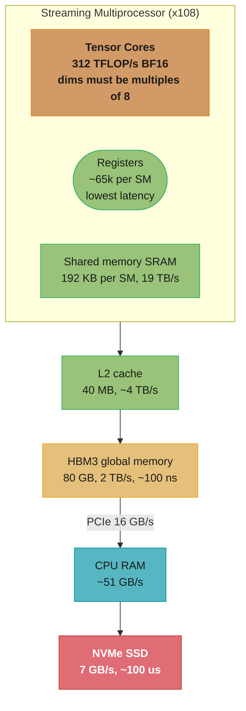
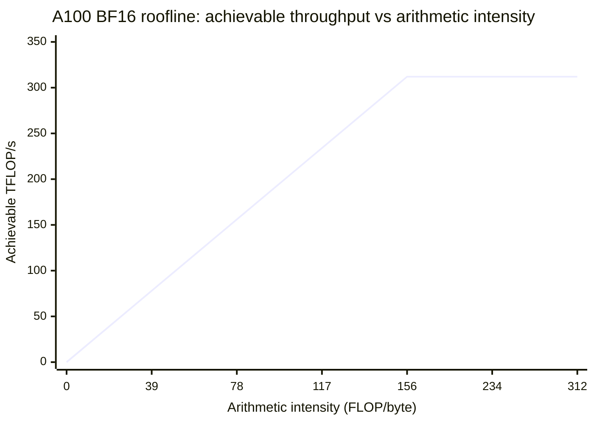
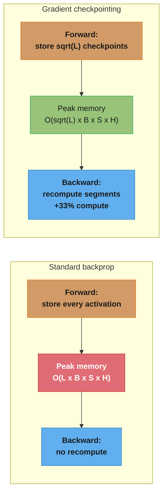
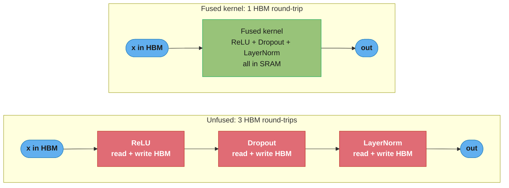
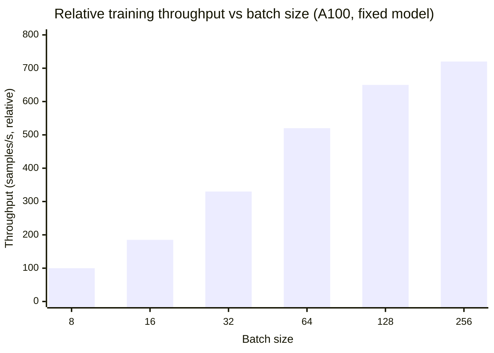

# GPU and Hardware Optimization for ML

## 1. Concept Overview

GPU hardware optimization for ML is the practice of understanding, measuring, and improving the utilization of GPU compute and memory resources during training and inference. It encompasses: selecting the right hardware for the workload, profiling to identify bottlenecks, optimizing memory usage (gradient checkpointing, mixed precision, in-place ops), maximizing data throughput to the GPU (DataLoader tuning), and leveraging hardware-level optimizations (kernel fusion, Flash Attention, Tensor Cores).

The central tension in GPU ML workloads is compute-bound vs memory-bound:

- **Compute-bound**: the GPU's arithmetic units (CUDA cores, Tensor Cores) are the bottleneck — the GPU is doing math as fast as it can. Large matrix multiplications (large batch × large hidden dim) are compute-bound. More FLOP/s means faster training.
- **Memory-bound**: the GPU's memory bandwidth (HBM) is the bottleneck — the GPU is waiting for data to arrive from memory. Small batch sizes, elementwise operations (ReLU, layer norm, dropout), and embedding lookups are memory-bound. More GB/s means faster training.

Understanding which regime a given operation is in determines the correct optimization strategy. Profiling tools (torch.profiler, NVIDIA Nsight Systems) make this measurement concrete.

---

## 2. Intuition

One-line analogy: a GPU is a factory with thousands of workers (CUDA cores) but a narrow loading dock (memory bandwidth) — if deliveries cannot keep up with workers' consumption, workers sit idle waiting, regardless of how many workers are hired.

Mental model: think of memory bandwidth as a highway and compute as a city. Most ML operations are "highway-limited" — the workers (CUDA cores) are faster than the supply chain (HBM bandwidth). Kernel fusion is the optimization of combining multiple city stops into one highway trip: instead of reading data from HBM three times for ReLU + dropout + layer norm, fuse them into a single kernel that reads once, does all three operations, and writes once.

Why it matters: an A100 GPU costs ~$10,000 and ~$2-3/hour on cloud. A model training with 40% GPU utilization (the rest spent waiting for data or doing unnecessary memory transfers) is spending 60% of compute budget on waste. Optimization is equivalent to getting free hardware.

Key insight: the roofline model tells you which optimizations matter. Plot a model's arithmetic intensity (FLOP / bytes transferred) against a line joining peak compute and peak bandwidth — if the operation falls below the line, it is memory-bound and only bandwidth improvements help; above the line, it is compute-bound and only FLOP/s improvements help. Most LLM operations during inference are memory-bound.

---

## 3. Core Principles

**Profile before optimizing**: never guess which operation is slow. torch.profiler gives per-operator timing; nvtx markers enable function-level annotations in Nsight Systems. The slowest 10% of operations typically account for 80% of the wasted time.

**Memory hierarchy awareness**: understand the latency and bandwidth of each tier — registers (< 1 ns, effectively infinite bandwidth), shared memory (SRAM, ~1 ns, 19 TB/s on A100), L2 cache (40 MB, ~5 ns, ~4 TB/s), HBM (80 GB, ~100 ns, 2 TB/s), CPU RAM (~100 ns, 51 GB/s PCIe), NVMe SSD (~100 µs, 7 GB/s). Operations should maximize time in fast memory.

**Tensor Core utilization**: Tensor Cores on A100 perform 4x4 matrix multiplications in one cycle, achieving 312 TFLOP/s in BF16 vs 19.5 TFLOP/s for CUDA cores in FP32. To use Tensor Cores: (1) use BF16/FP16 precision; (2) ensure matrix dimensions are multiples of 8 (for BF16) or 16 (for INT8) — misaligned dimensions fall back to CUDA cores.

**Minimize host-device transfers**: copying data between CPU RAM and GPU VRAM is extremely slow (~16 GB/s for PCIe 4.0 vs 2,000 GB/s for HBM). Move data to GPU once and keep it there; use pin_memory=True to enable DMA transfers that bypass the CPU.

**Batch size sensitivity**: larger batches increase arithmetic intensity (more work per memory access) and improve Tensor Core utilization. Training on batch_size=8 vs batch_size=256 can be 5-10x slower per sample on the same hardware.

---

## 4. Types / Architectures / Strategies

**Mixed precision training**:
- FP32 (4 bytes): full precision, used for loss accumulation and optimizer state
- FP16 (2 bytes): half precision, fast on all NVIDIA GPUs with Tensor Cores, needs GradScaler
- BF16 (2 bytes): same exponent range as FP32, preferred for LLM training (A100, H100, RTX 30/40 series)
- INT8 (1 byte): for inference only, quantized weights, requires calibration

**Memory optimization techniques**:
- Gradient checkpointing: store activations at N checkpoints, recompute the rest during backward pass; ~33-40% memory reduction, ~33% compute overhead
- Activation offloading: move activations to CPU RAM during forward pass, prefetch back for backward; slower but enables very large models on limited VRAM
- In-place operations: `x.add_(y)` instead of `z = x + y` avoids allocating a new tensor; useful for elementwise ops on large tensors
- Optimizer memory: Adam stores m and v tensors (8 bytes per parameter); SGD with momentum stores 4 bytes per parameter; for 7B parameters, Adam uses 56 GB just for optimizer state

**DataLoader optimization**:
- num_workers: number of CPU processes pre-fetching data; typical value 4-8; too high causes memory pressure and process spawning overhead
- pin_memory=True: allocates data in pinned (non-pageable) CPU memory, enabling async DMA transfers to GPU (15-20% faster transfers)
- prefetch_factor=2: each worker pre-fetches 2 batches ahead of consumption
- persistent_workers=True: worker processes persist between epochs (avoids respawning overhead)

**Kernel fusion**:
- Fused attention (Flash Attention): computes softmax(QK^T)V without materializing the full attention matrix in HBM; reduces memory from O(N^2) to O(N) for sequence length N; 2-4x speedup for attention
- Fused elementwise ops: torch.compile() automatically fuses adjacent elementwise operations (relu + add + layer_norm) into a single CUDA kernel
- Custom CUDA kernels: for operations not covered by PyTorch, write custom CUDA kernels (or use Triton to write them in Python)

**GPU selection**:
- A100 80GB SXM: best for large model training; 312 TFLOP/s BF16, 2 TB/s HBM3, 600 GB/s NVLink; ~$10-12/hr on cloud
- H100 80GB SXM: successor to A100; 989 TFLOP/s BF16 (with sparsity), 3.35 TB/s HBM3, 900 GB/s NVLink; ~$30-35/hr on cloud
- RTX 4090 24GB: best cost/performance for training medium models (<20B with quantization); 330 TFLOP/s BF16, 1 TB/s GDDR6X; ~$2,000 purchase
- T4 16GB: inference workloads; 65 TFLOP/s FP16; very cost-effective for batch inference (~$0.35/hr on AWS)
- L4 24GB: efficient inference + fine-tuning; 121 TFLOP/s BF16; $0.72/hr on GCP
- A10G 24GB: AWS g5 instances; good for inference + LoRA fine-tuning; ~$1-4/hr

---

## 5. Architecture Diagrams

**A100 memory hierarchy — bandwidth drops ~1000x from on-chip SRAM to PCIe**



Every optimization aims to keep data in the fast tiers: shared-memory SRAM moves
data ~10x faster than HBM and ~1000x faster than the PCIe link to CPU RAM, so a
host-device copy costs as much as thousands of on-chip operations.

**A100 BF16 roofline — which side of the ridge an operation sits on**



The sloped part is the 2 TB/s memory-bandwidth bound; the flat part is the 312
TFLOP/s compute roof. Left of the ridge (~156 FLOP/byte) ops are memory-bound —
ReLU, LayerNorm, softmax, and most LLM decoding — so only bandwidth (kernel
fusion) helps; right of it, large matmuls are compute-bound and only more FLOP/s
(Tensor Core alignment) helps.

**Gradient checkpointing tradeoff — trade ~33% compute for a smaller memory peak**



Standard backprop keeps every layer's activations in HBM (red peak); checkpointing
keeps only ~sqrt(L) checkpoints and recomputes the rest during the backward pass,
shrinking activation memory to O(sqrt(L)) at the cost of one extra partial forward.
Worth it whenever memory, not compute, caps the batch size.

**Kernel fusion — collapse three HBM round-trips into one**



Each unfused elementwise op reads its input from HBM and writes its output back —
three full round-trips for three ops. `torch.compile()` (and Flash Attention for
attention) fuses them into a single kernel that reads once, does all the math in
SRAM, and writes once, which is the entire win for memory-bound ops.

**Throughput vs batch size — arithmetic intensity climbs, then the GPU saturates**



Small batches are memory-bound and under-utilize Tensor Cores, so per-sample
throughput is poor; larger batches raise arithmetic intensity (more work per memory
access) and climb steeply — batch 256 is roughly 7x faster per sample than batch 8
here — until the GPU becomes compute-bound and the curve plateaus.

---

## 6. How It Works — Detailed Mechanics

### torch.profiler — Identifying Bottlenecks

```python
import torch
import torch.nn as nn
from torch.profiler import profile, record_function, ProfilerActivity, schedule
from pathlib import Path
from typing import Optional


def profile_training_step(
    model: nn.Module,
    inputs: torch.Tensor,
    labels: torch.Tensor,
    optimizer: torch.optim.Optimizer,
    criterion: nn.Module,
    output_dir: str = "/tmp/profiler_output",
    warmup_steps: int = 1,
    active_steps: int = 3,
) -> None:
    """
    Profile training steps with torch.profiler.
    Exports trace to Chrome trace format for visualization in chrome://tracing
    or in the PyTorch Profiler TensorBoard plugin.
    """
    Path(output_dir).mkdir(parents=True, exist_ok=True)

    with profile(
        activities=[
            ProfilerActivity.CPU,
            ProfilerActivity.CUDA,
        ],
        schedule=schedule(
            wait=0,          # steps to skip before starting
            warmup=warmup_steps,   # steps to warm up (records but discards)
            active=active_steps,   # steps to actively profile
            repeat=1,
        ),
        on_trace_ready=torch.profiler.tensorboard_trace_handler(output_dir),
        record_shapes=True,           # record tensor shapes (adds overhead)
        with_stack=True,              # record Python call stacks
        profile_memory=True,          # track memory allocations/frees
        with_flops=True,              # estimate FLOP counts per op
    ) as prof:

        for step in range(warmup_steps + active_steps):
            with record_function("forward_pass"):
                outputs = model(inputs)
                loss = criterion(outputs, labels)

            with record_function("backward_pass"):
                optimizer.zero_grad()
                loss.backward()

            with record_function("optimizer_step"):
                optimizer.step()

            prof.step()  # signal profiler to advance schedule

    # Print top 10 operations by CUDA time
    print(prof.key_averages().table(
        sort_by="cuda_time_total",
        row_limit=10,
    ))
    # Look for: operations with high self_cuda_time_total = hot spots
    # Look for: aten::copy_ with large size = host-device transfer
    # Look for: cudaStreamSynchronize = blocking sync (should be rare)


def benchmark_dataloader(
    dataloader: torch.utils.data.DataLoader,
    n_batches: int = 50,
) -> dict[str, float]:
    """
    Benchmark DataLoader throughput.
    Compare with GPU training time to determine if DataLoader is the bottleneck.
    """
    import time

    start = time.perf_counter()
    samples_loaded = 0

    for i, (inputs, labels) in enumerate(dataloader):
        if i >= n_batches:
            break
        samples_loaded += inputs.shape[0]
        # Simulate GPU transfer
        _ = inputs.cuda(non_blocking=True)

    elapsed = time.perf_counter() - start
    return {
        "samples_per_second": samples_loaded / elapsed,
        "batches_per_second": n_batches / elapsed,
        "elapsed_seconds": elapsed,
    }
```

### Memory Optimization Techniques

```python
import torch
import torch.nn as nn
from torch.utils.checkpoint import checkpoint
from contextlib import contextmanager
from typing import Callable


class GradientCheckpointedTransformerBlock(nn.Module):
    """
    Transformer block with gradient checkpointing.
    Reduces activation memory from O(layers * seq * hidden) to O(sqrt(layers) * seq * hidden).
    Adds ~33% compute overhead (one extra forward pass per block during backward).
    """

    def __init__(self, hidden_dim: int, num_heads: int, use_checkpoint: bool = True):
        super().__init__()
        self.attention = nn.MultiheadAttention(hidden_dim, num_heads, batch_first=True)
        self.ffn = nn.Sequential(
            nn.Linear(hidden_dim, 4 * hidden_dim),
            nn.GELU(),
            nn.Linear(4 * hidden_dim, hidden_dim),
        )
        self.norm1 = nn.LayerNorm(hidden_dim)
        self.norm2 = nn.LayerNorm(hidden_dim)
        self.use_checkpoint = use_checkpoint

    def _forward(self, x: torch.Tensor) -> torch.Tensor:
        # Attention with residual
        attn_out, _ = self.attention(x, x, x)
        x = self.norm1(x + attn_out)
        # FFN with residual
        ffn_out = self.ffn(x)
        x = self.norm2(x + ffn_out)
        return x

    def forward(self, x: torch.Tensor) -> torch.Tensor:
        if self.use_checkpoint and x.requires_grad:
            # checkpoint: does NOT store intermediate activations
            # recomputes them during backward pass from the saved input x
            return checkpoint(self._forward, x, use_reentrant=False)
        return self._forward(x)


def estimate_model_memory(
    param_count: int,
    precision: str = "bf16",
    with_optimizer: bool = True,
    optimizer_type: str = "adam",
) -> dict[str, float]:
    """
    Estimate GPU memory requirements for a model.
    Returns memory in GB for each component.
    """
    bytes_per_param = {"fp32": 4, "fp16": 2, "bf16": 2, "int8": 1}[precision]
    optimizer_bytes = {
        "adam": 8,    # m (fp32) + v (fp32) = 8 bytes per param
        "adamw": 8,   # same as adam
        "sgd": 4,     # momentum (fp32) = 4 bytes per param
        "sgd_no_momentum": 0,
    }.get(optimizer_type, 8)

    params_gb = (param_count * bytes_per_param) / 1e9
    gradients_gb = (param_count * 4) / 1e9  # gradients always in FP32
    optimizer_gb = (param_count * optimizer_bytes) / 1e9 if with_optimizer else 0.0

    return {
        "parameters_gb": params_gb,
        "gradients_gb": gradients_gb,
        "optimizer_states_gb": optimizer_gb,
        "total_static_gb": params_gb + gradients_gb + optimizer_gb,
        "note": "Add activation memory (depends on batch size, sequence length, architecture)",
    }


def optimized_dataloader(
    dataset: torch.utils.data.Dataset,
    batch_size: int,
    is_training: bool = True,
) -> torch.utils.data.DataLoader:
    """
    DataLoader with optimized settings for GPU training.
    """
    import multiprocessing

    # num_workers: rule of thumb = 4 per GPU
    # Too high: process spawning overhead, memory pressure, OS scheduling latency
    # Too low: CPU becomes the bottleneck (data prep slower than GPU training)
    n_workers = min(4, multiprocessing.cpu_count() // 2)

    return torch.utils.data.DataLoader(
        dataset,
        batch_size=batch_size,
        shuffle=is_training,
        num_workers=n_workers,
        # pin_memory: allocate data in pinned (non-pageable) CPU memory
        # Enables DMA (Direct Memory Access) transfers to GPU, bypassing CPU copy
        # 15-20% faster GPU transfers; uses more CPU RAM
        pin_memory=True,
        # prefetch_factor: each worker pre-fetches this many batches ahead
        # Default is 2; increase if GPU utilization drops between batches
        prefetch_factor=2,
        # persistent_workers: keep worker processes alive between epochs
        # Avoids process spawn/teardown overhead per epoch (~0.5-2s per epoch)
        persistent_workers=(n_workers > 0),
        # drop_last: drop incomplete final batch (prevents varying batch size)
        # Important for distributed training (all ranks must have same batch size)
        drop_last=is_training,
    )


def mixed_precision_context(precision: str = "bf16"):
    """
    Return appropriate autocast context for the given precision.
    """
    dtype_map = {
        "bf16": torch.bfloat16,
        "fp16": torch.float16,
        "fp32": None,  # no autocast
    }
    dtype = dtype_map[precision]
    if dtype is None:
        import contextlib
        return contextlib.nullcontext()
    return torch.autocast(device_type="cuda", dtype=dtype)


def measure_gpu_memory(model: nn.Module, inputs: torch.Tensor) -> dict[str, float]:
    """
    Measure peak GPU memory usage during a forward pass.
    Use before and after adding optimizations to quantify improvements.
    """
    torch.cuda.reset_peak_memory_stats()
    torch.cuda.synchronize()

    with torch.no_grad():
        _ = model(inputs)

    torch.cuda.synchronize()
    peak_mb = torch.cuda.max_memory_allocated() / 1e6
    reserved_mb = torch.cuda.max_memory_reserved() / 1e6

    return {
        "peak_allocated_mb": peak_mb,
        "peak_reserved_mb": reserved_mb,
        "peak_allocated_gb": peak_mb / 1024,
    }


# BROKEN: common mistake — unnecessary memory allocation
def broken_relu_chain(x: torch.Tensor) -> torch.Tensor:
    x = torch.relu(x)      # allocates new tensor
    x = x + 1.0            # allocates new tensor
    x = x * 2.0            # allocates new tensor
    return x


# FIX: in-place operations where safe (no autograd through in-place on leaf)
def fixed_relu_chain(x: torch.Tensor) -> torch.Tensor:
    # torch.compile() will fuse these automatically in PyTorch 2.0+
    # For manual control:
    x = torch.relu(x)
    x.add_(1.0)    # in-place: no new allocation
    x.mul_(2.0)    # in-place: no new allocation
    return x
```

### GPU Utilization Monitoring

```python
import subprocess
import json
from dataclasses import dataclass


@dataclass
class GpuStats:
    gpu_id: int
    utilization_pct: float       # compute utilization
    memory_used_mb: float
    memory_total_mb: float
    temperature_c: float
    power_draw_w: float
    sm_clock_mhz: float


def get_gpu_stats() -> list[GpuStats]:
    """
    Query nvidia-smi for per-GPU statistics.
    Use in training loops to detect utilization drops.
    """
    cmd = [
        "nvidia-smi",
        "--query-gpu=index,utilization.gpu,memory.used,memory.total,"
        "temperature.gpu,power.draw,clocks.sm",
        "--format=csv,noheader,nounits",
    ]
    output = subprocess.check_output(cmd).decode()
    stats = []
    for line in output.strip().split("\n"):
        parts = [p.strip() for p in line.split(",")]
        stats.append(GpuStats(
            gpu_id=int(parts[0]),
            utilization_pct=float(parts[1]),
            memory_used_mb=float(parts[2]),
            memory_total_mb=float(parts[3]),
            temperature_c=float(parts[4]),
            power_draw_w=float(parts[5].replace("W", "").strip()),
            sm_clock_mhz=float(parts[6]),
        ))
    return stats
```

---

## 7. Real-World Examples

**Flash Attention (Stanford HAI / Tri Dao)**: kernel fusion applied to the attention mechanism. Standard attention materializes the N×N attention matrix in HBM (O(N^2) memory). Flash Attention fuses the QK^T matmul + softmax + dropout + V matmul into a single tiled CUDA kernel that operates entirely in shared memory (SRAM). Result: 2-4x faster attention, O(N) HBM memory instead of O(N^2), enables 10x longer context windows. Every major LLM training framework (PyTorch 2.0+, HuggingFace, vLLM) uses Flash Attention by default.

**torch.compile (PyTorch 2.0)**: compiles a Python-defined neural network into an optimized computation graph using TorchDynamo (bytecode capture) + TorchInductor (code generation). Automatically fuses elementwise ops, eliminates redundant memory allocations, and generates optimized CUDA/Triton kernels. Provides 15-30% training speedup and up to 2x inference speedup on typical transformer models with `model = torch.compile(model)`.

**NVIDIA A100 Tensor Core alignment**: a team observed that their custom attention variant ran at 60 TFLOP/s (19% of A100's BF16 peak) instead of expected 140 TFLOP/s. Profiling showed the weight matrices were (768, 500) — 500 is not a multiple of 8 (Tensor Core alignment requirement for BF16). Padding to (768, 512) increased throughput to 145 TFLOP/s. Rule: all matrix dimensions must be multiples of 8 for BF16, multiples of 16 for INT8.

**Google's TPU vs GPU decision**: TPUs use systolic arrays optimized for dense matrix multiplications with minimal flexibility. GPUs are general-purpose but programmable. Google trains LLMs on TPU pods (v4: 4,096 chips, 1.1 exaFLOP/s) for cost reasons; inference migrates to GPUs where dynamic batching and speculative decoding require flexible control flow that TPUs handle poorly.

---

## 8. Tradeoffs

| GPU | VRAM | BF16 TFLOP/s | HBM Bandwidth | NVLink | Cloud Cost/hr | Best For |
|---|---|---|---|---|---|---|
| A100 80GB SXM | 80 GB | 312 | 2 TB/s | 600 GB/s | ~$10-12 | Large model training |
| H100 80GB SXM | 80 GB | 989* | 3.35 TB/s | 900 GB/s | ~$30-35 | Cutting-edge training |
| RTX 4090 24GB | 24 GB | 330* | 1 TB/s | None (PCIe) | ~$1.5 | Medium model training |
| L4 24GB | 24 GB | 121 | 300 GB/s | None | ~$0.72 | Inference + fine-tuning |
| T4 16GB | 16 GB | 65 | 300 GB/s | None | ~$0.35 | Batch inference |
| A10G 24GB | 24 GB | 125 | 600 GB/s | None | ~$1-4 | Inference + LoRA |

*with sparsity / structured sparsity enabled

| Memory Technique | Memory Savings | Compute Overhead | Implementation Effort |
|---|---|---|---|
| BF16 mixed precision | 2x vs FP32 | None (faster) | 1 line (autocast) |
| Gradient checkpointing | 33-40% activation | 33% recompute | Low (wrap blocks) |
| Activation offloading | 50-80% activation | Significant (PCIe) | Medium |
| FSDP parameter sharding | ~1/N params | AllGather overhead | High |
| Gradient accumulation | N/A (batch tuning) | None | Low |

---

## 9. When to Use / When NOT to Use

**Use gradient checkpointing when**: activations are the memory bottleneck (not parameters or optimizer), increasing batch size would improve training stability or throughput, or training very deep networks (>64 layers) where activation memory dominates.

**Use BF16/mixed precision when**: hardware supports it (A100, H100, RTX 30/40, TPU v3+); always — there is no good reason to train in FP32 on modern hardware. The only exception is operations that need FP32 precision (loss accumulation, which autocast handles automatically).

**Use pin_memory=True when**: training on GPU and DataLoader is the bottleneck (GPU utilization < 80% but CPU is at 100%). Do not use when: training on CPU, using shared memory datasets (pin_memory is incompatible with shared memory tensors).

**Use num_workers > 0 when**: data preprocessing is non-trivial (image decoding, augmentation). Set to 0 for: debugging (worker crashes are opaque), very fast datasets that fit in RAM, or Windows (multiprocessing has significant overhead on Windows).

**Do NOT use in-place operations in the backward graph**: `x.relu_()` on a tensor that requires grad causes autograd to fail because the original value (needed for gradient computation) is overwritten. In-place ops are safe only on leaf tensors or tensors not in the computation graph.

**Do NOT increase num_workers beyond 8 on a single machine**: each worker is a separate process with its own memory (including a copy of the dataset if not memory-mapped). 16 workers can use 2x the RAM of 8 workers with diminishing throughput returns. Profile first.

---

## 10. Common Pitfalls

**Pitfall 1 — DataLoader as the training bottleneck (undetected)**
Production incident: a team training an image classification model saw 65% GPU utilization on their A100. They assumed training was CPU-bound but did not measure. They added more GPU servers (doubling hardware cost) without improving throughput. Post-mortem profiling revealed the DataLoader had num_workers=0 (no parallel data loading) — the GPU was waiting for the CPU to decode JPEG images sequentially. Setting num_workers=4, pin_memory=True increased GPU utilization to 94% and training throughput by 1.9x. No additional hardware needed. Fix: always profile DataLoader throughput separately using benchmark_dataloader() before adding hardware.

**Pitfall 2 — Tensor dimension misalignment with Tensor Cores**
A team implemented a custom embedding layer with embedding_dim=500 (chosen to match a feature dimension). Their GPU profiler showed 18 TFLOP/s on the embedding matmul instead of expected 100+ TFLOP/s. Root cause: 500 is not divisible by 8 — BF16 Tensor Cores require all matrix dimensions to be multiples of 8. The operation fell back to CUDA cores. Fix: pad embedding_dim to 512. The team also audited their entire model for odd dimension sizes; changing 5 layers from non-multiples of 8 to the next power of 2 increased overall training throughput by 22%.

**Pitfall 3 — Gradient checkpointing with use_reentrant=True (deprecated behavior)**
A team used `torch.utils.checkpoint.checkpoint(fn, *args)` (default use_reentrant=True) in a model that also used torch.compile. The reentrant checkpoint implementation is incompatible with TorchDynamo's graph capture — the compiler could not trace through the checkpoint boundary and fell back to eager mode, losing all compile benefits. Fix: set use_reentrant=False in checkpoint calls. The non-reentrant implementation is compatible with torch.compile and does not require inputs to have requires_grad=True.

**Pitfall 4 — Pinned memory with multiprocessing causing deadlock**
A team using pin_memory=True and num_workers=8 saw training hang intermittently (~1 in 50 epochs) on Linux. Root cause: pinned memory is allocated from the OS's locked memory pool (ulimit -l). With 8 workers each holding 2 prefetched batches of 256 images at FP32, the team was locking ~12 GB of physical memory. When the system ran other processes simultaneously, the locked memory limit was hit, causing workers to block indefinitely waiting for pin_memory allocation. Fix: reduce num_workers to 4 and prefetch_factor to 1, or increase ulimit -l, or use non-pinned memory and accept the slower GPU transfers.

**Pitfall 5 — CUDA OOM from activation accumulation in eval loops**
A team saw CUDA OOM errors during model evaluation (not training). Root cause: the eval loop was structured as:

```python
# BROKEN
all_outputs = []
for batch in val_loader:
    outputs = model(batch)        # computation graph attached to CUDA tensors
    all_outputs.append(outputs)   # graph tensors accumulate in GPU memory

loss = criterion(torch.cat(all_outputs), labels)  # OOM here
```

The model outputs retained the computation graph (torch.Tensor.grad_fn), preventing memory release. Fix:

```python
# FIXED
all_outputs = []
with torch.no_grad():             # disable autograd graph construction
    for batch in val_loader:
        outputs = model(batch)
        all_outputs.append(outputs.cpu())  # move to CPU immediately
```

`torch.no_grad()` prevents computation graph construction; `.cpu()` immediately frees GPU memory.

---

## 11. Technologies & Tools

| Tool | Purpose |
|---|---|
| torch.profiler | Per-operator CPU/GPU timing, memory profiling, FLOP counting |
| NVIDIA Nsight Systems | System-level GPU profiling with NVTX markers, timeline view |
| NVIDIA Nsight Compute | Kernel-level profiling: occupancy, memory access patterns, FLOP utilization |
| nvtx (NVIDIA Tools Extension) | Annotate Python code regions visible in Nsight Systems |
| torch.compile | JIT compilation with kernel fusion (PyTorch 2.0+) |
| Flash Attention 2 (Tri Dao) | Fused attention kernel, 2-4x faster than standard attention |
| xFormers (Meta) | Memory-efficient attention and transformer primitives |
| Triton (OpenAI) | Python-like DSL for writing GPU kernels without CUDA C++ |
| CUDA (NVIDIA) | GPU computing platform, C++ API for custom kernels |
| cuBLAS | NVIDIA BLAS library for optimized matrix operations |
| cuDNN | NVIDIA deep learning primitives (convolutions, RNNs) |
| TensorRT | NVIDIA inference optimization: graph fusion, INT8 calibration |
| nvidia-smi | Command-line GPU monitoring (utilization, memory, temperature) |
| py3nvml | Python bindings for nvidia-smi queries |
| DeepSpeed | ZeRO optimizer, memory offloading, kernel injection |
| Transformer Engine (NVIDIA) | FP8 training support for H100, automatic mixed precision management |

---

## 12. Interview Questions with Answers

**Q: What is the difference between memory-bound and compute-bound GPU operations?**
A compute-bound operation's runtime is limited by the number of arithmetic operations — the GPU's CUDA or Tensor Cores are fully utilized, and adding memory bandwidth would not help. Examples: large matrix multiplications (GEMM) with large batch sizes, transformer FFN layers with large hidden dimensions. A memory-bound operation's runtime is limited by how fast data can be loaded from HBM — the compute units sit idle waiting for data. Examples: elementwise operations (ReLU, GELU, dropout, layer norm) on any batch size, attention softmax on long sequences, embedding lookups. Identifying which regime an operation falls in (using the roofline model or torch.profiler) determines the correct optimization: for compute-bound ops, increase arithmetic intensity; for memory-bound ops, use kernel fusion to reduce HBM round trips.

**Q: What is Flash Attention and why is it faster than standard scaled dot-product attention?**
Standard attention computes softmax(QK^T/sqrt(d))V by first materializing the full N×N attention score matrix in HBM (N = sequence length). For N=8192 and batch=8, this is 8 × 8192 × 8192 × 2 bytes = 1 GB — a massive HBM read/write. Flash Attention fuses the QK^T matmul, softmax, and V matmul into a single kernel that tiles the computation into blocks that fit in shared memory (SRAM, 19 TB/s). The attention scores are never materialized in HBM. Result: attention memory scales as O(N) instead of O(N^2), and runtime is 2-4x faster because it eliminates 2-3 round trips to HBM. Flash Attention 2 further optimizes work partitioning across warps. Use via `torch.nn.functional.scaled_dot_product_attention()` (PyTorch 2.0+) or the `flash-attn` package.

**Q: What is the roofline model and how do you use it to guide optimization?**
The roofline model plots achievable performance (FLOP/s) against arithmetic intensity (FLOP/byte transferred from memory). Two bounds: (1) peak compute (horizontal roof, e.g., 312 TFLOP/s for A100 BF16), (2) peak memory bandwidth line (sloped roof, e.g., 2 TB/s, meaning at 1 FLOP/byte you are limited to 2 TFLOP/s). The ridge point is where the two lines intersect (~156 FLOP/byte for A100 in BF16). Operations with arithmetic intensity below the ridge are memory-bound — optimizing their FLOP count does nothing; you need to fuse kernels to reduce memory traffic. Operations above the ridge are compute-bound — you need more FLOP/s (larger matrices, Tensor Core alignment). In practice: use torch.profiler's FLOP counts and memory bytes to compute arithmetic intensity per operation, then plot against A100's roofline to see where your model sits.

**Q: How does gradient checkpointing reduce memory usage and what are its costs?**
Standard backpropagation stores all intermediate activations from the forward pass in GPU memory (needed for gradient computation). For a transformer with L layers, batch size B, sequence length S, hidden dimension H, activation memory is approximately O(L × B × S × H). Gradient checkpointing stores only activations at N checkpoint boundaries (typically every sqrt(L) layers) and recomputes the non-checkpointed activations from the nearest checkpoint during the backward pass. Peak activation memory reduces to approximately O(sqrt(L) × B × S × H). Cost: approximately 33% extra compute (one extra forward pass per non-checkpointed segment). For transformers where memory is the binding constraint (training 7B+ models), the trade is almost always worth it.

**Q: Why should matrix dimensions be multiples of 8 (or 16) when using Tensor Cores?**
Tensor Cores perform 4×4 or 8×16 matrix multiplications in a single instruction (the exact tile size varies by architecture: Volta 4×4, Ampere/A100 16×16 for BF16). When a matrix dimension is not a multiple of the Tensor Core tile size, the hardware must pad the matrix to the next multiple internally, wasting cycles on padding computation, or fall back to CUDA cores for the remainder. In practice, non-aligned dimensions can reduce effective TFLOP/s by 50-70%. Rule: make all dimensions (batch size × heads, head dimension, hidden dimension, vocabulary size) multiples of 8 for BF16, multiples of 16 for INT8. Common oversights: embedding dimensions of 100, 300, 500 — change to 128, 320, 512.

**Q: What is the purpose of pin_memory=True in DataLoader and when should you use it?**
Pinned (page-locked) memory is CPU RAM that the OS guarantees will not be swapped to disk. GPU DMA engines can transfer data from pinned memory directly without CPU involvement (zero-copy), enabling asynchronous non-blocking transfers via `.to(device, non_blocking=True)`. Without pinning, a transfer requires the CPU to first copy data to a pinned buffer, then DMA to GPU — double the work. With pin_memory=True and non_blocking=True, the GPU can continue computing on the previous batch while the DMA engine asynchronously loads the next batch, effectively hiding transfer latency. Use when: training on GPU, DataLoader is the bottleneck or GPU utilization is < 90%. Do not use when: training on CPU, the dataset is already memory-mapped (mmap'd) tensors, or system locked memory is constrained.

**Q: What does torch.compile do and how does it accelerate training?**
torch.compile (PyTorch 2.0+) captures the Python computation graph using TorchDynamo (a Python bytecode interpreter that records tensor operations without modifying your code), then compiles it with TorchInductor (a backend that generates optimized CUDA/Triton kernels). Key optimizations: (1) operator fusion — adjacent elementwise ops (GELU + dropout + layer norm) compiled into a single kernel, eliminating intermediate HBM writes; (2) memory planning — eliminates unnecessary tensor allocations; (3) constant folding — precomputes static subgraphs. Usage: `model = torch.compile(model)` — one line. Typical speedups: 15-30% for training transformers, up to 2x for inference. For maximum performance: use `mode="max-autotune"` (tries multiple kernel implementations and picks the fastest via benchmarking), at the cost of a longer compilation step.

**Q: How do you select the number of DataLoader workers and why can too many workers be harmful?**
Rule of thumb: 4 workers per GPU (so 4 workers for single-GPU, 32 workers for 8-GPU). Each worker is a separate Python process with its own memory — including a copy of the dataset object. With num_workers=16 and a dataset that caches 10 GB of preprocessed tensors, peak CPU RAM usage is 160 GB. Beyond 8 workers, throughput improvements are marginal on most systems because: (1) OS scheduling overhead increases with more processes; (2) the disk I/O becomes the bottleneck, not CPU preprocessing; (3) IPC (inter-process communication) overhead for passing batches to the main process increases. Profile with benchmark_dataloader() at num_workers=0, 2, 4, 8 — pick the value where throughput plateaus.

**Q: What is the difference between NVLink and PCIe for multi-GPU communication, and why does it matter for distributed training?**
PCIe 4.0 ×16 provides 32 GB/s unidirectional bandwidth (64 GB/s bidirectional). NVLink 3.0 (A100) provides 600 GB/s bidirectional. For a 7B parameter model (14 GB in BF16), AllReduce of gradients over PCIe takes 14 GB / 32 GB/s = 437 ms per step. Over NVLink: 14 GB / 300 GB/s = 47 ms. At a typical batch step time of 200-500 ms, PCIe AllReduce adds 87-200% overhead; NVLink AllReduce adds only 9-24% overhead. This is why tensor parallelism (which requires AllReduce per layer, every forward and backward pass) is only practical within a node with NVLink — using TP across nodes over InfiniBand is worse than not using TP at all.

**Q: How does gradient accumulation interact with GPU memory and throughput?**
Gradient accumulation runs M forward+backward passes without calling optimizer.step() or zeroing gradients, then applies the accumulated gradient. Memory impact: the model parameters and optimizer states are unchanged; the activation memory is that of a single micro-batch (not the full effective batch). This means you can simulate a 256-sample effective batch with 4 samples per step and 64 accumulation steps — paying only the activation memory of 4 samples. Throughput: gradient accumulation has no overhead vs a single large batch, with one exception — in DDP, each backward pass triggers AllReduce. Use model.no_sync() for accumulation steps to suppress AllReduce on intermediate steps; trigger AllReduce only on the final step.

**Q: What is Model FLOP Utilization (MFU) and what are typical values for LLM training?**
MFU = (measured FLOP/s) / (peak hardware FLOP/s). Measured FLOP/s is estimated as: (6 × param_count × tokens_per_step × n_layers_approximation) / step_time_seconds. For an A100 with BF16 peak 312 TFLOP/s, achieving 125 TFLOP/s effective gives MFU = 40%. Typical values: well-tuned LLM training on A100 achieves 38-45% MFU; poorly tuned (DataLoader bottleneck, sequence padding waste, small batch) can fall below 20%. Values above 50% are exceptional and require aggressive kernel fusion, perfect data loading, and no pipeline bubble. MFU below 30% is a signal to profile and optimize before scaling out horizontally.

**Q: How do you detect and fix GPU memory fragmentation in PyTorch?**
PyTorch's caching allocator maintains a pool of freed tensors to avoid repeated CUDA allocation calls (cudaMalloc is slow, ~1-10 ms). Memory fragmentation occurs when many small tensors are allocated and freed in random order, leaving holes in the memory pool that cannot satisfy larger allocations — a cudaOutOfMemoryError at 70% "reported" memory usage is a classic fragmentation symptom. Detection: `torch.cuda.memory_stats()` shows `"fragmentation"` ratio. Fixes: (1) call `torch.cuda.empty_cache()` to release cached but freed memory back to CUDA (warning: this slows subsequent allocations); (2) use fixed-size tensor allocations across training steps (consistent batch size); (3) set `PYTORCH_CUDA_ALLOC_CONF=expandable_segments:True` (PyTorch 2.1+) — new allocator strategy that handles fragmentation much better by using expandable memory segments.

**Why does BF16 not require loss scaling while FP16 does?**
BF16 keeps FP32's 8-bit exponent range, so small gradients do not underflow the way they do in FP16. FP16 has only 5 exponent bits and overflows above 65,504, which forces GradScaler to multiply the loss up before backward and divide the gradients back down — extra machinery that can still diverge. BF16 trades mantissa bits (7 vs FP16's 10) for that dynamic range, which matters far more for training stability on large models. Use BF16 on Ampere/Hopper/Ada (A100, H100, RTX 30/40); fall back to FP16 only on Volta/Turing (V100, T4) where BF16 hardware is absent.

**Why can in-place operations like x.relu_() break autograd?**
An in-place op overwrites a tensor value that the backward pass still needs, so autograd raises a version-counter error or computes wrong gradients. Many gradients are functions of the layer's output (ReLU's gradient needs the sign of its input/output), and mutating that buffer destroys the information. In-place ops (`add_`, `mul_`, `relu_`) are safe only on leaf tensors or tensors not part of the autograd graph — for example post-processing under `torch.no_grad()`. For training, prefer `torch.compile()`, which fuses the elementwise chain and reclaims the memory without the correctness risk.

**Why does a validation loop OOM when the training loop does not?**
Appending model outputs that still carry their autograd graph accumulates activation memory across every batch, and nothing is ever freed. Each stored `outputs` tensor keeps its `grad_fn`, which pins the whole forward graph in HBM, so a loop that concatenates predictions blows up even though a single training step fits. Wrap evaluation in `torch.no_grad()` (or `inference_mode()`) to stop graph construction, and move results off-GPU immediately with `.cpu()`. This is the single most common eval-time OOM and it never surfaces during training because the graph is discarded each step.

**Why can use_reentrant=True gradient checkpointing silently disable torch.compile?**
The reentrant checkpoint implementation cannot be traced by TorchDynamo, so the compiler hits the checkpoint boundary and falls back to slow eager mode — losing every fusion benefit with no error. It also requires inputs to have `requires_grad=True`, which is easy to violate. Always pass `use_reentrant=False`; the non-reentrant path is compatible with `torch.compile`, does not need the requires_grad hack, and is the documented default going forward. The failure is silent, so verify by checking that compiled speedups actually appear in the profiler.

**How much extra memory does Adam consume versus SGD, and why does it dominate for large models?**
Adam stores two FP32 moment buffers per parameter (8 bytes) versus SGD-momentum's single buffer (4 bytes), so optimizer state alone is 8x the parameter count in bytes. For a 7B-parameter model that is 56 GB just for Adam's m and v tensors — more than the parameters (14 GB in BF16) and gradients (28 GB in FP32) combined. This is why full fine-tuning of large models needs sharding (FSDP/ZeRO) or 8-bit optimizers (bitsandbytes), which quantize the moments and cut optimizer memory ~4x. Always budget optimizer state, not just weights, when sizing a GPU.

**How do you confirm the DataLoader is the training bottleneck rather than the GPU?**
If GPU utilization sits below 80% while a CPU core is pegged at 100%, the data pipeline — not the GPU — is the limit. Do not guess: benchmark the loader in isolation (iterate N batches, measure samples/sec) and compare against the GPU's step time; if the loader is slower, the GPU is starving between batches. The fix is parallel prefetch (`num_workers=4`, `pin_memory=True`, `persistent_workers=True`, `prefetch_factor=2`) plus `non_blocking=True` transfers, which routinely lifts utilization from ~65% to >90% with zero extra hardware. Adding GPUs before checking this just doubles the cost of a CPU-bound job.

---

## 13. Best Practices

- Profile before optimizing — run torch.profiler for 3-5 training steps before making any changes; bottlenecks are almost never where intuition says they are
- Use BF16 mixed precision on all A100/H100/RTX 30/40 series hardware — the performance gain (2x memory, 4-8x compute for matmuls via Tensor Cores) has no correctness cost with autocast
- Ensure all matrix dimensions are multiples of 8 for BF16, 16 for INT8 — misalignment silently disables Tensor Cores and cuts throughput by 50-70%
- Set DataLoader num_workers=4, pin_memory=True, persistent_workers=True, prefetch_factor=2 as the default starting point; profile to validate GPU utilization is >90% before tuning further
- Apply torch.compile to the model and training step: `model = torch.compile(model)` provides 15-30% speedup with zero code change on PyTorch 2.0+; use mode="reduce-overhead" for training and mode="max-autotune" for inference serving
- Enable gradient checkpointing for transformer models with more than 24 layers — the 33% compute overhead is almost always cheaper than the VRAM cost of buying more GPU capacity
- Monitor GPU utilization per step with nvidia-smi dmon or W&B system metrics — a utilization dip between batches indicates DataLoader bottleneck; a utilization dip within a step indicates memory allocation or synchronization overhead
- Use non_blocking=True for all host-to-device transfers: `.to(device, non_blocking=True)` enables async DMA when combined with pin_memory=True, overlapping data transfer with GPU computation
- Clear unused tensors explicitly in long validation loops with del tensor; torch.cuda.empty_cache() — PyTorch's reference-counted allocator does not always release memory as quickly as expected in complex validation loops

---

## 14. Case Study

**Scenario: Raising a transformer training job from 35% to 58% MFU on 8x A100 80GB.** A team's pretraining run was GPU-starved. PyTorch Profiler showed the GPUs idle 40% of the time waiting on the CPU data pipeline, plus wasted time in attention and the optimizer. A sequence of targeted fixes, prefetching, Flash Attention 2, torch.compile, and gradient checkpointing, delivered 1.66x end-to-end throughput and enabled a 30% larger batch.

```
profiler breakdown (before):
  data loading (CPU)   ####################  40%  <- GPU idle
  attention             ############          25%
  optimizer step        #######               15%
  compute (useful)      ##########            20%

fixes:
  prefetch (num_workers=8, pin_memory) ---> overlap load with compute
  Flash Attention 2                    ---> fused, memory-efficient attn
  torch.compile                        ---> kernel fusion, less overhead
  gradient checkpointing               ---> 30% mem -> bigger batch
  bf16 mixed precision                 ---> halve optimizer-state memory

result: 35% MFU -> 58% MFU, 1.66x throughput, +30% batch size
```

The single biggest win was eliminating the CPU data-loading stall; the rest came from fusing attention and reducing memory pressure so a larger, more efficient batch fit.

**Overlapping data loading with compute:**

```python
from torch.utils.data import DataLoader

def fast_loader(dataset, batch_size: int) -> DataLoader:
    return DataLoader(
        dataset,
        batch_size=batch_size,
        num_workers=8,          # parallel CPU workers prefetch batches
        pin_memory=True,        # pinned host memory -> faster H2D copy
        prefetch_factor=4,      # each worker stages 4 batches ahead
        persistent_workers=True,
    )
```

**torch.compile + bf16 autocast training step:**

```python
import torch

def build(model: torch.nn.Module) -> torch.nn.Module:
    return torch.compile(model, mode="max-autotune")   # fuse + autotune kernels

def step(model, batch, optimizer, scaler) -> torch.Tensor:
    optimizer.zero_grad(set_to_none=True)
    with torch.autocast("cuda", dtype=torch.bfloat16):  # bf16 mixed precision
        loss = model(batch["input_ids"], labels=batch["labels"]).loss
    loss.backward()
    torch.nn.utils.clip_grad_norm_(model.parameters(), 1.0)
    optimizer.step()
    return loss
```

**Gradient checkpointing to trade compute for memory:**

```python
import torch

def enable_checkpointing(model: torch.nn.Module) -> None:
    # recompute activations in backward instead of storing them: ~30% less
    # activation memory at ~25% extra compute -> enables a larger batch.
    if hasattr(model, "gradient_checkpointing_enable"):
        model.gradient_checkpointing_enable()
```

**Pitfall 1 — CPU data-loading bottleneck.** With a single-threaded loader the GPU sits idle 40% of the time waiting for the next batch.

```python
# BROKEN: synchronous loading on the main process -> GPU starves
loader = DataLoader(dataset, batch_size=32)   # num_workers=0

# FIX: parallel workers + pinned memory + prefetch so the next batch is ready
# before the GPU finishes the current one (see fast_loader).
loader = fast_loader(dataset, batch_size=32)
```

**Pitfall 2 — Storing all activations causes OOM.** Holding activations for the full forward pass at a large batch overflows GPU memory.

```python
# BROKEN: full activation cache -> OOM at the batch size you want
loss = model(x).loss   # every activation kept for backward

# FIX: gradient checkpointing recomputes activations in the backward pass,
# cutting activation memory ~30% so a bigger batch fits.
enable_checkpointing(model)
```

**Pitfall 3 — fp32 optimizer states triple memory.** Adam in fp32 stores master weights plus two moments at full precision, consuming about 3x the model size and crowding out batch capacity.

```python
# BROKEN: fp32 everywhere -> optimizer states dominate memory
optimizer = torch.optim.AdamW(model.parameters())   # fp32 states

# FIX: bf16 mixed precision (and 8-bit optimizers where appropriate) shrink
# the optimizer-state footprint, freeing memory for a larger batch.
with torch.autocast("cuda", dtype=torch.bfloat16):
    loss = model(x).loss
```

**Interview Q&A:**

**What is MFU and how do you raise it?** Model FLOPs Utilization is achieved useful FLOPs over hardware peak FLOPs. It drops when the GPU stalls on data loading, communication, or memory, or wastes work on unfused kernels. You raise it by removing those stalls: overlap data loading, fuse kernels (torch.compile, Flash Attention), use efficient precision, and increase the compute-to-overhead ratio with a larger batch.

**Why is data loading such a common bottleneck and how do you confirm it?** GPUs are far faster than a single CPU thread doing decode/augment/collate, so without parallel prefetch the GPU waits. Confirm with the PyTorch Profiler: a large gap between kernels or high time in the dataloader indicates starvation. The fix is more workers, pinned memory, prefetch_factor, and moving heavy preprocessing off the hot path.

**What does gradient checkpointing trade, and when is it worth it?** It trades compute for memory: instead of storing activations for the backward pass, it recomputes them, saving roughly 30% activation memory at about 25% extra compute. It is worth it when memory, not compute, caps your batch size; the larger batch often more than recovers the throughput lost to recomputation.

**Why does Flash Attention improve both speed and memory?** Standard attention materializes the full N x N attention matrix in memory (O(N^2)) and is bandwidth-bound. Flash Attention tiles the computation and never materializes the full matrix, fusing softmax and the matmuls in SRAM. This reduces memory to O(N) and cuts HBM traffic, giving large speedups especially at long sequence lengths.

**Why bf16 over fp16 for training, and what does it save?** bf16 keeps fp32's exponent range, avoiding the overflow/underflow that forces fp16 to use loss scaling, so it is more stable for large models. In mixed precision it halves activation and optimizer-state memory versus fp32, freeing room for larger batches, while modern GPUs run bf16 matmuls on tensor cores at high throughput.

**What does torch.compile do and what are its caveats?** It traces the model into a graph and applies fusion, layout optimization, and autotuned kernels via a backend (Inductor), reducing Python overhead and kernel-launch counts. Caveats: a one-time compilation cost, recompilation on shape changes (use static shapes or padding), and occasional graph breaks on unsupported ops that you should profile and remove.

**Pitfall — CUDA stream synchronization missing causes silent data races.**

```python
# BROKEN: two CUDA streams write to overlapping memory regions without sync
import torch

stream_a = torch.cuda.Stream()
stream_b = torch.cuda.Stream()

with torch.cuda.stream(stream_a):
    result_a = model_a(input_a)   # writes to shared GPU buffer

with torch.cuda.stream(stream_b):
    result_b = model_b(input_b)   # reads from same buffer — DATA RACE!

# FIX: synchronize before reading shared state
stream_a.synchronize()   # wait for stream_a to finish
with torch.cuda.stream(stream_b):
    result_b = model_b(result_a)  # safe: result_a is committed
```

**How do you profile GPU utilization to find compute vs memory bottlenecks?** Use `torch.profiler` with `record_shapes=True, profile_memory=True, with_stack=True`. Export to Chrome trace format (`prof.export_chrome_trace("trace.json")`) and look for SM utilization (target > 80% for compute-bound), memory bandwidth utilization (target > 70% for memory-bound), and kernel launch overhead. Alternatively, `nvidia-smi dmon -s puc` samples power/utilization every second. An SM utilization of 30% on a compute-intensive workload indicates excessive kernel launch overhead or poor occupancy — check batch size and tensor shapes.

**What is mixed precision training and when does BF16 outperform FP16?** Mixed precision (AMP) computes forward/backward in half precision (FP16 or BF16) and accumulates gradients in FP32. FP16 has 5 exponent bits and 10 mantissa bits — it overflows for values > 65,504 (requires loss scaling). BF16 has 8 exponent bits and 7 mantissa bits — same dynamic range as FP32, no overflow, no loss scaling needed. BF16 is preferred on Ampere/Ada A100/H100 GPUs and for LLM training where activation magnitudes can be large. Use FP16 only on Volta/Turing (V100, T4) where BF16 hardware support is absent.

**What is GPU memory bandwidth vs. compute throughput, and which limits LLM inference?** Compute throughput (FLOPS) limits matrix-multiply-heavy operations (prefill/prompt processing). Memory bandwidth limits memory-bound operations (token generation: loading KV cache from HBM for each token). An A100 has 312 TFLOPS (BF16) and 2TB/s memory bandwidth. For a 7B model with 4-byte (FP16) weights = 14GB, loading all weights takes 14GB / 2TB/s = 7ms — the minimum per-token generation time regardless of batch size. This is why LLM generation is memory-bandwidth bound and why techniques like speculative decoding and continuous batching matter: they increase arithmetic intensity to better utilize compute.

**What is tensor core utilization and how do matrix dimensions affect it?** Tensor cores on NVIDIA Ampere GPUs operate on 16×16 matrix tiles (FP16/BF16). If the matrix dimensions are not multiples of 16 (and ideally 128 for best efficiency), tensor cores pad to the next multiple, wasting cycles. Practical rule: keep all matrix dimensions (batch size, sequence length, hidden dim) as multiples of 64 or 128. A hidden size of 4097 wastes ~50% of a tensor core tile; hidden size 4096 achieves near-peak utilization. Use `torch.backends.cuda.matmul.allow_tf32 = True` on Ampere to enable TF32 for FP32 matmuls — 10× faster than FP32 with minimal accuracy loss.

**What is gradient checkpointing and what is the compute-memory trade-off?** During backpropagation, PyTorch stores all intermediate activations from the forward pass to compute gradients. For a 7B LLM with sequence length 4k, this can require 80GB+. Gradient checkpointing (`torch.utils.checkpoint.checkpoint_sequential`) discards activations after the forward pass and recomputes them during backward when needed. Memory reduction: O(sqrt(N)) vs. O(N) for N layers (recompute the N/2 discarded activations from the N/2 checkpointed). Compute overhead: ~30% more FLOPS (one extra partial forward pass). The trade-off: pay 30% more compute to train models 5-10× larger than VRAM allows.

---

**Quick-reference comparison table:**

| Approach | When to use | Trade-off |
|---|---|---|
| Rule-based baseline | Always — establish before ML | Interpretable, brittle on edge cases |
| Simple ML (LR, RF) | < 100k rows, tabular, fast iteration | Lower ceiling than deep models |
| Deep learning | Large data, unstructured input (images/text) | Expensive training, needs GPU |
| Ensembling | Final 1-2% accuracy gain in competition | Complexity, inference latency |
| Distillation/quantization | Inference cost reduction | Accuracy-efficiency trade-off |
