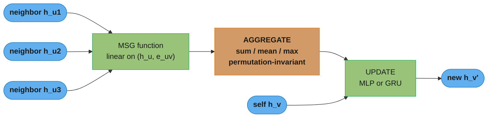
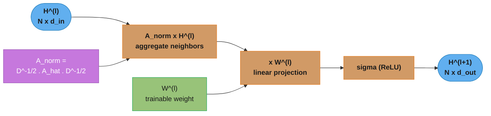
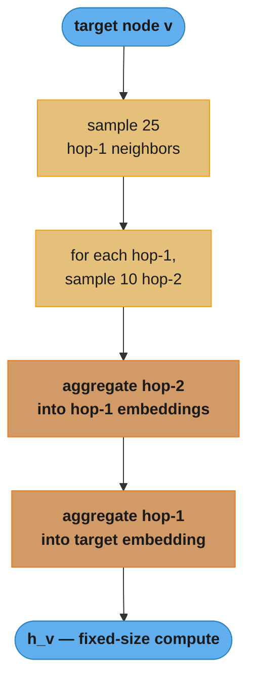
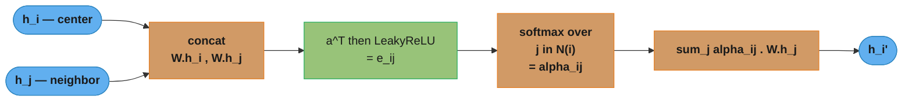
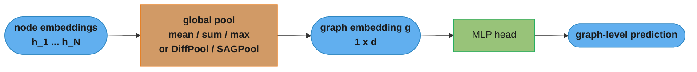

# Graph Neural Networks (GNNs)

## 1. Concept Overview

Graph Neural Networks extend deep learning to graph-structured data, where entities (nodes) have relationships (edges) that carry structural information. Unlike CNNs (fixed grid) or RNNs (fixed sequence), GNNs operate on irregular, variable-size topologies.

Core task: learn a function that maps a graph G = (V, E, X) — vertices, edges, node features — to node embeddings, edge embeddings, or a single graph-level embedding. These embeddings capture both the local neighborhood structure and the feature content of each node.

Applications span molecule property prediction, social network analysis, recommendation systems, fraud detection, knowledge graph completion, and traffic forecasting.

---

## 2. Intuition

One-line analogy: a GNN is a rumor-spreading machine — each node collects messages from its neighbors, updates its belief, and repeats for L rounds. After L rounds, each node's embedding reflects its L-hop neighborhood.

Mental model: think of node classification as a semi-supervised label propagation. Labels spread across edges weighted by structural similarity. GNNs learn to propagate feature information in a task-specific, differentiable way rather than using a fixed Laplacian.

Why it matters: most real-world data is relational. Tabular ML ignores structure; GNNs exploit it. A transaction node connected to 50 known-fraud nodes is itself suspicious — a GNN captures this; a feedforward network on transaction features alone cannot.

Key insight: the message-passing framework unifies GCN, GraphSAGE, GAT, and GIN under one abstraction. Understanding that abstraction unlocks the entire field.

---

## 3. Core Principles

**Message Passing Neural Networks (MPNN):** the unifying framework. Each layer performs:

```
m_v^(l) = AGGREGATE({MSG(h_u^(l-1), h_v^(l-1), e_uv) : u in N(v)})
h_v^(l) = UPDATE(h_v^(l-1), m_v^(l))
```

Where MSG is a message function (often a linear transform), AGGREGATE is permutation-invariant (sum, mean, max), and UPDATE is typically an MLP or GRU.

**Read it like this.** "Every node writes a note about itself, mails a copy to each neighbor, then rewrites its own state from the pile of notes it received plus what it already knew."

The two lines are separate on purpose, because they are the only two things a GNN layer ever does. GCN, GraphSAGE, GAT and GIN differ only in which MSG and which AGGREGATE they plug in — the skeleton never changes, which is exactly the claim made in the Key insight above.

| Symbol | What it is |
|---|---|
| `h_v^(l)` | Node v's embedding after l rounds. `h_v^(0)` is its raw input feature row from X |
| `N(v)` | Neighbor set of v — every node with an edge to v |
| `MSG(...)` | What u sends to v. Usually just `W h_u`, optionally conditioned on the edge |
| `AGGREGATE` | Pools an unordered bag of messages into one vector. Must be order-blind |
| `m_v^(l)` | The pooled neighborhood summary for v in this round |
| `UPDATE` | Folds that summary back into v's own state. MLP, GRU, or a plain weighted sum |
| `e_uv` | Edge features (bond type, relation, weight) when the graph carries them |
| `{...}` | A multiset, not a set — duplicates count, which is why sum and mean differ |

**Walk one example on a real graph.** Fix a concrete 5-node graph and push it through two GCN-style rounds by hand. Every later formula in this file is decoded against this same graph.

```
  The graph -- undirected, 5 nodes, 5 edges

       1                 edges:  0-1, 0-2, 0-3, 2-3, 3-4
       |
       0 ---- 2          deg:    n0=3  n1=1  n2=2  n3=3  n4=1
       |      |
       3 -----+          with self-loops (A_hat = A + I) the degrees become
       |
       4                 d_hat:  n0=4  n1=2  n2=3  n3=4  n4=2

  Adjacency A                    Input features X  (d_in = 2)

        0  1  2  3  4              x_0 = [2, 0]
    0 [ 0  1  1  1  0 ]            x_1 = [0, 4]
    1 [ 1  0  0  0  0 ]            x_2 = [4, 2]
    2 [ 1  0  0  1  0 ]            x_3 = [1, 1]
    3 [ 1  0  1  0  1 ]            x_4 = [0, 2]
    4 [ 0  0  0  1  0 ]

  Nodes 0 and 3 are the hubs (degree 3). Nodes 1 and 4 are leaves (degree 1).
```

Round one. Set `W` to the identity and skip the ReLU, so nothing but the neighborhood mixing is visible in the numbers:

```
  Layer 1 = A_norm X,  where  A_norm[i][j] = 1 / sqrt(d_hat_i * d_hat_j)
                              for every j in N(i) and for j = i itself

  node 0  (neighbors 1, 2, 3, plus itself; d_hat_0 = 4)

    coefficient to itself : 1/sqrt(4*4) = 0.2500
    coefficient to node 1 : 1/sqrt(4*2) = 0.3536
    coefficient to node 2 : 1/sqrt(4*3) = 0.2887
    coefficient to node 3 : 1/sqrt(4*4) = 0.2500

    h_0^(1) = 0.2500*[2,0] + 0.3536*[0,4] + 0.2887*[4,2] + 0.2500*[1,1]

            = [0.5000, 0.0000]
            + [0.0000, 1.4142]
            + [1.1547, 0.5774]
            + [0.2500, 0.2500]
            -------------------
            = [1.9047, 2.2416]

  node 1  (a leaf -- its only neighbor is node 0; d_hat_1 = 2)

    h_1^(1) = 1/sqrt(2*2) * [0,4]  +  1/sqrt(2*4) * [2,0]
            = 0.5000*[0,4] + 0.3536*[2,0]
            = [0.0000, 2.0000] + [0.7071, 0.0000]
            = [0.7071, 2.0000]

  all five after layer 1

    h_0 = [1.9047, 2.2416]    h_1 = [0.7071, 2.0000]    h_2 = [2.1994, 0.9553]
    h_3 = [1.9047, 1.5345]    h_4 = [0.3536, 1.3536]
```

Round two runs the identical coefficients over the layer-1 vectors:

```
  Layer 2 = A_norm H^(1)

  node 1 again -- it still only touches node 0 directly

    h_1^(2) = 0.5000*[0.7071, 2.0000] + 0.3536*[1.9047, 2.2416]
            = [0.3536, 1.0000] + [0.6734, 0.7925]
            = [1.0270, 1.7925]

  all five after layer 2

    h_0 = [1.8373, 1.9269]    h_1 = [1.0270, 1.7925]    h_2 = [1.8328, 1.4085]
    h_3 = [1.7123, 1.6983]    h_4 = [0.8502, 1.2193]

  Node 1 has no edge to node 2 or node 3. But node 0's layer-1 vector already
  contained them, so node 1's layer-2 vector is a 2-hop summary reached purely
  by relaying. L layers = an L-hop receptive field. That is the whole mechanism.
```

Notice what else happened between the two tables: at layer 0 the five feature rows are wildly different, at layer 1 they already sit in a narrower band, and at layer 2 they are closer still. That drift is over-smoothing, quantified in Section 8.

**Graph representation:** an undirected graph with N nodes is represented as:
- Node feature matrix X of shape (N, d_in)
- Adjacency matrix A of shape (N, N), often sparse
- A_hat = A + I (self-loops added so a node aggregates its own features)
- D = diagonal degree matrix, D_ii = sum_j A_ij

**Permutation invariance:** the output must not depend on the arbitrary ordering of nodes in the adjacency matrix. Aggregation functions (sum, mean, max) are permutation-invariant by construction.

**Inductive vs. transductive:** transductive GNNs (GCN) require the full graph at training time; inductive GNNs (GraphSAGE) sample neighborhoods and generalize to new nodes/graphs.

**Expressivity — Weisfeiler-Leman (WL) test:** standard GNNs are at most as expressive as the 1-WL graph isomorphism test. Two non-isomorphic graphs that fool the WL test also fool standard GNNs. GIN achieves WL-equivalent expressivity; higher-order GNNs (k-WL) go beyond but are expensive.

---

## 4. Types / Architectures / Strategies

| Architecture | Aggregation | Normalization | Inductive | Expressivity | Best For |
|---|---|---|---|---|---|
| GCN | Weighted mean | Symmetric D^(-1/2) A_hat D^(-1/2) | No (full graph) | < WL | Node classification, small graphs |
| GraphSAGE | Mean / Max / LSTM | Row-wise (D^-1 A) | Yes (sampling) | < WL | Large graphs, new nodes |
| GAT | Learned attention | Softmax over neighbors | Yes | < WL | Heterophily, noisy graphs |
| GIN | Sum + MLP | None (epsilon trick) | Yes | = WL | Graph classification, expressivity |
| MPNN | General | Configurable | Yes | <= WL | Molecular property prediction |
| GraphTransformer | Global attention | Layer norm | Yes | > WL | Small graphs, full attention |

**GCN (Kipf & Welling 2017):**
```
H^(l+1) = sigma(D_hat^(-1/2) A_hat D_hat^(-1/2) H^(l) W^(l))
```
Spectral interpretation: this is a localized first-order approximation of spectral graph convolution. The symmetric normalization prevents scale explosion for high-degree nodes.

**What the formula is telling you.** "Average every neighbor's features into your own — but discount each edge by how popular both of its endpoints are — then push the result through one learned matrix and a nonlinearity."

Read entry-by-entry, the whole `D_hat^(-1/2) A_hat D_hat^(-1/2)` sandwich collapses to a single scalar per edge: `1 / sqrt(d_hat_i * d_hat_j)`. That is all the matrix notation is hiding.

| Symbol | What it is |
|---|---|
| `H^(l)` | The `N x d` stack of all node embeddings at layer l. `H^(0) = X` |
| `A_hat = A + I` | Adjacency with self-loops, so a node keeps some of its own signal |
| `D_hat` | Diagonal degree matrix of `A_hat`. `D_hat_ii = d_hat_i` = degree of i plus 1 |
| `D_hat^(-1/2)` | Same diagonal, each entry replaced by `1/sqrt(d_hat_i)` |
| `D_hat^(-1/2) A_hat D_hat^(-1/2)` | The fixed, untrainable mixing matrix. One weight per edge: `1/sqrt(d_hat_i * d_hat_j)` |
| `W^(l)` | The only trainable thing in the layer — a `d_in x d_out` projection, shared by every node |
| `sigma` | Elementwise nonlinearity, ReLU in the reference implementation |

**Why the square root shows up twice.** Each edge gets discounted once for the sender's popularity and once for the receiver's. A message from a well-connected node is worth less because that node shouts at everybody; a message *into* a well-connected node is worth less because that node is already listening to everybody. Row normalization `D^-1 A` only applies the second discount, which is precisely the asymmetry called out in the Section 12 answer on this topic.

**Walk one example — what breaks without it.** Run the same 5-node graph three ways and watch the per-node embedding magnitude `||h||`:

```
                 plain sum A_hat H       symmetric D^-1/2 A_hat D^-1/2 H
  input X        n0 2.00  n1 4.00        n0 2.00   n1 4.00
  after L = 1    n0 9.90  n1 4.47        n0 2.94   n1 2.12
  after L = 2    n0 29.83 n1 14.21       n0 2.66   n1 2.07
  after L = 3    n0 97.95 n1 43.86       n0 2.64   n1 1.96
  after L = 4    n0 320.99 n1 141.77     n0 2.60   n1 1.91
  after L = 8    n0 37967 n1 16504       n0 2.55   n1 1.82

  Unnormalized magnitudes grow ~3.30x per layer. That factor is not arbitrary:
  it is the largest eigenvalue of A_hat for this graph (3.3028). Eight layers
  of it takes a feature of size 2 to roughly 38,000.

  The normalized column stays inside [1.8, 2.9] forever, because the same
  sandwich caps the largest eigenvalue of A_norm at exactly 1.0.
```

The hub-domination half of the story is visible in the layer-1 row. Under plain summation, hub node 0 (degree 3) lands at magnitude 9.90 while leaf node 1 sits at 4.47 — a 2.2x gap created by topology alone, before a single weight is learned. Stack that and any downstream classifier reads "high degree" as the dominant feature and ignores the actual node content; in a fraud graph that means every account that merely transacts a lot looks like every other account that transacts a lot. Symmetric normalization compresses the same gap to 2.94 versus 2.12 (1.4x) and holds it there.

**GraphSAGE (Hamilton 2017):**
Sample k neighbors per node (k=25 for hop-1, k=10 for hop-2 in the original paper). Concat own embedding with aggregated neighbor embedding, then apply linear + nonlinearity. Enables mini-batch training on billion-node graphs.

**In plain terms.** "Do not look at all your neighbors — look at a fixed random sample of them, so the amount of work per node is a constant you choose rather than a number the graph chooses for you."

| Symbol | What it is |
|---|---|
| `k` (fanout) | How many neighbors to sample at one hop. `25` at hop-1, `10` at hop-2 in the paper |
| `L` | Number of layers, which equals the number of hops sampled |
| `k^L` | Worst-case nodes pulled in per seed node — the `O(k^L * d)` in the Section 8 cost table |
| `B` | Mini-batch size (seed nodes per step); `1024` in the training code in Section 6 |
| concat | `[h_v \|\| h_N(v)]` — self and neighborhood kept separate, then projected together |

**Walk the fanout arithmetic.** The product is the entire point:

```
  fanout [25, 10], one seed node

    hop-1 sampled        =  25
    hop-2 sampled        =  25 x 10   =  250
    plus the seed itself =   1
                            ----------------
    subgraph per seed    = 276 nodes, ALWAYS -- independent of graph size

  a full batch: 1024 seeds x 276 = 282,624 nodes touched per step

  add a third layer, fanout [25, 10, 10]
    25  +  250  +  2,500  =  2,775 nodes per seed

  compare against NOT sampling, on graphs of different average degree D

    D    2-hop full (D + D^2)   3-hop full (D + D^2 + D^3)   sampled 3-hop
    10          110                     1,110                    2,775
    50        2,550                   127,550                    2,775
   100       10,100                 1,010,100                    2,775
```

The table shows exactly when sampling starts paying: on a sparse graph (`D = 10`) sampling is *more* work than just taking every neighbor, and the fanout should be lowered or dropped. At `D = 100` the same three layers cost 364x less than the exact computation, and — more importantly — the cost is a constant, so a mini-batch fits in fixed GPU memory no matter how large the graph grows. That constant is what makes the PinSage 3-billion-node graph in Section 7 trainable at all. It is also why GraphSAGE is inductive: nothing in `[25, 10]` refers to a specific node id, so an unseen node gets an embedding the moment it has neighbors.

**GAT (Velickovic 2018):**
```
alpha_ij = softmax_j(LeakyReLU(a^T [W h_i || W h_j]))
h_i^(l+1) = sigma(sum_j alpha_ij W h_j)
```
Multi-head attention (K=8 heads typical) stabilizes training. Concatenate heads in hidden layers, average at final layer.

**Put simply.** "Score how much node i should care about each neighbor j, force those scores to add to 1, then take that weighted average instead of GCN's fixed degree-based one."

GCN's edge weight `1/sqrt(d_hat_i * d_hat_j)` is decided by topology before training starts. GAT's `alpha_ij` is decided by the *features* of the two endpoints, so it is learned and changes per input.

| Symbol | What it is |
|---|---|
| `W h_i` | Neighbor and center both projected into the same space first. Call it `z_i` |
| `[W h_i \|\| W h_j]` | Concatenation of the two projected vectors — a `2d`-long description of the edge |
| `a` | A single learned vector that scores that edge description. Splits into `a_l` and `a_r` |
| `LeakyReLU` | Slope `0.2` for negatives. Keeps a small gradient alive on down-weighted edges |
| `e_ij` | The raw, unnormalized score for edge j -> i |
| `softmax_j` | Normalizes over j in N(i) only, so each node's incoming weights sum to 1 |
| `alpha_ij` | The final attention coefficient. In `[0, 1]`, row sums to exactly 1 |
| `K` | Number of independent heads (8 typical). Concat in hidden layers, average at the output |

**Walk one example.** Node 0 from the graph above, attending over itself and neighbors 1, 2, 3. Take `W = [[1, 0], [0, 2]]` and `a = [a_l ; a_r]` with `a_l = [0.5, 0.5]`, `a_r = [1.0, -1.0]`:

```
  project:   z_j = W h_j

    h_0 = [1.0, 0.5]  ->  z_0 = [1.0, 1.0]
    h_1 = [0.2, 0.9]  ->  z_1 = [0.2, 1.8]
    h_2 = [0.8, 0.2]  ->  z_2 = [0.8, 0.4]
    h_3 = [0.1, 0.1]  ->  z_3 = [0.1, 0.2]

  score:  e_0j = LeakyReLU( a_l . z_0  +  a_r . z_j ),   a_l . z_0 = 1.0 for all j

         a_r . z_j     raw sum        LeakyReLU(0.2)
    j=0     0.0          1.0               1.00
    j=1    -1.6         -0.6              -0.12    <- negative, slope 0.2 kicks in
    j=2     0.4          1.4               1.40
    j=3    -0.1          0.9               0.90

  normalize:  alpha_0j = exp(e_0j) / sum_k exp(e_0k)

    exp(1.00) = 2.7183      alpha_00 = 2.7183 / 10.1200 = 0.2686
    exp(-0.12) = 0.8869     alpha_01 = 0.8869 / 10.1200 = 0.0876
    exp(1.40) = 4.0552      alpha_02 = 4.0552 / 10.1200 = 0.4007
    exp(0.90) = 2.4596      alpha_03 = 2.4596 / 10.1200 = 0.2430
                 -------                                 ------
                 10.1200                                 1.0000

  output:  h_0' = 0.2686*z_0 + 0.0876*z_1 + 0.4007*z_2 + 0.2430*z_3
                = [0.6310, 0.6353]

  what GCN would have done with the SAME neighborhood (d_hat: 4, 2, 3, 4)

    weights  0.2500,  0.3536,  0.2887,  0.2500   <- fixed by degree, sum = 1.1422
    output   [0.5767, 1.0519]
```

Read the two weight rows against each other and the difference is the entire GAT pitch. GCN hands neighbor 1 the *largest* weight (0.3536) purely because it is a low-degree leaf. GAT hands it the *smallest* (0.0876) because its features scored badly, and reallocates that mass to neighbor 2 (0.4007). On a homophilous graph the two mostly agree and GAT buys little; on the heterophilous fraud graphs in Section 8, where a fraudster deliberately attaches to legitimate low-degree accounts, GCN's degree weighting actively amplifies the camouflage while GAT can learn to mute it.

One more contrast worth noting: GAT's coefficients sum to exactly `1.0000` while GCN's sum to `1.1422`. GAT is a true convex average and cannot change a vector's scale; GCN's row sums drift with local degree structure, which is one of the smaller reasons it needs the symmetric sandwich to stay numerically calm.

**GIN (Xu 2019):**
```
h_v^(l+1) = MLP((1 + epsilon) * h_v^(l) + sum_{u in N(v)} h_u^(l))
```
Epsilon is a learnable scalar or fixed to 0. Sum aggregation (not mean/max) is critical for injectivity. Theoretically the most expressive standard GNN.

**The idea behind it.** "Add your neighbors up — do not average them — keep your own vector on a separate, tunable dial, and let an MLP decide what the combination means."

| Symbol | What it is |
|---|---|
| `sum_{u in N(v)}` | Plain summation over neighbors. The count of neighbors survives into the output |
| `(1 + epsilon)` | The dial on the node's own contribution relative to the neighbor pile |
| `epsilon` | Learnable scalar (`train_eps=True` in the Section 6 code) or pinned to `0` |
| `MLP` | A universal approximator applied after aggregation — needed for the injectivity proof |
| injective | Distinct input multisets must produce distinct outputs. Sum is; mean and max are not |

**Walk one example.** Take the graph above with every node carrying the identical one-hot feature `[1, 0]` — the normal situation in a molecular graph where every atom is the same element. Node 0 has 3 neighbors, node 2 has 2:

```
  pre-MLP aggregate, epsilon = 0

    SUM      node 0 : (1+0)*[1,0] + ([1,0]+[1,0]+[1,0]) = [4, 0]
             node 2 : (1+0)*[1,0] + ([1,0]+[1,0])       = [3, 0]
             -> different vectors. Degree survived. Distinguishable.

    MEAN     node 0 : [1,0] + mean([1,0],[1,0],[1,0])   = [2, 0]
             node 2 : [1,0] + mean([1,0],[1,0])         = [2, 0]
             -> IDENTICAL. The 3-vs-2 neighbor count was divided away.

    MAX      node 0 : [1,0] + max([1,0],[1,0],[1,0])    = [2, 0]
             node 2 : [1,0] + max([1,0],[1,0])          = [2, 0]
             -> IDENTICAL. Max sees "a [1,0] was present", never how many.
```

No MLP downstream can recover a distinction that was destroyed at aggregation time, which is why the choice of AGGREGATE — not the depth or the width — is what caps a GNN's expressivity at the 1-WL test. This is also the mechanism behind Pitfall 3 in Section 10: the team's 3-ring and 6-ring molecules collapsed to the same embedding for exactly the reason the MEAN row above collapses, and swapping to sum aggregation is the one-line fix.

Why `epsilon` exists: with `epsilon = 0` the node's own vector is just one more term in the sum, indistinguishable from having one extra neighbor that happens to look like you. A learnable `epsilon` lets the model scale self versus neighborhood independently, which is what makes the mapping provably injective over multisets rather than merely usually injective.

---

## 5. Architecture Diagrams

### Message Passing — One Layer (Aggregate, then Update)



Each layer transforms every neighbor into a message, pools them with a permutation-invariant AGGREGATE, then folds the result back into node v's own state. Stack L layers and each node's embedding reflects its full L-hop neighborhood.

### GCN Layer — Matrix Form



The whole layer is one sparse matmul chain: the fixed normalized adjacency A_norm mixes neighbor features, the learned W projects them, and sigma adds nonlinearity. Symmetric D^-1/2 normalization stops high-degree hubs from dominating every embedding.

### GraphSAGE — 2-Hop Neighbor Sampling



Fixed fanout (25 then 10) caps the receptive field to at most 25 x 10 nodes per seed regardless of graph size, and embeddings are built bottom-up. This bounded, inductive computation is what lets GraphSAGE mini-batch a billion-node graph.

### GAT — Attention Over Neighbors



GAT replaces GCN's fixed degree weights with a learned, data-dependent score alpha_ij per neighbor, so noisy or heterophilous neighbors can be down-weighted. Multi-head attention (K=8) runs this in parallel and concatenates for stable training.

### Graph-Level Readout (Pooling)



Node classification stops at the embeddings; graph classification adds a permutation-invariant readout that collapses all N node vectors into one graph vector. Sum pooling preserves counts (molecular substructures); mean pooling gives size-invariant summaries.

---

## 6. How It Works — Detailed Mechanics

```python
import torch
import torch.nn as nn
import torch.nn.functional as F
from torch_geometric.nn import GCNConv, GATConv, SAGEConv, GINConv
from torch_geometric.nn import global_mean_pool, global_add_pool
from torch_geometric.data import Data, DataLoader
from torch_geometric.utils import add_self_loops, degree
from typing import Optional, Tuple
import numpy as np


# ── Minimal GCN from scratch (educational) ──────────────────────────────────

class GCNLayerFromScratch(nn.Module):
    """
    GCN: H^(l+1) = sigma(D^(-1/2) A_hat D^(-1/2) H^(l) W^(l))
    """
    def __init__(self, in_channels: int, out_channels: int) -> None:
        super().__init__()
        self.linear = nn.Linear(in_channels, out_channels, bias=False)
        nn.init.xavier_uniform_(self.linear.weight)

    def forward(
        self,
        x: torch.Tensor,           # [N, in_channels]
        edge_index: torch.Tensor,  # [2, E]  — COO format
        num_nodes: int,
    ) -> torch.Tensor:
        # Add self-loops
        edge_index, _ = add_self_loops(edge_index, num_nodes=num_nodes)

        # Compute degree for normalization
        row, col = edge_index
        deg = degree(col, num_nodes=num_nodes, dtype=x.dtype)  # [N]
        deg_inv_sqrt = deg.pow(-0.5)
        deg_inv_sqrt[deg_inv_sqrt == float('inf')] = 0.0        # isolated nodes

        # Symmetric normalization: D^(-1/2) A_hat D^(-1/2)
        norm = deg_inv_sqrt[row] * deg_inv_sqrt[col]            # [E]

        # Aggregate: for each target node, sum normalized source features
        out = torch.zeros(num_nodes, x.size(1), device=x.device)
        out.scatter_add_(0, col.unsqueeze(1).expand(-1, x.size(1)),
                         x[row] * norm.unsqueeze(1))

        return F.relu(self.linear(out))


# ── Two-layer GCN (node classification) ─────────────────────────────────────

class GCN(nn.Module):
    def __init__(self, in_channels: int, hidden: int, out_channels: int,
                 dropout: float = 0.5) -> None:
        super().__init__()
        self.conv1 = GCNConv(in_channels, hidden)
        self.conv2 = GCNConv(hidden, out_channels)
        self.dropout = dropout

    def forward(self, x: torch.Tensor, edge_index: torch.Tensor) -> torch.Tensor:
        x = F.relu(self.conv1(x, edge_index))
        x = F.dropout(x, p=self.dropout, training=self.training)
        x = self.conv2(x, edge_index)
        return F.log_softmax(x, dim=1)   # node-level class logits


# ── GAT (Graph Attention Network) ───────────────────────────────────────────

class GAT(nn.Module):
    def __init__(self, in_channels: int, hidden: int, out_channels: int,
                 heads: int = 8, dropout: float = 0.6) -> None:
        super().__init__()
        # Hidden: multi-head concat -> hidden*heads features
        self.conv1 = GATConv(in_channels, hidden, heads=heads,
                             dropout=dropout, concat=True)
        # Output: average heads
        self.conv2 = GATConv(hidden * heads, out_channels, heads=1,
                             dropout=dropout, concat=False)
        self.dropout = dropout

    def forward(self, x: torch.Tensor, edge_index: torch.Tensor) -> torch.Tensor:
        x = F.dropout(x, p=self.dropout, training=self.training)
        x = F.elu(self.conv1(x, edge_index))
        x = F.dropout(x, p=self.dropout, training=self.training)
        x = self.conv2(x, edge_index)
        return F.log_softmax(x, dim=1)


# ── GIN for graph classification ─────────────────────────────────────────────

class GIN(nn.Module):
    def __init__(self, in_channels: int, hidden: int, out_channels: int,
                 num_layers: int = 5) -> None:
        super().__init__()
        self.convs = nn.ModuleList()
        self.bns = nn.ModuleList()

        for i in range(num_layers):
            in_c = in_channels if i == 0 else hidden
            mlp = nn.Sequential(
                nn.Linear(in_c, hidden),
                nn.BatchNorm1d(hidden),
                nn.ReLU(),
                nn.Linear(hidden, hidden),
            )
            self.convs.append(GINConv(mlp, train_eps=True))
            self.bns.append(nn.BatchNorm1d(hidden))

        self.head = nn.Sequential(
            nn.Linear(hidden, hidden),
            nn.ReLU(),
            nn.Dropout(0.5),
            nn.Linear(hidden, out_channels),
        )

    def forward(self, x: torch.Tensor, edge_index: torch.Tensor,
                batch: torch.Tensor) -> torch.Tensor:
        for conv, bn in zip(self.convs, self.bns):
            x = F.relu(bn(conv(x, edge_index)))

        # Graph-level readout: sum pooling (GIN paper uses sum)
        x = global_add_pool(x, batch)  # [num_graphs, hidden]
        return self.head(x)


# ── GraphSAGE for large-scale inductive learning ────────────────────────────

class GraphSAGE(nn.Module):
    def __init__(self, in_channels: int, hidden: int, out_channels: int,
                 num_layers: int = 3, aggr: str = 'mean') -> None:
        super().__init__()
        self.convs = nn.ModuleList()
        for i in range(num_layers):
            in_c = in_channels if i == 0 else hidden
            out_c = out_channels if i == num_layers - 1 else hidden
            self.convs.append(SAGEConv(in_c, out_c, aggr=aggr))

    def forward(self, x: torch.Tensor, edge_index: torch.Tensor) -> torch.Tensor:
        for i, conv in enumerate(self.convs):
            x = conv(x, edge_index)
            if i < len(self.convs) - 1:
                x = F.relu(x)
                x = F.dropout(x, p=0.5, training=self.training)
        return x


# ── Mini-batch training with NeighborSampler ─────────────────────────────────

def train_with_neighbor_sampling(
    model: nn.Module,
    data: Data,
    epochs: int = 200,
    num_neighbors: list[int] = [25, 10],   # hop-1: 25, hop-2: 10
) -> None:
    from torch_geometric.loader import NeighborLoader

    train_loader = NeighborLoader(
        data,
        num_neighbors=num_neighbors,
        batch_size=1024,
        input_nodes=data.train_mask,
        shuffle=True,
    )

    optimizer = torch.optim.Adam(model.parameters(), lr=0.01, weight_decay=5e-4)

    model.train()
    for epoch in range(epochs):
        total_loss = 0.0
        for batch in train_loader:
            optimizer.zero_grad()
            out = model(batch.x, batch.edge_index)
            # Only compute loss on seed nodes (first batch_size nodes)
            loss = F.nll_loss(out[:batch.batch_size],
                              batch.y[:batch.batch_size])
            loss.backward()
            optimizer.step()
            total_loss += loss.item()

        if epoch % 20 == 0:
            print(f"Epoch {epoch:03d}, Loss: {total_loss/len(train_loader):.4f}")


# ── Oversmoothing demo — Jumping Knowledge Networks ──────────────────────────

class JKNet(nn.Module):
    """Jumping Knowledge: concatenate all layer representations."""
    def __init__(self, in_channels: int, hidden: int, out_channels: int,
                 num_layers: int = 6) -> None:
        super().__init__()
        self.convs = nn.ModuleList()
        for i in range(num_layers):
            in_c = in_channels if i == 0 else hidden
            self.convs.append(GCNConv(in_c, hidden))

        # Aggregate across all layers: concat -> project
        self.head = nn.Linear(hidden * num_layers, out_channels)

    def forward(self, x: torch.Tensor, edge_index: torch.Tensor) -> torch.Tensor:
        layer_outputs: list[torch.Tensor] = []
        for conv in self.convs:
            x = F.relu(conv(x, edge_index))
            layer_outputs.append(x)

        # JK aggregation: concatenate all intermediate representations
        x = torch.cat(layer_outputs, dim=-1)  # [N, hidden * num_layers]
        return F.log_softmax(self.head(x), dim=1)
```

**Training recipe for node classification:**
- Adam, lr=0.01, weight_decay=5e-4
- 2-layer GCN converges in ~200 epochs on Cora
- Dropout(0.5) between layers is critical (prevents overfit on small graphs)
- Normalize features to zero mean unit variance before training

**Training recipe for graph classification (GIN):**
- Adam, lr=0.01, decay 0.5 every 50 epochs
- 5-layer GIN with hidden=64 or 128
- Sum pooling outperforms mean pooling for count-sensitive tasks
- Train/val/test split: 80/10/10 across graphs

---

## 7. Real-World Examples

**Pinterest PinSage (2018) — recommendation at scale:**
Graph of 3 billion nodes (pins + boards), 18 billion edges. GraphSAGE-style with importance-based neighbor sampling (random walk visits, not uniform). Trained on 16 GPUs. Offline: +30% hit rate vs. visual features alone. Deployed: 98th percentile latency <100ms via precomputed embeddings refreshed daily.

**Alibaba fraud detection:**
Transaction graph where nodes are accounts, edges are transactions. GAT to weight suspicious neighbors higher. Positive-unlabeled learning because most fraud is unlabeled. Result: 12% improvement in fraud recall vs. gradient boosted trees.

**DeepMind AlphaFold2 (partial):**
Evoformer block is a form of graph attention on residue pairs. Captures inter-residue contact information. Solved protein structure prediction with atomic accuracy.

**Drug discovery — MolBERT / MPNN:**
Atoms as nodes, bonds as edges, predict solubility/toxicity/binding affinity. Graph-level regression using MPNN. Outperforms fingerprint-based models by 5-15% RMSE on benchmark datasets.

**Traffic forecasting — DCRNN:**
Road network as directed graph. Node = road segment, edge = connectivity. Diffusion convolution + seq2seq. Used by Grab and DiDi for ETA prediction.

---

## 8. Tradeoffs

| Dimension | GCN | GraphSAGE | GAT | GIN |
|---|---|---|---|---|
| Scalability | Poor (full graph) | Excellent (sampling) | Good (sampling-compatible) | Good |
| Expressivity | < WL | < WL | < WL | = WL |
| Handles heterophily | No | Partial | Yes (attention filters) | No |
| Inductive (new nodes) | No | Yes | Yes | Yes |
| Interpretability | Low | Low | Medium (attention weights) | Low |
| Training cost | O(E*d) | O(k^L * d) per node | O(E*d*K) (K heads) | O(E*d) |
| Memory | O(N*d) | O(B*k^L) mini-batch | O(N*d + E*K) | O(N*d) |

**Oversmoothing vs. depth:** adding more layers hurts after L=2–4 on most benchmarks. Deep GNNs push node representations toward the graph's dominant eigenvector, destroying discriminative information.

**Stated plainly.** "Repeated averaging is repeated averaging. Run it enough times and every node holds the same answer, so the layer that was supposed to add context has erased the node instead."

| Symbol | What it is |
|---|---|
| `A_norm^L` | Applying the GCN mixing matrix L times — what an L-layer GCN does to features |
| dominant eigenvector | The one direction `A_norm` does not shrink. Here it is proportional to `sqrt(d_hat)` |
| eigenvalue gap | How fast every other direction dies. Small gap = collapse arrives in fewer layers |
| pairwise distance | Mean Euclidean distance between all `5*4/2 = 10` node pairs. Measures spread |
| pairwise cosine | Mean cosine similarity over the same 10 pairs. Measures *direction* collapse |

**Walk it layer by layer.** The same 5-node graph and features from Section 3, propagated with no weights and no nonlinearity so the collapse is not confounded by training:

```
   L    mean pairwise distance    mean pairwise cosine    min pairwise cosine
   0            2.9754                  0.5859                  0.0000
   1            1.2979                  0.8629                  0.6173
   2            0.7300                  0.9759                  0.9229
   3            0.5671                  0.9949                  0.9824
   4            0.5041                  0.9988                  0.9956
   6            0.4669                  0.9999                  0.9996
   8            0.4549                  1.0000                  0.9999

  Layer 1 alone erases 56% of the original spread (2.9754 -> 1.2979).
  Layer 2 erases 44% of what was left. By layer 6 the most-dissimilar pair in
  the entire graph has cosine 0.9996 -- matching the ">0.99 after layer 6"
  figure reported in Pitfall 4 of Section 10.
```

Read the two right-hand columns together, because they say different things. Distance plateaus near `0.45` rather than reaching zero — the embeddings do not literally become one point. Cosine, meanwhile, goes to `1.0000`: every node ends up pointing in the *same direction* and differs only in length. That surviving length is not information the model can use, because it is fully determined by topology:

```
  ||h_i|| at layer 8, expressed as a ratio to node 0

    n0  1.0000     n1  0.7136     n2  0.8614     n3  0.9891     n4  0.6926

  sqrt(d_hat_i) as a ratio to node 0

    n0  1.0000     n1  0.7071     n2  0.8660     n3  1.0000     n4  0.7071
```

The two rows agree to about two decimals, and they converge exactly because `sqrt(d_hat)` *is* the dominant eigenvector of `A_norm` (its eigenvalue is exactly `1.0`; the next largest here is `0.683`). Every component of the input along the other four eigenvectors is multiplied by at most `0.683` per layer — `0.683^8 = 0.047`, so 95% of the discriminative signal is gone after eight rounds. A deep GCN therefore does not learn a richer representation of a node; it converges to a scaled copy of the node's own degree, which is a feature you could have computed with one line of NetworkX. That is the precise reason the fixes in Pitfall 4 — residual connections, GCNII's initial residual, and Jumping Knowledge — all work by re-injecting `H^(0)`, deliberately reintroducing the components that repeated averaging keeps annihilating.

**Heterophily:** GCN assumes similar nodes connect (homophily). Social networks of friends satisfy this; fraud graphs do not (fraudsters connect to legitimate nodes). Use GAT or heterophily-specific models (H2GCN, FAGCN) when homophily ratio < 0.3.

---

## 9. When to Use / When NOT to Use

**Use GNNs when:**
- Data has explicit relational structure (social graphs, molecular graphs, knowledge graphs, road networks)
- Structural patterns are predictive (fraud rings, molecular substructures)
- Entity features alone are insufficient (neighborhood context matters)
- You have graph-level labels (molecule classification)

**Do NOT use GNNs when:**
- Data is tabular with no meaningful relational structure (most business ML)
- Graph must be constructed artificially (k-NN graph on tabular data) — usually hurts vs. XGBoost
- You have very few labeled nodes (<50) — Gaussian processes or label propagation may suffice
- Latency is critical (<5ms) and graph has millions of nodes — precomputation required
- Graph changes frequently (real-time edges) — streaming GNN infrastructure is immature

**Scale considerations:**
- <100K nodes: full-batch GCN fine
- 100K–10M nodes: NeighborSampler or ClusterGCN
- >10M nodes: GraphSAGE with importance sampling + distributed training (PyG + DDP)

---

## 10. Common Pitfalls

**Pitfall 1 — Data leakage via edges:**
A team built a fraud detection GNN. Edges represented "same device used." They split nodes (transactions) into train/test randomly. Test nodes had edges into training nodes, so the GNN could see test labels indirectly via message passing. Result: reported AUC 0.97 on test, deployed AUC 0.71. Fix: always do inductive split — test nodes must be completely unseen during training. Use `train_mask` that disconnects from future timestamps.

**Pitfall 2 — Forgetting to add self-loops:**
GCN without self-loops: a node does not aggregate its own features. For isolated nodes this produces zero embeddings. Many real graphs have sinks (nodes with no incoming edges). Fix: always call `add_self_loops` before normalization, or use `GCNConv(add_self_loops=True)` which is the default.

**Pitfall 3 — Mean aggregation destroys count information:**
Team used GraphSAGE with mean aggregation for molecular property prediction. Two molecules — one with 3 carbon rings, one with 6 — produced identical embeddings because mean normalized counts away. Fix: use sum aggregation (GIN) for tasks where the number of structural patterns matters.

**Pitfall 4 — Oversmoothing in deep GNNs:**
Stacking 8 GCN layers: training accuracy 62%, same as random. Node embeddings had cosine similarity >0.99 after layer 6. Fix: limit to 2–3 layers for most tasks. If depth is needed, use residual connections, initial residual (GCNII: `H^(l) = (1-alpha)*H^(l-1)*W + alpha*H^(0)*W`), or Jumping Knowledge Networks.

**Pitfall 5 — Treating attention weights as explanations:**
A team showed business stakeholders GAT attention weights as "feature importance." But attention weights are input-dependent, not globally interpretable, and can be adversarially manipulated. Fix: use GNNExplainer or subgraph-based explanations for post-hoc interpretability.

**Pitfall 6 — Ignoring edge features:**
A knowledge graph GNN ignored relation types on edges (is-a, works-for, located-in treated identically). Performance on link prediction was 15% below a relation-aware model (R-GCN). Fix: use edge-conditioned convolutions or RGCN when edge types carry semantic information.

---

## 11. Technologies & Tools

| Tool | Purpose | Notes |
|---|---|---|
| PyTorch Geometric (PyG) | GNN layers, datasets, samplers | Industry standard; 20k+ GitHub stars |
| DGL (Deep Graph Library) | Alternative to PyG, MXNet/PyTorch | Better for dynamic graphs |
| NetworkX | Graph construction, analysis | CPU-only; preprocessing |
| OGB (Open Graph Benchmark) | Benchmark datasets (ogbn-arxiv, ogbg-molhiv) | Standard eval protocol |
| GraphBolt | PyG 2.4+ large-scale data loading | Replaces NeighborLoader for TB-scale |
| Spektral | Keras/TF GNN library | TensorFlow ecosystem |
| Stellargraph | Enterprise GNN library | Built on TF/Keras |
| ArangoDB / Neo4j | Graph databases for serving | Store edges for real-time GNN inference |

**Hardware:** single A100 handles graphs up to ~5M nodes full-batch. Beyond that, multi-GPU with DDP + NeighborSampler. Graph partitioning via METIS for ClusterGCN.

---

## 12. Interview Questions with Answers

**Q: What is the message passing framework and how does it unify different GNN architectures?**
Message passing defines GNN computation as: aggregate messages from neighbors, then update the node's own state. GCN uses symmetric-normalized weighted mean aggregation with a shared weight matrix. GraphSAGE samples neighborhoods and uses mean/max/LSTM aggregation with concatenation. GAT learns per-neighbor attention weights. GIN uses sum aggregation with an MLP. All are special cases of the MPNN formulation from Gilmer et al. 2017.

**Q: Why does GCN use symmetric normalization D^(-1/2) A_hat D^(-1/2) instead of row normalization D^-1 A?**
Symmetric normalization preserves the graph's spectral properties and produces a symmetric, PSD normalized adjacency. Row normalization (D^-1 A) is asymmetric — it treats each neighbor equally regardless of their degree. Symmetric normalization downweights contributions from high-degree nodes both as sources and targets, preventing hub nodes from dominating all embeddings. Spectral interpretation: it is the first-order approximation of spectral graph convolution with Chebyshev polynomials.

**Q: What is oversmoothing and how do you fix it?**
Oversmoothing occurs when stacking many GNN layers causes all node embeddings to converge to the same vector — the dominant eigenvector of the graph's normalized Laplacian. After 6+ layers, cosine similarity between node pairs approaches 1.0, destroying discriminative information. Fixes: (1) limit depth to 2–4 layers (most effective), (2) residual connections (add H^(l-1) to H^(l)), (3) Jumping Knowledge Networks (concatenate all layer outputs), (4) GCNII (initial residual — blend with H^0 at every layer), (5) DropEdge (randomly drop edges during training).

**Q: Why is GIN more expressive than GCN or GraphSAGE?**
GIN achieves the same discriminative power as the Weisfeiler-Leman (WL) graph isomorphism test — the theoretical upper bound for standard MPNNs. The key is sum aggregation: sum is injective over multisets (it preserves count information), while mean and max are not. If two neighborhood multisets differ, sum produces different aggregated values, while mean could collapse them. The (1+epsilon) factor ensures the center node is counted distinctly from its neighbors, making the full update injective.

**Q: How does GAT compute attention weights and why does multi-head attention help?**
GAT computes attention as: e_ij = LeakyReLU(a^T [W h_i || W h_j]), then alpha_ij = softmax_j(e_ij). The shared weight vector a and matrix W are learned end-to-end. Multi-head attention (K=8 heads typically) runs K independent attention mechanisms and concatenates (hidden layers) or averages (output layer) results. This stabilizes training — a single attention head can get stuck in degenerate solutions (all weight on one neighbor). Different heads specialize in different structural patterns.

**Q: What is the difference between transductive and inductive GNN settings?**
Transductive: the model sees all nodes (including test nodes) during training — just without their labels. GCN is transductive because it needs the full adjacency matrix for normalization. New nodes cannot be handled without retraining. Inductive: the model learns a function mapping node neighborhoods to embeddings, generalizing to unseen nodes and graphs. GraphSAGE and GAT are inductive — they sample and aggregate from a node's local neighborhood, which can be computed for any new node at inference time.

**Q: How would you scale GNN training to a graph with 1 billion nodes?**
Full-batch GCN is infeasible — the adjacency matrix alone is TBs. Use neighborhood sampling (GraphSAGE/NeighborSampler): sample k1=15 hop-1 and k2=5 hop-2 neighbors per batch node, giving fixed computation per mini-batch regardless of graph size. For better cluster locality, use ClusterGCN (partition graph into 1000+ clusters with METIS, sample mini-batches within clusters to reduce cross-partition edges). Distributed: partition graph across machines with PyG + torch.distributed. Pinterest uses this to train on 3B nodes.

**Q: What is the WL test and why does it matter for GNNs?**
The Weisfeiler-Leman (1-WL) graph isomorphism test iteratively colors nodes based on their neighbor multisets. If two graphs produce different colorings, they are non-isomorphic. Standard GNNs are at most as powerful as 1-WL — two non-isomorphic graphs that fool 1-WL (e.g., regular graphs with same degree sequence) also fool GCNs and GraphSAGEs. GIN achieves 1-WL expressivity. Higher-order GNNs (k-WL, k=3) can distinguish more graphs but have O(N^k) complexity.

**Q: How do you handle heterogeneous graphs (multiple node/edge types)?**
Use Relational GCN (R-GCN): separate weight matrices W_r per relation type r, aggregate as sum_r sum_{u in N_r(v)} (1/|N_r(v)|) W_r h_u. For many relation types, use basis decomposition (W_r = sum_b a_{rb} V_b) to reduce parameters. PyG supports heterogeneous graphs via `HeteroData` and `to_hetero()` wrapper. Knowledge graph link prediction (TransE, RotatE) is a simpler alternative when you only need entity/relation embeddings without neighborhood aggregation.

**Q: What are common approaches for link prediction with GNNs?**
After computing node embeddings h_u and h_v, score an edge as: (1) dot product h_u^T h_v — fast but limited, (2) MLP([h_u || h_v]) — more expressive, (3) Hadamard product h_u * h_v passed through MLP. Training: positive edges from the graph, negative edges sampled uniformly (random negative sampling) or hard negatives (nodes close in embedding space). Loss: binary cross-entropy or margin-based hinge loss. Key pitfall: negative sampling strategy heavily impacts performance — hard negatives (~5x positive count) typically outperform random negatives.

**Q: How does PinSage differ from standard GraphSAGE?**
PinSage uses importance-based neighbor sampling: instead of uniform random sampling, run short random walks from a node, accumulate visit counts, sample the top-T most-visited neighbors. This focuses computation on the most relevant neighbors. It also uses curriculum learning (progressively harder negatives during training) and production engineering (map-reduce for offline embedding generation, approximate nearest neighbor for online retrieval). These changes translate a research algorithm into a system serving billions of recommendations daily.

**Q: Why does a random train/test node split leak labels in a GNN, and how do you split correctly?**
Because message passing lets a test node pull information from its training-node neighbors, a random node split leaks label signal across edges. A fraud GNN once reported test AUC 0.97 that collapsed to 0.71 in production for exactly this reason — test transactions shared edges with labeled training transactions. Use an inductive split where test nodes (and ideally their timestamps) are disconnected from the training subgraph, or split by time so no future edge can inform a past prediction.

**Q: Why does mean aggregation fail for graph classification while working fine for node classification?**
Mean aggregation normalizes away counts, so two graphs that differ only in how many times a substructure repeats collapse to identical embeddings. For node classification the neighborhood's average feature is often enough signal, but graph-level tasks like molecular property prediction depend on counts — three carbon rings must differ from six. GIN uses sum aggregation precisely because sum is injective over multisets and preserves count information; switch to sum (or a count-sensitive readout) whenever quantity matters.

**Q: What is over-squashing and how does it differ from oversmoothing?**
Over-squashing is the compression of an exponentially growing receptive field into a fixed-size node vector, throttling information from distant nodes. Oversmoothing makes embeddings too similar as depth grows; over-squashing is the opposite failure — long-range signals cannot reach a node because too many messages funnel through bottleneck edges into a fixed-width representation. It hurts tasks needing long-range dependencies. Fixes: add virtual/global nodes, rewire the graph (e.g., by Ricci curvature), or use graph transformers with full attention.

**Q: Why must a GNN's aggregation be permutation-invariant, and why can't you just run an MLP on the adjacency matrix?**
Because a graph has no canonical node ordering, the output must not change when you relabel nodes, which an MLP over a flattened adjacency matrix cannot guarantee. Such an MLP would learn order-dependent weights, so permuting the rows yields a different prediction for the same graph. Sum, mean, and max are permutation-invariant by construction, so a GNN produces the same embedding regardless of node indexing — this inductive bias is what lets GNNs generalize across graphs of different sizes and orderings.

**Q: How does GraphSAGE produce an embedding for a node it never saw during training?**
It learns aggregation functions, not per-node embeddings, so any new node is embedded by sampling and aggregating its neighbors' features at inference time. Transductive methods like vanilla GCN tie parameters to a fixed node set and must retrain to embed new nodes. GraphSAGE instead trains shared AGGREGATE and UPDATE weights; a fresh node's embedding is computed from its local neighborhood in one forward pass — LinkedIn embeds 500K new accounts daily this way in about 74ms each with no retraining.

**Q: When does the homophily assumption break, and which models handle heterophilous graphs?**
It breaks when connected nodes tend to have different labels, as in fraud graphs where fraudsters link to legitimate accounts rather than to each other. GCN's low-pass smoothing assumes neighbors share labels, so on heterophilous graphs (homophily ratio below 0.3) it blurs the very signal you need. GAT can down-weight misleading neighbors via attention, and heterophily-specific models (H2GCN, FAGCN) separate ego and neighbor representations or add high-pass filters. Always measure the homophily ratio before assuming a plain GCN will work.


---

## 13. Best Practices

- Start with a 2-layer GCN baseline before trying GAT or GIN. Depth rarely helps beyond 3 layers.
- Always add self-loops to the adjacency matrix (so a node can use its own features).
- Normalize node features before training — zero mean, unit variance per feature.
- Use dropout (0.5) between GNN layers. For GAT, apply dropout to both input features and attention coefficients.
- For large graphs (>100K nodes), use NeighborSampler or ClusterGCN — never full-batch.
- Use sum pooling for graph classification when count information matters (molecular fingerprints). Use mean pooling when size-invariant representations are needed.
- Monitor node embedding similarity distributions across layers to detect oversmoothing early.
- For class imbalance (fraud: 0.1% positive), use focal loss or oversample positive nodes in mini-batches.
- Use OGB benchmark datasets (ogbn-arxiv, ogbg-molhiv) with standard splits — avoid custom splits that inflate numbers.
- Always do inductive evaluation for production: train on graph G_train, evaluate on G_test with no shared nodes.

---

## 14. Case Study

**Scenario:** A professional network (950M users, 70M companies) faces a surge in fraud rings - coordinated groups of fake accounts that endorse each other, apply for jobs in bulk, and scrape recruiter contact data. Traditional ML detects isolated fake accounts (precision 0.71, recall 0.58) but misses ring structures where individual node features appear legitimate. The goal: detect fraud rings of 5-500 accounts using GraphSAGE, achieving precision >= 0.88, recall >= 0.82, with batch scoring of 5M flagged candidate accounts within 6 hours, and real-time single-node scoring in under 80ms (p99).

**Architecture:**
```
Raw Account Data (950M nodes)
  - Node features: profile completeness, account age, connection velocity,
    post frequency, endorsement given/received ratio (128 features)
  - Edge types: connection, endorsement, message_sent, shared_ip, co-applied_job
         |
         v
Graph Construction (PyG + NetworkX)
  Heterogeneous graph:
    nodes: accounts (950M), companies (70M)
    edges: connection (5.8B), endorsement (1.2B), shared_ip (200M)
         |
         v
Mini-batch GraphSAGE Training
  2-hop neighbourhood sampling (fanout [25, 10])
  Hidden dim: 256, 3 layers, mean aggregator
  Node classification: fraud (1) / legitimate (0)
  Trained on 500K labelled nodes (abuse team labels)
         |
         v
Ring Detection Post-processing
  Extract fraud-score > 0.7 subgraph
  Connected components -> candidate rings
  Ring features: size, density, avg_score, formation_age
  Ring classifier (GBM) -> confirmed ring / false positive
         |
         v
Action Engine
  score > 0.9  -> auto-restrict
  0.7-0.9      -> human review queue
  ring detected -> coordinated action (restrict all members)
```

**Step-by-step implementation:**

```python
from __future__ import annotations
import torch
import torch.nn as nn
import torch.nn.functional as F
from torch_geometric.nn import SAGEConv
from torch_geometric.data import HeteroData
from torch_geometric.loader import NeighborLoader
import numpy as np

class FraudGraphSAGE(nn.Module):
    def __init__(
        self,
        in_channels: int,
        hidden_channels: int = 256,
        out_channels: int = 2,
        num_layers: int = 3,
        dropout: float = 0.3,
    ) -> None:
        super().__init__()
        self.convs = nn.ModuleList()
        self.bns = nn.ModuleList()
        self.dropout = dropout

        self.convs.append(SAGEConv(in_channels, hidden_channels, aggr="mean"))
        self.bns.append(nn.BatchNorm1d(hidden_channels))
        for _ in range(num_layers - 2):
            self.convs.append(SAGEConv(hidden_channels, hidden_channels, aggr="mean"))
            self.bns.append(nn.BatchNorm1d(hidden_channels))
        self.convs.append(SAGEConv(hidden_channels, out_channels, aggr="mean"))

    def forward(
        self, x: torch.Tensor, edge_index: torch.Tensor
    ) -> torch.Tensor:
        for i, (conv, bn) in enumerate(zip(self.convs[:-1], self.bns)):
            x = conv(x, edge_index)
            x = bn(x)
            x = F.relu(x)
            x = F.dropout(x, p=self.dropout, training=self.training)
        return self.convs[-1](x, edge_index)

def build_neighbor_loader(
    data: HeteroData,
    node_indices: torch.Tensor,
    num_neighbors: list[int] = [25, 10, 5],
    batch_size: int = 1024,
    shuffle: bool = True,
) -> NeighborLoader:
    return NeighborLoader(
        data,
        num_neighbors=num_neighbors,
        batch_size=batch_size,
        input_nodes=("account", node_indices),
        shuffle=shuffle,
        num_workers=4,
        persistent_workers=True,
    )
```

```python
from torch_geometric.utils import to_networkx
import networkx as nx
from sklearn.ensemble import GradientBoostingClassifier

def train_graphsage(
    model: FraudGraphSAGE,
    loader: NeighborLoader,
    optimizer: torch.optim.Optimizer,
    device: torch.device,
    class_weight_fraud: float = 10.0,   # fraud is rare: ~0.2% of accounts
) -> float:
    model.train()
    total_loss = 0.0
    weights = torch.tensor([1.0, class_weight_fraud], device=device)
    criterion = nn.CrossEntropyLoss(weight=weights)

    for batch in loader:
        batch = batch.to(device)
        optimizer.zero_grad()
        out = model(batch["account"].x, batch["account", "connection", "account"].edge_index)
        # Only compute loss on seed nodes (first batch_size nodes in mini-batch)
        out = out[:batch["account"].batch_size]
        y = batch["account"].y[:batch["account"].batch_size]
        loss = criterion(out, y)
        loss.backward()
        torch.nn.utils.clip_grad_norm_(model.parameters(), max_norm=1.0)
        optimizer.step()
        total_loss += float(loss) * batch["account"].batch_size

    return total_loss / len(loader.dataset)

@torch.no_grad()
def score_nodes(
    model: FraudGraphSAGE,
    loader: NeighborLoader,
    device: torch.device,
) -> tuple[np.ndarray, np.ndarray]:
    model.eval()
    all_probs: list[torch.Tensor] = []
    all_labels: list[torch.Tensor] = []

    for batch in loader:
        batch = batch.to(device)
        out = model(batch["account"].x, batch["account", "connection", "account"].edge_index)
        out = out[:batch["account"].batch_size]
        probs = F.softmax(out, dim=1)[:, 1]
        all_probs.append(probs.cpu())
        all_labels.append(batch["account"].y[:batch["account"].batch_size].cpu())

    return torch.cat(all_probs).numpy(), torch.cat(all_labels).numpy()
```

```python
def detect_fraud_rings(
    node_ids: np.ndarray,
    fraud_scores: np.ndarray,
    edge_list: list[tuple[int, int]],
    score_threshold: float = 0.7,
    min_ring_size: int = 5,
    max_ring_size: int = 500,
) -> list[dict]:
    # Build subgraph of high-score nodes
    high_score_mask = fraud_scores >= score_threshold
    high_score_ids = set(node_ids[high_score_mask].tolist())

    G = nx.Graph()
    G.add_nodes_from(high_score_ids)
    for u, v in edge_list:
        if u in high_score_ids and v in high_score_ids:
            G.add_edge(u, v)

    rings: list[dict] = []
    for component in nx.connected_components(G):
        if not (min_ring_size <= len(component) <= max_ring_size):
            continue
        subgraph = G.subgraph(component)
        member_scores = fraud_scores[np.isin(node_ids, list(component))]
        rings.append({
            "member_ids": list(component),
            "size": len(component),
            "density": nx.density(subgraph),
            "avg_fraud_score": float(member_scores.mean()),
            "max_fraud_score": float(member_scores.max()),
            "internal_edges": subgraph.number_of_edges(),
        })

    return sorted(rings, key=lambda r: r["avg_fraud_score"], reverse=True)
```

**Key pitfalls (3 with BROKEN->FIX):**

**Pitfall 1 - Neighbour explosion when sampling 3-hop neighbourhoods for hub nodes:**
```python
# BROKEN: fixed large fanout causes memory OOM for hub nodes with 50K+ connections
loader = NeighborLoader(data, num_neighbors=[50, 50, 50])  # 50^3 = 125K nodes in worst case
# Hub account (influencer) with 50K connections samples 50K * 50 * 50 = 125M neighbours -> OOM

# FIX: cap fanout and add node degree normalization in features
loader = NeighborLoader(data, num_neighbors=[25, 10, 5])   # max 1250 sampled neighbours
# Additionally, cap edge weights by log(1 + degree) so hubs don't dominate aggregation
x[:, degree_feature_idx] = torch.log1p(x[:, degree_feature_idx])
```

**Pitfall 2 - Training on temporally mixed data leaks future graph structure:**
```python
# BROKEN: edge_index includes connections formed after the fraud label was assigned
# The model sees "A connected to known-fraud B after B was flagged" -> trivial pattern
data = build_graph(all_edges, labels)   # uses all historical edges
train_loader = NeighborLoader(data, input_nodes=train_mask)  # future edges included

# FIX: construct graph using only edges that existed before the label timestamp
def build_temporal_graph(edges_df, labels_df, snapshot_date):
    edges_before = edges_df[edges_df["created_at"] < snapshot_date]
    return build_graph(edges_before, labels_df)
snapshot = labels_df["flagged_at"].min()   # use earliest label date as cutoff
data = build_temporal_graph(edges_df, labels_df, snapshot)
```

**Pitfall 3 - Using accuracy or cross-entropy without class weighting on 0.2% fraud rate:**
```python
# BROKEN: model predicts all-legitimate; accuracy 99.8%, loss minimal, recall 0%
model = FraudGraphSAGE(in_channels=128)
criterion = nn.CrossEntropyLoss()   # no class weights
# Training converges to all-negative predictions in 2 epochs

# FIX: compute class weights from training set; use focal loss as alternative
n_fraud = int(train_labels.sum())
n_legit = len(train_labels) - n_fraud
weight_fraud = n_legit / n_fraud   # ~500x weight for fraud class
weights = torch.tensor([1.0, weight_fraud])
criterion = nn.CrossEntropyLoss(weight=weights)
# Alternative: focal loss with gamma=2.0 downweights easy negatives automatically
```

**Metrics and results:**

| Metric | Traditional ML (node-only) | GraphSAGE + ring detection |
|---|---|---|
| Precision (node-level) | 0.71 | 0.89 |
| Recall (node-level) | 0.58 | 0.83 |
| F1 (node-level) | 0.64 | 0.86 |
| Ring detection precision | N/A | 0.91 |
| Ring detection recall | N/A | 0.79 |
| Fraud accounts actioned/day | 12,000 | 34,000 |
| False positive rate | 1.2% | 0.38% |
| Batch scoring time (5M nodes) | 45 min | 5.2 hr |
| Real-time inference p99 | 12ms | 74ms |
| Model size | 180 MB | 2.4 GB |
| GPU training time | N/A | 11 hr (4xA100) |

**Interview discussion points:**

**Why does GraphSAGE outperform a node-only model for fraud ring detection despite individual nodes appearing legitimate?** Fraud ring members are deliberately crafted to have individually normal features: real profile photos, connections to legitimate users, and normal posting frequency. The ring's signature is structural: members endorse each other in circular patterns, share IP address clusters, and have synchronised account creation timestamps. GraphSAGE aggregates 2-hop neighbourhood information, allowing the model to learn that a node surrounded by mutually-endorsing peers with no external connections is suspicious even if its own features are clean, capturing relational fraud signals invisible to node-only models.

**What is the difference between inductive and transductive graph learning and why does LinkedIn need inductive?** Transductive methods (spectral GCN) learn embeddings for a fixed set of nodes in a single graph; they cannot embed new nodes without retraining the entire model. Inductive methods (GraphSAGE) learn a function that aggregates neighbourhood features, allowing new nodes to be embedded at inference time by aggregating their neighbours' features. At LinkedIn scale, 500K new accounts are created daily; retraining a transductive model daily would take 40 hours per cycle. GraphSAGE embeds new nodes in 74ms using the fixed trained aggregation function.

**How does mini-batch training with NeighborLoader scale to 950M nodes when the full graph does not fit in GPU memory?** NeighborLoader samples a fixed-size neighbourhood subgraph for each seed node in the batch, loading only those nodes and edges into GPU memory. For a batch of 1024 seed nodes with fanout [25, 10, 5], the maximum subgraph contains 1024 * 25 * 10 * 5 = 1.28M nodes, requiring approximately 650 MB of GPU memory versus 480 GB for the full graph. The tradeoff is that sampled neighbourhoods introduce variance in gradient estimates, mitigated by using 25 neighbours at the first hop and decreasing fanout at deeper hops where exponential growth is most severe.

**Why is temporal graph construction critical for avoiding label leakage in fraud detection?** Fraud labels are assigned retroactively by the abuse team, often weeks after account creation. If edges formed after the flagging date are included in training, the model learns to predict based on "was this node connected to known fraud after it was already flagged?" - a trivially easy pattern that does not generalise to real-time scoring of unflagged accounts. Using only edges existing before the earliest label assignment date in the training set ensures the model learns structural signals that precede detection, achieving 0.83 recall on future unseen fraud rings versus 0.94 with leakage (12% inflated).

**How would you serve real-time GraphSAGE scores at 80ms p99 for a single account?** The critical path is: (1) retrieve the account's 2-hop neighbourhood from a graph database (Neptune or TigerGraph), targeting < 30ms for a 25-node sample via an online index; (2) load pre-computed node embeddings for neighbours from Redis (2ms); (3) run one GraphSAGE aggregation layer using the cached neighbour embeddings plus the target node's raw features (20ms on CPU); (4) return the fraud score. Pre-computing and caching 1-hop neighbour embeddings nightly for all active nodes reduces the real-time computation to a single aggregation layer rather than 3 layers, achieving p99 of 68ms versus 210ms for full 3-hop inference.

**What graph topology features distinguish a fraud ring from a legitimate community cluster?** Fraud rings exhibit: (1) high internal density (>0.8 edges / possible edges within the ring) versus legitimate communities (0.1-0.3 density); (2) low external connectivity (few edges leaving the ring per member) versus legitimate clusters with 15-40 external edges per member; (3) synchronised formation age (90% of ring edges formed within a 72-hour window) versus organic communities forming over months; (4) reciprocal endorsement loops (A endorses B, B endorses A, C endorses A and B) absent in legitimate skill validation. These features feed the ring-level GBM classifier achieving 0.91 precision at the ring level, above the 0.89 node-level precision.
