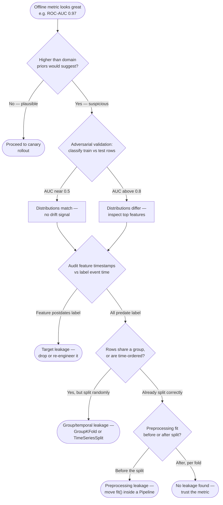
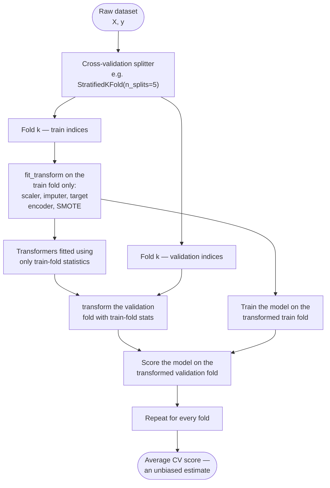

# Imbalanced Data & Data-Leakage Traps

## 1. Concept Overview

Imbalanced data and data leakage are the two most common ways an offline ML
metric lies to you. Both produce a model that looks excellent in a notebook
and then underperforms — or is actively useless — once it meets real traffic.
They are grouped into one module because they share a root cause: **the
evaluation number stopped measuring what you think it measures.**

**Class imbalance** is a skewed label distribution — fraud, churn, disease,
manufacturing defects, and click-through are all naturally rare-positive
problems, often at ratios from 1:10 to 1:100,000. Standard metrics and
standard training procedures both silently assume roughly balanced classes,
so left unchecked, imbalance produces models that optimize for the majority
class while ignoring the minority class you actually care about.

**Data leakage** is any pathway by which information that would not be
available at real prediction time enters training or evaluation. It can be a
single mislabeled feature, a preprocessing step run in the wrong order, or a
cross-validation split that ignores time or entity structure. Leakage always
biases the offline metric optimistically — sometimes by a rounding error,
sometimes by 50 points of AUC — and the gap only becomes visible in
production, when it is expensive.

This module covers: resampling (over/undersampling, SMOTE, ADASYN, Tomek
links, NearMiss), class weights and cost-sensitive learning, focal loss,
threshold moving, PR-AUC vs ROC-AUC, why resampling breaks calibration, and
the full leakage taxonomy (target, temporal, group, preprocessing, leaky CV,
duplicate) with detection and prevention techniques for each.

See also: [Model Evaluation & Selection](../model_evaluation_and_selection/README.md)
for cross-validation strategy and calibration mechanics in depth,
[Feature Engineering](../feature_engineering/README.md) for encoding and
scaling techniques referenced here, and
[ML System Design](../ml_system_design/README.md) for point-in-time-correct
feature pipelines in production.

---

## 2. Intuition

> **One-line analogy**: Imbalanced data is a test where answering "no" to
> every question still gets an A; data leakage is a test where the answer key
> was stapled to the back page before you took it.

**Mental model**: Every offline metric is an estimate of a future quantity —
"how will this model perform on data it has never seen?" Class imbalance
breaks the *metric's* honesty (accuracy stops meaning anything useful once
positives are rare). Data leakage breaks the *estimate's* honesty (the number
you compute no longer describes an unseen-data scenario, because some of
"unseen" secretly leaked into training). Both failures can coexist in the
same model and compound: a leaky feature can make a severely imbalanced
problem look artificially solved.

**Why it matters**: These two failure modes are the single most common
reason a model that "worked in the notebook" fails a production canary
review. They are also the two areas interviewers probe hardest, because they
separate engineers who can build a model from engineers who can be trusted to
ship one.

**Key insight**: Both problems have the same fix template — audit what
information the model actually had access to, and when. For imbalance: does
the *metric* reflect the class you care about? For leakage: could this
*feature, split, or preprocessing step* have seen something it shouldn't
have? Answering those two questions rigorously prevents nearly every trap in
this module.

---

## 3. Core Principles

1. **Accuracy is not a metric on imbalanced data.** Once positive prevalence
   drops much below 10%, a majority-class-only classifier already scores
   high accuracy while providing zero business value — the loss function and
   the evaluation metric both need to be imbalance-aware.
2. **Resampling changes what the model sees; reweighting changes how much
   each row counts.** Class weights and cost-sensitive loss keep every real
   row and its natural probability meaning intact; oversampling and
   undersampling change either the row count or manufacture synthetic rows.
3. **Leakage is any information available at training/evaluation time that
   would not be available at real prediction time.** This single definition
   unifies target, temporal, group, preprocessing, and duplicate leakage —
   they are all instances of the same rule being broken in different places.
4. **`fit()` may only ever see the active training fold.** Every
   leakage-prevention technique in this module — `Pipeline`, `GroupKFold`,
   `TimeSeriesSplit`, out-of-fold target encoding — is an enforcement
   mechanism for this one rule.
5. **A model must generalize to unseen rows, not memorize rows (or entities,
   or synthetic near-copies) it has effectively already seen.** Group
   leakage, duplicate leakage, and pre-split resampling are three different
   mechanisms that all break this same generalization contract.
6. **An implausibly good offline number is a bug report until proven
   otherwise.** Suspiciously high AUC, one dominant feature, or a large
   train/test performance cliff should trigger an audit before a
   celebration.

---

## 4. Types / Architectures / Strategies

### 4.1 Class-Imbalance Handling Strategies

| Strategy | Mechanism | Changes row count? | Changes calibration? |
|---|---|---|---|
| Random oversampling | Duplicate minority rows with replacement | Grows | No (real, duplicated points) |
| Random undersampling | Drop majority rows at random | Shrinks | No |
| SMOTE | Interpolate between a minority row and one of its k=5 neighbors | Grows | No (synthetic points) |
| ADASYN | Like SMOTE, biased toward harder, boundary-adjacent minority points | Grows | No |
| Borderline-SMOTE | SMOTE restricted to minority points "in danger" near the boundary | Grows | No |
| Tomek links | Remove the majority side of cross-class nearest-neighbor pairs | Shrinks slightly | No |
| NearMiss (v1/v2/v3) | Keep majority points closest to, or bracketing, minority points | Shrinks | No |
| Class weights | Multiply each class's loss contribution by an inverse-frequency factor | Unchanged | Yes — loss only |
| Cost-sensitive learning | Same idea generalized to an arbitrary FP/FN cost matrix | Unchanged | Yes — loss only |
| Focal loss | Down-weight easy, well-classified examples via `(1-p_t)^gamma` | Unchanged | Yes — loss only |
| Threshold moving | Leave model and loss untouched; move the cutoff on `predict_proba` | Unchanged | No — post-hoc only |

### 4.2 Data-Leakage Taxonomy

| Leakage type | What happens | Typical symptom |
|---|---|---|
| Target leakage | A feature encodes the label, or is only populated after the outcome | Offline AUC near 0.99; one feature dominates importance |
| Temporal leakage | Rows from the future train a model meant to predict the past | Random-split CV far above time-based CV / production |
| Group/entity leakage | The same user, patient, or device appears in train and test | CV score collapses on genuinely new entities in production |
| Preprocessing-before-split leakage | Scaler, imputer, encoder, or feature selector fit on the full dataset | Small, easy-to-miss optimistic bias; grows as n shrinks |
| Leaky cross-validation | A fold-global statistic (mean target encoding, aggregate feature) computed before the CV split | Every fold looks better than an honest out-of-fold estimate |
| Duplicate leakage | Exact or near-duplicate rows land on both sides of the split | Suspiciously high accuracy, especially on small/augmented datasets |

### 4.3 Leakage-Detection Techniques

| Technique | What it catches | Cost |
|---|---|---|
| Adversarial validation | Train/test distribution drift, split-encoding features | One extra classifier — cheap |
| Suspiciously-high-metric audit | Target leakage, duplicate leakage | Free — a sanity-check habit |
| Feature-importance smell test | Target leakage (one dominant feature) | Free with any tree model or SHAP |
| Row-hash duplicate check | Duplicate / near-duplicate leakage | One O(n) hashing pass |
| Feature-availability-timestamp audit | Target leakage, temporal leakage | Manual, but the highest-value check |

---

## 5. Architecture Diagrams

### Leakage Detection Decision Flow



Each diamond is a single audit question; a suspiciously high offline score
should walk this entire path before anyone trusts it enough to deploy —
skipping straight from "looks great" to "ship it" is precisely how the
Section 14 case study's v1 model reached production.

### Fit-Inside-the-Fold Pipeline



The validation fold (right branch) is only ever *transformed*, never *fit
on* — every preprocessing-before-split and leaky-resampling bug in this
module is a violation of this one arrow direction.

### Before/After: Where the Scaler Is Fit

```
BROKEN -- scaler fit on the full dataset, then split
  X (10,000 rows) --> StandardScaler.fit(X) --> train_test_split(...)
                              ^
                              |
                statistics computed from ALL 10,000 rows,
                including the 2,000 rows now called "test"

FIXED -- split first, fit the scaler on the train fold only
  X (10,000 rows) --> train_test_split(X, y)
                              |
                +-------------+-------------+
                |                           |
          X_train (8,000)             X_test (2,000)
                |                           |
        scaler.fit(X_train)                 |
                |                           |
        scaler.transform(X_train)   scaler.transform(X_test)
        defines mean / std          reuses train's mean / std
                                     .fit() never sees this data

Rule: transform() may touch any row; fit() may only ever touch
training rows.
```

The only change between the two paths is *when* `train_test_split` runs
relative to `.fit()` — everything else about the code looks almost
identical, which is exactly why this bug survives so many code reviews.

### Confusion Matrix Under Threshold Shift

```
Test set: 1,000 rows, 10 positives (1% prevalence), 990 negatives

Threshold = 0.50 (default)
              Pred +   Pred -
   Actual +      4        6
   Actual -     20      970
   Precision = 4/24  = 0.17     Recall = 4/10 = 0.40

Threshold = 0.20 (moved down)
              Pred +   Pred -
   Actual +      9        1
   Actual -    150      840
   Precision = 9/159 = 0.06     Recall = 9/10 = 0.90

Lowering the threshold trades precision for recall: 5 more of the 10
fraud cases are caught, at the cost of 130 additional false alarms
for analysts to review.
```

The same trained model produces either matrix — nothing was retrained,
resampled, or reweighted; only the cutoff on `predict_proba` moved, which is
why threshold moving is the cheapest imbalance fix available.

### Decoding the Confusion Matrix: Why Accuracy Lies at 99:1

Every metric in this module is assembled from the same four counts, so decode
them once and the rest of the section reads itself:

```
accuracy  = (TP + TN) / (TP + TN + FP + FN)
precision =  TP / (TP + FP)
recall    =  TP / (TP + FN)
```

**What the formula is telling you.** "Accuracy asks *what fraction of my calls were right* — and on a 99:1 dataset that question is answered almost entirely by the 99, so the class you actually care about barely moves the number."

The trap is structural, not a matter of degree. Because `TN` sits in accuracy's
numerator with the same weight as `TP`, a classifier can maximize the metric by
being excellent at the class nobody asked about.

| Symbol | What it is |
|--------|------------|
| `TP` | True positives — real fraud the model flagged. The only count that pays |
| `FP` | False positives — clean rows flagged anyway. The analyst review queue's workload |
| `FN` | False negatives — fraud waved through. The dollars lost |
| `TN` | True negatives — clean rows correctly ignored. At 99:1 this is ~99% of every row |
| `TP + TN` | All correct calls, majority and minority counted identically. That equality is the bug |
| `TP + TN + FP + FN` | Total rows. Under imbalance this denominator is dominated by `TN` |

**Walk one example.** Two classifiers on the same 10,000-row test set:

```
Test set: 10,000 rows, 100 positives (1%), 9,900 negatives -- a 99:1 ratio

Model A -- "always predict negative". Nothing was learned; there are no weights.
              Pred +    Pred -
   Actual +       0       100          <- every single positive missed
   Actual -       0     9,900

   accuracy  = (0 + 9,900) / 10,000 = 0.9900    <- 99.0%, looks shippable
   recall    =  0 / (0 + 100)       = 0.0000    <- catches nothing, ever
   precision =  0 / (0 + 0)         = 0 / 0     <- undefined; libraries report 0
   F1        =                        0.0000

Model B -- a real trained model, threshold 0.50
              Pred +    Pred -
   Actual +      60        40
   Actual -     340     9,560

   accuracy  = (60 + 9,560) / 10,000 = 0.9620   <- 96.2%
   recall    =  60 / (60 + 40)       = 0.6000
   precision =  60 / (60 + 340)      = 0.1500

Accuracy ranks Model A ABOVE Model B by 99.0 - 96.2 = 2.8 points, while
Model B catches 60 frauds and Model A catches zero. The metric is not
merely uninformative here -- it is ordering the two models backwards.
```

The reason Model B loses on accuracy is that catching 60 positives cost it 340
false positives, and accuracy charges full price for each one while paying only
60 rows of credit. That exchange rate is exactly backwards from the business's,
where one missed fraud costs far more than one extra review.

**Read it like this.** "F1 scores you by your weaker half — you cannot buy a good F1 by being superb at precision and hopeless at recall, or the reverse."

| Symbol | What it is |
|--------|------------|
| `precision` | Of the rows I flagged, what fraction were real. The alert queue's signal-to-noise |
| `recall` | Of the real positives, what fraction I flagged. Coverage of the thing you care about |
| `2pr / (p + r)` | Harmonic mean of precision and recall — identical to `2 / (1/p + 1/r)` |
| `1/p` inside that form | Why one tiny value dominates: as `p -> 0`, `1/p -> infinity` and drags the mean down |
| `2` in the numerator | Normalizer so that `p = r` gives back exactly `p`, not `p/2` |

**Walk one example.** Four operating points, three of which share an identical
arithmetic mean:

```
                      precision   recall   arithmetic mean   F1 (harmonic)
  perfectly balanced     0.375     0.375        0.375            0.375
  Model B above          0.150     0.600        0.375            0.240
  flag almost everything 0.010     0.740        0.375            0.020
  flag one row, be right 1.000     0.010        0.505            0.020

The first three have the SAME arithmetic mean, 0.375, yet F1 spans
0.375 -> 0.020. The last has the HIGHEST arithmetic mean of all (0.505)
and one of the lowest F1s -- perfect precision on a single row is worthless.
```

That collapse toward the smaller term is the whole reason F1 uses a harmonic
rather than arithmetic mean. An arithmetic mean lets a degenerate model average
its way to a respectable score; the harmonic mean makes the weaker of the two
numbers the binding constraint, which is what you want from a single headline
metric on imbalanced data.

---

## 6. How It Works — Detailed Mechanics

### 6.1 Resampling Techniques

```
Random oversampling -- duplicate an existing minority row verbatim
  x_i = [0.42, 1.87, 0.03]  -- copy -->  [0.42, 1.87, 0.03]  (identical)
  The model can see this exact row twice; zero new information added.

SMOTE -- interpolate between a minority row and one of its k=5 neighbors
  x_i        = [0.42, 1.87,  0.03]
  x_neighbor = [0.51, 1.72,  0.11]
  lambda     = 0.37                  (drawn from Uniform(0, 1))
  x_new      = x_i + lambda * (x_neighbor - x_i)
             = [0.453, 1.815, 0.0596]         (a new point, not a copy)
```

**Put simply.** "Don't photocopy a rare example — stand somewhere on the straight line between it and a neighbour that already looks like it, and call that a new example."

| Symbol | What it is |
|--------|------------|
| `x_i` | A real minority row, chosen at random. The anchor |
| `x_neighbor` | One of `x_i`'s `k=5` nearest *minority* neighbors, picked at random from those five |
| `x_neighbor - x_i` | The direction and full distance from anchor to neighbor, per feature |
| `lambda` | How far along that segment to land. Drawn fresh from `Uniform(0, 1)` for every new point |
| `x_new` | The synthetic row. Always strictly on the segment — never an extrapolation past either end |

**Walk one example.** The three coordinates above, computed one at a time with
`lambda = 0.37`:

```
  x_i        = [0.42, 1.87, 0.03]        lambda = 0.37
  x_neighbor = [0.51, 1.72, 0.11]

  dim    x_i     x_nbr    delta = nbr - x_i    lambda x delta      x_new
   1    0.42     0.51          +0.09              +0.0333         0.4533
   2    1.87     1.72          -0.15              -0.0555         1.8145
   3    0.03     0.11          +0.08              +0.0296         0.0596

  Note dim 2 moves DOWN: lambda scales a signed delta, so each feature
  travels toward the neighbor's value regardless of direction.

  lambda = 0.00  ->  x_new = x_i exactly          (a duplicate)
  lambda = 1.00  ->  x_new = x_neighbor exactly   (also a duplicate)
  lambda = 0.37  ->  37% of the way along         (genuinely new)
```

The `Uniform(0, 1)` bound on `lambda` is the safety property: SMOTE interpolates,
never extrapolates, so no synthetic point can land outside the convex hull of the
real minority data. What it does *not* guarantee is that the segment stays inside
minority territory — if `x_neighbor` sits across a pocket of majority points, the
line runs straight through them and manufactures labelled-positive rows in a
region that is empirically negative. That is the mechanism behind the "synthetic
points bridge into majority territory" risk in Section 8.1, and why
Borderline-SMOTE and `SMOTETomek` exist.

```python
from __future__ import annotations

import numpy as np
from imblearn.combine import SMOTETomek
from imblearn.over_sampling import ADASYN, SMOTE, RandomOverSampler
from imblearn.under_sampling import NearMiss, RandomUnderSampler, TomekLinks


def resample_training_fold(
    X_train: np.ndarray,
    y_train: np.ndarray,
    strategy: str = "smote",
    k_neighbors: int = 5,
    random_state: int = 42,
) -> tuple[np.ndarray, np.ndarray]:
    """
    Resample ONLY the training fold -- never call this on data that includes
    validation or test rows (see Section 6.7 for why that leaks).

    strategy:
      "random_over"  -- duplicate minority rows (fast, no new information)
      "smote"        -- interpolate toward one of k_neighbors=5 minority
                        neighbors
      "adasyn"       -- like SMOTE, biased toward harder boundary examples
      "random_under" -- drop majority rows at random (loses information)
      "tomek"        -- remove majority side of cross-class nearest-neighbor
                        pairs (boundary cleaning, not full balancing)
      "smote_tomek"  -- SMOTE to oversample, then Tomek links to clean overlap
    """
    n_pos = int(y_train.sum())
    n_neg = int(len(y_train) - n_pos)
    if strategy in {"smote", "adasyn"} and n_pos <= k_neighbors:
        # SMOTE/ADASYN need k_neighbors minority points to interpolate
        # between; with only n_pos minority rows, k must shrink.
        k_neighbors = max(1, n_pos - 1)

    samplers = {
        "random_over": RandomOverSampler(random_state=random_state),
        "smote": SMOTE(k_neighbors=k_neighbors, random_state=random_state),
        "adasyn": ADASYN(n_neighbors=k_neighbors, random_state=random_state),
        "random_under": RandomUnderSampler(random_state=random_state),
        "tomek": TomekLinks(),
        "smote_tomek": SMOTETomek(random_state=random_state),
    }
    sampler = samplers[strategy]
    X_res, y_res = sampler.fit_resample(X_train, y_train)
    print(f"{strategy}: {n_pos} pos / {n_neg} neg -> "
          f"{int(y_res.sum())} pos / {int(len(y_res) - y_res.sum())} neg")
    return X_res, y_res
```

### 6.2 Class Weights & Cost-Sensitive Learning

```python
from __future__ import annotations

import numpy as np
from sklearn.linear_model import LogisticRegression
from sklearn.utils.class_weight import compute_class_weight


def fit_cost_sensitive_logreg(X_train: np.ndarray, y_train: np.ndarray) -> LogisticRegression:
    """
    class_weight="balanced" sets w_c = n_samples / (n_classes * n_samples_c).
    For a 1:1000 imbalance (999 negatives, 1 positive per 1,000 rows):
      w_negative = 1000 / (2 * 999) = 0.5005
      w_positive = 1000 / (2 * 1)   = 500.0
    The positive class's loss contribution is multiplied ~1000x relative to
    a single negative example -- no synthetic rows, no duplicated rows, the
    training-set size and every row's features stay completely untouched.
    """
    classes = np.unique(y_train)
    weights = compute_class_weight(class_weight="balanced", classes=classes, y=y_train)
    print(f"class weights: {dict(zip(classes.tolist(), weights.tolist()))}")

    model = LogisticRegression(class_weight="balanced", max_iter=1000)
    model.fit(X_train, y_train)
    return model


def xgboost_scale_pos_weight(y_train: np.ndarray) -> float:
    """
    XGBoost/LightGBM use one scalar, scale_pos_weight = n_negative / n_positive,
    instead of per-sample weights. For a 1:1000 imbalance this is ~999.
    """
    n_pos = int(y_train.sum())
    n_neg = int(len(y_train) - n_pos)
    return n_neg / max(n_pos, 1)
```

**In plain terms.** "Leave every row exactly where it is, and just charge the loss function 99 times more for each rare row it gets wrong."

| Symbol | What it is |
|--------|------------|
| `w_c` | The multiplier applied to class `c`'s contribution to the loss. Data is untouched |
| `n_samples` | Total rows in the training fold |
| `n_samples_c` | Rows belonging to class `c`. The rarer the class, the smaller this is, so the bigger `w_c` |
| `n_classes` | The normalizer, `2` for binary. It is what keeps the average weight at exactly `1.0` |
| `scale_pos_weight` | XGBoost/LightGBM's single-scalar equivalent, `n_negative / n_positive` |

**Walk one example.** The same 10,000-row, 100-positive set:

```
  n_samples = 10,000    n_classes = 2    positives = 100    negatives = 9,900

  w_positive = 10,000 / (2 x   100) = 50.0000
  w_negative = 10,000 / (2 x 9,900) =  0.5051

  ratio = 50.0000 / 0.5051 = 99.0        <- exactly n_negative / n_positive

  Weighted loss mass contributed by each class:
      positives:    100 x 50.0000 = 5,000
      negatives:  9,900 x  0.5051 = 5,000        <- deliberately identical

  Average weight per row = (5,000 + 5,000) / 10,000 = 1.0

  XGBoost's one scalar does the same job with one number:
      scale_pos_weight = 9,900 / 100 = 99.0
```

The `n_classes` divisor is the term most people drop when reimplementing this by
hand, and it matters. Without it the weights would be `10,000/100 = 100` and
`10,000/9,900 = 1.0101`, whose average per row is `2.0` — every gradient step
would be twice as large as in unweighted training, so a learning rate tuned
before switching on class weights would suddenly be effectively doubled. Dividing
by `n_classes` pins the mean weight at `1.0`, which is what makes
`class_weight="balanced"` a drop-in change rather than a retuning event.

### 6.3 Focal Loss

```python
from __future__ import annotations

import numpy as np


def focal_loss(
    y_true: np.ndarray,
    p_pred: np.ndarray,
    gamma: float = 2.0,
    alpha: float = 0.25,
    eps: float = 1e-7,
) -> np.ndarray:
    """
    FL(p_t) = -alpha_t * (1 - p_t)^gamma * log(p_t)
    where p_t = p_pred if y_true == 1 else (1 - p_pred).

    gamma down-weights EASY, well-classified examples: at p_t=0.9 (an easy
    correct call) with gamma=2, the modulating factor (1-0.9)^2 = 0.01 shrinks
    that example's loss to 1% of unweighted cross-entropy. A hard example at
    p_t=0.3 keeps (1-0.3)^2 = 0.49 -- 49% of its loss. This lets 1,000 easy
    negatives stop drowning out 1 hard positive in the gradient, without
    touching the class distribution at all. Introduced by Lin et al.
    (RetinaNet, 2017) for ~1:1000 foreground:background imbalance in object
    detection; gamma=2, alpha=0.25 are the paper's reported defaults.
    """
    p_pred = np.clip(p_pred, eps, 1 - eps)
    p_t = np.where(y_true == 1, p_pred, 1 - p_pred)
    alpha_t = np.where(y_true == 1, alpha, 1 - alpha)
    return -alpha_t * np.power(1 - p_t, gamma) * np.log(p_t)
```

**The idea behind it.** "Charge full price for the examples the model still gets wrong, and almost nothing for the ones it already nails — so 9,900 easy negatives stop drowning out 100 hard positives in the gradient."

| Symbol | What it is |
|--------|------------|
| `p_t` | Probability assigned to the *correct* class. `p` for a positive row, `1 - p` for a negative |
| `-log(p_t)` | Plain cross-entropy. `0` when perfectly confident and right, growing without bound when wrong |
| `(1 - p_t)^gamma` | The modulating factor. Near `0` for confident-correct rows, near `1` for rows the model is lost on |
| `gamma` | How hard to down-weight easy rows. `gamma = 0` recovers plain cross-entropy exactly; `2` is the default |
| `alpha_t` | A separate per-class constant (`0.25` positive / `0.75` negative). Handles class *frequency*, not difficulty |

**Walk one example.** First, what the modulating factor keeps at `gamma = 2`:

```
     p_t     -log(p_t)     m = (1 - p_t)^2      m x -log(p_t)     fraction kept
    0.99      0.0101           0.0001             0.0000010            0.01%
    0.90      0.1054           0.0100             0.0010541            1.00%
    0.50      0.6931           0.2500             0.1732868           25.00%
    0.30      1.2040           0.4900             0.5899467           49.00%
```

Now push a realistic imbalanced batch through it:

```
One batch: 9,900 easy negatives at p_t = 0.90, plus 100 hard positives at p_t = 0.30

  plain cross-entropy
      easy negatives:  9,900 x 0.1054                = 1,043.10
      hard positives:    100 x 1.2040                =   120.40
      -> the easy negatives carry 8.66x the loss mass of the positives.
         The gradient is majority-dominated even though every negative
         is already being classified correctly.

  focal loss, gamma = 2
      easy negatives:  9,900 x 0.0100 x 0.1054       =    10.43
      hard positives:    100 x 0.4900 x 1.2040       =    58.99
      -> the hard positives now carry 5.66x the loss mass of the negatives.

The dominance ratio flipped from 8.66 : 1 majority-favoring to 1 : 5.66
minority-favoring, with the class distribution completely untouched.
```

`gamma` and `alpha` solve two different problems and are worth separating in an
interview answer: `alpha` is a fixed per-class constant that knows nothing about
any individual row, so it is just class weighting under another name; `gamma`
looks at each row's own `p_t` and reweights by *difficulty*, which is what lets
focal loss keep down-weighting a negative as the model gets better at it. Set
`gamma = 0` and the modulating factor is `1` everywhere — you are back to
alpha-weighted cross-entropy and have gained nothing.

### 6.4 Threshold Moving

```python
from __future__ import annotations

import numpy as np
from sklearn.metrics import precision_recall_curve


def choose_threshold_for_recall(
    y_true: np.ndarray,
    y_prob: np.ndarray,
    target_recall: float = 0.90,
) -> tuple[float, float, float]:
    """
    Trains once on the ORIGINAL, un-resampled distribution, then moves only
    the decision threshold on predict_proba -- the cheapest imbalance fix
    available, and it never touches calibration because the model itself
    never changes. Returns (threshold, precision_at_threshold, recall_at_threshold).
    """
    precision, recall, thresholds = precision_recall_curve(y_true, y_prob)
    feasible = np.where(recall[:-1] >= target_recall)[0]
    if len(feasible) == 0:
        return 0.0, float(precision[0]), float(recall[0])
    idx = feasible[-1]  # highest threshold that still clears target_recall
    return float(thresholds[idx]), float(precision[idx]), float(recall[idx])


def business_cost_threshold(
    y_true: np.ndarray,
    y_prob: np.ndarray,
    fp_cost: float = 5.0,
    fn_cost: float = 500.0,
) -> float:
    """
    Sweeps thresholds and returns the one minimizing total dollar cost -- a
    $5 manual-review cost per false positive vs a $500 loss per missed fraud
    case, for example. The threshold that maximizes F1 is rarely the one
    that minimizes real business cost once FP and FN costs diverge 100x.
    """
    grid = np.linspace(0.01, 0.99, 99)
    costs = []
    for t in grid:
        pred = (y_prob >= t).astype(int)
        fp = int(((pred == 1) & (y_true == 0)).sum())
        fn = int(((pred == 0) & (y_true == 1)).sum())
        costs.append(fp * fp_cost + fn * fn_cost)
    return float(grid[int(np.argmin(costs))])
```

### 6.5 PR-AUC vs ROC-AUC Under Imbalance

```python
from __future__ import annotations

import numpy as np
from sklearn.metrics import average_precision_score, roc_auc_score


def compare_auc_under_imbalance(y_true: np.ndarray, y_prob: np.ndarray) -> dict[str, float]:
    """
    At a 1:1000 positive ratio (0.1% prevalence), ROC-AUC's false-positive-
    rate denominator is ~999x the positive count, so even a model that ranks
    many negatives above true positives can still post ROC-AUC 0.97. PR-AUC's
    baseline equals the prevalence itself (0.001 here), so it collapses to
    reflect the same weak minority-class ranking (e.g. PR-AUC 0.42) -- a 0.55
    gap between the two metrics that ROC-AUC alone hides completely.
    """
    roc_auc = roc_auc_score(y_true, y_prob)
    pr_auc = average_precision_score(y_true, y_prob)
    prevalence = float(y_true.mean())
    print(f"ROC-AUC: {roc_auc:.2f}  |  PR-AUC: {pr_auc:.2f}  "
          f"(random-baseline PR-AUC = prevalence = {prevalence:.3f})")
    return {"roc_auc": roc_auc, "pr_auc": pr_auc, "prevalence": prevalence}
```

The two curves are more similar than they look. Both plot the same quantity up
the y-axis; they differ only in what they pair it with:

```
ROC curve :  TPR    = TP / (TP + FN)      against   FPR       = FP / (FP + TN)
PR  curve :  recall = TP / (TP + FN)      against   precision = TP / (TP + FP)

TPR and recall are literally the same number. The entire difference between
the two metrics is which denominator gets paired with FP:

    (FP + TN)  for ROC        <- includes every true negative: huge at 99:1
    (TP + FP)  for PR         <- includes only what you flagged: small
```

**Stated plainly.** "Both curves ask how much of the rare class you caught; ROC then asks what fraction of the *enormous* negative pile you falsely flagged, while PR asks what fraction of your *own alert queue* was junk — and under imbalance those two questions have wildly different answers."

| Symbol | What it is |
|--------|------------|
| `TPR` / `recall` | Fraction of real positives caught. Identical in both curves |
| `FPR` | `FP / (FP + TN)`. Its denominator is the whole negative class — 9,900 rows at 99:1 |
| `precision` | `TP / (TP + FP)`. Its denominator is only the rows you flagged — a few hundred |
| `FP` | Sits in both denominators, but is a rounding error in one and the dominant term in the other |
| ROC-AUC baseline | Always `0.5`, whatever the prevalence. A prevalence-blind constant |
| PR-AUC baseline | Equals prevalence itself. `0.01` here, so a PR-AUC must be read *relative to* it |

**Walk one example.** Sweep the threshold down over the same 10,000-row set and
record four operating points, then integrate both curves:

```
Test set: 10,000 rows, 100 positives (1%), 9,900 negatives.

   TP      FP    recall    FPR = FP/9,900    precision = TP/(TP+FP)
   30      40     0.30        0.004040             0.428571
   60     340     0.60        0.034343             0.150000
   90   2,000     0.90        0.202020             0.043062
  100   9,900     1.00        1.000000             0.010000

Read the middle row on its own. Going from 30 to 60 caught frauds cost
340 - 40 = 300 extra false alarms:

    FPR moved       0.0040 -> 0.0343      (+3.03 percentage points)
    precision moved 0.4286 -> 0.1500      (-27.9 percentage points)

Same 300 rows. ROC barely notices them because it divides by 9,900;
precision is crushed because it divides by 400.

Trapezoid area under each curve, using those four points plus the origin:

    ROC-AUC = 0.8981        <- reads as "a strong model"
    PR-AUC  = 0.2470        <- reads as "the alert queue is mostly noise"

    random-baseline PR-AUC = prevalence = 100 / 10,000 = 0.0100
    so PR-AUC 0.2470 is 24.7x better than chance -- genuine skill,
    but nothing like what ROC-AUC 0.8981 advertises.
```

The asymmetry is entirely in the denominators, and it gets worse as prevalence
falls: at 1:1000 you would need roughly ten times as many false positives to move
`FPR` by the same amount, while precision degrades just as fast. This is also why
ROC-AUC numbers are comparable across datasets and PR-AUC numbers are not — a
PR-AUC of `0.25` is excellent at 1% prevalence and terrible at 40%, so always
report the prevalence beside it.

### 6.6 Why Resampling Distorts Calibration

Resampling changes the class prior the model sees during training (e.g. from
0.1% to 50%), and `predict_proba` reflects whatever prior it was trained on
— not the true prior at serving time. A model trained on a SMOTE-balanced
50/50 training set effectively learns "in a world where positives are half
the population," so a real customer with a true 2% churn probability might
be scored at 0.50. Class weights avoid this entirely because they reweight
the *loss*, not the data distribution the model actually observes.

```python
from __future__ import annotations

import numpy as np


def prior_corrected_intercept(
    beta_0_trained: float,
    tau_true_prevalence: float,
    y_bar_resampled: float,
) -> float:
    """
    King & Zeng (2001) rare-events logistic correction: subtract the log of
    the ratio between the true population odds and the resampled-sample odds
    from the trained intercept. Exact for logistic regression only (linear
    in log-odds); tree ensembles and neural nets need empirical recalibration
    (Platt scaling / isotonic regression, see the Model Evaluation & Selection
    module) fit on a held-out sample drawn from the true, un-resampled data.
    """
    true_odds = (1 - tau_true_prevalence) / tau_true_prevalence
    sample_odds = y_bar_resampled / (1 - y_bar_resampled)
    return beta_0_trained - float(np.log(true_odds * sample_odds))
```

Written out, the correction that function implements is a single subtraction:

```
beta_0_corrected = beta_0_trained - log( ((1 - tau) / tau) x (y_bar / (1 - y_bar)) )
```

**What it means.** "Resampling taught the model a base rate that does not exist; because a logistic model stores the base rate in exactly one parameter, you can put the real one back by subtracting one constant."

| Symbol | What it is |
|--------|------------|
| `tau` | The TRUE population prevalence. `0.01` here. What the world actually looks like |
| `y_bar` | The prevalence in the RESAMPLED training set. `0.5` after balancing to 1:1 |
| `(1 - tau) / tau` | True population odds *against* a positive. `99` at 1% prevalence |
| `y_bar / (1 - y_bar)` | Odds *for* a positive in the resampled data. `1.0` at 1:1, `0.25` at 1:4 |
| `log(...)` | Turns the odds ratio into an additive shift, which is the unit a logistic intercept lives in |
| `beta_0` | The intercept — the model's log-odds when every feature is at zero, i.e. its stored base rate |

**Walk one example.** Take the 100-positive / 9,900-negative set and rebalance it
to two different target ratios:

```
True population: 100 positives, 9,900 negatives  ->  tau = 0.0100

  target ratio    positives after    synthetic rows    y_bar    prior the
   (pos : neg)      resampling          created                 model learns
     1 : 1             9,900             9,800        0.5000       50.00%
     1 : 4             2,475             2,375        0.2000       20.00%
     no resample         100                 0        0.0100        1.00%

Intercept correction for each target:

  1 : 1     true_odds = 0.99 / 0.01 = 99.00     sample_odds = 0.5 / 0.5  = 1.00
            log(99.00 x 1.00) = 4.5951      ->  beta_0 - 4.5951

  1 : 4     true_odds = 99.00                   sample_odds = 0.2 / 0.8  = 0.25
            log(99.00 x 0.25) = 3.2088      ->  beta_0 - 3.2088

  The gap between the two corrections is 4.5951 - 3.2088 = 1.3863 = log(4),
  exactly the factor by which 1:4 undersells the positive class relative
  to 1:1. The correction tracks the resampling ratio precisely.
```

And here is what skipping the correction costs, in probabilities a downstream
pricing system would actually consume:

```
  A row the resampled model scores at predict_proba = 0.50:

     trained at 1 : 1   ->  true probability = 0.0100     50.0x too high
     trained at 1 : 4   ->  true probability = 0.0388     12.9x too high

  A row the 1:1 model scores at predict_proba = 0.80:

     trained at 1 : 1   ->  true probability = 0.0388     20.6x too high
```

This is the arithmetic behind Pitfall 9's credit model. It also explains why
teams that must resample usually pick a partial ratio like 1:4 rather than a full
1:1: the milder ratio needs `9,800 / 2,375 = 4.13x` fewer synthetic rows, distorts
the learned prior by `log(4)` less, and still hands the optimizer a large enough
minority gradient to shape a boundary. The correction is exact only for logistic
regression because it is a pure additive shift in log-odds space and a logistic
model has exactly one parameter living there; a random forest or a neural net
spreads its implied base rate across thousands of parameters, so those need
empirical recalibration on un-resampled data instead.

See [Model Evaluation & Selection](../model_evaluation_and_selection/README.md)
for Platt scaling, isotonic regression, and the Brier score in depth, and
[Uncertainty Quantification & Conformal Prediction](../uncertainty_quantification_and_conformal_prediction/README.md)
for expected calibration error (ECE) and temperature scaling.

### 6.7 Preprocessing-Before-Split Leakage — Broken, Then Fixed

```python
from __future__ import annotations

import numpy as np
from sklearn.linear_model import LogisticRegression
from sklearn.model_selection import StratifiedKFold, cross_val_score, train_test_split
from sklearn.pipeline import Pipeline
from sklearn.preprocessing import StandardScaler


# BROKEN -- scaler sees the test set's mean and variance before the split
def broken_train_test_split(X: np.ndarray, y: np.ndarray) -> float:
    scaler = StandardScaler()
    X_scaled = scaler.fit_transform(X)          # LEAK: fit on all 10,000 rows,
                                                 # including the 2,000 test rows
    X_train, X_test, y_train, y_test = train_test_split(
        X_scaled, y, test_size=0.2, stratify=y, random_state=42
    )
    model = LogisticRegression(max_iter=1000).fit(X_train, y_train)
    return model.score(X_test, y_test)          # optimistic by a small,
                                                 # easy-to-miss margin


# FIXED -- split first; the scaler's .fit() call never sees test rows
def fixed_train_test_split(X: np.ndarray, y: np.ndarray) -> float:
    X_train, X_test, y_train, y_test = train_test_split(
        X, y, test_size=0.2, stratify=y, random_state=42
    )
    pipeline = Pipeline([
        ("scaler", StandardScaler()),           # .fit() runs only inside .fit(X_train)
        ("clf", LogisticRegression(max_iter=1000)),
    ])
    pipeline.fit(X_train, y_train)
    return pipeline.score(X_test, y_test)


# FIXED, cross-validated -- cross_val_score refits the WHOLE Pipeline (scaler
# included) on each fold's training indices only; the scaler's statistics are
# recomputed fresh per fold and never see that fold's validation rows.
def fixed_cross_validated(X: np.ndarray, y: np.ndarray) -> np.ndarray:
    pipeline = Pipeline([
        ("scaler", StandardScaler()),
        ("clf", LogisticRegression(max_iter=1000)),
    ])
    cv = StratifiedKFold(n_splits=5, shuffle=True, random_state=42)
    return cross_val_score(pipeline, X, y, cv=cv, scoring="roc_auc")
```

### 6.8 Leaky Target Encoding — Broken, Then Fixed

```python
from __future__ import annotations

import pandas as pd
from sklearn.model_selection import KFold


# BROKEN -- mean-target-encode using the WHOLE column, then split
def broken_target_encoding(df: pd.DataFrame, cat_col: str, target_col: str) -> pd.Series:
    global_means = df.groupby(cat_col)[target_col].mean()   # LEAK: every row's
    return df[cat_col].map(global_means)                    # own label leaks into
                                                              # the statistic used
                                                              # to encode that row


# FIXED -- out-of-fold target encoding: each row is encoded using a mean
# computed from every OTHER fold, never from its own fold
def out_of_fold_target_encoding(
    df: pd.DataFrame,
    cat_col: str,
    target_col: str,
    n_splits: int = 5,
    random_state: int = 42,
) -> pd.Series:
    encoded = pd.Series(index=df.index, dtype=float)
    global_mean = df[target_col].mean()   # fallback for unseen categories
    kf = KFold(n_splits=n_splits, shuffle=True, random_state=random_state)
    for train_idx, holdout_idx in kf.split(df):
        fold_means = df.iloc[train_idx].groupby(cat_col)[target_col].mean()
        encoded.iloc[holdout_idx] = (
            df.iloc[holdout_idx][cat_col].map(fold_means).fillna(global_mean)
        )
    return encoded
```

### 6.9 Group and Temporal Leakage

```python
from __future__ import annotations

import numpy as np
from sklearn.base import clone
from sklearn.metrics import roc_auc_score
from sklearn.model_selection import GroupKFold, TimeSeriesSplit


def group_aware_cv_scores(
    model,
    X: np.ndarray,
    y: np.ndarray,
    groups: np.ndarray,
    n_splits: int = 5,
) -> list[float]:
    """
    groups: e.g. patient_id or user_id per row. GroupKFold guarantees every
    row from one group lands entirely in ONE fold -- never split across
    train and validation -- so the model cannot memorize entity-specific
    quirks and get credit for it as generalization.
    """
    gkf = GroupKFold(n_splits=n_splits)
    scores = []
    for train_idx, val_idx in gkf.split(X, y, groups=groups):
        m = clone(model)
        m.fit(X[train_idx], y[train_idx])
        scores.append(roc_auc_score(y[val_idx], m.predict_proba(X[val_idx])[:, 1]))
    return scores


def time_ordered_cv_scores(
    model,
    X: np.ndarray,
    y: np.ndarray,
    n_splits: int = 5,
    embargo: int = 0,
) -> list[float]:
    """
    TimeSeriesSplit always trains on earlier rows and validates on later
    ones. `embargo` rows are dropped immediately after the training window to
    purge features whose rolling/lag windows would otherwise straddle the
    train/validation boundary (e.g. a 7-day rolling average computed near the
    cutoff still contains a sliver of validation-period signal).
    """
    tscv = TimeSeriesSplit(n_splits=n_splits)
    scores = []
    for train_idx, val_idx in tscv.split(X):
        if embargo and len(train_idx) > embargo:
            train_idx = train_idx[:-embargo]
        m = clone(model)
        m.fit(X[train_idx], y[train_idx])
        scores.append(roc_auc_score(y[val_idx], m.predict_proba(X[val_idx])[:, 1]))
    return scores
```

### 6.10 Adversarial Validation for Leakage Detection

```python
from __future__ import annotations

import numpy as np
from sklearn.ensemble import RandomForestClassifier
from sklearn.model_selection import cross_val_score


def adversarial_validation_auc(
    X_train: np.ndarray,
    X_test: np.ndarray,
    n_splits: int = 5,
) -> float:
    """
    Labels every train row 0 and every test row 1, then cross-validates a
    classifier on that label using only the FEATURES, never the real target.
    AUC near 0.5 means train and test are statistically indistinguishable --
    no drift, no split-leaking feature. AUC above ~0.8 means a classifier can
    tell train from test almost on sight: either the data has drifted
    (temporal-leakage risk) or a feature literally encodes split membership
    (e.g. a monotonically increasing row ID or timestamp).
    """
    X_adv = np.vstack([X_train, X_test])
    y_adv = np.concatenate([np.zeros(len(X_train)), np.ones(len(X_test))])
    clf = RandomForestClassifier(n_estimators=200, max_depth=6, random_state=42)
    scores = cross_val_score(clf, X_adv, y_adv, cv=n_splits, scoring="roc_auc")
    auc = float(scores.mean())
    verdict = "OK -- indistinguishable" if auc < 0.6 else "SUSPICIOUS -- investigate top features"
    print(f"Adversarial validation AUC: {auc:.3f}  ({verdict})")
    return auc
```

### 6.11 Duplicate / Near-Duplicate Leakage Detection

```python
from __future__ import annotations

import hashlib

import pandas as pd


def find_duplicate_rows_across_split(
    train_df: pd.DataFrame,
    test_df: pd.DataFrame,
    columns: list[str] | None = None,
) -> int:
    """
    Hashes each row (over `columns`, or all columns if None) and counts exact
    overlaps between train and test. A nonzero count means the same physical
    record -- or an augmented copy of it -- exists on both sides of the
    split, letting the model memorize rather than generalize.
    """
    cols = columns or list(train_df.columns)

    def row_hash(row: pd.Series) -> str:
        payload = "|".join(str(row[c]) for c in cols).encode("utf-8")
        return hashlib.sha256(payload).hexdigest()

    train_hashes = set(train_df.apply(row_hash, axis=1))
    test_hashes = set(test_df.apply(row_hash, axis=1))
    overlap = train_hashes & test_hashes
    print(f"Exact duplicate rows shared between train and test: {len(overlap)}")
    return len(overlap)
```

---

## 7. Real-World Examples

**Credit card fraud (ULB / Kaggle):** 492 frauds out of 284,807 transactions
— a 0.173% positive rate. It is the standard teaching dataset for why PR-AUC
must accompany ROC-AUC and why raw accuracy is meaningless once positives
are this rare.

**IEEE-CIS Fraud Detection (Kaggle):** the `TransactionDT` feature is a time
delta from a reference date. Competitors who validated with a random K-Fold
routinely saw their local CV diverge from the private leaderboard, while
time-ordered validation schemes tracked it far more closely — a canonical,
widely discussed temporal-leakage lesson from that competition.

**Home Credit Default Risk (Kaggle):** several derived features were
populated by internal processes that only ran after a loan's outcome was
already known. Models trained with those features posted excellent offline
recall, then had to be disqualified or reworked once the leakage was traced.

**Subscription churn:** a `cancellation_reason` or `final_invoice_amount`
field, populated only after a customer has already churned, is classic
target leakage — it routinely inflates offline AUC into the high 0.90s for a
signal the model will never have at prediction time.

**Medical readmission prediction:** a `discharge_disposition` or
`length_of_stay` field computed at or after discharge leaks the outcome
itself into a model meant to predict 30-day readmission risk at admission
time.

**NLP data augmentation:** back-translated or paraphrase-augmented copies of
the same base sentence landing on both sides of a random split — duplicate
leakage that specifically defeats the claim that a test set is "held out."

**Manufacturing defect detection:** typical defect rates of 1:2,000 to
1:10,000 on production lines. Class weights, SMOTE, and threshold moving are
all standard tools here, and PR-AUC — not accuracy, and often not even
ROC-AUC — is the metric quality engineers actually track week over week.

---

## 8. Tradeoffs

### 8.1 Imbalance-Handling Strategy Comparison

| Strategy | Preserves calibration | Data cost | Risk |
|---|---|---|---|
| Class weights | Yes | None (no rows added or removed) | Some solvers/frameworks ignore weights unless explicitly wired |
| Threshold moving | Yes | None | Needs a validation set with trustworthy probability scores |
| Random oversampling | No | Duplicates memory footprint | Overfits duplicated rows |
| SMOTE / ADASYN | No | Grows dataset with synthetic rows | Synthetic points can bridge into majority territory in noisy/high-dim data |
| Random undersampling | No | Shrinks dataset, discards data | Loses majority-class signal; risky at small n |
| Tomek links / NearMiss | No | Shrinks dataset | Cleans only boundary noise (Tomek), or needs careful version choice (NearMiss) |
| Focal loss | Approximately | None | Two extra hyperparameters (gamma, alpha) to tune |

### 8.2 ROC-AUC vs PR-AUC Under Imbalance

| Property | ROC-AUC | PR-AUC |
|---|---|---|
| Random-baseline value | Always 0.5 | Equals positive prevalence (e.g. 0.001 at 1:1000) |
| Sensitive to true-negative count | No (uses a rate, not a count) | Yes — precision's denominator includes false positives directly |
| Behavior under severe imbalance | Can stay high (0.90+) despite weak minority-class ranking | Drops to reflect true minority-class ranking quality |
| Best use | Balanced to moderately imbalanced (>5% positive) | Highly imbalanced (<5% positive), rare-event detection |

### 8.3 Leakage-Prevention Approaches

| Approach | Effort | Coverage |
|---|---|---|
| "Remember to split first" discipline | Low upfront, high ongoing risk | Fails silently the first time someone refactors the notebook |
| `Pipeline` / `ColumnTransformer` | Medium — must wrap every fitted transform | Structural guarantee: `fit()` only ever touches the active fold |
| `GroupKFold` / `StratifiedGroupKFold` | Low — swap the splitter | Fixes entity leakage only, not target or temporal leakage |
| `TimeSeriesSplit` + purge/embargo gap | Low-medium — needs timestamps | Fixes temporal leakage only |
| Adversarial validation as a CI gate | Medium — extra pipeline step | Detection, not prevention — catches drift/leakage after the fact |

---

## 9. When to Use / When NOT to Use

**Use class weights or cost-sensitive learning first.** They are free of
data-size cost and calibration distortion, and nearly every production
library (`scikit-learn`, XGBoost, LightGBM, PyTorch) supports them natively
— try this before any resampling.

**Use threshold moving whenever a probability-producing model already
exists.** It requires no retraining, preserves calibration exactly, and lets
you encode an explicit business cost matrix or a regulatory recall floor
directly into the deployment decision.

**Use SMOTE/ADASYN when:** the minority class has too few examples for
class weights alone to shape a useful decision boundary (common with deep
models needing more effective training signal), and you have at least
`k_neighbors + 1` minority rows to interpolate between.

**Do NOT resample when:** the model's raw probability output feeds a
downstream decision that depends on calibration — insurance pricing, credit
risk, auction bidding — because both over- and under-sampling change the
class prior the model learns and bias `predict_proba` away from the true
population rate.

**Use PR-AUC as the headline metric when:** positive prevalence drops below
roughly 5%; keep reporting ROC-AUC alongside it, since stakeholders and
existing dashboards are often already anchored to it.

**Use adversarial validation when:** you inherit a dataset with an unfamiliar
train/test split (Kaggle-style competitions, an acquired dataset, a
partner's data feed) or when an offline metric is implausibly strong for the
problem's difficulty.

**Skip adversarial validation when:** you generated the split yourself with
a verified `GroupKFold`/`TimeSeriesSplit` and a Pipeline-enforced
preprocessing order — the structural guarantees already rule out the
failure modes adversarial validation is designed to catch.

---

## 10. Common Pitfalls

**Pitfall 1: Fitting the scaler, imputer, or encoder on the full dataset
before splitting.** A team scaled all 50,000 rows with one `StandardScaler`
call, then split 80/20. Reported test AUC was 0.883; a rerun with the scaler
correctly confined to the training fold (Section 6.7) gave 0.871 — a small
but entirely artificial 1.2-point inflation that had been silently rewarding
every model-selection decision made against it. Fix: fit every transformer
inside a `Pipeline` passed to `cross_val_score` or `GridSearchCV`.

**Pitfall 2: Target leakage from a feature only populated after the
outcome.** A churn model included `cancellation_reason`, populated exactly
when a customer cancels. Offline AUC was 0.97; in production, where the
feature is always null at prediction time, realized AUC was 0.61 — barely
better than the model's next-best feature alone. Fix: audit every feature's
population timestamp against the label's event timestamp before training.

**Pitfall 3: Resampling the FULL dataset before the train/test split.** A
fraud team ran `SMOTE().fit_resample(X, y)` on all 500,000 rows, then split
80/20. Offline PR-AUC was 0.88; live PR-AUC over the following month was
0.31, because synthetic minority points had been interpolated using
neighbors that ended up in the "held-out" test set.

```python
# BROKEN: resample before splitting -- synthetic points can be interpolated
# using neighbors that later land in the test set
X_res, y_res = SMOTE(random_state=42).fit_resample(X, y)
X_train, X_test, y_train, y_test = train_test_split(X_res, y_res, test_size=0.2)

# FIXED: split first, resample only the training fold
X_train, X_test, y_train, y_test = train_test_split(X, y, test_size=0.2, stratify=y)
X_train_res, y_train_res = SMOTE(random_state=42).fit_resample(X_train, y_train)
```

**Pitfall 4: Trusting accuracy on a severely imbalanced dataset.** A defect
classifier at a 1:1000 defect rate scored 99.9% accuracy while predicting
"no defect" for every part on the line — recall was 0. Fix: report
precision, recall, and PR-AUC by default on any dataset under 10% positive
prevalence, and inspect the confusion matrix before trusting one number.

**Pitfall 5: Random K-Fold on grouped data.** A readmission model split
patient-visit rows randomly; one patient's 12 visits landed 8-in-train,
4-in-validation. CV AUC was 0.91; on genuinely new patients in production,
AUC was 0.68 — the model had partly learned patient-specific baselines
rather than generalizable clinical signal. Fix: use `GroupKFold` keyed on
`patient_id`.

**Pitfall 6: Random split on time-ordered data.** A fraud team's random
5-fold CV reported AUC 0.93. Switching to `TimeSeriesSplit` dropped that to
0.81, which matched live performance (0.80) far more closely — fraud
typologies drift month to month, and a random split had let later-month
fraud patterns leak into folds validating earlier months.

**Pitfall 7: Celebrating a suspiciously high validation score without an
audit.** A team reported 0.995 AUC on a genuinely hard behavioral-prediction
task and began planning a launch. An adversarial validation check (Section
6.10) found the real cause: a monotonically increasing `row_id` column had
survived into the feature set and perfectly separated an accidentally
non-shuffled train/test split.

**Pitfall 8: Duplicate rows split across train and test.** A text
classifier's training pipeline applied back-translation augmentation before
splitting; several augmented paraphrases of the same base sentence ended up
in both sets. Deduplicating by content hash before splitting dropped
reported test accuracy from 0.94 to 0.85 — the true, non-memorized number.

**Pitfall 9: Reporting a resampled model's raw `predict_proba` as a
calibrated probability.** A credit model trained on a SMOTE-balanced 50/50
set was used directly for pricing; its raw output averaged 0.50 for accounts
whose true observed default rate was 2% — a 25x miscalibration purely from
the training-time prior shift described in Section 6.6. Fix: recalibrate on
a held-out sample from the true, un-resampled distribution, or prefer class
weights when priced probabilities matter.

---

## 11. Technologies & Tools

| Tool | Purpose | Notes |
|---|---|---|
| imbalanced-learn (imblearn) | SMOTE, ADASYN, Tomek links, NearMiss, combined samplers | `pip install imbalanced-learn`; use `imblearn.pipeline.Pipeline`, not sklearn's, when a sampler is a step |
| scikit-learn | `class_weight`, `Pipeline`, `ColumnTransformer`, `GroupKFold`, `TimeSeriesSplit`, calibration | Structural leakage prevention via `Pipeline` |
| XGBoost / LightGBM / CatBoost | `scale_pos_weight` / `is_unbalance`, native missing-value and categorical handling | Cost-sensitive learning built into the training objective |
| category_encoders | `TargetEncoder`, `CatBoostEncoder`, with CV-aware wrappers | Must wrap in a fold-aware CV (e.g. `NestedCVWrapper`) to avoid leakage |
| PyTorch / TensorFlow | Custom focal loss, sample-weighted losses | Needed when the base library ships no focal-loss primitive |
| Great Expectations / pandera | Schema and distribution checks on train vs serving data | Catches feature-availability and drift issues before leakage ships |
| Feast / Tecton (feature stores) | Point-in-time-correct feature joins | Structural fix for temporal leakage in production feature pipelines |
| MLflow / Weights & Biases | Logging CV strategy, resampling params, thresholds per experiment | Reproducibility for every imbalance-handling decision made |

---

## 12. Interview Questions with Answers

**Why can a model with 99% accuracy be useless on a fraud dataset?**
A 99% accuracy score can be worse than useless when positives are rare,
because always predicting the majority class already achieves that
accuracy. On a 1:1000 fraud dataset, a classifier that outputs "not fraud"
for every transaction scores 99.9% accuracy while catching zero fraud
(recall = 0). Always pair accuracy with recall, precision, and PR-AUC on
imbalanced data, and inspect the confusion matrix before trusting a single
summary number.

**Why does fitting a scaler, imputer, or encoder on the full dataset before splitting cause data leakage?**
Fitting any transformer on the full dataset lets statistics computed from
test rows influence how training rows get transformed. A `StandardScaler`
fit on all 10,000 rows computes its mean and variance from a population that
includes the 2,000 rows later called "test," so that set's information has
already leaked into every training row's transformed value. Always call
`.fit()` only after splitting, ideally inside a `Pipeline` passed to
`cross_val_score` so each fold refits its own transformers.

**Why does applying SMOTE to the entire dataset before the train/test split leak information?**
SMOTE-ing before the split lets synthetic training points be interpolated
from neighbors that later become test rows. Every synthetic minority point
is a linear combination of a real point and one of its k=5 nearest
neighbors; if that neighbor ends up in the test set, its identity is
smuggled into a training row. Always split first, then call `fit_resample`
only on the training fold.

**What is target leakage and how do you spot it?**
Target leakage is a feature that encodes the label itself, or is only
recorded after the outcome already happened. Classic examples include a
`cancellation_reason` field for churn prediction or a `chargeback_filed`
flag for fraud scoring; it is spotted by an offline AUC implausibly high for
the domain, or by one feature dominating SHAP/permutation importance. Audit
every feature's availability timestamp against the label's event timestamp
before trusting the model.

**Why is PR-AUC considered more honest than ROC-AUC when positives are rare?**
PR-AUC is more honest under severe imbalance because its baseline equals the
positive prevalence instead of a fixed 0.5. At a 1:1000 positive ratio a
mediocre model can post ROC-AUC 0.97 while its PR-AUC is only 0.42, because
ROC-AUC's false-positive-rate denominator is so large that hundreds of false
positives barely move it. Report PR-AUC alongside ROC-AUC any time positive
prevalence drops below about 5%.

**Why can temporal leakage make an offline model look great and then fail after deployment?**
Temporal leakage lets rows from the future train a model that is supposed to
predict the past, inflating any score computed from a random split. One
retail forecasting team saw CV AUC of 0.86 collapse to a live MAE three
times higher after deployment, purely from this mismatch; switching to
`TimeSeriesSplit` reproduced the real number offline. Always train on the
past and validate on a strictly later period, with a purge gap for
rolling-window features.

**Why does resampling distort probability calibration?**
Resampling changes the class prior seen during training, and `predict_proba`
reflects whatever prior the model was trained on, not the true population
prior at serving time. A model trained on a SMOTE-balanced 50/50 set
effectively learns "positives are half the population," so a customer with a
true 2% churn probability might be scored at 0.50. If you must resample,
refit Platt scaling or isotonic regression on a held-out, un-resampled
sample afterward.

**What is wrong with using plain random K-Fold when rows share a group, like the same user or patient?**
Plain K-Fold can split one entity's rows across train and validation,
letting the model memorize entity identity instead of learning
generalizable signal. A patient with 12 visits split 8-in-train,
4-in-validation lets the model pick up on that patient's idiosyncratic
baseline, producing a CV score (e.g. AUC 0.91) that collapses against
genuinely new patients in production (e.g. AUC 0.68). Use `GroupKFold` so
every row from one entity lands in exactly one fold.

**How do you detect leakage after a model is already trained, using adversarial validation?**
Adversarial validation trains a classifier to distinguish train rows from
test rows using only the features, not the label. Label training rows 0 and
test rows 1, cross-validate a classifier on that synthetic label, and read
its AUC: near 0.5 means the sets are indistinguishable, while AUC above
roughly 0.8 means a feature — often an ID or timestamp — lets a model tell
them apart almost on sight. Inspect that classifier's top-importance
features first; they usually point straight at the leaking column.

**Why is a suspiciously high validation score, like 0.99 AUC, itself a red flag rather than a win?**
An implausibly high validation score is usually a bug report, not a
breakthrough, especially on a task domain experts would not expect to be
nearly solvable. Scores like AUC 0.99 on human-behavior prediction are far
more often explained by a leaking feature, a duplicated row, or a split bug
than by a genuinely superb model. Treat any suspiciously high score as a
trigger to run adversarial validation and a feature-timestamp audit before
shipping.

**How does SMOTE generate a synthetic minority sample, mechanically?**
SMOTE picks a real minority point, one of its k=5 nearest minority
neighbors, and interpolates a new point between them. Concretely, `x_new =
x_i + lambda * (x_j - x_i)` with `lambda` drawn uniformly from [0, 1] — a
point on the line segment connecting the two, never an exact copy of either.
With fewer than `k_neighbors + 1` minority samples, `k_neighbors` must be
reduced or SMOTE cannot find enough neighbors to interpolate from.

**What is the difference between SMOTE, ADASYN, and Borderline-SMOTE?**
All three generate synthetic minority points, but they differ in which
minority points get oversampled the most. Plain SMOTE oversamples roughly
uniformly across the minority class; ADASYN generates more synthetic points
near minority samples with more majority-class neighbors (the "harder,"
boundary-adjacent cases); Borderline-SMOTE restricts oversampling entirely
to minority points already classified as "in danger." Prefer ADASYN or
Borderline-SMOTE when the minority class has a clearly definable hard region
near the decision boundary.

**What do Tomek links and NearMiss actually remove during undersampling?**
Tomek links remove the majority member of pairs that are each other's
closest neighbor across classes, cleaning noisy overlap right at the
decision boundary. NearMiss instead selects which majority points to KEEP by
distance to minority points, with three versions (closest to nearest
minority neighbors, closest to farthest minority neighbors, or a fixed
neighbor count around every minority point). Tomek links are typically a
light cleaning step (often paired with SMOTE as `SMOTETomek`), while NearMiss
is a standalone undersampling strategy.

**Mathematically, how do class weights change what a model optimizes?**
Class weights multiply each class's contribution to the loss function by an
inverse-frequency factor, without touching the data itself. scikit-learn's
`class_weight="balanced"` sets `w_c = n_samples / (n_classes * n_samples_c)`,
so at a 1:1000 imbalance the positive class's weight is roughly 1000x the
negative class's. Because every row and feature is unchanged, class weights
are usually the cheapest, most calibration-friendly technique to try first.

**How does focal loss down-weight easy examples, and what does gamma control?**
Focal loss multiplies the cross-entropy term by `(1 - p_t)^gamma`, which
shrinks toward zero for confident, correct predictions. An easy negative at
p_t=0.9 with gamma=2 has its loss shrunk to `(1-0.9)^2 = 0.01`, or 1% of the
unweighted loss, while a hard example at p_t=0.3 keeps 49% of its loss — so
gradient signal concentrates on examples the model still gets wrong. Focal
loss was designed for ~1:1000 imbalance in object detection (RetinaNet,
gamma=2, alpha=0.25) and generalizes to any single-model imbalanced
classification setting.

**How do you correctly combine oversampling with cross-validation?**
Oversampling must run separately, inside each fold, using only that fold's
training indices — never once on the full dataset before splitting. Wrap
the sampler and estimator in an `imblearn.pipeline.Pipeline` (not sklearn's,
which cannot handle steps that change row count) and pass it to
`cross_val_score`; the library then calls `fit_resample` fresh on each
fold's training split and evaluates on the untouched validation split.

**What is threshold moving, and how do you pick the operating threshold?**
Threshold moving keeps the trained model and its probabilities untouched and
instead shifts the cutoff applied to `predict_proba` at inference time.
Sweep candidate thresholds against the precision-recall curve and pick the
one satisfying a hard constraint (a regulator-mandated 90% recall) or
minimizing a business cost function weighting false positives and false
negatives differently. Because the model never changes, threshold moving is
the cheapest imbalance fix available and never distorts calibration.

**When should you avoid resampling altogether?**
Avoid resampling whenever the model's raw probability feeds a pricing or
risk-scoring decision, since it biases `predict_proba` away from the true
population rate. It is also often unnecessary with any model that natively
supports `class_weight` or `scale_pos_weight`, and risky with very small
minority classes where SMOTE has too few neighbors to interpolate
meaningfully. Default to class weights and threshold moving first.

**How does leakage show up specifically in time-series feature engineering, like rolling or lag features?**
Rolling and lag features leak when they are computed over the full timeline
before the train/validation split is applied. A common bug is calling a
groupby-rolling-mean over the entire DataFrame and splitting afterward — a
7-day rolling average anchored near the split boundary still incorporates a
few days from the validation window. Compute such windows only from data
strictly before each prediction timestamp, and add a purge/embargo gap at
the split boundary.

**What is duplicate leakage, and how do you detect near-duplicate rows across a train/test split?**
Duplicate leakage happens when an exact or near-duplicate row appears on
both sides of a split, letting the model memorize rather than generalize.
Exact duplicates are caught by hashing each row and checking for hash
overlap between train and test; near-duplicates (a paraphrase, an augmented
copy) need a fuzzy technique like MinHash or embedding-similarity
clustering, since they hash differently but still leak the same content.
Always deduplicate before splitting, not after.

**How does handling extreme imbalance, like 1:100,000, differ from handling 1:1000?**
At ratios beyond roughly 1:10,000, straightforward resampling and class
weighting both become unstable, so anomaly-detection framing often works
better than standard supervised classification. Extreme class weights can
destabilize gradient-based optimizers, and SMOTE has too few minority
neighbors to interpolate meaningfully; techniques like Isolation Forest or
autoencoder reconstruction error reframe the task as "model normal, flag
deviations" instead. See
[Anomaly Detection](../anomaly_detection/README.md) for the full treatment
of one-class and reconstruction-based approaches at this regime.

---

## 13. Best Practices

1. Build every preprocessing step — scaler, imputer, encoder, sampler —
   inside a `Pipeline`/`ColumnTransformer` so `.fit()` only ever sees the
   active training fold.
2. Choose PR-AUC as the primary metric once positive prevalence drops below
   roughly 5–10%; keep ROC-AUC as a secondary, familiar reference.
3. Try class weights or cost-sensitive learning before any resampling — it
   is cheaper, requires no synthetic data, and does not distort calibration.
4. If you must resample, do it inside each CV fold via an
   `imblearn.pipeline.Pipeline`, never once on the full dataset before the
   split.
5. Recalibrate probabilities (Platt scaling or isotonic regression) after
   resampling whenever the raw score is used as a probability, not just a
   ranking.
6. Use `GroupKFold`/`StratifiedGroupKFold` whenever rows share an entity ID
   — the same user, patient, or device.
7. Use `TimeSeriesSplit` with a purge/embargo gap for any temporally ordered
   data, and audit rolling/lag features for point-in-time correctness.
8. Treat a "too good to be true" AUC (or any metric far above domain
   expectations) as a bug report — run adversarial validation before
   celebrating.
9. Audit every feature's availability timestamp against the label's event
   timestamp; this single check catches most target leakage.
10. Hash-check for duplicate and near-duplicate rows across train and test
    before trusting a leaderboard-style split.
11. Log the threshold and its business-cost tradeoff alongside AUC — the
    threshold is the actual deployment decision, not the metric.
12. Prefer focal loss or class weighting over hard oversampling for deep
    learning imbalance; it avoids memorizing duplicated or interpolated
    minority samples.

---

## 14. Case Study

**Scenario: a payments company's card-fraud model, 0.2% fraud rate.** Eighteen
months of transaction history, 1-in-500 transactions fraudulent. A review
team can manually clear at most 2% of daily volume, and the fraud desk
wants at least 85% recall on true fraud. The first model (v1) shipped after
a random 5-fold CV reported ROC-AUC 0.97, PR-AUC 0.81 — both looked
excellent, and the team moved straight to production.

```
                          ROC-AUC   PR-AUC   Live PR-AUC (first 2 weeks)
v1 (leaky, shipped)         0.97     0.81            0.14
v2 (fixed pipeline)         0.89     0.58            0.55
```

Within two weeks, the review team was flooded with false positives while
several confirmed fraud rings went uncaught — live PR-AUC was 0.14, nowhere
near the offline 0.81. A root-cause audit found three compounding bugs: (1)
a `chargeback_filed` feature that is only populated after a fraud case
closes — target leakage; (2) SMOTE applied to the full dataset before the
CV split; (3) plain `KFold`, despite transactions being strictly
time-ordered, letting later-month fraud typologies leak into folds
validating earlier months.

### Corrected Pipeline

```python
from __future__ import annotations

import numpy as np
from imblearn.over_sampling import SMOTE
from imblearn.pipeline import Pipeline as ImbPipeline
from sklearn.ensemble import RandomForestClassifier
from sklearn.metrics import average_precision_score, roc_auc_score
from sklearn.model_selection import TimeSeriesSplit
from sklearn.preprocessing import StandardScaler


def build_fraud_pipeline(random_state: int = 42) -> ImbPipeline:
    """
    scaler and SMOTE both live inside the Pipeline, so cross-validation
    refits both fresh on each fold's training rows only. chargeback_filed
    and any other post-decision field must already be dropped upstream.
    """
    return ImbPipeline([
        ("scaler", StandardScaler()),
        ("smote", SMOTE(k_neighbors=5, random_state=random_state)),
        ("clf", RandomForestClassifier(
            n_estimators=400, max_depth=10, random_state=random_state,
        )),
    ])


def evaluate_time_ordered(
    X: np.ndarray, y: np.ndarray, n_splits: int = 5, embargo_hours: int = 24,
) -> list[dict[str, float]]:
    """
    TimeSeriesSplit trains on earlier transactions, validates on later ones;
    embargo_hours purges rows immediately after each training window so no
    rolling-window feature straddles the train/validation boundary.
    """
    results = []
    tscv = TimeSeriesSplit(n_splits=n_splits)
    for train_idx, val_idx in tscv.split(X):
        pipe = build_fraud_pipeline()
        pipe.fit(X[train_idx], y[train_idx])
        p = pipe.predict_proba(X[val_idx])[:, 1]
        results.append({
            "roc_auc": roc_auc_score(y[val_idx], p),
            "pr_auc": average_precision_score(y[val_idx], p),
        })
    return results
```

**Pitfall — the leaky feature, in the feature-engineering step itself:**

```python
# BROKEN: chargeback_filed is written by the case-management system only
# after a fraud investigation closes -- it cannot exist at scoring time
features = ["amount", "merchant_category", "device_fingerprint", "chargeback_filed"]

# FIXED: keep only fields guaranteed to exist at the moment of authorization
features = ["amount", "merchant_category", "device_fingerprint", "velocity_1h", "velocity_24h"]
```

After dropping the leaky feature, moving SMOTE inside the fold, and
switching to `TimeSeriesSplit` with a 24-hour embargo, v2's offline PR-AUC
fell to 0.58 — a worse-looking number than v1's 0.81. But the following
month's live PR-AUC realized 0.55, within 3 points of the CV estimate,
finally making the offline number trustworthy enough to use for capacity
planning. The team also added adversarial validation as a pre-deployment CI
gate, comparing each new training window against the most recent two weeks
of live traffic before every redeploy.

### Pricing the Leak: Offline vs Live, in Numbers

Leakage is easiest to argue about when you put a number on it. Three quantities
do all the work:

```
inflation            = offline_metric / live_metric
lift over baseline   = PR-AUC / prevalence
skill above chance   = ROC-AUC - 0.50
```

**What this actually says.** "A leaked feature never made the model better — it moved the offline number, and the whole distance between offline and live is the size of the lie."

| Symbol | What it is |
|--------|------------|
| `offline_metric` | What cross-validation reported before anything shipped |
| `live_metric` | What that same model scored on real production traffic |
| `inflation` | How many times larger the offline claim was. `1.0` means the estimate was honest |
| `prevalence` | Positive rate, `0.002` here. PR-AUC's random baseline — a raw PR-AUC is unreadable without it |
| `ROC-AUC - 0.50` | The part of ROC-AUC that is not coin-flipping. Leakage inflates *this*, not the raw number |

**Walk one example.** The v1 and v2 numbers from the table above, at this
system's 1-in-500 fraud rate:

```
prevalence = 0.002  (1 fraud in 500 transactions)

                offline   live    inflation   offline lift   live lift
                 PR-AUC   PR-AUC              over baseline  over baseline
  v1 (leaky)      0.81     0.14      5.79x        405x            70x
  v2 (fixed)      0.58     0.55      1.06x        290x           275x

  v1 overstated real performance by (0.81 - 0.14) / 0.14 = 479%
  v2 overstated real performance by (0.58 - 0.55) / 0.55 =   5.5%

v2's offline number is 0.23 points LOWER than v1's and is the better
artifact, because 1.06x inflation is a usable planning input and 5.79x
is not. You cannot staff a review queue against a number that is wrong
by a factor of six.
```

The same arithmetic on the churn model from Pitfall 2 shows why raw metric points
understate the damage:

```
  offline ROC-AUC 0.97   ->  skill above chance = 0.97 - 0.50 = 0.47
  live    ROC-AUC 0.61   ->  skill above chance = 0.61 - 0.50 = 0.11

  0.11 / 0.47 = 23.4% of the apparent skill was real signal.
  76.6% of it was the cancellation_reason column reading the answer key.
```

Quoted as "AUC fell 36 points, from 0.97 to 0.61," that sounds like a model that
degraded. Quoted as "three quarters of the model's skill was leakage," it sounds
like what it is — a model that never worked. Always convert AUC deltas into
skill-above-chance before reporting a leak's impact, because the bottom half of
the ROC-AUC scale is unearned by construction.

**Interview Q&A:**

**Why did v1's offline PR-AUC of 0.81 collapse to a live PR-AUC of 0.14?**
Three leakage bugs compounded: a post-outcome feature directly encoded the
label, SMOTE was fit before the split so synthetic points borrowed from
future test rows, and random K-Fold let later fraud patterns leak into
earlier training folds. Each bug alone would have inflated the offline
number; together they made v1's metric almost entirely disconnected from
what the model could do on genuinely new transactions.

**Why is v2's lower offline PR-AUC (0.58 vs 0.81) actually the better
outcome?**
Because it is honest: the live PR-AUC over the following month came in at
0.55, within 3 points of the CV estimate, which means capacity planning and
threshold selection built on that number can actually be trusted. A higher
but leaked number is worse than a lower but trustworthy one, since every
downstream decision — staffing the review queue, setting the recall floor —
depends on the estimate matching reality.

**Why add a 24-hour embargo on top of `TimeSeriesSplit`?**
Several features are rolling aggregates (`velocity_1h`, `velocity_24h`)
computed relative to each transaction's timestamp, so a window anchored
right at the train/validation cutoff still absorbs a sliver of
validation-period activity. The embargo drops training rows in that sliver
entirely, guaranteeing no rolling feature crosses the boundary.

**Why run adversarial validation as an ongoing CI gate instead of a
one-time check?**
Fraud typologies drift continuously, so a training window that matched live
traffic last quarter can silently diverge from this quarter's traffic. Making
adversarial validation part of every redeploy catches that drift — and any
newly introduced leaking feature — before a stale or leaky model reaches
production again.

---

[Model Evaluation & Selection](../model_evaluation_and_selection/README.md) ·
[Feature Engineering](../feature_engineering/README.md) ·
[ML System Design](../ml_system_design/README.md) ·
[Anomaly Detection](../anomaly_detection/README.md) ·
[Uncertainty Quantification & Conformal Prediction](../uncertainty_quantification_and_conformal_prediction/README.md)
