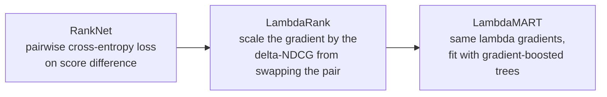
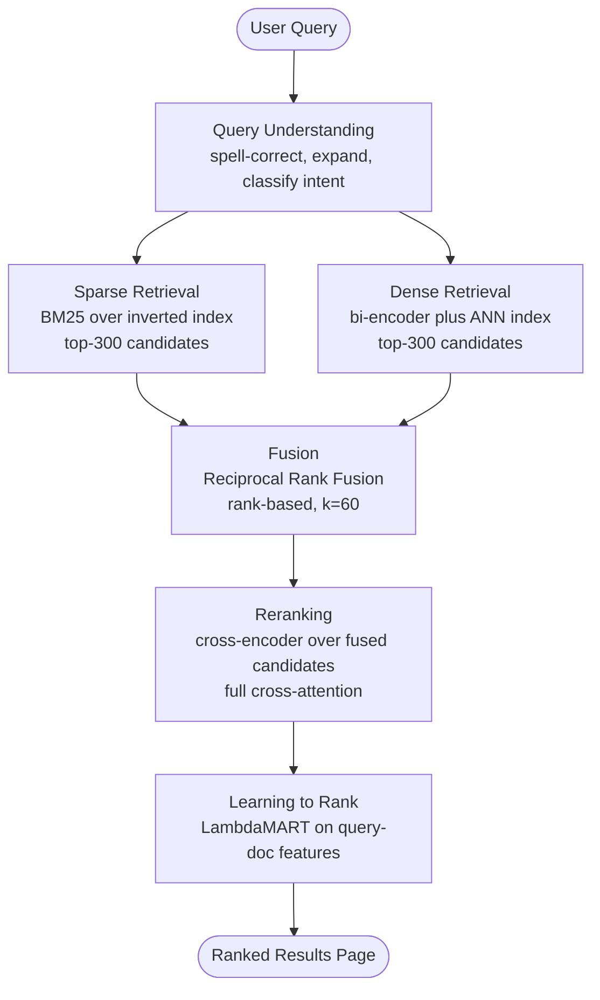
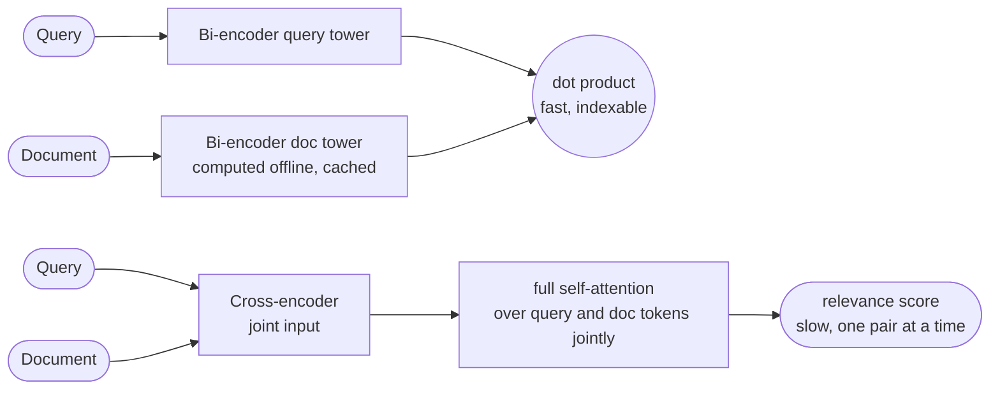
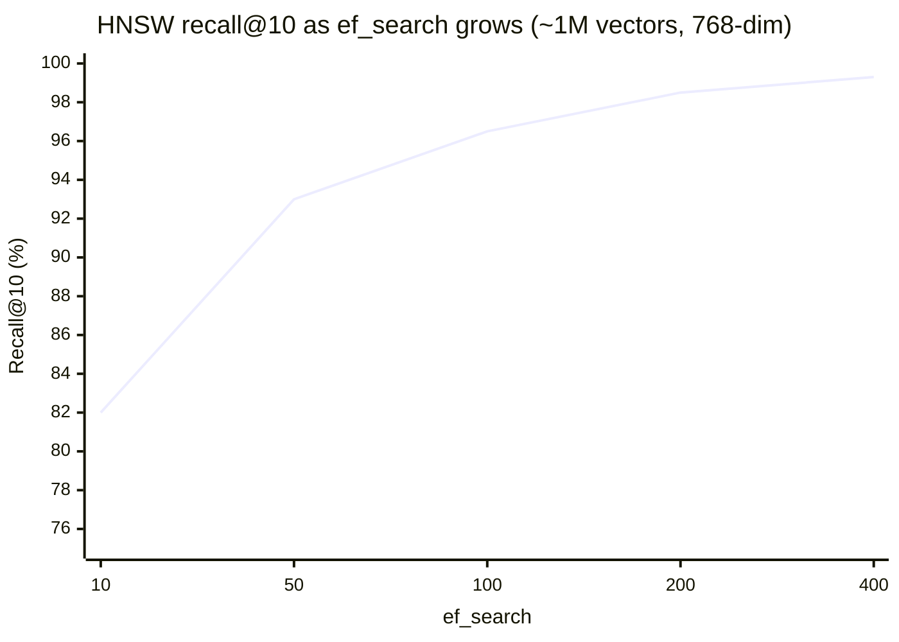

# Information Retrieval & Search

## 1. Concept Overview

Information retrieval (IR) is the problem of taking a query and a corpus of documents and returning the subset most relevant to that query, ordered so the best answers appear first. Formally: given a query q and a corpus D = {d1, ..., dN} (N often in the millions or billions), produce a ranked top-K list by an estimated relevance score rel(q, d). This is the machinery behind every search box — web search, e-commerce product search, code search, enterprise document search — and, since 2023, the "R" in every RAG system: an LLM only answers correctly if the ranked list handed to it actually contains the answer near the top.

Like a recommender system (see [Recommender Systems](../recommender_systems/README.md)), production search decomposes into a funnel: cheap retrieval narrows N documents down to a few hundred candidates, then an expensive ranker orders those candidates precisely. The difference is what drives the match — a recommender scores a user against items using historical interactions; a search engine scores a free-text query against documents using lexical overlap, learned embeddings, or both. Two representations dominate: sparse (one dimension per vocabulary term — TF-IDF, BM25) and dense (a few hundred learned dimensions that capture meaning — bi-encoder embeddings). Modern systems rarely pick one; they run both and fuse the results.

Concrete scale: Google's index holds hundreds of billions of pages; the ranking research behind RankNet, LambdaRank, and LambdaMART came directly out of Microsoft needing to order millions of candidate pages for Bing under a sub-second latency budget. Whatever the corpus size, the shape of the problem is identical: index once, offline, amortized over many queries; query many times, online, and fast.

---

## 2. Intuition

One-line analogy: a search engine is a librarian's card catalog paired with a panel of expert judges — the catalog (the inverted index) points to every shelf that might have the book in milliseconds; the judges (the ranker) then read the shortlist closely and put the single best book on top.

Mental model: two knobs, recall and precision, assigned to two different stages. Retrieval must not miss the right document anywhere in the corpus, so it optimizes recall over the full corpus cheaply (boolean matching, BM25 postings-list scoring, or an approximate nearest-neighbor index). Ranking then only has to get the order right among the few hundred candidates retrieval already found, so it can afford an expensive, feature-rich, or cross-attention model — precision over a small set.

Why it matters: a RAG pipeline with a state-of-the-art LLM generator and a mediocre retriever still hallucinates, because the model can only synthesize an answer from what retrieval handed it (see [RAG Fundamentals](../../llm/rag_fundamentals/README.md)). Get retrieval wrong and no amount of prompt engineering downstream fixes it.

Key insight: relevance is graded and query-dependent, not a fixed property of a document. The same manual page is highly relevant to "how do I reset my password" and irrelevant to "how do I cancel my subscription," so the matching function must be query-aware, and the evaluation metric must reward the right document sitting at rank 1, not merely being present somewhere in the list. That single realization is why accuracy is the wrong lens for a ranker (Section 10) and why NDCG, not accuracy, is the standard metric.

---

## 3. Core Principles

**The inverted index is the foundational data structure.** Instead of scanning every document for a query term (O(N) per term), maintain a mapping term -> sorted postings list of document ids, built once at index time; a query then only touches the postings lists of its own terms.

**Boolean retrieval matches; ranked retrieval orders.** Boolean queries (term1 AND term2 AND NOT term3) return an unordered set that either matches or does not — good for exact filtering, useless for choosing which of forty thousand matches is best. Ranked retrieval scores every candidate and sorts, which is what almost all production search actually does.

**Sparse retrieval scores lexical overlap.** TF-IDF and BM25 represent both query and document as vectors over the vocabulary and reward term overlap, weighted by how rare (informative) and how frequent (locally) each term is. Exact match by construction — a query for "TPS-4471" finds only documents containing that literal string.

**BM25 is TF-IDF made bounded and length-aware.** Its two tunable parameters, k1 (term-frequency saturation) and b (length normalization), turn the unbounded, length-blind raw-TF scoring of classic TF-IDF into a function that stops rewarding keyword repetition and stops unfairly penalizing long, legitimately comprehensive documents.

**Dense retrieval scores learned semantic similarity.** A bi-encoder embeds the query and each document into the same vector space independently; relevance becomes a dot product or cosine similarity. It generalizes across vocabulary mismatch (synonyms, paraphrase, cross-lingual) that sparse retrieval cannot see, at the cost of interpretability and exact-match guarantees.

**Approximate nearest-neighbor search makes dense retrieval tractable at scale.** Brute-force cosine similarity against a billion vectors is too slow; HNSW and IVF trade a small amount of recall for orders-of-magnitude speedup by never comparing against most of the corpus.

**Hybrid retrieval and Reciprocal Rank Fusion combine both worlds cheaply.** Run sparse and dense retrieval independently, then merge the two ranked lists using a rank-based formula, so no score-normalization tuning is required across the two very different scoring scales.

**A cross-encoder reranker is accurate because it is expensive.** Unlike a bi-encoder, it feeds the (query, document) pair through the same transformer together with full cross-attention, seeing token-level interactions the independent-embedding bi-encoder cannot — but it needs one forward pass per candidate, so it only ever scores the few hundred survivors of retrieval, never the full corpus.

**Learning to rank turns "which order" into a supervised learning problem.** Rather than hand-tuning weights between BM25, recency, and popularity, collect (query, document, relevance label) triples and train a model — pointwise, pairwise, or listwise — to directly optimize the order of the list, not the score of any single item.

**Ranking metrics must be position- and relevance-aware.** Accuracy or F1 on a binary relevant/irrelevant label ignores exactly the thing a ranked list exists to express: which item is on top. NDCG, MAP, MRR, and Precision@k all explicitly weight by rank position, and NDCG additionally weights by graded relevance.

**Offline metrics are a proxy for the real objective, and the two do diverge.** NDCG or MAP computed against historical relevance judgments measures fit to those judgments; the real goal — did the user succeed, did they click, did they convert — is only visible online. Ship on an A/B test, not an offline leaderboard.

---

## 4. Types / Architectures / Strategies

### 4.1 Sparse (Lexical) Retrieval

Boolean retrieval, TF-IDF, BM25, and BM25F (per-field weighting for structured documents, so a title match and a body match are not normalized the same way). SPLADE is a learned sparse model that still produces a term-weight vector searchable with the same inverted-index machinery, but with neural term expansion beyond exact vocabulary overlap.

### 4.2 Dense Retrieval

Bi-encoder / two-tower embeddings: a query tower and a document tower, independent, compared by dot product at query time — the same architecture as [Recommender Systems' two-tower](../recommender_systems/README.md), applied to free text instead of user and item ids. ANN index families: HNSW (a navigable-small-world graph), IVF / IVF-PQ (cluster-and-quantize), and ScaNN (anisotropic quantization).

### 4.3 Hybrid Retrieval

Run sparse and dense retrieval as two independent candidate-generation branches, then fuse with Reciprocal Rank Fusion (rank-based, no score calibration needed) or a weighted linear combination of normalized scores (needs tuning per query type, more brittle).

### 4.4 Reranking

Cross-encoder rerankers (a fine-tuned transformer scoring the (query, doc) pair jointly) applied to the top ~100-1000 fused candidates. ColBERT-style late interaction is a middle ground — token-level MaxSim scoring that is richer than a single vector but still indexable; see [Text Representation & Retrieval](../natural_language_processing/text_representation_and_retrieval.md) for the full ColBERT derivation.

### 4.5 Learning to Rank

Pointwise predicts a relevance score or class per (query, doc) pair independently — simple, but the loss has no notion of the list. Pairwise learns to correctly order a pair of documents for the same query: RankNet applies a cross-entropy loss to the score difference; LambdaRank reweights that same gradient by the change in NDCG that swapping the pair would cause. Listwise optimizes a loss defined over the whole ranked list at once: LambdaMART fits LambdaRank's gradients with gradient-boosted trees; ListNet optimizes a permutation-probability objective directly.



Each step keeps the previous step's core idea and fixes its blind spot: RankNet knows nothing about the ranking metric it will be judged on; LambdaRank injects that metric directly into the gradient; LambdaMART swaps RankNet's neural net for boosted trees, which is why LambdaMART, not a neural RankNet, is the default production learning-to-rank model on tabular query-document features.

### 4.6 Query Understanding

Spell correction, query segmentation, synonym or query expansion, query rewriting, intent classification (navigational, informational, transactional), and named entity recognition in queries (detecting a product model number so retrieval can boost an exact match). Sits before retrieval in the pipeline and directly controls what the retrieval stage even searches for.

---

## 5. Architecture Diagrams

### 5.1 End-to-End Retrieval and Ranking Pipeline



Sparse and dense retrieval run in parallel over the full corpus and stay cheap only because each stage narrows the set by orders of magnitude before the next, more expensive stage runs — the same retrieve-then-rank shape as a recommender pipeline, except the query is free text instead of a user id, and fusion has no equivalent in a single-retriever recsys pipeline.

### 5.2 The Inverted Index

```
Documents (indexed once, offline):
  D1: "the cat sat on the mat"
  D2: "the dog sat on the log"
  D3: "cats and dogs are friends"

Inverted index (built once):            posting = (doc_id, term_freq)
  term      ->  postings list
  ------------------------------------------------------
  cat       ->  [(D1, 1)]
  cats      ->  [(D3, 1)]
  dog       ->  [(D2, 1)]
  dogs      ->  [(D3, 1)]
  sat       ->  [(D1, 1), (D2, 1)]
  mat       ->  [(D1, 1)]
  log       ->  [(D2, 1)]
  the       ->  [(D1, 2), (D2, 2)]
  friends   ->  [(D3, 1)]

Query "sat" at search time:
  1. look up postings["sat"]     -> [(D1, 1), (D2, 1)]    one hash lookup
  2. score only D1 and D2                                 D3 is never touched
  3. a full scan reads all 3 documents; the index read only 2 postings lists
```

A query only ever touches the postings lists of its own terms — "sat" reaches D1 and D2 in one hash lookup each and never looks at D3 at all, which is the entire reason inverted-index lookup is sub-linear in corpus size while a full document scan is O(N).

### 5.3 Bi-Encoder vs Cross-Encoder



The bi-encoder never lets query and document tokens attend to each other, so every document embedding can be computed once, offline, and stored in an ANN index. The cross-encoder's entire value comes from letting query and document tokens attend to each other jointly, which means it must run a fresh forward pass for every pair and can never be pre-indexed — exactly why it is confined to reranking a few hundred candidates, never full-corpus retrieval.

### 5.4 HNSW: ef_search Trades Latency for Recall



Recall keeps climbing but with sharply diminishing returns — 82% to 93% for the first jump (ef_search 10 to 50) versus only 98.5% to 99.3% for the last (200 to 400) — while p50 query latency rises roughly in step: about 0.3ms, 0.8ms, 1.4ms, 2.6ms, and 5.1ms at those same five settings. There is no free lunch past roughly 95% recall; closing the last few points costs a disproportionate amount of latency, which is why production systems typically settle for ef_search in the 50-150 range rather than chasing 99%+ recall.

---

## 6. How It Works — Detailed Mechanics

### 6.1 Inverted Index and Boolean Retrieval

```python
from __future__ import annotations

from collections import defaultdict
from dataclasses import dataclass, field


@dataclass
class InvertedIndex:
    """Term -> postings list (doc_id, term_frequency), built once at index time."""

    postings: dict[str, dict[int, int]] = field(default_factory=lambda: defaultdict(dict))
    doc_lengths: dict[int, int] = field(default_factory=dict)
    doc_count: int = 0

    def add_document(self, doc_id: int, tokens: list[str]) -> None:
        self.doc_lengths[doc_id] = len(tokens)
        self.doc_count += 1
        term_freq: dict[str, int] = defaultdict(int)
        for tok in tokens:
            term_freq[tok] += 1
        for term, freq in term_freq.items():
            self.postings[term][doc_id] = freq

    def doc_ids_for(self, term: str) -> set[int]:
        return set(self.postings.get(term, {}).keys())

    def boolean_and(self, terms: list[str]) -> set[int]:
        """AND query: intersect postings lists -- matches, no ordering."""
        if not terms:
            return set()
        result = self.doc_ids_for(terms[0])
        for term in terms[1:]:
            result &= self.doc_ids_for(term)   # set intersection, not a score
        return result

    def avg_doc_length(self) -> float:
        return sum(self.doc_lengths.values()) / self.doc_count if self.doc_count else 0.0
```

### 6.2 BM25: Why Bounded, Length-Aware TF-IDF Wins

```python
import math


def bm25_score(
    query_terms: list[str],
    doc_id: int,
    index: InvertedIndex,
    k1: float = 1.2,
    b: float = 0.75,
) -> float:
    """Okapi BM25 -- ranked retrieval score for one document against a query."""
    avgdl = index.avg_doc_length()
    doc_len = index.doc_lengths[doc_id]
    score = 0.0
    for term in query_terms:
        postings = index.postings.get(term, {})
        f = postings.get(doc_id, 0)
        if f == 0:
            continue
        n_docs_with_term = len(postings)
        idf = math.log(
            (index.doc_count - n_docs_with_term + 0.5) / (n_docs_with_term + 0.5) + 1.0
        )
        length_norm = 1 - b + b * (doc_len / avgdl)
        score += idf * (f * (k1 + 1)) / (f + k1 * length_norm)
    return score
```

With k1=1.2 (Lucene and Elasticsearch's own default) and a fixed IDF term of 2.0, a single query term repeated 1, 2, 4, 8, and 16 times in a 50-token document scores 2.514, 3.200, 3.705, 4.023, and 4.203 -- marginal gains of 0.686, 0.505, 0.318, and 0.180 that visibly shrink toward the asymptote IDF x (k1+1) = 4.4. Raw TF x IDF, by contrast, is unbounded and would score those same five frequencies 2, 4, 8, 16, and 32 -- a document repeating a term 16 times would outscore a single natural mention by 16x under raw TF-IDF but only about 1.7x under BM25. That saturation is precisely why BM25 resists keyword-stuffing in a way plain TF-IDF cosine similarity does not.

The b parameter does the equivalent job for length: holding term frequency fixed at f=2, the same term scores 3.200 in a 50-token document, 2.750 at the 100-token corpus average, and only 1.492 in a 400-token document -- a document four times the average length needs proportionally more genuine hits to earn the same score, which stops BM25 from being biased toward long documents that mention every term once by accident.

**What the formula is telling you.** "Give a document credit for containing a rare query term, add more credit each time the term reappears but with rapidly shrinking returns, and dock that credit if the document only 'contains' the term because it is enormous."

Every BM25 term contribution is that one sentence: rarity times saturated frequency divided by a length tax. The two knobs, `k1` and `b`, control how fast the saturation kicks in and how steep the tax is — nothing else in the formula is tunable.

| Symbol | What it is |
|--------|------------|
| `f` | How many times the query term occurs in *this* document (the term frequency from the postings list) |
| `idf` | Rarity weight. `log((N - n + 0.5)/(n + 0.5) + 1)`, where `N` = corpus size, `n` = documents containing the term |
| `k1` | Saturation knob. Sets how quickly extra occurrences stop mattering. Lucene default `1.2` |
| `b` | Length-normalization knob, `0` to `1`. `0` = ignore document length entirely, `1` = full proportional penalty. Lucene default `0.75` |
| `doc_len / avgdl` | This document's length relative to the corpus average. `2.0` = twice as long as typical |
| `1 - b + b*(doc_len/avgdl)` | The length tax itself. Always `1.0` for an average-length document, whatever `b` is |
| `f*(k1+1) / (f + k1*L)` | The saturating TF factor. Climbs toward the ceiling `k1+1` and never passes it |

**Walk the k1 knob.** Hold the document at exactly average length (so the length tax `L = 1.0`) and `IDF = 2.0`, then sweep `k1` across the same five term frequencies used above:

```
  score = IDF x  f x (k1 + 1) / ( f + k1 x L ),   IDF = 2.0,  L = 1.0

  k1     f=1     f=2     f=4     f=8    f=16    what this k1 setting means
  0.0   2.000   2.000   2.000   2.000   2.000   TF ignored entirely -- score = IDF, purely
                                                "does the term occur at all"
  0.5   2.000   2.400   2.667   2.824   2.909   saturates almost at once; ceiling IDF x 1.5 = 3.0
  1.2   2.000   2.750   3.385   3.826   4.093   Lucene/Elasticsearch default; ceiling 4.4
  2.0   2.000   3.000   4.000   4.800   5.333   repetition still buys real score; ceiling 6.0
  5.0   2.000   3.429   5.333   7.385   9.143   nearly linear in f -- BM25 degenerating toward
                                                raw, keyword-stuffable TF
```

Read the table left to right and `k1` is a dial between two extremes: at `k1 = 0` BM25 becomes a bag of yes/no term indicators weighted only by rarity, and as `k1` grows it slides back toward the unbounded raw TF that BM25 exists to fix. The ceiling of any single term's contribution is always `IDF x (k1 + 1)`, so raising `k1` from `1.2` to `5.0` more than doubles how much one repeated word can dominate a query.

**Now walk the b knob.** Fix `f = 2` and `k1 = 1.2`, and score the same term in a 50-token, a 100-token (corpus average), and a 400-token document:

```
  length tax L = 1 - b + b x (doc_len / avgdl),   avgdl = 100

  b        L at 50 / 100 / 400        score at 50    at 100    at 400
  0.00    1.000 / 1.000 / 1.000          2.750      2.750      2.750   length-blind
  0.50    0.750 / 1.000 / 2.500          3.034      2.750      1.760   half penalty
  0.75    0.625 / 1.000 / 3.250          3.200      2.750      1.492   Lucene default
  1.00    0.500 / 1.000 / 4.000          3.385      2.750      1.294   full proportional

  The 100-token column never moves: L = 1 for an average-length doc at every b.
```

That fixed middle column is the useful mental hook — `b` rotates the scoring line around the corpus average. Turning `b` up rewards short focused documents and punishes long ones harder; turning it to `0` lets a 10,000-word page win simply by mentioning every term once. Without the length tax, the highest-scoring document for almost any query is the longest one in the index, which is exactly the failure mode BM25's authors were correcting.

```python
from rank_bm25 import BM25Okapi

corpus_tokens = [doc.split() for doc in ["the cat sat on the mat", "the dog sat on the log"]]
bm25 = BM25Okapi(corpus_tokens, k1=1.2, b=0.75)
scores = bm25.get_scores("cat sat".split())   # same formula, real library
```

```python
from sklearn.feature_extraction.text import TfidfVectorizer
from sklearn.metrics.pairwise import cosine_similarity

vectorizer = TfidfVectorizer()
doc_vectors = vectorizer.fit_transform(["the cat sat on the mat", "the dog sat on the log"])
query_vector = vectorizer.transform(["cat sat"])
tfidf_scores = cosine_similarity(query_vector, doc_vectors)[0]
# Unbounded raw term counts feed the TF factor here -- no k1 saturation, and
# cosine's own length normalization is a single fixed L2 norm, not a tunable b.
```

**Read it like this.** "A word earns its keep by being frequent *here* and rare *everywhere else* — TF-IDF is just those two numbers multiplied, and IDF is the half that decides whether a word carries any information at all."

TF-IDF and BM25 share this rarity half unchanged; BM25 only replaces the frequency half (with the saturating `f*(k1+1)/(f + k1*L)` factor above). So understanding IDF once buys you both scorers.

| Symbol | What it is |
|--------|------------|
| `N` | Total documents in the corpus (`index.doc_count`) |
| `n` | Documents whose postings list contains the term (`len(postings)`) |
| `N/n` | "One in how many documents has this word." Big = rare = informative |
| `log(...)` | Compresses that ratio into a weight, so a 100x-rarer term is worth a few times more, not 100x more |
| `+0.5` terms | Smoothing, so `n = 0` or `n = N` never divides by zero or blows up |
| `+1.0` inside the log | Floors the weight at `0`: a term in literally every document contributes nothing rather than going negative |
| `TF x IDF` | The classic product. Raw `f`, unbounded — this is what BM25's `k1` fixes |

**Walk one example.** A one-million-document corpus, IDF computed exactly as the `bm25_score` code above computes it:

```
  idf = log( (N - n + 0.5) / (n + 0.5) + 1.0 ),   N = 1,000,000

  term appears in n docs        idf      reading
        1  (a typo, a serial)  13.410    almost a unique key -- one hit nearly decides the ranking
      100  ("photoemission")    9.205    strongly discriminative jargon
   10,000  ("mortgage")         4.605    ordinary topical word
  500,000  ("system")           0.693    half the corpus -- weak signal
  900,000  ("with")             0.105    near-stopword, contributes almost nothing
1,000,000  ("the")              0.000    in every document -- exactly zero weight
```

Notice the last row: IDF is why search engines never needed a hand-maintained stopword list to stop "the" from dominating results — a term present in all `N` documents scores `log(0.0000005 + 1) = 0.000` and drops out on its own arithmetic. Notice also the compression: going from 10,000 documents to 100 makes a term 100x rarer but only about 2x more valuable (`4.605 -> 9.205`), which keeps one lucky rare token from swamping the four ordinary query terms around it.

Multiply that column by raw `f` and you have TF-IDF; multiply it by the saturated, length-taxed frequency factor instead and you have BM25. The cosine similarity in the code above adds one more difference — it divides by the vector's L2 norm, which is a single fixed length normalization with no `b` to tune, so you cannot dial the length penalty per corpus the way BM25 lets you.

### 6.3 Dense Retrieval: Bi-Encoder Cosine Search

```python
import numpy as np


def bi_encoder_topk(
    query_vec: np.ndarray,
    doc_vecs: np.ndarray,
    doc_ids: list[int],
    k: int = 10,
) -> list[tuple[int, float]]:
    """Brute-force cosine top-k -- what an ANN index (HNSW/IVF) approximates.

    doc_vecs are precomputed offline (e.g. 384-dim sentence-transformers
    embeddings); only query_vec is computed at request time.
    """
    q = query_vec / np.linalg.norm(query_vec)
    d = doc_vecs / np.linalg.norm(doc_vecs, axis=1, keepdims=True)
    sims = d @ q                      # cosine similarity via dot product on unit vectors
    top_idx = np.argsort(-sims)[:k]
    return [(doc_ids[i], float(sims[i])) for i in top_idx]
```

### 6.4 Hybrid Fusion: Reciprocal Rank Fusion

```python
def reciprocal_rank_fusion(
    rankings: list[list[int]],
    k: int = 60,
) -> list[tuple[int, float]]:
    """Fuse multiple ranked lists (e.g. BM25 + dense) by rank alone -- no
    score normalization needed because RRF only ever looks at position.
    """
    scores: dict[int, float] = defaultdict(float)
    for ranking in rankings:
        for rank, doc_id in enumerate(ranking, start=1):
            scores[doc_id] += 1.0 / (k + rank)
    return sorted(scores.items(), key=lambda x: x[1], reverse=True)


# Worked example: BM25 top-4 vs dense top-4 over the same 5-document corpus
bm25_ranking = [1, 3, 5, 2]     # doc ids, in BM25 rank order
dense_ranking = [2, 1, 4, 3]    # doc ids, in dense rank order
fused = reciprocal_rank_fusion([bm25_ranking, dense_ranking], k=60)
# fused == [(1, 0.032522), (2, 0.032018), (3, 0.031754), (5, 0.015873), (4, 0.015873)]
# Doc 1 wins: rank 1 in BM25 and rank 2 in dense beats doc 2's rank-1-in-dense
# but rank-4-in-BM25 -- RRF rewards consistently-good over spiky-in-one-list.
```

### 6.5 Ranking Metrics: Precision@k, MRR, MAP, NDCG

```python
def precision_at_k(ranked_ids: list[int], relevant: set[int], k: int) -> float:
    """Fraction of the top-k results that are relevant."""
    top_k = ranked_ids[:k]
    return len(set(top_k) & relevant) / k


def reciprocal_rank(ranked_ids: list[int], relevant: set[int]) -> float:
    """1 / rank of the first relevant result, 0 if none found."""
    for rank, doc_id in enumerate(ranked_ids, start=1):
        if doc_id in relevant:
            return 1.0 / rank
    return 0.0


def average_precision(ranked_ids: list[int], relevant: set[int]) -> float:
    """Mean of precision@k evaluated at every rank where a relevant doc appears."""
    hits = 0
    precisions = []
    for rank, doc_id in enumerate(ranked_ids, start=1):
        if doc_id in relevant:
            hits += 1
            precisions.append(hits / rank)
    return sum(precisions) / len(relevant) if relevant else 0.0


def dcg_at_k(relevances: list[int], k: int) -> float:
    """Discounted Cumulative Gain: graded relevance, log-discounted by rank."""
    return sum(
        (2 ** rel - 1) / math.log2(rank + 1)
        for rank, rel in enumerate(relevances[:k], start=1)
    )


def ndcg_at_k(relevances: list[int], k: int) -> float:
    """Normalize DCG by the DCG of the ideal (sorted-by-relevance) ordering."""
    ideal = sorted(relevances, reverse=True)
    actual_dcg = dcg_at_k(relevances, k)
    ideal_dcg = dcg_at_k(ideal, k)
    return actual_dcg / ideal_dcg if ideal_dcg > 0 else 0.0
```

**NDCG@5 worked example.** A ranker retrieves five documents with graded relevance (0-3) in this order, versus the ideal order sorted by relevance:

```
Retrieved order (rank 1..5), graded relevance 0-3:  [3, 2, 0, 1, 2]
Ideal order (sorted by relevance):                  [3, 2, 2, 1, 0]

rank   rel   gain=2^rel-1   discount=1/log2(rank+1)   contribution
  1     3         7                 1.0000                7.0000
  2     2         3                 0.6309                1.8928
  3     0         0                 0.5000                0.0000
  4     1         1                 0.4307                0.4307
  5     2         3                 0.3869                1.1606
                                             DCG@5    =   10.4840

ideal  rel   gain           discount                   contribution
  1     3         7                 1.0000                7.0000
  2     2         3                 0.6309                1.8928
  3     2         3                 0.5000                1.5000
  4     1         1                 0.4307                0.4307
  5     0         0                 0.3869                0.0000
                                             IDCG@5   =   10.8235

NDCG@5 = DCG@5 / IDCG@5 = 10.4840 / 10.8235 = 0.9686
```

The retrieved order earns 96.9% of the ideal ordering's gain even though it placed a rel=2 document at rank 5 instead of rank 3, because the log2 discount only mildly penalizes a near-miss one rank away at that depth -- NDCG rewards getting the highest-relevance items as close to rank 1 as possible without demanding a perfect match to be useful.

**Put simply.** "Precision@k asks *how many* good results you returned, MRR asks *how fast* you returned the first one, MAP asks *how early you returned all of them*, and NDCG asks *how well you ordered them by how good they are*." Four different questions about the same list, which is why they disagree.

| Symbol | What it is |
|--------|------------|
| `rank` | Position in the returned list, counted from `1`. Every one of these metrics is a function of it |
| `rel` | Graded relevance label, `0-3` here. Binary metrics collapse this to "relevant if `rel >= 1`" |
| `P@k` | Relevant items in the top `k`, divided by `k`. Order *inside* the top `k` is invisible to it |
| `RR` | `1 / rank` of the first relevant result. `1.0`, `0.5`, `0.33`... — nothing after the first hit matters |
| `AP` | Average of `P@rank` taken only at the ranks where a relevant document sits |
| `2^rel - 1` | Gain. Makes relevance exponential: `rel=3` is worth `7`, `rel=2` is worth `3` — a "perfect" hit outranks two "good" ones |
| `1/log2(rank+1)` | The rank discount. `1.000, 0.631, 0.500, 0.431, 0.387` at ranks 1-5 |
| `MRR` / `MAP` | Just `RR` and `AP` averaged over all queries in the eval set. The leading `M` is only "mean" |

**Walk all four down one shared list.** A different query, five results returned, graded relevance in the order returned — everything below is computed from this one row:

```
  Returned order (rank 1..5), graded relevance 0-3:   [0, 2, 3, 0, 1]
  Binary view (relevant if rel >= 1):                 [.,  R, R, .,  R]   3 relevant docs total

  PRECISION@k -- counts, ignores order within the cut
    P@1 = 0 relevant / 1 = 0.000        the top slot is a miss
    P@3 = 2 relevant / 3 = 0.667
    P@5 = 3 relevant / 5 = 0.600

  MRR -- only the first hit exists
    first relevant is at rank 2  ->  RR = 1/2 = 0.500
    (ranks 3 and 5 change nothing; the rel=3 document at rank 3 is invisible here)

  MAP -- precision re-measured at every hit, then averaged
    hit at rank 2 :  1 hit  / 2 =  0.500
    hit at rank 3 :  2 hits / 3 =  0.667
    hit at rank 5 :  3 hits / 5 =  0.600
    AP = (0.500 + 0.667 + 0.600) / 3 relevant = 0.589

  NDCG@5 -- graded, discounted, normalized
    rank   rel   gain=2^rel-1   discount   contribution
      1     0          0         1.0000       0.0000
      2     2          3         0.6309       1.8928
      3     3          7         0.5000       3.5000
      4     0          0         0.4307       0.0000
      5     1          1         0.3869       0.3869
                                    DCG@5  =  5.7796

    ideal order [3, 2, 1, 0, 0]:
      1     3          7         1.0000       7.0000
      2     2          3         0.6309       1.8928
      3     1          1         0.5000       0.5000
      4     0          0         0.4307       0.0000
      5     0          0         0.3869       0.0000
                                   IDCG@5  =  9.3928

    NDCG@5 = 5.7796 / 9.3928 = 0.615

  SAME LIST, FOUR VERDICTS:   P@5 = 0.600   MRR = 0.500   MAP = 0.589   NDCG@5 = 0.615
```

The four numbers land close together here by coincidence, but they are measuring genuinely different failures. Shuffle the top five into any other order and `P@5` stays `0.600` — it cannot see order at all. Move the `rel=3` document from rank 3 up to rank 1 and `MRR` improves to `1.000` while `P@5` still does not move; `NDCG@5` jumps to `1.000` because gain `7` now collects the full `1.0` discount. Conversely, drag the rank-5 hit down to rank 20 and `MRR` is untouched at `0.500` while `MAP` and `NDCG` both fall — MRR is the only one of the four that stops looking after the first success.

**Why the M is trivial and the metric underneath is not.** MRR and MAP are per-query numbers averaged across the eval set; the averaging is the easy part, and interview answers that describe only the mean miss the whole mechanism:

```
  query A (the list above) :  RR = 0.500    AP = 0.589
  query B (perfect top-2)  :  RR = 1.000    AP = 1.000

  MRR = (0.500 + 1.000) / 2 = 0.750
  MAP = (0.589 + 1.000) / 2 = 0.794
```

Pick the metric that matches the product. A navigational search or a question-answering box where the user reads exactly one result is an MRR problem. A legal or patent search where the user must find every relevant document is a MAP problem. A feed or shopping results page with graded quality labels is an NDCG problem. Optimizing MRR for a use case that actually needs recall is a real and common way to ship a ranker that scores well offline and frustrates users online.

### 6.6 Learning to Rank: Pointwise, Pairwise, Listwise

```python
from sklearn.linear_model import LogisticRegression

# Pointwise: treat each (query, doc) row independently as binary relevant/not.
# X: query-doc features (BM25 score, dense cosine, price, freshness, ...)
# y: 1 if relevant, 0 if not -- the loss never sees the other candidates.
pointwise_model = LogisticRegression()
pointwise_model.fit(X_train, y_train)
```

Pairwise models (RankNet) instead build training examples from pairs of documents for the same query and push the higher-relevance document's score above the lower one's; LambdaRank scales that same pairwise gradient by the change in NDCG the swap would cause (Section 4.5). Listwise LambdaMART fits those lambda gradients with gradient-boosted trees rather than a neural network:

```python
import lightgbm as lgb

# Listwise (LambdaMART): group tells the ranker which rows share a query, so
# its lambda gradients are computed within each query's candidate list, not
# across unrelated queries.
ranker = lgb.LGBMRanker(objective="lambdarank", metric="ndcg", n_estimators=200)
ranker.fit(
    X_train, y_train,
    group=query_group_sizes_train,       # e.g. [42, 37, 55, ...] rows per query
    eval_set=[(X_valid, y_valid)],
    eval_group=[query_group_sizes_valid],
    eval_at=[10],                          # optimize/report NDCG@10
)
```

### 6.7 Broken -> Fix: Evaluating a Ranker With the Wrong Metric and a Leaky Split

```python
# BROKEN: (1) evaluate with row-level accuracy, which has no concept of rank
# position, and (2) split rows randomly, so the same query's other candidate
# documents leak between train and test.
from sklearn.model_selection import train_test_split
from sklearn.metrics import accuracy_score

X_train, X_test, y_train, y_test = train_test_split(X, y, test_size=0.2, random_state=0)
model.fit(X_train, y_train)
print("accuracy:", accuracy_score(y_test, model.predict(X_test)))   # 0.91 -- looks great
# 0.91 measures "did we label individual rows right," not "is the top of the
# list good" -- and query "q17" can have 3 of its 5 candidate rows in train
# and 2 in test, so the model partially memorized q17 before being "tested."
```

```python
# FIX: split whole queries into train or test (never both), and evaluate
# with NDCG@k, which is rank- and relevance-aware.
from sklearn.model_selection import GroupShuffleSplit

splitter = GroupShuffleSplit(n_splits=1, test_size=0.2, random_state=0)
train_idx, test_idx = next(splitter.split(X, y, groups=query_ids))
X_train, X_test = X[train_idx], X[test_idx]
y_train, y_test = y[train_idx], y[test_idx]

model.fit(X_train, y_train)
per_query_ndcg = [
    ndcg_at_k(relevances_for_query, k=10)
    for relevances_for_query in group_relevances_by_query(model, X_test, query_ids[test_idx])
]
print("mean NDCG@10:", sum(per_query_ndcg) / len(per_query_ndcg))   # 0.61 -- the honest number
```

---

## 7. Real-World Examples

**Lucene / Elasticsearch / OpenSearch**: The reference implementation of BM25 in production. Lucene's default k1=1.2, b=0.75 are the values almost every tutorial (and this module) uses, because they are the values billions of real queries have been tuned against since Lucene adopted BM25 as its default similarity in 2015.

**Microsoft Bing -- RankNet, LambdaRank, LambdaMART**: These three algorithms were developed at Microsoft Research specifically to rank Bing's search results and remain the textbook reference for pairwise and listwise learning to rank. LambdaMART went on to win the Yahoo Learning to Rank Challenge (2010) and is still a common baseline in ranking research.

**Google Search**: Combines decades of lexical and link signal with neural reranking (RankBrain, then BERT-based rerankers from 2019) applied to the top results of the lexical stage -- a textbook hybrid-then-rerank pipeline at planet scale.

**Amazon product search**: Runs sparse lexical matching (so "USB-C cable 6ft" reliably matches the literal spec) alongside dense retrieval for paraphrase queries ("charger cord for laptop"), fused before a learned reranker that also weighs price, ratings, and inventory.

**GitHub / Sourcegraph code search**: A specialized inverted index over code-aware tokens (identifiers split on camelCase and snake_case, symbols indexed separately from comments) -- a direct application of Section 6.1's inverted index with a domain-specific tokenizer.

**Retrieval-Augmented Generation systems**: Every RAG pipeline (see [RAG Fundamentals](../../llm/rag_fundamentals/README.md)) is this module wearing a different hat -- chunks take the place of documents, and the same hybrid BM25 + dense + rerank pipeline decides what context an LLM ever sees.

**Yahoo / Microsoft LETOR benchmark datasets**: Public query-document-feature-relevance datasets (LETOR, MSLR-WEB10K, the Yahoo LTR Challenge corpus) are why LambdaMART became the default academic and industrial baseline -- they gave every research group the same (query, doc, feature vector, relevance grade) triples to train and compare pointwise, pairwise, and listwise models against.

---

## 8. Tradeoffs

| Dimension | Sparse (BM25 / TF-IDF) | Dense (bi-encoder) |
|-----------|------------------------|---------------------|
| Match type | Exact lexical overlap | Learned semantic similarity |
| Handles synonyms / paraphrase | No | Yes |
| Handles rare IDs, codes, numbers | Yes (exact) | Poor (often OOV or diluted) |
| Interpretability | High (term contributions visible) | Low (opaque vector) |
| Index build cost | Cheap (postings lists) | Expensive (embed every document) |
| Needs training data | No | Yes (pairs or triples) |
| Cross-lingual | No | Yes (with a multilingual encoder) |

| ANN Index | Recall@10 (typical) | Latency | Memory | Best for |
|-----------|----------------------|---------|--------|----------|
| Brute-force | 100% | Highest (O(N)) | Lowest | Small corpora (under 100K) |
| IVF | ~90-95% | Low | Lowest of the ANN options | Huge corpora, easy sharding |
| HNSW | ~96-99% | Low-medium | Highest (graph edges) | Best recall/latency at moderate memory |
| IVF-PQ | ~85-93% | Lowest | Very low (compressed vectors) | Billions of vectors, memory-constrained |

| Metric | Relevance | Position-aware | Answers |
|--------|-----------|-----------------|---------|
| Precision@k | Binary | Only within top-k | How many of the top k are relevant |
| MRR | Binary | Yes, first hit only | How fast do I find one good answer |
| MAP | Binary | Yes, across all relevant hits | How good is the whole ranking, averaged over queries |
| NDCG@k | Graded | Yes, log-discounted | How close to the ideal ordering is this list |

| LTR Approach | Optimizes | Training cost | Correlates with ranking metric | Examples |
|--------------|-----------|----------------|----------------------------------|----------|
| Pointwise | Per-item score or class | Lowest | Weak | Logistic regression, plain regression |
| Pairwise | Relative order of a pair | Medium | Better | RankNet, BPR |
| Listwise | Whole-list objective | Highest | Best | LambdaRank, LambdaMART, ListNet |

---

## 9. When to Use / When NOT to Use

**Use boolean retrieval when:** exact recall guarantees matter more than ranking (legal discovery, patent prior-art search), or the corpus is small and structured enough that a match/no-match filter is the actual requirement.

**Use sparse (BM25) retrieval when:** queries contain exact identifiers, part numbers, legal citations, or code symbols; interpretability is required; there is no labeled training data to fit an encoder; GPU or embedding infrastructure is unavailable.

**Use dense retrieval when:** queries and documents use different vocabulary for the same concept (paraphrase, synonyms, cross-lingual); semantic similarity matters more than literal term overlap; enough (query, relevant-doc) pairs exist to train or fine-tune an encoder.

**Use hybrid retrieval when:** in production, almost always -- fusing sparse and dense recovers each method's blind spot for a small latency cost.

**Use cross-encoder reranking when:** the latency budget allows scoring only the top ~100-1000 candidates, and the last few points of ranking quality at the very top of the page matter, which they usually do, since most users never scroll past position 10.

**Use learning-to-rank (LambdaMART) when:** query-document features beyond a single similarity score are available (price, freshness, popularity, click history) and either relevance judgments or a click-derived training set exist with enough volume per query.

**Do NOT rely on dense retrieval alone when:** the query is likely to contain an out-of-vocabulary token the encoder has never seen (a new product SKU, a just-filed legal case number) -- pair it with sparse retrieval or it will silently return semantically-similar-but-wrong documents.

**Do NOT judge a ranker by an offline leaderboard alone when:** no online experiment is planned -- offline NDCG gains are a necessary gate, not a sufficient one (Section 10).

---

## 10. Common Pitfalls

**Pitfall 1 -- Evaluating a ranker with the wrong metric and a leaky split.** A team built an LTR reranker, evaluated it with plain classification accuracy on a random 80/20 row split, and saw 91% accuracy, so they shipped it. Root cause: two compounding mistakes. Accuracy ignores rank position entirely, so a model that gets every individual relevance label "right" can still put the second-best document above the best one and score identically on accuracy while NDCG collapses; and the random row split let the same query's other candidate documents appear in both train and test, so the model partially memorized each test query's document set before being "evaluated" on it. Online, the A/B test showed a 0% change in successful searches. Fix: split by query id with `GroupShuffleSplit` so an entire query's candidates land on only one side, and gate on NDCG@10 computed per query and averaged -- the honest offline number came in at 0.61, not 0.91.

**Pitfall 2 -- BM25 defaults mistuned for the actual document-length distribution.** A job-search engine used Elasticsearch's default b=0.75 across job titles (median 6 tokens) and full descriptions (median 400 tokens) in the same index. Short, highly-relevant titles were penalized by length normalization tuned for long documents, so titles matching the query exactly ranked below long descriptions that merely mentioned the term once. Fix: BM25F with per-field b values (roughly 0.3 for short titles, 0.75 for long descriptions) or separate per-field indexes scored and combined explicitly.

**Pitfall 3 -- Silent recall collapse from an over-aggressive ANN setting.** A team cut HNSW's ef_search from 200 to 20 to hit a p99 latency target under load, verified the latency win, and shipped. Recall@10 silently dropped from about 0.985 to 0.65, because no offline recall check gated the latency change, only a latency dashboard. Users reported "the exact document I know exists doesn't show up," which took two weeks to trace back to the ef_search change. Fix: treat ef_search (or nprobe for IVF) as a tuned parameter with its own recall regression test in CI, not a free knob for a latency fire drill.

**Pitfall 4 -- Reranking a candidate set that was never wide enough.** A cross-encoder reranker was applied only to BM25's raw top-10, on the assumption that the expensive model would fix any ordering mistakes. It cannot promote a document retrieval never found in the first place: offline analysis showed the true best answer was outside the top-10 sparse candidates for 18% of test queries, an unrecoverable ceiling no reranker can fix. Fix: widen first-stage retrieval to top-300-1000 candidates before reranking, and track Recall@N as its own metric so this ceiling is visible instead of hidden inside a lower final NDCG.

**Pitfall 5 -- A leaked feature in the learning-to-rank model.** An LTR model included a document's historical click-through count as a training feature. Offline NDCG hit a suspicious 0.93, because click count is partly a consequence of the previous ranker's own placement decisions -- a document shown at rank 1 accumulates clicks regardless of true quality -- so the feature let the new model rediscover and reproduce the old ranker's ordering rather than learn genuine relevance. Fix: exclude any feature that is itself downstream of past ranking decisions (shown position, cumulative clicks under the current policy) unless it is corrected with inverse propensity weighting first.

**Pitfall 6 -- Aggressive query rewriting collapsing distinct intents.** A query-understanding layer stemmed and synonym-expanded every query, including proper nouns -- "cats the musical tickets" was stemmed and expanded with pet-supply synonyms, burying the actual Broadway listing under cat-food results. Fix: gate aggressive rewriting behind an intent or entity check (a capitalized multi-word phrase or a recognized title should skip stemming and synonym expansion), and A/B test any change to query understanding the same way a ranking model change would be tested, since it alters retrieval just as much as a new scoring function does.

---

## 11. Technologies & Tools

| Category | Tools |
|----------|-------|
| Inverted-index search engines | Apache Lucene, Elasticsearch, OpenSearch, Solr, Typesense, Meilisearch |
| Sparse retrieval libraries | rank_bm25 (Python), Pyserini / Anserini, SPLADE |
| Dense retrieval / embeddings | sentence-transformers, Cohere Embed, OpenAI embeddings, E5, BGE |
| ANN / vector search | FAISS, HNSWlib, ScaNN (Google), Annoy, Milvus, Qdrant, Weaviate, Pinecone |
| Cross-encoder rerankers | Cohere Rerank, sentence-transformers CrossEncoder, ms-marco-MiniLM |
| Learning to rank | LightGBM (LGBMRanker), XGBoost (rank:pairwise / rank:ndcg), RankLib |
| Offline evaluation | pytrec_eval, trec_eval, ranx |
| Query understanding | spaCy, Hunspell (spell correction), fastText (query classification) |

---

## 12. Interview Questions with Answers

**Why can a ranker with high offline accuracy still fail completely when it ships?**
Accuracy on a binary relevant/irrelevant label ignores rank position entirely, so a model can label every row "correctly" while still placing the best document below the second-best. This gap is compounded when the train/test split is random by row instead of grouped by query, because the same query's other candidates leak across the split and inflate the offline number. Always gate ranking models on NDCG or MAP computed per query, not on row-level accuracy.

**Why must a learning-to-rank train/test split be grouped by query rather than randomized by row?**
A random row split lets some of a query's candidate documents fall into training while others fall into test, so the model has effectively already seen part of that query's answer set before being evaluated on it. This inflates every offline metric, and the inflation is invisible until an online A/B test shows no real lift. Use a grouped split (`GroupShuffleSplit` or `GroupKFold` keyed on query id) so an entire query's candidates land on only one side.

**Why does BM25 outperform raw TF-IDF cosine similarity for ranked retrieval?**
BM25 bounds the contribution of term frequency and explicitly normalizes for document length, while raw TF-IDF's term-frequency component is unbounded and its length handling is a single fixed L2 norm. Concretely, with k1=1.2 a term repeated 1, 2, 4, 8, 16 times in the same document scores 2.51, 3.20, 3.71, 4.02, 4.20 -- clearly saturating -- while raw TF x IDF scores those same counts 2, 4, 8, 16, 32, rewarding keyword-stuffing 16x over a single mention. Prefer BM25 over plain TF-IDF cosine for anything an SEO-motivated author might try to game.

**What do BM25's k1 and b parameters actually control?**
k1 controls how quickly additional occurrences of a term stop adding score, and b controls how strongly a document's length relative to the corpus average penalizes its score. At k1=1.2 (Lucene and Elasticsearch's default), score approaches an asymptote of IDF times 2.2 no matter how many times a term repeats; at b=0.75, a document four times the average length needs proportionally more genuine hits to match a same-relevance average-length document. Tune b toward 0 for corpora of short, unevenly-lengthed documents like titles, and tune k1 down where any repetition is already meaningful, such as code or structured records.

**Why can't a reranker fix a document that first-stage retrieval never found?**
A cross-encoder reranker only ever scores the candidates handed to it, so if the true best document is outside that candidate set, reranking cannot mathematically promote it. This is a recall ceiling: analysis of a real pipeline found the correct answer missing from the top-10 sparse candidates for 18% of queries, a gap no reranking sophistication could close. Widen first-stage retrieval to several hundred candidates and track Recall@N as its own metric so the ceiling is visible instead of hidden inside a disappointing final NDCG.

**Why does including a document's shown position or click count as an LTR feature quietly leak the label?**
Both signals are partly a consequence of where the previous ranker already placed the document, not a pure measure of relevance. A model trained on them partly learns to reproduce the old ranker's decisions rather than discover genuine relevance signal, and can show suspiciously high offline NDCG while performing no better, or worse, online. Exclude features that are themselves downstream of past ranking decisions, or correct them with inverse propensity weighting before training.

**Why does dense retrieval often fail on rare identifiers, product codes, or legal citations?**
A learned embedding model represents text as a smooth vector space fit to its training distribution. A token it rarely saw during training gets an embedding that reflects surface-level similarity rather than the exact identity the query needs, and sparse retrieval has no such gap because it matches the literal string via the inverted index regardless of how rare the token is. Pair dense retrieval with a sparse channel whenever the corpus contains exact identifiers users will search for verbatim.

**Why do offline NDCG gains sometimes fail to translate into online metric improvements?**
Offline NDCG measures fit to historical relevance judgments or logged clicks, generated under the old ranking policy's own biases. Online metrics measure what actually happens when real users see the new ranking, and a model can better fit the old, biased judgments without serving users better, or the offline judgment set can simply be too small or stale. Treat offline metrics as a promotion gate, not a launch decision, and confirm with an online A/B test before a full rollout.

**What is an inverted index and why is it faster than scanning every document?**
An inverted index maps each vocabulary term to a sorted postings list of the document ids that contain it, built once at index time. A query for a term becomes a single hash lookup into that term's postings list instead of reading every document in the corpus, so a query touching t terms costs roughly the sum of those t postings lists' sizes rather than O(N) per term. This is the structural reason web-scale search returns results in milliseconds against a corpus of billions.

**What is the difference between boolean and ranked retrieval?**
Boolean retrieval evaluates a query as a logical expression over postings lists and returns an unordered set of documents that either match or do not. Ranked retrieval scores every candidate document against the query and returns them ordered by estimated relevance, which is what almost every modern search product needs, since users only look at the first handful of results. Boolean retrieval still matters for exact-recall use cases like legal discovery, where a missed document is unacceptable regardless of ranking.

**How does Reciprocal Rank Fusion combine a sparse and a dense ranking, and why does it use rank instead of score?**
RRF assigns each document a score of 1/(k + rank) in each list it appears in and sums across lists, using only rank position rather than the raw similarity scores. This sidesteps the problem that BM25 scores and cosine similarities live on completely different, uncalibrated scales, so no score-normalization tuning is required to combine them. The constant k (60 is the common default) softens the difference between adjacent ranks so a document at rank 1 does not completely dominate one at rank 2.

**Why is a cross-encoder more accurate than a bi-encoder, and why is it confined to reranking?**
A cross-encoder feeds the query and document into the same transformer together, so every query token can attend to every document token through full self-attention before producing a single relevance score. A bi-encoder embeds query and document independently and only compares the two resulting vectors afterward, which is faster but loses that token-level interaction. Because a cross-encoder needs a full forward pass per pair, it can only afford to score the few hundred candidates retrieval already found, never the whole corpus.

**How is NDCG computed, and why does it use a log2 discount?**
NDCG at rank k is DCG@k divided by the DCG of the ideal ordering, where DCG sums each retrieved document's gain (2^relevance - 1) divided by log2(rank + 1). The log2 discount decreases smoothly and slowly with rank, so a highly relevant document a few ranks too low still contributes most of its gain, matching how real users scan a page rather than only ever looking at rank 1. In a worked example with graded relevances [3, 2, 0, 1, 2] against the ideal [3, 2, 2, 1, 0], DCG@5 = 10.484 against an ideal IDCG@5 = 10.824, giving NDCG@5 = 0.969.

**What is the difference between MAP and MRR?**
MRR looks only at the rank of the first relevant result and averages 1/rank across queries, answering how quickly the user finds one good answer. MAP averages precision computed at every rank where a relevant document appears, crediting a list for surfacing many relevant documents, not just the first one. Use MRR for tasks where one correct answer is enough, such as a factoid lookup, and MAP or NDCG when a full page of relevant results matters.

**What is the difference between pointwise, pairwise, and listwise learning-to-rank?**
Pointwise LTR predicts an absolute relevance score or class for each (query, document) row independently, ignoring every other candidate for that query. Pairwise LTR instead learns which of two documents for the same query should rank higher, directly targeting relative order. Listwise LTR optimizes an objective defined over the entire ranked list at once, which correlates best with metrics like NDCG but costs the most to train -- LambdaMART is the standard production choice because gradient-boosted trees make that cost manageable.

**How does RankNet's loss work, and what specific problem does LambdaRank fix in it?**
RankNet trains on pairs of documents for the same query and applies a cross-entropy loss to the difference between their predicted scores, pushing the higher-relevance document's score above the lower one's. Its blind spot is that this loss treats every pair identically regardless of where in the ranked list the pair sits, spending as much gradient fixing a swap at rank 40 as one at rank 1, even though only the latter changes NDCG. LambdaRank keeps RankNet's pairwise cross-entropy but multiplies each pair's gradient by the change in NDCG that swapping the pair would cause, concentrating effort where it actually moves the metric.

**What does LambdaMART add on top of LambdaRank?**
LambdaMART keeps LambdaRank's lambda gradients but fits them with gradient-boosted decision trees instead of a neural network. Trees handle the heterogeneous, often sparse tabular features typical of search ranking without the feature scaling or architecture tuning a neural model needs. It is the default production learning-to-rank model precisely because it combines a metric-aware objective with a model family that is fast to train and easy to feature-engineer around.

**How does HNSW's graph structure trade memory and build time for search speed, and what does ef_search control?**
HNSW organizes vectors into a multi-layer navigable graph, letting a query skip through long-range edges before refining via short-range edges instead of scanning every vector. ef_search controls how many candidates are explored during that graph search, so a higher ef_search trades latency for recall -- roughly 82% recall at ef_search=10 rising to 99.3% at ef_search=400, while p50 latency rises from about 0.3ms to 5.1ms over the same range. Pick the smallest ef_search that clears your recall SLA rather than defaulting to the highest setting, since the last few points of recall are the most expensive.

**What is BM25F and why do multi-field documents need it?**
BM25F extends BM25 to multi-field documents by computing a length-normalized, per-field weighted term frequency before applying the same saturation and IDF formula. This replaces naively scoring one field or concatenating fields together, and without it a term match in a short, highly-important title field is diluted by the same length-normalization tuned for a much longer body field. Use BM25F, or separate per-field BM25 scores combined with learned weights, whenever documents have structurally different fields.

**What is query understanding, and what failure mode can overly aggressive query rewriting cause?**
Query understanding covers spell correction, query expansion or rewriting, segmentation, and intent classification applied before retrieval runs. Overly aggressive stemming or synonym expansion can collapse genuinely distinct intents into one, for example stemming and expanding a proper-noun title query into unrelated synonym terms and burying the correct result under an entirely different topic. Gate aggressive rewriting behind an entity or capitalization check, and A/B test changes to query understanding with the same rigor as a ranking model change.

**Why might a system choose IVF over HNSW despite HNSW's higher recall?**
IVF stores vectors in flat, quantizable clusters rather than a graph with many edges per node, so it uses substantially less memory per vector and is straightforward to shard across machines by cluster. HNSW's graph edges give it better recall at a given latency but at higher memory cost per vector, which matters when the corpus reaches billions of vectors and memory, not raw recall, becomes the binding constraint. Choose IVF, or IVF-PQ for even tighter memory, when corpus size or budget rules out keeping a full navigable graph in memory.

**When does hybrid retrieval outperform either pure sparse or pure dense retrieval alone?**
Hybrid retrieval wins whenever a query workload mixes exact-match needs like identifiers, rare terms, and numbers with semantic or paraphrase needs, because no single representation handles both well. Fusing BM25 and dense rankings with Reciprocal Rank Fusion recovers whichever channel would have missed the answer, at the cost of running two retrieval paths instead of one. Default to hybrid in production search unless the query distribution is narrow enough, such as pure part-number lookup, that one channel already covers it.

---

## 13. Best Practices

1. Start with BM25 as a baseline before adding dense retrieval or reranking -- it is cheap, interpretable, and a surprisingly strong floor to beat.
2. Tune k1 and b, or use BM25F per-field weights, to the corpus's actual document-length distribution instead of leaving defaults unexamined.
3. Default to hybrid retrieval (sparse + dense fused with RRF) in production rather than picking a single representation.
4. Widen first-stage retrieval to several hundred candidates before reranking, and track Recall@N as its own metric so a recall ceiling is visible.
5. Reserve cross-encoder reranking for the top few hundred candidates only -- it does not scale to full-corpus retrieval.
6. Split learning-to-rank training and evaluation data by query id, never by row, to avoid leakage.
7. Evaluate rankers with NDCG, MAP, or MRR as appropriate to the task, never with row-level accuracy or F1.
8. Exclude features that are themselves downstream of a previous ranking policy unless corrected with inverse propensity weighting.
9. Treat ef_search or nprobe as a monitored, tested parameter with its own recall regression check, not a free knob for latency fire drills.
10. Gate model promotion on offline metrics, but make the ship decision on an online A/B test -- the two do diverge.
11. A/B test changes to query understanding with the same rigor as a ranking model change, since it alters what retrieval even searches for.

---

## 14. Case Study

**Scenario: web-scale product search for an e-commerce marketplace.** GlobalMart runs 50M product listings, 500M searches/day, and a p99 latency budget of 200ms end-to-end, and must return relevant products for misspelled, paraphrased, and exact-SKU queries alike.

```
OFFLINE (nightly batch + streaming updates)
  Product catalog (title, description, brand, category, price, reviews)
        |
        +----------------------------------+
        v                                  v
  Inverted index (Elasticsearch)     Bi-encoder embeddings (E5-base, 768d)
    BM25F, title weighted 2.5x         precomputed per product
        |                                  |
        v                                  v
  Sparse index (~1min update lag)     HNSW index (rebuilt every 6h)

ONLINE (per request, p99 < 200ms)
  1. Query understanding: spell-correct, detect exact-SKU pattern   (~5ms)
  2. Sparse retrieval: BM25F top-300                                (~12ms)
  3. Dense retrieval: HNSW top-300, ef_search=100, ~96.5% recall    (~18ms)
  4. Fusion: Reciprocal Rank Fusion (k=60) -> top-300 unique         (~1ms)
  5. LTR rerank: LambdaMART, 40 features -> top-24                  (~8ms)
  6. Business rules: in-stock filter, sponsored slot injection       (~2ms)
  7. Render results page                                       total ~46ms
```

Offline Recall@300 (sparse+dense fused) = 0.97. Offline NDCG@10 on fusion order alone = 0.71, rising to 0.81 after the LambdaMART rerank. Online: +4.2% add-to-cart rate versus the previous BM25-only baseline, at a p99 latency of 46ms, comfortably under the 200ms budget.

**LambdaMART training with named query-doc features:**

```python
import lightgbm as lgb

FEATURE_NAMES = [
    "bm25_score", "dense_cosine", "rrf_score", "price_rank_in_category",
    "review_count_log", "avg_rating", "brand_match", "category_match",
    "in_stock", "days_since_listed",
]

ranker = lgb.LGBMRanker(
    objective="lambdarank",
    metric="ndcg",
    n_estimators=300,
    num_leaves=31,
    learning_rate=0.05,
)
ranker.fit(
    X_train, y_train,
    group=group_sizes_train,          # candidates per query
    eval_set=[(X_valid, y_valid)],
    eval_group=[group_sizes_valid],
    eval_at=[10],
    feature_name=FEATURE_NAMES,
)
```

**Online serving path (sparse + dense + RRF + LTR):**

```python
class ProductSearchService:
    def __init__(self, sparse_index, dense_index, ranker: lgb.Booster) -> None:
        self.sparse_index = sparse_index      # BM25F over Elasticsearch
        self.dense_index = dense_index        # HNSW over product embeddings
        self.ranker = ranker

    def search(self, query: str, k: int = 24) -> list[int]:
        query = correct_spelling(query)
        sparse_ids = self.sparse_index.search(query, top_k=300)
        dense_vec = embed_query(query)
        dense_ids = self.dense_index.search(dense_vec, top_k=300, ef_search=100)
        fused = reciprocal_rank_fusion([sparse_ids, dense_ids], k=60)
        candidate_ids = [doc_id for doc_id, _ in fused]
        features = build_features(query, candidate_ids)   # 40-dim per candidate
        scores = self.ranker.predict(features)
        ranked = [cid for _, cid in sorted(zip(scores, candidate_ids), reverse=True)]
        return apply_business_rules(ranked, k=k)
```

**Pitfall -- a recall ceiling from too narrow a candidate set.**

```python
# BROKEN: reranking only BM25's raw top-10 -- LambdaMART can never promote a
# paraphrase match ("laptop charger") that only dense retrieval found, because
# it was never in the candidate set to begin with.
candidates = sparse_index.search(query, top_k=10)
ranked = ranker.predict(build_features(query, candidates))

# FIX: fuse sparse AND dense top-300 before reranking, so both exact-match
# and paraphrase candidates exist for LambdaMART to actually choose between.
sparse_ids = sparse_index.search(query, top_k=300)
dense_ids = dense_index.search(embed_query(query), top_k=300)
candidates = [d for d, _ in reciprocal_rank_fusion([sparse_ids, dense_ids], k=60)]
```

**Pitfall -- one BM25 score diluted across mismatched fields.**

```python
# BROKEN: one BM25 score over title+description concatenated -- a query
# matching the title exactly is diluted by the much longer description field.
score = bm25_score(query_terms, doc_id, single_field_index)

# FIX: BM25F -- score each field separately with its own length norm, then
# combine with learned field weights (title weighted higher than description).
title_score = bm25_score(query_terms, doc_id, title_index, b=0.3)
desc_score = bm25_score(query_terms, doc_id, description_index, b=0.75)
score = 2.5 * title_score + 1.0 * desc_score
```

**Interview Q&A:**

**Why fuse sparse and dense retrieval before reranking instead of picking one?** GlobalMart's queries range from exact SKUs that only BM25 reliably matches to paraphrases that only dense retrieval catches, so fusing both candidate sets before reranking is the only way LambdaMART ever sees the right answer for either query type.

**Why does the LTR reranker need business features like price and stock, not just relevance scores?** A relevance-only ranker would happily rank an out-of-stock or wildly overpriced item first; folding in-stock status, price rank, and rating directly into the LambdaMART feature set lets one model balance relevance against these constraints instead of bolting a separate rules layer in front of every result.

**Why rebuild the HNSW index every 6 hours instead of continuously?** New products are searchable within about a minute through the streaming-updated sparse index, so the slower-refreshing dense index only creates a temporary sparse-only recall gap for brand-new listings, a gap fusion already covers, making continuous HNSW rebuilds not worth the infrastructure cost.

**How is this pipeline evaluated before it ships?** Offline Recall@300 and NDCG@10 gate every model change, but the ship decision comes from an online A/B test on add-to-cart rate with a holdback group, because the 0.71 to 0.81 offline NDCG jump from adding LambdaMART reranking is a promotion gate, not proof the business metric moved.

---

## Related / See Also

- [Recommender Systems](../recommender_systems/README.md) -- the sibling ranking problem: same retrieve-then-rank shape, but scoring a user against items from interaction history instead of a free-text query against documents; see its `retrieval_and_ranking.md` sub-file for LTR applied to personalized ranking with position bias.
- [Natural Language Processing -- Text Representation and Retrieval](../natural_language_processing/text_representation_and_retrieval.md) -- the deep derivation of BM25, bi-encoder/cross-encoder training, and ColBERT late interaction that this module builds on; go there for the full math and tokenization-level pitfalls.
- [RAG Fundamentals](../../llm/rag_fundamentals/README.md) -- this module's pipeline wearing a different hat: chunks replace documents, and the same hybrid retrieval plus reranking decides what context an LLM ever sees.
- [Search Engines](../../database/search_engines/README.md) -- the systems and infrastructure view of running this module's inverted index at scale: segment merging, index lifecycle management, and the deep-pagination problem.
