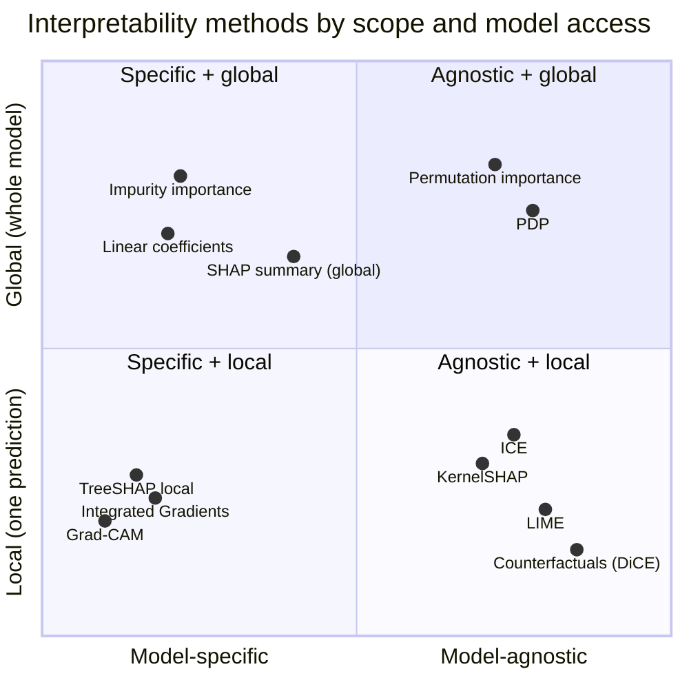
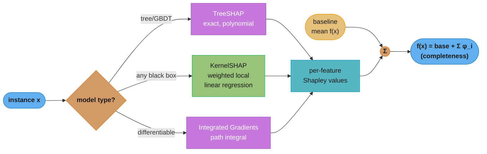
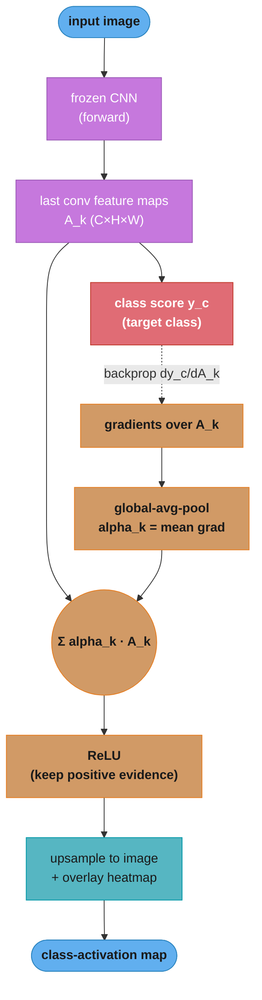
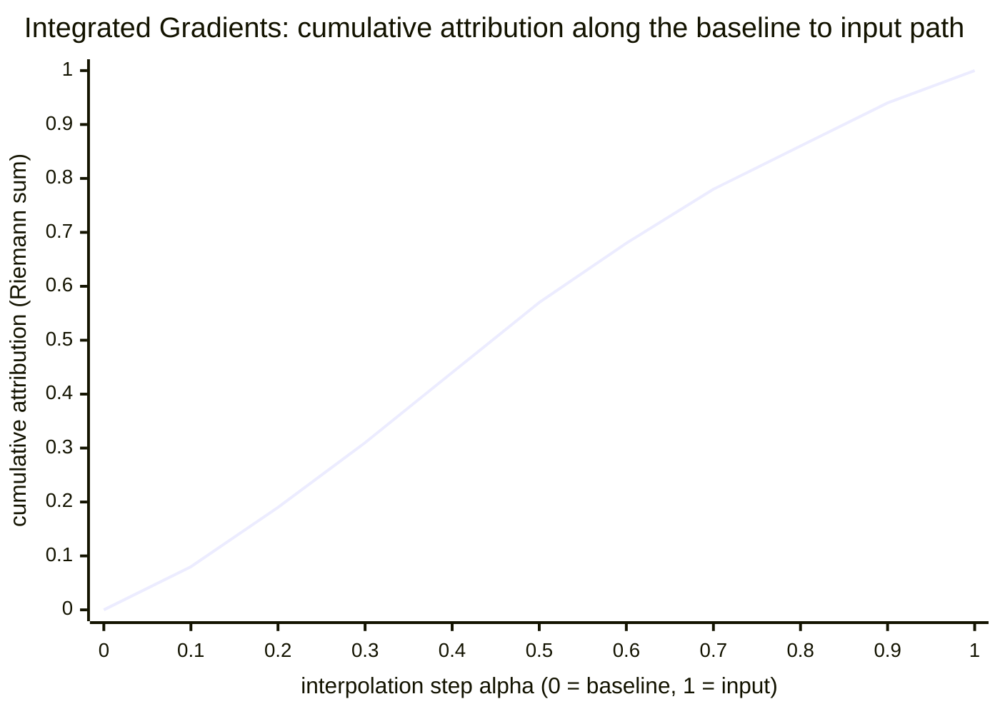
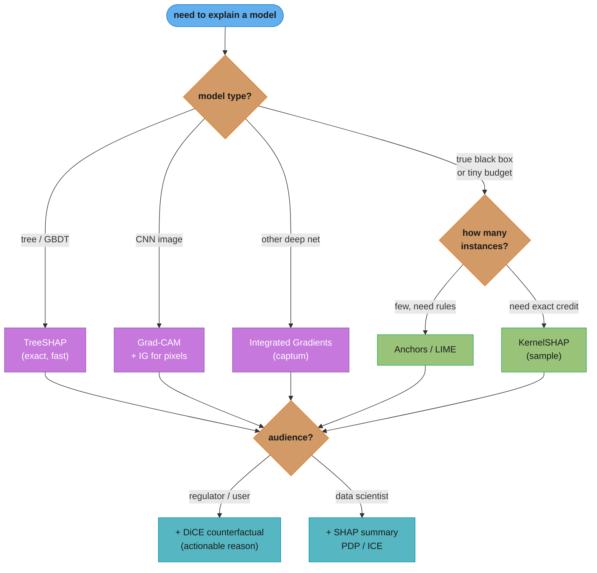

# Model Interpretability and Explainability

> Phase 7 (Advanced Topics). This module is the consolidated home for post-hoc
> and intrinsic interpretability of classical and deep models: Shapley/SHAP, LIME,
> permutation importance, PDP/ICE, Integrated Gradients, Grad-CAM, and
> counterfactuals. It unifies methods that are scattered across the repo and adds
> net-new depth on the gradient-based image methods (Grad-CAM, Integrated Gradients).
>
> This is *not* LLM mechanistic interpretability. Attention analysis, circuits, and
> probing of transformers are a different beast and live in
> [`../../llm/mechanistic_interpretability/README.md`](../../llm/mechanistic_interpretability/README.md).
> The tabular fairness/explainability governance angle lives in
> [`../case_studies/cross_cutting/responsible_ai_fairness_and_explainability.md`](../case_studies/cross_cutting/responsible_ai_fairness_and_explainability.md);
> this module goes deeper on the *methods* themselves.

---

## 1. Concept Overview

Interpretability is the degree to which a human can understand *why* a model made a specific decision, or *how* it behaves in general. Explainability is the practice of producing those understandable accounts — through intrinsic (self-explaining) models or post-hoc explanation methods layered onto a black box.

The distinction matters because production ML increasingly runs into three walls that raw accuracy cannot clear:

1. **Regulatory** — the US Equal Credit Opportunity Act (ECOA / Regulation B) requires an *adverse-action notice* listing the specific reasons a loan was denied; GDPR Article 22 grants a right to explanation for automated decisions; the EU AI Act classifies credit and hiring models as high-risk and demands documented transparency.
2. **Debugging** — a model with 0.92 AUC that keys on a leaked timestamp column is worthless in production; explanations surface leakage, spurious correlations, and shortcut learning that metrics hide.
3. **Trust** — a radiologist will not act on a "malignant, p=0.87" score without seeing *where* the model looked; a Grad-CAM heatmap over the actual lesion (not the scanner watermark) earns adoption.

The core taxonomy runs along three axes: **intrinsic vs post-hoc** (is the model self-explaining, or do we explain it after the fact?), **global vs local** (do we explain overall behavior or a single prediction?), and **model-specific vs model-agnostic** (does the method exploit model internals, or treat it as a black box?). Almost every method in this module is a point in that 3-axis space, and choosing well means matching the axis to your model type and your audience.

---

## 2. Intuition

**One-line analogy:** an explanation is a *receipt* for a prediction — it itemizes which features were charged and by how much, so the total (the score) is auditable.

**Mental model:** picture the model as an opaque machine with dials (features) and a readout (score). A *local* method wiggles the dials around one input and watches the readout, attributing the score to each dial's push. A *global* method aggregates those local attributions over the whole dataset to describe the machine's typical behavior. SHAP is the unifying framework that says: the *fair* way to split credit among the dials is the Shapley value from cooperative game theory — the only attribution satisfying a short list of common-sense axioms.

**Why it matters:** two models with identical AUC can be night and day. Model A keys on income, debt ratio, and payment history — defensible, monotone, auditable. Model B achieves the same AUC by keying on ZIP code (a proxy for race) and a data-leak column. You cannot tell them apart from a confusion matrix; you can tell them apart in five minutes with a SHAP summary plot. Interpretability is how you find out which model you actually trained.

**Key insight:** interpretability methods do not tell you *causation* — they tell you what the *model* used, which is only as trustworthy as the model. A large SHAP value for a feature means the model relies on it, not that the feature causes the outcome. Confusing "the model uses X" with "X causes Y" is the single most expensive mistake in this whole area.

---

## 3. Core Principles

1. **Attribution must be additive and complete.** A trustworthy local explanation decomposes the prediction into per-feature contributions that sum to (prediction − baseline). SHAP and Integrated Gradients both enforce this *completeness/efficiency* axiom; ad-hoc importances (raw gradients, single-feature ablation) do not, and their numbers do not reconcile to the score.
2. **Faithfulness beats plausibility.** An explanation that looks reasonable but does not reflect what the model actually computed is worse than none — it manufactures false confidence. Always prefer methods with theoretical faithfulness guarantees (Shapley axioms, completeness) over pretty-but-unverified saliency.
3. **Local and global are different questions.** "Why *this* denial?" (local) and "What drives denials in general?" (global) need different tools. Do not answer one with the other; a global feature ranking cannot justify a single adverse-action notice.
4. **Match the method to the model.** For trees, use exact TreeSHAP (polynomial time); for differentiable nets, use gradient methods (Integrated Gradients, Grad-CAM); for true black boxes, fall back to model-agnostic KernelSHAP or LIME and pay the sampling cost.
5. **Correlated features break naive importance.** Permutation importance, PDP, and KernelSHAP all assume you can perturb one feature independently. When features are correlated, they evaluate the model off the data manifold and produce misleading numbers.
6. **Explanations are part of the product, not an afterthought.** Reason codes, model cards, and audit logs are deliverables with SLAs; budget compute and latency for them (TreeSHAP on every scored applicant is cheap; KernelSHAP is not).

---

## 4. Types / Architectures / Strategies

### 4.1 The three-axis taxonomy

| Axis | Left pole | Right pole | Example |
|------|-----------|------------|---------|
| Origin | Intrinsic (glass-box) | Post-hoc (explain after training) | Linear model / decision stump vs SHAP-on-XGBoost |
| Scope | Global (whole model) | Local (one prediction) | Permutation importance vs a single SHAP force plot |
| Access | Model-specific | Model-agnostic | TreeSHAP / Grad-CAM vs KernelSHAP / LIME |

**Intrinsic** models are interpretable by construction: linear/logistic regression (coefficients), decision trees of small depth (readable paths), GAMs and Explainable Boosting Machines (EBM, shape functions per feature), rule lists. You trade some accuracy for transparency and often get it back with EBMs on tabular data.

**Post-hoc** methods explain an already-trained black box and are the bulk of this module.

### 4.2 Method catalog

| Method | Scope | Access | Model types | Output | Cost |
|--------|-------|--------|-------------|--------|------|
| Linear coefficients | Global+Local | Specific | Linear/logistic | Weight per feature | Free |
| Impurity (Gini/gain) importance | Global | Specific | Trees | Importance per feature | Free (biased) |
| Permutation importance | Global | Agnostic | Any | Drop in metric per feature | O(features × passes) |
| PDP / ICE | Global / Local | Agnostic | Any | Marginal effect curve | O(grid × N) |
| LIME | Local | Agnostic | Any | Local linear weights | O(samples) per instance |
| KernelSHAP | Local (+global) | Agnostic | Any | Shapley attributions | O(2^n) → sampled |
| TreeSHAP | Local (+global) | Specific | Trees/GBDT | Exact Shapley attributions | O(T·L·D^2) |
| Integrated Gradients | Local | Specific | Differentiable | Attribution per input dim | O(steps) forward+backward |
| Grad-CAM | Local | Specific | CNNs | Class-activation heatmap | 1 forward + 1 backward |
| Counterfactuals (DiCE) | Local | Agnostic/gradient | Any | Minimal input change to flip | Optimization per instance |
| Anchors | Local | Agnostic | Any | IF-THEN rule with precision | Search per instance |

### 4.3 Strategy by audience

- **Regulators / adverse-action** — need *reason codes* per decision: SHAP local values ranked, or DiCE counterfactuals ("increase income by \$8k OR reduce revolving balance by \$3k to flip").
- **Data scientists / debugging** — need *global* structure: SHAP summary/beeswarm, PDP/ICE, permutation importance to catch leakage and spurious features.
- **Domain experts (clinicians, underwriters)** — need *visual, spatial* grounding: Grad-CAM overlays, ICE curves, monotonicity checks.
- **End users** — need *one sentence*: a single counterfactual or the top-1 reason, not a beeswarm plot.

---

## 5. Architecture Diagrams

### 5.1 The interpretability method landscape



Caption: gradient methods (Grad-CAM, IG, TreeSHAP) sit bottom-left — model-specific and local. KernelSHAP/LIME/DiCE sit bottom-right — model-agnostic and local. Aggregating any local method upward (mean absolute SHAP) yields a global view.

### 5.2 Additive feature attribution — the unifying frame



Caption: every additive attribution method produces per-feature contributions φ_i that, added to the baseline E[f(x)], must reconstruct the actual prediction. TreeSHAP computes them exactly for trees; KernelSHAP approximates by sampling; IG integrates gradients along a path.

### 5.3 Grad-CAM pipeline (net-new depth)



Caption: Grad-CAM weights each last-conv feature map by the average gradient of the target class score flowing into it, sums the maps, and ReLUs to keep only positive evidence. The result is coarse (H×W of the last conv layer, e.g. 7×7 for ResNet) then upsampled.

### 5.4 Integrated Gradients — completeness by path integration



Caption: IG accumulates the gradient of the output with respect to the input along the straight-line path from baseline to input. By the completeness axiom the final sum (alpha=1) equals f(input) − f(baseline), here normalized to 1.0. Too few steps (coarse Riemann sum) undershoots the true integral — use 50–300 steps.

### 5.5 Choosing a method by model type and audience



Caption: pick the attribution engine by *model type* (exploit internals when you can), then layer an audience-appropriate presentation — counterfactuals for humans who must act, global plots for engineers who must debug.

---

## 6. How It Works — Detailed Mechanics

### 6.1 Shapley values — the foundation

For a prediction on instance x with features N = {1..n}, the Shapley value of feature i is its average marginal contribution across all orderings of the features:

```
phi_i = sum over S subset of N\{i}  of
        [ |S|! (n-|S|-1)! / n! ] * ( f(S union {i}) - f(S) )
```

Here f(S) is the model's expected output using only the features in coalition S (the rest marginalized out). The Shapley value is the *unique* attribution satisfying four axioms:

- **Efficiency (completeness):** the phi_i sum to f(x) − E[f(x)].
- **Symmetry:** two features contributing identically get equal credit.
- **Dummy/null:** a feature that never changes the output gets zero.
- **Additivity/linearity:** attributions for an ensemble equal the sum of per-model attributions (this is what makes TreeSHAP composable over boosted trees).

The catch is the sum over all 2^n coalitions — intractable beyond ~20 features. SHAP provides two escapes: sampling (KernelSHAP) and an exact polynomial algorithm for trees (TreeSHAP).

### 6.2 KernelSHAP vs TreeSHAP

KernelSHAP reframes Shapley estimation as a *weighted local linear regression*. It samples coalitions z' (binary masks of present features), evaluates the model with absent features replaced by background samples, and fits a linear model whose weights are the Shapley values — using the SHAP kernel weight so the linear regression's solution provably equals the Shapley values.

```python
from __future__ import annotations

import numpy as np
import pandas as pd
import shap
import xgboost as xgb
from sklearn.datasets import make_classification
from sklearn.linear_model import LogisticRegression
from sklearn.model_selection import train_test_split

X, y = make_classification(n_samples=20_000, n_features=12, n_informative=6, random_state=0)
cols = [f"f{i}" for i in range(X.shape[1])]
Xdf = pd.DataFrame(X, columns=cols)
X_tr, X_te, y_tr, y_te = train_test_split(Xdf, y, test_size=0.2, random_state=0)

gbm = xgb.XGBClassifier(n_estimators=300, max_depth=5, learning_rate=0.05,
                        tree_method="hist", random_state=0)
gbm.fit(X_tr, y_tr)

# TreeSHAP: exact Shapley values in O(T * L * D^2), NOT O(2^n).
tree_expl = shap.TreeExplainer(gbm)
sv = tree_expl.shap_values(X_te)            # shape (n_samples, n_features)

# Completeness check: base value + sum(shap) == model margin (log-odds)
margin = gbm.predict(X_te, output_margin=True)
recon = tree_expl.expected_value + sv.sum(axis=1)
assert np.allclose(recon, margin, atol=1e-3), "TreeSHAP must satisfy completeness"

# Global importance = mean(|SHAP|) per feature (a proper global view built from local)
global_imp = pd.Series(np.abs(sv).mean(axis=0), index=cols).sort_values(ascending=False)
print(global_imp.head(5))

# KernelSHAP on a black box (LogisticRegression here, but works on ANY predict fn).
lr = LogisticRegression(max_iter=1000).fit(X_tr, y_tr)
background = shap.sample(X_tr, 100, random_state=0)          # background = "absent" distribution
kern_expl = shap.KernelExplainer(lr.predict_proba, background)
sv_kernel = kern_expl.shap_values(X_te.iloc[:20], nsamples=200)   # SAMPLED, not exact
```

TreeSHAP is exact and runs in `O(T · L · D^2)` (trees × leaves × depth^2) — milliseconds for a whole batch. KernelSHAP is model-agnostic but pays for it: the exact version is `O(2^n)`; the sampled version with `nsamples=m` costs `m` model evaluations *per explained instance*, and its variance shrinks only as `1/sqrt(m)`. Rule of thumb: never KernelSHAP a tree model — you would throw away a polynomial-time exact answer for a slow noisy one.

### 6.3 LIME — local surrogate and its instability

LIME fits an interpretable surrogate (sparse linear model) on perturbations of a single instance, weighted by proximity to the original:

```python
import numpy as np
from lime.lime_tabular import LimeTabularExplainer

explainer = LimeTabularExplainer(
    training_data=X_tr.values,
    feature_names=cols,
    class_names=["neg", "pos"],
    discretize_continuous=True,
    random_state=0,
)

def explain_once(seed: int) -> dict[str, float]:
    exp = explainer.explain_instance(
        X_te.values[0], gbm.predict_proba, num_features=6, num_samples=5000,
    )
    return dict(exp.as_list())

# BROKEN reasoning: "LIME gave income the top weight, so income is the top driver."
# Re-run LIME with a different perturbation seed and the ranking can flip.
runs = [explain_once(s) for s in range(5)]
# The top feature is often NOT stable across runs -> do not trust a single LIME run.

# FIX: aggregate multiple LIME runs (or raise num_samples) and report the mean +/- std,
# or prefer KernelSHAP which has a theoretical convergence guarantee.
import collections
agg: dict[str, list[float]] = collections.defaultdict(list)
for r in runs:
    for feat, w in r.items():
        agg[feat].append(w)
stable = {f: (float(np.mean(v)), float(np.std(v))) for f, v in agg.items()}
```

LIME's instability comes from three choices with no principled default: the *kernel width* (proximity bandwidth), the *number of perturbations*, and the *random seed*. Small changes flip the sign or ranking of features. It also perturbs features independently, so for correlated data it queries the model off-manifold. Treat a single LIME run as a hypothesis, not a fact.

### 6.4 Permutation importance vs impurity importance

```python
import numpy as np
from sklearn.ensemble import RandomForestClassifier
from sklearn.inspection import permutation_importance

rf = RandomForestClassifier(n_estimators=300, random_state=0, n_jobs=-1).fit(X_tr, y_tr)

# Impurity (Gini) importance: FREE but BIASED toward high-cardinality / continuous features.
gini_imp = pd.Series(rf.feature_importances_, index=cols)

# Permutation importance: shuffle one column, measure the drop in a held-out metric.
perm = permutation_importance(rf, X_te, y_te, scoring="roc_auc",
                              n_repeats=10, random_state=0, n_jobs=-1)
perm_imp = pd.Series(perm.importances_mean, index=cols)
```

Impurity importance counts how often and how much each feature reduced node impurity during training — it is free (already computed) but systematically inflates high-cardinality and continuous features, which get more split opportunities, and it is a *training-set* quantity that can reward overfitting. Permutation importance measures the metric drop on held-out data when a feature is shuffled — model-agnostic and honest about generalization — but has a well-known trap:

**The correlated-feature trap.** If features A and B are highly correlated, shuffling A alone barely hurts the model because B still carries the signal — so *both* look unimportant, hiding a driver the model actually relies on. Fix: cluster correlated features (e.g. hierarchical clustering on Spearman correlation) and permute whole clusters, or use conditional/grouped permutation. Never conclude "the model doesn't use X" from a low permutation importance without checking X's correlations.

### 6.5 PDP and ICE

```python
from sklearn.inspection import PartialDependenceDisplay

# PDP: average model output as one feature varies (marginalizing the rest).
# ICE: one line per instance (before averaging) -> reveals heterogeneity a PDP hides.
disp = PartialDependenceDisplay.from_estimator(
    gbm, X_te, features=["f0", "f3"], kind="both",   # "both" = PDP curve + ICE lines
    subsample=200, random_state=0,
)
```

A PDP shows the marginal effect of a feature by fixing it to a grid of values, predicting for all rows, and averaging. **Caveat:** it marginalizes over the *marginal* distribution of the other features, so when features are correlated it evaluates the model on impossible combinations (e.g. `age=20, years_employed=40`) — the classic extrapolation/correlation caveat. It also hides interactions: opposing per-instance effects can average to a flat PDP. ICE curves fix this by drawing one line per instance; a fanned-out ICE bundle where a flat PDP sits means a strong interaction the PDP erased.

### 6.6 Integrated Gradients (captum)

Integrated Gradients attributes a differentiable model's output to its inputs by integrating gradients along the straight-line path from a baseline x' to the input x:

```
IG_i(x) = (x_i - x'_i) * integral_{alpha=0}^{1} [ d f(x' + alpha*(x - x')) / d x_i ] d alpha
```

```python
import torch
import torch.nn as nn
from captum.attr import IntegratedGradients

class Net(nn.Module):
    def __init__(self, d: int) -> None:
        super().__init__()
        self.net = nn.Sequential(nn.Linear(d, 64), nn.ReLU(),
                                 nn.Linear(64, 32), nn.ReLU(), nn.Linear(32, 2))

    def forward(self, x: torch.Tensor) -> torch.Tensor:
        return self.net(x)

model = Net(X_tr.shape[1]).eval()
xb = torch.tensor(X_te.values[:16], dtype=torch.float32)
baseline = torch.zeros_like(xb)                 # baseline choice MATTERS (see below)

ig = IntegratedGradients(model)
attr, delta = ig.attribute(xb, baselines=baseline, target=1,
                           n_steps=100, return_convergence_delta=True)
# completeness: sum(attr) ~= f(x)[target] - f(baseline)[target]; |delta| should be tiny (<1e-2)
assert delta.abs().max() < 1e-2, "increase n_steps if the convergence delta is large"
```

**Baseline choice is the crux.** IG explains the input *relative to* the baseline, so a black-image (all-zeros) baseline means "attribution relative to nothing," which counterintuitively assigns *zero* attribution to any pixel that is itself zero. For images, common baselines are black, a blurred version of the input, or a mean image; the honest practice is to average IG over several baselines (Expected Gradients / DeepSHAP). The **completeness axiom** gives a built-in test: attributions must sum to `f(x) − f(baseline)`; captum returns the `convergence_delta` — if it is not near zero, raise `n_steps`.

### 6.7 Grad-CAM from scratch (net-new depth)

Grad-CAM produces a class-discriminative heatmap by weighting the last convolutional layer's feature maps by the gradient of the target class score, then ReLU-ing:

```python
import torch
import torch.nn.functional as F
from torchvision.models import resnet50, ResNet50_Weights

model = resnet50(weights=ResNet50_Weights.DEFAULT).eval()

# Hook the LAST conv block (layer4) to grab activations and gradients.
_acts: dict[str, torch.Tensor] = {}
_grads: dict[str, torch.Tensor] = {}

def fwd_hook(_m, _i, out: torch.Tensor) -> None:
    _acts["A"] = out.detach()                       # A_k: (1, C, H, W), e.g. (1, 2048, 7, 7)

def bwd_hook(_m, _gi, gout: tuple[torch.Tensor, ...]) -> None:
    _grads["A"] = gout[0].detach()                  # dy_c / dA_k

target_layer = model.layer4[-1]
target_layer.register_forward_hook(fwd_hook)
target_layer.register_full_backward_hook(bwd_hook)

def grad_cam(x: torch.Tensor, class_idx: int | None = None) -> torch.Tensor:
    logits = model(x)                               # 1 forward pass
    if class_idx is None:
        class_idx = int(logits.argmax(dim=1))
    model.zero_grad()
    logits[0, class_idx].backward()                 # 1 backward pass to the target class

    A = _acts["A"][0]                               # (C, H, W)
    grad = _grads["A"][0]                           # (C, H, W)
    alpha = grad.mean(dim=(1, 2))                   # GAP over spatial dims -> (C,) weights
    cam = F.relu((alpha[:, None, None] * A).sum(dim=0))   # weighted sum + ReLU -> (H, W)
    cam = cam / (cam.max() + 1e-8)                  # normalize to [0, 1]
    cam = F.interpolate(cam[None, None], size=x.shape[-2:],
                        mode="bilinear", align_corners=False)[0, 0]
    return cam                                       # upsampled heatmap to overlay
```

Why the *last* conv layer? It has the richest high-level semantics while still retaining spatial layout (deeper = more semantic, but fully-connected layers lose the spatial grid). Grad-CAM's resolution is therefore coarse — 7×7 for ResNet-50 — which is why it is upsampled and often combined with a fine-grained pixel method (Guided Grad-CAM, or Integrated Gradients) for sharp edges. The ReLU is essential: it keeps features with a *positive* influence on the target class and discards evidence for other classes.

### 6.8 Counterfactuals (DiCE) and Anchors

```python
import dice_ml
from dice_ml import Dice

d = dice_ml.Data(dataframe=pd.concat([X_tr, pd.Series(y_tr, name="label",
                 index=X_tr.index)], axis=1),
                 continuous_features=cols, outcome_name="label")
m = dice_ml.Model(model=gbm, backend="sklearn")
exp = Dice(d, m, method="random")
cf = exp.generate_counterfactuals(X_te.iloc[[0]], total_CFs=3, desired_class="opposite")
# Each CF is a minimally-changed input that flips the prediction:
# "if f3 were 1.8 (was 0.4) the decision flips" -> directly usable as an adverse-action reason.
```

A counterfactual answers "what is the smallest change that flips the decision?" — the most human-actionable explanation and a natural fit for adverse-action notices ("increase income by \$8k *or* pay down \$3k of revolving debt"). DiCE searches for diverse, feasible, minimal counterfactuals. **Anchors** (from the LIME authors) instead find a high-precision IF-THEN rule that "anchors" the prediction: e.g. "IF debt_ratio > 0.45 AND delinquencies >= 2 THEN deny (precision 0.97)" — a rule that holds for the instance and its neighborhood, more robust than LIME's linear fit.

---

## 7. Real-World Examples

### Google — Grad-CAM, Integrated Gradients, and the What-If Tool

Integrated Gradients originated at Google (Sundararajan, Taly, Yan, 2017) precisely to fix the axiom violations of raw gradients and DeconvNet-style saliency. Google Health used Grad-CAM-style saliency on diabetic-retinopathy and mammography models so ophthalmologists could confirm the model attended to actual lesions rather than imaging artifacts, and shipped the What-If Tool in TensorBoard for interactive PDP/counterfactual exploration.

### Microsoft — InterpretML, EBM, and DiCE

Microsoft Research maintains InterpretML, whose Explainable Boosting Machine (EBM) is a glass-box GAM that reaches GBDT-competitive accuracy while remaining directly readable (one shape function per feature). DiCE (Diverse Counterfactual Explanations) is also a Microsoft project, used internally and by customers to generate actionable "what would change the decision" explanations for lending and HR models.

### LinkedIn — SHAP at feed and hiring scale

LinkedIn built intelligible-explanation tooling (internally described as generating natural-language narratives from SHAP values) to explain job-recommendation and feed-ranking scores to members and to internal reviewers, and to satisfy fairness audits under employment-law scrutiny.

### Capital One and FICO — reason codes for lending

US lenders must issue ECOA/Regulation B adverse-action notices. Capital One and other banks use SHAP/Shapley-based reason-code generation on GBDT credit models; FICO's regulatory-grade scorecards and its Explainable ML challenge pushed the industry toward monotone GBDTs plus Shapley reason codes so a denial can be traced to the specific factors that drove it.

### Fiddler AI and Arize — explainability as a monitoring product

Fiddler AI and Arize sell production platforms that log SHAP attributions per prediction and track their *distribution* over time; a shift in the SHAP profile of a top feature is an early drift signal (see [`../monitoring_and_drift_detection/README.md`](../monitoring_and_drift_detection/README.md)) that often fires before raw accuracy degrades.

---

## 8. Tradeoffs

### 8.1 Method comparison

| Method | Faithfulness | Speed | Correlated-feature safe | Best model | Audience |
|--------|--------------|-------|-------------------------|-----------|----------|
| TreeSHAP | Exact (axioms) | Fast (ms/batch) | Interventional variant helps | Trees/GBDT | All |
| KernelSHAP | Approximate | Slow (m evals/inst) | No (independent perturb) | Any | Data scientist |
| LIME | Local, unstable | Medium | No | Any | Debug hypothesis |
| Integrated Gradients | Completeness | Medium (steps) | Baseline-dependent | Diff. nets | ML engineer |
| Grad-CAM | Class-discriminative | Very fast (1 fwd+bwd) | N/A (images) | CNN | Domain expert |
| Permutation importance | Global, honest | Medium | No (correlated trap) | Any | Data scientist |
| PDP | Marginal effect | Medium | No (extrapolation) | Any | Data scientist |
| ICE | Reveals interaction | Medium | Partially | Any | Data scientist |
| Counterfactual (DiCE) | Actionable | Slow (search) | Feasibility constraint | Any | End user / regulator |

### 8.2 SHAP vs LIME

| Dimension | SHAP | LIME |
|-----------|------|------|
| Theoretical guarantee | Shapley axioms (unique fair attribution) | None; local linear fit |
| Consistency across runs | Deterministic (TreeSHAP), converges (KernelSHAP) | Unstable; seed/kernel-width dependent |
| Global view | Yes (mean\|SHAP\|, dependence plots) | No; local only |
| Speed on trees | Exact polynomial (TreeSHAP) | Sampling per instance |
| Interpretability of output | Additive, sums to prediction | Sparse linear weights |
| When LIME still wins | — | Very fast, text/image super-pixels, quick sanity check |

### 8.3 Accuracy vs interpretability is not always a tradeoff

The folk wisdom "more accurate = less interpretable" is often false on tabular data: EBMs and monotone GBDTs frequently match black-box GBDT accuracy while remaining auditable. The real tradeoff is *engineering effort* — glass-box models and constrained training cost more to build than an unconstrained XGBoost plus post-hoc SHAP.

---

## 9. When to Use / When NOT to Use

### Use interpretability methods when

- The decision is **regulated** (credit, hiring, insurance, healthcare) and needs per-decision reason codes or an audit trail.
- You are **debugging** a model that scores well but you suspect leakage, shortcut learning, or spurious correlation.
- A **domain expert** must sign off (clinician, underwriter) and needs to see the model's evidence.
- You are **monitoring** production and want SHAP-distribution drift as an early-warning signal.

### Prefer an intrinsic model over post-hoc when

- The application demands *guaranteed* faithfulness (post-hoc explanations of a black box can be gamed or unfaithful).
- Regulators require the *actual* decision logic, not an approximation — use EBM, monotone GBDT, or a scorecard.

### When NOT to (over)use these methods

- **Do not treat SHAP/LIME as causal** — they explain the model, not the world; for causal questions use [`../causal_inference_and_ml/`](../causal_inference_and_ml/).
- **Do not KernelSHAP a tree** — use TreeSHAP; KernelSHAP throws away the exact polynomial solution.
- **Do not report a single LIME run** as ground truth — it is unstable; aggregate or switch to SHAP.
- **Do not trust permutation importance on correlated features** without grouping — the correlated-feature trap hides real drivers.
- **Do not read a flat PDP as "no effect"** — check ICE for canceling interactions.
- **Do not explain a fundamentally untrustworthy model** to make it deployable — an explanation of a leaky model just documents the leak nicely.

---

## 10. Common Pitfalls

### Pitfall 1: Using impurity importance to make deployment decisions

```python
# BROKEN: Gini importance ranks a high-cardinality ID-like column at the top.
# It is a TRAINING-set quantity biased toward features with many split points.
top = pd.Series(rf.feature_importances_, index=cols).sort_values(ascending=False)

# FIX: use permutation importance on held-out data (honest about generalization),
# and cross-check with mean(|TreeSHAP|).
perm = permutation_importance(rf, X_te, y_te, scoring="roc_auc",
                              n_repeats=10, random_state=0, n_jobs=-1)
honest = pd.Series(perm.importances_mean, index=cols).sort_values(ascending=False)
```

Impurity importance inflated a random-hash user-ID column to rank #1 in more than one production postmortem; the model had memorized IDs (leakage), and only permutation importance on a held-out set exposed that the "important" feature added nothing to generalization.

### Pitfall 2: The correlated-feature trap in permutation importance

Two collinear features (`total_debt` and `revolving_debt`) each show near-zero permutation importance because the other covers for it when shuffled — leading a team to "safely" drop both and watch AUC collapse. Fix: hierarchical-cluster features on Spearman correlation and permute clusters together, or drop one representative per cluster and re-measure.

### Pitfall 3: A misleading Integrated Gradients baseline

An all-zeros (black) baseline for an image model assigns zero attribution to every black pixel — so a model that detects a dark tumor on a dark background gets *no* attribution on the tumor. Fix: use a blurred-input or mean baseline, or average IG over multiple baselines (Expected Gradients), and always check `convergence_delta`.

### Pitfall 4: Reading SHAP as causation in a stakeholder meeting

A large positive SHAP value for `num_credit_inquiries` does *not* mean inquiries *cause* default — it means the model uses them as a proxy for financial stress. Stating "reducing inquiries will lower your default risk" is a causal claim SHAP cannot support and can be actively wrong; frame SHAP as "what the model weighed," never "what will change the outcome."

### Pitfall 5: KernelSHAP background set too small or wrong

```python
# BROKEN: single-row background -> "absent" features imputed to one arbitrary point.
bg = X_tr.iloc[[0]]
expl = shap.KernelExplainer(lr.predict_proba, bg)   # attributions are noisy/biased

# FIX: a representative background (k-means summary or ~100 samples).
bg = shap.kmeans(X_tr, 50)                            # 50 weighted centroids
expl = shap.KernelExplainer(lr.predict_proba, bg)
```

KernelSHAP marginalizes absent features over the background distribution; a tiny or unrepresentative background biases every attribution. Use `shap.kmeans` or ~100 sampled rows.

### Pitfall 6: Explaining probabilities when the model reasons in log-odds

TreeSHAP on a classifier defaults to explaining the *margin* (log-odds), and log-odds SHAP values are additive while probability-space values are not. Mixing the two ("these SHAP values should sum to the 0.73 probability") produces contradictions. Decide up front whether you explain log-odds (additive, correct) or probabilities (use `model_output="probability"` and accept the interventional-perturbation cost) and label it in the report.

---

## 11. Technologies & Tools

| Tool | Version | Notes |
|------|---------|-------|
| shap | 0.44+ | TreeSHAP (XGB/LGB/CatBoost/sklearn), KernelSHAP, DeepSHAP, plots (beeswarm, force, waterfall, dependence) |
| lime | 0.2+ | Tabular, text, image (super-pixels); unstable — aggregate runs |
| captum | 0.7+ | PyTorch: Integrated Gradients, DeepLIFT, GradientSHAP, Occlusion, LayerGradCam |
| pytorch-grad-cam | 1.5+ | Grad-CAM, Grad-CAM++, Score-CAM, Ablation-CAM for CNNs and ViTs |
| dice-ml | 0.11+ | Diverse counterfactual explanations (random, genetic, gradient methods) |
| interpret (InterpretML) | 0.6+ | EBM glass-box GAM; unified explain API; dashboard |
| sklearn.inspection | 1.3+ | permutation_importance, PartialDependenceDisplay (PDP + ICE) |
| alibi | 0.9+ | Anchors, counterfactuals, ALE, integrated gradients (TF/Keras) |
| shapash / explainerdashboard | latest | Turnkey explanation dashboards over SHAP for stakeholders |
| Fiddler / Arize | SaaS | Production explanation logging + SHAP-drift monitoring |

---

## 12. Interview Questions with Answers

**Why prefer SHAP over a tree model's built-in feature_importances_?**
SHAP gives consistent, additive attributions that sum to the prediction, while impurity-based feature_importances_ is biased toward high-cardinality features and is a training-set quantity that can reward overfitting. Built-in importance counts impurity reduction at split time, so continuous and many-valued features get more chances to look important; TreeSHAP instead computes exact Shapley values with the consistency guarantee that a feature the model relies on more never gets a smaller attribution. In practice, cross-check global mean-absolute-SHAP against permutation importance on held-out data before trusting any ranking.

**Why is LIME unstable, and what do you do about it?**
LIME is unstable because its explanation depends on the random perturbation sample, the kernel width, and the number of samples — none of which have a principled default. Rerun LIME with different seeds and the top feature can flip, since it fits a fresh local linear model each time on independently perturbed (often off-manifold) points. Mitigate by aggregating many runs and reporting mean ± std, raising num_samples, or switching to KernelSHAP, which has a convergence guarantee toward the Shapley values.

**What is the correlated-feature trap in permutation importance?**
When two features are correlated, shuffling one alone barely hurts the model because the other still carries the signal, so both look unimportant and hide a real driver. Permutation importance measures the metric drop when a single column is shuffled, and collinear partners substitute for each other under that shuffle. Fix by clustering features on Spearman correlation and permuting whole clusters, or use conditional permutation — never conclude a feature is unused from low permutation importance without checking its correlations.

**When would you use TreeSHAP versus KernelSHAP?**
Use TreeSHAP for any tree-based model because it is exact and polynomial-time, and KernelSHAP only for non-tree black boxes where you have no internals to exploit. TreeSHAP runs in O(T·L·D^2) — milliseconds for a batch — while KernelSHAP costs many model evaluations per instance and only approximates the Shapley values with 1/sqrt(m) variance. Running KernelSHAP on an XGBoost model is a classic mistake: it is slower, noisier, and strictly worse than the exact TreeSHAP answer.

**Does a large SHAP value mean the feature causes the outcome?**
No — a large SHAP value means the model relies on that feature, not that the feature causes the target. SHAP explains the model's function, so if the model learned a proxy (ZIP code standing in for income), SHAP faithfully reports the model's reliance on the proxy, which is a correlation the model exploited, not a causal effect. For causal questions use causal inference methods; presenting SHAP as "change X to change the outcome" is a common and dangerous overreach.

**What are the axioms that make Shapley values the unique attribution?**
Shapley values are the unique attribution satisfying efficiency, symmetry, dummy, and additivity. Efficiency (completeness) means the per-feature values sum to prediction minus baseline; symmetry gives equal credit to features with identical marginal contributions; dummy assigns zero to a feature that never changes the output; additivity makes attributions of an ensemble equal the sum over its members. These four together pin down one and only one attribution function, which is why SHAP is called the "fair" allocation.

**Why does the Integrated Gradients baseline matter, and how do you pick one?**
The baseline defines the reference the attribution is measured against, so IG explains the input relative to it and a poor baseline distorts every attribution. An all-zeros image baseline assigns zero attribution to any pixel that is itself zero, which can hide dark but important regions; better choices are a blurred input, a mean image, or averaging over several baselines (Expected Gradients). Always verify the completeness axiom via captum's convergence_delta and increase n_steps if it is not near zero.

**What is the completeness axiom and how do you check it holds?**
Completeness means the attributions sum exactly to f(input) minus f(baseline), so nothing about the prediction is left unexplained. Integrated Gradients and SHAP both guarantee it in theory, but IG approximates the path integral with a finite Riemann sum, so too few steps under-integrate. Captum returns a convergence_delta; if its magnitude is not tiny (say > 1e-2), raise n_steps from 50 toward 200–300 until the sum reconciles.

**How does Grad-CAM work, and why the last convolutional layer?**
Grad-CAM weights each last-conv feature map by the average gradient of the target class score, sums them, and applies ReLU to produce a class-discriminative heatmap. The last conv layer is chosen because it holds the richest high-level semantics while still preserving a spatial grid — deeper fully-connected layers lose spatial layout, and earlier conv layers carry only low-level edges. The result is coarse (7×7 for ResNet-50), so it is upsampled and often paired with a pixel-level method for sharp boundaries.

**How is Grad-CAM different from a raw-gradient saliency map?**
Grad-CAM is class-discriminative and localizes the object, whereas a raw-gradient saliency map is noisy and often highlights edges regardless of the class. Grad-CAM operates on last-layer feature maps weighted by gradients, so it answers "where is the evidence for *this class*," while pixel-space gradients suffer from saturation and gradient shattering. Guided Grad-CAM combines Grad-CAM's localization with guided-backprop's sharpness to get both class specificity and pixel detail.

**Explain the difference between global and local explanations with an example.**
Local explanations justify a single prediction, while global explanations describe the model's overall behavior. As examples, a local reason is "this loan was denied because debt ratio and delinquencies dominated," while a global summary is "across all applicants, payment history is the top driver." A single SHAP force plot is local; the mean absolute SHAP across the dataset (beeswarm summary) is global. You cannot justify one applicant's adverse-action notice with a global ranking — regulators require the local, instance-specific reasons.

**What is the extrapolation caveat with partial dependence plots?**
A PDP can evaluate the model on impossible feature combinations because it marginalizes over the marginal distribution of the other features, ignoring their correlation. Fixing age to 20 while the data has years_employed = 40 asks the model about a person who cannot exist, and the resulting curve is unreliable in those regions. Use accumulated local effects (ALE), which conditions on the local distribution, or restrict the PDP to the observed support, and always inspect ICE curves for hidden interactions.

**How do PDP and ICE relate, and when does ICE reveal something PDP hides?**
ICE draws one line per instance and PDP is the average of those lines, so ICE exposes heterogeneity that averaging erases. When a feature increases the prediction for one subgroup and decreases it for another, the two effects cancel and the PDP looks flat even though the feature matters strongly. A fanned-out ICE bundle under a flat PDP is the signature of an interaction — that is when you reach for ICE or a two-way PDP.

**What is a counterfactual explanation and when is it the right tool?**
A counterfactual is the smallest change to the input that flips the model's decision, and it is the right tool when the audience must *act* on the explanation. For a loan denial, "increase income by \$8k or reduce revolving balance by \$3k" is directly actionable and maps cleanly onto an adverse-action notice, unlike a list of SHAP values. Tools like DiCE search for diverse, feasible, minimal counterfactuals subject to constraints such as immutable features (you cannot change age).

**How do Anchors differ from LIME?**
Anchors produce a high-precision IF-THEN rule that holds for the instance and its neighborhood, whereas LIME fits a local linear approximation with no coverage guarantee. An anchor like "IF debt_ratio > 0.45 AND delinquencies >= 2 THEN deny (precision 0.97)" states exactly when the explanation applies, making it more robust than LIME's weights, which can change sign just outside the sampled region. Anchors trade off coverage for precision and are more stable, at the cost of a more expensive rule search.

**How do you choose an interpretability method for a given model?**
Pick the attribution engine by model type first: TreeSHAP for trees, Grad-CAM and Integrated Gradients for CNNs and other differentiable nets, and KernelSHAP or LIME only for true black boxes. Exploiting internals gives exact or faithful results cheaply, whereas model-agnostic sampling is slow and approximate. Then layer an audience-appropriate presentation — counterfactuals or a single top reason for end users and regulators, and SHAP summary plus PDP/ICE for engineers debugging the model.

**What does it mean to explain SHAP values in log-odds versus probability space?**
TreeSHAP defaults to explaining the margin (log-odds), where attributions are additive, whereas probability-space attributions are not additive and cannot be summed to the predicted probability. If you report probability-space SHAP and claim the values sum to 0.73, you will contradict yourself because the logistic link is nonlinear. Choose the space explicitly — log-odds for additive correctness, or model_output="probability" with the interventional perturbation cost — and label it in the report.

**Can you make a model both accurate and intrinsically interpretable?**
Yes — on tabular data, Explainable Boosting Machines and monotone GBDTs often match black-box accuracy while staying auditable, so the accuracy-interpretability tradeoff is frequently a myth. An EBM is a generalized additive model with one learned shape function per feature, readable directly, and monotone constraints encode domain rules (income only helps creditworthiness). The real cost is engineering effort, not accuracy, and for regulated domains a glass-box model avoids the risk of unfaithful post-hoc explanations entirely.

---

## 13. Best Practices

1. **Match method to model type**: TreeSHAP for GBDTs, Grad-CAM/Integrated Gradients for CNNs, KernelSHAP/LIME only for true black boxes. Never KernelSHAP a tree.
2. **Always validate completeness**: check that SHAP values plus base value reconstruct the model margin, and that IG's convergence_delta is near zero (raise n_steps if not).
3. **Report global importance from local attributions**: mean absolute SHAP over the dataset, cross-checked with held-out permutation importance — do not rely on impurity importance for decisions.
4. **Handle correlated features explicitly**: cluster on Spearman correlation and permute or drop by cluster; be skeptical of any single-feature importance under collinearity.
5. **Choose IG/KernelSHAP baselines deliberately**: representative background (shap.kmeans or ~100 rows) for KernelSHAP; blurred/mean or multi-baseline for IG.
6. **Present counterfactuals to humans, plots to engineers**: DiCE reason codes for regulators and end users; beeswarm/PDP/ICE for the data-science team.
7. **State the explanation space**: explicitly say whether SHAP is in log-odds or probability, and never let anyone sum probability-space values.
8. **Never present model explanations as causal claims**: SHAP tells you what the model used, not what will change the outcome.
9. **Log explanations in production**: store per-prediction SHAP and monitor their distribution as an early drift signal ([`../monitoring_and_drift_detection/README.md`](../monitoring_and_drift_detection/README.md)).
10. **Prefer glass-box where regulation demands faithfulness**: EBM or monotone GBDT beats explaining an unconstrained black box when the actual logic must be auditable.
11. **Use ICE to audit PDPs**: a flat PDP with fanned ICE lines means a hidden interaction, not "no effect."
12. **Reconcile methods**: when SHAP, permutation importance, and PDP disagree sharply, that disagreement is itself a finding — usually leakage or correlation — and worth investigating before shipping.

---

## 14. Case Study

### Problem: Explainable Credit-Risk Scoring for Regulatory Adverse-Action Notices

**Context.** A US consumer lender (think Capital One / LendingClub class) deploys a GBDT probability-of-default model on ~2M applications/year. Every denial must ship an ECOA/Regulation B adverse-action notice listing up to 4 principal reason codes, and the EU-facing arm must satisfy GDPR Article 22. Requirements: (1) per-decision reason codes at scoring time, p99 < 50ms including explanation; (2) monotone constraints for regulator defensibility (more income never lowers approval odds); (3) a global fairness/leakage audit before each model promotion; (4) an immutable audit log of every explanation. Design decisions link to the full pipeline in [`../case_studies/design_credit_risk_scoring.md`](../case_studies/design_credit_risk_scoring.md).

**Why this method stack.** The scoring model is a monotone LightGBM, so TreeSHAP gives *exact* Shapley values in a few milliseconds per applicant — no sampling, no latency risk. Reason codes come from the top-|SHAP| features mapped to human-readable factor descriptions. For the applicant-facing "how to improve" guidance, DiCE generates a feasible, minimal counterfactual. Global audits use mean-absolute-SHAP plus PDP/ICE to catch proxy features (ZIP as a race proxy) and monotonicity violations before promotion.

**Serving-time reason codes (exact, additive, log-odds):**

```python
from __future__ import annotations

import numpy as np
import pandas as pd
import shap
import lightgbm as lgb

REASON_CODE_MAP = {
    "revolving_utilization": "R01: High ratio of balance to credit limit",
    "num_delinquencies_24m":  "R02: Recent delinquencies on file",
    "num_credit_inquiries":   "R03: Number of recent credit inquiries",
    "debt_to_income":         "R04: Debt obligations high relative to income",
    "months_since_last_delinq": "R05: Recency of most recent delinquency",
    "annual_income":          "R06: Insufficient stated income",
}

def build_explainer(model: lgb.LGBMClassifier) -> shap.TreeExplainer:
    # interventional perturbation + log-odds keeps additivity exact and stable.
    return shap.TreeExplainer(model, feature_perturbation="interventional")

def adverse_action_reasons(
    explainer: shap.TreeExplainer,
    x: pd.DataFrame,           # single applicant, one row
    feature_names: list[str],
    top_k: int = 4,
) -> list[str]:
    sv = explainer.shap_values(x)                      # log-odds space, additive
    contrib = sv[0] if isinstance(sv, list) else sv[0]  # (n_features,)
    # A denial is driven by features PUSHING TOWARD default (positive contribution to risk).
    order = np.argsort(contrib)[::-1]                  # most risk-increasing first
    reasons: list[str] = []
    for idx in order:
        if contrib[idx] <= 0:                          # only cite risk-increasing factors
            break
        code = REASON_CODE_MAP.get(feature_names[idx])
        if code:
            reasons.append(code)
        if len(reasons) == top_k:
            break
    return reasons

# --- broken vs fixed: which direction is a "reason for denial"? ---
def reasons_BROKEN(contrib: np.ndarray, names: list[str]) -> list[str]:
    # WRONG: ranks by |SHAP|, so a strongly APPROVING feature (e.g. high income)
    # gets cited as a denial reason -> legally indefensible, confuses the applicant.
    order = np.argsort(np.abs(contrib))[::-1]
    return [names[i] for i in order[:4]]

def reasons_FIXED(contrib: np.ndarray, names: list[str]) -> list[str]:
    # RIGHT: cite only features that pushed the score TOWARD denial (positive risk contribution).
    order = np.argsort(contrib)[::-1]
    return [names[i] for i in order if contrib[i] > 0][:4]
```

**Actionable counterfactual for the applicant:**

```python
import dice_ml
from dice_ml import Dice

def improvement_paths(data_iface, model_iface, applicant: pd.DataFrame):
    exp = Dice(data_iface, model_iface, method="genetic")
    cf = exp.generate_counterfactuals(
        applicant, total_CFs=3, desired_class="opposite",
        features_to_vary=["revolving_utilization", "debt_to_income", "num_credit_inquiries"],
        # age, ethnicity, and other immutable/protected features are excluded from variation
    )
    return cf   # e.g. "reduce revolving_utilization from 0.82 to 0.35 to flip to approve"
```

**Global pre-promotion audit:**

```python
def promotion_audit(explainer: shap.TreeExplainer, X_val: pd.DataFrame,
                    protected_proxies: list[str], names: list[str]) -> dict[str, float]:
    sv = explainer.shap_values(X_val)
    sv = sv[0] if isinstance(sv, list) else sv
    global_imp = pd.Series(np.abs(sv).mean(axis=0), index=names)
    # RED FLAG: a protected-proxy feature (zip_code, first_name_gender) in the top drivers.
    flags = {p: float(global_imp.get(p, 0.0)) for p in protected_proxies}
    return dict(sorted(flags.items(), key=lambda kv: -kv[1]))
```

**Design decisions and tradeoffs.**

- **TreeSHAP over KernelSHAP**: exact and ~2–4 ms/applicant vs ~200 ms sampled — KernelSHAP would blow the 50 ms SLA and add nondeterminism a regulator would reject.
- **Log-odds, interventional perturbation**: additive and stable so reason codes reconcile to the margin; probability-space would break additivity in the audit.
- **Monotone constraints**: cost ~0.6% AUC (0.812 → 0.806) but make every reason code defensible and eliminate the "higher income lowered my score" failure mode.
- **DiCE feature masking**: protected and immutable features are excluded from counterfactual variation, so guidance is legal and actionable.

**Outcome (illustrative).** Exact TreeSHAP reason codes replaced a legacy scorecard's coarse reason list; adverse-action complaint rate about "unclear reasons" dropped materially, and the pre-promotion SHAP audit caught a leaked `application_timestamp` feature and a `zip_code` proxy that a raw AUC gate had passed. The same per-prediction SHAP logs feed drift monitoring ([`../monitoring_and_drift_detection/README.md`](../monitoring_and_drift_detection/README.md)); a shift in the SHAP profile of `revolving_utilization` fired weeks before accuracy degraded, triggering a retrain. Governance and fairness framing for this stack live in [`../case_studies/cross_cutting/responsible_ai_fairness_and_explainability.md`](../case_studies/cross_cutting/responsible_ai_fairness_and_explainability.md); the GBDT internals and TreeSHAP complexity are in [`../ensemble_methods/xgboost_lightgbm.md`](../ensemble_methods/xgboost_lightgbm.md).
