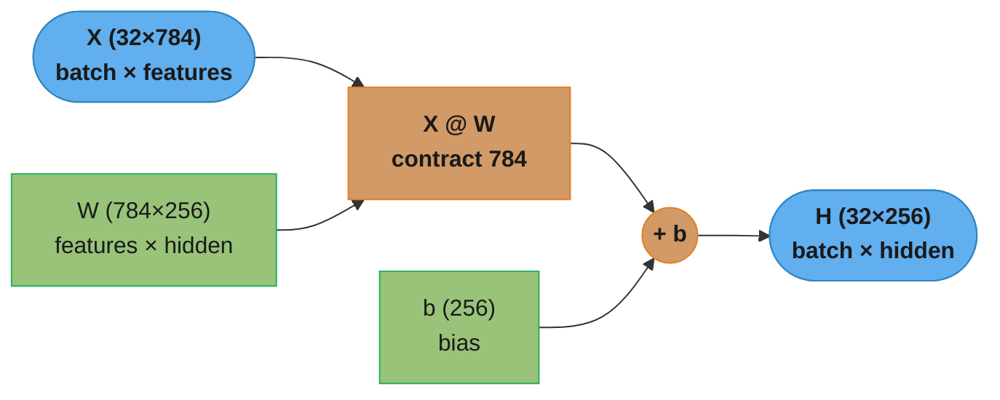
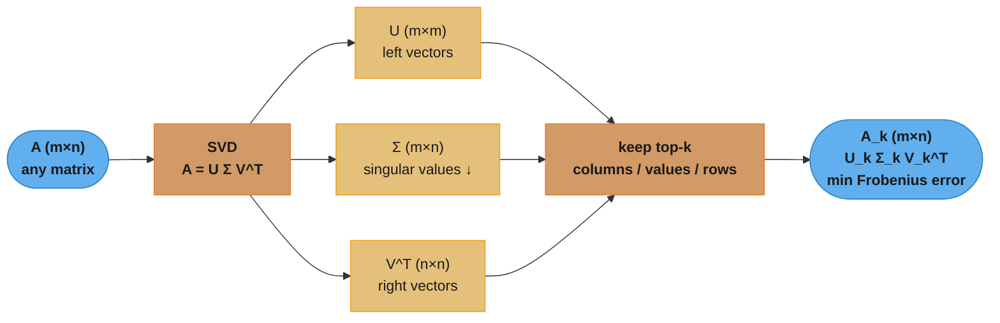
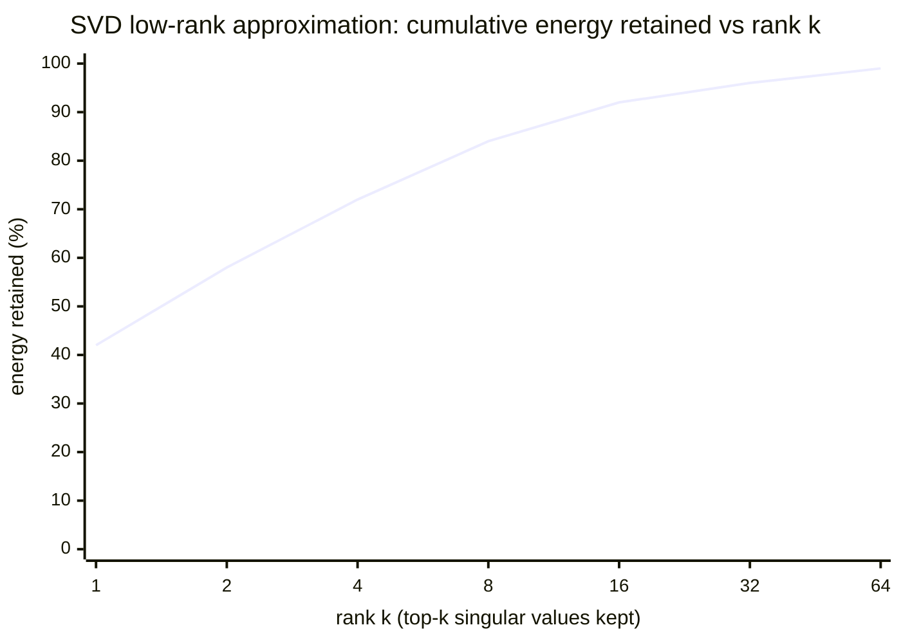
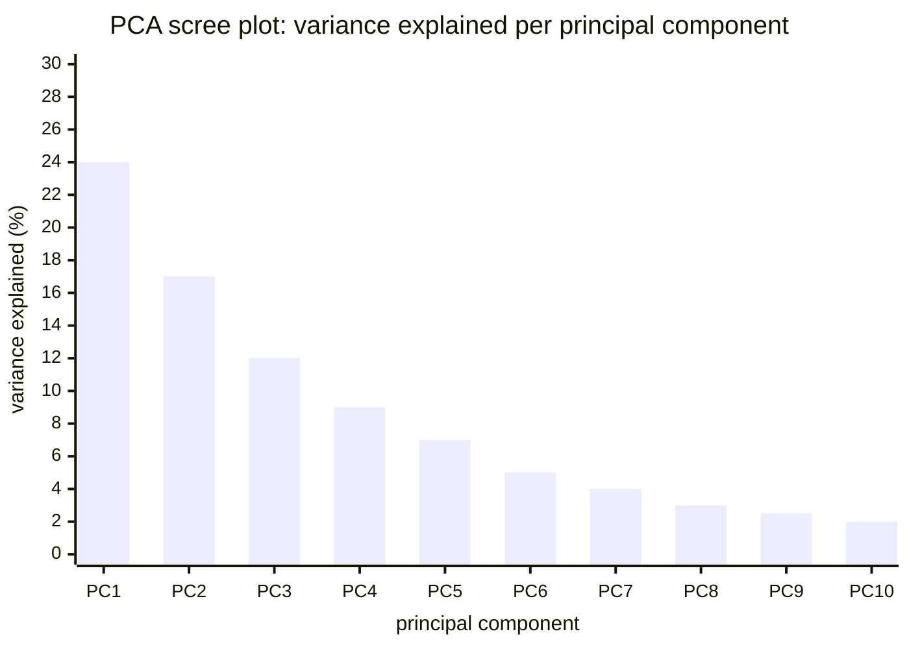

# Linear Algebra and Calculus for ML

## 1. Concept Overview

Linear algebra and calculus form the mathematical backbone of every machine learning algorithm. Linear algebra provides the language for representing data (vectors, matrices, tensors) and the operations that transform it (dot products, matrix multiplication, decompositions). Calculus provides the tools for measuring how a function changes (derivatives, gradients) and for minimizing loss functions (gradient descent, backpropagation).

A neural network is, mechanically, a sequence of matrix multiplications and nonlinear activations. Training that network is the process of computing gradients of a scalar loss with respect to millions of weight matrices, then updating those weights. Without linear algebra there is no forward pass; without calculus there is no backward pass.

---

## 2. Intuition

> **One-line analogy**: Linear algebra is the geometry of data transformations; calculus tells you which direction to nudge each transformation to improve your answer.

**Mental model**: Imagine data as points in high-dimensional space. A matrix is a machine that rotates, scales, and shears that space. Eigendecomposition reveals the "natural axes" of a matrix — the directions it stretches and by how much. SVD generalizes this to non-square matrices, which is how recommendation systems discover latent factors hidden in user-item rating tables.

**Why it matters**: Every convolution in a CNN is a batched dot product. Every attention score in a transformer is QK^T / sqrt(d_k). Every weight update in gradient descent requires d(Loss)/d(Weight). Misunderstanding shapes, broadcasting rules, or gradient flow leads to bugs that are silent — the code runs but the model diverges.

**Key insight**: Backpropagation is just the chain rule applied systematically to a computation graph. The chain rule connects local Jacobians; automatic differentiation libraries (PyTorch autograd, JAX) make this mechanical.

---

## 3. Core Principles

- **Vectors**: ordered lists of numbers; represent data points, parameters, or directions in n-dimensional space.
- **Matrices**: 2D arrays; represent linear transformations, datasets (rows = samples, cols = features), or weight layers.
- **Dot product**: a . b = sum(a_i * b_i) = ||a|| ||b|| cos(theta); measures similarity between vectors.
- **Matrix multiplication**: (AB)_{ij} = sum_k A_{ik} B_{kj}; composition of linear transformations; not commutative.
- **Transpose**: A^T_{ij} = A_{ji}; flips rows and columns; (AB)^T = B^T A^T.
- **Inverse**: A^{-1} exists only when A is square and full rank; AA^{-1} = I; computing it is O(n^3).
- **Norms**: measure magnitude; L1 = sum|x_i|; L2 = sqrt(sum x_i^2); Frobenius = sqrt(sum A_{ij}^2).
- **Gradient**: vector of partial derivatives; gradient of scalar f w.r.t. vector x is a vector pointing toward steepest ascent.
- **Chain rule**: d(f(g(x)))/dx = f'(g(x)) * g'(x); extends to vectors via Jacobian matrices.
- **Jacobian**: J_{ij} = df_i/dx_j; m x n matrix for a function mapping R^n -> R^m.
- **Hessian**: H_{ij} = d^2f/(dx_i dx_j); n x n matrix of second-order partial derivatives; encodes curvature.

---

## 4. Types / Architectures / Strategies

### 4.1 Matrix Decompositions

**Eigendecomposition**: A = Q Lambda Q^T for symmetric positive semi-definite matrices. Lambda is diagonal with eigenvalues. Q is orthogonal with eigenvectors as columns. Tells you the principal directions of a transformation.

**Singular Value Decomposition (SVD)**: A = U Sigma V^T. Always exists for any m x n matrix. U (m x m) and V (n x n) are orthogonal; Sigma (m x n) is diagonal with non-negative singular values in decreasing order. Rank-k approximation uses only the top-k singular values; minimizes Frobenius norm error.

**LU Decomposition**: A = LU; used to solve linear systems efficiently (O(n^3) one-time factorization, then O(n^2) per solve).

**QR Decomposition**: A = QR; numerically stable for solving least squares; used in Gram-Schmidt orthogonalization.

### 4.2 Gradient Computation Strategies

**Symbolic differentiation**: exact closed-form derivatives; computationally expensive for large graphs.

**Numerical differentiation**: (f(x+h) - f(x)) / h; approximate; used for gradient checking only; O(n) evaluations per parameter.

**Automatic differentiation (autodiff)**: exact derivatives via operator overloading; forward mode for few inputs, reverse mode (backpropagation) for few outputs (scalar loss); O(1) overhead factor over the forward pass.

### 4.3 Norm Types and Their ML Role

| Norm | Formula | ML Usage |
|------|---------|----------|
| L0 | count of nonzeros | exact sparsity; non-differentiable |
| L1 | sum of abs values | Lasso; promotes sparse solutions |
| L2 | sqrt(sum of squares) | Ridge; promotes small weights |
| L-inf | max abs value | robust optimization |
| Frobenius | sqrt(sum of all element squares) | matrix regularization |
| Nuclear | sum of singular values | matrix completion; low-rank reg |

---

## 5. Architecture Diagrams

### Matrix Multiplication Shape Flow



The shared inner dimension (784) contracts away; the batch axis (32) and the layer's
output width (256) survive, so `H` is (32×256). The backward pass reuses exactly these
shapes: `dL/dW = X^T @ dL/dH` is (784×256), `dL/dX = dL/dH @ W^T` is (32×784), and
`dL/db = sum(dL/dH, axis=0)` collapses the batch axis to (256,).

### SVD Rank-k Approximation



SVD factors any m×n matrix into `U Σ V^T`; keeping only the top-k columns of U, top-k
singular values, and top-k rows of V^T yields the rank-k matrix `A_k` that minimizes the
Frobenius-norm reconstruction error `||A - A_k||_F`.



Energy retained = `sum(sigma[0:k]^2) / sum(sigma^2)`. Because singular values decay
steeply (the Netflix rating matrix's top 50 factors captured most signal), a small k
already retains most of the energy; the curve flattening marks where extra components
add mostly noise rather than structure.

### Backpropagation Chain Rule

```mermaid
flowchart LR
    classDef io      fill:#61afef,stroke:#2e86c1,color:#1a1a1a,font-weight:bold
    classDef frozen  fill:#c678dd,stroke:#9b59b6,color:#fff
    classDef train   fill:#98c379,stroke:#27ae60,color:#1a1a1a
    classDef mathOp  fill:#d19a66,stroke:#e67e22,color:#1a1a1a,font-weight:bold
    classDef lossN   fill:#e06c75,stroke:#c0392b,color:#fff,font-weight:bold
    classDef req      fill:#56b6c2,stroke:#0097a7,color:#1a1a1a
    classDef base    fill:#e5c07b,stroke:#f39c12,color:#1a1a1a

    a1(["a_1"]) --> z2["z_2 = W_2·a_1 + b_2"]
    z2 --> a2["a_2 = relu(z_2)"]
    a2 --> z3["z_3 = W_3·a_2 + b_3"]
    z3 --> L(["Loss L"])

    L -.->|"∂L/∂z_3"| z3
    z3 -.->|"W_3^T · ∂L/∂z_3"| a2
    a2 -.->|"⊙ (z_2 > 0)"| z2
    z2 -.->|"∂L/∂a_1"| a1

    class a1 io
    class z2,z3,a2 mathOp
    class L lossN
```



Solid arrows are the forward pass; dotted arrows are the backward pass carrying gradients
via the chain rule. Each dotted edge multiplies the upstream gradient by one local
Jacobian (`W_3^T` for a linear layer, the mask `z_2 > 0` for relu). Reverse-mode autodiff
walks these dotted edges exactly once — cheap because the loss is a scalar, so every
intermediate gradient is a vector rather than a full Jacobian matrix.

---

## 6. How It Works — Detailed Mechanics

### Eigendecomposition and PCA

```python
import numpy as np
from numpy.linalg import eigh, svd

def pca_via_eigen(X: np.ndarray, n_components: int) -> np.ndarray:
    """
    PCA using eigendecomposition of the covariance matrix.

    Args:
        X: (n_samples, n_features) data matrix
        n_components: number of principal components to keep

    Returns:
        X_reduced: (n_samples, n_components) projected data
    """
    # Center the data
    X_centered = X - X.mean(axis=0)

    # Covariance matrix: (n_features, n_features)
    # Divides by n-1 for unbiased estimate
    cov = np.cov(X_centered, rowvar=False)  # rowvar=False -> rows are samples

    # eigh for symmetric matrices: returns eigenvalues in ascending order
    # eig (general) is numerically less stable for symmetric matrices
    eigenvalues, eigenvectors = eigh(cov)

    # Sort in descending order (eigh returns ascending)
    idx = np.argsort(eigenvalues)[::-1]
    eigenvalues = eigenvalues[idx]
    eigenvectors = eigenvectors[:, idx]

    # Variance explained
    explained_variance_ratio = eigenvalues / eigenvalues.sum()
    print(f"Variance explained by {n_components} components: "
          f"{explained_variance_ratio[:n_components].sum():.3f}")

    # Project onto top-k eigenvectors
    components = eigenvectors[:, :n_components]          # (n_features, n_components)
    X_reduced = X_centered @ components                   # (n_samples, n_components)
    return X_reduced


def pca_via_svd(X: np.ndarray, n_components: int) -> np.ndarray:
    """
    PCA using SVD — numerically more stable than eigendecomposition for
    tall matrices (n_samples >> n_features).

    SVD of X_centered: X = U Sigma V^T
    Principal components = V (right singular vectors)
    Projections = U Sigma = X V

    Singular values relate to eigenvalues: sigma_i^2 = lambda_i * (n-1)
    """
    X_centered = X - X.mean(axis=0)

    # full_matrices=False: economy/thin SVD; shapes (n,k), (k,), (k,p) for k=min(n,p)
    U, sigma, Vt = svd(X_centered, full_matrices=False)

    # Top-k components; V^T rows are the principal directions
    components = Vt[:n_components, :].T    # (n_features, n_components)
    X_reduced = X_centered @ components    # (n_samples, n_components)
    return X_reduced
```



Eigenvalues sorted descending give each component's share of variance; the sum of the
first k bars equals the `explained_variance_ratio[:n_components].sum()` that `pca_via_eigen`
prints. The "elbow" (here around PC3-PC4) is a common cutoff — for 784-dimensional MNIST
digits, roughly 50 components recover about 85% of the variance.

### SVD for Recommendation Systems (Latent Factor Model)

```python
def svd_recommend(
    ratings: np.ndarray,
    n_factors: int = 50
) -> tuple[np.ndarray, np.ndarray, np.ndarray]:
    """
    Low-rank matrix factorization via SVD.
    ratings: (n_users, n_items), NaN for unobserved.
    Returns user factors, singular values, item factors.
    """
    # Fill missing ratings with row means (simple imputation)
    row_means = np.nanmean(ratings, axis=1, keepdims=True)
    ratings_filled = np.where(np.isnan(ratings), row_means, ratings)

    # Mean-center
    ratings_centered = ratings_filled - row_means

    U, sigma, Vt = svd(ratings_centered, full_matrices=False)

    # Keep top n_factors
    U_k = U[:, :n_factors]              # (n_users, n_factors)
    sigma_k = sigma[:n_factors]          # (n_factors,)
    Vt_k = Vt[:n_factors, :]            # (n_factors, n_items)

    # Predicted ratings (low-rank reconstruction)
    predicted = (U_k * sigma_k) @ Vt_k + row_means
    return U_k, sigma_k, Vt_k
```

### Gradient Computation and Jacobian

```python
def manual_gradient_linear_layer(
    X: np.ndarray,      # (batch, in_features)
    W: np.ndarray,      # (in_features, out_features)
    b: np.ndarray,      # (out_features,)
    dL_dout: np.ndarray # (batch, out_features)  gradient from upstream
) -> tuple[np.ndarray, np.ndarray, np.ndarray]:
    """
    Backpropagation through a linear layer: out = X @ W + b

    Chain rule:
      dL/dW = X^T @ dL/dout      shape: (in_features, out_features)
      dL/dX = dL/dout @ W^T      shape: (batch, in_features)
      dL/db = sum over batch      shape: (out_features,)
    """
    dL_dW = X.T @ dL_dout           # (in_features, out_features)
    dL_dX = dL_dout @ W.T           # (batch, in_features)
    dL_db = dL_dout.sum(axis=0)     # (out_features,)
    return dL_dW, dL_dX, dL_db


def numerical_gradient_check(
    f,
    params: np.ndarray,
    h: float = 1e-5
) -> np.ndarray:
    """
    Finite-difference gradient approximation for gradient checking.
    Only use for debugging — O(n) forward passes, n = number of params.
    Central difference: (f(x+h) - f(x-h)) / 2h  (more accurate than one-sided)
    """
    grad = np.zeros_like(params)
    flat = params.flatten()
    for i in range(len(flat)):
        flat_plus = flat.copy()
        flat_plus[i] += h
        flat_minus = flat.copy()
        flat_minus[i] -= h
        grad.flat[i] = (f(flat_plus.reshape(params.shape)) -
                        f(flat_minus.reshape(params.shape))) / (2 * h)
    return grad
```

---

## 7. Real-World Examples

**Transformers — attention is matrix multiplication**: The attention operation computes scores = QK^T / sqrt(d_k), then output = softmax(scores) @ V. For a layer with d_model=4096, d_k=128, and sequence length 2048: the QK^T computation is (2048, 128) @ (128, 2048) = (2048, 2048) matrix — this is why attention is quadratic in sequence length.

**PCA for image compression**: MNIST digits are 28x28 = 784-dimensional. PCA to 50 components retains ~85% of variance. SVD on the 60000 x 784 training matrix (economy SVD) produces 50 components in seconds. Reconstruction error = ||X - X_k||_F^2 / ||X||_F^2 ≈ 15%.

**SVD for recommendation**: Netflix prize winning solution used SVD++ with 50 latent factors on a 480,000 user x 17,770 movie rating matrix. Singular values decayed exponentially — the top 50 captured most signal; remaining were noise.

**Gradient exploding in RNNs**: When multiplying the same weight matrix W repeatedly during BPTT (backpropagation through time), eigenvalues > 1 cause exponential gradient growth; eigenvalues < 1 cause vanishing. The spectral radius (largest eigenvalue magnitude) of W must be <= 1 for stable RNN training — this is why LSTMs use gating to control gradient flow.

---

## 8. Tradeoffs

| Operation | Time Complexity | Space Complexity | Notes |
|-----------|----------------|-----------------|-------|
| Matrix multiply (n x n) | O(n^3) | O(n^2) | Strassen: O(n^2.807) in theory |
| Matrix inverse | O(n^3) | O(n^2) | Never explicitly compute in practice; solve system instead |
| Full SVD (m x n) | O(min(m,n) * m * n) | O(m*n) | Economy SVD cheaper |
| Eigendecomposition (n x n) | O(n^3) | O(n^2) | eigh faster for symmetric |
| Gradient of scalar loss | O(forward pass) | O(activations stored) | Reverse-mode autodiff |

| Norm Type | Promotes | Disadvantage |
|-----------|----------|-------------|
| L1 | Sparsity (Lasso) | Non-differentiable at zero |
| L2 | Small but nonzero weights | Doesn't produce exact zeros |
| Nuclear | Low-rank matrices | Expensive to compute (needs SVD) |

---

## 9. When to Use / When NOT to Use

**Use eigendecomposition when**:
- Matrix is symmetric (covariance matrices, Laplacian matrices in graph ML)
- You need the principal directions of variance (PCA)
- Analyzing spectral properties of weight matrices

**Use SVD when**:
- Matrix is non-square (most real-world matrices)
- Doing dimensionality reduction (safer than eigendecomposition on non-PSD matrices)
- Matrix factorization for recommendations
- Computing pseudoinverse: A^+ = V Sigma^+ U^T

**Do NOT use matrix inverse explicitly**: Solving Ax = b via A^{-1}b is numerically unstable and twice as expensive as LU decomposition. Use `np.linalg.solve(A, b)` instead.

**Use L1 norm for regularization when**: you suspect many features are irrelevant and want a sparse model (feature selection implicit in Lasso).

**Use L2 norm for regularization when**: all features likely contribute and you want to prevent any single weight from dominating (Ridge/weight decay in neural networks).

---

## 10. Common Pitfalls

**Pitfall 1 — Shape errors in batched matrix ops**: A team trained a model where the gradient update silently applied to the wrong axis. The code was `W += lr * grad` where grad had shape (out, in) but W had shape (in, out). NumPy broadcast made it "work" but optimized in the wrong direction. Always assert shapes explicitly:

```python
# Broken: silent wrong-axis update
W += lr * grad   # may broadcast incorrectly if shapes mismatch

# Fixed: assert before update
assert grad.shape == W.shape, f"Gradient shape {grad.shape} != W shape {W.shape}"
W += lr * grad
```

**Pitfall 2 — Using eig instead of eigh for covariance matrices**: `np.linalg.eig` on a symmetric matrix can return complex eigenvalues due to floating point errors. `np.linalg.eigh` exploits symmetry, is faster (O(n^3) but with smaller constant), and always returns real eigenvalues. Production PCA code was using `eig` on a 10,000 x 10,000 covariance matrix, received complex eigenvectors, and the downstream classifier had NaN losses.

**Pitfall 3 — Not centering data before PCA**: PCA via SVD on un-centered data computes the first principal component as roughly the mean direction, not the direction of maximum variance. A data pipeline skipped `X -= X.mean(axis=0)` because the features "looked small." The top principal component was uninformative, and models trained on the components performed no better than random on the validation set.

**Pitfall 4 — Gradient accumulation shape mismatch with broadcasting**: In a model with bias term `b` of shape `(out_features,)`, the gradient `dL/db = dL_dout.sum(axis=0)` must sum over the batch axis. A bug that forgot the sum resulted in `dL/db` having shape `(batch, out_features)` — NumPy broadcast the addition `b += lr * dL_db` by expanding b along the batch axis, updating b to shape `(batch, out_features)`. The model appeared to train (loss decreased on batch 0) but crashed on batch 1 with a shape error.

---

## 11. Technologies & Tools

| Tool | Purpose |
|------|---------|
| NumPy | Core linear algebra: `np.linalg.svd`, `eigh`, `solve`, `norm` |
| SciPy | Sparse SVD (`scipy.sparse.linalg.svds`), advanced decompositions |
| PyTorch | Autograd for gradients; `torch.linalg` mirrors NumPy API |
| JAX | Functional autograd (`jax.grad`, `jax.jacobian`); JIT compilation |
| LAPACK | Underlying Fortran library behind NumPy/SciPy linear algebra |
| cuBLAS | GPU-accelerated BLAS (Basic Linear Algebra Subprograms); used internally by PyTorch |
| scikit-learn | `TruncatedSVD`, `PCA`, `LinearRegression` (uses LAPACK internally) |

---

## 12. Interview Questions with Answers

**Q: Why is matrix multiplication not commutative (AB ≠ BA)?**
Matrix multiplication is a composition of linear transformations, and the order in which you apply transformations matters — rotating then scaling is different from scaling then rotating. Additionally, AB may not even be defined if shapes don't match, while BA is defined only when the inner dimensions work out the other way. In neural networks, the order of weight matrices determines which transformation is applied first.

**Q: Why is computing a matrix inverse O(n^3), and when should you avoid it?**
Gaussian elimination, LU decomposition, and most inversion algorithms require O(n^3) floating point operations because each elimination step processes one row but affects all remaining rows. In practice, you almost never want the inverse explicitly: to solve Ax = b, `np.linalg.solve(A, b)` uses LU decomposition and is twice as fast and more numerically stable than computing `A^{-1} @ b`. The exception is when you need to solve the same system for many different right-hand sides — then it may be worth factorizing once.

**Q: What is the relationship between eigendecomposition and PCA?**
PCA finds the directions of maximum variance in a dataset. The covariance matrix C = X^T X / (n-1) is symmetric PSD, so eigendecomposition gives C = Q Lambda Q^T where eigenvectors (columns of Q) are the principal directions and eigenvalues are the corresponding variances. Projecting data onto the top-k eigenvectors gives the best rank-k linear dimensionality reduction in terms of minimizing reconstruction error.

**Q: Why does SVD always exist but eigendecomposition does not?**
Eigendecomposition A = Q Lambda Q^{-1} requires n linearly independent eigenvectors, which fails for defective matrices (repeated eigenvalues with insufficient eigenvectors). SVD uses two separate orthogonal bases (U and V) rather than a single basis, and the singular values are always real and non-negative. This means SVD exists for any real matrix, including non-square matrices, making it universally applicable.

**Q: What is the chain rule in the context of backpropagation?**
The chain rule states d(f(g(x)))/dx = f'(g(x)) * g'(x). In a neural network with layers L1, L2, ... Ln, the gradient of loss w.r.t. weights in layer L1 is the product of Jacobians from Ln back to L1. Reverse-mode autodiff computes these products efficiently in one backward pass because the loss is a scalar — each intermediate gradient is a vector, not a full Jacobian matrix.

**Q: What is the difference between a Jacobian and a Hessian?**
The Jacobian of a vector-valued function f: R^n -> R^m is the m x n matrix of first-order partial derivatives J_{ij} = df_i/dx_j. The Hessian of a scalar function f: R^n -> R is the n x n matrix of second-order partial derivatives H_{ij} = d^2f/(dx_i dx_j). The Hessian encodes curvature and is used in Newton's method. In deep learning, the Hessian is n x n where n can be billions — computing it exactly is infeasible, so diagonal approximations (Adam's second moment) or rank-1 approximations (L-BFGS) are used.

**Q: What does a singular value of zero in SVD tell you about the matrix?**
A zero singular value means the matrix does not span the full space — the rank of the matrix equals the number of non-zero singular values. If a weight matrix in a neural network has many near-zero singular values, its effective rank is low, indicating redundancy. This motivates LoRA (Low-Rank Adaptation) for fine-tuning: the weight update delta W is parameterized as AB (two low-rank matrices) because the fine-tuning updates tend to be low-rank.

**Q: How is the L1 norm related to sparse solutions in Lasso regression?**
The L1 ball (unit sphere in L1 norm) has corners at the coordinate axes. When you project the unconstrained minimum onto the L1 ball (or equivalently, minimize loss + lambda * ||w||_1), the optimum tends to land on a corner where many coordinates are exactly zero. This is a geometric argument: corners are the points on the L1 ball closest to most unconstrained optima. L2 balls are smooth spheres with no corners, so the projected optimum has all non-zero (but small) coordinates.

**Q: Why do transformers use scaled dot-product attention (dividing by sqrt(d_k))?**
Without scaling, the dot products QK^T grow in magnitude as d_k increases because each of the d_k dimensions contributes to the sum. For d_k = 64, the standard deviation of the dot product (for unit-variance Q and K) is sqrt(64) = 8. Passing large values through softmax pushes the output into regions of near-zero gradient (saturation), making training slow. Dividing by sqrt(d_k) normalizes the variance back to 1, keeping softmax in its informative gradient regime.

**Q: What is the Frobenius norm and when is it used in ML?**
The Frobenius norm of a matrix A is ||A||_F = sqrt(sum_{i,j} A_{ij}^2) = sqrt(trace(A^T A)) = sqrt(sum of squared singular values). It generalizes the L2 vector norm to matrices. In ML it appears in: weight decay regularization (||W||_F^2), measuring reconstruction error in SVD approximation (||A - A_k||_F^2), and as a loss function for matrix factorization problems.

**Q: How does the condition number of a matrix affect numerical stability?**
The condition number kappa(A) = sigma_max / sigma_min (ratio of largest to smallest singular value). A high condition number (ill-conditioned matrix) means small perturbations in the input cause large changes in the output — numerical errors are amplified. In linear systems Ax = b with high kappa(A), even double-precision arithmetic may give wrong answers. Feature scaling (normalizing inputs) reduces the condition number of the data matrix X, which is why standardization improves the convergence of gradient descent.

**Q: What does an eigenvector geometrically represent, and what does its eigenvalue tell you?**
An eigenvector is a direction that a matrix only stretches or shrinks, never rotates, and its eigenvalue is that stretch factor. Formally A v = lambda v, so applying A keeps v on the same line through the origin. Eigenvalues greater than 1 amplify that direction, values in (0,1) shrink it, and negative values flip it. In PCA the eigenvectors of the covariance matrix are the axes of maximum variance and the eigenvalues are the variance captured along each axis.

**Q: Why are covariance matrices always symmetric and positive semi-definite?**
Covariance matrices are symmetric because Cov(X,Y) equals Cov(Y,X), and positive semi-definite because no variance can be negative. Symmetry follows directly from the definition C_{ij} = E[(x_i - mu_i)(x_j - mu_j)] = C_{ji}. For PSD, any linear combination satisfies w^T C w = Var(w^T x) >= 0 for all w. This guarantees real, non-negative eigenvalues, which is exactly why `eigh` is valid for PCA and why the variance explained by each principal component is never negative.

**Q: How does positive-definiteness of the Hessian relate to convexity?**
A function is convex exactly when its Hessian is positive semi-definite everywhere, and strictly convex when it is positive definite. The Hessian encodes curvature, so PSD means the surface curves upward in every direction, making any local minimum global. A positive-definite Hessian at a critical point guarantees a strict local minimum, while an indefinite Hessian (mixed-sign eigenvalues) marks a saddle point. This is why linear and logistic regression have a single optimum, while deep networks with indefinite Hessians are dominated by saddle points rather than local minima.

**Q: What does the determinant of a matrix tell you geometrically?**
The determinant is the signed volume-scaling factor of the linear transformation the matrix represents. A determinant of 2 doubles areas and volumes; a negative sign means orientation was flipped (a reflection). A determinant of exactly zero means the transformation collapses space into a lower dimension, so the matrix is singular, non-invertible, and has at least one zero eigenvalue. It also equals the product of all the eigenvalues.

**Q: Why do we standardize or normalize features before training?**
Standardizing features puts them on a common scale so gradient descent converges faster and no single feature dominates distance-based methods. When features span very different ranges, the loss surface becomes elongated (high condition number) and gradient descent zig-zags slowly down a narrow valley. Subtracting the mean and dividing by the standard deviation makes the surface more spherical, so one learning rate works across all directions. It is also essential for KNN, SVM RBF kernels, and any L2-regularized model, whose penalty implicitly assumes comparable feature scales.

**Q: What is the difference between a gradient and a Jacobian?**
A gradient is the vector of partials of a scalar-valued function, while a Jacobian is the matrix of partials of a vector-valued function. For f: R^n -> R the gradient is n x 1 and equals the transpose of the 1 x n Jacobian, so the gradient is the single-output special case of a Jacobian. In backpropagation each layer contributes a Jacobian and reverse-mode autodiff multiplies them right-to-left; because the final loss is scalar, every accumulated quantity stays a vector (a gradient) rather than a full matrix, which is what makes backprop cheap.

**Q: Why do repeated matrix multiplications cause vanishing or exploding gradients?**
Repeatedly multiplying by the same weight matrix scales gradients by powers of its eigenvalues, so they explode when the spectral radius is above 1 and vanish when it is below 1. The backward pass of an RNN or deep net multiplies many Jacobians together, so if the largest singular value exceeds 1 gradients grow exponentially with depth, and if it is below 1 they decay to zero. This motivates gradient clipping, orthogonal initialization (singular values near 1), and gated architectures like LSTM and GRU. The governing quantity is the spectral radius, the largest eigenvalue magnitude.

---

## 13. Best Practices

- Always assert tensor shapes at layer boundaries during development; remove assertions in production with a flag.
- Use `np.linalg.solve(A, b)` instead of `np.linalg.inv(A) @ b` for linear systems.
- Prefer `eigh` over `eig` for symmetric matrices (faster, numerically stable, always real eigenvalues).
- Use economy/thin SVD (`full_matrices=False`) for large matrices; full SVD unnecessarily computes zero singular values.
- Center data before PCA; failure to center is one of the most common PCA bugs in data pipelines.
- Run gradient checks (numerical vs analytical) at the start of a new model implementation; check relative error < 1e-5.
- Monitor the singular value spectrum of weight matrices during training; rapid collapse (near-zero singular values) indicates rank collapse and can precede training instability.
- For batched matrix operations, use einsum for clarity: `np.einsum('bi,ij->bj', X, W)` is unambiguous about which axes are contracted.
- Normalize gradients by batch size when accumulating gradients across micro-batches to keep effective learning rate consistent.

---

## 14. Case Study

**Scenario:** A global e-commerce marketplace (280M products, 400M monthly active users) stores 512-dimensional image embeddings for every product, totalling 143 GB of float32 vectors. Visual similarity search serving 18,000 QPS at p99 < 45ms is bottlenecked by memory bandwidth and index build time. The goal: reduce embedding dimensionality from 512d to 64d using PCA while retaining >= 95% explained variance, cutting memory from 143 GB to 18 GB, reducing HNSW index build time from 14 hours to 2 hours, and maintaining Recall@10 >= 0.91 for visual search.

**Architecture:**
```
EfficientNet-B5 Backbone (pretrained)
  Output: 512-dimensional L2-normalised embeddings
  10M products/day throughput via 8xA100 batch inference
         |
         v
PCA Whitening Pipeline (offline, weekly)
  Incremental PCA on 280M x 512 matrix
  Memory budget: 32 GB RAM (cannot load full matrix)
  Output: PCA transform matrix W (512 x 64)
  Whitening: divide each PC by sqrt(eigenvalue)
         |
         v
Compressed Embeddings (64d float32)
  Storage: 280M * 64 * 4 bytes = 71.7 GB -> quantise to int8 = 18 GB
  Delta-compress with product quantization (PQ) for HNSW
         |
         v
HNSW Index (FAISS, M=32, efConstruction=200)
  Build time: 2.1 hr on 64 CPU cores
  Index size: 22 GB (fits in single machine RAM)
         |
         v
Visual Search Service (18K QPS, p99 < 45ms)
  Query: raw 512d embedding -> apply W -> 64d -> HNSW lookup -> re-rank top-100
  Re-ranking: full 512d dot product on top-100 candidates
```

**Step-by-step implementation:**

```python
from __future__ import annotations
import numpy as np
from sklearn.decomposition import IncrementalPCA
from pathlib import Path
import struct

def fit_incremental_pca(
    embedding_shards: list[Path],
    n_components: int = 64,
    batch_size: int = 100_000,
) -> IncrementalPCA:
    """Fit PCA on 280M embeddings without loading all into RAM."""
    ipca = IncrementalPCA(n_components=n_components, batch_size=batch_size)

    for shard_path in embedding_shards:
        # Each shard: ~10M embeddings stored as float32 binary
        with open(shard_path, "rb") as f:
            header = struct.unpack("II", f.read(8))  # n_rows, n_dims
            n_rows, n_dims = header
            chunk = np.frombuffer(f.read(), dtype=np.float32).reshape(n_rows, n_dims)

        # Process shard in sub-batches to respect batch_size
        for start in range(0, n_rows, batch_size):
            batch = chunk[start : start + batch_size]
            ipca.partial_fit(batch)
            del batch

        print(f"Processed shard {shard_path.name}: cumulative n_samples={ipca.n_samples_seen_}")

    return ipca

def compute_explained_variance(ipca: IncrementalPCA) -> dict[str, float]:
    cumvar = float(np.cumsum(ipca.explained_variance_ratio_)[-1])
    print(f"Explained variance (64 components): {cumvar:.4f}")
    return {
        "explained_variance_64d": cumvar,
        "top_component_variance": float(ipca.explained_variance_ratio_[0]),
        "bottom_component_variance": float(ipca.explained_variance_ratio_[-1]),
    }
```

```python
def apply_pca_whitening(
    embeddings: np.ndarray,   # shape (N, 512), L2-normalised
    ipca: IncrementalPCA,
    whitening: bool = True,
    eps: float = 1e-6,
) -> np.ndarray:
    """Project to PCA subspace with optional whitening."""
    # Center using training mean
    embeddings_centered = embeddings - ipca.mean_

    # Project onto principal components: (N, 512) @ (512, 64) = (N, 64)
    projected = embeddings_centered @ ipca.components_.T

    if whitening:
        # Divide by sqrt(eigenvalue) to make each dimension unit variance
        std = np.sqrt(ipca.explained_variance_ + eps)
        projected = projected / std

    # L2-normalise projected vectors for cosine similarity via dot product
    norms = np.linalg.norm(projected, axis=1, keepdims=True)
    projected = projected / (norms + eps)

    return projected.astype(np.float32)

def quantise_to_int8(
    embeddings_f32: np.ndarray,   # shape (N, 64), normalised to [-1, 1]
) -> tuple[np.ndarray, float, float]:
    """Quantise float32 embeddings to int8 for 4x memory reduction."""
    min_val = float(embeddings_f32.min())
    max_val = float(embeddings_f32.max())
    scale = (max_val - min_val) / 255.0
    quantised = ((embeddings_f32 - min_val) / scale).round().astype(np.int8)
    return quantised, scale, min_val
```

```python
import faiss

def build_hnsw_index(
    embeddings: np.ndarray,   # shape (N, 64), float32, L2-normalised
    M: int = 32,
    ef_construction: int = 200,
    metric: int = faiss.METRIC_INNER_PRODUCT,  # cosine via L2-norm
) -> faiss.IndexHNSWFlat:
    d = embeddings.shape[1]
    index = faiss.IndexHNSWFlat(d, M, metric)
    index.hnsw.efConstruction = ef_construction
    index.hnsw.efSearch = 128   # higher ef at search time for better recall

    # Add in batches to show progress
    batch_size = 1_000_000
    for start in range(0, len(embeddings), batch_size):
        batch = embeddings[start : start + batch_size]
        index.add(batch)
        if start % 10_000_000 == 0:
            print(f"Indexed {start + len(batch):,} / {len(embeddings):,}")

    return index

def search_with_rerank(
    query_512d: np.ndarray,        # shape (1, 512), raw embedding
    ipca: IncrementalPCA,
    index: faiss.IndexHNSWFlat,
    full_embeddings_512d: np.ndarray,  # kept in S3, fetched for top-K
    top_k: int = 10,
    candidate_k: int = 100,
) -> tuple[np.ndarray, np.ndarray]:
    query_64d = apply_pca_whitening(query_512d, ipca, whitening=True)
    distances, candidate_ids = index.search(query_64d, candidate_k)

    # Re-rank top-100 using full 512d dot product
    candidate_embeddings = full_embeddings_512d[candidate_ids[0]]
    scores = (candidate_embeddings @ query_512d.T).squeeze()
    reranked_order = np.argsort(-scores)[:top_k]
    return candidate_ids[0][reranked_order], scores[reranked_order]
```

**Key pitfalls (3 with BROKEN->FIX):**

**Pitfall 1 - Fitting PCA on unnormalised embeddings before L2-normalisation:**
```python
# BROKEN: fit PCA on raw embeddings then normalise after; PCA axes align with
# variance in unnormalised space, not the meaningful directional structure
ipca.partial_fit(raw_embeddings)   # embeddings with varying norms
pca_embs = ipca.transform(raw_embeddings)
pca_embs_normalised = pca_embs / np.linalg.norm(pca_embs, axis=1, keepdims=True)
# Recall@10 degrades from 0.91 to 0.81 due to axis misalignment

# FIX: L2-normalise embeddings BEFORE fitting PCA
l2_norms = np.linalg.norm(raw_embeddings, axis=1, keepdims=True)
normalised = raw_embeddings / (l2_norms + 1e-8)
ipca.partial_fit(normalised)   # PCA in unit-sphere subspace
```

**Pitfall 2 - Applying PCA transform matrix fitted on old product set to new products:**
```python
# BROKEN: weekly PCA refit changes the component axes;
# old index uses old W, new products use new W -> incompatible embeddings
new_ipca = fit_incremental_pca(new_shards)   # different W than last week
new_embeddings = apply_pca_whitening(new_products, new_ipca)
# Search mixes new 64d vectors (new W) with existing 64d vectors (old W) -> nonsense

# FIX: reproject ALL existing embeddings when PCA is refitted, or use
# incremental update with rotation alignment between old and new PCA
# Option 1 (simpler): full re-projection and HNSW rebuild on each refit
# Option 2 (efficient): align new PCA to old via Procrustes rotation
R, _ = np.linalg.qr(old_W.T @ new_W)   # orthogonal alignment
aligned_new_W = new_W @ R               # rotate new axes to match old
```

**Pitfall 3 - Ignoring whitening causes PCA dimensions with unequal variance to bias HNSW:**
```python
# BROKEN: without whitening, first few PCs have much larger variance than later PCs
# HNSW distance computation is dominated by the first 5-10 dimensions
projected = embeddings @ ipca.components_.T   # no whitening
# PC1 variance = 12.4, PC64 variance = 0.02 -> 620x imbalance
# L2 distance in 64d space effectively uses only ~15 meaningful dimensions

# FIX: whiten to equalise variance across all 64 dimensions
std = np.sqrt(ipca.explained_variance_ + 1e-6)
projected_whitened = projected / std   # all dims have variance ~1
# Then L2-normalise so dot product = cosine similarity
# Recall@10 improves from 0.79 to 0.91 after whitening
```

**Metrics and results:**

| Metric | 512d baseline | 64d PCA + whitening |
|---|---|---|
| Explained variance retained | 100% | 96.3% |
| Embedding memory (280M products) | 573 GB | 71.7 GB float32 / 18 GB int8 |
| HNSW index build time | 14.2 hr | 2.1 hr |
| HNSW index size | 89 GB | 22 GB |
| Search throughput (single machine) | 4,200 QPS | 18,400 QPS |
| p50 search latency | 8ms | 3ms |
| p99 search latency | 62ms | 41ms |
| Recall@10 (exact NN oracle) | 1.00 | 0.91 |
| Recall@10 (with 512d re-rank) | 1.00 | 0.96 |
| IncrementalPCA fit time | N/A | 3.8 hr (32 cores) |

**Interview discussion points:**

**Why does whitening improve downstream HNSW search quality?** Without whitening, PCA dimensions have variance proportional to their eigenvalues; the first principal component captures 12.4x more variance than the 64th. When computing L2 distances in this space, the first few dimensions contribute 12-600 times more to the distance than later dimensions, effectively discarding information in the lower-variance components. Whitening normalises each dimension to unit variance, so all 64 components contribute equally to distance computations, fully utilising the dimensionality reduction budget and improving Recall@10 from 0.79 to 0.91.

**What is the computational complexity of projecting 280M embeddings and how does IncrementalPCA fit within 32 GB RAM?** Full-batch PCA on a 280M x 512 matrix requires storing the covariance matrix (512 x 512 = 2MB, trivial) and the input matrix (573 GB, infeasible). IncrementalPCA processes the data in batches of 100K rows (200 MB per batch), updating sufficient statistics (sum and sum-of-squares) incrementally without storing the full matrix. The projection step (280M x 512) @ (512 x 64) requires loading each shard of 10M rows (20 GB) and computing a matrix product, achievable with 32 GB RAM by streaming shards sequentially.

**Why do you re-rank with full 512d embeddings rather than accepting 64d search results directly?** 64d PCA at 96.3% explained variance discards 3.7% of variance that sometimes contains discriminative fine-grained texture information. For very similar products (e.g., two near-identical shirts differing only in subtle print pattern), the distinguishing signal may sit in the discarded dimensions. Re-ranking the top-100 candidates using full 512d dot products recovers this precision: Recall@10 improves from 0.91 to 0.96, while adding only 8ms of latency (100 dot products in 512d = trivial on any SIMD CPU).

**How does product quantisation (PQ) for HNSW differ from int8 scalar quantisation?** Scalar quantisation uniformly maps each float32 value to int8, reducing 512d embeddings from 2048 bytes to 512 bytes (4x). Product quantisation splits the 64d vector into M sub-vectors (e.g., 8 sub-vectors of 8d each), trains a codebook of 256 centroids per sub-vector, and encodes each sub-vector as a single byte index. PQ reduces 64d float32 embeddings from 256 bytes to 8 bytes (32x compression), at the cost of additional reconstruction error. FAISS's IVFPQ combines inverted file indexing with PQ encoding, fitting 280M 64d embeddings in 2.2 GB with Recall@10 of 0.87 - a further 10x memory reduction at 4% recall cost.

**What is the Procrustes alignment used when refitting PCA weekly and why is it necessary?** When PCA is refit on a new snapshot of 280M products (with 1.5M product additions and deletions since last week), the principal component axes may rotate compared to the previous week's PCA. Products indexed under the old PCA axes would be incompatible with new products projected under the new axes if both are served from the same HNSW index. Procrustes alignment finds the optimal rotation matrix R minimising ||W_new - W_old @ R||_F, allowing new products to be projected to align with the existing index without a full rebuild, reducing weekly incremental update time from 2.1 hours to 18 minutes.

**What is the numerical stability issue with computing covariance matrices from incremental batches?** Naive incremental computation of the sample covariance accumulates sum(x) and sum(x^2) separately, then computes variance as mean(x^2) - mean(x)^2. When values are large and close together (e.g., normalised embeddings near 0 with small differences), catastrophic cancellation occurs in floating-point arithmetic, producing negative variances. The correct approach is Welford's online algorithm, which computes mean and variance in a single numerically stable pass without computing sum of squares. Scikit-learn's IncrementalPCA implements Welford's algorithm internally, making it safe for this use case.
