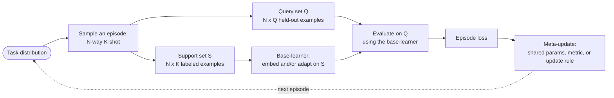
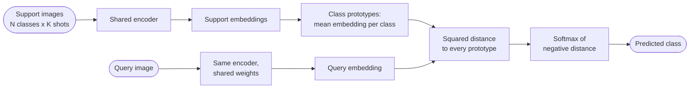
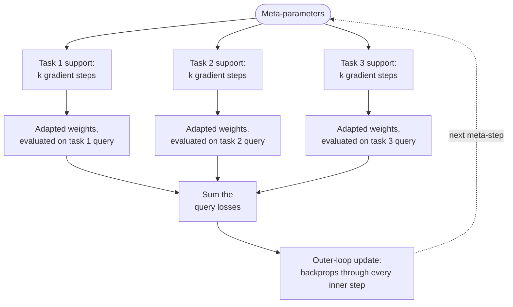

# Meta-Learning and Few-Shot Learning

## 1. Concept Overview

Meta-learning — "learning to learn" — trains a model across a whole distribution of tasks instead of a single fixed dataset, so that at test time it can pick up a brand-new task from only a handful of labeled examples. Few-shot learning is the concrete instance of this idea most often benchmarked: given N classes and only K labeled examples per class (an "N-way K-shot" problem), produce a classifier for those N classes without a conventional large-scale training run.

The shift versus standard supervised learning is where the "learning" happens. A normal classifier is optimized to fit one fixed set of classes on one large training set, then evaluated on held-out examples of those SAME classes. A meta-learned model is optimized across many simulated few-shot episodes, each with its own small set of classes, so that the thing being learned is not "the boundary between class A and class B" but "a good general-purpose strategy for building a classifier out of whatever K examples per class you're handed next." At meta-test time the classes are new — never seen during meta-training — and the model must adapt using only the support set it is given.

This module covers the three method families that answer "what, exactly, gets meta-learned": metric-based methods learn an embedding space where a simple distance function separates any new classes; optimization-based methods learn an initialization (and sometimes an update rule) from which a few gradient steps solve any new task; model/memory-based methods learn an architecture — typically with external memory — that binds new labels to new inputs within a single forward pass. Multi-task learning, where a model is trained jointly on several fixed, KNOWN tasks, is a related but distinct paradigm covered in [Multi-Task and Multi-Objective Learning](../multi_task_and_multi_objective_learning/README.md) — meta-learning's tasks are unknown at meta-train time and keep changing after deployment.

---

## 2. Intuition

One-line analogy: meta-learning is teaching someone how to cram for exams in general — not the answer key to one exam — so that, handed a brand-new subject and three example problems, they already have an efficient strategy for the fourth.

Mental model: shift the object of optimization up one level. Instead of fitting parameters to one dataset, you fit a learning PROCEDURE (an initialization, a metric, or an update rule) that performs well immediately after a cheap adaptation step on a new, disjoint task. The training loop never asks "did you classify this batch correctly?" — it asks "after seeing only K examples of a brand-new class, can you now classify a different held-out example of that class correctly?"

Why it matters: production systems constantly meet classes that did not exist at training time — a marketplace's newly listed product category, a support queue's newly created intent, a drug-discovery assay against a newly studied protein target. Collecting thousands of labels for every new arrival is either too slow or impossible, and meta-learning is a direct answer to "how good can a model be with 1-5 labeled examples of something it has never seen." A complementary answer to the same underlying scarcity — choosing WHICH examples to label rather than adapting from very few of them — is [Active Learning and Weak Supervision](../active_learning_and_weak_supervision/README.md).

Key insight: a metric-based or optimization-based meta-learner never memorizes classes — it memorizes how to quickly build a classifier. That is precisely why the meta-train and meta-test class sets must be strictly disjoint: if the "new" class was implicitly available during meta-training (through a shared backbone, a shared cache, or an overlapping split), the model is not adapting quickly, it is recalling, and the reported few-shot accuracy is fiction.

---

## 3. Core Principles

**Episode as the unit of training.** Every training step samples a fresh N-way K-shot episode (also called a task) from a task distribution: N classes, K support (labeled, for adaptation) examples per class, and Q query (held-out, for evaluation) examples per class from those SAME N classes. The model never trains on one fixed set of classes — it trains on an endless stream of small, freshly-sampled classification problems.

**Meta-train / meta-val / meta-test class disjointness.** The single most important invariant in the entire field: the classes available during meta-training, meta-validation, and meta-testing must never overlap. Accuracy on a meta-test episode is only meaningful as a measure of few-shot generalization if the model has truly never seen those classes, in any form, before.

**Two nested levels of optimization.** The base-learner adapts INSIDE one episode, using only that episode's K-shot support set — this has to be fast and cheap, seconds at most. The meta-learner optimizes ACROSS thousands of episodes, over the whole meta-training run — this is the slow, expensive process that shapes what the base-learner can do. Confusing these two loops is the most common conceptual error newcomers make.

**What gets meta-learned differs by family.** Metric-based methods meta-learn an embedding space (a fixed comparison function does the rest). Optimization-based methods meta-learn an initialization (and possibly a learning rate or update rule) from which ordinary gradient descent does the rest. Model/memory-based methods meta-learn an architecture with external memory that binds labels to inputs on the fly. All three are different answers to the same question: what reusable prior, learned over many tasks, makes a NEW task cheap to solve?

**Train/test protocol matching.** Matching Networks' foundational insight was that meta-training conditions must mirror meta-test conditions exactly — same N, same K, same label shape. A model meta-trained only on 5-shot episodes and then deployed against genuine 1-shot cold starts is being asked to solve a harder problem than it ever practiced.

**N and K set the difficulty, mechanically.** Chance accuracy is 1/N, so higher "way" is strictly harder. Higher K reduces the variance of whatever per-class summary (a prototype, an attention-weighted vote) the method computes, so accuracy rises with K and then flattens once intra-class variance — not sample count — becomes the bottleneck.

**In-context learning is meta-learning with the inner loop removed.** A large language model given a handful of demonstrations in its prompt is solving a few-shot problem with zero gradient steps: the "adaptation" happens entirely inside a single forward pass over the prompt. Section 4.5 and Section 7 return to this connection in detail.

---

## 4. Types / Architectures / Strategies

Few-shot methods fall into three families, distinguished by what the meta-training process actually produces, plus a non-episodic alternative (transfer learning) that is frequently the right baseline to beat before reaching for any of them.

### 4.1 Metric-based methods

These meta-learn an embedding function; classification is then always "compare the query embedding to something built from the support embeddings," using a comparison function that may be fixed or itself learned.

| Method | Year | Core comparison | Is the comparison learned? |
|---|---|---|---|
| Siamese Networks | 2015 | Weighted L1 distance between twin embeddings, trained on same/different pairs | A small learned distance head on top of a fixed embedding |
| Matching Networks | 2016 | Attention-weighted nearest neighbor over every individual support example | Fixed (softmax over cosine similarity); embeddings use full-context encoding |
| Prototypical Networks | 2017 | Squared Euclidean distance to the MEAN embedding (prototype) of each class | Fixed distance; only the embedding function is learned |
| Relation Networks | 2018 | A small CNN ("relation module") outputs a learned similarity score in [0, 1] | Learned, nonlinear comparison function |

**Siamese Networks** (Koch et al., 2015) pioneered the idea on Omniglot: two copies of the same convolutional network (shared weights) each embed one image, and a weighted L1 distance between the two embeddings is passed through a sigmoid to predict "same character or different." At few-shot test time, a query is compared against every support example and assigned the class of its nearest match — a verification objective repurposed as a classifier.

**Matching Networks** (Vinyals et al., 2016) introduced the episodic training protocol used by every method since, plus an explicit attention mechanism: the predicted label is a softmax-weighted sum of the SUPPORT labels, weighted by cosine similarity between the query and each individual support embedding. Their "Full Context Embeddings" variant runs the support set through a bidirectional LSTM so each example's embedding is aware of the other classes present in the episode. Matching Networks also introduced miniImageNet as a benchmark.

**Prototypical Networks** (Snell et al., 2017) simplify Matching Networks by collapsing each class's K support embeddings into a single prototype (their mean), then classifying a query by softmax over its negative squared Euclidean distance to each prototype. Averaging over K examples before comparing reduces variance relative to comparing against every individual support example, which is a large part of why Prototypical Networks tends to beat Matching Networks despite being architecturally simpler. Snell et al. also show squared Euclidean distance is a Bregman divergence, giving the prototype a principled interpretation as the maximum-likelihood estimate of an exponential-family cluster center — cosine distance has no such guarantee, and the paper reports Euclidean distance winning empirically too.

**Relation Networks** (Sung et al., 2018) replace the fixed distance function with a learned one: a small CNN takes the concatenated query and prototype (or support) embeddings and regresses a relation score in [0, 1] (trained with MSE against 1 for same-class, 0 for different-class — a regression framing, not cross-entropy). This lets the model learn a nonlinear, task-adapted notion of "similar" instead of committing to Euclidean or cosine distance in advance.

### 4.2 Optimization-based methods

These meta-learn an initialization (and sometimes an update rule) such that ordinary gradient descent, run for just a few steps on a new task's support set, reaches a good solution.

**MAML** (Model-Agnostic Meta-Learning, Finn et al., 2017) learns a single initialization theta shared across all tasks. For each task in a meta-training batch, an INNER loop takes one or a few SGD steps on the support set, producing task-specific "fast weights." An OUTER loop then measures how well those fast weights perform on that task's QUERY set, and updates theta itself by gradient descent on the sum of query losses across tasks. Because the fast weights are themselves a function of theta (via the inner-loop update), differentiating the outer loss with respect to theta requires differentiating through that update — a second-order gradient (a Hessian-vector product), not just the first-order gradient an ordinary training step would compute. "Model-agnostic" means the recipe works for any model trained by gradient descent — no specialized architecture, unlike the memory-based family below.

**First-Order MAML (FOMAML)** approximates away exactly that second-order term: it computes the outer-loop gradient by treating the fast weights as if they were independent of theta, using the query-loss gradient evaluated AT the fast weights and applying it directly as the meta-gradient. The original MAML paper reports FOMAML running roughly a third cheaper on Omniglot with almost no accuracy loss — evidence that, near a reasonable solution, the curvature term MAML's second derivative captures is small relative to the cost of computing it.

**Reptile** (Nichol et al., 2018) drops the second derivative entirely, and drops the explicit support/query split too: for each task, run k plain SGD steps starting from theta on that task's data to get an adapted theta', then move theta toward it: `theta <- theta + epsilon * (theta' - theta)`. There is no outer-loop backward pass through the inner steps at all — Reptile never calls autograd on anything but the k ordinary SGD steps themselves. Despite (or because of) this simplicity, Reptile is competitive with MAML on the standard benchmarks (Section 8's comparison table has the numbers).

### 4.3 Model/memory-based methods

These meta-learn an architecture rather than an initialization or a metric — most commonly one built around external, addressable memory.

**Meta-LSTM** (Ravi & Larochelle, 2017) reframes the optimization ALGORITHM itself as a learned model. An LSTM meta-learner observes the base-learner's loss and gradient at each inner step and outputs the parameter update, reusing the LSTM cell-state update as the update rule: the cell state IS the base-learner's parameters, the forget gate becomes a learned per-step decay (in place of a fixed weight-decay constant), and the input gate becomes a learned per-step learning rate. The whole inner-loop trajectory is trained end-to-end via backpropagation through time.

**Memory-Augmented Neural Networks (MANN)** (Santoro et al., 2016) attach an external, content-addressable memory (Neural Turing Machine-style) to a controller network. As the support set streams in, each (embedding, label) pair is written to a memory slot; a query's embedding is used as a content-based read key, retrieving a weighted combination of stored label associations. There is no gradient-based adaptation at meta-test time at all — "learning" a new class is a single memory write, and classification is a single memory read.

### 4.4 Transfer learning vs. meta-learning

Transfer learning pretrains once on a large source task (ImageNet classification, a big text corpus) and then fine-tunes — or freezes and linear-probes — on the target task. The pretraining objective is not explicitly aligned with "adapt from K examples"; it is usually just a large ordinary supervised or self-supervised objective (see [Self-Supervised and Contrastive Learning](../self_supervised_and_contrastive_learning/README.md) for that family in depth), and few-shot performance is a hoped-for side effect of good general features.

Meta-learning explicitly optimizes for the few-shot protocol itself: every meta-training step simulates the exact N-way K-shot adaptation the model will face at test time, so the training objective and the test protocol are identical by construction. This sounds strictly better, and often is — but Chen et al.'s 2019 "A Closer Look at Few-Shot Classification" is the field's standard reality check: with a sufficiently deep backbone and careful fine-tuning of just a linear classifier ("Baseline++"), plain transfer learning matches or beats MAML and Prototypical Networks on miniImageNet whenever meta-train and meta-test domains are close. The backbone and the evaluation protocol often matter more than which meta-learning algorithm is used on top of them.

### 4.5 In-context learning as gradient-free meta-learning

GPT-3-style in-context learning (Brown et al., 2020) hands a frozen model a prompt containing a handful of demonstrations (the support-set analogue) followed by a query, and reads off a prediction with ZERO gradient updates. Pretraining over trillions of tokens plays the role of meta-training over an enormous, implicit task distribution; the forward pass's attention over the demonstrations plays the role of the inner loop. The difference from MAML/Reptile is stark: those methods still run explicit gradient steps at meta-test time — see [Fine-Tuning](../../llm/fine_tuning/README.md) for that explicit, gradient-based adaptation path — while in-context learning runs none; all of the "adaptation" is amortized into the pretrained weights and expressed purely through attention at inference time. Modern long-context models push this further with hundreds or thousands of in-context examples ("many-shot" in-context learning), continuing to improve accuracy well past the handful of examples classic few-shot benchmarks use.

---

## 5. Architecture Diagrams

### Episodic meta-training loop



Every step of meta-training is this same loop, regardless of family: sample a fresh episode, adapt or embed using only the support set, score on the disjoint query set, and push that signal back into whatever is shared across episodes. Metric-based methods skip any real "adapt" step (the base-learner is just the shared encoder); optimization-based methods make the adapt step several real gradient updates.

### N-way K-shot episode structure

```
N-WAY K-SHOT EPISODE STRUCTURE (N = 5 classes)

1-shot support      C1        C2        C3        C4        C5
                  [img]     [img]     [img]     [img]     [img]
                     |         |         |         |         |
                     v         v         v         v         v
prototype (K=1)     p1        p2        p3        p4        p5    <- noisy, 1 sample

5-shot support      C1        C2        C3        C4        C5
                [img x5]  [img x5]  [img x5]  [img x5]  [img x5]
                     |         |         |         |         |
                     v         v         v         v         v
prototype (K=5)     p1        p2        p3        p4        p5    <- stable, mean of 5

query x_hat ----> compare to {p1 .. p5}, predict the nearest prototype
  (held out from support; drawn from the SAME 5 classes)

miniImageNet, Conv-4 backbone (Prototypical Networks):
  K=1 shot ~49% accuracy          K=5 shot ~68% accuracy
```

Going from 1 shot to 5 shots does not change what is being estimated — a per-class mean embedding — only how noisy the estimate is; the roughly 19-point accuracy jump above is almost entirely a variance reduction, not new information.

**What this actually says.** "N-way K-shot with Q queries" is three multiplications: "an episode is `N x K` labeled images to learn from, `N x Q` different images to be graded on, and a coin-flip floor of `1/N` you must beat to have learned anything at all."

Getting these three counts straight is the difference between reading a benchmark table correctly and comparing two numbers that were never comparable. `N` sets the difficulty, `K` sets the signal, `Q` sets only the measurement precision.

| Symbol | What it is |
|--------|------------|
| `N` (way) | Classes in this episode. Chance accuracy is exactly `1/N`, so higher N is strictly harder |
| `K` (shot) | Labeled examples per class in the support set. What the model adapts on |
| `Q` (query) | Held-out examples per class, from the SAME N classes. What the model is scored on |
| support size | `N x K` — usually tiny, 5 to 25 images |
| query size | `N x Q` — usually much larger than the support set, which surprises people |
| episode size | `N x (K + Q)` total images touched per episode |
| episodes | How many episodes you average over. Affects only the confidence interval, not the mean |

**Walk one example.** The three settings this module reports, with `Q = 15`:

```
    setting            support = NxK    query = NxQ    episode = Nx(K+Q)    chance = 1/N
    ---------------    -------------    -----------    -----------------    ------------
    5-way 1-shot         5 x 1 =  5      5 x 15 = 75      5 x 16 =  80          20.0%
    5-way 5-shot         5 x 5 = 25      5 x 15 = 75      5 x 20 = 100          20.0%
    20-way 1-shot       20 x 1 = 20     20 x 15 = 300    20 x 16 = 320           5.0%

    The query set is 15x larger than the support set at 1-shot. The model learns from
    5 images and is graded on 75 -- that ratio is what makes a single episode's
    accuracy readable at all.

    Reported accuracy vs chance:
      ProtoNet 5-way 1-shot  ~49%  is 2.5x its 20% chance floor
      ProtoNet 5-way 5-shot  ~68%  is 3.4x the same 20% floor
      A 20-way number is NOT comparable to either -- its floor is 5%, not 20%.
```

**Why the episode count is a separate knob.** `N`, `K`, and `Q` define one episode; the number of episodes you average defines how precisely you know the mean. Episode accuracies vary a lot — with a per-episode standard deviation around 18 points, the 95% confidence interval is `1.96 x 18 / sqrt(episodes)`:

```
    episodes     95% CI half-width = 1.96 x 18 / sqrt(episodes)
    --------     -----------------------------------------------
        100      1.96 x 18 / 10.00  = +/- 3.53 points
        600      1.96 x 18 / 24.49  = +/- 1.44 points

    Sampling 6x more episodes shrinks the interval only sqrt(6) = 2.45x -- the usual
    square-root penalty. But it is the difference between a +/- 3.5-point interval,
    which swallows most published improvements whole, and a +/- 1.4-point one that
    can actually resolve them. This is why 600+ episodes is the field's convention.
```

### Prototypical Networks classification



The entire "adaptation" step is an average — no gradient descent runs on the support set at all. This is why metric-based methods are cheap at meta-test time: registering a new class costs one forward pass over K images plus a mean.

### MAML: inner loop (per task) and outer loop (meta-update)



Each task gets its own short-lived, per-task copy of the parameters (the inner loop); the outer loop then updates the ONE shared initialization by differentiating through all of those per-task adaptations at once. Reptile draws the same picture but deletes everything from "Adapted weights, evaluated on query" onward — it moves theta toward the adapted weights directly, with no query-loss backward pass.

### Task/class leakage: correct split vs. a leaked one

```
CLASS-ID SPACE: disjoint split (correct) vs. a leaked one

correct split -- no class appears in more than one partition:
  meta-train [ 1000 classes ]   meta-val [ 250 classes ]   meta-test [ 250 classes ]
                                                               ^ genuinely never seen,
                                                                 directly or indirectly

leaked split -- backbone pretraining silently covers "held-out" classes:
  ImageNet-1k pretraining   [ 1000 classes, fully supervised ]
  miniImageNet "novel" test classes   [ 20 of those SAME 1000 classes ]
                                        ^ already learned before the "few-shot" eval

measured 5-way 1-shot accuracy:   91% (leaked)   vs.   63% (clean backbone)
```

The leaked accuracy is not wrong arithmetic — the model genuinely scores 91% — it is measuring the wrong thing: recognition of classes the backbone already knows, not generalization to unseen ones. Section 6 and Section 10 walk through exactly how this happens and how to catch it.

---

## 6. How It Works — Detailed Mechanics

The code below builds up the two methods the field is benchmarked on most, in order: episode sampling (the data-pipeline contract every method relies on), Prototypical Networks (a full metric-based forward pass and loss), then MAML and Reptile (optimization-based, with the second-order gradient made explicit). If backpropagation itself needs a refresher before the second-order step, see [Neural Network Fundamentals](../neural_network_fundamentals/README.md).

```python
from __future__ import annotations

import random

import torch
import torch.nn.functional as F
from torch import Tensor, nn
from torch.func import functional_call


# --- Episode sampling: the data-pipeline contract every method relies on ---

class EpisodeSampler:
    """
    Samples N-way K-shot episodes from ONE class pool (meta-train, meta-val,
    OR meta-test -- never a mix). The caller must hand this class three
    DISJOINT `class_to_indices` mappings; see `build_disjoint_splits` below
    for how that invariant is enforced.
    """

    def __init__(
        self,
        class_to_indices: dict[int, list[int]],
        n_way: int = 5,
        k_shot: int = 1,
        q_query: int = 15,
    ) -> None:
        self.class_to_indices = class_to_indices
        self.classes = list(class_to_indices.keys())
        self.n_way = n_way
        self.k_shot = k_shot
        self.q_query = q_query

    def sample_episode(self) -> tuple[list[int], list[int], list[int]]:
        """Returns (episode_class_ids, support_indices, query_indices)."""
        episode_class_ids = random.sample(self.classes, self.n_way)
        support_indices: list[int] = []
        query_indices: list[int] = []
        for class_id in episode_class_ids:
            pool = self.class_to_indices[class_id]
            needed = self.k_shot + self.q_query
            if len(pool) < needed:
                raise ValueError(f"class {class_id} has {len(pool)} examples, need {needed}")
            chosen = random.sample(pool, needed)
            support_indices.extend(chosen[: self.k_shot])
            query_indices.extend(chosen[self.k_shot :])
        return episode_class_ids, support_indices, query_indices


# --- Prototypical Networks: forward pass + loss for one episode ---

class ProtoNetEncoder(nn.Module):
    """Conv-4: the standard 4-block backbone from the original ProtoNet/MAML papers."""

    def __init__(self, in_channels: int = 3, hidden_dim: int = 64) -> None:
        super().__init__()

        def block(c_in: int, c_out: int) -> nn.Sequential:
            return nn.Sequential(
                nn.Conv2d(c_in, c_out, kernel_size=3, padding=1),
                nn.BatchNorm2d(c_out),
                nn.ReLU(inplace=True),
                nn.MaxPool2d(2),
            )

        self.encoder = nn.Sequential(
            block(in_channels, hidden_dim),
            block(hidden_dim, hidden_dim),
            block(hidden_dim, hidden_dim),
            block(hidden_dim, hidden_dim),
        )

    def forward(self, x: Tensor) -> Tensor:
        z = self.encoder(x)               # [B, hidden_dim, H', W']
        return z.mean(dim=[2, 3])         # global average pool -> [B, hidden_dim]


def prototypical_loss(
    encoder: nn.Module,
    support: Tensor,      # [n_way * k_shot, C, H, W]
    query: Tensor,        # [n_way * q_query, C, H, W]
    n_way: int,
    k_shot: int,
) -> tuple[Tensor, Tensor]:
    """Prototypical Networks loss and accuracy for one episode."""
    z_support = encoder(support)                                # [n_way*k_shot, D]
    z_query = encoder(query)                                    # [n_way*q_query, D]

    embed_dim = z_support.size(-1)
    prototypes = z_support.view(n_way, k_shot, embed_dim).mean(dim=1)   # [n_way, D]

    dists = torch.cdist(z_query, prototypes, p=2) ** 2          # squared Euclidean
    log_p_y = F.log_softmax(-dists, dim=1)                      # negative distance = logit

    q_query = z_query.size(0) // n_way
    query_labels = torch.arange(n_way).repeat_interleave(q_query).to(z_query.device)

    loss = F.nll_loss(log_p_y, query_labels)
    acc = (log_p_y.argmax(dim=1) == query_labels).float().mean()
    return loss, acc


# --- MAML: inner loop (task adaptation) + outer loop (meta-update) ---

def maml_inner_loop(
    model: nn.Module,          # ANY classifier -- MAML is model-agnostic
    support_x: Tensor,
    support_y: Tensor,
    inner_lr: float = 0.01,
    inner_steps: int = 5,
    first_order: bool = False,
) -> dict[str, Tensor]:
    """
    Runs `inner_steps` SGD steps on the support set and returns the ADAPTED
    parameters as a fresh dict -- model.parameters() is never touched in
    place, so the whole trajectory stays differentiable back to theta.

    first_order=False -> full MAML: create_graph=True keeps the inner
        steps in the autograd graph, so the outer loss can backprop
        THROUGH them (a second-order / Hessian-vector product).
    first_order=True  -> FOMAML: create_graph=False drops that term; the
        outer gradient is computed as if fast_weights did not depend on theta.
    """
    fast_weights: dict[str, Tensor] = dict(model.named_parameters())

    for _ in range(inner_steps):
        logits = functional_call(model, fast_weights, (support_x,))
        loss = F.cross_entropy(logits, support_y)

        grads = torch.autograd.grad(
            loss,
            list(fast_weights.values()),
            create_graph=not first_order,     # <- the second-order switch
        )
        fast_weights = {
            name: w - inner_lr * g
            for (name, w), g in zip(fast_weights.items(), grads)
        }

    return fast_weights


def maml_outer_step(
    model: nn.Module,
    meta_optimizer: torch.optim.Optimizer,
    tasks: list[tuple[Tensor, Tensor, Tensor, Tensor]],  # (sx, sy, qx, qy) per task
    inner_lr: float = 0.01,
    inner_steps: int = 5,
    first_order: bool = False,
) -> float:
    meta_optimizer.zero_grad()
    meta_loss = torch.zeros(())
    for support_x, support_y, query_x, query_y in tasks:
        fast_weights = maml_inner_loop(
            model, support_x, support_y, inner_lr, inner_steps, first_order
        )
        query_logits = functional_call(model, fast_weights, (query_x,))
        meta_loss = meta_loss + F.cross_entropy(query_logits, query_y)

    meta_loss = meta_loss / len(tasks)
    meta_loss.backward()      # backprops through every inner step iff first_order=False
    meta_optimizer.step()
    return meta_loss.item()


# --- Reptile: no query set, no second derivative, just interpolate ---

def reptile_outer_step(
    model: nn.Module,
    task_batches: list[tuple[Tensor, Tensor]],   # (x, y) per task -- no support/query split
    inner_lr: float = 0.02,
    inner_steps: int = 10,
    epsilon: float = 0.1,        # outer step size
) -> None:
    theta_0 = {name: p.detach().clone() for name, p in model.named_parameters()}
    accum = {name: torch.zeros_like(p) for name, p in theta_0.items()}

    for x, y in task_batches:
        with torch.no_grad():
            for name, p in model.named_parameters():
                p.copy_(theta_0[name])                  # reset to the shared init

        inner_opt = torch.optim.SGD(model.parameters(), lr=inner_lr)
        for _ in range(inner_steps):                    # k plain SGD steps
            inner_opt.zero_grad()
            loss = F.cross_entropy(model(x), y)
            loss.backward()
            inner_opt.step()

        for name, p in model.named_parameters():
            accum[name] += p.detach() - theta_0[name]   # theta_i' - theta_0

    with torch.no_grad():
        for name, p in model.named_parameters():
            p.copy_(theta_0[name] + epsilon * accum[name] / len(task_batches))
```

**Read it like this.** The two loops are two update rules stacked, `theta_i' = theta - alpha * grad_theta L_i^support(theta)` inside and `theta <- theta - beta * grad_theta sum_i L_i^query(theta_i')` outside: "adapt a throwaway copy on each task's support set, see how that copy does on the task's query set, and then move the *starting point* in whatever direction would have made those adapted copies better."

The outer gradient is taken with respect to `theta`, not `theta_i'` — that is the entire idea. You never keep the adapted weights; you only keep what they taught you about where to start.

| Symbol | What it is |
|--------|------------|
| `theta` | The one shared initialization. The only thing MAML actually ships |
| `theta_i'` | Fast weights for task `i` — a temporary copy, discarded after the outer step |
| `alpha` | Inner learning rate, `inner_lr=0.01` above. Governs adaptation within one episode |
| `beta` | Outer (meta) learning rate, whatever `meta_optimizer` uses. Governs learning across episodes |
| `L_i^support` | Loss on task `i`'s support set — drives the inner loop only |
| `L_i^query` | Loss on task `i`'s *query* set, evaluated at `theta_i'` — the only thing the outer loop sees |
| `grad_theta` (outer) | Differentiates through the inner update, which is why a second derivative appears |

**Walk one example.** A scalar toy so every number is checkable: support loss `L_s(theta) = (theta - 3)^2`, query loss `L_q(theta) = (theta - 2)^2`, `theta = 1.0`, `alpha = 0.01`, `inner_steps = 5` (the code's defaults):

```
    Inner loop -- 5 SGD steps on the SUPPORT loss, starting from theta = 1.0

    step   theta       grad L_s = 2(theta-3)   theta - alpha*grad    d(theta')/d(theta)
    ----   --------    ---------------------   ------------------    ------------------
      1    1.000000          -4.000000              1.040000              0.980000
      2    1.040000          -3.920000              1.079200              0.960400
      3    1.079200          -3.841600              1.117616              0.941192
      4    1.117616          -3.764768              1.155264              0.922368
      5    1.155264          -3.689473              1.192158              0.903921

    theta' = 1.192158                     <- fast weights, about to be thrown away
    d(theta')/d(theta) = (1 - alpha*2)^5 = 0.98^5 = 0.903921

    Outer loop -- evaluate the QUERY loss at theta', differentiate back to theta

    L_q(theta') = (1.192158 - 2)^2 = 0.652608
    dL_q/d(theta') = 2 * (1.192158 - 2) = -1.615683

    full MAML  meta-grad = -1.615683 x 0.903921 = -1.460450   <- chain rule through
                                                                 the inner steps
    FOMAML     meta-grad = -1.615683                          <- pretends theta' is
                                                                 independent of theta

    Outer update with beta = 0.001:
      full MAML : theta <- 1.0 - 0.001 x (-1.460450) = 1.00146045
      FOMAML    : theta <- 1.0 - 0.001 x (-1.615683) = 1.00161568
```

Both meta-gradients point the same direction; they differ only in magnitude, here by `9.6%`. That is the whole FOMAML bet — the `0.903921` curvature factor is a modest rescaling near a reasonable solution, and dropping it removes the entire second-order graph. Notice the outer update moves `theta` by `0.00146`, about `132x` less than the `0.192` the inner loop moved `theta'`: the inner loop is supposed to move a lot and be discarded, the outer loop is supposed to move a little and persist.

**Why the query set must be disjoint from the support set.** If the outer loss were measured on the same examples the inner loop just adapted on, `theta` would be rewarded for producing an initialization that *memorizes* five images in five gradient steps — which any sufficiently flexible model can do without learning anything transferable. The support/query split is what forces the outer objective to be "adapts and then generalizes" instead of "adapts and then overfits."

**Where Reptile diverges.** Reptile skips the query set and the chain rule entirely: run the inner steps, then interpolate. With `inner_lr = 0.02`, `inner_steps = 10` on the same `L_s`, the toy gives `theta' = 1.670335`, so with `epsilon = 0.1`:

```
    theta <- theta + epsilon * (theta' - theta)
           = 1.0 + 0.1 x (1.670335 - 1.0)
           = 1.0 + 0.1 x 0.670335
           = 1.067033

    No query loss. No d(theta')/d(theta) term. No autograd beyond the 10 plain SGD
    steps. The direction (theta' - theta) is used directly as a pseudo-gradient.
```

**Key hyperparameters and their effects:**
- Way (N) and shot (K): raising N lowers chance accuracy (1/N) and increases confusable boundaries; raising K reduces prototype/estimate variance. Standard benchmarks report 5-way 1-shot and 5-way 5-shot side by side for exactly this reason.
- Inner learning rate and inner steps (MAML/Reptile): too high or too many steps overshoots the task optimum inside a handful of examples; too low or too few under-adapts. 1-10 inner steps at lr 0.01-0.05 is the typical range for Conv-4 backbones.
- `create_graph` (MAML): `True` keeps the full second-order graph (accurate, memory-hungry); `False` gives FOMAML (cheaper, nearly as accurate on most benchmarks).
- Query set size Q: larger Q gives a lower-variance episode loss but costs more forward passes per episode; 15 query examples per class is a common default.

### Broken -> Fixed: task/class leakage through a stale prototype cache

```python
# BROKEN: the cache is keyed by the WITHIN-EPISODE label (0..N-1), not the
# true class id, and it is never cleared between episodes.
class LeakyProtoNetCache:
    def __init__(self, encoder: nn.Module) -> None:
        self.encoder = encoder
        self._cache: dict[int, Tensor] = {}        # key = 0..N-1  <- BUG

    def classify_episode(
        self, support: Tensor, n_way: int, k_shot: int, query: Tensor
    ) -> Tensor:
        z_support = self.encoder(support).view(n_way, k_shot, -1)
        for label in range(n_way):
            if label not in self._cache:            # "optimization": reuse prototypes
                self._cache[label] = z_support[label].mean(dim=0)
        prototypes = torch.stack([self._cache[label] for label in range(n_way)])
        dists = torch.cdist(self.encoder(query), prototypes, p=2) ** 2
        return (-dists).softmax(dim=1)

# If meta-train class "golden retriever" happens to be remapped to label 0
# in one episode, and meta-test class "container ship" is ALSO remapped to
# label 0 in a later episode, this serves the GOLDEN RETRIEVER prototype for
# every "container ship" query -- silently bridging meta-train into meta-test.
```

```python
# FIXED: key by the TRUE class id, never cache across episode boundaries
# (recomputing a prototype is one mean over an already-computed embedding --
# it is not worth caching), and assert disjointness where the splits are built.
class ProtoNetEpisode:
    def __init__(self, encoder: nn.Module) -> None:
        self.encoder = encoder

    def classify_episode(
        self, support: Tensor, n_way: int, k_shot: int, query: Tensor
    ) -> Tensor:
        z_support = self.encoder(support).view(n_way, k_shot, -1)
        prototypes = z_support.mean(dim=1)          # recomputed fresh, every call
        dists = torch.cdist(self.encoder(query), prototypes, p=2) ** 2
        return (-dists).softmax(dim=1)


def build_disjoint_splits(
    all_classes: list[int], n_train: int, n_val: int, seed: int = 42
) -> tuple[set[int], set[int], set[int]]:
    shuffled = all_classes.copy()
    random.Random(seed).shuffle(shuffled)
    train = set(shuffled[:n_train])
    val = set(shuffled[n_train : n_train + n_val])
    test = set(shuffled[n_train + n_val :])
    assert train.isdisjoint(val), "meta-train/meta-val class leakage"
    assert train.isdisjoint(test), "meta-train/meta-test class leakage"
    assert val.isdisjoint(test), "meta-val/meta-test class leakage"
    return train, val, test
```

The fix has two independent parts, and both matter: caching correctly (by true id, scoped to a single episode) prevents the CODE-level leak, and `build_disjoint_splits`'s assertions prevent the DATA-level leak of a class simply being assigned to more than one split in the first place. Section 10 covers a third form of the same failure — a pretrained backbone that already saw the "held-out" classes before few-shot evaluation even starts.

---

## 7. Real-World Examples

**Omniglot and miniImageNet — the field's own benchmarks:** Omniglot (Lake et al., 2015) contains 1,623 handwritten characters across 50 alphabets, 20 examples each, drawn by different people on Amazon Mechanical Turk — designed explicitly to test rapid concept learning from a handful of strokes. miniImageNet (Vinyals et al., 2016; standardized splits by Ravi & Larochelle, 2017) samples 100 ImageNet classes at 600 images each (84x84 resolution), split 64 meta-train / 16 meta-val / 20 meta-test classes with no overlap. Nearly every method in Section 4 reports its headline number on one or both of these.

**FaceNet (Google, 2015) — one-shot enrollment in production face recognition:** trains a 128-dimensional embedding with triplet loss (anchor, positive, negative faces), reaching 99.63% accuracy on LFW. The production pattern this enables is pure metric-based few-shot learning: enrolling a new person means embedding one (or a few) photos and storing the resulting vector — no retraining, no gradient step — exactly the Siamese/Prototypical Networks pattern from Section 4.1, running at the scale of every phone's face unlock and every airport biometric gate.

**SetFit (Hugging Face, 2022) — few-shot text classification without prompts:** fine-tunes a Sentence-Transformer with a contrastive objective on as few as 8 labeled examples per class, then trains a lightweight classification head on the resulting embeddings. It routinely matches or beats few-shot-prompted large language models on text classification while running on a fraction of the compute, because the contrastive fine-tuning step is a direct descendant of the metric-based few-shot learning line (Prototypical/Matching Networks) applied to sentence embeddings.

**FS-Mol (Microsoft Research, 2021) — few-shot molecular property prediction:** a benchmark of thousands of drug-discovery assays, each with only tens to low-hundreds of labeled compounds (a new protein target rarely has more), framed explicitly as N-way K-shot tasks. Prototypical-Networks-style and MAML-style baselines are the standard comparison points, because a pharma team facing a brand-new assay has exactly the meta-test problem this module describes: a handful of labeled compounds and a large historical library of OTHER assays to meta-train on.

**GPT-3 and many-shot in-context learning — meta-learning without an inner loop:** Brown et al. (2020) demonstrated that a 175B-parameter model, given a handful of task demonstrations inside its 2048-token prompt, solves new tasks competitively with NO gradient update at all. This is Section 4.5's connection made concrete at production scale: few-shot-prompted LLM APIs are, architecturally, meta-test-time inference against a model whose pretraining was its meta-training. Later long-context models extend this to hundreds or thousands of in-context examples, with accuracy continuing to climb well past the handful of examples classic few-shot benchmarks use.

---

## 8. Tradeoffs

**By method family:**

| Dimension | Metric-based (ProtoNet, Matching Net) | Optimization-based (MAML) | Model/memory-based (MANN, Meta-LSTM) | Transfer learning |
|---|---|---|---|---|
| Adaptation at meta-test | One forward pass (embed + compare) | K gradient steps on the support set | One streaming memory-write pass | Fine-tune (many steps) or freeze + linear probe |
| Needs second-order gradients | No | Yes (full MAML); no (FOMAML/Reptile) | No | No |
| Architecture constraint | Any embedding network | Any model trainable by gradient descent | Requires an external memory / addressing module | Any pretrained backbone |
| New-class latency | Milliseconds | Tens-hundreds of milliseconds (a few SGD steps) | Milliseconds | Minutes-hours (fine-tune) or milliseconds (frozen) |
| Typical miniImageNet 5-way 1-shot | ~49-50% | ~48.7% | ~43% (Meta-LSTM) | Competitive with a strong backbone (Section 4.4) |
| Main failure mode | High intra-class variance, open-set queries | Second-order compute/memory blow-up; can overfit the meta-train task distribution | Memory capacity limits; harder to train stably | Domain shift between pretrain and target |

**MAML vs. FOMAML vs. Reptile — the optimization-based family internally:**

| | MAML | FOMAML | Reptile |
|---|---|---|---|
| Needs a query set during meta-training | Yes | Yes | No (plain SGD on one task batch) |
| Computes second derivatives | Yes | No | No |
| Meta-gradient | True gradient of query loss w.r.t. theta, through the inner steps | Query-loss gradient at the adapted weights, applied as if theta-independent | `theta' - theta`, used directly as a pseudo-gradient |
| Relative meta-training compute | 1x (baseline) | ~0.67x (paper-reported) | Cheapest -- no backward pass through the inner trajectory |
| miniImageNet 5-way 5-shot (paper-reported) | 63.11% | ~63% | ~66% |

Reptile's competitiveness with MAML despite computing no second derivative at all is a standing, slightly counter-intuitive result: Nichol et al. show its update direction, in expectation, approximates the same gradient FOMAML computes, via a Taylor-expansion argument, not by explicitly matching MAML's objective.

---

## 9. When to Use / When NOT to Use

**Use meta-learning when:**
- New classes or tasks keep arriving after deployment as a recurring event, not a one-off migration — a marketplace's new product categories, a support system's new intents, a new drug target.
- Tasks share deep structural similarity (same modality, similar statistics) so a learned prior — a metric space, an initialization — has something real to transfer.
- You can construct or simulate a task distribution that genuinely resembles the deployment distribution of few-shot tasks; a mismatched simulated distribution meta-learns the wrong prior.
- Meta-test-time latency has to be small and predictable — milliseconds for metric-based methods, a handful of gradient steps for optimization-based ones — with no large retraining pipeline in the loop.

**Do NOT use meta-learning when:**
- The target task actually has enough labeled data — plain supervised training or ordinary transfer learning is simpler to build, simpler to debug, and per Section 4.4 often just as accurate.
- Only one or two new tasks will ever occur; building and validating an episodic meta-training pipeline is not worth it for a problem you will solve once.
- Meta-train and meta-test domains are far apart (natural photos vs. satellite imagery, general text vs. a narrow legal sub-domain) — the learned prior does not transfer across a large domain gap and can underperform a generic pretrained backbone.
- The number of classes at test time is unknown or unbounded (open-set recognition) — the standard N-way K-shot framing assumes a closed, fixed candidate set, and a plain softmax over prototypes has no "none of the above" option (Section 12 returns to this).
- Regulatory or interpretability requirements demand simple, auditable decision logic over a learned metric space or initialization.

---

## 10. Common Pitfalls

**Pitfall 1 — A pretrained backbone that already saw the "held-out" classes.** A team reported 91% 5-way 1-shot accuracy on miniImageNet using a frozen, ImageNet-1k-pretrained ResNet-18 as the embedding function. Sixteen of the 20 "novel" test classes were literally among the 1,000 ImageNet classes that backbone had already been fully supervised on — the model was not doing few-shot generalization, it was recalling classes it already knew cold. Re-running with a backbone pretrained ONLY on the 64 meta-train classes dropped accuracy to 63%, in line with the literature numbers in Section 8's table. Fix: before reporting any few-shot number, check whether the encoder's pretraining data overlaps the meta-test classes at all, and disclose it explicitly if it does.

**Pitfall 2 — A prototype cache keyed by the wrong id.** A serving layer cached class prototypes for speed, keyed by the in-episode integer label (0..N-1) rather than the permanent class id, exactly as shown in Section 6's broken example. Because episode class order was reshuffled between runs in the same long-lived process, roughly 12% of meta-test episodes silently reused a stale meta-train prototype for at least one class slot — inflating the reported meta-test accuracy from a genuine 64% to an observed 74% until a unit test asserted cache keys against true class ids and caught the mismatch.

**Pitfall 3 — Transductive batch normalization sneaking in query information.** An embedding encoder's BatchNorm layers computed running statistics jointly over the support AND query images within an episode, rather than fitting statistics on the support set alone. Query-set information leaked backward into the support-set forward pass — a real, published phenomenon in the few-shot literature sometimes called "transductive" leakage — inflating accuracy by several points and making the method incomparable to inductive baselines that never look at the query batch during adaptation. Fix: compute or freeze normalization statistics using only the support set, and label results explicitly as transductive or inductive when publishing a comparison.

**Pitfall 4 — Trusting a single small meta-test run.** A team validated a new metric-based method on 100 randomly sampled episodes (600 query images total) and reported a single point estimate. Re-running with a different random seed moved the number by more than 4 points — larger than the reported improvement over the baseline. Standard practice in the literature is 600 or more sampled episodes with a mean and 95% confidence interval; anything smaller is measuring noise as often as it is measuring a real effect.

**Pitfall 5 — Scaling MAML's inner steps without expecting the memory cost.** A team raised `inner_steps` from 5 to 20 hoping a longer adaptation would close an accuracy gap, keeping `create_graph=True` (full second-order MAML) unchanged. The same batch size that fit comfortably before now hit out-of-memory, because full MAML's memory footprint holds the ENTIRE inner-loop computation graph alive until the outer backward pass, scaling roughly with inner steps times model size. Fix: switch to FOMAML (`create_graph=False`) or Reptile when scaling inner steps, or apply gradient checkpointing across the inner loop if the full second-order signal is genuinely required.

---

## 11. Technologies & Tools

| Tool | Purpose | Notes |
|---|---|---|
| learn2learn | MAML, ANIL, MetaSGD, Reptile, ProtoNets in PyTorch | Most actively maintained general meta-learning library |
| higher | Differentiable, "functional" copies of `nn.Module` for second-order meta-gradients | Predecessor pattern to `torch.func`; still widely referenced in papers |
| torch.func (functorch) | `functional_call`, `grad`, `vmap` for parameter-as-argument training | Modern (PyTorch 2.x) way to implement MAML without external libraries |
| Torchmeta | Episodic dataloaders for Omniglot, miniImageNet, tieredImageNet | Convenient N-way K-shot samplers; lower recent maintenance activity |
| Meta-Dataset | Large-scale, 10-dataset cross-domain few-shot benchmark (Google) | Stress-tests generalization beyond a single-domain benchmark like miniImageNet |
| FS-Mol | Few-shot molecular property prediction benchmark (Microsoft Research) | Real drug-discovery task distribution, not a vision toy benchmark |
| SetFit (Hugging Face) | Contrastive sentence-embedding fine-tuning for few-shot text classification | Production-ready alternative to prompting an LLM for classification |
| OpenAI / Anthropic APIs | Few-shot prompting (in-context learning) | Zero-training-code deployment path for the Section 4.5 connection |

---

## 12. Interview Questions with Answers

**What is task/class leakage in few-shot learning, and why does it silently inflate accuracy?**
Task/class leakage is when meta-test classes were already seen, directly or indirectly, during meta-training. It can happen through a pretrained backbone trained on data containing the "held-out" classes, a prototype cache keyed incorrectly across episodes, or a class split that is not actually disjoint. The model then recalls a class it already knows instead of adapting from scratch, and the reported few-shot accuracy measures memorization, not generalization. Always verify meta-train, meta-val, and meta-test classes are disjoint, and check whether any pretrained component's training data overlaps the "novel" classes.

**Why does using an ImageNet-pretrained backbone for miniImageNet few-shot evaluation give misleadingly high numbers?**
Because miniImageNet's "novel" test classes are drawn from the same 1,000 ImageNet classes the backbone was already fully supervised on. A frozen encoder pretrained on ImageNet-1k has effectively already seen thousands of labeled examples of many "unseen" test classes, so its few-shot accuracy reflects recall, not adaptation. Section 10's pitfall shows this exact scenario dropping from a leaked 91% to a clean 63% once the backbone was re-pretrained on only the meta-train classes. Either avoid backbones pretrained on data overlapping the test classes, or disclose the overlap explicitly when reporting results.

**What does "training and testing conditions must match" mean in few-shot learning, and why does it matter?**
It means meta-training episodes must mirror the exact N-way, K-shot structure the model will face at meta-test time. This is Matching Networks' foundational insight: a model meta-trained only on 5-shot episodes has never practiced the 1-shot problem it might face at a real cold start, so its accuracy at deployment can be substantially worse than its reported benchmark number. Always meta-train at the same (or a matched range of) N and K values you expect to see in production, and if the production shot count varies, meta-train across that range too.

**Why can transductive batch normalization inflate reported few-shot accuracy?**
Because computing BatchNorm statistics jointly over the support and query images lets query-set information leak into the support-set forward pass. This is a real, published phenomenon in the few-shot literature: some methods are explicitly transductive (they use the whole query batch's statistics), while others are inductive (support-only), and comparing the two without labeling them is an apples-to-oranges mistake. The inflation can be several accuracy points, enough to flip a published ranking between methods. Fix by computing or freezing normalization statistics from the support set alone, and always state which protocol was used.

**Why is a single small meta-test run (for example, 100 episodes) an unreliable way to report few-shot accuracy?**
Because the variance across randomly sampled episodes is large enough that a single run can move by several accuracy points on a re-run with a different seed. A 100-episode run at 5-way with 15 queries per class is only 600 query images, which commonly has a 95% confidence interval of three to four points — larger than many papers' claimed improvement over their baseline. Standard practice is to sample 600 or more episodes and report a mean with a 95% confidence interval, not a single point estimate.

**What is the difference between the support set and the query set in a few-shot episode?**
The support set is the small, labeled set the model adapts on; the query set is a disjoint, held-out set from the SAME classes used to evaluate that adaptation. In an N-way K-shot episode, the support set has K labeled examples per class (N times K total) and the query set has Q additional, different examples per class. The query set must never overlap the support set — if it did, the reported accuracy would measure memorization of the support examples, not generalization within the episode.

**How does a Prototypical Network classify a new query example?**
It averages each class's K support embeddings into a single prototype, then classifies the query by softmax over its negative squared distance to every prototype. The prototype for class k is simply the mean of that class's embedded support examples; there is no learned distance function and no gradient step at test time, only a forward pass through the shared encoder and a mean. Because the prototype averages K examples, it is far less noisy than comparing the query against any single support example directly.

**Why do Prototypical Networks use squared Euclidean distance instead of cosine similarity?**
Squared Euclidean distance is a Bregman divergence, which gives the class prototype a principled interpretation as a maximum-likelihood cluster center. Cosine similarity has no equivalent guarantee — there is no exponential-family distribution whose maximum-likelihood mean corresponds to normalizing vectors and taking a dot product. Snell et al.'s original experiments also found Euclidean distance empirically outperforming cosine distance on both Omniglot and miniImageNet. This is a common interview trap: candidates often assume cosine is always the safer default for embeddings, but the prototype-as-mean framing specifically favors Euclidean.

**What does MAML actually optimize for, and how is that different from ordinary supervised training?**
MAML optimizes a single initialization such that a few gradient steps on ANY new task's support set produce low loss on that task's query set. Ordinary supervised training minimizes the loss directly; MAML minimizes the loss AFTER a small, fixed number of adaptation steps, across a whole distribution of tasks. This shift means MAML is not evaluated on how good theta is by itself, but on how good theta is as a STARTING POINT for fast adaptation — a subtly different, higher-order objective.

**Why does MAML require second-order gradients, and what does First-Order MAML (FOMAML) drop?**
MAML's inner-loop adapted weights are themselves a function of the initialization, so differentiating the outer loss with respect to it requires a Hessian-vector product. Concretely, the outer loss depends on theta both directly and through the inner-loop gradient step, and backpropagating through that gradient step is what makes the computation second-order. FOMAML approximates this away by treating the adapted weights as constant with respect to theta when computing the outer gradient — in PyTorch terms, setting `create_graph=False` instead of `True`. The original paper reports roughly a third less compute on Omniglot from this approximation, with almost no accuracy loss.

**How does Reptile differ from MAML, and why is it cheaper to compute?**
Reptile runs ordinary SGD steps on a task and moves the initialization toward the resulting weights, with no query set and no second derivative at all. Its update rule is simply `theta <- theta + epsilon * (theta' - theta)`, where theta' is what k plain SGD steps produce on one task's data — there is no outer-loop backward pass through the inner trajectory, unlike even FOMAML, which still differentiates a query loss. Despite this simplicity, Reptile is competitive with MAML on standard benchmarks, which Nichol et al. explain via a Taylor-expansion argument rather than any explicit match to MAML's objective.

**How does the LSTM meta-learner (Ravi and Larochelle) turn gradient descent itself into a learned model?**
It maps the LSTM's cell-state update onto the parameter-update rule, with the forget gate acting as a learned per-step decay and the input gate as a learned per-step learning rate. The base-learner's parameters are literally the LSTM's cell state, and the meta-learner observes the base-learner's loss and gradient at each inner step to decide how to update it. This entire inner-loop trajectory is trained end-to-end via backpropagation through time, so the update rule itself — not just an initialization — is what gets meta-learned.

**How do Memory-Augmented Neural Networks (MANN) solve few-shot learning without any gradient-based adaptation?**
MANN writes each support example's embedding and label into an external, content-addressable memory, then retrieves labels for a query by content-based similarity. As the support set streams in, a controller network binds each (embedding, label) pair to a memory slot; a query's embedding is used as a read key to retrieve a weighted combination of stored associations. Because "learning" a new class is a single memory write, there is no gradient step at meta-test time at all — the adaptation happens entirely within the forward pass over the support set.

**What is the practical difference between transfer learning and meta-learning for a few-shot problem?**
Transfer learning pretrains once on a large source task and fine-tunes; meta-learning explicitly trains across many simulated few-shot episodes so the training objective matches the test protocol exactly. Because meta-learning's training signal is the few-shot adaptation itself, it should in principle transfer better to a genuinely new task — but Chen et al.'s 2019 "Closer Look" paper found that a well-tuned transfer-learning baseline with a deep backbone matches or beats MAML and Prototypical Networks whenever the meta-train and meta-test domains are close. In practice, backbone depth and evaluation protocol often matter more than the choice of meta-learning algorithm.

**What is the connection between meta-learning and in-context learning (ICL) in large language models?**
In-context learning is meta-learning with the inner loop removed: adaptation happens entirely within a single forward pass over a prompt's demonstrations, with zero gradient updates. Pretraining over a vast, implicit distribution of tasks plays the role of meta-training, and the demonstrations in the prompt play the role of the support set. Unlike MAML or Reptile, which still run explicit gradient steps at meta-test time, ICL's "adaptation" is entirely amortized into the pretrained weights and expressed through attention at inference time.

**What happens to few-shot accuracy as K (the number of shots per class) increases from 1 to 5 to 20, and why does it plateau?**
Accuracy rises steeply from 1-shot to 5-shot because averaging more support examples per class sharply reduces the prototype's variance. Beyond roughly 10-20 shots, further examples reduce variance only marginally, since the limiting factor becomes irreducible intra-class variance and label noise rather than how noisy the mean estimate is. Prototypical Networks' own results follow this curve: miniImageNet 5-way accuracy goes from about 49% at 1-shot to about 68% at 5-shot, a much larger jump than 5-shot to 20-shot would produce.

**What happens to few-shot accuracy as N (the number of classes, or "way") increases?**
Accuracy decreases monotonically as N grows, because chance accuracy falls as 1/N and there are more confusable class boundaries to separate. For example, Prototypical Networks' Omniglot accuracy drops from about 98.8% at 5-way 1-shot to about 96.0% at 20-way 1-shot — still high, because Omniglot classes are visually distinct, but the direction is universal across methods and benchmarks. When comparing two papers' numbers, always check they report the same N before treating one method as "better."

**How would you handle a query example whose true class is not among the episode's N support classes at all?**
Standard N-way K-shot classification is closed-set, so a plain softmax over N prototypes is forced to assign one of those N labels even to a genuine outlier. Open-set few-shot recognition needs an explicit rejection mechanism — for example, thresholding the distance to the nearest prototype and returning "none of the above" if every prototype is too far, or learning a dedicated outlier prototype during meta-training. Ignoring this is a common production gap: a real deployment will eventually see something that belongs to none of its registered classes.

**Why is Omniglot considered an "easier" benchmark than miniImageNet, and what does that mean for interpreting a reported number?**
Omniglot's handwritten characters are binary, low-variance, and well-aligned, so accuracy for most methods sits in the high 90s percent. miniImageNet's natural photos have far higher intra-class variance, background clutter, and pose variation, so the same 5-way K-shot setup produces accuracy roughly in the 45-70% range depending on K and method. A strong Omniglot number alone says very little about how a method will perform on realistic, high-variance production data — always look for a miniImageNet, tieredImageNet, or domain-specific number too.

**Why was tieredImageNet introduced as a benchmark when miniImageNet already existed?**
tieredImageNet splits its classes at the super-category level specifically to reduce the class-similarity leakage present in miniImageNet's flat 64/16/20 split. miniImageNet's split can place near-identical classes (for instance, two visually similar dog breeds) on opposite sides of the meta-train/meta-test boundary, letting a model transfer low-level features that are almost class-specific rather than genuinely general ones. tieredImageNet's hierarchical, 34-super-category split makes meta-train and meta-test semantically farther apart, giving a stricter test of true few-shot generalization.

---

## 13. Best Practices

- Assert class disjointness between meta-train, meta-val, and meta-test programmatically (see `build_disjoint_splits` in Section 6), and run that assertion in CI on every data-pipeline change, not just once by hand.
- Never reuse a backbone pretrained on data that might contain your meta-test classes without checking and disclosing the overlap; when in doubt, pretrain the backbone only on the meta-train split.
- Match K (and, where possible, N) between meta-training episodes and the production few-shot regime; if cold starts in production are often 1-shot, meta-train at 1-shot too, not only at 5-shot.
- Report few-shot accuracy as a mean with a 95% confidence interval over 600 or more randomly sampled episodes, never a single run.
- Keep normalization statistics inductive (fit on the support set only) unless a method is deliberately transductive, and always state which protocol was used when publishing a comparison.
- Start with Prototypical Networks as a strong, cheap baseline before reaching for MAML — no second-order gradients, faster to train, and competitive on most standard benchmarks.
- Prefer First-Order MAML or Reptile in latency- or memory-constrained meta-training pipelines; reserve full second-order MAML for research settings where the accuracy gain justifies 2-3x more compute and memory.
- Benchmark a plain fine-tuned pretrained backbone (transfer learning) before investing in an episodic meta-learning pipeline, especially when the target domain is close to whatever the backbone was pretrained on.
- For production text classification with only a handful of labeled examples per class, consider SetFit-style contrastive fine-tuning or LLM in-context prompting before building a bespoke episodic pipeline — both are cheaper to operate.
- Validate on a multi-domain benchmark (Meta-Dataset, tieredImageNet) in addition to miniImageNet before shipping, since miniImageNet's flat class split under-tests true cross-domain generalization.

---

## 14. Case Study

**Scenario: few-shot classification for newly listed marketplace categories.** A marketplace has roughly 50,000 established product categories and adds around 200 brand-new "micro-categories" every month — a seller lists something like "hand-painted ceramic mug" with five reference photos and zero purchase or click history. The catalog team needs incoming product photos automatically routed into these micro-categories within minutes of onboarding, without triggering a full retraining job for every new arrival.

**Architecture:** meta-train a Prototypical Network (Conv-4 backbone, later upgraded to ResNet-12) using 5-way 5-shot episodes sampled from the 50,000 existing categories, holding out a disjoint 2,000-category meta-validation pool to tune episode hyperparameters. The genuinely new micro-categories that arrive after deployment are the real meta-test set — disjoint by construction, since they did not exist during meta-training. At serving time, registering a new micro-category costs one forward pass over its five seller photos plus a mean; classifying a subsequent query photo costs one forward pass plus a nearest-prototype lookup, both well under 10ms.

```
50,000 existing categories (meta-train pool, 2,000 held out as meta-val)
        |
   5-way 5-shot episodes -- Conv-4/ResNet-12 encoder -- prototypical loss
        |
   meta-trained encoder, frozen at serving time
        |
   new micro-category arrives -- 5 seller photos -- register_new_category()
        |
   incoming query photos -- classify() -- nearest prototype -- routed
```

**Code — the serving-time registry, guarding against the leakage pattern from Section 6:**

```python
class FewShotCategoryRegistry:
    """
    Production wrapper around a meta-trained Prototypical Network encoder.
    New categories are registered from a handful of seller photos; queries
    are classified by nearest prototype. No gradient step ever runs here.
    """

    def __init__(self, encoder: nn.Module, meta_train_category_ids: set[int]) -> None:
        self.encoder = encoder.eval()
        self.meta_train_category_ids = meta_train_category_ids
        self.prototypes: dict[int, Tensor] = {}     # keyed by PERMANENT category id

    @torch.no_grad()
    def register_new_category(self, category_id: int, support_images: Tensor) -> None:
        if category_id in self.meta_train_category_ids:
            raise ValueError(
                f"category {category_id} was seen during meta-training; "
                "its few-shot accuracy would be meaningless"
            )
        z = self.encoder(support_images)               # [K, D]
        self.prototypes[category_id] = z.mean(dim=0)    # cached by TRUE id, once

    @torch.no_grad()
    def classify(self, query_image: Tensor) -> int:
        z_q = self.encoder(query_image.unsqueeze(0)).squeeze(0)
        cat_ids = list(self.prototypes.keys())
        protos = torch.stack([self.prototypes[c] for c in cat_ids])
        dists = torch.cdist(z_q.unsqueeze(0), protos, p=2).squeeze(0)
        return cat_ids[int(dists.argmin())]
```

**Results (this deployment):** meta-validation accuracy on the held-out 2,000-category pool reached roughly 85% at 5-way 5-shot — higher than miniImageNet's benchmark number because catalog photos are far more homogeneous (consistent lighting, centered product, white background) than miniImageNet's varied natural scenes. Query classification latency stayed under 10ms per image with no retraining pipeline in the loop, and a new micro-category became queryable within the time it took to embed its five reference photos.

**What went wrong first, and the fix:** the initial version registered categories using an off-the-shelf ImageNet-pretrained ResNet-18, without checking whether any of the 50,000 catalog categories overlapped ImageNet's 1,000 classes — some did (generic categories like "sneaker" or "wristwatch"). It also used a prototype cache keyed by an in-request batch index rather than the permanent category id. Both are the exact failure modes from Section 6 and Section 10, just wearing production clothes: the fix re-pretrained the encoder on catalog images only, and the registry above keys and guards the cache by permanent category id, rejecting any registration whose id collides with a meta-train category outright.

---

## See Also
- [Self-Supervised and Contrastive Learning](../self_supervised_and_contrastive_learning/README.md) — the pretraining objectives (SimCLR, BYOL) that often supply the encoder a meta-learning method meta-trains further
- [Neural Network Fundamentals](../neural_network_fundamentals/README.md) — backpropagation and the chain rule that MAML's second-order gradient extends one level further
- [Active Learning and Weak Supervision](../active_learning_and_weak_supervision/README.md) — a complementary answer to label scarcity: choosing what to label, rather than adapting from very few labels
- [Fine-Tuning (LLM)](../../llm/fine_tuning/README.md) — the explicit, gradient-based adaptation counterpart to Section 4.5's in-context learning connection
