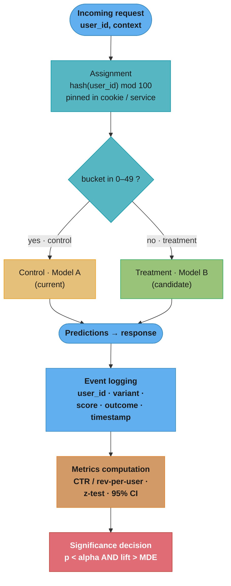
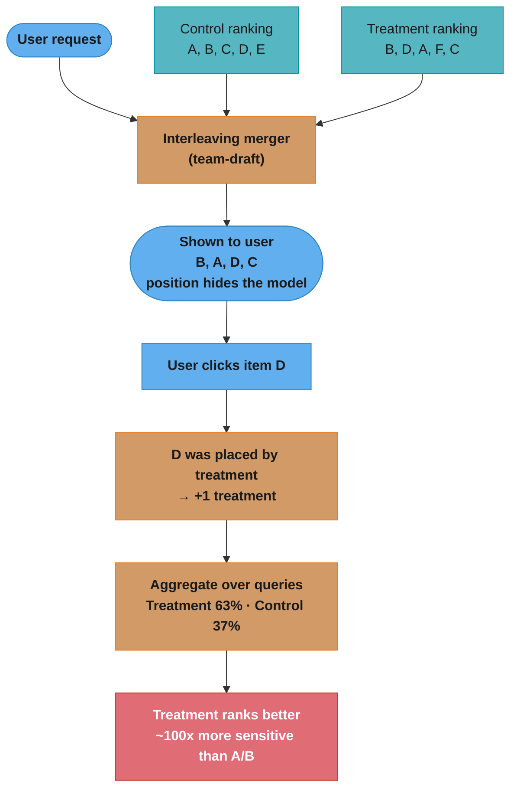
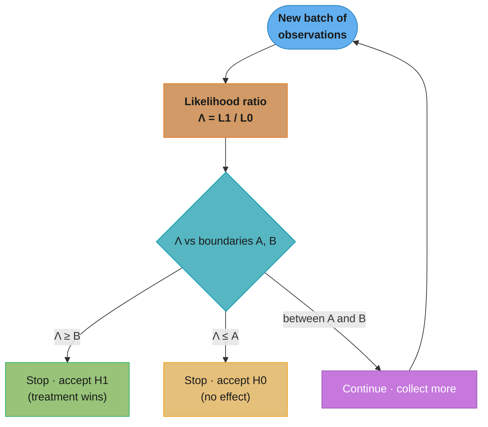
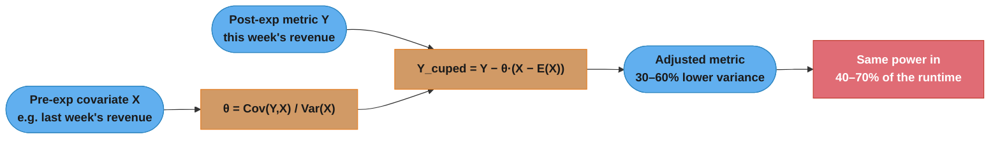

# A/B Testing for ML Models

## 1. Concept Overview

A/B testing (also called controlled experiments or randomized controlled trials) is the gold standard for evaluating ML model changes in production. It measures the causal impact of replacing a control model with a treatment model on a real business metric, by randomly assigning users to two groups and measuring the difference in outcomes.

Unlike offline evaluation (which measures performance on a historical test set), A/B testing measures performance on current user behavior with real consequences — clicks, purchases, engagement, revenue. It is the only reliable way to know whether a model improvement on NDCG@10 actually translates to more revenue.

A/B testing for ML models involves additional considerations beyond standard product A/B tests: the randomization unit must match the model's personalization scope; model deployment must be clean (no model contamination across groups); and the metrics hierarchy must account for both ML metrics and business metrics.

---

## 2. Intuition

One-line analogy: an A/B test is a clinical trial for ML models — randomly assign participants to control (existing model) or treatment (new model), measure outcomes under identical conditions, and use statistics to determine whether any observed difference is real or due to chance.

Mental model: imagine two parallel universes — in universe A, users interact with the old model; in universe B, users interact with the new model. An A/B test creates these universes by random assignment, ensuring the only difference between groups is the model. Any measured difference in business outcomes is therefore caused by the model.

Why it matters: offline metrics (AUC, NDCG) often do not predict online business metrics. A model improvement of 2% in AUC has been observed to produce no measurable CTR change, while a 0.3% AUC improvement has produced a 1.5% revenue increase. The only way to know the true business impact is to run an A/B test.

---

## 3. Core Principles

**Randomization**: users must be randomly and independently assigned to control or treatment. Systematic assignment (e.g., user IDs divisible by 2 to treatment) can introduce bias if user ID correlates with behavior.

**Isolation**: users in the control group must never receive predictions from the treatment model, and vice versa. Model contamination invalidates the experiment.

**Stable unit treatment value assumption (SUTVA)**: one user's treatment assignment must not affect another user's outcomes. This is violated in social networks (if I see treatment recommendations, my friends' feeds change) — a known challenge for recommendation experiments.

**Pre-registration**: define hypotheses, primary metric, sample size, and analysis plan before the experiment starts. Post-hoc analysis (choosing metrics after seeing results) inflates false positive rates.

**Single primary metric**: choose one primary business metric before running the experiment. If you test 10 metrics and declare success on whichever shows p < 0.05, you have a ~40% false positive rate.

**Statistical power**: the experiment must run long enough to detect the minimum effect size you care about with sufficient power (80-90%). Stopping early when you see a significant result dramatically inflates false positive rates.

---

## 4. Types / Architectures / Strategies

### Experiment Types for ML

| Type | Description | Sensitivity | Cost | Use When |
|------|-------------|-------------|------|---------|
| Classic A/B | 50/50 user split, binary treatment | Moderate | Low | Model-level changes, most cases |
| Multi-armed bandit | Adaptive allocation, maximize reward | High | Medium | When exploration cost is high |
| Interleaving | Merge treatment and control lists in single response | Very high | Low | Ranking/recommendation evaluation |
| Holdback | Retain a control group indefinitely, no treatment | Moderate | Medium | Measuring long-term model value |
| Multi-cell | Multiple variants simultaneously (A/B/C/D) | Moderate | Medium | Testing multiple variants at once |
| Shadow testing | Treatment runs but results not shown | N/A | Low | Pre-experiment validation |

### Randomization Units

| Unit | When to Use | Pros | Cons |
|------|-------------|------|------|
| User | Personalized ML models, recommendation | Stable over time | Requires user authentication |
| Session | Anonymous users, session-based models | Simple | Same user may get both experiences |
| Request | Server-side experiments, no user state | Highest statistical power per unit | Risk of within-user inconsistency |
| Device | Mobile-first experiences | User-level consistency on mobile | Different devices = different groups |
| Organization (B2B) | B2B products | Avoids org-level contamination | Very large variance, needs more orgs |

### Statistical Tests for ML A/B Tests

| Metric Type | Test | Assumption | Notes |
|------------|------|-----------|-------|
| Proportions (CTR, CVR) | Two-proportion z-test | Large sample, binary outcome | Standard for click metrics |
| Continuous, normal (revenue per user) | Two-sample t-test | Normality (CLT at n>30) | Revenue often heavy-tailed — use with caution |
| Continuous, non-normal | Mann-Whitney U test | Ordinal data | More robust for heavy-tailed metrics |
| Multiple comparisons | Bonferroni or BH-FDR correction | | Always apply when testing >1 metric |
| Sequential (peeking) | Sequential probability ratio test (SPRT) | | Allows early stopping without inflation |

---

## 5. Architecture Diagrams

### A/B Test Infrastructure for ML



The randomization unit is hashed once and pinned, so a user always hits the same model and cannot leak across variants. Every exposure (not just conversions) is logged, and that single event stream feeds both the ML metric and the significance test.

### Interleaving for Ranking Experiments



Both models' items compete at every position inside one merged list, so position bias cancels out. A single interleaved query yields far more signal than an A/B test of the same query — roughly 100x fewer impressions for the same statistical power.

### Sample Size Determination

```
SAMPLE SIZE CALCULATION INPUTS:
  baseline_rate = 0.05     (CTR 5%)
  mde = 0.005              (detect 0.5% absolute change = 10% relative)
  alpha = 0.05             (significance level, Type I error rate)
  power = 0.80             (1 - beta = probability to detect true effect)

  z_alpha/2 = 1.96  (two-tailed, alpha=0.05)
  z_beta   = 0.84   (power=0.80)

  n = (z_alpha/2 + z_beta)^2 * [p1*(1-p1) + p2*(1-p2)] / (p1-p2)^2
  n = (1.96 + 0.84)^2 * [0.05*0.95 + 0.055*0.945] / (0.005)^2
  n ≈ 31,195 per variant (total 62,390 users)

  At 10,000 unique users/day:
  Required experiment duration = 62,390 / 10,000 = 6.2 days
```

**What the formula is telling you.** "Noise sets the price. To detect an effect half as large, you must buy four times as many users."

Everything in the expression is one of two things: how much the metric bounces around on its own (the variance term on top) or how big the effect you are hunting is (the squared MDE underneath). The `z` constants are a fixed toll you pay once for your chosen alpha and power.

| Symbol | What it is |
|--------|------------|
| `n` | Users needed **per variant**. Double it for the experiment total |
| `p1`, `p2` | Control and treatment rates, with `p2 = p1 + mde` |
| `delta = p2 - p1` | The MDE in **absolute** terms. `0.005` is half a percentage point, not 0.5% relative |
| `p*(1-p)` | Variance of a coin flip at rate `p`. Largest at `p = 0.5`, small for rare events |
| `z_alpha/2 = 1.96` | How deep into the tail a result must sit to be called significant at alpha = 0.05 |
| `z_beta = 0.84` | The extra margin bought so a real effect is actually caught 80% of the time |
| `(z_alpha/2 + z_beta)^2` | The fixed toll for that alpha/power pair: `2.80^2 = 7.85` |

**Why the "16 sigma^2 / delta^2" shortcut works.** Replace both variance terms with a single `sigma^2` and the formula collapses to `n = 2 * 7.85 * sigma^2 / delta^2`, and `2 * 7.85 = 15.70`, which rounds to 16. That is the version worth memorizing: the whole toll for "alpha = 0.05, power = 80%, two variants" is the single number 16.

**Walk one example.** The under-powering trap — a 1% *relative* lift on a 5% baseline CTR:

```
  baseline p1      = 0.05                     (5% CTR)
  1% RELATIVE lift = 0.05 x 1.01 = 0.0505     so p2 = 0.0505
  delta            = 0.0005                   <- one twentieth of a percentage point

  numerator   = 7.848880 x (0.05 x 0.95 + 0.0505 x 0.9495)
              = 7.848880 x (0.0475000 + 0.0479498)
              = 7.848880 x 0.0954498 = 0.749174
  denominator = 0.0005^2 = 0.00000025

  n     = 0.749174 / 0.00000025 = 2,996,695 per variant
  total = 5,993,390 users

  At the 10,000 unique users/day above:
      5,993,390 / 10,000 = 599 days = 1.6 YEARS
```

Now double the MDE and watch the cost collapse:

```
  2% relative lift -> p2 = 0.051, delta = 0.001

  n = 7.848880 x (0.05 x 0.95 + 0.051 x 0.949) / 0.001^2
    = 7.848880 x 0.0958990 / 0.000001
    = 752,700 per variant       (total 1,505,400)

  days at 10,000/day :  delta = 0.0005  ->  599 days
                        delta = 0.0010  ->  151 days

  Halving the MDE multiplied n by 3.98x -- almost exactly 4x, because delta is squared.
```

**Why teams consistently under-power.** The MDE is the only input a team can pick freely, so it gets picked out of ambition ("surely we can move CTR 1%") rather than out of the traffic actually available. But `delta` sits squared in the denominator, so ambition is the most expensive knob on the panel: the difference between "we want to see 1%" and "we want to see 2%" is the difference between a 1.6-year experiment and a 5-month one. Run the calculation *first*, then set the MDE to whatever the traffic and a two-week window can actually support — and if that MDE is larger than the lift you expect, the honest conclusion is that this experiment cannot be run, not that it should be run and squinted at.

### Sequential Testing (SPRT): Peek Without Penalty



The boundaries A and B are pre-computed from the target alpha and power, so the test can be checked after every batch and still hold its false-positive rate — the fix for the "peeked on day 5, stopped at p = 0.04" pitfall.

### CUPED: Variance Reduction Flow



CUPED subtracts the part of each user's metric that a pre-experiment covariate already explains, shrinking variance without shifting the expected value. A 0.7 correlation between X and Y cuts variance ~49%, roughly halving the required sample size.

---

## 6. How It Works — Detailed Mechanics

### Sample Size Calculation

```python
from __future__ import annotations

import math
import numpy as np
from scipy import stats
from dataclasses import dataclass


@dataclass
class SampleSizeResult:
    n_per_variant: int
    total_n: int
    required_days: float
    power_achieved: float
    mde_achievable_with_n: float


def compute_sample_size_proportion(
    baseline_rate: float,       # e.g. 0.05 for 5% CTR
    mde_absolute: float,        # minimum detectable effect (absolute), e.g. 0.005
    alpha: float = 0.05,        # significance level (Type I error rate)
    power: float = 0.80,        # 1 - Type II error rate
    two_tailed: bool = True,
    daily_users: int = 10_000,  # unique randomization units per day
) -> SampleSizeResult:
    """
    Compute required sample size for a proportion-based A/B test (e.g., CTR).

    Two-proportion z-test formula:
    n = (z_alpha + z_beta)^2 * (p1*(1-p1) + p2*(1-p2)) / delta^2

    Args:
        baseline_rate: control group's expected proportion
        mde_absolute: smallest effect worth detecting (absolute change)
        alpha: false positive rate (Type I error)
        power: probability of detecting a true effect (1 - Type II error)
        two_tailed: whether to use a two-tailed test
        daily_users: users per day for estimating experiment duration

    Returns:
        SampleSizeResult with n_per_variant and days required
    """
    treatment_rate = baseline_rate + mde_absolute

    z_alpha = stats.norm.ppf(1 - alpha / (2 if two_tailed else 1))
    z_beta = stats.norm.ppf(power)

    p1, p2 = baseline_rate, treatment_rate
    n_per_variant = math.ceil(
        (z_alpha + z_beta) ** 2
        * (p1 * (1 - p1) + p2 * (1 - p2))
        / (p2 - p1) ** 2
    )

    total_n = n_per_variant * 2
    required_days = total_n / daily_users

    # Verify achieved power
    achieved_power = _compute_achieved_power(p1, p2, n_per_variant, alpha, two_tailed)

    # What MDE is achievable with a fixed n?
    mde_achievable = _compute_mde(p1, n_per_variant, alpha, power, two_tailed)

    return SampleSizeResult(
        n_per_variant=n_per_variant,
        total_n=total_n,
        required_days=required_days,
        power_achieved=achieved_power,
        mde_achievable_with_n=mde_achievable,
    )


def _compute_achieved_power(
    p1: float, p2: float, n: int, alpha: float, two_tailed: bool
) -> float:
    se = math.sqrt(p1 * (1 - p1) / n + p2 * (1 - p2) / n)
    z_alpha = stats.norm.ppf(1 - alpha / (2 if two_tailed else 1))
    z = (p2 - p1) / se - z_alpha
    return float(stats.norm.cdf(z))


def _compute_mde(
    p1: float, n: int, alpha: float, power: float, two_tailed: bool
) -> float:
    z_alpha = stats.norm.ppf(1 - alpha / (2 if two_tailed else 1))
    z_beta = stats.norm.ppf(power)
    # Approximate: use p1 for both variances
    return (z_alpha + z_beta) * math.sqrt(2 * p1 * (1 - p1) / n)


def compute_sample_size_continuous(
    mean_control: float,
    std_control: float,
    mde_absolute: float,
    alpha: float = 0.05,
    power: float = 0.80,
    daily_users: int = 10_000,
) -> SampleSizeResult:
    """
    Compute sample size for continuous metrics (revenue per user, watch time).
    Uses two-sample t-test formula.

    Note: revenue is often high-variance and heavy-tailed.
    n may be 10x larger than for CTR.
    Use CUPED or variance reduction to reduce n.
    """
    z_alpha = stats.norm.ppf(1 - alpha / 2)
    z_beta = stats.norm.ppf(power)

    # t-test: n = 2 * sigma^2 * (z_alpha + z_beta)^2 / delta^2
    n_per_variant = math.ceil(
        2 * std_control ** 2 * (z_alpha + z_beta) ** 2 / mde_absolute ** 2
    )
    total_n = n_per_variant * 2
    required_days = total_n / daily_users

    # MDE achievable with this n
    mde_achievable = (z_alpha + z_beta) * math.sqrt(2 * std_control ** 2 / n_per_variant)

    return SampleSizeResult(
        n_per_variant=n_per_variant,
        total_n=total_n,
        required_days=required_days,
        power_achieved=power,
        mde_achievable_with_n=mde_achievable,
    )


# Concrete examples:
if __name__ == "__main__":
    # CTR experiment: 5% baseline, detect 0.5% absolute change
    result_ctr = compute_sample_size_proportion(
        baseline_rate=0.05,
        mde_absolute=0.005,
        alpha=0.05,
        power=0.80,
        daily_users=50_000,
    )
    print(f"CTR test: {result_ctr.n_per_variant:,} per variant, "
          f"{result_ctr.required_days:.1f} days")
    # Output: ~31,195 per variant, 1.2 days at 50K users/day

    # Revenue experiment: $25 mean, $15 std, detect $0.50 change
    # Revenue has much higher variance -> needs far more samples
    result_rev = compute_sample_size_continuous(
        mean_control=25.0,
        std_control=15.0,
        mde_absolute=0.50,
        alpha=0.05,
        power=0.80,
        daily_users=50_000,
    )
    print(f"Revenue test: {result_rev.n_per_variant:,} per variant, "
          f"{result_rev.required_days:.1f} days")
    # Output: ~3,457,920 per variant, 138 days — revenue tests are expensive!
```

### Significance Testing

```python
import numpy as np
import pandas as pd
from scipy import stats
from dataclasses import dataclass
from typing import Optional


@dataclass
class ABTestResult:
    metric_name: str
    control_mean: float
    treatment_mean: float
    absolute_lift: float
    relative_lift_pct: float
    p_value: float
    confidence_interval_95: tuple[float, float]
    statistically_significant: bool
    practically_significant: bool   # lift > MDE
    sample_sizes: tuple[int, int]   # (control_n, treatment_n)


def analyze_ab_test_proportion(
    control_conversions: int,
    control_users: int,
    treatment_conversions: int,
    treatment_users: int,
    metric_name: str = "CTR",
    alpha: float = 0.05,
    mde: float = 0.005,
) -> ABTestResult:
    """
    Analyze a binary metric A/B test (CTR, conversion rate).
    Uses two-proportion z-test.
    """
    p_control = control_conversions / control_users
    p_treatment = treatment_conversions / treatment_users
    absolute_lift = p_treatment - p_control
    relative_lift = absolute_lift / p_control if p_control > 0 else 0.0

    # Two-proportion z-test
    p_pooled = (control_conversions + treatment_conversions) / (control_users + treatment_users)
    se = math.sqrt(p_pooled * (1 - p_pooled) * (1 / control_users + 1 / treatment_users))

    if se < 1e-10:
        return _empty_result(metric_name, p_control, p_treatment, alpha, mde,
                             control_users, treatment_users)

    z_stat = absolute_lift / se
    p_value = 2 * (1 - stats.norm.cdf(abs(z_stat)))  # two-tailed

    # 95% CI for the lift
    z_95 = 1.96
    se_diff = math.sqrt(
        p_control * (1 - p_control) / control_users
        + p_treatment * (1 - p_treatment) / treatment_users
    )
    ci_lower = absolute_lift - z_95 * se_diff
    ci_upper = absolute_lift + z_95 * se_diff

    return ABTestResult(
        metric_name=metric_name,
        control_mean=p_control,
        treatment_mean=p_treatment,
        absolute_lift=absolute_lift,
        relative_lift_pct=relative_lift * 100,
        p_value=p_value,
        confidence_interval_95=(ci_lower, ci_upper),
        statistically_significant=p_value < alpha,
        practically_significant=abs(absolute_lift) >= mde,
        sample_sizes=(control_users, treatment_users),
    )


def analyze_ab_test_continuous(
    control_values: np.ndarray,
    treatment_values: np.ndarray,
    metric_name: str = "revenue_per_user",
    alpha: float = 0.05,
    mde: float = 0.50,
    use_mann_whitney: bool = False,  # for non-normal distributions
) -> ABTestResult:
    """
    Analyze a continuous metric A/B test (revenue, watch time).
    Default: two-sample t-test (robust for n > 30 via CLT).
    Set use_mann_whitney=True for heavy-tailed distributions.
    """
    control_mean = np.mean(control_values)
    treatment_mean = np.mean(treatment_values)
    absolute_lift = treatment_mean - control_mean
    relative_lift = absolute_lift / control_mean if control_mean != 0 else 0.0

    if use_mann_whitney:
        stat, p_value = stats.mannwhitneyu(
            treatment_values, control_values, alternative="two-sided"
        )
        # Convert Mann-Whitney to common language effect size for CI (approximate)
        se = math.sqrt(
            np.var(control_values) / len(control_values)
            + np.var(treatment_values) / len(treatment_values)
        )
    else:
        stat, p_value = stats.ttest_ind(treatment_values, control_values)
        se = math.sqrt(
            np.var(control_values, ddof=1) / len(control_values)
            + np.var(treatment_values, ddof=1) / len(treatment_values)
        )

    z_95 = 1.96
    ci_lower = absolute_lift - z_95 * se
    ci_upper = absolute_lift + z_95 * se

    return ABTestResult(
        metric_name=metric_name,
        control_mean=float(control_mean),
        treatment_mean=float(treatment_mean),
        absolute_lift=float(absolute_lift),
        relative_lift_pct=float(relative_lift * 100),
        p_value=float(p_value),
        confidence_interval_95=(float(ci_lower), float(ci_upper)),
        statistically_significant=p_value < alpha,
        practically_significant=abs(absolute_lift) >= mde,
        sample_sizes=(len(control_values), len(treatment_values)),
    )


def bonferroni_correction(p_values: list[float], alpha: float = 0.05) -> list[bool]:
    """Apply Bonferroni correction for multiple comparisons."""
    corrected_alpha = alpha / len(p_values)
    return [p < corrected_alpha for p in p_values]


def benjamini_hochberg_correction(
    p_values: list[float], alpha: float = 0.05
) -> list[bool]:
    """
    Apply Benjamini-Hochberg FDR correction.
    Less conservative than Bonferroni; controls false discovery rate.
    """
    n = len(p_values)
    sorted_indices = np.argsort(p_values)
    sorted_p = np.array(p_values)[sorted_indices]

    bh_threshold = (np.arange(1, n + 1) / n) * alpha
    below_threshold = sorted_p <= bh_threshold

    # All hypotheses up to the last significant one are rejected
    if not any(below_threshold):
        return [False] * n

    last_sig = np.max(np.where(below_threshold)[0])
    reject = np.zeros(n, dtype=bool)
    reject[sorted_indices[: last_sig + 1]] = True
    return list(reject)


def _empty_result(metric_name, control_mean, treatment_mean, alpha, mde, n_c, n_t):
    return ABTestResult(metric_name, control_mean, treatment_mean, 0.0, 0.0,
                        1.0, (0.0, 0.0), False, False, (n_c, n_t))
```

**Read it like this.** "How many standard errors apart are the two rates? One is a shrug, two is a maybe, three is a finding."

The z-statistic is a unit conversion, nothing more: it restates the raw lift in units of "how much this metric wobbles by chance at this sample size." The p-value then just reads that off a normal table, and the confidence interval is the same standard error pointed the other way — a range instead of a verdict.

| Symbol | What it is |
|--------|------------|
| `p_pooled` | Both groups' conversions over both groups' users, as if the treatment did nothing |
| `se` | Standard error under the null. The wobble you would see with no real effect |
| `z_stat = lift / se` | The lift measured in standard errors. The entire test in one number |
| `stats.norm.cdf(z)` | Share of the normal curve left of `z`. `1 - cdf` is the tail beyond it |
| `2 * (1 - cdf(abs(z)))` | Two-tailed p-value: chance of a gap this big **in either direction**, by luck |
| `se_diff` | Standard error using each group's own rate. Used for the interval, not the test |
| `lift +/- 1.96 * se_diff` | 95% CI. Excludes zero exactly when `p < 0.05` |

**Walk one example.** Run the experiment sized two blocks above (n = 752,700 per variant) and observe exactly the effect it was designed to detect:

```
  control   :  37,635 clicks / 752,700 users = 0.05000
  treatment :  38,388 clicks / 752,700 users = 0.05100
  lift      =  0.05100 - 0.05000 = 0.00100

  p_pooled  = (37,635 + 38,388) / (752,700 + 752,700) = 0.050500
  se        = sqrt(0.0505 x 0.9495 x (1/752,700 + 1/752,700)) = 0.00035694

  z_stat    = 0.00100 / 0.00035694 = 2.80
  p_value   = 2 x (1 - cdf(2.80)) = 0.0051      <- significant at alpha = 0.05

  se_diff   = sqrt(0.05 x 0.95/752,700 + 0.051 x 0.949/752,700) = 0.00035694
  95% CI    = 0.00100 +/- 1.96 x 0.00035694
            = [0.00030, 0.00170]  =  [+0.030 pp, +0.170 pp]
```

**That `z = 2.80` is not a coincidence.** It is `1.96 + 0.84` — exactly `z_alpha/2 + z_beta`, the constant from the sample-size formula. Sizing `n` for an MDE means, by construction, placing the designed effect right at the significance boundary plus the power margin. Two consequences follow, and both are routinely missed. First, an experiment that lands *exactly* on its MDE is barely significant, not comfortably so — `p = 0.0051`, a hair under 0.05. Second, look at the confidence interval: its lower edge, `+0.030 pp`, is within a whisker of zero. Rerun this same experiment with the same true effect and roughly one time in five it will come back non-significant. That is not a bug; that is precisely what "80% power" was purchased. Power is the probability of *success*, and 80% means a 1-in-5 failure rate on effects that are genuinely real.

### CUPED: Variance Reduction for Faster Experiments

```python
import numpy as np


def apply_cuped(
    treatment_metric: np.ndarray,
    control_metric: np.ndarray,
    treatment_covariate: np.ndarray,   # pre-experiment metric for treatment users
    control_covariate: np.ndarray,     # pre-experiment metric for control users
) -> tuple[np.ndarray, np.ndarray]:
    """
    CUPED (Controlled-experiment Using Pre-Experiment Data) variance reduction.

    Adjusts metric values using a pre-experiment covariate (e.g., last week's revenue)
    to reduce variance, enabling smaller sample sizes.

    Variance reduction formula:
      Y_cuped = Y - theta * (X - E[X])
    where theta = Cov(Y, X) / Var(X)

    Typical variance reduction: 30-60%, meaning experiment runs in 40-70% of the time.

    Args:
        treatment_metric: post-experiment metric values for treatment group
        control_metric: post-experiment metric values for control group
        treatment_covariate: pre-experiment covariate for treatment users
        control_covariate: pre-experiment covariate for control users

    Returns:
        (cuped_treatment, cuped_control) adjusted metric values
    """
    all_metric = np.concatenate([treatment_metric, control_metric])
    all_covariate = np.concatenate([treatment_covariate, control_covariate])

    # Compute theta from pooled data
    covariance = np.cov(all_metric, all_covariate)[0, 1]
    variance = np.var(all_covariate)
    theta = covariance / variance if variance > 0 else 0.0

    mean_covariate = np.mean(all_covariate)

    cuped_treatment = treatment_metric - theta * (treatment_covariate - mean_covariate)
    cuped_control = control_metric - theta * (control_covariate - mean_covariate)

    # Report variance reduction achieved
    original_var = np.var(all_metric)
    cuped_var = np.var(np.concatenate([cuped_treatment, cuped_control]))
    reduction = 1.0 - cuped_var / original_var
    print(f"CUPED variance reduction: {reduction:.1%}")

    return cuped_treatment, cuped_control
```

**Put simply.** "Subtract off the part of each user's metric you could already have predicted before the experiment started; whatever is left over is quieter, and a quieter metric needs fewer users."

The subtraction is safe because it is centered: `X - E[X]` averages to zero, so `Y_cuped` has the same expected value as `Y`. You are removing noise, not shifting the answer — which is why CUPED is free power rather than a thumb on the scale.

| Symbol | What it is |
|--------|------------|
| `Y` | The experiment metric, e.g. this week's revenue per user |
| `X` | A **pre-experiment** covariate, e.g. last week's revenue for the same user |
| `E[X]` | Mean of the covariate across everyone. Subtracting it re-centers the adjustment on zero |
| `theta = Cov(Y,X)/Var(X)` | The regression slope of `Y` on `X`. How much of `Y` that `X` explains |
| `Y - theta*(X - E[X])` | `Y` with the predictable part removed. Same mean, smaller spread |
| `rho` | Correlation between `Y` and `X`. The single number that decides the payoff |

**Walk one example.** Variance surviving CUPED is `1 - rho^2`, and required `n` scales with variance:

```
  rho = 0.5  ->  variance -25%  ->  n x 0.75  ->  a 30-day test becomes 23 days
  rho = 0.7  ->  variance -49%  ->  n x 0.51  ->  a 30-day test becomes 16 days
  rho = 0.9  ->  variance -81%  ->  n x 0.19  ->  a 30-day test becomes  6 days

  Applied to the revenue test above (3,457,920 per variant raw, rho = 0.7):

      3,457,920 x 0.51 = 1,763,539 per variant
      138 days  x 0.51 = 70 days
```

Note the shape of that ladder: the payoff is quadratic in `rho`, so a mediocre covariate is nearly worthless while a strong one is transformative. At `rho = 0.3` you save 9% of the sample — not worth the pipeline. This is why the covariate is almost always *the same metric from the prior period*: nothing else correlates with a user's revenue like that user's own past revenue.

---

## 7. Real-World Examples

**Booking.com** runs thousands of A/B experiments simultaneously and has published extensively on their experimentation platform. They use interleaving for ranking experiments (booking.com's search results), Bonferroni correction across their primary metrics, and have a dedicated experimentation team that reviews statistical validity. They report that the majority of their experiments show no statistically significant effect, which is the correct outcome — not every change is an improvement.

**LinkedIn** uses CUPED extensively to reduce experiment duration. For revenue metrics (high variance), CUPED reduces required sample size by approximately 50%, halving experiment duration. They apply it by using the prior week's revenue as the covariate.

**Netflix** uses a multi-armed bandit approach for allocating users to new content recommendation algorithms in early testing phases, then transitions to a fixed A/B test once promising signals are identified. They also use synthetic control methods for experiments where randomization at the user level is difficult (e.g., when the recommendation changes the global content popularity distribution).

**Google** pioneered interleaving for search ranking experiments. A single interleaved query provides more signal than a standard A/B test of the same query, because position effects are controlled — both models' results are shown to the same user. Google requires approximately 1/100th the traffic volume compared to standard A/B tests for the same statistical power.

---

## 8. Tradeoffs

### A/B Test vs Multi-Armed Bandit

| Dimension | A/B Test | Multi-Armed Bandit |
|-----------|---------|-------------------|
| Goal | Causal inference (is B better?) | Optimization (maximize reward) |
| Traffic efficiency | Fixed 50/50 allocation | Adaptive — more traffic to winning arm |
| Statistical rigor | High (fixed sample plan) | Lower (harder to control Type I error) |
| Regret | High (50% of traffic to inferior arm) | Low |
| Implementation complexity | Low | High |
| Use when | Evaluating model quality | Optimizing hyperparameters, content, prices |

### A/B Test vs Interleaving for Ranking

| Dimension | A/B Test | Interleaving |
|-----------|---------|-------------|
| Statistical power | Baseline | 100x more sensitive |
| Required traffic | 100x more | Baseline |
| Measures | Business metric impact | Model relative preference |
| Implementation | Simple | Complex (must handle deduplication) |
| Time to result | Days to weeks | Hours |
| Use for | Final business impact validation | Early-stage model comparison |

### Multiple Comparison Corrections

| Method | Controls | Conservatism | Use When |
|--------|---------|-------------|---------|
| Bonferroni | Family-wise error rate | Very conservative | Few hypotheses, critical decisions |
| Benjamini-Hochberg | False discovery rate | Moderate | Many hypotheses, exploratory |
| No correction | Nothing | None (inflated Type I error) | Never appropriate for primary metrics |

**Stated plainly.** "Every extra metric you check is another ticket in a lottery you do not want to win — and alpha = 0.05 is the per-ticket odds, not the odds for the whole handful."

| Symbol | What it is |
|--------|------------|
| `k` | Number of hypotheses tested together — the "family" |
| `alpha` | Per-test false positive rate, conventionally 0.05 |
| `(1 - alpha)^k` | Chance **every** test correctly stays quiet when nothing is real |
| `1 - (1 - alpha)^k` | Family-wise error rate: chance of at least one false positive |
| `k * alpha` | Expected **count** of false positives. Passes 1.0 at k = 20 |
| `alpha / k` | Bonferroni per-test threshold. Shrinks the tickets to keep the total at 5% |
| `(i / k) * alpha` | Benjamini-Hochberg threshold for the i-th smallest p-value |

**Walk one example.** All nulls true — no metric is actually moving — at alpha = 0.05:

```
     k      P(at least one false positive)      expected false positives
     1        1 - 0.95^1  = 0.050                       0.05
     3        1 - 0.95^3  = 0.143                       0.15
    10        1 - 0.95^10 = 0.401                       0.50
    20        1 - 0.95^20 = 0.642                       1.00

  At k = 20, you expect exactly one "significant" metric from a change that
  does nothing at all -- and you will find it, because you looked 20 times.

  Bonferroni pulls this back by shrinking each ticket:
    k = 10  ->  test each metric at 0.05 / 10 = 0.005
            ->  family-wise rate = 1 - 0.995^10 = 0.049      <- back to ~5%
```

**Why Bonferroni feels so punishing, and what BH trades away.** Holding the family-wise rate at 5% across 10 metrics means a metric now needs `p < 0.005` — roughly `z > 2.81` instead of `z > 1.96` — and that extra margin costs sample size in the same squared way the MDE does. Benjamini-Hochberg refuses that trade: instead of guaranteeing zero false positives, it caps the *share* of your declared winners that are false. If BH hands you 10 significant metrics at FDR = 0.05, roughly one is expected to be noise. That is the right bargain for exploratory secondary metrics and the wrong one for a ship/no-ship decision — which is exactly why the primary metric is pre-registered as a family of one, where no correction is needed at all.

---

## 9. When to Use / When NOT to Use

### Always run an A/B test when:
- The model change affects user-facing behavior (ranking, recommendations, content shown)
- The business metric change is uncertain — offline metrics do not guarantee online improvement
- The experiment can run to the pre-specified sample size without external pressure to stop early
- The change is irreversible (e.g., personalization changes that affect user expectations)

### Do NOT run an A/B test when:
- The change is purely internal (model compression for latency, not quality change)
- The effect size is too large to need a test (e.g., replacing a completely broken model)
- Running a fair experiment is impossible (e.g., all users must receive the new behavior simultaneously — infrastructure change)
- The experiment cannot reach statistical power in a reasonable time (< 1,000 users/day and MDE of 1% CTR — needs 500K users)

### Use holdback (permanent control) instead when:
- You want to measure the long-term value of a feature (not just immediate impact)
- The experiment is a feature enablement, not a model change (gradual rollout scenario)

---

## 10. Common Pitfalls

**Peeking at results and stopping early**: a team runs an A/B test and checks results daily. On day 5 (of a planned 30-day test), they see p = 0.04 and declare the test successful. The true false positive rate at this point is approximately 29%, not 5%. The model is deployed and later shown to have no real effect. Fix: pre-specify the sample size and duration before the experiment; use sequential testing (SPRT) if early stopping is required; never make decisions on interim results unless using a sequentially valid test.

**SRM (Sample Ratio Mismatch)**: the experiment is set up as a 50/50 split, but the actual observed ratio is 52% control / 48% treatment. This indicates a bug in the randomization or logging pipeline, not a real treatment effect. Metrics computed on imbalanced groups are biased. Fix: always check SRM before analyzing any metric — a chi-square test on the observed group sizes should produce p > 0.01; if not, debug the randomization before looking at any metric.

**Multiple comparison inflation**: a team tests 20 metrics and finds p < 0.05 for 3 of them. They declare success. With 20 independent tests at alpha = 0.05, the expected number of false positives is 1.0 (not 0). At least one of the 3 significant results is likely a false positive. Fix: pre-specify one primary metric; apply Bonferroni or BH correction for secondary metrics; never decide based on the best-performing metric from a set of 20.

**SUTVA violation in social networks**: a recommendation model is tested on 50% of users. Treatment users receive recommendations that increase their engagement. They share recommended content with control users (who do not receive the new recommendations). Control users' engagement also increases due to social spillover. The experiment underestimates the true treatment effect (because control is contaminated) or overestimates it (network amplification). Fix: use cluster-based randomization (assign all users in a social cluster to the same variant); measure network effects explicitly; use isolated markets or regions for clean experiments.

**Testing on insufficient traffic segments**: a model for enterprise users is A/B tested on the 5% of users who are enterprise accounts. Enterprise users have highly variable revenue (std = 5x mean). With only 5% of 100K users (5,000 enterprise users), the experiment needs 690,000 per variant for revenue metric — it can never reach power. Fix: compute sample size before designing the experiment; if insufficient traffic exists, use a proxy metric with lower variance or consider a qualitative evaluation.

---

## 11. Technologies & Tools

| Category | Tool | Notes |
|----------|------|-------|
| Experimentation Platform | Optimizely | Managed; client-side and server-side |
| Experimentation Platform | LaunchDarkly | Feature flags + experiments |
| Experimentation Platform | Statsig | ML-team-friendly; auto stats, sequential testing |
| Experimentation Platform | Eppo | Modern; BH correction; CUPED built-in |
| In-House Platform | Most large tech companies | Google Experimentation, Meta ExperimentNow, Airbnb ERF |
| Statistical Libraries | scipy.stats | Gold standard for statistical tests |
| Statistical Libraries | statsmodels | Power calculations, regression, ANOVA |
| Statistical Libraries | PyMC | Bayesian A/B testing |
| Visualization | Plotly, Matplotlib | CI plots, funnel charts |
| Data Logging | Kafka + Spark | High-throughput event logging |
| Metrics Computation | Spark SQL, BigQuery | Aggregating experiment events |

---

## 12. Interview Questions with Answers

**Q: How do you determine how long to run an A/B test?**
Pre-calculate the required sample size before starting the experiment using the two-proportion z-test (for proportions) or t-test formula (for continuous). Inputs: baseline rate, minimum detectable effect (MDE), significance level (alpha = 0.05), and desired power (80%). Example: CTR = 5%, MDE = 0.5% absolute, alpha = 0.05, power = 80% → ~156K users per variant. If daily unique users = 50K per variant, run for 156K/50K = 3.2 days minimum. Add a buffer for novelty effects (at least 1 full week to account for day-of-week patterns). Never stop early unless using a sequentially valid test.

**Q: What is a sequential test (SPRT), and how does it let you stop an A/B test early without inflating the false positive rate?**
A sequential probability ratio test evaluates the accumulated evidence after every batch and stops only when the likelihood ratio crosses a pre-set boundary. Unlike a fixed-horizon test — where peeking and stopping at the first p < 0.05 inflates the Type I error to 20-30% — the SPRT boundaries are constructed so that continuous monitoring keeps the overall alpha at target. The tradeoff is a slightly larger maximum sample size in exchange for the ability to stop early when the effect is strong. Use always-valid inference (SPRT, mSPRT, or a Bayesian sequential test) whenever the team will look at results before the planned end.

**Q: What is the difference between statistical significance and practical significance?**
Statistical significance (p < alpha) means the observed effect is unlikely to have occurred by chance — the probability of observing this or a larger effect under the null hypothesis is less than alpha. Practical significance means the effect size is large enough to matter for the business. A CTR improvement of 0.01% may be statistically significant (p = 0.001) with 10 million users, but practically negligible — the engineering cost of deploying the model exceeds the revenue benefit. Always report both the p-value and the effect size with confidence interval. Make deployment decisions based on practical significance, not just statistical significance.

**Q: What are guardrail metrics, and why do you track them in every experiment?**
Guardrail metrics are safety metrics — latency, error rate, crash rate, unsubscribe rate — that must not regress even when the primary metric improves. A model that lifts CTR but adds 40ms of P99 latency or increases opt-outs is usually a net loss, and the primary metric alone would hide that harm. Monitor guardrails continuously throughout the experiment, not just at the end, so a harmful test can be halted early. Define them up front with explicit regression thresholds and alert on them for the whole run.

**Q: What is sample ratio mismatch (SRM) and how do you detect it?**
SRM occurs when the actual allocation of users across experiment variants differs from the planned allocation. For a 50/50 experiment, if 51.8% of observations are in the control group, the randomization or logging is broken. SRM invalidates all metric analysis because the groups may differ on user characteristics, not just the treatment. Detection: run a chi-square goodness-of-fit test on observed group sizes vs expected. If p < 0.01 (using a conservative threshold), flag the experiment for investigation before computing any metrics. Common causes: client-side experiment logic with browser bugs, bot traffic assigned to one group, logging pipeline failures.

**Q: How do you measure the impact of a recommendation model change on revenue, given that revenue is high-variance?**
Revenue per user is typically right-skewed (most users spend $0, a few spend $100+), making the t-test require large sample sizes. Strategies: (1) CUPED — use each user's revenue from the week before the experiment as a covariate; this can reduce variance by 30-60%, halving the required experiment duration; (2) winsorization — cap the top 1% of revenue values at the 99th percentile to reduce variance from outliers; (3) use a proxy metric with lower variance (add-to-cart rate, or order rate) as the primary metric and measure revenue as a secondary metric; (4) extend the experiment duration to reach the required sample size. For a platform with $25 mean revenue, $15 std, and MDE of $0.50, raw sample size is ~3.5M per variant; CUPED with 50% variance reduction reduces to ~1.75M.

**Q: What is interleaving and when should you use it instead of a classic A/B test?**
Interleaving merges the ranked lists from two models into a single ranked list shown to the user. User clicks on interleaved items are attributed to the model that placed that item. Because both models compete for clicks in the same session, position effects are controlled (both models have items at every position), making interleaving 100x more sensitive than standard A/B testing for ranking tasks. Use interleaving for: early-stage ranking model comparisons where the goal is "which model ranks better?"; situations where you need results in hours instead of weeks. Use standard A/B test for: final validation of business metric impact (revenue, engagement) where the absolute effect size matters; situations where interleaving introduces product inconsistency.

**Q: How do you handle multiple testing in a product A/B test that measures 10 metrics?**
The standard approach: pre-register exactly one primary metric before the experiment; this metric alone is used for the go/no-go decision with alpha = 0.05, requiring no correction. Apply Bonferroni or BH correction to all secondary and guardrail metrics (e.g., alpha/10 = 0.005 per metric for Bonferroni). Report the corrected p-values transparently. Never switch the primary metric after seeing results. If you pre-specified three primary metrics (e.g., for a multi-objective experiment), apply Bonferroni correction across all three (alpha = 0.05/3 = 0.0167).

**Q: What is CUPED and how does it reduce experiment duration?**
CUPED (Controlled-experiment Using Pre-Experiment Data) is a variance reduction technique that adjusts the experiment metric using a pre-experiment covariate. The adjusted metric is: Y_cuped = Y - theta * (X - E[X]), where X is a pre-experiment metric (e.g., last week's revenue) highly correlated with Y (this week's revenue), and theta = Cov(Y, X) / Var(X). Because Y_cuped has lower variance than Y, the same sample size achieves more statistical power, or equivalently, the same power requires fewer samples. A correlation of 0.7 between X and Y reduces variance by 49%, cutting required sample size by ~50%. CUPED does not change the expected value of the metric — it only reduces noise.

**Q: How do you design an A/B test for a model that personalizes results per user?**
The randomization unit should be the user (not the request or session) to ensure a user always receives the same model experience. Implementation: hash the user_id with a salt specific to the experiment to get a uniform value in [0, 1]; assign to control if value < 0.5, treatment otherwise. Persist the assignment in a database or cookie so the same user always sees the same model. Track the assignment at the first exposure, not at conversion — this prevents survivorship bias (users who do not click are still in the experiment). Log all exposures (not just conversions) for correct metric computation.

**Q: What is the novelty effect in A/B testing and how do you account for it?**
The novelty effect is a short-term increase in engagement with a new UI or model caused by users' curiosity about the change, not because of lasting value. A model with a better UI may show a significant CTR lift in the first 3 days that fades to zero after a week. To detect and account for it: (1) run the experiment for at least 1-2 weeks; (2) plot the daily effect size over the experiment period — a decaying effect suggests novelty; (3) compute separate estimates for the first 3 days vs the remaining days; (4) for high-stakes decisions, run a "holdback" analysis — maintain a 10% holdback group to measure the long-term effect after novelty fades. Declare success only if the effect is sustained, not just significant in the first few days.

**Q: How many users do you need to detect a 0.5% absolute change in CTR from a 5% baseline?**
Using the two-proportion z-test formula with alpha = 0.05, power = 0.80: n = (1.96 + 0.84)^2 * (0.05*0.95 + 0.055*0.945) / (0.005)^2 ≈ 31,195 per variant, total 62,390 users. At 50,000 daily users (total across both variants), this requires 62,390 / 50,000 ≈ 1.2 days. This assumes independence between observations. If the randomization unit is sessions (a user has multiple sessions), the effective sample size is smaller due to intra-user correlation — apply the design effect correction: n_effective = n_sessions / (1 + (m-1) * rho), where m = average sessions per user and rho = intra-user correlation.

**Q: What is the difference between Bonferroni and Benjamini-Hochberg correction?**
Bonferroni correction controls the Family-Wise Error Rate (FWER) — the probability of any false positives. Each test is evaluated at alpha/k where k is the number of tests. It is very conservative (low Type I error) but has low power — it is difficult to detect true effects when testing many metrics. Benjamini-Hochberg (BH) controls the False Discovery Rate (FDR) — the expected proportion of false positives among rejected hypotheses. BH allows more rejections (higher power) but permits some false positives. For ML A/B tests: use Bonferroni for the primary metric and a small set of guardrail metrics (few tests, critical decisions); use BH for large-scale secondary metric analysis where some false positives are acceptable.

**Q: How do you evaluate a ranking model change when the metric is NDCG, not a simple proportion?**
NDCG per query is a continuous metric (values between 0 and 1). Compute NDCG@K for each query in the treatment and control groups, then compare using a paired t-test (if the same query appears in both groups) or a two-sample t-test (if queries are independent). For user-level analysis, average NDCG per user across their queries and use a t-test or Mann-Whitney test. However, NDCG measured in an A/B test is subject to position bias — users in the treatment group may click on items that rank higher (changing the NDCG signal), not necessarily better items. Interleaving avoids this by showing both models' rankings to the same user. In practice: use interleaving for model comparison (relative quality), then run a standard A/B test on a business metric (CTR, revenue) to measure absolute impact.

**Q: How do you decide between a frequentist and Bayesian approach to A/B testing for ML?**
Frequentist A/B testing (z-test, t-test) is the standard: it controls Type I error rate at a pre-specified alpha, requires pre-specified sample size, and produces p-values and confidence intervals with clear frequentist interpretation. Bayesian A/B testing treats parameters as distributions, produces posterior probabilities (e.g., "90% probability that treatment is better than control"), and allows more intuitive interpretation. Bayesian is preferable when: (1) you need to stop the experiment early with a controlled false positive rate (using Bayesian stopping rules); (2) you want to incorporate prior knowledge about effect sizes; (3) you prefer the "probability of being best" framing. Frequentist is preferable when: (1) you need a well-understood, auditable methodology; (2) regulatory or compliance requirements mandate frequentist statistics; (3) your experimentation platform has been validated on frequentist methods. Most large-scale ML teams use frequentist methods with CUPED variance reduction and sequential testing for early stopping.

**Q: What is a holdback experiment and when do you use it?**
A holdback experiment maintains a permanent control group (e.g., 5% of users) that never receives a new model or feature, while 95% of users receive the current production model. The holdback group measures the counterfactual — what would engagement look like without any ML improvements. Use holdback when: (1) you want to measure the cumulative long-term value of a series of model improvements over months; (2) individual A/B tests showed significant effects, but you want to confirm the effects are durable (not novelty); (3) you need to justify continued ML investment by showing the baseline without the system. A holdback group that never gets any improvements gradually diverges in behavior from the treatment group — after 6-12 months, the difference represents the value added by all model improvements combined.

**Q: How do you design an experiment when SUTVA is violated (social network interference)?**
SUTVA violation means one user's treatment affects another user's outcomes through social interactions. Standard randomization produces biased estimates. Solutions: (1) cluster randomization — assign all members of a social cluster (friend group, household) to the same variant; this eliminates within-cluster interference but requires many more clusters for sufficient power; (2) geographic randomization — assign geographic regions (cities, countries) to variants instead of individual users; assumes no cross-region interference; (3) ego network randomization — assign egos (focal users) and their entire alters (friends) to the same variant; (4) bias correction — model the interference explicitly and correct for it using causal inference methods (e.g., Manski's linear-in-means model). At minimum, acknowledge SUTVA violation in the analysis and bound the bias direction.

**Q: What is a ramp-up (staged rollout), and why do you ramp treatment traffic gradually instead of going straight to 50/50?**
A ramp-up gradually raises the treatment's traffic share — for example 1% then 5% then 20% then 50% — so a catastrophic bug is caught on a small blast radius before full exposure. The early 1% phase is a safety check on guardrails (errors, latency, crashes), not a statistical-power check; once the treatment is stable you ramp to the allocation your sample-size calculation requires. Beware of analyzing across ramp phases: mixing populations from different allocations biases the estimate, so start the formal measurement window only after reaching the final allocation. Keep the ramp (risk mitigation) conceptually separate from the measurement window (statistical power).

---

## 13. Best Practices

Always compute the required sample size before starting the experiment. Run the experiment to the planned sample size, not to p < 0.05. This is the single most important practice for maintaining the 5% false positive rate.

Pre-register the primary metric, secondary metrics, analysis plan, and success criteria in writing before the experiment starts. Any deviation from the pre-registered plan must be noted in the analysis.

Always check for Sample Ratio Mismatch before analyzing metrics. An SRM, however small, indicates an instrumentation bug. Do not analyze or make decisions based on experiments with SRM.

Apply variance reduction (CUPED) for continuous metrics. Pre-experiment covariates reduce variance by 30-60%, enabling shorter experiments or detecting smaller effects with the same duration.

Never peek at results and make decisions before the experiment reaches the planned sample size unless using a sequential testing framework (SPRT or Bayesian sequential tests) that was specified in advance.

Report effect sizes and confidence intervals, not just p-values. "CTR increased by 0.3 percentage points (95% CI: 0.1 to 0.5, p = 0.003)" is more informative than "p = 0.003".

Monitor for guardrail metric regressions (latency, error rate, content policy violations) throughout the experiment, not just at the end. Catch and stop experiments that cause harm early.

---

## 14. Case Study

### A/B Testing a New CTR Prediction Model for an E-Commerce Homepage

**Setup**: replacing a logistic regression CTR model (baseline CTR = 4.8%) with a LightGBM model. MDE = 0.3% absolute CTR improvement (desired ROI justification). Daily unique users: 200,000 (100,000 per variant in 50/50 split). Primary metric: CTR. Secondary metrics: Revenue per user (CUPED applied), add-to-cart rate, P99 page load latency (guardrail).

**Sample size calculation**: baseline = 4.8%, treatment estimate = 5.1% (MDE = 0.3%), alpha = 0.05, power = 0.80.
n = (1.96 + 0.84)^2 * (0.048 * 0.952 + 0.051 * 0.949) / (0.003)^2 ≈ 183,000 per variant.
At 100,000 users/day per variant → 2 days required. Running for 7 days (full week to capture day-of-week effects).

**SRM check (day 7)**: observed 700,412 control, 699,588 treatment. Chi-square p = 0.42. No SRM.

**Results**:
- CTR: control = 4.81%, treatment = 5.14%, lift = +0.33%, p = 0.0008, CI = [0.21%, 0.45%]. Statistically and practically significant.
- Revenue per user (CUPED): control = $24.80, treatment = $25.30, lift = +$0.50, p = 0.023. Significant.
- Add-to-cart rate: p = 0.18. Not significant (consistent with no effect or underpowered).
- P99 latency: control = 87ms, treatment = 91ms. Increase of 4ms — within SLA (< 100ms), no regression.

**Multiple comparison correction**: primary metric (CTR) at alpha = 0.05: significant. Secondary metrics (3): Bonferroni alpha = 0.05/3 = 0.0167. Revenue p = 0.023 > 0.0167: marginally not significant after correction. Add-to-cart not significant.

**Decision**: deploy the LightGBM model. CTR improvement is statistically and practically significant. Revenue shows a directional positive signal. Latency within SLA. Expected annual revenue impact: $0.50/user * 200,000 DAU * 365 = $36.5M.

**Post-launch monitoring**: CTR monitored for 2 weeks post-rollout. Effect stable at +0.31%. No novelty effect decay detected.