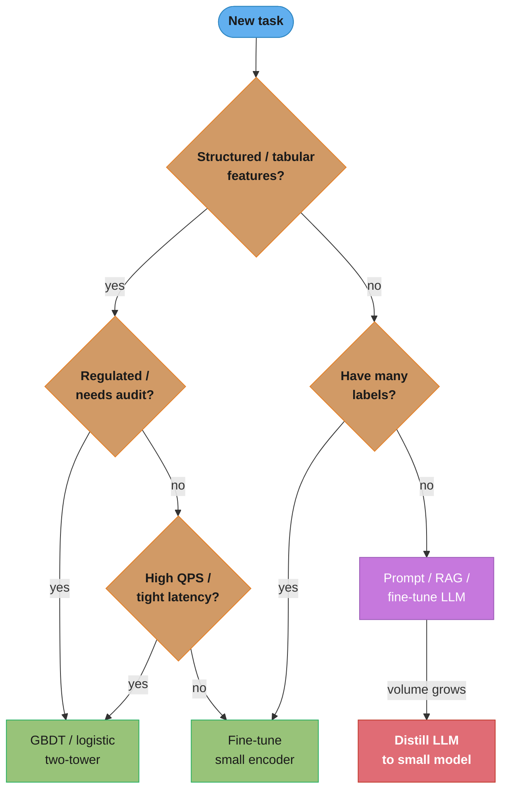

# Classical ML vs LLM — The Build-Decision Framework

> Deep-dive sub-file of [ml_system_design](README.md). Cross-reads:
> [model_selection_and_algorithm_choice](../model_selection_and_algorithm_choice/README.md),
> [../../llm/context_engineering](../../llm/context_engineering/README.md) (RAG-vs-fine-tuning),
> [../../llm/token_economics_and_cost_optimization](../../llm/token_economics_and_cost_optimization/README.md).

## 1. Concept Overview

The most common opening move in a 2026 AI system design interview is no longer "which model architecture" — it is **"should this even be an LLM?"** For a decade the reflex was to frame every problem as a supervised-learning task and reach for logistic regression, gradient-boosted trees, or a fine-tuned BERT. Generative LLMs added a second reflex — "just prompt a model" — that is often right for unstructured, low-volume, long-tail language tasks and often catastrophically wrong for high-volume, low-latency, structured prediction. This module is the decision framework that sits *between* the `ml/` and `llm/` sections: given a task, cost budget, latency SLO, data situation, and regulatory context, which paradigm do you build on?

The framework is deliberately paradigm-agnostic. "Classical ML" here means any trained, task-specific model — linear/logistic regression, GBDT (XGBoost/LightGBM), a fine-tuned encoder (BERT), a two-tower recommender. "LLM" means a large pretrained generative model used via prompting, RAG, tool-use, or fine-tuning. The point is not that one wins; it is that the *axes of the decision* are learnable and defensible.

## 2. Intuition

**One-line analogy:** classical ML is a machine you build to stamp one part a million times a second; an LLM is a versatile contractor you hire by the hour who can do almost any job once, expensively, without a blueprint.

**Mental model:** think of two cost curves crossing. Classical ML has a high *fixed* cost (collect labels, train, deploy a pipeline) and a near-zero *marginal* cost (microseconds, fractions of a cent per prediction). An LLM has a near-zero *fixed* cost (write a prompt this afternoon) and a high *marginal* cost (100 ms–seconds, cents per call). At low volume and high task diversity the LLM wins; as volume rises and the task narrows, the marginal cost dominates and classical ML wins. The whole framework is reasoning about *where you are on those curves*.

**Why it matters:** picking the wrong paradigm is the most expensive mistake in the system — an LLM on a billion-row-per-day tabular CTR task burns money and latency for worse accuracy than a GBDT; a hand-labeled classifier on a fuzzy, ever-changing long-tail language task burns quarters of engineering time for a job a prompt does today.

**Key insight:** the decision is driven by *marginal economics and task structure*, not by which technology is newer or more capable in the abstract. Capability is necessary but not sufficient — an LLM that *can* do the task may still be the wrong build.

## 3. Core Principles

1. **Volume × latency sets the marginal-cost ceiling.** High-QPS, low-latency paths (ad ranking at 1 ms, fraud at 10 ms) cannot afford per-call LLM inference; batch, low-volume paths can.
2. **Label availability sets the classical-ML floor.** Classical supervised ML needs labeled data; if you have millions of labels, train a model. If you have zero labels and can't get them, an LLM's zero/few-shot ability is the unlock.
3. **Task structure decides fit.** Structured prediction over tabular/numeric features (regression, ranking, CTR) is classical ML's home; open-ended generation, summarization, extraction from messy text, and reasoning over instructions are the LLM's home.
4. **Interpretability and regulation can veto the LLM.** Credit, healthcare, and hiring decisions demand auditable, monotonic, explainable models; a black-box LLM's rationale is not a defensible adverse-action reason.
5. **A hybrid is usually the real answer.** Use the LLM where its generality pays (bootstrapping labels, handling the long tail, the natural-language surface) and a distilled/classical model where volume and latency bite.

## 4. Types / Architectures / Strategies

The realistic option space is not binary — it is a ladder from cheapest-to-build to cheapest-to-run:

| Strategy | Fixed cost | Marginal cost | Best when |
|----------|-----------|---------------|-----------|
| Prompt an LLM (zero/few-shot) | Hours | High ($/call, 100ms-s) | Prototype, low volume, long-tail, no labels |
| RAG (LLM + retrieval) | Days | High + retrieval | Knowledge-grounded QA over changing corpus |
| Fine-tune an LLM | Days-weeks + GPUs | High | Domain style/format, still generative |
| Fine-tune a small encoder (BERT/DistilBERT) | Days + labels | Low (ms) | Text classification/NER at scale |
| GBDT / logistic / two-tower | Days + labels | Very low (µs) | Tabular, ranking, CTR, high QPS |
| **Distill LLM → small model** | LLM labels + train | Very low | Have LLM quality, need classical economics |

The distillation row is the bridge: use the LLM as a *teacher* to label data or transfer capability into a small task-specific model that meets the latency/cost budget. See [../../llm/knowledge_distillation_and_model_merging](../../llm/knowledge_distillation_and_model_merging/README.md).

## 5. Architecture Diagrams

```mermaid
quadrantChart
    title Paradigm fit by task structure and volume
    x-axis "Low volume / diverse tasks" --> "High volume / narrow task"
    y-axis "Unstructured language" --> "Structured tabular"
    quadrant-1 "Distill LLM to small model"
    quadrant-2 "Prompt or fine-tune LLM"
    quadrant-3 "Fine-tune small encoder"
    quadrant-4 "GBDT or logistic or two-tower"
    "Chatbot / assistant": 0.20, 0.80
    "Doc extraction (long tail)": 0.30, 0.72
    "High-volume text moderation": 0.78, 0.68
    "Ad CTR ranking": 0.88, 0.18
    "Fraud detection": 0.80, 0.25
    "Semantic search": 0.55, 0.55
```

Two axes decide the quadrant: how structured the input is (vertical) and how high-volume/narrow the task is (horizontal). Unstructured + low-volume → prompt an LLM; structured + high-volume → classical ML; high-volume + unstructured → distill the LLM into a small model to get LLM quality at classical economics.



The decision walk: structure and regulation push toward classical ML; missing labels push toward the LLM; rising volume on an LLM path pushes toward distillation.

## 6. How It Works — Detailed Mechanics

The decision is quantitative. Make the cost and latency comparison explicit rather than hand-waving "LLMs are expensive."

```python
def paradigm_cost_comparison(daily_predictions: int,
                             llm_cost_per_call_usd: float = 0.002,
                             llm_latency_ms: float = 800.0,
                             gbdt_cost_per_call_usd: float = 0.0000002,
                             gbdt_latency_ms: float = 0.5,
                             classical_build_usd: float = 40_000.0):
    """
    Compare a prompted LLM (no build cost, high marginal cost) against a trained
    classical model (high build cost, negligible marginal cost) over one year.
    Returns the break-even volume where classical ML becomes cheaper.

    Illustrative defaults: an LLM API call ~ $0.002 and ~800ms; a GBDT prediction
    ~ 2e-7 dollars and ~0.5ms; a one-off classical build ~ $40k (labeling + eng).
    """
    annual = daily_predictions * 365
    llm_annual = annual * llm_cost_per_call_usd
    gbdt_annual = annual * gbdt_cost_per_call_usd + classical_build_usd

    # break-even daily volume: classical_build == annual LLM marginal savings
    per_call_savings = llm_cost_per_call_usd - gbdt_cost_per_call_usd
    breakeven_daily = classical_build_usd / (per_call_savings * 365)

    return {
        "llm_annual_usd": round(llm_annual, 2),
        "gbdt_annual_usd": round(gbdt_annual, 2),
        "breakeven_daily_volume": int(breakeven_daily),
        "llm_p50_latency_ms": llm_latency_ms,
        "gbdt_p50_latency_ms": gbdt_latency_ms,
        "recommendation": "classical" if daily_predictions > breakeven_daily else "llm",
    }


# At 1M predictions/day the LLM costs ~$730k/yr vs ~$40k for GBDT — and misses a
# 1ms latency SLO by 800x. Break-even is only a few tens of thousands of calls/day.
print(paradigm_cost_comparison(1_000_000))
```

The mechanics also include a *capability* gate that cost cannot override: if you have no labels and cannot obtain them cheaply, classical supervised ML is simply not available, and the LLM's zero-shot ability is the only path — until you have used it to *generate* labels and can then train a cheap model (the distillation/flywheel move).

## 7. Real-World Examples

- **Tabular CTR / fraud (Meta, Stripe, banks):** GBDT / DLRM / logistic at µs latency and micro-cent cost. An LLM here is strictly worse on accuracy, latency, and cost — structured numeric features are classical ML's home turf.
- **Customer-support triage (many SaaS):** started as a hand-labeled intent classifier; teams increasingly bootstrap with an LLM (zero-shot) to cover the long tail, then distill high-volume intents into a small classifier to hit latency/cost.
- **Document extraction (fintech/legal):** LLMs handle messy, heterogeneous documents the long tail of which was never worth labeling for a classical NER model; high-volume, stable document types get a fine-tuned encoder.
- **Semantic search (everywhere):** embeddings (a classical-ML primitive) power retrieval; an LLM reranks or synthesizes answers — a hybrid where each paradigm does what it is cheap at.
- **Spam/moderation at scale:** cheap classical filters do the volume; LLM guardrail models handle nuanced, novel, or generated content (see [design_harmful_content_detection](../case_studies/design_harmful_content_detection.md)).

## 8. Tradeoffs

| Dimension | Classical ML | LLM |
|-----------|-------------|-----|
| Marginal cost / latency | µs–ms, micro-cents | 100ms–s, cents |
| Fixed / build cost | High (labels, training) | Low (a prompt) |
| Labeled-data need | Required | Zero/few-shot works |
| Structured/tabular tasks | Excellent | Poor |
| Long-tail / novel language | Poor | Excellent |
| Interpretability / audit | Strong (SHAP, monotonic) | Weak (black box) |
| Iteration speed to v0 | Slow | Fast |
| Cost at high volume | Excellent | Poor |
| Hallucination risk | N/A | Real; needs guardrails |

## 9. When to Use / When NOT to Use

**Reach for classical ML when:** the task is structured/tabular; volume is high and latency tight; you have (or can get) labels; the decision is regulated and must be auditable; the objective is a well-defined score (CTR, watch time, default probability).

**Reach for an LLM when:** the input is unstructured natural language; the task is open-ended (generation, summarization, extraction, reasoning); labels are scarce or the task changes often; volume is low or batchable; time-to-first-version matters more than steady-state cost.

**Do NOT use an LLM when:** you are ranking billions of tabular rows/day at millisecond SLOs; the decision needs a defensible, monotonic, auditable rationale; a cheap trained model already meets quality. **Do NOT force classical ML when:** you have no labels for a fuzzy long-tail language task and an LLM prompt solves it today.

## 10. Common Pitfalls

1. **LLM-as-golden-hammer on tabular data.** Prompting an LLM to predict CTR or default risk from numeric features — worse accuracy than a GBDT, 1000× the cost and latency. Structured prediction is classical ML's domain.
2. **Ignoring marginal economics at scale.** A prototype LLM feature looks cheap at 1k calls/day; at 10M calls/day it is a six-to-seven-figure annual bill and blows the latency SLO. Always compute break-even volume before shipping.
3. **Hand-labeling a task the LLM already solves.** Spending a quarter labeling data and training a classifier for a fuzzy, low-volume task a prompt handles in an afternoon.
4. **Shipping a black-box LLM into a regulated decision.** Using an LLM for credit/hiring/medical decisions where you cannot produce a monotonic, auditable adverse-action reason — a compliance failure regardless of accuracy.
5. **Skipping distillation.** Staying on expensive LLM inference for a now-high-volume task instead of distilling it into a small model — leaving the LLM's quality but paying its economics forever.
6. **Comparing on capability, not on fit.** Choosing the paradigm that scores higher on a benchmark rather than the one that meets the actual cost, latency, data, and audit constraints.

## 11. Technologies & Tools

| Tool | Role in the decision |
|------|---------------------|
| XGBoost / LightGBM | Default for tabular/ranking; the classical baseline to beat |
| DistilBERT / fine-tuned encoders | Text classification/NER at scale (ms, cheap) |
| OpenAI/Anthropic APIs, open-weight LLMs | Zero/few-shot prototyping, long-tail, generation |
| RAG stacks (vector DB + LLM) | Knowledge-grounded QA over changing corpora |
| Distillation / labeling pipelines (Snorkel, LLM-as-labeler) | Turn LLM quality into classical economics |
| Cost/latency observability (per-call token + $ tracking) | Make the marginal-cost curve visible before scale bites |

## 12. Interview Questions with Answers

**Q: When would you choose a gradient-boosted tree over an LLM?**
For structured/tabular prediction at high volume and tight latency — CTR, fraud, default risk. GBDTs give microsecond inference, micro-cent cost, strong accuracy on numeric features, and SHAP interpretability, all of which an LLM loses on. The LLM is worse on accuracy, ~1000× the latency, and orders of magnitude more expensive here. Reach for classical ML whenever the input is tabular and the QPS is high.

**Q: What is the single biggest factor that makes an LLM the wrong choice?**
High prediction volume under a tight latency budget, because the LLM's per-call marginal cost and 100ms–second latency dominate at scale. A task at 1M+ predictions/day and a millisecond SLO cannot afford per-call LLM inference. This is why ad ranking and fraud stay classical even in an LLM era. Compute the break-even volume before committing.

**Q: You have zero labeled data for a fuzzy text task. What do you do?**
Start with an LLM zero/few-shot, because classical supervised ML is simply unavailable without labels. The LLM handles the task immediately and, just as importantly, can *generate* labels you then use to train a cheap task-specific model. That bootstrapping — LLM to unblock, then distill for economics — is the standard modern pattern. Labels, or the lack of them, set the classical-ML floor.

**Q: Explain the fixed-vs-marginal cost tradeoff between the two paradigms.**
Classical ML has high fixed cost (labeling, training, pipeline) but near-zero marginal cost per prediction; an LLM has near-zero fixed cost (a prompt) but high marginal cost per call. At low volume the LLM's cheap start wins; as volume rises the marginal cost dominates and classical ML wins. The decision is largely about where you sit on those crossing cost curves. Always estimate the break-even volume.

**Q: What is model distillation and why is it the bridge between the paradigms?**
Distillation uses a large model (the LLM teacher) to train a small task-specific model (the student), transferring quality into a cheap, low-latency package. It lets you keep the LLM's accuracy on a task while paying classical ML's economics at serving time. It is the answer when an LLM feature outgrows its cost envelope as volume rises. See knowledge_distillation.

**Q: Why might regulation force you away from an LLM even if it is more accurate?**
Because regulated decisions (credit, hiring, healthcare) require an auditable, monotonic, explainable rationale that a black-box LLM cannot provide. Laws like ECOA/FCRA demand specific adverse-action reasons, which a scorecard or monotonic GBDT gives and an LLM's free-text rationale does not. Interpretability and compliance can veto the higher-accuracy model. Accuracy is not the only acceptance criterion.

**Q: When is a hybrid of classical ML and an LLM the right answer?**
When different parts of the pipeline have different cost/quality profiles — for example, cheap classical filters handle the high-volume common case and an LLM handles the nuanced long tail or the natural-language surface. Semantic search (embeddings retrieve, LLM reranks/synthesizes) and moderation (classical filters plus LLM guardrails) are canonical hybrids. Use each paradigm where it is cheap and strong. Hybrids are usually the real production design.

**Q: How do you actually compute the break-even point between an LLM and a trained model?**
Set the classical build cost equal to the annual marginal savings: break-even daily volume = build_cost / (per_call_savings × 365). With an LLM at ~$0.002/call, a GBDT at micro-cents, and a ~$40k build, break-even is only a few tens of thousands of calls/day. Above that, the trained model is cheaper within a year — and also meets latency SLOs the LLM misses. Make this calculation explicit in a design.

**Q: Why is prompting an LLM for tabular CTR prediction a bad idea?**
Because structured numeric features are classical ML's home turf, where GBDTs are more accurate, and the LLM adds 1000× latency and cost for worse results. LLMs excel at unstructured language, not at learning feature interactions over numeric columns. This is the golden-hammer pitfall — choosing the newer tool regardless of fit. Ranking billions of tabular rows/day belongs to GBDT/DLRM.

**Q: What makes fine-tuning a small encoder (BERT) different from fine-tuning an LLM?**
A fine-tuned small encoder (DistilBERT) is a low-latency, low-cost task-specific classifier — milliseconds and cheap at scale — whereas a fine-tuned LLM is still a generative model with high per-call cost. For high-volume text classification/NER you want the small encoder; for domain-styled generation you want the fine-tuned LLM. Pick by whether the output is a label (encoder) or free text (LLM). Volume usually favors the encoder.

**Q: How does time-to-first-version influence the paradigm choice?**
An LLM prompt gives a working v0 in hours with no labels or training, which is invaluable for prototyping, validating product-market fit, or covering a long tail cheaply. Classical ML's build cost (labeling, training, pipeline) delays v0 by days or weeks. So even when classical ML is the right steady-state answer, teams often start on an LLM and migrate once volume justifies the build. Speed-to-learn can outweigh steady-state cost early.

**Q: What are the hidden risks of an LLM that classical ML does not have?**
Hallucination, prompt-injection, non-determinism, and provider dependency/cost drift, none of which a trained classifier exhibits. An LLM can confidently produce wrong output that needs guardrails, evaluation harnesses, and monitoring the classical model would not require. These operational costs belong in the comparison, not just the per-call price. Factor guardrail and eval overhead into the LLM's true cost.

**Q: How do you decide between RAG and fine-tuning when you have already chosen the LLM paradigm?**
Use RAG when the knowledge is large, changing, or must be cited (ground answers in retrieved documents); use fine-tuning when you need to change the model's *behavior, format, or style* rather than inject facts. They are complementary — many systems fine-tune for format and use RAG for knowledge. This is the intra-LLM version of the same fit question. See llm/context_engineering.

**Q: A prototype LLM feature is cheap today; why might it not scale?**
Because marginal cost scales linearly with volume — a feature that costs pennies at 1k calls/day becomes a six-or-seven-figure annual bill and breaches latency SLOs at 10M calls/day. The cheap prototype hides the marginal-cost curve that only bites at scale. Always project cost at target volume and set a distillation trigger. Prototype economics are not production economics.

**Q: If an LLM can technically do a task, why might you still not use it?**
Because capability is necessary but not sufficient — fit to cost, latency, data, and audit constraints decides the build. An LLM that *can* classify tabular rows may still be the wrong choice versus a GBDT that is cheaper, faster, more accurate, and auditable. Choosing on benchmark capability rather than production fit is a classic mistake. The right question is not "can it" but "should it, given the constraints."

**Q: How does interpretability differ between the two paradigms and when does it decide the design?**
Classical models offer SHAP values, monotonic constraints, and coefficient-level explanations; an LLM offers at best a post-hoc free-text rationale that is not a faithful account of its computation. When a decision must be defended to a regulator, contested in an appeal, or debugged for bias, that auditability decides the design in classical ML's favor. Interpretability is a hard requirement in credit, hiring, and healthcare, not a nice-to-have.

## 13. Best Practices

- **Always compute break-even volume and cost-at-target-scale before choosing an LLM path** — make the marginal-cost curve explicit.
- **Default to the cheapest paradigm that meets quality**; treat the LLM as the option you justify, not the default.
- **Prototype on an LLM, then distill** once a task proves high-volume and stable.
- **Let regulation and latency act as hard vetoes**, not soft preferences.
- **Design hybrids on purpose** — each paradigm where it is cheap and strong.
- **Instrument per-call token and dollar cost from day one**, so scale doesn't surprise you.

## 14. Case Study

See [design_harmful_content_detection](../case_studies/design_harmful_content_detection.md) for a production system that is explicitly a hybrid: cheap classical filters and small encoders carry the volume, while LLM guardrail models handle nuanced, novel, and generated content — chosen exactly along the axes in this framework (volume, latency, task structure, adversarial change). For the intra-LLM branch of the decision (RAG vs fine-tuning vs long context), see [../../llm/context_engineering](../../llm/context_engineering/README.md); for turning LLM quality into classical economics, see [../../llm/knowledge_distillation_and_model_merging](../../llm/knowledge_distillation_and_model_merging/README.md).
