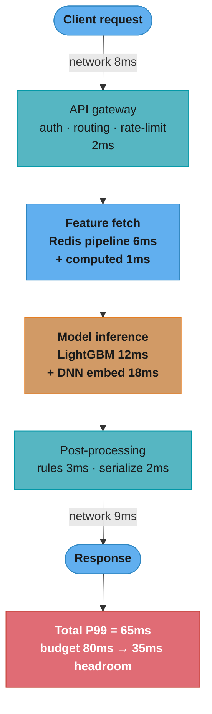
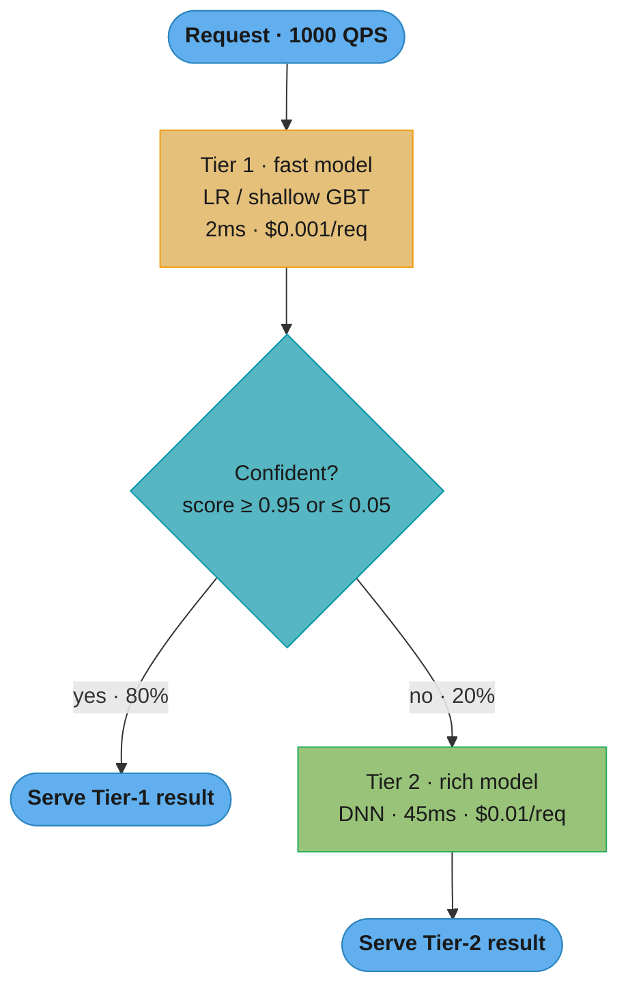
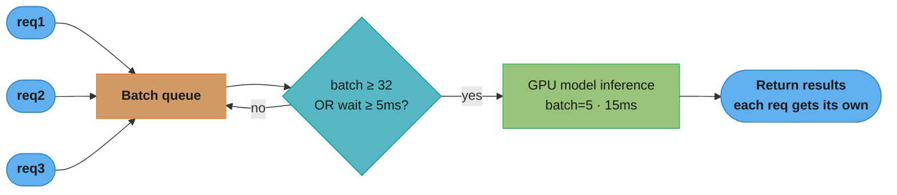
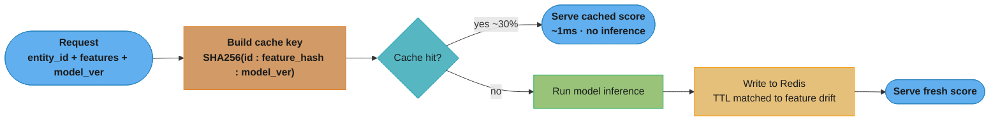
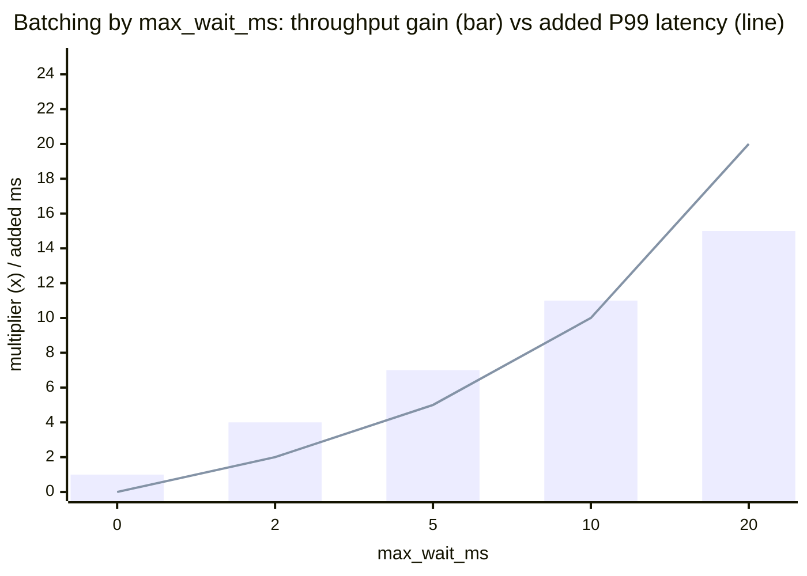

# ML Inference Latency and Throughput Optimization

## 1. Concept Overview

ML inference latency and throughput optimization is the discipline of reducing the time it takes for a model to produce a prediction (latency) and increasing the number of predictions that can be served per unit time (throughput), while maintaining acceptable model quality.

Production ML serving faces a fundamental tension: the most accurate models are often the largest and slowest (deep neural networks with hundreds of millions of parameters), while the most demanding serving requirements call for sub-100ms P99 latency at tens of thousands of QPS. Bridging this gap requires a layered optimization strategy applied at model, hardware, and system levels.

Key dimensions:
- Latency: the time from receiving a request to returning a prediction. The P99 (99th percentile) is the critical metric — average latency can be good while tail latency is catastrophic.
- Throughput: predictions per second that a single server or cluster can sustain. Governed by parallelism, batching, and hardware utilization.
- Cost: GPU/CPU hours per million predictions. Optimization reduces cost while maintaining quality.

---

## 2. Intuition

One-line analogy: optimizing ML inference is like optimizing a restaurant kitchen — you can use faster chefs (better hardware), prepare ingredients in advance (precomputation and caching), cook multiple orders simultaneously (batching), or use a simpler recipe that tastes almost as good (model compression).

Mental model: think of the prediction pipeline as a chain of stages, each with its own latency contribution. The total latency is the sum of all stage latencies. Optimize the slowest stage first (Amdahl's Law). Common stages: network, feature fetch, model inference, post-processing. Model inference is usually the largest contributor and the most optimizable.

Key insight: a 4x reduction in model size via quantization produces a 3x speedup and 4x memory reduction with < 1% quality loss. This is almost always worth doing before considering more complex optimizations.

---

## 3. Core Principles

**Measure before optimizing**: profile the complete request path to identify the actual bottleneck. Optimizing model inference when the bottleneck is feature fetching from Redis wastes engineering time.

**Latency budget decomposition**: allocate a P99 budget to each pipeline stage before optimizing. Every stage must meet its budget individually; no stage can borrow from another at P99.

**Hardware-software co-design**: choose the optimization technique based on the serving hardware. INT8 quantization yields 3x speedup on CPUs and modern GPUs; it provides minimal benefit on older GPUs without INT8 tensor cores.

**Quality-efficiency tradeoff**: every optimization reduces some combination of accuracy, latency, cost, or complexity. Quantify the quality loss before deploying any compression technique.

**Caching as the first optimization**: before optimizing the model itself, check if predictions can be cached. Static user segments, popular items, and repeated queries are all candidates for prediction caching.

---

## 4. Types / Architectures / Strategies

### Optimization Technique Taxonomy

| Technique | Latency Reduction | Memory Reduction | Quality Loss | Complexity |
|-----------|-----------------|----------------|-------------|-----------|
| Request batching | 2-10x throughput | None | None | Low |
| Quantization (INT8) | 2-4x | 4x (FP32 → INT8) | <1% on most tasks | Medium |
| Quantization (INT4) | 3-6x | 8x | 1-3% | Medium |
| Model pruning (unstructured) | Minimal without sparse hardware | 2-10x | 1-5% | High |
| Model pruning (structured) | 2-4x | 2-4x | 1-5% | High |
| Knowledge distillation | 5-50x (student vs teacher) | 5-50x | 5-20% | High |
| ONNX export | 1.3-2x | None | None | Low |
| TensorRT optimization | 2-8x (GPU) | 1.5-2x | <1% | Medium |
| Feature caching (Redis) | Up to 10x on feature fetch | None (Redis cost) | None | Low |
| Prediction caching | Up to 100x for cacheable requests | None (cache cost) | None | Low |
| Model cascade | 4-5x average cost | None | None | Medium |
| Precomputation (offline) | Infinite (serving = cache lookup) | None (storage cost) | None | Medium |

### Hardware Selection

| Hardware | Best For | Throughput | Cost |
|----------|---------|-----------|------|
| CPU (general) | Small models (<10M params), interpretable models (GBT) | Low | Low |
| CPU (optimized: Intel Xeon + AVX-512) | LightGBM, ONNX optimized small models | Medium | Low-Medium |
| GPU (NVIDIA T4) | Medium DNN inference, cost-efficient | High | Medium |
| GPU (NVIDIA A10G) | Large DNN, transformer inference | Very High | Medium-High |
| GPU (NVIDIA A100) | Very large models, high-throughput batch | Highest | High |
| Custom ASIC (Google TPU, AWS Inferentia) | Transformer-heavy workloads, high volume | Very High | Low at scale |

---

## 5. Architecture Diagrams

### Latency Budget Decomposition (P99 = 100ms)



Total latency is the sum of stage latencies, so per Amdahl's Law you optimize the largest stage first — here model inference (30ms of 65ms). Each stage must meet its own P99 budget; none can borrow slack from another at the tail.

### Model Cascade Architecture



Routing only the uncertain 20% to the DNN gives an effective cost of 0.8·$0.001 + 0.2·$0.01 = $0.0028/req (72% cheaper than DNN-only) and an average latency of 0.8·2ms + 0.2·47ms ≈ 11ms (versus 45ms for DNN-only), while keeping the expensive model's quality on the hard cases.

### Dynamic Batching



Firing on size-or-timeout keeps the tail bounded — the oldest request waits at most max_wait (5ms) before its batch fires. Batching lifts GPU utilization from ~5% to ~25% and throughput from 67 to 250 req/s, at the cost of ~5ms added wait on the earliest arrivals.

### Prediction Caching Path



Folding feature_hash and model_ver into the key means stale features or a new model version naturally miss the cache — the fix for the poisoning failure where a user's risk spikes but a cached low-risk score keeps being served.

### Batching Tradeoff: Throughput vs Latency



Throughput gain (bars) saturates past roughly 5ms while added P99 latency (line) keeps climbing almost 1:1 with max_wait. That divergence is why max_wait should be capped near 20% of the P99 budget — beyond that you buy latency without buying throughput.

---

## 6. How It Works — Detailed Mechanics

### Dynamic Batching Server

```python
from __future__ import annotations

import asyncio
import time
import threading
from dataclasses import dataclass, field
from typing import Any, Callable

import numpy as np
import lightgbm as lgb


@dataclass
class PendingRequest:
    request_id: str
    features: np.ndarray
    future: asyncio.Future
    enqueue_time: float = field(default_factory=time.perf_counter)


class DynamicBatchingServer:
    """
    Accumulates incoming requests into batches for efficient GPU/CPU inference.
    Fires the batch when max_batch_size is reached or max_wait_ms expires.

    This is the core pattern used by Triton Inference Server, TorchServe,
    and TF Serving for high-throughput ML serving.
    """

    def __init__(
        self,
        model: lgb.Booster,
        max_batch_size: int = 32,
        max_wait_ms: float = 5.0,
    ) -> None:
        self._model = model
        self._max_batch_size = max_batch_size
        self._max_wait_ms = max_wait_ms
        self._queue: list[PendingRequest] = []
        self._lock = threading.Lock()
        self._loop: asyncio.AbstractEventLoop | None = None

        # Start background batch processor
        self._processor_thread = threading.Thread(
            target=self._batch_processor_loop, daemon=True
        )
        self._processor_thread.start()

    async def predict(self, request_id: str, features: np.ndarray) -> np.ndarray:
        """
        Async interface: enqueue request, await result.
        Request is batched with other concurrent requests.
        """
        if self._loop is None:
            self._loop = asyncio.get_event_loop()

        future: asyncio.Future = self._loop.create_future()
        pending = PendingRequest(
            request_id=request_id,
            features=features,
            future=future,
        )

        with self._lock:
            self._queue.append(pending)

        return await future

    def _batch_processor_loop(self) -> None:
        """Background thread: collect requests and fire batches."""
        while True:
            time.sleep(self._max_wait_ms / 1000 / 2)   # poll at 2x max_wait

            with self._lock:
                if not self._queue:
                    continue

                now = time.perf_counter()
                oldest_age_ms = (now - self._queue[0].enqueue_time) * 1000

                # Fire batch if: max size reached OR oldest request has waited too long
                should_fire = (
                    len(self._queue) >= self._max_batch_size
                    or oldest_age_ms >= self._max_wait_ms
                )

                if not should_fire:
                    continue

                # Take up to max_batch_size requests
                batch = self._queue[:self._max_batch_size]
                self._queue = self._queue[self._max_batch_size:]

            self._process_batch(batch)

    def _process_batch(self, batch: list[PendingRequest]) -> None:
        """Run inference on a batch and resolve futures."""
        t_start = time.perf_counter()

        # Stack features into a single matrix
        feature_matrix = np.vstack([req.features for req in batch])

        try:
            scores = self._model.predict(feature_matrix)
            t_inference = time.perf_counter()
            inference_ms = (t_inference - t_start) * 1000

            # Resolve each future with its result
            if self._loop:
                for i, req in enumerate(batch):
                    result = scores[i]
                    self._loop.call_soon_threadsafe(
                        req.future.set_result, result
                    )

        except Exception as exc:
            if self._loop:
                for req in batch:
                    self._loop.call_soon_threadsafe(
                        req.future.set_exception, exc
                    )


class BatchingMetrics:
    """Track batching efficiency metrics."""

    def __init__(self) -> None:
        self._batch_sizes: list[int] = []
        self._wait_times_ms: list[float] = []
        self._inference_times_ms: list[float] = []

    def record(
        self, batch_size: int, wait_ms: float, inference_ms: float
    ) -> None:
        self._batch_sizes.append(batch_size)
        self._wait_times_ms.append(wait_ms)
        self._inference_times_ms.append(inference_ms)

    def summary(self) -> dict[str, float]:
        if not self._batch_sizes:
            return {}
        return {
            "mean_batch_size": float(np.mean(self._batch_sizes)),
            "p50_batch_size": float(np.percentile(self._batch_sizes, 50)),
            "gpu_utilization_proxy": float(np.mean(self._batch_sizes)) / 32,  # vs max_batch
            "p99_wait_ms": float(np.percentile(self._wait_times_ms, 99)),
            "p99_inference_ms": float(np.percentile(self._inference_times_ms, 99)),
        }
```

### Latency Profiling

```python
import time
import contextlib
from collections import defaultdict
from typing import Generator

import numpy as np


class LatencyProfiler:
    """
    Profiles latency of each stage in the prediction pipeline.
    Emits P50, P95, P99 per stage for monitoring and optimization.

    Usage:
        profiler = LatencyProfiler()
        with profiler.measure("feature_fetch"):
            features = store.get_online_features(entity_rows, feature_refs)
        with profiler.measure("model_inference"):
            scores = model.predict(features)
        profiler.emit_metrics()
    """

    def __init__(self) -> None:
        self._timings: dict[str, list[float]] = defaultdict(list)

    @contextlib.contextmanager
    def measure(self, stage_name: str) -> Generator[None, None, None]:
        start = time.perf_counter()
        try:
            yield
        finally:
            elapsed_ms = (time.perf_counter() - start) * 1000
            self._timings[stage_name].append(elapsed_ms)

    def get_percentiles(self, stage_name: str) -> dict[str, float]:
        timings = self._timings.get(stage_name, [])
        if not timings:
            return {}
        arr = np.array(timings)
        return {
            "p50_ms": float(np.percentile(arr, 50)),
            "p95_ms": float(np.percentile(arr, 95)),
            "p99_ms": float(np.percentile(arr, 99)),
            "mean_ms": float(np.mean(arr)),
            "count": len(timings),
        }

    def emit_metrics(self) -> dict[str, dict[str, float]]:
        """Return all stage metrics for emission to Prometheus / DataDog."""
        return {stage: self.get_percentiles(stage) for stage in self._timings}

    def identify_bottleneck(self) -> str:
        """Returns the stage with the highest P99 latency."""
        if not self._timings:
            return "no_data"
        return max(self._timings.keys(),
                   key=lambda s: np.percentile(self._timings[s], 99))


def profile_prediction_pipeline(
    user_id: str,
    item_ids: list[str],
    feature_store,
    model: lgb.Booster,
    profiler: LatencyProfiler,
) -> list[float]:
    """Example: fully profiled prediction pipeline."""

    with profiler.measure("feature_fetch"):
        features = feature_store.get_online_features(
            [{"user_id": user_id}], item_ids
        )

    with profiler.measure("feature_assembly"):
        feature_matrix = np.array([[f["value"] for f in row] for row in features])

    with profiler.measure("model_inference"):
        scores = model.predict(feature_matrix)

    with profiler.measure("post_processing"):
        # Sort and apply business rules
        ranked_indices = np.argsort(scores)[::-1]
        final_scores = [float(scores[i]) for i in ranked_indices]

    return final_scores
```

### Model Cascade Implementation

```python
from __future__ import annotations

import numpy as np
import lightgbm as lgb
from dataclasses import dataclass
from typing import Optional


@dataclass
class CascadeResult:
    score: float
    tier_used: int          # 1 = cheap model, 2 = expensive model
    tier1_score: float
    was_uncertain: bool


class ModelCascade:
    """
    Two-tier model cascade:
    - Tier 1: fast, cheap model (LR or shallow GBT)
    - Tier 2: slow, expensive model (deep GBT or DNN)

    Routes requests to Tier 2 only when Tier 1 is uncertain.
    Reduces average latency and cost while maintaining Tier 2 quality
    for difficult cases.

    Design parameters:
    - high_confidence_threshold: if score > this, serve Tier 1 result
    - low_confidence_threshold: if score < this, serve Tier 1 result
    - Uncertain range (high, low) → escalate to Tier 2
    """

    def __init__(
        self,
        tier1_model: lgb.Booster,
        tier2_model: lgb.Booster,
        high_confidence_threshold: float = 0.85,
        low_confidence_threshold: float = 0.15,
    ) -> None:
        self._tier1 = tier1_model
        self._tier2 = tier2_model
        self._high_threshold = high_confidence_threshold
        self._low_threshold = low_confidence_threshold

        # Track routing stats for monitoring
        self._tier1_count = 0
        self._tier2_count = 0

    def predict(
        self,
        features_tier1: np.ndarray,
        features_tier2: Optional[np.ndarray] = None,
    ) -> CascadeResult:
        """
        Route a single request through the cascade.

        Args:
            features_tier1: lightweight feature set for Tier 1 model
            features_tier2: full feature set for Tier 2 model (fetched lazily)
        """
        # Always run Tier 1 (fast)
        tier1_score = float(self._tier1.predict(features_tier1.reshape(1, -1))[0])
        self._tier1_count += 1

        # Check if Tier 1 is confident enough to serve directly
        is_certain = (
            tier1_score > self._high_threshold
            or tier1_score < self._low_threshold
        )

        if is_certain:
            return CascadeResult(
                score=tier1_score,
                tier_used=1,
                tier1_score=tier1_score,
                was_uncertain=False,
            )

        # Uncertain: escalate to Tier 2
        self._tier2_count += 1
        if features_tier2 is None:
            # Tier 2 features not pre-fetched — use Tier 1 result as fallback
            return CascadeResult(
                score=tier1_score,
                tier_used=1,
                tier1_score=tier1_score,
                was_uncertain=True,
            )

        tier2_score = float(self._tier2.predict(features_tier2.reshape(1, -1))[0])
        return CascadeResult(
            score=tier2_score,
            tier_used=2,
            tier1_score=tier1_score,
            was_uncertain=True,
        )

    def routing_stats(self) -> dict[str, float]:
        total = self._tier1_count + self._tier2_count
        return {
            "tier1_fraction": self._tier1_count / max(total, 1),
            "tier2_fraction": self._tier2_count / max(total, 1),
            "total_requests": total,
        }

    def calibrate_thresholds(
        self,
        X_val: np.ndarray,
        y_val: np.ndarray,
        X_val_full: np.ndarray,
        target_tier2_fraction: float = 0.20,
    ) -> tuple[float, float]:
        """
        Find thresholds that route target_tier2_fraction to Tier 2.
        Uses validation set.
        """
        tier1_scores = self._tier1.predict(X_val)

        # Find symmetric thresholds around 0.5 that give target_tier2_fraction
        # in the uncertain middle region
        sorted_distances = np.sort(np.abs(tier1_scores - 0.5))
        cutoff_idx = int(target_tier2_fraction * len(sorted_distances))
        if cutoff_idx == 0:
            return (0.95, 0.05)
        distance_threshold = sorted_distances[cutoff_idx]

        high_thresh = min(0.95, 0.5 + distance_threshold)
        low_thresh = max(0.05, 0.5 - distance_threshold)

        return (high_thresh, low_thresh)
```

### Prediction Caching

```python
import hashlib
import json
import time
import redis
from typing import Any, Optional


class PredictionCache:
    """
    Cache model predictions with TTL.
    Appropriate when:
    - The same entity appears repeatedly in a short window
    - Feature values do not change faster than the TTL
    - The cost of prediction is high relative to cache cost

    Common patterns:
    - Item popularity scores: cache for 60 minutes (items don't change fast)
    - User segment scores: cache for 5 minutes (user context changes)
    - Ad quality scores: cache for 30 minutes (ad content stable)
    """

    def __init__(
        self,
        redis_client: redis.Redis,
        default_ttl_seconds: int = 300,
        namespace: str = "pred_cache",
    ) -> None:
        self._redis = redis_client
        self._default_ttl = default_ttl_seconds
        self._namespace = namespace
        self._hits = 0
        self._misses = 0

    def get(self, cache_key: str) -> Optional[float]:
        """Return cached prediction or None on cache miss."""
        raw = self._redis.get(f"{self._namespace}:{cache_key}")
        if raw is not None:
            self._hits += 1
            return float(raw)
        self._misses += 1
        return None

    def set(
        self,
        cache_key: str,
        score: float,
        ttl_seconds: Optional[int] = None,
    ) -> None:
        """Cache a prediction score with TTL."""
        ttl = ttl_seconds if ttl_seconds is not None else self._default_ttl
        self._redis.set(
            f"{self._namespace}:{cache_key}",
            str(score),
            ex=ttl,
        )

    def build_key(self, entity_id: str, feature_hash: str, model_version: str) -> str:
        """
        Build a cache key that invalidates when features or model changes.
        Including feature_hash ensures stale features don't return stale predictions.
        """
        raw_key = f"{entity_id}:{feature_hash}:{model_version}"
        return hashlib.sha256(raw_key.encode()).hexdigest()[:16]

    def hit_rate(self) -> float:
        total = self._hits + self._misses
        return self._hits / total if total > 0 else 0.0


def compute_feature_hash(features: dict[str, Any]) -> str:
    """Stable hash of feature values for cache key construction."""
    # Sort to ensure determinism
    serialized = json.dumps(features, sort_keys=True)
    return hashlib.md5(serialized.encode()).hexdigest()[:8]
```

### GPU vs CPU Break-Even Analysis

```python
from dataclasses import dataclass


@dataclass
class InfrastructureCostModel:
    # Hardware costs (hourly)
    cpu_cost_per_hour: float       # e.g. $0.05/hr for 4-core server
    gpu_cost_per_hour: float       # e.g. $0.80/hr for T4 GPU

    # Throughput at 70% utilization
    cpu_throughput_qps: int        # requests per second on CPU
    gpu_throughput_qps: int        # requests per second on GPU

    # Quality: GPU model may have higher AUC -> higher revenue per prediction
    gpu_revenue_lift_per_request: float  # e.g. $0.002 additional revenue per req


def compute_break_even(model: InfrastructureCostModel) -> dict[str, float]:
    """
    Compare cost per 1M requests for CPU vs GPU serving.
    Factor in quality-driven revenue difference.
    """
    # CPU: cost per 1M requests
    cpu_seconds_per_1m = 1_000_000 / model.cpu_throughput_qps
    cpu_cost_per_1m = (cpu_seconds_per_1m / 3600) * model.cpu_cost_per_hour

    # GPU: cost per 1M requests
    gpu_seconds_per_1m = 1_000_000 / model.gpu_throughput_qps
    gpu_cost_per_1m = (gpu_seconds_per_1m / 3600) * model.gpu_cost_per_hour

    # GPU quality lift: additional revenue per 1M requests
    gpu_revenue_lift_per_1m = model.gpu_revenue_lift_per_request * 1_000_000

    # GPU net cost = serving cost - revenue lift
    gpu_net_cost_per_1m = gpu_cost_per_1m - gpu_revenue_lift_per_1m

    return {
        "cpu_cost_per_1m_usd": cpu_cost_per_1m,
        "gpu_serving_cost_per_1m_usd": gpu_cost_per_1m,
        "gpu_revenue_lift_per_1m_usd": gpu_revenue_lift_per_1m,
        "gpu_net_cost_per_1m_usd": gpu_net_cost_per_1m,
        "gpu_vs_cpu_cost_ratio": gpu_cost_per_1m / max(cpu_cost_per_1m, 1e-8),
        "gpu_justified": gpu_net_cost_per_1m < cpu_cost_per_1m,
    }


# Example: LightGBM (CPU) vs DNN (GPU) for recommendation
result = compute_break_even(InfrastructureCostModel(
    cpu_cost_per_hour=0.10,
    gpu_cost_per_hour=0.80,
    cpu_throughput_qps=2_000,    # LightGBM on 4-core CPU
    gpu_throughput_qps=20_000,   # DNN on T4 GPU with batching
    gpu_revenue_lift_per_request=0.005,  # $0.005 additional revenue from better DNN
))
# Output: GPU serving costs 4x more, but revenue lift makes it net positive
```

---

## 7. Real-World Examples

**Netflix recommendation serving** uses a combination of precomputation and online inference. For their homepage rows, candidate generation is done offline (precomputed for all users daily), and the final ranking is done online at request time using a lightweight model. The online ranking model is optimized for CPU inference using ONNX export, achieving sub-10ms P99 latency.

**LinkedIn feed ranking** uses dynamic batching on their GPU serving fleet. Incoming ranking requests are batched with a max_batch_size=64 and max_wait=2ms. This achieves 15x higher GPU throughput compared to individual inference, enabling 3x more expensive models without latency regression.

**Stripe fraud detection** uses a model cascade: a gradient-boosted tree scores every transaction in <5ms on CPU. Transactions with scores between 0.1 and 0.9 (uncertain) are routed to a graph neural network that includes cross-user signals. Only 18% of transactions reach the expensive model, reducing GPU cost by 5x while maintaining detection quality.

**Uber ETA prediction** uses request batching combined with quantization. Their DNN model is quantized to INT8, reducing model size from 800MB to 200MB and improving throughput by 3.2x. They use Triton Inference Server with dynamic batching (max_batch=128, max_wait=10ms) for their fleet of T4 GPUs.

**Spotify song recommendation** precomputes embedding similarity scores for all (user, song) pairs in a user's library nightly, storing them in a key-value store. At serving time, the "recommended songs" endpoint is a simple Redis lookup with sub-5ms P99, costing effectively nothing in inference compute.

---

## 8. Tradeoffs

### Quantization: Quality vs Speed

| Precision | Model Size | Inference Speed | Quality Loss | Hardware Required |
|-----------|-----------|----------------|-------------|-----------------|
| FP32 (baseline) | 1x | 1x | 0% | All |
| FP16 | 0.5x | 1.5-2x | <0.1% | GPU with FP16 (V100+) |
| INT8 | 0.25x | 2-4x | 0.5-1% | CPU AVX-512 or GPU Tensor Cores |
| INT4 | 0.125x | 3-6x | 1-3% | Recent GPUs (A100, H100) |
| Binary (1-bit) | 0.03x | 10x+ | 5-20% | Specialized hardware |

### Caching: Hit Rate vs Staleness

| Cache TTL | Hit Rate (Typical) | Staleness Risk | Use For |
|-----------|------------------|---------------|---------|
| 1 minute | Low (5-20%) | Very Low | Real-time-sensitive predictions |
| 5 minutes | Medium (30-50%) | Low | User segment scores |
| 30 minutes | High (60-80%) | Medium | Item quality scores |
| 24 hours | Very High (90%+) | High | Stable entity properties |

### Batching: Latency vs Throughput

| max_wait_ms | Throughput Gain | P50 Latency Impact | P99 Latency Impact |
|-------------|----------------|-------------------|-------------------|
| 0 (no wait) | 1x (baseline) | 0ms | 0ms |
| 2ms | 3-5x | +1ms | +2ms |
| 5ms | 5-10x | +2ms | +5ms |
| 10ms | 8-15x | +5ms | +10ms |
| 20ms | 10-20x | +10ms | +20ms |

---

## 9. When to Use / When NOT to Use

### Use dynamic batching when:
- Serving a GPU model where per-request GPU utilization is very low (<5%)
- Throughput is the bottleneck (not single-request latency)
- P99 latency budget has more than 10ms headroom after adding the max_wait
- Multiple concurrent requests arrive within a short time window (high QPS)

### Use model cascade when:
- Serving a mixture of easy and hard prediction tasks (fraud detection, ad ranking)
- The expensive model is 5x+ more costly than the cheap model
- The cheap model has high confidence (score near 0 or 1) for > 60% of requests
- Quality on the uncertain fraction matters more than average latency

### Use prediction caching when:
- The same entity appears multiple times in a short window (high locality)
- Feature values do not change significantly within the cache TTL
- Inference cost is high (GPU-based DNN) and cache storage cost is low (Redis)

### Do NOT use prediction caching when:
- Each request has unique context (time-sensitive features that change every second)
- Model output must reflect the latest features (fraud detection, real-time bidding)
- Cache invalidation logic is complex (risk of serving predictions with stale features)

---

## 10. Common Pitfalls

**Optimizing the wrong bottleneck**: a team spends two weeks optimizing the model inference step (from 20ms to 12ms) but the actual P99 is 150ms because the feature fetch from a poorly configured Redis client takes 80ms (no connection pooling, no pipeline). The overall P99 barely improves. Fix: profile the complete pipeline with real traffic before optimizing any component. Build a latency breakdown dashboard that shows P99 per stage in production.

**Dynamic batching adding tail latency**: a team enables batching with max_wait=50ms to maximize GPU throughput. Throughput improves 10x. But P99 latency increases from 30ms to 85ms (30ms inference + 50ms wait for slow batches). The SLA of 100ms P99 is now marginal. Fix: set max_wait to at most 20% of the total P99 budget. Monitor P99 latency per stage separately from throughput.

**Cache poisoning from stale features**: prediction caching with a 5-minute TTL. A user's fraud risk feature spikes (they just failed 3 payment verifications). A cached low-risk prediction is served for the next 5 minutes, allowing fraudulent transactions. Fix: design cache keys to include a hash of the features used; when feature values change, the cache key changes and the cache misses, triggering a fresh prediction.

**Quantization reducing quality below the acceptable threshold**: a team applies INT4 quantization to their DNN ranking model, achieving 5x speedup. AUC drops from 0.81 to 0.76 (5 points). The business metric (CTR) drops 8%. They revert. Fix: measure quality impact before deploying quantization in production; use INT8 instead of INT4 for quality-sensitive applications; apply quantization-aware training (QAT) if post-training quantization causes too much quality loss.

**Precomputation invalidation on model updates**: item quality scores are precomputed nightly and cached. A new model version is deployed at 2pm. Requests from 2pm to 3am (until the next batch job) receive stale scores from the old model. The new model's improved accuracy is not visible in production for 13 hours. Fix: trigger a batch precomputation job as part of the model deployment pipeline; or use a flag to fall back to online inference for a fraction of traffic when the model version changes.

---

## 11. Technologies & Tools

| Category | Tool | Notes |
|----------|------|-------|
| Model Serving | Triton Inference Server | NVIDIA; supports ONNX, TF, PyTorch; dynamic batching built-in |
| Model Serving | TorchServe | PyTorch native; dynamic batching; model versioning |
| Model Serving | TF Serving | TensorFlow native; batching; gRPC + REST |
| Model Serving | BentoML | Framework-agnostic; Kubernetes-friendly |
| Model Serving | Ray Serve | Python-first; distributed; handles preprocessing |
| Model Optimization | ONNX | Cross-framework model export format |
| Model Optimization | ONNX Runtime | 1.5-2x CPU speedup via graph optimization |
| Model Optimization | TensorRT | NVIDIA; FP16/INT8; 2-8x GPU speedup |
| Model Optimization | Intel Neural Compressor | INT8/INT4 quantization; CPU-focused |
| ANN Search | FAISS | Meta; CPU + GPU; IVF, HNSW indexing |
| ANN Search | ScaNN | Google; highest throughput for large datasets |
| Caching | Redis | Online feature and prediction caching |
| Caching | Memcached | Simpler than Redis; prediction-only caching |
| Profiling | py-spy | Python profiling without code changes |
| Profiling | NVIDIA Nsight | GPU kernel profiling |
| Profiling | line_profiler | Line-level Python timing |
| Monitoring | Prometheus + Grafana | Latency histograms, GPU utilization |
| Monitoring | DataDog | APM, infrastructure, ML model monitoring |

---

## 12. Interview Questions with Answers

**Q: How do you decompose a P99 latency budget for an ML serving system?**
Start by measuring the actual P99 end-to-end in production, then attribute it to each stage: network (client to server), API gateway overhead, feature fetch (Redis), model inference, post-processing, response serialization, and return network. Use distributed tracing (OpenTelemetry, Jaeger) or stage-level metrics to get per-stage P99. Allocate budget proportionally to each stage's flexibility — model inference is most flexible (optimization levers include quantization, distillation, cascade), feature fetch is moderately flexible (Redis batching, connection pooling), and network is mostly fixed. A typical budget for P99 = 100ms: network (20ms), feature fetch (15ms), model inference (40ms), post-processing (10ms), overhead (15ms).

**Q: Why is P99 tail latency, not average latency, the metric that matters for ML serving?**
P99 is what matters because one user request usually fans out into many parallel model calls, and the slowest of them determines the user-perceived latency. With 100 parallel calls, the request finishes at the max of 100 draws, so a 1-in-100 tail event becomes near-certain for every request — an effect the average completely hides. A system with a great mean (20ms) but a fat P99 (300ms) will feel slow to most users under fan-out. Always set SLAs and optimize against P99/P99.9, and provision capacity for the tail rather than the mean.

**Q: What is dynamic batching and how does it improve GPU throughput?**
Dynamic batching groups multiple incoming requests into a single batch for GPU inference. A GPU is a massively parallel processor — running inference on a batch of 32 takes almost the same time as running inference on 1 request, because all 32 inputs can be processed in parallel across GPU cores. Without batching, GPU utilization is typically 2-5% for a single request. With batching, it reaches 50-80%. The tradeoff: each request must wait for the batch to fill (max_wait_ms) or for max_batch_size requests to accumulate. Setting max_wait_ms = 5ms and max_batch_size = 32 typically increases throughput by 5-10x with a P99 latency increase of < 5ms.

**Q: Why can dynamic batching increase latency instead of reducing it at low QPS?**
At low QPS, requests arrive slower than the batch fills, so each one waits the full max_wait timeout yet still forms only a tiny batch. You pay the wait cost but capture almost none of the throughput benefit, because the GPU stays underutilized regardless of the extra wait. Batching only pays off when the arrival rate is high enough to fill batches before the timeout expires. Mitigate by making max_wait adaptive to load, or by disabling batching below a QPS threshold where single-request inference already meets the SLA.

**Q: Explain the model cascade pattern and when it applies.**
A model cascade routes requests through models of increasing complexity and cost, stopping as soon as a model is confident enough. Tier 1 is a cheap, fast model (logistic regression or shallow GBT, 2ms, $0.001/req). If its score exceeds a high-confidence threshold (e.g., 0.90) or falls below a low-confidence threshold (e.g., 0.10), the result is served. For uncertain scores (middle region), the request escalates to Tier 2 (expensive DNN, 50ms, $0.01/req). In practice, if 80% of requests are handled by Tier 1, the average cost is $0.001*0.8 + $0.01*0.2 = $0.0028 (72% cheaper than DNN-only), and average latency is 0.8*2ms + 0.2*52ms = 12ms (vs 50ms). Applies to: fraud detection, ad quality scoring, content moderation.

**Q: What is quantization in the context of ML inference and what are the tradeoffs?**
Quantization reduces the numerical precision of model weights and activations from 32-bit floating point (FP32) to lower precision (FP16, INT8, INT4). Benefits: INT8 reduces model size by 4x, reduces memory bandwidth requirements, and enables 2-4x speedup on hardware with INT8 tensor cores (modern CPUs with AVX-512, NVIDIA Tensor Cores). Quality tradeoffs: FP16 has < 0.1% quality loss and is nearly free; INT8 has 0.5-1% quality loss for most tasks; INT4 has 1-3% quality loss. Post-training quantization (PTQ) applies quantization after training with minimal code changes; quantization-aware training (QAT) simulates quantization during training, achieving better quality at the cost of additional training time.

**Q: How do you choose between CPU and GPU serving for a ranking model?**
Compute the cost per million requests for each option, then factor in quality-driven revenue difference. CPU is preferred when: the model is small (<10M parameters), inference is fast (<5ms on CPU), and QPS is low (<5K). GPU is preferred when: the model is large (>50M parameters), batching can achieve high utilization, and QPS is high (>10K). Break-even analysis: a GPU server might cost 8x more per hour but serve 20x more requests, making it 2.5x cheaper per request at full utilization. Always benchmark both options on production-representative traffic before committing; GPU's advantage disappears at low QPS due to underutilization.

**Q: What is prediction caching and what are the risks of using it?**
Prediction caching stores model outputs in a fast key-value store (Redis) and serves cached results for repeated queries without running inference. Useful when the same entity appears frequently (high cache hit rate) and the prediction does not change rapidly. Risks: (1) staleness — cached predictions may reflect outdated feature values; mitigate with appropriate TTL matched to feature update frequency; (2) cache poisoning — if the cache key does not include a feature hash, changes in input features will serve stale predictions; mitigate by including a hash of key features in the cache key; (3) model version mismatch — cached predictions from the old model version may be served after a model update; mitigate by including the model version in the cache key. The hit rate determines whether caching is worthwhile; if < 20%, the overhead exceeds the benefit.

**Q: How does ONNX export improve model serving performance?**
ONNX (Open Neural Network Exchange) is a standardized model format that allows models trained in PyTorch, TensorFlow, or scikit-learn to be exported to a common format and then run using optimized inference engines like ONNX Runtime or TensorRT. ONNX Runtime applies graph-level optimizations: operator fusion (combining multiple operations into one kernel), constant folding (precomputing constant expressions), and hardware-specific kernel selection (using AVX-512 on x86 CPUs, CUDA kernels on GPUs). Typical speedups: 1.3-2x on CPU for most models, 2-5x for specific architectures. The key advantage is framework-independence — a model trained in PyTorch can be served via a C++-based ONNX Runtime without the Python overhead.

**Q: How do you reduce feature fetch latency from a Redis-based feature store?**
Several techniques: (1) pipeline multiple GET commands in a single Redis round-trip — instead of N serial GETs, send all N as a pipeline batch; reduces N-1 round-trip overheads; (2) connection pooling — maintain a pool of persistent connections to Redis; eliminates connection establishment cost per request (saves 5-20ms); (3) local cache (L1 cache) — keep the most frequently accessed features in an in-process dictionary with a short TTL (e.g., 5 seconds); eliminates Redis network overhead entirely for hot features; (4) data locality — collocate the serving server and Redis in the same availability zone or rack; reduces network RTT from 2ms to 0.2ms; (5) Hashing to the right shard — ensure entity keys are distributed evenly across Redis shards to avoid hot-shard overload.

**Q: What is knowledge distillation and when is it appropriate for reducing serving cost?**
Knowledge distillation trains a small "student" model to mimic the output distribution of a large "teacher" model, rather than training the student directly on hard labels. The student learns from the teacher's soft probabilities (logits), which contain more information than one-hot labels. Result: a 10x smaller student model often achieves 90-95% of the teacher's quality. Use distillation when: (1) serving cost of the teacher model is prohibitive for the required QPS; (2) INT8 quantization is insufficient (too much quality loss); (3) you have sufficient compute for a one-time distillation training run. Distillation is more expensive to implement than quantization but produces a genuinely smaller, faster model rather than a compressed version of the same architecture.

**Q: How do you design a serving system that handles traffic spikes (10x normal QPS)?**
Multiple layers: (1) horizontal autoscaling — model servers scale out based on CPU/GPU utilization or QPS; autoscaling lag is 60-120 seconds (K8s HPA); pre-provision capacity for known peaks (e.g., Black Friday); (2) prediction caching — cached predictions require no model inference; during traffic spikes, the cache hit rate effectively increases the system's capacity; (3) request queuing — a bounded queue in front of the model server absorbs burst; reject requests that exceed queue capacity with a 429 response (fail fast); (4) model cascade — route a higher fraction to the cheap Tier 1 model during traffic spikes by relaxing the confidence thresholds; reduces per-request compute cost; (5) circuit breaker — if model server latency exceeds 2x the SLA, fall back to a simpler model or a cached popular-items list.

**Q: What is speculative decoding and how does it improve LLM inference throughput?**
Speculative decoding improves autoregressive LLM inference (which generates one token at a time) by using a smaller, faster draft model to generate several candidate tokens, then using the large target model to verify them in parallel. The target model accepts or rejects the draft tokens; accepted tokens are served without additional target model inference. This achieves the same output quality as the target model (because rejections revert to target model sampling) with 2-4x higher throughput, because each target model forward pass verifies multiple tokens instead of one. The draft model must share the vocabulary and produce plausible candidates — typically, a 7B parameter draft model is paired with a 70B target model. Speculative decoding only benefits throughput when the target model is the bottleneck; for batch sizes > 8, regular batching is more efficient.

**Q: How do you profile a slow ML serving endpoint in production?**
Step 1: add distributed tracing (OpenTelemetry spans) to every network call and model inference call; look at the trace waterfall to identify which stage contributes most to P99. Step 2: emit P50/P95/P99 latency histograms per stage to Prometheus; plot over time to identify regressions. Step 3: use py-spy (sampling profiler, no code changes required) to profile CPU time in the Python serving code; identify Python bottlenecks (JSON serialization, numpy operations, dictionary lookups). Step 4: for GPU bottlenecks, use NVIDIA Nsight or torch.profiler to identify kernel-level bottlenecks (memory bandwidth, compute-bound kernels). Step 5: correlate spikes with infrastructure metrics (Redis memory, CPU utilization, network bandwidth) to identify resource contention. Fix the highest-P99-contributing stage first; don't optimize based on P50.

**Q: What is the difference between throughput and latency in ML serving, and why does the distinction matter?**
Latency is the time for a single request to complete — the user's perceived waiting time. The critical metric is P99 (tail latency), not mean latency. Throughput is the number of requests a system can handle per unit time — the system's capacity. The two are related but distinct: batching improves throughput by running more requests in parallel, but adds waiting time (queuing delay), increasing latency. High latency does not always mean low throughput — a model with 500ms latency but 1,000 parallel threads can still achieve 2,000 QPS. The distinction matters because: (1) latency determines user experience (slow predictions lose users); (2) throughput determines serving cost (insufficient throughput means more servers, higher cost); (3) optimizations that trade latency for throughput (batching) or throughput for latency (prioritizing certain users) must be understood as such.

**Q: How do you design an inference system that degrades gracefully under load?**
Implement four levels of degradation: (1) full quality — serve the expensive DNN model with all features; normal operation under 80% capacity. (2) cascade mode — route more traffic to the cheap Tier 1 model by relaxing confidence thresholds; activate above 80% CPU/GPU utilization. (3) simplified features — skip slow-to-fetch features (e.g., graph-based features requiring database joins); use cached or simplified feature values; activate above 90% utilization. (4) fallback — serve a non-ML rule-based response (popular items, trending content); activate when all model servers report errors or P99 > 2x SLA. Each level should be monitored separately. Graceful degradation must be tested in load tests before it is needed in production; an untested fallback path is likely broken.

**Q: What is model warmup and why is the first request after deployment slow?**
Model warmup is sending synthetic requests to a freshly loaded model so one-time lazy costs are paid before real traffic arrives. The first real request otherwise triggers CUDA context initialization, cuDNN autotuning, JIT or graph compilation (TorchScript, XLA, a TensorRT engine build), and page-faulting weights into memory — often 10-100x slower than steady state. This shows up as a P99 spike right after every deploy or autoscale event. Warm up during the readiness probe and do not mark the pod healthy until warmup completes.

**Q: How do you choose the optimal batch size for a GPU model?**
Increase batch size until throughput saturates (the GPU becomes compute-bound) or per-request latency exceeds the P99 budget, then back off one step. At small batches the model is memory-bandwidth and kernel-launch-overhead bound, so throughput scales almost linearly with batch size; past the roofline knee, larger batches add latency without adding throughput. Sweep batch sizes offline and plot both throughput and P99 latency against batch size. Pick the knee of the throughput curve that still fits the latency budget.

**Q: What is operator (kernel) fusion and how does it reduce inference latency?**
Operator fusion merges several small operations — for example matmul, bias add, and activation — into a single GPU or CPU kernel, cutting memory round-trips. Many DNN ops are memory-bandwidth-bound rather than compute-bound, and each separate kernel reads and writes activations to HBM; fusion keeps the intermediates in registers or shared memory. TensorRT, ONNX Runtime, and torch.compile apply fusion automatically, typically yielding 1.3-2x speedup. Enable graph optimization and fusion in the inference engine before attempting to hand-optimize kernels.

**Q: What is the difference between structured and unstructured pruning for inference speedup?**
Unstructured pruning zeros individual weights and needs sparse-matrix hardware to actually speed up, while structured pruning removes whole channels, filters, or attention heads and speeds up on any hardware. Unstructured pruning achieves higher compression (2-10x) but a dense kernel still processes the zeros unless the runtime exploits sparsity, which is rare in practice; structured pruning (2-4x) produces a genuinely smaller dense model that every GPU and CPU runs faster. For a latency win on commodity hardware, prefer structured pruning. Reserve unstructured pruning for memory savings or sparsity-aware accelerators.

**Q: What is request coalescing (single-flight) and when does it help?**
Request coalescing deduplicates concurrent identical requests so the model runs once and the single result is fanned out to all waiting callers. It differs from caching, which stores past results — coalescing collapses in-flight duplicates that a cache would otherwise all treat as misses. It shines during a thundering herd, such as when a popular item's cache entry expires and thousands of requests for it arrive at once. Combine it with caching so a cache stampede triggers one recompute instead of thousands of parallel inferences.

---

## 13. Best Practices

Profile the entire request pipeline before optimizing any single component. Build a latency breakdown dashboard showing P99 per stage in production. Optimize the highest-contributing stage first.

Set max_wait_ms for dynamic batching to no more than 20% of the total P99 budget. For a 100ms P99 budget, max_wait = 20ms. Test latency under the expected QPS profile, not just peak QPS.

Apply INT8 quantization to all DNN models deployed on GPU. The quality loss is typically < 1% and the throughput improvement is 2-3x. Use quantization-aware training if post-training quantization causes unacceptable quality loss.

Include the model version and a hash of key features in every prediction cache key. Never cache predictions with a key that does not include the model version — a model update will serve stale predictions until the cache expires.

Design cascade thresholds empirically: calibrate on a validation set to achieve the target Tier 2 fraction (typically 15-25%). Measure the quality impact of each routing configuration before production deployment.

Monitor GPU utilization per model server. Target 60-80% GPU utilization under normal load. Below 40% means the model is over-provisioned (reduce server count or use a smaller GPU). Above 85% means the model is approaching saturation (provision more capacity or optimize inference).

Test the fallback path explicitly. A circuit breaker that falls back to a broken cache or a model that crashes on null features is worse than serving slowly. Run chaos tests that inject failures into the model server and verify the fallback path handles them correctly.

---

## 14. Case Study

### Reducing Inference Latency for a Real-Time Ad Ranking System

**Problem**: an ad auction system must rank 200 candidate ads per user in < 15ms P99 to fit within the overall page load budget. The current DNN-based ranking model has P99 = 65ms, well over budget.

**Profiling results** (distributed tracing over 1 week):
- Feature fetch (Redis pipeline): 8ms P99 — within budget
- Model loading to GPU memory: 12ms (called every request — bug!)
- DNN inference (200 candidates): 38ms P99
- Post-processing (auction logic): 4ms
- Total: 62ms P99

**Optimization 1 — Fix model loading bug (1 day)**:
Model was being reloaded from disk on every request. Fix: load model into GPU memory at server startup, keep resident. Reduction: 12ms eliminated. New P99: 50ms.

**Optimization 2 — Dynamic batching (3 days)**:
Enable Triton batching: max_batch_size=64, max_wait=3ms. Serving 200 candidates per user means a single request is already a batch (200 forward passes). No benefit here — batching helps when single-request processing is underutilizing GPU. Instead: serve multiple concurrent users in the same GPU batch. At 1,000 QPS, 3ms window collects 3 requests * 200 candidates = 600 forward passes. GPU utilization increases from 15% to 55%. Throughput improvement allows smaller GPU fleet. Latency reduction: 38ms → 22ms P99 (GPU now fully utilized, no queuing). New P99: 34ms.

**Optimization 3 — INT8 quantization (1 week)**:
Apply TensorRT INT8 quantization with calibration dataset of 10,000 ad auctions. Quality loss: CTR AUC 0.832 → 0.829 (0.3% loss, within 0.5% tolerance). Throughput improvement: 2.8x. Inference latency: 22ms → 8ms P99. New P99: 20ms — within 15ms budget? Not yet.

**Optimization 4 — Prediction caching for repeated ad-user pairs (3 days)**:
Analysis shows 35% of ad-user pairs appear multiple times within 60 seconds (same user browsing multiple pages). Cache predictions with 60-second TTL, using cache key = SHA256(user_id + ad_id + model_version). Cache hit rate: 32%. Effective QPS reduction: 32%. Inference latency at reduced load: 8ms → 6ms P99. New P99 (including cache-served requests): 0.32 * 1ms + 0.68 * (8ms feature + 6ms inference + 4ms post) = 12.6ms P99.

**Final result**: P99 reduced from 65ms to 12.6ms (80% reduction). Cost reduced by 45% (smaller GPU fleet from quantization + batching efficiency + caching). CTR AUC loss: 0.3% (within tolerance). Total engineering time: 3 weeks.