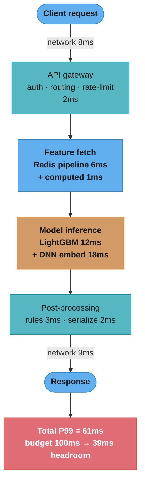
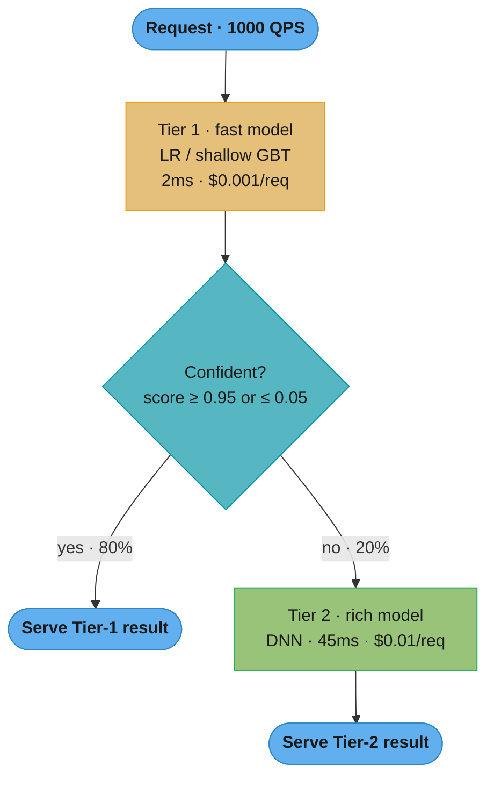
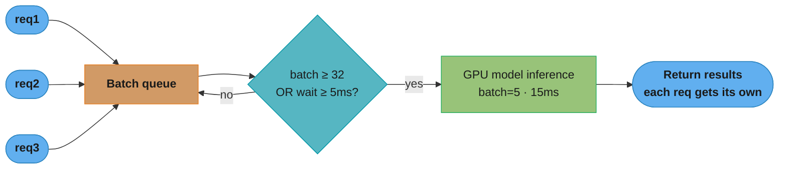
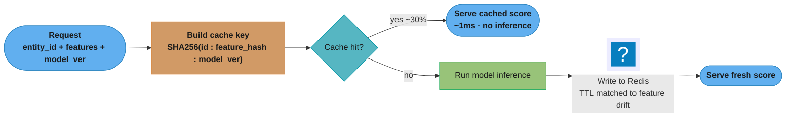
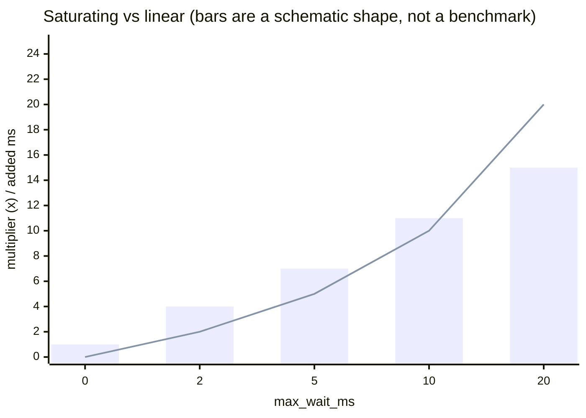

# ML Inference Latency and Throughput Optimization
## 1. Concept Overview

ML inference latency and throughput optimization is the discipline of reducing the time it takes for a model to produce a prediction (latency) and increasing the number of predictions that can be served per unit time (throughput), while maintaining acceptable model quality.

Production ML serving faces a fundamental tension: the most accurate models are often the largest and slowest (deep neural networks with hundreds of millions of parameters), while the most demanding serving requirements call for sub-100ms P99 latency at tens of thousands of QPS. Bridging this gap requires a layered optimization strategy applied at model, hardware, and system levels.

Key dimensions:
- Latency: the time from receiving a request to returning a prediction. The P99 (99th percentile) is the critical metric — average latency can be good while tail latency is catastrophic.
- Throughput: predictions per second that a single server or cluster can sustain. Governed by parallelism, batching, and hardware utilization.
- Cost: GPU/CPU hours per million predictions. Optimization reduces cost while maintaining quality.

---

## 2. Intuition

One-line analogy: optimizing ML inference is like optimizing a restaurant kitchen — you can use faster chefs (better hardware), prepare ingredients in advance (precomputation and caching), cook multiple orders simultaneously (batching), or use a simpler recipe that tastes almost as good (model compression).

Mental model: think of the prediction pipeline as a chain of stages, each with its own latency contribution. The total latency is the sum of all stage latencies. Optimize the slowest stage first (Amdahl's Law). Common stages: network, feature fetch, model inference, post-processing. Model inference is usually the largest contributor and the most optimizable.

Key insight: INT8 post-training quantization cuts FP32 weight memory by exactly 4x, and on hardware that has INT8 tensor cores (or AVX-512 VNNI / AMX on CPU) it typically buys 2-4x throughput. Reported quality loss is often under 1% on classification and ranking tasks, but that is a per-model measurement, not a guarantee — quantization is cheap to try first, not a universal free multiplier.

---

## 3. Core Principles

**Measure before optimizing**: profile the complete request path to identify the actual bottleneck. Optimizing model inference when the bottleneck is feature fetching from Redis wastes engineering time.

**Latency budget decomposition**: allocate a P99 budget to each pipeline stage before optimizing. Every stage must meet its budget individually; no stage can borrow from another at P99.

**Hardware-software co-design**: choose the optimization technique based on the serving hardware. INT8 quantization yields roughly 2-4x speedup only where the silicon has INT8 math units (NVIDIA Turing tensor cores onward, or AVX-512 VNNI / AMX on Intel CPUs); on hardware without them the dequantize-then-compute path can be no faster than FP16, and sometimes slower.

**Quality-efficiency tradeoff**: every optimization reduces some combination of accuracy, latency, cost, or complexity. Quantify the quality loss before deploying any compression technique.

**Caching as the first optimization**: before optimizing the model itself, check if predictions can be cached. Static user segments, popular items, and repeated queries are all candidates for prediction caching.

---

## 4. Types / Architectures / Strategies

### Optimization Technique Taxonomy

All multipliers below are ranges commonly reported for mid-size DNN and GBT serving, not
guarantees: every one is conditional on the model, the batch size, and the hardware, and
must be re-measured on your own workload before it is budgeted for.

| Technique | Latency Reduction | Memory Reduction | Quality Loss | Complexity |
|-----------|-----------------|----------------|-------------|-----------|
| Request batching | 2-10x throughput, only when arrivals fill batches | None | None | Low |
| Quantization (INT8) | 2-4x on INT8-capable hardware; ~1x without | 4x (FP32 → INT8) | often <1%, task-dependent | Medium |
| Quantization (INT4) | Weight-only; helps memory-bound decode, no INT4 tensor cores after Ampere | 8x | 1-3% | Medium |
| Model pruning (unstructured) | Minimal without sparse hardware | 2-10x | 1-5% | High |
| Model pruning (structured) | 2-4x | 2-4x | 1-5% | High |
| Knowledge distillation | Scales with how much smaller you make the student; DistilBERT's published point is 1.6x faster | Same ratio as the student; DistilBERT is 40% smaller | ~3% at DistilBERT's ratio (97% of BERT-base GLUE); rises as the ratio grows | High |
| ONNX export | 1.3-2x | None | None | Low |
| TensorRT optimization | 2-8x (GPU) | 1.5-2x | <1% | Medium |
| Feature caching (Redis) | Up to 10x on feature fetch | None (Redis cost) | None | Low |
| Prediction caching | Bounded by hit rate; a miss costs full inference | None (cache cost) | None | Low |
| Model cascade | ~3.5x average cost at an 80/20 split (see §5) | None | None | Medium |
| Precomputation (offline) | Serving becomes a cache lookup | None (storage cost) | Staleness between batch runs | Medium |

### Hardware Selection

| Hardware | Best For | Throughput | Cost |
|----------|---------|-----------|------|
| CPU (general) | Small models (<10M params), interpretable models (GBT) | Low | Low |
| CPU (optimized: Intel Xeon + AVX-512) | LightGBM, ONNX optimized small models | Medium | Low-Medium |
| GPU, entry inference (NVIDIA T4 — AWS g4dn; NVIDIA L4 — AWS g6) | Medium DNN inference, cost-efficient | High | Medium |
| GPU, mid inference (NVIDIA A10G — AWS g5; NVIDIA L40S — AWS g6e) | Large DNN, transformer inference | Very High | Medium-High |
| GPU, training-class (NVIDIA A100 — AWS p4d; H100 — p5; H200 — p5e; B200 — p6) | Very large models, high-throughput batch | Highest | High |
| Custom ASIC (Google TPU, AWS Inferentia) | Transformer-heavy workloads, high volume | Very High | Low at scale |

Generations matter for what optimizations are even available: INT4 tensor-core math exists
on Turing and Ampere but not on Hopper or Blackwell, which trade it for FP8 (and FP4 on
Blackwell). Check the target device's supported precisions before planning a quantization
strategy around them.

---

## 5. Architecture Diagrams

### Latency Budget Decomposition (P99 = 100ms)


```mermaid
flowchart TD
    classDef io      fill:#61afef,stroke:#2e86c1,color:#1a1a1a,font-weight:bold
    classDef frozen  fill:#c678dd,stroke:#9b59b6,color:#fff
    classDef train   fill:#98c379,stroke:#27ae60,color:#1a1a1a
    classDef mathOp  fill:#d19a66,stroke:#e67e22,color:#1a1a1a,font-weight:bold
    classDef lossN   fill:#e06c75,stroke:#c0392b,color:#fff,font-weight:bold
    classDef req     fill:#56b6c2,stroke:#0097a7,color:#1a1a1a
    classDef base    fill:#e5c07b,stroke:#f39c12,color:#1a1a1a

    client([Client request]) -->|"network 8ms"| gw["API gateway\nauth · routing · rate-limit\n2ms"]
    gw --> feat["Feature fetch\nRedis pipeline 6ms\n+ computed 1ms"]
    feat --> inf["Model inference\nLightGBM 12ms\n+ DNN embed 18ms"]
    inf --> post["Post-processing\nrules 3ms · serialize 2ms"]
    post -->|"network 9ms"| resp([Response])
    resp --> total["Total P99 = 61ms\nbudget 100ms → 39ms headroom"]

    class client,resp io
    class gw req
    class feat io
    class inf mathOp
    class post req
    class total lossN
```

Total latency is the sum of stage latencies (8 + 2 + 7 + 30 + 5 + 9 = 61ms), so per Amdahl's Law you optimize the largest stage first — here model inference (30ms of 61ms). Each stage must meet its own P99 budget; none can borrow slack from another at the tail.

**What this actually says.** "Latency adds up, but a tail does not — fan a request out across enough backends and the one-in-a-hundred slow call becomes the ordinary case."

This is the arithmetic behind the rule that no stage may borrow slack from another. A sum of means is still a mean, so budgets add cleanly at P50. Tails compose multiplicatively instead, and the multiplication runs against you.

| Symbol | What it is |
|--------|------------|
| `P99` | The latency 1 request in 100 exceeds. A threshold, not an average — it cannot be summed |
| `q` | Probability one call exceeds its P99. By definition `q = 0.01` |
| `N` | Fan-out width: parallel calls a single user request spawns |
| `(1 - q)^N` | Chance **all** `N` calls stay fast. Requires independence between calls |
| `1 - (1 - q)^N` | Chance the user hits at least one slow call — the number that reaches the user |

**Walk one example.** Every backend call meets a clean 20ms P99, and the user waits for the slowest:

```
  N =   1 call  : P(all fast) = 0.99^1   = 0.990  ->  1.0% of requests are slow
  N =   5 calls : P(all fast) = 0.99^5   = 0.951  ->  4.9% of requests are slow
  N =  10 calls : P(all fast) = 0.99^10  = 0.904  ->  9.6% of requests are slow
  N = 100 calls : P(all fast) = 0.99^100 = 0.366  -> 63.4% of requests are slow
  N = 200 calls : P(all fast) = 0.99^200 = 0.134  -> 86.6% of requests are slow

  At N = 100, a "1-in-100" event is happening to nearly two requests in three.
  Every backend is meeting its SLO. The user experience is still broken.

  To hold a 1% request-level tail at N = 100, each call needs a p99.99:
      0.9999^100 = 0.9900   ->  1.0% of requests slow    <- four nines per call
```

**The practical rule this forces.** Per-service SLOs must be set a percentile *deeper* than the one you promise the user, and how much deeper is set by the fan-out width, not by taste. A team that promises a 100ms P99 to users and then asks each of 100 backends for a 100ms P99 has promised something arithmetically impossible. The two escapes are to shrink `N` (batch the 100 calls into one, which is exactly what the batching section does) or to stop waiting for all of them — hedged requests, or returning partial results once 95 of 100 candidates are back.

### Model Cascade Architecture


```mermaid
flowchart TD
    classDef io      fill:#61afef,stroke:#2e86c1,color:#1a1a1a,font-weight:bold
    classDef frozen  fill:#c678dd,stroke:#9b59b6,color:#fff
    classDef train   fill:#98c379,stroke:#27ae60,color:#1a1a1a
    classDef mathOp  fill:#d19a66,stroke:#e67e22,color:#1a1a1a,font-weight:bold
    classDef lossN   fill:#e06c75,stroke:#c0392b,color:#fff,font-weight:bold
    classDef req     fill:#56b6c2,stroke:#0097a7,color:#1a1a1a
    classDef base    fill:#e5c07b,stroke:#f39c12,color:#1a1a1a

    req([Request · 1000 QPS]) --> t1["Tier 1 · fast model\nLR / shallow GBT\n2ms · $0.001/req"]
    t1 --> conf{"Confident?\nscore ≥ 0.95 or ≤ 0.05"}
    conf -->|"yes · 80%"| serve1(["Serve Tier-1 result"])
    conf -->|"no · 20%"| t2["Tier 2 · rich model\nDNN · 45ms · $0.01/req"]
    t2 --> serve2(["Serve Tier-2 result"])

    class req io
    class t1 base
    class conf req
    class t2 train
    class serve1,serve2 io
```

Routing only the uncertain 20% to the DNN gives an effective cost of 0.8·$0.001 + 0.2·$0.01 = $0.0028/req (72% cheaper than DNN-only) and an average latency of 0.8·2ms + 0.2·47ms ≈ 11ms (versus 45ms for DNN-only), while keeping the expensive model's quality on the hard cases.

### Dynamic Batching


```mermaid
flowchart LR
    classDef io      fill:#61afef,stroke:#2e86c1,color:#1a1a1a,font-weight:bold
    classDef frozen  fill:#c678dd,stroke:#9b59b6,color:#fff
    classDef train   fill:#98c379,stroke:#27ae60,color:#1a1a1a
    classDef mathOp  fill:#d19a66,stroke:#e67e22,color:#1a1a1a,font-weight:bold
    classDef lossN   fill:#e06c75,stroke:#c0392b,color:#fff,font-weight:bold
    classDef req     fill:#56b6c2,stroke:#0097a7,color:#1a1a1a
    classDef base    fill:#e5c07b,stroke:#f39c12,color:#1a1a1a

    r1([req1]) --> q["Batch queue"]
    r2([req2]) --> q
    r3([req3]) --> q
    q --> fire{"batch ≥ 32\nOR wait ≥ 5ms?"}
    fire -->|"no"| q
    fire -->|"yes"| gpu["GPU model inference\nbatch=5 · 15ms"]
    gpu --> ret(["Return results\neach req gets its own"])

    class r1,r2,r3,ret io
    class q mathOp
    class fire req
    class gpu train
```

Firing on size-or-timeout keeps the tail bounded — the oldest request waits at most max_wait (5ms) before its batch fires. The `batch=5` in the GPU node is deliberately the **timeout path**, not the size path: only 5 requests had arrived when the 5ms timer expired, so the batch fires short of the 32-request trigger. That is the common case at moderate QPS and the one worth doing the arithmetic on. Unbatched, each request costs 15ms end to end, so one worker sustains `1 / 0.015 = 67 req/s`. Batched, five requests share one 15ms GPU pass and wait up to 5ms first, so the batch completes in 20ms and the worker sustains `5 / 0.020 = 250 req/s` — **3.7x throughput for 5ms of added tail**, and both figures are exact given the stated 15ms pass. (Deliberately no GPU-utilization percentages here: they depend on the model's arithmetic intensity and the GPU, and the throughput ratio is the number you can actually check.)

**In plain terms.** "Throughput is not a dial you turn. It is whatever falls out of how many requests you keep in flight divided by how long each one takes."

That is Little's Law, `QPS = concurrency / latency`, and it explains why batching is the highest-leverage serving optimization there is: it raises the numerator without touching the denominator much, because a GPU processes 32 rows in roughly the time it processes one.

| Symbol | What it is |
|--------|------------|
| `concurrency` | Requests in flight simultaneously. For a batching server, the batch size |
| `latency` | Seconds each request takes end to end — **including** its time queued |
| `QPS = concurrency / latency` | Little's Law. Fix any two and the third is no longer yours to choose |
| `max_wait` | Queue time a request tolerates before its batch fires. Added latency, pure cost |
| `max_batch_size` | Ceiling on concurrency, and the other trigger that can fire a batch |

**Walk one example.** The 67 to 250 req/s jump in the diagram above falls straight out of the law:

```
  Unbatched: one request at a time, 15ms of inference
      concurrency = 1
      latency     = 0.015 s
      QPS = 1 / 0.015 = 66.7 req/s              <- the "67" above

  Batched: 5 requests share one 15ms forward pass, after a 5ms wait
      concurrency = 5
      latency     = 0.015 + 0.005 = 0.020 s
      QPS = 5 / 0.020 = 250 req/s               <- the "250" above

  throughput  x3.75          latency  15ms -> 20ms  (+33%)
```

Now push only the batch size, leaving `max_wait` alone:

```
  batch = 32, same 15ms pass, same 5ms wait
      QPS = 32 / 0.020 = 1,600 req/s            <- 24x the unbatched rate
      latency still 0.020 s                     <- unchanged
```

**Why the two knobs are not symmetric.** Concurrency is nearly free — the GPU was idle across most of its cores anyway, so rows 2 through 32 ride along inside the same 15ms. `max_wait` is never free: every millisecond of it lands directly on the P99 of whichever request arrived first. So raise `max_batch_size` aggressively and `max_wait` grudgingly. The Section 8 batching table shows exactly this shape — throughput gain flattens out past 5ms of wait while the P99 penalty keeps tracking `max_wait` almost 1:1 — which is where the "cap max_wait at 20% of the P99 budget" rule comes from. The catch is that `max_batch_size` only delivers concurrency if requests actually arrive fast enough to fill it, which is why the same configuration that gives 24x at high QPS gives pure added latency at low QPS.

### Prediction Caching Path


```mermaid
flowchart LR
    classDef io      fill:#61afef,stroke:#2e86c1,color:#1a1a1a,font-weight:bold
    classDef frozen  fill:#c678dd,stroke:#9b59b6,color:#fff
    classDef train   fill:#98c379,stroke:#27ae60,color:#1a1a1a
    classDef mathOp  fill:#d19a66,stroke:#e67e22,color:#1a1a1a,font-weight:bold
    classDef lossN   fill:#e06c75,stroke:#c0392b,color:#fff,font-weight:bold
    classDef req     fill:#56b6c2,stroke:#0097a7,color:#1a1a1a
    classDef base    fill:#e5c07b,stroke:#f39c12,color:#1a1a1a

    req([Request\nentity_id + features + model_ver]) --> key["Build cache key\nSHA256(id : feature_hash : model_ver)"]
    key --> look{"Cache hit?"}
    look -->|"yes ~30%"| hit(["Serve cached score\n~1ms · no inference"])
    look -->|"no"| model["Run model inference"]
    model --> store
    store@{ icon: "logos:redis", form: "square", label: "Write to Redis\nTTL matched to feature drift", pos: "b", h: 44 }
    store --> out(["Serve fresh score"])

    class req,hit,out io
    class key mathOp
    class look req
    class model train
```

Folding feature_hash and model_ver into the key means stale features or a new model version naturally miss the cache — the fix for the poisoning failure where a user's risk spikes but a cached low-risk score keeps being served.

### Batching Tradeoff: Throughput vs Latency


```mermaid
xychart-beta
    title "Saturating vs linear (bars are a schematic shape, not a benchmark)"
    x-axis "max_wait_ms" [0, 2, 5, 10, 20]
    y-axis "multiplier (x)  /  added ms" 0 --> 25
    bar [1, 4, 7, 11, 15]
    line [0, 2, 5, 10, 20]
```

Read the two series differently, because only one of them is a real quantity. The **line** is exact by construction: added P99 latency equals `max_wait`, since that is the longest a request can sit in the queue. The **bars** are a schematic of the *shape* — throughput saturates — and the specific multipliers are not attributable to any benchmark; the real values depend on arrival rate, model, and batch-size cap, so measure them on your own service. What the picture is for is the divergence: a saturating curve crossed with a linear one, which is why `max_wait` should be capped near 20% of the P99 budget. Beyond the knee you buy latency without buying throughput.

---

## 6. How It Works — Detailed Mechanics

### Dynamic Batching Server

```python
from __future__ import annotations

import asyncio
import time
import threading
from dataclasses import dataclass, field
from typing import Any, Callable

import numpy as np
import lightgbm as lgb


@dataclass
class PendingRequest:
    request_id: str
    features: np.ndarray
    future: asyncio.Future
    enqueue_time: float = field(default_factory=time.perf_counter)


class DynamicBatchingServer:
    """
    Accumulates incoming requests into batches for efficient GPU/CPU inference.
    Fires the batch when max_batch_size is reached or max_wait_ms expires.

    This is the core pattern used by Triton Inference Server, TorchServe,
    and TF Serving for high-throughput ML serving.
    """

    def __init__(
        self,
        model: lgb.Booster,
        max_batch_size: int = 32,
        max_wait_ms: float = 5.0,
    ) -> None:
        self._model = model
        self._max_batch_size = max_batch_size
        self._max_wait_ms = max_wait_ms
        self._queue: list[PendingRequest] = []
        self._lock = threading.Lock()
        self._loop: asyncio.AbstractEventLoop | None = None

        # Start background batch processor
        self._processor_thread = threading.Thread(
            target=self._batch_processor_loop, daemon=True
        )
        self._processor_thread.start()

    async def predict(self, request_id: str, features: np.ndarray) -> np.ndarray:
        """
        Async interface: enqueue request, await result.
        Request is batched with other concurrent requests.
        """
        if self._loop is None:
            # Cache the loop on first call: get_running_loop() is only valid
            # from inside the running loop, so it cannot be fetched in __init__.
            self._loop = asyncio.get_running_loop()

        future: asyncio.Future = self._loop.create_future()
        pending = PendingRequest(
            request_id=request_id,
            features=features,
            future=future,
        )

        with self._lock:
            self._queue.append(pending)

        return await future

    def _batch_processor_loop(self) -> None:
        """Background thread: collect requests and fire batches."""
        while True:
            time.sleep(self._max_wait_ms / 1000 / 2)   # poll at 2x max_wait

            with self._lock:
                if not self._queue:
                    continue

                now = time.perf_counter()
                oldest_age_ms = (now - self._queue[0].enqueue_time) * 1000

                # Fire batch if: max size reached OR oldest request has waited too long
                should_fire = (
                    len(self._queue) >= self._max_batch_size
                    or oldest_age_ms >= self._max_wait_ms
                )

                if not should_fire:
                    continue

                # Take up to max_batch_size requests
                batch = self._queue[:self._max_batch_size]
                self._queue = self._queue[self._max_batch_size:]

            self._process_batch(batch)

    def _process_batch(self, batch: list[PendingRequest]) -> None:
        """Run inference on a batch and resolve futures."""
        t_start = time.perf_counter()

        # Stack features into a single matrix
        feature_matrix = np.vstack([req.features for req in batch])

        try:
            scores = self._model.predict(feature_matrix)
            t_inference = time.perf_counter()
            inference_ms = (t_inference - t_start) * 1000

            # Resolve each future with its result
            if self._loop:
                for i, req in enumerate(batch):
                    result = scores[i]
                    self._loop.call_soon_threadsafe(
                        req.future.set_result, result
                    )

        except Exception as exc:
            if self._loop:
                for req in batch:
                    self._loop.call_soon_threadsafe(
                        req.future.set_exception, exc
                    )


class BatchingMetrics:
    """Track batching efficiency metrics."""

    def __init__(self) -> None:
        self._batch_sizes: list[int] = []
        self._wait_times_ms: list[float] = []
        self._inference_times_ms: list[float] = []

    def record(
        self, batch_size: int, wait_ms: float, inference_ms: float
    ) -> None:
        self._batch_sizes.append(batch_size)
        self._wait_times_ms.append(wait_ms)
        self._inference_times_ms.append(inference_ms)

    def summary(self) -> dict[str, float]:
        if not self._batch_sizes:
            return {}
        return {
            "mean_batch_size": float(np.mean(self._batch_sizes)),
            "p50_batch_size": float(np.percentile(self._batch_sizes, 50)),
            "gpu_utilization_proxy": float(np.mean(self._batch_sizes)) / 32,  # vs max_batch
            "p99_wait_ms": float(np.percentile(self._wait_times_ms, 99)),
            "p99_inference_ms": float(np.percentile(self._inference_times_ms, 99)),
        }
```

### Latency Profiling

```python
import time
import contextlib
from collections import defaultdict
from typing import Generator

import numpy as np


class LatencyProfiler:
    """
    Profiles latency of each stage in the prediction pipeline.
    Emits P50, P95, P99 per stage for monitoring and optimization.

    Usage:
        profiler = LatencyProfiler()
        with profiler.measure("feature_fetch"):
            features = store.get_online_features(entity_rows, feature_refs)
        with profiler.measure("model_inference"):
            scores = model.predict(features)
        profiler.emit_metrics()
    """

    def __init__(self) -> None:
        self._timings: dict[str, list[float]] = defaultdict(list)

    @contextlib.contextmanager
    def measure(self, stage_name: str) -> Generator[None, None, None]:
        start = time.perf_counter()
        try:
            yield
        finally:
            elapsed_ms = (time.perf_counter() - start) * 1000
            self._timings[stage_name].append(elapsed_ms)

    def get_percentiles(self, stage_name: str) -> dict[str, float]:
        timings = self._timings.get(stage_name, [])
        if not timings:
            return {}
        arr = np.array(timings)
        return {
            "p50_ms": float(np.percentile(arr, 50)),
            "p95_ms": float(np.percentile(arr, 95)),
            "p99_ms": float(np.percentile(arr, 99)),
            "mean_ms": float(np.mean(arr)),
            "count": len(timings),
        }

    def emit_metrics(self) -> dict[str, dict[str, float]]:
        """Return all stage metrics for emission to Prometheus / DataDog."""
        return {stage: self.get_percentiles(stage) for stage in self._timings}

    def identify_bottleneck(self) -> str:
        """Returns the stage with the highest P99 latency."""
        if not self._timings:
            return "no_data"
        return max(self._timings.keys(),
                   key=lambda s: np.percentile(self._timings[s], 99))


def profile_prediction_pipeline(
    user_id: str,
    item_ids: list[str],
    feature_store,
    model: lgb.Booster,
    profiler: LatencyProfiler,
) -> list[float]:
    """Example: fully profiled prediction pipeline."""

    with profiler.measure("feature_fetch"):
        features = feature_store.get_online_features(
            [{"user_id": user_id}], item_ids
        )

    with profiler.measure("feature_assembly"):
        feature_matrix = np.array([[f["value"] for f in row] for row in features])

    with profiler.measure("model_inference"):
        scores = model.predict(feature_matrix)

    with profiler.measure("post_processing"):
        # Sort and apply business rules
        ranked_indices = np.argsort(scores)[::-1]
        final_scores = [float(scores[i]) for i in ranked_indices]

    return final_scores
```

### Model Cascade Implementation

```python
from __future__ import annotations

import numpy as np
import lightgbm as lgb
from dataclasses import dataclass
from typing import Optional


@dataclass
class CascadeResult:
    score: float
    tier_used: int          # 1 = cheap model, 2 = expensive model
    tier1_score: float
    was_uncertain: bool


class ModelCascade:
    """
    Two-tier model cascade:
    - Tier 1: fast, cheap model (LR or shallow GBT)
    - Tier 2: slow, expensive model (deep GBT or DNN)

    Routes requests to Tier 2 only when Tier 1 is uncertain.
    Reduces average latency and cost while maintaining Tier 2 quality
    for difficult cases.

    Design parameters:
    - high_confidence_threshold: if score > this, serve Tier 1 result
    - low_confidence_threshold: if score < this, serve Tier 1 result
    - Uncertain range (high, low) → escalate to Tier 2
    """

    def __init__(
        self,
        tier1_model: lgb.Booster,
        tier2_model: lgb.Booster,
        high_confidence_threshold: float = 0.85,
        low_confidence_threshold: float = 0.15,
    ) -> None:
        self._tier1 = tier1_model
        self._tier2 = tier2_model
        self._high_threshold = high_confidence_threshold
        self._low_threshold = low_confidence_threshold

        # Track routing stats for monitoring
        self._tier1_count = 0
        self._tier2_count = 0

    def predict(
        self,
        features_tier1: np.ndarray,
        features_tier2: Optional[np.ndarray] = None,
    ) -> CascadeResult:
        """
        Route a single request through the cascade.

        Args:
            features_tier1: lightweight feature set for Tier 1 model
            features_tier2: full feature set for Tier 2 model (fetched lazily)
        """
        # Always run Tier 1 (fast)
        tier1_score = float(self._tier1.predict(features_tier1.reshape(1, -1))[0])
        self._tier1_count += 1

        # Check if Tier 1 is confident enough to serve directly
        is_certain = (
            tier1_score > self._high_threshold
            or tier1_score < self._low_threshold
        )

        if is_certain:
            return CascadeResult(
                score=tier1_score,
                tier_used=1,
                tier1_score=tier1_score,
                was_uncertain=False,
            )

        # Uncertain: escalate to Tier 2
        self._tier2_count += 1
        if features_tier2 is None:
            # Tier 2 features not pre-fetched — use Tier 1 result as fallback
            return CascadeResult(
                score=tier1_score,
                tier_used=1,
                tier1_score=tier1_score,
                was_uncertain=True,
            )

        tier2_score = float(self._tier2.predict(features_tier2.reshape(1, -1))[0])
        return CascadeResult(
            score=tier2_score,
            tier_used=2,
            tier1_score=tier1_score,
            was_uncertain=True,
        )

    def routing_stats(self) -> dict[str, float]:
        total = self._tier1_count + self._tier2_count
        return {
            "tier1_fraction": self._tier1_count / max(total, 1),
            "tier2_fraction": self._tier2_count / max(total, 1),
            "total_requests": total,
        }

    def calibrate_thresholds(
        self,
        X_val: np.ndarray,
        y_val: np.ndarray,
        X_val_full: np.ndarray,
        target_tier2_fraction: float = 0.20,
    ) -> tuple[float, float]:
        """
        Find thresholds that route target_tier2_fraction to Tier 2.
        Uses validation set.
        """
        tier1_scores = self._tier1.predict(X_val)

        # Find symmetric thresholds around 0.5 that give target_tier2_fraction
        # in the uncertain middle region
        sorted_distances = np.sort(np.abs(tier1_scores - 0.5))
        cutoff_idx = int(target_tier2_fraction * len(sorted_distances))
        if cutoff_idx == 0:
            return (0.95, 0.05)
        distance_threshold = sorted_distances[cutoff_idx]

        high_thresh = min(0.95, 0.5 + distance_threshold)
        low_thresh = max(0.05, 0.5 - distance_threshold)

        return (high_thresh, low_thresh)
```

### Prediction Caching

```python
import hashlib
import json
import time
import redis
from typing import Any, Optional


class PredictionCache:
    """
    Cache model predictions with TTL.
    Appropriate when:
    - The same entity appears repeatedly in a short window
    - Feature values do not change faster than the TTL
    - The cost of prediction is high relative to cache cost

    Common patterns:
    - Item popularity scores: cache for 60 minutes (items don't change fast)
    - User segment scores: cache for 5 minutes (user context changes)
    - Ad quality scores: cache for 30 minutes (ad content stable)
    """

    def __init__(
        self,
        redis_client: redis.Redis,
        default_ttl_seconds: int = 300,
        namespace: str = "pred_cache",
    ) -> None:
        self._redis = redis_client
        self._default_ttl = default_ttl_seconds
        self._namespace = namespace
        self._hits = 0
        self._misses = 0

    def get(self, cache_key: str) -> Optional[float]:
        """Return cached prediction or None on cache miss."""
        raw = self._redis.get(f"{self._namespace}:{cache_key}")
        if raw is not None:
            self._hits += 1
            return float(raw)
        self._misses += 1
        return None

    def set(
        self,
        cache_key: str,
        score: float,
        ttl_seconds: Optional[int] = None,
    ) -> None:
        """Cache a prediction score with TTL."""
        ttl = ttl_seconds if ttl_seconds is not None else self._default_ttl
        self._redis.set(
            f"{self._namespace}:{cache_key}",
            str(score),
            ex=ttl,
        )

    def build_key(self, entity_id: str, feature_hash: str, model_version: str) -> str:
        """
        Build a cache key that invalidates when features or model changes.
        Including feature_hash ensures stale features don't return stale predictions.
        """
        raw_key = f"{entity_id}:{feature_hash}:{model_version}"
        return hashlib.sha256(raw_key.encode()).hexdigest()[:16]

    def hit_rate(self) -> float:
        total = self._hits + self._misses
        return self._hits / total if total > 0 else 0.0


def compute_feature_hash(features: dict[str, Any]) -> str:
    """Stable hash of feature values for cache key construction."""
    # Sort to ensure determinism
    serialized = json.dumps(features, sort_keys=True)
    return hashlib.md5(serialized.encode()).hexdigest()[:8]
```

### GPU vs CPU Break-Even Analysis

```python
from dataclasses import dataclass


@dataclass
class InfrastructureCostModel:
    # Hardware costs (hourly). Anchor these to a real rate card, not to memory:
    # AWS us-east-1 on-demand, checked 2026-07: c6i.xlarge (4 vCPU) $0.17/hr,
    # g4dn.xlarge (1x T4, 4 vCPU) $0.526/hr.
    cpu_cost_per_hour: float
    gpu_cost_per_hour: float

    # Throughput at 70% utilization
    cpu_throughput_qps: int        # requests per second on CPU
    gpu_throughput_qps: int        # requests per second on GPU

    # Quality: GPU model may have higher AUC -> higher revenue per prediction
    gpu_revenue_lift_per_request: float  # e.g. $0.002 additional revenue per req


def compute_break_even(model: InfrastructureCostModel) -> dict[str, float]:
    """
    Compare cost per 1M requests for CPU vs GPU serving.
    Factor in quality-driven revenue difference.
    """
    # CPU: cost per 1M requests
    cpu_seconds_per_1m = 1_000_000 / model.cpu_throughput_qps
    cpu_cost_per_1m = (cpu_seconds_per_1m / 3600) * model.cpu_cost_per_hour

    # GPU: cost per 1M requests
    gpu_seconds_per_1m = 1_000_000 / model.gpu_throughput_qps
    gpu_cost_per_1m = (gpu_seconds_per_1m / 3600) * model.gpu_cost_per_hour

    # GPU quality lift: additional revenue per 1M requests
    gpu_revenue_lift_per_1m = model.gpu_revenue_lift_per_request * 1_000_000

    # GPU net cost = serving cost - revenue lift
    gpu_net_cost_per_1m = gpu_cost_per_1m - gpu_revenue_lift_per_1m

    return {
        "cpu_cost_per_1m_usd": cpu_cost_per_1m,
        "gpu_serving_cost_per_1m_usd": gpu_cost_per_1m,
        "gpu_revenue_lift_per_1m_usd": gpu_revenue_lift_per_1m,
        "gpu_net_cost_per_1m_usd": gpu_net_cost_per_1m,
        "gpu_vs_cpu_cost_ratio": gpu_cost_per_1m / max(cpu_cost_per_1m, 1e-8),
        "gpu_justified": gpu_net_cost_per_1m < cpu_cost_per_1m,
    }


# Example: LightGBM (CPU) vs DNN (GPU) for recommendation.
# Throughputs are placeholders — benchmark your own model; only the rates are real.
result = compute_break_even(InfrastructureCostModel(
    cpu_cost_per_hour=0.17,      # c6i.xlarge, 4 vCPU
    gpu_cost_per_hour=0.526,     # g4dn.xlarge, 1x T4
    cpu_throughput_qps=2_000,    # LightGBM on 4 vCPU (measure this)
    gpu_throughput_qps=20_000,   # DNN on T4 with batching (measure this)
    gpu_revenue_lift_per_request=0.00005,  # e.g. a 1% lift on a $5 CPM impression
))
# Output: at FULL load the GPU is ~3.2x cheaper per prediction ($0.0073 vs $0.0236
# per 1M) despite costing 3.1x more per hour, because it serves 10x more. The
# revenue term ($50 per 1M) then dwarfs both serving costs -- the usual shape for a
# revenue-generating model, and the reason quality, not cost, decides these calls.
```

**What it means.** "Cost per prediction is rent divided by output — and an idle GPU pays exactly the same rent as a busy one."

Every term in `compute_break_even` reduces to that one division. The subtlety is that the denominator is the throughput you *actually* drive, not the throughput the hardware is capable of, and those two numbers are usually nothing alike.

| Symbol | What it is |
|--------|------------|
| `$/hr` | Instance rent. Billed whether or not a single request arrives |
| `predictions/hr` | `sustained QPS x 3600`. The rate you really run at, not the benchmark peak |
| `$/hr / predictions/hr` | Cost per prediction — the only figure comparable across CPU and GPU |
| `utilization` | actual QPS / peak QPS. It divides straight into cost per prediction |
| `replicas` | `ceil(target QPS / (per-replica QPS x utilization target))` |

**Walk one example.** Take the two options from the code above at their full rated throughput:

```
                        $/hr     QPS      predictions/hr     cost per 1M predictions
    CPU (c6i.xlarge)    0.170    2,000       7,200,000              $0.0236
    GPU (g4dn.xlarge)   0.526   20,000      72,000,000              $0.0073

  3.1x the rent for 10x the output, so the GPU wins -- at full load.
```

Now send both exactly the same real traffic, 2,000 QPS, and the conclusion inverts:

```
    CPU : 0.170 / 7,200,000  = $0.0236 per 1M      (100% utilized)
    GPU : 0.526 / 7,200,000  = $0.0731 per 1M      ( 10% utilized)

  The GPU is now 3.1x MORE expensive per prediction -- exactly its rent ratio.
  No hardware changed. Only the utilization did.
```

**This is the whole reason "GPU is cheaper at scale" is a conditional, not a fact.** At 10% utilization you are paying for 18 idle GPU-seconds out of every 20, and the cost-per-prediction ratio degrades to the raw rent ratio (3.1x) because the throughput advantage never gets exercised. It also explains why batching and cost are the same conversation: batching is what converts rated throughput into sustained throughput, and sustained throughput is the denominator.

**Sizing the fleet from the same number.** Once cost per prediction is a division, replica count is too:

```
  Per-replica capacity 20,000 QPS, target 100,000 QPS:

    at 100% utilization :  100,000 / 20,000          = 5.00  ->  5 replicas
    at  70% utilization :  100,000 / (20,000 x 0.70) = 7.14  ->  8 replicas
```

The 5-replica answer is a floor, never a plan: it leaves nothing for a rolling deploy, a lost node, or a traffic spike, and it assumes a queue that never forms. A replica held at 100% utilization queues by definition — and queue time is latency, which is the numerator of the very P99 budget you are trying to protect.

---

## 7. Real-World Examples

**Netflix personalization** splits work across offline, nearline, and online layers: expensive computation (candidate generation, model training) runs offline and lands in a fast store, a nearline layer reacts to events between the two, and only the cheapest, most context-dependent work — final ranking and filtering — happens on the request path. That split, described in Netflix's "System Architectures for Personalization and Recommendation" (Netflix TechBlog, March 2013), is the canonical statement of "precompute what you can, serve what you must." Netflix has not published a per-stage P99 number for it.

**LinkedIn feed ranking** serves a billion-parameter-class sequential recommender under "a few hundred milliseconds latency and tens of thousands of QPS" (Hertel et al., *An Industrial-Scale Sequential Recommender for LinkedIn Feed Ranking*, arXiv:2602.12354, 2026). Two of their optimizations are worth copying. **Shared-context batching**: rather than one forward pass per candidate, all N candidates for a member (typically N = 512) are scored in a single pass, with a custom attention mask that lets candidate tokens attend to the shared history but not to each other — the paper reports an ~80x speedup on the transformer forward pass at ~500 candidates and history length 1000. **A custom Flash-Attention kernel** for that mask pattern gives a further ~2x over masked PyTorch SDPA. They also report that the biggest wins were not on the GPU at all: member-history parsing went 450ms -> 2ms and sparse-to-dense feature conversion 254ms -> 5ms per feature, on CPU.

**Stripe Radar** assesses "more than 1,000 characteristics of a potential transaction" and returns a decision "in less than 100 milliseconds", incorrectly blocking about 0.1% of legitimate payments (Stripe, *How we built it: Stripe Radar*). Stripe describes an architectural evolution from logistic regression to a Wide-and-Deep XGBoost-plus-DNN hybrid and then, in mid-2022, to a single DNN-only scoring model — notably **not** a confidence-routed cascade. It is a useful counterexample: when the entire budget is 100ms and the model already fits inside it, a cascade adds routing complexity without buying anything.

**Uber DeepETA** is a case of designing the architecture around the serving budget rather than compressing after the fact. Uber states the model "must return an ETA within a few milliseconds at most", so DeepETA uses a *linear* transformer (with K = 40 features and d = 8, the paper contrasts K²d = 12,800 against Kd² = 2,560) and replaces geospatial computation with quantize-then-hash-lookup embeddings that are O(1). It has hundreds of millions of parameters, but "any one prediction touches only a tiny fraction of them, roughly 0.25%" (Uber Engineering, *DeepETA: How Uber Predicts Arrival Times Using Deep Learning*). It is served through Michelangelo, whose 2.0 online prediction service added NVIDIA Triton as a serving engine for latency-sensitive projects. Uber has not published quantization or batching parameters for it.

**Precomputation as the limit case**: where the candidate set per user is small and stable, the whole model can be run offline and the online endpoint reduced to a key-value lookup, which removes inference from the request path entirely. The cost moves to storage and to staleness — the served score is only as fresh as the last batch run, which is why a model deploy must trigger a recompute (see the precomputation pitfall in §10).

---

## 8. Tradeoffs

### Quantization: Quality vs Speed

| Precision | Model Size | Inference Speed | Quality Loss | Hardware Required |
|-----------|-----------|----------------|-------------|-----------------|
| FP32 (baseline) | 1x | 1x | 0% | All |
| FP16 | 0.5x | 1.5-2x | <0.1% | GPU with FP16 (V100+) |
| INT8 | 0.25x | 2-4x | 0.5-1% | CPU AVX-512 VNNI / AMX, or NVIDIA Tensor Cores (Turing+) |
| INT4 | 0.125x | Memory-bound wins only | 1-3% | INT4 tensor cores on Turing/Ampere only; Hopper and Blackwell dropped INT4 for FP8/FP4, so INT4 there is weight-only storage with dequant-to-FP16 math |
| Binary (1-bit) | 0.03x | 10x+ | 5-20% | Specialized hardware |

The INT4 row is the one people get wrong. Weight-only INT4 (GPTQ, AWQ) still helps on
Hopper and Blackwell because it shrinks the weight bytes a memory-bound decode step has to
read — but it is not an INT4 *math* speedup there, because those architectures have no
INT4 tensor-core path. Do not budget an INT4 compute multiplier on an H100.

### Caching: Hit Rate vs Staleness

There is no industry "typical" hit rate — hit rate is a pure function of your request
locality, so derive it instead of looking it up. For a key whose requests arrive as a
Poisson process with mean inter-arrival `m`, a TTL of `T` yields a hit whenever the next
request lands inside the window: `hit_rate = 1 - exp(-T/m)`. The column below is that
formula evaluated at **one stated workload, `m = 10 minutes` per key** — substitute your
own `m` and the numbers move.

| Cache TTL | Hit rate at `m = 10 min` | Staleness Risk | Use For |
|-----------|------------------|---------------|---------|
| 1 minute | `1 - e^-0.1` = 10% | Very Low | Real-time-sensitive predictions |
| 5 minutes | `1 - e^-0.5` = 39% | Low | User segment scores |
| 30 minutes | `1 - e^-3` = 95% | Medium | Item quality scores |
| 24 hours | `1 - e^-144` ≈ 100% | High | Stable entity properties |

The shape is what to take away: hit rate saturates exponentially in `T/m`, so the first
multiple of the inter-arrival time buys most of the win and every TTL extension past
roughly `3m` buys staleness for nothing.

### Batching: Latency vs Throughput

Only the latency columns are derivable in general — added P99 tracks `max_wait` almost
1:1 by construction, because that is the worst case a request waits. The throughput
column has **no** general value: the gain depends on your arrival rate, your model's
batch scaling, and your batch-size cap, so the table gives the shape rather than
multipliers you could quote.

| max_wait_ms | Throughput Gain | P50 Latency Impact | P99 Latency Impact |
|-------------|----------------|-------------------|-------------------|
| 0 (no wait) | 1x (baseline) | 0ms | 0ms |
| 2ms | Rising steeply — batches are still filling | +1ms | +2ms |
| 5ms | Most of the available gain is here | +2ms | +5ms |
| 10ms | Flattening — batches mostly hit the size cap already | +5ms | +10ms |
| 20ms | Saturated; you are buying latency only | +10ms | +20ms |

For a worked example with exact numbers, see the §5 dynamic-batching walkthrough:
5 requests, a 15ms GPU pass and a 5ms timeout give exactly `250 / 67 = 3.7x`. Run that
same arithmetic on your own measured pass time to fill in the column above for your
service.

---

## 9. When to Use / When NOT to Use

### Use dynamic batching when:
- Serving a GPU model where per-request GPU utilization is very low (<5%)
- Throughput is the bottleneck (not single-request latency)
- P99 latency budget has more than 10ms headroom after adding the max_wait
- Multiple concurrent requests arrive within a short time window (high QPS)

### Use model cascade when:
- Serving a mixture of easy and hard prediction tasks (fraud detection, ad ranking)
- The expensive model is 5x+ more costly than the cheap model
- The cheap model has high confidence (score near 0 or 1) for > 60% of requests
- Quality on the uncertain fraction matters more than average latency

### Use prediction caching when:
- The same entity appears multiple times in a short window (high locality)
- Feature values do not change significantly within the cache TTL
- Inference cost is high (GPU-based DNN) and cache storage cost is low (Redis)

### Do NOT use prediction caching when:
- Each request has unique context (time-sensitive features that change every second)
- Model output must reflect the latest features (fraud detection, real-time bidding)
- Cache invalidation logic is complex (risk of serving predictions with stale features)

---

## 10. Common Pitfalls

**Optimizing the wrong bottleneck**: a team spends two weeks optimizing the model inference step (from 20ms to 12ms) but the actual P99 is 150ms because the feature fetch from a poorly configured Redis client takes 80ms (no connection pooling, no pipeline). The overall P99 barely improves. Fix: profile the complete pipeline with real traffic before optimizing any component. Build a latency breakdown dashboard that shows P99 per stage in production.

**Dynamic batching adding tail latency**: a team enables batching with max_wait=50ms to maximize GPU throughput. Throughput improves 10x. But P99 latency increases from 30ms to 85ms (30ms inference + 50ms wait for slow batches). The SLA of 100ms P99 is now marginal. Fix: set max_wait to at most 20% of the total P99 budget. Monitor P99 latency per stage separately from throughput.

**Cache poisoning from stale features**: prediction caching with a 5-minute TTL. A user's fraud risk feature spikes (they just failed 3 payment verifications). A cached low-risk prediction is served for the next 5 minutes, allowing fraudulent transactions. Fix: design cache keys to include a hash of the features used; when feature values change, the cache key changes and the cache misses, triggering a fresh prediction.

**Quantization reducing quality below the acceptable threshold**: a team applies INT4 quantization to their DNN ranking model, achieving 5x speedup. AUC drops from 0.81 to 0.76 (5 points). The business metric (CTR) drops 8%. They revert. Fix: measure quality impact before deploying quantization in production; use INT8 instead of INT4 for quality-sensitive applications; apply quantization-aware training (QAT) if post-training quantization causes too much quality loss.

**Precomputation invalidation on model updates**: item quality scores are precomputed nightly and cached. A new model version is deployed at 2pm. Requests from 2pm to 3am (until the next batch job) receive stale scores from the old model. The new model's improved accuracy is not visible in production for 13 hours. Fix: trigger a batch precomputation job as part of the model deployment pipeline; or use a flag to fall back to online inference for a fraction of traffic when the model version changes.

---

## 11. Technologies & Tools

| Category | Tool | Notes |
|----------|------|-------|
| Model Serving | Dynamo Triton (Triton Inference Server) | NVIDIA; supports ONNX, TF, PyTorch, TensorRT, Python backends; dynamic batching built-in |
| Model Serving | KServe | Kubernetes CRD serving; standardized inference protocol, canary and autoscale-to-zero built in |
| Model Serving | TF Serving | TensorFlow native; batching; gRPC + REST |
| Model Serving | BentoML | Framework-agnostic; Kubernetes-friendly |
| Model Serving | Ray Serve | Python-first; distributed; handles preprocessing |
| Model Optimization | ONNX | Cross-framework model export format |
| Model Optimization | ONNX Runtime | 1.5-2x CPU speedup via graph optimization |
| Model Optimization | TensorRT | NVIDIA; FP16/INT8/FP8 via explicit quantization — quantize offline with NVIDIA ModelOpt, which inserts Q/DQ nodes into the ONNX graph, then build a strongly-typed engine |
| Model Optimization | Intel Neural Compressor | INT8/INT4 quantization; CPU-focused |
| ANN Search | FAISS | Meta; CPU + GPU; IVF, HNSW indexing |
| ANN Search | ScaNN | Google; competitive throughput at high recall on large datasets |
| Caching | Redis | Online feature and prediction caching |
| Caching | Memcached | Simpler than Redis; prediction-only caching |
| Profiling | py-spy | Python profiling without code changes |
| Profiling | NVIDIA Nsight | GPU kernel profiling |
| Profiling | line_profiler | Line-level Python timing |
| Monitoring | Prometheus + Grafana | Latency histograms, GPU utilization |
| Monitoring | DataDog | APM, infrastructure, ML model monitoring |

---

## 12. Interview Questions with Answers

**Q: How do you decompose a P99 latency budget for an ML serving system?**
**Short:** Measure real per-stage P99 in production first, then allocate budget proportionally to each stage's optimization flexibility.
Measure the actual P99 end-to-end in production first, then attribute it stage by stage before allocating any budget. The stages to split it across are: network (client to server), API gateway overhead, feature fetch (Redis), model inference, post-processing, response serialization, and return network. Use distributed tracing (OpenTelemetry, Jaeger) or stage-level metrics to get per-stage P99. Allocate budget proportionally to each stage's flexibility — model inference is most flexible (optimization levers include quantization, distillation, cascade), feature fetch is moderately flexible (Redis batching, connection pooling), and network is mostly fixed. A typical budget for P99 = 100ms: network (20ms), feature fetch (15ms), model inference (40ms), post-processing (10ms), overhead (15ms).

**Q: Why is P99 tail latency, not average latency, the metric that matters for ML serving?**
**Short:** One request often fans out into many parallel calls, so the slowest of them, not the average, sets the user-perceived latency.
P99 is what matters because one user request usually fans out into many parallel model calls, and the slowest of them determines the user-perceived latency. With 100 parallel calls, the request finishes at the max of 100 draws, so a 1-in-100 tail event becomes near-certain for every request — an effect the average completely hides. A system with a great mean (20ms) but a fat P99 (300ms) will feel slow to most users under fan-out. Always set SLAs and optimize against P99/P99.9, and provision capacity for the tail rather than the mean.

**Q: What is dynamic batching and how does it improve GPU throughput?**
**Short:** Dynamic batching groups requests so a GPU processes many inputs almost as fast as one, raising utilization from single digits to 50-80%.
Dynamic batching groups multiple incoming requests into a single batch for GPU inference. A GPU is a massively parallel processor — running inference on a batch of 32 takes almost the same time as running inference on 1 request, because all 32 inputs can be processed in parallel across GPU cores. Without batching, GPU utilization is typically 2-5% for a single request. With batching, it reaches 50-80%. The tradeoff: each request must wait for the batch to fill (max_wait_ms) or for max_batch_size requests to accumulate. Setting max_wait_ms = 5ms and max_batch_size = 32 typically increases throughput by 5-10x with a P99 latency increase of < 5ms.

**Q: Why can dynamic batching increase latency instead of reducing it at low QPS?**
**Short:** At low QPS each request waits the full timeout for a batch that never fills, paying the wait cost without the throughput benefit.
At low QPS, requests arrive slower than the batch fills, so each one waits the full max_wait timeout yet still forms only a tiny batch. You pay the wait cost but capture almost none of the throughput benefit, because the GPU stays underutilized regardless of the extra wait. Batching only pays off when the arrival rate is high enough to fill batches before the timeout expires. Mitigate by making max_wait adaptive to load, or by disabling batching below a QPS threshold where single-request inference already meets the SLA.

**Q: Explain the model cascade pattern and when it applies.**
**Short:** A cascade routes requests through increasingly costly models, serving most from a cheap tier and escalating only uncertain cases.
A model cascade routes requests through models of increasing complexity and cost, stopping as soon as a model is confident enough. Tier 1 is a cheap, fast model (logistic regression or shallow GBT, 2ms, $0.001/req). If its score exceeds a high-confidence threshold (e.g., 0.90) or falls below a low-confidence threshold (e.g., 0.10), the result is served. For uncertain scores (middle region), the request escalates to Tier 2 (expensive DNN, 50ms, $0.01/req). In practice, if 80% of requests are handled by Tier 1, the average cost is $0.001*0.8 + $0.01*0.2 = $0.0028 (72% cheaper than DNN-only), and average latency is 0.8*2ms + 0.2*52ms = 12ms (vs 50ms). Applies to: fraud detection, ad quality scoring, content moderation.

**Q: What is quantization in the context of ML inference and what are the tradeoffs?**
**Short:** Quantization lowers weight and activation precision to shrink models and speed inference, trading a small, precision-dependent quality loss.
Quantization reduces the numerical precision of model weights and activations from 32-bit floating point (FP32) to lower precision (FP16, INT8, INT4). Benefits: INT8 reduces model size by 4x, reduces memory bandwidth requirements, and enables 2-4x speedup on hardware with INT8 tensor cores (modern CPUs with AVX-512, NVIDIA Tensor Cores). Quality tradeoffs: FP16 has < 0.1% quality loss and is nearly free; INT8 has 0.5-1% quality loss for most tasks; INT4 has 1-3% quality loss. Post-training quantization (PTQ) applies quantization after training with minimal code changes; quantization-aware training (QAT) simulates quantization during training, achieving better quality at the cost of additional training time.

**Q: How do you choose between CPU and GPU serving for a ranking model?**
**Short:** Choose CPU for small models at low QPS and GPU for large models at high QPS where batching drives utilization up.
Compute the cost per million requests for each option, then factor in quality-driven revenue difference. CPU is preferred when: the model is small (<10M parameters), inference is fast (<5ms on CPU), and QPS is low (<5K). GPU is preferred when: the model is large (>50M parameters), batching can achieve high utilization, and QPS is high (>10K). Break-even analysis: a GPU server might cost 8x more per hour but serve 20x more requests, making it 2.5x cheaper per request at full utilization. Always benchmark both options on production-representative traffic before committing; GPU's advantage disappears at low QPS due to underutilization.

**Q: What is prediction caching and what are the risks of using it?**
**Short:** Prediction caching serves stored outputs for repeated queries, but risks staleness, poisoning, and model-version mismatch.
Prediction caching stores model outputs in a fast key-value store (Redis) and serves cached results for repeated queries without running inference. Useful when the same entity appears frequently (high cache hit rate) and the prediction does not change rapidly. Risks: (1) staleness — cached predictions may reflect outdated feature values; mitigate with appropriate TTL matched to feature update frequency; (2) cache poisoning — if the cache key does not include a feature hash, changes in input features will serve stale predictions; mitigate by including a hash of key features in the cache key; (3) model version mismatch — cached predictions from the old model version may be served after a model update; mitigate by including the model version in the cache key. The hit rate determines whether caching is worthwhile; if < 20%, the overhead exceeds the benefit.

**Q: How does ONNX export improve model serving performance?**
**Short:** ONNX lets a model run under an optimized engine with operator fusion and hardware-specific kernels, typically 1.3-5x faster.
ONNX is a standardized model format that lets a model trained in one framework run under an optimized inference engine such as ONNX Runtime or TensorRT. Models from PyTorch, TensorFlow, or scikit-learn all export to the same graph representation. ONNX Runtime applies graph-level optimizations: operator fusion (combining multiple operations into one kernel), constant folding (precomputing constant expressions), and hardware-specific kernel selection (using AVX-512 on x86 CPUs, CUDA kernels on GPUs). Typical speedups: 1.3-2x on CPU for most models, 2-5x for specific architectures. The key advantage is framework-independence — a model trained in PyTorch can be served via a C++-based ONNX Runtime without the Python overhead.

**Q: How do you reduce feature fetch latency from a Redis-based feature store?**
**Short:** Pipeline requests into one round-trip, pool connections, add a short-lived local cache, and keep serving and Redis in the same zone.
Collapse round-trips first, then remove them: pipelining, pooling, and a local cache attack the fetch in that order of payoff. In detail: (1) pipeline multiple GET commands into a single Redis round-trip — instead of N serial GETs, send all N as one pipeline batch, removing N-1 round-trip overheads, which is by far the largest single win; (2) connection pooling — maintain persistent connections so no request pays TCP (and, with TLS enabled, handshake) setup, worth roughly a millisecond per avoided handshake in-region and far more if connections are being re-established under load; (3) local cache (L1 cache) — keep the hottest features in an in-process dictionary with a short TTL (e.g., 5 seconds), which removes the network hop entirely for those keys; (4) data locality — collocate the serving process and Redis in the same availability zone, since a same-AZ round trip is a fraction of a millisecond while a cross-AZ one is typically sub-millisecond to low single-digit milliseconds, and a cross-region one is tens; (5) shard evenly — hash entity keys so load spreads across Redis shards rather than piling onto a hot shard.

**Q: What is knowledge distillation and when is it appropriate for reducing serving cost?**
**Short:** Distillation trains a small student to mimic a large teacher's soft outputs; DistilBERT's published result is 97% of BERT-base's GLUE score at 40% fewer parameters.
Knowledge distillation trains a small "student" model to mimic the output distribution of a large "teacher" model, rather than training the student directly on hard labels. The student learns from the teacher's soft probabilities (logits), which contain more information than one-hot labels. The one widely reproduced datapoint to quote is DistilBERT: 40% fewer parameters, 60% faster, and 97% of BERT-base's GLUE score, with SQuAD within 3.9 points. Resist generalising that into a ratio law — retention is a function of the compression ratio, the task, and whether the student was itself pretrained, and there is no published curve that holds across tasks. Distil, then measure. Use distillation when: (1) serving cost of the teacher model is prohibitive for the required QPS; (2) INT8 quantization is insufficient (too much quality loss); (3) you have sufficient compute for a one-time distillation training run. Distillation is more expensive to implement than quantization but produces a genuinely smaller, faster model rather than a compressed version of the same architecture.

**Q: How do you design a serving system that handles traffic spikes (10x normal QPS)?**
**Short:** Layer autoscaling, caching, bounded queuing with load shedding, and cascade degradation, since no single defense absorbs a 10x spike alone.
Layer four defences, because no single one absorbs a 10x spike: autoscaling, caching, queuing with load shedding, and cheap-model degradation. In detail: (1) horizontal autoscaling — model servers scale out on CPU/GPU utilization or QPS, but treat it as the slowest lever: the Kubernetes HPA control loop re-evaluates only every 15 seconds by default, scale-down is further damped by a 5-minute stabilization window, and the real lag is pod scheduling plus image pull plus model load on top of that — so pre-provision for known peaks (e.g., Black Friday) rather than trusting the autoscaler to catch them; (2) prediction caching — cached predictions require no model inference; during traffic spikes, the cache hit rate effectively increases the system's capacity; (3) request queuing — a bounded queue in front of the model server absorbs burst; reject requests that exceed queue capacity with a 429 response (fail fast); (4) model cascade — route a higher fraction to the cheap Tier 1 model during traffic spikes by relaxing the confidence thresholds; reduces per-request compute cost; (5) circuit breaker — if model server latency exceeds 2x the SLA, fall back to a simpler model or a cached popular-items list.

**Q: What is speculative decoding and how does it speed up LLM inference?**
**Short:** A small draft model proposes tokens that the large target model verifies in one pass, turning many sequential steps into fewer parallel ones.
Speculative decoding uses a small draft model to propose several tokens at once, which the large target model then verifies in a single parallel forward pass. This turns a strictly sequential decode — one target forward pass per token — into one target pass per accepted *run* of tokens. The target model accepts or rejects each draft token, and a rejection falls back to sampling from the target, which is what makes the scheme distribution-preserving: the output is drawn from the same distribution as unaccelerated target decoding. Leviathan, Kalman and Matias (*Fast Inference from Transformers via Speculative Decoding*, arXiv:2211.17192) report 2x-3x acceleration on T5-XXL with identical outputs; treat that as a setup-specific figure, since the realized speedup is governed by the draft model's acceptance rate on your traffic. The draft model must share the target's vocabulary, and it must be cheap enough that a rejected draft is not wasted work. The win is a latency win at small batch: as batch size grows the target model becomes compute-bound anyway, and the speculative verification overhead can reduce total throughput rather than increase it.

**Q: How do you profile a slow ML serving endpoint in production?**
**Short:** Trace every stage, chart per-stage latency histograms, then profile CPU and GPU code to find and fix the highest-P99 contributor first.
Step 1: add distributed tracing (OpenTelemetry spans) to every network call and model inference call; look at the trace waterfall to identify which stage contributes most to P99. Step 2: emit P50/P95/P99 latency histograms per stage to Prometheus; plot over time to identify regressions. Step 3: use py-spy (sampling profiler, no code changes required) to profile CPU time in the Python serving code; identify Python bottlenecks (JSON serialization, numpy operations, dictionary lookups). Step 4: for GPU bottlenecks, use NVIDIA Nsight or torch.profiler to identify kernel-level bottlenecks (memory bandwidth, compute-bound kernels). Step 5: correlate spikes with infrastructure metrics (Redis memory, CPU utilization, network bandwidth) to identify resource contention. Fix the highest-P99-contributing stage first; don't optimize based on P50.

**Q: What is the difference between throughput and latency in ML serving, and why does the distinction matter?**
**Short:** Latency is one request's completion time while throughput is requests handled per unit time, and optimizations often trade one for the other.
Latency is the time for a single request to complete — the user's perceived waiting time. The critical metric is P99 (tail latency), not mean latency. Throughput is the number of requests a system can handle per unit time — the system's capacity. The two are related but distinct: batching improves throughput by running more requests in parallel, but adds waiting time (queuing delay), increasing latency. High latency does not always mean low throughput — a model with 500ms latency but 1,000 parallel threads can still achieve 2,000 QPS. The distinction matters because: (1) latency determines user experience (slow predictions lose users); (2) throughput determines serving cost (insufficient throughput means more servers, higher cost); (3) optimizations that trade latency for throughput (batching) or throughput for latency (prioritizing certain users) must be understood as such.

**Q: How do you design an inference system that degrades gracefully under load?**
**Short:** Define escalating degradation levels from full quality to cascade mode to simplified features to a rule-based fallback, each load-triggered.
Implement four levels of degradation: (1) full quality — serve the expensive DNN model with all features; normal operation under 80% capacity. (2) cascade mode — route more traffic to the cheap Tier 1 model by relaxing confidence thresholds; activate above 80% CPU/GPU utilization. (3) simplified features — skip slow-to-fetch features (e.g., graph-based features requiring database joins); use cached or simplified feature values; activate above 90% utilization. (4) fallback — serve a non-ML rule-based response (popular items, trending content); activate when all model servers report errors or P99 > 2x SLA. Each level should be monitored separately. Graceful degradation must be tested in load tests before it is needed in production; an untested fallback path is likely broken.

**Q: What is model warmup and why is the first request after deployment slow?**
**Short:** Warmup sends synthetic requests so one-time costs like CUDA init and JIT compilation are paid before real traffic arrives.
Model warmup is sending synthetic requests to a freshly loaded model so one-time lazy costs are paid before real traffic arrives. The first real request otherwise triggers CUDA context initialization, cuDNN autotuning, JIT or graph compilation (TorchScript, XLA, a TensorRT engine build), and page-faulting weights into memory — often 10-100x slower than steady state. This shows up as a P99 spike right after every deploy or autoscale event. Warm up during the readiness probe and do not mark the pod healthy until warmup completes.

**Q: How do you choose the optimal batch size for a GPU model?**
**Short:** Raise batch size until throughput saturates or latency exceeds budget, then pick the knee of that curve within the SLA.
Increase batch size until throughput saturates (the GPU becomes compute-bound) or per-request latency exceeds the P99 budget, then back off one step. At small batches the model is memory-bandwidth and kernel-launch-overhead bound, so throughput scales almost linearly with batch size; past the roofline knee, larger batches add latency without adding throughput. Sweep batch sizes offline and plot both throughput and P99 latency against batch size. Pick the knee of the throughput curve that still fits the latency budget.

**Q: What is operator (kernel) fusion and how does it reduce inference latency?**
**Short:** Fusion merges several small operations into one kernel, avoiding memory round-trips for operations that are bandwidth-bound.
Operator fusion merges several small operations — for example matmul, bias add, and activation — into a single GPU or CPU kernel, cutting memory round-trips. Many DNN ops are memory-bandwidth-bound rather than compute-bound, and each separate kernel reads and writes activations to HBM; fusion keeps the intermediates in registers or shared memory. TensorRT, ONNX Runtime, and torch.compile apply fusion automatically, typically yielding 1.3-2x speedup. Enable graph optimization and fusion in the inference engine before attempting to hand-optimize kernels.

**Q: What is the difference between structured and unstructured pruning for inference speedup?**
**Short:** Structured pruning removes whole channels for speedup on any hardware, while unstructured pruning zeros weights but needs sparse hardware to gain.
Unstructured pruning zeros individual weights and needs sparse-matrix hardware to actually speed up, while structured pruning removes whole channels, filters, or attention heads and speeds up on any hardware. Unstructured pruning achieves higher compression (2-10x) but a dense kernel still processes the zeros unless the runtime exploits sparsity, which is rare in practice; structured pruning (2-4x) produces a genuinely smaller dense model that every GPU and CPU runs faster. For a latency win on commodity hardware, prefer structured pruning. Reserve unstructured pruning for memory savings or sparsity-aware accelerators.

**Q: What is request coalescing (single-flight) and when does it help?**
**Short:** Coalescing runs one inference for many concurrent identical requests, preventing a thundering herd when a cache entry expires.
Request coalescing deduplicates concurrent identical requests so the model runs once and the single result is fanned out to all waiting callers. It differs from caching, which stores past results — coalescing collapses in-flight duplicates that a cache would otherwise all treat as misses. It shines during a thundering herd, such as when a popular item's cache entry expires and thousands of requests for it arrive at once. Combine it with caching so a cache stampede triggers one recompute instead of thousands of parallel inferences.

---

## 13. Best Practices

Profile the entire request pipeline before optimizing any single component. Build a latency breakdown dashboard showing P99 per stage in production. Optimize the highest-contributing stage first.

Set max_wait_ms for dynamic batching to no more than 20% of the total P99 budget. For a 100ms P99 budget, max_wait = 20ms. Test latency under the expected QPS profile, not just peak QPS.

Try INT8 quantization on any DNN served on hardware with INT8 tensor cores (NVIDIA Turing onward) — it is the cheapest large win available, commonly 2-3x throughput for under 1% quality loss. Confirm both numbers on your own model rather than assuming them, and use quantization-aware training if post-training quantization costs more quality than you can spend.

Include the model version and a hash of key features in every prediction cache key. Never cache predictions with a key that does not include the model version — a model update will serve stale predictions until the cache expires.

Design cascade thresholds empirically: calibrate on a validation set to achieve the target Tier 2 fraction (typically 15-25%). Measure the quality impact of each routing configuration before production deployment.

Monitor GPU utilization per model server. Target 60-80% GPU utilization under normal load. Below 40% means the model is over-provisioned (reduce server count or use a smaller GPU). Above 85% means the model is approaching saturation (provision more capacity or optimize inference).

Test the fallback path explicitly. A circuit breaker that falls back to a broken cache or a model that crashes on null features is worse than serving slowly. Run chaos tests that inject failures into the model server and verify the fallback path handles them correctly.

---

## 14. Case Study

### Reducing Inference Latency for a Real-Time Ad Ranking System

**Problem**: an ad auction system must rank 200 candidate ads per user in < 15ms P99 to fit within the overall page load budget. The current DNN-based ranking model has P99 = 62ms, well over budget.

**Profiling results** (distributed tracing over 1 week):
- Feature fetch (Redis pipeline): 8ms P99 — within budget
- Model loading to GPU memory: 12ms (called every request — bug!)
- DNN inference (200 candidates): 38ms P99
- Post-processing (auction logic): 4ms
- Total: 62ms P99

**Optimization 1 — Fix model loading bug (1 day)**:
Model was being reloaded from disk on every request. Fix: load model into GPU memory at server startup, keep resident. Reduction: 12ms eliminated. New P99: 50ms.

**Optimization 2 — Dynamic batching (3 days)**:
Enable Triton batching: max_batch_size=64, max_wait=3ms. Serving 200 candidates per user means a single request is already a batch (200 forward passes). No benefit here — batching helps when single-request processing is underutilizing GPU. Instead: serve multiple concurrent users in the same GPU batch. At 1,000 QPS, 3ms window collects 3 requests * 200 candidates = 600 forward passes. GPU utilization increases from 15% to 55%. Throughput improvement allows smaller GPU fleet. Latency reduction: 38ms → 22ms P99 (GPU now fully utilized, no queuing). New P99: 34ms.

**Optimization 3 — INT8 quantization (1 week)**:
Quantize to INT8 with a calibration dataset of 10,000 ad auctions. TensorRT uses explicit quantization: run calibration offline with NVIDIA ModelOpt, which inserts Q/DQ nodes into the ONNX graph, then build a strongly-typed engine so the Q/DQ placement — not a builder flag — decides the precision of every layer. Quality loss: CTR AUC 0.832 → 0.829 (0.003 absolute, within the 0.005 tolerance). Throughput improvement: 2.8x. Inference latency: 22ms → 8ms P99. New P99: 20ms — still over the 15ms budget.

**Optimization 4 — Prediction caching for repeated ad-user pairs (3 days)**:
Analysis shows 35% of ad-user pairs appear multiple times within 60 seconds (same user browsing multiple pages). Cache predictions with 60-second TTL, using cache key = SHA256(user_id + ad_id + model_version). Cache hit rate: 32%. Effective QPS reduction: 32%, and inference latency at the reduced load improves 8ms → 6ms P99.

**Read that last number carefully, because it is the trap.** The tempting summary is a
blended figure: `0.32 * 1ms + 0.68 * (8ms feature + 6ms inference + 4ms post) = 12.6ms`.
That is a **mean**, not a P99, and the two are not interchangeable. With a 32% hit rate,
68% of requests still take the full 18ms miss path — so the 99th percentile is set entirely
by the miss path and lands at ~18ms. Caching moved the mean a long way and the tail hardly
at all. A percentile can never be averaged across a mixture; you can only average the
latencies themselves.

**Final result**: mean latency 12.6ms, P99 ~18ms — down from 62ms P99, a 71% reduction, but
still short of the 15ms P99 target. Closing the last 3ms means attacking the *miss* path
(the 8ms feature fetch is now the largest term, larger than inference), not raising the hit
rate further. Cost fell materially from the smaller GPU fleet that quantization, batching,
and a 32% QPS reduction allow. CTR AUC loss: 0.003 absolute (within tolerance). Total
engineering time: 3 weeks. The lesson worth keeping: three of the four optimizations moved
the tail, and the fourth — the one with the most impressive-looking headline number — moved
only the mean.