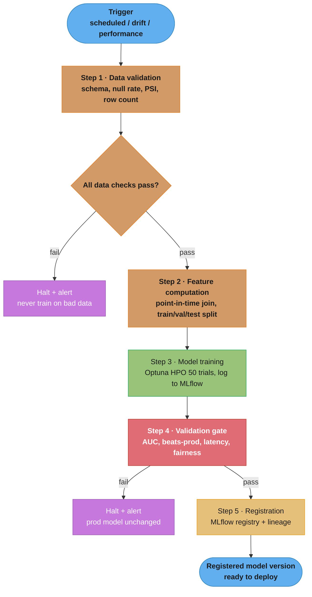
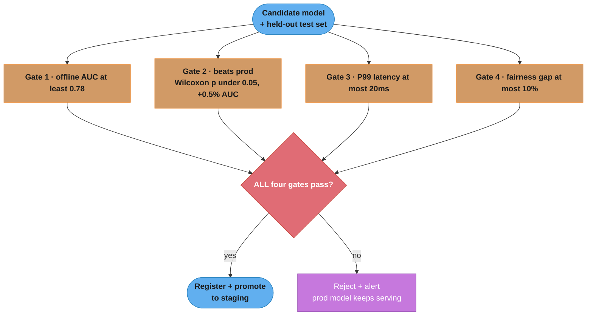
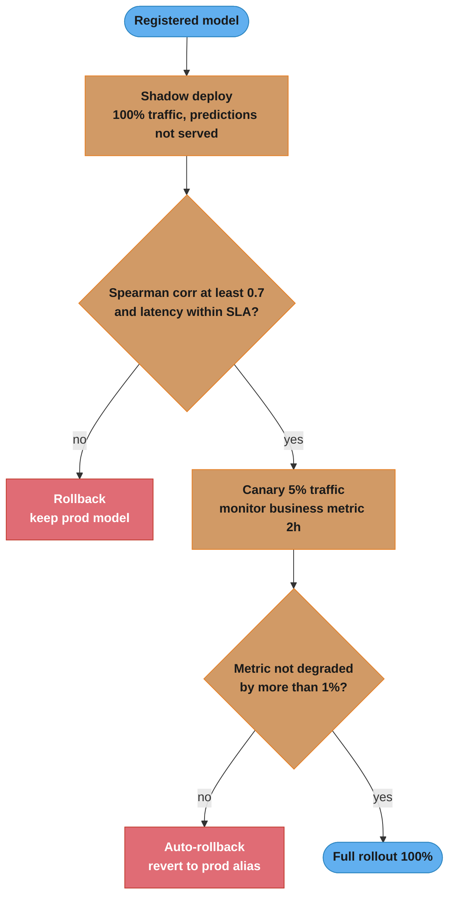
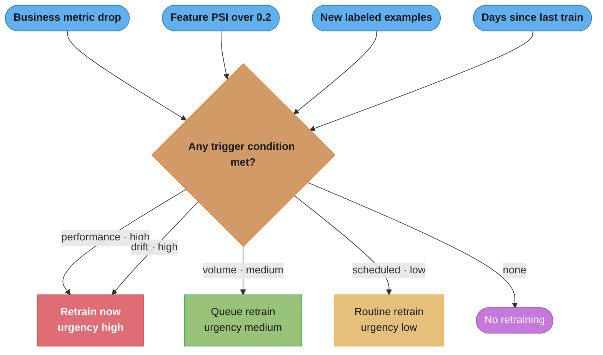

# ML Training Pipeline Design

## 1. Concept Overview

An ML training pipeline is an automated, repeatable workflow that takes raw data and produces a validated, registered model artifact ready for deployment. Unlike a one-off Jupyter notebook training run, a production training pipeline is a versioned, monitored system that runs on a schedule or in response to triggers.

A complete training pipeline includes: data validation, data versioning, feature computation, model training, hyperparameter optimization, offline model evaluation, model registration, and automated deployment gates. Each stage is a distinct step with defined inputs, outputs, and failure conditions.

The pipeline must be idempotent (re-running produces the same output given the same inputs), reproducible (any historical run can be replayed), and observable (every run produces logs and metrics that can be inspected post-hoc).

---

## 2. Intuition

One-line analogy: a training pipeline is a factory assembly line with quality control at every station — raw materials (data) enter, each station transforms or validates the product, and defective batches are rejected before they reach the end.

Mental model: think of the pipeline as a DAG (directed acyclic graph) of steps, where each step has a contract: given these inputs, produce these outputs, fail loudly if data quality is insufficient. Orchestration tools (Airflow, Kubeflow) execute this DAG on a schedule or on trigger.

Why it matters: 70% of ML projects that make it to an initial deployment never get updated because the retraining process is manual and error-prone. A training pipeline reduces model update time from weeks to hours, enabling the feedback loop that keeps models fresh.

Key insight: the validation gates between steps are more important than the training step itself. A model that passes all gates can be safely deployed; a model that skips validation is a production incident waiting to happen.

---

## 3. Core Principles

**Fail fast with loud errors**: a validation failure at step 2 (data validation) should stop the pipeline immediately with a clear error message, not silently produce a degraded model at step 5.

**Immutable artifacts**: every step produces an immutable, versioned artifact (data snapshot, feature dataset, model file). Artifacts are never overwritten — new versions are created. This enables rollback to any previous artifact.

**Temporal data splits**: for time-series ML data, always split on time (train on older data, validate on more recent data). Random splits allow models to "peek" at future data, inflating validation metrics.

**Automated validation gates**: define numerical thresholds that a model must pass before promotion. No model enters production without clearing every gate. Remove humans from the approval loop for routine retraining.

**Lineage tracking**: every deployed model must have a complete lineage record: which data version, feature version, code version, and hyperparameters produced it. Lineage enables debugging ("what changed between the good model last week and the bad model today?").

**Separation of concerns**: the training pipeline should not modify the serving infrastructure directly. It produces an artifact (model file + metadata) in a model registry; a separate deployment pipeline handles promotion to serving.

---

## 4. Types / Architectures / Strategies

### Training Pipeline Trigger Types

| Trigger Type | When to Use | Example |
|-------------|-------------|---------|
| Scheduled | Stable distribution, routine retraining | Daily at 3am, weekly on Monday |
| Data-volume-triggered | Retrain after N new labeled examples | After 100K new click events |
| Drift-triggered | Distribution shift detected | PSI > 0.2 on key feature |
| Performance-triggered | Online metric degradation | CTR drops > 5% from baseline for > 30 min |
| Event-triggered | Known external change | New product category launched |

### Pipeline Orchestration Tools

| Tool | Strengths | Weaknesses | Best For |
|------|-----------|-----------|---------|
| Apache Airflow | Mature, wide adoption, Python DAGs | Heavy ops, scheduler bottleneck | General ETL + ML pipelines |
| Kubeflow Pipelines | Native K8s, containerized steps, artifact tracking | Complex setup, K8s required | ML-specific workflows on K8s |
| Prefect | Modern Python API, dynamic DAGs, easy local testing | Newer, smaller community | Python-first teams |
| Metaflow | Data scientist-friendly, AWS integration | AWS-centric | Data scientist self-service |
| MLflow Projects | Simple, experiment tracking built-in | Limited orchestration features | Simple pipelines, experiment tracking |
| Vertex AI Pipelines | Managed on GCP, KFP-compatible | GCP lock-in | GCP-native teams |

### Retraining Strategy Patterns

| Strategy | Description | Pros | Cons |
|----------|-------------|------|------|
| Full retraining | Train from scratch on all historical data | Maximum data utilization | Slow, compute-intensive |
| Window retraining | Train on a rolling window (e.g., last 90 days) | Faster, adapts to recent trends | May lose long-term patterns |
| Warm start | Initialize from previous model weights, continue training | Fast, stable | Risk of getting stuck in local minima |
| Incremental / online | Update model weights on each new batch | Lowest latency | High variance, hard to evaluate |
| Transfer learning | Fine-tune a pretrained base model | Data-efficient | Base model may not suit domain |

---

## 5. Architecture Diagrams

### Training Pipeline DAG — Build Phase



Every step is a gate: a failure halts the run loudly rather than passing a degraded model downstream. The build phase ends at a registered, validated artifact — deployment is a separate flow (progressive-deployment diagram below).

### Validation Gate — Four Checks (all must pass)



The gate is a logical AND: a strong average AUC does not compensate for a failed latency or fairness check. Thresholds are fixed before the first run so they cannot be rationalized to fit the model you happen to get.

### Progressive Deployment — Shadow to Canary to Rollout



Deployment is staged so each step limits blast radius: shadow proves correctness and latency under real load with zero user impact, canary risks only 5% of traffic, and either gate can auto-rollback before a full rollout.

### Retraining Trigger Decision



When several conditions fire at once the evaluator returns the single highest-priority trigger (performance and drift outrank volume and schedule), so one urgent signal is never masked by a routine one.

### Data Versioning Strategy

```
S3 BUCKET: s3://ml-data/
├── raw/
│   ├── click_events/
│   │   ├── dt=2024-01-14/   (partitioned by date)
│   │   └── dt=2024-01-15/
│   └── ...
├── validated/
│   ├── snapshot_20240115_abc123/   (hash of validation run)
│   │   └── schema.json, stats.json, data/*.parquet
│   └── snapshot_20240122_def456/
└── features/
    ├── training_20240115_run001/
    │   ├── train/*.parquet
    │   ├── val/*.parquet
    │   └── test/*.parquet
    └── training_20240122_run002/
```

---

## 6. How It Works — Detailed Mechanics

### Step 1: Data Validation

```python
from __future__ import annotations

import logging
from dataclasses import dataclass, field
from typing import Any

import great_expectations as gx
import pandas as pd
import numpy as np
from scipy.stats import ks_2samp


logger = logging.getLogger(__name__)


@dataclass
class DataValidationResult:
    passed: bool
    checks: dict[str, bool]
    stats: dict[str, Any]
    failure_reasons: list[str] = field(default_factory=list)


def validate_training_data(
    df: pd.DataFrame,
    reference_df: pd.DataFrame,   # previous training run's data (for drift check)
    schema: dict[str, str],       # expected column -> dtype mapping
    max_null_rate: float = 0.05,  # fail if any column has > 5% nulls
    max_psi: float = 0.2,         # fail if feature PSI > 0.2 vs reference
    min_rows: int = 100_000,      # fail if fewer than 100K examples
) -> DataValidationResult:
    """
    Validate training data before proceeding to feature computation.
    Fails loudly on any violation — do not train on bad data.
    """
    checks: dict[str, bool] = {}
    failures: list[str] = []
    stats: dict[str, Any] = {}

    # Check 1: Row count
    row_count = len(df)
    stats["row_count"] = row_count
    checks["min_rows"] = row_count >= min_rows
    if not checks["min_rows"]:
        failures.append(f"Row count {row_count} < minimum {min_rows}")

    # Check 2: Schema validation
    schema_issues = []
    for col, expected_dtype in schema.items():
        if col not in df.columns:
            schema_issues.append(f"Missing column: {col}")
        elif str(df[col].dtype) != expected_dtype:
            schema_issues.append(
                f"Column {col}: expected {expected_dtype}, got {df[col].dtype}"
            )
    checks["schema"] = len(schema_issues) == 0
    if schema_issues:
        failures.extend(schema_issues)

    # Check 3: Null rates
    null_rate_issues = []
    null_rates: dict[str, float] = {}
    for col in df.columns:
        null_rate = df[col].isnull().mean()
        null_rates[col] = float(null_rate)
        if null_rate > max_null_rate:
            null_rate_issues.append(f"Column {col} null rate {null_rate:.3f} > {max_null_rate}")
    checks["null_rates"] = len(null_rate_issues) == 0
    stats["null_rates"] = null_rates
    if null_rate_issues:
        failures.extend(null_rate_issues)

    # Check 4: Distribution drift vs reference (PSI)
    numeric_cols = df.select_dtypes(include=[np.number]).columns
    psi_scores: dict[str, float] = {}
    psi_issues = []
    for col in numeric_cols:
        if col in reference_df.columns:
            psi = _compute_psi(
                reference_df[col].dropna().values,
                df[col].dropna().values,
            )
            psi_scores[col] = float(psi)
            if psi > max_psi:
                psi_issues.append(f"Column {col} PSI {psi:.3f} > {max_psi}")
    checks["distribution_drift"] = len(psi_issues) == 0
    stats["psi_scores"] = psi_scores
    if psi_issues:
        failures.extend(psi_issues)

    # Check 5: Label distribution (class imbalance sanity)
    if "label" in df.columns:
        positive_rate = df["label"].mean()
        stats["positive_rate"] = float(positive_rate)
        # Alert if positive rate differs from reference by > 50% relative
        if "label" in reference_df.columns:
            ref_rate = reference_df["label"].mean()
            relative_change = abs(positive_rate - ref_rate) / max(ref_rate, 1e-8)
            checks["label_rate_stability"] = relative_change < 0.5
            if not checks["label_rate_stability"]:
                failures.append(
                    f"Label positive rate changed {relative_change:.1%} "
                    f"from reference ({ref_rate:.3f} -> {positive_rate:.3f})"
                )

    passed = len(failures) == 0
    if not passed:
        logger.error("Data validation FAILED: %s", "; ".join(failures))
    else:
        logger.info("Data validation PASSED. Rows: %d, PSI max: %.3f",
                    row_count, max(psi_scores.values(), default=0.0))

    return DataValidationResult(
        passed=passed,
        checks=checks,
        stats=stats,
        failure_reasons=failures,
    )


def _compute_psi(baseline: np.ndarray, current: np.ndarray, n_bins: int = 10) -> float:
    bins = np.nanpercentile(baseline, np.linspace(0, 100, n_bins + 1))
    bins[0] = -np.inf
    bins[-1] = np.inf
    epsilon = 1e-8
    p_base = np.clip(np.histogram(baseline, bins)[0] / len(baseline), epsilon, None)
    p_curr = np.clip(np.histogram(current, bins)[0] / len(current), epsilon, None)
    return float(np.sum((p_curr - p_base) * np.log(p_curr / p_base)))
```

**What the formula is telling you.** The five checks are one sentence in five clauses: "is there enough data, of the right shape, without holes, drawn from the same world as last time, and labelled at the same rate as last time?" Each has a number attached because a gate without a threshold is a comment.

| Symbol | What it is |
|--------|------------|
| `min_rows = 100_000` | Volume floor. Below it the split leaves too few positives to evaluate |
| `max_null_rate = 0.05` | Per-column hole budget. Checked per column, not averaged across them |
| `max_psi = 0.2` | Distribution-shift ceiling versus the previous run's data |
| `p_curr`, `p_base` | Today's and the reference run's mass in each decile bin of a numeric column |
| `relative_change` | `abs(positive_rate - ref_rate) / ref_rate` — label drift measured as a fraction of itself |
| `0.5` on `relative_change` | Allows the positive rate to halve or grow by half before failing |
| `epsilon = 1e-8` | Guards `log(0)` in PSI and division by a zero reference rate |

**Walk one example.** A CTR pipeline whose reference run had a 2% positive rate, checked against the label gate:

```
  ref_rate = 0.020

  today   positive_rate   relative_change = |p - r| / r      verdict
  ------------------------------------------------------------------
  Mon        0.021        |0.021-0.020|/0.020 = 0.050        pass
  Tue        0.014        |0.014-0.020|/0.020 = 0.300        pass
  Wed        0.009        |0.009-0.020|/0.020 = 0.550        FAIL

  pass band = ref_rate x [0.5, 1.5] = [0.010, 0.030]
```

Wednesday's 0.9% is still a perfectly plausible-looking CTR — nothing about the number screams broken — and that is the point. The gate does not judge the value, it judges the **move**, so a half-failed logging job that drops a click source is caught while the data still looks reasonable.

**Why the null check is per column and not global.** One completely dead column among the 150 features of the Section 14 model moves the dataset-wide null rate by only `1 / 150 = 0.67%`, which sails under any global 5% threshold — averaging dilutes a total outage into noise. Per-column checking is what turns "a feature stopped being computed" into a pipeline failure rather than a silently degraded model — the exact failure mode Section 10's silent-Spark-failure story describes.

### Step 3: Model Training with Hyperparameter Optimization

```python
import lightgbm as lgb
import mlflow
import mlflow.lightgbm
import optuna
import numpy as np
import pandas as pd
from sklearn.metrics import roc_auc_score
from typing import Optional


def train_with_hpo(
    X_train: pd.DataFrame,
    y_train: pd.Series,
    X_val: pd.DataFrame,
    y_val: pd.Series,
    experiment_name: str,
    n_trials: int = 50,
    timeout_seconds: int = 3600,
) -> tuple[lgb.Booster, dict, float]:
    """
    Train a LightGBM model with Optuna HPO.
    Logs all trials to MLflow for reproducibility.

    Returns: (best_model, best_params, best_val_auc)
    """
    mlflow.set_experiment(experiment_name)

    def objective(trial: optuna.Trial) -> float:
        params = {
            "objective": "binary",
            "metric": "auc",
            "boosting_type": "gbdt",
            "num_leaves": trial.suggest_int("num_leaves", 20, 300),
            "max_depth": trial.suggest_int("max_depth", 4, 12),
            "learning_rate": trial.suggest_float("learning_rate", 0.01, 0.3, log=True),
            "n_estimators": trial.suggest_int("n_estimators", 100, 2000),
            "min_child_samples": trial.suggest_int("min_child_samples", 5, 100),
            "subsample": trial.suggest_float("subsample", 0.5, 1.0),
            "colsample_bytree": trial.suggest_float("colsample_bytree", 0.5, 1.0),
            "reg_alpha": trial.suggest_float("reg_alpha", 1e-8, 10.0, log=True),
            "reg_lambda": trial.suggest_float("reg_lambda", 1e-8, 10.0, log=True),
            "verbose": -1,
        }

        with mlflow.start_run(nested=True, run_name=f"trial_{trial.number}"):
            mlflow.log_params(params)

            model = lgb.LGBMClassifier(**params)
            model.fit(
                X_train, y_train,
                eval_set=[(X_val, y_val)],
                callbacks=[lgb.early_stopping(50, verbose=False)],
            )

            val_auc = roc_auc_score(y_val, model.predict_proba(X_val)[:, 1])
            mlflow.log_metric("val_auc", val_auc)

        return val_auc

    with mlflow.start_run(run_name="hpo_study"):
        study = optuna.create_study(
            direction="maximize",
            sampler=optuna.samplers.TPESampler(seed=42),
            pruner=optuna.pruners.MedianPruner(),
        )
        study.optimize(objective, n_trials=n_trials, timeout=timeout_seconds)

        # Retrain final model with best params on full training set
        best_params = study.best_params
        best_params.update({"objective": "binary", "metric": "auc", "verbose": -1})

        final_model = lgb.LGBMClassifier(**best_params)
        final_model.fit(
            X_train, y_train,
            eval_set=[(X_val, y_val)],
            callbacks=[lgb.early_stopping(50, verbose=False)],
        )

        best_val_auc = roc_auc_score(y_val, final_model.predict_proba(X_val)[:, 1])

        mlflow.log_params(best_params)
        mlflow.log_metric("best_val_auc", best_val_auc)
        mlflow.log_metric("n_trials", len(study.trials))
        mlflow.lightgbm.log_model(final_model, artifact_path="model")

        return final_model.booster_, best_params, best_val_auc
```

### Step 4: Model Validation Gate

```python
import time
import numpy as np
import pandas as pd
import lightgbm as lgb
from sklearn.metrics import roc_auc_score, average_precision_score
from scipy import stats
from dataclasses import dataclass


@dataclass
class ValidationGateResult:
    passed: bool
    auc: float
    avg_precision: float
    latency_p99_ms: float
    beats_production: bool
    fairness_passed: bool
    failure_reasons: list[str]


def validate_model_gate(
    model: lgb.Booster,
    X_test: pd.DataFrame,
    y_test: pd.Series,
    production_scores: np.ndarray,    # scores from current production model on X_test
    sensitive_feature: pd.Series,     # e.g. user age group or gender
    auc_threshold: float = 0.78,
    latency_p99_threshold_ms: float = 20.0,
    min_improvement_pct: float = 0.005,   # must beat prod by 0.5% AUC
    max_fairness_gap: float = 0.10,       # max relative performance gap across groups
) -> ValidationGateResult:
    """
    Automated validation gate that must pass before model is registered.
    A model failing any gate is rejected — no exceptions.
    """
    failures: list[str] = []

    # Gate 1: Offline AUC threshold
    candidate_scores = model.predict(X_test)
    auc = roc_auc_score(y_test, candidate_scores)
    avg_precision = average_precision_score(y_test, candidate_scores)

    if auc < auc_threshold:
        failures.append(f"AUC {auc:.4f} < threshold {auc_threshold}")

    # Gate 2: Statistical improvement over production model
    # Use Wilcoxon signed-rank test on per-example log-loss difference
    epsilon = 1e-7
    candidate_logloss = -(
        y_test * np.log(candidate_scores + epsilon)
        + (1 - y_test) * np.log(1 - candidate_scores + epsilon)
    )
    production_logloss = -(
        y_test * np.log(production_scores + epsilon)
        + (1 - y_test) * np.log(1 - production_scores + epsilon)
    )
    stat, p_value = stats.wilcoxon(production_logloss, candidate_logloss)
    production_auc = roc_auc_score(y_test, production_scores)
    auc_improvement = auc - production_auc

    beats_production = (auc_improvement >= min_improvement_pct) and (p_value < 0.05)
    if not beats_production:
        failures.append(
            f"Does not beat production: improvement={auc_improvement:.4f}, "
            f"p-value={p_value:.4f} (need improvement>={min_improvement_pct}, p<0.05)"
        )

    # Gate 3: Inference latency
    latency_ms = _benchmark_latency_p99(model, X_test.head(1000))
    if latency_ms > latency_p99_threshold_ms:
        failures.append(
            f"P99 latency {latency_ms:.1f}ms > threshold {latency_p99_threshold_ms}ms"
        )

    # Gate 4: Fairness check across demographic groups
    groups = sensitive_feature.unique()
    group_aucs: dict[str, float] = {}
    for group in groups:
        mask = sensitive_feature == group
        if mask.sum() >= 100:  # only check groups with sufficient samples
            group_aucs[str(group)] = roc_auc_score(y_test[mask], candidate_scores[mask])

    fairness_passed = True
    if group_aucs:
        max_auc = max(group_aucs.values())
        min_auc = min(group_aucs.values())
        gap = (max_auc - min_auc) / max(max_auc, 1e-8)
        if gap > max_fairness_gap:
            fairness_passed = False
            failures.append(
                f"Fairness gap {gap:.3f} > {max_fairness_gap} "
                f"(groups: {group_aucs})"
            )

    passed = len(failures) == 0

    return ValidationGateResult(
        passed=passed,
        auc=auc,
        avg_precision=avg_precision,
        latency_p99_ms=latency_ms,
        beats_production=beats_production,
        fairness_passed=fairness_passed,
        failure_reasons=failures,
    )


def _benchmark_latency_p99(model: lgb.Booster, X_sample: pd.DataFrame) -> float:
    """Measure P99 inference latency for a single example (simulates serving)."""
    latencies = []
    single_row = X_sample.iloc[[0]]

    for _ in range(200):
        start = time.perf_counter()
        _ = model.predict(single_row)
        latencies.append((time.perf_counter() - start) * 1000)

    return float(np.percentile(latencies, 99))
```

**Put simply.** The four gates say: "be good enough in absolute terms, be *measurably* better than what is already serving, be fast enough to serve, and be roughly as good for every group." A candidate that clears three of four is rejected — the gates are an AND, never a score.

| Symbol | What it is |
|--------|------------|
| `auc_threshold = 0.78` | Absolute floor. Catches a model that is broken regardless of what production does |
| `auc_improvement` | `candidate_auc - production_auc`, both measured on the same held-out test set |
| `min_improvement_pct = 0.005` | Effect-size floor: half an AUC point. Guards against shipping noise |
| `p_value < 0.05` | Significance floor from Wilcoxon on per-example log-loss. Guards against luck |
| `gap = (max_auc - min_auc) / max_auc` | Fairness spread, expressed as a fraction of the best group's AUC |
| `max_fairness_gap = 0.10` | The widest acceptable spread across demographic groups |
| `mask.sum() >= 100` | Minimum group size, so a 12-person slice cannot fail the build on noise |

Effect size and significance are deliberately separate tests. A large dataset makes `p_value` tiny for improvements too small to matter, and a small one leaves a real improvement statistically indistinguishable from noise — requiring both means the model has to be better *and* the evidence has to be there.

**Walk one example.** Section 14's daily CTR pipeline, whose production model sits at 0.798 AUC:

```
  gate 1  absolute AUC      0.802 >= 0.780                          pass
  gate 2  improvement       0.802 - 0.798 = 0.0040
                            vs case-study floor  0.003              pass
                            vs code default      0.005              would FAIL
          significance      Wilcoxon p = 0.01  <  0.05              pass
  gate 3  P99 latency       benchmark returns 9.2 ms  <  10 ms      pass
  gate 4  fairness gap      (0.81 - 0.75) / 0.81 = 0.0741 < 0.08    pass
  ----------------------------------------------------------------------
  result  all gates AND-ed                                          REGISTER
```

The gate-2 line is the one worth staring at. The same 0.0040 improvement **passes** the case study's 0.003 floor and **fails** the code's 0.005 default. Nothing about the model changed — the threshold decides. That is why the floor is a reviewed, versioned constant and not a value someone nudges when a promising model gets blocked.

**Why the fairness gap is relative, not absolute.** An absolute spread of `0.06` means something very different at 0.81 AUC than at 0.55 AUC. Dividing by the best group's score makes the gate scale-free: `(0.82 - 0.72) / 0.82 = 0.122` fails the 0.10 rule even though a system already near chance level would treat the same 0.10 spread as unremarkable.

### Retraining Trigger Evaluation

```python
from dataclasses import dataclass
from datetime import datetime, timedelta
from typing import Optional


@dataclass
class RetrainingTrigger:
    trigger_type: str       # "scheduled", "drift", "performance", "volume"
    reason: str
    urgency: str            # "high", "medium", "low"
    triggered_at: datetime


def evaluate_retraining_triggers(
    last_training_date: datetime,
    feature_psi_scores: dict[str, float],
    business_metric_change_pct: float,   # e.g. -0.05 = 5% drop
    new_labeled_examples: int,
    retraining_schedule_days: int = 7,
    psi_threshold: float = 0.2,
    performance_drop_threshold: float = -0.05,
    volume_threshold: int = 500_000,
) -> Optional[RetrainingTrigger]:
    """
    Evaluate whether any trigger condition is met.
    Returns the highest-priority trigger, or None if no retraining needed.
    """
    now = datetime.utcnow()
    triggers: list[RetrainingTrigger] = []

    # Performance trigger (highest priority — user-facing impact)
    if business_metric_change_pct < performance_drop_threshold:
        triggers.append(RetrainingTrigger(
            trigger_type="performance",
            reason=f"Business metric dropped {business_metric_change_pct:.1%}",
            urgency="high",
            triggered_at=now,
        ))

    # Drift trigger (high priority — leading indicator of degradation)
    drifted = [f for f, psi in feature_psi_scores.items() if psi > psi_threshold]
    if drifted:
        triggers.append(RetrainingTrigger(
            trigger_type="drift",
            reason=f"Feature drift detected: {drifted}",
            urgency="high",
            triggered_at=now,
        ))

    # Volume trigger (medium priority — enough new data to improve)
    if new_labeled_examples >= volume_threshold:
        triggers.append(RetrainingTrigger(
            trigger_type="volume",
            reason=f"{new_labeled_examples:,} new labeled examples available",
            urgency="medium",
            triggered_at=now,
        ))

    # Scheduled trigger (low priority — routine maintenance)
    days_since_training = (now - last_training_date).days
    if days_since_training >= retraining_schedule_days:
        triggers.append(RetrainingTrigger(
            trigger_type="scheduled",
            reason=f"{days_since_training} days since last training",
            urgency="low",
            triggered_at=now,
        ))

    # Return highest-priority trigger
    priority_order = {"high": 0, "medium": 1, "low": 2}
    if triggers:
        return min(triggers, key=lambda t: priority_order[t.urgency])

    return None
```

---

## 7. Real-World Examples

**Spotify's ML Platform**: Spotify's recommendation models are retrained daily using a pipeline orchestrated by Luigi (their internal DAG runner). The pipeline validates data quality using custom schema checks, computes features in Spark, trains models on GPU clusters, and validates against an automated test suite before deploying. Models that pass offline validation are deployed to a shadow environment before an A/B test.

**Airbnb's ML Infrastructure**: Airbnb described their ML training pipeline as consisting of "offline training, online scoring, and monitoring." Their pipeline uses Apache Airflow for orchestration, Spark for feature computation, and custom tooling for model validation. They notably describe using temporal train-test splits and validation against a holdout set that is always the most recent 2 weeks of data.

**Twitter's Timelines ML**: Twitter described their training pipeline for the home timeline ranking model as a daily pipeline that trains on 30 days of interaction data. The pipeline includes automated feature importance checks (removing features that have dropped to near-zero importance), AUC gate, and shadow deployment before canary promotion.

---

## 8. Tradeoffs

### Full Retraining vs Incremental Update

| Dimension | Full Retraining | Incremental Update |
|-----------|----------------|-------------------|
| Data utilization | Maximum (all history) | Recent data only |
| Compute cost | High | Low |
| Risk of distribution shift | Lower (captures current distribution) | Higher (gradient update may overshoot) |
| Pipeline complexity | Lower | Higher (stateful model management) |
| Recovery from bad update | Easy (rollback to previous model) | Hard (incremental update is hard to undo) |
| Typical cadence | Daily or weekly | Hourly or continuous |

### Orchestration Tool Tradeoffs

| Dimension | Airflow | Kubeflow Pipelines | Prefect |
|-----------|---------|-------------------|---------|
| Kubernetes required | No | Yes | No |
| ML artifact tracking | Manual | Built-in | Manual |
| Local testing | Hard | Very hard | Easy |
| Operational complexity | Medium | High | Low |
| Community | Very large | Large | Growing |
| Dynamic DAGs | Limited | Limited | Full |

---

## 9. When to Use / When NOT to Use

### Use a fully automated training pipeline when:
- Models need to be retrained more frequently than a human can reasonably do manually (weekly or more often)
- The team has more than two models in production — manual retraining for multiple models is unsustainable
- Business impact of model staleness is measurable (e.g., CTR drops when model is > 7 days old)
- Data distribution shifts regularly (seasonal trends, product changes, user behavior shifts)

### Do NOT invest in full pipeline automation when:
- A single model is trained quarterly on stable data — automation overhead exceeds benefit
- The team has < 5 engineers and no dedicated ML engineer — manual retraining is faster to implement
- The model is not yet in production — build the pipeline after the model proves its value

### Signs the training pipeline is insufficient:
- Retraining takes more than 24 hours for a model that should retrain daily
- Model rollback requires manual intervention
- No one knows which data version was used to train the production model
- Data scientists run ad-hoc training experiments in the same environment as production pipelines

---

## 10. Common Pitfalls

**Training on test data via global preprocessing**: a data scientist fits a StandardScaler on the entire dataset (train + validation + test), then splits. The scaler uses statistics from the test set, artificially inflating validation AUC by 3-5%. Fix: always fit preprocessing (scalers, imputers, vocabulary) only on the training fold; apply (transform) to validation and test.

**No temporal split for time-series data**: a fraud model is trained with random 80/20 split. Fraudsters from 2024 appear in both training and test sets — the model memorizes their fingerprints and achieves 0.96 AUC. In production (new fraudsters, new patterns), AUC is 0.73. Fix: always split on time; train on data before date D, test on data after date D.

**Silent data pipeline failures**: the daily Spark job fails silently at 3am (OOM error not surfaced to Airflow). The training pipeline uses the previous day's data (stale), produces a slightly worse model, passes the AUC gate (old data is similar), and deploys. One week later, business metric has been slowly degrading. Fix: make every pipeline step emit metrics; alert on data freshness (if the Spark output partition is not updated by 5am, alert).

**Hyperparameter tuning on validation set, testing on same validation set**: the HPO process selects the hyperparameters that maximize AUC on the validation set. The model evaluation at the validation gate uses the same validation set. The gate passes, but the model has overfit to the validation set. Fix: use a three-way split — train, validation (for HPO and early stopping), test (for final evaluation gate only, never used during training or HPO).

**Slow pipeline blocking rapid response to drift**: a performance drop is detected at 9am. The daily training pipeline runs at 3am and takes 6 hours. The team cannot trigger a manual retrain because the pipeline requires 4 manual steps. By the time a new model is deployed (next day at 3am + 6h training + deployment), 30 hours of degraded service have occurred. Fix: design the pipeline for triggered execution, not just scheduled; automate all deployment steps; target < 8 hours from trigger to deployment for high-urgency triggers.

### Reading the Refresh-Cadence Arithmetic

**What it means.** Time-to-fresh-model is a sum, not a duration: "wait for the next scheduled slot, then run, then deploy." Only the middle term is training — and it is usually the smallest one, which is why buying a faster GPU rarely fixes a slow response to drift.

| Symbol | What it is |
|--------|------------|
| `wait` | Gap from detection to the next cron slot. Zero if the pipeline can be triggered on demand |
| `run` | Actual pipeline wall-clock, validation and shadow included |
| `deploy` | Manual steps between a registered model and live traffic |
| `time_to_fresh` | `wait + run + deploy`. The real latency of the feedback loop |
| `degraded hours` | `time_to_fresh` while the business metric is already down. What the incident costs |
| `< 8h` target | The stated budget for a high-urgency trigger |

**Walk one example.** The Section 10 incident, hour by hour:

```
  09:00 day 1   drift detected, business metric already dropping
                |
                |  wait 18 h    -- next cron slot is 03:00, and the pipeline
                |                  cannot be triggered on demand
  03:00 day 2   pipeline starts
                |
                |  run   6 h    -- training wall-clock
                |
  09:00 day 2   model registered
                |
                |  deploy 6 h   -- 4 manual steps
                v
  15:00 day 2   fresh model live

  time_to_fresh = 18 + 6 + 6 = 30 h    vs target 8 h  ->  3.75x over budget
```

Training is `6 / 30 = 20%` of the elapsed time. **The other 80% is scheduling rigidity and manual steps** — both fixable without touching compute. Halving the training run buys 3 hours; making the pipeline triggerable buys 18.

**Why the cadence choice is a cost tradeoff and not a preference.** Section 8 pairs full retraining with a daily-or-weekly cadence and incremental updates with hourly-or-continuous, and Section 12 gives the reason: a full retrain is expensive per run, so it can only be afforded rarely, while a warm start converges in minutes and can be afforded often. Picking a cadence is therefore picking how much staleness the business metric tolerates between runs, then buying the cheapest retraining strategy that fits in that window — which is why Section 9 flags "retraining takes more than 24 hours for a model that should retrain daily" as a design failure: the run no longer fits inside its own interval.

---

## 11. Technologies & Tools

| Category | Tool | Notes |
|----------|------|-------|
| Pipeline Orchestration | Apache Airflow | Industry standard; large community; scheduler-based |
| Pipeline Orchestration | Kubeflow Pipelines | Kubernetes-native; containerized steps; artifact lineage |
| Pipeline Orchestration | Prefect | Modern Python API; dynamic DAGs; easy local testing |
| Pipeline Orchestration | Metaflow | Netflix-origin; data scientist-friendly; AWS integration |
| Data Validation | Great Expectations | Declarative expectations; HTML reports; datasource integrations |
| Data Validation | deequ (AWS) | Spark-native; statistical data quality checks |
| Data Validation | TensorFlow Data Validation | TFDV; schema inference; distribution comparison |
| Data Versioning | DVC | Git-like versioning for data; S3/GCS backend |
| Data Versioning | Delta Lake | ACID transactions; time travel; Spark integration |
| Feature Computation | Apache Spark | Large-scale batch feature computation; PySpark |
| HPO | Optuna | Bayesian optimization; pruning; MLflow integration |
| HPO | Ray Tune | Distributed HPO; integration with all major frameworks |
| Experiment Tracking | MLflow | Open-source; experiment + model registry; wide adoption |
| Experiment Tracking | Weights & Biases | Rich UI; team collaboration; hyperparameter sweeps |
| Model Registry | MLflow Model Registry | Staging/production promotion; versioning; lineage |
| Model Registry | Vertex AI Model Registry | GCP-native; deployment integration |
| Training Infrastructure | AWS SageMaker | Managed training; spot instances; built-in HPO |
| Training Infrastructure | Vertex AI Training | GCP-native; TPU support; managed hyperparameter tuning |

---

## 12. Interview Questions with Answers

**Q: What are the key components of a production ML training pipeline?**
A production pipeline has seven stages: (1) data validation — schema, null rate, row count, and distribution drift checks that fail fast if data is bad; (2) feature computation — Spark batch join with point-in-time correct feature retrieval from the offline feature store; (3) model training — with hyperparameter optimization (Optuna), temporal train-val-test split, and MLflow experiment logging; (4) model validation gate — offline AUC threshold, statistical improvement over production, latency benchmark, and fairness check; (5) model registration — artifact stored in MLflow registry with full lineage (data version, code commit, hyperparameters); (6) shadow deployment — run new model on production traffic without serving predictions; (7) canary deployment — serve 5% of traffic, monitor business metrics, promote or rollback.

**Q: How do you prevent data leakage in a training pipeline?**
Three critical practices: (1) temporal splitting — always split on time, never randomly, for any time-series or event-based dataset; train on data before date D, validate on data after D; (2) point-in-time correct feature joins — when joining features to labels, retrieve the feature value as of the label event timestamp, not the current value; this is the most common source of leakage in production systems; (3) fit-transform discipline — fit all preprocessors (scalers, imputers, encoders) exclusively on the training fold, then transform validation and test; global preprocessing contaminates test evaluation with test-set statistics.

**Q: What is the difference between a scheduled retraining trigger and a drift-based trigger?**
A scheduled trigger fires on a fixed calendar interval (e.g., daily at 3am) regardless of model performance. It is simple to implement and ensures models incorporate recent data. A drift-based trigger fires when a statistical change is detected in the data distribution — typically measured by Population Stability Index (PSI) on key features, with a threshold of 0.2. Drift-based triggers are proactive (they fire before performance degrades) but require monitoring infrastructure. In practice, use both: scheduled for routine freshness, drift-based for rapid response to distribution shifts.

**Q: How do you structure a model validation gate?**
A validation gate is a set of automated pass/fail checks that must all pass before a model is registered. Required checks: (1) offline AUC (or primary metric) must exceed a defined threshold — e.g., AUC > 0.78; (2) the candidate model must statistically significantly outperform the production model on the test set (Wilcoxon test p < 0.05, improvement > 0.5%); (3) P99 inference latency must be within SLA on production-representative hardware; (4) fairness gap across demographic groups must be below threshold (e.g., < 10% relative AUC difference). If any gate fails, the pipeline halts and sends an alert. The gate should be run in a CI-like manner — automated, fast, and blocking.

**Q: How do you version data and models for reproducibility?**
Data versioning: partition raw data by date in S3; assign each validated snapshot a content hash (SHA-256 of the Parquet files); record the snapshot hash in MLflow run metadata. Model versioning: every MLflow run records the data snapshot hash, code commit SHA, and all hyperparameters; the model artifact in the registry is linked to the run; models are tagged with a semantic version (e.g., v1.23) and deployment stage (staging, production). Reproducibility requirement: given an MLflow run ID, you should be able to recreate the exact training environment (data + code + config) and produce a functionally identical model.

**Q: What is shadow mode deployment and how does it validate a new model?**
Shadow mode deploys the new model to a serving replica that receives 100% of production traffic, computes predictions, but does not return them to users. The predictions are logged and compared to the production model's predictions. Shadow validation checks: (1) the new model produces valid predictions (no NaN, no out-of-range scores) for all production traffic; (2) P99 inference latency is within SLA under real traffic load (not just synthetic benchmarks); (3) the new model's score distribution is reasonable compared to the production model (Spearman correlation > 0.7 at the item level). Only after shadow validation passes should the model be promoted to an A/B test.

**Q: How do you handle class imbalance in training pipeline design?**
Class imbalance (e.g., 0.1% fraud rate, 2% click-through rate) requires handling at multiple pipeline stages: (1) sampling strategy — use stratified sampling when splitting to ensure both train and validation sets have representative positive rates; (2) loss function — use class weighting (`scale_pos_weight` in XGBoost/LightGBM) or focal loss to up-weight rare positives; (3) evaluation metric — AUC-ROC is insensitive to class imbalance; use Average Precision (area under PR curve) for highly imbalanced datasets; (4) threshold selection — the default 0.5 probability threshold is wrong for imbalanced data; select the threshold that maximizes F1 or meets a business precision-recall tradeoff on the validation set; (5) oversampling/undersampling — SMOTE for synthetic minority oversampling; undersampling the majority class to a 1:10 ratio is often sufficient.

**Q: How do you monitor a training pipeline in production?**
Monitor at three levels: (1) pipeline health — each pipeline run should emit metrics: runtime duration, step success/failure, data row counts, model AUC per run; alert if a run fails or if runtime increases by > 50% (may indicate data volume issue); (2) data quality — track null rates, row counts, and PSI scores per pipeline run; compare to the previous run and to the training baseline; alert if any metric deteriorates; (3) model quality — track val AUC per run over time; alert if AUC drops > 2% from the moving average (may indicate feature degradation or label noise increase). Store all pipeline run metadata in a dashboard (MLflow, Weights & Biases) for post-hoc analysis.

**Q: What is model lineage and why does it matter for production ML?**
Model lineage is the complete record of what produced a deployed model: which data (version, date range, row count), which feature definitions (version, computation logic), which code (commit SHA, pipeline version), and which hyperparameters. Lineage matters because: (1) debugging — when a model degrades, lineage answers "what changed?" — was it the data, the feature computation, or the model architecture? (2) compliance — financial and healthcare ML regulations require proving what data was used to train a model and that data quality was validated; (3) reproducibility — lineage enables retraining the exact same model if the current one needs to be replaced. MLflow Model Registry stores lineage automatically when models are logged via mlflow.log_model.

**Q: How do you design a training pipeline that supports rapid iteration (daily retraining) without disrupting the production model?**
Key design decisions: (1) isolation — the training pipeline runs in its own compute environment, separate from the serving infrastructure; it produces artifacts (model files) that are registered in a registry, not deployed directly; (2) validation gate — every pipeline run produces a validated model or fails loudly; no untested model can reach the registry's production stage; (3) canary deployment — new models are promoted to 5% of traffic for 2 hours before full rollout; the rollback trigger is automated (business metric drop > 1%); (4) pipeline idempotency — re-running the pipeline for the same date produces the same model; this enables replaying a failed run without side effects; (5) fast failure — data validation failures in step 1 abort the run immediately; do not waste compute on training with bad data.

**Q: What are the tradeoffs between full retraining and fine-tuning (warm start)?**
Full retraining initializes model weights randomly and trains from scratch on all available data. Pros: maximum data utilization, no risk of accumulated errors from previous fine-tuning rounds, easier to reason about. Cons: computationally expensive (hours on large datasets), full HPO recommended on each run. Fine-tuning (warm start) initializes from the previous model's weights and continues training on new data. Pros: faster convergence (hours -> minutes), stable predictions (new model starts near production model quality). Cons: risk of catastrophic forgetting (old knowledge overwritten by new data), risk of accumulating errors across many fine-tuning rounds, hyperparameters from full training may be suboptimal for fine-tuning. Recommendation: use full retraining for weekly cadence (enough compute available); use fine-tuning for daily or sub-daily cadence where compute is constrained.

**Q: How do you implement a fairness check in the training pipeline validation gate?**
A fairness check compares model performance (AUC, precision, recall) across subgroups defined by sensitive attributes (age, gender, race, geography). Implementation: (1) during training data preparation, retain sensitive attribute columns in the test set (do not use them as model features unless legally permitted); (2) compute per-group AUC on the test set for each sensitive group with sufficient sample size (>= 500 examples); (3) compute the relative gap: (max_group_AUC - min_group_AUC) / max_group_AUC; alert and fail the gate if gap > 10%; (4) log per-group metrics to MLflow for historical tracking. The fairness gate should be a hard requirement — a model with high average AUC but a 20% performance gap for a demographic group is not acceptable for production.

**Q: How do you handle the case where a new training run's validation AUC is lower than the current production model?**
This is expected behavior when the pipeline runs correctly — it means the new model did not improve over the production model and should not be deployed. The correct response is: (1) the validation gate catches this and fails the pipeline run; (2) an alert is sent to the team; (3) the production model continues serving without interruption; (4) the team investigates: was the data quality lower this run? Was there a feature computation bug? Did the distribution shift make the old model better temporarily? If the pattern persists for multiple runs, it may indicate that the model architecture or features need to be revisited, not that the pipeline is broken. Never deploy a model that fails the validation gate just to maintain the retraining cadence.

**Q: What is the difference between an orchestration tool (Airflow) and an experiment tracking tool (MLflow)?**
An orchestration tool (Airflow, Kubeflow, Prefect) defines and executes the pipeline DAG — it schedules runs, monitors step completion, handles failures and retries, and manages dependencies between steps. An experiment tracking tool (MLflow, Weights & Biases) records the inputs and outputs of individual training runs — hyperparameters, metrics, artifacts (model files), and lineage. In a production pipeline, both are used together: Airflow orchestrates the pipeline steps, and each step logs its results to MLflow. The model registry (part of MLflow) manages model versioning, staging, and production promotion. The orchestration tool handles "when and how to run"; the tracking tool handles "what was run and what it produced."

**Q: How do you optimize training pipeline speed without sacrificing correctness?**
Speed optimizations at each stage: (1) data loading — use Parquet with predicate pushdown and column pruning; only load the columns used in training; use date partition filters to avoid full scans; (2) feature computation — cache intermediate Spark DataFrames; repartition to match cluster parallelism (200-400 partitions for standard clusters); (3) model training — use GPU training for deep models; for LightGBM, use `device="gpu"` and increase `num_leaves` per GPU core; (4) HPO — use Optuna's TPE sampler with pruning (stop bad trials early); parallelize trials across cluster nodes with Ray Tune; set a time budget rather than a fixed trial count; (5) validation — benchmark latency in parallel with computing offline metrics. Never sacrifice correctness for speed: temporal splitting and point-in-time joins must remain correct even if slower.

**Q: Why can re-running a pipeline with the same random seed still produce a slightly different model?**
Non-determinism leaks in through GPU floating-point atomics, non-deterministic data ordering, and library or hardware version differences — a fixed seed alone does not guarantee bit-identical models. GPU reductions accumulate in a nondeterministic order, multi-threaded data loaders can shuffle differently, and CUDA/cuDNN version changes alter kernel selection. For true reproducibility, pin library versions, enable deterministic flags (`torch.use_deterministic_algorithms(True)`, `cudnn.deterministic=True`), fix the data load order, and record the full environment in the run metadata. In practice, target functionally identical models within a metric tolerance rather than bit-identical, and gate on that tolerance.

**Q: What is the difference between shadow deployment, canary deployment, and an A/B test?**
Shadow runs the new model on live traffic but serves none of its predictions; canary serves a small slice like 5% and watches metrics; an A/B test splits traffic to measure a significant metric difference. Shadow validates that the model produces valid predictions and meets latency under real load with zero user risk. Canary limits blast radius and enables fast automated rollback the moment a business metric drops. An A/B test is a controlled experiment run long enough to reach statistical significance, and is the final arbiter of whether the new model is genuinely better. A mature pipeline runs them in sequence: shadow, then canary, then A/B, then full rollout.

**Q: How do you prevent a retraining storm when several triggers fire at once?**
Debounce and coalesce triggers: enforce a minimum interval between runs, deduplicate concurrent triggers, and execute only the single highest-priority one. Without this, a performance drop, a drift alert, and the daily schedule can all fire within minutes and launch three overlapping training jobs that contend for the same GPUs and registry slots. Use a lock or single-flight scheduler so only one run per model executes at a time and queue the rest. Rank triggers (performance > drift > volume > scheduled) and log why each run started so a later investigation can see the cause.

**Q: How do you handle late-arriving labels in a training pipeline?**
Wait for a label maturity window before treating an example as labeled, and reprocess earlier partitions once their labels have settled. Many labels arrive with delay — a purchase attributed to a click hours later, a chargeback weeks later. Training too early on immature labels teaches the model that eventual positives are negatives, biasing it toward under-prediction. Define a maturity horizon per label type (for example, 7 days for conversions), include only examples whose window has closed, and backfill or relabel older partitions as late labels land. Track label completeness per partition and alert if it stalls.

**Q: How do you roll back a model that has already reached 100% production traffic?**
Keep the previous version registered and warm and repoint the serving production alias back to it — rollback should be a config change, not a retrain. The model registry (MLflow) tags each version with a stage, so rollback is demoting the bad version and promoting the last-known-good one, which the serving layer picks up via its alias. Automate this behind the canary metric guard so rollback fires without a human in the loop. Keep the previous model's artifact and its feature and code version pins available so the rollback is exact. Test the rollback path regularly — an untested rollback fails exactly when you need it.

**Q: How do you backfill training data when a feature definition changes?**
Recompute the changed feature over the full historical raw data with the new logic, register it as a new feature version, and regenerate the training set from the backfilled snapshots. Changing a feature's computation is equivalent to changing the model's input distribution, so the current model stays pinned to the old feature version while the new model trains on the backfilled one. Emit timestamped snapshots and never copy the current value across past dates, which is point-in-time leakage. Validate the backfill by comparing a sample of backfilled historical values against what the live path would have produced. Because backfilling large histories is expensive, scope it to the date range the training window actually needs.

**Q: How do you control the cost of an automated training pipeline?**
Use spot or preemptible instances with checkpointing, cap the HPO trial budget, and cache feature datasets so retrains reuse work instead of recomputing it. Training and HPO dominate pipeline cost; spot instances cut compute 60-90% but can be reclaimed, so checkpoint frequently and resume from the last checkpoint. Bound Optuna with a wall-clock time budget and pruning rather than a large fixed trial count. Reuse the validated feature dataset across trials and across nearby runs. Right-size the cluster to the data volume, and prefer warm-start or window retraining for frequent cadences where full retraining's cost is not justified.

**Q: When should you use window (rolling-window) retraining instead of full retraining on all history?**
Use window retraining when recent data best reflects current behavior and full-history training is too slow or dilutes recent signal with stale patterns. A rolling window (for example, the last 90 days) adapts faster to trend shifts and trains more cheaply, but it can forget long-term seasonal patterns and rare events. Full retraining maximizes data utilization and captures long-term structure at higher compute cost. Choose window retraining for high-churn, non-stationary domains like trending items or news, and full retraining when long-term structure matters, such as credit risk or strong seasonality. A common hybrid keeps a long window with time-decay weighting so recent data counts more without discarding history.

---

## 13. Best Practices

Define validation gate thresholds before the first pipeline run, not after seeing results. Thresholds set post-hoc are biased toward the observed model quality and fail to catch future degradation.

Use three-way splits: train (70%), validation (15%), test (15%). Validation is used during training (early stopping, HPO); test is used only for the final validation gate. Never use the test set during training or HPO.

Store training artifacts in object storage (S3), not in the orchestration tool's database. Airflow's metadata database is not designed for large binary artifacts.

Tag every MLflow model with: git commit SHA, data snapshot identifier, pipeline run ID, and validation gate results. This enables complete audit trails.

Run the full pipeline in a staging environment (with a smaller data sample) before every production pipeline change. Catch schema changes and infrastructure issues early.

Design pipeline steps to be idempotent: if step 3 (training) fails partway through, re-running it should produce the same output without requiring steps 1 and 2 to re-run. Use checkpointing for long-running training jobs.

Invest in pipeline observability early: emit timing metrics for every step, data quality metrics for every data check, and model quality metrics for every validation gate. Build dashboards that show pipeline health over time, not just for the most recent run.

---

## 14. Case Study

### Daily Retraining Pipeline for a Click-Through Rate Model

**Context**: an e-commerce platform's homepage carousel recommendation model needs daily retraining. Training data: 200M click events/day. Model: LightGBM binary classifier on 150 features. Serving: P99 < 10ms (CPU inference). Team: 4 ML engineers, 2 data engineers.

**Pipeline design** (total runtime: 4 hours):

Step 1 — Data validation (Airflow sensor + Great Expectations): 20 minutes. Validates yesterday's click event partition: row count > 150M, null rate < 3% on all features, PSI < 0.15 vs previous week. Fails the pipeline immediately if any check fails.

Step 2 — Feature computation (Spark on EMR, 50 nodes): 90 minutes. Point-in-time join of click events with user feature snapshots (as-of event timestamp). Produces 3 Parquet datasets: train (days 1-25), val (days 26-28), test (day 29-30).

Step 3 — HPO + Training (Optuna, 30 trials, 1 GPU node): 60 minutes. Searches over num_leaves, learning_rate, subsample, colsample_bytree. Final model trained with best params + early stopping on val set. Logged to MLflow.

Step 4 — Validation gate (automated): 15 minutes. AUC must exceed 0.802 (current production: 0.798). Must improve by >= 0.003 AUC with p < 0.05. P99 inference latency < 10ms on 4-core CPU. Fairness gap < 8% across user age groups. If any gate fails: halt pipeline, alert on-call engineer, production model unchanged.

Step 5 — Shadow deployment: 45 minutes. Deploy to shadow replica; receive 100% traffic; log scores. Alert if P99 latency > 10ms or if NaN rate > 0.01%.

Step 6 — Canary (5% traffic, 1 hour): monitor CTR in treatment vs control. Rollback if CTR drops > 0.5% for > 15 minutes.

**The idea behind it.** The stage timings are not a schedule, they are a budget: "the whole loop must close inside one day, so each stage gets a slice, and any stage that outgrows its slice pushes the next run into the previous one."

| Symbol | What it is |
|--------|------------|
| `200M events/day` | Raw arrival rate. Sets the size of every downstream dataset |
| `> 150M` row floor | Validation gate at 75% of expected volume — a shortfall means a partial partition |
| days 1-25 / 26-28 / 29-30 | Temporal train / val / test split. 30 days of history feed one run |
| `50 nodes x 90 min` | Spark budget for the point-in-time join. The pipeline's single largest stage |
| total runtime | Sum of the stage times, which must stay under the 24h retraining interval |

**Walk one example.** Add up the day's pipeline and price the Spark stage:

```
  step 1  data validation       20 min
  step 2  feature computation   90 min   <- 39% of the run
  step 3  HPO + training        60 min
  step 4  validation gate       15 min
  step 5  shadow deployment     45 min
  ------------------------------------
  total                        230 min = 3 h 50 min   (fits the "4 hours" claim)
  step 6  canary               +60 min
  ------------------------------------
  trigger to full rollout      290 min = 4 h 50 min

  dataset size  :  30 days x 200M events/day     = 6,000,000,000 rows
  Spark budget  :  50 nodes x 90 min             = 270,000 node-seconds
  throughput    :  6e9 / 270,000                 = 22,222 rows per node-second
```

Two things fall out. First, the loop closes in `4h50m` against a 24-hour interval, leaving roughly 19 hours of slack — that slack is what absorbs a failed run and a same-day retry. Second, **feature computation is 39% of the run**, more than training, which is the usual shape: the point-in-time join over 6 billion rows costs more than fitting a LightGBM model on the result.

**Why the row floor sits at 150M and not 200M.** A hard equality check would fail on every normal day, since event volume swings with traffic. Setting the floor at `150 / 200 = 75%` of expected tolerates ordinary variation while still catching the failure that matters — a partition that only half-landed. The gap between the floor and the expectation is the daily volume noise the team is willing to call normal.

**Outcome**: daily retraining keeps CTR 4% above a weekly-retrained baseline. Pipeline succeeds 94% of runs; 6% failures are caught by validation gates (mostly data quality issues from upstream pipeline), never reaching production. Mean time to deploy a new model: 4.5 hours from trigger.