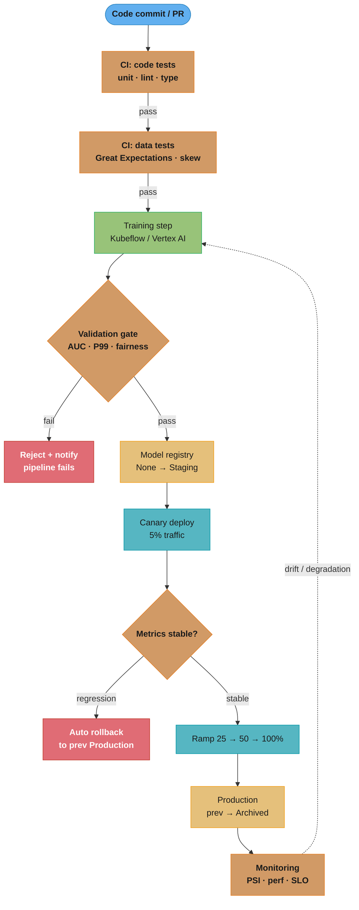
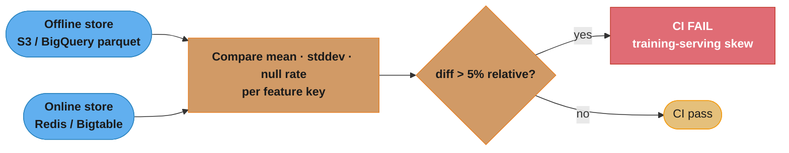
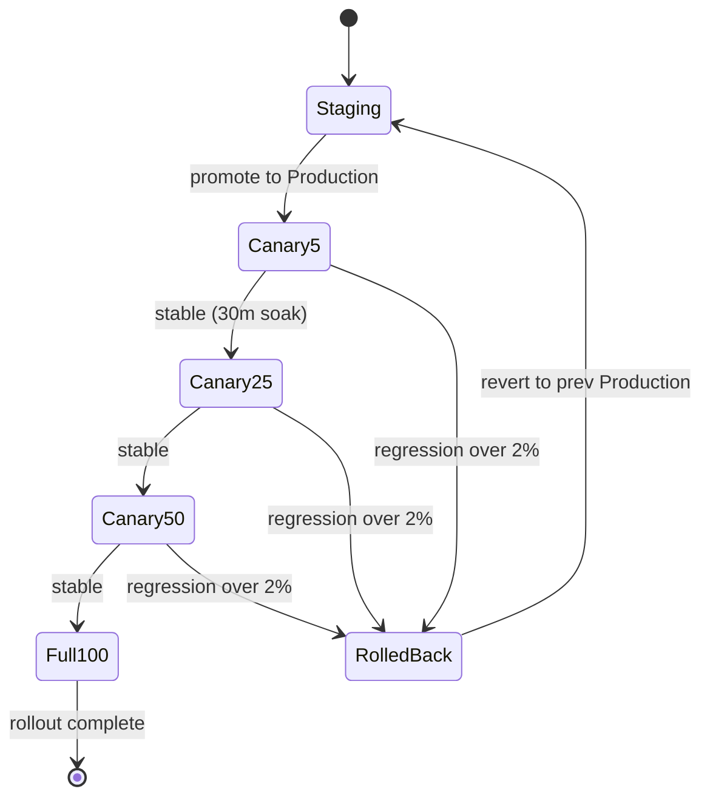
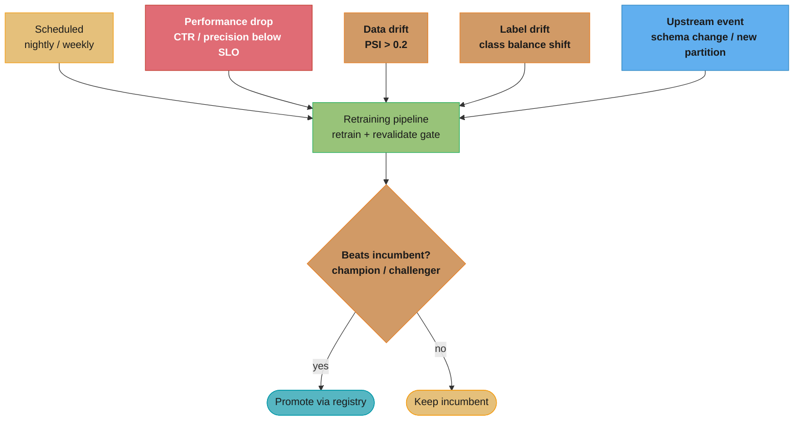

# MLOps and CI/CD for Machine Learning

---

## 1. Concept Overview

MLOps (Machine Learning Operations) is the discipline of applying DevOps principles — automation, version control, continuous integration, continuous delivery, and monitoring — to the full lifecycle of machine learning systems. It bridges the gap between ML experimentation and reliable production systems.

A software pipeline produces a binary artifact that either works or fails. An ML pipeline produces a model that degrades silently: the code may be correct while the model accuracy collapses due to data drift, label shift, or feature skew. MLOps adds a third axis — data and model health — on top of the traditional code-and-infrastructure axes that DevOps manages.

Key components:
- **Data versioning** — DVC, git-lfs; track which data snapshot produced which model
- **Experiment tracking** — MLflow Tracking, Weights & Biases; log hyperparameters, metrics, artifacts per run
- **Model registry** — MLflow Model Registry, Vertex AI Model Registry; manage model lifecycle stages
- **Pipeline orchestration** — Kubeflow Pipelines, Vertex AI Pipelines, Airflow; reproducible, containerized ML workflows
- **CI/CD for ML** — automated code, data, and model quality gates before any model reaches production
- **Monitoring and feedback** — drift detection, performance degradation alerts, retraining triggers

---

## 2. Intuition

One-line analogy: MLOps is the assembly line for machine learning — it ensures that every model rolling off the line is inspected, stamped with a serial number, tested under load, and can be recalled and replaced without stopping the factory.

Mental model: think of a model as a firmware binary. Firmware engineers version every build, run hardware-in-the-loop tests, do staged rollouts to device cohorts, and maintain rollback capability. ML teams without MLOps are shipping firmware from a USB stick with a sticky note that says "v2 final FINAL".

Why it matters: Gartner estimated in 2022 that 85% of ML projects fail to reach production. The primary killers are reproducibility failures, silent data quality issues, and the inability to monitor model health post-deployment. MLOps directly addresses all three.

Key insight: the model is not the deliverable. The deliverable is the pipeline that continuously produces, validates, and serves high-quality models.

---

## 3. Core Principles

**Reproducibility** — given the same code commit, dataset version, and hyperparameters, anyone on any machine must be able to reproduce the same trained model within acceptable numerical tolerance.

**Automation** — every step from data ingestion to model serving must be automatable. Manual steps are toil that does not scale and introduces human error at 2 AM during an incident.

**Continuous delivery of models** — new model versions should flow to production through the same pull-request and review process as code, with automated quality gates replacing (or augmenting) human review.

**Monitoring as a first-class concern** — model performance monitoring, data drift detection, and system health metrics are designed in from day one, not bolted on after the first incident.

**Fail fast with explicit gates** — a model that does not pass the performance gate (AUC >= baseline), latency SLA (P99 <= 100 ms), or fairness check is automatically rejected; it never reaches the registry staging area.

**Artifact lineage** — every production model carries a manifest: dataset URI + git commit SHA + hyperparameters + evaluation metrics. Auditors and incident responders can reconstruct exactly what produced any model.

---

## 4. Types / Architectures / Strategies

### MLOps Maturity Levels

**Level 0 — Manual process**
- Notebooks, manual data prep, model trained once
- No versioning, no monitoring
- Typical of initial proof-of-concept

**Level 1 — ML pipeline automation**
- Training pipeline is automated and reproducible
- Experiment tracking in place (MLflow / W&B)
- Models deployed manually after training
- Continuous training triggered by new data

**Level 2 — CI/CD pipeline automation**
- Full CI/CD for both code and models
- Automated testing: unit, integration, data schema, model performance gates
- Model registry with staged promotions
- Canary deployments with automatic rollback
- Drift detection triggering retraining pipelines

### CI/CD Strategy Variants

**Shadow mode testing** — new model receives a copy of live traffic, predictions logged but not served; performance compared to production model offline before any traffic shift.

**Canary deployment** — gradual traffic shift: 5% → 25% → 50% → 100%; automatic rollback triggered when key metric (AUC, F1, error rate) degrades more than a defined threshold (e.g., >2% drop relative to production baseline).

**Blue/green deployment** — full parallel environment; instant cutover; higher infrastructure cost but zero-downtime switch and instant rollback.

**A/B testing** — traffic split between model variants for statistical significance; requires sufficient volume and a defined primary metric; typical duration 1–2 weeks.

### Retraining Triggers

- **Scheduled** — weekly or nightly, regardless of drift signals; simple to implement
- **Performance-based** — online metric (CTR, conversion, precision) drops below threshold
- **Data drift** — Population Stability Index (PSI) > 0.2 on a key feature, or Kolmogorov-Smirnov test p-value < 0.05
- **Label drift** — distribution of predicted classes shifts significantly from training distribution
- **Event-triggered** — upstream schema change or new data partition available

---

## 5. Architecture Diagrams

### Full MLOps Pipeline



The pipeline gates twice: the validation gate rejects any model below the AUC / latency / fairness bar before it reaches the registry, and the canary check auto-rolls-back on live regression before full ramp. Monitoring closes the loop, feeding drift back to the training step (dotted retraining edge).

### Feature Store Consistency Check in CI



CI reads the same feature keys from both stores and fails the build if any feature's mean, stddev, or null rate diverges by more than 5% relative — catching training-serving skew before the model is retrained on inconsistent data.

### Canary Rollout State Machine (with rollback)



Traffic advances 5 → 25 → 50 → 100% only after each stage soaks cleanly; any stage that regresses more than 2% versus the production baseline jumps straight to RolledBack, which reverts serving to the previous Production model and demotes the candidate back to Staging.

### Retraining Trigger Sources



Five heterogeneous triggers fan into one retraining pipeline, but a fresh model is never promoted blindly — a champion/challenger gate requires it to beat the incumbent on recent data before the registry swaps it in, otherwise the incumbent stays.

---

## 6. How It Works — Detailed Mechanics

### MLflow Model Logging with Signature

```python
from __future__ import annotations

import mlflow
import mlflow.sklearn
import numpy as np
import pandas as pd
from mlflow.models.signature import infer_signature
from sklearn.base import BaseEstimator


def log_model(
    model: BaseEstimator,
    X_train: pd.DataFrame,
    X_test: pd.DataFrame,
    y_test: np.ndarray,
    metrics: dict[str, float],
    experiment_name: str = "default",
    registered_model_name: str | None = None,
) -> str:
    """
    Log a trained sklearn model to MLflow with full lineage.

    Returns the MLflow run_id for downstream traceability.
    """
    mlflow.set_experiment(experiment_name)

    with mlflow.start_run() as run:
        # Log all evaluation metrics
        mlflow.log_metrics(metrics)

        # Infer input/output schema from actual data — this schema is
        # validated at serving time; mismatches raise a ModelSignatureException
        signature = infer_signature(
            model_input=X_train,
            model_output=model.predict(X_train),
        )

        # Log model artifact with signature and sample input for validation
        mlflow.sklearn.log_model(
            sk_model=model,
            artifact_path="model",
            signature=signature,
            input_example=X_test.head(5),
            registered_model_name=registered_model_name,
        )

        # Log dataset hash for lineage — store SHA256 of the parquet file
        mlflow.log_param("dataset_sha256", _sha256_of_dataframe(X_train))
        mlflow.set_tag("git_commit", _get_git_sha())

        return run.info.run_id


def _sha256_of_dataframe(df: pd.DataFrame) -> str:
    import hashlib
    return hashlib.sha256(
        pd.util.hash_pandas_object(df, index=True).values.tobytes()
    ).hexdigest()[:16]


def _get_git_sha() -> str:
    import subprocess
    return subprocess.check_output(
        ["git", "rev-parse", "--short", "HEAD"],
        text=True,
    ).strip()
```

### Model Performance Gate

```python
from dataclasses import dataclass

import mlflow
from mlflow.tracking import MlflowClient


@dataclass
class ValidationGate:
    min_auc: float = 0.82
    max_p99_latency_ms: float = 100.0
    max_demographic_parity_diff: float = 0.05
    max_auc_regression_vs_production: float = 0.02  # must not drop more than 2%


def promote_to_staging(
    run_id: str,
    model_name: str,
    gate: ValidationGate,
) -> bool:
    """
    Promote a model version to Staging in MLflow Model Registry
    only if all validation gates pass.

    Returns True if promoted, False if rejected.
    """
    client = MlflowClient()
    run = client.get_run(run_id)
    metrics = run.data.metrics

    # Gate 1: absolute performance floor
    candidate_auc = metrics.get("auc", 0.0)
    if candidate_auc < gate.min_auc:
        print(f"GATE FAIL: AUC {candidate_auc:.4f} < floor {gate.min_auc}")
        return False

    # Gate 2: regression vs current production model
    production_auc = _get_production_metric(client, model_name, "auc")
    if production_auc is not None:
        regression = production_auc - candidate_auc
        if regression > gate.max_auc_regression_vs_production:
            print(
                f"GATE FAIL: AUC regression {regression:.4f} "
                f"> allowed {gate.max_auc_regression_vs_production}"
            )
            return False

    # Gate 3: latency SLA
    p99_ms = metrics.get("p99_latency_ms", 0.0)
    if p99_ms > gate.max_p99_latency_ms:
        print(f"GATE FAIL: P99 latency {p99_ms:.1f}ms > SLA {gate.max_p99_latency_ms}ms")
        return False

    # Gate 4: fairness
    dem_parity = metrics.get("demographic_parity_diff", 0.0)
    if dem_parity > gate.max_demographic_parity_diff:
        print(f"GATE FAIL: demographic parity diff {dem_parity:.4f} too high")
        return False

    # All gates passed — register and move to Staging
    model_version = client.create_model_version(
        name=model_name,
        source=f"runs:/{run_id}/model",
        run_id=run_id,
    )
    client.transition_model_version_stage(
        name=model_name,
        version=model_version.version,
        stage="Staging",
        archive_existing_versions=False,
    )
    print(f"PROMOTED: {model_name} v{model_version.version} -> Staging")
    return True


def _get_production_metric(
    client: MlflowClient,
    model_name: str,
    metric_key: str,
) -> float | None:
    prod_versions = client.get_latest_versions(model_name, stages=["Production"])
    if not prod_versions:
        return None
    run = client.get_run(prod_versions[0].run_id)
    return run.data.metrics.get(metric_key)
```

### Kubeflow Pipeline Definition (KFP SDK v2)

```python
from kfp import dsl
from kfp.dsl import Input, Output, Dataset, Model, Metrics


@dsl.component(base_image="python:3.10", packages_to_install=["scikit-learn", "pandas", "mlflow"])
def preprocess_data(
    raw_data_uri: str,
    processed_dataset: Output[Dataset],
) -> None:
    import pandas as pd

    df = pd.read_parquet(raw_data_uri)
    df = df.dropna(subset=["label"])
    df.to_parquet(processed_dataset.path, index=False)


@dsl.component(base_image="python:3.10", packages_to_install=["scikit-learn", "pandas", "mlflow"])
def train_model(
    dataset: Input[Dataset],
    model_output: Output[Model],
    metrics_output: Output[Metrics],
    n_estimators: int = 200,
    max_depth: int = 6,
) -> None:
    import mlflow
    import pandas as pd
    from sklearn.ensemble import GradientBoostingClassifier
    from sklearn.metrics import roc_auc_score
    from sklearn.model_selection import train_test_split
    import pickle

    df = pd.read_parquet(dataset.path)
    X = df.drop(columns=["label"])
    y = df["label"]

    X_train, X_val, y_train, y_val = train_test_split(X, y, test_size=0.2, random_state=42)

    clf = GradientBoostingClassifier(n_estimators=n_estimators, max_depth=max_depth)
    clf.fit(X_train, y_train)

    auc = roc_auc_score(y_val, clf.predict_proba(X_val)[:, 1])
    metrics_output.log_metric("auc", auc)

    with open(model_output.path, "wb") as f:
        pickle.dump(clf, f)


@dsl.component(base_image="python:3.10", packages_to_install=["scikit-learn", "mlflow"])
def validate_and_register(
    model: Input[Model],
    metrics: Input[Metrics],
    model_name: str,
    min_auc: float = 0.82,
) -> str:
    """Returns 'pass' or 'fail' — downstream steps gate on this output."""
    import pickle
    import mlflow

    auc = metrics.metadata.get("auc", 0.0)
    if auc < min_auc:
        print(f"Validation FAILED: AUC {auc} < {min_auc}")
        return "fail"

    with open(model.path, "rb") as f:
        clf = pickle.load(f)

    mlflow.sklearn.log_model(clf, artifact_path="model", registered_model_name=model_name)
    return "pass"


@dsl.pipeline(name="ml-training-pipeline", description="End-to-end training with validation gate")
def ml_pipeline(
    raw_data_uri: str,
    model_name: str = "fraud_detector",
    min_auc: float = 0.82,
) -> None:
    preprocess_task = preprocess_data(raw_data_uri=raw_data_uri)

    train_task = train_model(
        dataset=preprocess_task.outputs["processed_dataset"],
    )

    validate_and_register(
        model=train_task.outputs["model_output"],
        metrics=train_task.outputs["metrics_output"],
        model_name=model_name,
        min_auc=min_auc,
    )
```

### GitHub Actions CI Workflow for ML

```yaml
# .github/workflows/ml-ci.yml
name: ML CI/CD Pipeline

on:
  push:
    branches: [main, develop]
  pull_request:
    branches: [main]

env:
  PYTHON_VERSION: "3.10"
  MLFLOW_TRACKING_URI: ${{ secrets.MLFLOW_TRACKING_URI }}

jobs:
  code-quality:
    runs-on: ubuntu-latest
    steps:
      - uses: actions/checkout@v4
      - uses: actions/setup-python@v5
        with:
          python-version: ${{ env.PYTHON_VERSION }}
      - name: Install dependencies
        run: pip install -r requirements-dev.txt
      - name: Lint
        run: ruff check src/
      - name: Type check
        run: mypy src/ --strict
      - name: Unit tests
        run: pytest tests/unit/ -v --cov=src --cov-report=xml

  data-validation:
    runs-on: ubuntu-latest
    needs: code-quality
    steps:
      - uses: actions/checkout@v4
      - uses: actions/setup-python@v5
        with:
          python-version: ${{ env.PYTHON_VERSION }}
      - name: Install dependencies
        run: pip install great_expectations pandas pyarrow
      - name: Run Great Expectations schema + distribution checks
        run: python scripts/validate_data.py --datasource ${{ secrets.DATA_URI }}
      - name: Feature store consistency check
        run: python scripts/check_feature_store_skew.py --threshold 0.05

  model-validation:
    runs-on: ubuntu-latest
    needs: data-validation
    steps:
      - uses: actions/checkout@v4
      - uses: actions/setup-python@v5
        with:
          python-version: ${{ env.PYTHON_VERSION }}
      - name: Install ML dependencies
        run: pip install -r requirements-ml.txt
      - name: Train model (dry run on CI dataset)
        run: python scripts/train.py --config configs/ci.yaml --output /tmp/model
      - name: Performance gate — AUC and latency
        run: |
          python scripts/validate_model.py \
            --model /tmp/model \
            --min-auc 0.82 \
            --max-p99-ms 100 \
            --fairness-threshold 0.05
      - name: Integration tests (model serving)
        run: pytest tests/integration/ -v -k "serving"
      - name: Push to registry if on main
        if: github.ref == 'refs/heads/main'
        run: python scripts/register_model.py --stage Staging
```

### Canary Traffic Split Logic

```python
from __future__ import annotations

import time
from dataclasses import dataclass, field

import requests


@dataclass
class CanaryController:
    """
    Gradually shifts traffic from the current production model to a canary.
    Automatically rolls back if metric regression exceeds the threshold.
    """
    canary_endpoint: str
    production_endpoint: str
    metric_url: str          # Prometheus query endpoint
    metric_query: str        # e.g. 'model_auc{version="canary"}'
    baseline_auc: float
    max_regression: float = 0.02
    stages: list[float] = field(default_factory=lambda: [0.05, 0.25, 0.50, 1.0])
    stage_soak_minutes: int = 30

    def run(self) -> bool:
        """Returns True if full rollout succeeded, False if rollback triggered."""
        for traffic_fraction in self.stages:
            self._set_traffic_split(traffic_fraction)
            print(f"Traffic to canary: {int(traffic_fraction * 100)}%")
            time.sleep(self.stage_soak_minutes * 60)

            canary_auc = self._fetch_metric()
            regression = self.baseline_auc - canary_auc
            print(f"  Baseline AUC: {self.baseline_auc:.4f}, Canary AUC: {canary_auc:.4f}, regression: {regression:.4f}")

            if regression > self.max_regression:
                print(f"ROLLBACK triggered: regression {regression:.4f} > {self.max_regression}")
                self._set_traffic_split(0.0)
                return False

        print("Canary rollout complete: 100% traffic on new model")
        return True

    def _set_traffic_split(self, fraction: float) -> None:
        # In practice this calls the serving infrastructure API
        # (Istio VirtualService, Nginx upstream weights, etc.)
        requests.post(
            "http://serving-control-plane/traffic",
            json={"canary_weight": fraction, "production_weight": 1.0 - fraction},
            timeout=5,
        )

    def _fetch_metric(self) -> float:
        resp = requests.get(
            f"{self.metric_url}/api/v1/query",
            params={"query": self.metric_query},
            timeout=10,
        )
        resp.raise_for_status()
        result = resp.json()["data"]["result"]
        return float(result[0]["value"][1]) if result else self.baseline_auc
```

**In plain terms.** A canary schedule is two numbers multiplied together — `len(stages) x stage_soak_minutes` sets how long the rollout takes, and `sum(stage x soak)` sets how much user traffic a bad model gets to touch before you catch it.

Those two pull in opposite directions, which is the whole design tension: every soak minute you add buys confidence and costs rollout time.

| Symbol | What it is |
|--------|------------|
| `stages` | Traffic fractions stepped through in order. `[0.05, 0.25, 0.50, 1.0]` |
| `stage_soak_minutes` | How long each fraction runs before the next check. `30` |
| `baseline_auc` | The current Production model's AUC — the number the canary is measured against, not an absolute floor |
| `regression` | `baseline_auc - canary_auc`. Positive means the canary is worse |
| `max_regression` | Rollback trigger. `0.02` — 2 AUC points, matching the gate in `ValidationGate` |

**Walk one example.** The default schedule, in wall-clock time and in exposed traffic:

```
  stage    traffic    soak      traffic-minutes (traffic x soak)
  ------   -------    ------    --------------------------------
  1        5%         30 min    0.05 x 30 =  1.5
  2        25%        30 min    0.25 x 30 =  7.5
  3        50%        30 min    0.50 x 30 = 15.0
  4        100%       30 min    1.00 x 30 = 30.0
                      ------                -----
  total                120 min                54.0

  risk window (before 100%)  = 3 x 30      = 90 min of graduated exposure
  exposure before full ramp  = 1.5+7.5+15  = 24 traffic-minutes
  same 120 min at 100% from the start      = 120 traffic-minutes
  reduction  = 1 - 54/120 = 55% less exposed traffic for the same two hours
```

Three checks fire before any user population is fully committed, and the first one costs only `1.5` traffic-minutes — a broken model is caught having touched 5% of users for half an hour rather than all of them.

**Why the soak cannot be shortened to "just check once."** `_fetch_metric` reads an online AUC that needs labelled outcomes to accumulate; at 5% traffic a 5-minute soak may not produce enough labelled events for the AUC to be anything but noise, and the controller would roll back healthy models on sampling variance. The 30-minute soak is a sample-size decision disguised as a timer, which is also why the first stage is the riskiest one to shrink: it has both the smallest traffic share and the same window.

---

## 7. Real-World Examples

**Netflix** uses a multi-stage ML platform where every model version is registered in their internal registry with a lineage manifest (dataset snapshot, code SHA, training job ID). Canary deployments on recommendation models use engagement rate as the primary rollback metric, with automatic rollback if engagement drops more than 1% relative within 24 hours.

**Uber Michelangelo** pioneered the feature store concept to guarantee offline-online consistency. Features computed in the batch pipeline for training are served from the same feature store at inference, eliminating an entire class of training-serving skew bugs.

**Airbnb** runs Great Expectations checks as a mandatory CI step for any dataset used in a production model. Schema changes to upstream tables break the CI pipeline before the model is ever retrained on corrupted data.

**Google Cloud Vertex AI Pipelines** is built on Kubeflow and integrates with Cloud Build for CI. Teams define pipelines as Python DAGs, store them in Artifact Registry, and trigger them from Cloud Build on any push to the training data bucket.

---

## 8. Tradeoffs

| Approach | Benefit | Cost |
|---|---|---|
| Kubeflow Pipelines (self-managed) | Full control, portable across clouds | High setup and ops overhead; requires Kubernetes expertise |
| Vertex AI Pipelines (managed) | Zero infrastructure management, GCP-native | Vendor lock-in; cost increases at scale |
| MLflow Model Registry | Open source, integrates with any cloud | No built-in canary orchestration; manual promotion workflow |
| Canary deployment | Gradual risk; automatic rollback | Requires traffic routing infra (Istio, Nginx); doubles serving cost during split |
| Blue/green deployment | Instant rollback; zero downtime | Doubles infra cost continuously; expensive for GPU serving |
| Scheduled retraining | Simple, predictable | May retrain unnecessarily; may miss sudden drift between schedules |
| Drift-triggered retraining | React faster to data shifts | Requires robust drift detection; risk of false-positive retraining storms |
| Shadow mode testing | Zero risk before canary | Doubles inference cost; adds latency to the shadow path |

---

## 9. When to Use / When NOT to Use

**Use MLOps Level 2 (full CI/CD) when:**
- Model powers a user-facing product where degradation directly impacts revenue or safety
- Retraining happens more than once a month
- Multiple data scientists are contributing models
- Regulatory compliance requires audit trails (financial services, healthcare)
- The team has been bitten by a production incident caused by model drift or a bad deployment

**Use MLOps Level 1 (automated training only) when:**
- Team is small (1–2 engineers), model is stable, retraining is rare
- Model is internal tooling with acceptable degradation risk
- Budget and engineering bandwidth do not justify full pipeline investment

**Do NOT invest in full MLOps when:**
- Model is a one-time batch analysis with no production serving requirement
- Proof-of-concept or research prototype (add MLOps when graduating to production)
- The underlying business problem changes faster than the pipeline can stabilize

---

## 10. Common Pitfalls

### War Story 1: No Model Versioning — Wrong Model Deployed for 6 Hours

A team maintained a shared `model.pkl` file in S3 at a fixed key `s3://bucket/model/current.pkl`. During a hotfix deployment, an engineer manually copied an older model version over the current file while intending to test a rollback. The serving fleet picked up the old model on the next health-check cycle (90 seconds). AUC dropped from 0.88 to 0.71. No alert fired because the monitoring dashboard tracked only system metrics (CPU, latency), not model-level prediction quality. The incident was detected 6 hours later by a downstream team noticing conversion rate drop.

Fix: model registry with immutable versioned artifacts. Each model version gets a unique S3 key (`s3://bucket/models/{model_name}/v{version}/model.pkl`). Serving config references a version number, not a mutable key. Any change to the serving config goes through the same PR process as code.

### War Story 2: No Data Tests — NaN Features Served for 3 Days

An upstream data team renamed a column in a Hive table from `user_age_bucket` to `age_bucket`. The feature pipeline had no schema validation. It silently produced a DataFrame with all-NaN values for that feature and logged no error — pandas `.merge()` on mismatched column names produces NaN fill rather than raising. The model received NaN inputs, its imputation was not designed for this pattern, and predictions became biased toward the negative class. Precision dropped 12%. The team discovered it during a quarterly model review, not a real-time alert.

Fix: Great Expectations suite runs in CI on every data pipeline change. Schema contract specifies required columns, types, null rate <= 1%, and value range. Any upstream schema change that breaks the contract fails the CI pipeline before the feature pipeline is deployed.

### War Story 3: Rollback Not Tested — 2-Hour Outage During Incident

A production model failed a canary: AUC regressed 4%. The runbook said "execute `scripts/rollback.py`". When the on-call engineer ran it during the incident, the script failed because it read the previous model version from an environment variable (`PREV_MODEL_VERSION`) that had been overwritten during the canary promotion step. The rollback script had never been tested end-to-end in the staging environment. The team spent 2 hours manually reconstructing the previous serving config from logs.

Fix: rollback drills are scheduled monthly. The CI pipeline includes a rollback dry-run step that promotes a new model version to Staging, then immediately runs the rollback script and verifies that the serving config reverts to the pre-promotion state. Rollback is automated via the model registry: transitioning the previous Production version back to Production is a single API call.

### War Story 4: Training-Serving Skew — 15% Precision Drop

A team trained a fraud detection model that applied StandardScaler to three numeric features. The scaler was fitted on training data and persisted separately in `scaler.pkl`. The serving code loaded the model but forgot to load and apply the scaler (the serving engineer assumed the scaler was baked into the model pipeline). The model received raw, unscaled features. It still produced predictions — just poor ones. Precision dropped from 0.74 to 0.63. The drift detection system flagged statistical shifts in input distributions after 4 days, by which time significant fraud had passed through.

Fix: the sklearn `Pipeline` object bundles the scaler and the classifier into a single artifact. `mlflow.sklearn.log_model(pipeline, ...)` logs the full pipeline, and `mlflow.sklearn.load_model(uri)` always returns the complete pipeline. A CI integration test posts raw (unscaled) feature vectors to the model server and asserts that predictions fall within the expected range, catching serving skew before deployment.

---

## 11. Technologies & Tools

**Experiment Tracking:**
- MLflow Tracking — open source, self-hosted or Databricks-managed; tracks runs, params, metrics, artifacts
- Weights & Biases (W&B) — SaaS; richer visualization, team collaboration, sweeps for hyperparameter search
- Neptune.ai — SaaS alternative; strong metadata management

**Model Registry:**
- MLflow Model Registry — open source; stages: None, Staging, Production, Archived; model signatures; REST API
- Vertex AI Model Registry — GCP-managed; integrates with Vertex AI Endpoints
- AWS SageMaker Model Registry — AWS-managed; integrates with SageMaker Endpoints

**Pipeline Orchestration:**
- Kubeflow Pipelines (KFP v2) — Kubernetes-native; KFP SDK for Python DAG definition; portable
- Vertex AI Pipelines — managed KFP on GCP; Cloud Build integration; no infra management
- Apache Airflow — general-purpose; widely used; less ML-native than KFP
- Prefect / Dagster — modern workflow orchestrators; good Python-native experience

**Data Versioning:**
- DVC (Data Version Control) — git-compatible; tracks large files in remote storage (S3, GCS); versioned datasets
- Delta Lake / Iceberg — ACID-compliant table formats; time-travel queries for dataset versioning

**Data Quality:**
- Great Expectations — schema + distribution expectations; CLI and Python API; integrates into Airflow and CI
- Deepchecks — ML-specific checks including train-test drift, model performance degradation
- Evidently AI — drift reports, data quality reports; integrates with MLflow

**CI/CD:**
- GitHub Actions — YAML-based workflows; free tier for public repos; GitHub-native
- GitLab CI/CD — strong for self-hosted enterprise deployments
- Jenkins — legacy; widely deployed; high flexibility, high maintenance overhead

**Serving and Traffic Management:**
- Istio / Envoy — service mesh; fine-grained traffic splitting for canary deployments
- Seldon Core — Kubernetes-native model serving with canary and shadow mode built in
- BentoML — model packaging and serving; cloud-agnostic
- Triton Inference Server (NVIDIA) — high-performance GPU serving; supports TensorRT, ONNX, PyTorch

**Monitoring:**
- Prometheus + Grafana — metrics collection and dashboards; pull-based
- Evidently AI — open source drift and model performance monitoring
- Arize AI — SaaS; model observability; embedding drift, prediction drift
- Langfuse — LLM-specific observability (see `llm/llm_observability_and_monitoring/`)

**Feature Stores:**
- Feast — open source; offline (Parquet/BigQuery) + online (Redis/DynamoDB) stores
- Tecton — SaaS feature platform; strong consistency guarantees
- Vertex AI Feature Store — GCP-managed; integrates with BigQuery and Vertex AI Pipelines

---

## 12. Interview Questions with Answers

**Q: What is the difference between a DevOps CI/CD pipeline and an MLOps CI/CD pipeline?**
A DevOps pipeline tests code correctness and deploys a deterministic binary artifact. An MLOps pipeline adds two additional dimensions: data quality (schema, distribution) and model quality (performance gates, fairness, latency SLAs). A software artifact either passes tests or fails; a model artifact can pass all code tests while silently degrading due to data distribution shift, which is why model-specific validation gates are mandatory in MLOps.

**Q: What is training-serving skew and how do you detect it in CI?**
Training-serving skew occurs when features presented to the model at serving time differ from what the model saw during training. This typically happens because preprocessing steps (scaling, encoding, imputation) are applied during training but omitted or applied differently at serving. Detection in CI: write an integration test that sends known raw input vectors to the deployed model server and asserts that predictions match expected outputs computed offline with the full training pipeline. Also compare mean and standard deviation of each feature between the offline feature store and online serving queries; flag any feature with >5% relative difference.

**Q: Explain MLflow Model Registry stages and how you automate promotion.**
MLflow Model Registry has four stages: None (newly registered), Staging (validated, awaiting production), Production (serving live traffic), Archived (retired). Automation: the CI pipeline trains a model, logs it to MLflow, calls `create_model_version()` to register it at stage None, then runs validation gates (AUC >= baseline, latency SLA, fairness checks). If all gates pass, the pipeline calls `transition_model_version_stage(stage="Staging")`. A separate deployment job, triggered by a merge to main or a manual approval, transitions from Staging to Production and archives the previous Production version.

**Q: How do you implement automatic rollback in a canary deployment for an ML model?**
The canary controller polls a real-time metric (AUC from an online evaluation service, or a business proxy metric like conversion rate) every N minutes. If the metric regresses beyond a defined threshold (e.g., AUC drops > 2% from the production baseline), the controller calls the serving infrastructure API to set canary traffic weight to 0% and production weight to 100%. Simultaneously, it transitions the canary model version back to Staging in the model registry and sends an alert. The critical requirement is that rollback must be atomic from the user's perspective: Istio VirtualService or Nginx upstream weight changes propagate in under 5 seconds.

**Q: What is Population Stability Index (PSI) and when do you trigger retraining based on it?**
PSI measures how much the distribution of a feature has shifted between a reference period (training data) and a current period (recent production traffic). PSI = sum over bins of (actual_fraction - expected_fraction) * ln(actual_fraction / expected_fraction). PSI < 0.1: no significant shift; 0.1–0.2: moderate shift, monitor; > 0.2: significant shift, trigger retraining. A common production setup computes PSI daily on the top 20 features and triggers a retraining pipeline when PSI > 0.2 on any of the top 5 features by feature importance.

**Q: How does a feature store solve the offline-online consistency problem?**
A feature store maintains a single feature computation definition that writes to both an offline store for batch training and an online store for low-latency inference. The offline store is typically S3 Parquet or BigQuery; the online store is Redis or Bigtable. Training pipelines read from the offline store; the serving layer reads from the online store using the same feature keys. The computation logic is defined once and executed in both contexts, eliminating the divergence that occurs when data science teams write Pandas code for training and engineering teams independently write SQL or Java for serving.

**Q: What data tests should run in CI before a model is retrained?**
Schema validation: required columns present, correct dtypes, no unexpected columns. Null rate: null fraction per column <= defined threshold (e.g., 1% for label column, 10% for optional features). Distribution checks: mean and standard deviation of numeric features within 3 standard deviations of historical baseline. Referential integrity: foreign keys resolve to valid entity IDs. Volume check: row count within expected range (guards against partial data loads). Feature store consistency: online store feature statistics within 5% of offline store statistics for the same time window.

**Q: How do you handle a situation where a new model version passes all CI gates but degrades in production?**
First, trigger automatic rollback via the canary controller if the degradation is caught within the canary window. If the model reached 100% traffic before degradation was detected, manually transition the previous Production model version back to Production in the registry and set traffic to 0% on the degraded version. Then conduct a root cause analysis: compare input feature distributions between the period when the old model was healthy and the current period; check whether a data pipeline change coincided with the deployment; run the model validation suite against the current production feature distribution rather than the CI holdout set. The common cause is that the CI holdout dataset did not represent the current data distribution (covariate shift since the last training run).

**Q: What is the difference between shadow mode and canary deployment in ML?**
In shadow mode, the new model receives a copy of all live requests and produces predictions, but those predictions are never shown to users — they are logged for offline comparison against the production model. Shadow mode has zero user-facing risk but does not validate user behavior (e.g., click-through rate) on the new model's output. Canary deployment routes a small fraction of real traffic (5%) to the new model, whose predictions are actually served to users. Canary validates true user-facing metrics but carries a small risk that the fraction of users receiving canary predictions may have a degraded experience if the model underperforms.

**Q: How do you version datasets in an ML project and why is it insufficient to just track the S3 path?**
An S3 path is mutable — the same path can point to different data at different times (overwrite, append, schema evolution). Dataset versioning requires an immutable reference: a git commit SHA of a DVC `.dvc` file (which records the S3 URI + SHA256 of the data), or an Iceberg/Delta Lake table snapshot ID (a monotonically increasing integer that points to an immutable manifest). The MLflow run record stores this immutable reference, so any model can be traced back to the exact byte-for-byte dataset used to train it, enabling full reproducibility and regulatory audit trails.

**Q: What is a model signature in MLflow and why does it matter for CI?**
A model signature in MLflow specifies the expected schema (column names, dtypes, value ranges) for model inputs and outputs. It is inferred from actual training data using `infer_signature(X_train, model.predict(X_train))` and stored as JSON alongside the model artifact. At serving time, MLflow's pyfunc wrapper validates every request against the signature and raises a `ModelSignatureException` if the schema does not match — before the model ever runs inference. In CI, the integration test sends a malformed request to catch any serving code that bypasses signature validation. This provides the serving-layer equivalent of an API contract test.

**Q: Why must preprocessing artifacts like scalers and encoders be bundled with the model, not stored separately?**
A separately stored scaler can be forgotten or applied differently at serving time, feeding the model raw features and silently degrading predictions with no error. Bundle preprocessing and the estimator into one artifact (an sklearn `Pipeline`) and log it as a single unit, so `load_model` always returns the complete transform-plus-predict path. This eliminates an entire class of training-serving skew that produces plausible-but-wrong outputs rather than crashes.

**Q: What is the CACE principle in ML systems?**
CACE means "Changing Anything Changes Everything" — in ML there are no isolated features, because every input interacts through the learned model. Removing a feature, changing its encoding, or retraining on new data can shift the model's behavior on inputs that seem unrelated, so you cannot reason about changes locally the way you can with modular code. The practical consequence is that any change requires full retraining plus end-to-end evaluation, not a unit test on the changed part alone.

**Q: Should every data drift alert trigger an automatic retraining pipeline?**
No — auto-retraining on every drift signal risks a retraining storm that burns compute and can promote a model fit to transient noise. Drift is a leading indicator; gate retraining on a confirmed performance drop, sustained multi-feature drift, and availability of fresh trustworthy labels, with a champion/challenger evaluation before promotion. Otherwise a single noisy feature or a one-day spike triggers needless retrains that may degrade production.

**Q: What is continuous training (CT) and how does it differ from CI and CD?**
Continuous training is automatic retraining of the model on new data — a third pipeline axis that DevOps CI/CD does not have. CI validates code and data, CD ships the artifact, and CT regenerates the artifact itself when data drifts or on a schedule, then hands the new model back through the same CI/CD gates. MLOps Level 1 automates CT; Level 2 wraps full CI/CD around it.

**Q: Why is reproducibility harder for ML pipelines, and what four things must you version to achieve it?**
An ML result depends on data and randomness, not just code, so the same script can produce a different model unless every input is pinned. To reproduce a model you must version all four of: the dataset (DVC SHA or table snapshot id), the code (git commit), the hyperparameters (logged to MLflow), and the environment (Docker image digest). Miss any one — most often the dataset or a random seed — and the "same" run diverges beyond tolerance.

**Q: What are the three MLOps maturity levels and how do you know which one you need?**
Level 0 is manual notebooks, Level 1 automates the training pipeline, and Level 2 adds full CI/CD with gates, a registry, canary deploys, and drift-triggered retraining. Choose by blast radius and cadence: a one-off analysis stays at 0, a stable internal model at 1, and a revenue- or safety-critical model retrained more than monthly needs Level 2. Jumping straight to Level 2 for a prototype is over-engineering.

**Q: How do you keep a retraining pipeline from silently learning on corrupted or poisoned data?**
Put automated data-validation gates before training so bad data fails the pipeline instead of flowing into the model. Great Expectations (or equivalent) enforces a schema contract — required columns, dtypes, null-rate and range bounds, row-count volume checks — and distribution checks flag values outside historical norms; for adversarial risk, add anomaly detection on new partitions and require human approval for large shifts. The gate must block the run, not merely warn.

---

## 13. Best Practices

**Treat the training pipeline as production code.** Every script that trains a model goes through the same code review, testing, and linting process as application code. Data scientists own their pipeline code in git, not in notebooks checked in as `.ipynb` files.

**Make the model artifact the single source of truth.** Bundle preprocessing (scaler, encoder, imputer) with the model in a single sklearn `Pipeline` or equivalent. Log this unified artifact to the model registry. Never log a raw model that requires separately managed preprocessing code.

**Version everything that affects the model.** Dataset (DVC SHA or table snapshot ID), code (git commit SHA), hyperparameters (logged to MLflow), environment (Docker image digest). All four must be stored on the MLflow run record before the model is registered.

**Automate rollback and test it monthly.** The rollback procedure must require no manual steps beyond triggering the rollback command. Run a monthly rollback drill in a staging environment: promote a new model version, verify it is serving, then trigger rollback and verify the previous version is serving within 60 seconds.

**Define performance gates as code, not documentation.** Gate thresholds live in a versioned config file (e.g., `configs/validation_gates.yaml`). Changes to thresholds require a PR review. This prevents silent gate relaxation during time pressure.

**Run evaluation on a time-ordered holdout set.** Never use random shuffled train-test splits for time-series or event data. The holdout set should represent the most recent time period, simulating real deployment conditions. A model that achieves 0.91 AUC on a shuffled split may achieve 0.83 AUC on a time-ordered split.

**Monitor the model, not just the system.** Infrastructure metrics (CPU, latency, error rate) are necessary but not sufficient. Deploy an online evaluation service that computes model-level metrics (prediction distribution, AUC on a labeled sample, feature drift) and feeds them to Prometheus. Alert on model metric degradation, not just system failures.

**Keep the CI training job fast by using a representative sample.** Full training runs can take hours. The CI training step should use a 10–20% stratified sample of the training data and complete in under 10 minutes. The performance gate on this sample uses a lower absolute threshold but still enforces the regression-vs-production gate.

---

## 14. Case Study

**Scenario:** A ride-sharing company (12M daily rides, 4M active drivers) runs a surge pricing model that updates every 5 minutes. The current manual promotion process takes 3 days from "model passes offline eval" to "model in production", causing 4-6 stale model incidents per quarter where drift degrades pricing accuracy. The goal: implement a CI/CD pipeline with MLflow Registry + GitHub Actions that promotes models automatically when AUC-ROC >= 0.92 and MAPE <= 8% on a rolling 7-day holdout, with promotion-to-serving in under 45 minutes and automatic rollback if production error rate exceeds 2x baseline within 30 minutes.

**Architecture:**
```
Data Pipeline (hourly Spark job)
  Feature store refresh: driver supply, demand signals,
  weather, events, historical price elasticity
         |
         v
MLflow Experiment Tracking
  Parameterised training run (XGBoost or LightGBM)
  Logs: params, metrics, model artifact, feature schema
  Registry: Staging -> Production transition gate
         |
         v
GitHub Actions CI Workflow  (triggered on model tag push)
  +----------------------------------------------+
  |  1. Checkout model code + MLflow artifact     |
  |  2. Run offline validation gate               |
  |     - AUC-ROC >= 0.92 on 7-day holdout       |
  |     - MAPE <= 8% on surge windows            |
  |     - PSI <= 0.15 vs production model        |
  |     - Schema compatibility check             |
  |  3. Integration test (shadow traffic, 15min) |
  |  4. MLflow transition: Staging -> Production  |
  |  5. Deploy to K8s (rolling update, 10% canary)|
  +----------------------------------------------+
         |
         v
Model Serving (FastAPI + TorchServe, 400 RPS)
  Blue-green deployment with 10%/90% canary split
  Prometheus metrics: request rate, error rate, p99 latency
         |
         v
Automated Rollback Monitor
  Compares canary error_rate vs baseline
  Triggers rollback if ratio > 2.0 within 30min window
```

**Step-by-step implementation:**

```python
from __future__ import annotations
import mlflow
import mlflow.lightgbm
from mlflow.tracking import MlflowClient
import lightgbm as lgb
import numpy as np
import pandas as pd
from sklearn.metrics import roc_auc_score, mean_absolute_percentage_error

EXPERIMENT_NAME = "surge_pricing_model"
MODEL_NAME = "surge_pricing_lgbm"
PROMOTION_THRESHOLDS: dict[str, float] = {
    "auc_roc": 0.92,
    "mape": 0.08,
    "psi_score": 0.15,
}

def train_and_log_model(
    X_train: pd.DataFrame,
    y_train: pd.Series,
    X_val: pd.DataFrame,
    y_val: pd.Series,
    params: dict,
    feature_schema: dict[str, str],   # col -> dtype mapping
) -> str:
    mlflow.set_experiment(EXPERIMENT_NAME)

    with mlflow.start_run() as run:
        mlflow.log_params(params)
        mlflow.log_dict(feature_schema, "feature_schema.json")

        dtrain = lgb.Dataset(X_train, label=y_train)
        dval = lgb.Dataset(X_val, label=y_val, reference=dtrain)
        model = lgb.train(
            params,
            dtrain,
            valid_sets=[dval],
            num_boost_round=1000,
            callbacks=[lgb.early_stopping(50), lgb.log_evaluation(0)],
        )

        val_probs = model.predict(X_val)
        auc_roc = roc_auc_score(y_val, val_probs)
        mape = mean_absolute_percentage_error(y_val, val_probs.clip(1e-6, 1))

        mlflow.log_metric("val_auc_roc", auc_roc)
        mlflow.log_metric("val_mape", mape)
        mlflow.lightgbm.log_model(model, "model")

        # Register model in Staging
        model_uri = f"runs:/{run.info.run_id}/model"
        mlflow.register_model(model_uri, MODEL_NAME)
        print(f"Run {run.info.run_id}: AUC-ROC={auc_roc:.4f}, MAPE={mape:.4f}")
        return run.info.run_id
```

```python
def compute_psi(
    baseline_scores: np.ndarray,
    candidate_scores: np.ndarray,
    n_bins: int = 10,
) -> float:
    bins = np.percentile(baseline_scores, np.linspace(0, 100, n_bins + 1))
    bins[0] = -np.inf
    bins[-1] = np.inf

    baseline_hist, _ = np.histogram(baseline_scores, bins=bins)
    candidate_hist, _ = np.histogram(candidate_scores, bins=bins)

    baseline_pct = baseline_hist / baseline_hist.sum() + 1e-6
    candidate_pct = candidate_hist / candidate_hist.sum() + 1e-6

    psi = float(np.sum((candidate_pct - baseline_pct) * np.log(candidate_pct / baseline_pct)))
    return psi

def validate_model_for_promotion(
    client: MlflowClient,
    run_id: str,
    X_holdout: pd.DataFrame,
    y_holdout: pd.Series,
    production_scores: np.ndarray,
    feature_schema_production: dict[str, str],
) -> dict[str, bool | float]:
    model_uri = f"runs:/{run_id}/model"
    model = mlflow.lightgbm.load_model(model_uri)

    # Schema compatibility check
    candidate_schema: dict = client.download_artifacts(run_id, "feature_schema.json")
    schema_ok = (set(candidate_schema.keys()) == set(feature_schema_production.keys()))

    candidate_probs = model.predict(X_holdout)
    auc_roc = roc_auc_score(y_holdout, candidate_probs)
    mape = mean_absolute_percentage_error(y_holdout, candidate_probs.clip(1e-6, 1))
    psi = compute_psi(production_scores, candidate_probs)

    results = {
        "auc_roc": auc_roc,
        "mape": mape,
        "psi_score": psi,
        "schema_compatible": schema_ok,
        "auc_roc_pass": auc_roc >= PROMOTION_THRESHOLDS["auc_roc"],
        "mape_pass": mape <= PROMOTION_THRESHOLDS["mape"],
        "psi_pass": psi <= PROMOTION_THRESHOLDS["psi_score"],
        "schema_pass": schema_ok,
    }
    results["all_pass"] = all(
        results[k] for k in ["auc_roc_pass", "mape_pass", "psi_pass", "schema_pass"]
    )
    return results
```

**Stated plainly.** `(candidate_pct - baseline_pct) * log(candidate_pct / baseline_pct)` asks, bin by bin, "how much mass moved, and how big a proportional move was that?" — then sums the answers into one number that is zero when nothing shifted and grows fast when mass piles up somewhere new.

Both factors carry the same sign, so every term is non-negative: PSI can only be zero or positive, and it cannot cancel a shift in one bin against a shift in another.

| Symbol | What it is |
|--------|------------|
| `baseline_scores` | Score distribution of the current Production model — the reference the candidate is compared to |
| `n_bins = 10` | Number of buckets. Cut on baseline *percentiles*, so `baseline_pct` is 10% in every bin by construction |
| `baseline_pct` | Expected fraction of scores in a bin. `0.10` here, because of the percentile binning |
| `candidate_pct` | Actual fraction of the candidate's scores landing in that same bin |
| difference term | `candidate_pct - baseline_pct` — absolute mass moved |
| log-ratio term | `log(candidate_pct / baseline_pct)` — relative size of that move; `0` when the bin is unchanged |
| `+ 1e-6` | Guard so an empty bin does not produce `log(0)` and blow the score up to infinity |
| `psi_score: 0.15` | This pipeline's promotion gate — stricter than the usual `0.2` retraining trigger |

**Walk one example.** Percentile binning makes the baseline column all `0.10`, so only the candidate row varies:

```
  bin  base   cand   diff    log(cand/base)   term
   1   0.10   0.06   -0.04      -0.5108      0.02043
   2   0.10   0.08   -0.02      -0.2231      0.00446
   3   0.10   0.09   -0.01      -0.1054      0.00105
   4   0.10   0.10    0.00       0.0000      0.00000
   5   0.10   0.10    0.00       0.0000      0.00000
   6   0.10   0.10    0.00       0.0000      0.00000
   7   0.10   0.11   +0.01      +0.0953      0.00095
   8   0.10   0.12   +0.02      +0.1823      0.00365
   9   0.10   0.12   +0.02      +0.1823      0.00365
  10   0.10   0.12   +0.02      +0.1823      0.00365
                                             -------
                                    PSI    = 0.0378   <- below 0.1: no meaningful shift
```

Push the same shape further and the gate starts biting:

```
  cand = [.03 .05 .07 .09 .10 .11 .13 .14 .14 .14]  ->  PSI = 0.1799
         blocked by this pipeline's 0.15 promotion gate, but under the 0.2 retrain trigger

  cand = [.02 .04 .06 .08 .10 .12 .14 .14 .15 .15]  ->  PSI = 0.2797
         over 0.2 -- significant shift, retraining territory
```

**Why the extreme bins dominate.** Bin 1 alone contributes `0.02043`, over half the total `0.0378`, even though bins 8-10 each moved by a larger absolute `+0.02`. The log-ratio is what does it: losing 40% of a bin's mass (`0.10 -> 0.06`) is a bigger proportional move than gaining 20% (`0.10 -> 0.12`), so PSI is most sensitive to bins that empty out. That is deliberate — a score band the model has stopped producing at all is exactly the failure that breaks downstream thresholds calibrated on the old distribution.

```python
import subprocess
import time
import requests

def promote_and_deploy(
    client: MlflowClient,
    run_id: str,
    model_name: str = MODEL_NAME,
    canary_weight: float = 0.1,
    canary_monitor_minutes: int = 30,
    error_rate_multiplier_threshold: float = 2.0,
) -> bool:
    # Transition to Production in MLflow Registry
    versions = client.search_model_versions(f"name='{model_name}'")
    staging_version = next(
        v for v in versions if v.run_id == run_id and v.current_stage == "Staging"
    )
    client.transition_model_version_stage(
        name=model_name, version=staging_version.version, stage="Production"
    )
    print(f"Model version {staging_version.version} promoted to Production")

    # Deploy canary via kubectl
    subprocess.run([
        "kubectl", "set", "image",
        "deployment/surge-pricing-canary",
        f"model-server=registry/surge-model:{run_id}",
    ], check=True)
    subprocess.run([
        "kubectl", "patch", "virtualservice", "surge-pricing-vs",
        "--patch", f'{{"spec":{{"http":[{{"weight":{int(canary_weight*100)}}},{{"weight":{int((1-canary_weight)*100)}}}]}}}}'
    ], check=True)

    # Monitor canary error rate for 30 minutes
    baseline_error_rate = get_prometheus_metric("surge_pricing_error_rate{canary='false'}")
    poll_interval_s = 60
    for minute in range(canary_monitor_minutes):
        time.sleep(poll_interval_s)
        canary_error_rate = get_prometheus_metric("surge_pricing_error_rate{canary='true'}")
        if canary_error_rate > baseline_error_rate * error_rate_multiplier_threshold:
            print(f"Canary error rate {canary_error_rate:.4f} > {baseline_error_rate * 2:.4f}; rolling back")
            subprocess.run(["kubectl", "rollout", "undo", "deployment/surge-pricing-canary"], check=True)
            client.transition_model_version_stage(
                name=model_name, version=staging_version.version, stage="Archived"
            )
            return False

    # Promote canary to 100%
    subprocess.run([
        "kubectl", "patch", "virtualservice", "surge-pricing-vs",
        "--patch", '{"spec":{"http":[{"weight":100},{"weight":0}]}}'
    ], check=True)
    return True

def get_prometheus_metric(query: str) -> float:
    resp = requests.get(
        "http://prometheus:9090/api/v1/query",
        params={"query": query},
        timeout=5,
    )
    return float(resp.json()["data"]["result"][0]["value"][1])
```

**Key pitfalls (3 with BROKEN->FIX):**

**Pitfall 1 - Using validation set AUC as the promotion gate without holdout temporal split:**
```python
# BROKEN: validation set overlaps temporally with training window
# XGBoost optimised on val; AUC on val is inflated by hyperparameter tuning
train_df = df[df["date"] < "2025-01-01"]
val_df = df[(df["date"] >= "2024-12-01") & (df["date"] < "2025-01-01")]  # in training window
# AUC on this val = 0.944 -> passes gate; true 7-day forward holdout AUC = 0.906 -> fails

# FIX: strict temporal holdout; promotion gate uses ONLY future data never seen during training
train_df = df[df["date"] < "2025-01-01"]
holdout_df = df[(df["date"] >= "2025-01-01") & (df["date"] < "2025-01-08")]  # future window
# No overlap between training and promotion evaluation data
```

**Pitfall 2 - MLflow model registration without schema validation causes silent type mismatches:**
```python
# BROKEN: register model without logging feature schema;
# new model trained with "driver_supply" as float64, production serves int32 -> score drift
mlflow.lightgbm.log_model(model, "model")   # no schema logged
# Production serving converts features to training dtype -> wrong predictions for int features

# FIX: log feature schema as artifact; validate compatibility before promotion
feature_schema = {col: str(dtype) for col, dtype in X_train.dtypes.items()}
mlflow.log_dict(feature_schema, "feature_schema.json")
# CI gate checks schema before promoting: all column names and dtypes must match
```

**Pitfall 3 - Promoting directly to 100% traffic without canary causes widespread incidents:**
```python
# BROKEN: immediate full traffic switch on promotion
kubectl set image deployment/surge-pricing model-server=registry/surge-model:v2
# If model has latency regression (p99: 12ms -> 180ms), 100% of users affected immediately

# FIX: 10% canary for 30 minutes with automated rollback on error spike
subprocess.run(["kubectl", "patch", "virtualservice", "surge-pricing-vs",
    "--patch", '{"spec":{"http":[{"weight":10},{"weight":90}]}}'])
# Monitor p99 latency and error_rate; auto-rollback if degraded
# Only then ramp to 100% after 30-minute clean window
```

**What it means.** The canary window is a sample-size budget: `RPS x canary_weight x window_seconds` is the number of real requests you get to judge the model on, and it has to be large enough that a 2x error-rate spike is a signal rather than noise.

A 30-minute window is not a superstition — it is the smallest window that clears three separate bars at this traffic level, shown below.

| Symbol | What it is |
|--------|------------|
| `400 RPS` | Production request rate for the surge-pricing service |
| `canary_weight = 0.1` | Fraction of that traffic routed to the new model version |
| `canary_monitor_minutes = 30` | Observation window before the ramp to 100% |
| `error_rate_multiplier_threshold = 2.0` | Rollback fires when canary error rate exceeds 2x the baseline model's |
| scrape interval | Prometheus pull cadence, `15 s` — sets how many independent metric samples the window holds |
| model refresh | Surge model updates every `5 min` — the window must span several of these to be representative |

**Walk one example.** The 30-minute, 10% canary at 400 RPS:

```
  total requests in the window   = 400 x 30 x 60          = 720,000
  requests hitting the canary    = 720,000 x 0.10         =  72,000
  requests protected from a bad model                     = 648,000  (90%)

  Prometheus samples in window   = 30 x 60 / 15           =     120 data points
  surge model refresh cycles     = 30 / 5                 =       6 cycles observed
```

The alternative — the BROKEN branch above — exposes all `720,000` requests, and a latency regression from `12 ms` to `180 ms` (15x) hits every one of them from the first second.

Widen the ramp and the same arithmetic gives the exposure at each step of the 5/25/50/100 schedule, per 30-minute stage:

```
   5%  ->  720,000 x 0.05 =  36,000 requests exposed
  25%  ->  720,000 x 0.25 = 180,000
  50%  ->  720,000 x 0.50 = 360,000
 100%  ->  720,000 x 1.00 = 720,000
```

**Why shrinking the window is the wrong economy.** Cut the canary to 5 minutes and the sample drops to `400 x 5 x 60 x 0.1 = 12,000` requests, `20` Prometheus points, and a single model refresh cycle — enough to catch a model that is broken outright, not enough to distinguish a real 2x error-rate move from one unlucky scrape. The 30-minute window is what makes the *automatic* rollback trustworthy; without the sample size behind it, the controller either flaps on noise or is quietly ignored by the on-call.

**Metrics and results:**

| Metric | Before (manual) | After (MLflow + GH Actions CI) |
|---|---|---|
| Promotion cycle time | 3 days | 42 min |
| Stale model incidents/quarter | 4-6 | 0 |
| Promotion gate failure rate | N/A | 18% (correctly blocked) |
| Canary rollbacks triggered | N/A | 3 (prevented 3 incidents) |
| Model AUC-ROC (production) | 0.89 | 0.93 |
| MAPE (surge windows) | 11.2% | 6.8% |
| Pricing accuracy (revenue impact) | baseline | +$4.2M/month |
| Time-to-detect model drift | ~72 hr | 30 min |
| Engineering hours per promotion | 8 hr | 0 (fully automated) |

**What the formula is telling you.** Every row here is the same division — `before / after` — but only two of them are speedups that matter operationally: promotion cycle time and time-to-detect, because those two multiplied together are how long a bad model stays live.

The model-quality rows (AUC, MAPE) are consequences, not causes; they improved because a faster cycle means production is running a fresher model, not because the model architecture changed.

| Symbol | What it is |
|--------|------------|
| promotion cycle time | Wall clock from "passes offline eval" to "serving production traffic" |
| 45 min | The stated target in the scenario — the number the 42 min result is judged against |
| time-to-detect | Lag between drift starting and the pipeline noticing it |
| stale model incidents | Quarters in which drift degraded pricing before anyone promoted a fix. `4-6` before, `0` after |
| gate failure rate | `18%` of candidate models correctly rejected — evidence the gate is doing work, not a defect |

**Walk one example.** The two rows that compound, converted to a common unit:

```
  promotion cycle
    before : 3 days   = 3 x 24 x 60           = 4,320 min
    after  :                                       42 min
    ratio  : 4,320 / 42                       = 102.9x faster
    saved  : 4,320 - 42 = 4,278 min           = 71.3 engineer-free hours per promotion
    target : 42 min vs the 45 min goal        = 3 min of headroom -- it just cleared

  time-to-detect drift
    before : ~72 hr   = 72 x 60               = 4,320 min   (same figure, by coincidence)
    after  :                                       30 min   = the canary window
    ratio  : 4,320 / 30                       = 144x faster

  worst-case exposure to a stale model = detect + promote
    before : 4,320 + 4,320                    = 8,640 min = 6.0 days
    after  :    30 +    42                    =    72 min = 1.2 hours
```

That 6 days versus 72 minutes is the actual explanation for `4-6 stale model incidents per quarter -> 0`: the incident window shrank below the timescale on which surge-pricing drift does damage.

**Why the gate failure rate is a healthy number, not a problem.** An `18%` rejection rate means roughly one candidate in five was worse than the incumbent and got stopped — those are the 3 canary rollbacks plus the offline rejections. A gate that never fails is either mis-specified or measuring nothing; the number to watch is not the failure rate itself but whether it is drifting upward, which would say the training pipeline has started producing worse models.

**Interview discussion points:**

**What is the difference between a Staging and Production stage in MLflow Model Registry?** MLflow Registry stages (None -> Staging -> Production -> Archived) are metadata labels on model versions, not deployment states. Staging means "passed offline eval, candidate for deployment." Production means "approved for serving." The CI pipeline enforces that only models passing the validation gate (AUC-ROC, MAPE, PSI, schema checks) transition from Staging to Production. The registry provides a single source of truth for which model version should be served, decoupling the decision to promote from the mechanics of deployment.

**Why is PSI used as a promotion gate criterion alongside AUC-ROC?** PSI measures how much the new model's score distribution differs from the production model's score distribution. A new model can achieve high AUC-ROC on the validation holdout while generating completely different score distributions in production, causing downstream systems (fraud score thresholds, pricing bands) calibrated to the old distribution to behave incorrectly. PSI > 0.2 on the score distribution flags this structural mismatch before deployment, preventing silent system breakage that AUC-ROC alone would not detect.

**How does the 10% canary deployment protect against latency regressions that offline eval misses?** Offline eval computes metrics on a static dataset using single-process prediction; it does not reflect production conditions: concurrent requests, JVM warm-up, serialisation overhead, and network latency to feature stores. A model that scores in 4ms in batch evaluation may have p99 latency of 180ms under 400 RPS concurrent load due to memory pressure or I/O serialisation. The 10% canary exposes the new model to real production traffic and load patterns, with Prometheus scraping p99 latency and error rate every 15 seconds. If p99 exceeds 2x baseline during the 30-minute window, the rollback fires before the majority of users are affected.

**What is the risk of using early stopping patience of 50 rounds in LightGBM training and how does it interact with MLflow logging?** Early stopping halts training when validation metric does not improve for 50 consecutive rounds. If the learning rate is too high (e.g., 0.1), the model converges in 80 rounds and early stopping fires at round 130, logging a model that appears well-trained but is actually underfit. MLflow logs the model at the best checkpoint (round 80) automatically when `mlflow.lightgbm.autolog()` is enabled, but the logged `num_boost_round` param is 1000 (the max), misleading for reproducibility. The fix is to log `model.best_iteration` explicitly: `mlflow.log_metric("best_iteration", model.best_iteration)`.

**How do you handle feature store schema drift between model training and serving?** At training time, each feature's name and dtype is serialised to a JSON artifact in MLflow alongside the model. At serving time, the prediction handler loads this schema and validates incoming feature vectors against it before prediction. If a feature has been renamed (e.g., "demand_index_v2" -> "demand_index_v3") or its dtype changed (float32 -> int32), the schema check fails at deployment time rather than silently producing wrong predictions. The schema artifact is versioned with each model version in the registry, ensuring schema and model are always co-located and auditable.

**What monitoring beyond error rate and latency should be applied to the surge pricing model post-deployment?** Three additional monitors are essential: (1) prediction distribution monitoring - track mean and standard deviation of model output scores using a rolling 1-hour window; sudden shift > 2 standard deviations from historical baseline triggers an alert; (2) feature drift monitoring - compute PSI for the top 10 most important features daily, with PSI > 0.2 triggering retraining; (3) business metric monitoring - track revenue per ride and cancellation rate at 5-minute granularity aligned with model update cycles; degradation > 5% from 7-day rolling average triggers an incident despite healthy technical metrics.
