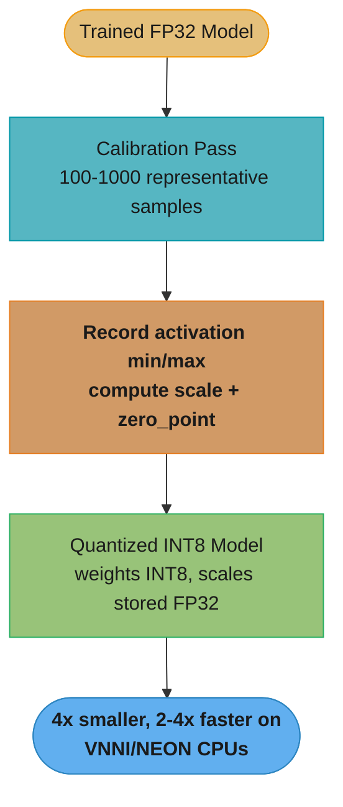
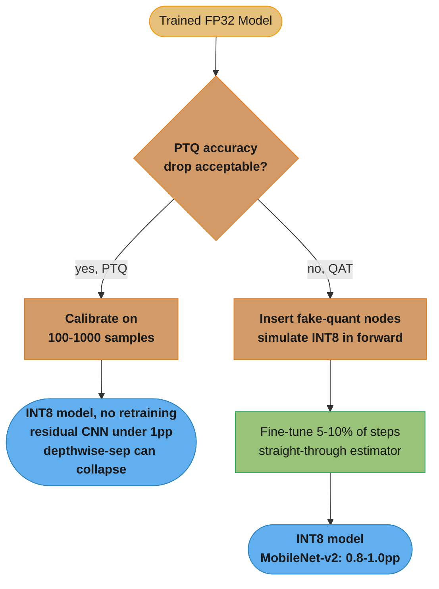
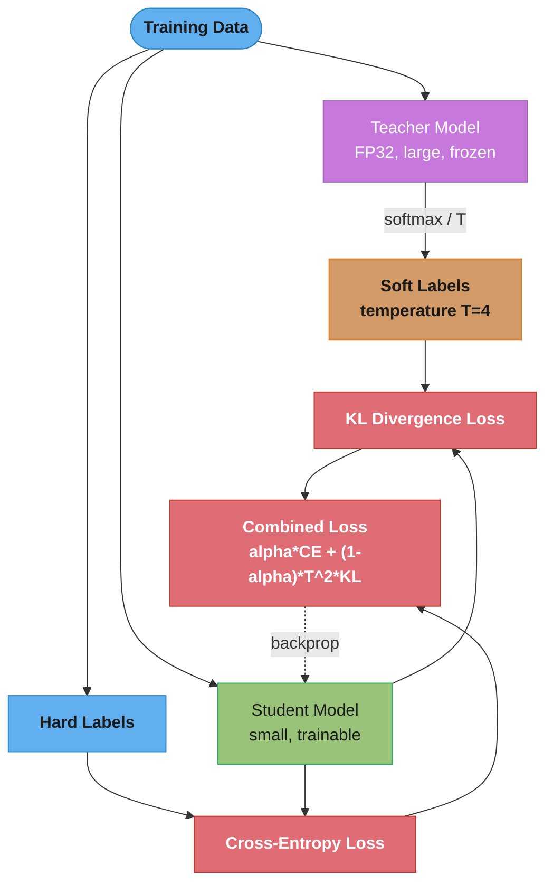
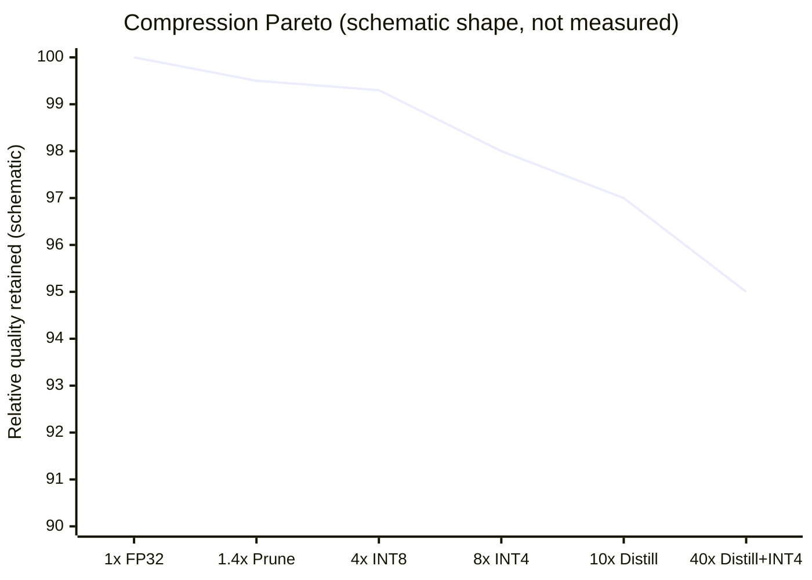

# Model Compression and Efficiency

<!-- tiers: senior -->

## 1. Concept Overview

Model compression reduces the size, memory footprint, and compute requirements of a trained neural network while preserving as much predictive accuracy as possible. As models scale to billions of parameters, uncompressed deployment becomes cost-prohibitive or physically impossible on target hardware (mobile devices, edge chips, cost-constrained cloud instances).

The four primary compression families are quantization, pruning, knowledge distillation, and low-rank factorization. They are often combined: a model may be distilled first (student is 10x smaller), then quantized (INT8 for 4x size reduction), then pruned (20% sparsity for additional throughput gains).

Practical impact: for well-behaved CNN and tabular models, INT8 PTQ with per-channel weight scales plus modest structured pruning commonly reaches a ~70% size reduction for roughly a point of accuracy or less. That is a rule of thumb, not a guarantee — depthwise-separable architectures are the standard counterexample (see the MobileNet numbers in Section 4), and for those, QAT or distillation is needed to recover accuracy.

---

## 2. Intuition

Think of a trained model as a complex legal contract with 10,000 pages. Compression is like hiring a paralegal to summarize it into 500 pages that retain all the binding clauses (accuracy) but discard redundant boilerplate (redundant weights). The summarized contract is faster to read (faster inference), cheaper to store (smaller model size), and fits in your briefcase (edge device).

One-line analogy: Compression is the art of saying the same thing with fewer words — fewer bits, fewer parameters, fewer operations.

Why it matters: A 175B parameter GPT-3 model in FP32 requires 700GB of memory. INT8 quantization reduces this to 175GB. QAT-trained INT4 reduces it further to ~87GB, enabling deployment on a cluster that would otherwise be infeasible.

Key insight: Most neural network weights are redundant. Han et al.'s Deep Compression line of work showed AlexNet and VGG-16 pruned roughly 9x and 13x (near 90% of weights zeroed) with no loss of ImageNet accuracy, and the 50–90% band has held up broadly for over-parameterized image classifiers. It does not transfer automatically to compact or already-efficient architectures, where the same sparsity is far more damaging.

---

## 3. Core Principles

**Accuracy-efficiency Pareto frontier**: Every compression technique trades accuracy for efficiency. The goal is to operate on the Pareto frontier — maximum efficiency for a given accuracy budget.

**Calibration data required for quantization**: PTQ requires a small representative dataset (100–1,000 samples) to measure activation ranges. Using unrepresentative calibration data causes accuracy collapse.

**Structured vs unstructured sparsity**: Unstructured pruning (individual weights) achieves higher sparsity but requires sparse matrix libraries to realize speed gains. Structured pruning (channels, heads, layers) produces dense subnetworks that benefit from standard hardware without specialized libraries.

**Temperature in distillation**: Soft labels at temperature T=3–5 carry more information than hard one-hot labels. The teacher's "wrong" probabilities (e.g., 0.01 for horse, 0.005 for car) encode class similarity that hard labels discard.

**Iterative refinement**: Single-shot compression often underperforms iterative compress-fine-tune cycles. Alternating between compression and brief fine-tuning recovers accuracy incrementally.

---

## 4. Types / Architectures / Strategies

### Post-Training Quantization (PTQ)
- Quantize weights and activations to INT8 (or INT4) after training completes
- No retraining required; works on any frozen model
- Calibration set: 100–1,000 representative samples to compute activation min/max ranges
- Accuracy drop: around a point or less for most residual CNNs and tabular models *with per-channel weight scales*; much larger for depthwise-separable and activation-sensitive architectures (per-tensor INT8 PTQ collapses MobileNet-v1/v2 to ~0.1% top-1 in Krishnamoorthi's whitepaper, arXiv 1806.08342 Table 4)
- Dynamic quantization: quantize weights only; activations remain FP32 at runtime (simpler, good for RNNs/LSTMs)
- Static quantization: calibrate activation ranges offline; fixed quantization applied at runtime (better throughput)

### Quantization-Aware Training (QAT)
- Insert "fake quantization" nodes during forward pass: simulate INT8 rounding effects while keeping FP32 weights for gradient updates
- Backward pass uses straight-through estimator to pass gradients through non-differentiable rounding
- Recovers accuracy when PTQ drops too far. Krishnamoorthi (arXiv 1806.08342) on ImageNet, MobileNet-v2 float top-1 71.9%: 8-bit per-channel PTQ 69.7–69.8% (down ~2.2 points), 8-bit QAT 70.9–71.1% (down ~0.8–1.0 points). MobileNet-v1 is the same story: float 70.9%, per-channel asymmetric PTQ 70.4%, QAT 70.0–70.7%
- Typically fine-tuned for a small fraction of the original training budget rather than retrained from scratch; treat the exact step count as a tuning parameter, not a fixed rule

### Weight Pruning
- Magnitude-based (unstructured): zero out weights with |w| below threshold; achieves 50–90% sparsity; requires sparse inference kernels
- Structured (channel/filter pruning): remove entire convolutional filters or attention heads; produces dense smaller model; immediately benefits on any hardware
- Iterative pruning (Lottery Ticket Hypothesis): prune 20% → retrain → prune 20% → retrain; outperforms one-shot pruning
- Gradual magnitude pruning: linearly increase sparsity target over training, avoid accuracy cliff

### Knowledge Distillation
- Teacher model (large, high-accuracy) supervises student model (small, fast) training
- Loss function: `L = alpha * CE(student_logits, hard_labels) + (1 - alpha) * T^2 * KL(softmax(student_logits/T), softmax(teacher_logits/T))`
- T = 3–5 (temperature), alpha = 0.1–0.5 (hard label weight)
- Intermediate distillation (FitNets): align student's intermediate features to teacher's via auxiliary regression losses
- BERT distillation (DistilBERT, Sanh et al. 2019, arXiv 1910.01108): the paper's exact claim is "reduce the size of a BERT model by 40%, while retaining 97% of its language understanding capabilities and being 60% faster" — a 6-layer student distilled from 12-layer BERT-base, with the 97% measured as the GLUE macro-score ratio and the 60% measured on inference time

**What this actually says.** "Train the student on two exams at once: the ground-truth answer key (cross-entropy), and the teacher's full opinion about every wrong answer too (KL) — and turn the volume up on that second signal so it does not vanish."

The whole reason this beats plain training is the second term. A hard label says "this is a dog." The teacher's softened distribution says "this is a dog, and it looks 20x more like a cat than like a truck." That similarity structure is free supervision the one-hot label throws away.

| Symbol | What it is |
|--------|------------|
| `T` | Temperature. Divides the logits before softmax; `T=1` is the normal softmax, `T=3-5` flattens it |
| `alpha` | How much you trust the ground truth. `0.3` = 30% hard labels, 70% teacher imitation |
| `CE(student, hard)` | Ordinary cross-entropy against the true label. Keeps the student grounded on the real task |
| `KL(p_student, p_teacher)` | Distance between the two softened distributions. Zero when the student matches the teacher exactly |
| `T^2` | Gradient rescue factor. Softening shrinks soft-target gradients by `1/T^2`; this cancels it |
| `1 - alpha` | Weight on the teacher term. The larger share, because the teacher carries more information per example |

**Walk one example.** One batch, `T = 4`, `alpha = 0.3`:

```
  CE(student, hard labels)         = 1.80
  KL(soft student, soft teacher)   = 0.05     <- tiny, because softening flattens both

  soft term  = (1 - 0.3) x 16 x 0.05 = 0.560     (T^2 = 4^2 = 16)
  hard term  =       0.3      x 1.80 = 0.540
                                       -----
  total loss                         = 1.100

  Without the T^2 factor:
  soft term  = 0.7 x 0.05            = 0.035     <- 6% the size of the hard term
```

Drop `T^2` and the KL term contributes 0.035 against the hard term's 0.540 — the teacher is effectively muted and you are back to ordinary supervised training with extra steps. The `T^2` restores the two terms to the same order of magnitude, which is why `alpha` then behaves like an honest mixing weight instead of a mystery knob.

**Why the temperature has to be the same on both sides.** `softmax(student/T)` is compared against `softmax(teacher/T)`. Use different temperatures and the KL is measuring a distribution mismatch you deliberately created, not the student's error. At inference the student runs at `T=1` — temperature is a training-time device only.

### Low-Rank Factorization
- Decompose weight matrix W (n x m) as product of two smaller matrices A (n x r) and B (r x m) where r << min(n, m)
- Parameter reduction: n*m → r*(n+m); for n=m=1024 and r=64: 1M → 128K (87% reduction)
- SVD-based: initialize A and B via truncated SVD of W; fine-tune to recover accuracy
- LoRA (for fine-tuning): fix original weights, learn low-rank delta; does not reduce inference cost unless merged

**Put simply.** "Instead of storing every cell of a big rectangle, store a tall skinny strip and a short wide strip and multiply them back together — you pay for the two strips instead of the rectangle."

The saving is a shape argument, not a machine-learning one: a rectangle's cost grows as `n x m` (area), while two strips grow as `r x (n + m)` (perimeter, scaled by rank). Area beats perimeter badly once the matrix is large, which is why this technique pays off exactly where it is needed.

| Symbol | What it is |
|--------|------------|
| `W` | The original weight matrix, `n` rows by `m` columns. Costs `n x m` numbers to store |
| `n`, `m` | Input and output dimensions of the layer. For a 1024-wide transformer projection, both are 1024 |
| `r` | Rank — the width of the bottleneck you squeeze through. The only knob you tune |
| `A` (`n x r`) | First factor. Projects `n` dimensions down to `r` |
| `B` (`r x m`) | Second factor. Projects the `r`-dim bottleneck back up to `m` |
| `r << min(n, m)` | The condition that makes it worth doing. If `r` approaches `min(n, m)` you save nothing |

**Walk one example.** A single 1024 x 1024 projection at rank 64:

```
  full matrix   : n x m       = 1024 x 1024        = 1,048,576 numbers
  factored      : r x (n + m) = 64 x (1024 + 1024) =   131,072 numbers
                                                      ---------
  reduction     : 1 - 131,072 / 1,048,576          = 87.5%
  compression   : 1,048,576 / 131,072              = 8.0x

  In FP32 bytes : 4.19 MB  ->  0.52 MB  for this one layer
```

**Where the technique stops paying.** Set `r x (n + m) = n x m` and solve for `r`:

```
  break-even r = (n x m) / (n + m) = 1,048,576 / 2,048 = 512

  r = 64   ->  8.0x smaller      (huge win)
  r = 256  ->  2.0x smaller      (still worth it)
  r = 512  ->  1.0x  no saving   (break-even, and now you do TWO matmuls)
  r = 700  ->  1.4x LARGER       (strictly worse than the original)
```

Above `r = 512` you are storing more numbers *and* running two matrix multiplies instead of one, so latency gets worse too. That break-even at `min(n,m)/2` is the practical ceiling: rank must stay well under half the layer width for factorization to be worth the accuracy risk. This is also why LoRA uses tiny ranks like 8 or 16 — the goal there is a cheap trainable delta, not compression.

### TensorRT Optimization
- NVIDIA's inference optimizer: layer fusion, kernel auto-tuning, precision calibration (FP32 → FP16 → INT8)
- Engine serialization: compile once, load at serving time (no JIT overhead)
- **There is no quotable speedup number, and treating any band as one is the mistake.** A conservative planning assumption is FP16 around 1.5–2x over FP32 with INT8 adding roughly another 1.5–2x, so 2–4x end to end — but that is a floor for budgeting, not a measurement, and it is not what published runs show. Third-party ResNet-50 benchmarks against an *unoptimized* FP32 PyTorch baseline report FP16 near 2x and INT8 an order of magnitude or more, because the comparison is folding in TensorRT's layer fusion and kernel auto-tuning as well as the precision change. NVIDIA publishes no single figure precisely because the answer depends on GPU generation, batch size, what the FP32 baseline was, and how much of the graph TensorRT can fuse. Measure on your own hardware; if you must quote something in an interview, quote the mechanism (fusion + reduced memory traffic + Tensor Core paths) and say the multiplier is workload-dependent

---

## 5. Architecture Diagrams

### PTQ Calibration and Quantization Flow


```mermaid
flowchart TD
    classDef io      fill:#61afef,stroke:#2e86c1,color:#1a1a1a,font-weight:bold
    classDef frozen  fill:#c678dd,stroke:#9b59b6,color:#fff
    classDef train   fill:#98c379,stroke:#27ae60,color:#1a1a1a
    classDef mathOp  fill:#d19a66,stroke:#e67e22,color:#1a1a1a,font-weight:bold
    classDef lossN   fill:#e06c75,stroke:#c0392b,color:#fff,font-weight:bold
    classDef req     fill:#56b6c2,stroke:#0097a7,color:#1a1a1a
    classDef base    fill:#e5c07b,stroke:#f39c12,color:#1a1a1a

    fp32(["Trained FP32 Model"]) --> calib["Calibration Pass\n100-1000 representative samples"]
    calib --> stats["Record activation min/max\ncompute scale + zero_point"]
    stats --> quant["Quantized INT8 Model\nweights INT8, scales stored FP32"]
    quant --> out(["4x smaller, 2-4x faster on\nVNNI/NEON CPUs"])

    class fp32 base
    class calib req
    class stats mathOp
    class quant train
    class out io
```

*PTQ never retrains — it just runs the frozen model over a small calibration set to learn each layer's activation range, which fixes the scale and zero_point that map FP32 to INT8.*

### PTQ vs QAT Decision Flow


```mermaid
flowchart TD
    classDef io      fill:#61afef,stroke:#2e86c1,color:#1a1a1a,font-weight:bold
    classDef frozen  fill:#c678dd,stroke:#9b59b6,color:#fff
    classDef train   fill:#98c379,stroke:#27ae60,color:#1a1a1a
    classDef mathOp  fill:#d19a66,stroke:#e67e22,color:#1a1a1a,font-weight:bold
    classDef lossN   fill:#e06c75,stroke:#c0392b,color:#fff,font-weight:bold
    classDef req     fill:#56b6c2,stroke:#0097a7,color:#1a1a1a
    classDef base    fill:#e5c07b,stroke:#f39c12,color:#1a1a1a

    model(["Trained FP32 Model"]) --> choice{"PTQ accuracy\ndrop acceptable?"}

    choice -->|"yes, PTQ"| ptqCal["Calibrate on\n100-1000 samples"]
    ptqCal --> ptqOut(["INT8 model, no retraining\nresidual CNN under 1pp\ndepthwise-sep can collapse"])

    choice -->|"no, QAT"| qatFake["Insert fake-quant nodes\nsimulate INT8 in forward"]
    qatFake --> qatTrain["Fine-tune 5-10% of steps\nstraight-through estimator"]
    qatTrain --> qatOut(["INT8 model\nMobileNet-v2: 0.8-1.0pp"])

    class model base
    class choice mathOp
    class ptqCal,qatFake mathOp
    class qatTrain train
    class ptqOut,qatOut io
```

*PTQ is a fast, no-retraining path that works when the accuracy hit is tolerable; QAT adds fake-quantization nodes and a fine-tune so the weights learn to absorb rounding error, buying back accuracy when PTQ falls short.*

### Knowledge Distillation Architecture


```mermaid
flowchart TD
    classDef io      fill:#61afef,stroke:#2e86c1,color:#1a1a1a,font-weight:bold
    classDef frozen  fill:#c678dd,stroke:#9b59b6,color:#fff
    classDef train   fill:#98c379,stroke:#27ae60,color:#1a1a1a
    classDef mathOp  fill:#d19a66,stroke:#e67e22,color:#1a1a1a,font-weight:bold
    classDef lossN   fill:#e06c75,stroke:#c0392b,color:#fff,font-weight:bold
    classDef req     fill:#56b6c2,stroke:#0097a7,color:#1a1a1a
    classDef base    fill:#e5c07b,stroke:#f39c12,color:#1a1a1a

    data(["Training Data"]) --> teacher["Teacher Model\nFP32, large, frozen"]
    data --> student["Student Model\nsmall, trainable"]
    teacher -->|"softmax / T"| soft["Soft Labels\ntemperature T=4"]
    soft --> kl["KL Divergence Loss"]
    student --> kl
    data --> hard["Hard Labels"]
    hard --> ce["Cross-Entropy Loss"]
    student --> ce
    kl --> total["Combined Loss\nalpha*CE + (1-alpha)*T^2*KL"]
    ce --> total
    total -.->|"backprop"| student

    class data,hard io
    class teacher frozen
    class student train
    class soft mathOp
    class kl,ce,total lossN
```

*The student learns from two signals at once: the teacher's softened distribution (dark knowledge in the wrong-class probabilities) via KL, and the ground-truth hard labels via cross-entropy — the frozen teacher and the T^2 scaling keep the soft target stable and gradient-balanced.*

### Structured Pruning Flow


```mermaid
flowchart LR
    classDef io      fill:#61afef,stroke:#2e86c1,color:#1a1a1a,font-weight:bold
    classDef frozen  fill:#c678dd,stroke:#9b59b6,color:#fff
    classDef train   fill:#98c379,stroke:#27ae60,color:#1a1a1a
    classDef mathOp  fill:#d19a66,stroke:#e67e22,color:#1a1a1a,font-weight:bold
    classDef lossN   fill:#e06c75,stroke:#c0392b,color:#fff,font-weight:bold
    classDef req     fill:#56b6c2,stroke:#0097a7,color:#1a1a1a
    classDef base    fill:#e5c07b,stroke:#f39c12,color:#1a1a1a

    conv(["Conv layer\n64 filters"]) --> rank["Rank filters by\nL1 norm of weights"]
    rank --> prune["Remove bottom 30%\nby magnitude"]
    prune --> pruned["Pruned CNN\n45 filters, dense"]
    pruned --> ft["Fine-tune 1-5 epochs\nrecover accuracy"]
    ft --> final(["~30% fewer MACs\nsame hardware path"])

    class conv io
    class rank,prune mathOp
    class pruned base
    class ft train
    class final io
```

*Structured pruning removes whole filters (not scattered weights), so the result is a smaller dense model that runs faster on any hardware — the fine-tune step recovers the accuracy lost when the low-magnitude filters were dropped.*

### Size vs Accuracy Tradeoff


```mermaid
xychart-beta
    title "Compression Pareto (schematic shape, not measured)"
    x-axis ["1x FP32", "1.4x Prune", "4x INT8", "8x INT4", "10x Distill", "40x Distill+INT4"]
    y-axis "Relative quality retained (schematic)" 90 --> 100
    line [100, 99.5, 99.3, 98, 97, 95]
```

*This is a schematic of the **shape**, not a measurement — no model, dataset or study
sits behind the individual points, and they should never be quoted as retention figures.
The one thing it is drawing is the non-linearity: accuracy erodes slowly through pruning
and INT8, then falls off once you reach INT4 and stacked distillation-plus-quantization.
The operating rule that follows is real even though the curve is not: pick the least
aggressive method that meets the memory and latency budget, and measure the retention
yourself on your own task. For a sourced anchor on one point of this curve, see
DistilBERT — 40% smaller, 60% faster, 97% of BERT-base's GLUE score.*

---

## 6. How It Works — Detailed Mechanics

### PyTorch Dynamic Quantization (PTQ)

**API status (checked July 2026).** Eager-mode quantization lives at
`torch.ao.quantization`; the pre-1.13 `torch.quantization` alias still forwards to it but
is legacy. PyTorch's own docs now say quantization development has been centralized in
the separate **torchao** package, and that eager mode (`torch.ao.quantization.quantize`,
`quantize_dynamic`) and FX graph mode should migrate to `torchao.quantization.quantize_`
and the pt2e API respectively — with `torch.ao.quantization` slated for deletion "in 2.10
if there are no blockers, or the earliest PyTorch version until all the blockers are
cleared." That deletion has slipped: the current stable docs (2.13) still carry the full
`torch.ao.quantization` reference behind that banner, so the eager-mode code below runs
today. Treat it as a maintenance path and reach for torchao on new work — and re-check
the banner before you build anything long-lived on it, because the removal is scheduled
rather than cancelled.

```python
import torch
import torch.nn as nn
from typing import Any

class LSTMClassifier(nn.Module):
    def __init__(self, input_dim: int, hidden_dim: int, num_classes: int) -> None:
        super().__init__()
        self.lstm = nn.LSTM(input_dim, hidden_dim, batch_first=True)
        self.classifier = nn.Linear(hidden_dim, num_classes)

    def forward(self, x: torch.Tensor) -> torch.Tensor:
        _, (h_n, _) = self.lstm(x)
        return self.classifier(h_n.squeeze(0))


def apply_dynamic_quantization(model: nn.Module) -> nn.Module:
    """Dynamic PTQ: quantize weights only; activations remain FP32."""
    quantized_model = torch.ao.quantization.quantize_dynamic(
        model,
        qconfig_spec={nn.LSTM, nn.Linear},  # layers to quantize
        dtype=torch.qint8,
    )
    return quantized_model


def compare_model_sizes(fp32_model: nn.Module, int8_model: nn.Module) -> None:
    import os, tempfile

    with tempfile.NamedTemporaryFile(suffix=".pt", delete=False) as f:
        torch.save(fp32_model.state_dict(), f.name)
        fp32_size = os.path.getsize(f.name) / 1e6
        os.unlink(f.name)

    with tempfile.NamedTemporaryFile(suffix=".pt", delete=False) as f:
        torch.save(int8_model.state_dict(), f.name)
        int8_size = os.path.getsize(f.name) / 1e6
        os.unlink(f.name)

    print(f"FP32 size: {fp32_size:.1f} MB")
    print(f"INT8 size: {int8_size:.1f} MB")
    print(f"Reduction: {(1 - int8_size / fp32_size) * 100:.1f}%")
```

### PyTorch Static Quantization with Calibration

```python
import torch.ao.quantization as tq

class QuantizableResidual(nn.Module):
    def __init__(self, dim: int) -> None:
        super().__init__()
        self.linear = nn.Linear(dim, dim)
        self.relu = nn.ReLU()
        # Required stubs for static quantization graph tracing
        self.quant = tq.QuantStub()
        self.dequant = tq.DeQuantStub()

    def forward(self, x: torch.Tensor) -> torch.Tensor:
        x = self.quant(x)
        x = self.relu(self.linear(x))
        return self.dequant(x)


def static_quantize(
    model: nn.Module,
    calibration_loader: torch.utils.data.DataLoader,
) -> nn.Module:
    model.eval()
    # "x86" is the default backend and the current recommendation for x86 CPUs; it
    # dispatches across fbgemm/onednn kernels. "fbgemm" is still accepted, and "qnnpack"
    # targets ARM. Supported values: fbgemm | x86 | qnnpack | onednn.
    model.qconfig = tq.get_default_qconfig("x86")
    tq.prepare(model, inplace=True)

    # Calibration pass — no gradient needed
    with torch.no_grad():
        for batch, _ in calibration_loader:
            model(batch)

    tq.convert(model, inplace=True)
    return model
```

### The Quantization Arithmetic Underneath

`tq.convert` is doing one small piece of arithmetic per tensor. This is what the calibration pass computes and what every INT8 kernel then applies:

```
Affine (asymmetric) quantization, FP32 -> INT8:

  scale      = (max_val - min_val) / (q_max - q_min)
  zero_point = round(q_min - min_val / scale)

  quantize   : q = clamp(round(x / scale) + zero_point, q_min, q_max)
  dequantize : x_hat = (q - zero_point) x scale

  For signed INT8: q_min = -128, q_max = 127  (256 representable levels)
```

**Read it like this.** "Find the smallest and largest number this tensor ever holds, chop that range into 256 evenly spaced buckets, and store which bucket each number fell into instead of the number itself."

Everything hinges on the range being tight. Quantization does not compress information intelligently — it just rounds to a grid, and the grid spacing is set entirely by the widest value in the tensor. One outlier stretches the range and coarsens the grid for every other weight, which is the root cause of most INT8 accuracy loss.

| Symbol | What it is |
|--------|------------|
| `min_val`, `max_val` | Observed range of the tensor. For weights, read directly; for activations, measured on the calibration set |
| `scale` | How much real-world value one integer step is worth. The grid spacing |
| `zero_point` | Which integer means exactly `0.0`. Lets an asymmetric range still represent zero without error |
| `q_min`, `q_max` | The integer limits, `-128` and `127` for signed INT8 |
| `round(...)` | Snap to the nearest grid point. This is where information is destroyed — and it is not differentiable, hence QAT's straight-through estimator |
| `clamp(...)` | Saturate anything outside the calibrated range. Values beyond `max_val` all collapse onto `127` |
| `x_hat` | The reconstructed float. Never exactly `x` — the gap is the quantization error |

**Walk one example.** A weight tensor observed over the range `[-0.62, +1.14]`:

```
  scale      = (1.14 - (-0.62)) / (127 - (-128))
             = 1.76 / 255
             = 0.006902                <- one INT8 step is worth 0.0069

  zero_point = round(-128 - (-0.62 / 0.006902))
             = round(-128 + 89.83)
             = -38                     <- the integer -38 means exactly 0.0

  Round-trip four real weights:

    x        x / scale   round   + zp    q      x_hat = (q - zp) x scale   error
  ---------------------------------------------------------------------------------
   0.350       50.71       51     -38     13      0.352000                0.002000
  -0.620      -89.83      -90     -38   -128     -0.621176                0.001176
   1.140      165.17      165     -38    127      1.138824                0.001176
   0.007        1.01        1     -38    -37      0.006902                0.000098
   0.000        0.00        0     -38    -38      0.000000                0.000000

  Worst error seen: 0.002, which is 0.11% of the tensor's full range 1.76.
  Theoretical ceiling: half a step = 0.006902 / 2 = 0.00345.
```

Two things fall out of that table. **Zero is exact** — `x = 0.0` maps to `q = zero_point` and reconstructs to precisely `0.0`, which matters enormously because padding, ReLU outputs, and pruned weights are overwhelmingly zero; a scheme that reconstructed zero as `0.0034` would inject bias into every one of them. And **error is bounded by half a step regardless of the value** — quantization error is absolute, not relative, so small weights suffer far worse *relative* error than large ones. A weight of `0.007` carries up to 49% relative error while a weight of `1.14` carries 0.3%.

**What the outlier does to everyone else.** Suppose one weight in that tensor were `11.4` instead of `1.14`:

```
  range 1.76  ->  scale 0.006902,  half-step error 0.00345
  range 12.02 ->  scale 0.047137,  half-step error 0.02357     <- 6.8x worse

  Every other weight in the tensor is now quantized 6.8x more coarsely,
  to buy exact representation of a single outlier.
```

That single mechanism explains three otherwise-unrelated techniques in this module: **per-channel scales** (give each output channel its own range so one bad channel cannot poison the rest), **LLM.int8()** (pull outlier dimensions out into FP16 entirely), and **AWQ** (rescale salient channels before quantizing). All three are the same fix — stop letting the widest value set the grid for everything.

### Knowledge Distillation Training Loop

```python
import torch.nn.functional as F

def distillation_loss(
    student_logits: torch.Tensor,
    teacher_logits: torch.Tensor,
    hard_labels: torch.Tensor,
    temperature: float = 4.0,
    alpha: float = 0.3,
) -> torch.Tensor:
    """
    Combined distillation loss.
    alpha: weight of hard label cross-entropy (1-alpha for soft KL term).
    temperature: softens probability distributions for richer soft labels.
    """
    # Soft targets: KL divergence between softened distributions
    soft_student = F.log_softmax(student_logits / temperature, dim=-1)
    soft_teacher = F.softmax(teacher_logits / temperature, dim=-1)
    # Multiply by T^2 to maintain gradient magnitude after softening
    kl_loss = F.kl_div(soft_student, soft_teacher, reduction="batchmean") * (temperature ** 2)

    # Hard targets: standard cross-entropy with ground truth
    ce_loss = F.cross_entropy(student_logits, hard_labels)

    return alpha * ce_loss + (1 - alpha) * kl_loss


def train_student(
    teacher: nn.Module,
    student: nn.Module,
    loader: torch.utils.data.DataLoader,
    optimizer: torch.optim.Optimizer,
    epochs: int = 5,
    temperature: float = 4.0,
    alpha: float = 0.3,
) -> None:
    teacher.eval()  # Teacher is frozen
    student.train()

    for epoch in range(epochs):
        total_loss = 0.0
        for inputs, labels in loader:
            with torch.no_grad():
                teacher_logits = teacher(inputs)

            student_logits = student(inputs)
            loss = distillation_loss(
                student_logits, teacher_logits, labels, temperature, alpha
            )

            optimizer.zero_grad()
            loss.backward()
            optimizer.step()
            total_loss += loss.item()

        print(f"Epoch {epoch + 1}: loss={total_loss / len(loader):.4f}")
```

### What Temperature Actually Does to the Softmax

The single line `F.softmax(teacher_logits / temperature, dim=-1)` is the whole idea of distillation. Written out:

```
  p_i(T) = exp(z_i / T) / sum_j exp(z_j / T)

  T = 1   -> the ordinary softmax
  T > 1   -> flattens the distribution, lifting the non-winning classes
  T -> inf-> approaches uniform (every class equally likely)
  T < 1   -> sharpens toward a one-hot vector (the opposite of what you want)
```

**The idea behind it.** "Divide every logit by T before softmaxing, which shrinks the gaps between them, which stops the winning class from swallowing all the probability mass and lets the runners-up become visible."

The teacher's useful knowledge is not the argmax — the hard label already tells you that. It is the *ranking and spacing of the losers*: that a given image is somewhat cat-like and not at all truck-like. At `T = 1` that information exists but is numerically invisible, buried at the fourth decimal place, where it contributes essentially nothing to the gradient.

| Symbol | What it is |
|--------|------------|
| `z_i` | Raw logit for class `i` — the pre-softmax score straight out of the final layer |
| `T` | Temperature. Borrowed from statistical physics; higher temperature = more disorder = flatter distribution |
| `z_i / T` | The softened logit. Every gap between logits shrinks by the same factor `T` |
| `exp(...)` | Makes everything positive and amplifies differences — the reason gaps look so extreme at `T = 1` |
| `sum_j exp(z_j / T)` | Normalizer. Forces the outputs to sum to 1 |
| `p_i(T)` | The soft target the student is trained to reproduce |

**Walk one example.** Four-class logits `z = [8.0, 2.0, 1.0, 0.5]` (dog, cat, horse, truck):

```
              logits    T = 1 probs      T = 4 probs
  ------------------------------------------------------
  dog           8.0       0.9961           0.6451
  cat           2.0       0.0025           0.1439
  horse         1.0       0.0009           0.1121
  truck         0.5       0.0006           0.0989
                          ------           ------
                          1.0000           1.0000

  At T = 1: the three non-dog classes together hold 0.0039 of the mass.
  At T = 4: they hold 0.3549 -- 90x more signal for the student to learn from.
```

At `T = 1` the student is being told "dog, with a rounding error attached." At `T = 4` it is being told "mostly dog, but meaningfully cat-like, slightly less horse-like, least truck-like" — a graded similarity judgment over the whole label space, from a single training example.

**Why you cannot just raise T forever.** Softening compresses the useful ordering too:

```
  cat-vs-truck probability ratio:

    T = 1  ->  p_cat / p_truck = 4.48x    (cat is clearly more plausible)
    T = 4  ->  p_cat / p_truck = 1.45x    (still ordered, but much weaker)
    T -> inf ->                   1.00x    (uniform -- all knowledge destroyed)
```

`T` trades *visibility* of the dark knowledge against its *sharpness*. Too low and the signal is numerically negligible; too high and every class looks alike and the student learns nothing but the uniform distribution. `T = 3-5` is the empirical sweet spot for classification, and it is the reason the `T^2` correction in the loss exists at all: the same flattening that makes the signal visible also shrinks its gradient by `1/T^2`.

### Structured Pruning (Channel Pruning)

```python
import torch.nn.utils.prune as prune

def apply_structured_pruning(
    model: nn.Module,
    pruning_ratio: float = 0.3,
) -> nn.Module:
    """Zero the lowest-L1-norm 30% of output filters, structured along dim 0.

    Important: ``torch.nn.utils.prune`` applies a MASK. After ``prune.remove`` the
    weights are permanently zero but the tensor keeps its original shape, so the
    model is not smaller on disk and not faster. To realize the structured-pruning
    win you must physically rebuild the layers at the reduced channel count (or use
    a library that does the surgery for you, e.g. torch-pruning).
    """
    for name, module in model.named_modules():
        if isinstance(module, nn.Conv2d):
            prune.ln_structured(
                module,
                name="weight",
                amount=pruning_ratio,
                n=1,        # L1 norm
                dim=0,      # prune output channels (dim=0)
            )
            prune.remove(module, "weight")  # make pruning permanent

    return model


def count_parameters(model: nn.Module) -> int:
    return sum(p.numel() for p in model.parameters() if p.requires_grad)
```

### Sparsity Ratio vs Actual On-Disk Size

`pruning_ratio = 0.3` is a promise about *zeros*, not about *bytes*. The conversion between them:

```
  sparsity      s = zeroed_params / total_params
  surviving       = (1 - s) x total_params

  Structured pruning (dense result):
    bytes = (1 - s) x total_params x bytes_per_param
    size ratio = 1 / (1 - s)

  Unstructured pruning (sparse CSR result):
    bytes = nnz x (bytes_per_value + bytes_per_index) + row_pointers
    size ratio = (total x bytes_per_param) / bytes
```

**Stated plainly.** "Structured pruning shrinks the file by exactly the fraction you removed. Unstructured pruning shrinks it by much less, because a zero you deleted still costs you an address telling the machine where the surviving numbers went."

That asymmetry is the single most misunderstood point in pruning. "80% sparse" sounds like "5x smaller" and is almost never 5x on disk.

| Symbol | What it is |
|--------|------------|
| `s` | Sparsity ratio. `0.8` = 80% of weights set to zero |
| `nnz` | Number of non-zeros — the weights that survived. Equals `(1 - s) x total_params` |
| `bytes_per_param` | `4` for FP32, `2` for FP16, `1` for INT8 |
| `bytes_per_index` | Cost of recording *where* each survivor lives. `4` for INT32 indices, `2` for INT16 |
| `1 / (1 - s)` | The naive compression ratio everyone quotes. Only true for structured pruning |
| CSR | Compressed Sparse Row — values array + column-index array + row-pointer array |

**Walk one example.** ResNet-50, 25.6M parameters in FP32:

```
  Dense baseline : 25,600,000 x 4 bytes                      = 102.40 MB

  Structured pruning, s = 0.30 (remove 30% of filters):
    surviving    : 0.70 x 25,600,000                         = 17,920,000 params
    bytes        : 17,920,000 x 4                            =  71.68 MB
    ratio        : 102.40 / 71.68                            =   1.43x   as advertised

  Unstructured pruning, s = 0.80 (zero 80% of individual weights):
    naive claim  : 1 / (1 - 0.80)                            =   5.00x
    nnz          : 0.20 x 25,600,000                         =  5,120,000 values
    values       : 5,120,000 x 4 bytes                       =  20.48 MB
    INT32 indices: 5,120,000 x 4 bytes                       =  20.48 MB
                                                                -------
    actual       :                                              40.96 MB
    real ratio   : 102.40 / 40.96                            =   2.50x

    Half the compression that "80% sparse" implied -- the index array is
    exactly as large as the data it indexes.
```

Switching to INT16 column indices (viable when no row exceeds 65,535 columns) brings it to `20.48 + 10.24 = 30.72 MB`, a `3.33x` ratio — better, still not 5x.

**And bytes are not the same question as speed.** The size table above says nothing about latency. A dense GEMM kernel on the 80%-sparse tensor runs at exactly the same speed as on the unpruned one, because it still multiplies every element including the zeros. Realizing a speedup requires either sparse kernels or hardware structured sparsity, and the bar for the former is much higher than usually assumed. General-purpose `cuSPARSE` SpMM is built for scientific matrices at >99% sparsity and does not beat dense cuBLAS anywhere near the 50–90% range that pruning produces; DL-specific sparse kernels (SparseRT, and tensor-core SpMM work such as SMaT) have pushed the crossover down into the ~78–90% band, but they are research-grade and kernel-specific. Hardware structured sparsity is the reliable path: NVIDIA's 2:4 semi-structured sparsity (Sparse Tensor Cores, Ampere and later) caps you at exactly `s = 0.5` and is quoted at up to 2x math throughput — with measured end-to-end inference gains typically well below that, in the ~1.3x range. This is precisely why Section 9 warns against unstructured pruning below 50% sparsity — you pay the index overhead in size and get nothing back in throughput.

### Counting Parameters and FLOPs, Layer by Layer

`count_parameters` answers "how much memory," which is a different question from "how much compute." The two formulas, for the two layer types that dominate real architectures:

```
  Conv2d(C_in, C_out, k x k), output H_out x W_out:
    params = k x k x C_in x C_out   (+ C_out if bias)
    MACs   = params x H_out x W_out
    FLOPs  = 2 x MACs               (one multiply + one add per MAC)

  Linear(C_in, C_out):
    params = C_in x C_out + C_out
    MACs   = C_in x C_out           (applied once, not per spatial position)
```

**What the formula is telling you.** "A convolution's weights are reused at every output pixel, so its compute is its parameter count multiplied by the size of the feature map — while a fully-connected layer uses each weight exactly once."

That single `x H_out x W_out` factor is the reason parameter count and FLOP count rank layers in completely different orders, and the reason compressing for *size* and compressing for *speed* are different projects.

| Symbol | What it is |
|--------|------------|
| `C_in`, `C_out` | Input and output channel counts of the layer |
| `k` | Kernel side length. A 3x3 conv has `k = 3`, so 9 weights per input-output channel pair |
| `H_out x W_out` | Spatial size of the output feature map. The weight-reuse multiplier |
| MAC | Multiply-accumulate: one `a x b + c`. The natural unit of neural-network work |
| FLOPs | Floating-point operations, conventionally `2 x MACs`. Watch for papers that quote MACs and call them FLOPs |
| bias | One extra parameter per output channel. Usually negligible, and absent entirely when the layer is followed by batch norm |

**Mind the units before you divide.** The number everyone quotes for ResNet-50 is "4.1
GFLOPs" — torchvision's model table lists `GFLOPS 4.09` for `ResNet50_Weights` and He et
al. report `3.8x10^9` in the ResNet paper. **Both of those are MAC counts**, not FLOPs
under the `2 x MACs` convention. Divide a `2 x MACs` numerator by that denominator and
every per-layer share you compute comes out twice too large. The worked example below
therefore keeps everything in MACs.

**Walk one example.** The first and last layers of ResNet-50 (25,557,032 params, 4.09
GMACs total, 224x224 input):

```
  conv1: 7x7, C_in=3, C_out=64, stride 2, output 112 x 112 (no bias -- BN follows)
    params = 7 x 7 x 3 x 64                        =       9,408
    MACs   = 9,408 x 112 x 112                     = 118,013,952   (0.118 GMACs)
    FLOPs  = 2 x 118,013,952                       =   0.236 GFLOPs

  fc: Linear(2048, 1000)
    params = 2048 x 1000 + 1000                    =   2,049,000
    MACs   = 2048 x 1000                           =   2,048,000   (0.002 GMACs)
    FLOPs  = 2 x 2,048,000                         =   0.004 GFLOPs

  Share of the whole network (MACs over MACs, 4.09 GMACs total):

    layer     params        % of params      MACs          % of MACs
    ------------------------------------------------------------------
    conv1        9,408          0.04%        0.118 G          2.89%
    fc       2,049,000          8.02%        0.002 G          0.05%

    fc holds 218x more parameters than conv1 -- and does 58x less work.
```

**Why that inversion decides your compression strategy.** If the constraint is model size, the `fc` layer is the obvious target: it is 8% of the parameters for a twentieth of a percent of the compute, so factorizing or pruning it is nearly free in latency terms — this is exactly why the classic "compress the classifier head" trick works and why VGG (with 100M+ parameters in its FC layers) was so much more compressible than ResNet. If the constraint is latency, `fc` is irrelevant and you must attack the early high-resolution convolutions, where `H_out x W_out` is `112 x 112` and every weight is reused 12,544 times. Quantization happens to help both at once — fewer bytes per weight and cheaper arithmetic — which is why it is almost always the first technique to reach for.

---

## 7. Real-World Examples

**DistilBERT (Hugging Face)**: Knowledge distillation from BERT-base to a 6-layer student. Result: 40% fewer parameters, 60% faster inference, retains 97% of BERT's GLUE benchmark performance. Used in production NLP pipelines where BERT latency is unacceptable.

**MobileNet family**: Depthwise separable convolutions (a form of structured factorization) "uses between 8 to 9 times less computation than standard convolutions" (Howard et al. 2017, arXiv 1704.04861). Their own ablation (Table 4) puts the cost precisely: Conv MobileNet 71.7% ImageNet top-1 at 4,866M mult-adds and 29.3M params, vs depthwise-separable MobileNet 70.6% at 569M mult-adds and 4.2M params — 8.5x fewer mult-adds for **1.1 points** of top-1, not "under 1%". Widely used for on-device inference (iOS, Android).

**LLM.int8() (Dettmers et al. 2022, arXiv 2208.07339; shipped in bitsandbytes)**: Mixed-precision quantization — keep outlier dimensions in FP16, quantize the rest to INT8. The paper's claim is inference "with up to 175B parameters without any performance degradation," evaluated on **OPT-175B and BLOOM-176B** (not GPT-3, whose weights are closed), and it halves the memory needed for inference — roughly 350 GB of FP16 weights down to ~175 GB. Note "no degradation" is on the benchmarks the paper reports; validate on your own task.

**TensorRT at NVIDIA**: layer fusion plus FP16/INT8 execution is the standard serving path for CNN perception stacks with hard per-frame deadlines (autonomous driving, industrial vision). The size win is mechanical (FP16 halves the engine, INT8 quarters it); the latency win is not — it depends on GPU generation, batch size, and fusion coverage, so it must be measured per deployment rather than quoted.

---

## 8. Tradeoffs

Accuracy-drop figures below are ranges observed across published results, not guarantees;
the drop is always model-, task-, and calibration-dependent, and the same technique can
be lossless on a residual CNN and catastrophic on a depthwise-separable one.

| Method | Size Reduction | Accuracy Drop | Retraining Needed | Hardware Req |
|--------|---------------|---------------|-------------------|-------------|
| PTQ INT8, per-channel | ~4x | ~0–1pp on residual CNNs; ~2pp on MobileNet-v2 | No | Standard CPU/GPU |
| PTQ INT8, per-tensor | ~4x | ~0–1pp on residual CNNs; **near-total collapse** on MobileNet-v1/v2 | No | Standard CPU/GPU |
| PTQ INT4 weight-only (GPTQ/AWQ) | ~4x vs FP16 | "negligible" at 175B scale per GPTQ; grows sharply as the model gets smaller | No (calibration only) | Needs a matching INT4 kernel |
| QAT INT8 | ~4x | ~0.8–1pp on MobileNet-v2; often under 0.5pp elsewhere | Yes (fine-tune) | Standard |
| Structured pruning 30% | ~1.4x | recoverable to well under 1pp with fine-tune | Yes (brief) | Any |
| Unstructured pruning 80% | ~2.5x on disk with INT32 indices (**not** 5x) | ~1pp achievable | Yes | Needs specialist sparse kernels for any speedup |
| N:M (2:4) sparsity | 2x on the weight tensor | small with retraining | Yes | Ampere+ Sparse Tensor Cores |
| Knowledge distillation | 1.7x (DistilBERT) to ~10x | ~3% of GLUE score at DistilBERT's ratio; more as the gap widens | Yes (full student train) | Any |
| Low-rank factorization | 2–10x (rank-dependent) | model-dependent; recoverable by fine-tune | Yes (fine-tune) | Any |

| Concern | PTQ | QAT |
|---------|-----|-----|
| Ease of use | High (no retraining) | Low (requires training pipeline) |
| Accuracy recovery | Moderate | High |
| Deployment speed | Fast | Slow |
| Best for | Large models, CNNs | Small models, accuracy-critical |

---

## 9. When to Use / When NOT to Use

**Use PTQ when:**
- Model is large (>10M parameters) and calibration dataset is available
- Accuracy drop tolerance is < 1% and model is a CNN or tabular model
- No training pipeline access or compute budget for retraining

**Use QAT when:**
- PTQ causes > 1% accuracy drop (common for very small models or transformers in INT4)
- Model is being actively fine-tuned anyway; adding QAT adds marginal cost
- Target hardware has INT8 SIMD instructions (x86 with VNNI, ARM NEON)

**Use knowledge distillation when:**
- Target latency requires a model 5–20x smaller than the best single model
- A high-quality large model (teacher) already exists
- Labeled data is abundant or teacher can generate pseudo-labels

**Use structured pruning when:**
- Model has clearly redundant filters (confirmed by low activation variance)
- Hardware is standard (no sparse tensor cores available)
- Need a dense, immediately deployable smaller model

**Do NOT use unstructured pruning when:**
- Target hardware does not support sparse matrix operations (most production CPUs/GPUs without specific libraries)
- You want speed. At any sparsity a dense GEMM kernel runs at dense speed, and the crossover where a sparse kernel wins is far higher than usually assumed — general-purpose cuSPARSE is aimed at >99% sparsity, and even DL-specific research kernels only get down to roughly 78–90%. Below that, unstructured pruning buys you nothing but index overhead. If you need a hardware-backed speedup, use 2:4 semi-structured sparsity (Ampere+) or structured pruning instead

---

## 10. Common Pitfalls

*The four war stories below are anonymized composites illustrating recurring failure
modes. The failure mechanisms and the fixes are real and general; the specific accuracy
figures are illustrative, not measurements from a published incident.*

**War story 1: Unrepresentative calibration data causes INT8 collapse.** A team calibrated an image classification model on 100 samples from their development set, which happened to be all daytime outdoor images. The model served nighttime images in production. Activation ranges computed during calibration did not cover dark pixel distributions, causing INT8 to saturate and clip. Accuracy dropped from 91% to 67%. Fix: calibration data must be statistically representative of production inputs; use at least 500–1,000 samples spanning all known input distributions.

**War story 2: Saving quantized model with torch.save(model) loses quantization info.**
```python
# BROKEN: saves Python object; quantization metadata lost on different PyTorch versions
torch.save(quantized_model, "model.pt")

# FIXED: save state_dict; reload with same architecture
torch.save(quantized_model.state_dict(), "model_int8.pt")
# At load time:
model = build_architecture()
apply_static_quantize_skeleton(model)  # must match quantization configuration
model.load_state_dict(torch.load("model_int8.pt"))
```

**War story 3: Teacher model in train mode during distillation contaminates soft labels.** A team forgot to call `teacher.eval()` before distillation training. Dropout layers in the teacher produced different soft labels each forward pass for the same input, injecting noise into the KL divergence target. Student accuracy plateaued 3% below expected. Fix: always call `teacher.eval()` and wrap teacher forward pass in `torch.no_grad()`.

**War story 4: Pruning before fine-tuning removes accuracy non-trivially; team skips fine-tuning step.** A 40% structured pruning pass dropped accuracy from 92% to 84%. Team deployed without fine-tuning because "pruning is supposed to be drop-in." Fix: structured pruning always requires at least 1–5 epochs of fine-tuning at low learning rate (1e-4) to recover from the accuracy cliff.

---

## 11. Technologies & Tools

| Tool | Category | Notes |
|------|----------|-------|
| torchao | PTQ/QAT | PyTorch's current quantization home; `quantize_` (eager) and pt2e APIs |
| torch.ao.quantization | PTQ/QAT (legacy) | Eager + FX graph mode; backends `x86` (default), `fbgemm`, `onednn`, `qnnpack` (ARM). PyTorch docs direct new work to torchao |
| bitsandbytes | LLM quantization | LLM.int8() mixed INT8/FP16, and **NF4/FP4** 4-bit (NF4 is what QLoRA uses — it is a normal-float type, not INT4); GPU-focused |
| GPTQ / GPTQModel | LLM PTQ | Weight-only 3/4-bit; approximate second-order (Hessian) error compensation, from the OBS/OBQ line. `auto-gptq` is no longer developed — GPTQModel is the maintained backend for `transformers`' `GPTQConfig` |
| AWQ | LLM PTQ | Activation-aware weight quantization; protects ~1% salient channels, no backprop/reconstruction. Reported to beat GPTQ on many models — verify per model |
| TensorRT | NVIDIA optimization | FP16/INT8, layer fusion, engine serialization |
| OpenVINO | Intel optimization | INT8 PTQ for Intel CPUs, VPUs, iGPUs |
| ONNX Runtime | Cross-platform | Quantization APIs for ONNX graphs |
| Optimum (HuggingFace) | Transformer compression | Umbrella over backend-specific subpackages (optimum-onnxruntime, optimum-intel, optimum-quanto); quantization and graph optimization, with QAT/pruning/distillation coming via the Intel backend |
| torch.nn.utils.prune | Pruning | Magnitude-based, structured, iterative. **Masks weights to zero; it does not shrink tensors**, so on its own it buys no speed |
| Intel Neural Compressor | Quantization/pruning/distillation | Successor to Intel's Distiller, whose repository (`IntelLabs/distiller`) is gone — only third-party forks remain, so do not start new work on it |

---

## 12. Interview Questions with Answers

**Q: What is the difference between PTQ and QAT, and how do you choose between them?**
**Short:** PTQ quantizes a frozen model with a calibration set, while QAT simulates rounding during training so weights adapt to it.
PTQ quantizes a frozen model without retraining, using a calibration set to fix activation ranges; QAT simulates the rounding during training so the weights adapt to it. PTQ is fast to apply but the loss is architecture-dependent — near-free on residual CNNs, roughly 2 points of top-1 on MobileNet-v2 with per-channel 8-bit, and a near-total collapse on MobileNet with per-tensor 8-bit (Krishnamoorthi, arXiv 1806.08342). QAT buys most of that back: 70.9–71.1% vs the 71.9% float baseline on the same MobileNet-v2. Choose PTQ when no training pipeline is available or the measured drop is acceptable; choose QAT when it is not.

**Q: How does INT8 quantization achieve ~4x size reduction and ~3x speedup?**
**Short:** INT8 uses one byte versus FP32's four for a 4x size cut, and speedup comes from INT8 SIMD instructions plus better cache fit.
FP32 uses 4 bytes per weight; INT8 uses 1 byte — a 4x reduction in model file size and memory bandwidth. Speedup comes from two sources: (1) INT8 SIMD instructions — AVX-512 VNNI's `VPDPBUSD` (Cascade Lake onward) fuses what previously took three instructions (`VPMADDUBSW` + `VPMADDWD` + `VPADDD`) into one, doing four INT8 multiply-accumulates per 32-bit lane, and ARM's `SDOT`/`UDOT` do the same on NEON; (2) smaller tensors fit better in CPU cache, reducing memory stalls. Treat 2–4x as the realistic CPU band rather than a fixed 3x; GPU gains depend on whether INT8 tensor-core paths are actually dispatched.

**Q: Explain the knowledge distillation loss function and the role of temperature.**
**Short:** The distillation loss blends hard-label cross-entropy with a temperature-softened KL term that reveals the teacher's dark knowledge.
The distillation loss combines a hard label term (cross-entropy between student logits and ground truth) and a soft label term (KL divergence between student and teacher softened distributions). Temperature T divides logits before softmax, flattening the probability distribution. Higher T (3–5) makes the teacher's "dark knowledge" — small probabilities assigned to wrong classes — more visible and informative. The T^2 factor rescales the KL term to match the gradient magnitude of the CE term, balancing the two losses. Without T^2, the soft label term would be negligible.

**Q: What is the Lottery Ticket Hypothesis and how does it influence pruning strategy?**
**Short:** It claims a dense network contains a sparse winning subnetwork trainable from its original init, motivating iterative pruning with rewinding.
It claims a randomly initialized dense network already contains a sparse subnetwork — the "winning ticket" — that trains in isolation to comparable accuracy. Frankle & Carbin (ICLR 2019, arXiv 1803.03635) state that such subnetworks, "when trained in isolation, reach test accuracy comparable to the original network in a similar number of iterations," and the ticket must be trained from *the same initialization* it had in the dense network. The practical influence is that it made iterative magnitude pruning with rewinding the default recipe over one-shot pruning. Be careful with the strong reading: follow-up work found the original weight-rewinding result does not hold cleanly at scale, and Renda et al.'s learning-rate rewinding matches or beats fine-tuning without needing the original init, so treat LTH as a motivating hypothesis rather than a settled explanation of why pruned models underperform.

**Q: Why is structured pruning preferred over unstructured pruning in production?**
**Short:** Unstructured pruning leaves zeros that dense kernels still multiply, while structured pruning yields a genuinely smaller, faster dense model.
Because unstructured pruning gives you zeros, not speed, while structured pruning gives you a genuinely smaller dense model. Standard dense GEMM kernels multiply every element including the zeros, so a scattered-sparse tensor runs at exactly dense speed. Sparse kernels can help, but the crossover is high: general-purpose cuSPARSE SpMM targets >99% sparsity and loses to dense cuBLAS across the entire 50–90% band that pruning produces, and even DL-specific research kernels only push the crossover down to roughly 78–90%. Structured pruning removes entire filters, heads, or layers, producing a smaller dense model that runs on any hardware with gains proportional to the removed computation — the reliable middle ground is NVIDIA's 2:4 semi-structured sparsity on Ampere-and-later Sparse Tensor Cores, which is fixed at 50% sparsity and quoted at up to 2x math throughput.

**Q: How does low-rank factorization reduce parameters without retraining?**
**Short:** Replacing a weight matrix with a low-rank product cuts parameters dramatically, initialized via truncated SVD of the original matrix.
A weight matrix W of shape (n, m) has n*m parameters. Replacing it with the product AB where A is (n, r) and B is (r, m) and r << min(n, m) reduces parameters to r*(n+m). For a 1024x1024 linear layer with rank r=64: 1,048,576 → 131,072 (87% reduction). The factorization is initialized via truncated SVD of the original W (keeping top-r singular values), which minimizes the reconstruction error ||W - AB||_F. Brief fine-tuning then recovers accuracy lost from the approximation.

**Q: What is mixed-precision quantization and when is it necessary?**
**Short:** Mixed precision keeps sensitive layers like attention outliers in higher precision while quantizing the rest, needed for large language models.
Mixed-precision quantization applies different bit-widths to different layers based on sensitivity. Layers close to the input/output or with large activation variance are kept in FP16 or FP32; less sensitive layers are quantized to INT8 or INT4. LLM.int8() specifically identifies "outlier" dimensions in transformer attention that cause INT8 saturation and keeps those in FP16 while quantizing the rest to INT8. It is necessary for large language models where uniform INT8 causes significant accuracy degradation due to activation outliers in attention layers.

**Q: How do you validate that a compressed model is production-safe before deploying?**
**Short:** Gate the compressed model on an accuracy floor, a realistic latency benchmark, and a prediction-distribution comparison against the original.
Gate it on three things: a held-out accuracy threshold, a latency benchmark, and a distribution comparison against the original model. The accuracy gate means the compressed model must clear an explicit floor (e.g. baseline minus one point) on data it never saw during calibration. The latency benchmark means P50/P99 at representative batch sizes and input shapes, not a single-sample microbenchmark. The distribution comparison means plotting prediction-score histograms for compressed vs original on production-like inputs — large divergence signals a quantization problem even when aggregate accuracy looks fine. Finally, run the checks through the real serving stack rather than locally; ONNX conversion and engine-compilation bugs often surface only in the deployed runtime.

**Q: What is calibration in the context of PTQ, and what happens if it is done incorrectly?**
**Short:** Calibration collects activation statistics from representative data to set quantization ranges, and unrepresentative data causes severe accuracy loss.
Calibration is the process of running the model on a representative dataset (100–1,000 samples) to collect statistics (min, max, or percentile distributions) on activation values at each layer. These statistics determine the quantization scale and zero-point that map the FP32 range to INT8. If calibration data is unrepresentative (e.g., only daytime images when production includes nighttime), the computed ranges will clip or saturate production inputs, causing severe accuracy degradation. Best practice: use stratified samples covering all known production input distributions.

**Q: How does QAT use the straight-through estimator?**
**Short:** The straight-through estimator passes gradients through the non-differentiable rounding operation unchanged, enabling backpropagation through fake quantization.
QAT inserts fake quantization nodes: during the forward pass, activations and weights are rounded to the nearest INT8 value (simulating quantization), then the computation continues in FP32. The rounding operation is non-differentiable (gradient is zero almost everywhere). The straight-through estimator replaces the true gradient of the rounding function with 1 (pass the upstream gradient through unchanged) when the pre-rounded value is within the quantization range, and 0 otherwise. This allows standard backpropagation to update weights despite the non-differentiable rounding.

**Q: How do you reason about size and latency for a compressed ResNet-50?**
**Short:** Model size shrinks predictably with parameter count and bit-width, but latency must always be measured on the actual target hardware.
Derive the sizes from the parameter count and quote latency only from your own measurements. ResNet-50 is 25,557,032 parameters, so FP32 weights are 25.56M x 4 = 102.4 MB (97.6 MiB), FP16 51.2 MB, INT8 25.6 MB — those numbers are arithmetic and always hold. Swapping the backbone for ResNet-18 (11.7M params) gives ~46.8 MB FP32, at roughly 6 points of ImageNet top-1 below ResNet-50 unless distillation claws some back. Latency is the part you cannot derive: it depends on CPU model and thread count, GPU generation, batch size, and whether the runtime actually dispatches INT8 kernels, so any single millisecond figure quoted without that context is meaningless. The defensible expectation is 2–4x from INT8 on a VNNI/NEON CPU and a further 2–4x from moving to a TensorRT GPU engine, both to be confirmed on the target hardware.

**Q: You quantized to INT8 but inference is not any faster — why?**
**Short:** The model is likely memory-bandwidth-bound or the runtime lacks dispatched INT8 kernels, so quantization saves size but not speed.
Because your model is memory-bandwidth-bound rather than compute-bound, or the runtime lacks INT8 kernels for your ops. Quantization guarantees a ~4x smaller model, but speedup only materializes when the hardware has INT8 SIMD paths (Intel VNNI, ARM NEON, GPU INT8 tensor cores) and the engine actually dispatches to them. If ops fall back to FP32 or dequantize on the fly, you pay conversion overhead with no speed benefit. Verify the backend (fbgemm/qnnpack/TensorRT) reports genuine INT8 execution, not a silent FP32 fallback.

**Q: Why does pruning have an "accuracy cliff," and how do you avoid falling off it?**
**Short:** Pruning too much at once destroys representations faster than the network can compensate, so gradual iterative pruning avoids the cliff.
Removing weights past a threshold destroys learned representations faster than the remaining network can compensate, so accuracy drops sharply rather than gradually. Avoid it with gradual (iterative) pruning — raise the sparsity target slowly over training and fine-tune between steps — instead of one-shot pruning straight to the final ratio. A 40% structured prune that drops accuracy 8 points in one shot often recovers to under 1 point with 1–5 fine-tune epochs at a reduced learning rate.

**Q: What is the difference between per-tensor and per-channel quantization scales, and when does it matter?**
**Short:** Per-channel scales matter when weight magnitudes vary widely across channels, since a single tensor-wide scale crushes smaller channels' resolution.
Per-tensor uses one scale and zero-point for the whole weight tensor; per-channel uses a separate scale per output channel. Per-channel matters when weight magnitudes vary widely across channels — a single tensor-wide scale is dominated by the largest channel and crushes the resolution of the smaller ones, hurting accuracy. It costs almost nothing (one extra scalar per channel) and is standard for weight quantization; activations are usually kept per-tensor because per-channel activation scales are expensive at runtime.

**Q: In what order should you apply multiple compression techniques?**
**Short:** Distill first to shrink the architecture, then prune the smaller model, then quantize last since it composes cleanly on top.
Distill first, then prune, then quantize last. Distillation produces a fundamentally smaller architecture, so doing it first means every later step operates on fewer parameters; pruning removes redundant structure from that smaller model; quantization is the cheapest, most mechanical step and goes last because a bit-width change composes cleanly on top. Fine-tune between aggressive steps and re-validate after each stage rather than only at the end.

**Q: How do you choose a pruning sparsity target for a model?**
**Short:** Increase sparsity gradually until validation accuracy starts dropping rather than picking a target ratio up front.
Start low and increase until validation accuracy begins to drop, rather than guessing a number up front. Sparsity tolerance is model- and layer-dependent: over-parameterized layers (large FFNs) tolerate 50–90% while bottleneck layers tolerate far less, so per-layer or gradual sensitivity analysis beats one global ratio. For unstructured pruning, remember the practical floor — below ~50% sparsity, dense kernels are just as fast, so the sparsity must be high enough to pay for the sparse-kernel overhead.

**Q: What is KV-cache quantization and why does it matter for LLM serving?**
**Short:** KV-cache quantization stores attention keys and values in lower precision, freeing GPU memory that otherwise dominates long-context serving.
It stores the attention key/value cache in INT8 or INT4 instead of FP16, cutting the memory that grows linearly with sequence length and batch size. For long-context or high-concurrency serving the KV cache — not the weights — often dominates GPU memory, so quantizing it lets you fit more concurrent sequences or longer contexts on the same GPU. Keys are more sensitive than values, so mixed schemes (INT8 keys, INT4 values) are common; validate on long-context tasks because errors compound over the sequence.

**Q: Can you run knowledge distillation without ground-truth labels?**
**Short:** Yes, because the teacher's soft predictions alone can supervise the student when labels are scarce but unlabeled data is abundant.
Yes — the teacher's soft predictions serve as the training signal, so unlabeled data or the teacher's pseudo-labels are enough to distill. This is common when labels are scarce but unlabeled data is abundant: run the teacher over the unlabeled pool and train the student on those soft targets. Pure soft-label distillation can drift on the real task, so when labels do exist a combined loss (soft KL + hard cross-entropy) grounds the student and usually beats either signal alone.

---

## 13. Best Practices

- Always benchmark PTQ before attempting QAT; PTQ is sufficient for most CNNs and tabular models and requires no retraining
- Calibration set must represent production input distribution; use at least 500 samples; verify with summary statistics (mean, std, percentiles)
- For INT8 quantization on x86 use the `x86` backend (the current default in `get_default_qconfig`, dispatching across fbgemm/onednn kernels); for ARM (mobile), use `qnnpack`. Prefer **per-channel** weight scales — per-tensor is what turns MobileNet-class PTQ from a one-point loss into a collapse
- After structured pruning, always fine-tune for at least 1 epoch at a reduced learning rate (10x lower than original) before evaluating accuracy
- Distillation works best when the teacher and student share the same architecture family (both transformers, both CNNs); cross-architecture distillation requires intermediate feature alignment
- Use TensorRT for NVIDIA GPU production deployments; rebuild the engine after any model change (engines are not portable across GPU generations)
- Validate compressed models with the exact same serving stack as production; ONNX conversion and TRT engine compilation can introduce numerical differences
- Track model compression metadata in your model registry: compression method, compression ratio, accuracy delta, calibration dataset hash
- For LLMs, try AWQ alongside GPTQ for weight-only 4-bit: AWQ protects roughly the 1% of weight channels tied to the largest activations and needs no backprop or reconstruction, and its authors report it outperforming GPTQ across their evaluations — but the ordering is model-dependent, so benchmark both on your own task rather than assuming a winner
- Do not confuse the 4-bit formats: bitsandbytes/QLoRA use **NF4** (a normal-float type) or FP4, not INT4; GPTQ and AWQ produce integer 4-bit weights. They are different numeric formats with different kernels

---

## 14. Case Study

**Scenario: Compressing a 13B model for edge deployment.** *This is an illustrative worked
example. The memory figures are arithmetic and hold exactly; the perplexity, throughput and
MMLU-retention numbers are made-up placeholders standing in for measurements you would take
on your own model and eval set — do not quote them.* A 13B model in fp16 needs 26 GB and
cannot run on a laptop. The team applies 4-bit weight-only quantization (GPTQ, then AWQ for
comparison), then distills the 13B teacher into a 3B student.

```
13B fp16 (26 GB)
   |
   +-- GPTQ 4-bit  -> ~6.5 GB weights   [ppl / throughput deltas: measure]
   +-- AWQ  4-bit  -> ~6.5 GB weights   [activation-aware; often better, verify]
   |
   distillation (13B teacher -> 3B student)
   |
   v
 3B fp16 (6 GB)  --4-bit-->  ~1.6 GB  -> fits in a laptop's unified memory
```

Only the byte counts are load-bearing here: 13e9 x 2 = 26 GB at fp16, 13e9 x 0.5 = 6.5 GB
at 4 bits (before per-group scales and zero-points, which add a few percent), and 3e9 x 0.5
= 1.5–1.6 GB for the distilled student. Whether GPTQ or AWQ wins on perplexity, and by how
much, is model- and calibration-specific — AWQ's authors report it ahead of GPTQ, but that
is a claim to re-test, not to inherit. **Note on attention kernels:** FlashAttention-2 and
-3 are CUDA-only and require Ampere/Ada/Hopper (FA3 is Hopper-specific); they do not run on
Apple Silicon. On a Mac the equivalent memory-efficient attention comes from a Metal
backend such as llama.cpp or MLX, not from FlashAttention.

**4-bit GPTQ quantization** (`GPTQConfig` needs a GPTQ backend installed — use
`gptqmodel`; `auto-gptq` is no longer developed and is not the supported backend):

```python
from transformers import AutoModelForCausalLM, GPTQConfig, AutoTokenizer

def quantize_gptq(model_id: str, out_dir: str) -> None:
    tok = AutoTokenizer.from_pretrained(model_id)
    cfg = GPTQConfig(
        bits=4, dataset="c4", tokenizer=tok,
        group_size=128,          # finer groups -> better accuracy
        desc_act=True,           # quantize in order of activation importance
    )
    model = AutoModelForCausalLM.from_pretrained(
        model_id, quantization_config=cfg, device_map="auto"
    )
    model.save_pretrained(out_dir)
```

**Knowledge distillation with a combined loss:**

```python
import torch
import torch.nn.functional as F

def distill_loss(student_logits: torch.Tensor, teacher_logits: torch.Tensor,
                 labels: torch.Tensor, T: float = 2.0,
                 alpha: float = 0.5) -> torch.Tensor:
    # soft targets: match the teacher's full distribution (dark knowledge)
    soft = F.kl_div(
        F.log_softmax(student_logits / T, dim=-1),
        F.softmax(teacher_logits / T, dim=-1),
        reduction="batchmean",
    ) * (T * T)
    # hard targets: keep task-specific supervision so the student stays grounded
    hard = F.cross_entropy(student_logits, labels)
    return alpha * soft + (1 - alpha) * hard
```

**Keeping sensitive layers in higher precision (mixed-precision quant):**

```python
def build_quant_config(skip_layers: list[str]) -> dict:
    # embeddings and the LM head are accuracy-critical; leave them in fp16
    return {
        "bits": 4,
        "group_size": 128,
        "modules_to_not_convert": skip_layers,   # e.g. ["lm_head", "embed_tokens"]
    }
```

**Pitfall 1 — Quantizing embedding and output layers too aggressively.** 4-bit on the embedding and LM-head layers causes a large quality drop because those layers are sensitive to precision.

```python
# BROKEN: quantize every layer to 4-bit, including embeddings and lm_head
cfg = GPTQConfig(bits=4)   # converts everything

# FIX: keep the first (embeddings) and last (lm_head) layers in fp16; quantize
# the bulk transformer blocks to 4-bit.
cfg = build_quant_config(skip_layers=["embed_tokens", "lm_head"])
```

**Pitfall 2 — Distillation without task supervision.** Training the student to match only the teacher's outputs loses domain-specific accuracy because the teacher's soft labels are imperfect on the target task.

```python
# BROKEN: pure soft-label distillation -> student drifts on the real task
loss = F.kl_div(student_soft, teacher_soft, reduction="batchmean")

# FIX: combine distillation (soft) with task cross-entropy (hard) so the
# student is grounded by ground-truth labels (see distill_loss).
loss = distill_loss(student_logits, teacher_logits, labels, T=2.0, alpha=0.5)
```

**Pitfall 3 — Ignoring the activation distribution.** Round-to-nearest quantization treats all weights equally, but a few salient weights (tied to large activations) carry disproportionate impact.

```python
# BROKEN: naive round-to-nearest 4-bit ignores which weights matter
w_q = round_to_nearest(w, bits=4)

# FIX: activation-aware quantization (AWQ) scales salient weight channels
# before quantizing, preserving the ones that drive large activations.
# AWQ's authors report that protecting only ~1% of salient weights greatly
# reduces quantization error (arXiv 2306.00978). Measure the perplexity delta
# on your own model -- it is not a fixed number.
```

**Interview Q&A:**

**What is the difference between GPTQ and AWQ?** Both are post-training 4-bit weight quantization. GPTQ minimizes per-layer reconstruction error using second-order (Hessian) information, quantizing weights to best preserve each layer's output. AWQ observes that a small fraction of weight channels (those multiplying large activations) matter most and scales them before quantizing, protecting salient weights. AWQ needs no backpropagation or reconstruction — it only collects offline activation statistics — which its authors argue helps it generalize beyond the calibration domain. Which one wins on a given model is an empirical question; benchmark both.

**Why does 4-bit quantization give roughly 4x memory reduction and a throughput gain?** Storing weights in 4 bits instead of 16 cuts weight memory ~4x, so a memory-bandwidth-bound LLM moves far fewer bytes per token, raising throughput. The gain is bandwidth-driven; arithmetic is still done in higher precision after dequantization, so the speedup is well short of 4x but real. How real depends entirely on the kernel: the GPTQ paper reports end-to-end inference speedups over FP16 of around 3.25x on A100 and 4.5x on A6000 with its own kernels at 175B scale, while a naive dequantize-then-GEMM path can be barely faster than FP16 or even slower.

**How does knowledge distillation transfer capability to a smaller model?** The student trains to match the teacher's full softened output distribution (the "dark knowledge" in the relative probabilities of wrong answers), not just the hard label. This richer signal lets a small student capture much of a larger teacher's behavior — the published anchor is DistilBERT, which retains 97% of BERT-base's GLUE score at 40% fewer parameters. How much a 3B student retains from a 13B teacher is model- and data-specific and has to be measured, not assumed.

**Why keep embeddings and the LM head in higher precision?** These layers map between the vocabulary and the hidden space and are disproportionately sensitive to quantization error; small errors there propagate across every token. Leaving them in fp16 while 4-bit quantizing the transformer blocks recovers most of the lost accuracy at negligible extra memory.

**What is the temperature in distillation for?** Temperature softens the teacher's softmax, amplifying the relative probabilities of non-top classes so the student learns the teacher's similarity structure rather than just the argmax. The KL term is scaled by T^2 to keep gradient magnitudes comparable. Higher T reveals more dark knowledge but can blur the signal, so it is tuned (often 2-4).

**How do you decide how far to compress for a given deployment?** Set the target by the device memory and latency budget (e.g. fit in 2GB on an M2), then choose the least aggressive compression that meets it, since quality degrades with compression. Validate with task metrics (MMLU, perplexity) and reject configurations that drop below the acceptable threshold; combine techniques (distill then quantize) when a single method cannot reach the target without unacceptable loss.

**Pitfall — Calibration dataset size too small causes GPTQ weight distortion.**

```python
# BROKEN: calibrating GPTQ with only 32 samples — layer Hessian estimate is noisy
# (note: `auto_gptq` is no longer developed; GPTQModel is the maintained package
#  and the backend `transformers`' GPTQConfig now expects)
from gptqmodel import GPTQModel, QuantizeConfig

config = QuantizeConfig(bits=4, group_size=128, desc_act=True)
model.quantize(calibration_data[:32])  # 32 samples → Hessian has high variance

# FIX: use 128-512 diverse calibration samples (mixed domains, varied lengths).
# The perplexity you recover is model-specific — measure it, do not assume a number.
model.quantize(calibration_data[:256])
```

**Why does INT4 quantization hurt attention heads more than FFN layers?** Attention projection weights are applied to token representations that vary widely in magnitude across heads. Symmetric INT4 quantization uses a single scale per group, losing the tail of the distribution where outlier activations live — directly degrading attention score quality. FFN weights are applied to more uniform activations, so quantization error matters less. Mitigation: use per-channel (not per-tensor) scales for QKV projections, or apply outlier-aware quantization (AWQ channels the quantization budget to sensitive weights).

**How do you verify that a quantized model is numerically equivalent enough for production?** Run the same 1,000 held-out prompts through both FP16 and INT4 models. Compute: (1) cosine similarity of output logit distributions (target > 0.99); (2) top-1 token agreement rate (target > 95%); (3) task-specific metric delta (MMLU accuracy drop < 1pp). Never deploy based on perplexity alone — perplexity can improve on the calibration domain while degrading on production queries.

**How does knowledge distillation differ from quantization for reducing model size?** Quantization reduces the bit-width of weights and activations (FP32 → INT8 → INT4), preserving the original model architecture. Knowledge distillation trains a smaller student model to mimic the larger teacher's output distribution (soft labels), resulting in a fundamentally different model with fewer parameters. They are complementary and the ratios multiply: distilling 70B down to a 7B student is 10x on parameter count, and quantizing that student from FP16 to 4-bit is a further 4x on bytes-per-weight, so 140 GB of FP16 weights becomes about 3.5 GB — 40x in total. Watch the baseline when you multiply: 4-bit is 4x smaller than FP16 but 8x smaller than FP32, and quoting the wrong one doubles your claimed compression. Quantization is also far cheaper to apply (hours, versus days of student training).

**What is structured vs. unstructured pruning and why does hardware matter for the choice?** Unstructured pruning sets individual weights to zero based on magnitude (l1/l2 norm < threshold). The resulting sparse weight tensors require specialized sparse matrix operations to see inference speedups — standard dense GPU kernels run at the same speed on sparse matrices. Structured pruning removes entire neurons, attention heads, or layers, producing a smaller dense model that runs faster on standard hardware without sparse kernel support. For production GPU serving without custom CUDA kernels, prefer structured pruning (remove heads/layers) or quantization over unstructured sparsity.

**When should you use dynamic quantization vs. static quantization vs. QAT?** Dynamic quantization quantizes weights statically but activations dynamically at runtime — easiest to apply (one `torch.ao.quantization.quantize_dynamic()` call), no calibration needed, 2-4× CPU speedup for LSTM/Transformer inference. Static quantization quantizes both weights and activations using a calibration dataset to determine activation ranges — requires representative calibration data, higher speedup than dynamic. Quantization-aware training (QAT) inserts fake quantization nodes during training, fine-tuning the model to be robust to quantization error — best accuracy recovery for aggressive quantization (INT4, INT2), but requires full training infrastructure. Use dynamic for NLP models on CPU; static for vision models; QAT when dynamic/static accuracy loss is unacceptable.

**What is Flash Attention and why does it improve both speed and memory for transformers?** Flash Attention rewrites the attention computation to avoid materializing the full N×N attention matrix in GPU HBM (high-bandwidth memory). Instead, it tiles the computation in SRAM (fast on-chip cache) and fuses the softmax + matmul into a single kernel pass. For a 4k-token sequence, one attention matrix is 4k×4k × 2 bytes = 32MiB — and that is per head per batch element, so the traffic multiplies fast; moving it to/from HBM is the bottleneck, not compute. Flash Attention reduces attention's memory footprint from O(N²) to O(N) and delivers a multi-fold wall-clock speedup that grows with sequence length. The official implementation is CUDA-only: FlashAttention-2 requires Ampere, Ada or Hopper GPUs (Turing has a separate limited build) and FlashAttention-3 targets Hopper specifically — there is no Apple Silicon or CPU build, so Metal backends like llama.cpp and MLX use their own fused-attention kernels instead.

---

**Quick-reference comparison table:**

| Approach | When to use | Trade-off |
|---|---|---|
| Rule-based baseline | Always — establish before ML | Interpretable, brittle on edge cases |
| Simple ML (LR, RF) | < 100k rows, tabular, fast iteration | Lower ceiling than deep models |
| Deep learning | Large data, unstructured input (images/text) | Expensive training, needs GPU |
| Ensembling | Final 1-2% accuracy gain in competition | Complexity, inference latency |
| Distillation/quantization | Inference cost reduction | Accuracy-efficiency trade-off |
