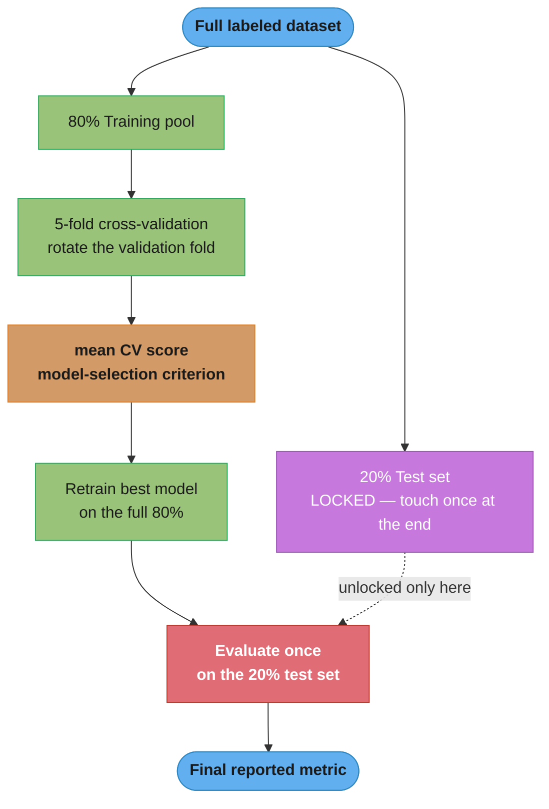
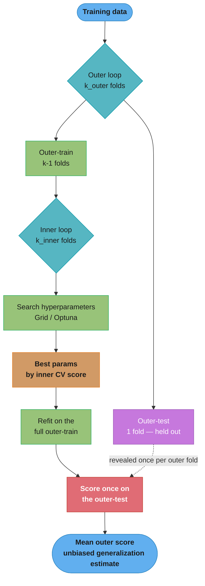
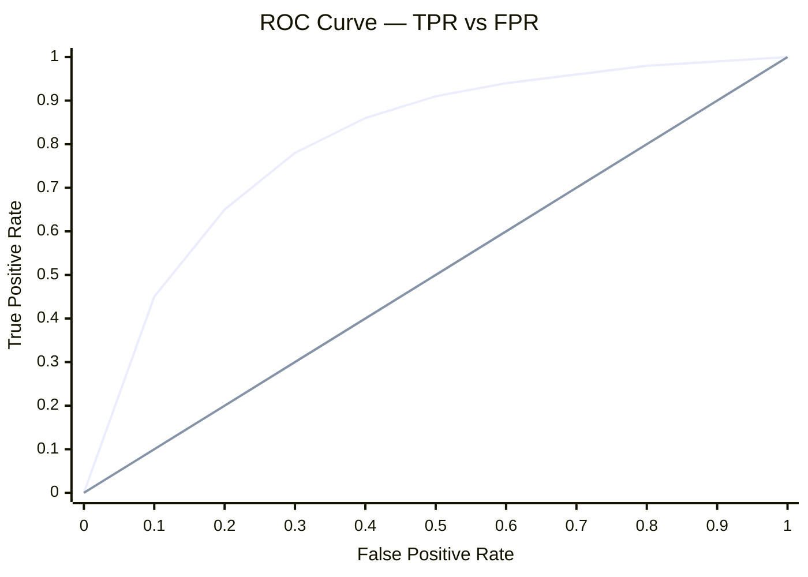
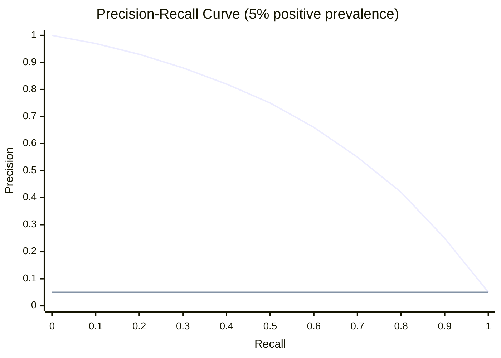
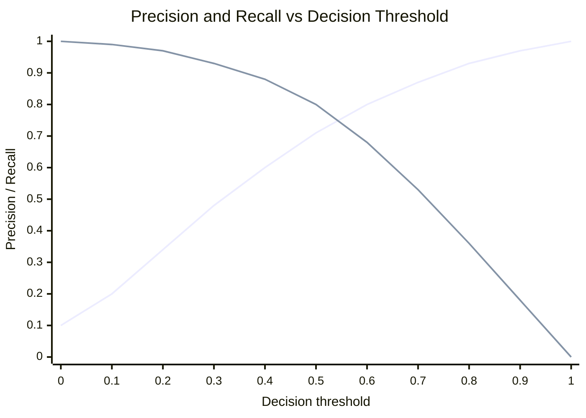
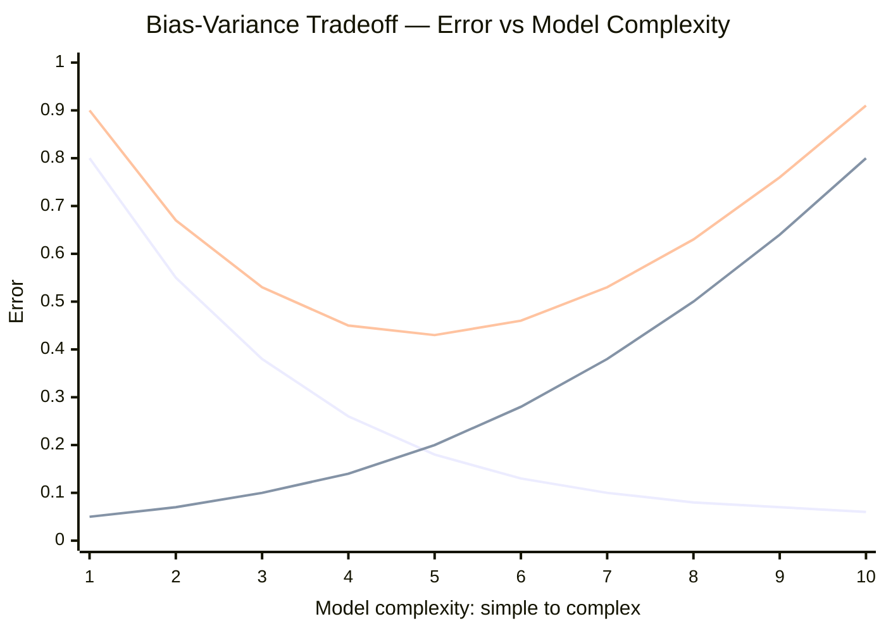
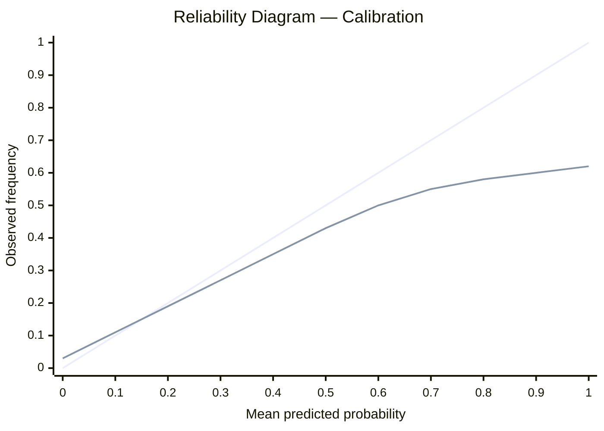

# Model Evaluation and Selection

## 1. Concept Overview

Model evaluation measures how well a trained model generalizes to unseen data. Model selection chooses among competing algorithms and hyperparameter configurations. Together they answer: "is this model good enough to deploy, and which version should we ship?"

Core topics:
- **Cross-validation**: estimate generalization error without using the test set; k-fold, stratified, time series, and group variants
- **Classification metrics**: accuracy, precision, recall, F1, AUC-ROC, AUC-PR — each optimizes for a different error cost
- **Regression metrics**: MAE, MSE, RMSE, MAPE, R^2 — sensitivity to outliers and interpretability vary
- **Calibration**: how well predicted probabilities reflect true likelihoods; critical for decision-making
- **Bias-variance tradeoff**: diagnosing underfitting vs overfitting
- **Hyperparameter tuning**: GridSearchCV, RandomizedSearchCV, Bayesian optimization (Optuna)
- **Statistical model comparison**: determining whether one model is significantly better than another

---

## 2. Intuition

One-line analogy: evaluating a model on training data is like grading yourself on a test you wrote — you already know the answers. Cross-validation is like taking five different exams from the same syllabus, written by others.

Mental model:
- CV score = estimate of what you will see in production (with uncertainty)
- AUC-ROC = "how well does the model rank positives above negatives?"
- Calibration = "when the model says 80% probability, does it happen 80% of the time?"
- Hyperparameter tuning = searching for the best regularization dial setting

Why it matters: a model evaluated carelessly produces inflated metrics that collapse in production. Metric choice shapes what behavior gets optimized — precision-focused model behavior differs dramatically from recall-focused, even with identical AUC.

Key insight: the test set must remain completely unseen until final evaluation. Any decision that uses the test set — including metric-based model selection — converts it into a validation set and requires a separate held-out set for unbiased final reporting.

---

## 3. Core Principles

1. **Train / validation / test split hierarchy**: train for learning, validation (CV) for model selection, test for final unbiased estimate. Never loop back from test to training decisions.
2. **Stratify for imbalanced classes**: random k-fold on an imbalanced dataset may produce folds with no positive examples. `StratifiedKFold` ensures each fold has the same class distribution as the original.
3. **Temporal data requires temporal splits**: random splits on time-series data allow future information to leak into training (a row from day 100 trains on features from day 200). Use `TimeSeriesSplit`.
4. **Metric must match the business objective**: a spam filter prioritizes recall (catch all spam) over precision (occasional false positives acceptable). A fraud block system may prioritize precision (blocking a legitimate transaction is costly).
5. **Probability calibration is separate from discrimination**: a model can rank examples perfectly (AUC-ROC = 0.95) but output poorly calibrated probabilities (model says 90% for events that actually happen 60% of the time). Both matter for decision thresholds.

---

## 4. Types / Architectures / Strategies

### Cross-Validation Variants

| Variant              | Use when                                        | Leakage risk |
|----------------------|-------------------------------------------------|--------------|
| K-Fold               | IID data, balanced classes                      | None         |
| Stratified K-Fold    | Imbalanced classes, classification              | None         |
| TimeSeriesSplit      | Temporal data (financial, sensor, clickstream)  | None         |
| Group K-Fold         | Groups must not span folds (patients, users)    | None         |
| Leave-One-Out (LOO)  | Very small n (< 100), expensive to compute      | None         |
| Purged K-Fold        | Finance: embargo period between train and val   | None         |
| Repeated K-Fold      | Reduce variance in CV estimate                  | None         |

### Classification Metrics

| Metric     | Formula                           | Best for                             |
|------------|-----------------------------------|--------------------------------------|
| Accuracy   | (TP+TN) / N                       | Balanced classes only                |
| Precision  | TP / (TP + FP)                    | Minimize false positives             |
| Recall     | TP / (TP + FN)                    | Minimize false negatives             |
| F1         | 2 * P * R / (P + R)               | Balance precision-recall             |
| F-beta     | (1+b^2) * P * R / (b^2*P + R)    | Weight recall b times over precision |
| AUC-ROC    | P(score(pos) > score(neg))        | Balanced to moderately imbalanced    |
| AUC-PR     | Area under precision-recall curve | Highly imbalanced (< 5% positives)   |
| MCC        | Matthews Correlation Coefficient  | Imbalanced, all 4 cells of CM matter |

### Regression Metrics

| Metric | Formula                    | Outlier sensitivity | Interpretable |
|--------|----------------------------|---------------------|---------------|
| MAE    | mean(|y - y_hat|)          | Low                 | Yes (same units as y) |
| MSE    | mean((y - y_hat)^2)        | High                | No (squared units) |
| RMSE   | sqrt(MSE)                  | High                | Yes (same units as y) |
| MAPE   | mean(|y - y_hat| / |y|)*100| Low                 | Yes (percentage) |
| R^2    | 1 - SS_res / SS_tot        | Moderate            | Relative (0–1 for well-fit) |

### Hyperparameter Tuning

| Method             | Strategy                            | When to use                        |
|--------------------|-------------------------------------|------------------------------------|
| GridSearchCV       | Exhaustive grid search              | Small param grid (< 100 combos)    |
| RandomizedSearchCV | Random sampling from distributions  | Larger grids; 60-80% of grid perf  |
| Optuna (TPE)       | Bayesian / Tree-structured Parzen   | Large grids, expensive models      |
| Hyperopt           | Bayesian (TPE, ATPE)                | Similar to Optuna                  |
| BOHB               | Bandit + Bayesian                   | Very expensive models (neural)     |

---

## 5. Architecture Diagrams

### Train / Validation / Test Hierarchy



The 20% test set (purple, locked) stays untouched until the single final evaluation; every model-selection decision runs off the mean CV score, so the test estimate remains unbiased.

```
5-fold rotation — each row validates on a different slice (T = train, V = validate):

  fold 1:  T  T  T  T  V     validate on slice 5, train on 1-4
  fold 2:  T  T  T  V  T     validate on slice 4, train on 1-3,5
  fold 3:  T  T  V  T  T
  fold 4:  T  V  T  T  T
  fold 5:  V  T  T  T  T     every fold uses a fresh validation slice
```

### k-Fold and Nested Cross-Validation



Nested CV separates tuning from evaluation: the inner loop picks hyperparameters while the outer test fold is scored exactly once, so the reported number is not inflated by reusing the selection data — the trap behind Pitfall 2.

### TimeSeriesSplit (No Future Leakage)

```
Time:  t1 --- t2 --- t3 --- t4 --- t5 --- t6 --- t7 --- t8

Split 1:  [Train: t1-t4]           [Val: t5-t6]
Split 2:  [Train: t1-t6]           [Val: t7]
Split 3:  [Train: t1-t7]           [Val: t8]

NEVER: [Train: t1, t3, t5, t7]  [Val: t2, t4, t6, t8]  <-- future data in train
```

Random k-fold leaks future rows into training; TimeSeriesSplit always trains on the past and validates on the future, which is why the financial example's CV AUC falls from an optimistic 0.79 to a realistic 0.61 (live was 0.59).

### ROC and Precision-Recall Curves



The upper curve is the model; the straight diagonal is the random baseline (AUC-ROC = 0.5). AUC-ROC is the area under the model curve — the probability it ranks a random positive above a random negative — and the curve bowing toward the top-left is what a high AUC looks like.



Precision starts near 1.0 and decays toward the positive prevalence (the flat line at 0.05). The model curve staying high as recall grows is exactly what a large AUC-PR measures — the reason AUC-PR is preferred over AUC-ROC below 5% positives.

### Precision / Recall vs Decision Threshold



The rising line is precision, the falling line is recall: raising the threshold trades recall away for precision. To meet the case study's regulatory 90%-recall constraint you slide left to a low threshold and read off the precision there — exactly how the loan-default operating point is chosen.

### Bias-Variance Tradeoff



Bias (the falling line) shrinks and variance (the rising line) grows with complexity, so total error (the U-shaped line) bottoms out at moderate complexity. A low training and low CV score together sit on the left (underfit, high bias); a high training but low CV score sits on the right (overfit, high variance).

### Reliability Diagram (Calibration)



The diagonal is perfect calibration; the lower curve is an overconfident model — where it predicts 0.9 the event actually occurs only ~0.6 of the time (the churn-model failure in Pitfall 4). The vertical gap between the two lines is the calibration error that Platt scaling or isotonic regression removes.

---

## 6. How It Works — Detailed Mechanics

```python
from __future__ import annotations

import numpy as np
import pandas as pd
from sklearn.calibration import CalibratedClassifierCV, calibration_curve
from sklearn.datasets import make_classification
from sklearn.ensemble import GradientBoostingClassifier, RandomForestClassifier
from sklearn.linear_model import LogisticRegression
from sklearn.metrics import (
    average_precision_score,
    brier_score_loss,
    classification_report,
    f1_score,
    make_scorer,
    matthews_corrcoef,
    mean_absolute_error,
    mean_squared_error,
    precision_recall_curve,
    r2_score,
    roc_auc_score,
)
from sklearn.model_selection import (
    GridSearchCV,
    GroupKFold,
    RandomizedSearchCV,
    RepeatedStratifiedKFold,
    StratifiedKFold,
    TimeSeriesSplit,
    cross_val_score,
    cross_validate,
)
from scipy import stats
from typing import Any


# ── Cross-validation ──────────────────────────────────────────────────────────

def evaluate_model_cv(
    model: Any,
    X: np.ndarray,
    y: np.ndarray,
    cv_strategy: str = "stratified",
    n_splits: int = 5,
    scoring: str = "roc_auc",
) -> dict[str, float]:
    """
    Returns mean and std of CV scores.
    cv_strategy:
      "stratified" -- StratifiedKFold (default for classification)
      "timeseries" -- TimeSeriesSplit (temporal data)
      "repeated"   -- RepeatedStratifiedKFold (lower variance estimate)
    """
    if cv_strategy == "stratified":
        cv = StratifiedKFold(n_splits=n_splits, shuffle=True, random_state=42)
    elif cv_strategy == "timeseries":
        cv = TimeSeriesSplit(n_splits=n_splits)
    elif cv_strategy == "repeated":
        cv = RepeatedStratifiedKFold(n_splits=n_splits, n_repeats=3, random_state=42)
    else:
        raise ValueError(f"Unknown cv_strategy: {cv_strategy}")

    scores = cross_val_score(model, X, y, cv=cv, scoring=scoring, n_jobs=-1)
    result = {"mean": float(scores.mean()), "std": float(scores.std())}
    print(f"CV {scoring}: {result['mean']:.4f} +/- {result['std']:.4f}")
    return result


# ── Classification metrics ────────────────────────────────────────────────────

def evaluate_classifier(
    y_true: np.ndarray,
    y_pred: np.ndarray,
    y_prob: np.ndarray | None = None,
) -> dict[str, float]:
    """
    Comprehensive classification evaluation.
    y_prob: predicted probabilities for positive class (needed for AUC metrics).
    """
    metrics: dict[str, float] = {}

    # Threshold-dependent metrics
    metrics["f1"] = f1_score(y_true, y_pred, average="binary")
    metrics["mcc"] = matthews_corrcoef(y_true, y_pred)
    print(classification_report(y_true, y_pred))

    if y_prob is not None:
        # AUC-ROC: probability that model ranks a random positive above a random negative
        # Invariant to class threshold; baseline random = 0.5
        metrics["auc_roc"] = roc_auc_score(y_true, y_prob)

        # AUC-PR: better for imbalanced; area under precision-recall curve
        # Baseline = prevalence (e.g., 0.05 for 5% positive rate)
        metrics["auc_pr"] = average_precision_score(y_true, y_prob)

        # Brier score: mean squared error of probability predictions; 0 = perfect; 1 = worst
        metrics["brier_score"] = brier_score_loss(y_true, y_prob)

        print(f"AUC-ROC:     {metrics['auc_roc']:.4f}  (random baseline: 0.5)")
        print(f"AUC-PR:      {metrics['auc_pr']:.4f}  (random baseline: {y_true.mean():.3f})")
        print(f"Brier score: {metrics['brier_score']:.4f}  (perfect: 0.0)")

    return metrics


# ── Imbalanced class: prefer AUC-PR over AUC-ROC ─────────────────────────────

def demonstrate_auc_pr_importance(
    y_true: np.ndarray,
    y_prob_good: np.ndarray,
    y_prob_bad: np.ndarray,
) -> None:
    """
    On heavily imbalanced data (1% positives), AUC-ROC can be misleadingly high
    for a model that does poorly on the minority class.
    AUC-PR directly measures minority class retrieval quality.
    """
    print("Model A (good at minority):")
    print(f"  AUC-ROC: {roc_auc_score(y_true, y_prob_good):.4f}")
    print(f"  AUC-PR:  {average_precision_score(y_true, y_prob_good):.4f}")

    print("Model B (poor at minority):")
    print(f"  AUC-ROC: {roc_auc_score(y_true, y_prob_bad):.4f}")
    print(f"  AUC-PR:  {average_precision_score(y_true, y_prob_bad):.4f}")
    # Observation: AUC-ROC gap may be small (e.g., 0.89 vs 0.85)
    # AUC-PR gap will be large (e.g., 0.72 vs 0.31) — AUC-PR is more diagnostic


# ── Regression metrics ────────────────────────────────────────────────────────

def evaluate_regressor(
    y_true: np.ndarray,
    y_pred: np.ndarray,
) -> dict[str, float]:
    mae = mean_absolute_error(y_true, y_pred)
    mse = mean_squared_error(y_true, y_pred)
    rmse = float(np.sqrt(mse))
    r2 = r2_score(y_true, y_pred)
    # MAPE: undefined for y_true == 0; guard with mask
    nonzero_mask = y_true != 0
    mape = float(np.mean(np.abs((y_true[nonzero_mask] - y_pred[nonzero_mask]) /
                                 y_true[nonzero_mask])) * 100)
    print(f"MAE:  {mae:.4f}  (same units as y, outlier-robust)")
    print(f"RMSE: {rmse:.4f}  (penalizes large errors, same units as y)")
    print(f"MAPE: {mape:.2f}%  (percentage error, undefined when y=0)")
    print(f"R^2:  {r2:.4f}  (fraction of variance explained; 1.0 = perfect)")
    return {"mae": mae, "rmse": rmse, "mape": mape, "r2": r2}


# ── Probability calibration ───────────────────────────────────────────────────

def calibrate_model(
    model: Any,
    X_train: np.ndarray,
    y_train: np.ndarray,
    X_val: np.ndarray,
    y_val: np.ndarray,
    method: str = "isotonic",
) -> CalibratedClassifierCV:
    """
    Calibration corrects probability outputs so that predicted P(y=1) = 0.7
    corresponds to 70% actual positive rate.

    method="sigmoid"  (Platt scaling): few calibration samples (< 1,000), fast.
    method="isotonic": more samples (> 1,000), flexible non-monotonic correction.

    Brier score: mean squared error of probabilities. Lower = better calibrated.
    Expected calibration error (ECE): average abs difference between confidence
      and accuracy across probability bins.
    """
    calibrated = CalibratedClassifierCV(model, method=method, cv="prefit")
    calibrated.fit(X_val, y_val)  # fit calibrator on held-out validation set

    y_prob_raw = model.predict_proba(X_val)[:, 1]
    y_prob_cal = calibrated.predict_proba(X_val)[:, 1]

    print(f"Brier score before calibration: {brier_score_loss(y_val, y_prob_raw):.4f}")
    print(f"Brier score after  calibration: {brier_score_loss(y_val, y_prob_cal):.4f}")

    # Reliability curve: compare fraction of positives vs predicted probability
    frac_pos_raw, mean_pred_raw = calibration_curve(y_val, y_prob_raw, n_bins=10)
    frac_pos_cal, mean_pred_cal = calibration_curve(y_val, y_prob_cal, n_bins=10)
    print("\nCalibration curve (before | after):")
    for mp, fp, mp2, fp2 in zip(mean_pred_raw, frac_pos_raw, mean_pred_cal, frac_pos_cal):
        print(f"  pred={mp:.2f} actual={fp:.2f}  |  pred={mp2:.2f} actual={fp2:.2f}")

    return calibrated


# ── Hyperparameter tuning with Optuna ─────────────────────────────────────────

def tune_with_optuna(
    X_train: np.ndarray,
    y_train: np.ndarray,
    n_trials: int = 100,
) -> dict[str, Any]:
    """
    Optuna: Bayesian optimization using TPE (Tree-structured Parzen Estimator).
    TPE models p(x|y) separately for good and bad trials, sampling from the
    ratio to guide the next suggestion.

    MedianPruner: stops unpromising trials early if intermediate value
      is below the median of completed trials at that step (similar to early stopping).
    """
    try:
        import optuna
        optuna.logging.set_verbosity(optuna.logging.WARNING)

        def objective(trial: "optuna.Trial") -> float:
            params = {
                "n_estimators": trial.suggest_int("n_estimators", 100, 1000, step=100),
                "max_depth": trial.suggest_int("max_depth", 3, 10),
                "learning_rate": trial.suggest_float("learning_rate", 1e-3, 0.3, log=True),
                "min_samples_leaf": trial.suggest_int("min_samples_leaf", 5, 100),
                "subsample": trial.suggest_float("subsample", 0.5, 1.0),
            }
            model = GradientBoostingClassifier(**params, random_state=42)
            cv = StratifiedKFold(n_splits=5, shuffle=True, random_state=42)
            scores = cross_val_score(model, X_train, y_train, cv=cv, scoring="roc_auc", n_jobs=-1)
            return float(scores.mean())

        sampler = optuna.samplers.TPESampler(seed=42)
        pruner = optuna.pruners.MedianPruner(n_startup_trials=10, n_warmup_steps=5)
        study = optuna.create_study(
            direction="maximize", sampler=sampler, pruner=pruner
        )
        study.optimize(objective, n_trials=n_trials, n_jobs=1)

        print(f"Best AUC-ROC: {study.best_value:.4f}")
        print(f"Best params: {study.best_params}")
        return study.best_params

    except ImportError:
        raise ImportError("Install optuna: pip install optuna")


# ── Statistical model comparison ──────────────────────────────────────────────

def compare_models_ttest(
    model_a: Any,
    model_b: Any,
    X: np.ndarray,
    y: np.ndarray,
    n_splits: int = 10,
    scoring: str = "roc_auc",
    alpha: float = 0.05,
) -> None:
    """
    Paired t-test on CV scores.
    Each fold gives one score for model A and one for model B on the same data.
    Paired test accounts for fold-level correlation.
    Limitation: CV scores are not truly independent (overlapping training sets),
      so p-values are optimistic — treat as directional evidence, not definitive proof.
    """
    cv = StratifiedKFold(n_splits=n_splits, shuffle=True, random_state=42)
    scores_a = cross_val_score(model_a, X, y, cv=cv, scoring=scoring, n_jobs=-1)
    scores_b = cross_val_score(model_b, X, y, cv=cv, scoring=scoring, n_jobs=-1)

    t_stat, p_value = stats.ttest_rel(scores_a, scores_b)
    print(f"Model A: {scores_a.mean():.4f} +/- {scores_a.std():.4f}")
    print(f"Model B: {scores_b.mean():.4f} +/- {scores_b.std():.4f}")
    print(f"Paired t-test: t={t_stat:.4f}, p={p_value:.4f}")
    if p_value < alpha:
        better = "A" if scores_a.mean() > scores_b.mean() else "B"
        print(f"Model {better} is significantly better at alpha={alpha}")
    else:
        print(f"No significant difference detected at alpha={alpha}")


def compare_models_mcnemar(
    y_true: np.ndarray,
    pred_a: np.ndarray,
    pred_b: np.ndarray,
) -> None:
    """
    McNemar's test: compares two classifiers on the same test set.
    Tests whether the off-diagonal counts (A correct + B wrong, vs A wrong + B correct)
    differ significantly.
    More appropriate than t-test when you have a single fixed test set.
    """
    from statsmodels.stats.contingency_tables import mcnemar
    # Contingency table
    correct_a = (pred_a == y_true)
    correct_b = (pred_b == y_true)
    table = np.array([
        [(correct_a & correct_b).sum(), (correct_a & ~correct_b).sum()],
        [(~correct_a & correct_b).sum(), (~correct_a & ~correct_b).sum()],
    ])
    result = mcnemar(table, exact=True)
    print(f"McNemar test: statistic={result.statistic:.4f}, p={result.pvalue:.4f}")
```

---

## 7. Real-World Examples

**Medical diagnosis (recall vs precision):** A cancer screening model must maximize recall (catch all true positives) because a missed cancer (FN) is far more costly than an unnecessary biopsy (FP). Team uses F2-score (beta=2, weighting recall twice over precision) as the CV objective. Final model achieves recall=0.94, precision=0.61, AUC-PR=0.82. A precision-tuned model at the same AUC-ROC (0.91) had recall=0.78 — 16% more missed cases.

**Fraud detection (AUC-PR over AUC-ROC):** Payment fraud rate = 0.3% (severely imbalanced). Model A had AUC-ROC=0.96, AUC-PR=0.72. Model B had AUC-ROC=0.94, AUC-PR=0.41. Team initially chose Model B (higher simplicity). After switching metric to AUC-PR, Model A was selected. At identical 0.1% false positive rate, Model A caught 2.1x more fraud.

**Insurance pricing (calibration):** Gradient boosted model scored AUC-ROC=0.87 but Brier score=0.18 (vs logistic regression Brier=0.11 at AUC-ROC=0.82). Insurance premiums are set as `P(claim) * E[claim_amount]` — poorly calibrated probabilities meant premiums were systematically mispriced. Platt scaling on a 10,000-row held-out set reduced Brier score from 0.18 to 0.12 without changing AUC.

**Financial time series (TimeSeriesSplit):** A team used random 5-fold CV on daily stock features. Validation AUC-ROC was 0.79. After switching to `TimeSeriesSplit(n_splits=5)` (always train on past, validate on future), CV AUC dropped to 0.61 — closer to actual live performance of 0.59. The gap was entirely caused by future data leaking into training folds.

**Optuna hyperparameter search:** GBM model with GridSearchCV over 4 hyperparameters (5 values each = 625 fits * 5 CV = 3,125 model fits, ~4 hours). Optuna TPE with 200 trials found the same best AUC-ROC (0.8312 vs grid 0.8309) in 200 * 5 = 1,000 fits (~80 minutes). Pruner stopped 43 of 200 trials early, saving additional ~25% time.

---

## 8. Tradeoffs

### Metric Selection for Imbalanced Classification

| Metric   | Insensitive to imbalance | Reflects minority recall | Use when |
|----------|--------------------------|--------------------------|----------|
| Accuracy | No (90% negative = 90% acc) | No                     | Balanced only |
| AUC-ROC  | Mostly yes               | Partially               | Moderately imbalanced (> 5% positive) |
| AUC-PR   | Yes                      | Yes                     | Highly imbalanced (< 5% positive) |
| F1       | No                       | Yes (at threshold)       | Single operating point matters |
| MCC      | Yes                      | Yes                     | Imbalanced, both FP and FN costly |

### CV Strategy Comparison

| Strategy          | Data assumption | Fold independence | Cost |
|-------------------|-----------------|-------------------|------|
| K-Fold            | IID             | Moderate          | n_splits * 1 fit |
| Stratified K-Fold | IID, imbalanced | Moderate          | n_splits * 1 fit |
| TimeSeriesSplit   | Temporal        | High              | n_splits * 1 fit, growing train size |
| Repeated Stratified| IID, low n     | Highest           | n_splits * n_repeats fits |
| LOO               | Small n         | High              | n fits |

### Tuning Strategy Comparison

| Method             | Trials needed to find good params | Handles conditional params | Parallelizable |
|--------------------|-----------------------------------|----------------------------|----------------|
| GridSearchCV       | Exponential in param count        | No                         | Yes            |
| RandomizedSearchCV | 60 trials ~ 95% of grid           | No                         | Yes            |
| Optuna TPE         | 50–200 for most problems          | Yes                        | Yes (async)    |

---

## 9. When to Use / When NOT to Use

**StratifiedKFold — always use for classification** unless class distribution is naturally uniform (very rare). Never use plain `KFold` on imbalanced data — folds may have no positive examples.

**TimeSeriesSplit — must use for temporal data** (financial, sensor, clickstream, demand forecasting). Random splits create future-to-past leakage that produces wildly optimistic metrics. Purge a gap between train and validation (e.g., skip 1 week) to prevent feature autocorrelation from leaking across the boundary.

**AUC-ROC — use when:** class imbalance is moderate (> 5% positives), you need a threshold-agnostic metric, or you are comparing models for ranking quality.
**AUC-PR — use when:** positives are rare (< 5%), false positives are cheap but false negatives are costly (fraud, disease detection).

**Calibration — must do when:** model output is used as a probability estimate to drive decisions (insurance pricing, medical risk, auction bid pricing). Not needed if you only care about ranking (recommendation systems, information retrieval).

**Optuna / Bayesian tuning — use when:** each model fit is expensive (> 1 minute), the parameter space is large (> 4 parameters), or you have conditional parameters (depth only matters if n_estimators > 500). Use GridSearchCV for small grids (< 30 combinations) — overhead is not justified.

**LOO-CV — avoid for large n**: O(n) fits; 100,000 rows = 100,000 model trains. Use only when n < 200 and you need the lowest-bias estimate possible (medical studies, rare event research).

---

## 10. Common Pitfalls

**Pitfall 1: Evaluating on training data.**
A junior engineer reported model accuracy of 99.7% on the training set. Actual test accuracy was 74%. The model had memorized training data (decision tree with no depth limit). Fix: always report metrics on a held-out set or via cross-validation.

**Pitfall 2: Using the test set for model selection.**
Team ran 20 experiments, evaluated each on the test set, chose the best, and reported that test score. The reported metric is now optimistically biased — you have effectively used the test set as a validation set 20 times. Fix: use cross-validation scores for model selection; evaluate on the test set exactly once for final reporting.

**Pitfall 3: Choosing accuracy on imbalanced data.**
Fraud detection dataset with 0.5% fraud rate. Classifier that always predicts "not fraud": accuracy = 99.5%, AUC-PR = 0.005, recall = 0. Team shipped the model because "99.5% accuracy" sounded good. Fix: define the right metric (AUC-PR or recall@fixed FPR) before training begins.

**Pitfall 4: Not calibrating probabilities for decision-making.**
A churn prediction model output P(churn) = 0.8 for many customers. Marketing set the retention offer threshold at 0.5 (above = offer). Post-launch: only 43% of flagged customers actually churned (actual rate should have been ~80% per the model). Brier score analysis showed severe overconfidence. Fix: fit Platt scaling or isotonic calibration on a held-out validation set.

**Pitfall 5: Random split on time-series data.**
A demand forecasting model for a retail chain used random 20% test split. Test AUC 0.86. After deployment, live MAE was 3x higher than test MAE. Random split selected test rows from all months; training data included December rows when the model predicted November. TimeSeriesSplit on the same data gave a test MAE matching production within 8%.

**Pitfall 6: Misinterpreting MAPE with near-zero actuals.**
MAPE = |actual - predicted| / |actual|. When actual sales = 1 unit (common for long-tail SKUs), a prediction of 2 gives MAPE = 100%. A prediction of 1.1 gives MAPE = 10%. MAPE becomes numerically unstable and misleading. Fix: use MASE (mean absolute scaled error) or RMSSE for intermittent demand data.

```python
# BROKEN — MAPE blows up for small actuals
mape = np.mean(np.abs((y_true - y_pred) / y_true)) * 100

# FIXED — guard against near-zero
epsilon = 1.0  # domain-specific floor
mape_safe = np.mean(np.abs((y_true - y_pred) / np.maximum(np.abs(y_true), epsilon))) * 100
```

---

## 11. Technologies & Tools

| Tool                  | Purpose                                      | Notes |
|-----------------------|----------------------------------------------|-------|
| scikit-learn          | CV, metrics, calibration, GridSearchCV       | Production standard |
| Optuna                | Bayesian hyperparameter tuning               | pip install optuna |
| Hyperopt              | Alternative Bayesian tuning (TPE, ATPE)      | Compatible with XGBoost |
| Ray Tune              | Distributed hyperparameter search            | Works with PyTorch, sklearn |
| MLflow                | Experiment tracking, metric logging          | Log CV scores per trial |
| Weights & Biases      | Experiment tracking + hyperparameter sweeps  | Sweep = distributed random/Bayesian |
| statsmodels           | McNemar's test, likelihood ratio tests       | pip install statsmodels |
| imbalanced-learn      | SMOTE, ADASYN, class-weighted CV             | Imbalanced dataset tools |
| scikit-plot           | AUC curves, confusion matrix visualization   | Quick EDA |
| SHAP                  | Model explanation alongside evaluation       | Feature importance at evaluation time |

---

## 12. Interview Questions with Answers

**Q: What is the difference between AUC-ROC and AUC-PR, and when do you prefer each?**
AUC-ROC measures the probability that the model scores a random positive higher than a random negative; it is threshold-agnostic and ranges from 0.5 (random) to 1.0. AUC-PR measures the area under the precision-recall curve; its baseline equals the positive class prevalence (e.g., 0.05 for 5% positives). For heavily imbalanced datasets (< 5% positives), AUC-ROC is misleadingly optimistic because the large number of true negatives inflates TPR and TNR. AUC-PR directly measures how well the model retrieves the minority class. Use AUC-PR for fraud detection, rare disease prediction, and any setting where the minority class is the primary concern.

**Q: Why must you use StratifiedKFold instead of KFold for classification with imbalanced classes?**
Plain KFold assigns rows to folds randomly; with 1% positive rate and 1,000 rows, some folds may contain zero positive examples, making AUC computation undefined and giving wildly variable estimates. StratifiedKFold ensures each fold has approximately the same positive rate as the full dataset (here ~10 positives per fold). This produces stable, unbiased cross-validation estimates. Always use StratifiedKFold as the default for classification.

**Q: Explain the bias-variance tradeoff and how you diagnose each.**
Bias is systematic error from a model too simple to capture the true relationship (underfitting); variance is error from a model too sensitive to training data fluctuations (overfitting). Diagnose: if training score is low and CV score is similar (both ~65%), the model underfits — add features, use more complex model. If training score is high (95%) but CV score is low (70%), the model overfits — regularize, reduce complexity, add more data. Learning curves (train/val score vs training set size) visualize this: high variance = large gap that closes as n increases; high bias = gap is small but both scores are low.

**Q: What is probability calibration and why does it matter?**
Calibration means that when a model predicts P(y=1) = 0.7, approximately 70% of such predictions are actually positive. Many models (GBMs, SVMs, random forests) produce probabilities that are not well-calibrated — GBMs tend to be overconfident (probabilities cluster near 0 or 1). Calibration matters when probabilities drive decisions: insurance pricing uses P(claim) * E[amount]; a medical decision tool uses P(disease) to trigger further tests; an auction system uses P(click) * bid value. Fix with Platt scaling (sigmoid fit, needs ~1,000 samples) or isotonic regression (non-parametric, needs > 1,000 samples); always fit the calibrator on a separate held-out set.

**Q: When should you use TimeSeriesSplit and what is the purge gap?**
Use TimeSeriesSplit whenever rows are temporally dependent — financial data, time-based user events, sensor readings, demand forecasting. The core rule: training data must always be earlier in time than validation data. A purge gap is a buffer period between the training end and validation start. For example, if you train up to day 100 and validate on day 107, you skip days 101–106. This prevents autocorrelated features (e.g., 7-day rolling average) from leaking information across the boundary. Without a purge gap, day-100 training features and day-101 validation features share the same underlying values.

**Q: How does Optuna's TPE sampler work and why is it better than random search?**
TPE (Tree-structured Parzen Estimator) maintains two models: `l(x)` (distribution of hyperparameter configurations associated with good results) and `g(x)` (associated with poor results). It samples the next candidate from the ratio `l(x)/g(x)`, meaning it prioritizes regions that historically produce good results while maintaining some exploration. After 50–100 trials, TPE focuses search in the most promising parameter regions, whereas random search samples uniformly throughout. In practice TPE finds equivalent or better results in 30–50% fewer trials than random search for standard ML hyperparameter spaces.

**Q: What is the Brier score and how does it relate to calibration?**
The Brier score is the mean squared error of probability predictions: `mean((y_true - y_prob)^2)`. Range: 0 (perfect) to 1 (worst). A perfectly calibrated model does not guarantee a low Brier score — discrimination (ranking ability) also contributes. The Brier score decomposes into calibration + resolution + uncertainty. It is the most common scalar summary of probability prediction quality. Reduce Brier score by: (1) improving model AUC (better discrimination), (2) calibrating probabilities (better calibration).

**Q: When is it appropriate to use the paired t-test for model comparison?**
The paired t-test on CV fold scores is appropriate when you have multiple evaluation folds on the same data (each fold gives one observation per model) and you want to test whether mean CV performance differs. "Paired" accounts for fold-level correlation — fold 3 tends to be hard for all models, so comparing models on the same folds is more efficient than unpaired. Limitation: CV fold scores are not truly independent (training sets overlap), so p-values are anti-conservative (reject H0 too easily). Treat results as directional evidence; require p < 0.01 rather than p < 0.05 for higher confidence.

**Q: What is McNemar's test and when do you use it instead of the t-test?**
McNemar's test compares two classifiers on a fixed held-out test set based on the discordant pairs: cases where model A is correct and B is wrong (b), versus B correct and A wrong (c). The test statistic is `(b - c)^2 / (b + c)` following chi-squared. Use McNemar's when you have a single test set (not CV) and binary classification predictions. It is more appropriate than the t-test in this setting because it directly measures disagreement between classifiers rather than continuous score differences.

**Q: Explain the problem with using test set for both model selection and reporting.**
If you use the test set to compare 20 models and report the best, you have introduced selection bias. The reported metric is the maximum of 20 noisy estimates rather than an unbiased estimate of the winner's true performance — it overestimates true performance by an amount proportional to the number of models compared and the noise in the estimate. Fix: use cross-validation on the training set for all model comparison decisions; reserve the test set for a single final evaluation after all decisions are made.

**Q: How do you choose the number of folds k in k-fold cross-validation?**
Standard choice is k=5 or k=10. Higher k (10) gives a lower-bias estimate (each validation fold is smaller, training set is larger and closer to full data size) but higher variance (more folds, each noisier). Lower k (5) is faster and still gives reasonable estimates for n > 1,000. For small n (< 500), use LOO-CV or k=n-1. For very large n (> 1M), k=3 is often sufficient — the estimate variance is dominated by the model's own noise, not fold size. Time-series splits: k = number of years or quarters depending on forecast horizon.

**Q: What is MAPE and what are its limitations for regression evaluation?**
MAPE (Mean Absolute Percentage Error) = `mean(|actual - predicted| / |actual|) * 100`. Limitations: (1) undefined when actual = 0 (division by zero), (2) asymmetric — over-prediction and under-prediction of the same magnitude give different errors, (3) heavy penalty for small actuals (predicting 2 when actual is 1 gives 100% error). Better alternatives: sMAPE (symmetric MAPE), MASE (mean absolute scaled error, relative to naïve forecast), RMSSE. Use MAPE only when actuals are reliably > 0 and interpretability in percentage terms is required.

**Q: Why can accuracy be dangerously misleading on imbalanced datasets?**
On imbalanced data, accuracy is dominated by the majority class: predicting all-negative on 1% positives yields 99% accuracy with zero recall. This is the accuracy paradox — the metric rewards ignoring the minority class, which is usually the class you actually care about (fraud, disease, churn). Use precision, recall, F1, AUC-PR, or balanced accuracy instead, and always inspect the confusion matrix so majority-class dominance is visible. Set the decision threshold from the precision-recall tradeoff rather than the default 0.5.

**Q: What is the difference between macro, micro, and weighted F1?**
Macro-F1 averages per-class F1 equally, micro-F1 pools all TP/FP/FN globally, and weighted-F1 averages per-class F1 weighted by each class's support. Macro-F1 treats every class as equally important, so rare classes count as much as frequent ones — use it when minority-class performance matters. Micro-F1 aggregates counts across classes, so it is dominated by frequent classes and equals accuracy in single-label multiclass problems. Weighted-F1 is a compromise that weights each class's F1 by its number of true instances. For imbalanced multiclass problems where the rare classes matter, report macro-F1; if you only care about overall correctness, micro-F1 suffices.

**Q: What is the difference between calibration and discrimination?**
Discrimination is the ability to rank positives above negatives (measured by AUC); calibration is whether predicted probabilities match observed frequencies. A model can discriminate perfectly yet be badly calibrated: multiplying every well-ranked score by 0.5 leaves AUC unchanged but makes probabilities systematically too low. Conversely a calibrated model can have poor discrimination — predicting the base rate for everyone is perfectly calibrated but useless for ranking. AUC and ranking metrics measure discrimination; reliability diagrams, ECE, and the Brier score's calibration term measure calibration. You need both whenever probabilities drive expected-value decisions.

**Q: What is nested cross-validation and when is it necessary?**
Nested CV wraps hyperparameter tuning in an inner loop inside an outer CV loop, so the reported score is never computed on data used to pick hyperparameters. Single-level CV that both tunes hyperparameters and reports the winning score is optimistically biased — the same folds chose the config and graded it. The inner loop (e.g., 5-fold) selects hyperparameters on each outer training split, then the untouched outer test fold evaluates it; the outer scores estimate generalization of the whole tuning procedure. It is necessary when the model space is large or n is small, where tuning bias is significant. Cost is k_outer × k_inner fits, so reserve it for final unbiased estimates, not routine iteration.

**Q: When must you use GroupKFold instead of StratifiedKFold?**
Use GroupKFold when rows share a group identity (same patient, user, or device) that must not appear in both the train and validation folds. If multiple rows come from the same entity and that entity lands in both splits, the model can memorize entity-specific signal and leak it, inflating CV scores that then collapse in production on unseen entities. GroupKFold guarantees all rows of a group stay together in one fold. Common cases: multiple visits per patient, multiple sessions per user, augmented copies of the same image. Use StratifiedGroupKFold when the label is also imbalanced and you need both grouping and stratification.

**Q: How do you build a bootstrap confidence interval for a metric, and why bother?**
Resample the test set with replacement many times (say 1,000), recompute the metric each time, and take the 2.5th and 97.5th percentiles as a 95% interval. A single point estimate like AUC 0.84 hides sampling noise; the bootstrap CI quantifies how much that number would move on a different test sample of the same size. It is non-parametric and works for any metric (AUC, F1, calibration error) without distributional assumptions. Narrow intervals justify claiming one model beats another; overlapping intervals mean the difference may be noise. For paired model comparison, bootstrap the difference in metrics on the same resampled indices to respect the correlation.

---

## 13. Best Practices

1. Fix the metric before writing any code — let the business objective define whether you optimize for precision, recall, AUC-ROC, AUC-PR, MAE, or MAPE.
2. Use `StratifiedKFold` as the default CV for all classification tasks; switch to `TimeSeriesSplit` immediately for temporal data.
3. Keep the test set locked in a separate file or database partition; do not load it until the very end of the project.
4. On imbalanced datasets (< 10% positives), always report AUC-PR alongside AUC-ROC; report both precision and recall at the chosen operating threshold.
5. Calibrate any model whose probability outputs drive financial or medical decisions; use Platt scaling for small validation sets (< 1,000), isotonic regression for larger.
6. Use Optuna or Hyperopt for hyperparameter tuning when each model fit takes > 30 seconds; plain GridSearchCV for fast models with < 30 parameter combinations.
7. Log all experiment results (hyperparameters, CV scores, metric values, training time) with MLflow or Weights & Biases — reproducibility requires this.
8. Run learning curves (train/val score vs training set size) when CV score is disappointing — they diagnose whether more data or more complexity is needed.
9. When comparing two models, use a paired t-test on CV scores (set p < 0.01 threshold) or McNemar's test on a fixed test set — never eyeball mean differences.
10. Report uncertainty: always include standard deviation of CV scores alongside the mean. A model with mean AUC 0.84 ± 0.02 is not clearly better than 0.83 ± 0.04.

---

## 14. Case Study

**Scenario: Loan-default model selection under a 2% base rate.** A lender compares Logistic Regression, XGBoost, and a Neural Net to predict 12-month default. Default rate is 2%, and a regulator requires the model operate at >=90% recall (catch at least 90% of true defaults). Because the class is rare, AUC-ROC is misleading; PR-AUC and calibration drive the decision. Final choice: XGBoost, calibrated with isotonic regression, evaluated under 5-fold stratified CV with a time-based hold-out.

```
                 AUC-ROC    PR-AUC    Brier
LogReg            0.76       0.31     0.045
XGBoost           0.84       0.52     0.031   <- selected
Neural Net        0.83       0.49     0.038

selection path:
  AUC-ROC (optimistic on 2% base) -> PR-AUC (true ranking on positives)
        -> calibration (Brier + reliability) -> threshold @ 90% recall
        -> isotonic calibration -> final XGBoost
```

XGBoost wins on PR-AUC (0.52 vs 0.49/0.31), the metric that actually matters for a rare positive class. At the regulator's 90%-recall operating point its precision is the highest of the three, and isotonic calibration makes its scores usable as probabilities of default for pricing.

**PR-AUC and threshold-at-recall selection:**

```python
import numpy as np
from sklearn.metrics import average_precision_score, precision_recall_curve

def evaluate(y_true: np.ndarray, y_score: np.ndarray,
             target_recall: float = 0.90) -> dict[str, float]:
    pr_auc = average_precision_score(y_true, y_score)
    precision, recall, thresholds = precision_recall_curve(y_true, y_score)
    # pick the highest threshold that still achieves the required recall
    ok = recall[:-1] >= target_recall
    idx = np.where(ok)[0]
    chosen = thresholds[idx[-1]] if len(idx) else 0.0
    prec_at_recall = precision[idx[-1]] if len(idx) else 0.0
    return {"pr_auc": float(pr_auc),
            "threshold": float(chosen),
            "precision_at_recall": float(prec_at_recall)}
```

**Stratified CV plus isotonic calibration:**

```python
import numpy as np
from sklearn.model_selection import StratifiedKFold, cross_val_predict
from sklearn.calibration import CalibratedClassifierCV
import xgboost as xgb

def cv_pr_auc(model, X: np.ndarray, y: np.ndarray) -> float:
    skf = StratifiedKFold(n_splits=5, shuffle=True, random_state=0)
    oof = cross_val_predict(model, X, y, cv=skf, method="predict_proba")[:, 1]
    from sklearn.metrics import average_precision_score
    return float(average_precision_score(y, oof))

def calibrate(base, X_tr, y_tr):
    # isotonic fits a non-parametric monotonic map from raw score to P(default)
    cal = CalibratedClassifierCV(base, method="isotonic", cv=5)
    return cal.fit(X_tr, y_tr)
```

**Reliability check via Brier score:**

```python
import numpy as np
from sklearn.metrics import brier_score_loss

def reliability(y_true: np.ndarray, p_pred: np.ndarray,
                bins: int = 10) -> list[tuple[float, float]]:
    edges = np.linspace(0, 1, bins + 1)
    out: list[tuple[float, float]] = []
    for lo, hi in zip(edges[:-1], edges[1:]):
        m = (p_pred >= lo) & (p_pred < hi)
        if m.any():
            out.append((float(p_pred[m].mean()), float(y_true[m].mean())))
    return out   # (predicted, observed) pairs; should lie on the diagonal
```

**Pitfall 1 — Accuracy on a 2% positive rate.** A model that predicts "no default" for everyone is 98% accurate and 100% useless.

```python
# BROKEN: optimize/report accuracy -> all-negative model looks "great"
from sklearn.metrics import accuracy_score
acc = accuracy_score(y, model.predict(X))   # 0.98, recall on defaults = 0

# FIX: use PR-AUC (and recall at the regulatory operating point) which focus
# on the rare positive class.
pr_auc = average_precision_score(y, model.predict_proba(X)[:, 1])
```

**Pitfall 2 — Data leakage from future features.** A feature like "account closed" is only known after default, so including it inflates offline metrics but is unavailable at scoring time.

```python
# BROKEN: random split + a feature populated after the outcome -> leakage
X_train, X_test = train_test_split(X, shuffle=True)   # mixes future into past

# FIX: time-based split (train on past, test on later period) and audit each
# feature's availability timestamp against the prediction time.
cutoff = "2024-01-01"
X_train, X_test = X[X.asof < cutoff], X[X.asof >= cutoff]
```

**Pitfall 3 — Overfitting to the validation set.** Repeatedly tuning against the same validation fold makes the chosen model look better than it generalizes.

```python
# BROKEN: tune hyperparameters against val, then report val score as final
# -> the val set has effectively become training data.

# FIX: lock an untouched hold-out test set; tune only on CV/validation and
# evaluate the final model on the hold-out exactly once.
final_score = average_precision_score(y_holdout, final_model.predict_proba(X_holdout)[:, 1])
```

**Interview Q&A:**

**Why is AUC-ROC misleading for a 2% default rate, and what replaces it?** ROC uses the false-positive rate, whose denominator (the 98% negatives) is huge, so even many false positives barely move it; AUC-ROC looks high while precision is poor. PR-AUC uses precision and recall, both focused on the rare positives, so it reflects real performance on the class you care about. Here PR-AUC separates the models (0.52 vs 0.31) far more clearly than AUC-ROC.

**What is model calibration and why does the lender need it?** Calibration means the predicted probability matches the observed frequency, when the model says 5% default, about 5% actually default. The lender prices loans off these probabilities, so a miscalibrated model misprices risk even if its ranking (AUC) is perfect. Brier score and reliability diagrams measure it; isotonic or Platt scaling correct it.

**Why choose the operating threshold at 90% recall instead of maximizing F1?** The regulator mandates catching at least 90% of defaults, which is a hard recall constraint, not a balanced trade-off. So the threshold is fixed to meet that recall, and precision at that point becomes the metric to compare models. F1 would optimize a different, business-irrelevant balance.

**Why a time-based split rather than a random split for this problem?** Default is a temporal phenomenon and many features evolve over time. A random split leaks future information into training and produces optimistic estimates. Training on an earlier period and testing on a later one mirrors production, where you always predict the future from the past.

**What is the difference between Platt scaling and isotonic regression for calibration?** Platt scaling fits a logistic (sigmoid) map from score to probability, with few parameters, robust on small data but assumes a sigmoid shape. Isotonic regression fits a free monotonic step function, more flexible and accurate with enough data but prone to overfit on small sets. With ample data here, isotonic is chosen.

**How do you avoid overfitting during model selection itself?** Use nested cross-validation or a strict three-way split: train, validation (for tuning), and a hold-out test touched exactly once at the end. Track how many times the validation set has been queried; repeated tuning against it silently turns it into training data and inflates the reported metric.

**Pitfall — Optimizing for AUC-ROC when the business cost matrix is asymmetric.**

```python
# BROKEN: choosing threshold at 0.5 (default) maximizes accuracy but not business value
# Fraud detection: FN (missed fraud) costs $200; FP (false alarm) costs $2 (review cost)
# At threshold=0.5: precision=0.78, recall=0.71, revenue loss from FN = 29% × $200 = $58
from sklearn.metrics import roc_auc_score
auc = roc_auc_score(y_true, y_scores)   # 0.987 — looks great!
# But business metric: daily cost = FP_count × $2 + FN_count × $200
# At threshold=0.5, daily cost: 120 × $2 + 45 × $200 = $240 + $9,000 = $9,240

# FIX: optimize threshold on cost function directly
def business_cost(y_true, y_pred, fp_cost=2.0, fn_cost=200.0):
    fp = ((y_pred == 1) & (y_true == 0)).sum()
    fn = ((y_pred == 0) & (y_true == 1)).sum()
    return fp * fp_cost + fn * fn_cost

thresholds = np.linspace(0.01, 0.99, 99)
costs = [business_cost(y_true, (y_scores >= t).astype(int)) for t in thresholds]
best_threshold = thresholds[np.argmin(costs)]   # 0.17 — much lower threshold
# At threshold=0.17, daily cost: 380 × $2 + 8 × $200 = $760 + $1,600 = $2,360 (74% reduction)
```

**Why is stratified k-fold cross-validation essential for imbalanced datasets?** Random k-fold splits can create folds with 0 positive examples (especially with 1:1000 class imbalance). A fold with no positives cannot compute AUC-ROC and produces division-by-zero errors in precision/recall. Stratified k-fold maintains the positive class ratio in each fold, guaranteeing that every fold contains positive examples proportional to the overall rate. Use `StratifiedKFold(n_splits=5)` as the default for any binary or multi-class classification task.

**What is calibration and why does a highly accurate model still need it for probability outputs?** A model's raw output score (e.g., 0.85) should correspond to an 85% probability of the positive class — otherwise downstream systems (pricing, risk scoring) using the raw score as a probability make incorrect decisions. A model with AUC 0.98 can still output scores that are systematically biased: all outputs in the range [0.6, 0.8] while the true probability of positives is 0.2. Calibrate using Platt scaling (`sklearn.calibration.CalibratedClassifierCV(method='sigmoid')`) or isotonic regression (`method='isotonic'`). Visualize calibration with a reliability diagram (plot mean predicted probability vs. observed frequency per bin); a perfectly calibrated model lies on the diagonal.
