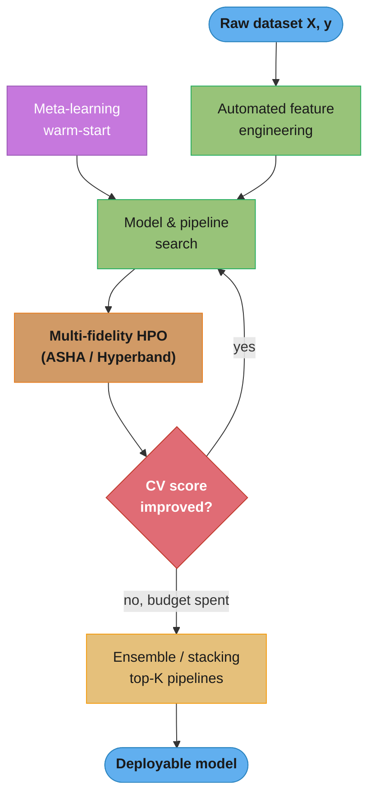
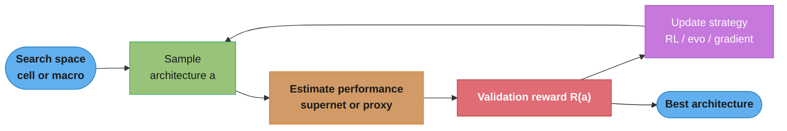
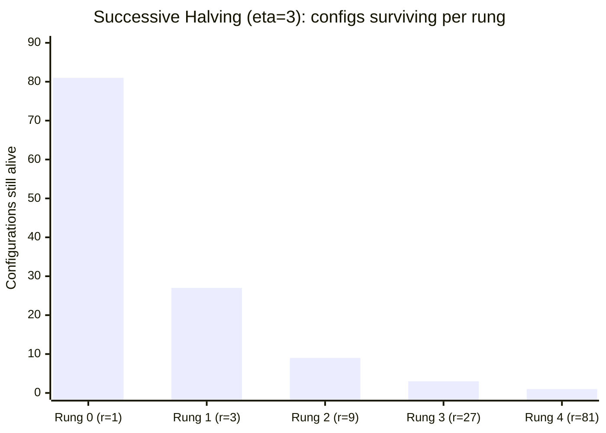
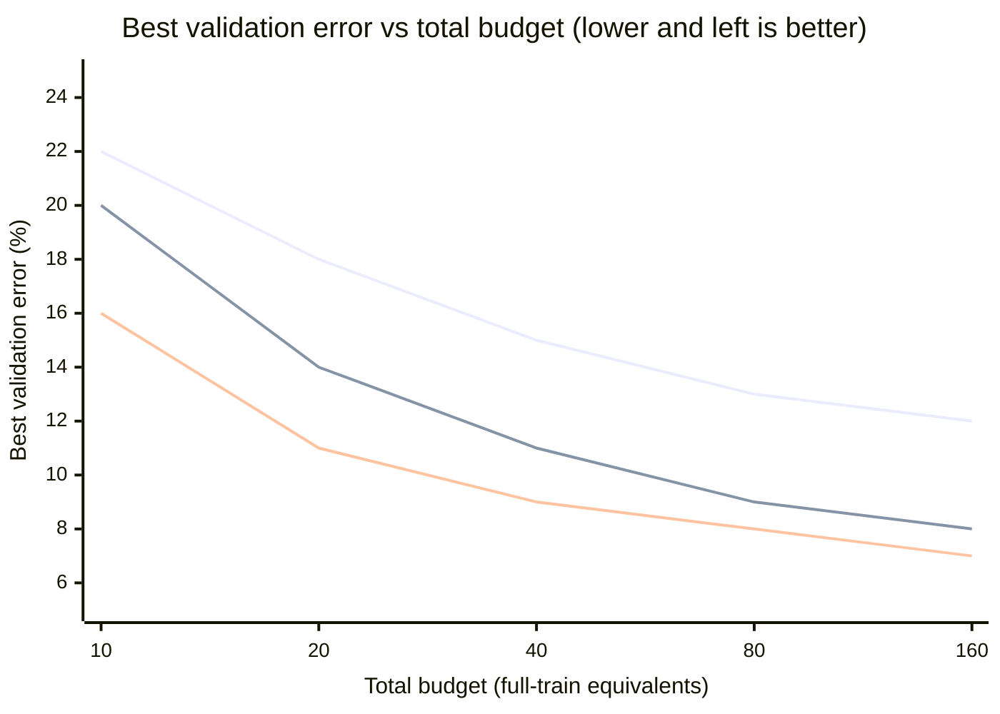
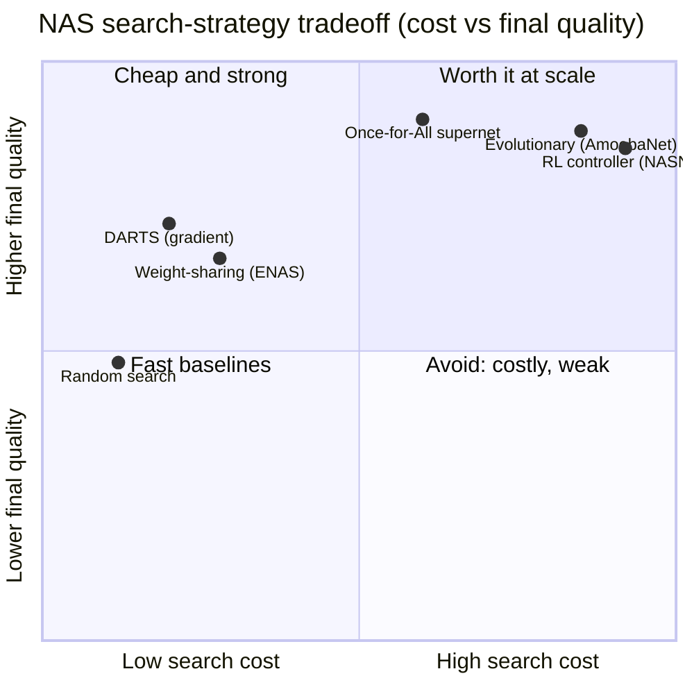

# AutoML and Neural Architecture Search — Deep Dive

## 1. Concept Overview

AutoML automates the parts of the ML pipeline that a human normally hand-crafts: feature engineering, model/pipeline selection, hyperparameter optimization (HPO), and ensembling. The promise is that a non-expert (or a busy expert) hands over `(X, y)` and a time budget, and the system returns a deployable model that rivals a carefully tuned baseline. Frameworks span the maturity curve: Auto-sklearn (meta-learning + Bayesian search over sklearn pipelines), TPOT (genetic programming over pipelines), H2O AutoML (grid + stacked ensembles), AutoGluon (portfolio stacking), and managed services (Google Vertex AI / Cloud AutoML, Azure AutoML).

Neural Architecture Search (NAS) is the deep-learning-specific corner of AutoML: instead of tuning scalar hyperparameters of a fixed network, NAS *designs the network topology itself* — how many layers, which operations on each edge, how blocks connect. NAS is defined by three orthogonal axes: the **search space** (what architectures are reachable), the **search strategy** (how you explore it — RL, evolution, or gradient), and the **performance estimation strategy** (how you score a candidate cheaply — full training, weight-sharing supernet, or a proxy).

The single fact that dominates NAS engineering is cost. The 2017 RL-based NASNet search consumed roughly **2000 GPU-days**; the 2018 differentiable method DARTS reproduced comparable ImageNet-transfer accuracy in about **1 GPU-day** — a ~1000x reduction — by replacing "train thousands of networks from scratch" with "train one shared supernet once." This module covers that landscape and the multi-fidelity HPO methods (Successive Halving → ASHA → Hyperband → BOHB) that make both AutoML and NAS affordable.

This sub-file **extends** the parent module ([../model_evaluation_and_selection/README.md](../model_evaluation_and_selection/README.md), which covers Optuna/TPE, GridSearchCV, RandomizedSearchCV) and the Hyperband/BOHB treatment in [../experiment_tracking_and_versioning/README.md](../experiment_tracking_and_versioning/README.md). It does not repeat them — it cross-links and adds ASHA and NAS, which neither covers.

---

## 2. Intuition

One-line analogy: manual ML is a chef tasting and adjusting one dish; AutoML is a test kitchen running hundreds of recipes in parallel and shipping the best plate; NAS is designing the *stove* the recipe runs on.

Mental model:
- **Multi-fidelity HPO** = triage. Do not cook every dish to completion. Taste all of them after 1 minute, throw out the worst two-thirds, give the survivors 3 more minutes, repeat. Most bad configurations reveal themselves early.
- **NAS search strategy** = how you propose the next architecture: an RL controller *learns* a policy that emits good architectures; evolution *mutates* a population of good ones; DARTS *differentiates* through the choice so gradient descent walks toward a good one.
- **Performance estimation** = the cost-vs-fidelity dial. Full training is exact but ruinously expensive; a weight-sharing supernet is ~1000x cheaper but its rankings are noisy.

Why it matters: the reason NAS papers went from 2000 GPU-days to 1 GPU-day is entirely a performance-estimation trick (weight sharing), not a smarter search. In practice, *where you spend fidelity* is the whole game.

Key insight: **NAS meta-optimizes the validation set.** The search loop selects architectures by validation score across thousands of candidates, so the winning architecture is fit to the validation set exactly the way a single overfit model is fit to its training set. Without a truly held-out test set (or a separate search-validation split), the reported gain is largely search overfitting.

---

## 3. Core Principles

1. **Multi-fidelity is the free lunch.** Cheap, noisy evaluations (fewer epochs, less data, smaller resolution) are strongly rank-correlated with expensive ones for most bad configurations. Spend little on the many, a lot on the few.
2. **The three NAS axes are independent.** You can pair any search space with any search strategy and any estimation strategy. DARTS = (cell-based space) × (gradient strategy) × (weight-sharing estimation). NASNet = (cell-based space) × (RL strategy) × (full-training estimation).
3. **Search cost is dominated by estimation, not strategy.** Switching from RL to gradient descent saved little; switching from full-training to weight-sharing saved ~1000x.
4. **Random search is a brutal baseline.** On many NAS benchmarks (NAS-Bench-201), random search with early stopping is within ~1% of published SOTA NAS — always report it.
5. **The objective can be multi-term.** Hardware-aware NAS optimizes `accuracy − λ · latency`, so the winner is Pareto-optimal for a device, not just most accurate.
6. **Reproducibility is fragile.** NAS gains are dominated by the search space, training tricks (cutout, more epochs, cosine LR), and random seeds. Report seeds, GPU-days, and a random-search baseline or the result is not credible.

---

## 4. Types / Architectures / Strategies

### 4.1 The AutoML stack

| Layer | What it automates | Techniques |
|-------|-------------------|-----------|
| Feature engineering | encoding, imputation, interactions, selection | target encoding, Deep Feature Synthesis (featuretools), autofeat |
| Model selection | which algorithm | portfolio search, meta-learning |
| HPO | hyperparameters of the chosen model | random, TPE (Optuna), Hyperband, BOHB, ASHA |
| Ensembling | combine the best models | greedy ensemble selection, stacking, bagging |

### 4.2 AutoML frameworks

| Framework | Search method | Ensembling | Sweet spot |
|-----------|---------------|-----------|-----------|
| Auto-sklearn | meta-learning warm-start + Bayesian (SMAC) | greedy ensemble of top pipelines | tabular, sklearn ecosystem |
| TPOT | genetic programming over pipelines | pipeline is the output | tabular, interpretable pipeline export |
| H2O AutoML | random grid + Bayesian | stacked ensembles (super learner) | tabular, enterprise/Java |
| AutoGluon | fixed portfolio, minimal HPO | multi-layer stacking + bagging | tabular/vision/text, fast strong baseline |
| Google Vertex / Cloud AutoML | proprietary NAS + HPO | managed | no-infra teams, vision/tabular/NLP |

### 4.3 Multi-fidelity HPO family (the resource-allocation lineage)

| Method | Idea | Net-new here? |
|--------|------|---------------|
| Successive Halving (SHA) | run n configs at budget r, keep top 1/eta, ×eta budget, repeat | yes (foundation) |
| **ASHA** | asynchronous SHA — promote as soon as a rung fills, never idle a worker | **yes (net-new)** |
| Hyperband | run SHA over several brackets to hedge the n-vs-r tradeoff | cross-link `../experiment_tracking_and_versioning/` |
| BOHB | Hyperband's budget scheduling + TPE choosing *which* config to run | cross-link `../experiment_tracking_and_versioning/` |
| TPE / Optuna | Bayesian choice of *which* config, no budget scheduling | cross-link parent `../model_evaluation_and_selection/` |

SHA/ASHA/Hyperband decide **how much budget** each config gets; TPE decides **which config** to try. BOHB does both. This is the clean mental split.

### 4.4 The three NAS axes

**Search space:**
- *Cell-based* (NASNet, DARTS): search one small "cell" (a DAG of ~7 nodes over a fixed operation set — 3×3/5×5 conv, dilated conv, max/avg pool, skip, zero), then stack the discovered cell N times. Small space, transfers across depths and datasets.
- *Macro / whole-network*: search the entire network graph. Huge space, more expressive, far harder to search.

**Search strategy:**
- *RL controller* (NASNet, ENAS): an RNN emits an architecture token-by-token; the validation accuracy is the reward; REINFORCE updates the controller.
- *Evolutionary* (AmoebaNet, regularized evolution): maintain a population, mutate the best (add/remove op, rewire), tournament-select. Robust on discrete/non-differentiable spaces.
- *Gradient-based* (DARTS): relax the discrete op choice into a softmax and differentiate through it.

**Performance estimation strategy** (the cost lever):
- *Full training*: train each candidate to convergence. Exact, ~2000 GPU-days for RL-NAS.
- *Weight-sharing / one-shot supernet* (ENAS, DARTS, Once-for-All): one over-parameterized network; every sub-architecture inherits shared weights, scored without per-candidate training. ~1000x cheaper; introduces rank noise.
- *Proxy / low-fidelity*: fewer epochs, downscaled images, subset of data, or a learned accuracy predictor. Fast, biased.

---

## 5. Architecture Diagrams

### 5.1 AutoML pipeline



The AutoML loop is a budget-bounded cycle: search proposes pipelines, multi-fidelity HPO scores them cheaply, and when the time budget is spent the top-K survivors are stacked rather than a single winner returned — ensembling is where most of the final accuracy comes from.

### 5.2 The NAS loop



Every NAS method is this same loop; the three axes are exactly the three interior nodes — the search space (left), the estimation node (how `R(a)` is computed), and the update node (the strategy that turns rewards into the next sample).

### 5.3 Successive Halving resource allocation (eta = 3)



With reduction factor eta=3, each rung keeps the top 1/3 and triples the per-config budget: 81 configs get 1 epoch, the best 27 get 3, then 9 get 9, 3 get 27, and 1 finalist gets 81. Total cost is ~5×81 = 405 epoch-units instead of 81×81 = 6561 for training all to the max budget — a ~16x saving.

### 5.4 Sample efficiency: random vs Bayesian vs Hyperband



Top line = random search, middle = Bayesian (TPE), bottom = Hyperband/BOHB. Bayesian beats random by choosing *which* config to try; Hyperband beats both early by killing weak configs at low fidelity, so it reaches a strong error with a fraction of the budget (Mermaid xychart has no legend — the ordering is stated here).

### 5.5 NAS search-strategy tradeoff space



The frontier that matters is the top-left: DARTS and ENAS deliver most of the quality at a tiny fraction of RL/evolutionary cost, while Once-for-All buys back the top-right quality by amortizing one expensive supernet over many deployment targets.

---

## 6. How It Works — Detailed Mechanics

### 6.1 Auto-sklearn — meta-learning + Bayesian search

```python
from __future__ import annotations

import numpy as np
import autosklearn.classification
import autosklearn.metrics


def run_auto_sklearn(X_train: np.ndarray, y_train: np.ndarray) -> object:
    """
    Auto-sklearn = SMAC Bayesian optimization over sklearn pipelines,
    warm-started by meta-learning (k-NN over dataset meta-features across
    ~140 OpenML datasets), then a greedy post-hoc ensemble of the best runs.
    """
    automl = autosklearn.classification.AutoSklearnClassifier(
        time_left_for_this_task=3600,     # total wall-clock budget (seconds)
        per_run_time_limit=300,           # kill any single pipeline after 5 min
        ensemble_size=50,                 # ensemble the 50 best models found
        metric=autosklearn.metrics.roc_auc,
        resampling_strategy="cv",
        resampling_strategy_arguments={"folds": 5},
        n_jobs=-1,
        seed=42,
    )
    automl.fit(X_train, y_train)          # meta-learning skips the cold start
    print(automl.leaderboard())           # top pipelines + ensemble weights
    return automl
```

### 6.2 AutoGluon — portfolio stacking (little HPO)

```python
from autogluon.tabular import TabularPredictor
import pandas as pd


def run_autogluon(train_df: pd.DataFrame) -> TabularPredictor:
    """
    AutoGluon largely skips per-model HPO. It trains a fixed portfolio
    (LightGBM, CatBoost, XGBoost, RF, NN) and multi-layer-STACKS + bags them.
    Stacking a diverse portfolio is more sample-efficient than tuning one model.
    """
    return TabularPredictor(label="target", eval_metric="roc_auc").fit(
        train_df,
        presets="best_quality",   # enables multi-layer stacking + bagging
        time_limit=3600,
    )
```

### 6.3 ASHA with Ray Tune (net-new: async multi-fidelity)

```python
from ray import tune
from ray.tune.schedulers import ASHAScheduler


def train_fn(config: dict) -> None:
    """Report an intermediate metric each epoch so ASHA can promote/stop."""
    model = build_model(config)
    for epoch in range(config["max_epochs"]):
        val_acc = train_one_epoch(model, config)
        tune.report(val_acc=val_acc)      # value at this rung's budget


def search() -> "tune.ResultGrid":
    scheduler = ASHAScheduler(
        metric="val_acc", mode="max",
        max_t=81,             # max resource (epochs) the best config reaches
        grace_period=1,       # min epochs before any config can be stopped (rung 0)
        reduction_factor=3,   # eta: keep the top 1/3 at each rung
    )
    tuner = tune.Tuner(
        train_fn,
        tune_config=tune.TuneConfig(scheduler=scheduler, num_samples=81),
        param_space={
            "lr": tune.loguniform(1e-4, 1e-1),
            "weight_decay": tune.loguniform(1e-6, 1e-2),
            "max_epochs": 81,
        },
    )
    return tuner.fit()
```

ASHA differs from synchronous SHA in one decisive way: it never blocks. Synchronous SHA must wait for *all* configs in rung k to finish before promoting the top 1/eta, so a single straggler idles the whole cluster. ASHA promotes a config to rung k+1 the moment rung k has at least eta finished trials with that config in the top 1/eta seen so far — keeping every worker busy and scaling near-linearly to hundreds of workers.

### 6.4 Optuna with a Hyperband pruner (cross-link, not repeat)

The parent module ([../model_evaluation_and_selection/README.md](../model_evaluation_and_selection/README.md)) covers TPE and the `MedianPruner` in depth. The only net addition here is that Optuna can use a multi-fidelity pruner directly, giving Hyperband-style early stopping inside a TPE search:

```python
import optuna

study = optuna.create_study(
    direction="maximize",
    sampler=optuna.samplers.TPESampler(seed=42),   # which config (Bayesian)
    pruner=optuna.pruners.HyperbandPruner(          # how much budget (multi-fidelity)
        min_resource=1, max_resource=81, reduction_factor=3
    ),
)
# study.optimize(objective, n_trials=200)  -> this is essentially BOHB
```

TPESampler + HyperbandPruner is, conceptually, BOHB. See [../experiment_tracking_and_versioning/README.md](../experiment_tracking_and_versioning/README.md) for the Hyperband/BOHB scheduling internals.

### 6.5 DARTS — differentiable NAS (torch sketch)

```python
import torch
import torch.nn as nn
import torch.nn.functional as F


class MixedOp(nn.Module):
    """One DARTS edge: a softmax-weighted sum over candidate operations."""

    def __init__(self, ops: list[nn.Module]) -> None:
        super().__init__()
        self._ops = nn.ModuleList(ops)   # e.g. conv3x3, conv5x5, maxpool, skip, zero

    def forward(self, x: torch.Tensor, alpha: torch.Tensor) -> torch.Tensor:
        # alpha: architecture logits for this edge, shape [num_ops]
        weights = F.softmax(alpha, dim=-1)         # continuous relaxation of the choice
        return sum(w * op(x) for w, op in zip(weights, self._ops))
```

DARTS relaxes the discrete "pick one operation per edge" into a differentiable softmax over all operations, then solves a **bilevel** problem — inner: train shared weights `w` on the training split; outer: update architecture logits `alpha` on the *validation* split:

```python
# alpha = architecture parameters (one logit vector per edge, ~few thousand params)
# w     = supernet weights (shared across all candidate ops, the expensive part)
arch_opt = torch.optim.Adam([alpha], lr=3e-4, weight_decay=1e-3)
w_opt = torch.optim.SGD(supernet.parameters(), lr=0.025, momentum=0.9)

for x_tr, y_tr, x_val, y_val in loader:
    # Step 1 (inner): update weights w on the TRAIN split
    w_opt.zero_grad()
    F.cross_entropy(supernet(x_tr, alpha), y_tr).backward()
    w_opt.step()

    # Step 2 (outer): update architecture alpha on the VALIDATION split
    arch_opt.zero_grad()
    F.cross_entropy(supernet(x_val, alpha), y_val).backward()
    arch_opt.step()

# Discretize: on each edge keep argmax(alpha), retrain the pruned net from scratch
final = {edge: ops[a.argmax()] for edge, a in arch_logits.items()}
```

Because there is one supernet and search is ordinary gradient descent, DARTS finishes in ~1 GPU-day on CIFAR-10 vs ~2000 for RL-NAS. The catch: alpha is optimized on the val split, so the search *is* fitting the validation set — see the broken-then-fix below.

### 6.6 Broken → Fix — AutoML data leakage through CV

The most common way an AutoML score comes out 2–4 AUC points too high is fitting preprocessing on the full dataset *before* cross-validation, so every validation fold has already leaked into the scaler/imputer/target-encoder.

```python
import numpy as np
from sklearn.impute import SimpleImputer
from sklearn.preprocessing import StandardScaler
from sklearn.pipeline import Pipeline
from sklearn.model_selection import cross_val_score
from sklearn.ensemble import GradientBoostingClassifier

X: np.ndarray
y: np.ndarray
model = GradientBoostingClassifier(random_state=42)

# BROKEN: scaler/imputer fit on the FULL X before CV -> validation rows leak in.
# The scaler's mean/std (and any target encoding) already saw the val folds.
scaler = StandardScaler().fit(X)                 # sees every row, including val
X_scaled = scaler.transform(X)
leaky = cross_val_score(model, X_scaled, y, cv=5, scoring="roc_auc")
# reported ~0.88, but production ~0.85 — the ~0.03 gap is pure leakage

# FIXED: put every fit-transform step INSIDE the CV loop via a Pipeline,
# so the scaler/imputer are re-fit on each training fold only.
pipe = Pipeline([
    ("impute", SimpleImputer(strategy="median")),
    ("scale", StandardScaler()),
    ("clf", model),
])
honest = cross_val_score(pipe, X, y, cv=5, scoring="roc_auc")
# reported ~0.85 — matches production
```

The same trap sinks NAS: if `alpha` (DARTS) or the controller (ENAS) is selected on a split you *also* report, the number is search-overfit. Always reserve a test set the search never touches.

---

## 7. Real-World Examples

**NASNet (Google, 2017):** an RNN controller trained with REINFORCE searched a cell on CIFAR-10, then transferred the cell to ImageNet — ~2000 GPU-days, 82.7% top-1. It proved NAS could beat hand-designed nets but at a cost only a hyperscaler could pay.

**DARTS (2018):** differentiable search cut that to ~1 GPU-day on CIFAR-10 with comparable transfer accuracy, making NAS reproducible on a single GPU and triggering the whole one-shot NAS literature.

**EfficientNet (Google, 2019):** NAS found the `EfficientNet-B0` base cell (via a hardware-aware, MnasNet-style search rewarding accuracy and FLOPs), then compound scaling grew it to B1–B7 — 84.3% ImageNet top-1 with ~8x fewer FLOPs than prior SOTA.

**MnasNet / MobileNetV3 (Google, on-device):** hardware-aware NAS put *measured Pixel-phone latency* into the reward, producing models tuned to real device kernels rather than FLOPs; MobileNetV3 mixed NAS with NetAdapt fine-tuning of layer widths.

**Once-for-All (MIT, 2020):** trained one elastic supernet, then extracted specialized sub-networks for phones/FPGAs/CPUs with *no retraining* — search cost amortized across ~all deployment targets, a fit for on-device vision (see §14).

**Auto-sklearn / AutoGluon on tabular:** AutoGluon's stacked portfolio routinely wins or places on Kaggle tabular tasks within an hour of compute, and both consistently beat non-expert manual baselines — though rarely a *strong* expert-tuned XGBoost on a single well-understood dataset.

---

## 8. Tradeoffs

### NAS search-strategy comparison

| Strategy | Typical search cost | Final quality | Stability / reproducibility | Best when |
|----------|---------------------|---------------|-----------------------------|-----------|
| RL controller (NASNet) | ~2000 GPU-days (full-train) | very high | low (seed-sensitive) | you have hyperscaler compute |
| Evolutionary (AmoebaNet) | ~3000 GPU-days (full-train) | very high | medium; robust on discrete spaces | non-differentiable search space |
| Gradient / DARTS | ~1 GPU-day (weight-share) | high | low — can collapse to all skip-connects | differentiable cell space, tight budget |
| ENAS (RL + weight-share) | ~0.5 GPU-day | medium-high | medium | cheap search, tolerant of rank noise |
| Once-for-All | ~1200 GPU-hours once, then ~free per target | high across targets | high | many hardware targets to serve |
| Random search + early stop | ~1 GPU-day | surprisingly competitive | high (the baseline to beat) | always run it first |

### Multi-fidelity HPO comparison

| Method | Chooses which config | Chooses budget per config | Parallelism |
|--------|----------------------|---------------------------|-------------|
| Random | no (uniform) | fixed | embarrassingly parallel |
| TPE / Optuna | yes (Bayesian) | fixed | async |
| Successive Halving | no | yes (rungs) | synchronous (stragglers idle workers) |
| ASHA | no | yes (rungs) | **async, near-linear to 100s of workers** |
| Hyperband | no | yes (multiple brackets) | synchronous per bracket |
| BOHB | yes (TPE) | yes (Hyperband) | async |

### AutoML vs strong manual baseline

| Dimension | AutoML/NAS | Strong manual baseline |
|-----------|-----------|------------------------|
| Time-to-first-model | hours, hands-off | days, expert-driven |
| Peak accuracy on one task | ties or slightly below expert | often best |
| Many similar tasks | wins (amortized) | expensive to repeat |
| Reproducibility | fragile (NAS), good (tabular AutoML) | good with discipline |
| Compute cost | high (NAS) to moderate (tabular) | low |
| Interpretability of choices | low | high |

---

## 9. When to Use / When NOT to Use

**Use AutoML when:**
- You have many similar tabular problems (dozens of churn/propensity models) — the search amortizes.
- You need a strong baseline fast and lack a tuning expert.
- You want an ensemble you would not hand-build (AutoGluon stacking).

**Use NAS when:**
- You ship to a fixed hardware target with a hard latency/energy budget (on-device vision, edge) — hardware-aware NAS earns its cost (§14).
- You serve *many* targets and can amortize one supernet (Once-for-All).
- A known-good backbone (ResNet, EfficientNet) does not exist for your modality/constraint.

**Do NOT use AutoML/NAS when:**
- A well-understood strong baseline exists — a tuned XGBoost or an off-the-shelf EfficientNet usually matches NAS on a single task at ~0 search cost.
- Compute is scarce — a 2000-GPU-day RL search is indefensible when transfer learning is an option.
- You cannot hold out a clean test set the search never sees — you will report search-overfit numbers.
- The bottleneck is data quality or label noise, not architecture — no search fixes bad labels.

---

## 10. Common Pitfalls

**Pitfall 1 — Reporting the search-validation score as the final metric.**
A team ran DARTS, optimized `alpha` on a val split, and reported that same split's accuracy as the result — a 2.1% "gain" that vanished on a truly held-out test set. NAS meta-optimizes the val set across thousands of candidates; the search-selection split and the final-report split must be different. Always keep a locked test set.

**Pitfall 2 — DARTS collapsing to all skip-connections.**
Vanilla DARTS often degenerates: as the supernet trains, `softmax(alpha)` concentrates on parameter-free skip-connect ops (they reduce training loss fastest early), yielding a shallow, weak final net. Fixes: DARTS+ (early stopping on skip count), P-DARTS (progressive depth), or a regularizer penalizing skip dominance. If your searched cell is mostly skips, you hit this.

**Pitfall 3 — Weight-sharing rank disorder.**
One-shot supernets score sub-architectures with shared weights, but the supernet ranking is only weakly correlated (Kendall tau often 0.2–0.5) with true stand-alone accuracy. The "best" supernet architecture may not be the best when trained from scratch. Mitigate with fairness sampling (SPOS), or retrain the top-k candidates standalone before choosing.

**Pitfall 4 — AutoML CV leakage (see §6.6).**
Fitting scalers, imputers, or target encoders on the full dataset before CV inflates scores 2–4 points. Every fit-transform must live inside the CV fold via a Pipeline. This is the number-one reason an AutoML leaderboard score does not reproduce in production.

**Pitfall 5 — Not running the random-search baseline.**
On NAS-Bench-201, random search with early stopping is within ~1% of many published NAS methods. Teams have burned thousands of GPU-hours on elaborate searches that never beat random. Report random search or the result is not credible.

**Pitfall 6 — Optimizing FLOPs as a latency proxy.**
FLOPs correlate poorly with real device latency — memory-bound depthwise convs and non-fused ops can be slow at low FLOPs. Hardware-aware NAS must use *measured* latency (or a latency LUT/predictor for the actual device), not FLOPs, or the "efficient" model is slow in production.

**Pitfall 7 — Unbounded per-trial budget in a search.**
Running an AutoML search without `per_run_time_limit` lets one pathological pipeline (a giant SVM on 500k rows) consume the entire budget. Always cap per-trial wall-clock and use a multi-fidelity scheduler (ASHA/Hyperband) so weak configs die early.

---

## 11. Technologies & Tools

| Tool | Role | Notes |
|------|------|-------|
| Auto-sklearn | tabular AutoML | meta-learning warm-start + SMAC Bayesian + ensemble |
| AutoGluon | tabular/vision/text AutoML | portfolio stacking, `presets="best_quality"` |
| TPOT | tabular AutoML | genetic programming; exports a sklearn pipeline |
| H2O AutoML | tabular AutoML | stacked ensembles, Java/enterprise |
| Google Vertex AI / Cloud AutoML | managed AutoML + NAS | no-infra, vision/tabular/NLP |
| Ray Tune | distributed HPO | `ASHAScheduler`, `HyperBandScheduler`, PBT |
| Optuna | HPO | TPE sampler + `HyperbandPruner` (≈ BOHB) — see parent module |
| Microsoft NNI | NAS + HPO toolkit | DARTS, ENAS, ASHA, PBT under one API |
| DARTS / PyTorch | differentiable NAS | continuous relaxation, bilevel opt |
| Once-for-All | supernet NAS | one supernet, per-target sub-nets, no retrain |
| NAS-Bench-201 / NATS-Bench | NAS benchmarks | tabular lookup of architectures for fair comparison |

Cross-links: [../gpu_and_hardware_optimization/README.md](../gpu_and_hardware_optimization/README.md) (profiling, tensor cores — where the GPU-days go), [../distributed_training/README.md](../distributed_training/README.md) (DDP/FSDP to parallelize supernet training), [../model_compression_and_efficiency/README.md](../model_compression_and_efficiency/README.md) (quantization/pruning/distillation that pair with hardware-aware NAS).

---

## 12. Interview Questions with Answers

**Q: When is AutoML or NAS actually worth it over a strong manual baseline?**
It is worth it when you have many similar problems to solve or a fixed hardware target to optimize for, and rarely worth it for a single one-off task where a tuned baseline exists. AutoML amortizes across dozens of tabular models and NAS earns its cost when a device latency budget makes an off-the-shelf backbone unusable; on a single well-understood dataset a tuned XGBoost or a stock EfficientNet usually matches NAS at ~0 search cost. Decide by whether the search cost is amortized.

**Q: What are the three axes that define any NAS method?**
Every NAS method is defined by its search space, its search strategy, and its performance-estimation strategy. The search space fixes which architectures are reachable (cell-based vs macro); the strategy explores it (RL controller, evolution, or gradient descent); estimation scores a candidate cheaply (full training, a weight-sharing supernet, or a low-fidelity proxy). These are independent — DARTS is (cell space) × (gradient) × (weight-sharing).

**Q: Why did early RL-based NAS cost ~2000 GPU-days while DARTS costs ~1 GPU-day?**
Because RL-NAS trained thousands of candidate networks from scratch, while DARTS trains one shared supernet a single time and turns search into ordinary gradient descent. The ~1000x saving comes almost entirely from the performance-estimation axis (weight sharing), not from a smarter search strategy. This is the core lesson: in NAS, where you spend fidelity dominates cost.

**Q: How does Successive Halving work and what does the reduction factor eta control?**
Successive Halving runs many configs at a small budget, keeps the top 1/eta, multiplies the survivors' budget by eta, and repeats until one remains. Eta is the aggressiveness dial: eta=3 keeps a third each rung (81→27→9→3→1), eta=4 keeps a quarter and prunes faster. Larger eta saves more compute but risks killing a slow-starting config that would have won at full budget.

**Q: What makes ASHA different from synchronous Successive Halving?**
ASHA promotes configurations asynchronously as soon as a rung has enough finished trials, instead of waiting for every trial in a rung to complete. Synchronous SHA blocks on the slowest trial in a rung, so a single straggler idles the whole cluster; ASHA keeps every worker busy and scales near-linearly to hundreds of workers. This makes it the default multi-fidelity scheduler for large parallel HPO in Ray Tune.

**Q: What problem does Hyperband solve that plain Successive Halving does not?**
Hyperband hedges the unknown tradeoff between trying many configs at low budget versus few configs at high budget by running Successive Halving at several bracket sizes. Pure SHA must guess n (number of configs) and r (starting budget); if it starts too aggressive it kills good slow-starters, too conservative it wastes compute. Hyperband runs a spectrum of brackets so at least one is well-matched to the problem. BOHB then adds TPE to pick *which* configs rather than sampling randomly.

**Q: What is the single most dangerous failure mode of NAS and how do you prevent it?**
NAS overfits the architecture to the validation set, because the search selects among thousands of candidates by their validation score. The winning architecture is fit to that split exactly like an overfit model is fit to its training data, so a truly held-out test set the search never touches is mandatory. Report the test-set number, not the search-selection score, or the "gain" is search overfitting.

**Q: What is a weight-sharing one-shot supernet and what bias does it introduce?**
A one-shot supernet is a single over-parameterized network whose sub-architectures share weights, so any candidate is scored without training it from scratch. This is what makes ENAS/DARTS ~1000x cheaper than full-training NAS, but it introduces rank disorder: supernet accuracy correlates only weakly (Kendall tau ~0.2–0.5) with true stand-alone accuracy. Mitigate by retraining the top-k candidates standalone before final selection.

**Q: Explain DARTS continuous relaxation and its bilevel optimization.**
DARTS replaces the discrete choice of one operation per edge with a softmax over all candidate operations, making the architecture differentiable. It then solves a bilevel problem: update shared weights `w` on the training split (inner) and architecture logits `alpha` on the validation split (outer), alternating each step. After search, each edge keeps its argmax operation and the pruned network is retrained from scratch.

**Q: What is hardware-aware NAS and how is latency put into the objective?**
Hardware-aware NAS adds a measured or predicted device-latency term to the search objective, typically `accuracy − λ · latency` or a hard latency constraint. It uses a latency lookup table or predictor for the *actual* target device rather than FLOPs, because FLOPs correlate poorly with real latency (depthwise convs are FLOP-cheap but memory-bound). MnasNet and MobileNetV3 used on-device Pixel-phone latency directly in the reward.

**Q: How does auto-sklearn use meta-learning to speed up search?**
Auto-sklearn warm-starts its Bayesian optimization with configurations that performed well on similar past datasets, ranked by dataset meta-features. It computes meta-features (rows, columns, class ratio, skew) of the new dataset, finds the nearest of ~140 OpenML datasets by k-NN, and seeds the search with their best-known pipelines — skipping the cold start. It then runs SMAC Bayesian search and post-hoc greedy-ensembles the best runs.

**Q: How does AutoGluon reach strong accuracy without heavy hyperparameter search?**
AutoGluon largely skips per-model HPO and instead multi-layer-stacks and bags a fixed portfolio of strong models (LightGBM, CatBoost, XGBoost, RF, NN). Stacking a diverse portfolio is more sample-efficient than exhaustively tuning any single model, so it reaches strong accuracy within a time budget where an HPO-heavy approach is still tuning. `presets="best_quality"` turns on the full stacking/bagging stack.

**Q: How does AutoML leak data through cross-validation and how do you stop it?**
AutoML leaks when preprocessing — scaling, imputation, target encoding — is fit on the full dataset before the CV split, so validation folds influence the transforms and scores inflate 2–4 AUC points. The fix is to put every fit-transform step inside a scikit-learn Pipeline that is evaluated within each fold, so the scaler and imputer see only the training fold. This is the top reason an AutoML leaderboard score fails to reproduce in production.

**Q: DARTS versus ENAS — what is the difference?**
ENAS uses an RL controller to sample discrete architectures from a shared-weight supernet, while DARTS makes the whole supernet differentiable and optimizes architecture weights by gradient descent. Both use weight sharing for cheap estimation, but ENAS still samples discrete graphs and updates the controller with REINFORCE, whereas DARTS never samples — it relaxes the choice into a softmax and back-propagates through it. DARTS is faster to converge but prone to skip-connect collapse.

**Q: What is Once-for-All and why is it efficient across hardware targets?**
Once-for-All trains a single elastic supernet once, then extracts specialized sub-networks for different latency budgets with no retraining. Instead of running a fresh NAS per device, the expensive supernet training (~1200 GPU-hours) is amortized across all deployment targets, and a small predictor picks the best sub-net for each device's latency budget. This is the method of choice when you must serve phones, FPGAs, and CPUs from one model family.

**Q: Why are NAS results notoriously hard to reproduce and what should a paper report?**
NAS gains are fragile because random seeds, the exact search space, and training tricks (cutout, cosine LR, extra epochs) often contribute more than the search algorithm itself. A credible NAS result must report multiple seeds with variance, the search cost in GPU-days, and a random-search-with-early-stopping baseline. NAS benchmarks like NAS-Bench-201 exist precisely to make comparisons fair by tabulating stand-alone accuracies.

**Q: When would you choose evolutionary NAS over gradient-based DARTS?**
Choose evolutionary NAS when the search space is discrete or non-differentiable — quantization bit-widths, hardware-specific ops, or mixed structural choices where no smooth relaxation exists. Evolution (mutate the best, tournament-select) is also more robust than DARTS, which can collapse to all-skip-connect architectures. The cost is many more evaluations, so it fits settings with a cheap estimator (weight sharing or a benchmark lookup) or hyperscaler compute.

**Q: How is Bayesian optimization (TPE) related to and different from Hyperband/ASHA?**
TPE decides *which* configuration to try next from past results, while Hyperband and ASHA decide *how much* budget to give each configuration; BOHB combines both. TPE alone runs every config at full budget but picks configs intelligently; ASHA/Hyperband run configs at escalating budgets but (in their base form) pick them randomly. Combining a TPE sampler with a Hyperband pruner in Optuna is essentially BOHB — smart selection plus smart budgeting.

---

## 13. Best Practices

1. Run **random search with early stopping first** — it is the baseline every AutoML/NAS method must beat, and often gets within ~1%.
2. Use a **multi-fidelity scheduler** (ASHA in Ray Tune, or Optuna's HyperbandPruner) for any search where trials have an epoch loop — 40–60% of trials die cheaply at low budget.
3. Keep a **locked test set the search never touches**; report on it, never on the search-selection split. NAS meta-optimizes the val set.
4. Put **every preprocessing step inside the CV Pipeline** so scalers/encoders re-fit per fold — the number-one AutoML leakage bug.
5. For on-device NAS, put **measured device latency** (LUT/predictor), not FLOPs, in the objective.
6. When DARTS produces a skip-heavy cell, switch to **DARTS+/P-DARTS** or add a skip-connect regularizer — it is collapsing, not converging.
7. **Retrain the top-k weight-sharing candidates standalone** before final selection to correct supernet rank disorder.
8. Cap **per-trial wall-clock** and total budget; one pathological pipeline can eat the whole search otherwise.
9. Log every trial (config, budget, score, seed, GPU-hours) with MLflow/W&B — see [../experiment_tracking_and_versioning/README.md](../experiment_tracking_and_versioning/README.md); NAS is un-reproducible without it.
10. Prefer **transfer learning or a known backbone** before committing GPU-months to NAS — most single-task problems do not need a bespoke architecture.

---

## 14. Case Study

**Problem:** design an on-device image classifier for a mid-range Android phone. Constraints: **≤ 30 ms** inference latency on the target SoC, **≤ 5 MB** model, ImageNet-style 10-class task, and it must run in the app's existing INT8 TFLite runtime. A stock EfficientNet-B0 hits the accuracy target but runs at ~55 ms on the device — over budget. Retraining a hand-shrunk MobileNet by trial and error had taken the team three weeks and still missed either accuracy or latency.

**Why hardware-aware NAS:** the bottleneck is a *device latency budget*, exactly where NAS beats a manual baseline. FLOPs are a poor proxy here (depthwise convs are FLOP-cheap but memory-bound on this SoC), so latency must be measured on-device and put into the objective.

**Approach:**

1. **Search space** — a MobileNetV3-style macro space: per-block choices of expansion ratio, kernel size (3/5/7), squeeze-excite on/off, and depth. Reachable models span ~10–55 ms.
2. **Latency model** — build a lookup table by benchmarking each candidate operation on the actual SoC, so total latency ≈ sum of per-op LUT entries (predicted within ~8% of measured).
3. **Objective** — maximize `val_accuracy − λ · max(0, latency − 30ms)`, a hard-ish latency penalty (λ tuned so the search respects the 30 ms wall).
4. **Estimation** — a Once-for-All-style elastic supernet trained once (~1200 GPU-hours across 8 GPUs via DDP — see [../distributed_training/README.md](../distributed_training/README.md)), then sub-nets extracted per latency budget with no retraining.
5. **Search** — ASHA over sub-net candidates ranked by the supernet, top-10 retrained standalone to correct weight-sharing rank disorder.
6. **Compression** — the chosen sub-net is INT8 quantization-aware-trained and pruned per [../model_compression_and_efficiency/README.md](../model_compression_and_efficiency/README.md), landing under both budgets.

**Results:**

```
                       Accuracy   Device latency   Size    Search/design cost
EfficientNet-B0 (INT8)   93.1%        55 ms         5.3 MB   0 (off-the-shelf)
Manual MobileNet (3 wks) 90.4%        28 ms         4.1 MB   3 engineer-weeks
Hardware-aware NAS       92.6%        27 ms         3.8 MB   ~1200 GPU-hours (once)
```

The NAS model met the 30 ms and 5 MB budgets while giving up only 0.5% accuracy vs the too-slow EfficientNet, and beat the hand-tuned MobileNet by 2.2% at the same latency. Because the supernet was trained once, extracting a second sub-net for a *faster* low-end phone (≤ 18 ms) later cost near-zero — the amortization that justified the up-front GPU-hours.

**What made it work — and the trap avoided:** the team reported accuracy on a **held-out test set the search never saw**, not the search-selection split. An earlier internal run had reported the search-val accuracy (94.0%) and it dropped to 92.6% on real held-out data — a textbook case of NAS overfitting the validation set. The lesson matches §10 Pitfall 1: the split you select architectures on and the split you report must be different, or the headline number is search overfitting.
