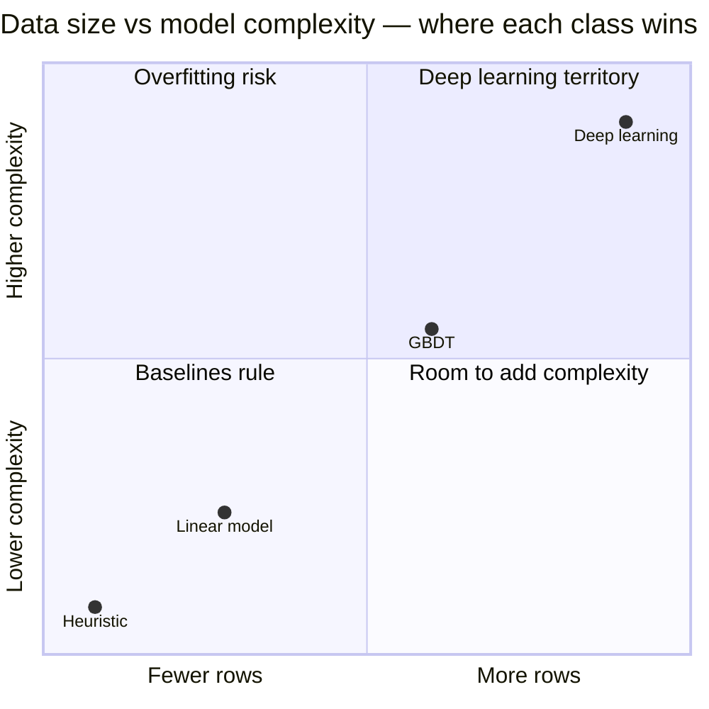
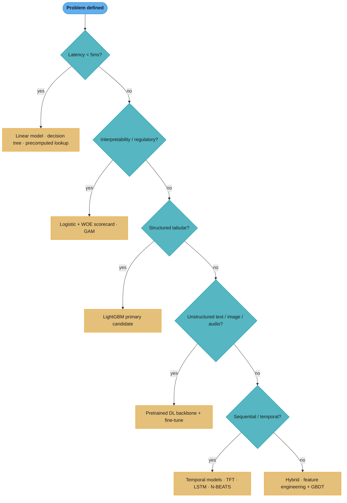
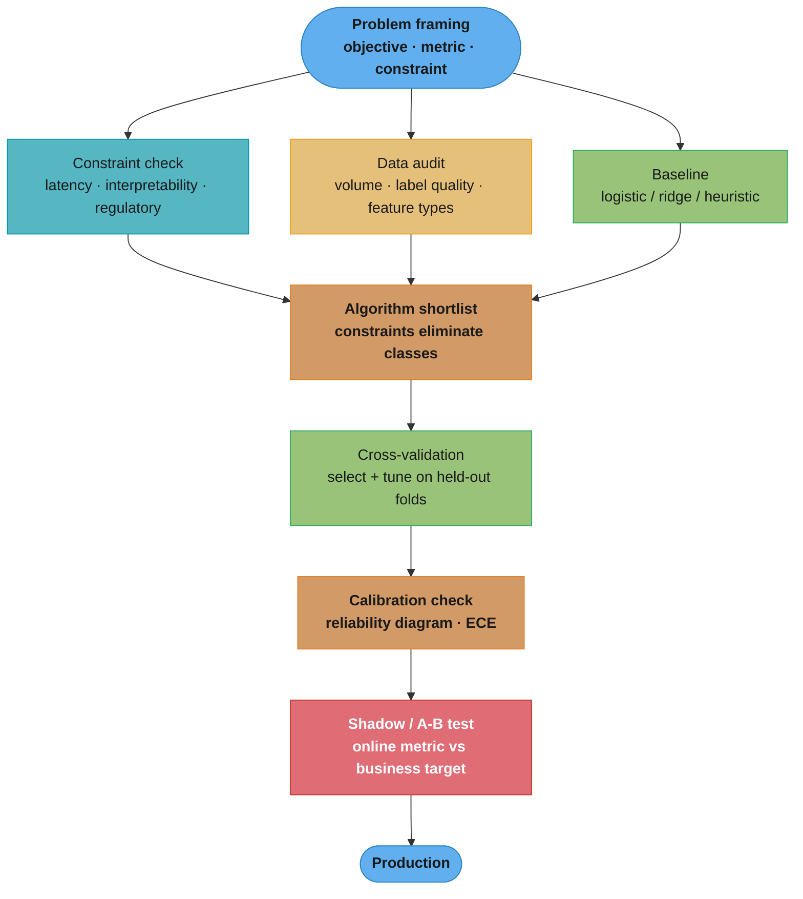
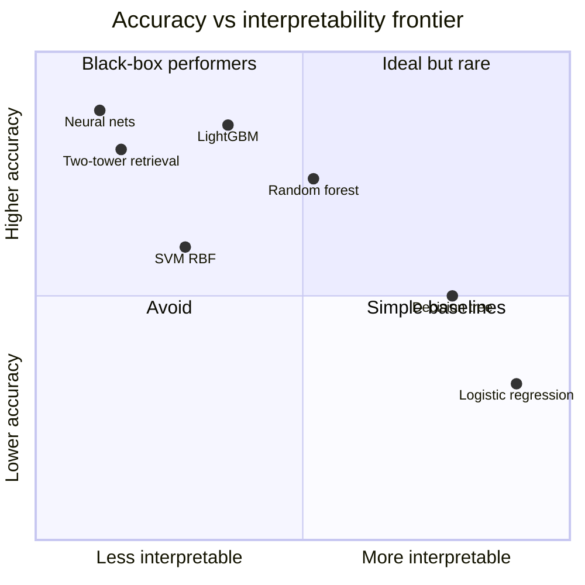

# Model Selection and Algorithm Choice

## 1. Concept Overview

Model selection is the discipline of choosing the right algorithm — or combination of algorithms — for a given ML problem. It sits at the intersection of problem framing, data characteristics, operational constraints, and business objectives. The decision is not purely technical: a model that cannot be explained to regulators, that exceeds inference latency budgets, or that requires more data than available is a wrong choice regardless of its offline accuracy.

This module provides a systematic framework for algorithm selection organized by problem type, data regime, and constraint. It is the canonical reference cross-linked from every case study in `case_studies/`.

---

## 2. Intuition

> Choosing a model is like choosing a vehicle: a Formula 1 car is faster than a bicycle on a track, but useless for off-road delivery. The right vehicle depends on the terrain, payload, maintenance crew, and fuel budget — not just top speed.

Mental model: every algorithm embeds assumptions about the data-generating process. When those assumptions match reality the algorithm extrapolates well; when they don't it fails in ways that are hard to debug. Model selection is the discipline of matching algorithm assumptions to problem structure.

**Key insight:** the dominant source of model selection error in production is not choosing a weak algorithm — it is choosing an unnecessarily complex one. Complexity increases debugging surface area, data requirements, training cost, and serving latency, while the accuracy uplift is often within noise of a well-tuned simpler baseline.

Why it matters: wrong algorithm choice is not caught by offline metrics during development. A decision tree overfit to 50k training examples will report 99% training accuracy; only when it degrades on a new user cohort does the mistake surface — often weeks after deployment.

---

## 3. Core Principles

**Baseline first.** Before any complex model, establish a strong baseline: logistic regression for classification, ridge/lasso for regression, popularity for recommendation. If the baseline is already good enough, ship it. Baselines are interpretable, fast to retrain, and easy to debug.

**Match inductive bias to problem structure.** Inductive bias is the set of assumptions an algorithm encodes. Tree methods assume piecewise-constant functions; linear models assume additive feature effects; CNNs assume spatial locality and translation invariance. When the assumption fits the data, you need less data to learn a good model.

**Constraints drive algorithm class before accuracy drives it.** Latency budget (p99 < 10 ms), interpretability requirement (scorecard for credit), regulatory constraint (GDPR right-to-explanation), data volume (5k rows), and retraining frequency (hourly) all eliminate algorithm classes before you ever measure accuracy.

**Calibration is a separate concern.** A model that ranks instances correctly (high AUC) but outputs miscalibrated probabilities (50% predicted probability for events that happen 90% of the time) is wrong for decision-making systems. Always check calibration when probabilities drive business decisions.

**Algorithm selection is iterative.** Start with the fastest-to-train appropriate baseline, measure gap to business target, then invest complexity where it buys the most gain. Each jump in complexity (linear → tree → ensemble → DL) should be justified by a measurable, reproducible improvement.

---

## 4. Types / Architectures / Strategies

### 4.1 The Algorithm Decision Matrix

| Problem Type | Data Regime | Primary Recommendation | When to Upgrade | Avoid |
|---|---|---|---|---|
| Binary classification | < 10k rows | Logistic regression (L2) | Gap > 5pp AUC vs tree | Deep net (overfits) |
| Binary classification | 10k – 1M rows, tabular | LightGBM / XGBoost | Neural if dense cat. features | SVM (slow to train at scale) |
| Binary classification | > 1M rows, tabular + embeddings | LightGBM + embedding features, or DLRM | Wide & Deep for sparse IDs | Random Forest (slower, weaker) |
| Binary classification, regulated | any | Logistic + WOE / scorecard | GAM if nonlinear needed | GBDT (black-box, adverse action) |
| Multi-class, low cardinality | any tabular | Softmax logistic / LightGBM | — | 1-vs-rest SVMs |
| Regression, tabular | < 50k rows | Ridge / Lasso | LightGBM if residuals structured | DNN (data hungry) |
| Regression, tabular | > 50k rows | LightGBM | Quantile regression with CatBoost for uncertainty | Linear (misses interactions) |
| Regression, spatial/temporal | any | LightGBM + lag/rolling features | Temporal Fusion Transformer at scale | ARIMA (can't handle exog. well) |
| Ranking / LTR | any | LambdaMART (LightGBM ranking) | Neural LTR (listNet, DLRM) | Pointwise regression naively |
| Recommendation retrieval | > 100M items | Two-tower (dot product) | Cross-attention if quality >> latency | Matrix factorization (poor cold-start) |
| Recommendation ranking | — | GBDT over retrieved candidates | Wide & Deep, DLRM for embedding-heavy | Pure CF (no context features) |
| Clustering, unknown k | any | DBSCAN (noise-robust) | HDBSCAN for variable density | k-means (assumes spherical clusters) |
| Clustering, known k | < 1M rows | k-means (fast, interpretable) | GMM for soft assignment | Hierarchical (O(n²) memory) |
| Anomaly detection | unlabeled | Isolation Forest | Autoencoder for structured sequences | Deep SVDD (complex to tune) |
| Anomaly detection | labeled (rare) | LightGBM with SMOTE / class weights | Calibrated ensemble | Naive majority-class logistic |
| Text classification | < 100k samples | Fine-tune BERT (DistilBERT) | Full BERT / domain-specific | Bag-of-words TF-IDF at scale |
| Sequence labeling / NER | — | BERT + CRF / token classifier | Custom domain pre-training | Vanilla LSTM (weaker context) |
| Computer vision classification | transfer OK | ResNet-50 or EfficientNet-B0 fine-tuned | ViT for large datasets, DINO for SSL | Training from scratch (<500k images) |
| Object detection | real-time required | YOLOv8 / YOLOv9 | Faster R-CNN for highest mAP | Transformer-based (high latency) |
| Time series forecasting | < 100 series | Prophet / ARIMA + ensemble | LightGBM with lags | LSTM (unstable with short series) |
| Time series forecasting | > 1000 series | LightGBM or N-BEATS | Temporal Fusion Transformer | Global ARIMA (doesn't share patterns) |
| Causal uplift / treatment effect | observational data | S-learner (LightGBM) → T-learner | Causal Forest (EconML) | A/B proxy without confounder adjustment |
| Reinforcement learning | simulator available | PPO (stable, general) | SAC for continuous control | Q-learning (large state space) |
| Survival analysis | time-to-event | Cox PH + regularization | DeepSurv for nonlinear | Logistic on binary churn (censoring lost) |

### 4.2 Data-Size vs Model-Complexity Regimes



The winning model class tracks the diagonal: heuristics and linear models for
small or regulated data, GBDT through the tabular mid-range, deep learning only
once data is large and unstructured. Anything landing in the top-left
"overfitting risk" quadrant (complex model, little data) is exactly the mistake
§6.1 demonstrates.

Below 10k rows for tabular data: regularized linear or shallow tree ensembles beat deep networks in almost every controlled experiment. The reason is variance: deep networks have enormous parameter counts relative to data, leading to high generalization error.

### 4.3 Constraint-Driven Elimination



Constraints eliminate whole algorithm classes before accuracy is ever measured:
a hard latency or regulatory bound routes you to a linear model long before you
compare AUCs. Follow the first branch whose answer is "yes".

### 4.4 Ensemble Strategy Selection

| Situation | Strategy | Rationale |
|---|---|---|
| Models have different inductive biases | Stacking with cross-val | Diversity reduces variance |
| Online serving, latency-constrained | Blending (fixed weights) | No extra inference cost |
| One strong model, need calibration | Isotonic/Platt scaling on top | Probability quality, not rank quality |
| Many weak learners available | Boosting (GBDT) | Sequential correction of residuals |
| Noisy labels | Bagging (Random Forest) | Majority vote reduces label noise |

---

## 5. Architecture Diagrams

### Model Selection Decision Flow



Selection is a funnel: framing feeds three parallel audits (constraint, data,
baseline) that converge on a shortlist, then each survivor must clear
cross-validation, calibration, and an online test before production. Constraints
prune the shortlist before any accuracy number is compared.

### Data-Regime Model Map

```
  rows\features  | Few (<20) | Many (20–200) | Very Many (>200, sparse)
  ---------------|-----------|---------------|------------------------
  <10k           | Ridge/LR  | L1 Logistic   | Linear SVM / L1 Logistic
  10k – 1M       | LightGBM  | LightGBM      | GBDT + hashing tricks
  >1M            | LightGBM  | LightGBM/DL   | Wide & Deep / DLRM
  Unstructured   | —         | —             | Pretrained DL backbone
```

---

## 6. How It Works — Detailed Mechanics

### 6.1 Broken Choice — DNN on Small Tabular Data

```python
import numpy as np
import torch
import torch.nn as nn
from sklearn.datasets import make_classification
from sklearn.model_selection import cross_val_score
from sklearn.preprocessing import StandardScaler

# WRONG: deep network on 5k tabular rows
X, y = make_classification(n_samples=5_000, n_features=30, n_informative=15, random_state=42)
scaler = StandardScaler()
X_scaled = scaler.fit_transform(X)

class DeepNet(nn.Module):
    def __init__(self) -> None:
        super().__init__()
        self.net = nn.Sequential(
            nn.Linear(30, 256), nn.ReLU(), nn.Dropout(0.3),
            nn.Linear(256, 128), nn.ReLU(), nn.Dropout(0.3),
            nn.Linear(128, 64),  nn.ReLU(),
            nn.Linear(64, 1),    nn.Sigmoid(),
        )  # 100k+ parameters on 5k samples → high variance

    def forward(self, x: torch.Tensor) -> torch.Tensor:
        return self.net(x).squeeze()

# result: ~0.72 AUC CV (overfitting, needs >100k rows to generalize)
```

```python
# CORRECT: LightGBM — gradient boosted trees are the right inductive bias for tabular
import lightgbm as lgb
from sklearn.model_selection import cross_val_score

model = lgb.LGBMClassifier(
    n_estimators=300,
    learning_rate=0.05,
    num_leaves=31,
    min_child_samples=20,   # regularize for small data
    subsample=0.8,
    colsample_bytree=0.8,
    random_state=42,
)
scores = cross_val_score(model, X, y, cv=5, scoring="roc_auc")
print(f"LightGBM CV AUC: {scores.mean():.3f} ± {scores.std():.3f}")
# result: ~0.84 AUC CV — 12pp gain with lower complexity and 50x faster training
```

**What the formula is telling you.** "Count the weights, count the rows, and if the weights badly outnumber the rows the model has enough freedom to memorize the training set instead of learning from it."

The parameter-to-sample ratio is the crudest possible capacity check, and that is its virtue: you can run it in your head before writing any training code, and it eliminates whole algorithm classes in one line.

| Symbol | What it is |
|--------|------------|
| `nn.Linear(i, o)` | A dense layer holding `i × o` weights plus `o` biases |
| `i × o + o` | That layer's exact parameter count. The `+ o` is the bias vector |
| Total parameters | Sum across layers — the model's raw capacity |
| `n_samples` | Training rows available. Here `5,000` |
| params : samples | The ratio. Above roughly `1:1` you are relying entirely on regularization |
| `num_leaves = 31` | LightGBM's capacity knob, per tree — a far smaller and structurally constrained budget |

**Walk one example.** The exact parameter count of the `DeepNet` above, layer by layer:

```
   layer                        weights        bias     parameters
   Linear(30,  256)     30 x 256 =  7,680  +    256  =      7,936
   Linear(256, 128)    256 x 128 = 32,768  +    128  =     32,896
   Linear(128,  64)    128 x  64 =  8,192  +     64  =      8,256
   Linear(64,    1)     64 x   1 =     64  +      1  =         65
   -----------------------------------------------------------------
   total                                                   49,153

   training rows                                             5,000
   parameters per row              49,153 / 5,000  =          9.8
```

Just under **ten free parameters for every single training row**. Dropout at `0.3` and early stopping are being asked to hold that back on their own, and they cannot — hence the `~0.72` CV AUC. (The exact figure is `49,153`; the prose above rounds it up. Either way the conclusion is unchanged: the capacity is an order of magnitude past what 5,000 rows can constrain.)

Now read the correction in the same terms. LightGBM's `num_leaves = 31` over `300` trees is a comparable raw count, but the capacity is *shaped*: each tree is a piecewise-constant partition, `min_child_samples = 20` forbids any leaf from fitting fewer than 20 rows, and `subsample`/`colsample` at `0.8` decorrelate the trees. The result is `~0.84` AUC — a 12-point gain that is really a 43% cut in the remaining error (`0.12 / 0.28`), achieved by choosing a better inductive bias rather than by collecting more data.

**Read it like this.** "Split the data into `k` blocks, train `k` times leaving a different block out each time, and report the spread as well as the mean — because on data this small the spread is the number that tells you whether the comparison is real."

`cross_val_score` returns an array, not a scalar, and printing `± scores.std()` is not decoration. It is the only thing standing between you and declaring a winner on noise.

| Symbol | What it is |
|--------|------------|
| `cv=5` | Number of folds. The data is cut into 5 blocks of equal size |
| Training rows per fit | `(k-1)/k` of the data — `80%` at `k = 5` |
| Validation rows per fit | `1/k` of the data — `20%`, and each row is validated exactly once overall |
| Number of fits | `k`. Five models are trained, then discarded; the score is what you keep |
| `scores.mean()` | The generalization estimate |
| `scores.std()` | Spread across folds. Compare it against the gap you are claiming |

**Walk one example.** The 5-fold split over these 5,000 rows:

```
   folds k = 5,  n = 5,000 rows
      rows per fold          5,000 / 5           = 1,000
      train rows per fit     5,000 - 1,000       = 4,000   (80%)
      validate rows per fit                        1,000   (20%)
      models trained                                   5
      times each row is validated                      1
      times each row is trained on                     4
```

Now the decision rule. The reported gap is `0.84 - 0.72 = 0.12` AUC. If `scores.std()` came back around `0.01`, that gap is roughly twelve standard deviations and the conclusion is safe. If it came back around `0.05` — entirely plausible when each fold validates on only 1,000 rows — the gap is only about `2.4`, and "LightGBM beats the DNN" is a much weaker claim than the point estimate suggests. This is why the print statement carries `± scores.std()` and why a candidate quoting a bare CV mean invites the follow-up question.

**Why `k = 5` rather than 10 or leave-one-out.** Raising `k` trains on more data per fit (`90%` at `k = 10`), lowering bias, but the folds overlap more so their scores become correlated and the variance estimate degrades — while the cost rises linearly, `k` full fits. At the extreme, leave-one-out means 5,000 fits for a variance estimate that is famously unreliable. `k = 5` and `k = 10` are the standard compromise; go to `k = 10` when data is scarce enough that losing `20%` per fit hurts, and stay at `5` when fits are expensive.

**The fold-splitting trap this code does not guard against.** Plain `cv=5` uses random splits. That is correct here because `make_classification` produces i.i.d. rows, but on real data it is the single most common way to manufacture a fake result: random folds on time-series data let the model see the future, and random folds on grouped data (multiple rows per user) leak the same user across train and validation. Reach for `TimeSeriesSplit` or `GroupKFold` the moment either structure is present, and remember that any preprocessing — scaling, target encoding, imputation — must be fitted *inside* the fold, not before the split.

The DNN has 49,153 parameters on 5k samples — a parameter-to-sample ratio of roughly 10:1. Generalization theory (VC dimension, PAC learning bounds) predicts high variance. The GBDT has a regularized tree structure that is essentially a piecewise-constant function fitter, which matches how most tabular data is generated (rule-based business logic + noise).

### 6.2 Constraint-Driven Selection — Credit Risk (Regulated)

```python
from sklearn.linear_model import LogisticRegression
from sklearn.preprocessing import KBinsDiscretizer
import pandas as pd
import numpy as np

def compute_woe(
    df: pd.DataFrame,
    feature: str,
    target: str,
    n_bins: int = 10,
) -> pd.DataFrame:
    """Weight of Evidence encoding — linearizes non-linear relationships for logistic regression."""
    binner = KBinsDiscretizer(n_bins=n_bins, encode="ordinal", strategy="quantile")
    df = df.copy()
    df[f"{feature}_bin"] = binner.fit_transform(df[[feature]])

    stats = df.groupby(f"{feature}_bin")[target].agg(["sum", "count"])
    stats.columns = ["events", "total"]
    stats["non_events"] = stats["total"] - stats["events"]

    total_events = stats["events"].sum()
    total_non_events = stats["non_events"].sum()

    stats["dist_events"] = stats["events"] / total_events
    stats["dist_non_events"] = stats["non_events"] / total_non_events
    # WOE = ln(dist_events / dist_non_events); IV = sum((dist_E - dist_NE) * WOE)
    stats["woe"] = np.log(
        (stats["dist_events"] + 1e-9) / (stats["dist_non_events"] + 1e-9)
    )
    stats["iv"] = (stats["dist_events"] - stats["dist_non_events"]) * stats["woe"]
    return stats

# Result: interpretable scorecard where each feature bin has a WOE score.
# Regulators can verify: "applicant in age bin 25-35 adds WOE=0.42 to log-odds."
# GBDT cannot provide this — every leaf path is unique and not stable across retrain.

lr = LogisticRegression(C=0.1, solver="lbfgs", max_iter=1000)
# Train on WOE-encoded features → each coefficient is the contribution of that bin
```

**In plain terms.** "For each bin, ask how over-represented defaulters are compared with non-defaulters. Take the log of that ratio and you have a number you can add straight onto a log-odds score — which is exactly the currency logistic regression works in."

That last clause is why WOE exists at all. It is not a generic encoding; it is engineered so a non-linear feature enters a *linear* model without losing either the non-linearity or the auditability the regulator wants.

| Symbol | What it is |
|--------|------------|
| `events` | Defaults in this bin (the target = 1 class) |
| `non_events` | Non-defaults in this bin |
| `dist_events` | This bin's share of *all* defaults. The column sums to `1.0` |
| `dist_non_events` | This bin's share of all non-defaults. Also sums to `1.0` |
| `WOE = ln(dE / dN)` | Positive = riskier than average; `0` = exactly average; negative = safer |
| `IV term = (dE - dN) × WOE` | Always non-negative — the difference and the log always share a sign |
| `IV` | Sum of the terms. One number for "how much does this whole feature predict?" |
| `1e-9` | Guard so an empty bin does not produce `ln(0)` |

**Walk one example.** An age feature over 1,000 defaults and 10,000 non-defaults, quantile-binned into three:

```
   bin      defaults   non-defaults    dE       dN      WOE = ln(dE/dN)   IV term
   18-24        400        1,600     0.4000   0.1600       +0.9163        0.2199
   25-35        250        1,650     0.2500   0.1650       +0.4155        0.0353
   36+          350        6,750     0.3500   0.6750       -0.6568        0.2135
   -------------------------------------------------------------------------------
   totals     1,000       10,000     1.0000   1.0000            IV    =   0.4687
```

The `25-35` bin lands at `WOE = +0.4155`, which rounds to the `0.42` quoted in the comment above — and now that number is readable rather than asserted. It means applicants aged 25-35 make up `25%` of defaults but only `16.5%` of non-defaults, a `1.52x` over-representation. Exponentiate and `e^0.4155 = 1.515`: falling in this bin multiplies the odds of default by roughly `1.5x` against the population baseline of `1,000 / 10,000 = 0.1`.

**Why this is the shape regulators accept.** The scorecard reduces to "base score, plus one WOE-derived addend per feature bin, run through a logistic." An adverse-action notice can therefore name the exact bins that pushed an applicant over the line, with a number attached to each. A GBDT cannot produce that: every leaf path is a unique conjunction of conditions, and the paths are not stable across retrains, so the same applicant can be declined for structurally different stated reasons two months apart.

**What IV is actually for.** IV compresses the whole feature into one screening number, and the industry bands are worth memorizing: below `0.02` the feature is useless; `0.02-0.1` weak; `0.1-0.3` medium; `0.3-0.5` strong; **above `0.5` treat it as suspicious rather than excellent** — that usually means leakage or a proxy for the target itself. This age feature at `0.4687` sits at the top of "strong" and is close enough to the line to be worth a leakage check before it ships. Note also that the `18-24` and `36+` bins carry almost all the IV (`0.2199` and `0.2135`) while `25-35` contributes `0.0353`; the middle bin is near the population average and is essentially just a reference level.

### 6.3 Latency-Constrained Serving — Pre-computing vs Online Inference

```python
import time
from typing import Any
import numpy as np

def latency_budget_check(
    model: Any,
    X_sample: np.ndarray,
    p99_budget_ms: float = 10.0,
    n_trials: int = 1000,
) -> dict[str, float]:
    """Measure inference latency distribution against SLO."""
    latencies: list[float] = []
    for _ in range(n_trials):
        t0 = time.perf_counter()
        model.predict(X_sample[:1])
        latencies.append((time.perf_counter() - t0) * 1000)

    p50 = float(np.percentile(latencies, 50))
    p99 = float(np.percentile(latencies, 99))
    return {
        "p50_ms": p50,
        "p99_ms": p99,
        "budget_ms": p99_budget_ms,
        "within_budget": p99 <= p99_budget_ms,
    }

# Typical results (single-core inference):
# LightGBM (300 trees): p50=0.4ms, p99=1.2ms  -> OK for <10ms SLO
# XGBoost  (300 trees): p50=0.6ms, p99=2.1ms  -> OK
# 3-layer MLP (PyTorch CPU): p50=4ms, p99=18ms -> FAILS <10ms SLO
# ResNet-50 (PyTorch CPU):   p50=90ms, p99=200ms -> Needs GPU or quantization
```

**Put simply.** "Measure the tail, not the average — because the SLO is a promise about your worst requests, and the gap between typical and worst is where models get disqualified."

The reason `within_budget` compares `p99` and not `p50` is the entire lesson. A model that looks twice as fast on average can still be the one that misses the SLO, because tail behaviour is a different property from mean behaviour.

| Symbol | What it is |
|--------|------------|
| `p50_ms` | Median latency. Half of requests are faster than this. The number people quote |
| `p99_ms` | 99th percentile. Only 1 request in 100 is slower. The number the SLO is written against |
| `p99_budget_ms` | The SLO. `10ms` here |
| `p99 / p50` | Tail ratio. How much worse the bad requests are than the typical ones |
| `within_budget` | The verdict — computed on `p99`, never on `p50` |
| `n_trials = 1000` | Enough samples that `p99` is estimated from ~10 observations, the bare minimum |

**Walk one example.** The four measured models against the `10ms` p99 SLO:

```
   model                    p50      p99    tail ratio   % of budget    verdict
   LightGBM (300 trees)    0.4ms    1.2ms     3.0x          12%          PASS
   XGBoost  (300 trees)    0.6ms    2.1ms     3.5x          21%          PASS
   3-layer MLP (CPU)       4.0ms   18.0ms     4.5x         180%          FAIL
   ResNet-50 (CPU)        90.0ms  200.0ms     2.2x       2,000%          FAIL
```

The MLP is the instructive row. Its `p50` of `4ms` sits comfortably inside a `10ms` budget — a team benchmarking on averages would ship it. Its `p99` of `18ms` is `80%` over the SLO, so it fails one request in a hundred, and at any real traffic volume that is a continuous stream of violations. The tail ratio explains why: `4.5x` against LightGBM's `3.0x`, because a Python-level forward pass is exposed to GC pauses and allocator jitter that a compiled tree traversal simply is not.

Meanwhile LightGBM uses `12%` of budget at p99, leaving `8.8ms` for feature retrieval, network hops, and next year's extra features. ResNet-50 at `20x` the SLO is not a tuning problem — no amount of quantization closes a 20x gap on CPU, which is the constraint that forces the GPU decision rather than merely suggesting it.

**Why this belongs before the accuracy comparison.** This is §3's "constraints drive algorithm class before accuracy drives it" made concrete. If the SLO is a hard `10ms` p99, the MLP and ResNet are out of the shortlist *before anyone measures their AUC* — and measuring it first only creates the temptation to negotiate the SLO afterward. Run the latency check on an untrained model of the right shape during the design phase; it costs minutes and it prunes the search.

---

## 7. Real-World Examples

**Stripe (fraud detection):** uses gradient boosted trees as the primary model for payment fraud. Despite having DL capabilities, GBDT remains preferred for its speed, debuggability, and the ability to add hand-crafted features (velocity counters, rule outputs) directly into the feature vector. Neural networks are used for embedding raw graph features which then feed the GBDT.

**Airbnb (pricing recommendations):** regression problem. Uses GBDT with custom quantile loss for price interval prediction. Neural networks are used for the demand forecasting sub-problem (long horizon, cross-listing signals) while GBDT handles the individual listing context where feature interpretability matters for host trust.

**Credit Suisse / banking industry (credit scoring):** regulatory requirement (Basel III, ECOA in the US) for adverse-action notices means scorecards (logistic regression over WOE bins) dominate consumer credit. Each applicant who is declined must receive a written explanation of the top 4 reasons, which is impossible from a GBDT leaf path.

**Netflix (content ranking):** two-phase architecture — retrieval uses a two-tower neural model (user embedding × item embedding) at billion-item scale; ranking uses GBDT over the top-100 retrieved candidates. This separation lets each phase optimize its own inductive bias and latency budget.

**Google Maps (ETA):** hybrid — GBDT for the base ETA from historical segment traversal times; DL (graph neural network over road graph topology) for real-time incident propagation; linear correction for time-of-day/day-of-week periodicity.

---

## 8. Tradeoffs

### Core Tradeoffs by Algorithm Class

| Algorithm | Accuracy (tabular) | Training speed | Inference latency | Interpretability | Data requirement | Hyperparameter sensitivity |
|---|---|---|---|---|---|---|
| Logistic regression | Low–Medium | Very fast | <1ms | High | Low (100s of rows) | Low |
| Decision tree | Medium | Fast | <1ms | High | Medium | Medium |
| Random forest | Medium–High | Medium | 2–10ms | Medium | Medium | Low–Medium |
| LightGBM / XGBoost | High | Fast | 1–5ms | Low (SHAP needed) | Medium (10k+) | Medium |
| SVM (RBF kernel) | Medium–High | Slow (n²) | 1–10ms | Very low | Low–Medium | High |
| MLP / DNN | Medium (tabular) | Slow | Variable | Very low | High (100k+) | High |
| CNN | High (vision) | Very slow | 10–200ms | Very low | Very high | High |
| Transformer / BERT | High (NLP) | Very slow | 20–500ms | Very low | High | High |
| Two-tower retrieval | High (rec.) | Medium | <10ms (FAISS) | Very low | Very high | Medium |

### Accuracy vs Interpretability Frontier



The frontier runs from bottom-right (logistic regression: fully interpretable,
modest accuracy) to top-left (neural nets: top accuracy, black-box).
Monotonic-constraint GBDT and SHAP-explained models are the tools that pull
points toward the rare top-right "ideal" corner.

---

## 9. When to Use / When NOT to Use

### When to use logistic regression
- Regulatory context requiring interpretable coefficients or adverse-action notices.
- Small data (<10k samples) with well-engineered features.
- Baseline before investing in complex models.
- Real-time inference with p99 < 2ms requirement.

### When NOT to use logistic regression
- Feature interactions are complex and unknown (use GBDT which finds them automatically).
- High-cardinality categorical features with 100k+ unique values (use embedding + DL).

### When to use GBDT (LightGBM/XGBoost)
- Tabular data with 10k–10M rows.
- Mixed feature types (numeric + low-cardinality categorical).
- When you need state-of-the-art accuracy on structured data and inference latency < 5ms.
- When training data is expensive and training budget is constrained.

### When NOT to use GBDT
- Images, audio, raw text — unstructured data where spatial/temporal inductive bias of DL wins.
- Streaming online learning with per-example updates (use FTRL/logistic with SGD instead).
- Data volume > 100M rows × 1000 features — memory becomes prohibitive (use distributed DL or linear).

### When to use deep learning
- Unstructured data (image, audio, text) where hand-engineering features is infeasible.
- Embedding-heavy recommendation where user/item ID lookup is the main signal.
- When pre-trained models exist for the domain (transfer learning amortizes data cost).
- Long-range sequence dependencies (transformer > LSTM for sequences > 512 tokens).

### When NOT to use deep learning
- Small tabular datasets (<50k rows) — GBDT nearly always wins.
- Strict interpretability requirements — DL is a black box.
- Latency < 5ms on commodity CPU — DL typically requires GPU or aggressive quantization.
- Team lacks DL debugging skills — failure modes are subtle (silent gradient issues, NaN losses).

---

## 10. Common Pitfalls

**Accuracy-first selection.** Choosing the algorithm with the highest validation AUC in a notebook experiment, then discovering at deployment that it violates a 10ms p99 SLO. A model that is 0.5pp more accurate but 5x slower is often the wrong trade. Measure latency in the notebook before committing to a model class.

**Skipping the baseline.** Engineering a two-tower neural retrieval system for a 10k-item catalog where a dot-product matrix factorization would have been adequate. A week of engineering wasted because no one first measured whether a simpler model was good enough. Rule: always train the simplest reasonable baseline and measure the gap before escalating.

**Wrong evaluation metric drives wrong algorithm.** Optimizing accuracy (not AUC) on a 99:1 imbalanced dataset selects a model that predicts the majority class every time. Or optimizing AUC when the business decision requires well-calibrated probabilities (cost-sensitive threshold). The metric used to select the model must match the business objective.

**Data leakage inflates perceived accuracy.** A feature derived from the target (e.g., "number of refund requests in the same transaction window") makes any model look extremely accurate in offline experiments but degrades immediately in production. This always looks like "the model was overfit" but the root cause is feature construction. See [Point-in-time correctness](../case_studies/cross_cutting/feature_store_and_point_in_time_correctness.md).

**Treating calibration as optional.** A churn model with 0.90 AUC that outputs probabilities of 0.55 for customers who churn 85% of the time will cause the intervention budget to be allocated wrong. If marketing sends retention offers only to customers with p(churn) > 0.7, many high-risk customers are missed. Calibration is a correctness requirement, not a nicety. See [Calibration](../case_studies/cross_cutting/model_calibration_and_thresholding.md).

**Using the same algorithm across all sub-problems.** A marketplace matching system that uses GBDT for supply forecasting, demand prediction, ranking, and assignment is using the wrong tool for the assignment problem (which is a combinatorial optimization, not a prediction problem). Each sub-problem has a natural algorithm class; forcing one algorithm everywhere degrades overall system quality.

---

## 11. Technologies & Tools

| Tool | Category | Strengths | Weaknesses | Best for |
|---|---|---|---|---|
| LightGBM | GBDT | Fastest training, leaf-wise splits, categorical support | Memory for wide data | Tabular, ranking |
| XGBoost | GBDT | Mature, GPU support, monotonic constraints | Slower than LightGBM | Regulated scenarios (monotonic) |
| CatBoost | GBDT | Native categoricals, ordered boosting | Slower training | High-cardinality cats |
| scikit-learn | Classical ML | Full pipeline API, cross-val, preprocessing | No GPU, slow on large data | Baselines, preprocessing |
| PyTorch | DL | Dynamic graph, research-friendly | Verbose, manual optim loop | Custom DL architectures |
| EconML | Causal ML | T-learner, S-learner, Causal Forest, Double ML | Narrow scope | HTE / uplift estimation |
| Optuna | HPO | Efficient Bayesian search, pruning | Requires study management | All algorithm tuning |
| SHAP | Explainability | Model-agnostic, additive attribution, fast for trees | Slow for DL, approximate | Feature importance, audit |

---

## 12. Interview Questions with Answers

**Q: Why does LightGBM almost always beat random forests on tabular data, and when does it not?**
LightGBM uses gradient boosting (sequential correction of residuals) which has lower bias than bagging (independent trees averaged in Random Forest). It also uses leaf-wise tree growth rather than depth-wise, fitting the most complex patterns first per tree. Random Forest wins when: (a) training time is critical (RF is trivially parallelizable per-tree; GBDT is sequential), (b) label noise is severe (bagging with majority vote is robust; boosting amplifies label noise), (c) very small data (<1k rows) where sequential overfitting is more likely.

**Q: How do you decide between logistic regression and GBDT for a new classification problem?**
Start with three questions: (1) Is interpretability or regulatory compliance required? If yes, logistic regression with WOE encoding. (2) How much data? Under 10k rows, regularized logistic often matches GBDT. Above 10k rows with complex feature interactions, GBDT. (3) Inference latency? Logistic is <1ms; GBDT is 1-5ms; if even 5ms is too slow, logistic. If no constraints eliminate either, train both with 5-fold CV and let the data decide.

**Q: A product manager asks why you can't just use a neural network for everything. What do you say?**
Neural networks require large amounts of labeled data to generalize (typically 100k+ for tabular), take longer to train and debug, are harder to explain to stakeholders, and often run slower than GBDT at inference. For the majority of business ML problems — which involve structured tabular data and modest data volumes — GBDT trains in minutes, reaches state-of-the-art performance, and is debuggable via SHAP. Neural networks are the right choice for unstructured data (images, text, audio) and for large-scale embedding-based retrieval. Using them everywhere is an engineering anti-pattern born of hype, not evidence.

**Q: What is inductive bias and why does it matter for model selection?**
Inductive bias is the set of assumptions an algorithm encodes about the data-generating process. Linear models assume the target is a weighted sum of inputs. Decision trees assume the target is piecewise constant in feature space. CNNs assume spatial locality and translation invariance. When the true function matches the inductive bias, you need exponentially less data to learn it. When it doesn't, the algorithm has systematic errors (bias) that more data cannot fix. Model selection is fundamentally the task of identifying which assumptions are correct for your problem.

**Q: How do you handle a situation where the business needs both accuracy and interpretability?**
Tiered approach: (a) train a high-accuracy GBDT or neural model as the production scorer; (b) build a surrogate interpretable model (logistic regression or shallow decision tree) trained to approximate the GBDT's predictions; (c) use the surrogate for explanation only, not for scoring. This is approved by regulators in some jurisdictions. Alternatively, use SHAP values on the GBDT directly — SHAP provides additive local explanations that satisfy many interpretability requirements without the accuracy penalty of a true linear model. Document which approach is used in the model card.

**Q: When would you choose survival analysis over logistic regression for churn prediction?**
When the timing of churn matters, not just whether it happens. Logistic regression on a fixed horizon (e.g., "churned within 30 days?") discards information about customers who have been retained for varying lengths of time — they are all treated as "not churned" regardless of how close they are to the event. Survival models (Cox PH, Kaplan-Meier, DeepSurv) properly handle right-censored observations and output a hazard function over time. This matters for: pricing retention interventions (intervene when hazard rate spikes), long-contract businesses (SaaS, insurance), and any setting where time-to-event heterogeneity is large.

**Q: A model has 0.91 AUC but the business team says it's not working. What do you investigate?**
(1) Is AUC the right metric? High AUC means good ranking, not good probabilities. If the business uses a fixed threshold to make decisions, check precision/recall at that threshold. (2) Calibration: plot a reliability diagram. If 60% predicted probability events happen 20% of the time, the model is miscalibrated and scores are not actionable. (3) Segment performance: overall AUC can mask poor performance on the specific subgroup the business cares about. (4) Temporal drift: AUC measured on a random split may not reflect AUC on future data; rerun with a temporal hold-out. (5) Feedback loop: if the model's predictions drive interventions that change the outcome, the model's training distribution shifts. This is common in fraud and churn.

**Q: How do you choose between a two-tower retrieval model and matrix factorization for a recommendation system?**
Two-tower wins when: (a) item/user features beyond IDs are available (content, context); (b) cold-start is important (new items have features but no interaction history); (c) the catalog is large and ANN search over FAISS is needed for sub-100ms retrieval. Matrix factorization wins when: (a) the catalog is small (<100k items); (b) interactions are dense; (c) training infrastructure is constrained (ALS on Spark is simpler than training a DL model). In practice, two-tower has replaced matrix factorization at most large-scale recommendation systems (YouTube, Pinterest, Airbnb) because feature richness dominates over simplicity at scale.

**Q: What is the cost of wrong inductive bias and how do you diagnose it?**
Wrong inductive bias shows up as irreducible error — bias that doesn't decrease with more data or more regularization. Diagnostic: plot learning curves (train AUC and val AUC vs log training set size). If both curves plateau well below the target metric and remain flat as you add data, the model class is likely misspecified. Compare to a different algorithm class (e.g., switch from linear to GBDT). If the new class continues to improve with data while the old one didn't, the inductive bias was the bottleneck. This is the canonical "high bias" diagnosis in the bias-variance framework.

**Q: Explain the difference between model selection and hyperparameter tuning.**
Model selection chooses the algorithm class (logistic vs GBDT vs DNN). Hyperparameter tuning finds the best configuration within a chosen class (learning rate, depth, number of trees). The two should not be conflated because the search space is different and the right tools are different. Model selection uses offline CV with a simple default config per class to get a rough ordering; tuning then optimizes the winner. Running Optuna over both LightGBM and XGBoost simultaneously is valid but expensive; it is better to select the class first, then tune.

**Q: When should you pre-compute model outputs rather than running inference online?**
Pre-compute when: (a) the feature space is closed (finite set of user-item pairs) and can be enumerated; (b) latency requirement is sub-millisecond and the model is complex (DL); (c) features are expensive to compute at request time (graph traversal, external API calls). Do not pre-compute when: (a) context features change at request time (current session behavior); (b) candidate set is unbounded; (c) item catalog updates frequently (pre-computed scores go stale). Netflix pre-computes recommendation candidates daily but re-ranks at request time using real-time context. This hybrid covers both requirements.

**Q: A feature that is critical in the training data is unavailable at serving time. What do you do?**
This is a training-serving skew problem. Options in priority order: (a) eliminate the feature — if it cannot be served, it should not be trained on; using it creates a model that will silently degrade at serving (the model learned to rely on a signal it won't have). (b) Approximate the feature: compute a proxy from available signals at serving time (e.g., use session-level data instead of profile-level). (c) Pre-compute and cache the feature at a recent timestamp, accepting staleness. Always retrain after removing/replacing the feature. See [Feature Store and PIT Correctness](../case_studies/cross_cutting/feature_store_and_point_in_time_correctness.md).

**Q: How does monotonic constraint support in XGBoost change the model selection decision for credit risk?**
Monotonic constraints enforce that the model's output is monotonically increasing (or decreasing) with respect to a specified feature, regardless of the training data. For credit risk, regulators and intuition require: higher income → lower risk, higher debt-to-income → higher risk. Without monotonic constraints, a GBDT can fit spurious reversals (high income → higher risk in a narrow income range) due to collinearity or noise. With monotonic constraints, XGBoost can produce a model that is both more accurate than logistic regression and satisfies the monotonicity requirement — bridging the interpretability/accuracy tradeoff in regulated settings.

**Q: What is the difference between feature importance and SHAP values, and which should you use for model explanation?**
Feature importance (gain, split count) measures global contribution across all training samples and can be misleading: a feature used in many splits may have zero net effect if it splits in opposite directions equally. SHAP values are locally additive — each prediction is decomposed into contributions from each feature for that specific instance, with the guarantee that contributions sum to the model's output minus the baseline. SHAP is preferred for model explanation because it is consistent (a feature that contributes more always gets a higher SHAP value, unlike gain importance which can reverse), it supports both global analysis (mean absolute SHAP) and local explanation (per-instance waterfall chart), and it satisfies the axioms of fair credit allocation from game theory (Shapley values). Use gain importance for fast debugging; use SHAP for audits, regulators, and product stakeholders.

**Q: When does an ensemble of diverse algorithms beat any single algorithm, and when does it not?**
Ensembles of diverse algorithms beat any single algorithm when the models make different errors — their decision boundaries or residual patterns are uncorrelated. Stacking a LightGBM, a logistic regression, and a neural network gives a diverse ensemble because their inductive biases differ. The meta-learner learns when to trust each. This fails when models are highly correlated (all three GBDTs with different seeds) — you add inference cost without reducing error. At inference time, ensembles multiply latency by the number of base models unless parallelized. The practical decision: use ensembles for offline/batch settings or when the accuracy gain is large enough to justify the serving overhead; use a single best model for latency-sensitive serving.

**Q: Why does a gradient-boosted tree that scored well in cross-validation predict poorly on inputs outside the training range, and does switching algorithms fix it?**
Tree models cannot extrapolate — they output a constant beyond the range of the training data, so a feature that drifts above its historical maximum is clipped to the last-seen leaf value. Random-split cross-validation hides this because train and test share the same feature ranges. If deployment sees genuinely out-of-range inputs (inflation-adjusted prices, growing user counts, sensors in a new regime), a parametric model — a linear/GLM component, or a tree on a differenced or ratio feature — extrapolates along its fitted trend where a GBDT flatlines. The fix is usually feature engineering (model the ratio or growth rate, not the raw level) plus a linear term, not simply swapping the tree for a neural network, which also extrapolates poorly.

**Q: How does severe class imbalance (99:1) change your algorithm and metric choice?**
Change the metric first: use PR-AUC or recall at a fixed precision rather than accuracy, because a model that always predicts the majority class scores 99% accuracy while catching zero positives. For the algorithm, GBDT with class weights (scale_pos_weight) or focal loss usually beats resampling; SMOTE and random oversampling help on small data but can synthesize unrealistic minority points that inflate offline metrics. Calibrate afterward, since reweighting and resampling both distort predicted probabilities — fit Platt or isotonic scaling on an unresampled validation set. Reframe as anomaly detection (Isolation Forest) only when positives are so rare or heterogeneous that they behave more like outliers than a learnable class.

**Q: How do you choose an encoding approach for high-cardinality categorical features with 100k+ unique values?**
Match the encoding to the model class: CatBoost's ordered target encoding for GBDT, hashing for linear models, and learned embeddings for deep networks. Naive one-hot encoding explodes dimensionality and memory, and plain mean/target encoding leaks the label unless computed out-of-fold. For tabular GBDT, CatBoost handles high cardinality natively with ordered boosting that avoids target leakage, while LightGBM supports native categorical splits up to a cardinality limit beyond which hashing or frequency encoding is needed. When the ID itself is the dominant signal (user_id, item_id in recommendation), embeddings in a two-tower or DLRM model beat any tabular encoding because they learn a dense representation that generalizes across related IDs.

**Q: What does the No Free Lunch theorem imply for model selection in practice?**
No single algorithm is best across all possible problems — averaged over every conceivable data distribution, all learners perform equally. In practice this does not license trying everything blindly: real data is not drawn uniformly from all distributions, so algorithms whose inductive bias matches the structure of the problem (GBDT for tabular business data, CNNs for images) dominate on those problems. The practical takeaway is that model selection is an empirical search for the inductive bias that fits your specific problem, which is why you benchmark a small shortlist under a shared harness rather than trusting a universal "best" algorithm. It also justifies always keeping a strong baseline, because the theorem guarantees no complex model is universally safe.

---

## 13. Best Practices

**Document algorithm choice rationale in every model card.** Record why the chosen algorithm was selected over alternatives — the constraints considered, the experiments run, and the trade-off accepted. This prevents future engineers from "improving" the model by switching to a more complex algorithm without understanding why the simpler one was chosen.

**Establish a shared evaluation harness before comparing algorithms.** Comparing LightGBM and logistic regression on different data splits, with different preprocessing, or with different hyperparameter investment is not a fair comparison. Fix the train/val/test split, fix the preprocessing pipeline, and give each algorithm equal tuning budget (e.g., 50 Optuna trials each).

**Use temporal cross-validation for any time-series or time-correlated data.** Random k-fold cross-validation leaks future information when examples are temporally correlated. Use TimeSeriesSplit (expanding window) or walk-forward validation. This is the most common evaluation error in DS interview presentations.

**Check calibration before deploying any probabilistic model.** Use sklearn's `calibration_curve` to plot the reliability diagram. If Expected Calibration Error (ECE) > 0.05 for a model that drives probability-based decisions, apply Platt scaling or isotonic regression. See [Calibration](../case_studies/cross_cutting/model_calibration_and_thresholding.md).

**Match the algorithm's output type to the downstream consumer.** If downstream code expects probabilities (for cost-sensitive thresholding), do not deliver raw log-odds or un-calibrated scores. If downstream expects a ranking, AUC/NDCG is the right eval metric, not accuracy. Mismatches between algorithm output and downstream consumer are a silent correctness bug.

**Profile inference latency in the production environment, not on a developer laptop.** Models that meet p99 < 10ms on a MacBook M2 may violate SLOs on a production CPU pod with lower clock speed and cold JIT/warm-up effects. Profile using the actual serving stack (ONNX Runtime, TorchScript, or the native framework) on representative hardware.

---

## 14. Case Study

### Building a Customer Lifetime Value Model at an E-Commerce Platform

**Context:** A mid-scale e-commerce platform wants to predict 12-month customer lifetime value (LTV) to drive acquisition bid prices, promotional budget allocation, and customer tiering. The target audience for the model output is the marketing analytics team (needs interpretability) and the real-time bidding system (needs low latency).

**Algorithm selection process:**

Step 1 — Constraint identification: The marketing team needs to understand "why is this customer high-LTV?" → interpretability needed. The bidding system has a 5ms p99 budget → DL excluded. The training set has 800k customers with 2 years of history → sufficient data for GBDT.

Step 2 — Baseline: A heuristic model — average historical spend extrapolated forward. Produces MAE of $42 on a $85 mean LTV. Sets the floor.

Step 3 — Logistic tier model (interpretable): Bin customers into 5 LTV tiers (0-25th, 25-50th, 50-75th, 75-95th, 95th+), train a multinomial logistic regression with WOE-encoded features (recency, frequency, monetary, category preference). Accuracy: 78% tier classification. Used for marketing communication ("Gold tier customer"), but too coarse for bid prices.

Step 4 — LightGBM regression: 200 trees, quantile loss at q=0.5 (median prediction) for robustness. Features: RFM, seasonality, category affinity, payment method, NPS score, support ticket count. MAE: $18. SHAP analysis confirms: recency (days since last purchase), order frequency, and average order value are top 3 contributors — matches business intuition.

Step 5 — Calibration of tier cutoffs: The LightGBM outputs raw dollar predictions. Validate against realized LTV on 6-month hold-out. MAPE by decile shows top decile overestimates by 15% (extreme values regress to mean). Apply isotonic regression correction on the top decile.

Step 6 — Serving: Export LightGBM model to ONNX. p99 inference on CPU pod: 1.8ms. Meets 5ms budget. Deploy behind a feature lookup service that provides RFM features precomputed hourly.

**Outcome:** Bid price optimization using LTV predictions increased ROI on paid acquisition by 12% over the heuristic model. Marketing team adopted the SHAP-based explanations for customer segment reports. Model retrains weekly on rolling 24-month window.

**Cross-references:**
- Algorithm choice rationale: this module (model_selection_and_algorithm_choice)
- Calibration details: [Calibration and Thresholding](../case_studies/cross_cutting/model_calibration_and_thresholding.md)
- Feature freshness: [Feature Store and PIT Correctness](../case_studies/cross_cutting/feature_store_and_point_in_time_correctness.md)
- Drift detection: [Drift Monitoring and Retraining](../case_studies/cross_cutting/drift_monitoring_and_retraining.md)
