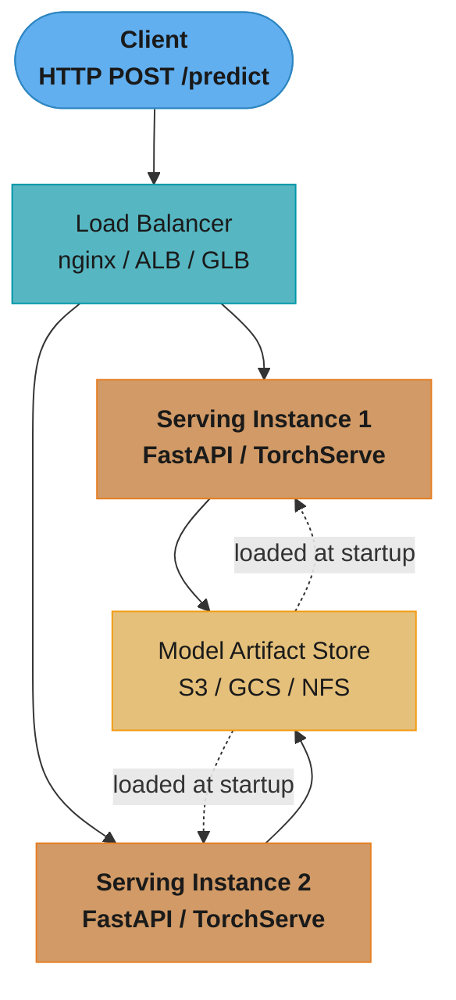
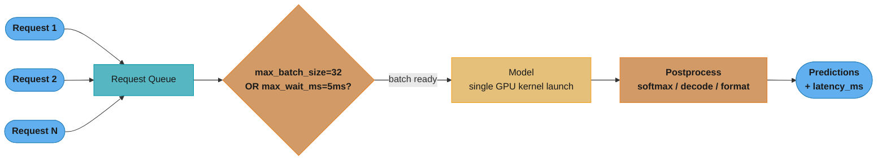
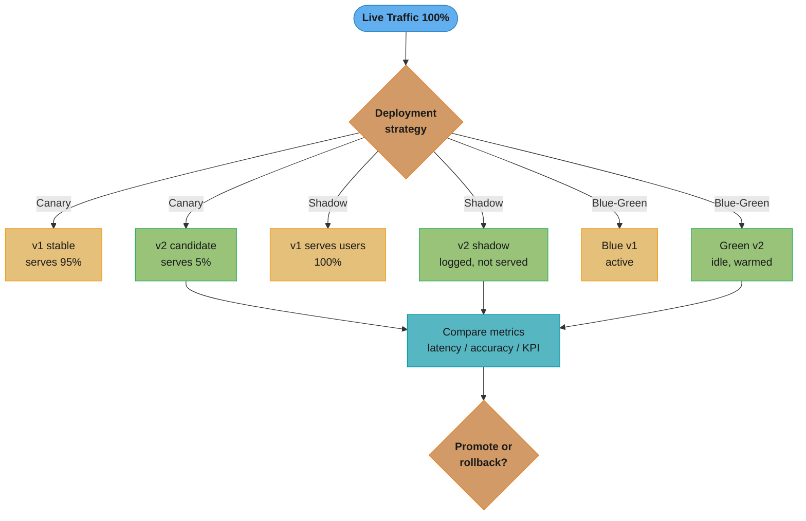
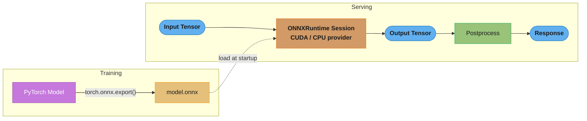

# Model Serving and Inference

## 1. Concept Overview

Model serving is the process of deploying a trained ML model into a production environment where it can receive requests, run inference, and return predictions. It bridges the gap between offline model training and online value delivery. Inference refers to the execution of a trained model on new input data to produce predictions.

Production serving demands more than correctness — it requires low latency, high throughput, scalability, versioning, graceful degradation, and observability. A model that achieves 95% accuracy in a notebook but takes 500ms per request or cannot handle 1,000 QPS is not production-ready.

Key responsibilities of a serving system:
- Accept prediction requests over HTTP (REST) or binary protocols (gRPC)
- Load model artifacts and manage model lifecycle (versioning, hot-swap)
- Batch requests to maximize hardware utilization
- Return predictions with acceptable latency (P99 under SLA)
- Expose health, readiness, and metrics endpoints

---

## 2. Intuition

Think of model serving like a restaurant kitchen. The trained model is the recipe. Serving is the kitchen operation — taking orders (requests), processing ingredients (features), cooking (inference), and plating the result (response). A single chef (single-threaded serving) can handle a handful of tables; you need parallelism, prep work (preprocessing pipelines), and batching (cooking multiple dishes at once in the oven) to handle a full restaurant at peak hours.

One-line analogy: Model serving is the production kitchen that turns a recipe (trained weights) into meals (predictions) at scale.

Why it matters: 90% of ML value is unrealized until a model serves real traffic. The serving layer determines latency, cost, and reliability.

Key insight: The bottleneck is almost never model accuracy — it is latency, throughput, and operational complexity.

---

## 3. Core Principles

**Separation of concerns**: Keep model inference logic separate from business logic, feature engineering, and serving infrastructure. Use well-defined interfaces.

**Idempotency**: Identical inputs must produce identical outputs. Serving systems must not have hidden mutable state that changes predictions.

**Graceful degradation**: If the primary model is unavailable, fall back to a simpler model, cached result, or rule-based system rather than returning errors.

**Observability**: Every request should emit latency, input shape, output distribution, and error rate. Blind serving is untestable.

**Horizontal scalability**: Serving instances must be stateless so they can be scaled out behind a load balancer. Model weights are loaded at startup from a shared artifact store.

**Hardware-model fit**: Not all models benefit equally from GPU. A 100-parameter logistic regression should serve on CPU; a 7B parameter LLM needs GPU or it will be unusably slow.

---

## 4. Types / Architectures / Strategies

### REST API Serving (Flask / FastAPI)
- Protocol: HTTP/1.1 or HTTP/2, JSON body
- Best for: prototyping, low-QPS internal services, teams with HTTP expertise
- Latency overhead: ~1–5ms serialization per request
- Tools: FastAPI (async, Pydantic validation), Flask (sync, simpler)

### gRPC Serving
- Protocol: HTTP/2, Protocol Buffers (binary)
- Best for: high-QPS production, microservice-to-microservice, latency-sensitive paths
- Speedup over REST: 2–10x faster serialization, persistent connections, bidirectional streaming
- Tools: grpcio, TorchServe gRPC endpoint, TF Serving gRPC

### TorchServe
- PyTorch-native model server
- Handler-based: custom Python handlers for preprocessing, inference, postprocessing
- Supports model versioning, dynamic batching (max_batch_size, batch_delay_ms), metrics
- Management API (port 8081) for model registration/deregistration

### TF Serving
- TensorFlow-native, SavedModel format
- Model versioning with automatic promotion of latest version
- A/B testing via traffic routing configuration
- gRPC and REST endpoints, warm model loading

### ONNX + ONNXRuntime
- Open Neural Network Exchange: cross-framework model interchange format
- Convert PyTorch/TF/sklearn → ONNX once, run everywhere
- ONNXRuntime: 2–5x speedup over PyTorch CPU; graph optimizations, operator fusion
- Execution providers: CPUExecutionProvider, CUDAExecutionProvider, TensorrtExecutionProvider

### Streaming / SSE
- Server-Sent Events or WebSocket for token-by-token output (generative models)
- Reduces time-to-first-token perception; user sees output immediately
- Required for LLM chat interfaces

### Batching Strategies
- Static batching: wait for exactly N requests, send together; simple but adds fixed latency
- Dynamic batching: wait up to max_wait_ms or until max_batch_size reached; adaptive
- Continuous batching (iteration-level): for LLMs, adds new requests mid-generation; maximizes GPU utilization

---

## 5. Architecture Diagrams

### Single-Model REST Serving



*Stateless serving replicas sit behind a load balancer and each loads the same model artifact once at startup — this is what lets you scale out horizontally by just adding pods.*

### Request Lifecycle with Dynamic Batching



*The batcher holds requests until either the size or the wait-time bound trips, then runs one combined kernel; the response only leaves after postprocessing, so `max_wait_ms` is pure added latency you trade for throughput.*

### Deployment Strategies: Canary vs Shadow vs Blue-Green



*All three route or duplicate traffic to a candidate model, but differ in blast radius: canary exposes a small slice of users, shadow exposes none (predictions are only logged), and blue-green flips everyone at once with instant rollback.*

### ONNX Inference Pipeline



*Export once at training time to a framework-neutral graph, then serve it through ONNXRuntime with a GPU or CPU execution provider — the same `.onnx` artifact runs anywhere, decoupling the training framework from the serving runtime.*

---

## 6. How It Works — Detailed Mechanics

### FastAPI + ONNX Serving

```python
from __future__ import annotations

import numpy as np
import onnxruntime as ort
from fastapi import FastAPI, HTTPException
from pydantic import BaseModel
import time
import logging

logger = logging.getLogger(__name__)

class PredictRequest(BaseModel):
    features: list[list[float]]  # batch of feature vectors

class PredictResponse(BaseModel):
    predictions: list[float]
    latency_ms: float

app = FastAPI(title="ML Model Server")

# Global session — loaded once at startup, thread-safe for inference
_session: ort.InferenceSession | None = None

@app.on_event("startup")
def load_model() -> None:
    global _session
    # Use CUDAExecutionProvider if GPU available, fall back to CPU
    providers = ["CUDAExecutionProvider", "CPUExecutionProvider"]
    _session = ort.InferenceSession("model.onnx", providers=providers)
    logger.info("ONNX model loaded. Providers: %s", _session.get_providers())

@app.get("/health")
def health() -> dict[str, str]:
    return {"status": "ok"}

@app.get("/ready")
def ready() -> dict[str, str]:
    if _session is None:
        raise HTTPException(status_code=503, detail="Model not loaded")
    return {"status": "ready"}

@app.post("/predict", response_model=PredictResponse)
def predict(req: PredictRequest) -> PredictResponse:
    if _session is None:
        raise HTTPException(status_code=503, detail="Model not ready")

    t0 = time.perf_counter()
    input_array = np.array(req.features, dtype=np.float32)

    input_name = _session.get_inputs()[0].name
    output_name = _session.get_outputs()[0].name

    try:
        result = _session.run([output_name], {input_name: input_array})
    except Exception as exc:
        logger.error("Inference failed: %s", exc)
        raise HTTPException(status_code=500, detail="Inference error")

    latency_ms = (time.perf_counter() - t0) * 1000
    predictions = result[0].flatten().tolist()
    return PredictResponse(predictions=predictions, latency_ms=round(latency_ms, 2))
```

### Dynamic Batching with asyncio Queue

```python
import asyncio
from dataclasses import dataclass, field
from typing import Any

MAX_BATCH_SIZE = 32
MAX_WAIT_MS = 5.0

@dataclass
class BatchRequest:
    inputs: np.ndarray
    future: asyncio.Future = field(default_factory=asyncio.Future)

_queue: asyncio.Queue[BatchRequest] = asyncio.Queue()

async def batch_worker() -> None:
    """Background worker: drains queue into batches and runs inference."""
    while True:
        batch: list[BatchRequest] = []
        try:
            # Block until at least one item arrives
            first = await asyncio.wait_for(_queue.get(), timeout=1.0)
            batch.append(first)
        except asyncio.TimeoutError:
            continue

        deadline = asyncio.get_event_loop().time() + MAX_WAIT_MS / 1000
        while len(batch) < MAX_BATCH_SIZE:
            remaining = deadline - asyncio.get_event_loop().time()
            if remaining <= 0:
                break
            try:
                item = await asyncio.wait_for(_queue.get(), timeout=remaining)
                batch.append(item)
            except asyncio.TimeoutError:
                break

        # Run inference on the combined batch
        combined = np.stack([r.inputs for r in batch])
        results = run_inference(combined)  # your model call here

        for i, req in enumerate(batch):
            req.future.set_result(results[i])

async def predict_async(inputs: np.ndarray) -> Any:
    req = BatchRequest(inputs=inputs)
    await _queue.put(req)
    return await req.future
```

### Exporting PyTorch to ONNX

```python
import torch
import torch.nn as nn

class SimpleClassifier(nn.Module):
    def __init__(self, input_dim: int, num_classes: int) -> None:
        super().__init__()
        self.net = nn.Sequential(
            nn.Linear(input_dim, 128),
            nn.ReLU(),
            nn.Linear(128, num_classes),
        )

    def forward(self, x: torch.Tensor) -> torch.Tensor:
        return self.net(x)

def export_to_onnx(model: nn.Module, input_dim: int, path: str) -> None:
    model.eval()
    dummy_input = torch.randn(1, input_dim)  # batch_size=1 with dynamic axes
    torch.onnx.export(
        model,
        dummy_input,
        path,
        input_names=["features"],
        output_names=["logits"],
        dynamic_axes={"features": {0: "batch_size"}, "logits": {0: "batch_size"}},
        opset_version=17,
    )
    print(f"Exported to {path}")
```

### Decoding the Batching Latency/Throughput Tradeoff

Every batched serving system obeys two equations, and they pull in opposite directions:

```
batch_latency(B)   = fixed_overhead + per_sample_cost x B
throughput(B)      = B / batch_latency(B)
request_latency(B) = max_wait_ms + batch_latency(B)
```

**In plain terms.** "One kernel launch costs the same whether you feed it 1 sample or 32, so the
fixed cost is what you are amortizing — and the price of amortizing it is the time each request
spends waiting for company."

The `fixed_overhead` term is the whole reason batching works. It covers the kernel launch, reading
the model weights out of HBM, and the Python/serialization frame around the call — none of which
scale with `B`. If `fixed_overhead` were zero, batching would buy you nothing.

| Symbol | What it is |
|--------|------------|
| `B` | Batch size — how many requests ride in one forward pass |
| `fixed_overhead` | Per-launch cost paid once per batch: kernel launch, weight read, framework frame |
| `per_sample_cost` | Marginal cost of one extra sample once the batch is already running |
| `throughput(B)` | Requests per second one replica sustains at that batch size |
| `max_wait_ms` | The batcher's timeout — pure added latency, the fee you pay for the throughput |
| `request_latency(B)` | Worst case a single request sees: full wait, then the full batch runs |

**Walk one example.** A model with `fixed_overhead = 4.0ms` and `per_sample_cost = 0.25ms`, batcher
set to `max_wait_ms = 5`:

```
   B     batch_latency        throughput          worst-case request latency
         4.0 + 0.25 x B       B / latency         5ms wait + batch_latency

    1    4.0 + 0.25 =  4.25ms      235 rps            9.25ms
    8    4.0 + 2.00 =  6.00ms    1,333 rps           11.00ms
   32    4.0 + 8.00 = 12.00ms    2,667 rps           17.00ms
   64    4.0 + 16.0 = 20.00ms    3,200 rps           25.00ms

  B = 1 -> B = 32 :  throughput x11.3,  worst-case latency +7.75ms
  B = 32 -> B = 64:  throughput x1.20,  worst-case latency +8.00ms
```

That is the knee, and it is the number Section 13 means by "pick the knee". Going 1 -> 32 buys
11.3x throughput for 7.75ms. Going 32 -> 64 buys 1.2x for another 8ms — you pay the same latency
again for almost nothing, because past `B = 32` the `0.25 x B` term dominates and `fixed_overhead`
is already fully amortized. Amortization only pays until there is nothing left to amortize.

### Decoding Capacity Sizing — Little's Law

Replica counts are not guesswork; they fall out of one 1961 queueing identity:

```
concurrency = QPS x latency_seconds            (Little's Law)

replicas = ceil( QPS / (throughput_per_replica x target_utilization) )
```

**What this actually says.** "The number of requests in flight at any instant is just the arrival
rate multiplied by how long each one sticks around."

The identity holds for any stable system regardless of arrival distribution, service-time
distribution, or scheduling policy — which is why it is the one capacity formula worth memorizing.
It only requires that the system is not growing without bound.

| Symbol | What it is |
|--------|------------|
| `QPS` | Arrival rate — requests per second entering the service |
| `latency_seconds` | Mean time a request spends inside, queue wait included, not just inference |
| `concurrency` | Requests resident in the system at any instant. Sizes your thread pool and queue |
| `throughput_per_replica` | `B / batch_latency(B)` from the block above — one pod's sustainable rps |
| `target_utilization` | Headroom factor, typically 0.6-0.7. Never size to 1.0 |
| `ceil(...)` | Round up — you cannot deploy 6.43 pods |

**Walk one example.** Size the fleet for 12,000 QPS at the `B = 32` operating point above:

```
  step 1  in-flight concurrency
          12,000 rps x 0.012 s          = 144 requests resident at any instant

  step 2  per-replica throughput (from the batching block)
          32 / 0.012 s                  = 2,667 rps per replica

  step 3  naive replica count
          12,000 / 2,667                = 4.5   -> 5 replicas

  step 4  same, with 70% utilization headroom
          12,000 / (2,667 x 0.70)       = 6.43  -> 7 replicas

  contrast: unbatched (B = 1, 235 rps/replica)
          12,000 / (235 x 0.70)         = 72.9  -> 73 replicas
```

Seven pods versus seventy-three, for the same traffic and a 7.75ms latency concession. `144` is
the other half of the answer: it is the number your connection pool, queue depth, and `max_num_seqs`
must accommodate, and if any of them is set below 144 you will shed load at target QPS while the
GPUs sit idle.

**Why `target_utilization` exists.** Little's Law describes a stable system; at 100% utilization
queueing theory says wait time goes to infinity. Traffic is bursty, so the mean is not what kills
you — sizing to exactly 5 pods means the first 20% spike pushes latency past the SLA before the
autoscaler's 300-500ms GPU cold start can respond. The 0.70 factor is what buys the autoscaler time.

### Decoding Tail Latency — Why Percentiles Do Not Add

The single most common capacity-planning error is summing percentiles across a call chain:

```
WRONG:  p99_end_to_end = p99_a + p99_b + p99_c + ...

RIGHT:  P(all N services fast) = (1 - 0.01)^N        for N services each at p99
        P(at least one slow)   = 1 - 0.99^N
```

**Read it like this.** "A percentile is a probability, and independent probabilities multiply
rather than add — so chaining services does not stack their tails, it compounds their chances of
being unlucky."

| Symbol | What it is |
|--------|------------|
| `p99 = 10ms` | 99% of calls finish in 10ms or less; 1% do not. It is a probability statement |
| `N` | Number of services on the critical path of one user request |
| `0.99^N` | Probability every hop lands in its fast 99%. Shrinks fast as `N` grows |
| `1 - 0.99^N` | Probability at least one hop is in its slow tail. This is what users feel |
| `0.99^(1/N)` | The per-service percentile you must actually hit for an end-to-end p99 |

**Walk one example.** Five services, each with p99 = 10ms:

```
  the naive answer:  5 x 10ms = 50ms "end-to-end p99"     <- wrong

  what 50ms actually is:
    P(all five fast) = 0.99^5 = 0.95099
    So 50ms is the end-to-end p95.1, not the p99.

  P(at least one hop in its tail) = 1 - 0.95099 = 4.90%
    -> roughly 1 request in 20 exceeds 50ms, not 1 in 100.

  chain length vs. fraction of requests hitting some tail:
      N = 1    1.000%
      N = 2    1.990%
      N = 3    2.970%
      N = 5    4.901%
      N = 10   9.562%

  to actually hit an end-to-end p99 across 5 hops, each hop needs:
      0.99^(1/5) = 0.997992  ->  every service must hold its p99.8, not its p99
```

The last line is the operationally useful one. Meeting a 99th-percentile end-to-end SLA over five
hops means each hop must meet its **99.8th** percentile — a far harsher bar than each hop's p99, and
the reason deep microservice chains are so hostile to tail SLAs. Two fixes follow directly from the
arithmetic: shorten `N` (fewer hops, parallel fan-out instead of serial chaining), or add hedged
requests so one slow hop does not have to be waited on. Note also that these tails are only strictly
independent in theory — a shared GC pause, a saturated NIC, or one hot downstream correlates them,
which makes the real number worse than `1 - 0.99^N`, never better.

### Decoding Cost per Prediction

The number that decides GPU-vs-CPU and batch-size arguments, once and for all:

```
cost_per_prediction = (replicas x instance_cost_per_hour)
                      / (QPS x 3600)
```

**Put simply.** "Take what the fleet bills you per hour, divide by how many predictions it produced
in that hour."

| Symbol | What it is |
|--------|------------|
| `replicas` | Pod count from the Little's Law block — the batching decision lands here |
| `instance_cost_per_hour` | On-demand list price of one serving instance |
| `QPS x 3600` | Predictions actually produced in an hour at target load |
| `cost_per_prediction` | Dollars per single inference. Usually quoted per million to stay readable |

**Walk one example.** Both fleets sized above, at $3.06/hour per instance (AWS `p3.2xlarge`
on-demand) and 12,000 QPS:

```
  predictions per hour = 12,000 x 3,600 = 43,200,000

  batched fleet  (B = 32, 7 replicas)
    fleet cost   = 7  x $3.06  = $21.42 / hour
    per million  = $21.42 / 43.2M x 1e6 = $0.4958 per million predictions

  unbatched fleet (B = 1, 73 replicas)
    fleet cost   = 73 x $3.06  = $223.38 / hour
    per million  = $223.38 / 43.2M x 1e6 = $5.1708 per million predictions

  ratio = 10.4x cheaper, for +7.75ms of worst-case latency
  annual delta = ($223.38 - $21.42) x 24 x 365 = $1,769,170
```

That last line is the whole argument for dynamic batching stated in the only unit that ends
budget debates. It is also why the Uber Michelangelo figure in Section 7 — "dynamic batching
reduces GPU cost by 40% at peak" — is a conservative real-world result rather than a marketing
number: their models had a smaller `fixed_overhead` share to amortize than this example does.

---

## 7. Real-World Examples

**Uber Michelangelo**: Serves hundreds of models for ETA, surge pricing, fraud detection. Uses a custom gRPC serving layer with feature store integration. Dynamic batching reduces GPU cost by 40% at peak hours.

**Netflix recommendation serving**: REST API backed by TensorFlow Serving. A/B testing infrastructure routes 5% traffic to candidate models. Rollback is automatic if P95 latency exceeds SLA by 20%.

**Stripe fraud detection**: Low-latency (P99 < 10ms) requirement drives CPU-based ONNX serving. GPU would increase throughput but add cold-start latency unsuitable for synchronous payment flows.

**OpenAI ChatGPT**: Continuous batching in vLLM-style inference for generative models. Streaming via SSE so users see tokens as they are generated, masking actual inference time.

---

## 8. Tradeoffs

| Dimension | REST (JSON) | gRPC (Protobuf) | ONNX Runtime | Native Framework (PyTorch) |
|-----------|------------|-----------------|-------------|---------------------------|
| Latency | Higher (JSON parsing) | Lower (binary) | Lower (optimized kernels) | Higher (Python overhead) |
| Throughput | Moderate | High | High | Moderate |
| Portability | Universal | Requires stub gen | Universal | Framework-specific |
| Streaming | SSE / chunked | Native streaming | N/A | N/A |
| Debug ease | Easy (human-readable) | Harder | Moderate | Easy |
| Hardware support | CPU/GPU | CPU/GPU | CPU/GPU/Edge | CPU/GPU |

| Batching Strategy | Latency | Throughput | Complexity |
|-------------------|---------|------------|------------|
| No batching | Lowest | Lowest | Simplest |
| Static batching | Fixed overhead | High | Low |
| Dynamic batching | Adaptive | High | Medium |
| Continuous batching | Best for LLMs | Highest for LLMs | High |

---

## 9. When to Use / When NOT to Use

**Use REST + FastAPI when:**
- Prototyping or internal low-QPS service (< 100 RPS)
- Clients are diverse and cannot generate gRPC stubs
- Team has no gRPC experience

**Use gRPC when:**
- High QPS (> 1,000 RPS) between services
- Bidirectional streaming required (real-time scoring)
- Latency SLA is tight (< 20ms P99)

**Use ONNX Runtime when:**
- Need 2–5x speedup over PyTorch CPU with no GPU
- Cross-framework portability required (TF model serving in PyTorch ecosystem)
- Edge deployment with limited runtime

**Use TorchServe / TF Serving when:**
- Need production-grade model versioning, A/B testing out of the box
- Multi-model serving on the same instance
- Metrics and management API required without custom code

**Do NOT use GPU for:**
- Low-QPS (< 10 RPS) synchronous single-request services — GPU cold-start dominates
- Very small models (logistic regression, small decision trees) — CPU is faster end-to-end
- Cost-sensitive batch jobs that can run overnight on CPU

---

## 10. Common Pitfalls

**War story 1: The cold-start latency spike.** A team deployed a PyTorch model on GPU for a payment fraud endpoint. P99 latency was acceptable at steady state but spiked to 800ms after autoscaler added a new pod. Root cause: CUDA context initialization takes 300–500ms on first request. Fix: warm-up requests sent during pod startup in the readiness probe.

**War story 2: Thread-unsafe session.** An engineer created a new `ort.InferenceSession` per request to avoid shared state. Under 100 RPS load, memory grew 4GB in 10 minutes. Fix: create one session at startup, reuse it — ONNXRuntime inference sessions are thread-safe for concurrent `run()` calls.

**Broken pattern: Missing dynamic axes in ONNX export.**
```python
# BROKEN: fixed batch size baked into graph
torch.onnx.export(model, torch.randn(1, 128), "model.onnx")
# At serving time, batch of 16 raises: "Got inputs with shapes [16, 128] but expected [1, 128]"

# FIXED: declare batch_size as dynamic
torch.onnx.export(
    model, torch.randn(1, 128), "model.onnx",
    dynamic_axes={"input": {0: "batch_size"}, "output": {0: "batch_size"}},
)
```

**War story 3: JSON deserialization dominates latency.** A model took 2ms to run but P99 was 45ms. Profiling revealed that deserializing a 500-feature JSON array took 40ms in Python. Fix: switched to gRPC with Protobuf; deserialization dropped to 1ms.

**War story 4: No readiness probe; traffic before model loaded.** Kubernetes sent live traffic to a pod before `model.onnx` was downloaded from S3 (15 seconds). Result: 15 seconds of 500 errors on every deploy. Fix: added `/ready` endpoint that returns 503 until session is initialized; configured readiness probe in Kubernetes deployment spec.

---

## 11. Technologies & Tools

| Tool | Category | Notes |
|------|----------|-------|
| FastAPI | REST serving | Async, Pydantic, OpenAPI docs auto-generated |
| Flask | REST serving | Sync, simpler for prototypes |
| TorchServe | PyTorch serving | Handler-based, dynamic batching, metrics |
| TF Serving | TF serving | SavedModel, versioning, A/B routing |
| ONNX | Model format | Cross-framework interchange |
| ONNXRuntime | Inference engine | 2–5x speedup on CPU, GPU/NPU execution providers |
| TensorRT | NVIDIA optimization | INT8/FP16, layer fusion; ResNet-50: 7ms CPU → 1.5ms |
| Triton Inference Server | Multi-framework | NVIDIA, supports TF/PyTorch/ONNX/TensorRT, HTTP+gRPC |
| BentoML | Serving framework | Python-native, Docker/Kubernetes baked in |
| Ray Serve | Distributed serving | Composable pipelines, autoscaling, model multiplexing |
| Seldon Core | K8s-native serving | Inference graphs, drift detection sidecar |
| KServe (KFServing) | K8s CRD serving | Standardized inference protocol, canary built-in |

---

## 12. Interview Questions with Answers

**Q: What is the difference between REST and gRPC for model serving, and when would you choose each?**
REST uses HTTP/1.1 with JSON bodies; gRPC uses HTTP/2 with binary Protocol Buffers. gRPC serialization is 2–10x faster and connections are persistent, reducing overhead. For high-QPS internal microservice calls or latency-sensitive paths, gRPC is preferred. REST is better for external-facing APIs, diverse clients, or when human readability of payloads matters for debugging.

**Q: How does dynamic batching reduce cost while maintaining latency SLAs?**
Dynamic batching waits up to `max_wait_ms` (e.g., 5ms) or until `max_batch_size` (e.g., 32) requests accumulate before sending a single GPU kernel launch. A GPU running one sample at a time is 10–30x less efficient than running a full batch. By tolerating 5ms additional latency, throughput can increase 10x, cutting per-prediction GPU cost proportionally. The SLA is maintained because the maximum added latency is bounded by `max_wait_ms`.

**Q: Why might you choose ONNX Runtime over native PyTorch for CPU-based serving?**
ONNXRuntime applies graph-level optimizations (operator fusion, constant folding, memory layout optimization) that PyTorch's eager mode cannot. On CPU, this typically yields a 2–5x throughput improvement and reduced memory bandwidth. ONNX also enables cross-framework portability — a model trained in TensorFlow can be exported to ONNX and served in an ONNXRuntime-based PyTorch microservice.

**Q: Explain the cold-start problem in GPU-based model serving and how to mitigate it.**
When a new serving instance starts, the CUDA runtime must initialize (300–500ms), load model weights to GPU memory (100ms–several seconds for large models), and JIT-compile kernels on first input shape. Until this completes, requests fail or time out. Mitigation: send warm-up requests during pod startup; use Kubernetes readiness probes to hold traffic until the model is ready; use pre-built TensorRT engines that skip JIT compilation.

**Q: What is continuous batching and why is it important for LLM serving?**
Traditional static batching for LLMs waits until all sequences in a batch finish generation, wasting GPU cycles on idle sequences. Continuous batching (iteration-level scheduling) allows inserting new requests into the batch at each forward pass step, filling slots freed by completed sequences. This increases GPU utilization from ~40% (static) to ~80–90%, directly doubling throughput for the same hardware cost.

**Q: How do you implement A/B testing for model updates in production?**
Deploy both model versions as separate serving instances. Configure the load balancer or a feature flag system to route a small percentage of traffic (e.g., 5%) to the new version. Collect business and technical metrics (conversion rate, latency, accuracy on delayed labels) for both versions. After a statistically significant observation period, either promote the new version to 100% or roll back. Shadow mode (run both, compare offline without affecting users) is safer for high-stakes models.

**Q: What are the tradeoffs between serving on GPU vs CPU?**
GPU maximizes throughput for large models and high QPS but has high fixed cost, cold-start latency, and is harder to autoscale quickly. CPU has lower per-instance cost, near-zero cold-start, and scales easily, but is insufficient for large models (LLMs, large CNNs) at production QPS. Rule of thumb: use CPU for models under ~10M parameters at < 50 RPS; use GPU for large models or when throughput demands batch sizes > 8.

**Q: How do you handle model versioning in a production serving system?**
Store model artifacts in a versioned artifact store (S3 with versioning, GCS, MLflow artifact store). Assign semantic or timestamp-based version identifiers. Register models in a model registry (MLflow Model Registry) with stage labels (Staging, Production). Serving infrastructure loads the model pinned to the Production stage. Rolling updates swap the serving pointer atomically, keeping the previous version registered for instant rollback.

**Q: What observability signals should every model serving endpoint emit?**
Request latency (P50, P95, P99) per model version; request throughput (RPS); error rate (5xx, timeout); batch size distribution; input feature statistics (mean, std, null rate for drift detection); model output distribution (prediction score histogram); hardware utilization (GPU memory, CPU, memory). These should feed into Prometheus/Grafana with alerts on SLA breaches.

**Q: How does TorchServe's handler architecture work?**
TorchServe loads a model archive (.mar file) containing the serialized model and a handler Python class. The handler implements three methods: `preprocess` (raw request bytes → tensor), `inference` (tensor → tensor via model.forward), and `postprocess` (tensor → response bytes). The server manages concurrency, batching, and versioning; the handler is the only user-authored code. This separation allows infrastructure teams to own the server and ML engineers to own the handler.

**Q: What is shadow mode serving and when do you use it?**
Shadow mode runs a candidate model on live traffic alongside the production model, but only the production model's response is returned to users. The candidate's predictions are logged and compared offline. This is used when the model update is high-risk (medical, financial), when labeling is slow, or when you want to validate model behavior at real traffic distribution before any user is affected. It doubles inference cost during the shadow period.

**Q: Your model runs in 2ms but P99 latency is 45ms — where is the time going?**
The time is almost certainly in serialization, not inference. A 500-feature JSON array can take 40ms to deserialize in Python, dwarfing the 2ms model call, so profile the whole request lifecycle (deserialization, feature assembly, inference, serialization) before touching the model. Switching from JSON to gRPC with Protobuf typically drops deserialization to ~1ms; connection reuse and batching remove the rest.

**Q: What is the difference between a liveness (`/health`) and a readiness (`/ready`) probe, and why does confusing them cause deploy outages?**
Liveness answers "is the process alive?" and readiness answers "can it serve traffic yet?". If you only implement liveness, Kubernetes routes traffic to a pod the moment the process starts — before the model is downloaded and loaded — producing seconds of 500 errors on every deploy. The readiness endpoint must return 503 until the model session is initialized so the load balancer holds traffic until the pod is genuinely ready.

**Q: How do you set `max_batch_size` and `max_wait_ms` for dynamic batching?**
Derive them from your latency budget, not from defaults. `max_wait_ms` is worst-case latency you add to every request while it waits for a batch to fill, so set it to a fraction of your P99 budget (e.g., 5ms of a 50ms SLA); `max_batch_size` should be the largest batch the GPU runs before per-request latency starts climbing. Measure the latency-vs-batch curve for your model and hardware, then pick the knee.

**Q: Why must a serving instance be stateless, and what breaks if it is not?**
Stateless instances can be freely added or removed behind a load balancer, which is what makes horizontal scaling work. If an instance holds per-user state (a session cache, an accumulating counter) in local memory, requests must be pinned to one pod via sticky sessions, scaling and failover break, and predictions become non-reproducible. Push shared state to an external store (feature store, Redis) and keep the loaded model weights the only in-process state.

**Q: How do you autoscale GPU-backed model servers, and why is it harder than autoscaling CPU services?**
GPU autoscaling is harder because pods have 300–500ms+ cold starts and GPUs are expensive, so reactive scaling lags demand. Scale on a leading signal — queue depth or in-flight batch size — rather than CPU%, which is meaningless for GPU work. Keep a warm buffer of pre-initialized pods so a traffic spike does not hit cold CUDA-context initialization, and set conservative scale-down to avoid thrashing pods up and down.

**Q: What is the difference between blue-green and canary deployment for models?**
Blue-green keeps two full environments and flips 100% of traffic from the old (blue) to the new (green) at once after validating green, giving instant rollback by flipping back. Canary instead shifts traffic gradually (5% → 25% → 100%), limiting blast radius and letting you watch metrics at each step, but exposing some users to a bad model before you catch it. Blue-green optimizes for fast, clean cutover; canary optimizes for early detection on real traffic.

**Q: When and why would you use server-sent events (SSE) or streaming for model serving?**
Use streaming for generative models so users see tokens as they are produced instead of waiting for the full response. It does not make inference faster, but it slashes perceived latency — time-to-first-token is what users feel, so a 3-second completion can feel instant. Streaming also enables natural backpressure: a client that stops reading signals the server to abort and reclaim resources, which is essential for LLM chat interfaces.

---

## 13. Best Practices

- Export models to ONNX for CPU serving; benchmark against native framework before choosing
- Always define dynamic axes in ONNX export to support variable batch sizes
- Implement `/health` (liveness) and `/ready` (readiness) endpoints; configure K8s probes accordingly
- Load model once at process startup into a module-level variable; never reload per request
- Use async endpoints (FastAPI `async def`) only when the model call is truly async or when I/O overlaps with inference; for CPU/GPU-bound inference, use a thread pool
- Set `max_batch_size` and `max_wait_ms` based on measured latency budgets, not defaults
- Pin model version in serving config; never auto-promote `latest` without a gate
- Emit prediction score distributions as metrics; sudden shifts indicate silent model failures
- Test rollback procedure monthly — know the exact steps to revert to the previous version in under 5 minutes
- For gRPC, pre-generate stubs at build time and distribute via an internal package registry

---

## 14. Case Study

**Scenario: Serving a 7B-parameter LLM with vLLM.** A chat product needs to serve a 7B model under 100 concurrent requests with streaming responses. vLLM provides PagedAttention (no KV-cache fragmentation) and continuous batching (new requests slot into gaps left by finished ones), with tensor parallelism across 2x A100. The deployment ships via shadow mode for a week before a canary rollout.

```
100 concurrent clients (streaming)
        |
   API gateway (auth, rate limit, server-side timeout)
        |
   vLLM engine
     +-- continuous batching scheduler (per-step admission)
     +-- PagedAttention KV cache (paged, no fragmentation)
     +-- tensor parallelism across 2x A100 (split each layer)
        |
   token stream back to client (SSE)

throughput 1200 tok/s | p99 = 800ms for a 200-token response
```

Throughput ~1200 tokens/sec aggregate, p99 latency 800ms for a 200-token completion. PagedAttention lets many sequences share GPU memory efficiently; continuous batching keeps the GPU busy instead of waiting for the slowest sequence in a fixed batch.

**Launching vLLM with tensor parallelism and bounded concurrency:**

```python
from vllm import LLM, SamplingParams

def build_engine() -> LLM:
    return LLM(
        model="meta-llama/Llama-2-7b-chat-hf",
        tensor_parallel_size=2,            # split across 2 A100s
        gpu_memory_utilization=0.90,       # reserve headroom for KV cache
        max_num_seqs=100,                  # cap concurrent sequences
        max_model_len=4096,
    )

PARAMS = SamplingParams(temperature=0.7, top_p=0.95, max_tokens=200)
```

**Streaming generation with the async engine:**

```python
from vllm import AsyncLLMEngine, SamplingParams
from vllm.engine.arg_utils import AsyncEngineArgs
import uuid

class LLMService:
    def __init__(self) -> None:
        args = AsyncEngineArgs(model="meta-llama/Llama-2-7b-chat-hf",
                               tensor_parallel_size=2, max_num_seqs=100)
        self.engine = AsyncLLMEngine.from_engine_args(args)

    async def stream(self, prompt: str):
        params = SamplingParams(temperature=0.7, max_tokens=200)
        async for out in self.engine.generate(prompt, params, str(uuid.uuid4())):
            yield out.outputs[0].text   # incremental tokens to the client
```

**Server-side timeout to protect GPU memory:**

```python
import asyncio

async def generate_with_timeout(service: "LLMService", prompt: str,
                                deadline_s: float = 30.0) -> str:
    async def collect() -> str:
        chunks: list[str] = []
        async for piece in service.stream(prompt):
            chunks.append(piece)
        return "".join(chunks)
    try:
        return await asyncio.wait_for(collect(), deadline_s)
    except asyncio.TimeoutError:
        return "[response timed out]"   # frees the sequence + its KV cache
```

**Pitfall 1 — Static batching waits for the slowest request.** Fixed batching collects N requests, runs them together, and cannot return any until the longest completes, wasting GPU on padding and inflating tail latency.

```python
# BROKEN: fixed batch with a wait timeout -> short requests blocked by long ones
batch = collect_requests(n=32, timeout_ms=100)   # all finish together

# FIX: continuous batching, the scheduler admits/evicts sequences every step,
# so completed sequences free slots for new ones immediately (vLLM default).
engine = build_engine()   # max_num_seqs governs concurrency, not a fixed batch
```

**Pitfall 2 — KV-cache eviction under overload.** Admitting more concurrent sequences than KV-cache memory allows forces eviction/recompute and degrades quality and latency.

```python
# BROKEN: unbounded concurrency -> KV cache thrashes, sequences preempted
engine = LLM(model=..., max_num_seqs=10_000)

# FIX: cap max_num_seqs to what KV-cache memory supports and queue the rest;
# tune gpu_memory_utilization to size the KV cache deliberately.
engine = LLM(model=..., max_num_seqs=100, gpu_memory_utilization=0.90)
```

**Pitfall 3 — No request timeout lets a slow client hold GPU memory.** A client that stops reading keeps its sequence and KV cache alive for minutes, starving others.

```python
# BROKEN: generate until EOS with no deadline -> stuck sequences pin memory
text = await service.collect(prompt)   # could run for minutes

# FIX: server-side timeout that aborts the sequence and reclaims its KV cache,
# plus streaming so slow consumers apply natural backpressure.
text = await generate_with_timeout(service, prompt, deadline_s=30.0)
```

**Interview Q&A:**

**What problem does PagedAttention solve?** Naive KV-cache allocation reserves a contiguous block per sequence sized to the max length, wasting memory and fragmenting it so fewer sequences fit. PagedAttention stores the KV cache in fixed-size pages (like OS virtual memory), allocating on demand, which eliminates fragmentation and lets many more sequences share GPU memory, raising throughput.

**How does continuous batching differ from static batching?** Static batching forms a fixed batch and runs all sequences to completion together, so short requests wait for the longest and the GPU pads. Continuous (in-flight) batching makes admission decisions every decode step: as soon as a sequence finishes, its slot is freed and a queued request joins, keeping the GPU saturated and cutting tail latency.

**When do you use tensor parallelism versus other parallelism for inference?** Tensor parallelism splits each layer's matrices across GPUs and is used when a model is too large for one GPU or when you need lower per-token latency; it requires fast interconnect (NVLink) because of frequent all-reduces. Pipeline parallelism splits by layers and suits very large models, while data/replica parallelism scales throughput by running independent copies.

**Why deploy with shadow mode before a canary?** Shadow mode sends real production traffic to the new model without serving its responses to users, so you can compare quality, latency, and cost with zero user risk. Only after shadow results look good does a canary route a small fraction of live traffic, limiting blast radius if something regresses.

**How do you bound tail latency for LLM serving?** Cap concurrent sequences to fit KV-cache memory (avoid eviction), use continuous batching to avoid head-of-line blocking, stream tokens so clients see progress and apply backpressure, and enforce a server-side timeout that reclaims memory from stuck or slow sequences. Separately scaling prefill-heavy and decode-heavy workloads also helps.

**What governs throughput vs latency trade-offs here?** Larger effective batches raise throughput (tokens/sec) but can raise per-request latency; smaller batches do the opposite. KV-cache memory caps how many sequences run at once. The levers are max_num_seqs, gpu_memory_utilization, and tensor-parallel degree; you tune them to hit the p99 SLA at the required concurrency.

**Pitfall — Synchronous batch aggregation blocks fast requests behind slow ones.**

```python
# BROKEN: dynamic batching holds all requests until batch is full (or timeout)
# A single large request (2000 tokens) delays 15 small requests (50 tokens each)
class BatchingServer:
    def __init__(self, max_batch=16, timeout_ms=50):
        self.queue = []
        self.max_batch = max_batch
        self.timeout_ms = timeout_ms

    async def predict(self, request):
        self.queue.append(request)
        if len(self.queue) == self.max_batch:
            return await self._run_batch()   # fast requests blocked by one slow one

# FIX: per-request padding + timeout-based batching; or use vLLM continuous batching
# which interleaves prefill and decode, preventing head-of-line blocking
# For non-LLM models: group requests by input length before batching
from collections import defaultdict
def group_by_length(requests, bucket_sizes=(64, 128, 256, 512)):
    buckets = defaultdict(list)
    for r in requests:
        b = next((s for s in bucket_sizes if len(r.tokens) <= s), bucket_sizes[-1])
        buckets[b].append(r)
    return buckets
```

**How do you decide between TorchServe, ONNX Runtime, and TensorRT for serving?** TorchServe wraps PyTorch models with a REST/gRPC server, custom handlers, and model archive format — lowest engineering effort, good for experimentation and Python-heavy postprocessing. ONNX Runtime converts PyTorch to ONNX graph IR; runs on CPU/GPU/edge without a Python runtime; 2-5× faster than native PyTorch CPU inference. TensorRT performs hardware-specific layer fusion, precision calibration (INT8/FP16), and kernel auto-tuning for NVIDIA GPUs — achieves 3-10× speedup vs. PyTorch CUDA for production GPU inference. Choose based on: ONNX for CPU/edge portability, TensorRT for maximum GPU throughput (requires NVIDIA hardware), TorchServe for rapid iteration.

**What is canary deployment for ML models and what metrics gate the rollout?** Canary deploys the new model to 5% of traffic. Gate metrics typically include: (1) primary business metric (CTR, AUC, revenue-per-user) vs. baseline — require no regression > 1%; (2) serving latency p99 — require no regression > 20%; (3) error rate — require < 0.01%. Monitor for 24-48 hours at each traffic step (5% → 25% → 50% → 100%). Automatic rollback triggers if any gate metric degrades. The key is that the canary runs on real production traffic, not synthetic load — shadow mode (offline scoring without serving) cannot catch distribution-specific latency issues.
