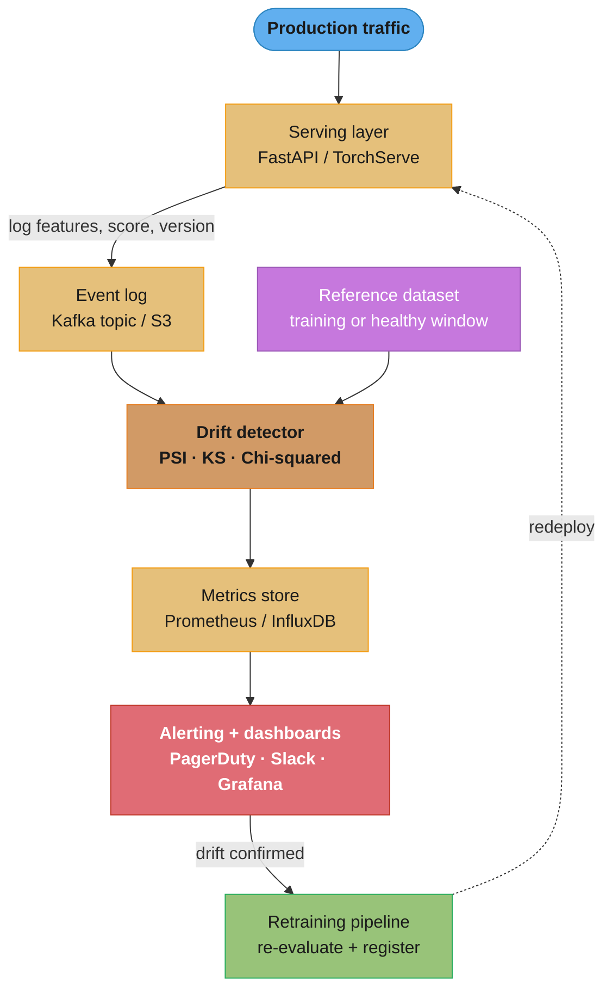
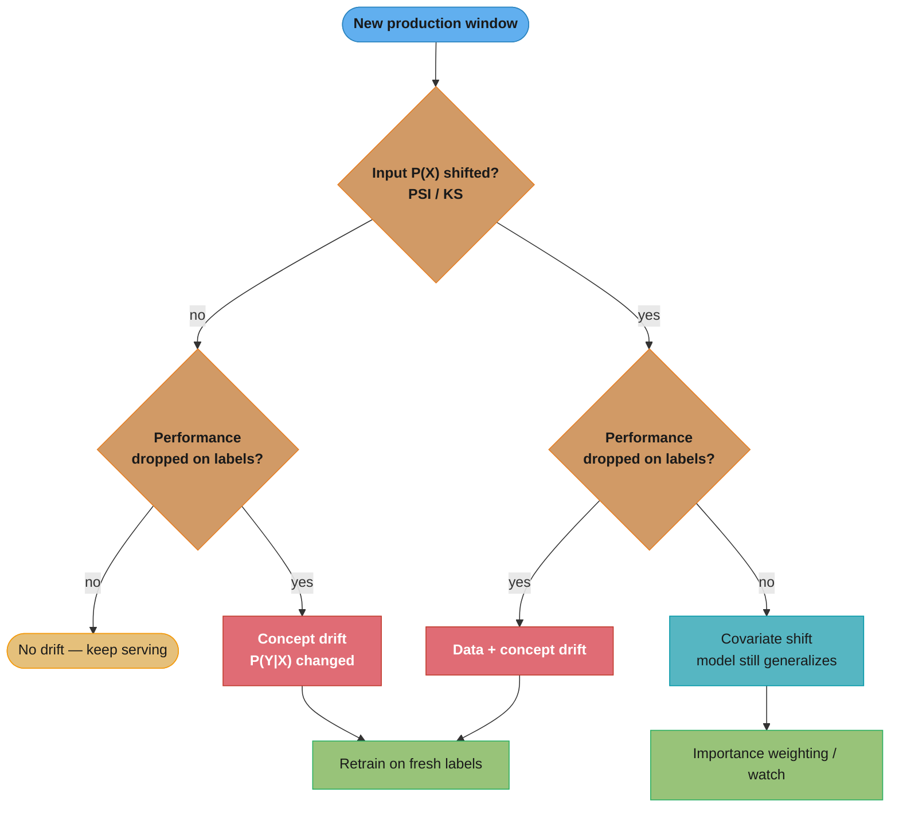
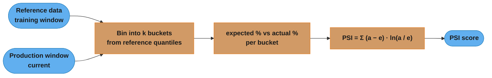
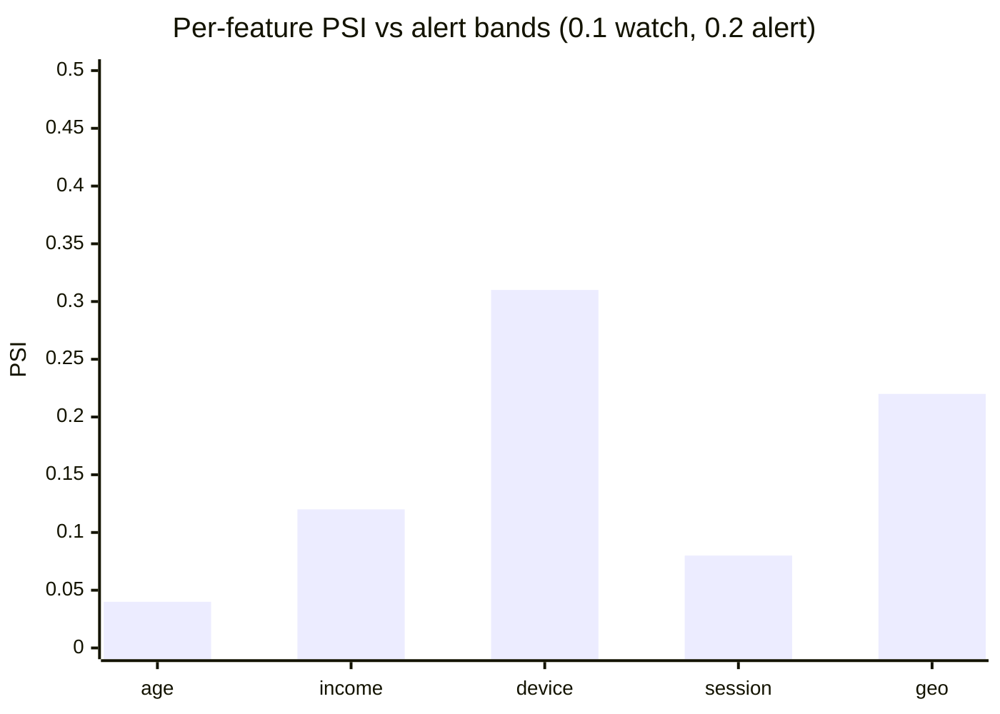

# ML Model Monitoring and Drift Detection

## 1. Concept Overview

ML model monitoring is the practice of continuously observing a deployed model's inputs, outputs, and performance metrics to detect degradation, data distribution shifts, and operational failures before they cause significant business impact. Unlike traditional software where bugs are deterministic, ML models degrade silently — accuracy erodes gradually as the world changes in ways the training data no longer reflects.

Drift detection is the specific practice of statistically comparing current production data distributions against training or reference distributions. When distributions diverge significantly, the model's learned decision boundaries no longer apply to the data it is receiving, and predictions become unreliable.

Without monitoring, a model can silently underperform for weeks before a downstream business metric (revenue, churn, fraud loss) reveals the problem — at which point the damage is already done.

---

## 2. Intuition

Think of a weather forecasting model trained on historical data from the past decade. If climate patterns shift over the next five years (concept drift), the model's temperature predictions will increasingly miss. If the sensors start malfunctioning and reporting different ranges (data drift), the model may still look correct by its own internal metrics while being fed garbage inputs. Monitoring is the process of checking both the sensor readings (input data quality) and comparing forecast accuracy against observations (output/performance monitoring) on an ongoing basis.

One-line analogy: Monitoring is the canary in the coal mine — it detects invisible poisonous gases (distribution shift) before miners (users) are harmed.

Why it matters: A credit scoring model silently degrading by 5% AUC can cost millions in bad loans before the quarterly review catches it.

Key insight: In production, you cannot assume the test set distribution persists. The world changes; your model does not automatically follow.

---

## 3. Core Principles

**Separate infrastructure monitoring from model monitoring**: Infrastructure monitoring (CPU, memory, latency, error rates) is necessary but not sufficient. It tells you the model is running, not whether it is correct.

**Reference distribution is ground truth for drift**: Drift is always relative to a reference window (training data distribution or a healthy recent production window). Choose the reference carefully — it defines what "normal" means.

**Delayed labels require proxy metrics**: Ground truth labels often arrive hours or days after predictions (fraud confirmed after investigation, click-through measured after impression). Design proxy metrics (intermediate user actions, upstream feature statistics) that correlate with eventual label quality.

**Statistical significance matters**: A single anomalous day does not constitute drift. Statistical tests must account for sample size; small windows produce noisy estimates. Use rolling windows of at least 1,000–10,000 samples for reliable PSI/KS estimates.

**Alert on trend, not just threshold**: A PSI that rises from 0.05 to 0.19 over two weeks is more alarming than a single-day spike to 0.21 and recovery. Trend-based alerting catches gradual drift that threshold-based alerting misses.

---

## 4. Types / Architectures / Strategies

### Data Drift (Covariate Shift)
- Input distribution P(X) changes while P(Y|X) remains approximately constant
- Example: e-commerce model trained on desktop users; mobile users surge, feature distributions shift (smaller screen resolution, shorter session duration)
- Detection: statistical tests on individual features or multivariate tests on joint distribution
- Impact: model predictions are extrapolating outside its training manifold

### Concept Drift
- The relationship P(Y|X) changes — same inputs should now produce different outputs
- Example: fraud patterns change as fraudsters adapt to detection; "normal" transaction behavior changes during economic crisis
- Detection: requires labels (delayed or approximated via proxy); performance monitoring (AUC, precision, recall decline)
- Most dangerous type: cannot be detected from input statistics alone

### Label Drift
- The marginal output distribution P(Y) changes
- Example: seasonal effects shift fraud base rate from 0.1% to 0.5%; prediction score distribution looks stable but calibration breaks
- Detection: monitor prediction score distribution; compare to expected label rate when labels arrive

### Covariate Shift (subset of data drift)
- P(X) changes but P(Y|X) is stable — the model can still be accurate if it generalizes
- Example: training on users 18–35; deployment audience shifts to include 55+ users with similar purchase behavior but different feature values
- Response: importance weighting, domain adaptation, or targeted retraining on new demographic

### Feature Drift
- Individual features drift independently; root cause analysis needed to identify which features changed
- Example: a partner API changes encoding of a categorical feature; "US" → "United States"; model receives all-zero one-hot encoding for a critical feature

---

## 5. Architecture Diagrams

### Full Monitoring Pipeline



Every served request is logged, then compared against a fixed reference by the drift detector; confirmed drift flows through alerting into the retraining pipeline, whose new model redeploys back to the serving layer (dotted feedback edge).

### Data Drift vs Concept Drift — Detection and Response



This 2×2 decision reads the two axes independently: input-distribution shift (detectable without labels) and performance drop (needs labels/proxy). Only the two red states — concept drift and combined drift — force retraining on fresh labels; pure covariate shift is reweighted or merely watched because a generalizing model still predicts well.

### PSI Computation Flow



Both distributions are mapped to the same reference-derived bin edges, converted to per-bucket proportions, then combined by the PSI formula into a single divergence score.

**Read it like this.** "For every bucket, ask how much of the population moved in or out, and how many times over that bucket grew or shrank — then multiply those two and add up the buckets."

The multiplication is the whole design. A bucket that moved a lot of population but barely changed shape contributes little; so does a bucket that quadrupled but only held 0.1% of traffic. PSI only gets large when a bucket is *both* heavily populated *and* proportionally distorted, which is exactly the shift that moves a model's decision boundary.

| Symbol | What it is |
|--------|------------|
| `e` | Expected proportion — the fraction of the *reference* window that landed in this bucket |
| `a` | Actual proportion — the fraction of the *current production* window in that same bucket |
| `a - e` | Absolute movement. How many percentage points of population entered (+) or left (-) this bucket |
| `ln(a / e)` | Relative movement. `1x` -> `0`; doubled -> `+0.69`; halved -> `-0.69`. Symmetric in log space |
| `(a - e) * ln(a / e)` | Per-bucket contribution. Always `>= 0` — both factors flip sign together |
| `Sigma` | Sum over the `k` buckets (`k = 10` in the code below, so reference deciles) |
| bucket edges | Reference quantiles, frozen. Both windows are cut with the *same* knife or the comparison is meaningless |

**Walk one example.** Reference deciles, so every bucket starts at exactly 10%. Production traffic has skewed toward the low end (younger applicants, shorter sessions — whatever the feature is):

```
  bucket   expected e   actual a   a - e    ln(a/e)   contribution   running PSI
    1         0.10        0.16     +0.06    +0.4700     0.02820         0.02820
    2         0.10        0.15     +0.05    +0.4055     0.02027         0.04847
    3         0.10        0.13     +0.03    +0.2624     0.00787         0.05634
    4         0.10        0.12     +0.02    +0.1823     0.00365         0.05999
    5         0.10        0.10      0.00     0.0000     0.00000         0.05999
    6         0.10        0.09     -0.01    -0.1054     0.00105         0.06104
    7         0.10        0.08     -0.02    -0.2231     0.00446         0.06551
    8         0.10        0.07     -0.03    -0.3567     0.01070         0.07621
    9         0.10        0.06     -0.04    -0.5108     0.02043         0.09664
   10         0.10        0.04     -0.06    -0.9163     0.05498         0.15162

  PSI = 0.152   -> watch band (0.1 - 0.2): investigate, do not retrain yet
```

Two things to read off that table. First, **every contribution is non-negative** even for buckets that shrank — bucket 10 lost population (`a - e` negative) *and* has a negative log, and the product is positive. PSI is a distance, not a direction; it cannot tell you *which way* the feature moved, only how far. You need the per-bucket column for that, which is why production dashboards plot the contributions and not just the scalar.

Second, **the tails dominate**. Bucket 10 alone contributes `0.05498`, more than a third of the total, because a bucket that drops to 40% of its old mass has a large `ln` factor. Bucket 4, which moved the same 2 percentage points as bucket 7, contributes `0.00365` versus `0.00446` — the log factor is what breaks the tie. This is why a single collapsing tail bucket can push PSI over threshold while nine stable buckets say nothing is wrong.

**Why the epsilon in the code exists.** If a production bucket goes completely empty, `a = 0` and `ln(0 / 0.10) = -inf` — the whole PSI becomes `inf` or `nan` and the alert pipeline either crashes or silently swallows the metric. Adding `epsilon = 1e-6` caps that one bucket's contribution at `(1e-6 - 0.10) * ln(1e-6 / 0.10) = 1.1513`. That is still enormous — a single emptied decile alone drives PSI above `1.0`, roughly 4x the action threshold — which is the correct behaviour: an empty bucket usually means a broken feature pipeline, not gradual drift, and you want it screaming.

### PSI Interpretation Bands



The two thresholds carve three zones: below 0.1 is stable (age, session), 0.1–0.2 is a watch band (income at 0.12), and ≥ 0.2 fires an alert (device 0.31, geo 0.22). On small windows where PSI binning is noisy, a KS-test p-value complements these bars as the drift signal.

**What the formula is telling you.** "0.1 and 0.25 are not statistical constants — they are credit-scoring folklore from the 1990s that survived because they happen to map cleanly onto three different *operational responses*."

Nothing in the mathematics privileges those numbers; there is no null distribution behind them and no p-value. They are calibrated to a specific setup — roughly 10 buckets on 1,000+ samples — and the reason they are worth memorising is that each band corresponds to a different thing you actually do on Monday morning.

| Symbol | What it is |
|--------|------------|
| `PSI < 0.1` | Green. Movement is indistinguishable from window-to-window sampling noise |
| `0.1 <= PSI < 0.25` | Amber. A real shift exists, but not yet large enough to justify a retrain |
| `PSI >= 0.25` | Red. The current population no longer resembles the one the model learned |
| `0.2 vs 0.25` | Two conventions for the same red line. This file's code uses `0.2`; credit-risk practice often uses `0.25`. Pick one and write it down |
| 10 buckets | The binning the thresholds assume. Change `k` and the numbers shift — 20 buckets inflates PSI, 5 deflates it |

**Walk one example.** The same feature tracked over four weeks, drifting steadily. Each row is a full 10-bucket PSI against a frozen reference:

```
  week   PSI      band    what you actually do
   1     0.020    green   nothing; the number goes on the dashboard and no-one looks
   2     0.152    amber   open a ticket. Plot per-bucket contributions, find WHICH
                          buckets moved. Check upstream: schema change? new client
                          version? seasonality? Do NOT retrain yet.
   3     0.198    amber   still amber, but now it is a TREND across three windows.
                          Escalate on the slope, not the level. Pre-stage a
                          retraining dataset so you are not starting cold in week 4.
   4     0.256    red     retrain gate opens -- but only opens. Confirm with a
                          performance signal (AUC on matured labels, or a proxy
                          metric) before spending the compute.

  Contrast: a one-day spike to 0.21 that returns to 0.03 the next day is NOT
  week-4. It is a bad batch, a partial upload, or a window too small to trust.
```

The week-3 row is the one interviewers care about. A monotone climb `0.020 -> 0.152 -> 0.198` is far more alarming than a single isolated `0.26`, because gradual drift is precisely what threshold alerting is worst at: the feature sits at `0.19` for a month, never pages anyone, and the model quietly loses several points of AUC. Alert on the trend and use the absolute threshold only as a backstop.

Note also what red does *not* authorise. PSI measures `P(X)`, so a red feature proves the input population changed — it says nothing about whether the model still predicts well on it. A model that learned the true causal relationship absorbs a `0.4` PSI with no accuracy loss at all. Crossing `0.25` opens the retraining gate; a measured performance drop is what walks through it.

---

## 6. How It Works — Detailed Mechanics

### PSI Calculation

```python
from __future__ import annotations

import numpy as np
import pandas as pd
from scipy import stats

def compute_psi(
    reference: np.ndarray,
    production: np.ndarray,
    n_bins: int = 10,
    epsilon: float = 1e-6,
) -> float:
    """
    Population Stability Index.
    PSI < 0.1: no significant change
    0.1 <= PSI < 0.2: moderate change, monitor
    PSI >= 0.2: significant change, investigate
    """
    # Build bins from reference distribution
    breakpoints = np.percentile(reference, np.linspace(0, 100, n_bins + 1))
    breakpoints[0] = -np.inf
    breakpoints[-1] = np.inf

    ref_counts, _ = np.histogram(reference, bins=breakpoints)
    prod_counts, _ = np.histogram(production, bins=breakpoints)

    # Convert to percentages; add epsilon to avoid log(0)
    ref_pct = ref_counts / len(reference) + epsilon
    prod_pct = prod_counts / len(production) + epsilon

    psi = np.sum((prod_pct - ref_pct) * np.log(prod_pct / ref_pct))
    return float(psi)


def compute_ks_test(
    reference: np.ndarray,
    production: np.ndarray,
    significance_level: float = 0.05,
) -> dict[str, float | bool]:
    """
    Kolmogorov-Smirnov two-sample test for continuous features.
    Returns statistic, p_value, and drift flag.
    """
    ks_stat, p_value = stats.ks_2samp(reference, production)
    drift_detected = bool(p_value < significance_level)
    return {
        "ks_statistic": round(ks_stat, 4),
        "p_value": round(p_value, 6),
        "drift_detected": drift_detected,
    }


def compute_chi_squared_test(
    reference_counts: np.ndarray,
    production_counts: np.ndarray,
    significance_level: float = 0.05,
) -> dict[str, float | bool]:
    """
    Chi-squared test for categorical features.
    reference_counts and production_counts must have same length (one per category).
    """
    # Scale reference to same total as production
    scale = production_counts.sum() / reference_counts.sum()
    expected = reference_counts * scale

    chi2, p_value = stats.chisquare(f_obs=production_counts, f_exp=expected)
    drift_detected = bool(p_value < significance_level)
    return {
        "chi2_statistic": round(chi2, 4),
        "p_value": round(p_value, 6),
        "drift_detected": drift_detected,
    }
```

### Reading the KS Statistic

`stats.ks_2samp` returns two numbers that answer two different questions, and conflating them is the single most common drift-monitoring mistake.

**What this actually says.** "Draw both samples as staircases climbing from 0 to 1, lay one on top of the other, and report the widest vertical gap you can find anywhere along the way."

That is the entire statistic. `D` is a gap between two cumulative curves, so it is automatically bounded in `[0, 1]`, needs no binning decision, and does not care about the units of the feature — which is exactly why it works where PSI's fixed buckets do not.

| Symbol | What it is |
|--------|------------|
| `F_ref(x)` | Empirical CDF of the reference sample: "what fraction of reference values are `<= x`" |
| `F_prod(x)` | Same staircase built from the production window |
| `D` | `max abs(F_ref(x) - F_prod(x))` over all `x`. The single widest vertical gap. `0` = identical, `1` = no overlap |
| `p_value` | Probability of seeing a gap at least this wide if both samples came from the *same* distribution |
| `significance_level` | `0.05`. The p-value threshold below which the code sets `drift_detected = True` |
| `D` vs `p` | `D` is the **effect size** (how different). `p` is the **evidence** (how sure). They move independently |

**Walk one example.** Session duration in seconds, 10 reference values against 10 production values. The gap is evaluated only at the observed points, because that is where the staircases step:

```
  reference  : 2  4  6  8  10  12  14  16  18  20
  production : 1  2  3  4   5   6   7   9  11  13

     x     F_ref   F_prod   |gap|
    1.0     0.0     0.1      0.1
    2.0     0.1     0.2      0.1
    3.0     0.1     0.3      0.2
    5.0     0.2     0.5      0.3
    7.0     0.3     0.7      0.4
    9.0     0.4     0.8      0.4   <- widest gap (ties at 7, 11, 13)
   11.0     0.5     0.9      0.4
   13.0     0.6     1.0      0.4
   16.0     0.8     1.0      0.2
   20.0     1.0     1.0      0.0   <- both staircases must meet at 1.0

  D = 0.40    "at the worst point, the two populations disagree by 40 percentage
               points on what fraction of traffic falls below that value"
  p = 0.418   with only 10-vs-10 samples, a gap this wide is unremarkable.
               NOT significant. The code returns drift_detected = False.
```

`D = 0.40` is a very large effect and the test still says nothing is wrong — with `n = 10` per side you simply cannot distinguish it from luck. Both curves are pinned at `0.0` below the minimum and `1.0` above the maximum, so the gap always vanishes at both ends; the maximum necessarily lives in the middle, which is why KS is insensitive to pure tail changes that PSI catches loudly.

### Reading the Chi-Squared Test

**What it means.** "For each category, ask how far the observed count sits from what the reference proportions predicted, square it so direction stops mattering, and divide by the expected count so a miss of 50 on a bucket of 100 outweighs a miss of 50 on a bucket of 10,000."

The division by `expected` is the part worth internalising. It converts a raw count error into a *relative* one, which is why `stats.chisquare` needs `expected >= 5` per cell: below that, the denominator is so small that ordinary Poisson noise produces huge terms and the test starts hallucinating drift on rare categories.

| Symbol | What it is |
|--------|------------|
| `scale` | `production_total / reference_total`. Shrinks the reference to the production window's size |
| `expected` | Reference counts after scaling — "what this window should look like if nothing changed" |
| `f_obs` | The production counts actually observed |
| `(obs - exp)^2 / exp` | One category's contribution. Squared so over- and under-shoots both count |
| `chi2` | Sum of contributions. Grows with both the size of the mismatch and the number of categories |
| `df` | Degrees of freedom, `categories - 1`. Sets how large a `chi2` is normal, so it must be reported alongside |

**Walk one example.** A four-value device-type feature. The reference window holds 10,000 rows; today's production window holds 2,000, so `scale = 2000 / 10000 = 0.2`:

```
  category   ref count   expected (x0.2)   observed   obs - exp   (obs-exp)^2/exp
  mobile        5000          1000            900        -100         10.000
  desktop       3000           600            620         +20          0.067
  tablet        1500           300            330         +30          3.000
  other          500           100            150         +50         25.000
  ------------------------------------------------------------------------
  totals       10000          2000           2000           0     chi2 = 38.667

  df = 4 - 1 = 3
  critical value at alpha = 0.05, df = 3  ->  7.815
  38.667 >> 7.815     p = 2.04e-08     drift_detected = True
```

Note which category drove the verdict. `mobile` had the largest raw miss (100 rows) but contributed `10.0`; `other` missed by only 50 rows and contributed `25.0`, more than twice as much, because its expected count was ten times smaller. Chi-squared is dominated by *proportionally* distorted small categories, the mirror image of PSI's tail sensitivity — and the reason a long tail of rare categories must be aggregated into an "other" bucket before the test is trustworthy.

### PSI's Relatives — KL and JS Divergence

PSI is not a bespoke invention. Expand the sum and it decomposes exactly into two KL divergences pointing in opposite directions:

```
  PSI = Sigma (a - e) * ln(a / e)
      = Sigma a * ln(a / e)  +  Sigma e * ln(e / a)
      = KL(a || e)           +  KL(e || a)
```

**The idea behind it.** "KL asks 'how many extra nats do I pay per sample if I keep using the old distribution to describe the new traffic' — and PSI is just that surprise charged in both directions and added up."

Because it is a sum of the two directions, PSI inherits KL's blow-up behaviour (hence the epsilon) while being symmetric, which is why swapping reference and production leaves PSI unchanged but flips KL to a completely different number.

| Symbol | What it is |
|--------|------------|
| `KL(P \|\| Q)` | Expected extra surprise from modelling `P`-distributed data with `Q`. `0` only when `P = Q` |
| asymmetry | `KL(P \|\| Q) != KL(Q \|\| P)`. There is no "distance between P and Q", only a direction |
| unbounded | Any bucket with `P > 0` and `Q = 0` sends KL to `+inf`. One unseen category destroys the metric |
| `M = (P + Q) / 2` | The pooled midpoint distribution. JS's whole trick |
| `JS(P, Q)` | `0.5 * KL(P \|\| M) + 0.5 * KL(Q \|\| M)`. Symmetric by construction, bounded by `ln 2 = 0.693` nats |
| `sqrt(JS)` | The Jensen-Shannon *distance* — a true metric, so it obeys the triangle inequality |

**Walk one example.** A four-bucket feature. `P` is the reference, `Q` the production window:

```
  bucket      P      Q      M = (P+Q)/2
    1       0.40   0.20        0.300
    2       0.30   0.25        0.275
    3       0.20   0.30        0.250
    4       0.10   0.25        0.175

  KL(P || Q) = 0.1592 nats     "cost of describing reference traffic with today's model"
  KL(Q || P) = 0.1665 nats     "cost of the reverse"   <- different number, same pair
  PSI        = 0.1592 + 0.1665 = 0.3257     (matches the direct sum, as it must)

  KL(P || M) = 0.0406      KL(Q || M) = 0.0389
  JS(P, Q)   = 0.5 * 0.0406 + 0.5 * 0.0389 = 0.0398 nats
  JS / ln2   = 0.0398 / 0.6931 = 0.057      "5.7% of the maximum possible divergence"
```

Now break it the way production breaks it — bucket 4 is a category that stopped appearing at all:

```
  bucket      P      Q      M
    1       0.40   0.45     0.425
    2       0.30   0.33     0.315
    3       0.20   0.22     0.210
    4       0.10   0.00     0.050    <- production never produced this bucket

  KL(P || Q) = inf         one term is 0.10 * ln(0.10 / 0) -> the metric is destroyed
  KL(Q || P) = 0.1054      finite, because Q = 0 contributes nothing to this direction
  JS(P, Q)   = 0.0360      finite. M[4] = 0.05, never zero while either side is non-zero
```

That contrast is the entire argument for JS. Averaging into `M` guarantees the denominator is non-zero wherever *either* distribution has mass, so a vanished category produces a large-but-finite number instead of `inf`. And because JS is capped at `ln 2`, `JS / ln2` is directly readable as "what percentage of the maximum possible disagreement is this" — a scale that transfers across features, unlike PSI's `0.15` which means nothing until you know the binning. The cost is sensitivity: JS compresses everything into `[0, 0.693]`, so severe drift and catastrophic drift look closer together than PSI would show them. Use PSI or KL for alert thresholds; use JS when you need to compare drift magnitudes across features that are binned differently.

### Statistical Significance vs Practical Significance

The KS wrapper above hard-codes `significance_level = 0.05` and flags drift whenever `p_value` falls below it. On a production window of a million rows, that check is worthless, and the arithmetic shows exactly why.

**Stated plainly.** "The p-value scales with the square root of your sample size but the effect size does not — so on big enough data, every difference is 'significant' and the word stops carrying information."

The KS p-value is driven by `lambda = D * sqrt(n_eff)`, where `n_eff = n*m/(n+m)`. Hold `D` fixed and grow the window: `D` never moves, `lambda` grows without bound, and `p` collapses toward zero. The test is answering "is the difference exactly zero" — and in production it never is.

| Symbol | What it is |
|--------|------------|
| `D` | The effect size. Depends only on how different the two populations are, never on sample size |
| `n_eff` | `n*m/(n+m)`. The effective sample size of a two-sample comparison; `n/2` when both sides are equal |
| `lambda` | `D * sqrt(n_eff)`. What the p-value is actually computed from |
| `D_crit` | `1.36 * sqrt((n+m)/(n*m))` — the smallest `D` that reaches `p < 0.05`. Shrinks as `1/sqrt(n)` |
| `p < 0.05` | "This gap is unlikely to be pure sampling noise." Says nothing about whether the gap matters |
| effect gate | A second condition on `D` or PSI. What actually makes large-window alerting usable |

**Walk one example.** One fixed, operationally meaningless shift: the production mean moves by `0.05` standard deviations, shape unchanged. That is a true KS distance of `D = 0.0199` — two percentage points of CDF gap at the worst point — held constant while only the window size changes:

```
  effect held constant:  mean shift of 0.05 sd   ->   true D = 0.0199

    n = m        D_crit(0.05)    lambda      p-value      verdict at p < 0.05
    1,000          0.06082       0.446      0.989         no drift
   10,000          0.01923       1.410      0.0374        DRIFT
  1,000,000        0.00192      14.103      3.4e-173      DRIFT (overwhelmingly)

  Same shift. Same D. p moved by 173 orders of magnitude on sample size alone.

  D_crit fell from 0.0608 to 0.0019 -- a 32x drop, exactly sqrt(1000000/1000)
  = sqrt(1000) = 31.6. Past ~n = 8,600 this shift crosses the line and every
  window after that pages someone.
```

At `n = 1,000` the test misses a shift; at `n = 1,000,000` it flags one that would not change a single prediction. Neither answer is what monitoring needs. Now score that identical shift with an effect-size metric instead:

```
  same 0.05 sd shift, 10 reference deciles:   PSI = 0.0024

  0.0024 vs the 0.1 watch threshold  ->  42x below it. Correctly ignored,
  and the answer does not change whether the window holds 1e3 or 1e6 rows.
```

That is the practical rule. **PSI and `D` are sample-size invariant; p-values are not.** Alert on the effect size and use the p-value only as a secondary confirmation that the effect is real rather than noise — `p < 0.05 AND (PSI >= 0.2 OR D >= 0.1)`. The other standard mitigation is to cap the comparison window by subsampling to roughly 10,000 rows, which pins `D_crit` near `0.019` and stops significance from inflating as traffic grows. Both fixes attack the same root cause: statistical significance answers "is there any difference at all," and at production scale the answer is always yes.

### Feature-Level Drift Monitor

```python
from dataclasses import dataclass
from typing import Callable
import logging

logger = logging.getLogger(__name__)

@dataclass
class FeatureDriftReport:
    feature_name: str
    test_type: str
    statistic: float
    p_value: float
    psi: float
    drift_detected: bool

class DriftMonitor:
    """Monitors a set of features for distribution drift."""

    def __init__(
        self,
        reference_df: pd.DataFrame,
        continuous_features: list[str],
        categorical_features: list[str],
        psi_threshold: float = 0.2,
        ks_significance: float = 0.05,
    ) -> None:
        self.reference_df = reference_df
        self.continuous_features = continuous_features
        self.categorical_features = categorical_features
        self.psi_threshold = psi_threshold
        self.ks_significance = ks_significance

    def run(self, production_df: pd.DataFrame) -> list[FeatureDriftReport]:
        reports: list[FeatureDriftReport] = []

        for feature in self.continuous_features:
            ref_vals = self.reference_df[feature].dropna().values
            prod_vals = production_df[feature].dropna().values

            psi = compute_psi(ref_vals, prod_vals)
            ks_result = compute_ks_test(ref_vals, prod_vals, self.ks_significance)

            drift = psi >= self.psi_threshold or ks_result["drift_detected"]
            reports.append(FeatureDriftReport(
                feature_name=feature,
                test_type="KS+PSI",
                statistic=float(ks_result["ks_statistic"]),
                p_value=float(ks_result["p_value"]),
                psi=psi,
                drift_detected=drift,
            ))
            if drift:
                logger.warning(
                    "Drift detected in feature '%s': PSI=%.3f, KS p-value=%.4f",
                    feature, psi, ks_result["p_value"],
                )

        for feature in self.categorical_features:
            ref_counts = self.reference_df[feature].value_counts().sort_index().values
            prod_counts = production_df[feature].value_counts().sort_index().values

            if len(ref_counts) != len(prod_counts):
                logger.error("Category set mismatch for feature '%s'", feature)
                continue

            chi2_result = compute_chi_squared_test(ref_counts, prod_counts)
            reports.append(FeatureDriftReport(
                feature_name=feature,
                test_type="Chi2",
                statistic=float(chi2_result["chi2_statistic"]),
                p_value=float(chi2_result["p_value"]),
                psi=0.0,  # PSI not computed for categorical here
                drift_detected=bool(chi2_result["drift_detected"]),
            ))

        return reports
```

### Prediction Score Distribution Monitor

```python
def monitor_score_distribution(
    reference_scores: np.ndarray,
    production_scores: np.ndarray,
    n_bins: int = 20,
) -> dict[str, float]:
    """
    Monitor model output distribution.
    Sudden shifts in prediction score distributions can indicate
    concept drift even before labels arrive.
    """
    psi = compute_psi(reference_scores, production_scores, n_bins=n_bins)
    ks_result = compute_ks_test(reference_scores, production_scores)

    mean_diff = abs(production_scores.mean() - reference_scores.mean())
    std_diff = abs(production_scores.std() - reference_scores.std())

    return {
        "score_psi": round(psi, 4),
        "score_ks_stat": ks_result["ks_statistic"],
        "score_ks_p_value": ks_result["p_value"],
        "mean_shift": round(mean_diff, 4),
        "std_shift": round(std_diff, 4),
        "drift_flag": psi >= 0.2 or bool(ks_result["drift_detected"]),
    }
```

### Proxy Metric Monitoring (Delayed Labels)

```python
def compute_click_through_proxy(
    predictions: np.ndarray,
    actions: np.ndarray,  # 1 if user clicked/converted, 0 otherwise
    threshold: float = 0.5,
    window_size: int = 1000,
) -> dict[str, float]:
    """
    When ground truth labels are delayed, use downstream user actions
    as a proxy for model quality. For a recommendation model, CTR
    on top-scored items is a proxy for recommendation quality.
    """
    high_confidence_mask = predictions >= threshold
    if high_confidence_mask.sum() == 0:
        return {"proxy_ctr": 0.0, "sample_size": 0}

    proxy_ctr = actions[high_confidence_mask].mean()
    return {
        "proxy_ctr": round(float(proxy_ctr), 4),
        "sample_size": int(high_confidence_mask.sum()),
        "high_confidence_fraction": round(float(high_confidence_mask.mean()), 4),
    }
```

---

## 7. Real-World Examples

**Spotify recommendation drift**: User listening behavior shifts seasonally (holiday music, summer genres). Spotify monitors input feature distributions (genre affinity vectors) with PSI daily. When PSI exceeds 0.15 for more than 3 consecutive days, an automatic retraining job triggers with the last 90 days of interaction data weighted toward the most recent 30 days.

**Stripe fraud detection**: Fraud patterns change as attackers adapt. Stripe monitors two proxy metrics: (1) chargeback rate (labels arrive 30–90 days late), (2) rule-based system agreement rate (fast proxy). When rule-based agreement drops 5%, an alert fires before chargebacks confirm the issue.

**Facebook ad ranking drift**: CTR (click-through rate) serves as a real-time proxy for model quality. A 10% relative drop in CTR triggers an automated investigation pipeline that compares feature distributions across 50+ input signals to identify the root cause. Shadow model predictions are logged for 72 hours before any model update, providing a controlled comparison.

**Amazon product search**: Query distribution shifts during Prime Day (unusual query volume, different product categories). Monitoring detects query length distribution shift (PSI = 0.31) 2 hours into Prime Day and routes traffic to a model fine-tuned on previous Prime Day data. Reversion to the standard model happens automatically 48 hours post-event.

---

## 8. Tradeoffs

| Monitoring Approach | Detection Speed | Label Required | False Positive Rate | Cost |
|---------------------|----------------|----------------|--------------------|----|
| Input feature drift (PSI/KS) | Fast (real-time) | No | Medium | Low |
| Prediction score drift | Fast (real-time) | No | Medium | Low |
| Performance monitoring | Slow (label delay) | Yes | Low | Medium |
| SHAP-based attribution drift | Medium | No | Low | High |
| Shadow model comparison | Slow (deploy new model) | Partial | Low | High |

| Statistical Test | Feature Type | Sensitivity | Sample Size Needed | Threshold |
|------------------|-------------|-------------|-------------------|-----------|
| KS test | Continuous | High | ~500+ | p < 0.05 |
| Chi-squared | Categorical | Moderate | ~200+ | p < 0.05 |
| PSI | Continuous/discrete | Configurable | ~1,000+ | > 0.2 |
| MMD (Maximum Mean Discrepancy) | Multivariate | High | ~1,000+ | Statistical |

---

## 9. When to Use / When NOT to Use

**Use PSI when:**
- Monitoring a single continuous or discretizable feature over time
- A simple, interpretable threshold (0.1/0.2) is needed for alerting
- Business stakeholders need to understand the drift metric easily

**Use KS test when:**
- Comparing two independent samples of continuous data
- Need a formal statistical test with a p-value (not just a heuristic threshold)
- Sample sizes are small enough that PSI binning is unreliable (< 500 samples)

**Use Chi-squared when:**
- Feature is categorical (country, device type, product category)
- Comparing observed frequencies to expected frequencies

**Use SHAP-based monitoring when:**
- Root cause analysis is needed (which features are driving the model's shifting behavior)
- Resources allow for SHAP computation on a sampled subset of production traffic (expensive)

**Do NOT rely solely on input drift monitoring when:**
- Concept drift is the primary risk (P(Y|X) changes, not P(X)) — input drift tests will not catch this
- Model is used for safety-critical decisions — always pair with downstream outcome monitoring

---

## 10. Common Pitfalls

**War story 1: PSI computed on too small a window gives noisy alerts.** A team set up hourly PSI monitoring with 100-sample windows. PSI values fluctuated between 0.05 and 0.35 for a stable feature, firing alerts multiple times per day. Root cause: PSI with 10 bins requires at least 1,000 samples for reliable estimates (each bin needs ~100 samples minimum). Fix: increased window to 24 hours (accumulating ~5,000 samples); alert noise dropped 90%.

**War story 2: Reference distribution from training set included data leakage.** A team used the full training dataset as the reference distribution for PSI. The training set contained rows from a historical data correction that was never applied in production. Every PSI computation showed artificial drift because the reference included corrected data that production never saw. Fix: use a "recent healthy production window" (last 7–14 days before a known good model deployment) as the reference, not the raw training set.

**Broken pattern: Not handling null rates separately from value distribution.**
```python
# BROKEN: dropna() before PSI hides null rate changes
psi = compute_psi(reference[feature].dropna(), production[feature].dropna())
# If null rate went from 2% to 25%, this PSI shows no change

# FIXED: monitor null rate separately
ref_null_rate = reference[feature].isna().mean()
prod_null_rate = production[feature].isna().mean()
null_rate_change = abs(prod_null_rate - ref_null_rate)
if null_rate_change > 0.05:
    alert(f"Null rate changed: {ref_null_rate:.2%} -> {prod_null_rate:.2%}")

# Then compute PSI on non-null values
psi = compute_psi(reference[feature].dropna(), production[feature].dropna())
```

**War story 3: Alerting on every feature independently causes alert fatigue.** A team with 150 features ran independent KS tests at p < 0.05. At any given time, 5% of tests fire by random chance (7–8 alerts per run). Operators stopped acknowledging alerts. Fix: applied Bonferroni correction (threshold = 0.05 / 150 = 0.00033); also prioritized high-importance features (top 20 by SHAP) for alerting, reducing alert volume by 80%.

**In plain terms.** "A 5% chance of a false alarm is fine for one test — but you are not running one test, you are running 150, and the chance that *at least one* of them misfires is `1 - 0.95^150`, which is essentially certain."

The family-wise error rate is what alert fatigue is, expressed as arithmetic. Bonferroni fixes it by dividing the budget: if you want a 5% chance of *any* false alarm across the whole run, each individual test gets `alpha / N`.

| Symbol | What it is |
|--------|------------|
| `alpha` | Per-test false-positive rate. `0.05` — accept a 1-in-20 misfire on a single feature |
| `N` | Number of features tested in the same run. Every one is another lottery ticket |
| `alpha * N` | Expected count of false alarms per run. The number your on-call actually feels |
| `1 - (1 - alpha)^N` | Family-wise error rate — probability that at least one of the `N` tests misfires |
| `alpha / N` | The Bonferroni-corrected per-test threshold. Conservative, assumes tests are independent |

**Walk one example.** The same `alpha = 0.05` applied to three monitoring setups:

```
  N features    expected false alarms    P(at least one false alarm)    Bonferroni alpha/N
      1              0.05                        5.0%                     0.05
     20              1.00                       64.2%                     0.0025
    150              7.50                       99.95%                    0.00033

  At N = 150 the on-call sees ~7-8 spurious pages EVERY run, and the odds of a
  clean run are 0.05%. After a week of this, real alerts get acknowledged and
  closed without being read. That is the actual failure mode -- not the
  statistics, the human.
```

The catch worth stating in an interview: Bonferroni assumes the tests are independent, and drift tests on correlated features are not — `income`, `credit_limit`, and `spend` move together, so the correction over-penalises and you lose power to detect genuine drift. That is why the war-story fix pairs it with a second lever, restricting alerting to the top 20 features by SHAP importance. Dropping `N` from 150 to 20 raises the usable per-test threshold from `0.00033` to `0.0025` — 7.5x more sensitive — while cutting expected false alarms from 7.5 to 1.0 per run. Reducing `N` beats correcting for it.

**War story 4: No monitoring of prediction score distribution masks silent model failure.** A feature pipeline bug introduced a constant value (0.0) for an important feature that was previously normally distributed. Input feature PSI caught it on that feature, but the alert was suppressed due to a misconfigured rule. The prediction score distribution shifted measurably (PSI = 0.28) but no alert was set up for output distribution. Revenue impact ran for 6 days before a business analyst flagged the anomaly. Fix: always monitor prediction score distribution as a secondary check independent of feature drift.

---

## 11. Technologies & Tools

| Tool | Category | Notes |
|------|----------|-------|
| Evidently AI | Open-source monitoring | Feature drift, data quality, model performance reports |
| WhyLogs (whylabs) | Data logging | Statistical profiles, drift detection, lightweight |
| Arize AI | Commercial monitoring | Feature/prediction drift, explainability, retraining triggers |
| Fiddler AI | Commercial monitoring | Explainability, fairness monitoring, alert management |
| Grafana + Prometheus | Infrastructure + custom | Custom drift metrics pushed as Prometheus gauges |
| MLflow | Experiment tracking | Not drift-specific; use for performance metric tracking |
| Great Expectations | Data validation | Schema and distribution tests for batch data pipelines |
| Deepchecks | Open-source | Train/test/production comparison, drift, integrity checks |
| NannyML | Confidence-based monitoring | Estimates performance without labels (CBPE method) |
| SciPy | Statistical tests | KS test, Chi-squared; Python standard for custom drift |

---

## 12. Interview Questions with Answers

**Q: What is the difference between data drift and concept drift, and why does the distinction matter operationally?**
Data drift means the input distribution P(X) has changed — the model is receiving different kinds of inputs than it was trained on. Concept drift means the relationship P(Y|X) has changed — even with the same inputs, the correct output is different. The operational distinction matters because data drift is detectable from input statistics alone (PSI, KS tests) without labels, while concept drift requires observing actual outcomes (delayed labels or proxy metrics). A model suffering from data drift might still predict well if it generalizes; a model suffering from concept drift will predict incorrectly regardless of input distribution.

**Q: Explain PSI. What are the threshold interpretations, and what are its limitations?**
Population Stability Index measures the divergence between two distributions by comparing the percentage of samples in each bin: PSI = sum((actual_pct - expected_pct) * ln(actual_pct / expected_pct)). Thresholds: PSI < 0.1 indicates no meaningful change; 0.1–0.2 indicates moderate change worth monitoring; > 0.2 indicates significant drift requiring action. Limitations: PSI is sensitive to the number of bins and bin boundaries; small samples (< 500) produce noisy estimates; it aggregates across the distribution, potentially missing localized shifts in tails; it is not a formal statistical test with a p-value.

**Q: How do you monitor model performance when ground truth labels are delayed by days or weeks?**
Use proxy metrics that correlate with eventual outcomes and arrive faster. For fraud detection: chargeback rate (30–90 day delay) pairs with rule-based system agreement rate (instant) and declined transaction rate (1 day). For recommendation: eventual purchase rate (days) pairs with click-through rate (hours) and scroll depth (minutes). Formally, NannyML's Confidence-Based Performance Estimation (CBPE) estimates AUC from prediction score distributions without labels, using the empirical relationship between model confidence and accuracy. Always validate proxy metrics periodically against actual labels to confirm correlation has not itself drifted.

**Q: What is the Bonferroni correction and when should you apply it in drift monitoring?**
When running independent statistical tests on N features at significance level alpha, the probability of at least one false positive is 1 - (1 - alpha)^N, which approaches 1 for large N. For 100 features at alpha=0.05, ~5 will falsely trigger. The Bonferroni correction sets the individual test threshold to alpha/N, controlling the family-wise error rate at alpha. In monitoring with 150 features: use KS test threshold of 0.05/150 = 0.00033. Practically, also prioritize monitoring the top 20 features by SHAP importance, reducing both false positive volume and cognitive load.

**Q: How would you design a drift monitoring system for a real-time fraud detection model?**
The system has three layers. Layer 1 — input monitoring: compute PSI on top-20 SHAP features daily using 24-hour rolling windows vs a 30-day reference window; alert if any feature PSI > 0.2 or null rate changes > 5%. Layer 2 — output monitoring: monitor prediction score distribution PSI daily; monitor positive prediction rate (proportion of transactions flagged as fraud); sudden spikes or drops indicate issues. Layer 3 — performance monitoring: compute precision, recall, and AUC using labels from completed chargeback investigations (30-day lag); track week-over-week trend; alert on > 5% relative AUC decline. Retraining triggers: PSI > 0.25 on more than 3 features simultaneously, or AUC week-over-week decline > 5%, or chargeback rate increasing while model score distribution is stable (concept drift signal).

**Q: What statistical test would you use for a categorical feature with 50 categories, and why?**
Use the Chi-squared goodness-of-fit test with the reference distribution as expected frequencies (scaled to the production sample size). Chi-squared is appropriate for comparing observed categorical counts to expected counts and handles many categories well. PSI can also be adapted for categorical features (one bin per category) but loses its interpretability advantages. Important caveat: Chi-squared requires sufficient expected counts (typically >= 5) per category; for rare categories (< 5 expected occurrences), aggregate them into an "other" bucket or use Fisher's exact test for the sparse cells.

**Q: How do you handle the case where production data has new categories not seen during training?**
New categories not in training are a critical failure mode — the model will either error on encoding or silently map to a fallback (usually all-zero embedding), producing incorrect predictions. Detection: schema validation at the serving layer should check that all categorical values are in the known vocabulary and raise an alert on unknowns. Monitoring: track the rate of unknown category values as a special drift metric (out-of-vocabulary rate). Response: implement a fallback encoding (map to a generic "unknown" token trained during training); trigger model update to incorporate new categories in embedding vocabulary.

**Q: What is covariate shift and how is it different from concept drift?**
Covariate shift is a subtype of data drift where P(X) changes but P(Y|X) remains constant — the correct prediction rule has not changed, only the distribution of inputs has shifted. A model may still generalize correctly under covariate shift if it has learned the true causal relationship. Concept drift is fundamentally different: P(Y|X) changes, meaning the rule itself is wrong regardless of input distribution. Covariate shift can be addressed by importance weighting (up-weight production-like training samples in retraining). Concept drift requires fresh labeled data from the new environment.

**Q: How do you detect drift when you have only 200 new production samples per day?**
With small samples, PSI binning is unreliable (bins have too few observations). Strategies: (1) Use KS test instead of PSI — KS requires fewer samples and has a formal p-value. (2) Accumulate samples across multiple days (rolling 7-day or 14-day windows) to reach 1,000+ samples before computing PSI. (3) Monitor simpler summary statistics (mean, standard deviation, fraction above threshold) daily; these are reliable with smaller samples. (4) Use permutation tests or bootstrap confidence intervals for robust small-sample drift estimation.

**Q: What is SHAP-based drift monitoring and when does it add value over raw feature drift?**
SHAP-based drift monitoring computes SHAP values for a sample of production predictions and compares the feature attribution distributions to a reference. A feature can be individually stable in distribution but have a different relationship to the model output (e.g., a feature that was highly predictive now contributes near-zero SHAP value because its correlation with the target broke). This detects model behavioral drift — changes in which features the model is relying on — which raw PSI on inputs cannot capture. It is expensive (SHAP computation scales as O(features * samples)); apply to a 1–5% sample of traffic.

**Q: Describe a monitoring strategy for a model that does not return probabilities, only binary predictions.**
Without probability scores, standard prediction distribution monitoring is limited. Strategies: (1) Monitor positive prediction rate (proportion of 1s) as a proxy for prediction distribution stability — sudden changes indicate drift. (2) Monitor input feature distributions (PSI, KS) as leading indicators. (3) If any confidence proxy is available (distance to decision boundary in SVMs, leaf sample counts in tree models), use it as a surrogate score distribution. (4) Pair with downstream outcome monitoring (actual label rates) as a lagging indicator. (5) Consider adding probability calibration to the model pipeline (Platt scaling, isotonic regression) to enable richer monitoring.

**Q: Why does a KS test almost always report drift (p < 0.05) on large production windows?**
Statistical power grows with sample size, so with millions of samples the KS test flags trivially small distribution differences as significant. The p-value answers "is there any difference at all," not "is the difference large enough to matter" — and at scale the answer is almost always yes. Pair KS with an effect-size threshold (KS statistic magnitude or PSI > 0.2) and cap the comparison window (subsample to ~10k) so alerts reflect operationally meaningful shifts, not sheer sample size.

**Q: Does detecting data drift automatically mean you should retrain the model?**
No — data drift is a leading indicator, not proof of degradation, so retrain only when performance actually drops and fresh labels exist. A model that learned the true causal relationship absorbs covariate shift with no accuracy loss, so retraining on every PSI breach wastes compute and risks a retraining storm on noise. Gate retraining on a measured performance drop (or sustained multi-feature drift) plus availability of correctly labeled recent data.

**Q: Why should the reference distribution not be the raw training set?**
The raw training set can contain historical corrections, backfills, or leakage that production never saw, making every comparison show artificial drift. A better reference is a recent healthy production window (7–14 days before a known-good deployment), which reflects what the model actually serves. Re-baseline the reference after each intentional retraining so drift is measured against the current normal, not a stale one.

**Q: How do you monitor drift for high-cardinality categorical features like zip code or user_id?**
Per-category chi-squared breaks down because most categories have near-zero expected counts, so aggregate rare levels or switch to a distribution-level metric. Options: bucket the long tail into an "other" group, hash into a fixed number of bins then run PSI or chi-squared, or track the out-of-vocabulary rate and top-k category share over time. For pure identifiers like user_id, distributional drift is meaningless — monitor derived features (frequency, recency) instead.

**Q: What is multivariate drift and why can per-feature tests miss it?**
Multivariate drift is a change in the joint distribution or correlations between features even when each feature's marginal looks stable. Two features can each pass univariate PSI while their relationship inverts (for example income and spend decouple), which a per-feature test never sees. Detect it with a multivariate test like Maximum Mean Discrepancy, or train a domain classifier to separate reference from production data — high classifier AUC signals joint drift.

**Q: What is the difference between a sliding reference window and a fixed reference window?**
A fixed reference is frozen at a known-good baseline, while a sliding reference continuously moves to recent production data. A fixed window detects cumulative long-term drift but grows increasingly stale; a sliding window adapts to gradual seasonal change but can silently boil the frog, normalizing slow degradation until it is severe. Production systems often run both: a fixed baseline for absolute drift and a short sliding window for sudden-shift detection.

---

## 13. Best Practices

- Always monitor both input features and prediction score distributions; neither alone is sufficient
- Use a recent healthy production window (7–14 days from last known-good deployment) as the reference distribution rather than the raw training dataset, which may contain historical anomalies
- Separate null rate monitoring from value distribution monitoring; a sudden spike in null rates is a data pipeline failure, not a distribution shift, and requires a different response
- Apply Bonferroni correction when testing many features independently; or limit alerting to the top 20 features by feature importance
- Set minimum window sizes before computing PSI: 1,000 samples for PSI with 10 bins; 500 samples for KS test
- Track drift metrics as time series in Prometheus/Grafana; trend-based detection catches gradual drift that threshold-based alerting misses
- Design proxy metrics at model design time, not after deployment; document the correlation between proxy and actual label quality
- Test monitoring infrastructure with synthetic drift (inject corrupted data in staging) before relying on it in production
- Store all monitoring metrics with model version tags; this enables retrospective analysis of which model version was affected when a drift event occurred

---

## 14. Case Study

**Scenario: Monitoring a production credit-scoring model.** A bank scores loan applications with a model whose inputs and outputs are regulated. The monitoring stack computes weekly PSI on 20 input features, a KS test for target drift (the default rate shifting), tracks SHAP feature-importance stability (a regulatory requirement), and computes online AUC on labeled outcomes that arrive with a 30-day lag. Dashboards run on Grafana fed by Evidently AI.

```
production scoring  -> log (features, score, decision)
        |
   weekly job:
     +-- PSI per feature (20)        -> alert if PSI > 0.2 on >=3 features
     +-- KS test on default rate     -> target drift alert
     +-- SHAP importance drift        -> regulatory audit alert
     |
   30 days later (labels arrive):
     +-- online AUC vs offline AUC    -> performance-drift alert
        |
   Grafana + Evidently dashboards -> on-call + model-risk committee
```

PSI > 0.2 on a feature flags a meaningful population shift; the system alerts only when several features drift together to avoid noise. Online AUC, computed once labels mature at 30 days, is the ground-truth performance signal; everything else is an early warning that fires before AUC can.

**Population Stability Index per feature:**

```python
import numpy as np

def psi(expected: np.ndarray, actual: np.ndarray, bins: int = 10) -> float:
    """PSI < 0.1 stable; 0.1-0.2 moderate shift; > 0.2 significant shift."""
    edges = np.quantile(expected, np.linspace(0, 1, bins + 1))
    edges[0], edges[-1] = -np.inf, np.inf
    e = np.histogram(expected, edges)[0] / len(expected)
    a = np.histogram(actual, edges)[0] / len(actual)
    e = np.clip(e, 1e-6, None)            # avoid divide-by-zero / log(0)
    a = np.clip(a, 1e-6, None)
    return float(np.sum((a - e) * np.log(a / e)))
```

**Multi-feature alerting (correlated drift, not single-feature noise):**

```python
import numpy as np

def drift_alert(reference: dict[str, np.ndarray],
                live: dict[str, np.ndarray],
                psi_thr: float = 0.2, min_features: int = 3) -> dict:
    drifted = {f: psi(reference[f], live[f]) for f in reference}
    flagged = [f for f, v in drifted.items() if v > psi_thr]
    return {
        "alert": len(flagged) >= min_features,   # require several to drift
        "flagged": flagged,
        "psi": drifted,
    }
```

**Put simply.** "One feature crossing 0.2 is a coin that came up heads; three features crossing together is a population that actually moved."

The `min_features` gate is not a softer threshold, it is a different question. A per-feature threshold asks "did this feature drift?"; the `>= 3` gate asks "did the *applicant population* drift?" — and only the second one justifies waking someone at 3am.

| Symbol | What it is |
|--------|------------|
| `psi_thr` | Per-feature breach line, `0.2`. Decides whether one feature counts as flagged |
| `min_features` | How many simultaneous flags constitute a page, `3`. The alert-fatigue lever |
| `flagged` | The list of breaching features. Always dashboarded, even when it is too short to page |
| `q` | Per-feature probability of a spurious breach in one run. Empirical, not derived — measure it |
| `N` | Features monitored, 20 here after SHAP-importance pruning |

**Walk one example.** 20 monitored features, each with a 5% chance of a noise breach in any given week (`q = 0.05`), all stable in truth:

```
  gate                 P(false page per week)   expected weeks between false pages
  any 1 feature > 0.2         0.6415                    1.6
  any 2 features > 0.2        0.2642                    3.8
  any 3 features > 0.2        0.0755                   13.2

  Expected spurious breaches per week = 20 x 0.05 = 1.0
  -- so a 1-feature gate pages on essentially every run, by construction.
```

Moving the gate from 1 to 3 stretches the mean time between false pages from 1.6 weeks to 13.2 weeks — an 8.5x improvement — without touching `psi_thr` at all. The cost is real: a genuine single-feature failure, such as one upstream API changing its encoding, no longer pages. That is why the flagged list still goes to a dashboard on every run. The gate decides who gets woken up, not what gets recorded.

**Online AUC on lagged labels:**

```python
import numpy as np
from sklearn.metrics import roc_auc_score

def lagged_auc(scores: np.ndarray, labels: np.ndarray,
               label_ready: np.ndarray) -> float | None:
    """Only score on applications whose 30-day outcome is known."""
    mask = label_ready.astype(bool)
    if mask.sum() < 100:           # not enough matured labels yet
        return None
    return float(roc_auc_score(labels[mask], scores[mask]))
```

**Pitfall 1 — Monitoring only accuracy.** Accuracy can stay flat while the input population shifts dramatically, masking silent degradation that surfaces only when labels arrive a month later.

```python
# BROKEN: watch accuracy only -> stays "fine" while PSI = 0.4 (silent drift)
if accuracy < 0.9:
    alert()

# FIX: monitor input drift (PSI) and performance (AUC on lagged labels)
# together; PSI catches the problem weeks before AUC can.
if drift_alert(reference, live)["alert"]:
    alert()
```

**Pitfall 2 — Alerting on every single-feature PSI breach.** One noisy feature crossing 0.2 every week trains the on-call to ignore alerts (alert fatigue).

```python
# BROKEN: alert whenever any one feature's PSI > 0.2 -> constant false alarms
if any(psi(ref[f], live[f]) > 0.2 for f in features):
    alert()

# FIX: require multiple features to drift together (correlated shift) before
# paging; route single-feature blips to a dashboard, not the pager.
if drift_alert(reference, live, min_features=3)["alert"]:
    alert()
```

**Pitfall 3 — Not monitoring the prediction distribution.** A model can start emitting extreme scores (e.g. clustering near 0 or 1) without any input-feature PSI moving, if a feature pipeline breaks and feeds a constant.

```python
# BROKEN: only input PSI watched -> a broken feature pipe yields constant
# inputs, prediction distribution skews, but per-feature PSI looks normal.

# FIX: also track the score distribution (mean, KS vs last week, % extreme).
score_psi = psi(reference_scores, live_scores)
if score_psi > 0.2 or (live_scores > 0.99).mean() > 0.1:
    alert()
```

**Interview Q&A:**

**What is the difference between data drift and concept drift?** Data (covariate) drift is a change in the input distribution P(X), the applicant population shifts, while the relationship P(y|X) stays the same. Concept drift is a change in P(y|X), the same inputs now imply a different outcome (e.g. an economic shock changes default behavior). PSI detects data drift; only labeled outcomes (online AUC, KS on default rate) reveal concept drift.

**How do you interpret PSI values?** PSI below 0.1 means the population is stable, 0.1 to 0.2 is a moderate shift worth watching, and above 0.2 is a significant shift that typically warrants investigation or retraining. It is computed by binning a reference distribution and comparing live proportions per bin, summing (actual - expected) * log(actual/expected).

**Why monitor with a 30-day label lag, and what do you do in the meantime?** Loan defaults are only observed after the outcome period, so true performance (AUC) cannot be measured immediately. In the meantime you rely on leading indicators, input PSI, prediction-distribution drift, and proxy signals, to catch problems early; the lagged AUC later confirms whether action was warranted.

**Why require multiple features to drift before alerting?** Individual features fluctuate from seasonality and noise, so single-feature thresholds produce frequent false alarms and alert fatigue. Correlated drift across several features is far more likely to reflect a real population shift or pipeline break, so paging on a multi-feature condition keeps alerts trustworthy while single-feature blips go to a dashboard.

**Why is monitoring SHAP feature-importance drift important here?** It is partly regulatory: the bank must show which features drive decisions and that they are stable and non-discriminatory. A sudden shift in feature importance (a feature suddenly dominating) can indicate a data-quality issue or an unintended change in model behavior that pure accuracy metrics would not surface, and it supports the model-risk audit trail.

**What triggers a retraining decision in this system?** A combination: sustained input PSI drift across multiple features, a measured AUC drop on matured labels beyond a threshold, KS-detected target drift in the default rate, or SHAP importance shifts flagged in audit. Retraining is gated by champion/challenger evaluation on recent data so a refreshed model must beat the incumbent before replacing it.

**Pitfall — PSI computed on wrong binning causes false drift alarms.**

```python
# BROKEN: bins computed on training data but applied to production data
# If production feature range extends beyond training max, all new values
# fall into the last bin → PSI always high for in-distribution shifts
import numpy as np

def psi_broken(train: np.ndarray, prod: np.ndarray, n_bins: int = 10) -> float:
    bins = np.percentile(train, np.linspace(0, 100, n_bins + 1))  # training percentiles
    train_hist, _ = np.histogram(train, bins=bins, density=True)
    prod_hist, _  = np.histogram(prod, bins=bins, density=True)   # out-of-range values overflow!
    return float(np.sum((prod_hist - train_hist) * np.log(prod_hist / (train_hist + 1e-8))))

# FIX: extend bins with -inf/+inf to capture out-of-range values explicitly
def psi_fixed(train: np.ndarray, prod: np.ndarray, n_bins: int = 10) -> float:
    quantiles = np.linspace(0, 100, n_bins + 1)
    bins = np.percentile(train, quantiles)
    bins[0], bins[-1] = -np.inf, np.inf    # capture tail values in first/last bucket
    train_frac = np.histogram(train, bins=bins)[0] / len(train) + 1e-8
    prod_frac  = np.histogram(prod,  bins=bins)[0] / len(prod)  + 1e-8
    return float(np.sum((prod_frac - train_frac) * np.log(prod_frac / train_frac)))
```

**How do you distinguish data drift from concept drift in production?** Data drift (input shift): input feature distribution changes but the true label relationship is unchanged — e.g., a new customer segment with different spending patterns. Detect via PSI on inputs. Concept drift (relationship shift): the same inputs now predict different outputs — e.g., economic shock changes fraud patterns. Detect via model performance degradation on labeled data. Key distinction: data drift may not hurt performance if the model generalizes; concept drift always hurts. Alert on data drift as a leading indicator; treat concept drift as requiring immediate retraining.

**What is the KS test and why is it preferred over PSI for detecting distribution shift in small samples?** The Kolmogorov-Smirnov test compares the empirical CDFs of two samples and reports the maximum distance between them (KS statistic), along with a p-value. PSI requires enough samples to fill bins reliably — PSI is noisy below ~5,000 samples per bin. KS is distribution-free and works on samples as small as 100. Use PSI for monitoring (daily/hourly batch comparisons with 10k+ samples); use KS for alerting on small real-time windows (5-minute windows of 200 predictions).

**How do you monitor a model when ground truth labels arrive with a 30-day delay (e.g., loan default)?** Use proxy metrics that correlate with the true metric but arrive faster: prediction distribution shift (immediate), feature PSI (immediate), prediction calibration on the subset where labels are available within 7 days (leading indicator). For the 30-day delayed labels, use a rolling evaluation window: at any point in time, compute AUC on the cohort that completed the 30-day window. Build a dashboard showing: (1) real-time feature drift; (2) 7-day proxy AUC; (3) 30-day true AUC on historical cohorts. Alert on any of the three.

---

**Quick-reference comparison table:**

| Approach | When to use | Trade-off |
|---|---|---|
| Rule-based baseline | Always — establish before ML | Interpretable, brittle on edge cases |
| Simple ML (LR, RF) | < 100k rows, tabular, fast iteration | Lower ceiling than deep models |
| Deep learning | Large data, unstructured input (images/text) | Expensive training, needs GPU |
| Ensembling | Final 1-2% accuracy gain in competition | Complexity, inference latency |
| Distillation/quantization | Inference cost reduction | Accuracy-efficiency trade-off |
