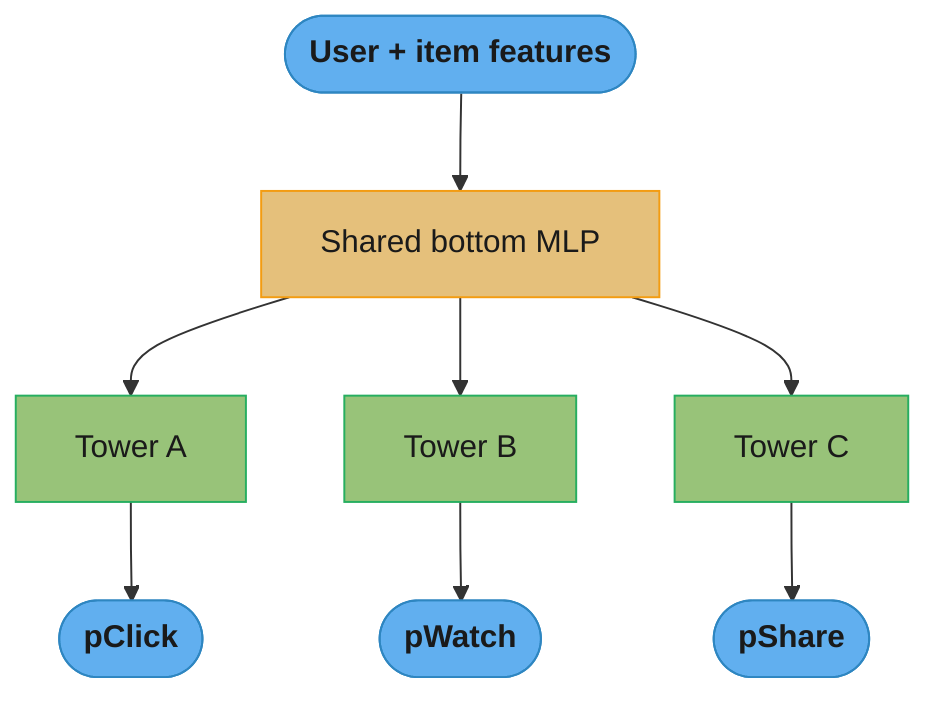
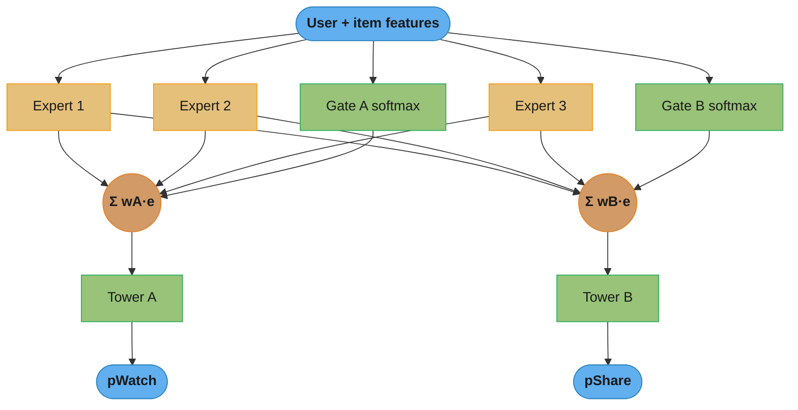
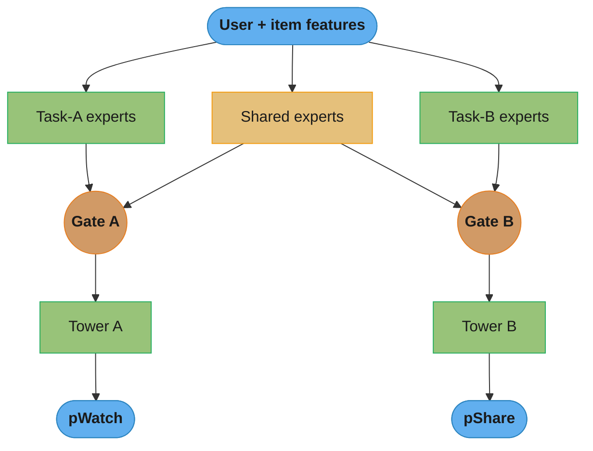
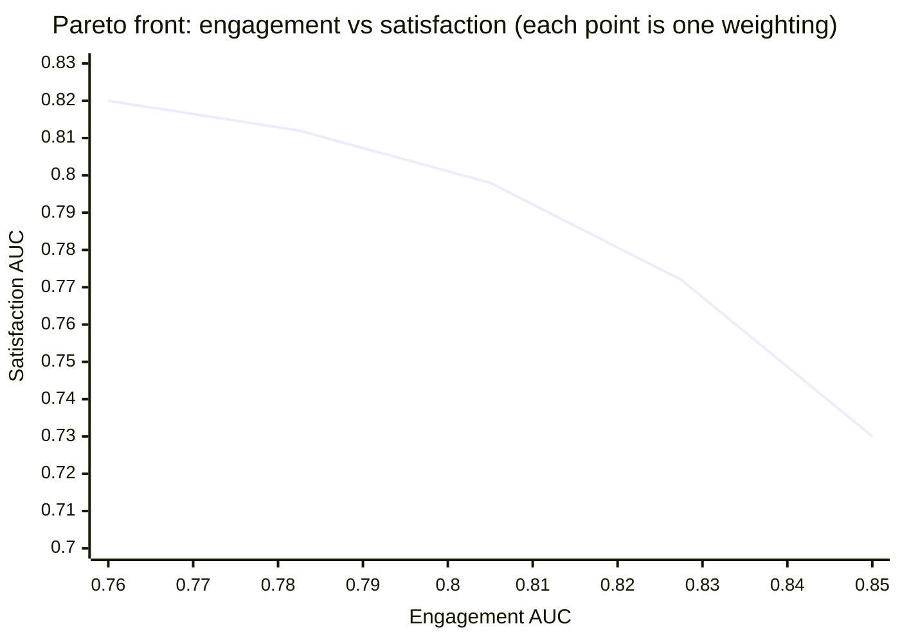
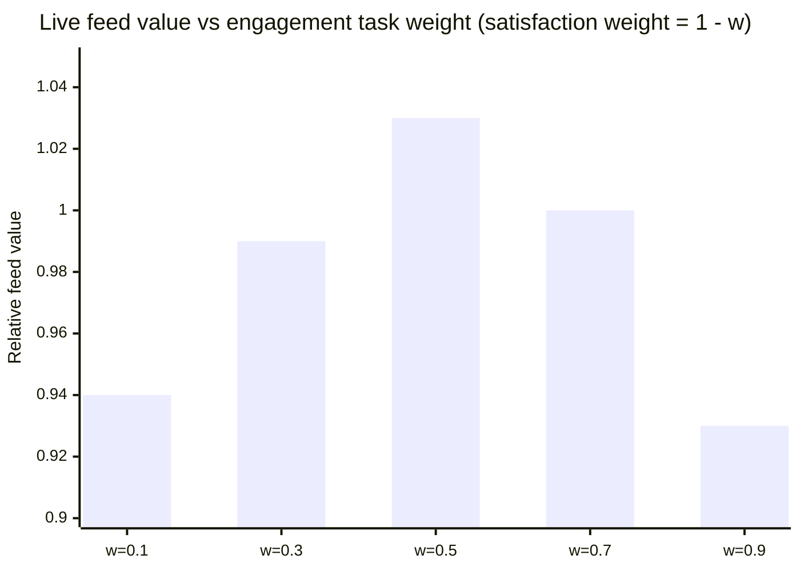
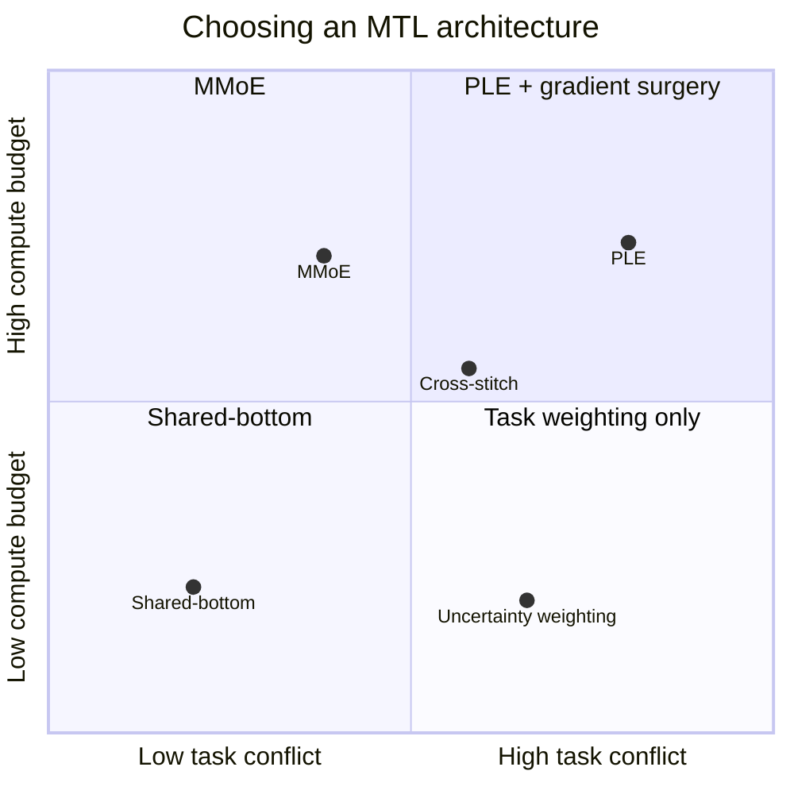

# Multi-Task and Multi-Objective Learning

## 1. Concept Overview

Multi-task learning (MTL) trains a single model to predict several related targets at once — for a feed ranker: probability of click (pCTR), probability of a long watch (pWatch), probability of share (pShare), and probability of a "not interested" report. Instead of one model per task, tasks share a common representation and branch into per-task heads. Multi-objective learning is the deployment-time counterpart: given those per-task predictions, produce a single ranking or decision that trades the objectives off against one another (maximize engagement *without* degrading satisfaction).

The two ideas are usually intertwined in industrial recommender and ads stacks. YouTube's ranker (Zhao et al., "Recommending What Video to Watch Next", RecSys 2019) predicts a bundle of engagement and satisfaction signals with a Multi-gate Mixture-of-Experts (MMoE) backbone, then combines the heads with a hand-tuned weighted formula. Google Ads predicts pCTR and pCVR jointly. Meta's feed ranker predicts a dozen "event" probabilities (like, comment, share, hide, report) and scores each candidate as a weighted product. In all three, MTL supplies the *predictions* and multi-objective scalarization supplies the *ranking*.

Three motivations drive MTL: (1) **shared representations** — features learned for one task help another, so the model captures user intent more robustly; (2) **inductive bias / regularization** — the auxiliary tasks act as a data-dependent prior that constrains the shared trunk and reduces overfitting; (3) **data efficiency** — a task with sparse labels (conversions, reports) borrows statistical strength from a task with dense labels (clicks). The failure mode that makes MTL hard is **negative transfer**: when tasks conflict, jointly training them makes one or more tasks *worse* than a dedicated single-task model. Most of this module is about architectures and optimizers that get the transfer benefit while suppressing negative transfer.

---

## 2. Intuition

**One-line analogy:** MTL is a medical student who studies cardiology, pulmonology, and radiology together — the shared anatomy and physiology transfer, but if you force the same study hours to serve conflicting exam styles, all three grades can drop.

**Mental model:** picture a shared trunk that learns "what this user and this item are about" and several thin heads that each read the trunk to answer a specific question. When the questions agree ("will they click" and "will they watch") the heads pull the trunk in the same direction and everyone wins. When they disagree ("will they engage now" vs "will they be satisfied tomorrow") the heads pull in opposite directions and the trunk is stuck in a compromise that serves neither. Every architecture in this module is a different answer to "how do we let heads disagree without tearing the trunk apart."

**Why it matters:** serving N separate models costs N times the training, N times the feature pipelines, and N times the serving footprint, and it throws away cross-task signal. A single MTL model at 100K QPS that predicts 8 heads in one forward pass is the difference between a feasible and an infeasible ranking system.

**Key insight:** the hard part of MTL is not the architecture — it is the *optimization*. Two things silently sabotage joint training: task losses on different scales (a regression loss of 50.0 drowns a BCE loss of 0.3) and task gradients that point in conflicting directions (their dot product is negative). Loss-weighting methods fix the first; gradient-surgery methods fix the second; MMoE and PLE fix both structurally by giving conflicting tasks partly separate parameters.

---

## 3. Core Principles

**Shared representation with inductive transfer.** The bottom layers are shared so a feature learned for the dense task regularizes the sparse task. Baxter's theory frames the auxiliary tasks as narrowing the hypothesis space: the shared trunk must explain *all* tasks, which rules out representations that would overfit any single one.

**Hard vs soft parameter sharing.** Hard sharing forces tasks to use *the same* trunk weights (shared-bottom, MMoE, PLE). Soft sharing keeps a separate model per task but couples them with a penalty or a learned mixing operator (cross-stitch, sluice networks). Hard sharing is more parameter-efficient and regularizes harder; soft sharing tolerates conflicting tasks better because each task keeps its own parameters.

**Negative transfer and the seesaw effect.** When gradient directions conflict, improving one task degrades another — plotted over training, the two task metrics move like a seesaw. Negative transfer is worst when tasks are weakly related, when their label scales differ, or when one task has far more data and dominates the shared gradient.

**Task balancing is a scale problem *and* a direction problem.** Scale: losses must be normalized so no single task's raw magnitude dominates the shared gradient (uncertainty weighting, GradNorm, DWA). Direction: even equal-magnitude gradients can point apart, so you must resolve the conflict (PCGrad, CAGrad, MGDA).

**Pareto optimality.** With conflicting objectives there is no single best model — there is a *Pareto front* of solutions where you cannot improve one objective without hurting another. Scalarization (a fixed weighted sum) picks one point on the front; multi-objective optimization (MGDA) searches for a Pareto-stationary point where a common descent direction no longer exists.

**Scalarization vs true multi-objective search.** A weighted sum `Σ w_i L_i` is simple, differentiable, and lets product teams dial the tradeoff — but the weights are hyperparameters and a poorly chosen `w` can land off the front. MGDA computes the min-norm point in the convex hull of task gradients, giving a descent direction that decreases *every* task loss simultaneously until no such direction exists.

---

## 4. Types / Architectures / Strategies

**Shared-bottom (Caruana, 1997).** One shared trunk, one head per task. Simplest and most parameter-efficient; suffers most from negative transfer because all tasks are forced through identical trunk weights.

**MMoE — Multi-gate Mixture-of-Experts (Ma et al., KDD 2018).** Replaces the single trunk with a bank of expert sub-networks plus one softmax *gate per task*. Each task's gate learns a task-specific convex combination of experts, so conflicting tasks can route to different experts while still sharing them. Deployed in YouTube ranking. The full production implementation lives in [`../case_studies/design_content_feed_ranking.md`](../case_studies/design_content_feed_ranking.md) — this module summarizes the gating math and does not duplicate the code.

**PLE — Progressive Layered Extraction (Tang et al., RecSys 2020, best paper).** Splits experts into *task-specific* groups and a *shared* group, stacked across multiple extraction levels. A task gate mixes only its own experts plus the shared experts; a shared gate mixes all experts and feeds the next level. This explicit separation is why PLE resists the expert collapse that plagues MMoE when tasks conflict strongly. Deployed in Tencent video recommendation.

**Cross-stitch networks (Misra et al., CVPR 2016).** Soft sharing: keep one network per task and insert learnable "cross-stitch" units that linearly mix the per-task activations layer by layer. The mixing matrix is learned, so the model discovers how much to share at each depth.

**Sub-network routing / sluice networks.** Generalize cross-stitch by learning which layers and which subspaces to share, giving finer control over sharing than a single global switch.

**Loss / task weighting methods.**
- *Uncertainty weighting (Kendall, Gal, Cipolla, CVPR 2018):* learn a per-task homoscedastic noise term and weight each loss by its inverse variance; high-noise tasks are automatically down-weighted.
- *GradNorm (Chen et al., ICML 2018):* dynamically tune task weights so the *gradient magnitudes* at the shared layer are balanced relative to each task's training rate.
- *DWA — Dynamic Weight Averaging (Liu et al., CVPR 2019):* weight tasks by the ratio of consecutive losses, giving more weight to tasks that are improving slowly. Cheaper than GradNorm (no extra backward).

**Gradient surgery methods.**
- *PCGrad (Yu et al., NeurIPS 2020):* when two task gradients conflict (negative dot product), project each onto the normal plane of the other, removing the conflicting component.
- *CAGrad — Conflict-Averse Gradient (Liu et al., NeurIPS 2021):* find an update close to the average gradient while guaranteeing all task losses decrease at least as fast as the worst-case task; provably converges to a Pareto-stationary point.

**Multi-objective optimization.** *Scalarization* fixes weights and minimizes `Σ w_i L_i`. *MGDA (Sener & Koltun, NeurIPS 2018)* finds the min-norm convex combination of gradients, yielding a common descent direction.

**Auxiliary tasks.** Add a task purely to regularize the main one (e.g., predict a self-supervised signal). Helpful when the auxiliary label is cheap, correlated with the main task's structure, and does not dominate the gradient.

---

## 5. Architecture Diagrams

### 5.1 Shared-bottom



One trunk feeds all towers. Cheap and strongly regularizing, but every task shares identical trunk weights, so conflicting tasks fight over them — the origin of the seesaw effect.

### 5.2 MMoE — one gate per task over shared experts



Every expert is shared, but each task's gate picks its own weighted mixture, so the watch gate can lean on long-form experts while the share gate leans on viral experts. This decouples conflicting tasks without paying for separate trunks.

### 5.3 PLE — task-specific plus shared experts (one extraction level)



Task-A experts feed only Gate A, task-B experts feed only Gate B, and shared experts feed both. Because each task owns private capacity, the shared experts are never forced to serve a conflicting task, so they stop collapsing. Stacking several such levels gives the "progressive" extraction.

### 5.4 Pareto front — the tradeoff frontier



The curve is the Pareto front: to gain engagement (move right) you give up satisfaction (move down). Any point strictly below the curve is dominated and should never be shipped; scalarization weights just choose *where* on the curve you sit.

**What the formula is telling you.** "Model P dominates model Q when P is at least as good on *every* objective and strictly better on at least one — and only undominated models deserve a shipping decision."

Dominance is deliberately a *partial* order, not a ranking. Two points on the front are incomparable: no arithmetic can tell you which is better, because that answer lives in product judgment, not in the loss.

| Symbol | What it is |
|--------|------------|
| `(E, S)` | One trained model as a pair: engagement AUC and satisfaction AUC |
| `P ≻ Q` | "P dominates Q" — `E_P ≥ E_Q` and `S_P ≥ S_Q`, with at least one strict |
| Pareto front | The set of points nothing dominates — the curve itself |
| Dominated point | Sits below the curve; some front point beats it on both axes at once |
| `w` | The scalarization weight; it picks *which* front point you land on, not whether you are on it |
| Exchange rate | Satisfaction AUC given up per point of engagement AUC gained, along a segment |

**Walk one example.** The five plotted models, plus one candidate that must be rejected:

```
  model   engagement E   satisfaction S     status
    A        0.7600          0.820          on the front
    B        0.7825          0.812          on the front
    C        0.8050          0.798          on the front
    D        0.8275          0.772          on the front
    E        0.8500          0.730          on the front

    Q        0.8050          0.780          DOMINATED

  Test Q against C:  E: 0.8050 >= 0.8050  (tie, C not worse)
                     S: 0.7980 >  0.7800  (C strictly better)
                     -> C dominates Q. Q is never the right ship, at any w.

  Test B against D:  E: 0.7825 <  0.8275  (D better here)
                     S: 0.8120 >  0.7720  (B better here)
                     -> neither dominates. Both are legitimate products.
```

The front is not a straight line, and that is the whole planning signal. Walk it segment by segment:

```
  segment    engagement gained   satisfaction paid   exchange rate
   B -> C         0.0225              0.0140            0.62
   D -> E         0.0225              0.0420            1.87

  Same engagement gain both times; the price triples at the right-hand end.
```

Early on you buy engagement cheaply — 0.62 points of satisfaction per point of engagement. Out past D you pay 1.87, three times as much, for the identical gain. That steepening is why "just turn engagement up" stops being a good trade well before the front runs out, and it is the measured version of the sensitivity curve in §5.5.

### 5.5 Task-weight sensitivity — combined feed value peaks off the extremes



Pure engagement (w=0.9) and pure satisfaction (w=0.1) both underperform; the best long-term feed value sits near a balanced weighting. This is why the scalarization weights are A/B-tuned, not guessed.

### 5.6 Choosing an MTL architecture



Related tasks on a tight budget: shared-bottom. Loosely related tasks with room to grow: MMoE. Strongly conflicting tasks: PLE, ideally with PCGrad/CAGrad on top.

---

## 6. How It Works — Detailed Mechanics

### 6.1 Shared-bottom baseline

```python
from __future__ import annotations

import random

import torch
import torch.nn as nn
import torch.nn.functional as F


class SharedBottom(nn.Module):
    """Classic hard-parameter-sharing MTL: one trunk, one head per task."""

    def __init__(self, d_in: int, d_model: int = 256, n_tasks: int = 3) -> None:
        super().__init__()
        self.trunk = nn.Sequential(
            nn.Linear(d_in, d_model),
            nn.ReLU(),
            nn.Linear(d_model, d_model),
            nn.ReLU(),
        )
        self.heads = nn.ModuleList(
            [nn.Linear(d_model, 1) for _ in range(n_tasks)]
        )

    def forward(self, x: torch.Tensor) -> list[torch.Tensor]:
        h = self.trunk(x)
        return [head(h).squeeze(-1) for head in self.heads]  # raw logits per task
```

The seesaw shows up here: `trunk` weights receive the summed gradient of all heads, so a large-magnitude or high-data task steers the shared representation.

### 6.2 MMoE gating math (summary — full code is cross-linked)

For task `k`, MMoE computes a per-task softmax gate over `n` shared experts and mixes their outputs:

```
g^k(x) = softmax(W_g^k · x)         # (n,) gate weights, one vector per task
y^k    = h^k( Σ_{i=1}^{n} g^k(x)_i · f_i(x) )
```

where `f_i` is expert `i`, `h^k` is task `k`'s tower, and `W_g^k` is the task-specific gate. Because each task has its own `W_g^k`, conflicting tasks select different expert mixtures from the *same* expert pool. The production MMoE (8 experts, 3 tasks, joint BCE+MSE training, the seesaw discussion, and the expert-diversity fix) is implemented in [`../case_studies/design_content_feed_ranking.md`](../case_studies/design_content_feed_ranking.md) — refer there rather than duplicating it.

### 6.3 PLE — Customized Gating Control (net-new implementation)

```python
class Expert(nn.Module):
    def __init__(self, d_in: int, d_hidden: int, d_out: int) -> None:
        super().__init__()
        self.net = nn.Sequential(
            nn.Linear(d_in, d_hidden),
            nn.ReLU(),
            nn.Linear(d_hidden, d_out),
            nn.ReLU(),
        )

    def forward(self, x: torch.Tensor) -> torch.Tensor:
        return self.net(x)


class CGC(nn.Module):
    """One Customized Gating Control level of PLE.

    T task-specific expert groups + 1 shared group.
    Each task gate mixes (its own experts + shared experts).
    The shared gate mixes ALL experts and produces the shared input for
    the next level (this is the "progressive" part). d_in == d_out so
    levels can be stacked.
    """

    def __init__(
        self,
        n_tasks: int,
        d_model: int,
        d_hidden: int = 128,
        n_task_experts: int = 1,
        n_shared_experts: int = 2,
        is_last: bool = False,
    ) -> None:
        super().__init__()
        self.n_tasks = n_tasks
        self.is_last = is_last
        self.task_experts = nn.ModuleList(
            [
                nn.ModuleList(
                    [Expert(d_model, d_hidden, d_model) for _ in range(n_task_experts)]
                )
                for _ in range(n_tasks)
            ]
        )
        self.shared_experts = nn.ModuleList(
            [Expert(d_model, d_hidden, d_model) for _ in range(n_shared_experts)]
        )
        self.task_gates = nn.ModuleList(
            [nn.Linear(d_model, n_task_experts + n_shared_experts) for _ in range(n_tasks)]
        )
        if not is_last:
            total = n_tasks * n_task_experts + n_shared_experts
            self.shared_gate = nn.Linear(d_model, total)

    def forward(
        self, task_inputs: list[torch.Tensor], shared_input: torch.Tensor
    ) -> tuple[list[torch.Tensor], torch.Tensor | None]:
        shared_out = [e(shared_input) for e in self.shared_experts]  # each (B, d)
        task_outs: list[torch.Tensor] = []
        all_task_expert_outs: list[torch.Tensor] = []
        for k in range(self.n_tasks):
            own = [e(task_inputs[k]) for e in self.task_experts[k]]
            all_task_expert_outs.extend(own)
            experts_k = torch.stack(own + shared_out, dim=1)       # (B, E_k, d)
            g = torch.softmax(self.task_gates[k](task_inputs[k]), dim=-1).unsqueeze(-1)
            task_outs.append((experts_k * g).sum(dim=1))           # (B, d)
        if self.is_last:
            return task_outs, None
        all_experts = torch.stack(all_task_expert_outs + shared_out, dim=1)  # (B, E_all, d)
        gs = torch.softmax(self.shared_gate(shared_input), dim=-1).unsqueeze(-1)
        shared_next = (all_experts * gs).sum(dim=1)
        return task_outs, shared_next


class PLE(nn.Module):
    def __init__(self, n_tasks: int, d_in: int, d_model: int = 128, n_levels: int = 2) -> None:
        super().__init__()
        self.n_tasks = n_tasks
        self.input_proj = nn.Sequential(nn.Linear(d_in, d_model), nn.ReLU())
        self.levels = nn.ModuleList(
            [CGC(n_tasks, d_model, is_last=(i == n_levels - 1)) for i in range(n_levels)]
        )
        self.towers = nn.ModuleList(
            [nn.Sequential(nn.Linear(d_model, 32), nn.ReLU(), nn.Linear(32, 1)) for _ in range(n_tasks)]
        )

    def forward(self, x: torch.Tensor) -> list[torch.Tensor]:
        h = self.input_proj(x)
        task_in = [h for _ in range(self.n_tasks)]
        shared_in = h
        for lvl in self.levels:
            task_in, shared_in = lvl(task_in, shared_in)  # type: ignore[assignment]
        return [self.towers[k](task_in[k]).squeeze(-1) for k in range(self.n_tasks)]
```

The key structural win over MMoE: a task's private experts receive gradient *only* from that task, so they can never be hijacked by a conflicting task, and the shared experts are protected by their own gate.

### 6.4 Cross-stitch (soft sharing)

```python
class CrossStitch(nn.Module):
    """Learnable linear mixing of per-task activations at a given layer."""

    def __init__(self, n_tasks: int) -> None:
        super().__init__()
        # Init near identity: keep 0.8 of own activation, spread 0.2 across others.
        alpha = torch.eye(n_tasks) * 0.8 + (0.2 / n_tasks)
        self.alpha = nn.Parameter(alpha)

    def forward(self, acts: list[torch.Tensor]) -> list[torch.Tensor]:
        stacked = torch.stack(acts, dim=0)                 # (T, B, d)
        mixed = torch.einsum("ts,sbd->tbd", self.alpha, stacked)
        return [mixed[i] for i in range(len(acts))]
```

The learned `alpha` matrix reveals how much sharing each task wants: near-identity means tasks stay independent, dense means they share heavily.

### 6.5 Uncertainty weighting (net-new: formula + the log-variance trick)

Kendall & Gal weight each task by its learned homoscedastic uncertainty `σ_i`. For a task, the negative log-likelihood contributes `L_i / (2σ_i²) + log σ_i`. Parameterize `s_i = log σ_i²` for numerical stability (so `σ_i²` stays positive without a constraint):

```
total_loss = Σ_i [ exp(-s_i) · L_i  +  s_i ]      # regression form drops the ½ for brevity
```

**In plain terms.** "Let each task announce how noisy it thinks it is, trust the quiet tasks more than the noisy ones — and charge every task a fee for claiming to be noisy, so none of them can lie its way out of the loss."

The whole design is that fee. Without it the model has a free lever to silence any task it finds hard; with it, claiming noise costs you `s_i` directly, so the optimizer only down-weights a task when the loss savings actually exceed the fee.

| Symbol | What it is |
|--------|------------|
| `L_i` | Task `i`'s raw loss this step, in whatever units that task naturally has |
| `σ_i²` | Task `i`'s learned homoscedastic noise — how unpredictable the task is in principle |
| `s_i` | `log σ_i²`, the thing actually stored as a parameter. Free to be any real number |
| `exp(-s_i)` | The precision, `1/σ_i²`. This is the task's effective loss weight, always positive |
| `+ s_i` | The fee. Grows as the task claims more noise, cancelling the gain from shrinking precision |
| `Σ_i` | Sum over tasks; each task contributes one weighted loss plus one fee |

**Walk one example.** Two tasks with wildly mismatched units — a regression loss of `50.0` and a BCE loss of `0.3`, the exact mismatch §12 warns about:

```
  naive sum:  50.0 + 0.3 = 50.3
              regression share = 99.4%      BCE share = 0.6%
              -> the trunk optimizes the regression task and ignores the other

  learned:    s_regression = +4.0     s_bce = -1.0

              precision_reg = exp(-4.0)  = 0.0183
              precision_bce = exp(+1.0)  = 2.7183

              weighted_reg = 0.0183 x 50.0 = 0.9158
              weighted_bce = 2.7183 x  0.3 = 0.8155
              -> shares are now 52.9% and 47.1%. Both tasks are heard.

  total = (0.9158 + 4.0) + (0.8155 - 1.0) = 4.7313
                    ^fee                ^fee (negative: low noise earns a rebate)
```

A 166:1 magnitude gap collapses to 1.12:1 without anyone hand-tuning a weight. Note the BCE fee is *negative* — a task that credibly claims low noise is rewarded, which is what pulls confident tasks up rather than merely pushing loud ones down.

**What breaks without the fee.** Drop `+ s_i` and the minimum is at `s_i → +∞` for every task at once: precision goes to zero, the weighted loss goes to zero, and the reported total loss looks perfect while the trunk has learned nothing. Pushing `s_reg` from `4.0` to `10.0` alone would cut the weighted regression term from `0.9158` to `0.0023` — a 99.7% "improvement" bought purely by ignoring the task.

```python
class UncertaintyWeightedLoss(nn.Module):
    """Kendall & Gal (CVPR 2018) homoscedastic uncertainty weighting."""

    def __init__(self, n_tasks: int) -> None:
        super().__init__()
        self.log_var = nn.Parameter(torch.zeros(n_tasks))  # s_i = log(sigma_i^2), init 0 -> sigma^2 = 1

    def forward(self, losses: torch.Tensor) -> torch.Tensor:
        precision = torch.exp(-self.log_var)               # 1 / sigma_i^2
        return (precision * losses + self.log_var).sum()   # the +log_var term is essential
```

**Broken → fix.** If you keep the `precision * loss` term but drop the `+ log_var` regularizer, the optimizer discovers a trivial escape: push every `s_i → +∞` so `precision → 0` and the whole loss collapses to zero without learning anything — all tasks are silently "turned off."

```python
# BROKEN: no regularizer -> log_var runs away to +inf, precision -> 0, tasks ignored
def broken(losses: torch.Tensor, log_var: torch.Tensor) -> torch.Tensor:
    return (torch.exp(-log_var) * losses).sum()            # minimized by sigma -> inf

# FIXED: the +log_var term penalizes large sigma, so each task keeps a finite weight
def fixed(losses: torch.Tensor, log_var: torch.Tensor) -> torch.Tensor:
    return (torch.exp(-log_var) * losses + log_var).sum()
```

The `+ log σ` term is the entropy of the Gaussian likelihood; it is the leash that stops the model from down-weighting every task to nothing.

### 6.6 DWA — Dynamic Weight Averaging

```python
def dwa_weights(
    prev: list[float], prev2: list[float], temperature: float = 2.0
) -> list[float]:
    """Weight tasks by the ratio of the last two losses; slow-improving tasks get more weight."""
    n = len(prev)
    ratios = [p / (p2 + 1e-8) for p, p2 in zip(prev, prev2)]
    exps = [pow(2.718281828, r / temperature) for r in ratios]
    denom = sum(exps)
    return [n * e / denom for e in exps]  # weights sum to n (mean weight 1)
```

DWA is nearly free — no extra backward pass — which is why it is popular when GradNorm's second backward is too expensive.

**Read it like this.** "Compare each task's last two losses. Whichever task is improving *slowest* is the one being neglected, so give it the larger share of the next update."

DWA never looks at gradients or at loss magnitudes — only at each task's own rate of change against its own history. That is why it is immune to the units mismatch that wrecks a naive sum, and why it costs nothing.

| Symbol | What it is |
|--------|------------|
| `prev`, `prev2` | Task losses at the last two epochs. `prev` is the more recent one |
| `r_i` | `prev_i / prev2_i`, the improvement ratio. `< 1` = improving; `≈ 1` = stalled |
| `temperature` | Flattens the spread. Large `T` pushes all weights toward `1.0`; `T = 2.0` is standard |
| `exp(r_i / T)` | Turns each ratio into an unnormalized weight. Bigger `r` (slower progress) wins more |
| `n × e / denom` | Softmax rescaled so the weights sum to `n`, not `1` — mean weight stays `1.0` |

**Walk one example.** Two tasks, `T = 2.0`, where task 1 is improving briskly and task 2 has nearly stalled:

```
                 prev2     prev      ratio r = prev/prev2
   task 1        0.60      0.50            0.8333   improving fast
   task 2        0.31      0.30            0.9677   nearly stalled

   exp(0.8333 / 2) = exp(0.4167) = 1.5169
   exp(0.9677 / 2) = exp(0.4839) = 1.6223
   denom = 1.5169 + 1.6223       = 3.1392

   w_1 = 2 x 1.5169 / 3.1392 = 0.9664     <- fast task, throttled slightly
   w_2 = 2 x 1.6223 / 3.1392 = 1.0336     <- stalled task, boosted slightly
   w_1 + w_2 = 2.0000                      <- always n, by construction
```

The correction is gentle by design: `0.9664` vs `1.0336` is a 7% relative nudge, not a takeover. That is deliberate — DWA steers, it does not steer hard, because loss ratios are noisy epoch to epoch and an aggressive response oscillates. Raising `T` damps it further; lowering `T` toward `0.5` would widen the same two ratios into a much sharper split.

**Why the `n ×` rescale exists.** Without it the weights would be a plain softmax summing to `1.0`, so adding a third task would silently shrink every existing task's weight by a third and change the effective learning rate. Normalizing to `n` keeps mean weight at `1.0` no matter how many tasks you add, so your LR schedule survives adding a task.

### 6.7 PCGrad — gradient surgery (net-new)

```python
def pcgrad(grads: list[torch.Tensor]) -> torch.Tensor:
    """Project each task gradient off any conflicting task gradient (Yu et al., 2020).

    grads: list of per-task flattened gradient vectors (same shape).
    Returns the deconflicted, summed update direction.
    """
    projected = [g.clone() for g in grads]
    n = len(grads)
    for i in range(n):
        order = list(range(n))
        random.shuffle(order)                       # random order avoids bias toward task 0
        for j in order:
            if i == j:
                continue
            g_j = grads[j]
            dot = torch.dot(projected[i], g_j)
            if dot < 0:                             # conflict: gradients point apart
                projected[i] = projected[i] - (dot / (g_j.dot(g_j) + 1e-12)) * g_j
    return torch.stack(projected, dim=0).sum(dim=0)
```

Geometry: if task `i`'s gradient has a component pointing *against* task `j`'s gradient, PCGrad subtracts exactly that component, keeping only the part of `g_i` that does not hurt `j`. When gradients already agree (`dot ≥ 0`) it does nothing. CAGrad refines this idea: instead of pure projection it solves for the update closest to the average gradient subject to the worst-case task still decreasing — provably reaching a Pareto-stationary point.

**Stated plainly.** "Before adding two task gradients together, check whether they are pulling against each other. If they are, shave off exactly the part of each that fights the other, then add what remains."

The dot product is doing double duty here: its *sign* is the conflict detector, and its *magnitude* is how much to remove. One quantity answers both questions, which is why PCGrad is four lines of arithmetic.

| Symbol | What it is |
|--------|------------|
| `g_i`, `g_j` | Task `i` and task `j`'s gradients at the shared layer, flattened to one long vector each |
| `dot = g_i · g_j` | Conflict test. Negative = the tasks disagree; zero or positive = no surgery needed |
| `cos = dot / (‖g_i‖‖g_j‖)` | The same test, normalized to `[-1, 1]`. This is the number you log to diagnose negative transfer |
| `g_j · g_j` | `‖g_j‖²`, the squared length. Divides out `g_j`'s scale so only its *direction* is removed |
| `(dot / ‖g_j‖²) · g_j` | The offending component: exactly the part of `g_i` lying along `g_j` |
| `projected[i]` | `g_i` with that component subtracted — now perpendicular to `g_j`, harmless to it |

**Walk one example.** Two tasks pointing 135 degrees apart, in 2-D so the geometry is visible:

```
   g_1 = ( 3, -1)        ||g_1||^2 = 10
   g_2 = (-2,  4)        ||g_2||^2 = 20

   dot = (3)(-2) + (-1)(4) = -6 - 4 = -10          <- negative: CONFLICT
   cos = -10 / (3.162 x 4.472) = -0.707            <- 135 degrees apart

   project g_1 off g_2:  g_1 - (-10 / 20) x g_2
                       = (3, -1) + 0.5 x (-2, 4)
                       = (2, 1)        check: (2,1) . (-2,4) = -4 + 4 = 0  ok

   project g_2 off g_1:  g_2 - (-10 / 10) x g_1
                       = (-2, 4) + 1.0 x (3, -1)
                       = (1, 3)        check: (1,3) . (3,-1) = 3 - 3 = 0   ok
```

Now compare what each update actually delivers. A task's loss falls when the update direction has a positive dot product with that task's gradient:

```
                    update vector    . g_1     . g_2
   naive sum          (1, 3)          0.0      10.0
   PCGrad sum         (3, 4)          5.0      10.0
```

The naive sum scores **exactly zero** against task 1 — the two gradients cancel task 1's component completely, so that task makes no progress at all while task 2 races ahead. This is the seesaw, visible in four numbers. PCGrad's sum gives task 1 a `+5.0` while costing task 2 nothing (`10.0` either way). The conflicting parts were removed; the agreeing parts were kept.

**Why the random shuffle in the loop.** Projections do not commute: projecting `g_1` off `g_2` and *then* off `g_3` gives a different vector than the reverse order. Fixing the order would systematically privilege whichever task the loop hits first, so task 0 would quietly become the dominant objective. Shuffling makes the bias average out across steps instead of compounding.

**The number to log.** That `cos = -0.707` is the production diagnostic named in §10 and §13. Log per-task gradient cosine at the shared layer every few hundred steps: hovering near zero means the tasks are simply unrelated and sharing buys little; persistently negative is the fingerprint of negative transfer and your cue to reach for separate capacity or gradient surgery.

### 6.8 MGDA — min-norm common descent direction

```python
def mgda_two_task(g1: torch.Tensor, g2: torch.Tensor) -> tuple[float, float]:
    """Closed-form min-norm point in the convex hull of {g1, g2} (Sener & Koltun).

    Returns (w1, w2): the update w1*g1 + w2*g2 decreases both losses if one exists.
    """
    diff = g1 - g2
    denom = torch.dot(diff, diff) + 1e-12
    w1 = float((torch.dot(g2 - g1, g2) / denom).clamp(0.0, 1.0))
    return w1, 1.0 - w1
```

For more than two tasks, Sener & Koltun solve the same min-norm quadratic program with Frank-Wolfe. When the min-norm is zero, no common descent direction exists — the model is Pareto-stationary and you have reached the front.

**The idea behind it.** "Among all the blends of the task gradients you could take, pick the *shortest* one — because the shortest blend is the one direction that still manages to help every task at once."

The counter-intuitive part is minimizing the norm. You are not looking for the biggest step; you are looking for the blend where the tasks cancel each other the most, because whatever survives that cancellation is the component they genuinely agree on.

| Symbol | What it is |
|--------|------------|
| `g1`, `g2` | The two task gradients, flattened |
| `w1`, `w2` | Blend weights, both in `[0, 1]` and summing to `1` — a convex combination |
| `diff = g1 - g2` | The line segment joining the two gradient tips; the search happens along it |
| `denom = ‖g1 - g2‖²` | Squared length of that segment. Normalizes the projection onto it |
| `.clamp(0, 1)` | Keeps the answer inside the segment; if the foot of the perpendicular falls outside, the nearest endpoint wins |
| `w1·g1 + w2·g2` | The min-norm point — the common descent direction, if one exists |

**Walk one example.** The same conflicting pair from §6.7, so you can compare the two remedies directly:

```
   g1 = ( 3, -1)     g2 = (-2, 4)

   diff  = g1 - g2 = (5, -5)          denom = 25 + 25 = 50
   g2-g1 = (-5, 5)
   num   = (g2 - g1) . g2 = (-5)(-2) + (5)(4) = 10 + 20 = 30

   w1 = clamp(30 / 50, 0, 1) = 0.6        w2 = 1 - 0.6 = 0.4

   d = 0.6 x (3, -1) + 0.4 x (-2, 4)
     = (1.8 - 0.8, -0.6 + 1.6)
     = (1.0, 1.0)          ||d|| = 1.414   <- shorter than either gradient

   d . g1 = (1)(3) + (1)(-1) = 2   > 0     task 1 improves
   d . g2 = (1)(-2) + (1)(4)  = 2   > 0     task 2 improves
```

Both dot products are positive, so this single step lowers *both* losses — that is the guarantee PCGrad does not give you. Note `‖d‖ = 1.414` against `‖g1‖ = 3.162` and `‖g2‖ = 4.472`: the min-norm direction is less than half the length of either input, and the shrinkage is the price of insisting nobody gets hurt.

**Why zero norm means you have arrived.** As the model approaches the Pareto front the gradients rotate toward pointing directly opposite each other. At exactly 180 degrees with matched magnitudes, the min-norm point is the origin, `‖d‖ = 0`, and there is no direction left that helps both. That is Pareto-stationarity, and in practice a min-norm that decays toward zero is your convergence signal — training further only slides you *along* the front, trading one task for another, never improving both.

### 6.9 Multi-objective ranking — combining heads online

```python
def rank_score(preds: dict[str, torch.Tensor], weights: dict[str, float]) -> torch.Tensor:
    """Multiplicative scalarization used in feed ranking (Meta / YouTube style).

    Negative weights penalize bad events (report, hide); positive weights reward
    good ones (watch, share). Multiplicative form makes any one very-bad signal
    veto the item.
    """
    score = torch.ones_like(next(iter(preds.values())))
    for name, p in preds.items():
        score = score * p.clamp(1e-6, 1.0) ** weights[name]
    return score


# Example: watch and share help, report hurts.
weights = {"pWatch": 1.0, "pShare": 0.5, "pReport": -2.0}
```

**What it means.** "Multiply the head predictions together, each raised to a power that says how much that signal matters — so a near-zero probability on a heavily-penalized head drags the whole score down no matter how good everything else looks."

Multiplicative beats additive here precisely because a sum lets a strong watch prediction paper over a bad report prediction. A product cannot: one terrible factor poisons the whole thing, which is exactly the veto behavior a feed needs.

| Symbol | What it is |
|--------|------------|
| `p_name` | One head's predicted probability for this item, in `(0, 1]` |
| `weights[name]` | The exponent for that head. Positive = reward, negative = penalize, magnitude = how much |
| `p ** w` | Exponentiation, not multiplication. `w = 1` keeps `p` as is; `w = 0.5` softens it; `w < 0` inverts it |
| `clamp(1e-6, 1.0)` | Floor that stops a predicted `0.0` from making the whole score `0` or `inf` |
| `score` | The running product across all heads — the number the feed actually sorts by |

**Walk one example.** Two candidate items under `pWatch = 1.0`, `pShare = 0.5`, `pReport = -2.0`:

```
   item     pWatch   pShare   pReport
     A       0.40     0.10     0.001     rarely reported
     B       0.60     0.20     0.050     reported 50x more often

   item A:  0.40 ** 1.0  = 0.400
            0.10 ** 0.5  = 0.316
            0.001 ** -2  = 1,000,000
            score = 0.400 x 0.316 x 1,000,000 = 126,491

   item B:  0.60 ** 1.0  = 0.600
            0.20 ** 0.5  = 0.447
            0.050 ** -2  = 400
            score = 0.600 x 0.447 x 400 = 107
```

Item B is better on *both* positive signals — 50% more watch, twice the share rate — and still loses by a factor of roughly 1,180. The 50x difference in report probability, squared by the `-2.0` exponent, becomes a 2,500x swing that nothing on the positive side can overcome. That is the veto working as designed.

**Why the exponents are read as a log-linear score.** Take logs and the product becomes `Σ w_i · log p_i` — a plain weighted sum in log space, which is why the exponents behave like linear weights and why teams tune them on a log scale. It is also why `pShare = 0.5` means "half the influence of pWatch per log-unit," not "half the probability."

**What breaks without the clamp.** A head that outputs an exact `0.0` under a negative exponent gives `0.0 ** -2 = inf`, and the item rockets to the top of the feed — the worst possible content winning because a model was maximally certain it was bad. `clamp(1e-6, 1.0)` caps that at `1e12` instead of infinity, keeping the score finite and sortable.

Critically, these combination weights are **not** learned by SGD — the true objective (long-term retention) is not differentiable from a single batch. They are tuned by online A/B tests or Bayesian optimization over live metrics, which is why the task-weight sensitivity curve (§5.5) is measured, not assumed.

---

## 7. Real-World Examples

**YouTube — MMoE for watch-time + engagement + satisfaction (Zhao et al., RecSys 2019).** The "Recommending What Video to Watch Next" ranker predicts a bundle of engagement objectives (clicks, watch time) and satisfaction objectives (likes, dismissals, survey responses) with an MMoE shared over ~8 experts. A separate weighted-combination layer, tuned online, fuses the heads. MMoE beat shared-bottom precisely because engagement and satisfaction gradients conflict — MMoE let each objective route to its own experts. YouTube also added a shallow tower to correct for position bias as an auxiliary task.

**Google Ads — joint pCTR/pCVR.** Ads systems predict click probability and conversion probability jointly. Conversions are far sparser than clicks, so MTL lets the dense click task regularize and share representation with the sparse conversion task, improving pCVR calibration. Alibaba's ESMM (Entire Space Multi-Task Model, 2018) is a well-documented variant that models `pCTCVR = pCTR × pCVR` over the entire impression space to fix conversion-sample selection bias.

**Meta — feed ranking as a dozen event predictions.** Meta's feed ranker predicts many "event" probabilities per candidate (like, comment, share, hide, report, meaningful-interaction) with a shared multi-task backbone, then computes a value score as a weighted product of those probabilities. Negative-signal heads (hide, report) carry negative weights so the objective jointly maximizes positive engagement and *minimizes* dissatisfaction — the canonical multi-objective ranking setup.

**Tencent — PLE in video recommendation (RecSys 2020 best paper).** PLE was introduced to fix the MMoE seesaw on Tencent's video platform, where VCR (view completion ratio) and VTR (view-through rate) conflict. Task-specific expert groups gave each objective private capacity; the reported result was that PLE improved *both* conflicting tasks simultaneously where MMoE improved one at the other's expense.

**Autonomous driving perception.** Kendall & Gal's uncertainty weighting was demonstrated on a single network jointly predicting semantic segmentation, instance segmentation, and depth — three losses on wildly different scales — where learned per-task uncertainty removed the need to hand-tune loss weights.

---

## 8. Tradeoffs

### 8.1 Shared-bottom vs MMoE vs PLE

| Dimension | Shared-bottom | MMoE | PLE |
|-----------|---------------|------|-----|
| Sharing style | Full hard sharing | Soft, gated over shared experts | Task-specific + shared experts |
| Params vs shared-bottom | 1× (baseline) | ~1.5–3× (expert bank + gates) | ~2–4× (private + shared experts) |
| Negative transfer resistance | Low | Medium | High |
| Expert collapse risk | N/A | Medium–high (experts can degenerate) | Low (private experts protected) |
| Serving cost | Lowest | Medium (all experts run) | Higher (more experts run) |
| Best when | Tasks tightly related, tight budget | Loosely related tasks | Strongly conflicting tasks |
| Tuning burden | Low | Medium (expert count, gate) | Higher (experts per task + levels) |

### 8.2 Task-weighting methods

| Method | Fixes | Extra cost | Notes |
|--------|-------|-----------|-------|
| Fixed weights | Scale | None | Simple; weights are hyperparameters, often A/B-tuned |
| Uncertainty weighting | Scale | 1 param/task | Learns weights; needs the `+log σ` regularizer |
| GradNorm | Scale + rate | 1 extra backward | Balances gradient magnitudes; more expensive |
| DWA | Rate | None | Cheap; only looks at loss ratios, ignores gradients |
| PCGrad | Direction (conflict) | 1 backward/task | Projects away conflicting components |
| CAGrad | Direction (conflict) | 1 backward/task + QP | Pareto-stationary guarantee; hyperparameter `c` |

### 8.3 Scalarization vs MGDA

| Aspect | Scalarization (weighted sum) | MGDA (multi-objective) |
|--------|------------------------------|------------------------|
| Output | One point on the Pareto front | A Pareto-stationary point |
| Weights | Fixed hyperparameters | Solved per step from gradients |
| Product control | Direct (dial the weights) | Indirect |
| Cost | Cheap | Per-task gradients + min-norm QP |
| Prefer when | You know the business tradeoff | Tasks conflict and the tradeoff is unknown |

---

## 9. When to Use / When NOT to Use

**Use MTL when:**
- Tasks are related and share input features (feed events, pCTR/pCVR, perception heads).
- One task has sparse labels and can borrow strength from a dense task.
- Serving budget forbids N separate models at high QPS.
- You genuinely need multiple predictions per item for downstream multi-objective ranking.

**Prefer MMoE / PLE over shared-bottom when:**
- You observe a seesaw between tasks in offline metrics.
- Tasks are only loosely related (MMoE) or strongly conflicting (PLE).

**Add gradient surgery (PCGrad/CAGrad) when:**
- Measured cosine similarity between task gradients is frequently negative.
- Loss-weighting alone did not remove negative transfer.

**Do NOT use MTL when:**
- Tasks are unrelated — you get negative transfer with no upside; train separate models.
- One task massively dominates in data and importance — a single-task model plus a cheap auxiliary may be simpler.
- Latency budget cannot absorb the extra experts (PLE/MMoE run every expert per request).
- You have only one objective — multi-objective machinery is pure overhead.

---

## 10. Common Pitfalls

**Pitfall 1 — MMoE expert collapse (broken → fix).** In a jointly trained engagement/dwell/quality ranker, a labeling bug dropped 40% of quality labels; two of eight shared experts degenerated to near-constant outputs specializing only on engagement, so the quality gate produced flat scores and low-quality bait flooded the feed (report rate +22% over two weeks). Detection: track per-expert output variance on a fixed diagnostic batch — collapsed experts show variance below ~1e-3. Fix: add an expert-diversity auxiliary loss (penalize low output variance, weight ~0.01), restore quality labels, and move expert-utilization monitoring from weekly to every training run. This exact incident is documented in [`../case_studies/design_content_feed_ranking.md`](../case_studies/design_content_feed_ranking.md).

**Pitfall 2 — Task loss scale mismatch.** A regression loss (dwell seconds, magnitude ~50) summed with a BCE loss (magnitude ~0.3) means the shared trunk is 99% optimizing dwell and ignoring clicks. The click AUC looks broken for no obvious reason. Fix: normalize losses (standardize the regression target, or use uncertainty weighting / GradNorm) before summing — never sum raw losses of different units.

**Pitfall 3 — Negative transfer mistaken for a bad architecture.** Teams add a weakly related auxiliary task, both metrics drop, and they blame the model. The real cause is that the tasks conflict. Diagnose by logging the cosine similarity of per-task gradients at the shared layer; persistently negative cosine is the fingerprint of negative transfer. Fix: separate capacity (MMoE/PLE) or apply PCGrad, or drop the auxiliary task.

**Pitfall 4 — Uncertainty weights running away.** Omitting the `+log σ` term (Pitfall in §6.5) lets the optimizer zero out all task weights. Symptom: all task losses plateau high while `log_var` climbs monotonically. Always keep the regularizer and log `log_var` values during training.

**Pitfall 5 — Deterministic PCGrad projection order.** Projecting task gradients in a fixed order (always task 0 first) biases the update toward the last-projected task. Fix: shuffle the projection order each step (as in the code above); this is what the PCGrad paper specifies.

**Pitfall 6 — Learning the ranking-combination weights with SGD.** The final multi-objective weights (how much a share is worth vs a report) cannot be learned from batch loss because the real objective is long-term retention, which is non-differentiable per batch. Teams that backprop into these weights overfit to short-term engagement and degrade retention. Fix: tune combination weights via online A/B or Bayesian optimization on live north-star metrics.

**Pitfall 7 — Ignoring per-task calibration after joint training.** Shared representation can leave individual heads miscalibrated even when AUC is fine, which breaks the multiplicative ranking score. Fix: calibrate each head (Platt/isotonic) post-hoc — see [`../case_studies/cross_cutting/model_calibration_and_thresholding.md`](../case_studies/cross_cutting/model_calibration_and_thresholding.md).

---

## 11. Technologies & Tools

| Tool | Use Case |
|------|----------|
| PyTorch | Custom MMoE / PLE / cross-stitch, gradient surgery, uncertainty weighting |
| TensorFlow / Keras | Original MMoE and DeepCTR-Torch reference implementations |
| DeepCTR / DeepCTR-Torch | Prebuilt MMoE, PLE, ESMM, shared-bottom layers for CTR/CVR |
| torchmetrics | Per-task AUC, calibration, and multi-task metric tracking |
| Ray Tune / Optuna | Search over expert counts, task weights, and combination weights |
| LibMTL | Library implementing GradNorm, DWA, PCGrad, CAGrad, MGDA out of the box |
| TorchRec | Sharded embedding tables for large multi-task recommenders |
| Weights & Biases / MLflow | Track per-task losses, gradient cosine similarity, expert utilization |

---

## 12. Interview Questions with Answers

**Q: What is negative transfer in multi-task learning and when does it happen?**
Negative transfer is when jointly training tasks makes one or more tasks worse than a single-task model. It happens when tasks are weakly related, have conflicting gradient directions, or differ greatly in label scale or data volume so the shared trunk is pulled toward the dominant task. The fingerprint is a persistently negative cosine similarity between per-task gradients at the shared layer. Mitigate by separating capacity (MMoE/PLE), applying gradient surgery (PCGrad), or dropping the offending task.

**Q: Why does MMoE outperform a shared-bottom model?**
MMoE gives each task its own softmax gate over a shared bank of experts, so conflicting tasks can route to different experts instead of fighting over one trunk. A shared-bottom model forces every task through identical trunk weights, which produces the seesaw effect when task gradients conflict. MMoE keeps the parameter efficiency of sharing while decoupling how each task reads the shared representation. It was introduced by Ma et al. (KDD 2018) and deployed in YouTube ranking.

**Q: How does PLE improve on MMoE, and why does it resist expert collapse?**
PLE splits experts into task-specific groups and a shared group, so each task has private capacity that only its own gradient touches. MMoE shares all experts, so under strong conflict some experts degenerate to serve only the dominant task (expert collapse) and the other task's gate sees flat outputs. PLE's private experts cannot be hijacked, and stacking extraction levels lets sharing be progressively refined. Tencent's RecSys 2020 paper showed PLE improving both conflicting tasks where MMoE improved one at the other's cost.

**Q: What is the difference between hard and soft parameter sharing?**
Hard sharing forces tasks to use the same trunk weights (shared-bottom, MMoE, PLE); soft sharing keeps a separate model per task and couples them with a learned mixing operator or penalty (cross-stitch, sluice). Hard sharing is more parameter-efficient and regularizes harder, but suffers more negative transfer. Soft sharing tolerates conflicting tasks better because each keeps its own parameters, at higher parameter and compute cost.

**Q: Why can't you just sum the task losses, and how do you fix the scale problem?**
Summing raw losses lets a large-magnitude loss (a regression loss of 50) dominate a small one (a BCE loss of 0.3), so the trunk effectively optimizes only the big task. Fix it by normalizing losses to comparable scales — standardize regression targets, or use uncertainty weighting, GradNorm, or DWA to learn or adapt per-task weights. Scale balancing addresses magnitude; it does not fix gradient-direction conflict, which needs gradient surgery.

**Q: How does uncertainty weighting balance task losses, and why is the log-sigma term essential?**
Uncertainty weighting learns a per-task noise σ and weights each loss by 1/(2σ²), down-weighting noisy tasks automatically. The objective adds a `+log σ` term because without it the optimizer would drive σ to infinity, making every weight zero and the loss trivially small — the regularizer penalizes large σ and keeps each task's weight finite. Kendall & Gal (CVPR 2018) derived it from the Gaussian log-likelihood, and it removes the need to hand-tune loss weights.

**Q: What is gradient conflict and how does PCGrad resolve it?**
Gradient conflict is when two task gradients have a negative dot product, meaning descending one increases the other. PCGrad detects the conflict and projects each task gradient onto the normal plane of the conflicting gradient, removing only the component that hurts the other task and keeping the rest. When gradients already agree it does nothing. Yu et al. (NeurIPS 2020) showed this reduces negative transfer; you must shuffle the projection order each step to avoid biasing toward one task.

**Q: What is a Pareto front and what does Pareto optimality mean for multi-objective learning?**
A Pareto front is the set of solutions where you cannot improve one objective without worsening another, and Pareto optimality means a solution lies on that front. Any point strictly dominated (worse on some objective, no better on others) should never be shipped. Scalarization with a fixed weight vector selects a single point on the front; different weights select different points. MGDA searches for a Pareto-stationary point directly.

**Q: When would you use scalarization versus MGDA?**
Use scalarization (a fixed weighted sum of losses) when you know the business tradeoff and want product teams to dial the weights directly — it is cheap and differentiable. Use MGDA when tasks conflict and the right tradeoff is unknown, because MGDA computes the min-norm convex combination of task gradients to find a common descent direction that decreases every loss. MGDA costs per-task gradients plus a min-norm QP each step, so it is heavier.

**Q: How do you combine multiple head predictions (pCTR, pWatch, pShare, pReport) into one ranking score?**
Combine them as a weighted product or weighted sum where positive events get positive weights and negative events (report, hide) get negative weights, e.g. `score = pWatch^1.0 · pShare^0.5 · pReport^-2.0`. The multiplicative form lets any single very-bad signal veto an item. Crucially the weights are tuned by online A/B tests or Bayesian optimization on long-term metrics, not learned by SGD, because retention is not differentiable per batch.

**Q: What are cross-stitch networks?**
Cross-stitch networks are a soft-sharing method that keeps one network per task and inserts learnable units that linearly mix the per-task activations at each layer. The mixing matrix is learned end-to-end, so the model discovers how much to share at each depth — near-identity means independent tasks, dense means heavy sharing. Introduced by Misra et al. (CVPR 2016), they trade extra parameters for better tolerance of conflicting tasks.

**Q: How do GradNorm and DWA differ?**
GradNorm tunes task weights so the gradient magnitudes at the shared layer are balanced relative to each task's training rate, which requires an extra backward pass to differentiate through gradient norms. DWA is cheaper: it weights tasks by the ratio of their last two losses, giving more weight to slowly improving tasks, and needs no extra backward. GradNorm balances actual gradients; DWA only looks at loss trajectories, so it can miss direction conflicts.

**Q: When do auxiliary tasks help, and when do they hurt?**
Auxiliary tasks help when their labels are cheap, correlated with the main task's structure, and they regularize the shared trunk without dominating the gradient (e.g., YouTube's position-bias tower). They hurt when the auxiliary task is unrelated or high-magnitude, causing negative transfer that degrades the main task. Always weight the auxiliary loss down and monitor whether the main metric improves; drop the auxiliary task if gradient cosine turns negative.

**Q: How do you detect expert collapse in an MMoE model in production?**
Track the variance of each expert's output over a fixed diagnostic batch; a collapsed expert has near-constant output (variance below roughly 1e-3) and its gate weights become degenerate. Alert when any expert's variance drops below threshold, and run this check every training run, not weekly, since a labeling bug can collapse experts within days. The fix is an expert-diversity loss that penalizes low output variance plus restoring balanced labels.

**Q: What is the seesaw effect?**
The seesaw effect is when improving one task in a jointly trained model degrades another, so their metrics move up and down like a seesaw over training. It is caused by conflicting task gradients sharing the same parameters, and it is the specific symptom of negative transfer in recommenders. MMoE partially fixes it by per-task gating; PLE fixes it more thoroughly with task-specific experts, and PLE's paper is named for improving both tasks at once.

**Q: How does CAGrad differ from PCGrad?**
CAGrad finds an update close to the average gradient while guaranteeing the worst-case task loss still decreases, whereas PCGrad only projects away pairwise conflicting components with no convergence guarantee. CAGrad solves a small constrained optimization with a hyperparameter `c` controlling how close to the average gradient to stay, and it provably converges to a Pareto-stationary point. PCGrad is simpler and cheaper; CAGrad is stronger when strict multi-objective guarantees matter.

**Q: What is the data-efficiency benefit of multi-task learning?**
A task with sparse labels borrows statistical strength from a task with dense labels because they share a representation, so the sparse task effectively trains on more signal. For example, joint pCTR/pCVR training lets the dense click task regularize the sparse conversion task, improving pCVR calibration. This is why ads and recommender systems co-train dense and sparse objectives rather than training the sparse one alone.

**Q: How does MGDA decide when a model has reached the Pareto front?**
MGDA computes the min-norm point in the convex hull of the task gradients; when that norm is zero, no convex combination of gradients gives a descent direction, so the model is Pareto-stationary and on the front. As long as the min-norm is nonzero, the corresponding weighted gradient decreases every task loss simultaneously. Sener & Koltun solve this with Frank-Wolfe for many tasks and a closed form for two.

---

## 13. Best Practices

1. Start with a shared-bottom baseline; only move to MMoE or PLE once you *observe* a seesaw in offline metrics — do not reach for experts prematurely.
2. Log per-task gradient cosine similarity at the shared layer; persistently negative values are your objective signal for negative transfer.
3. Normalize task losses to comparable scales before any weighting — standardize regression targets so a BCE head is not drowned.
4. Use uncertainty weighting to remove hand-tuned loss weights, and always keep the `+log σ` regularizer; log `log_var` to catch runaway weights.
5. Reach for PLE (not just MMoE) when tasks strongly conflict — private experts prevent the collapse that MMoE suffers.
6. Add gradient surgery (PCGrad/CAGrad) only after loss weighting fails, and shuffle PCGrad's projection order every step.
7. Monitor per-expert output variance every training run to catch expert collapse early; add an expert-diversity auxiliary loss as insurance.
8. Calibrate each head post-hoc — joint training can leave heads miscalibrated even at good AUC, which corrupts the multiplicative ranking score.
9. Tune the multi-objective combination weights online (A/B or Bayesian optimization), never by SGD, since the north-star metric is non-differentiable per batch.
10. Budget for the extra serving cost: MMoE and PLE run every expert per request, so profile latency before committing at high QPS.

---

## 14. Case Study

### Problem: Feed ranking optimizing engagement and satisfaction jointly

**Context.** A short-video feed (200M DAU, 100K QPS, 10B candidate posts) currently ranks purely by predicted click-through, which has driven up clicks but *down* long-term satisfaction — session length is falling and "not interested" reports are rising. The mandate: rank to maximize engagement *and* satisfaction jointly, without a retention regression.

**Objectives (the heads).**
- Engagement: `pClick`, `pWatch` (watch fraction ≥ 50%).
- Satisfaction: `pShare`, `pReport` (negative), `pSurvey` (explicit "was this valuable?" survey label, very sparse).

Engagement and satisfaction conflict — viral bait maximizes clicks but tanks watch fraction and raises reports — so this is a textbook seesaw problem.

**Architecture decision.** Shared-bottom showed a clear seesaw offline (improving `pClick` cost `pWatch` ~1.5% AUC), and MMoE reduced but did not eliminate it because two experts drifted toward engagement under the sparse survey task. The team shipped **PLE** with 2 extraction levels, 1 task-specific expert per task, and 2 shared experts, which gave the sparse survey head private capacity and improved both conflicting objectives.

```python
from __future__ import annotations

import torch
import torch.nn as nn
import torch.nn.functional as F

# 5 heads: pClick, pWatch, pShare, pReport, pSurvey
model = PLE(n_tasks=5, d_in=512, d_model=128, n_levels=2)
uw = UncertaintyWeightedLoss(n_tasks=5)          # learns per-task loss weights
opt = torch.optim.Adam(list(model.parameters()) + list(uw.parameters()), lr=1e-3)


def train_step(x: torch.Tensor, labels: torch.Tensor, mask: torch.Tensor) -> float:
    """labels, mask: (B, 5). mask=0 where a label is missing (survey is sparse)."""
    logits = torch.stack(model(x), dim=1)         # (B, 5)
    # Per-task BCE, averaged only over present labels (mask handles sparse survey).
    per_ex = F.binary_cross_entropy_with_logits(logits, labels, reduction="none")
    per_task = (per_ex * mask).sum(0) / mask.sum(0).clamp(min=1.0)   # (5,)
    loss = uw(per_task)                           # uncertainty-weighted sum
    opt.zero_grad()
    loss.backward()
    opt.step()
    return float(loss)
```

**Handling the sparse survey task.** Survey labels cover < 1% of impressions. The `mask` above averages each task's loss only over present labels, and uncertainty weighting automatically down-weights the noisy survey head so it regularizes rather than dominates — the data-efficiency benefit of MTL in action.

**Multi-objective ranking at serving.** The five calibrated heads are fused with a tuned multiplicative score:

```python
weights = {"pClick": 0.5, "pWatch": 1.0, "pShare": 0.5, "pReport": -3.0, "pSurvey": 0.8}
# score = pClick^0.5 · pWatch^1.0 · pShare^0.5 · pReport^-3.0 · pSurvey^0.8
```

The `pReport` weight is strongly negative so a likely-to-be-reported post is vetoed regardless of its click appeal. These weights were found by Bayesian optimization over a two-week A/B grid on live session length and 28-day retention — not learned by SGD — matching the sensitivity curve in §5.5 where the best feed value sat at a balanced weighting.

**Guardrails.**
- Per-expert output variance monitored every training run; a diversity loss (weight 0.01) prevents collapse.
- Each head recalibrated with isotonic regression post-training so the multiplicative score stays meaningful.
- Position-bias correction added as an auxiliary shallow tower, so ranking does not conflate "shown at position 1" with "good."

**Outcome.** Versus the click-only baseline: watch fraction +6%, share rate +4%, report rate −18%, and 28-day retention +1.1% — the first retention win in a year, achieved because PLE let the conflicting engagement and satisfaction objectives improve together instead of trading off. Full production system (two-tower retrieval, DPP diversity, delayed negatives, feedback-loop mitigation) is detailed in [`../case_studies/design_content_feed_ranking.md`](../case_studies/design_content_feed_ranking.md); the ads-side pCTR/pCVR analogue is in [`../case_studies/design_ads_click_prediction.md`](../case_studies/design_ads_click_prediction.md). For where MTL sits in an end-to-end design interview, see [`../ml_system_design/design_framework.md`](../ml_system_design/design_framework.md); for the deep-recommender backbones these heads sit on, see [`../recommender_systems/deep_learning_recommenders.md`](../recommender_systems/deep_learning_recommenders.md).
