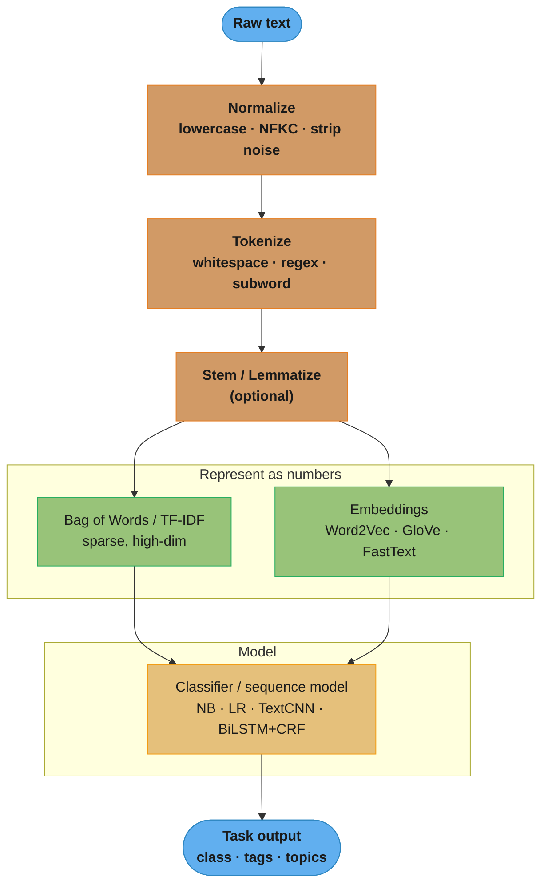
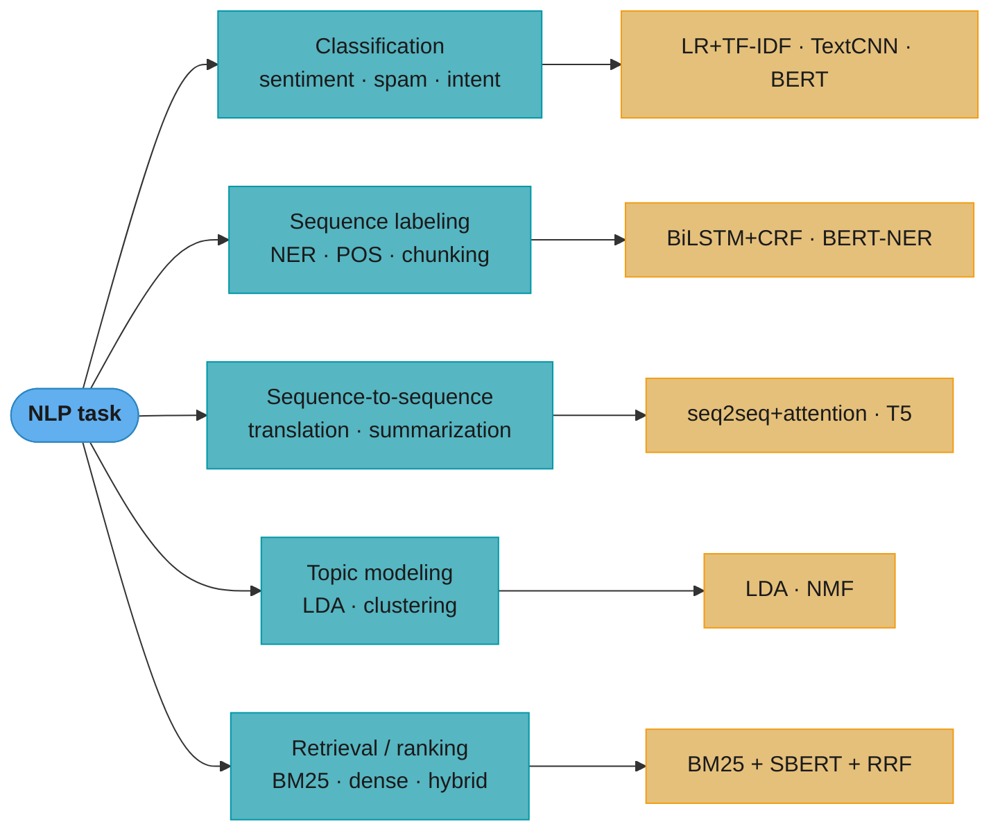
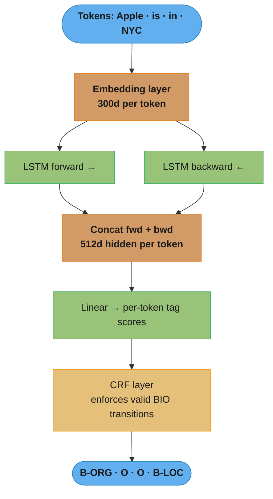
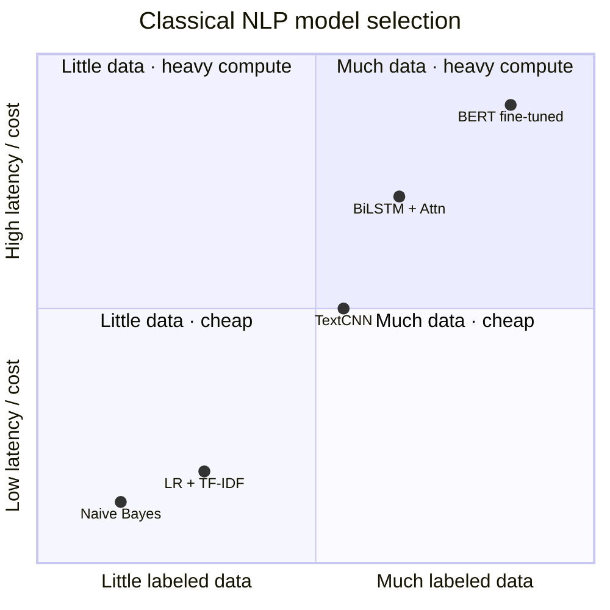

# Natural Language Processing (Classical + Pre-Transformer Deep Learning)

> This module covers classical and pre-transformer NLP. Transformer-based LLMs are covered in the LLM section (`llm/foundations_and_architecture/`).

---

## Deep Dive Files

| File | Topic | Q&As |
|------|-------|------|
| [bert_and_pretrained_models.md](bert_and_pretrained_models.md) | BERT, RoBERTa, DeBERTa, DistilBERT, ModernBERT fine-tuning | 15+ |
| [attention_and_seq2seq.md](attention_and_seq2seq.md) | Attention mechanisms, encoder-decoder transformers, beam search | 15+ |
| [text_representation_and_retrieval.md](text_representation_and_retrieval.md) | BM25, Sentence-BERT, ColBERT, hybrid search, RRF | 15+ |
| [nlp_evaluation_and_metrics.md](nlp_evaluation_and_metrics.md) | BLEU, ROUGE, BERTScore, entity-level F1, calibration | 15+ |
| [tokenization_deep_dive.md](tokenization_deep_dive.md) | BPE, WordPiece, Unigram/SentencePiece, byte-level BPE, vocabulary sizing, fertility, train/inference parity | 15+ |

---

## 1. Concept Overview

Natural Language Processing (NLP) is the field of enabling machines to understand, interpret, and generate human language. Classical NLP builds from hand-crafted features and statistical models; deep learning NLP uses learned representations (embeddings) and sequence models (RNNs, LSTMs, CNNs) before the transformer era.

Core tasks: text classification, named entity recognition (NER), part-of-speech tagging, sentiment analysis, machine translation, question answering, topic modeling.

---

## 2. Intuition

One-line analogy: NLP teaches a machine to read — first by memorizing a dictionary (bag of words), then by understanding context (word embeddings), then by tracking sentences in order (LSTMs).

Mental model: Language is sequence + context + structure. Classical methods capture frequency statistics. Word embeddings capture semantic similarity. Sequence models capture order dependencies. Each layer adds a richer view of the same text.

Why it matters: 80% of enterprise data is unstructured text. Search engines, spam filters, customer-support bots, and autocomplete all began with pre-transformer NLP techniques — many of which still run in production because they are fast, interpretable, and require no GPU.

Key insight: TF-IDF and logistic regression still outperform fine-tuned BERT on short-text classification with fewer than 10K training samples due to overfitting risk.

---

## 3. Core Principles

1. Represent text as numbers — bag of words, TF-IDF, embeddings, or character n-grams.
2. Normalize before representing — tokenize, lowercase, remove noise, then stem or lemmatize.
3. Capture co-occurrence — words that appear in similar contexts have similar meanings (distributional hypothesis).
4. Structural prediction needs structured models — sequence labeling tasks (NER, POS) benefit from CRF output layers that enforce label consistency (e.g., I-PER cannot follow B-LOC).
5. Evaluation is task-specific — accuracy for classification; F1 for NER; perplexity for language models; coherence for topic models.

---

## 4. Types / Architectures / Strategies

### 4.1 Text Preprocessing Pipeline

| Step | Method | Notes |
|------|--------|-------|
| Tokenization | Whitespace split, regex, spaCy, SentencePiece | Subword tokenization handles morphologically rich languages |
| Normalization | Lowercase, unicode normalization (NFKC) | Critical for consistency |
| Stop word removal | NLTK stopwords, custom list | Hurts performance on sentiment tasks (negations removed) |
| Stemming | Porter, Snowball | Fast, but produces non-words ("studies" -> "studi") |
| Lemmatization | WordNet lemmatizer, spaCy | Slower, but produces valid words ("studies" -> "study") |
| Noise removal | Regex for URLs, HTML tags, emojis | Domain-specific; remove or keep based on task |

### 4.2 Feature Representations

| Method | Dimensionality | Pros | Cons |
|--------|---------------|------|------|
| Bag of Words | Vocabulary size (~50K–500K) | Simple, interpretable | No order, sparse, high-dim |
| TF-IDF | Vocabulary size | Downweights common terms | Still sparse, no semantics |
| Word2Vec (SGNS) | 300d dense | Semantic similarity, analogies | No OOV handling, polysemy ignored |
| GloVe | 300d dense | Global co-occurrence captured | Static, no OOV |
| FastText | 300d + subword | Handles OOV, morphology | Larger model size |
| Sentence-BERT | 768d dense | Semantic sentence similarity, retrieval | Requires GPU, domain fine-tuning needed |

See [text_representation_and_retrieval.md](text_representation_and_retrieval.md) for BM25 derivation, Sentence-BERT siamese training, ColBERT, and hybrid search.

### 4.3 Text Classification Models

| Model | Complexity | Best For |
|-------|-----------|---------|
| Naive Bayes | O(n*d) | Short text, spam, small data |
| Logistic Regression + TF-IDF | O(n*d) | Production baseline, interpretable |
| TextCNN | O(n*k*d) | Phrase-level features, fast inference |
| BiLSTM + Attention | O(n*h) | Longer sequences, sentiment |
| BERT fine-tuned | O(n²*L) | >10K labeled examples, highest accuracy |

**Read it like this.** "The first three models cost you one pass over the text; BERT costs you a pass over every pair of tokens, once per layer."

That single difference — linear in `n` versus quadratic in `n` — is the whole latency story in this table, and it is why the cheap models never disappeared.

| Symbol | What it is |
|--------|------------|
| `n` | Sequence length in tokens (or number of documents, for the training-cost reading) |
| `d` | Feature dimension — vocabulary size for TF-IDF, embedding width for neural models |
| `k` | Convolution filter width in TextCNN (2, 3, 4 in §6) |
| `h` | LSTM hidden size |
| `L` | Number of transformer layers stacked (12 for bert-base) |
| `n²` | Every token attends to every other token — the pairwise term |

**Walk one example.** The same 512-token input pushed through each cost model:

```
                        cost expression    n=512, d=300, k=3, h=256, L=12
  LR + TF-IDF           O(n*d)              512 x 300              =     153,600
  TextCNN               O(n*k*d)            512 x 3 x 300          =     460,800
  BiLSTM                O(n*h)              512 x 256              =     131,072
  BERT (attention)      O(n^2*L)            512 x 512 x 12         =   3,145,728

  Now double the input to 1024 tokens:
  LR + TF-IDF           2x the work          (linear)
  BERT (attention)      4x the work          (quadratic -- 12.6M pairwise scores)
```

Doubling the input doubles the cost of every classical model and quadruples BERT's. This is the arithmetic behind the 512-token limit that Section 14 has to work around with a sliding window.

See [bert_and_pretrained_models.md](bert_and_pretrained_models.md) for BERT/RoBERTa/DeBERTa fine-tuning, variants, and production guidance.

### 4.4 Sequence Labeling (NER)

BIO tagging: B-entity (Beginning), I-entity (Inside), O (Outside). For "New York City": B-LOC I-LOC I-LOC. CRF layer enforces valid transitions (I-LOC cannot follow B-PER).

### 4.5 Topic Modeling

LDA (Latent Dirichlet Allocation): each document is a mixture of topics; each topic is a distribution over words. Hyperparameters: alpha (document-topic sparsity, typically 1/K), beta (topic-word sparsity, typically 0.01).

**The idea behind it.** "alpha and beta are prior guesses about how *spread out* the mixtures should be — small values say 'a document is about one or two things, and a topic uses a handful of words'."

Both are Dirichlet concentration parameters, and the only thing worth remembering is the direction: below 1.0 pushes probability mass onto a few entries; above 1.0 smears it evenly across all of them. Getting the direction backwards is the single most common LDA misconfiguration.

| Symbol | What it is |
|--------|------------|
| `K` | Number of topics you asked for (20 in the code below, 150 for the NY Times example in §7) |
| `alpha` | Document-topic prior. Low = each document commits to few topics |
| `beta` (`eta` in gensim) | Topic-word prior. Low = each topic commits to few words |
| `1/K` | The usual alpha default — shrinks automatically as you add topics |
| `0.01` | The usual beta default — deliberately far below 1.0, so topics stay word-sparse |

**Walk one example.** What `alpha = 1/K` actually buys you as `K` grows:

```
  K = 10   ->  alpha = 1/10  = 0.1000    each doc leans on ~1-3 of 10 topics
  K = 20   ->  alpha = 1/20  = 0.0500    each doc leans on ~1-3 of 20 topics
  K = 150  ->  alpha = 1/150 = 0.0067    each doc still leans on ~1-3 topics

  Contrast with a fixed alpha = 1.0 at K = 150:
    every document gets a little of all 150 topics -> topic mixtures become
    near-uniform mush, and coherence (C_v) collapses.
```

The `1/K` rule keeps documents equally decisive no matter how many topics you sweep, which is exactly what makes the "sweep K from 10 to 100 and pick the elbow" procedure in §13 a fair comparison. Note that the code below passes `alpha="auto"` and `eta="auto"`, which lets gensim learn these from data instead — worth doing once the corpus is larger than a few thousand documents.

---

## 5. Architecture Diagrams

### End-to-End Classical NLP Pipeline



Every classical NLP system is the same spine: normalize text, turn it into numbers (sparse counts or dense embeddings), then feed a model. The representation choice (§4.2) — not the classifier — usually decides quality.

### Classic NLP Task Map



The task shape dictates the model family: whole-input labels want a classifier, per-token labels want a sequence model with structured output (CRF), and generation wants an encoder-decoder. Picking the wrong family is the most common design mistake.

### TF-IDF + Logistic Regression Pipeline


The production baseline: fast, interpretable, CPU-only. The one rule that must not break is fitting the vectorizer on the training split only — fitting on the full corpus leaks test vocabulary into IDF weights (see Pitfall 1).

### Word2Vec Skip-gram Architecture


Skip-gram predicts context from a center word; the learned embedding matrix W is the actual product — the softmax head is discarded after training. This is why the distributional hypothesis (§3) yields geometry where similar-context words sit close.

**What the formula is telling you.** "Multiplying a one-hot vector by W is not multiplication at all — it is a table lookup, and W is the table you are actually training."

Reading `one-hot × W` as a real matrix product is the classic misreading. All but one entry of the input vector is zero, so `V × 300` multiply-adds collapse into copying row `i` of `W`. The softmax head on the other side is the expensive part, and it is thrown away.

| Symbol | What it is |
|--------|------------|
| `V` | Vocabulary size — 500K words in the Pitfall 5 example |
| `W` (`V × 300`) | Input embedding matrix. Row `i` *is* the vector for word `i`. The keeper |
| `W'` (`300 × V`) | Output matrix, one column per possible context word. Discarded after training |
| one-hot input | A `V`-long vector, single `1` at the center word's index |
| softmax over `V` | Turns `V` raw scores into probabilities that sum to `1.0` |

**Walk one example.** Where the compute actually goes for a single (center, context) pair:

```
  V = 500,000 vocabulary,  embedding width d = 300

  input side   one-hot x W    -> row lookup                 ~0 multiply-adds
  output side  vec x W'       -> 300 x 500,000          = 150,000,000 mult-adds
  softmax      exp + normalize over 500,000 scores      =     500,000 exp calls

  Total per training pair:  ~150M operations to update ONE word's vector.
  A 1B-token corpus with window=5 produces billions of such pairs.
```

The output side costs 150 million operations to learn one 300-number vector — that is the bottleneck skip-gram implementations exist to avoid. Production trainers (including the gensim call in §6) never evaluate the full softmax; they score the true context word against a small handful of randomly drawn "negative" words instead, turning the `V`-way normalization into a few binary decisions. Without that substitution, the `min_count=5` and `window=5` settings below would be academic — the model would never finish training.

### BiLSTM + CRF for NER



The BiLSTM gives each token full-sentence context (forward + backward passes concatenated); the CRF then scores whole label sequences with Viterbi so it cannot emit illegal transitions like I-LOC after B-PER (§3, Pitfall 4).

### TextCNN Architecture


Filters of width 2/3/4 act as learnable n-gram detectors; max-pool-over-time keeps each filter's strongest activation regardless of position, making the model position-invariant to phrases like "highly recommend".

### Model Selection — Data vs Latency Tradeoff



The lower-left "cheap, small-data" quadrant is where classical NLP dominates — Naive Bayes and LR+TF-IDF win under 10K labels and sub-millisecond latency. BERT only pays off in the upper-right, with abundant labels and GPU budget (§4.3, §9).

---

## 6. How It Works — Detailed Mechanics

### TF-IDF + Logistic Regression (sklearn)

```python
from sklearn.pipeline import Pipeline
from sklearn.feature_extraction.text import TfidfVectorizer
from sklearn.linear_model import LogisticRegression
from sklearn.model_selection import train_test_split
from sklearn.metrics import classification_report
from typing import List, Tuple
import numpy as np

def build_tfidf_classifier(
    texts: List[str],
    labels: List[int],
    max_features: int = 50_000,
    ngram_range: Tuple[int, int] = (1, 2),
) -> Pipeline:
    """
    Build and fit a TF-IDF + LogisticRegression pipeline.
    ngram_range=(1,2) captures unigrams and bigrams.
    max_features=50_000 caps vocabulary to avoid memory issues on large corpora.
    """
    pipeline = Pipeline([
        ("tfidf", TfidfVectorizer(
            max_features=max_features,
            ngram_range=ngram_range,
            sublinear_tf=True,       # apply log(1+tf) instead of raw tf
            strip_accents="unicode",
            analyzer="word",
            min_df=2,                # ignore terms appearing in fewer than 2 docs
        )),
        ("clf", LogisticRegression(
            C=1.0,                   # inverse regularization strength
            max_iter=1000,
            solver="lbfgs",
            multi_class="auto",
            n_jobs=-1,
        )),
    ])

    X_train, X_test, y_train, y_test = train_test_split(
        texts, labels, test_size=0.2, random_state=42, stratify=labels
    )
    pipeline.fit(X_train, y_train)
    y_pred = pipeline.predict(X_test)
    print(classification_report(y_test, y_pred))
    return pipeline
```

**In plain terms.** "Count how much this document talks about a word, then divide out how much *everybody* talks about it."

TF-IDF is two independent ideas multiplied together, and they are worth decoding separately because they fail separately. TF is a within-document statistic computed at transform time; IDF is a corpus-wide statistic frozen at `fit` time — which is precisely why fitting on the full dataset leaks test data (Pitfall 1).

**The TF half.** Term frequency is just "how many times does term `t` appear in document `d`". Raw counts are the default; `sublinear_tf=True` in the code above replaces the count with `1 + log(tf)`.

| Symbol | What it is |
|--------|------------|
| `tf(t, d)` | Raw occurrences of term `t` in document `d` |
| `1 + log(tf)` | The `sublinear_tf=True` form. Third mention of a word counts far less than the first |

**The IDF half.** Inverse document frequency is "how rare is this term across the whole corpus". Sklearn uses the smoothed form `idf(t) = ln((1 + N) / (1 + df(t))) + 1`.

| Symbol | What it is |
|--------|------------|
| `N` | Total documents in the fitted corpus |
| `df(t)` | Document frequency — how many documents contain `t` at least once |
| `(1 + N)/(1 + df)` | The `+1`s are smoothing, so a term in every document never divides by zero |
| `ln(...)` | Compresses the range. Without it a term in 1 of 1M docs would outweigh everything |
| `+ 1` (trailing) | Floor, so a term appearing in every document gets weight `1.0`, not `0` |
| `min_df=2` | Drop terms seen in fewer than 2 documents — typos and one-off tokens |

**Walk one example.** A three-document corpus, computed end to end:

```
  Corpus (N = 3 documents)
    d1: the cat sat on the mat
    d2: the dog sat on the log
    d3: the cat chased the dog

  Step 1 -- df(t): how many of the 3 documents contain t
    the    df=3      cat  df=2      sat df=2      on     df=2
    dog    df=2      mat  df=1      log df=1      chased df=1

  Step 2 -- idf(t) = ln((1+3)/(1+df)) + 1
    the    ln(4/4) + 1 = 1.0000     <- in every document, no discriminating power
    cat    ln(4/3) + 1 = 1.2877
    mat    ln(4/2) + 1 = 1.6931     <- unique to d1, weighted highest

  Step 3 -- tf(t, d1): raw counts inside d1
    the 2     cat 1     sat 1     on 1     mat 1

  Step 4 -- tf x idf for d1
    the   2 x 1.0000 = 2.0000      <- STILL the largest number. Not fixed yet.
    mat   1 x 1.6931 = 1.6931
    cat   1 x 1.2877 = 1.2877
    sat   1 x 1.2877 = 1.2877
    on    1 x 1.2877 = 1.2877

  Step 5 -- L2 normalize by the vector length 3.4411
    the 0.5812    mat 0.4920    cat 0.3742    sat 0.3742    on 0.3742
```

Step 4 is the punchline most explanations skip: IDF alone does **not** demote "the" below the content words here, because "the" occurs twice. Raw TF is still winning. That is what `sublinear_tf=True` is for:

```
  sublinear_tf=True replaces tf with 1 + log(tf)
    tf = 1  ->  1 + log(1) = 1.0000     (unchanged)
    tf = 2  ->  1 + log(2) = 1.6931     (not 2.0 -- saying it twice is not 2x)

  d1 recomputed and L2-normalized:
    the 0.5174    mat 0.5174    cat 0.3935    sat 0.3935    on 0.3935

  "the" falls 0.5812 -> 0.5174 and "mat" rises 0.4920 -> 0.5174. The stop word
  and the unique content word now weigh the same, on a 3-document toy corpus.
```

Scale `N` from 3 to a realistic 50,000 documents and the gap widens dramatically: `idf("the")` stays pinned at `1.0` while a term in 5 documents earns `ln(50001/6) + 1 = 10.03`. **Why L2 normalization exists:** without Step 5, a 2,000-word document would have roughly ten times the vector magnitude of a 200-word one, and logistic regression would learn "long document" as a feature. Normalizing to unit length makes every document a direction rather than a magnitude — which is also what makes cosine similarity meaningful, since for unit vectors the dot product *is* the cosine.

### Word2Vec with Gensim

```python
from gensim.models import Word2Vec
from gensim.utils import simple_preprocess
from typing import List
import logging

logging.basicConfig(level=logging.INFO)

def train_word2vec(
    sentences: List[str],
    vector_size: int = 300,
    window: int = 5,
    min_count: int = 5,
    sg: int = 1,          # 1 = Skip-gram, 0 = CBOW
    workers: int = 4,
    epochs: int = 10,
) -> Word2Vec:
    """
    Train Word2Vec on a corpus.
    sg=1 (Skip-gram) gives better quality for rare words.
    sg=0 (CBOW) trains ~3x faster, preferred for large corpora.
    window=5: context window of 5 words each side.
    min_count=5: ignore words appearing fewer than 5 times.
    """
    tokenized = [simple_preprocess(s) for s in sentences]
    model = Word2Vec(
        sentences=tokenized,
        vector_size=vector_size,
        window=window,
        min_count=min_count,
        sg=sg,
        workers=workers,
        epochs=epochs,
    )
    return model

def demo_embeddings(model: Word2Vec) -> None:
    # Semantic similarity
    print(model.wv.most_similar("king", topn=5))
    # Analogy: king - man + woman ~ queen
    result = model.wv.most_similar(
        positive=["king", "woman"], negative=["man"], topn=1
    )
    print(f"king - man + woman = {result[0][0]}")  # "queen"
    # Cosine similarity
    sim = model.wv.similarity("car", "automobile")
    print(f"car <-> automobile similarity: {sim:.3f}")  # ~0.85 on large corpus
```

**What this actually says.** "Ignore how long the two vectors are; tell me only whether they point the same way."

`model.wv.similarity` returns cosine similarity, `cos(a, b) = (a · b) / (|a| |b|)`. The division by both lengths is the entire point — it strips magnitude out, leaving pure direction. Word2Vec vector lengths correlate with word frequency, so a raw dot product would rank common words as similar to everything.

| Symbol | What it is |
|--------|------------|
| `a · b` | Dot product — multiply matching dimensions, add them all up |
| `\|a\|` | Length (L2 norm) of vector `a`: square each entry, sum, take the square root |
| `cos(a, b)` | Result in `[-1, 1]`. `1` = identical direction, `0` = unrelated, `-1` = opposite |
| `0.85` | The value in the code comment — "car" and "automobile" nearly, not exactly, aligned |

**Walk one example.** Three-dimensional stand-ins, to show magnitude genuinely cancels:

```
  a = [0.8, 0.6, 0.0]        b = [0.4, 0.9, 0.2]

  dot   a . b = 0.8x0.4 + 0.6x0.9 + 0.0x0.2 = 0.32 + 0.54 + 0.00 = 0.8600
  |a|   sqrt(0.64 + 0.36 + 0.00)                                  = 1.0000
  |b|   sqrt(0.16 + 0.81 + 0.04)                                  = 1.0050
  cos   0.8600 / (1.0000 x 1.0050)                                = 0.8557

  Now scale a by 10x -- same direction, ten times longer:
  c = [8.0, 6.0, 0.0]
  dot   c . b = 8.6000        |c| = 10.0000
  cos   8.6000 / (10.0000 x 1.0050)                               = 0.8557   identical
```

The 10x rescale changed the dot product from `0.86` to `8.60` and left the cosine untouched at `0.8557`. In practice, note that cosine similarity is symmetric and unbounded by frequency but says nothing about polysemy — "bank" has exactly one vector, so its cosine to "river" and to "loan" are both computed against a blurred average of both senses. That limitation is what sentence embeddings and contextual models exist to fix.

### spaCy NER Example

```python
import spacy
from spacy.tokens import Doc
from typing import List, Tuple

# Load pre-trained model (en_core_web_lg: 685MB, GloVe vectors + NER)
# en_core_web_sm: 12MB, no vectors, faster
nlp = spacy.load("en_core_web_lg")

def extract_entities(text: str) -> List[Tuple[str, str, int, int]]:
    """
    Returns list of (entity_text, label, start_char, end_char).
    Labels: PERSON, ORG, GPE (geo-political), DATE, MONEY, etc.
    """
    doc: Doc = nlp(text)
    return [(ent.text, ent.label_, ent.start_char, ent.end_char) for ent in doc.ents]

def demo_ner() -> None:
    text = "Apple Inc. was founded by Steve Jobs in Cupertino in 1976."
    entities = extract_entities(text)
    for ent_text, label, start, end in entities:
        print(f"  [{label}] '{ent_text}' at chars {start}-{end}")
    # Output:
    # [ORG] 'Apple Inc.' at chars 0-10
    # [PERSON] 'Steve Jobs' at chars 25-35
    # [GPE] 'Cupertino' at chars 39-48
    # [DATE] '1976' at chars 52-56
```

### TextCNN in PyTorch

```python
import torch
import torch.nn as nn
import torch.nn.functional as F
from typing import List

class TextCNN(nn.Module):
    """
    Kim (2014) TextCNN for sentence classification.
    Multiple filter sizes capture n-gram features.
    """
    def __init__(
        self,
        vocab_size: int,
        embed_dim: int = 300,
        num_classes: int = 2,
        filter_sizes: List[int] = [2, 3, 4],
        num_filters: int = 100,
        dropout: float = 0.5,
        pretrained_embeddings: torch.Tensor | None = None,
    ) -> None:
        super().__init__()
        self.embedding = nn.Embedding(vocab_size, embed_dim, padding_idx=0)
        if pretrained_embeddings is not None:
            self.embedding.weight.data.copy_(pretrained_embeddings)

        self.convs = nn.ModuleList([
            nn.Conv1d(
                in_channels=embed_dim,
                out_channels=num_filters,
                kernel_size=fs,
            )
            for fs in filter_sizes
        ])
        self.dropout = nn.Dropout(dropout)
        self.fc = nn.Linear(len(filter_sizes) * num_filters, num_classes)

    def forward(self, x: torch.Tensor) -> torch.Tensor:
        # x: (batch, seq_len)
        emb = self.embedding(x)                    # (batch, seq_len, embed_dim)
        emb = emb.permute(0, 2, 1)                # (batch, embed_dim, seq_len)

        pooled = []
        for conv in self.convs:
            out = F.relu(conv(emb))                # (batch, num_filters, seq_len - fs + 1)
            out = F.max_pool1d(out, out.size(2))   # (batch, num_filters, 1)
            pooled.append(out.squeeze(2))          # (batch, num_filters)

        cat = torch.cat(pooled, dim=1)             # (batch, len(filter_sizes)*num_filters)
        return self.fc(self.dropout(cat))          # (batch, num_classes)
```

**Put simply.** "Slide 300 little n-gram detectors across the sentence, keep only each detector's loudest reading, and classify from those 300 numbers."

The shape comments carry two calculations that are easy to gloss over: `seq_len - fs + 1` (how many positions a filter of width `fs` fits into) and `len(filter_sizes) * num_filters` (why the classifier head is always the same width regardless of sentence length).

| Symbol | What it is |
|--------|------------|
| `seq_len` | Tokens in the padded sentence |
| `fs` | Filter width — 2, 3, or 4 tokens. A learnable bigram/trigram/4-gram detector |
| `num_filters` | 100 independent detectors *per* width, each learning a different phrase pattern |
| `seq_len - fs + 1` | Valid convolution positions — a width-4 filter cannot start in the last 3 slots |
| `max_pool1d(out, out.size(2))` | Max over *all* positions, collapsing each filter to one scalar |
| `len(filter_sizes) * num_filters` | `3 x 100 = 300` — the fixed-width feature vector fed to the classifier |

**Walk one example.** A 20-token sentence, `embed_dim=300`, `num_filters=100`:

```
  after embedding + permute            (batch, 300, 20)

  conv width 2  -> positions 20 - 2 + 1 = 19    (batch, 100, 19)
  conv width 3  -> positions 20 - 3 + 1 = 18    (batch, 100, 18)
  conv width 4  -> positions 20 - 4 + 1 = 17    (batch, 100, 17)

  max-pool over time collapses the last axis entirely:
    19 -> 1,  18 -> 1,  17 -> 1                 (batch, 100) each
  concatenate                            100 + 100 + 100 = (batch, 300)
  dropout(0.5) -> Linear(300, 2)                (batch, 2)

  Same sentence padded to 200 tokens instead of 20:
    positions become 199 / 198 / 197, and the concat is STILL (batch, 300).
```

Max-pool-over-time is what makes the head width independent of `seq_len` — the model accepts any sentence length and always hands the classifier exactly 300 numbers. **What breaks without the pool:** you would have to flatten `100 x 19` per filter size, the `Linear` layer would be tied to one exact sentence length, and the phrase "highly recommend" would produce a different feature depending on whether it landed at position 3 or position 15. The pool is what buys position invariance, at the cost of discarding *how many times* and *where* a phrase fired.

### LDA Topic Modeling

```python
from gensim import corpora
from gensim.models import LdaModel
from gensim.models.coherencemodel import CoherenceModel
from typing import List, Tuple
import re

def preprocess_for_lda(texts: List[str]) -> List[List[str]]:
    """Remove short words and punctuation; return tokenized docs."""
    tokenized = []
    for text in texts:
        tokens = re.findall(r'\b[a-z]{3,}\b', text.lower())
        tokenized.append(tokens)
    return tokenized

def train_lda(
    texts: List[str],
    num_topics: int = 20,
    passes: int = 10,
    random_state: int = 42,
) -> Tuple[LdaModel, corpora.Dictionary]:
    tokenized = preprocess_for_lda(texts)
    dictionary = corpora.Dictionary(tokenized)
    dictionary.filter_extremes(no_below=5, no_above=0.5)  # remove rare and ubiquitous
    corpus = [dictionary.doc2bow(doc) for doc in tokenized]

    model = LdaModel(
        corpus=corpus,
        id2word=dictionary,
        num_topics=num_topics,
        passes=passes,
        alpha="auto",    # learn document-topic distribution
        eta="auto",      # learn topic-word distribution
        random_state=random_state,
        per_word_topics=True,
    )

    # Evaluate coherence (C_v score; higher is better; typically 0.4-0.7 is acceptable)
    coherence_model = CoherenceModel(
        model=model, texts=tokenized, dictionary=dictionary, coherence="c_v"
    )
    score = coherence_model.get_coherence()
    print(f"Coherence Score (C_v): {score:.4f}")
    return model, dictionary
```

---

## 7. Real-World Examples

**Gmail spam filter (pre-2015):** TF-IDF features + Naive Bayes + logistic regression ensemble. Still processes billions of emails per day. Rule-based preprocessing handles Unicode abuse (e.g., "V1agra" variants).

**LinkedIn job title normalization:** FastText subword embeddings map "Sr. SWE" and "Senior Software Engineer" to nearby vectors. OOV handling via subword n-grams is critical because job titles contain abbreviations not in any pre-trained vocabulary.

**Bloomberg News NER:** BiLSTM + CRF trained on financial text. Identifies TICKER symbols, executive names, and organization names where general-purpose spaCy models underperform. Domain-specific training data yields 10-15 F1-point improvement over off-the-shelf models.

**NY Times topic discovery:** LDA with 150 topics over 20 years of articles. Topics drift over time (e.g., "internet" topic words shift from "modem/dial-up" to "broadband/streaming"). Requires periodic retraining or dynamic topic models.

**Stack Overflow search (hybrid retrieval):** BM25 over title+body indexes for exact keyword matching, combined with Sentence-BERT bi-encoder for semantic similarity via FAISS. BM25 alone achieves NDCG@10 of 0.45 on technical queries; adding dense retrieval and RRF fusion (k=60) pushes NDCG@10 to 0.58. Cross-encoder reranking of top-20 results raises MRR@10 by a further 12%. See [text_representation_and_retrieval.md](text_representation_and_retrieval.md) for implementation.

**Salesforce customer intent classification with DeBERTa-v3-base:** A support ticket router with 47 intent classes (billing, outage, feature request, etc.) replaced a LogisticRegression+TF-IDF baseline. DeBERTa-v3-base fine-tuned for 5 epochs (LR 2e-5, batch 32) on 80K labeled tickets achieved 94.1% accuracy vs 87.4% for the baseline. Inference served via TorchServe with dynamic batching (max_batch_delay=50ms) sustains 2,000 RPS on two A10G GPUs. See [bert_and_pretrained_models.md](bert_and_pretrained_models.md) for fine-tuning details.

---

## 8. Tradeoffs

| Dimension | Bag of Words / TF-IDF | Word2Vec / GloVe | FastText | BiLSTM |
|-----------|----------------------|-----------------|---------|--------|
| Training speed | Milliseconds | Hours (large corpus) | Hours | Days |
| Inference speed | Sub-millisecond | Sub-millisecond | Sub-millisecond | 10-50ms |
| OOV handling | None | None | Yes (subword) | Depends on embedding |
| Semantic similarity | No | Yes | Yes | Yes |
| Interpretability | High | Low | Low | Very low |
| Data requirement | 1K docs | 1M+ sentences | 1M+ sentences | 10K+ labeled |

| Stemming vs Lemmatization | |
|--------------------------|--|
| Porter stemming | Fast (regex rules), non-words ("running" -> "run", "studies" -> "studi"), good for IR |
| WordNet lemmatization | Slow (dictionary lookup), valid words, requires POS tag for accuracy |

---

## 9. When to Use / When NOT to Use

### When to Use Classical NLP

- Fewer than 50K labeled training examples (BERT overfits; LR + TF-IDF generalizes better)
- Latency under 1ms required (embeddings and LSTMs are too slow without batching)
- CPU-only deployment with no GPU budget
- Interpretability required (regulators need feature importance)
- Domain-specific text with specialized vocabulary where pre-trained models underperform

### When NOT to Use Classical NLP

- Tasks requiring long-range dependencies beyond 512 tokens
- Multi-lingual or cross-lingual tasks (use multilingual transformers)
- Zero-shot or few-shot settings (use LLMs with prompting)
- Complex reasoning tasks (reading comprehension, entailment)
- When labeled data is abundant (>100K examples) and GPU is available — transformers dominate

---

## 10. Common Pitfalls

### Pitfall 1: Leaking test data into TF-IDF fit

```python
# BROKEN: fit on entire dataset before splitting
vectorizer = TfidfVectorizer()
X = vectorizer.fit_transform(all_texts)   # test vocabulary leaks into vectorizer
X_train, X_test = train_test_split(X, ...)

# FIXED: fit only on training data
X_train_raw, X_test_raw, y_train, y_test = train_test_split(all_texts, labels, ...)
vectorizer = TfidfVectorizer()
X_train = vectorizer.fit_transform(X_train_raw)
X_test = vectorizer.transform(X_test_raw)   # transform only, never fit on test
```

Production incident: A spam classifier showed 97% test accuracy. When deployed, accuracy dropped to 71%. Root cause: TF-IDF was fit on the full dataset, so test-document word frequencies influenced IDF weights. The model memorized test-set vocabulary rather than generalizing.

### Pitfall 2: Stop word removal breaking sentiment

```python
# "This film is not good" -> remove "not" -> "film good" -> positive sentiment
# Fix: do NOT remove stop words for sentiment analysis tasks
# Negation words ("not", "never", "no") are semantically critical
```

### Pitfall 3: Using MAPE when actuals include zeros

Applies here for text-length or frequency metrics: MAPE (Mean Absolute Percentage Error) divides by actual value. When actual count is 0 (e.g., zero mentions of a term), MAPE is undefined or infinite. Use MAE or SMAPE instead.

### Pitfall 4: BIO tag inconsistency without CRF

Without a CRF layer, a neural model can predict I-LOC following B-PER — a structurally invalid sequence. Adding a CRF output layer costs ~5% extra training time and reliably enforces valid BIO transitions, improving NER F1 by 1-3 points.

### Pitfall 5: Word2Vec model size in production

A gensim Word2Vec model trained on 1B tokens with 300d vectors and vocabulary 500K words requires ~600MB RAM. In a microservice handling 1K RPS, loading this model per request is fatal. Fix: load once at startup, share across threads with read-only access; or use a quantized 100d model that fits in 200MB with minimal quality loss.

**Stated plainly.** "An embedding table's size is one multiplication: vocabulary times dimensions times bytes per number. Nothing else in the model matters."

Embedding memory is `V × d × bytes`. Everything about deploying word vectors — whether the model fits in a container, whether you can afford 300d, whether quantization is worth it — falls out of those three numbers, and none of them depend on how much text you trained on.

| Symbol | What it is |
|--------|------------|
| `V` | Vocabulary size after `min_count` filtering — 500,000 here |
| `d` | Vector width — 300 (default) or 100 (the quantized alternative) |
| bytes/number | `4` for float32, the numpy default gensim stores |
| 1B tokens | Training corpus size. Sets *quality*, contributes **zero** bytes at serve time |

**Walk one example.** Where the 600MB and 200MB in the paragraph above come from:

```
  300d model     500,000 x 300 x 4 bytes  = 600,000,000 bytes = 600 MB
  100d model     500,000 x 100 x 4 bytes  = 200,000,000 bytes = 200 MB

  Per-request loading at 1,000 RPS:
    1,000 x 600 MB = 600 GB/s of allocation      -- fatal, as stated above
  Load-once at startup:
    600 MB resident, shared read-only by every thread. Constant.

  What the corpus size does NOT do:
    trained on 100M tokens -> still 600 MB     (same V, same d)
    trained on   1B tokens -> still 600 MB
    trained on  10B tokens -> still 600 MB
```

Dropping 300d to 100d is a straight 3x memory cut because the relationship is linear in `d`. Note that this counts only the final `wv` vectors — during *training* gensim also holds the output matrix `W'` from §5 at the same `V × d` size, which is why training peaks near double the serving footprint and why the trained artifact shrinks when you save it.

---

## 11. Technologies & Tools

| Tool | Use Case | Notes |
|------|---------|-------|
| spaCy | Tokenization, NER, POS tagging | Industrial-strength; en_core_web_lg has GloVe vectors |
| NLTK | Preprocessing, WordNet lemmatization, corpora | Research-oriented; slower than spaCy |
| Gensim | Word2Vec, FastText, LDA, Doc2Vec | Best-in-class for word embeddings and topic models |
| scikit-learn | TF-IDF, Naive Bayes, LogisticRegression, pipelines | Production ML pipelines |
| PyTorch | TextCNN, BiLSTM, custom models | Research and custom architectures |
| HuggingFace Tokenizers | Fast BPE/WordPiece tokenization | 100x faster than pure Python |
| fastText (Meta CLI) | Sub-word embeddings, fast text classification | Ships as a single binary; 1M sentences/second |
| Vowpal Wabbit | Online learning for text classification | Handles datasets that don't fit in RAM |

---

## 12. Interview Questions with Answers

**Q: Why does removing stop words hurt sentiment analysis but help topic modeling?**
Stop word removal strips negation words like "not" and "never" that flip sentiment polarity, so "not good" collapses to "good". Those same words carry no topical signal, so removing them helps LDA and search by concentrating on content words. The rule: keep stop words (especially negations) for polarity tasks, remove them for topic modeling and information retrieval. This single preprocessing toggle can swing sentiment accuracy by 5-10 points.

**Q: Why can fitting TF-IDF on the full dataset before the train/test split inflate accuracy?**
Because IDF weights computed over the whole corpus leak test-document term frequencies into training, so the model quietly memorizes test-set vocabulary instead of generalizing. The symptom is a large train-to-production gap: one spam classifier showed 97% test accuracy that dropped to 71% in production. The fix is to call `fit_transform` only on the training split and `transform` (never `fit`) on validation and test, ideally wrapped in an sklearn Pipeline so leakage is structurally impossible.

**Q: What is TF-IDF and why is it better than raw term frequency?**
TF-IDF (Term Frequency * Inverse Document Frequency) weights each term by how often it appears in a document relative to how common it is across all documents. Raw TF heavily weights common words like "the" and "is" which carry no discriminative signal. IDF penalizes words that appear in many documents, so domain-specific rare terms get higher weight. Practically, sublinear_tf=True (log normalization) further reduces the gap between frequent and rare terms within a document.

**Q: Explain the difference between Word2Vec Skip-gram and CBOW.**
Skip-gram predicts surrounding context words given a center word; CBOW predicts a center word given surrounding context words. Skip-gram is slower to train but produces higher-quality vectors for rare words because each rare word's representation is updated whenever it is the center word. CBOW is ~3x faster and works better for frequent words. On large corpora (>1B tokens), CBOW is preferred for speed; on small or domain-specific corpora, Skip-gram produces better embeddings.

**Q: How does FastText handle out-of-vocabulary words?**
FastText represents each word as the sum of its character n-gram vectors (typically n=3 to 6). For "unhappiness", it computes vectors for substrings "unh", "nha", "hap", "app", "ppi", "pin", "ine", "nes", "ess", then sums them to form the word vector. An OOV word like "unhappily" shares most n-grams with "unhappiness" and receives a meaningful vector rather than a zero or random fallback. This is critical for morphologically rich languages (Turkish, Finnish) and domain-specific text with abbreviations and misspellings.

**Q: What is the BIO tagging scheme in NER?**
BIO stands for Beginning, Inside, Outside. B-{entity} marks the first token of an entity span, I-{entity} marks subsequent tokens of the same span, and O marks non-entity tokens. For "New York City": B-LOC I-LOC I-LOC. BIO is important because it disambiguates consecutive entities of the same type: "Steve Jobs Tim Cook" becomes B-PER I-PER B-PER I-PER, not four I-PER tokens.

**Q: Why add a CRF layer on top of BiLSTM for NER instead of just softmax?**
Softmax predicts each token's label independently, so it can output structurally invalid sequences like I-LOC following B-PER. A CRF layer learns transition scores between label pairs (e.g., the transition I-LOC -> B-PER is valid but I-PER -> B-LOC is unusual) and finds the globally optimal label sequence using Viterbi decoding. This typically improves NER F1 by 1-3 points and eliminates illegal tag sequences entirely.

**Q: What is LDA and how do you evaluate topic model quality?**
LDA (Latent Dirichlet Allocation) models each document as a mixture of K topics, where each topic is a probability distribution over vocabulary words. Inference finds the posterior distribution of topics given observed words. Quality is evaluated using coherence score (C_v): how often the top-N words of each topic co-occur in the training corpus. A C_v of 0.4-0.5 is acceptable; 0.6+ is good. Perplexity measures held-out likelihood but correlates poorly with human-judged topic quality — always prefer coherence.

**Q: How does the TextCNN architecture capture phrase-level features?**
TextCNN applies 1D convolutional filters of varying sizes (e.g., widths 2, 3, 4 tokens) over word embedding sequences. A filter of width 3 can learn to activate on trigrams like "not very good" or "highly recommend". Max-pooling over time picks the most significant activation of each filter regardless of position in the sentence, making the model position-invariant. Multiple filter sizes capture different n-gram granularities simultaneously.

**Q: When would you choose Naive Bayes over Logistic Regression for text classification?**
Naive Bayes trains in O(n*d) with a single pass over data, making it ideal when new training data arrives continuously (e.g., spam that evolves daily) and when training time is constrained. It is also more robust with very small training sets (fewer than 500 examples) because it makes a strong independence assumption that prevents overfitting. Logistic Regression is preferable when you have more than a few thousand examples, correlated features (n-grams), or need calibrated probabilities for downstream decision making.

**Q: What is the difference between stemming and lemmatization? When would you prefer each?**
Stemming applies rule-based suffix stripping to produce a root form ("studies" -> "studi", "running" -> "run"). It is fast (O(1) per word) but produces non-words. Lemmatization uses a morphological dictionary to produce the canonical base form ("studies" -> "study", "running" -> "run"). Lemmatization is ~10x slower than stemming but produces valid words with correct part-of-speech awareness. Use stemming for information retrieval (search engines) where recall matters and the query also gets stemmed. Use lemmatization for tasks where word validity matters (text generation seeds, vocabulary-limited models).

**Q: How do you handle class imbalance in text classification?**
Three main approaches: (1) class_weight="balanced" in scikit-learn LogisticRegression, which weights each sample inversely proportional to class frequency; (2) oversampling the minority class using SMOTE in the embedding space (not on raw text); (3) adjusting the decision threshold post-training based on precision-recall curve analysis. For extreme imbalance (1:100+), reframe as anomaly detection using one-class classifiers. Always evaluate with F1 or AUPR, never accuracy, which is misleading on imbalanced datasets.

**Q: What is the distributional hypothesis and why does it underpin word embeddings?**
The distributional hypothesis states that words appearing in similar contexts have similar meanings (Firth, 1957: "You shall know a word by the company it keeps"). Word2Vec exploits this by training a neural network to predict context words from a center word (or vice versa). The intermediate weight matrix becomes the word embedding — words with similar context distributions (e.g., "cat" and "dog" both appear near "pet", "food", "vet") end up geometrically close in the embedding space, enabling semantic arithmetic like king - man + woman = queen.

**Q: Explain why pre-trained word embeddings can hurt performance on specialized domains.**
Pre-trained embeddings (Word2Vec on Google News, GloVe on Common Crawl) embed words according to general English usage. In a biomedical context, "cold" primarily means a respiratory infection, but in general English it means low temperature. Fine-tuning only the output layer on top of frozen general embeddings will not correct this semantic mismatch. Solutions: (1) train domain-specific embeddings from scratch on domain corpus; (2) continue training (fine-tune) pre-trained embeddings on domain data; (3) use subword models like FastText which are more robust to domain terminology.

**Q: When would you use BERT fine-tuning over TF-IDF + Logistic Regression for text classification?**
Use BERT fine-tuning when you have more than 10K labeled examples, a GPU is available, and accuracy is more important than latency. BERT's bidirectional context captures meaning that TF-IDF cannot — "bank" near "river" vs "bank" near "loan" get different representations. For fewer than 5K examples, TF-IDF + LR usually generalizes better because BERT overfits without sufficient data. For latency under 5ms or CPU-only environments, TF-IDF + LR is the only practical choice. DistilBERT is a middle ground: 60% of BERT's parameter count, 40% faster inference, and within 3% of BERT accuracy on most GLUE tasks. See [bert_and_pretrained_models.md](bert_and_pretrained_models.md) for detailed guidance.

**Q: What is BM25 and when does it outperform dense embedding retrieval?**
BM25 (Best Match 25) is a probabilistic term-frequency ranking function that scores documents by TF saturation (k1=1.2, so additional occurrences of a term yield diminishing returns), length normalization (b=0.75, penalizing verbose documents), and IDF (inverse document frequency, downweighting common terms). BM25 outperforms dense retrieval when queries contain rare terms, product codes, or proper nouns not seen in the embedding model's training data; when queries are exact keyword lookups ("error code 0x80070057"); and when the document collection is very large and un-indexed (FAISS requires memory proportional to corpus size). Dense retrieval wins on paraphrase and semantic matching tasks. Hybrid (BM25 + dense, fused with RRF) is the production standard for general search. See [text_representation_and_retrieval.md](text_representation_and_retrieval.md) for full derivation.

**Q: How do sentence embeddings differ from word embeddings, and why can't you just average word2vec vectors?**
Sentence embeddings represent an entire sentence as a single fixed-length vector capturing sentence-level semantics, not individual word semantics. Averaging word2vec vectors loses word order and composition — "dog bites man" and "man bites dog" have the same average embedding. Additionally, word2vec embeddings are context-independent, so "bank" always has one vector regardless of whether it means river bank or financial institution. Sentence-BERT (SBERT) uses a siamese BERT network trained on NLI (natural language inference) triplets with contrastive loss, producing embeddings where cosine similarity directly measures semantic similarity. SBERT cosine similarity achieves Spearman r=0.86 on STS-B vs 0.20 for averaged GloVe. See [text_representation_and_retrieval.md](text_representation_and_retrieval.md) for training details.

**Q: What is BLEU and what are its most significant weaknesses?**
BLEU (Bilingual Evaluation Understudy) measures the geometric mean of modified n-gram precision (n=1 to 4) between a hypothesis and one or more reference translations, multiplied by a brevity penalty to penalize short outputs. Modified precision clips each n-gram count by its maximum occurrence in any reference, preventing trivial repetition. Weaknesses: BLEU is a corpus-level metric that correlates poorly with human judgment at the sentence level; it penalizes valid paraphrases not matching any reference (a correct translation using "automobile" when the reference says "car" scores zero for that bigram); it rewards n-gram overlap regardless of grammatical coherence; and it is computed differently across implementations (smoothing methods vary). ROUGE-L is preferred for summarization (recall-oriented, based on longest common subsequence). BERTScore is preferred when semantic equivalence matters over lexical matching. See [nlp_evaluation_and_metrics.md](nlp_evaluation_and_metrics.md) for full derivations.

**Q: What is the vanishing gradient problem in RNNs and how do LSTMs address it?**
Gradients shrink multiplicatively through many time steps, so tokens far back in the sequence receive almost no learning signal and long-range dependencies never get learned. A plain RNN multiplies the same weight matrix at every step, so errors decay (or explode) exponentially with sequence length. LSTMs add a gated cell state with an additive update path — the cell carries information forward with minimal attenuation, and input/forget/output gates learn what to keep or discard. This is why LSTMs and GRUs handle sequences of 100+ tokens where vanilla RNNs fail past ~10.

**Q: Why does a BiLSTM read the sequence in both directions, and when can you NOT use it?**
A BiLSTM runs one LSTM left-to-right and a second right-to-left and concatenates their hidden states, so every token's representation sees both its left and right context. That bidirectional view is critical for NER and POS tagging, where a word's role often depends on what follows it. You cannot use a BiLSTM for autoregressive generation or streaming, because the backward pass peeks at future tokens the model is supposed to predict, which is information leakage at inference. For generation tasks use a unidirectional (causal) LSTM or a decoder; reserve bidirectional encoders for labeling and classification where the full input is available up front.

---

## 13. Best Practices

1. Always build a TF-IDF + LogisticRegression baseline before investing in deep learning. On many production tasks, it achieves 85-90% of deep-learning performance at 1% of the cost and latency.
2. Use sklearn Pipeline to wrap preprocessing, vectorization, and classification — this prevents data leakage and simplifies serialization with joblib.
3. For NER, always use a CRF output layer or at minimum post-process outputs to enforce valid BIO sequences.
4. Evaluate topic models with coherence score (C_v), not perplexity. Tune number of topics K by sweeping from 10 to 100 in steps of 10 and picking the elbow.
5. For FastText/Word2Vec, keep min_count >= 5 to filter noise; lowering it below 2 significantly degrades embedding quality.
6. Load large embedding models once at process startup. A 600MB model loaded per request will exhaust memory at 100 RPS.
7. When using pretrained embeddings in a classification model, start with frozen embeddings and fine-tune the classifier first; then unfreeze embeddings with a lower learning rate (1e-4 vs 1e-3) to avoid catastrophic forgetting of pre-trained structure.
8. Strip HTML, normalize unicode, and handle encoding errors (errors="replace") before any linguistic processing. Dirty input invalidates clean downstream models.
9. For production NER pipelines, track per-entity-type F1 separately. A model reporting 88% overall F1 may have 40% F1 on the MONEY entity type, which is catastrophic for financial applications.
10. Never remove negation words (not, never, no) in sentiment analysis pipelines. They are the highest-information tokens in the vocabulary for polarity tasks.

---

## 14. Case Study

**Scenario: Customer-support ticket classification.** A SaaS company routes incoming tickets to 47 queues (billing, auth, API errors, etc.). A fine-tuned bert-base-uncased model, trained on 500k labeled historical tickets, predicts the queue. It is served behind FastAPI with the HuggingFace `transformers` pipeline and dynamic batching. The system handles 800 tickets/sec on 2x A10G GPUs at macro-F1 0.89.

```
ticket text
        |
   tokenizer (bert-base-uncased, max_length=512)
        |
   dynamic batcher (max_batch=32, max_wait=10ms)
        |
   BERT classifier (47-way softmax head)   GPU, batched
        |
   argmax + confidence
        |
   confident? --yes--> route to queue
              --no---> human triage
```

Macro-F1 0.89 across 47 classes, p99 latency 45ms under load, throughput 800 tickets/sec. Dynamic batching trades up to 10ms of queueing for far higher GPU utilization, the key lever that turns single-digit to 800 req/s.

**Decoded in one line.** "Throughput is batches per second times batch size — so the way to go faster is not a faster GPU, it is a fuller batch."

The three serving numbers above are not independent; they are one budget seen from three angles. Being able to derive any of them from the other two is what capacity planning in an interview looks like.

| Symbol | What it is |
|--------|------------|
| `max_batch = 32` | Ceiling on tickets fused into one GPU forward pass |
| `max_wait = 10ms` | How long the batcher will hold the first arrival waiting for company |
| 2x A10G | GPU count — batches per second is split across them |
| p99 45ms | 99th-percentile end-to-end latency: queue wait + GPU time + overhead |
| 800/sec | Sustained throughput, the product of batch size and batch rate |

**Walk one example.** Deriving the per-batch GPU budget from the published numbers:

```
  800 tickets/sec  /  32 per batch          =  25.0 batches/sec  (cluster-wide)
  25.0 batches/sec /  2 GPUs                =  12.5 batches/sec  (per GPU)
  1000 ms          /  12.5 batches/sec      =  80.0 ms per batch (per GPU)

  Amortized GPU cost per ticket:
    80.0 ms / 32 tickets                    =   2.5 ms per ticket

  Latency budget check against p99 = 45ms:
    up to 10 ms queueing + ~80 ms of batch compute overlapped across 2 GPUs
    -> the 45 ms p99 only holds because batches pipeline; a single ticket
       arriving into an idle server is served in well under 10 ms.
```

The striking number is `2.5ms` of GPU time per ticket versus roughly `80ms` for the batch that contains it. That ratio is the whole argument for dynamic batching: one ticket alone would also cost most of that 80ms, because the GPU is throughput-bound, not latency-bound. **What breaks without the batcher:** run batch size 1 and you serve roughly 12.5 tickets/sec per GPU instead of 400 — a 32x throughput collapse for a latency gain of at most 10ms.

**Said without the jargon.** "Macro-F1 is the average of the per-class F1 scores with every class counted once — so one tiny class you fail on drags the headline down as hard as a huge class you ace."

Macro versus micro is the single most consequential choice in an imbalanced classifier's scorecard, and the two can differ by 15 points on the same predictions. Best Practice 9 above warns about exactly this gap.

| Symbol | What it is |
|--------|------------|
| TP | True positives — predicted this class, and it was this class |
| FP | False positives — predicted this class, it was something else |
| FN | False negatives — was this class, you predicted something else |
| precision `P` | `TP / (TP + FP)`. Of what you flagged, how much was right |
| recall `R` | `TP / (TP + FN)`. Of what existed, how much you found |
| F1 | `2PR / (P + R)`. Harmonic mean — punishes a lopsided P/R pair |
| macro-F1 | Mean of per-class F1. Every class counted once, regardless of size |
| micro-F1 | F1 computed on pooled TP/FP/FN. Every *sample* counted once |

**Walk one example.** A three-entity NER run, matching the "88% overall, 40% on MONEY" warning in §13:

```
  entity   support     TP    FP    FN        P        R       F1
  PER          950    900    70    50   0.9278   0.9474   0.9375
  ORG          760    650    90   110   0.8784   0.8553   0.8667
  MONEY         75     30    45    45   0.4000   0.4000   0.4000

  MONEY worked out longhand:
    P  = 30 / (30 + 45) = 30 / 75 = 0.4000
    R  = 30 / (30 + 45) = 30 / 75 = 0.4000
    F1 = 2 x 0.4 x 0.4 / (0.4 + 0.4) = 0.32 / 0.8 = 0.4000

  micro: pool everything     TP=1580  FP=205  FN=205
    P = 1580/1785 = 0.8852   R = 1580/1785 = 0.8852   micro-F1 = 0.8852
  macro: average the three F1s
    (0.9375 + 0.8667 + 0.4000) / 3                    macro-F1 = 0.7347
```

The same model reports **88.5% micro-F1 and 73.5% macro-F1**. The 15-point spread is entirely the MONEY row: only 75 of 1,785 entities, so micro-F1 barely notices it while macro-F1 gives it a full one-third vote. **Why the harmonic mean, not the average:** a model that tags everything MONEY would score `R = 1.00` with near-zero precision; the plain average would reward it with ~0.50 while F1 correctly collapses toward zero. And **why MONEY matters most** is a business fact, not a statistical one — as §13 notes, 40% F1 on monetary amounts is catastrophic in a financial pipeline no matter how good the headline looks, which is precisely why the case study below reports macro-F1 rather than accuracy.

**Sliding-window tokenization for long tickets:**

```python
from transformers import AutoTokenizer
import torch

tok = AutoTokenizer.from_pretrained("bert-base-uncased")

def encode_long(text: str, max_len: int = 512, stride: int = 128) -> dict:
    """Split long tickets into overlapping windows instead of truncating,
    so information at the end of a long ticket is not lost."""
    return tok(
        text, max_length=max_len, truncation=True, stride=stride,
        return_overflowing_tokens=True, return_tensors="pt", padding="max_length",
    )
```

**What it means.** "Cut the ticket into 512-token windows that overlap by 128 tokens, so no sentence gets sliced in half at a window boundary."

The counterintuitive part of the HuggingFace API is that `stride` is the *overlap*, not the step. The step is `max_len - stride`, and mixing those two up silently changes how many windows you generate and how much you pay per ticket.

| Symbol | What it is |
|--------|------------|
| `max_len = 512` | Window size — BERT's hard positional-embedding limit |
| `stride = 128` | Tokens each window re-reads from the previous one (the overlap) |
| `max_len - stride` | The actual advance per window: `512 - 128 = 384` |
| `return_overflowing_tokens=True` | Emit every window instead of dropping the tail. The whole point |
| `padding="max_length"` | Pad the final short window to 512 so the batch tensor is rectangular |

**Walk one example.** A 1,200-token ticket, the kind where the real problem is described last:

```
  step = max_len - stride = 512 - 128 = 384

  window 1   tokens    0 -  511
  window 2   tokens  384 -  895      (re-reads 384-511 from window 1)
  window 3   tokens  768 - 1199      (re-reads 768-895 from window 2)

  ceil((1200 - 512) / 384) + 1 = ceil(1.79) + 1 = 3 windows

  Default right-truncation instead:
    tokens 0 - 511 kept, tokens 512 - 1199 DISCARDED  -- 57% of the ticket gone,
    including the part after the log dump where the customer states the problem.

  Cost: 3 forward passes instead of 1, then mean-pool the 3 logit vectors.
```

Three windows for one ticket is a 3x compute bill, which is why the pooling in `TicketClassifier.predict` runs `probs.mean(dim=0)` — it collapses the per-window predictions back into one answer. **Why the overlap exists at all:** with `stride = 0` the windows would butt up against each other, and any sentence straddling token 512 would be split with neither half seeing the whole phrase. The 128-token overlap guarantees every span shorter than 128 tokens appears intact in at least one window.

**Class-weighted training for imbalanced queues:**

```python
import torch
from torch import nn
from transformers import AutoModelForSequenceClassification

def make_loss(label_counts: torch.Tensor) -> nn.Module:
    # inverse-frequency weights so rare queues are not ignored
    weights = label_counts.sum() / (len(label_counts) * label_counts)
    return nn.CrossEntropyLoss(weight=weights)

model = AutoModelForSequenceClassification.from_pretrained(
    "bert-base-uncased", num_labels=47
)
```

**Reading the weight formula.** `weights = label_counts.sum() / (len(label_counts) * label_counts)` says: "give every queue the same total say in the loss, no matter how many tickets it has."

It is the inverse-frequency rule normalized so the average weight is `1.0` — which matters, because it means switching the loss on does not also change your effective learning rate. This is the same formula sklearn uses for `class_weight="balanced"`.

| Symbol | What it is |
|--------|------------|
| `label_counts` | Per-class training-example counts, one entry per queue |
| `label_counts.sum()` | Total training examples, `N` |
| `len(label_counts)` | Number of classes, `K` (47 in this system) |
| `N / (K * count_c)` | Class `c`'s weight. Rare class -> big number, common class -> small |
| `nn.CrossEntropyLoss(weight=...)` | Multiplies each example's loss by its class weight |

**Walk one example.** Four queues with a 80:1 imbalance, `N = 10,000`, `K = 4`:

```
  queue                 count      weight = 10000 / (4 x count)
  general inquiry        8000      10000 / 32000  =   0.3125
  billing                1500      10000 /  6000  =   1.6667
  auth failure            400      10000 /  1600  =   6.2500
  data-loss escalation    100      10000 /   400  =  25.0000

  Total loss contribution per queue = count x weight:
    8000 x 0.3125  = 2500        400 x  6.2500 = 2500
    1500 x 1.6667  = 2500        100 x 25.0000 = 2500

  Every queue now contributes exactly 2500 = N/K to the loss. Equal votes.
  Weight ratio rarest:commonest = 25.0 / 0.3125 = 80.0x, exactly the count ratio.
```

The final column is the check that tells you the formula is right: every class contributes `N/K = 2500`, so the loss no longer knows which classes were rare. **What breaks without it:** with plain `CrossEntropyLoss` the model can reach 80% accuracy by always predicting "general inquiry", and the 100-example escalation queue — the one where being wrong is most expensive — gets 1.25% of the gradient signal and is never learned. **What breaks with too much of it:** at 47 classes with a genuine 1000x spread, weights near 1000 make a handful of noisy rare examples dominate every update, so precision on the rare queues craters even as recall rises. Capping weights (or square-rooting them) is the usual middle ground.

**FastAPI serving with dynamic batching and window pooling:**

```python
import numpy as np
import torch

class TicketClassifier:
    def __init__(self, model, tokenizer, id2label: dict[int, str]) -> None:
        self.model = model.eval().cuda()
        self.tok = tokenizer
        self.id2label = id2label

    @torch.inference_mode()
    def predict(self, text: str) -> tuple[str, float]:
        enc = encode_long(text)
        logits = self.model(**{k: v.cuda() for k, v in enc.items()
                               if k in ("input_ids", "attention_mask")}).logits
        probs = logits.softmax(-1).mean(dim=0)   # pool over windows
        idx = int(probs.argmax())
        return self.id2label[idx], float(probs[idx])
```

**Pitfall 1 — Right-truncation on long tickets.** Default truncation cuts the end of the text; for tickets where the actual problem is described last (after a long greeting/log dump), the signal is discarded.

```python
# BROKEN: truncate to 512 from the right -> loses the end of long tickets
enc = tok(text, max_length=512, truncation=True)

# FIX: sliding window with stride, then mean-pool the per-window logits so
# every part of a long ticket contributes (see encode_long + window pooling).
enc = encode_long(text, max_len=512, stride=128)
```

**Pitfall 2 — Label imbalance.** Some queues are 1000x rarer than "general inquiry"; with plain cross-entropy the model never predicts the rare classes and their recall is near zero.

```python
# BROKEN: unweighted loss -> model collapses onto majority queues
loss_fn = nn.CrossEntropyLoss()

# FIX: inverse-frequency class weights (and/or oversample rare queues in the
# sampler) so rare-but-important queues are learned.
loss_fn = make_loss(label_counts)
```

**Pitfall 3 — CPU-only inference too slow.** Running BERT on a CPU-only server gives ~15s/ticket, far too slow for live routing.

```python
# BROKEN: PyTorch BERT on CPU -> ~15s/ticket, unusable online
out = model(**enc)   # on CPU

# FIX: export to ONNX and run with ONNX Runtime (graph optimizations +
# quantization) for ~3x CPU speedup, or serve on GPU with batching.
import onnxruntime as ort
sess = ort.InferenceSession("bert.onnx",
                            providers=["CPUExecutionProvider"])
```

**Interview Q&A:**

**Why fine-tune BERT instead of using a zero-shot LLM for ticket routing?** With 500k labeled tickets and 47 fixed classes, a fine-tuned encoder is far cheaper and faster at inference (tens of ms on a small GPU), gives calibrated class probabilities, and is easy to monitor. A zero-shot LLM costs more per call, is slower, and is harder to keep stable across prompt changes; it is better reserved for low-volume or open-ended labels.

**What is dynamic batching and what does it trade off?** The server waits up to a small window (10ms) to collect requests into one batch before running the GPU, dramatically improving throughput because GPUs are most efficient on batches. The trade-off is added latency, bounded by the max-wait. Tuning max_batch and max_wait balances p99 latency against throughput.

**How do you handle tickets longer than the 512-token limit?** Use a sliding window with overlap (stride) to split the ticket into chunks, encode each, and pool the per-chunk logits (mean or max). This preserves information across the whole ticket rather than truncating. Alternatively use a long-context encoder (Longformer), at higher compute cost.

**How do you evaluate a 47-class imbalanced classifier?** Macro-F1 (unweighted mean of per-class F1) is the headline metric because it weights rare queues equally with common ones, exposing collapse on rare classes that accuracy would hide. Inspect the confusion matrix for systematic confusions between semantically close queues, and track per-class recall for the business-critical rare queues.

**Why and how would you export to ONNX?** ONNX decouples the model from PyTorch and lets ONNX Runtime apply graph fusion, constant folding, and quantization, giving roughly 3x CPU speedup and portability across hardware. You export with `torch.onnx.export` (or the transformers ONNX exporter), validate output parity against the PyTorch model, then serve with onnxruntime.

**How do you set a confidence threshold for auto-routing vs human triage?** Calibrate the softmax probabilities (temperature or isotonic), then choose a threshold where the auto-routed precision meets the business SLA (e.g. 97% correct routing). Tickets below the threshold go to human triage. This trades automation rate against routing errors; monitor both in production and adjust as the model and ticket mix drift.

**Pitfall — Tokenizing at inference with a different tokenizer than training.**

```python
# BROKEN: training uses 'bert-base-uncased' tokenizer (lowercases + WordPiece)
# inference accidentally uses 'bert-base-cased' (case-sensitive + different vocab)
# Token IDs diverge → model output is nonsense

from transformers import AutoTokenizer, AutoModel

# Training:
tokenizer = AutoTokenizer.from_pretrained("bert-base-uncased")

# Inference (wrong model name — easy typo in a config file):
tokenizer = AutoTokenizer.from_pretrained("bert-base-cased")  # MISMATCH!

# FIX: save tokenizer alongside model checkpoint
model.save_pretrained("./saved_model")
tokenizer.save_pretrained("./saved_model")   # always save tokenizer with model
# Inference: load both from the same directory
tokenizer = AutoTokenizer.from_pretrained("./saved_model")
```

**How does BERT's masked language model pre-training differ from GPT's causal language model, and which is better for classification?** BERT uses bidirectional attention — every token attends to all others in both directions — making it optimal for tasks requiring full-context understanding (NER, classification, question answering). GPT uses causal (left-to-right) attention — each token attends only to previous tokens — making it optimal for text generation. For classification, BERT-style models (RoBERTa, DeBERTa) consistently outperform GPT-style because they encode the entire input context before producing a representation. GPT-style models can do classification via prompt engineering ("Is this review positive? Answer:"), but fine-tuned BERT-style models win on precision at production scale.

**What is the difference between BPE, WordPiece, and SentencePiece tokenization, and why does it matter for production?** BPE (Byte Pair Encoding) merges the most frequent character pairs iteratively — used by GPT-2/3, RoBERTa. WordPiece uses a likelihood-based merge criterion — used by BERT. SentencePiece is language-agnostic, treating text as a raw byte stream without pre-tokenization — used by T5, LLaMA, enabling multilingual models. In production: tokenizer choice affects vocabulary size (32k-100k), OOV rate for domain-specific terms, and inference speed (longer sequences after tokenization = more compute). For code or structured data with rare symbols, SentencePiece or BPE with a large vocabulary (100k) handles OOV better than WordPiece.
