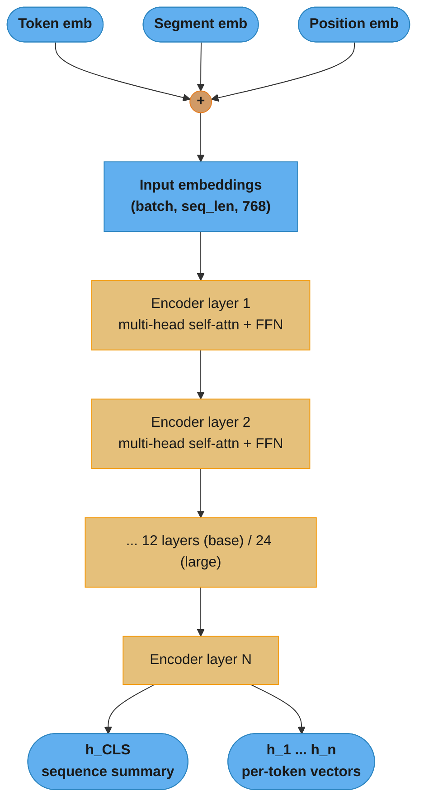
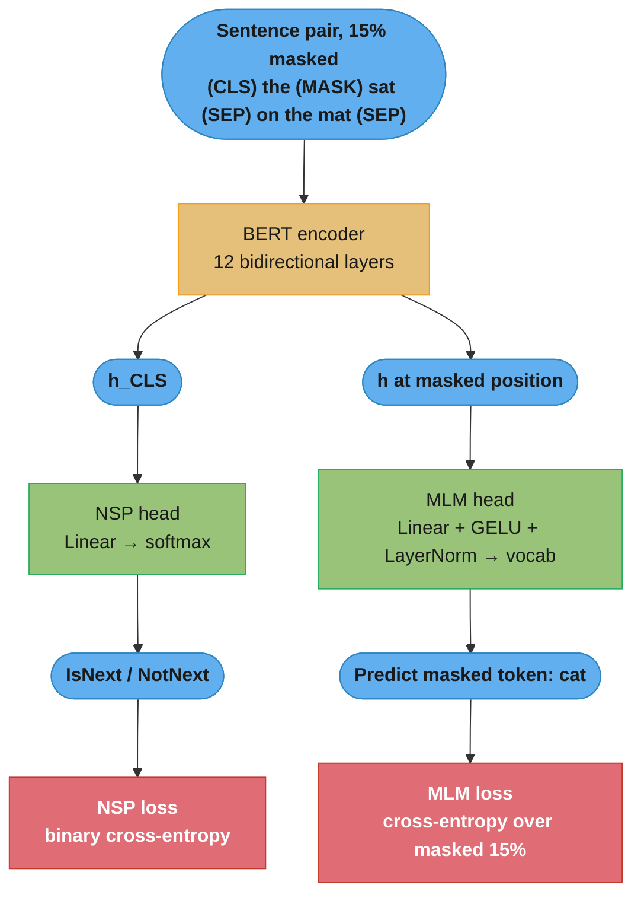
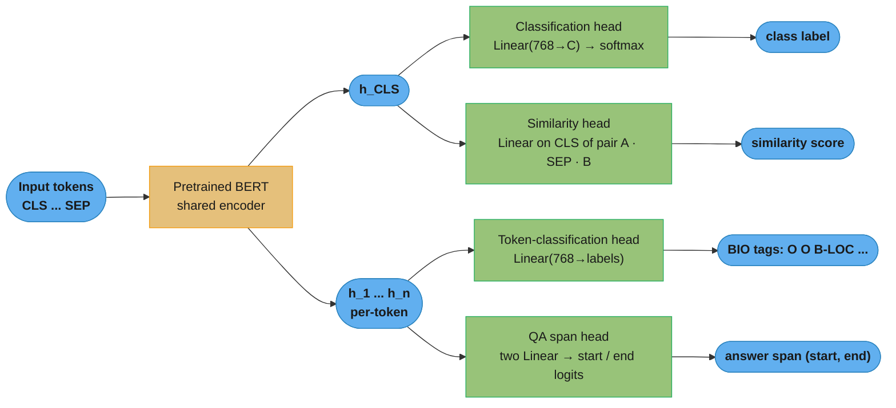

# BERT and Pretrained Language Models

> This file is a deep-dive sub-file of the [Natural Language Processing](README.md) module.
> It covers encoder-only pretrained models: BERT, RoBERTa, DeBERTa, ALBERT, DistilBERT, and ModernBERT.
> Transformer-based generative (decoder-only) models are covered in the LLM section.

---

## 1. Concept Overview

BERT (Bidirectional Encoder Representations from Transformers, Devlin et al. 2018) marked the inflection point in NLP. Before BERT, the paradigm was **feature-based**: train a model like Word2Vec or ELMo, extract features, then train a task-specific model on top. BERT introduced the **fine-tuning paradigm**: pretrain a large bidirectional transformer on raw text, then add a simple output head and fine-tune end-to-end on each downstream task.

The result: a single pretrained model achieves state-of-the-art performance across 11 NLP tasks with minimal task-specific architecture. BERT-base achieved 80.5% on GLUE; GPT scored 72.8%. The delta wasn't engineering — it was bidirectionality.

The key innovation: BERT reads the full sequence left-to-right AND right-to-left simultaneously (via self-attention), giving every token context from both directions. GPT-style models at the time used causal (left-to-right only) attention, which lost information.

---

## 2. Intuition

One-line analogy: BERT is like a reader who reads an entire paragraph before answering any question about it — versus a reader who can only see words to the left and must predict each next word.

Mental model: Imagine fill-in-the-blank questions. "The bank can guarantee deposits will eventually cover future ___." Both "losses" and "bonuses" are plausible if you only read left-to-right. But if you also see "...will eventually cover future fines and penalties," the context makes "losses" the clear answer. BERT sees the full bidirectional context at every position, making it far better at understanding than predicting.

Why it matters: Bidirectionality enables better representations for understanding tasks — classification, NER, question answering — where the full context is available at inference time.

Key insight: BERT's `[CLS]` token representation (after fine-tuning) encodes a sentence-level summary because all other tokens attend to it and it attends to all of them through 12 layers of self-attention. Without fine-tuning, `[CLS]` is nearly useless for sentence similarity.

---

## 3. Core Principles

**Masked Language Modeling (MLM):** Randomly mask 15% of input tokens and train the model to predict the masked tokens from bidirectional context. The 15% are split: 80% replaced with `[MASK]`, 10% replaced with a random token, 10% left unchanged. The 10/10 split prevents the model from learning to only handle `[MASK]` tokens — it must always maintain good representations for all tokens.

**What this actually says.** "Hide one word in seven, then make the model guess it from everything around it — and hide it in three different disguises so it can never learn to only look for the blank."

The 15% and the 80/10/10 are two independent knobs stacked on top of each other. The first picks *how many* positions get scored; the second picks *what the input looks like* at those positions. Confusing them is the classic interview slip.

| Symbol | What it is |
|--------|------------|
| `15%` | Fraction of token positions selected for prediction. These are the only positions that produce loss |
| `80%` | Of the selected positions, the share whose input token is swapped for the literal `[MASK]` symbol |
| `10%` (random) | Selected positions whose input token is swapped for a random vocabulary token. Teaches the model to distrust every input, not just blanks |
| `10%` (unchanged) | Selected positions left showing the true token. The model is still scored there, so it must produce a good representation for tokens that look perfectly normal |
| the other `85%` | Pure context. Read by attention, never scored, no gradient |

**Walk one example.** A 200-token WordPiece sequence, the counts pushed all the way through:

```
  sequence length                       200 WordPiece tokens

  selected for prediction   0.15 x 200                     =  30 positions
    -> shown as [MASK]      0.80 x  30                     =  24 positions
    -> shown a random token 0.10 x  30                     =   3 positions
    -> shown the real token 0.10 x  30                     =   3 positions

  never selected            200 - 30                       = 170 positions
                                                              (context only,
                                                               zero gradient)

  loss is averaged over all 30 selected positions -- including the 6 that
  carry no [MASK] symbol at all. Those 6 are the entire point of the split.
```

**Why the 10/10 exists and what breaks without it.** `[MASK]` appears during pretraining and never at fine-tune or inference time — a train/test mismatch baked into the objective. If all 15% were `[MASK]`, the model could learn "only build a rich prediction at positions holding the `[MASK]` symbol" and coast everywhere else, and that shortcut collapses the moment you hand it a clean sentence. The 10% random forces it to treat *every* input token as possibly corrupted; the 10% unchanged forces it to keep predicting even when the input looks correct. The price is that only 30 of 200 positions ever produce gradient, which is exactly the sample-inefficiency ELECTRA-style RTD later attacks.

**Next Sentence Prediction (NSP):** Given two sentence segments A and B, predict whether B actually follows A in the original document (50% positive, 50% random negative). Intended to teach inter-sentence coherence. RoBERTa later showed NSP hurts more than it helps — it forces shorter sequences that reduce context per training step.

**Read it like this.** "Show the model two chunks of text and ask one yes/no question: did these really appear back to back? Half the time they did, half the time the second chunk was pulled from a random document."

It is a binary classifier on `h_CLS` trained with binary cross-entropy, so the loss on a single example is just `-log p(correct label)`.

| Symbol | What it is |
|--------|------------|
| segment A, segment B | The two text chunks, joined as `[CLS] A [SEP] B [SEP]` and told apart by segment embeddings |
| `IsNext` | Positive label — B is the sentence that genuinely followed A in the source document |
| `NotNext` | Negative label — B was sampled from a random document. This is the weakness: a random document usually has a different *topic* |
| `50% / 50%` | Class balance. A model that guesses blindly gets 50% accuracy, so the metric is readable at face value |
| `-log p` | Binary cross-entropy on the predicted probability of the true label |

**Walk one example.** A batch of 256 sentence pairs, and what the loss looks like at three confidence levels:

```
  batch of 256 pairs   ->  128 IsNext   +   128 NotNext   (the 50/50 split)

  p(correct label)      loss = -log p     reading
  ------------------    -------------     -------------------------------
       0.98                0.0202         confident and right -- near-zero
       0.60                0.5108         barely above chance
       0.50                0.6931         pure coin flip; ln 2, the ceiling
                                          for an uninformative classifier
       0.02                3.9120          confident and wrong -- punished hard

  BERT reaches ~97-98% NSP accuracy, i.e. it sits near the 0.0202 row almost
  always. A task you solve that easily has almost no gradient left to give.
```

That last line is the whole critique. Because negatives come from *random* documents, "are these the same topic?" answers the question nearly as well as "is this coherent?" — so NSP saturates early and stops teaching. ALBERT's SOP fixes it by making both segments come from the same document and only swapping their order, which topic overlap cannot solve.

**Bidirectionality:** Unlike GPT's causal mask (triangle), BERT uses a full attention matrix — every token attends to every other token. This is why BERT cannot be used for autoregressive generation (no causal constraint), but excels at understanding.

**WordPiece tokenization:** Splits unknown words into subword pieces from a learned vocabulary of ~30K tokens. "unaffordable" → ["un", "##afford", "##able"]. The `##` prefix indicates a continuation subword. WordPiece minimizes the probability of training data under a language model (unlike BPE which uses merge frequency).

**Special tokens:**
- `[CLS]`: Prepended to every sequence. Its final hidden state is used as the aggregate sequence representation for classification tasks.
- `[SEP]`: Separates sentence A from sentence B in two-sequence tasks (QA, NLI, NSP).
- `[MASK]`: Used during MLM pretraining; should never appear at inference time.

---

## 4. Types / Architectures / Strategies

### 4.1 Base BERT Models

| Model | Layers | Hidden Size | Attention Heads | Parameters | GLUE |
|-------|--------|-------------|-----------------|------------|------|
| BERT-base | 12 | 768 | 12 | 110M | 79.6 |
| BERT-large | 24 | 1024 | 16 | 340M | 82.1 |

**Stated plainly.** "The 110M is not a magic number — it is the embedding table plus twelve identical copies of one encoder block, and you can derive it on a whiteboard in two minutes."

Interviewers ask you to reconstruct this precisely because it proves you know where a transformer's weights actually live. Two facts fall out of the arithmetic and surprise most candidates: the embedding table alone is over a fifth of BERT-base, and the feed-forward network holds twice the parameters of the attention it follows.

| Symbol | What it is |
|--------|------------|
| `V = 30522` | WordPiece vocabulary size. Rows in the token embedding table |
| `H = 768` | Hidden size, the width of every vector flowing through the stack (`1024` for large) |
| `L = 12` | Number of stacked encoder layers (`24` for large) |
| `A = 12` | Attention heads per layer (`16` for large) |
| `I = 4H = 3072` | Intermediate (FFN) width. Always `4x` the hidden size in BERT |
| `d_k = H / A` | Per-head dimension. `768 / 12 = 64` — and `1024 / 16 = 64` too, deliberately |
| `H x H + H` | One linear projection: a weight matrix plus its bias vector |

**Walk one example.** Rebuild BERT-base from `V=30522, H=768, L=12, I=3072`:

```
  EMBEDDINGS
    token       30522 x 768                    = 23,440,896
    position      512 x 768                    =     393,216
    segment         2 x 768                    =       1,536
    LayerNorm     2 x 768  (gain + bias)       =       1,536
                                                 -----------
                                                  23,837,184   (23.84M)

  ONE ENCODER LAYER
    Q,K,V,O     4 x (768x768 + 768)            =   2,362,368
    FFN up          768x3072 + 3072            =   2,362,368
    FFN down        3072x768 +  768            =   2,360,064
    2 LayerNorms  4 x 768                      =       3,072
                                                 -----------
                                                   7,087,872   (7.09M)

  STACK AND POOLER
    12 layers   12 x 7,087,872                 =  85,054,464
    pooler          768x768 + 768              =     590,592

  TOTAL       23,837,184 + 85,054,464 + 590,592 = 109,482,240   -> "110M"
```

Same recipe with `H=1024, L=24, I=4096` gives `31.78M + 24 x 12.60M + 1.05M = 335.1M`, the figure the paper rounds to "340M". Note where the mass sits: the FFN pair is `4,722,432` of each layer's `7,087,872`, or two-thirds of every block, which is why FFN-targeted pruning and MoE routing pay off more than attention surgery.

**Why `d_k = 64` in both sizes.** Multi-head attention splits `H` into `A` heads of width `H/A` and concatenates them back, so the head count never changes the parameter count — `4 x (H x H + H)` is identical whether you run 1 head or 16. Going from base to large, Devlin et al. raised `H` from 768 to 1024 *and* `A` from 12 to 16 precisely so `d_k` stays 64. That matters because attention scores are divided by `sqrt(d_k) = 8`; holding `d_k` fixed keeps the pre-softmax logit scale identical across model sizes, so the same learning rates and initialization schemes transfer without retuning.

### 4.2 BERT Variants

| Model | Key Change vs BERT | When to Use |
|-------|--------------------|-------------|
| **RoBERTa** (Liu et al., 2019) | No NSP, dynamic masking (mask changes every epoch), larger batches (8K), more data (160GB vs 16GB), longer training | Better general-purpose encoder; default choice when BERT is considered |
| **ALBERT** (Lan et al., 2019) | Cross-layer parameter sharing + factorized embedding decomposition (vocab_embed 128 → project to 768) + SOP (sentence order prediction) instead of NSP | When parameter count matters; 12M vs 110M params with competitive performance |
| **DeBERTa** (He et al., 2020) | Disentangled attention: separate content and position embeddings with two attention matrices; enhanced mask decoder for MLM pretraining | Best encoder for tasks requiring precise positional understanding; DeBERTa-v3-large scores 91.9 on SQuAD 2.0 |
| **DeBERTa-v3** (He et al., 2021) | RTD (Replaced Token Detection, ELECTRA-style) training objective instead of MLM; parameter-efficient | Current top encoder for most NLU tasks; 86.8 GLUE with 183M params |
| **DistilBERT** (Sanh et al., 2019) | Knowledge distillation from BERT-base to 6-layer student; 40% smaller, 60% faster, 97% of BERT performance | Production latency-constrained applications |
| **ModernBERT** (Warner et al., 2024) | Flash Attention 2, unpadding (removes padding tokens from computation), RoPE positional encoding, alternating local/global attention, extended context (8192 tokens), trained on 2T tokens | State-of-the-art as of 2024; ~2x faster than DeBERTa-v3 on GPU, same or better quality |

**Put simply.** ALBERT's `vocab_embed 128 → project to 768` says: "stop giving every one of 30,000 vocabulary rows a full 768-wide vector. Give each row a skinny 128-wide vector and let one shared matrix stretch it to 768 on the way in."

The insight is that a token embedding is context-*free* — it only has to encode what a word means in isolation — while `H` is sized for the context-*dependent* work the encoder does. Tying those two dimensions together, as BERT does, is what makes the embedding table balloon.

| Symbol | What it is |
|--------|------------|
| `V = 30000` | ALBERT vocabulary size |
| `E = 128` | Factorized embedding dimension. The width of the context-free lookup |
| `H` | Hidden size the encoder actually runs at (`768` base, `4096` xxlarge) |
| `V x H` | BERT's direct table: one full-width row per vocabulary entry |
| `V x E + E x H` | ALBERT's two-step table: skinny lookup, then one shared projection up to `H` |
| cross-layer sharing | All `L` layers reuse one set of `W_Q, W_K, W_V` and FFN weights, so unique layer params drop from `L x 7.09M` to `1 x 7.09M` |

**Walk one example.** Both ALBERT tricks, priced out against BERT-base:

```
  FACTORIZED EMBEDDING              V=30000, E=128, H=768
    BERT direct     30000 x 768                   = 23,040,000
    ALBERT step 1   30000 x 128                   =  3,840,000
    ALBERT step 2      128 x 768                  =     98,304
                                                    ----------
                    ALBERT total                  =  3,938,304
    saving          23,040,000 - 3,938,304        = 19,101,696   (5.85x smaller)

  The gap widens with H.  At ALBERT-xxlarge's H = 4096:
    direct          30000 x 4096                  = 122.88M
    factorized      30000x128 + 128x4096          =   4.36M
    saving                                        = 118.52M

  CROSS-LAYER SHARING               one 7,087,872-param block, reused
    BERT-base       12 x 7,087,872                = 85,054,464
    ALBERT-base      1 x 7,087,872                =  7,087,872
    saving                                        = 77,966,592

  ALBERT-base total   3,938,304 + 7,087,872       = 11,026,176  -> "12M"
  vs BERT-base                                      109,482,240 -> "110M"
```

**Why the sharing does not cost as much quality as it should.** Reusing one block across 12 layers is mathematically the same as running one layer 12 times with different inputs — a recurrent transformer. Parameter count collapses, but **compute does not**: every one of the 12 passes still runs in full, which is exactly why ALBERT-xxlarge is 3x *slower* than BERT-large despite having fewer unique weights. Read the "235M params, 91.0 GLUE" row in Section 8 with that in mind: ALBERT trades memory for nothing on the latency axis. DistilBERT makes the opposite trade — `67M / 110M = 0.609`, so 39% fewer parameters *and* 6 fewer layers to execute, which is where the real 1.6x speedup comes from.

### 4.3 Fine-Tuning Heads

| Task Type | Head Architecture | Output |
|-----------|-------------------|--------|
| Text classification | Linear on `[CLS]` → softmax | class probabilities |
| Token classification (NER, POS) | Linear on each token → softmax | per-token label |
| Extractive QA (start/end span) | Two linear layers on all tokens | start logit, end logit per token |
| Sentence pair similarity | Linear on `[CLS]` of [A, SEP, B] → sigmoid | similarity score |
| Masked LM head (pretraining) | Linear + GELU + LayerNorm + output → vocab_size | token probabilities |

---

## 5. Architecture Diagrams

### BERT Input Construction

```
Input:    "The cat sat"         "on the mat"
Tokens:   [CLS] The cat sat [SEP] on the mat [SEP]
Segment:   0    0   0   0    0    1  1   1    1
Position:  0    1   2   3    4    5  6   7    8

Final input embedding = token_embed + segment_embed + position_embed
```

### WordPiece Tokenization Flow


The `##` prefix marks a continuation subword; every piece indexes one row of the 30522×768 embedding table, so an out-of-vocabulary word never becomes UNK — it decomposes into known pieces the model has already learned.

### BERT Encoder Stack



Every layer applies bidirectional self-attention, so each output vector already carries context from both sides — the architectural break from GPT's causal stack, and the reason h_CLS can serve as a whole-sequence summary after fine-tuning.

### MLM + NSP Pretraining



Both objectives train jointly from a single forward pass: MLM predicts the masked tokens from bidirectional context, while NSP classifies coherence from h_CLS. RoBERTa later deleted the NSP branch entirely, keeping only the MLM loss — and scored higher.

### Fine-Tuning Heads



One shared encoder feeds four interchangeable heads: classification and similarity read h_CLS, while NER and extractive QA read every per-token vector. The heads are tiny — the bulk of the parameters and knowledge live in the shared BERT below them.

---

## 6. How It Works — Detailed Mechanics

### Fine-Tuning for Text Classification

```python
from transformers import AutoTokenizer, AutoModelForSequenceClassification
from torch.optim import AdamW
from torch.utils.data import DataLoader, Dataset
import torch
from typing import List

class TextDataset(Dataset):
    def __init__(self, texts: List[str], labels: List[int], tokenizer, max_length: int = 128):
        self.encodings = tokenizer(
            texts,
            truncation=True,
            padding="max_length",
            max_length=max_length,
            return_tensors="pt",
        )
        self.labels = torch.tensor(labels, dtype=torch.long)

    def __len__(self) -> int:
        return len(self.labels)

    def __getitem__(self, idx: int) -> dict:
        return {
            "input_ids": self.encodings["input_ids"][idx],
            "attention_mask": self.encodings["attention_mask"][idx],
            "labels": self.labels[idx],
        }


def fine_tune_bert(
    model_name: str = "bert-base-uncased",
    train_texts: List[str] = [],
    train_labels: List[int] = [],
    num_labels: int = 2,
    num_epochs: int = 3,
    lr: float = 2e-5,
    batch_size: int = 16,
) -> AutoModelForSequenceClassification:
    """
    Fine-tune BERT for sequence classification.

    Critical hyperparameters:
    - lr: 2e-5 to 5e-5 ONLY. Higher causes catastrophic forgetting.
    - batch_size: 16 or 32. Smaller = noisier gradients.
    - num_epochs: 3-5. More causes overfitting on small datasets.
    """
    tokenizer = AutoTokenizer.from_pretrained(model_name)
    model = AutoModelForSequenceClassification.from_pretrained(
        model_name, num_labels=num_labels
    )

    dataset = TextDataset(train_texts, train_labels, tokenizer)
    loader = DataLoader(dataset, batch_size=batch_size, shuffle=True)

    # Separate weight decay: apply to weight matrices, not biases/LayerNorm
    no_decay = ["bias", "LayerNorm.weight"]
    optimizer_grouped_parameters = [
        {
            "params": [p for n, p in model.named_parameters()
                       if not any(nd in n for nd in no_decay)],
            "weight_decay": 0.01,
        },
        {
            "params": [p for n, p in model.named_parameters()
                       if any(nd in n for nd in no_decay)],
            "weight_decay": 0.0,
        },
    ]
    optimizer = AdamW(optimizer_grouped_parameters, lr=lr)

    model.train()
    device = torch.device("cuda" if torch.cuda.is_available() else "cpu")
    model.to(device)

    for epoch in range(num_epochs):
        total_loss = 0.0
        for batch in loader:
            optimizer.zero_grad()
            outputs = model(
                input_ids=batch["input_ids"].to(device),
                attention_mask=batch["attention_mask"].to(device),
                labels=batch["labels"].to(device),
            )
            loss = outputs.loss
            loss.backward()
            # Gradient clipping: prevents exploding gradients in early fine-tuning
            torch.nn.utils.clip_grad_norm_(model.parameters(), max_norm=1.0)
            optimizer.step()
            total_loss += loss.item()
        print(f"Epoch {epoch+1}: avg loss = {total_loss / len(loader):.4f}")

    return model
```

### Embedding Extraction with Pooling Strategies

```python
from transformers import AutoTokenizer, AutoModel
import torch
import torch.nn.functional as F
from typing import List
import numpy as np


def extract_embeddings(
    texts: List[str],
    model_name: str = "bert-base-uncased",
    pooling: str = "mean",   # "cls" | "mean" | "max"
    max_length: int = 512,
) -> np.ndarray:
    """
    Extract sentence embeddings from BERT.

    Pooling strategies:
    - "cls": Take [CLS] token hidden state. Good ONLY after fine-tuning on sentence tasks.
             Without fine-tuning, [CLS] is a poor sentence representation.
    - "mean": Average over all non-padding token hidden states. Generally best for
              semantic similarity on raw (not fine-tuned) BERT.
    - "max": Max pooling over token dimension. Captures most "salient" features.
    """
    tokenizer = AutoTokenizer.from_pretrained(model_name)
    model = AutoModel.from_pretrained(model_name)
    model.eval()

    inputs = tokenizer(
        texts,
        padding=True,
        truncation=True,
        max_length=max_length,
        return_tensors="pt",
    )

    with torch.no_grad():
        outputs = model(**inputs)
        hidden_states = outputs.last_hidden_state  # (batch, seq_len, hidden_size)

    if pooling == "cls":
        embeddings = hidden_states[:, 0, :]  # [CLS] is always position 0
    elif pooling == "mean":
        # Mask out padding tokens before averaging
        mask = inputs["attention_mask"].unsqueeze(-1).float()  # (batch, seq_len, 1)
        embeddings = (hidden_states * mask).sum(1) / mask.sum(1)
    elif pooling == "max":
        mask = inputs["attention_mask"].unsqueeze(-1).bool()
        hidden_states[~mask] = -1e9  # mask padding before max
        embeddings, _ = hidden_states.max(dim=1)
    else:
        raise ValueError(f"Unknown pooling strategy: {pooling}")

    # L2 normalize for cosine similarity computation
    embeddings = F.normalize(embeddings, p=2, dim=-1)
    return embeddings.numpy()
```

**In plain terms.** The two dense lines above — `(hidden_states * mask).sum(1) / mask.sum(1)` and `F.normalize(embeddings, p=2, dim=-1)` — say: "average the real tokens and ignore the padding, then shrink every vector onto the unit sphere so comparing two of them is a single dot product."

Both lines are one-liners that quietly decide whether your retrieval system works. Forget the mask and padding drags every short sentence toward the same point; forget the normalize and your cosine similarity silently becomes a magnitude contest.

| Symbol | What it is |
|--------|------------|
| `hidden_states` | `(batch, seq_len, hidden_size)` — one 768-dim vector per token position |
| `mask` | The attention mask reshaped to `(batch, seq_len, 1)`: `1` for a real token, `0` for padding |
| `hidden_states * mask` | Zeroes out every padding vector before it can pollute the sum |
| `.sum(1)` | Adds across the sequence axis, collapsing `seq_len` away |
| `mask.sum(1)` | Counts the real tokens — the correct denominator, not `seq_len` |
| `p=2` | The L2 (Euclidean) norm: `sqrt(sum of squares)` |
| `F.normalize(..., p=2)` | Divides each vector by its own L2 norm, making its length exactly `1.0` |

**Walk one example.** A 4-position sequence in 3 dimensions, 2 real tokens and 2 padding:

```
  hidden_states          mask
    t1  [1.0, 0.0, 1.0]    1   real
    t2  [0.0, 2.0, 0.0]    1   real
    t3  [3.0, 1.0, 0.0]    0   PAD  (still a nonzero vector!)
    t4  [0.0, 0.0, 5.0]    0   PAD

  MASKED MEAN (correct)
    hidden_states * mask -> [1,0,1], [0,2,0], [0,0,0], [0,0,0]
    .sum(1)              =  [1.0, 2.0, 1.0]
    mask.sum(1)          =  2
    mean                 =  [0.5, 1.0, 0.5]

  L2 NORMALIZE
    norm = sqrt(0.25 + 1.00 + 0.25) = sqrt(1.5) = 1.2247
    unit = [0.5, 1.0, 0.5] / 1.2247 = [0.4082, 0.8165, 0.4082]
    check: 0.4082^2 + 0.8165^2 + 0.4082^2 = 1.0

  NAIVE MEAN (forgot the mask -- divides by seq_len = 4)
    .sum(1)/4            =  [1.0, 0.75, 1.5]
    unit                 =  [0.5121, 0.3841, 0.7682]

  cosine(correct, naive) =  0.8363
```

That last number is the damage: one forgotten mask moved the sentence vector 0.16 cosine away from where it belonged, and it moved it *toward whatever garbage sat in the padding slots* — which is shared across the batch, so every short sentence drifts toward the same wrong place and they all start looking similar to each other. Once vectors are unit-length, cosine similarity and the dot product are the same operation, which is why every vector database asks for normalized input: it can then use fast inner-product search and skip the division entirely.

### Token Classification (NER)

```python
from transformers import AutoTokenizer, AutoModelForTokenClassification
import torch
from typing import List, Tuple


def predict_ner(
    text: str,
    model_name: str = "dslim/bert-base-NER",
) -> List[Tuple[str, str]]:
    """
    Run NER with a fine-tuned BERT model.
    Returns list of (word, label) pairs.

    dslim/bert-base-NER: fine-tuned on CoNLL-2003
    Labels: O, B-PER, I-PER, B-ORG, I-ORG, B-LOC, I-LOC, B-MISC, I-MISC
    """
    tokenizer = AutoTokenizer.from_pretrained(model_name)
    model = AutoModelForTokenClassification.from_pretrained(model_name)
    model.eval()

    inputs = tokenizer(text, return_tensors="pt", return_offsets_mapping=True)
    offset_mapping = inputs.pop("offset_mapping")

    with torch.no_grad():
        outputs = model(**inputs)

    logits = outputs.logits  # (1, seq_len, num_labels)
    predictions = logits.argmax(dim=-1)[0]  # (seq_len,)
    id2label = model.config.id2label

    # Align subword predictions back to original words
    results = []
    word_ids = inputs.word_ids()  # subword -> word index mapping
    previous_word_id = None

    for idx, word_id in enumerate(word_ids):
        if word_id is None or word_id == previous_word_id:
            # Skip [CLS], [SEP], and continuation subwords
            continue
        label = id2label[predictions[idx].item()]
        # Get original word by using offset mapping
        start, end = offset_mapping[0][idx]
        word = text[start:end]
        results.append((word, label))
        previous_word_id = word_id

    return results
```

### Knowledge Distillation (DistilBERT pattern)

```python
import torch
import torch.nn as nn
import torch.nn.functional as F
from transformers import AutoModelForSequenceClassification, AutoTokenizer
from typing import Optional


def distillation_loss(
    student_logits: torch.Tensor,    # (batch, num_classes)
    teacher_logits: torch.Tensor,    # (batch, num_classes)
    true_labels: torch.Tensor,       # (batch,)
    temperature: float = 4.0,
    alpha: float = 0.7,
) -> torch.Tensor:
    """
    Compute combined distillation + task loss.

    alpha: weight for soft-label (distillation) loss
    (1 - alpha): weight for hard-label (cross-entropy) loss
    temperature: higher T softens teacher distribution, revealing
                 relative similarities between classes

    DistilBERT uses T=4, alpha=0.5 with cosine embedding loss as third term.
    """
    # Soft labels from teacher (temperature-scaled)
    soft_teacher = F.softmax(teacher_logits / temperature, dim=-1)
    soft_student = F.log_softmax(student_logits / temperature, dim=-1)

    # KL divergence loss (soft labels) — multiply by T^2 to restore gradient scale
    distill_loss = F.kl_div(soft_student, soft_teacher, reduction="batchmean") * (temperature ** 2)

    # Hard label cross-entropy
    task_loss = F.cross_entropy(student_logits, true_labels)

    return alpha * distill_loss + (1 - alpha) * task_loss
```

**What it means.** `alpha * distill_loss + (1 - alpha) * task_loss` says: "learn 70% from what the teacher *believed* and 30% from what the label *says*, because the teacher's uncertainty carries information a one-hot label throws away."

A hard label tells the student "class 0". The teacher's softened distribution tells it "class 0, but class 1 was a close call and class 3 was never in the running" — the relative ordering of the wrong answers is free supervision, and that is the entire mechanism behind dark knowledge.

| Symbol | What it is |
|--------|------------|
| `T` (temperature) | Divisor applied to logits before softmax. `T = 1` is normal; `T = 4` flattens the distribution so small probabilities become visible |
| `soft_teacher` | `softmax(teacher_logits / T)` — the teacher's belief, deliberately blurred |
| `soft_student` | `log_softmax(student_logits / T)` — student's belief in log space, which is what `kl_div` expects as input |
| `KL(teacher \|\| student)` | How many extra nats it costs to describe the teacher's distribution using the student's. `0` when identical |
| `* T ** 2` | Gradient rescale. Softening by `T` shrinks gradients by roughly `1/T^2`; this multiplies the scale back |
| `alpha = 0.7` | Weight on the soft (teacher-matching) term |
| `1 - alpha = 0.3` | Weight on the hard-label cross-entropy. Keeps the student anchored to ground truth if the teacher is wrong |

**Walk one example.** Teacher logits `[4.0, 2.0, 1.0, 0.5]`, student `[3.0, 2.5, 1.0, 0.5]`, true label `0`, `T = 4.0`, `alpha = 0.7`:

```
  STEP 1 -- what temperature does to the teacher
    T = 1   softmax([4.0, 2.0, 1.0, 0.5]) = [0.8228, 0.1114, 0.0410, 0.0248]
    T = 4   softmax([1.0, 0.5, 0.25, 0.125])
                                          = [0.4007, 0.2430, 0.1893, 0.1670]

    At T=1 the answer is 82% class 0 and the runners-up are nearly invisible.
    At T=4 you can finally SEE that class 1 > class 2 > class 3. That ranking
    is the "dark knowledge" the student is being taught.

  STEP 2 -- the student, same temperature
    T = 4   softmax([0.75, 0.625, 0.25, 0.125])
                                          = [0.3307, 0.2918, 0.2006, 0.1770]

  STEP 3 -- distillation term
    KL(teacher || student)                = 0.011875
    x T^2 = x 16                          = 0.1900

  STEP 4 -- task term (hard label, T = 1)
    softmax(student)                      = [0.5483, 0.3325, 0.0742, 0.0450]
    cross_entropy, true label 0 = -ln(0.5483)
                                          = 0.6010

  STEP 5 -- combine
    0.7 x 0.1900                          = 0.1330
    0.3 x 0.6010                          = 0.1803
    total loss                            = 0.3133
```

**Why the `T ** 2` is not optional.** Compare the KL at each temperature on the exact same pair of logit vectors: `0.1731` at `T = 1` versus `0.011875` at `T = 4` — softening shrank the disagreement roughly 15-fold, and with it the gradient. Multiply by `T^2 = 16` and you get `0.1900`, back in the same range as the `0.6010` task term. Skip the `* (temperature ** 2)` and the soft term becomes numerically negligible next to the hard term; `alpha = 0.7` would then be a lie, because the distillation signal you *think* you weighted at 70% contributes almost nothing and the student learns from one-hot labels alone.

---

## 7. Real-World Examples

**Google Search (2019):** BERT deployed in Google Search to better understand natural language queries. "Can you get medicine for someone pharmacy" — before BERT, "for someone" was ignored; BERT understood the query as about getting medicine on behalf of another person, changing result ranking significantly. This was called one of the biggest leaps in Search history.

**Hugging Face BERT for finance:** FinBERT (ProsusAI/finbert) — BERT-base fine-tuned on 10K financial news articles for sentiment (positive/negative/neutral). Production use at hedge funds for earnings call sentiment scoring. Key finding: general BERT scores 72% F1 on financial sentiment; FinBERT scores 88% F1. Domain-specific fine-tuning adds 16 F1 points.

**DeBERTa in medical NLP:** DeBERTa-v3-large fine-tuned on clinical notes for ICD-10 code extraction. Disentangled attention is particularly valuable for clinical text where positional context matters (e.g., "history of" before a condition means it's past, not current). DeBERTa outperforms RoBERTa by 4 F1 points on the task.

**ModernBERT for code search:** ModernBERT-large processes 8192-token contexts, enabling retrieval over entire function bodies and docstrings — vs BERT's 512 limit that required truncation. GitHub Copilot's embedding-based retrieval can now index complete file contexts rather than just snippets.

---

## 8. Tradeoffs

| Model | Size | Speed (V100) | GLUE | Best For |
|-------|------|-------------|------|---------|
| BERT-base | 110M | 1x (baseline) | 79.6 | Baseline, well-documented |
| RoBERTa-large | 355M | 0.3x | 86.4 | Best quality in BERT family |
| ALBERT-xxlarge | 235M | 0.2x | 91.0 | Research, small deployment footprint |
| DeBERTa-v3-large | 183M | 0.4x | 91.4 | Production NLU, best quality/size ratio |
| DistilBERT | 67M | 1.6x | 77.0 | Latency-critical production |
| ModernBERT-large | 395M | 0.6x (FA2) | 90.0+ | Long contexts (8K+), modern hardware |

| Fine-Tuning vs Feature-Based | |
|-------------------------------|--|
| Fine-tuning | Better performance (all weights adapt), simpler pipeline, risk of catastrophic forgetting on small data |
| Feature-based | Faster training (frozen BERT), useful when target task training data is tiny (<500 examples) |

| NSP (BERT) vs No NSP (RoBERTa) | |
|----------------------------------|--|
| NSP forces shorter sequences | Each training example is split across two sentences, reducing per-example context |
| No NSP = full sequence MLM | RoBERTa packs full 512-token sequences → better contextual representations |
| NSP misleading signal | Negative examples are random sentences, too easy to discriminate via topic alone, not coherence |

---

## 9. When to Use / When NOT to Use

### Use BERT/encoder models when:

- Task is classification, NER, extractive QA, or semantic similarity — not generation
- You need bidirectional context at inference time (full document is available)
- Latency budget allows 10-50ms GPU inference
- You want to fine-tune on labeled data rather than few-shot prompt

### Use DeBERTa-v3 specifically when:

- Maximizing NLU accuracy (leaderboard-competitive performance)
- Tasks where positional information matters (clinical notes, legal contracts)
- Dataset is small (DeBERTa's disentangled attention prevents overfitting better)

### Use DistilBERT when:

- Serving >1000 RPS on CPU without GPU
- Memory budget under 500MB per model instance
- Willing to trade 3-5 F1 points for 1.6x throughput

### Do NOT use encoder-only models when:

- Task requires text generation (use decoder-only models)
- Zero-shot classification without labeled data (use zero-shot prompting with LLM)
- Task involves reasoning chains (use chain-of-thought with generative models)
- You need to generate explanations for predictions (encoder models produce classifications, not text)

---

## 10. Common Pitfalls

### Pitfall 1: Learning rate too high

```python
# BROKEN: LR from standard training is orders of magnitude too high
optimizer = AdamW(model.parameters(), lr=1e-3)   # Normal DL LR → catastrophic forgetting

# FIXED: Use tiny learning rates for fine-tuning pretrained transformers
optimizer = AdamW(model.parameters(), lr=2e-5)   # Recommended range: 2e-5 to 5e-5
```

Production incident: Team fine-tuned BERT for intent classification on 50K examples. Used lr=1e-3 (standard). Training loss dropped fast — looked successful. Evaluation showed random performance (25% on 4-class task). Root cause: pretrained weights were destroyed in epoch 1 at high LR. The model re-learned the task from scratch as a 110M-parameter classification model without pretrained knowledge — effectively identical to a random initialization. Reducing to lr=2e-5 achieved 91% accuracy.

### Pitfall 2: Using [CLS] without fine-tuning for similarity

```python
# BROKEN: Raw BERT [CLS] for sentence similarity is poor
model = AutoModel.from_pretrained("bert-base-uncased")
cls_embed = model(**inputs).last_hidden_state[:, 0, :]
similarity = cosine_similarity(cls_embed[0], cls_embed[1])
# Correlation with human similarity: ~0.2 — worse than random word2vec average

# FIXED: Use mean pooling OR use a model fine-tuned for similarity (SBERT)
from sentence_transformers import SentenceTransformer
sbert = SentenceTransformer("sentence-transformers/all-MiniLM-L6-v2")
embs = sbert.encode(["sentence1", "sentence2"])
# Spearman correlation with human similarity: ~0.85
```

### Pitfall 3: Sequence length 512 OOM on large batches

```python
# BROKEN: batch_size=32 with max_length=512 on 16GB GPU → OOM
# BERT-base memory: 32 * 512 * 768 * 12 layers * 4 bytes * overhead ≈ 16GB+

# FIXED option 1: Reduce batch size, increase grad accumulation
batch_size = 8
gradient_accumulation_steps = 4   # effective batch = 32

# FIXED option 2: Use dynamic padding (pad to longest in batch, not max_length)
tokenizer(texts, padding="longest", truncation=True, max_length=512)
# For short-text tasks (avg 40 tokens), this cuts memory ~12x vs padding to 512
```

**The idea behind it.** `32 * 512 * 768 * 12 layers * 4 bytes * overhead` says: "every token, at every layer, leaves a 768-number footprint behind that backprop needs later — and the word `overhead` is doing an enormous amount of work in that sentence."

The literal product is only 0.6 GB. The reason the real answer is 16 GB is that the terms hidden inside "overhead" are bigger than the term written down, and one of them grows with the *square* of sequence length.

| Symbol | What it is |
|--------|------------|
| `32` | Batch size — how many sequences are in flight together |
| `512` | Sequence length in tokens. The term that appears squared in attention |
| `768` | Hidden size. One activation vector per token per layer |
| `12` | Layers. Every layer stores its own activations for the backward pass |
| `4 bytes` | FP32. Halves to 2 with mixed precision |
| `overhead` | The unwritten terms: the `4H`-wide FFN intermediates, the `batch x heads x 512 x 512` attention score matrices, gradients, and AdamW's two optimizer moments |

**Walk one example.** Price the real terms at `batch=32, seq=512` on BERT-base:

```
  written-down term
    hidden activations   32 x 512 x  768 x 12 x 4 bytes  =  0.60 GB

  what "overhead" actually contains
    FFN intermediates    32 x 512 x 3072 x 12 x 4 bytes  =  2.42 GB   (4x wider)
    attention scores     32 x 12 heads x 512 x 512 x 12 x 4 bytes
                                                         =  4.83 GB   <- largest
                                                            ---------
    activation subtotal                                  =  7.85 GB

    AdamW state          110M params x (4+4+4+4) bytes   =  1.76 GB
    (weights + grads + first moment + second moment)

  plus fragmentation, cuDNN workspace, and the fp32 master copy -> 16GB card OOMs

  DROP TO batch = 8 (the fix, with grad accumulation x4)
    hidden               0.15 GB
    FFN                  0.60 GB
    attention            1.21 GB
    activation subtotal  1.96 GB     -- 4x smaller, effective batch unchanged
```

**Why sequence length hurts four times harder than batch size.** The attention score matrix is `batch x heads x seq x seq`, so halving the batch halves it but halving the sequence *quarters* it. Going from 512 to 128 tokens shrinks that 4.83 GB term by `(512/128)^2 = 16x`, down to 0.30 GB. That quadratic is the whole reason for the second fix above: dynamic padding to the batch's longest sequence rather than a fixed 512 does not just save the linear activation terms — on a corpus averaging 40 tokens it kills the dominant quadratic term almost entirely, which is where the "~12x" figure comes from (`512 / 40 = 12.8` on the linear terms, far more on attention). It is also why ModernBERT's sliding-window local attention matters: capping the window at 128 makes the cost linear in sequence length instead of quadratic, which is what makes an 8192-token encoder affordable at all.

### Pitfall 4: Catastrophic forgetting on small datasets

```python
# For <1000 examples: BERT often forgets pretrained representations
# within the first fine-tuning epoch.

# FIXED: Layer-wise learning rate decay (lower LR for lower layers)
def get_layerwise_optimizer(model, base_lr: float = 2e-5, decay: float = 0.95):
    layers = [model.bert.embeddings] + list(model.bert.encoder.layer)
    params = []
    for i, layer in enumerate(layers):
        lr = base_lr * (decay ** (len(layers) - i))
        params.append({"params": layer.parameters(), "lr": lr})
    params.append({"params": model.classifier.parameters(), "lr": base_lr * 10})
    return AdamW(params)
```

**What the formula is telling you.** `lr = base_lr * (decay ** (len(layers) - i))` says: "the deeper a layer sits in the stack, the less you are allowed to move it — and the brand-new classifier on top, which knows nothing, gets to move fastest of all."

The premise is that BERT's layers are not interchangeable. Lower layers hold general lexical and syntactic structure learned from billions of tokens; upper layers hold the task-adjacent semantics you actually want to reshape. A single flat learning rate treats a 1,000-example dataset as sufficient evidence to rewrite both, and it is not.

| Symbol | What it is |
|--------|------------|
| `layers` | `[embeddings] + 12 encoder layers` = 13 entries, ordered bottom to top |
| `i` | Index into that list. `i = 0` is the embedding table, `i = 12` is the top encoder layer |
| `len(layers) - i` | Depth from the top. `13` for the embeddings, `1` for the topmost layer |
| `decay = 0.95` | Per-level multiplier. Each step downward shaves 5% off the learning rate |
| `base_lr = 2e-5` | The reference rate the top of the encoder is scaled from |
| `base_lr * 10` | The classifier head's rate. Randomly initialized, so it *should* move fast |

**Walk one example.** `base_lr = 2e-5`, `decay = 0.95`, 13 layers:

```
  component              i     exponent (13 - i)     lr
  ------------------   ----   -----------------   -----------
  classifier head        --          --            2.0000e-04   <- 10x base
  encoder layer 12       12           1            1.9000e-05
  encoder layer  9        9           4            1.6290e-05
  encoder layer  6        6           7            1.3967e-05
  encoder layer  3        3          10            1.1975e-05
  encoder layer  1        1          12            1.0807e-05
  embeddings              0          13            1.0267e-05   <- slowest

  spread across the encoder   1.9000e-05 / 1.0267e-05  =  1.85x
  head vs embeddings          2.0000e-04 / 1.0267e-05  = 19.48x
```

**Why `0.95` and not something aggressive.** The encoder spread is only `1.85x` end to end — this is a gentle brake, not a freeze. That is deliberate: the layers still adapt, just at graded speed, so you keep the benefit of full fine-tuning while removing the failure mode where epoch 1 scrambles the embedding table before the head has learned anything useful. Push `decay` to `0.8` and the embeddings get `2e-5 * 0.8^13`, effectively frozen; leave it at `1.0` and you are back to the flat schedule that produced the bimodal seed distribution. The `10x` on the classifier is the other half of the trick: without it, the random head learns at the same crawl as the pretrained encoder, so the encoder spends early steps chasing gradients routed through a head that is still noise.

### Pitfall 5: Evaluating at the wrong granularity for NER

```python
# BROKEN: Token-level accuracy inflated by 'O' class dominance
# In a document where 90% of tokens are 'O', a model predicting all 'O'
# achieves 90% token accuracy but finds no entities.

# FIXED: Always use entity-level (span-level) F1, not token-level
from seqeval.metrics import f1_score, classification_report

# seqeval.f1_score computes exact span match (both type AND boundaries must match)
f1 = f1_score(true_labels, pred_labels)   # entity-level
# vs sklearn which computes per-token accuracy/F1 (incorrect for NER)
```

---

## 11. Technologies & Tools

| Tool | Purpose | Notes |
|------|---------|-------|
| `transformers` (HuggingFace) | Load, fine-tune, and inference with BERT variants | `AutoModel`, `Trainer`, `pipeline` API |
| `sentence-transformers` | SBERT and sentence embedding models | Built on HuggingFace; handles pooling and training |
| `datasets` (HuggingFace) | Download and preprocess NLP benchmark datasets | GLUE, SuperGLUE, CoNLL-2003, SQuAD included |
| `seqeval` | Sequence labeling evaluation (entity-level F1 for NER) | pip install seqeval; computes span-level metrics |
| `PEFT` (HuggingFace) | LoRA/QLoRA fine-tuning of BERT-scale models | Reduces GPU memory for fine-tuning by 4-8x |
| `optimum` (HuggingFace) | ONNX export, quantization, hardware-optimized inference | INT8 quantization gives 2x speedup with <1% quality loss |
| BerViz | Attention visualization for BERT | Interactive head-level attention patterns |
| ModernBERT | Latest (2024) encoder model | Flash Attention 2, unpadding, 8192 token context |

---

## 12. Interview Questions with Answers

**Q: What is Masked Language Modeling and why does BERT use 15% with the 80/10/10 split?**
MLM randomly masks 15% of tokens and trains the model to predict them from bidirectional context. The 15% rate balances efficiency (enough masked tokens to learn from) against representation quality (context tokens must remain meaningful). The 80/10/10 split — 80% replace with `[MASK]`, 10% random word, 10% unchanged — prevents the model from only learning to handle `[MASK]` at fine-tune time. At inference, `[MASK]` never appears, so the model must maintain good representations for real tokens (the 20% of masked positions where it sees the real token or a random token teach it this).

**Q: Why did RoBERTa remove NSP and what evidence supported this?**
NSP was removed because it forces shorter sequences: each training example is split into two shorter sentence segments rather than one full 512-token sequence. This reduces the average context BERT sees per training step. RoBERTa's ablation study showed that removing NSP and packing full sequences improved downstream task performance consistently across GLUE benchmarks. The NSP task itself was too easy — negative pairs are random sentences, easily distinguished by topic signals rather than actual coherence understanding.

**Q: Explain DeBERTa's disentangled attention mechanism.**
Standard BERT attention computes dot products of token embeddings that implicitly include both content and position (since content + positional embeddings are summed before the attention projection). DeBERTa separates content and position into two independent embedding vectors per token. The attention score between token i and token j is computed as the sum of four terms: (1) content-to-content: `H_i · H_j` (2) content-to-position: `H_i · P_{i|j}` (3) position-to-content: `P_{j|i} · H_j` (4) position-to-position is dropped as redundant. The relative position `P_{i|j}` encodes the signed distance from i to j. This gives the model explicit, separate control over content and relative position, improving tasks that require precise positional reasoning.

**Q: How does DistilBERT achieve 97% of BERT performance at 60% of the parameters?**
DistilBERT uses knowledge distillation: a 6-layer student is trained to match the output distribution of the 12-layer BERT teacher. The distillation loss has three terms: (1) soft-label KL divergence from teacher's temperature-scaled logits (captures relative class similarities), (2) cosine embedding similarity loss between student and teacher hidden states (forces internal representations to match), (3) standard cross-entropy on hard labels. The student initializes weights from every other layer of the teacher, keeping even-numbered layers — a practical trick that provides a strong warm start. Training takes 90 hours on 8 V100s. The key insight: teacher's soft outputs encode richer information than one-hot labels, allowing the student to learn more from fewer parameters.

**Q: What is WordPiece tokenization and how does it differ from BPE?**
WordPiece (used by BERT) and BPE (used by GPT) are both subword tokenization algorithms, but they use different merge objectives. BPE merges the most frequent adjacent pair of bytes/characters at each step. WordPiece merges pairs that maximize the language model likelihood of the training data (equivalently, merges pairs where the frequency of the pair divided by the product of individual frequencies is highest). In practice, WordPiece tends to produce more linguistically meaningful splits for inflected languages. BPE is simpler to implement and train, which is why GPT-style models adopted it. Both handle OOV by decomposing unknown words into subword pieces from a fixed vocabulary (30K for BERT, 50K for GPT-2).

**Q: Why is [CLS] a poor sentence representation without fine-tuning?**
During BERT pretraining, `[CLS]` is trained only for NSP (predicting whether two segments are consecutive). This trains it to capture coarse topic/coherence features, not semantic sentence similarity. The `[CLS]` representation is "anisotropic" — token embeddings cluster in a cone rather than uniformly occupying the embedding space. Cosine similarities between random sentence `[CLS]` embeddings cluster around 0.9+ rather than varying with actual semantic similarity. Mean pooling over all non-padding tokens produces more isotropic representations that better reflect semantic content. Sentence-BERT solves this definitively by fine-tuning BERT on sentence pairs with contrastive loss (NLI data), teaching `[CLS]` or mean-pooled representations to be geometrically meaningful.

**Q: How do you fine-tune BERT efficiently on GPUs with limited memory?**
Four strategies: (1) Gradient accumulation — compute gradients over N micro-batches before a single optimizer step, reducing peak memory by N while maintaining effective batch size; (2) Dynamic padding — pad each batch to the longest sequence in that batch rather than a fixed max_length (saves 3-10x memory for short-text tasks); (3) Mixed precision training — use FP16 for forward/backward pass, FP32 for optimizer state (saves ~50% memory, requires loss scaling to prevent underflow); (4) Gradient checkpointing — recompute intermediate activations during backward pass instead of storing them (saves 60% activation memory at cost of ~30% more compute). For BERT-large, combining all four allows fine-tuning on 11GB consumer GPUs.

**Q: What is the difference between BERT-base and BERT-large, and when does larger help?**
BERT-base has 12 layers, 768 hidden units, 12 attention heads, 110M parameters. BERT-large has 24 layers, 1024 hidden, 16 heads, 340M parameters. BERT-large scores 2-3 points higher on GLUE (82.1 vs 79.6) and ~1.5 EM points higher on SQuAD 2.0. The benefit of BERT-large is most pronounced on complex tasks requiring multi-step reasoning or long-range dependency capture (reading comprehension, coreference). On simple classification with >10K examples and short texts, BERT-base typically matches BERT-large because the simpler tasks do not require the full representational capacity. Practical rule: start with BERT-base (3x faster inference), upgrade to BERT-large or DeBERTa-v3-large only if accuracy is below target.

**Q: How does ModernBERT handle 8192-token inputs when BERT is limited to 512?**
ModernBERT uses three architectural changes: (1) RoPE positional encoding — rotary embeddings encode relative position and can be interpolated to longer contexts (unlike BERT's absolute sinusoidal encodings that cannot extrapolate); (2) Alternating local/global attention — most layers use local sliding window attention (window size 128) for efficiency, with global attention layers every N layers for cross-document coherence; (3) Unpadding — removes padding tokens from computation entirely using custom CUDA kernels, so a batch of variable-length sequences is processed as a single concatenated sequence with special attention masking. The combination reduces computation from O(n²) to near-O(n) for most layers while maintaining quality at 8192 tokens.

**Q: What is the enhanced mask decoder in DeBERTa and why does it help?**
Standard BERT's MLM head predicts masked tokens using only the token's hidden state, which combines content and position information from self-attention. DeBERTa's Enhanced Mask Decoder (EMD) adds absolute positional encodings back into the hidden state before the MLM prediction head, using a second tiny transformer layer. This gives the model explicit absolute position information at prediction time, complementing the relative position information from disentangled attention. The intuition: relative positions are great for understanding context between tokens, but absolute positions carry syntactic information (e.g., "the first word of a sentence is more likely a noun") that helps predict masked words. EMD improved DeBERTa's MLM accuracy by ~3% and downstream task F1 by ~1%.

**Q: How do you handle domain shift when deploying a pretrained BERT model?**
Three approaches in order of cost: (1) Fine-tune on target domain data if labeled data exists (most effective; 5K+ examples recommended); (2) Continued pretraining — run MLM on unlabeled domain text first (BioBERT, LegalBERT, FinBERT all use this); (3) Use a domain-pretrained model if one exists (SciBERT for scientific text, ClinicalBERT for medical). Continued pretraining is the most cost-effective for specialized domains: train for 10-100K steps on domain corpus with the same MLM objective before fine-tuning on downstream task. Empirically, domain pretraining adds 3-8 F1 points on biomedical NER and legal classification tasks. Skip it if target domain vocabulary overlaps well with general English (consumer reviews, news).

**Q: What is sentence-order prediction (SOP) in ALBERT and why is it better than NSP?**
ALBERT replaces NSP with Sentence Order Prediction: given two consecutive sentences from the corpus, predict whether they are in the original order (positive) or swapped (negative). Unlike NSP where negatives are random sentences (trivially distinguished by topic), SOP negatives require understanding local discourse coherence — does sentence A logically precede B or vice versa? ALBERT's ablation shows SOP improves performance on discourse-level tasks (NLI, STS) while NSP adds noise. The key insight: any inter-sentence understanding task should use SOP or a similar coherence-aware pretraining objective rather than NSP's topic-detection proxy.

**Q: Describe a production incident caused by BERT's 512 token limit.**
A legal document processing pipeline used BERT-base to classify contract clauses as risky or benign. Legal contracts have clauses ranging from 50 to 2000 tokens. BERT silently truncated all inputs to 512 tokens — the truncation was not logged. Clauses beginning with non-controversial boilerplate (the first 512 tokens) were classified as benign even when the critical risk language appeared at token 600-800. The pipeline was tested only on short sample contracts; production contracts were 3-5x longer. Fix: (1) log truncation events as warnings; (2) use sliding window: classify in 512-token overlapping windows, aggregate predictions by max-risk; (3) migrate to ModernBERT-large for 8192-token contexts. Discovering this cost 6 weeks of incorrect contract analysis in production before a compliance audit caught it.

**Q: How does ALBERT's cross-layer parameter sharing reduce parameters without losing quality?**
ALBERT shares the same weight matrices across all 12 (or 24) transformer layers — every layer uses identical W_Q, W_K, W_V, and FFN weights but processes different input representations. This drops parameter count from 110M (BERT-base) to 12M (ALBERT-base) — a 9x reduction. The model compensates by using larger hidden dimensions (ALBERT-xxlarge: 4096 hidden) with 235M total parameters but only 89M unique. Critically, ALBERT factorizes the embedding matrix: vocabulary embedding uses a small dimension E=128 (rather than 768), then projects to hidden dimension H=4096. This decouples vocabulary size from model depth. The quality tradeoff: ALBERT-xxlarge scores higher than BERT-large (91.0 vs 82.1 GLUE) but is 3x slower at inference because the large hidden dimension is expensive despite fewer unique weights.

**Q: Why does BERT require separate segment embeddings and what happens if you remove them?**
BERT's segment embeddings (0 for sentence A, 1 for sentence B) are the only signal distinguishing the two input sequences in tasks like question answering (question vs passage) or NLI (premise vs hypothesis). Without segment embeddings, the model must rely only on the `[SEP]` token position to distinguish sequences — which is insufficient when sequences have variable lengths. Removing segment embeddings drops SQuAD performance by ~2 F1 points and NLI accuracy by 1-3%. Modern models (RoBERTa, DeBERTa) retain segment embeddings but make them optional in single-sentence tasks. ModernBERT uses no segment embeddings, relying instead on the `[SEP]` token and positional encoding differences — viable because RoPE encodes absolute positions relative to the beginning of the full combined sequence.

**Q: Why can BERT not be used for autoregressive text generation?**
BERT uses bidirectional self-attention with no causal mask, so every position already sees future tokens — there is no left-to-right factorization to generate from. Autoregressive generation requires that predicting token t depends only on tokens 1..t-1; BERT's full attention matrix violates this by letting position t attend to t+1, t+2, and so on. If you tried to generate with BERT, it would need the tokens it is supposed to be producing. This is the fundamental encoder-vs-decoder split: BERT is trained to *understand* a complete sequence, while GPT's causal mask makes it a *generator*. Practical guidance: use encoder models for classification, tagging, retrieval, and extractive QA; use decoder-only models when the output is free-form text.

**Q: Does BERT's MLM compute loss over all tokens or only the masked ones?**
MLM computes loss only on the ~15% masked positions, not all tokens — the other 85% are pure context inputs that receive no gradient signal. This is why MLM is sample-inefficient: each sequence yields learning signal from only a small fraction of its tokens, so BERT needs many epochs over large corpora. ELECTRA and DeBERTa-v3 fix this with Replaced Token Detection (RTD): a generator corrupts some tokens and the main model classifies *every* token as original-or-replaced, extracting a signal from 100% of positions. RTD reaches comparable quality with 4x less compute, which is the core reason DeBERTa-v3 outperforms MLM-trained encoders at equal size.

**Q: What is RoBERTa's dynamic masking and why does it beat static masking?**
Dynamic masking re-samples which tokens are masked every time a sequence is fed to the model, instead of masking once during preprocessing as original BERT did. Original BERT masked each sequence a fixed number of times (it duplicated the data 10x with different masks), so a given sequence saw at most 10 mask patterns across all of training. Dynamic masking generates a fresh mask on every epoch, so the model never sees the exact same masked input twice, which acts as data augmentation and prevents overfitting to specific mask placements. Combined with removing NSP, larger batches, and 10x more data, dynamic masking was part of RoBERTa's recipe that lifted GLUE from 79.6 to 86.4 without any architecture change.

**Q: Why is BERT fine-tuning unstable across random seeds on small datasets, and how do you stabilize it?**
Fine-tuning instability comes from the tiny training set, the aggressive Adam learning rate, and a randomly initialized task head, which together let some seeds diverge to near-random performance. On datasets under a few thousand examples, a fraction of seeds "fail" — the pretrained weights get disrupted early and the model never recovers, producing a bimodal accuracy distribution across runs. Four stabilizers: (1) use a lower learning rate (2e-5) with warmup over the first 10% of steps; (2) train longer with early stopping rather than a fixed small epoch count; (3) use bias-correction in Adam (the original BERT code omitted it, worsening instability); (4) run 3-5 seeds and keep the best on a held-out validation set. Mosbach et al. (2021) showed these changes turn a bimodal seed distribution into a tight, reliable one.

---

## 13. Best Practices

1. Start with DeBERTa-v3-base before BERT-base — it consistently outperforms BERT-base by 3-5 GLUE points with similar inference speed on modern hardware.
2. Use the HuggingFace `Trainer` with `evaluation_strategy="epoch"` and `load_best_model_at_end=True` — prevents returning a model from an overfit epoch.
3. Apply weight decay (0.01) to all parameters except biases and LayerNorm weights — these should use 0.0 weight decay, as regularizing them degrades performance.
4. Use dynamic padding (padding="longest") for variable-length text — reduces GPU memory and speeds training by 2-5x for short-text tasks.
5. Monitor gradient norms during fine-tuning — if they spike above 5.0 in early epochs, the learning rate is too high.
6. For NER, always evaluate with seqeval entity-level F1, not sklearn per-token accuracy — per-token accuracy is misleading due to 'O' class dominance.
7. Reserve 10% of training data for validation to monitor overfitting — BERT can overfit to 1000-example datasets within 2 epochs at lr=5e-5.
8. For production deployment, export to ONNX with dynamic axes and use INT8 quantization — reduces model size from 400MB to 100MB with <1% quality loss and 2x latency improvement.
9. Log sequence lengths and truncation rates in production — silent 512-token truncation is a common source of silent quality degradation on long documents.
10. When fine-tuning on <500 examples, freeze the bottom 6 layers (train only top 6 + classifier) — prevents catastrophic forgetting while still adapting upper-layer representations.

---

## 14. Case Study

### Problem: Legal Contract Risk Classification at Scale

**Context:** A legal tech company processes 50K contracts daily. Each contract contains 20-200 clauses. Task: classify each clause as High-Risk, Medium-Risk, or Low-Risk for automated red-flagging before human review.

**Data:** 15K labeled clauses from 6 months of human annotations (3K High, 4K Medium, 8K Low). Imbalanced distribution.

**Phase 1 — Baseline (Week 1)**

TF-IDF (bigrams, 100K features) + Logistic Regression. Weighted F1: 0.74. High-Risk recall: 0.61 (missed 39% of risky clauses — unacceptable for legal). Training time: 8 minutes. Inference: 0.1ms.

**Phase 2 — BERT Fine-Tuning (Week 3)**

```python
# Model selection: DeBERTa-v3-base chosen over BERT-base and RoBERTa-base
# Rationale: Highest GLUE, better positional reasoning for legal language

model_name = "microsoft/deberta-v3-base"

# Training config:
# lr = 2e-5 (lower end — 15K examples is moderate, safer LR)
# batch_size = 16, gradient_accumulation = 4 (effective batch = 64)
# num_epochs = 5 with early stopping (patience = 2)
# class_weights = [3.0, 2.0, 1.0] for [High, Medium, Low]
# weight_decay = 0.01 on non-LayerNorm, non-bias params
# max_length = 512 (covers 95% of clauses)
# warmup_ratio = 0.1 (warmup first 10% of steps)
```

Weighted F1: 0.89. High-Risk recall: 0.84. Training: 4 hours on 1x A100.

**Phase 3 — Long Clause Handling (Week 6)**

5% of clauses exceeded 512 tokens. Two approaches evaluated:
- Sliding window (3 overlapping 512-token windows, max-risk aggregation): +0.02 weighted F1
- ModernBERT-large (8192 context): +0.04 weighted F1, 3x slower

Decision: ModernBERT-large for contracts flagged as "long" (>512 tokens), DeBERTa-v3-base for the rest (95% of volume). Two-model routing via length check.

**Phase 4 — Production Deployment**

```
Contract ingestion
      |
      v
[Clause segmentation service: spaCy sentence boundaries]
      |
      v
[Length check: tokens > 512?]
     /                  \
  No (95%)            Yes (5%)
    |                    |
[DeBERTa-v3-base]  [ModernBERT-large]
    |                    |
    +---------+----------+
              |
     [Risk classification]
              |
     [Threshold: P(High) > 0.7 → High-Risk flag]
              |
     [Priority queue: High-Risk to human review]
```

**Results:**

- Weighted F1: 0.91 (vs 0.74 baseline — +17 points)
- High-Risk recall: 0.87 (vs 0.61 baseline — catches 26% more risky clauses)
- False positive rate (Low flagged as High): 4.2% (acceptable for human-reviewed queue)
- Throughput: 2,000 clauses/second on 2x A100 GPUs
- Monthly GPU cost: $3,800 (vs $28K estimated for GPT-4 at same volume)

**Key Decisions:**

- DeBERTa over BERT-base: +7 weighted F1 points for same inference cost
- Entity-level evaluation caught silent failures on "LIMITATION OF LIABILITY" clause type (only 120 examples, token F1 looked fine, entity F1 was 0.52)
- Kept LR at 2e-5 after an incident at 5e-5 that caused >30% High-Risk recall collapse on epoch 2 validation
