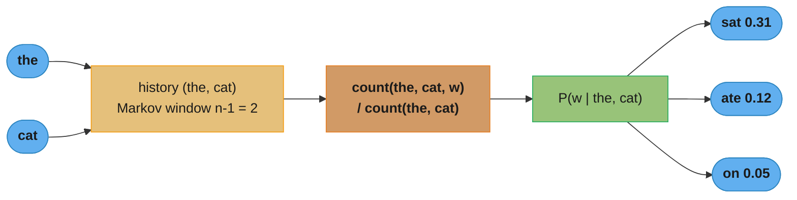
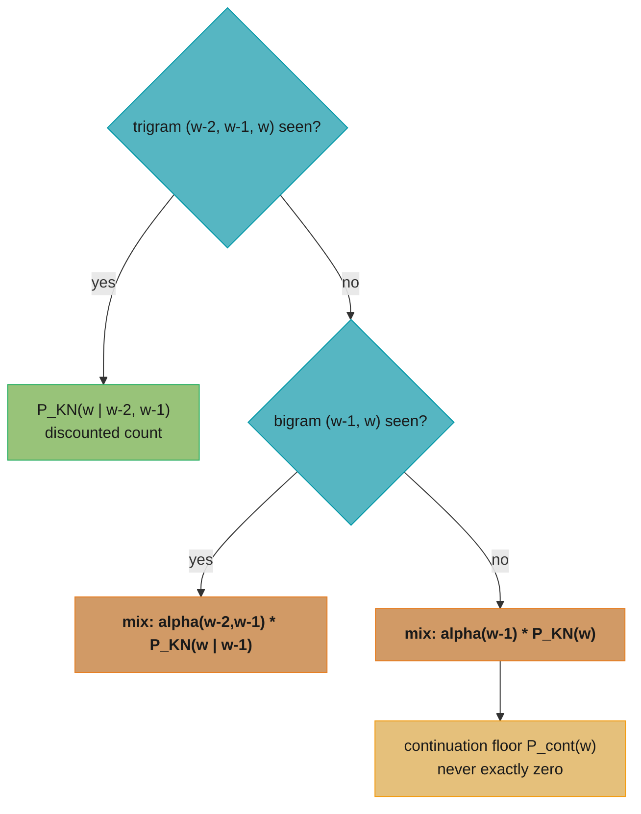
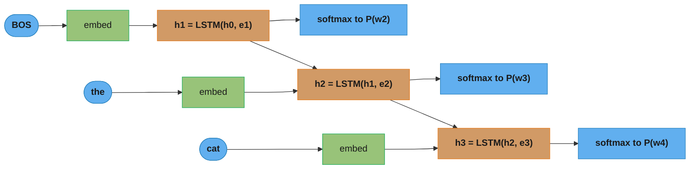
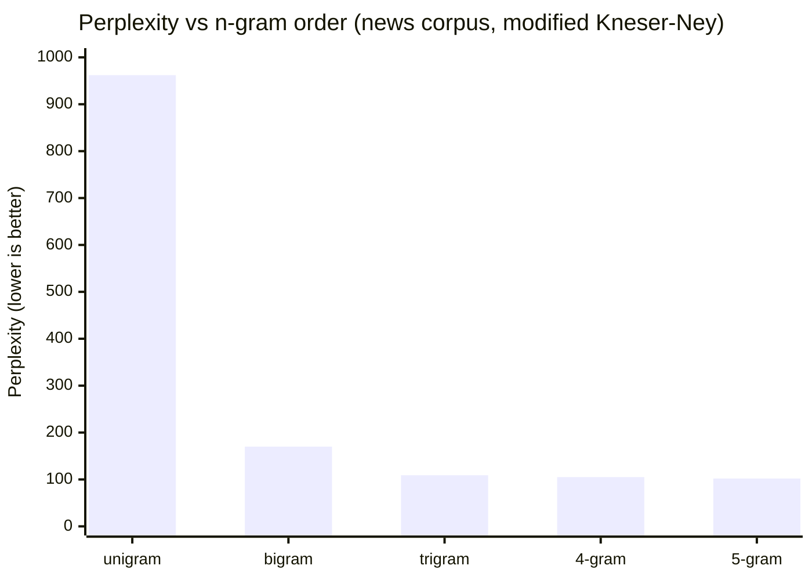
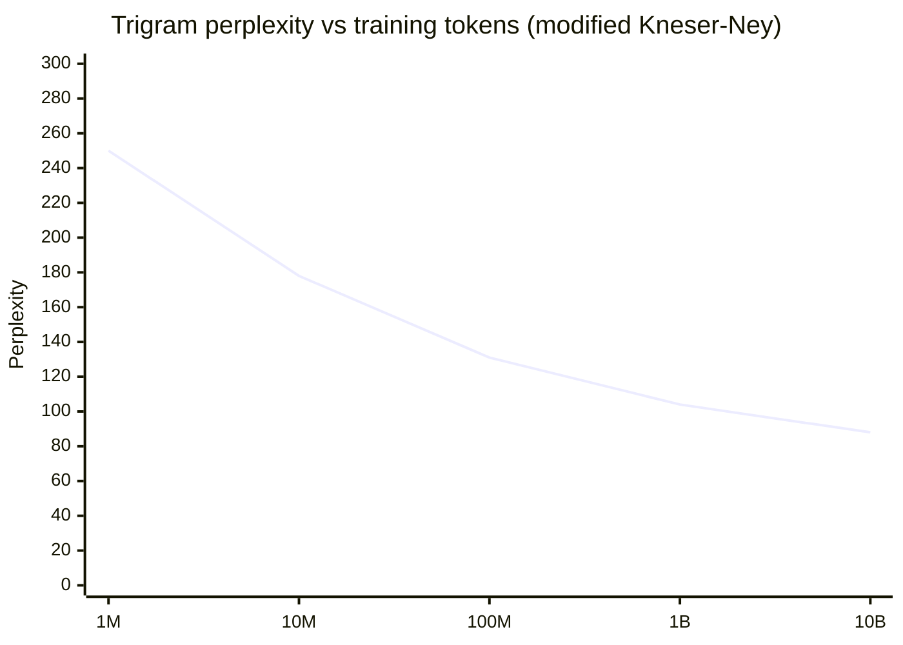
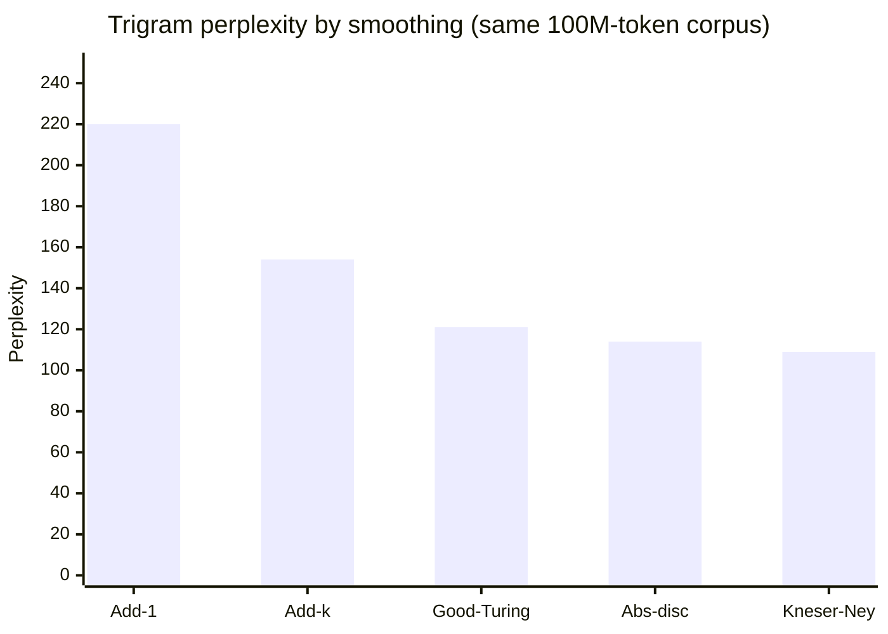

# Language Modeling (Classical + Neural Basics)

> This file is a deep-dive sub-file of the [Natural Language Processing](README.md) module.
> It covers what a language model is (chain rule, next-token probability), n-gram models,
> the sparsity / zero-probability problem, smoothing (Laplace, Good-Turing, Kneser-Ney),
> backoff vs interpolation, perplexity, and the basic neural LMs (Bengio feedforward,
> RNN/LSTM, weight tying) that precede transformers.
> Transformer-LM **pretraining** (GPT-style causal LM, scaling laws, the training loop at
> billion-parameter scale) is out of scope here — see [LLM Foundations](../../llm/foundations_and_architecture/README.md).
> Perplexity as an evaluation metric is treated in depth in [NLP Evaluation and Metrics](nlp_evaluation_and_metrics.md);
> decoding (greedy/beam/temperature/nucleus) is covered in [Attention and Seq2Seq](attention_and_seq2seq.md).

---

## 1. Concept Overview

A **language model (LM)** assigns a probability to a sequence of tokens `P(w_1, w_2, ..., w_T)`, or equivalently predicts the next token given the preceding ones `P(w_t | w_1, ..., w_{t-1})`. Every practical LM factors the joint probability with the **chain rule of probability**:

```
P(w_1, ..., w_T) = P(w_1) · P(w_2 | w_1) · P(w_3 | w_1, w_2) · ... · P(w_T | w_1, ..., w_{T-1})
```

**Read it like this.** "The probability of a whole sentence is the probability of its first word, times the probability of the second word given the first, times the third given the first two — all the way to the end."

That framing matters because it turns an impossible question ("how likely is this entire sentence?") into a chain of small, learnable questions ("what comes next?"). Every LM family in this file answers the same small question; they differ only in how much of the history they are willing to look at.

| Symbol | What it is |
|--------|------------|
| `w_1, ..., w_T` | The tokens of the sentence, in order. `T` is its length |
| `P(w_1, ..., w_T)` | The joint probability of that exact sequence occurring |
| `P(w_t \| w_1, ..., w_{t-1})` | Probability of the `t`-th token given everything before it — the *next-token* prediction |
| `·` (product) | Multiply the per-token conditionals together; independence is never assumed here |
| history / prefix | The tokens to the left of position `t`. It grows by one at every step |

**Walk one example.** Score the sentence "the cat sat", reusing `P(sat | the, cat) = 0.31` from the trigram diagram below:

```
  step   token   conditional               value    -log2(value)
  1      the     P(the)                    0.05        4.322
  2      cat     P(cat | the)              0.02        5.644
  3      sat     P(sat | the, cat)         0.31        1.690
                                          -------     -------
  product P(the, cat, sat) = 0.05 x 0.02 x 0.31 = 0.00031
  sum of -log2 terms                                  11.655
  average per token = 11.655 / 3                       3.885
  perplexity = 2 ^ 3.885                              14.78
```

Two things fall out of this table. First, the product shrinks fast — three tokens already put us at `3.1e-4`, and a 30-token sentence would underflow float64, which is why real code sums the `-log2` column instead of multiplying the middle one. Second, that same `-log2` sum is *exactly* what perplexity is built from (§6.2), so the chain rule and the evaluation metric are the same arithmetic read twice.

The chain rule is exact but useless as written — conditioning on the entire history means every distinct prefix is its own event, and no corpus contains enough data to estimate `P(w_T | w_1, ..., w_{T-1})` for arbitrary histories. The history of language modeling is the history of *approximating* that conditional: n-gram models truncate the history to the last `n-1` tokens; neural LMs compress the history into a fixed-size hidden vector; transformer LMs attend over the whole history with self-attention.

This file covers the first two families. A senior interview expects you to move fluently from "count the n-grams" to "why does that break" to "how smoothing patches it" to "why neural models generalize where counts cannot" — and to know the single number, **perplexity**, that ties them all together.

---

## 2. Intuition

**One-line analogy:** A language model is a very well-read autocomplete — it has seen enough text that, given "the cat sat on the ___", it can rank "mat" above "molybdenum" without ever being told the rule.

**Mental model:** Picture a giant lookup table indexed by short phrases. To predict the next word after "New York", you find every place "New York" appeared in your corpus and tally what followed: "City" 40%, "Times" 12%, "Yankees" 5%, and so on. That tally *is* a bigram/trigram language model. The whole subject is then two questions: how short can the phrase (context) be before predictions get bad, and what do you do when a phrase never appeared at all.

**Why it matters:** Language modeling is the substrate under machine translation, speech recognition (the LM disambiguates "wreck a nice beach" vs "recognize speech"), spelling correction, and every generative model. The training objective of GPT is literally next-token language modeling scaled up.

**Key insight:** The central tension is **coverage vs specificity**. A longer context (higher n) makes predictions sharper but explodes the number of contexts to estimate, so most are unseen — the **sparsity problem**. Classical LMs fight this with smoothing and backoff; neural LMs sidestep it by mapping words to dense vectors so that "cat" and "dog" share statistical strength even when their exact n-grams never co-occurred.

---

## 3. Core Principles

**Chain rule factorization.** Any LM is a product of next-token conditionals. Working in log space turns the product into a sum, which is numerically stable and directly connects to cross-entropy and perplexity.

**Markov assumption.** An n-gram model assumes the next token depends only on the previous `n-1` tokens: `P(w_t | w_1..w_{t-1}) ≈ P(w_t | w_{t-n+1}..w_{t-1})`. n=1 is a unigram (no context), n=2 bigram, n=3 trigram; production LMs used 4-grams and 5-grams. The assumption is false (language has long-range structure) but tractable.

**Maximum likelihood estimation (MLE).** The MLE of a conditional is a normalized count: `P(w_t | context) = count(context, w_t) / count(context)`. It maximizes the probability of the training data — and precisely because it does, it assigns probability **zero** to any n-gram it never saw, which is fatal (see §10).

**What this actually says.** "To guess what follows a phrase, go find every place that phrase appeared in your training text and ask what fraction of the time each word came next."

The Markov assumption above and this estimator are a matched pair: the assumption shrinks the context to something you can actually find repeats of, and the estimator then just tallies those repeats. The whole rest of the classical-LM literature exists because that tally is zero far more often than intuition suggests.

| Symbol | What it is |
|--------|------------|
| `context` | The conditioning history — the previous `n-1` tokens for an n-gram model |
| `count(context)` | How many times that history appeared anywhere in training |
| `count(context, w_t)` | How many times the history appeared *and* was followed by `w_t` |
| `n` | Order of the model. `n=2` bigram (1 token of context), `n=3` trigram (2 tokens) |
| `≈` in the Markov line | "Throw away everything older than `n-1` tokens" — an approximation, not an identity |

**Walk one example.** Bigram counts on the six-token corpus used throughout §6, `the cat sat on the mat`:

```
  contexts containing "the":     the -> cat        (once)
                                 the -> mat        (once)
  so count(the) = 2

  P(cat | the) = count(the, cat) / count(the) = 1 / 2 = 0.50
  P(mat | the) = count(the, mat) / count(the) = 1 / 2 = 0.50
  P(ran | the) = count(the, ran) / count(the) = 0 / 2 = 0.00   <-- the whole problem
```

`ran` is an ordinary English verb, and the model has just declared it impossible after `the`. Nothing about MLE is broken — it is doing precisely its job, which is to maximize the likelihood of the *training* text, and the likelihood-maximizing choice for an event you never observed is exactly zero. Smoothing is the deliberate decision to be *worse* on training data in exchange for being finite on everything else.

**Sparsity / the zero-probability problem.** With a 50k vocabulary, there are 50k² ≈ 2.5 billion possible bigrams and 1.25 × 10¹⁴ possible trigrams. No corpus observes more than a tiny fraction, so most counts are zero. Zipf's law makes this worse: a large share of tokens in *any* held-out text are rare, so unseen n-grams are the common case, not the edge case.

**Smoothing.** Move probability mass from seen events to unseen ones so nothing is exactly zero. The methods differ in *how much* mass they move and *where* they redistribute it (add-k, Good-Turing, absolute discounting, Kneser-Ney).

**Backoff and interpolation.** When a high-order n-gram is unseen, fall back on lower-order statistics — either discretely (backoff: use the trigram if seen, else the bigram) or as a blend (interpolation: always mix trigram, bigram, and unigram estimates).

**Perplexity.** The intrinsic evaluation metric: the exponentiated per-token cross-entropy, `PPL = 2^H` (bits) or `exp(H)` (nats). It is the model's *weighted average branching factor* — how many equally-likely next tokens the model is effectively choosing among. Lower is better.

**Distributed representations (neural LMs).** Instead of discrete counts, embed each token as a dense vector and let a neural network compute the conditional. Similar words get similar vectors, so evidence generalizes across contexts — the structural cure for sparsity.

---

## 4. Types / Architectures / Strategies

### 4.1 Model families

| Family | Context handling | Params | Strength | Weakness |
|--------|-----------------|--------|----------|----------|
| **Unigram** | none | \|V\| | trivial baseline, fast | ignores order entirely |
| **n-gram (3–5)** | last n-1 tokens | huge sparse count tables | fast, interpretable, strong with lots of data | sparsity, fixed window, no generalization |
| **Bengio feedforward NLM (2003)** | fixed window, embedded | dense, small | learns word embeddings, generalizes | still a fixed window |
| **RNN / LSTM LM** | unbounded (in theory) | dense, small–medium | variable-length history, no fixed n | vanishing gradients limit real range to ~200 tokens |
| **Transformer LM** | full context via attention | large | parallel, long-range, SOTA | quadratic attention, data-hungry — see [LLM Foundations](../../llm/foundations_and_architecture/README.md) |

### 4.2 Smoothing methods (n-gram)

| Method | Idea | Discount behavior | Notes |
|--------|------|-------------------|-------|
| **Add-1 (Laplace)** | add 1 to every count | steals far too much mass with large \|V\| | pedagogical only; terrible perplexity |
| **Add-k** | add fractional k (e.g. 0.01) | tunable but still crude | needs held-out k tuning |
| **Good-Turing** | reweight by frequency-of-frequencies `N_r` | mass of unseen ≈ `N_1 / N` | foundation for later methods |
| **Absolute discounting** | subtract a fixed `d` (≈0.75) from each nonzero count | flat discount, redistribute to lower order | simple, effective |
| **Kneser-Ney** | absolute discounting **+ continuation probability** | best-performing classical method | see continuation intuition below |
| **Modified Kneser-Ney** | three discounts `d_1, d_2, d_3+` by count | SOTA for n-grams | KenLM/SRILM default |

**Kneser-Ney continuation intuition.** Estimate a lower-order (unigram) term not by *how often* a word occurs, but by *how many distinct contexts* it follows. Classic example: "Francisco" is frequent, but it almost always follows "San". A raw unigram backoff would rank "Francisco" highly after any word; the continuation probability `P_cont(w) = |{v : count(v, w) > 0}| / (number of distinct bigram types)` recognizes that "Francisco" has only one predecessor and down-weights it. This is why KN dominates: it fixes the backoff distribution, not just the discount.

**The idea behind it.** "When you have to fall back on a word's general reputation, judge it by how many different company it keeps — not by how loud it is."

Raw frequency answers "how often does this word appear?" Continuation count answers "how *versatile* is this word — how many distinct words has it been seen to follow?" Those are different questions, and backoff needs the second one, because backoff fires exactly when you are in a context you have never seen before.

| Symbol | What it is |
|--------|------------|
| `w` | The candidate next word being scored by the lower-order (unigram) term |
| `v` | Any word that could precede `w`; ranges over the whole vocabulary |
| `count(v, w) > 0` | "The bigram `v w` was observed at least once" — presence, not how many times |
| `\|{v : count(v, w) > 0}\|` | The **continuation count**: how many distinct predecessors `w` has |
| number of distinct bigram types | Total count of unique `(v, w)` pairs in training; the normalizer |
| `P_cont(w)` | The resulting continuation probability, replacing the raw unigram estimate |

**Walk one example.** A 29-token corpus in which `francisco` and `city` appear the *same* number of times, so raw frequency cannot tell them apart, but their predecessors can:

```
  corpus contains 24 distinct bigram types, 29 tokens

  word        raw count   unigram MLE   distinct preceders     P_cont
  francisco       3        3/29 = 0.1034   {san}          = 1   1/24 = 0.0417
  city            3        3/29 = 0.1034   {a, every, the}= 3   3/24 = 0.1250

  raw-frequency verdict : identical (ratio 1.0)  -> backoff ranks them equally
  continuation verdict  : city is 3x more likely -> backoff ranks city above francisco
```

Katz backoff with a raw unigram would happily propose "I would like to read the francisco" — the word is common, so its unigram score is high. Kneser-Ney sees that in every single observation `francisco` was glued to `san`, gives it a continuation probability three times smaller than `city`'s, and the nonsense disappears. Delete this term and you keep the discount but lose most of KN's advantage over plain absolute discounting, which is precisely the difference the two rows in §4.2 are measuring.

### 4.3 Backoff vs interpolation

- **Backoff (Katz):** use the highest-order n-gram that has a nonzero count; if unseen, drop to the next lower order, scaled by a backoff weight `alpha` so the distribution still normalizes.
- **Interpolation (Jelinek-Mercer):** always compute a weighted mix of all orders, `P = λ_3 P_3 + λ_2 P_2 + λ_1 P_1`, with `Σ λ = 1`. Interpolated Kneser-Ney is the standard production form.

**Stated plainly.** "Instead of picking one expert, poll all three — the trigram, the bigram, and the unigram — and average their opinions with fixed, trusted weights."

The point of always blending rather than switching is continuity. Backoff's estimate jumps discontinuously the moment a count crosses from 1 to 0; interpolation's estimate slides, because the lower orders were already contributing before the higher one ran out.

| Symbol | What it is |
|--------|------------|
| `P_3`, `P_2`, `P_1` | Trigram, bigram and unigram estimates of the *same* next word |
| `λ_3`, `λ_2`, `λ_1` | Mixing weights — how much you trust each order. Tuned on held-out data |
| `Σ λ = 1` | The weights sum to one, which is what keeps the blend a valid distribution |
| `alpha` (backoff) | Katz's rescaling factor, applied only when dropping an order, so mass still sums to 1 |
| "seen" | Has a nonzero training count at that order |

**Walk one example.** The same word scored twice — once where the trigram exists, once where it does not — with `λ_3 = 0.6`, `λ_2 = 0.3`, `λ_1 = 0.1`:

```
                            P_3      P_2      P_1     blended P
  trigram SEEN              0.31     0.04     0.002
    0.6 x 0.31 = 0.186
    0.3 x 0.04 = 0.012
    0.1 x 0.002= 0.0002
    total                                             0.1982

  trigram UNSEEN            0.00     0.04     0.002
    0.6 x 0.00 = 0.000
    0.3 x 0.04 = 0.012
    0.1 x 0.002= 0.0002
    total                                             0.0122   <- still > 0
```

Notice what did *not* happen in the second row: no special case, no branch, no backoff weight to recompute. `P_3` simply went to zero and its 0.6 share of the vote vanished, leaving the lower orders to carry the estimate. The `λ_1 P_1` term is the structural guarantee behind the "never exactly zero" floor drawn in the §5 decision diagram — remove it and an out-of-context in-vocabulary word can still land on 0 and take perplexity to infinity.

### 4.4 Neural LM strategies

- **Fixed-window feedforward (Bengio):** concatenate the embeddings of the last `n-1` tokens, pass through a hidden layer, softmax over the vocabulary. First model to learn word embeddings as a byproduct.
- **RNN/LSTM:** feed tokens one at a time, carry a recurrent hidden state; the state is a lossy summary of the entire history. LSTM/GRU gates mitigate the vanishing-gradient problem that cripples vanilla RNNs. (Cell internals: [Recurrent Neural Networks](../recurrent_neural_networks/README.md).)
- **Weight tying:** share the input embedding matrix with the output softmax projection. Cuts parameters by `|V| × d` (for a 50k vocab and d=512 that is ~25M params) and typically *improves* perplexity by 1–3 points because both matrices are learning the same word-meaning geometry.

---

## 5. Architecture Diagrams

### n-gram next-token prediction (trigram Markov window)



*A trigram model conditions the next token only on the two preceding tokens; the prediction is a normalized count over everything that followed "the cat" in training.*

### Smoothing / backoff decision path (interpolated Kneser-Ney)



*Interpolation always blends orders; the unigram continuation term is the floor that guarantees no in-vocabulary word ever gets probability zero — the fix for the failure in §10.*

### RNN language model, unrolled over 3 steps



*Unlike the fixed n-gram window, the recurrent state h_t carries a summary of the entire prefix; the same embedding and softmax weights (often tied) are reused at every step.*

### Perplexity vs n-gram order (diminishing returns)



*The jump from unigram to trigram is enormous; past trigram, added context helps little because higher-order contexts are almost all unseen — classic sparsity.*

### Perplexity vs training size



*More data monotonically lowers perplexity by filling in previously-unseen n-grams; this is why web-scale corpora (Google's 1T-token n-grams) beat clever smoothing on small data.*

### Perplexity by smoothing method



*Add-1 is catastrophic because it steals too much mass for a 50k vocabulary; Kneser-Ney's continuation probability makes it the best classical method. (An unsmoothed model is not shown — its perplexity is infinite; see §10.)*

---

## 6. How It Works — Detailed Mechanics

### 6.1 n-gram counting and the MLE estimate

```python
from __future__ import annotations
from collections import Counter
import math


def ngram_counts(tokens: list[str], n: int) -> tuple[Counter, Counter]:
    """Count n-grams and their (n-1)-gram contexts, with sentence padding."""
    ngrams: Counter = Counter()
    contexts: Counter = Counter()
    padded = ["<s>"] * (n - 1) + tokens + ["</s>"]
    for i in range(n - 1, len(padded)):
        gram = tuple(padded[i - n + 1 : i + 1])   # (w_{i-n+1}, ..., w_i)
        ctx = gram[:-1]                            # the conditioning context
        ngrams[gram] += 1
        contexts[ctx] += 1
    return ngrams, contexts


def mle_prob(gram: tuple[str, ...], ngrams: Counter, contexts: Counter) -> float:
    """Maximum-likelihood conditional probability: count(context, w) / count(context)."""
    ctx = gram[:-1]
    denom = contexts[ctx]
    if denom == 0:
        return 0.0                    # unseen context -> zero (the problem)
    return ngrams[gram] / denom       # unseen gram in a seen context -> also 0.0
```

### 6.2 Perplexity — and the broken-then-fix

Perplexity is the exponentiated average per-token cross-entropy. In base 2 it is measured in *bits per token*; `2^{bits}` is the effective branching factor.

```python
from typing import Callable


def perplexity(test_tokens: list[str], prob_fn: Callable[[tuple[str, ...]], float], n: int) -> float:
    """PPL = 2 ** (average -log2 P(w_i | context)). Returns inf on any zero-prob token."""
    padded = ["<s>"] * (n - 1) + test_tokens + ["</s>"]
    log_sum = 0.0
    count = 0
    for i in range(n - 1, len(padded)):
        gram = tuple(padded[i - n + 1 : i + 1])
        p = prob_fn(gram)
        if p == 0.0:
            return float("inf")        # a single unseen n-gram destroys the whole score
        log_sum += math.log2(p)
        count += 1
    return 2 ** (-log_sum / count)
```

**What the formula is telling you.** "On average, how many equally-plausible words was the model torn between at each step? If it says 78, the model was as confused as someone guessing uniformly among 78 options."

This is the single most useful reframing in language modeling, and it is what makes perplexity comparable to human intuition in a way a raw loss value never is. A loss of `4.36` means nothing on its own; "effectively choosing among 78 words" is immediately interpretable, and immediately tells you the model is doing far better than a 50,000-word coin flip.

| Symbol | What it is |
|--------|------------|
| `P(w_i \| context)` | The probability the model assigned to the token that actually appeared |
| `-log2 P(w_i)` | Surprise, in **bits**. `P = 0.5` costs 1 bit; `P = 0.02` costs 5.64 bits |
| average of `-log2 P` | Cross-entropy `H` — the mean surprise per token over the held-out text |
| `2 ^ H` | Perplexity in bits. Undoes the log, turning surprise back into a *count of options* |
| `exp(H)` | The same thing when `H` is in nats (natural log) instead of bits — what PyTorch gives you |
| `count` | Number of tokens scored; the denominator that makes PPL length-independent |

**Walk one example.** Three tokens, from confident to badly surprised:

```
  token   P(correct word)   -log2 P (bits)
  1            0.50             1.000
  2            0.10             3.322
  3            0.02             5.644
                              --------
  total surprise                9.966 bits
  H = 9.966 / 3               = 3.322 bits per token
  PPL = 2 ^ 3.322             = 10.00
```

Ten. Across those three predictions the model behaved, on average, exactly like something choosing uniformly among 10 words — even though not one of the three probabilities was `1/10`. Perplexity is the geometric mean of `1/P`, so a single confident hit cannot paper over a single bad miss; the log makes the disaster dominate.

**From training loss to perplexity, in one exponential.** `nn.CrossEntropyLoss` reports mean negative log-likelihood in **nats**, which is `H` already — so `exp(loss)` is perplexity with no other conversion. That is the whole content of `torch.exp(loss)` in §6.4:

```
  model                       loss (nats)   exp(loss) = PPL   log2 PPL (bits/token)
  LSTM + tying + dropout         4.357           78.0               6.285
  Kneser-Ney trigram             4.942          140.0               7.129
  uniform over |V| = 50,000     10.820       50,000.0              15.610

  loss gap 4.942 - 4.357 = 0.585 nats
  PPL ratio  e ^ 0.585 = 1.795   ->   140 / 78 = 1.79
```

The bottom line of that block is the reason practitioners quote perplexity rather than loss: a "0.585 improvement in loss" sounds like rounding, while "the model went from juggling 140 candidates to juggling 78" is obviously a large win. The exponential is what makes small loss deltas legible — and, symmetrically, why a loss that drifts up by 0.3 is much worse news than it looks.

**Why the base matters and why it usually doesn't.** Base 2 gives bits and `PPL = 2^H`; base `e` gives nats and `PPL = exp(H)`. Both produce the *same* perplexity as long as you are consistent, because `2^(H_bits) = e^(H_nats)` — the row above shows `2^6.285 = 78.0 = e^4.357`. Mixing them (taking `exp()` of a base-2 entropy) is a common and silent bug that inflates the number.

**BROKEN — unsmoothed MLE on held-out text:**

```python
train = "the cat sat on the mat".split()
ngrams, contexts = ngram_counts(train, n=3)

# Test contains a trigram never seen in training: ("the", "cat", "ran")
test = "the cat ran".split()
ppl = perplexity(test, lambda g: mle_prob(g, ngrams, contexts), n=3)
print(ppl)   # inf  -- one unseen trigram => log2(0) = -inf => perplexity = infinity
```

A single unseen n-gram makes `P(sentence) = 0`, so `log P = -inf` and perplexity is infinite. The model claims the sentence is *impossible*, which is absurd — it merely never saw that exact trigram. This is why **no production n-gram LM ever uses raw MLE.**

**FIX — add-k smoothing (never returns zero for an in-vocabulary word):**

```python
def add_k_prob(gram: tuple[str, ...], ngrams: Counter, contexts: Counter,
               vocab_size: int, k: float = 1.0) -> float:
    """Add-k (Laplace when k=1). Pushes a little mass onto every unseen n-gram."""
    ctx = gram[:-1]
    return (ngrams[gram] + k) / (contexts[ctx] + k * vocab_size)


vocab = set(train) | {"</s>", "ran"}
ppl = perplexity(test, lambda g: add_k_prob(g, ngrams, contexts, len(vocab), k=0.01), n=3)
print(ppl)   # a large but finite number -- the model is now usable
```

Add-1 is finite but poor: with `|V| = 50000`, the denominator `count(ctx) + 50000` swamps the real counts, so seen and unseen n-grams get nearly equal probability. `k = 0.01` tuned on a held-out set is far better, and Kneser-Ney (next) is better still.

**In plain terms.** "Pretend you saw every possible next word `k` extra times before you started counting, so nothing ends up at zero."

The denominator is the part that bites. Adding `k` to `|V|` different numerators means you must add `k × |V|` to the denominator to keep the distribution normalized — and with a 50,000-word vocabulary, that correction can dwarf the real evidence you collected.

| Symbol | What it is |
|--------|------------|
| `k` | Phantom count added to every n-gram. `k = 1` is Laplace; `k = 0.01` is tuned add-k |
| `ngrams[gram]` | Real observed count of the full n-gram `(context, w)` |
| `contexts[ctx]` | Real observed count of the context alone |
| `vocab_size` (`\|V\|`) | Number of distinct in-vocabulary words — how many phantom counts you just invented |
| `k * vocab_size` | Total invented mass added to the denominator to renormalize |

**Walk one example.** A context seen 10 times, followed by `w` on 7 of those occasions, with `|V| = 50,000`:

```
  estimator      numerator      denominator          P(w | ctx)     P(unseen | ctx)
  MLE            7              10                    0.700          0.0
  add-1          7 + 1  = 8     10 + 50,000 = 50,010  0.000160       0.0000200
  add-k (0.01)   7 + 0.01=7.01  10 + 500    = 510     0.013745       0.0000196

  how much better is a 7-observation word than a never-seen one?
    MLE    :  infinitely (7/10 vs 0)
    add-1  :  8 / 1    =   8x     <-- almost no preference left
    add-k  :  7.01/0.01= 701x     <-- evidence largely preserved
```

Add-1 did not merely blunt the estimate, it demolished it: a word observed seven times is left only eight times more likely than a word never observed at all, because 50,000 phantom counts swamped ten real ones. Dropping `k` to `0.01` shrinks the invented mass from 50,000 to 500 and restores a 701x preference while still keeping every unseen n-gram strictly positive. That gap — 8x versus 701x — is the entire reason the §5 smoothing chart puts Add-1 at perplexity 220 and Add-k at 154 on the same corpus.

### 6.3 Interpolated Kneser-Ney (bigram) from scratch

```python
from collections import defaultdict


class KneserNeyBigram:
    """Interpolated Kneser-Ney bigram LM. Continuation probability is the key term."""

    def __init__(self, discount: float = 0.75) -> None:
        self.d = discount
        self.bigram: Counter = Counter()                       # c(w_{i-1}, w_i)
        self.unigram: Counter = Counter()                      # c(w_{i-1}) as a context
        self.followers: defaultdict[str, set] = defaultdict(set)  # w_{i-1} -> {w_i seen}
        self.preceders: defaultdict[str, set] = defaultdict(set)  # w_i -> {w_{i-1} seen}
        self.n_bigram_types: int = 0

    def train(self, tokens: list[str]) -> None:
        prev = "<s>"
        for w in tokens + ["</s>"]:
            self.bigram[(prev, w)] += 1
            self.unigram[prev] += 1
            self.followers[prev].add(w)
            self.preceders[w].add(prev)
            prev = w
        self.n_bigram_types = len(self.bigram)

    def p_continuation(self, w: str) -> float:
        """How many DISTINCT words precede w, normalized by the number of bigram types."""
        return len(self.preceders[w]) / self.n_bigram_types

    def prob(self, prev: str, w: str) -> float:
        c_bi = self.bigram[(prev, w)]
        c_ctx = self.unigram[prev]
        if c_ctx == 0:                       # unseen context -> pure continuation floor
            return self.p_continuation(w)
        discounted = max(c_bi - self.d, 0.0) / c_ctx
        lam = (self.d / c_ctx) * len(self.followers[prev])   # backoff weight, mass reserved
        return discounted + lam * self.p_continuation(w)      # >0 for any in-vocab w
```

The continuation term is why "Francisco" (frequent, but only ever after "San") is *not* over-predicted after an unseen context: `p_continuation("Francisco")` is tiny because it has a single preceder, even though its raw count is large.

**What it means.** "Shave a fixed sliver off every count you did observe, add up all the slivers, and hand that pooled mass to the lower-order model to distribute by versatility."

The elegance is that the amount reserved is not a hyperparameter you tune separately — it falls out of the discount. A context with many distinct followers gives up many slivers and therefore reserves more mass; a context you saw once, followed by one word, reserves exactly `d`. The bookkeeping balances itself.

| Symbol | What it is |
|--------|------------|
| `d` | The absolute discount, `0.75`. Subtracted once from every nonzero count |
| `c_bi` = `bigram[(prev, w)]` | Times `w` actually followed `prev` |
| `c_ctx` = `unigram[prev]` | Times `prev` appeared as a context at all |
| `max(c_bi - d, 0.0) / c_ctx` | The discounted higher-order estimate — the shaved count, renormalized |
| `len(followers[prev])` | How many *distinct* words followed `prev`; equals the number of slivers taken |
| `lam` = `(d / c_ctx) * len(followers[prev])` | Total mass reserved by the shaving — the backoff weight |
| `p_continuation(w)` | How that reserved mass is split, by distinct-predecessor count (§4.2) |

**Walk one example.** `KneserNeyBigram(discount=0.75)` trained on `the cat sat on the mat`, scoring `P(cat | the)`. The corpus yields 7 distinct bigram types: `<s> the`, `the cat`, `cat sat`, `sat on`, `on the`, `the mat`, `mat </s>`.

```
  inputs
    c_bi  = count(the, cat)          = 1
    c_ctx = count(the) as a context  = 2      (the -> cat, the -> mat)
    followers(the) = {cat, mat}      -> 2 distinct
    preceders(cat) = {the}           -> 1 distinct
    n_bigram_types                   = 7
    d                                = 0.75

  discounted term
    max(1 - 0.75, 0) / 2  =  0.25 / 2               = 0.125

  reserved mass (backoff weight)
    lam = (0.75 / 2) x 2  =  0.375 x 2              = 0.750

  continuation probability
    p_cont(cat) = 1 / 7                             = 0.142857

  final
    P_KN(cat | the) = 0.125 + 0.750 x 0.142857      = 0.232143
```

Read the two contributions separately. The higher-order evidence alone would have said `0.5` (one of two follows); discounting cuts it to `0.125` and hands `0.75` of the mass to the backoff. That looks brutal, and on a six-token corpus it is — with `c_ctx = 2`, a discount of `0.75` removes a huge fraction of every count. On a realistic corpus where `c_ctx` is in the thousands, `lam` shrinks toward zero and the discounted term dominates, exactly as intended: **the model leans on backoff only where it is data-starved.** That self-scaling is why one fixed `d = 0.75` works across wildly different corpora, and why modified Kneser-Ney's refinement — separate discounts `d_1, d_2, d_3+` for counts of 1, 2, and 3-or-more — buys extra accuracy precisely at the low counts where a single flat `d` is crudest.

### 6.4 RNN/LSTM language model with weight tying (PyTorch)

```python
import torch
import torch.nn as nn
from typing import Optional


class RNNLanguageModel(nn.Module):
    """LSTM language model. Ties input embedding to output softmax to cut params and PPL."""

    def __init__(self, vocab_size: int, embed_dim: int = 512, hidden_dim: int = 512,
                 num_layers: int = 2, dropout: float = 0.5, tie_weights: bool = True) -> None:
        super().__init__()
        self.embed = nn.Embedding(vocab_size, embed_dim)
        self.lstm = nn.LSTM(embed_dim, hidden_dim, num_layers,
                            dropout=dropout, batch_first=True)
        self.drop = nn.Dropout(dropout)
        self.decoder = nn.Linear(hidden_dim, vocab_size)
        if tie_weights:
            if embed_dim != hidden_dim:
                raise ValueError("weight tying requires embed_dim == hidden_dim")
            self.decoder.weight = self.embed.weight   # share the |V| x d matrix

    def forward(self, x: torch.Tensor,
                hidden: Optional[tuple[torch.Tensor, torch.Tensor]] = None
                ) -> tuple[torch.Tensor, tuple[torch.Tensor, torch.Tensor]]:
        emb = self.drop(self.embed(x))                # (batch, seq, embed_dim)
        out, hidden = self.lstm(emb, hidden)          # (batch, seq, hidden_dim)
        logits = self.decoder(self.drop(out))         # (batch, seq, vocab_size)
        return logits, hidden


def train_step(model: RNNLanguageModel, x: torch.Tensor, y: torch.Tensor,
               optimizer: torch.optim.Optimizer) -> float:
    """One step of next-token training; returns perplexity for this batch."""
    criterion = nn.CrossEntropyLoss()
    logits, _ = model(x)                              # y = x shifted left by one position
    loss = criterion(logits.reshape(-1, logits.size(-1)), y.reshape(-1))
    optimizer.zero_grad()
    loss.backward()
    torch.nn.utils.clip_grad_norm_(model.parameters(), max_norm=0.25)  # RNNs need clipping
    optimizer.step()
    return torch.exp(loss).item()                     # exp(cross-entropy) = perplexity
```

Cross-entropy loss *is* the log-perplexity: `perplexity = exp(loss)`. A word-level LSTM LM on Penn Treebank reaches perplexity ~78–82 with tying and dropout, versus ~140 for a good Kneser-Ney trigram — the neural model's generalization across embeddings is the difference.

---

## 7. Real-World Examples

**Google Web1T / 1T n-grams (2006):** Google released n-gram counts (up to 5-grams) derived from ~1 trillion tokens of web text. The lesson, later formalized as "the unreasonable effectiveness of data": a simple 5-gram model with Stupid Backoff on a trillion tokens beat elaborately-smoothed models trained on millions of tokens. Stupid Backoff drops the normalization entirely (`S(w|ctx) = count/count if seen, else 0.4 · S(w|shorter ctx)`) because at web scale the missing normalization does not matter for ranking.

**Put simply.** "If you have seen this exact phrase, just use the raw ratio. If not, chop the context by one word, look again, and multiply whatever you find by 0.4 as a penalty for having had to shorten it."

The radical part is what Stupid Backoff *omits*: there is no computed backoff weight, no normalization, no guarantee the scores sum to one. It is not a probability distribution at all, which is why the paper's authors named it what they did — and it still wins at trillion-token scale, because with that much data the highest order is usually present, and when it isn't you only need the *ranking* of candidates to be right, not their absolute values.

| Symbol | What it is |
|--------|------------|
| `S(w \| ctx)` | A **score**, deliberately not a probability — it does not sum to 1 over the vocabulary |
| `count / count` | `count(ctx, w) / count(ctx)`, the plain MLE ratio, used whenever the n-gram was seen |
| `0.4` | Fixed backoff penalty, applied once per order dropped. Empirically tuned, never derived |
| shorter `ctx` | The context with its leftmost word removed — a 5-gram becomes a 4-gram, and so on |
| recursion | `S` calls itself at the next lower order until something has a nonzero count |

**Walk one example.** Scoring `york` after the trigram context `to new`, where `to new york` was never seen but `new york` was seen 8,000 times out of 10,000 occurrences of `new`, in a corpus of one billion tokens:

```
  order    context     count(ctx, w) / count(ctx)      penalty      score
  trigram  to new      0 / ...          -> unseen      --           back off
  bigram   new         8,000 / 10,000   = 0.8          x 0.4        0.32
                                                                  ------
  S(york | to, new) = 0.4 x 0.8                                    = 0.32

  if the bigram had ALSO been unseen, it drops one more order:
  unigram  --          12,000 / 1e9     = 0.000012     x 0.4 x 0.4  0.00000192
                                                       (= 0.16)
```

Each dropped order costs a flat factor of `0.4`, so two drops cost `0.16` and three cost `0.064`. Contrast this with Katz backoff, where the equivalent weight `alpha` must be computed per context so the distribution renormalizes — an expensive step that Stupid Backoff simply refuses to pay. The tradeoff is stated exactly: you may no longer report perplexity (the scores are not probabilities, so `2^H` is meaningless), but you can rank candidates for a translation or speech decoder at nanosecond cost over a trillion tokens. When the data is big enough, the smoothing sophistication stops mattering — which is the "unreasonable effectiveness of data" lesson in one formula.

**KenLM in machine translation and speech (Heafield, 2011):** The de facto production n-gram toolkit. Trains modified Kneser-Ney 5-grams over billions of tokens with a streaming, disk-based algorithm, and serves them with a quantized trie that answers a query in nanoseconds. Moses (statistical MT) and Kaldi (speech recognition) both used KenLM as the LM component that rescores hypotheses.

**Gboard / SwiftKey mobile keyboards:** On-device next-word prediction combines a compact, pruned n-gram model (for latency and coverage of common phrases) with a small neural LM (LSTM, later Transformer) for generalization, plus a personal cache learned from the user's own typing. Gboard famously used **federated learning** to train the neural LM across millions of phones without uploading keystrokes.

**Bengio et al., "A Neural Probabilistic Language Model" (2003):** The feedforward NLM that introduced learned word embeddings. It concatenated the embeddings of the previous `n-1` words and beat smoothed trigrams on Brown and AP News corpora, establishing that distributed representations cure sparsity. Its ideas flow directly into word2vec and every modern LM.

**Mikolov RNNLM (2010):** Recurrent NN language model that cut perplexity ~20% over the best 5-gram Kneser-Ney on the Penn Treebank and WSJ, and shipped in speech-recognition rescoring. It demonstrated that an unbounded recurrent context beats a fixed n-gram window — the argument that motivated the entire neural-LM era.

---

## 8. Tradeoffs

| Dimension | n-gram (Kneser-Ney) | Neural LM (RNN/LSTM) |
|-----------|---------------------|----------------------|
| Context length | fixed, 3–5 tokens | unbounded (effective ~200) |
| Generalization | none (exact match only) | strong (embedding similarity) |
| Data efficiency | needs huge data for high order | learns from less data |
| Inference speed | nanoseconds (trie lookup) | milliseconds (matrix multiplies) |
| Memory | GBs of sparse counts | tens of MBs of dense weights |
| Interpretability | high (you can read the counts) | low (opaque hidden state) |
| Training | counting pass, minutes | gradient descent, hours |

| Smoothing method | Perplexity (rel.) | Cost | When to use |
|------------------|-------------------|------|-------------|
| Add-1 (Laplace) | worst | trivial | never in production; teaching only |
| Add-k | poor | tune k | quick baselines |
| Good-Turing | good | moderate | historical / when N_r estimable |
| Absolute discounting | very good | low | simple, robust |
| Kneser-Ney | best classical | moderate | default for any n-gram LM |

| Backoff vs interpolation | |
|--------------------------|--|
| Backoff (Katz) | use highest seen order only; needs backoff weights; sharper but discontinuous |
| Interpolation (Jelinek-Mercer) | always blend all orders; smoother; interpolated KN is the production standard |

---

## 9. When to Use / When NOT to Use

### Use a classical n-gram LM when:

- You need **nanosecond latency** and interpretability (speech decoding, keyboard, spell-check rescoring).
- You have **massive data** but limited compute — a 5-gram on a trillion tokens is cheap to train and strong.
- The deployment target is **resource-constrained** (embedded, on-device) and a pruned trie fits the memory budget.
- You need a **transparent, auditable** model where you can point to the exact counts behind a prediction.

### Use a basic neural LM (RNN/LSTM) when:

- Training data is **moderate** (100K–100M tokens) and generalization across similar words matters more than raw coverage.
- You need **variable-length context** without committing to a fixed n.
- You are building a component (e.g., a small on-device completion model) where a full transformer is overkill.

### Prefer a transformer LM (see [LLM Foundations](../../llm/foundations_and_architecture/README.md)) when:

- You have **large data and compute** and need long-range dependencies and SOTA quality.
- The task is open-ended generation, in-context learning, or anything that benefits from scale.

### Do NOT use:

- **Unsmoothed MLE** — ever; it assigns zero probability and infinite perplexity to unseen n-grams (§10).
- **High-order n-grams (n > 5) on small data** — the counts are almost all zero or one; you are memorizing, not modeling.
- **Perplexity to compare models with different tokenizers or vocabularies** — the numbers are incomparable ([NLP Evaluation and Metrics](nlp_evaluation_and_metrics.md)); use bits-per-character or a downstream task metric instead.

---

## 10. Common Pitfalls

### Pitfall 1: Unsmoothed n-gram -> zero probability -> infinite perplexity (the canonical bug)

```python
# BROKEN: MLE probability on held-out text
# Training corpus never contained the trigram ("the", "cat", "ran")
p = mle_prob(("the", "cat", "ran"), ngrams, contexts)   # 0.0
# P(sentence) = ... * 0.0 * ... = 0.0
# log2(0.0) = -inf  ->  perplexity = 2 ** inf = inf
# The model declares a perfectly ordinary sentence "impossible".

# FIXED: always smooth. Kneser-Ney (or at least add-k) guarantees P > 0
# for any in-vocabulary word, so perplexity stays finite.
kn = KneserNeyBigram(discount=0.75)
kn.train("the cat sat on the mat".split())
print(kn.prob("cat", "ran"))   # small but > 0 via the continuation floor
```

The root cause is that MLE maximizes training likelihood, which is *maximized* by putting exactly zero on unseen events. Every real n-gram LM smooths.

### Pitfall 2: Out-of-vocabulary (OOV) words not mapped to `<UNK>`

```python
# BROKEN: a test word never in the training vocabulary has no embedding/count.
# Its probability is undefined or zero, silently corrupting perplexity.

# FIXED: fix a closed vocabulary at training time, map the rest to <UNK>.
def build_closed_vocab(tokens: list[str], min_count: int = 3) -> set[str]:
    counts = Counter(tokens)
    return {w for w, c in counts.items() if c >= min_count} | {"<UNK>", "<s>", "</s>"}

def normalize(tokens: list[str], vocab: set[str]) -> list[str]:
    return [w if w in vocab else "<UNK>" for w in tokens]
# Now train and test both go through normalize(); perplexities are comparable
# ONLY because both used the same closed vocabulary.
```

### Pitfall 3: Comparing perplexity across different vocabularies or tokenizers

```python
# BROKEN: "our new model has perplexity 40, the baseline had 110" -- but the
# new model uses subword tokens (more, shorter tokens) and the baseline uses
# words. Per-token perplexity is not comparable across tokenizations.

# FIXED: report bits-per-character (BPC), which normalizes by characters, not tokens:
#   BPC = (total -log2 P) / (number of characters)
# BPC is tokenizer-independent and is the correct cross-model comparison.
# See nlp_evaluation_and_metrics.md for the full treatment.
```

### Pitfall 4: Train/test leakage inflating scores

```python
# BROKEN: n-grams that span the train/test boundary, or documents duplicated
# across splits, let the model "see" test text -> unrealistically low perplexity.

# FIXED: split by document, never mid-sentence; deduplicate across splits;
# reset the LM context at every document boundary so no n-gram crosses it.
```

### Pitfall 5: Exploding gradients in RNN LMs without clipping

```python
# BROKEN: training an LSTM LM without gradient clipping -> loss spikes to NaN
# because backprop-through-time accumulates large gradients over long sequences.

# FIXED: clip the global gradient norm (0.25-1.0 is standard for LM RNNs).
torch.nn.utils.clip_grad_norm_(model.parameters(), max_norm=0.25)
# Also detach the hidden state between truncated-BPTT windows so the graph
# does not grow without bound: hidden = tuple(h.detach() for h in hidden).
```

### Pitfall 6: Weight tying with mismatched dimensions

```python
# BROKEN: nn.Linear(hidden_dim, vocab) tied to nn.Embedding(vocab, embed_dim)
# when hidden_dim != embed_dim -> shape mismatch, or silent wrong sharing.

# FIXED: weight tying requires embed_dim == hidden_dim. If they must differ,
# add a projection layer nn.Linear(hidden_dim, embed_dim) before the tied decoder.
```

---

## 11. Technologies & Tools

| Tool | Purpose | Notes |
|------|---------|-------|
| **KenLM** | Fast modified Kneser-Ney n-grams | streaming training, quantized trie, ns-latency queries; standard in MT/ASR |
| **SRILM** | Research n-gram toolkit | many smoothing options; `ngram-count`, `ngram`; academic license |
| **NLTK** | Teaching n-grams and smoothing | `nltk.lm` (`MLE`, `Laplace`, `KneserNeyInterpolated`); slow, for learning |
| **PyTorch** | Neural LMs (RNN/LSTM/Transformer) | `nn.Embedding`, `nn.LSTM`, `nn.CrossEntropyLoss`; `torch.exp(loss)` = perplexity |
| **fairseq** | Scalable neural LM training | reference LSTM/Transformer LM recipes |
| **Penn Treebank / WikiText-103** | Standard LM benchmarks | PTB (~1M tokens) for quick iteration; WikiText-103 (~100M) for realistic scale |
| **sentencepiece / tokenizers** | Subword vocabularies | shrink OOV, but change perplexity comparability — see [Tokenization Deep Dive](tokenization_deep_dive.md) |

---

## 12. Interview Questions with Answers

**Q: What is a language model in one sentence?**
A language model assigns a probability to a sequence of tokens, or equivalently predicts the next token given the preceding ones. It factors the joint probability with the chain rule, `P(w_1..w_T) = Π P(w_t | w_1..w_{t-1})`, and every LM family differs only in how it approximates that conditional — n-grams truncate the history, RNNs compress it into a hidden state, transformers attend over all of it. The training objective of GPT-style models is exactly this next-token prediction, scaled up.

**Q: Why does an unsmoothed n-gram model assign zero probability, and why is that catastrophic?**
Maximum-likelihood estimation sets `P(w | context) = count(context, w) / count(context)`, which is exactly zero for any n-gram never seen in training. Because a sentence's probability is the *product* of its per-token conditionals, a single unseen n-gram makes the whole sentence probability zero, `log P = -infinity`, and perplexity `2^(-log P / N)` becomes infinite. The model declares an ordinary sentence impossible. The fix is smoothing: reserve a little probability mass for unseen events so nothing is ever exactly zero.

**Q: What is the Markov assumption in an n-gram model?**
The Markov assumption says the next token depends only on the previous `n-1` tokens, not the entire history — so a trigram model approximates `P(w_t | w_1..w_{t-1})` as `P(w_t | w_{t-2}, w_{t-1})`. It is what makes the chain rule tractable, since there are far fewer `n-1`-token contexts than full-length prefixes. The assumption is linguistically false (language has long-range dependencies like subject-verb agreement across clauses), which is precisely the limitation that RNN and transformer LMs were built to overcome.

**Q: What does perplexity measure and how does it relate to cross-entropy?**
Perplexity is the exponentiated average per-token cross-entropy, `PPL = 2^H` in bits or `exp(H)` in nats, so minimizing cross-entropy loss and minimizing perplexity are the same objective. Intuitively it is the model's effective branching factor: a perplexity of 100 means the model is, on average, as uncertain as if choosing uniformly among 100 next tokens. Lower is better; for neural LMs trained with cross-entropy loss, `perplexity = exp(loss)` directly.

**Q: What is Kneser-Ney smoothing's key idea?**
Kneser-Ney combines absolute discounting with a *continuation probability* that estimates a word by how many distinct contexts it follows, not by its raw frequency. The classic example is "Francisco": it is frequent but almost always follows "San", so its continuation probability is low and it is not over-predicted after unseen contexts. This fixes the backoff distribution — the lower-order term reflects *versatility* rather than *count* — which is why Kneser-Ney (and its modified variant with count-dependent discounts) is the best-performing classical smoothing method.

**Q: What is the difference between backoff and interpolation?**
Backoff uses only the highest-order n-gram that has a nonzero count, dropping to a lower order (scaled by a backoff weight) only when the higher order is unseen. Interpolation always computes a weighted blend of all orders, `λ_3 P_3 + λ_2 P_2 + λ_1 P_1` with the lambdas summing to one, regardless of whether the high-order gram was seen. Interpolation is smoother and is the production standard (interpolated Kneser-Ney); Katz backoff is sharper but discontinuous at the point where it switches orders.

**Q: Why does increasing n past 3 to 5 give diminishing returns?**
Higher-order contexts are exponentially more numerous, so almost all of them are unseen or seen only once — you run out of data before you run out of context length. A 50k vocabulary has 1.25 × 10¹⁴ possible trigrams; even a billion-token corpus observes a vanishing fraction, so a 6-gram model spends most of its time backing off to lower orders anyway. Empirically perplexity drops sharply from unigram to trigram and then flattens, which is why production n-gram systems settled on 4-grams and 5-grams.

**Q: Why is add-one (Laplace) smoothing a poor choice for language models?**
Add-one steals far too much probability mass from seen events because the vocabulary is huge, so seen and unseen n-grams end up with nearly equal probability. The denominator `count(context) + |V|` is dominated by `|V|` (say 50,000), so a context seen 10 times has its real counts swamped by 50,000 phantom counts, wrecking perplexity. Add-k with a small tuned k (e.g. 0.01) is less damaging, but even that is far behind Kneser-Ney; Laplace survives only as a teaching example.

**Q: How do neural language models solve the sparsity problem that plagues n-grams?**
Neural LMs map each token to a dense embedding vector, so statistically similar words get similar vectors and evidence generalizes across contexts even when the exact n-gram never occurred. Where an n-gram model treats "the cat sat" and "the dog sat" as unrelated events, a neural model sees "cat" and "dog" as nearby vectors and shares strength between them. This distributed representation, introduced by Bengio's 2003 feedforward NLM, is the structural cure for sparsity — no smoothing hack required.

**Q: What is weight tying and why does it help?**
Weight tying shares the input embedding matrix with the output softmax projection, since both are `|V| × d` matrices mapping between token identities and the same semantic space. It cuts parameters by `|V| × d` (about 25M for a 50k vocab and d=512) and typically *lowers* perplexity by 1–3 points because the two matrices are learning the same word geometry, so tying acts as a regularizer. The one constraint is that the embedding dimension must equal the pre-softmax hidden dimension, or you need a projection layer in between.

**Q: How do you handle out-of-vocabulary words in an n-gram LM?**
Fix a closed vocabulary at training time — typically words with count at or above a threshold like 3 — and map every other token to a special `<UNK>` symbol, then train and test both through the same mapping. `<UNK>` gets its own probability mass, so unseen surface forms no longer produce undefined or zero probabilities. Critically, two models' perplexities are only comparable if they used the same vocabulary and the same OOV treatment, since a larger `<UNK>` bucket makes perplexity artificially lower.

**Q: Why can't you compare perplexity across models with different tokenizers?**
Perplexity is computed per token, so a model that uses more, shorter tokens (subwords) will show a lower per-token perplexity than a word-level model on the identical text, even if it is no better. To compare across tokenizations you normalize by characters instead — bits-per-character, `(total -log2 P) / num_characters` — which is tokenizer-independent. This is a frequent interview trap and is covered in depth in [NLP Evaluation and Metrics](nlp_evaluation_and_metrics.md).

**Q: What is the intuition behind Good-Turing smoothing?**
Good-Turing reallocates probability mass using the frequency of frequencies, estimating the total probability of all unseen events as `N_1 / N` — the fraction of the corpus made up of once-seen n-grams. The idea is that the count of singletons (how many n-grams were seen exactly once) is a good estimate of how much mass to reserve for things you have not yet seen. It is the theoretical ancestor of absolute discounting and Kneser-Ney, which are simpler and perform better in practice.

**Q: What is the difference between absolute discounting and Kneser-Ney?**
Absolute discounting subtracts a fixed constant `d` (around 0.75) from every nonzero n-gram count and redistributes the freed mass to the lower-order model. Kneser-Ney does the same discounting but replaces the lower-order term with the continuation probability — counting distinct preceding contexts rather than raw frequency. That single change to the backoff distribution is what makes Kneser-Ney consistently beat plain absolute discounting.

**Q: What is the difference between intrinsic and extrinsic evaluation of a language model?**
Intrinsic evaluation measures the model in isolation — perplexity on held-out text — while extrinsic evaluation measures its effect on a downstream task like word-error-rate in speech recognition or BLEU in translation. Perplexity is cheap and correlates with quality for models over the same vocabulary, but lower perplexity does not always mean better downstream performance, so the extrinsic metric is the one that ultimately matters. For fine-tuned models the correlation can even break entirely (see the perplexity discussion in [NLP Evaluation and Metrics](nlp_evaluation_and_metrics.md)).

**Q: Why do vanilla RNN language models struggle with long-range dependencies, and what fixed it?**
Vanilla RNNs suffer from vanishing gradients: backpropagation through time multiplies many Jacobians, and gradients shrink exponentially, so the model cannot learn dependencies more than a few dozen tokens apart. LSTMs and GRUs added gating and a nearly-linear cell-state path that lets gradients flow, extending the effective range to a couple hundred tokens. Transformers removed recurrence entirely, using self-attention to connect any two positions in one step — which is why they, not RNNs, power modern LMs (see [LLM Foundations](../../llm/foundations_and_architecture/README.md)).

**Q: What was the key contribution of Bengio's 2003 neural probabilistic language model?**
It introduced learned distributed word representations (embeddings) inside a feedforward language model, the first model to learn word embeddings as a byproduct of language modeling. It concatenated the embeddings of the previous `n-1` words and predicted the next word through a hidden layer and softmax; by letting similar words share a region of vector space, it generalized across contexts that count-based n-grams treated as unrelated, beating smoothed trigrams. Those embeddings are the direct ancestor of word2vec and every subsequent neural LM.

**Q: How does temperature affect sampling from a language model?**
Temperature `T` rescales the logits before the softmax as `softmax(logits / T)`, trading coherence against creativity without retraining the model. `T < 1` sharpens the distribution toward the most probable tokens (more deterministic, less diverse), `T > 1` flattens it (more random, more diverse), and `T` approaching 0 becomes greedy argmax. Decoding strategies including temperature, greedy, beam, top-k, and nucleus sampling are covered in [Attention and Seq2Seq](attention_and_seq2seq.md) and at LLM scale in the LLM section.

**Q: How would you estimate the memory footprint of a 5-gram model over a billion tokens?**
The footprint is dominated by the number of distinct n-gram *types*, not tokens — a billion-token corpus might yield hundreds of millions of distinct 5-grams, each needing a key plus a probability and backoff weight. Naive hash storage runs to tens of gigabytes, which is why toolkits like KenLM use a compressed, quantized trie that shares prefixes and stores probabilities in a few bits, bringing a large model down to a few GB with nanosecond lookups. Pruning (dropping singletons or low-count n-grams) trades a little accuracy for a large memory saving, which is essential for on-device deployment.

---

## 13. Best Practices

1. **Never ship raw MLE** — always smooth. Interpolated modified Kneser-Ney is the default for any classical n-gram LM; add-k is acceptable only for quick baselines.
2. **Fix a closed vocabulary and use `<UNK>`** before training; apply the identical mapping to train and test so perplexities are comparable.
3. **Choose n by data size, not ambition** — 3-grams for millions of tokens, 4–5-grams for billions. Higher order without more data just memorizes.
4. **Report bits-per-character, not per-token perplexity, when comparing across tokenizers** — per-token perplexity is meaningless across different vocabularies.
5. **Split by document and deduplicate across splits** to prevent n-grams from leaking test text into training and inflating scores.
6. **For neural LMs, tie input and output embeddings** (matching dimensions) — free parameter savings and usually a perplexity improvement.
7. **Clip gradients (norm 0.25–1.0) and use truncated BPTT with detached hidden states** when training RNN LMs, or loss will diverge to NaN.
8. **Prune low-count n-grams and quantize** (KenLM-style) for on-device or latency-critical serving; a pruned 5-gram trie answers in nanoseconds.
9. **Validate perplexity on a held-out set every epoch and early-stop** — neural LMs overfit quickly, and perplexity is a cheap, sensitive signal.
10. **Know when to graduate to a transformer** — if you have large data, need long-range context, and can afford the compute, a transformer LM will beat both n-grams and RNNs ([LLM Foundations](../../llm/foundations_and_architecture/README.md)).

---

## 14. Case Study

### Problem: On-device mobile keyboard next-word prediction and autocomplete

**Context:** A smartphone keyboard team must predict the next word and complete the current word as the user types, entirely on-device. Constraints: end-to-end latency under 20 ms per keystroke, model + data budget of a few tens of MB, no raw keystrokes leaving the phone (privacy), and coverage of a 170k-word vocabulary across 40 languages. Typing volume per active user is ~10k words/day.

**Why not one model?** A pure n-gram model is fast and interpretable but cannot generalize to phrasings it never saw, and a full trigram table over 170k words is far too large for a phone. A pure neural LM generalizes but a large one blows the latency and memory budget. The production answer is a **hybrid**: a small pruned n-gram model for common phrases and speed, a compact neural LM for generalization, and a per-user cache for personalization.

**Architecture:**

```
Keystroke stream
      |
      v
[ Candidate generator ]
   |            |
   |            +--> Personal cache (user's own frequent n-grams, on-device, adapts online)
   |
   +--> Pruned 4-gram Kneser-Ney trie  (quantized, ~15 MB, ns-latency lookup)
   |
   +--> Compact LSTM LM (weight-tied, quantized int8, ~8 MB, ~5 ms/step)
                 |
                 v
        [ Score fusion + rerank ] --> top-3 predictions shown above the keyboard
```

**Component decisions:**

- **Pruned 4-gram trie.** Trained with modified Kneser-Ney over a multi-billion-token corpus, then pruned to drop n-grams below a count threshold and quantized to store each probability in ~8 bits. This handles the head of the distribution ("I'll be" then "there", "New" then "York") with nanosecond lookups.
- **Compact LSTM LM.** Two-layer LSTM, `embed_dim = hidden_dim = 256`, weight-tied (halving the parameter count), quantized to int8 for a ~8 MB footprint and ~5 ms inference. It generalizes to phrasings the n-gram never saw and captures longer context than four tokens.
- **Personal cache.** An on-device count table of the user's own recent n-grams, updated online, so the keyboard learns names, slang, and app-specific jargon within a session. This is where most perceived "smartness" comes from.
- **Federated learning.** The shared neural LM is improved by federated averaging: each phone computes gradients on local text, only the *gradients* (clipped and noised for differential privacy) are aggregated centrally, and raw keystrokes never leave the device.

**Training and serving configuration:**

```python
# Compact on-device LSTM LM
model = RNNLanguageModel(
    vocab_size=170_000,
    embed_dim=256,
    hidden_dim=256,     # equal so weights can be tied
    num_layers=2,
    dropout=0.3,
    tie_weights=True,   # ~44M -> ~22M params before quantization
)
# Post-training int8 quantization -> ~8 MB on disk, ~5 ms/step on a mid-range phone.

# n-gram: modified Kneser-Ney 4-gram, pruned (drop counts < 2), 8-bit quantized trie.
```

**Key findings:**

- **Latency budget.** The n-gram trie answers in <1 ms; the LSTM step is ~5 ms; fusion and rerank ~2 ms — comfortably under the 20 ms target. Dropping the LSTM order or width was unnecessary once int8 quantization landed.
- **Hybrid beats either alone.** The pruned n-gram alone gave good head-phrase accuracy but poor generalization; the LSTM alone generalized but missed rare-but-common personal phrases; the fused system improved top-3 next-word accuracy by ~12% relative over the best single model.
- **Personalization dominates perceived quality.** The on-device personal cache contributed more to user-visible improvement than any smoothing choice, because it captures names and jargon absent from the shared corpus.
- **Perplexity vs product metric.** Offline word-level perplexity dropped from ~140 (Kneser-Ney 4-gram) to ~95 (fused with the LSTM), but the metric the team actually optimized was **keystroke savings** — the fraction of characters the user did not have to type. The two correlated but not perfectly, reinforcing the intrinsic-vs-extrinsic lesson from §12.
- **Privacy via federated learning.** Federated averaging with per-round gradient clipping and Gaussian noise let the shared LM improve week over week with no raw text collection, at the cost of slower convergence than centralized training would give.
