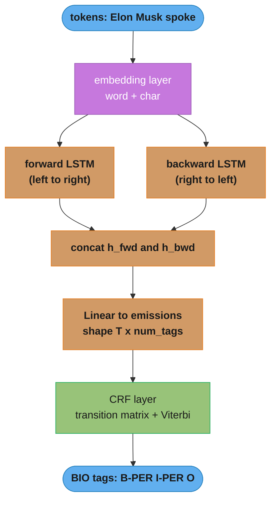

# Sequence Labeling and Conditional Random Fields

> This file is a deep-dive sub-file of the [Natural Language Processing](README.md) module.
> It covers the *modeling* of sequence labeling — POS tagging, NER, chunking — from HMMs through
> MEMMs (and their label-bias flaw) to linear-chain CRFs and BiLSTM-CRF. The end-to-end *production
> system* (serving, sliding windows, active learning, ops) lives in
> [../case_studies/design_ner_pipeline.md](../case_studies/design_ner_pipeline.md); the BERT
> token-classification head is in [bert_and_pretrained_models.md](bert_and_pretrained_models.md).

---

## 1. Concept Overview

Sequence labeling assigns a label to **every** element of an input sequence, where the label
of one element is statistically dependent on its neighbors. This is a **structured prediction**
problem: the output is not one class but a whole sequence of classes, and the model must reason
about the sequence *jointly* rather than one token at a time.

Three canonical tasks:

- **POS tagging** — assign a part-of-speech (NOUN, VERB, DET, ...) to each word. Penn Treebank
  uses 45 tags; a good tagger hits ~97% per-token accuracy.
- **Named Entity Recognition (NER)** — label spans of tokens as PER/ORG/LOC/MISC etc. CoNLL-2003
  has 4 entity types encoded as 9 BIO tags; state-of-the-art F1 is ~93.
- **Chunking (shallow parsing)** — group words into non-overlapping phrases (NP, VP, PP).

The historical arc removes independence assumptions step by step: **HMM** (generative) → **MEMM**
(discriminative but locally normalized, suffers label bias) → **linear-chain CRF** (globally
normalized) → **BiLSTM-CRF** (learned features + CRF decoding) → **BERT + CRF / span-based**. The
through-line — model the *interaction* between adjacent labels and decode the whole sequence at once
— is the single idea that separates a real sequence labeler from a per-token classifier.

---

## 2. Intuition

**One-line analogy:** sequence labeling is a crossword puzzle — each answer is constrained by the
letters it shares with its neighbors, so you cannot solve one cell in isolation.

**Mental model:** you read left to right, but the best tag for the current word depends on the tag
you just assigned. "Washington" is a PERSON after "President" and a LOCATION after "flew to". A
per-token classifier that argmaxes each position independently can produce `O` then `I-PER` — an
illegal transition, because `I-PER` (inside a person) must follow a `B-PER` or another `I-PER`.

**Why it matters:** joint decoding turns a set of locally-plausible-but-globally-inconsistent
guesses into one globally-optimal, *valid* label sequence. On CoNLL-2003 the CRF layer buys
+1–2 F1 over a softmax head for near-zero cost; on domain corpora with ambiguous boundaries
(medical "type 2 diabetes mellitus") it buys +3–4 F1.

**Key insight:** the difference between a CRF and an MEMM is *where you normalize*. An MEMM
normalizes per step (each transition is a probability distribution), which leaks probability mass
toward states with few outgoing arcs regardless of the observation — the **label-bias problem**.
A CRF normalizes over the *entire sequence* with a single partition function `Z(x)`, so no state
can hoard mass. Global normalization is the whole reason CRFs beat MEMMs.

---

## 3. Core Principles

**Structured prediction / joint decoding.** The output space is exponential: for `T` tokens and
`K` tags there are `K^T` possible label sequences. We never enumerate them — dynamic programming
(Viterbi for the best path, forward-backward for marginals) exploits the first-order Markov
structure to solve everything in `O(T · K^2)`.

**Emissions and transitions.** Every model in this family factors the score of a labeling into two
kinds of terms: **emission** scores (how well tag `y_t` fits observation `x_t`) and **transition**
scores (how compatible tag `y_{t-1}` is with tag `y_t`). HMMs make these probabilities; CRFs make
them arbitrary real-valued feature weights.

**Generative vs discriminative.** An HMM models the *joint* `P(x, y)` and requires modeling how
observations are generated. A CRF models the *conditional* `P(y | x)` directly, so it can throw in
overlapping, correlated features (word shape, prefixes, gazetteers) without violating any
independence assumption. Discriminative wins whenever you have rich features and enough labeled data.

**Local vs global normalization.** MEMMs normalize each transition into a probability distribution
(local); CRFs normalize the whole path with `Z(x)` (global). Local normalization causes label bias.

**Tagging schemes.** Multi-token spans use prefix conventions — IO, BIO (the default), and
BIOES/BILOU (adds End and Single tags for sharper boundaries). See §4.1 for the full comparison.

---

## 4. Types / Architectures / Strategies

### 4.1 Tagging schemes

For the sentence `Elon Musk visited Paris`:

| Token | IO | BIO | BIOES |
|-------|-----|-----|-------|
| Elon | I-PER | B-PER | B-PER |
| Musk | I-PER | I-PER | E-PER |
| visited | O | O | O |
| Paris | I-LOC | B-LOC | S-LOC |

BIO needs `2K + 1` tags for `K` entity types; BIOES needs `4K + 1`. Two adjacent same-type
entities ("Paris London" as two LOCs) are only separable in BIO/BIOES, not IO.

### 4.2 Hidden Markov Model (HMM) — generative

An HMM defines a joint distribution over hidden tags `y` and observed words `x`:

```
P(x, y) = π(y_1) · Π_t A[y_{t-1}, y_t] · Π_t B[y_t, x_t]
```

- `π` — initial state distribution `(K,)`
- `A` — transition matrix `(K, K)`, `A[i, j] = P(y_t = j | y_{t-1} = i)`
- `B` — emission matrix `(K, V)`, `B[i, w] = P(x_t = w | y_t = i)`

Two strong independence assumptions: (1) the current tag depends only on the previous tag
(first-order Markov); (2) the current word depends only on the current tag. Trained by counting
(supervised) or Baum-Welch/EM (unsupervised), decoded with Viterbi. Simple and fast, but cannot use
overlapping features (word shape, suffixes) because emissions are single-token multinomials.

### 4.3 Maximum-Entropy Markov Model (MEMM) and label bias

An MEMM is discriminative — it models `P(y_t | y_{t-1}, x)` with a per-state logistic regression
and multiplies these across the sequence:

```
P(y | x) = Π_t P(y_t | y_{t-1}, x)
```

Each factor is **locally normalized** — a proper distribution over next states — and that is the
fatal flaw. A state with only one outgoing transition must pass *all* its probability forward
regardless of the observation, so low-entropy states effectively ignore their emissions. This is the
**label-bias problem** (Lafferty et al., 2001): the model systematically prefers paths through
states with fewer branches. CRFs fix it by deferring normalization to the end.

### 4.4 Linear-chain CRF — discriminative, globally normalized

A linear-chain CRF models the conditional directly with a single global normalizer:

```
P(y | x) = (1 / Z(x)) · exp( Σ_t Σ_k λ_k · f_k(y_{t-1}, y_t, x, t) )
Z(x)     = Σ_{y'} exp( Σ_t Σ_k λ_k · f_k(y'_{t-1}, y'_t, x, t) )
```

- `f_k` — **feature functions**, each returning a real value (usually 0/1). Two families:
  **transition features** `f(y_{t-1}, y_t)` (e.g. "prev=B-PER and cur=I-PER") and **state features**
  `f(y_t, x, t)` (e.g. "cur=B-PER and x_t is Capitalized").
- `λ_k` — learned weights.
- `Z(x)` — partition function, sum over all `K^T` sequences, computed by the forward algorithm.

Training maximizes conditional log-likelihood (a **convex** objective → global optimum via L-BFGS).
The gradient of each weight is `observed_feature_count − expected_feature_count`, and the expected
counts come from forward-backward. L1 (`c1`) and L2 (`c2`) regularization control sparsity/overfitting.

### 4.5 BiLSTM-CRF

Hand-crafted features cap a classic CRF's ceiling. BiLSTM-CRF (Huang et al., 2015; Lample et al.,
2016) replaces them with learned features: a bidirectional LSTM emits, per token, a `(K,)` vector of
**emission scores**, while a CRF layer holds only a `(K, K)` **transition matrix** and does Viterbi
decoding. The LSTM handles "what does this token look like in context"; the CRF handles "which tag
orderings are legal". Lample's char+word BiLSTM-CRF reached 90.94 F1 on CoNLL-2003 without gazetteers.

### 4.6 Modern alternatives: BERT token classification and span-based NER

- **BERT + softmax head** — a `Linear(768, K)` head on a pretrained transformer produces emissions;
  self-attention already captures long-range context, so it hits ~92.8 F1 on CoNLL and a CRF adds
  only ~+0.2 F1 (the transformer learned most transition structure). Still helps on small/domain data.
- **BERT + CRF** — add the CRF back for guaranteed-valid sequences and +2–4 F1 on domain corpora.
- **Span-based / pointer NER** — drop per-token tags: enumerate candidate spans `(i, j)`, score each
  for a type, allow overlaps. The only way to represent **nested entities** ("Bank of America" — LOC
  inside ORG). Cost `O(n^2)` spans; cap span length (e.g. 10) to stay tractable.

---

## 5. Architecture Diagrams

### HMM generative story


The hidden tag chain (purple) is generated via transitions `A`; each tag emits its word (blue) via
emissions `B`. Inference inverts this to recover the most probable chain from the words.

### Viterbi trellis (decoding the best path)

Alignment carries the meaning here, so this stays ASCII. `delta[t][s]` is the log-score of the best
path ending in state `s` at position `t`; `*` marks the winner in each column, and the arrows are
the backpointers `psi` that reconstruct the path.

```
 states      t=1: Elon        t=2: Musk        t=3: spoke
 --------    -----------      -----------      -----------
 O            -2.3             -4.1             -3.0  *   <- argmax of final column
 B-PER        -1.2  *  \       -5.0             -6.1
 I-PER        -9.0      \----> -2.1  *  \-----> -7.2

 recurrence:  delta[t][s] = max over s'( delta[t-1][s'] + trans[s'->s] ) + emit[s][x_t]
 backtrack :  follow psi pointers from the final argmax leftward
 best path :  B-PER -> I-PER -> O      ("Elon Musk" = PERSON, "spoke" = O)
```

Independent per-column argmax (no transitions) could pick `O` at column 2 if its emission alone were
highest, breaking the `I-PER` span; folding in transitions is what keeps the path valid.

### Linear-chain CRF feature-function scoring


State features tie observations to tags; transition features tie adjacent tags together. Their
weighted sum is the unnormalized path score; dividing by `Z(x)` (over all sequences) yields the
globally-normalized probability — the fix for label bias.

### BiLSTM-CRF stack



The BiLSTM produces context-aware emission scores (each token sees the whole sentence); the CRF
layer contributes only the learned transition matrix and Viterbi decoding, guaranteeing valid tag
sequences the LSTM alone might violate.

---

## 6. How It Works — Detailed Mechanics

### 6.1 Viterbi decoding from scratch (numpy, log-space)

```python
import numpy as np


def viterbi_decode(
    obs: list[int],          # observation (word) indices, length T
    start_lp: np.ndarray,    # (K,)   log initial-state probs  log pi
    trans_lp: np.ndarray,    # (K, K) log transitions, trans_lp[i, j] = log P(j | i)
    emit_lp: np.ndarray,     # (K, V) log emissions, emit_lp[i, w] = log P(w | i)
) -> tuple[list[int], float]:
    """Most probable hidden-state path. Everything in log-space to avoid underflow."""
    T = len(obs)
    K = start_lp.shape[0]
    delta = np.full((T, K), -np.inf)   # delta[t, s] = log-prob of best path to state s at t
    psi = np.zeros((T, K), dtype=int)  # backpointers

    delta[0] = start_lp + emit_lp[:, obs[0]]
    for t in range(1, T):
        # scores[i, j] = best-path-to-i + transition i->j  (broadcast over columns j)
        scores = delta[t - 1][:, None] + trans_lp          # (K, K)
        psi[t] = np.argmax(scores, axis=0)                 # best predecessor for each j
        delta[t] = np.max(scores, axis=0) + emit_lp[:, obs[t]]

    best_last = int(np.argmax(delta[T - 1]))
    best_logp = float(delta[T - 1, best_last])
    path = [best_last]
    for t in range(T - 1, 0, -1):
        path.append(int(psi[t, path[-1]]))
    path.reverse()
    return path, best_logp
```

Viterbi keeps the single best path into each state (`max`), yielding the MAP sequence in `O(T·K^2)`.

### 6.2 Forward-backward from scratch (numpy, log-space)

```python
from scipy.special import logsumexp


def forward_backward(
    obs: list[int],
    start_lp: np.ndarray,    # (K,)
    trans_lp: np.ndarray,    # (K, K)
    emit_lp: np.ndarray,     # (K, V)
) -> tuple[np.ndarray, float]:
    """Posterior marginals P(y_t = s | obs) and total log-likelihood log P(obs)."""
    T, K = len(obs), start_lp.shape[0]

    # Forward: alpha[t, s] = log P(o_1..o_t, y_t = s)
    alpha = np.full((T, K), -np.inf)
    alpha[0] = start_lp + emit_lp[:, obs[0]]
    for t in range(1, T):
        for j in range(K):
            alpha[t, j] = logsumexp(alpha[t - 1] + trans_lp[:, j]) + emit_lp[j, obs[t]]

    # Backward: beta[t, s] = log P(o_{t+1}..o_T | y_t = s)
    beta = np.full((T, K), -np.inf)
    beta[T - 1] = 0.0
    for t in range(T - 2, -1, -1):
        for i in range(K):
            beta[t, i] = logsumexp(trans_lp[i] + emit_lp[:, obs[t + 1]] + beta[t + 1])

    log_likelihood = logsumexp(alpha[T - 1])
    gamma = alpha + beta - log_likelihood          # posterior marginals in log-space
    return np.exp(gamma), float(log_likelihood)
```

Viterbi uses `max` (best path); forward-backward uses `logsumexp` (sum over all paths). Forward
alone gives `P(obs)` — the HMM likelihood and the template for the CRF's `Z`; the backward pass adds
the marginals needed for CRF gradients and per-token confidence.

### 6.3 CRF partition function and NLL loss (log-space)

```python
import torch


def crf_log_partition(
    emissions: torch.Tensor,    # (T, K)  per-position emission scores
    transitions: torch.Tensor,  # (K, K)  transitions[i, j] = score of i -> j
    start_trans: torch.Tensor,  # (K,)    score of starting in each tag
    end_trans: torch.Tensor,    # (K,)    score of ending in each tag
) -> torch.Tensor:
    """log Z(x): logsumexp over ALL K^T tag sequences via the forward algorithm, O(T*K^2)."""
    T, K = emissions.shape
    alpha = start_trans + emissions[0]                             # (K,)
    for t in range(1, T):
        # broadcast alpha[i] + transitions[i, j] + emissions[t, j]
        scores = alpha.unsqueeze(1) + transitions + emissions[t].unsqueeze(0)  # (K, K)
        alpha = torch.logsumexp(scores, dim=0)                    # (K,)
    return torch.logsumexp(alpha + end_trans, dim=0)


def crf_nll(emissions, tags, transitions, start_trans, end_trans) -> torch.Tensor:
    """NLL = log Z(x) - score(gold). Minimizing pushes the gold path's share of the
    total probability mass toward 1."""
    # Unnormalized score of the ONE gold path: sum of its emissions + transitions
    gold = start_trans[tags[0]] + emissions[0, tags[0]]
    for t in range(1, emissions.shape[0]):
        gold = gold + transitions[tags[t - 1], tags[t]] + emissions[t, tags[t]]
    gold = gold + end_trans[tags[-1]]
    logZ = crf_log_partition(emissions, transitions, start_trans, end_trans)
    return logZ - gold
```

The forward recursion for `Z` is the HMM forward pass with `+` scores instead of `×` probabilities.
The loss `logZ − gold` is exactly `−log P(y | x)`, convex when emissions are linear features.

### 6.4 BiLSTM-CRF (PyTorch + torchcrf)

```python
import torch
import torch.nn as nn
from torchcrf import CRF


class BiLSTMCRF(nn.Module):
    def __init__(self, vocab_size: int, num_tags: int, embed_dim: int = 100,
                 hidden_dim: int = 256, pad_idx: int = 0) -> None:
        super().__init__()
        self.embedding = nn.Embedding(vocab_size, embed_dim, padding_idx=pad_idx)
        # hidden_dim // 2 per direction so the concatenation is hidden_dim wide
        self.lstm = nn.LSTM(embed_dim, hidden_dim // 2, num_layers=1,
                            bidirectional=True, batch_first=True)
        self.hidden2tag = nn.Linear(hidden_dim, num_tags)   # emission scores
        self.crf = CRF(num_tags, batch_first=True)           # learns (K, K) transitions

    def _emissions(self, x: torch.Tensor) -> torch.Tensor:
        emb = self.embedding(x)                 # (B, T, embed_dim)
        lstm_out, _ = self.lstm(emb)            # (B, T, hidden_dim)
        return self.hidden2tag(lstm_out)        # (B, T, num_tags)

    def loss(self, x: torch.Tensor, tags: torch.Tensor, mask: torch.Tensor) -> torch.Tensor:
        emissions = self._emissions(x)
        # torchcrf returns log-likelihood; negate for a loss. mask drops padding positions.
        return -self.crf(emissions, tags, mask=mask, reduction="mean")

    @torch.no_grad()
    def decode(self, x: torch.Tensor, mask: torch.Tensor) -> list[list[int]]:
        emissions = self._emissions(x)
        return self.crf.decode(emissions, mask=mask)   # Viterbi best path per sequence


# training step
model = BiLSTMCRF(vocab_size=20000, num_tags=9)   # 9 = O + B/I x {PER, ORG, LOC, MISC}
optimizer = torch.optim.Adam(model.parameters(), lr=1e-3)
loss = model.loss(input_ids, gold_tags, mask=attention_mask.bool())
loss.backward()
torch.nn.utils.clip_grad_norm_(model.parameters(), max_norm=5.0)   # LSTMs need clipping
optimizer.step()
```

`torchcrf` handles the forward algorithm, Viterbi, and masking internally — the `mask` (first token
must be `True`) marks padding. Gradient clipping at 5.0 controls exploding gradients in the LSTM.

### 6.5 Classic CRF with hand-crafted features (sklearn-crfsuite)

```python
import sklearn_crfsuite
from sklearn_crfsuite import metrics


def word2features(sent: list[tuple[str, str]], i: int) -> dict:
    word = sent[i][0]
    feats: dict[str, object] = {
        "bias": 1.0,
        "word.lower": word.lower(),
        "word[-3:]": word[-3:],            # suffix: catches -ing, -ly, -tion
        "word.isupper": word.isupper(),    # ACRONYM -> likely ORG
        "word.istitle": word.istitle(),    # Capitalized -> likely proper noun
        "word.isdigit": word.isdigit(),
    }
    if i > 0:                              # left neighbor
        prev = sent[i - 1][0]
        feats.update({"-1:word.lower": prev.lower(), "-1:word.istitle": prev.istitle()})
    else:
        feats["BOS"] = True                # beginning of sentence
    if i < len(sent) - 1:                  # right neighbor
        nxt = sent[i + 1][0]
        feats.update({"+1:word.lower": nxt.lower(), "+1:word.istitle": nxt.istitle()})
    else:
        feats["EOS"] = True
    return feats


# X_train: list of per-sentence feature-dict lists; y_train: list of BIO-label lists
crf = sklearn_crfsuite.CRF(
    algorithm="lbfgs", c1=0.1, c2=0.1,     # c1 = L1 (sparsity), c2 = L2 (smoothness)
    max_iterations=100, all_possible_transitions=True,
)
crf.fit(X_train, y_train)
y_pred = crf.predict(X_test)
labels = [c for c in crf.classes_ if c != "O"]     # entity-level F1 ignores majority 'O'
print(metrics.flat_f1_score(y_test, y_pred, average="weighted", labels=labels))
```

Rich overlapping features (word shape, affixes, neighbors, gazetteers) are what a generative HMM
*cannot* use — the CRF's edge; a CRFsuite model hits ~84–88 F1 on CoNLL-2003 with no neural net.

---

## 7. Real-World Examples

**Stanford NER (CoreNLP):** the canonical production CRF NER. A linear-chain CRF with word,
shape, prefix/suffix, and window features; ships 3-class (PER/ORG/LOC) and 7-class models. Still
widely deployed where GPUs are unavailable — it runs at thousands of tokens/sec on CPU.

**spaCy:** `en_core_web_sm/md/lg` use a CNN + transition-based parser for NER (not a CRF), while
`en_core_web_trf` uses a BERT backbone. spaCy deliberately dropped the CRF layer because its beam
+ transition system already enforces valid spans — a reminder that a CRF is one way, not the only
way, to get global consistency.

**Flair:** `flair/ner-english-large` stacks contextual string embeddings + a BiLSTM-CRF and hit
~94 F1 on CoNLL-2003, among the best non-transformer results. It demonstrates that BiLSTM-CRF
remains competitive when fed strong contextual embeddings.

**POS tagging in NLTK / TnT:** classic averaged-perceptron and HMM taggers (TnT is a trigram HMM)
reach ~96–97% token accuracy on Penn Treebank — the workhorses before neural taggers.

**BioBERT / clinical NER:** biomedical NER (diseases, drugs, genes) routinely adds a CRF on top of
BioBERT because entity boundaries are long and ambiguous ("chronic obstructive pulmonary disease");
the CRF's transition constraints buy +2–4 F1 over a plain token-classification head.

---

## 8. Tradeoffs

### Model family comparison

| Model | Type | Features | CoNLL F1 (approx) | Normalization | Notes |
|-------|------|----------|-------------------|---------------|-------|
| HMM | Generative | single-token emissions | ~80 | joint P(x,y) | fast, needs little data, no overlapping features |
| MEMM | Discriminative | overlapping | ~85 (biased) | local (per step) | **label bias**; rarely used today |
| Linear-chain CRF | Discriminative | overlapping | 84–88 | global Z(x) | convex training, no GPU needed |
| BiLSTM-CRF | Neural + CRF | learned | 90–91 | global Z(x) | learns features; needs more data |
| BERT + softmax | Neural | learned (pretrained) | ~92.8 | local (per token) | context makes CRF nearly redundant |
| BERT + CRF | Neural + CRF | learned (pretrained) | ~93 | global Z(x) | +2–4 F1 on domain/small data |
| Span-based | Neural | learned | ~92 (+ nested) | per-span | only option for nested entities |

### CRF head vs softmax head (on a neural encoder)

| Metric | Softmax head | CRF head |
|--------|--------------|----------|
| Invalid sequences (I-after-O) | possible (~0.5–1% of outputs) | impossible (0%) |
| CoNLL-2003 F1 delta | baseline | +0.2 to +2 |
| Domain NER F1 delta | baseline | +2 to +4 |
| Decode cost | argmax, `O(T·K)` | Viterbi, `O(T·K^2)` |
| Extra parameters | none | `(K+2)·K` transition matrix (~tens–hundreds) |

---

## 9. When to Use / When NOT to Use

| Choose | When |
|--------|------|
| **classic CRF** (sklearn-crfsuite / CRF++) | no GPU; modest data (1K–50K sentences) with craftable features; interpretability matters (weights are inspectable) |
| **BiLSTM-CRF** | 10K+ labeled sentences, learned features wanted, but transformer cost/latency is unaffordable |
| **BERT + CRF** | top accuracy on domain text with long/ambiguous spans; downstream needs *guaranteed valid* BIO (no I-after-O) |
| **span-based / pointer** | entities can nest or overlap (medical dosage, legal compounds); score types independently of a tag chain |

**Do NOT use CRF-based sequence labeling when:** the task is *sequence* classification (one label
per sentence — use a `[CLS]` head); labels are genuinely independent across positions (the
transition matrix adds cost with no benefit); or you need generation or entity linking /
disambiguation (different problem classes).

---

## 10. Common Pitfalls

### Pitfall 1: independent per-token argmax produces invalid sequences

```python
# BROKEN: argmax each position independently -> can emit O then I-PER (illegal)
emissions = model(input_ids)                 # (T, K) scores
tags = emissions.argmax(dim=-1).tolist()     # no transition awareness
# Example bad output on "Elon Musk spoke":  ['O', 'I-PER', 'O']
#   -> 'I-PER' after 'O' is impossible in BIO; the "Musk" entity has no B- start.

# FIXED: joint decoding with a CRF (Viterbi over emissions + transitions)
from torchcrf import CRF
crf = CRF(num_tags, batch_first=True)
tags = crf.decode(emissions.unsqueeze(0), mask=mask)[0]
#   -> ['B-PER', 'I-PER', 'O']  — the transition matrix makes O->I-PER score -inf.
```

Production symptom: a NER service returned `I-ORG` spans with no preceding `B-ORG`; the span
extractor silently dropped them, so ~0.8% of true entities vanished. Adding the CRF layer removed
all invalid transitions and recovered +1.7 F1 on CoNLL-2003.

### Pitfall 2: the MEMM label-bias trap (local normalization)

```python
# BROKEN (conceptually): an MEMM normalizes P(y_t | y_{t-1}, x) per step.
#   A state with ONE outgoing arc forwards ALL its probability, ignoring x_t.
#   Classic Lafferty et al. example: 'rib' vs 'rob' — the model commits to a branch
#   after the first character and cannot revise, because each step's mass is conserved.

# FIXED: a CRF normalizes ONCE, globally, with Z(x).
#   No state can hoard probability; the observation at every position still matters.
# Rule of thumb: if you find yourself training per-state classifiers and multiplying
# them, you have built an MEMM — switch to a CRF's single global partition function.
```

### Pitfall 3: token-level accuracy instead of entity-level F1

```python
# BROKEN: token accuracy is inflated by the dominant 'O' class.
# If 90% of tokens are 'O', predicting all-'O' scores 90% accuracy and finds 0 entities.
from sklearn.metrics import accuracy_score
accuracy_score(flat_true, flat_pred)          # misleading

# FIXED: entity-level (span) F1 via seqeval — a span counts only if type AND both
# boundaries match exactly.
from seqeval.metrics import f1_score, classification_report
print(f1_score(true_bio, pred_bio))           # true_bio/pred_bio: list[list[str]]
print(classification_report(true_bio, pred_bio, digits=4))
```

### Pitfall 4: forward algorithm underflow (multiplying probabilities)

```python
# BROKEN: multiplying many probabilities underflows to 0.0 for long sequences.
alpha = start_p * emit_p[:, obs[0]]
for t in range(1, T):
    alpha = (alpha @ trans_p) * emit_p[:, obs[t]]   # after ~50 steps -> 0.0, log-lik = -inf

# FIXED: work in log-space and use logsumexp everywhere (see 6.2/6.3).
from scipy.special import logsumexp
log_alpha = start_lp + emit_lp[:, obs[0]]
for t in range(1, T):
    log_alpha = logsumexp(log_alpha[:, None] + trans_lp, axis=0) + emit_lp[:, obs[t]]
```

### Pitfall 5: wrong BIO alignment for subword tokenizers

```python
# BROKEN: assign the same B- label to every subword of a word.
#   "metformin" -> ["met", "##form", "##in"] all get B-DRUG.
#   The CRF then learns B-DRUG -> B-DRUG, inventing spurious entity boundaries.

# FIXED: only the FIRST subword carries the word label; continuations get I- (or -100 to
# ignore in loss). See bert_and_pretrained_models.md for the word_ids() alignment code.
label_ids = []
for word_id in encoding.word_ids():
    if word_id is None:                      # [CLS]/[SEP]/pad
        label_ids.append(-100)
    elif word_id != prev_word_id:            # first subword of a word
        label_ids.append(tag2id[word_labels[word_id]])
    else:                                    # continuation subword
        tag = word_labels[word_id]
        label_ids.append(tag2id["I-" + tag[2:]] if tag.startswith("B-") else tag2id[tag])
    prev_word_id = word_id
```

---

## 11. Technologies & Tools

| Tool | Purpose | Notes |
|------|---------|-------|
| `sklearn-crfsuite` | classic linear-chain CRF with hand features | wraps CRFsuite; `c1`/`c2` = L1/L2; CPU, minutes to train |
| `CRF++` | C++ CRF trainer/decoder | template-based features; classic production tool |
| `pytorch-crf` (`torchcrf`) | CRF layer for neural models | forward algorithm + Viterbi + masking; drop-in on any encoder |
| `TorchCRF` / `allennlp` `ConditionalRandomField` | alternative CRF layers | AllenNLP supports constrained decoding (allowed-transition masks) |
| `transformers` `AutoModelForTokenClassification` | BERT token classifier | softmax head; add a CRF for guaranteed-valid spans |
| `seqeval` | entity-level NER evaluation | span-level P/R/F1 for BIO/BIOES; the correct metric |
| `spaCy` / `spacy-transformers` | production NER pipelines | transition-based or transformer NER; batch + serialization |
| `Flair` | contextual embeddings + BiLSTM-CRF | strong multilingual sequence labeling |
| `NLTK` (`hmm`, `tnt`) | teaching-grade HMM/perceptron taggers | good for understanding Viterbi/forward-backward |
| `datasets` (HuggingFace) | CoNLL-2003, OntoNotes, WNUT loaders | standard benchmarks with BIO labels included |

---

## 12. Interview Questions with Answers

**Q: Why add a CRF layer on top of a neural encoder instead of a plain softmax head?**
A CRF decodes the whole sequence jointly so it can never emit an invalid tag transition like
`I-PER` after `O`, whereas an independent softmax argmax can. The softmax head scores each token
independently; the CRF adds a learned transition matrix and runs Viterbi to find the globally
best *valid* path. It costs a `(K, K)` matrix and `O(T·K^2)` decoding but buys +1–2 F1 on CoNLL
and +2–4 F1 on domain corpora with ambiguous boundaries. Use it whenever downstream code assumes
well-formed BIO spans.

**Q: What is the label-bias problem and which model suffers from it?**
Label bias is when a locally-normalized model funnels probability toward states with few outgoing
transitions regardless of the observation, and it afflicts MEMMs (and any per-step-normalized
model). Because each MEMM step is a proper distribution over next states, a state with one arc must
forward all its mass, so its emission is effectively ignored. CRFs avoid this by normalizing once
globally with `Z(x)`, letting the observation at every position influence the whole path. This is
the historical reason CRFs replaced MEMMs (Lafferty et al., 2001).

**Q: What is the difference between an HMM and a CRF?**
An HMM is generative — it models the joint `P(x, y)` with emission and transition probabilities —
while a CRF is discriminative and models `P(y | x)` directly. The practical consequence: an HMM's
emissions are single-token multinomials, so it cannot use overlapping features (word shape,
suffixes, neighbor words), whereas a CRF's feature functions can be arbitrary and correlated. HMMs
need less data and train by counting; CRFs need more data but train a convex objective and reach
higher accuracy with rich features.

**Q: What is the partition function Z(x) in a CRF and how is it computed?**
`Z(x)` is the sum of `exp(score)` over all `K^T` possible tag sequences, and it normalizes the path
scores into a probability distribution. You never enumerate the sequences — the forward algorithm
computes `log Z(x)` in `O(T·K^2)` by carrying a `(K,)` vector of log-sum-exp accumulated scores
left to right. It appears in the loss as `log Z(x) − score(gold)`, which is the negative
log-likelihood of the gold labeling. Getting `Z` right (in log-space) is what makes CRF training
numerically stable.

**Q: When do you use Viterbi versus the forward-backward algorithm?**
Use Viterbi to find the single most probable label sequence (MAP decoding at inference). Use
forward-backward to compute per-position posterior marginals and the total likelihood, needed for
training gradients and per-token confidence. They share the same trellis but differ in the
operator: Viterbi takes a `max` (keeps the best path), forward-backward takes a `logsumexp` (sums
over all paths). Both are `O(T·K^2)`. In a CRF, training uses forward (for `Z`) + backward (for
expected feature counts); inference uses Viterbi.

**Q: Why must the forward algorithm run in log-space?**
Multiplying many probabilities underflows to zero after a few dozen steps, making the likelihood
`-inf` and gradients useless. Working in log-space replaces products with sums and uses `logsumexp`
(which subtracts the max before exponentiating) to stay numerically stable. This is why every
from-scratch forward/Viterbi implementation stores log-probabilities, not probabilities. Forgetting
this is the most common bug in hand-rolled HMM/CRF code.

**Q: What are BIO and BIOES tagging schemes and why does the prefix matter?**
BIO marks each token as `B-TYPE` (begin an entity), `I-TYPE` (inside/continue), or `O` (outside),
which lets multi-token spans and adjacent same-type entities be represented unambiguously. BIOES
adds `E-TYPE` (end) and `S-TYPE` (single-token) for sharper boundary signals, at the cost of
doubling the tag count (`4K+1` vs `2K+1`). BIO is the default; BIOES buys ~0.5–1 F1 but is harder
to learn and expands the CRF transition matrix. The prefix is what turns a flat classification into
a span structure.

**Q: What are feature functions in a linear-chain CRF?**
Feature functions `f_k(y_{t-1}, y_t, x, t)` return a value (usually 0/1) capturing a pattern, and
the CRF scores a labeling as the weighted sum of all active features. They split into transition
features (depend on the adjacent tag pair, e.g. "prev=B-PER and cur=I-PER") and state features
(depend on the observation and current tag, e.g. "x_t is Capitalized and cur=B-PER"). Overlapping,
correlated features are allowed — impossible in an HMM — which is the CRF's core advantage. The
learned weights `λ_k` are directly interpretable.

**Q: How is a linear-chain CRF trained?**
It maximizes the conditional log-likelihood `Σ score(gold) − log Z(x)`, a convex objective solved
with L-BFGS (or SGD in neural CRFs). The gradient of each feature weight is
`observed_count − expected_count`, where expected counts under the model come from forward-backward.
Convexity means there is a single global optimum — no bad local minima. L1 (`c1`) and L2 (`c2`)
regularization control sparsity and overfitting.

**Q: In a BiLSTM-CRF, what does each component contribute?**
The BiLSTM produces context-aware emission scores — a per-token `(K,)` vector that sees the whole
sentence from both directions. The CRF contributes a learned transition matrix plus Viterbi
decoding for valid sequences. The LSTM answers "what does this token look like in context"; the CRF
answers "which tag orderings are legal". Neither alone is enough: a BiLSTM with a softmax head can
emit invalid spans, and a CRF alone has weak, hand-crafted emissions. Together they reached ~90.94
F1 on CoNLL-2003 without gazetteers (Lample et al., 2016).

**Q: What is the time complexity of Viterbi and the forward algorithm?**
Both are `O(T · K^2)` time and `O(T · K)` memory, where `T` is sequence length and `K` is the
number of tags. The `K^2` factor comes from considering every (previous tag, current tag) pair at
each step; the `T` factor from sweeping the sequence once. This is why NER with ~9–23 BIO tags is
cheap (`K` small) but a POS/morphology task with hundreds of tags is noticeably slower. Beam search
can approximate Viterbi when `K` is very large.

**Q: Do you still need a CRF layer on top of BERT?**
Often not much — BERT's self-attention already captures long-range dependencies, so a plain
softmax token-classification head reaches ~92.8 F1 on CoNLL, and adding a CRF may only gain ~+0.2
F1. The CRF still helps meaningfully on small datasets, domain corpora with long ambiguous spans,
and any pipeline that requires *guaranteed* valid BIO output. Rule: start with the softmax head,
add the CRF if you see invalid spans or need the last couple of F1 points on domain data.

**Q: When would you choose a span-based model over BIO tagging?**
Choose span-based (or pointer) models when entities can nest or overlap, because flat BIO assigns
each token exactly one tag and cannot represent "Bank of America" as a LOC inside an ORG. Span
models enumerate candidate `(start, end)` spans, score each for an entity type, and permit
overlapping predictions. The cost is `O(n^2)` spans per sentence, mitigated by capping span length
(e.g. 10). For flat, non-nested NER, BIO + CRF is simpler and usually as accurate.

**Q: How do you evaluate a sequence labeler correctly, and what is the common mistake?**
Use entity-level F1 via seqeval, where a predicted span counts as correct only if its type and both
boundaries exactly match the gold span. The common mistake is token-level accuracy, which the
dominant `O` class inflates — a model predicting all `O` can score 90%+ token accuracy while
finding zero entities. Report a per-type breakdown too, since aggregate F1 hides weak entity types
(e.g. a rare `MISC` or `CASE_NUMBER` class collapsing to near-zero recall).

**Q: What is the difference between Viterbi (MAP) decoding and marginal (posterior) decoding?**
Viterbi returns the single highest-probability *sequence* as a whole, while marginal decoding picks,
independently at each position, the tag with the highest posterior marginal from forward-backward.
Viterbi guarantees a globally-consistent, valid path but may not maximize per-token accuracy;
marginal decoding maximizes expected per-token correctness but can produce an inconsistent sequence.
NER uses Viterbi (validity matters); per-token confidence and active-learning uncertainty use the
marginals.

---

## 13. Best Practices

1. Default to a CRF head (or constrained Viterbi) whenever downstream code assumes valid BIO — it
   eliminates the entire class of `I-after-O` bugs at ~3ms extra latency.
2. Always evaluate with `seqeval` entity-level F1, never token accuracy; add a per-type report to
   surface rare-class collapse.
3. Do everything in log-space (`logsumexp`) for forward/Viterbi to avoid underflow on long sequences.
4. For subword tokenizers, label only the first subword and set continuations to `-100`; assigning
   `B-` to every subword teaches the CRF impossible transitions.
5. Give the CRF/classifier a higher learning rate than the pretrained encoder (e.g. `10×`) — it is
   randomly initialized and must move faster than the fine-tuned backbone.
6. Clip gradients (max-norm 5.0) for BiLSTM-CRF; recurrent nets are prone to exploding gradients
   early in training.
7. Handle class imbalance from `O` domination with class-weighted loss or focal loss when rare
   entity recall is critical (legal `CASE_NUMBER`, medical rare findings).
8. Start with a classic sklearn-crfsuite baseline before any neural model — it trains in minutes on
   CPU and sets an honest floor (often 84–88 F1) that a transformer must beat to justify its cost.
9. Add gazetteer / word-shape features to a classic CRF for domain terms; they are the cheapest way
   to inject knowledge a small training set lacks.
10. Use marginal (posterior) probabilities, not the Viterbi path score, for per-span confidence and
    active-learning uncertainty — a long high-confidence document can hide one genuinely uncertain
    entity.

---

## 14. Case Study

### Modeling choices for a production NER pipeline

The full system design — serving, sliding windows, subword span extraction, active-learning,
retraining, capacity planning — lives in
[../case_studies/design_ner_pipeline.md](../case_studies/design_ner_pipeline.md). Here we focus only
on the **modeling decisions** it wraps around. NER is token classification with interacting labels:
one token's label constrains its neighbors (`I-PER` must follow `B-PER`), so the modeling question
is always *how do we enforce and exploit that structure*.

**The model ladder (what to try, in order):**

1. **sklearn-crfsuite baseline (day 1).** Word-shape, affix, and neighbor features + a linear-chain
   CRF. On CoNLL-2003 this reaches ~85 F1 on CPU in minutes and sets the floor. If a heavier model
   cannot beat this by several points, it is not worth the serving cost.

2. **BiLSTM-CRF (when you have 10K+ sentences, no transformer budget).** Char + word embeddings →
   BiLSTM emissions → CRF layer. ~90–91 F1, ~10ms/sentence on CPU, no pretraining dependency.

3. **BERT + CRF (accuracy target).** BERT emissions → CRF layer. The CRF matters most here on
   *domain* data: on CoNLL it adds ~+0.2 F1 (BERT already learned transitions), but on medical/legal
   corpora with long ambiguous spans it adds +2–4 F1 and drives invalid-sequence rate to exactly 0%.

**The decision that always comes up: CRF head or softmax head?** A softmax head (`argmax` per token,
`O(T·K)`) leaves ~0.5–1% of outputs as invalid BIO sequences; a CRF head (Viterbi over emissions +
learned transitions, +3ms/512 tokens) drives that to 0% and adds +2–4 F1 on domain NER. Verdict: add
the CRF unless you are on vanilla CoNLL where BERT already nails transitions *and* latency is
saturated — in every domain deployment the CRF paid for itself.

**Modeling pitfalls that bit production (mechanism, not ops):**

- **Subword label leakage** — labeling every subword `B-DRUG` taught the CRF `B-DRUG -> B-DRUG`,
  splitting single drugs into many entities; fixed by first-subword-only labeling (−6 F1 recovered).
- **O-domination** — a 97%-`O` legal corpus made the model predict all-`O` (0% entity F1); fixed
  with class-weighted loss (`CASE_NUMBER` recall 0% → 71%).
- **Confidence from the wrong quantity** — using the Viterbi *path* score as document confidence hid
  individual uncertain spans; switching to per-span *marginals* (forward-backward) fixed
  active-learning selection.

**Nested entities (when BIO is not enough).** If the domain has nesting ("500mg aspirin" — `aspirin`
= DRUG inside `500mg aspirin` = DOSAGE), no flat BIO CRF can represent it. Escalate to a span-based
model that enumerates and independently scores `(start, end)` spans, accepting the `O(n^2)` cost with
a length cap. This is the one case where the entire CRF/BIO framing must be abandoned.

**Takeaway.** Every model in this ladder factors the same way — emissions (how well a tag fits a
token) plus transitions (which tag orderings are legal) — and the CRF's job is to decode them
*jointly and globally*. That single principle, not any one architecture, is what makes sequence
labeling work; the surrounding production concerns live in the
[NER pipeline case study](../case_studies/design_ner_pipeline.md).
