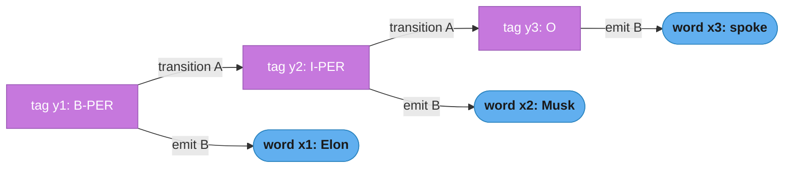
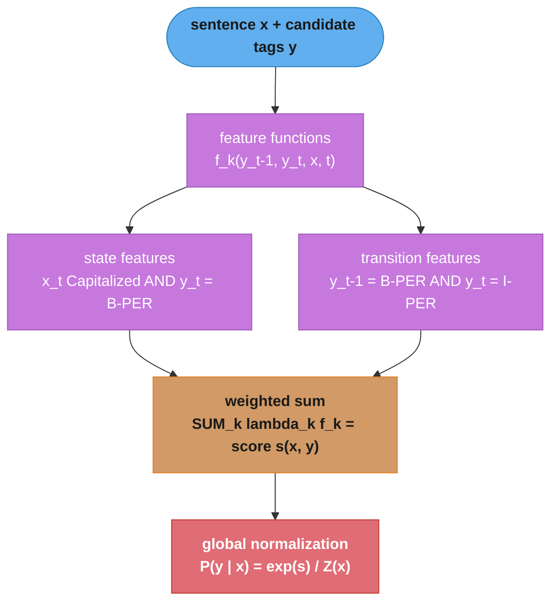

# Sequence Labeling and Conditional Random Fields

> This file is a deep-dive sub-file of the [Natural Language Processing](README.md) module.
> It covers the *modeling* of sequence labeling — POS tagging, NER, chunking — from HMMs through
> MEMMs (and their label-bias flaw) to linear-chain CRFs and BiLSTM-CRF. The end-to-end *production
> system* (serving, sliding windows, active learning, ops) lives in
> [../case_studies/design_ner_pipeline.md](../case_studies/design_ner_pipeline.md); the BERT
> token-classification head is in [bert_and_pretrained_models.md](bert_and_pretrained_models.md).

---

## 1. Concept Overview

Sequence labeling assigns a label to **every** element of an input sequence, where the label
of one element is statistically dependent on its neighbors. This is a **structured prediction**
problem: the output is not one class but a whole sequence of classes, and the model must reason
about the sequence *jointly* rather than one token at a time.

Three canonical tasks:

- **POS tagging** — assign a part-of-speech (NOUN, VERB, DET, ...) to each word. Penn Treebank
  uses 45 tags; a good tagger hits ~97% per-token accuracy.
- **Named Entity Recognition (NER)** — label spans of tokens as PER/ORG/LOC/MISC etc. CoNLL-2003
  has 4 entity types encoded as 9 BIO tags; state-of-the-art F1 is ~93.
- **Chunking (shallow parsing)** — group words into non-overlapping phrases (NP, VP, PP).

The historical arc removes independence assumptions step by step: **HMM** (generative) → **MEMM**
(discriminative but locally normalized, suffers label bias) → **linear-chain CRF** (globally
normalized) → **BiLSTM-CRF** (learned features + CRF decoding) → **BERT + CRF / span-based**. The
through-line — model the *interaction* between adjacent labels and decode the whole sequence at once
— is the single idea that separates a real sequence labeler from a per-token classifier.

---

## 2. Intuition

**One-line analogy:** sequence labeling is a crossword puzzle — each answer is constrained by the
letters it shares with its neighbors, so you cannot solve one cell in isolation.

**Mental model:** you read left to right, but the best tag for the current word depends on the tag
you just assigned. "Washington" is a PERSON after "President" and a LOCATION after "flew to". A
per-token classifier that argmaxes each position independently can produce `O` then `I-PER` — an
illegal transition, because `I-PER` (inside a person) must follow a `B-PER` or another `I-PER`.

**Why it matters:** joint decoding turns a set of locally-plausible-but-globally-inconsistent
guesses into one globally-optimal, *valid* label sequence. On CoNLL-2003 the CRF layer buys
+1–2 F1 over a softmax head for near-zero cost; on domain corpora with ambiguous boundaries
(medical "type 2 diabetes mellitus") it buys +3–4 F1.

**Key insight:** the difference between a CRF and an MEMM is *where you normalize*. An MEMM
normalizes per step (each transition is a probability distribution), which leaks probability mass
toward states with few outgoing arcs regardless of the observation — the **label-bias problem**.
A CRF normalizes over the *entire sequence* with a single partition function `Z(x)`, so no state
can hoard mass. Global normalization is the whole reason CRFs beat MEMMs.

---

## 3. Core Principles

**Structured prediction / joint decoding.** The output space is exponential: for `T` tokens and
`K` tags there are `K^T` possible label sequences. We never enumerate them — dynamic programming
(Viterbi for the best path, forward-backward for marginals) exploits the first-order Markov
structure to solve everything in `O(T · K^2)`.

**What this actually says.** "There are astronomically many possible taggings, but you never have to
look at them one by one — you only ever have to compare tags at *neighboring* positions."

The first-order Markov assumption is what collapses an exponential search into a linear scan. Every
algorithm in this file — Viterbi, forward, forward-backward — is the same left-to-right sweep with a
different operator plugged in.

| Symbol | What it is |
|--------|------------|
| `T` | Number of tokens in the sentence |
| `K` | Number of distinct tags (9 for CoNLL BIO, 45 for Penn Treebank POS) |
| `K^T` | Size of the output space — every tag at every position, all combinations |
| `O(T · K^2)` | Cost of dynamic programming: one sweep of `T` steps, each comparing all `K x K` tag pairs |

**Walk one example.** A 10-token sentence with the 9 CoNLL BIO tags:

```
  brute force  :  K^T     = 9^10          = 3,486,784,401 sequences to score
  Viterbi      :  T x K^2 = 10 x 9 x 9    =           810 cell updates

  speedup      :  3,486,784,401 / 810     =     4,304,672 x

  And the gap widens with length: every extra token multiplies the brute-force
  count by 9, but adds only 81 cell updates to the DP.
```

The DP is exact, not an approximation — it returns the same answer brute force would, because the
score of a path decomposes into per-edge terms that can be maximized (or summed) independently.

**Emissions and transitions.** Every model in this family factors the score of a labeling into two
kinds of terms: **emission** scores (how well tag `y_t` fits observation `x_t`) and **transition**
scores (how compatible tag `y_{t-1}` is with tag `y_t`). HMMs make these probabilities; CRFs make
them arbitrary real-valued feature weights.

**Generative vs discriminative.** An HMM models the *joint* `P(x, y)` and requires modeling how
observations are generated. A CRF models the *conditional* `P(y | x)` directly, so it can throw in
overlapping, correlated features (word shape, prefixes, gazetteers) without violating any
independence assumption. Discriminative wins whenever you have rich features and enough labeled data.

**Local vs global normalization.** MEMMs normalize each transition into a probability distribution
(local); CRFs normalize the whole path with `Z(x)` (global). Local normalization causes label bias.

**Tagging schemes.** Multi-token spans use prefix conventions — IO, BIO (the default), and
BIOES/BILOU (adds End and Single tags for sharper boundaries). See §4.1 for the full comparison.

---

## 4. Types / Architectures / Strategies

### 4.1 Tagging schemes

For the sentence `Elon Musk visited Paris`:

| Token | IO | BIO | BIOES |
|-------|-----|-----|-------|
| Elon | I-PER | B-PER | B-PER |
| Musk | I-PER | I-PER | E-PER |
| visited | O | O | O |
| Paris | I-LOC | B-LOC | S-LOC |

BIO needs `2K + 1` tags for `K` entity types; BIOES needs `4K + 1`. Two adjacent same-type
entities ("Paris London" as two LOCs) are only separable in BIO/BIOES, not IO.

**Read it like this.** "Every entity type costs you a fixed number of tag slots, plus exactly one
shared `O` for everything that is not an entity."

The counting rule is worth internalizing because it sets the size of the CRF transition matrix, which
is `K x K` — so the scheme you pick quadratically drives the parameter count and the Viterbi cost.

| Symbol | What it is |
|--------|------------|
| `K` (in `2K + 1`) | Number of *entity types* — PER, ORG, LOC, MISC is `K = 4` |
| `2K` (BIO) | One `B-` and one `I-` tag per type |
| `4K` (BIOES) | `B-`, `I-`, `E-`, `S-` per type — End and Single are the extra two |
| `+ 1` | The single `O` tag, shared by all types, for non-entity tokens |

**Walk one example.** CoNLL-2003 with its four entity types:

```
  BIO    : 2 x 4 + 1 = 9 tags
           O, B-PER, I-PER, B-ORG, I-ORG, B-LOC, I-LOC, B-MISC, I-MISC

  BIOES  : 4 x 4 + 1 = 17 tags
           O + {B-, I-, E-, S-} x {PER, ORG, LOC, MISC}

  transition matrix cost:  BIO   9 x 9  =  81 entries
                           BIOES 17 x 17 = 289 entries   (3.6x larger)
```

BIOES buys sharper boundaries — a one-token entity gets its own `S-` tag instead of a lone `B-` that
looks like the start of something longer — at 3.6x the transition parameters and Viterbi work. On
CoNLL the gain is usually under half an F1 point, which is why BIO stays the default.

### 4.2 Hidden Markov Model (HMM) — generative

An HMM defines a joint distribution over hidden tags `y` and observed words `x`:

```
P(x, y) = π(y_1) · Π_t A[y_{t-1}, y_t] · Π_t B[y_t, x_t]
```

- `π` — initial state distribution `(K,)`
- `A` — transition matrix `(K, K)`, `A[i, j] = P(y_t = j | y_{t-1} = i)`
- `B` — emission matrix `(K, V)`, `B[i, w] = P(x_t = w | y_t = i)`

Two strong independence assumptions: (1) the current tag depends only on the previous tag
(first-order Markov); (2) the current word depends only on the current tag. Trained by counting
(supervised) or Baum-Welch/EM (unsupervised), decoded with Viterbi. Simple and fast, but cannot use
overlapping features (word shape, suffixes) because emissions are single-token multinomials.

**Put simply.** "Pretend a machine picked a chain of hidden tags by rolling dice, and each tag then
rolled a second die to spit out a word — the probability of what you saw is just all those dice
multiplied together."

The `Π` (capital pi) is a product over positions, the multiplicative twin of `Σ`. Everything in an
HMM is a probability, so terms multiply; every later model in this file replaces the probabilities
with unbounded real scores, at which point the products become sums.

| Symbol | What it is |
|--------|------------|
| `P(x, y)` | The *joint* probability of the words AND the tags — the generative story of both |
| `π(y_1)` | Chance the sentence starts in tag `y_1`. Sentences rarely start with `I-PER` |
| `A[i, j]` | Chance of moving from tag `i` to tag `j`. One row per source tag, each row sums to 1 |
| `B[i, w]` | Chance that tag `i` emits word `w`. One row per tag over the whole vocabulary `V` |
| `Π_t` | Multiply the term across every position `t` in the sentence |

**Walk one example.** Tagging `Elon Musk spoke` as `B-PER, I-PER, O` with three tags:

```
  parameters used
    pi(B-PER)             = 0.4        a sentence often opens on a person
    A[B-PER, I-PER]       = 0.5        half of B-PER tokens continue the span
    A[I-PER, O]           = 0.6        person spans usually end after two tokens
    B[B-PER, "Elon"]      = 0.02
    B[I-PER, "Musk"]      = 0.03
    B[O,     "spoke"]     = 0.01

  transition part :  0.4 x 0.5 x 0.6              = 0.12
  emission part   :  0.02 x 0.03 x 0.01           = 0.000006
  P(x, y)         :  0.12 x 0.000006              = 0.00000072   = 7.2e-07

  in log-space    :  log(7.2e-07)                 = -14.14
```

That absolute number is meaningless on its own — every tagging of this sentence is tiny. What matters
is the *ranking*: swap in `O, O, O` and the emission of "Musk" from `O` will be far smaller, so the
person reading loses. Note also how fast the product shrinks — three tokens already reach `1e-06`,
which is the underflow problem Pitfall 4 fixes with log-space.

Notice what `B[i, w]` cannot express: it is one multinomial over raw word identity, so there is no
place to say "this token is Capitalized" or "this token ends in `-ing`". Every such feature would have
to be folded into the vocabulary itself, and they overlap, which violates the independence the joint
factorization assumes. That single limitation is the whole motivation for discriminative models.

### 4.3 Maximum-Entropy Markov Model (MEMM) and label bias

An MEMM is discriminative — it models `P(y_t | y_{t-1}, x)` with a per-state logistic regression
and multiplies these across the sequence:

```
P(y | x) = Π_t P(y_t | y_{t-1}, x)
```

Each factor is **locally normalized** — a proper distribution over next states — and that is the
fatal flaw. A state with only one outgoing transition must pass *all* its probability forward
regardless of the observation, so low-entropy states effectively ignore their emissions. This is the
**label-bias problem** (Lafferty et al., 2001): the model systematically prefers paths through
states with fewer branches. CRFs fix it by deferring normalization to the end.

**Stated plainly.** "Decide the tag at each step as if it were its own little classification problem,
then multiply the per-step confidences together and call that the sentence score."

The `Π_t` again means "multiply over positions". The catch is hidden in what is *not* written: each
factor `P(y_t | y_{t-1}, x)` is required to sum to 1 over the possible next tags. That constraint is
harmless when a state has many successors and toxic when it has one.

| Symbol | What it is |
|--------|------------|
| `P(y \| x)` | Conditional probability of the whole tag sequence given the words |
| `P(y_t \| y_{t-1}, x)` | One step's distribution over next tags, given the previous tag and the sentence |
| "locally normalized" | Each factor sums to 1 *by itself*, before the sentence is finished |
| "globally normalized" | Only the total over all sequences sums to 1 — the CRF's `Z(x)` |

**Walk one example.** Two branches leaving a shared prefix; branch A has one successor, branch B has
two. Watch branch A win despite the observation clearly favouring branch B:

```
  step 1 (both branches equally plausible from the first character)
    P(A) = 0.50            P(B) = 0.50

  step 2, observation strongly matches a successor of B
    from A: only ONE outgoing arc exists
            P(next | A, obs) = 1.00      <- forced; the observation cannot change it
    from B: two outgoing arcs, and the observation favours one of them
            P(b1 | B, obs)   = 0.90      P(b2 | B, obs) = 0.10

  path totals
    A -> a1  :  0.50 x 1.00  =  0.50     <- wins
    B -> b1  :  0.50 x 0.90  =  0.45
    B -> b2  :  0.50 x 0.10  =  0.05

  Branch A wins by 0.05 while never having looked at the observation at all.
```

This is the `rib` vs `rob` example from Lafferty et al. in miniature. The low-branching state is
*rewarded for being uninformative*: because its single arc must carry all 1.00 of the mass, it can
never be penalized by a mismatching observation, while the informative state has to split its mass and
pays for the privilege. A CRF removes the per-step sum-to-1 constraint entirely — path scores are free
to be any real numbers, and normalization happens once at the end over whole sequences, so an
observation at position `t` can still overturn a decision made at position 1.

### 4.4 Linear-chain CRF — discriminative, globally normalized

A linear-chain CRF models the conditional directly with a single global normalizer:

```
P(y | x) = (1 / Z(x)) · exp( Σ_t Σ_k λ_k · f_k(y_{t-1}, y_t, x, t) )
Z(x)     = Σ_{y'} exp( Σ_t Σ_k λ_k · f_k(y'_{t-1}, y'_t, x, t) )
```

- `f_k` — **feature functions**, each returning a real value (usually 0/1). Two families:
  **transition features** `f(y_{t-1}, y_t)` (e.g. "prev=B-PER and cur=I-PER") and **state features**
  `f(y_t, x, t)` (e.g. "cur=B-PER and x_t is Capitalized").
- `λ_k` — learned weights.
- `Z(x)` — partition function, sum over all `K^T` sequences, computed by the forward algorithm.

Training maximizes conditional log-likelihood (a **convex** objective → global optimum via L-BFGS).
The gradient of each weight is `observed_feature_count − expected_feature_count`, and the expected
counts come from forward-backward. L1 (`c1`) and L2 (`c2`) regularization control sparsity/overfitting.

**In plain terms.** "Add up every reason to like this particular tagging, exponentiate it to make it
positive, then divide by the same quantity computed for *every other possible tagging* — so the
probabilities of all taggings of this sentence add to one."

`Z(x)` is the only hard part, and it is hard for exactly one reason: it ranges over all `K^T`
sequences. The forward algorithm computes it in `O(T · K^2)` without enumerating anything, which is
why a CRF is trainable at all.

| Symbol | What it is |
|--------|------------|
| `f_k(y_{t-1}, y_t, x, t)` | Feature function `k`: usually 1 if some pattern holds at position `t`, else 0 |
| `λ_k` | Learned weight for feature `k`. Positive = evidence for, negative = evidence against |
| `Σ_t Σ_k λ_k · f_k(...)` | The path score `s(x, y)` — sum the fired features' weights over all positions |
| `exp(s(x, y))` | Turns the score into a positive, unnormalized "mass" for this tagging |
| `Z(x)` | Partition function: that same mass summed over every one of the `K^T` taggings |
| `y'` | A dummy variable ranging over candidate sequences inside `Z` — not the gold one |
| `1 / Z(x)` | The divisor that makes the taggings' probabilities sum to exactly 1 |

**Walk one example.** Two tokens, two tags, so all `2^2 = 4` sequences fit on the page and `Z` can be
computed by brute force and checked. Sentence `Elon spoke`, tags `{B-PER, O}`:

```
  emission scores                    transition scores
              B-PER     O              B-PER -> B-PER  = -0.5
    Elon       2.0     0.1             B-PER -> O      = +0.8
    spoke     -1.0     1.5             O     -> B-PER  = +0.3
                                       O     -> O      = +1.0

  score each of the 4 sequences:  s = emit(t=1) + trans + emit(t=2)

    y = (B-PER, B-PER)   2.0 + (-0.5) + (-1.0)  =  0.5    exp(s) =  1.649
    y = (B-PER, O    )   2.0 + ( 0.8) + ( 1.5)  =  4.3    exp(s) = 73.700   <- gold
    y = (O,     B-PER)   0.1 + ( 0.3) + (-1.0)  = -0.6    exp(s) =  0.549
    y = (O,     O    )   0.1 + ( 1.0) + ( 1.5)  =  2.6    exp(s) = 13.464
                                                          -----------------
                                       Z(x) = sum of all = 89.361
                                       log Z(x)          =  4.4927

  probabilities  =  exp(s) / Z
    (B-PER, B-PER)   1.649 / 89.361 = 0.0185
    (B-PER, O    )  73.700 / 89.361 = 0.8247   <- 82.5% of the mass
    (O,     B-PER)   0.549 / 89.361 = 0.0061
    (O,     O    )  13.464 / 89.361 = 0.1507
                                      ------
                                      1.0000  <- they sum to one, by construction
```

Two things to take from this. First, the *scores* are unbounded real numbers — `4.3` and `-0.6` are
not probabilities and never need to be; only their exponentials, divided by `Z`, are. That freedom is
what lets a CRF pile on overlapping features an HMM could not. Second, `Z` is what couples every
sequence to every other: pushing the gold path's score up by 1.0 is not enough on its own, because if
a competitor rises with it, the ratio is unchanged. Training is a tug-of-war over a fixed total.

**Why `Z(x)` is written per-sentence, not once globally.** The `(x)` matters. Each sentence has its
own normalizer computed from its own emissions, so `Z` must be recomputed on every forward pass of
every example — it is the dominant cost of CRF training, and the reason the forward algorithm's
`O(T · K^2)` (rather than `O(K^T)`) is the enabling trick and not a mere optimization.

### 4.5 BiLSTM-CRF

Hand-crafted features cap a classic CRF's ceiling. BiLSTM-CRF (Huang et al., 2015; Lample et al.,
2016) replaces them with learned features: a bidirectional LSTM emits, per token, a `(K,)` vector of
**emission scores**, while a CRF layer holds only a `(K, K)` **transition matrix** and does Viterbi
decoding. The LSTM handles "what does this token look like in context"; the CRF handles "which tag
orderings are legal". Lample's char+word BiLSTM-CRF reached 90.94 F1 on CoNLL-2003 without gazetteers.

### 4.6 Modern alternatives: BERT token classification and span-based NER

- **BERT + softmax head** — a `Linear(768, K)` head on a pretrained transformer produces emissions;
  self-attention already captures long-range context, so it hits ~92.8 F1 on CoNLL and a CRF adds
  only ~+0.2 F1 (the transformer learned most transition structure). Still helps on small/domain data.
- **BERT + CRF** — add the CRF back for guaranteed-valid sequences and +2–4 F1 on domain corpora.
- **Span-based / pointer NER** — drop per-token tags: enumerate candidate spans `(i, j)`, score each
  for a type, allow overlaps. The only way to represent **nested entities** ("Bank of America" — LOC
  inside ORG). Cost `O(n^2)` spans; cap span length (e.g. 10) to stay tractable.

---

## 5. Architecture Diagrams

### HMM generative story



The hidden tag chain (purple) is generated via transitions `A`; each tag emits its word (blue) via
emissions `B`. Inference inverts this to recover the most probable chain from the words.

### Viterbi trellis (decoding the best path)

Alignment carries the meaning here, so this stays ASCII. `delta[t][s]` is the log-score of the best
path ending in state `s` at position `t`; `*` marks the winner in each column, and the arrows are
the backpointers `psi` that reconstruct the path.

```
 states      t=1: Elon        t=2: Musk        t=3: spoke
 --------    -----------      -----------      -----------
 O            -2.3             -4.1             -3.0  *   <- argmax of final column
 B-PER        -1.2  *  \       -5.0             -6.1
 I-PER        -9.0      \----> -2.1  *  \-----> -7.2

 recurrence:  delta[t][s] = max over s'( delta[t-1][s'] + trans[s'->s] ) + emit[s][x_t]
 backtrack :  follow psi pointers from the final argmax leftward
 best path :  B-PER -> I-PER -> O      ("Elon Musk" = PERSON, "spoke" = O)
```

Independent per-column argmax (no transitions) could pick `O` at column 2 if its emission alone were
highest, breaking the `I-PER` span; folding in transitions is what keeps the path valid.

**What the formula is telling you.** "To find the best way to reach this tag at this position, look at
the best way to reach each tag one step back, add the cost of stepping from there to here, keep only
the winner — then add how well this tag fits the current word."

The reason you may throw away every path but the winner is that the score decomposes over adjacent
pairs: any losing prefix into state `s` can never be rescued by what happens later, because the future
only ever sees `s`, never how you got there. That is the Markov property doing all the work.

| Symbol | What it is |
|--------|------------|
| `delta[t][s]` | Log-score of the single best path that ends in tag `s` at position `t` |
| `s'` | The candidate previous tag being considered — the loop variable of the `max` |
| `trans[s' -> s]` | Score of following tag `s'` with tag `s`. `-inf` marks an illegal pair |
| `emit[s][x_t]` | How well tag `s` explains the word at position `t` |
| `max over s'` | Keep only the best predecessor — this is what makes it Viterbi and not the forward pass |
| `psi[t][s]` | Backpointer: *which* `s'` won, remembered so the path can be reconstructed |

**Walk one example.** These are the exact parameters that produce the trellis above, so every published
cell can be checked by hand. Note `O -> I-PER = -inf`: that one entry is the BIO constraint.

```
  start scores            emission scores (log)              transitions (row -> col)
    O      =  0.0                 Elon   Musk  spoke                  O    B-PER  I-PER
    B-PER  =  0.0         O      -2.3   -2.0   -0.3          O      -0.2   -0.3    -inf
    I-PER  = -5.0         B-PER  -1.2   -2.4   -3.2          B-PER  -0.9   -2.5    -0.3
                          I-PER  -4.0   -0.6   -4.7          I-PER  -0.6   -0.8    -0.4

  column t=1  "Elon"      delta = start + emit
    O      =  0.0 + (-2.3) = -2.3
    B-PER  =  0.0 + (-1.2) = -1.2   *winner of the column
    I-PER  = -5.0 + (-4.0) = -9.0

  column t=2  "Musk"      delta = max over s'(delta[t-1][s'] + trans) + emit
    O      : from O     -2.3 + (-0.2) = -2.5
             from B-PER -1.2 + (-0.9) = -2.1  <- best      -2.1 + (-2.0) = -4.1  psi=B-PER
             from I-PER -9.0 + (-0.6) = -9.6
    B-PER  : from O     -2.3 + (-0.3) = -2.6  <- best      -2.6 + (-2.4) = -5.0  psi=O
             from B-PER -1.2 + (-2.5) = -3.7
             from I-PER -9.0 + (-0.8) = -9.8
    I-PER  : from O     -2.3 + (-inf) = -inf            (O -> I-PER is illegal in BIO)
             from B-PER -1.2 + (-0.3) = -1.5  <- best      -1.5 + (-0.6) = -2.1  psi=B-PER
             from I-PER -9.0 + (-0.4) = -9.4                                     *winner

  column t=3  "spoke"
    O      : from O     -4.1 + (-0.2) = -4.3
             from B-PER -5.0 + (-0.9) = -5.9
             from I-PER -2.1 + (-0.6) = -2.7  <- best      -2.7 + (-0.3) = -3.0  psi=I-PER
    B-PER  : best is I-PER  -2.1 + (-0.8) = -2.9          -2.9 + (-3.2) = -6.1  psi=I-PER
    I-PER  : best is I-PER  -2.1 + (-0.4) = -2.5          -2.5 + (-4.7) = -7.2  psi=I-PER

  final argmax of column 3 : O at -3.0
  backtrack via psi        : O <- I-PER <- B-PER
  best path                : B-PER, I-PER, O      total log-score -3.0
```

Look at column 2 to see joint decoding earn its keep. On emissions alone `I-PER` scores `-0.6` for
"Musk" while `O` scores `-2.0`, so a per-token argmax would also pick `I-PER` here — but it would have
picked `O` at column 1 if `O`'s emission had edged out `B-PER`, producing the illegal `O, I-PER`. The
`-inf` at `O -> I-PER` makes that path score negative infinity, so Viterbi cannot return it at any
price. This is the mechanical reason a CRF head has a 0% invalid-sequence rate rather than a low one.

### Linear-chain CRF feature-function scoring



State features tie observations to tags; transition features tie adjacent tags together. Their
weighted sum is the unnormalized path score; dividing by `Z(x)` (over all sequences) yields the
globally-normalized probability — the fix for label bias.

### BiLSTM-CRF stack


The BiLSTM produces context-aware emission scores (each token sees the whole sentence); the CRF
layer contributes only the learned transition matrix and Viterbi decoding, guaranteeing valid tag
sequences the LSTM alone might violate.

---

## 6. How It Works — Detailed Mechanics

### 6.1 Viterbi decoding from scratch (numpy, log-space)

```python
import numpy as np


def viterbi_decode(
    obs: list[int],          # observation (word) indices, length T
    start_lp: np.ndarray,    # (K,)   log initial-state probs  log pi
    trans_lp: np.ndarray,    # (K, K) log transitions, trans_lp[i, j] = log P(j | i)
    emit_lp: np.ndarray,     # (K, V) log emissions, emit_lp[i, w] = log P(w | i)
) -> tuple[list[int], float]:
    """Most probable hidden-state path. Everything in log-space to avoid underflow."""
    T = len(obs)
    K = start_lp.shape[0]
    delta = np.full((T, K), -np.inf)   # delta[t, s] = log-prob of best path to state s at t
    psi = np.zeros((T, K), dtype=int)  # backpointers

    delta[0] = start_lp + emit_lp[:, obs[0]]
    for t in range(1, T):
        # scores[i, j] = best-path-to-i + transition i->j  (broadcast over columns j)
        scores = delta[t - 1][:, None] + trans_lp          # (K, K)
        psi[t] = np.argmax(scores, axis=0)                 # best predecessor for each j
        delta[t] = np.max(scores, axis=0) + emit_lp[:, obs[t]]

    best_last = int(np.argmax(delta[T - 1]))
    best_logp = float(delta[T - 1, best_last])
    path = [best_last]
    for t in range(T - 1, 0, -1):
        path.append(int(psi[t, path[-1]]))
    path.reverse()
    return path, best_logp
```

Viterbi keeps the single best path into each state (`max`), yielding the MAP sequence in `O(T·K^2)`.

### 6.2 Forward-backward from scratch (numpy, log-space)

```python
from scipy.special import logsumexp


def forward_backward(
    obs: list[int],
    start_lp: np.ndarray,    # (K,)
    trans_lp: np.ndarray,    # (K, K)
    emit_lp: np.ndarray,     # (K, V)
) -> tuple[np.ndarray, float]:
    """Posterior marginals P(y_t = s | obs) and total log-likelihood log P(obs)."""
    T, K = len(obs), start_lp.shape[0]

    # Forward: alpha[t, s] = log P(o_1..o_t, y_t = s)
    alpha = np.full((T, K), -np.inf)
    alpha[0] = start_lp + emit_lp[:, obs[0]]
    for t in range(1, T):
        for j in range(K):
            alpha[t, j] = logsumexp(alpha[t - 1] + trans_lp[:, j]) + emit_lp[j, obs[t]]

    # Backward: beta[t, s] = log P(o_{t+1}..o_T | y_t = s)
    beta = np.full((T, K), -np.inf)
    beta[T - 1] = 0.0
    for t in range(T - 2, -1, -1):
        for i in range(K):
            beta[t, i] = logsumexp(trans_lp[i] + emit_lp[:, obs[t + 1]] + beta[t + 1])

    log_likelihood = logsumexp(alpha[T - 1])
    gamma = alpha + beta - log_likelihood          # posterior marginals in log-space
    return np.exp(gamma), float(log_likelihood)
```

Viterbi uses `max` (best path); forward-backward uses `logsumexp` (sum over all paths). Forward
alone gives `P(obs)` — the HMM likelihood and the template for the CRF's `Z`; the backward pass adds
the marginals needed for CRF gradients and per-token confidence.

**The idea behind it.** `gamma = alpha + beta - log_likelihood` says: "the chance this token really
carries tag `s` is the mass of everything that could have led here, times the mass of everything that
could follow from here, divided by the mass of all paths through the sentence."

In probability space that reads `gamma = (alpha x beta) / P(obs)`; in log-space multiplication becomes
addition and division becomes subtraction, which is the only reason the line looks like a subtraction
at all. `alpha` covers the past, `beta` covers the future, and they meet at position `t`.

| Symbol | What it is |
|--------|------------|
| `alpha[t, s]` | Log-mass of all paths from the start that arrive at tag `s` at position `t` |
| `beta[t, s]` | Log-mass of all paths that continue from tag `s` at `t` to the end of the sentence |
| `log_likelihood` | `logsumexp(alpha[T-1])` — total mass of every path, the HMM twin of the CRF's `log Z` |
| `gamma[t, s]` | Posterior marginal: `P(y_t = s | obs)`, a real probability that sums to 1 over `s` |
| `logsumexp` | "Add in probability space while staying in log space" — see Pitfall 4 |

**Walk one example.** One column of the trellis at some position `t`, three tags:

```
  tag       alpha[t,s]   beta[t,s]   alpha+beta
  O           -2.6        -1.6         -4.2
  B-PER       -3.4        -2.1         -5.5
  I-PER       -6.0        -1.0         -7.0

  log_likelihood = logsumexp(-4.2, -5.5, -7.0) = -3.9123

  gamma (log)  = (alpha + beta) - log_likelihood      gamma (prob) = exp(...)
    O          = -4.2 - (-3.9123) = -0.2877             0.7500
    B-PER      = -5.5 - (-3.9123) = -1.5877             0.2044
    I-PER      = -7.0 - (-3.9123) = -3.0877             0.0456
                                                        ------
                                                        1.0000
```

Read the last column as a calibrated per-token confidence: this position is `O` with 75% posterior
probability. That is a genuinely different quantity from the Viterbi path score, and Best Practice 10
is about not confusing them — Viterbi gives you one number for the whole sentence, so a 400-token
document that is confidently tagged everywhere except one span still looks confident overall. The
marginals expose the one uncertain span, which is exactly what active-learning selection needs.

Note also that `I-PER` has the *best* future (`beta = -1.0`, the largest of the three) and still ends
up least likely, because its past is so poor. Neither pass alone is a confidence score; only their
sum, normalized, is.

### 6.3 CRF partition function and NLL loss (log-space)

```python
import torch


def crf_log_partition(
    emissions: torch.Tensor,    # (T, K)  per-position emission scores
    transitions: torch.Tensor,  # (K, K)  transitions[i, j] = score of i -> j
    start_trans: torch.Tensor,  # (K,)    score of starting in each tag
    end_trans: torch.Tensor,    # (K,)    score of ending in each tag
) -> torch.Tensor:
    """log Z(x): logsumexp over ALL K^T tag sequences via the forward algorithm, O(T*K^2)."""
    T, K = emissions.shape
    alpha = start_trans + emissions[0]                             # (K,)
    for t in range(1, T):
        # broadcast alpha[i] + transitions[i, j] + emissions[t, j]
        scores = alpha.unsqueeze(1) + transitions + emissions[t].unsqueeze(0)  # (K, K)
        alpha = torch.logsumexp(scores, dim=0)                    # (K,)
    return torch.logsumexp(alpha + end_trans, dim=0)


def crf_nll(emissions, tags, transitions, start_trans, end_trans) -> torch.Tensor:
    """NLL = log Z(x) - score(gold). Minimizing pushes the gold path's share of the
    total probability mass toward 1."""
    # Unnormalized score of the ONE gold path: sum of its emissions + transitions
    gold = start_trans[tags[0]] + emissions[0, tags[0]]
    for t in range(1, emissions.shape[0]):
        gold = gold + transitions[tags[t - 1], tags[t]] + emissions[t, tags[t]]
    gold = gold + end_trans[tags[-1]]
    logZ = crf_log_partition(emissions, transitions, start_trans, end_trans)
    return logZ - gold
```

The forward recursion for `Z` is the HMM forward pass with `+` scores instead of `×` probabilities.
The loss `logZ − gold` is exactly `−log P(y | x)`, convex when emissions are linear features.

**What it means.** `loss = log Z(x) - score(gold)` says: "how much better could some other tagging
have scored than the correct one? Drive that gap to zero."

It is a ranking loss disguised as a likelihood. `log Z` is a soft maximum over all `K^T` path scores,
so the loss is roughly "best achievable score minus the gold score" — it is near zero when the gold
path already dominates, and large when something else is winning.

| Symbol | What it is |
|--------|------------|
| `score(gold)` | Unnormalized score of the ONE true tagging: its emissions plus its transitions, summed |
| `log Z(x)` | Log of the total mass of every possible tagging — a soft max over all path scores |
| `log Z - gold` | The loss. Exactly `-log P(gold \| x)`, so 0 means the gold path holds all the mass |
| `start_trans` / `end_trans` | Scores for beginning and ending the sentence in a given tag |
| `alpha` (in the code) | Running log-mass of all partial paths ending in each tag — the forward pass |

**Walk one example.** Reusing the four-sequence CRF from §4.4, where the gold tagging is `(B-PER, O)`
with score `4.3` and `Z(x) = 89.361`:

```
  score(gold) = 4.3                      log Z(x) = 4.4927

  loss = 4.4927 - 4.3   = 0.1927
  check: -log P(gold)   = -log(0.8247) = 0.1927   <- identical, as promised

  what different situations look like
    gold holds 82.5% of the mass   loss = 0.1927     already good
    gold holds 50%  of the mass    loss = 0.6931     = log 2
    gold holds 99%  of the mass    loss = 0.0101     nearly nothing left to learn
    gold holds  1%  of the mass    loss = 4.6052     model is confidently wrong
```

The loss can never go below zero, because `log Z` is a sum that *includes* the gold path's own mass —
`Z >= exp(score(gold))` always. That is the structural guarantee that makes this a valid likelihood
rather than an arbitrary margin.

**Why the gradient has the shape it does.** Differentiating `log Z - gold` gives
`expected_feature_count − observed_feature_count`: the `gold` term contributes the features that
actually fired in the true tagging, and the `log Z` term contributes each feature's *expected* count
under the model, which is precisely what forward-backward's marginals compute. At the optimum the two
match, and the model reproduces the training corpus's feature statistics exactly. Without the `log Z`
term the objective would be unbounded — you could raise every score forever and never be penalized.

### 6.4 BiLSTM-CRF (PyTorch + torchcrf)

```python
import torch
import torch.nn as nn
from torchcrf import CRF


class BiLSTMCRF(nn.Module):
    def __init__(self, vocab_size: int, num_tags: int, embed_dim: int = 100,
                 hidden_dim: int = 256, pad_idx: int = 0) -> None:
        super().__init__()
        self.embedding = nn.Embedding(vocab_size, embed_dim, padding_idx=pad_idx)
        # hidden_dim // 2 per direction so the concatenation is hidden_dim wide
        self.lstm = nn.LSTM(embed_dim, hidden_dim // 2, num_layers=1,
                            bidirectional=True, batch_first=True)
        self.hidden2tag = nn.Linear(hidden_dim, num_tags)   # emission scores
        self.crf = CRF(num_tags, batch_first=True)           # learns (K, K) transitions

    def _emissions(self, x: torch.Tensor) -> torch.Tensor:
        emb = self.embedding(x)                 # (B, T, embed_dim)
        lstm_out, _ = self.lstm(emb)            # (B, T, hidden_dim)
        return self.hidden2tag(lstm_out)        # (B, T, num_tags)

    def loss(self, x: torch.Tensor, tags: torch.Tensor, mask: torch.Tensor) -> torch.Tensor:
        emissions = self._emissions(x)
        # torchcrf returns log-likelihood; negate for a loss. mask drops padding positions.
        return -self.crf(emissions, tags, mask=mask, reduction="mean")

    @torch.no_grad()
    def decode(self, x: torch.Tensor, mask: torch.Tensor) -> list[list[int]]:
        emissions = self._emissions(x)
        return self.crf.decode(emissions, mask=mask)   # Viterbi best path per sequence


# training step
model = BiLSTMCRF(vocab_size=20000, num_tags=9)   # 9 = O + B/I x {PER, ORG, LOC, MISC}
optimizer = torch.optim.Adam(model.parameters(), lr=1e-3)
loss = model.loss(input_ids, gold_tags, mask=attention_mask.bool())
loss.backward()
torch.nn.utils.clip_grad_norm_(model.parameters(), max_norm=5.0)   # LSTMs need clipping
optimizer.step()
```

`torchcrf` handles the forward algorithm, Viterbi, and masking internally — the `mask` (first token
must be `True`) marks padding. Gradient clipping at 5.0 controls exploding gradients in the LSTM.

### 6.5 Classic CRF with hand-crafted features (sklearn-crfsuite)

```python
import sklearn_crfsuite
from sklearn_crfsuite import metrics


def word2features(sent: list[tuple[str, str]], i: int) -> dict:
    word = sent[i][0]
    feats: dict[str, object] = {
        "bias": 1.0,
        "word.lower": word.lower(),
        "word[-3:]": word[-3:],            # suffix: catches -ing, -ly, -tion
        "word.isupper": word.isupper(),    # ACRONYM -> likely ORG
        "word.istitle": word.istitle(),    # Capitalized -> likely proper noun
        "word.isdigit": word.isdigit(),
    }
    if i > 0:                              # left neighbor
        prev = sent[i - 1][0]
        feats.update({"-1:word.lower": prev.lower(), "-1:word.istitle": prev.istitle()})
    else:
        feats["BOS"] = True                # beginning of sentence
    if i < len(sent) - 1:                  # right neighbor
        nxt = sent[i + 1][0]
        feats.update({"+1:word.lower": nxt.lower(), "+1:word.istitle": nxt.istitle()})
    else:
        feats["EOS"] = True
    return feats


# X_train: list of per-sentence feature-dict lists; y_train: list of BIO-label lists
crf = sklearn_crfsuite.CRF(
    algorithm="lbfgs", c1=0.1, c2=0.1,     # c1 = L1 (sparsity), c2 = L2 (smoothness)
    max_iterations=100, all_possible_transitions=True,
)
crf.fit(X_train, y_train)
y_pred = crf.predict(X_test)
labels = [c for c in crf.classes_ if c != "O"]     # entity-level F1 ignores majority 'O'
print(metrics.flat_f1_score(y_test, y_pred, average="weighted", labels=labels))
```

Rich overlapping features (word shape, affixes, neighbors, gazetteers) are what a generative HMM
*cannot* use — the CRF's edge; a CRFsuite model hits ~84–88 F1 on CoNLL-2003 with no neural net.

---

## 7. Real-World Examples

**Stanford NER (CoreNLP):** the canonical production CRF NER. A linear-chain CRF with word,
shape, prefix/suffix, and window features; ships 3-class (PER/ORG/LOC) and 7-class models. Still
widely deployed where GPUs are unavailable — it runs at thousands of tokens/sec on CPU.

**spaCy:** `en_core_web_sm/md/lg` use a CNN + transition-based parser for NER (not a CRF), while
`en_core_web_trf` uses a BERT backbone. spaCy deliberately dropped the CRF layer because its beam
+ transition system already enforces valid spans — a reminder that a CRF is one way, not the only
way, to get global consistency.

**Flair:** `flair/ner-english-large` stacks contextual string embeddings + a BiLSTM-CRF and hit
~94 F1 on CoNLL-2003, among the best non-transformer results. It demonstrates that BiLSTM-CRF
remains competitive when fed strong contextual embeddings.

**POS tagging in NLTK / TnT:** classic averaged-perceptron and HMM taggers (TnT is a trigram HMM)
reach ~96–97% token accuracy on Penn Treebank — the workhorses before neural taggers.

**BioBERT / clinical NER:** biomedical NER (diseases, drugs, genes) routinely adds a CRF on top of
BioBERT because entity boundaries are long and ambiguous ("chronic obstructive pulmonary disease");
the CRF's transition constraints buy +2–4 F1 over a plain token-classification head.

---

## 8. Tradeoffs

### Model family comparison

| Model | Type | Features | CoNLL F1 (approx) | Normalization | Notes |
|-------|------|----------|-------------------|---------------|-------|
| HMM | Generative | single-token emissions | ~80 | joint P(x,y) | fast, needs little data, no overlapping features |
| MEMM | Discriminative | overlapping | ~85 (biased) | local (per step) | **label bias**; rarely used today |
| Linear-chain CRF | Discriminative | overlapping | 84–88 | global Z(x) | convex training, no GPU needed |
| BiLSTM-CRF | Neural + CRF | learned | 90–91 | global Z(x) | learns features; needs more data |
| BERT + softmax | Neural | learned (pretrained) | ~92.8 | local (per token) | context makes CRF nearly redundant |
| BERT + CRF | Neural + CRF | learned (pretrained) | ~93 | global Z(x) | +2–4 F1 on domain/small data |
| Span-based | Neural | learned | ~92 (+ nested) | per-span | only option for nested entities |

### CRF head vs softmax head (on a neural encoder)

| Metric | Softmax head | CRF head |
|--------|--------------|----------|
| Invalid sequences (I-after-O) | possible (~0.5–1% of outputs) | impossible (0%) |
| CoNLL-2003 F1 delta | baseline | +0.2 to +2 |
| Domain NER F1 delta | baseline | +2 to +4 |
| Decode cost | argmax, `O(T·K)` | Viterbi, `O(T·K^2)` |
| Extra parameters | none | `(K+2)·K` transition matrix (~tens–hundreds) |

---

## 9. When to Use / When NOT to Use

| Choose | When |
|--------|------|
| **classic CRF** (sklearn-crfsuite / CRF++) | no GPU; modest data (1K–50K sentences) with craftable features; interpretability matters (weights are inspectable) |
| **BiLSTM-CRF** | 10K+ labeled sentences, learned features wanted, but transformer cost/latency is unaffordable |
| **BERT + CRF** | top accuracy on domain text with long/ambiguous spans; downstream needs *guaranteed valid* BIO (no I-after-O) |
| **span-based / pointer** | entities can nest or overlap (medical dosage, legal compounds); score types independently of a tag chain |

**Do NOT use CRF-based sequence labeling when:** the task is *sequence* classification (one label
per sentence — use a `[CLS]` head); labels are genuinely independent across positions (the
transition matrix adds cost with no benefit); or you need generation or entity linking /
disambiguation (different problem classes).

---

## 10. Common Pitfalls

### Pitfall 1: independent per-token argmax produces invalid sequences

```python
# BROKEN: argmax each position independently -> can emit O then I-PER (illegal)
emissions = model(input_ids)                 # (T, K) scores
tags = emissions.argmax(dim=-1).tolist()     # no transition awareness
# Example bad output on "Elon Musk spoke":  ['O', 'I-PER', 'O']
#   -> 'I-PER' after 'O' is impossible in BIO; the "Musk" entity has no B- start.

# FIXED: joint decoding with a CRF (Viterbi over emissions + transitions)
from torchcrf import CRF
crf = CRF(num_tags, batch_first=True)
tags = crf.decode(emissions.unsqueeze(0), mask=mask)[0]
#   -> ['B-PER', 'I-PER', 'O']  — the transition matrix makes O->I-PER score -inf.
```

Production symptom: a NER service returned `I-ORG` spans with no preceding `B-ORG`; the span
extractor silently dropped them, so ~0.8% of true entities vanished. Adding the CRF layer removed
all invalid transitions and recovered +1.7 F1 on CoNLL-2003.

### Pitfall 2: the MEMM label-bias trap (local normalization)

```python
# BROKEN (conceptually): an MEMM normalizes P(y_t | y_{t-1}, x) per step.
#   A state with ONE outgoing arc forwards ALL its probability, ignoring x_t.
#   Classic Lafferty et al. example: 'rib' vs 'rob' — the model commits to a branch
#   after the first character and cannot revise, because each step's mass is conserved.

# FIXED: a CRF normalizes ONCE, globally, with Z(x).
#   No state can hoard probability; the observation at every position still matters.
# Rule of thumb: if you find yourself training per-state classifiers and multiplying
# them, you have built an MEMM — switch to a CRF's single global partition function.
```

### Pitfall 3: token-level accuracy instead of entity-level F1

```python
# BROKEN: token accuracy is inflated by the dominant 'O' class.
# If 90% of tokens are 'O', predicting all-'O' scores 90% accuracy and finds 0 entities.
from sklearn.metrics import accuracy_score
accuracy_score(flat_true, flat_pred)          # misleading

# FIXED: entity-level (span) F1 via seqeval — a span counts only if type AND both
# boundaries match exactly.
from seqeval.metrics import f1_score, classification_report
print(f1_score(true_bio, pred_bio))           # true_bio/pred_bio: list[list[str]]
print(classification_report(true_bio, pred_bio, digits=4))
```

**Reading the score sheet.** Entity-level `F1 = 2PR / (P + R)` says: "of the spans you claimed, what
fraction were exactly right, and of the spans that existed, what fraction did you find — then take the
harmonic mean so you cannot game one by sacrificing the other."

The word doing the damage is **exactly**. A predicted span counts as a true positive only if its
start, its end, AND its type all match a gold span. There is no partial credit, which means a
one-token boundary slip is punished twice: once as a false positive for the wrong span you emitted,
once as a false negative for the right span you missed.

| Symbol | What it is |
|--------|------------|
| `TP` | Predicted spans matching a gold span on start, end, and type — all three |
| `FP` | Predicted spans with no exact gold counterpart, including near-misses |
| `FN` | Gold spans with no exact prediction, including the near-misses counted above |
| `P = TP / (TP + FP)` | Precision: of what you claimed, how much was right |
| `R = TP / (TP + FN)` | Recall: of what existed, how much you found |
| `2PR / (P + R)` | Harmonic mean — pulled toward the *lower* of the two, unlike a plain average |

**Walk one example.** A test set with 100 gold entities; the model emits 95 spans:

```
  how each prediction is scored against gold "Elon Musk" = PER, tokens 0-1

    predicted span              verdict            counts as
    (0,1,PER)  Elon Musk        exact match        TP
    (0,0,PER)  Elon             boundary short     FP + FN   <- no partial credit
    (0,2,PER)  Elon Musk spoke  boundary long      FP + FN
    (0,1,ORG)  Elon Musk        right span, wrong  FP + FN
                                type
    nothing emitted             miss               FN
    (3,3,LOC)  invented span    hallucination      FP

  totals over the test set
    TP = 88     FP = 7     FN = 12
    predicted spans = TP + FP = 95        gold spans = TP + FN = 100

  precision = 88 / 95  = 0.9263  = 92.63%
  recall    = 88 / 100 = 0.8800  = 88.00%
  F1        = 2 x 0.9263 x 0.8800 / (0.9263 + 0.8800) = 0.9026 = 90.26%

  compare: the arithmetic mean would be 90.32% -- the harmonic mean sits lower,
  and the gap widens as P and R diverge.
```

Contrast this with the token accuracy the broken snippet computes. In a corpus that is 90% `O`, a
model predicting `O` everywhere scores 90% token accuracy with `TP = 0`, giving precision, recall, and
F1 of exactly 0. The two metrics do not merely differ in magnitude — they disagree about whether the
model works at all, which is why every published CoNLL number in this file (~93 F1, 84–88 F1) is
entity-level and not token-level.

### Pitfall 4: forward algorithm underflow (multiplying probabilities)

```python
# BROKEN: multiplying many probabilities underflows to 0.0 for long sequences.
alpha = start_p * emit_p[:, obs[0]]
for t in range(1, T):
    alpha = (alpha @ trans_p) * emit_p[:, obs[t]]   # after ~50 steps -> 0.0, log-lik = -inf

# FIXED: work in log-space and use logsumexp everywhere (see 6.2/6.3).
from scipy.special import logsumexp
log_alpha = start_lp + emit_lp[:, obs[0]]
for t in range(1, T):
    log_alpha = logsumexp(log_alpha[:, None] + trans_lp, axis=0) + emit_lp[:, obs[t]]
```

**Decoding the trick.** `logsumexp(v) = m + log( Σ_i exp(v_i − m) )` where `m = max(v)` says: "pull the
biggest term out front, so the thing you actually exponentiate is at most `exp(0) = 1` and can never
overflow, and at least one term is exactly 1 so the sum can never collapse to zero."

It is algebraically an identity — factoring `exp(m)` out of the sum and taking its log back out — so it
changes nothing mathematically and everything numerically. Every `logsumexp` in this file (§6.2, §6.3,
`torchcrf` internally) is doing this under the hood.

| Symbol | What it is |
|--------|------------|
| `v_i` | The log-space scores being combined — one per predecessor tag |
| `m = max(v)` | The largest score, pulled out as a common factor |
| `v_i − m` | Shifted scores, all `<= 0`, so `exp` of them lands safely in `(0, 1]` |
| `m + log(Σ ...)` | Add the factor back after the log — the identity that makes the shift free |
| float64 range | Smallest positive value ~`5e-324`; anything smaller silently becomes `0.0` |

**Walk one example.** Three log-scores from deep inside a long sentence, where naive exponentiation
has already died:

```
  v = [-800.0, -801.0, -803.0]

  naive: exp(v_i) directly
    exp(-800) = 0.0     exp(-801) = 0.0     exp(-803) = 0.0
    sum = 0.0  ->  log(0.0) = -inf          the whole likelihood is destroyed

  shifted: m = -800.0
    exp(-800 - (-800)) = exp( 0.0) = 1.000000
    exp(-801 - (-800)) = exp(-1.0) = 0.367879
    exp(-803 - (-800)) = exp(-3.0) = 0.049787
    sum                            = 1.417667
    log(sum)                       = 0.349012
    result = m + log(sum) = -800.0 + 0.349012 = -799.650988   <- correct, finite
```

The related underflow in the broken snippet is the same failure one level up. Multiplying raw
probabilities with a typical per-step factor around `0.01`, you reach `1e-308` — the edge of the
normal float64 range — after only 154 steps, and hit a hard `0.0` a few steps later:

```
  0.01 ^ 154  = 1.0e-308     still representable, barely
  0.01 ^ 155  = 1.0e-310     subnormal; precision already degrading
  0.01 ^ 162  = 0.0          gone. log-likelihood = -inf, gradients = NaN
```

A 200-token document is entirely ordinary in production, so this is not a theoretical edge case — it
is why "do everything in log-space" is Best Practice 3 and not an optimization you add later.

### Pitfall 5: wrong BIO alignment for subword tokenizers

```python
# BROKEN: assign the same B- label to every subword of a word.
#   "metformin" -> ["met", "##form", "##in"] all get B-DRUG.
#   The CRF then learns B-DRUG -> B-DRUG, inventing spurious entity boundaries.

# FIXED: only the FIRST subword carries the word label; continuations get I- (or -100 to
# ignore in loss). See bert_and_pretrained_models.md for the word_ids() alignment code.
label_ids = []
for word_id in encoding.word_ids():
    if word_id is None:                      # [CLS]/[SEP]/pad
        label_ids.append(-100)
    elif word_id != prev_word_id:            # first subword of a word
        label_ids.append(tag2id[word_labels[word_id]])
    else:                                    # continuation subword
        tag = word_labels[word_id]
        label_ids.append(tag2id["I-" + tag[2:]] if tag.startswith("B-") else tag2id[tag])
    prev_word_id = word_id
```

---

## 11. Technologies & Tools

| Tool | Purpose | Notes |
|------|---------|-------|
| `sklearn-crfsuite` | classic linear-chain CRF with hand features | wraps CRFsuite; `c1`/`c2` = L1/L2; CPU, minutes to train |
| `CRF++` | C++ CRF trainer/decoder | template-based features; classic production tool |
| `pytorch-crf` (`torchcrf`) | CRF layer for neural models | forward algorithm + Viterbi + masking; drop-in on any encoder |
| `TorchCRF` / `allennlp` `ConditionalRandomField` | alternative CRF layers | AllenNLP supports constrained decoding (allowed-transition masks) |
| `transformers` `AutoModelForTokenClassification` | BERT token classifier | softmax head; add a CRF for guaranteed-valid spans |
| `seqeval` | entity-level NER evaluation | span-level P/R/F1 for BIO/BIOES; the correct metric |
| `spaCy` / `spacy-transformers` | production NER pipelines | transition-based or transformer NER; batch + serialization |
| `Flair` | contextual embeddings + BiLSTM-CRF | strong multilingual sequence labeling |
| `NLTK` (`hmm`, `tnt`) | teaching-grade HMM/perceptron taggers | good for understanding Viterbi/forward-backward |
| `datasets` (HuggingFace) | CoNLL-2003, OntoNotes, WNUT loaders | standard benchmarks with BIO labels included |

---

## 12. Interview Questions with Answers

**Q: Why add a CRF layer on top of a neural encoder instead of a plain softmax head?**
A CRF decodes the whole sequence jointly so it can never emit an invalid tag transition like
`I-PER` after `O`, whereas an independent softmax argmax can. The softmax head scores each token
independently; the CRF adds a learned transition matrix and runs Viterbi to find the globally
best *valid* path. It costs a `(K, K)` matrix and `O(T·K^2)` decoding but buys +1–2 F1 on CoNLL
and +2–4 F1 on domain corpora with ambiguous boundaries. Use it whenever downstream code assumes
well-formed BIO spans.

**Q: What is the label-bias problem and which model suffers from it?**
Label bias is when a locally-normalized model funnels probability toward states with few outgoing
transitions regardless of the observation, and it afflicts MEMMs (and any per-step-normalized
model). Because each MEMM step is a proper distribution over next states, a state with one arc must
forward all its mass, so its emission is effectively ignored. CRFs avoid this by normalizing once
globally with `Z(x)`, letting the observation at every position influence the whole path. This is
the historical reason CRFs replaced MEMMs (Lafferty et al., 2001).

**Q: What is the difference between an HMM and a CRF?**
An HMM is generative — it models the joint `P(x, y)` with emission and transition probabilities —
while a CRF is discriminative and models `P(y | x)` directly. The practical consequence: an HMM's
emissions are single-token multinomials, so it cannot use overlapping features (word shape,
suffixes, neighbor words), whereas a CRF's feature functions can be arbitrary and correlated. HMMs
need less data and train by counting; CRFs need more data but train a convex objective and reach
higher accuracy with rich features.

**Q: What is the partition function Z(x) in a CRF and how is it computed?**
`Z(x)` is the sum of `exp(score)` over all `K^T` possible tag sequences, and it normalizes the path
scores into a probability distribution. You never enumerate the sequences — the forward algorithm
computes `log Z(x)` in `O(T·K^2)` by carrying a `(K,)` vector of log-sum-exp accumulated scores
left to right. It appears in the loss as `log Z(x) − score(gold)`, which is the negative
log-likelihood of the gold labeling. Getting `Z` right (in log-space) is what makes CRF training
numerically stable.

**Q: When do you use Viterbi versus the forward-backward algorithm?**
Use Viterbi to find the single most probable label sequence (MAP decoding at inference). Use
forward-backward to compute per-position posterior marginals and the total likelihood, needed for
training gradients and per-token confidence. They share the same trellis but differ in the
operator: Viterbi takes a `max` (keeps the best path), forward-backward takes a `logsumexp` (sums
over all paths). Both are `O(T·K^2)`. In a CRF, training uses forward (for `Z`) + backward (for
expected feature counts); inference uses Viterbi.

**Q: Why must the forward algorithm run in log-space?**
Multiplying many probabilities underflows to zero after a few dozen steps, making the likelihood
`-inf` and gradients useless. Working in log-space replaces products with sums and uses `logsumexp`
(which subtracts the max before exponentiating) to stay numerically stable. This is why every
from-scratch forward/Viterbi implementation stores log-probabilities, not probabilities. Forgetting
this is the most common bug in hand-rolled HMM/CRF code.

**Q: What are BIO and BIOES tagging schemes and why does the prefix matter?**
BIO marks each token as `B-TYPE` (begin an entity), `I-TYPE` (inside/continue), or `O` (outside),
which lets multi-token spans and adjacent same-type entities be represented unambiguously. BIOES
adds `E-TYPE` (end) and `S-TYPE` (single-token) for sharper boundary signals, at the cost of
doubling the tag count (`4K+1` vs `2K+1`). BIO is the default; BIOES buys ~0.5–1 F1 but is harder
to learn and expands the CRF transition matrix. The prefix is what turns a flat classification into
a span structure.

**Q: What are feature functions in a linear-chain CRF?**
Feature functions `f_k(y_{t-1}, y_t, x, t)` return a value (usually 0/1) capturing a pattern, and
the CRF scores a labeling as the weighted sum of all active features. They split into transition
features (depend on the adjacent tag pair, e.g. "prev=B-PER and cur=I-PER") and state features
(depend on the observation and current tag, e.g. "x_t is Capitalized and cur=B-PER"). Overlapping,
correlated features are allowed — impossible in an HMM — which is the CRF's core advantage. The
learned weights `λ_k` are directly interpretable.

**Q: How is a linear-chain CRF trained?**
It maximizes the conditional log-likelihood `Σ score(gold) − log Z(x)`, a convex objective solved
with L-BFGS (or SGD in neural CRFs). The gradient of each feature weight is
`observed_count − expected_count`, where expected counts under the model come from forward-backward.
Convexity means there is a single global optimum — no bad local minima. L1 (`c1`) and L2 (`c2`)
regularization control sparsity and overfitting.

**Q: In a BiLSTM-CRF, what does each component contribute?**
The BiLSTM produces context-aware emission scores — a per-token `(K,)` vector that sees the whole
sentence from both directions. The CRF contributes a learned transition matrix plus Viterbi
decoding for valid sequences. The LSTM answers "what does this token look like in context"; the CRF
answers "which tag orderings are legal". Neither alone is enough: a BiLSTM with a softmax head can
emit invalid spans, and a CRF alone has weak, hand-crafted emissions. Together they reached ~90.94
F1 on CoNLL-2003 without gazetteers (Lample et al., 2016).

**Q: What is the time complexity of Viterbi and the forward algorithm?**
Both are `O(T · K^2)` time and `O(T · K)` memory, where `T` is sequence length and `K` is the
number of tags. The `K^2` factor comes from considering every (previous tag, current tag) pair at
each step; the `T` factor from sweeping the sequence once. This is why NER with ~9–23 BIO tags is
cheap (`K` small) but a POS/morphology task with hundreds of tags is noticeably slower. Beam search
can approximate Viterbi when `K` is very large.

**Q: Do you still need a CRF layer on top of BERT?**
Often not much — BERT's self-attention already captures long-range dependencies, so a plain
softmax token-classification head reaches ~92.8 F1 on CoNLL, and adding a CRF may only gain ~+0.2
F1. The CRF still helps meaningfully on small datasets, domain corpora with long ambiguous spans,
and any pipeline that requires *guaranteed* valid BIO output. Rule: start with the softmax head,
add the CRF if you see invalid spans or need the last couple of F1 points on domain data.

**Q: When would you choose a span-based model over BIO tagging?**
Choose span-based (or pointer) models when entities can nest or overlap, because flat BIO assigns
each token exactly one tag and cannot represent "Bank of America" as a LOC inside an ORG. Span
models enumerate candidate `(start, end)` spans, score each for an entity type, and permit
overlapping predictions. The cost is `O(n^2)` spans per sentence, mitigated by capping span length
(e.g. 10). For flat, non-nested NER, BIO + CRF is simpler and usually as accurate.

**Q: How do you evaluate a sequence labeler correctly, and what is the common mistake?**
Use entity-level F1 via seqeval, where a predicted span counts as correct only if its type and both
boundaries exactly match the gold span. The common mistake is token-level accuracy, which the
dominant `O` class inflates — a model predicting all `O` can score 90%+ token accuracy while
finding zero entities. Report a per-type breakdown too, since aggregate F1 hides weak entity types
(e.g. a rare `MISC` or `CASE_NUMBER` class collapsing to near-zero recall).

**Q: What is the difference between Viterbi (MAP) decoding and marginal (posterior) decoding?**
Viterbi returns the single highest-probability *sequence* as a whole, while marginal decoding picks,
independently at each position, the tag with the highest posterior marginal from forward-backward.
Viterbi guarantees a globally-consistent, valid path but may not maximize per-token accuracy;
marginal decoding maximizes expected per-token correctness but can produce an inconsistent sequence.
NER uses Viterbi (validity matters); per-token confidence and active-learning uncertainty use the
marginals.

---

## 13. Best Practices

1. Default to a CRF head (or constrained Viterbi) whenever downstream code assumes valid BIO — it
   eliminates the entire class of `I-after-O` bugs at ~3ms extra latency.
2. Always evaluate with `seqeval` entity-level F1, never token accuracy; add a per-type report to
   surface rare-class collapse.
3. Do everything in log-space (`logsumexp`) for forward/Viterbi to avoid underflow on long sequences.
4. For subword tokenizers, label only the first subword and set continuations to `-100`; assigning
   `B-` to every subword teaches the CRF impossible transitions.
5. Give the CRF/classifier a higher learning rate than the pretrained encoder (e.g. `10×`) — it is
   randomly initialized and must move faster than the fine-tuned backbone.
6. Clip gradients (max-norm 5.0) for BiLSTM-CRF; recurrent nets are prone to exploding gradients
   early in training.
7. Handle class imbalance from `O` domination with class-weighted loss or focal loss when rare
   entity recall is critical (legal `CASE_NUMBER`, medical rare findings).
8. Start with a classic sklearn-crfsuite baseline before any neural model — it trains in minutes on
   CPU and sets an honest floor (often 84–88 F1) that a transformer must beat to justify its cost.
9. Add gazetteer / word-shape features to a classic CRF for domain terms; they are the cheapest way
   to inject knowledge a small training set lacks.
10. Use marginal (posterior) probabilities, not the Viterbi path score, for per-span confidence and
    active-learning uncertainty — a long high-confidence document can hide one genuinely uncertain
    entity.

---

## 14. Case Study

### Modeling choices for a production NER pipeline

The full system design — serving, sliding windows, subword span extraction, active-learning,
retraining, capacity planning — lives in
[../case_studies/design_ner_pipeline.md](../case_studies/design_ner_pipeline.md). Here we focus only
on the **modeling decisions** it wraps around. NER is token classification with interacting labels:
one token's label constrains its neighbors (`I-PER` must follow `B-PER`), so the modeling question
is always *how do we enforce and exploit that structure*.

**The model ladder (what to try, in order):**

1. **sklearn-crfsuite baseline (day 1).** Word-shape, affix, and neighbor features + a linear-chain
   CRF. On CoNLL-2003 this reaches ~85 F1 on CPU in minutes and sets the floor. If a heavier model
   cannot beat this by several points, it is not worth the serving cost.

2. **BiLSTM-CRF (when you have 10K+ sentences, no transformer budget).** Char + word embeddings →
   BiLSTM emissions → CRF layer. ~90–91 F1, ~10ms/sentence on CPU, no pretraining dependency.

3. **BERT + CRF (accuracy target).** BERT emissions → CRF layer. The CRF matters most here on
   *domain* data: on CoNLL it adds ~+0.2 F1 (BERT already learned transitions), but on medical/legal
   corpora with long ambiguous spans it adds +2–4 F1 and drives invalid-sequence rate to exactly 0%.

**The decision that always comes up: CRF head or softmax head?** A softmax head (`argmax` per token,
`O(T·K)`) leaves ~0.5–1% of outputs as invalid BIO sequences; a CRF head (Viterbi over emissions +
learned transitions, +3ms/512 tokens) drives that to 0% and adds +2–4 F1 on domain NER. Verdict: add
the CRF unless you are on vanilla CoNLL where BERT already nails transitions *and* latency is
saturated — in every domain deployment the CRF paid for itself.

**Modeling pitfalls that bit production (mechanism, not ops):**

- **Subword label leakage** — labeling every subword `B-DRUG` taught the CRF `B-DRUG -> B-DRUG`,
  splitting single drugs into many entities; fixed by first-subword-only labeling (−6 F1 recovered).
- **O-domination** — a 97%-`O` legal corpus made the model predict all-`O` (0% entity F1); fixed
  with class-weighted loss (`CASE_NUMBER` recall 0% → 71%).
- **Confidence from the wrong quantity** — using the Viterbi *path* score as document confidence hid
  individual uncertain spans; switching to per-span *marginals* (forward-backward) fixed
  active-learning selection.

**Nested entities (when BIO is not enough).** If the domain has nesting ("500mg aspirin" — `aspirin`
= DRUG inside `500mg aspirin` = DOSAGE), no flat BIO CRF can represent it. Escalate to a span-based
model that enumerates and independently scores `(start, end)` spans, accepting the `O(n^2)` cost with
a length cap. This is the one case where the entire CRF/BIO framing must be abandoned.

**Takeaway.** Every model in this ladder factors the same way — emissions (how well a tag fits a
token) plus transitions (which tag orderings are legal) — and the CRF's job is to decode them
*jointly and globally*. That single principle, not any one architecture, is what makes sequence
labeling work; the surrounding production concerns live in the
[NER pipeline case study](../case_studies/design_ner_pipeline.md).
