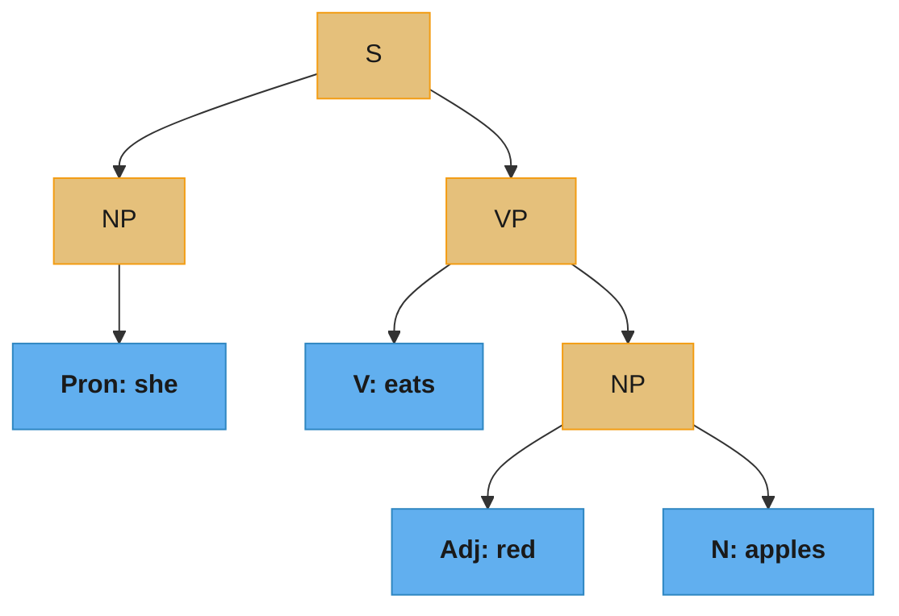
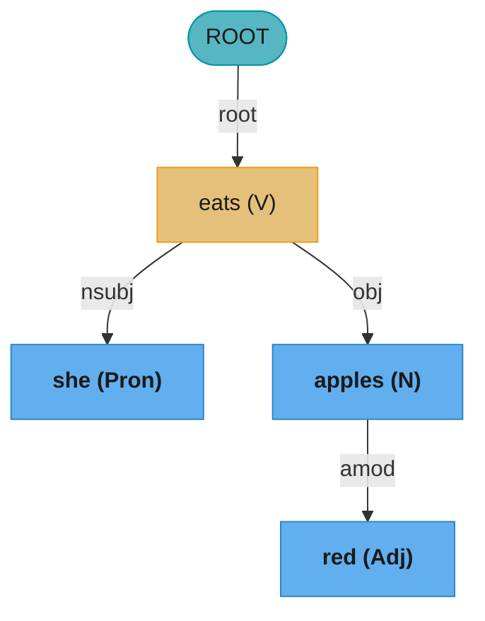
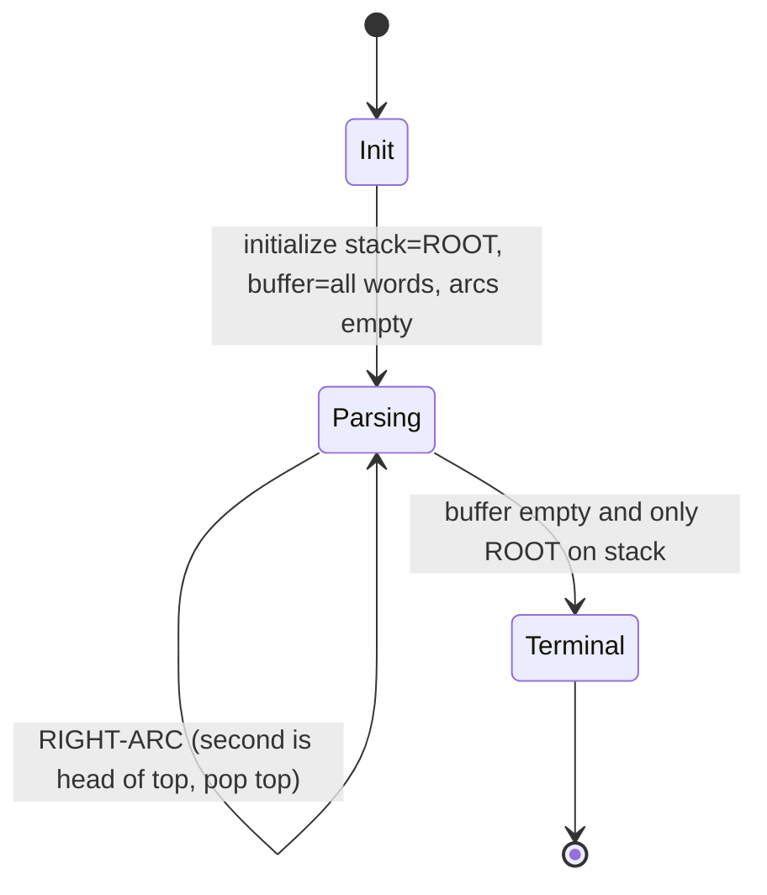
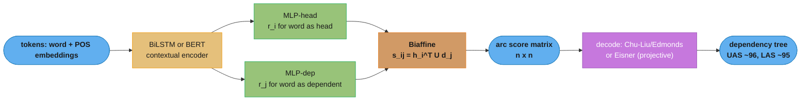
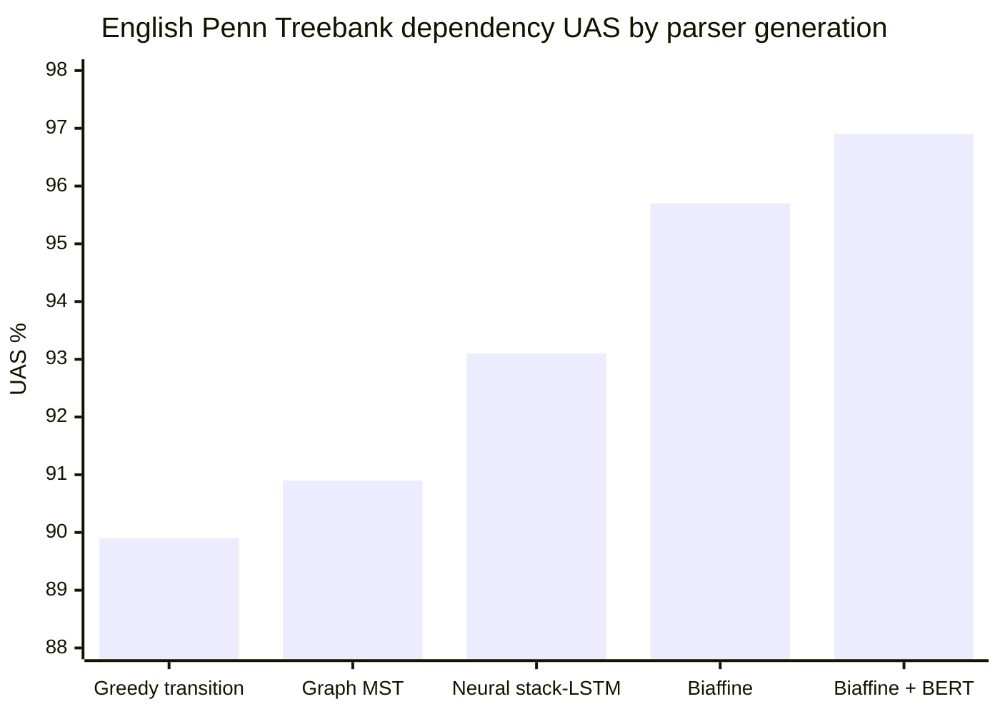
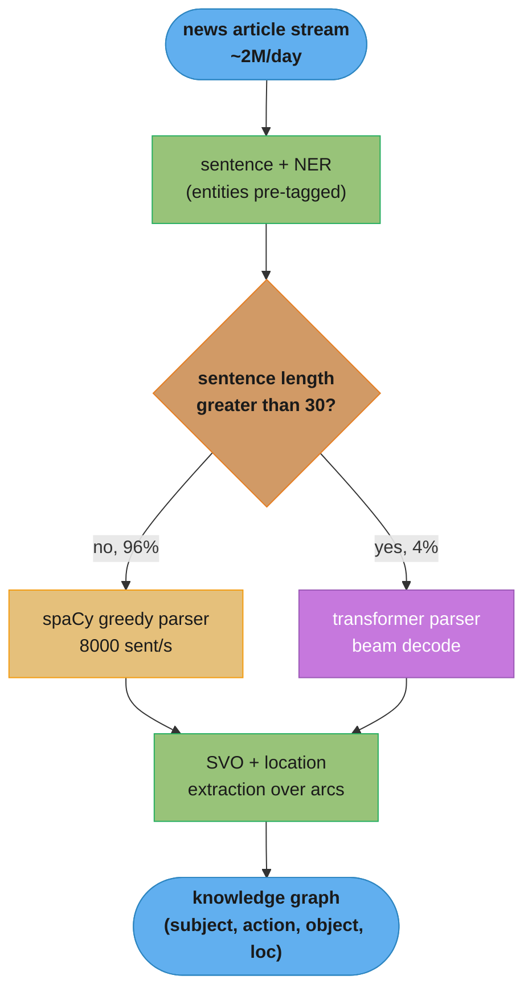

# Syntactic Parsing

> This file is a deep-dive sub-file of the [Natural Language Processing](README.md) module.
> It covers recovering grammatical structure from text: constituency parsing (CFGs, PCFGs, CKY),
> dependency parsing (heads, relations, projectivity), transition- and graph-based algorithms,
> neural biaffine parsers, Universal Dependencies, and evaluation (UAS/LAS, bracketing F1).
> Part-of-speech tagging — the sequence-labeling task parsing sits on top of — is covered in
> [sequence_labeling_and_crf.md](sequence_labeling_and_crf.md) (HMM/CRF/BiLSTM taggers, Viterbi, BIO).

---

## 1. Concept Overview

Syntactic parsing recovers the grammatical structure of a sentence — which words group into phrases, and which word governs which. It answers "who did what to whom" at the structural level, one layer above tokenization and part-of-speech (POS) tagging.

Two dominant formalisms exist. **Constituency parsing** (a.k.a. phrase-structure parsing) organizes words into nested phrases (noun phrase, verb phrase) drawn from a context-free grammar; the output is a tree whose interior nodes are phrase categories. **Dependency parsing** connects each word directly to its syntactic *head* with a labeled, directed arc (subject, object, modifier); the output is a tree over the words themselves — no phrase nodes.

Parsing was the flagship NLP task of the 1990s–2010s. Classical constituency parsers (Collins, Charniak) reached ~90 F1 on the Penn Treebank; modern neural biaffine dependency parsers reach ~96–97% UAS (unlabeled attachment) and ~94–95% LAS (labeled attachment) on English. Even in the LLM era it remains load-bearing for relation extraction, grammar checking, coreference features, and any pipeline needing an explicit, inspectable structure rather than an opaque embedding.

---

## 2. Intuition

One-line analogy: constituency parsing is the grade-school exercise of drawing brackets around phrases ("[the tall man] [saw [a dog]]"); dependency parsing is drawing an arrow from every word to the single word it depends on.

Mental model: think of a sentence as a mobile hanging from the ceiling. In the **constituency** view, words hang inside nested boxes (phrases) that hang inside bigger boxes. In the **dependency** view, there are no boxes — one word (usually the main verb) is nailed to the ceiling as ROOT, and every other word dangles directly from exactly one word above it.

Why it matters: structure disambiguates meaning. "I saw the man with the telescope" has two parses — the telescope attaches to "saw" (I used it) or to "man" (he held it). The parse tree makes the ambiguity explicit and lets downstream code pick a reading.

Key insight: dependency structure maps almost directly onto predicate-argument structure — the head of a clause is its verb, its `nsubj` is the agent, its `obj` is the patient. That is why relation-extraction and information-extraction pipelines overwhelmingly consume *dependency* parses rather than constituency trees: subject-verb-object triples fall out of three arc labels.

---

## 3. Core Principles

1. **Grammar defines legal structure.** A context-free grammar (CFG) is a set of rewrite rules (`S -> NP VP`). A parse is a derivation of the sentence from the start symbol `S`. Ambiguity means multiple derivations exist for one sentence.

2. **Probabilities break ties.** A probabilistic CFG (PCFG) attaches a probability to each rule so the parser can rank competing parses and return the single most likely tree, not just any legal one.

3. **Dynamic programming makes parsing tractable.** The number of parse trees grows exponentially (Catalan numbers), but shared sub-parses can be computed once and reused. CKY fills a chart bottom-up in O(n³·|G|); Eisner's algorithm does the projective-dependency analogue.

4. **Heads carry the syntax.** In dependency grammar, every phrase has a single head word; the head's relations to its dependents encode the grammatical function. This makes dependency trees compact (n words → n arcs) and directly usable by extraction code.

5. **Trees, not graphs, are the output constraint.** A valid dependency parse is a tree rooted at an artificial ROOT: every token has exactly one head, there are no cycles, and (for most formalisms) the tree is connected. Decoders must *enforce* this — a naive per-token argmax can produce cycles or multiple roots.

6. **Projectivity is a structural restriction, not a linguistic universal.** A tree is projective if no arcs cross when words stay in linear order. English is ~99% projective; free-word-order languages (Czech, German) are not, forcing non-projective algorithms.

**What it means.** Principle 2 in one sentence: "every parse tree has a probability — multiply the probability of every rule the derivation used — and the parser returns whichever tree multiplies out highest."

The grammar does not resolve the telescope ambiguity from Section 2; both readings are legal derivations. Arithmetic resolves it.

| Symbol | What it is |
|--------|------------|
| `P(A -> B C)` | Probability of rewriting `A` as `B C`; all rules sharing a left-hand side sum to 1 |
| `P(tree)` | Product of every rule probability used in the derivation, lexical rules included |
| `VP -> VP PP` | Attach the PP to the verb — "I used the telescope to see him" |
| `NP -> NP PP` | Attach the PP to the noun — "the man who had the telescope" |
| `argmax P(tree)` | What Viterbi CKY returns: the single highest-scoring derivation |

**Walk one example.** Two legal parses of "I saw the man with the telescope" over one toy grammar. Both use the identical seven lexical rules (their product is `0.24`), so only the structural rules differ:

```
  rule                          verb-attach     noun-attach
  S  -> NP VP                      1.0             1.0
  NP -> Pron        (I)            0.1             0.1
  VP -> VP PP                      0.4              -
  VP -> V NP                       0.6             0.6
  NP -> NP PP                       -              0.2
  NP -> Det N       (the man)      0.7             0.7
  PP -> P NP                       1.0             1.0
  NP -> Det N       (telescope)    0.7             0.7
  --------------------------------------------------------
  structural product             0.011760        0.005880
  x lexical product 0.24         0.0028224       0.0014112
  --------------------------------------------------------
  ratio                          2.0x  <- verb attachment wins
```

Every difference traces to two numbers: `VP -> VP PP` at `0.4` versus `NP -> NP PP` at `0.2`. Swap them in the treebank counts and the parser changes its mind about who held the telescope.

**Why vanilla PCFGs are weak.** Notice that neither deciding rule mentions "telescope" or "saw" — the choice is made entirely by category-level statistics, word-blind. That is the known failure of unlexicalized PCFGs, and the reason lexicalized parsers (Collins, Charniak) condition each rule probability on the head word, buying back several F1 points.

---

## 4. Types / Architectures / Strategies

### 4.1 Constituency vs Dependency

| Aspect | Constituency (phrase structure) | Dependency |
|--------|--------------------------------|------------|
| Nodes | Phrases (NP, VP, PP) + words at leaves | Words only |
| Edges | Parent-child in phrase hierarchy | Head → dependent, labeled (nsubj, obj) |
| Output size | ~2n nodes for n words | Exactly n arcs |
| Grammar | CFG / PCFG | Head rules or learned scores |
| Best for | Linguistic analysis, translation grammars | Relation extraction, cross-lingual NLP |
| Canonical algorithm | CKY / chart parsing | Transition- or graph-based |
| Evaluation | Labeled bracketing F1 (PARSEVAL) | UAS / LAS |

### 4.2 Dependency-Parsing Algorithm Families

| Family | Search | Complexity (greedy) | Projective only? | Representative |
|--------|--------|---------------------|------------------|----------------|
| **Transition-based** | Left-to-right, incremental actions | O(n) | Arc-standard/eager: yes (swap: no) | MaltParser, spaCy, Chen & Manning 2014 |
| **Graph-based** | Global max-spanning-tree over all arcs | Eisner O(n³) / CLE O(n²) | Eisner: yes, CLE: no | MSTParser (McDonald 2005), biaffine (Dozat 2017) |
| **Grammar-based** | Chart parse of a lexicalized CFG | O(n⁵) lexicalized | — | Collins, Charniak (constituency → convert) |

### 4.3 Transition Systems

| System | Transitions | Trees | Note |
|--------|-------------|-------|------|
| **Arc-standard** | SHIFT, LEFT-ARC, RIGHT-ARC | Projective | A head takes its right dependents only after all its own descendants are built; exactly 2n transitions |
| **Arc-eager** | SHIFT, LEFT-ARC, RIGHT-ARC, REDUCE | Projective | Attaches right dependents eagerly; shorter derivations for right-branching structures |
| **Arc-standard + SWAP** | + SWAP | Non-projective | Reorders the stack to license crossing arcs (Nivre 2009) |

### 4.4 Neural Parsers

| Approach | Encoder | Scoring | Decoder |
|----------|---------|---------|---------|
| Chen & Manning 2014 | Feed-forward over embeddings | Softmax over transitions | Greedy transition |
| Stack-LSTM (Dyer 2015) | LSTMs over stack/buffer/actions | Softmax over transitions | Greedy/beam transition |
| **Biaffine (Dozat & Manning 2017)** | BiLSTM (or BERT) | Biaffine attention → n×n arc scores | MST (CLE) or Eisner |
| Self-attentive constituency (Kitaev & Klein 2018) | Transformer | Span scores | CKY over spans, ~95.1 F1 |

---

## 5. Architecture Diagrams

### Constituency parse (phrase-structure tree)



Constituency groups words into nested phrases from CFG rules (`S -> NP VP`, `VP -> V NP`, `NP -> Adj N`). Interior nodes are categories; the words sit at the leaves.

### Dependency parse (same sentence)



Dependency parsing has no phrase nodes: the main verb `eats` is ROOT, and every other word attaches to exactly one head with a labeled relation. Note `red` attaches to `apples`, not to the verb — that is the parse deciding the modifier scope.

### Transition-based arc-standard state machine



The parser walks the sentence once, choosing SHIFT / LEFT-ARC / RIGHT-ARC at each configuration; a classifier scores the actions. For n words it takes exactly 2n transitions and O(n) time — the reason spaCy can parse thousands of sentences per second.

### Neural biaffine dependency parser



A biaffine parser scores every ordered word pair `(i, j)` for "is i the head of j", producing an n×n matrix, then a non-differentiable MST decoder extracts a single-root tree. Decoupling scoring (learned) from decoding (combinatorial) is why these parsers dominate leaderboards. Biaffine attention is a specialized bilinear *scoring* form — distinct from the encoder-decoder attention that produces the contextual states, covered in [attention_and_seq2seq.md](attention_and_seq2seq.md).

**In plain terms.** `s_ij = h_i^T U d_j` says: "project every word twice — once as a possible boss, once as a possible subordinate — then let a learned matrix `U` report how compatible any boss-vector is with any subordinate-vector."

| Symbol | What it is |
|--------|------------|
| `h_i` | Word `i` after the head MLP: what it looks like when it is the governor |
| `d_j` | Word `j` after the dependent MLP: what it looks like when it is attached |
| `U` | Learned compatibility matrix — the only place head and dependent meet |
| `s_ij` | Raw score that `i` heads `j`. Not a probability; unbounded, sign-free |
| n x n matrix | Every `s_ij` at once — one matmul scores all candidate arcs |

**Walk one example.** Two-dimensional vectors, dependent `j = "she"`, three candidate heads:

```
  U = [ 2.0  0.5 ]          d_she = (0.7, 0.2)
      [ 0.5  1.5 ]

  U d_she = (2.0*0.7 + 0.5*0.2,  0.5*0.7 + 1.5*0.2) = (1.50, 0.65)

  candidate head   h_i           s_ij = h_i . (1.50, 0.65)      softmax
  ROOT             (1.0, 0.0)    1.0*1.50 + 0.0*0.65 = 1.500     0.391
  eats             (0.8, 0.6)    0.8*1.50 + 0.6*0.65 = 1.590     0.428  <- argmax
  apples           (0.1, 0.9)    0.1*1.50 + 0.9*0.65 = 0.735     0.182
```

`eats` wins, correctly — but by `0.428` to `0.391`, a margin of under four points. That thinness is the practical argument for Pitfall 2 below: with scores this close, an independent per-token `argmax` across all `n` columns will eventually pick a set of heads that forms a cycle or a second root. The MST decoder exists to reconcile columns that the scorer never compared.

**Why two separate MLPs and not one shared vector.** Headedness is asymmetric: "eats heads she" must be able to score high while "she heads eats" scores low. A single shared vector per word with a symmetric similarity gives `s_ij = s_ji` and cannot express direction at all. Splitting into `h` and `d` and inserting a non-symmetric `U` is what makes the score directional.

### CKY chart (constituency, dynamic programming)

The CKY table `chart[i][j]` holds every category spanning words `i..j`; it is filled bottom-up by combining shorter spans. Alignment carries the meaning here, so it stays ASCII:

```
                j=1 (she)   j=2 (eats)   j=3 (red)    j=4 (apples)
   i=1 (she)     NP           .            .            S          <- full sentence
   i=2 (eats)                 V            .            VP
   i=3 (red)                               Adj          NP
   i=4 (apples)                                         N, NP

   width 1 : lexical rules fill the diagonal (she->NP, eats->V, ...)
   width 2 : chart[3][4]=NP  via  NP -> Adj N
   width 3 : chart[2][4]=VP  via  VP -> V NP   (split at k=2)
   width 4 : chart[1][4]=S   via  S  -> NP VP  (split at k=1)  = accepted
```

Each cell is computed once and reused, turning an exponential search into O(n³·|G|). The upper-right cell containing the start symbol `S` means the sentence is grammatical.

**Read it like this.** `chart[i][j]` answers exactly one question — "which categories can cover words `i` through `j`?" — and a longer span is only ever built by gluing two shorter spans whose answers are already in the table.

| Symbol | What it is |
|--------|------------|
| `chart[i][j]` | The categories spanning words `i..j`, each stored with its best score |
| `width` | `j - i + 1`, how many words the span covers; cells fill in increasing width |
| `k` | Split point, `i <= k < j` — where the left child ends and the right child begins |
| `chart[1][n]` holds `S` | The whole sentence derives from the start symbol: accept |

**Walk one example.** Which cells exist for this 4-word sentence, and the order they fill:

```
  width 1 : [1,1] [2,2] [3,3] [4,4]        4 cells   lexical rules only
  width 2 : [1,2] [2,3] [3,4]              3 cells   1 split point each
  width 3 : [1,3] [2,4]                    2 cells   2 split points each
  width 4 : [1,4]                          1 cell    3 split points
  ----------------------------------------------------------------------
  total                                   10 cells = n(n+1)/2 = 4*5/2 = 10
```

Only the upper triangle exists: `[3,1]` is meaningless because a span cannot end before it starts. Every cell is written once and read many times — that reuse, not a smarter search, is the entire trick.

---

## 6. How It Works — Detailed Mechanics

### CKY parsing over a PCFG (numpy / pure Python)

CKY (Cocke–Kasami–Younger) requires the grammar in **Chomsky Normal Form** (CNF): every rule is binary (`A -> B C`) or lexical (`A -> word`). It fills a triangular chart of spans and returns the max-probability parse.

```python
from typing import Optional
import math

# CNF rules with log-probabilities (log avoids float underflow on long sentences).
BinaryRule = tuple[str, str, str, float]   # (A, B, C, log P(A -> B C))
LexRule = tuple[str, str, float]           # (A, word, log P(A -> word))
BackPtr = tuple  # ("lex", word) | ("bin", B, C, split_k)


def cky_parse(
    words: list[str],
    binary: list[BinaryRule],
    lexical: list[LexRule],
    start: str = "S",
) -> Optional[tuple[float, dict]]:
    """
    Viterbi CKY: return (log-prob, chart) of the most probable parse, or None if
    the sentence is not in the language.

    Complexity: O(n^3 * |binary|). The three nested loops over (width, start, split)
    give n^3; each visits every binary rule. This is why grammar size |G| matters as
    much as sentence length for real treebank grammars with tens of thousands of rules.
    """
    n = len(words)
    # chart[i][j][A] = (best_logprob, backpointer) for span covering words i..j-1
    chart: list[list[dict[str, tuple[float, BackPtr]]]] = [
        [dict() for _ in range(n + 1)] for _ in range(n + 1)
    ]

    # Width-1 spans: apply lexical rules to each token.
    for i, w in enumerate(words):
        for (A, word, lp) in lexical:
            if word == w:
                cur = chart[i][i + 1].get(A)
                if cur is None or lp > cur[0]:
                    chart[i][i + 1][A] = (lp, ("lex", w))

    # Wider spans, bottom-up.
    for width in range(2, n + 1):
        for i in range(0, n - width + 1):
            j = i + width
            for k in range(i + 1, j):                 # split point i < k < j
                left, right = chart[i][k], chart[k][j]
                for (A, B, C, lp) in binary:
                    if B in left and C in right:
                        score = lp + left[B][0] + right[C][0]
                        cur = chart[i][j].get(A)
                        if cur is None or score > cur[0]:
                            chart[i][j][A] = (score, ("bin", B, C, k))

    top = chart[0][n].get(start)
    return (top[0], chart) if top else None


# Tiny grammar for "she eats red apples"
binary = [
    ("S", "NP", "VP", math.log(1.0)),
    ("VP", "V", "NP", math.log(1.0)),
    ("NP", "Adj", "N", math.log(0.4)),
]
lexical = [
    ("NP", "she", math.log(1.0)), ("V", "eats", math.log(1.0)),
    ("Adj", "red", math.log(1.0)), ("N", "apples", math.log(1.0)),
    ("NP", "apples", math.log(0.2)),
]
result = cky_parse(["she", "eats", "red", "apples"], binary, lexical)
# result[0] is the log-prob of the single valid S-rooted parse.
```

**What this actually says.** The scoring line `score = lp + left[B][0] + right[C][0]` is nothing more than "probability of this rule, times the best probability of the left half, times the best probability of the right half" — written as a sum because logs turn products into additions.

| Symbol | What it is |
|--------|------------|
| `lp` | `log P(rule)`. `log 1.0 = 0.0`; `log 0.4 = -0.9163`; `log 0.2 = -1.6094` |
| `left[B][0]` | Best log-prob already found for category `B` over the left sub-span |
| `chart[i][j][A]` | `(best log-prob, backpointer)` for category `A` over this span |
| `("bin", B, C, k)` | Backpointer: rebuild the tree by recursing left of `k`, then right of `k` |
| `chart[0][n][start]` | Root cell. Present means the sentence parsed; absent means ungrammatical |

**Walk one example.** The grammar defined above run on "she eats red apples", probability column first, log column second:

```
  span              category  built from                  P        log P
  [she]             NP        lexical rule               1.0       0.0000
  [eats]            V         lexical rule               1.0       0.0000
  [red]             Adj       lexical rule               1.0       0.0000
  [apples]          N         lexical rule               1.0       0.0000
  [apples]          NP        lexical rule (unused)      0.2      -1.6094
  [red apples]      NP        NP -> Adj N  0.4*1.0*1.0   0.4      -0.9163
  [eats..apples]    VP        VP -> V  NP  1.0*1.0*0.4   0.4      -0.9163
  [she..apples]     S         S  -> NP VP  1.0*1.0*0.4   0.4      -0.9163
  -----------------------------------------------------------------------
  P(tree) = 0.4                  log P(tree) = -0.9163    exp(-0.9163) = 0.4
```

Exactly one rule in the derivation is below `1.0`, so the tree probability collapses to that one number. Cell `[apples]` also holds `NP` at `0.2`, but nothing above it can consume a bare `NP` in that position — the chart stores it anyway, because a different sentence would need it.

**Why logs instead of raw probabilities.** A 40-token sentence uses about `2n - 1 = 79` rules. At a realistic average treebank rule probability of `1e-4`, the raw product is `1e-316` — below float64's smallest normal value `2.2e-308`, so it lands in the subnormal range where precision degrades and long parses start tying at zero. In log space the same derivation is a sum near `-728`, comfortably inside range. Drop the logs and CKY silently stops being able to rank long sentences.

**Put simply.** `O(n^3 * |G|)` says: "visit every span, cut it every possible way, and try every grammar rule at each cut."

| Symbol | What it is |
|--------|------------|
| `n` | Sentence length in tokens |
| `n^3` | The three nested loops — span width, span start, split point |
| `\|G\|` | Binary rules in the grammar; tens of thousands for a real treebank PCFG |
| `n(n^2-1)/6` | Exact count of `(i, k, j)` visits — `n^3/6` asymptotically |

**Walk one example.** A 15,000-rule treebank grammar at three sentence lengths:

```
  n =  4    (i,k,j) visits =      10   x 15,000 =         150,000 rule tries
  n = 20    (i,k,j) visits =   1,330   x 15,000 =      19,950,000 rule tries
  n = 40    (i,k,j) visits =  10,660   x 15,000 =     159,900,000 rule tries

  doubling 20 -> 40 tokens multiplies the work by 8.0x  (10,660 / 1,330)
```

Grammar size is the term people forget. Going from a 1,500-rule toy grammar to a 15,000-rule treebank grammar costs the same 10x as quadrupling the sentence length — which is why practical parsers prune the rule set per cell (coarse-to-fine filtering) rather than looping over all of `|G|`.

**Why the chart is worth building at all.** The number of distinct binary trees over `n` words is the Catalan number: `14` for n=4, `16,796` for n=10, and `6,564,120,420` for n=20. Enumerating parses for a 20-token sentence means scoring 6.56 billion trees; CKY answers the identical question in 1,330 cell-visits times the grammar, because every shared sub-span is scored once and reused by every tree that contains it.

### Arc-standard transition system with a static oracle (pure Python)

Given a gold projective tree, the **static oracle** deterministically reconstructs the transition sequence a classifier should learn to imitate. Convention: `s1` = top of stack, `s2` = the element below it.

```python
def static_oracle(
    gold_heads: list[int],   # gold_heads[i] = index of token i's head; 0 = ROOT; index 0 unused
    gold_rels: list[str],    # gold_rels[i]  = relation label of token i to its head
    n: int,                  # number of real tokens (1..n); token 0 is ROOT
) -> tuple[list[tuple[str, Optional[str]]], list[tuple[int, int, str]]]:
    """
    Derive the gold arc-standard transition sequence for a projective tree.

    Returns (transitions, arcs). Each transition is (name, relation).
    Exactly 2n transitions are produced: n SHIFTs and n arc actions.
    """
    stack: list[int] = [0]                 # ROOT
    buf: list[int] = list(range(1, n + 1))
    arcs: list[tuple[int, int, str]] = []
    transitions: list[tuple[str, Optional[str]]] = []

    # remaining[h] = how many gold dependents of head h are still unattached.
    remaining = [0] * (n + 1)
    for i in range(1, n + 1):
        remaining[gold_heads[i]] += 1

    while buf or len(stack) > 1:
        if len(stack) >= 2:
            s1, s2 = stack[-1], stack[-2]           # top, second-from-top
            # LEFT-ARC: s1 is head of s2 -> attach and pop s2 (s2 must not be ROOT).
            if s2 != 0 and gold_heads[s2] == s1:
                transitions.append(("LEFT-ARC", gold_rels[s2]))
                arcs.append((s1, s2, gold_rels[s2]))
                remaining[s1] -= 1
                stack.pop(-2)
                continue
            # RIGHT-ARC: s2 is head of s1, but only once all of s1's own
            # dependents are attached (else we would strand them).
            if gold_heads[s1] == s2 and remaining[s1] == 0:
                transitions.append(("RIGHT-ARC", gold_rels[s1]))
                arcs.append((s2, s1, gold_rels[s1]))
                remaining[s2] -= 1
                stack.pop()
                continue
        # Otherwise SHIFT the next buffer token.
        transitions.append(("SHIFT", None))
        stack.append(buf.pop(0))

    return transitions, arcs


# "she eats red apples": eats=ROOT, she=nsubj of eats, apples=obj of eats, red=amod of apples
gold_heads = [-1, 2, 0, 4, 2]                 # index 0 unused
gold_rels = ["", "nsubj", "root", "amod", "obj"]
seq, arcs = static_oracle(gold_heads, gold_rels, n=4)
# seq = SHIFT, SHIFT, LEFT-ARC(nsubj), SHIFT, SHIFT, LEFT-ARC(amod),
#       RIGHT-ARC(obj), RIGHT-ARC(root)   -> 8 = 2n transitions
```

**The idea behind it.** The `2n` bound says: "every token is pushed onto the stack exactly once and popped exactly once, so the derivation length is fixed before the parser makes a single decision."

| Symbol | What it is |
|--------|------------|
| `s1`, `s2` | Stack top and the element beneath it — the only two the oracle inspects |
| SHIFT | Move the front buffer token onto the stack; fires exactly `n` times |
| LEFT-ARC | `s1` is the head of `s2`; record the arc and pop `s2` |
| RIGHT-ARC | `s2` is the head of `s1`; record the arc and pop `s1` |
| `remaining[h]` | Gold dependents of `h` not yet attached; guards against a premature pop |
| `2n` | `n` SHIFTs plus `n` arc actions — one arc per token, since each has one head |

**Walk one example.** The complete derivation for "she eats red apples" (`n = 4`, so 8 steps):

```
  step  stack                     buffer                 action
   1    ROOT                      she eats red apples    SHIFT
   2    ROOT she                  eats red apples        SHIFT
   3    ROOT she eats             red apples             LEFT-ARC(nsubj)
   4    ROOT eats                 red apples             SHIFT
   5    ROOT eats red             apples                 SHIFT
   6    ROOT eats red apples      -                      LEFT-ARC(amod)
   7    ROOT eats apples          -                      RIGHT-ARC(obj)
   8    ROOT eats                 -                      RIGHT-ARC(root)
  --------------------------------------------------------------------
  4 SHIFTs + 4 arc actions = 8 = 2n

  arcs produced:  eats -> she (nsubj)     apples -> red  (amod)
                  eats -> apples (obj)    ROOT   -> eats (root)
```

Cost is `O(n)` because the step count is `2n` and each step looks at a constant number of stack and buffer slots. Nothing in the loop scales with sentence length — that is the whole reason spaCy parses thousands of sentences per second on a CPU, against `O(n^2)`-`O(n^3)` for graph-based decoding.

**Why `remaining` exists.** Look at step 4: the stack is `ROOT eats`, and ROOT is genuinely the gold head of `eats`, so RIGHT-ARC(root) appears legal and would finish the parse in four steps. But `eats` still owes an arc to `apples`, which is sitting untouched in the buffer. `remaining[eats] = 1` blocks the action and the parser SHIFTs instead; only at step 8, after `obj` is attached and the counter reaches `0`, does RIGHT-ARC(root) fire. Delete this guard and the oracle emits derivations that strand dependents — arcs that no projective tree can contain.

At training time a classifier learns `configuration -> action`; at inference time it applies the predicted actions. Features (classical): top-3 stack words, next-3 buffer words, their POS tags, and already-built arc labels. Neural parsers replace hand-built features with the BiLSTM/BERT states of `s1`, `s2`, `b1`.

### Running a production dependency parser (spaCy)

```python
import spacy
from spacy.tokens import Doc

nlp = spacy.load("en_core_web_sm")   # transition-based (arc-eager) neural parser


def dependency_triples(text: str) -> list[tuple[str, str, str]]:
    """Return (head, relation, dependent) for every token. ROOT points to itself."""
    doc: Doc = nlp(text)
    return [(tok.head.text, tok.dep_, tok.text) for tok in doc]


def demo() -> None:
    text = "The startup acquired a rival firm in Berlin."
    for head, rel, dep in dependency_triples(text):
        print(f"  {dep:<9} --{rel}--> {head}")
    # acquired --ROOT--> acquired
    # startup  --nsubj--> acquired
    # firm     --dobj--> acquired
    # Berlin   --pobj--> in   (prepositional object)
```

The `dep_`, `head`, and `children` attributes expose the full tree; `doc.noun_chunks` yields flat NPs derived from it. These are exactly the hooks the §14 information-extraction pipeline consumes.

---

## 7. Real-World Examples

**spaCy in production NLP pipelines.** spaCy's dependency parser is a neural arc-eager transition parser; `en_core_web_sm` reaches ~92% UAS and parses on CPU at thousands of sentences/second. It underpins entity linking, noun-chunk extraction, and rule-based matchers at companies from Explosion's clients to internal enterprise NLP stacks — chosen because O(n) transition parsing is fast enough to run inline in request paths.

**Google's SyntaxNet / Parsey McParseface (2016).** A globally normalized transition-based parser with beam search, released open-source. It reached ~94% UAS on English news text and was, at release, "the most accurate parser in the world." It demonstrated that beam search plus global normalization closes most of the gap between transition and graph-based parsers.

**Stanford CoreNLP and the Universal Dependencies project.** The UD treebanks (200+ treebanks, 100+ languages) standardized dependency annotation so one parser architecture and one relation inventory transfer across languages. Cross-lingual parsers trained on UD power multilingual grammar tools and low-resource-language NLP where no LLM has enough pretraining data.

**Grammar and writing assistants.** Grammarly-style tools use dependency structure to catch subject-verb agreement errors ("the list of items *are*"), dangling modifiers, and misplaced clauses — errors defined structurally, not lexically. A parser flags that the verb's `nsubj` is singular even though a nearer noun is plural.

**Biomedical relation extraction.** Systems extracting protein-protein or drug-drug interactions from PubMed abstracts parse each sentence and read relations off the dependency path between two entities. The shortest dependency path between "aspirin" and "bleeding" ("aspirin -nsubj- increases -dobj- risk -nmod- bleeding") is a far stronger signal than surface word order.

---

## 8. Tradeoffs

### Parser accuracy across generations



Each generation added roughly 1–2 UAS points; the biggest single jump came from biaffine attention (learned n×n arc scoring) and again from swapping the BiLSTM encoder for a pretrained contextual one.

### Transition-based vs graph-based

| Dimension | Transition-based | Graph-based |
|-----------|------------------|-------------|
| Search | Greedy/beam, incremental | Global optimum over all arcs |
| Speed | O(n) greedy — fastest | O(n²)–O(n³) decode |
| Error propagation | Yes (early mistake derails rest) | No (joint decode) |
| Non-projectivity | Needs SWAP / pseudo-projective | Native (Chu-Liu/Edmonds) |
| Typical UAS | Slightly lower greedy; matches with beam | Slightly higher out of the box |
| Rich structural features | Easy (partial tree is visible) | Harder (edge-factored) |

### Constituency vs dependency for downstream use

| Need | Prefer |
|------|--------|
| Subject/object/modifier triples | Dependency (arcs are relations) |
| Phrase boundaries for chunking/MT | Constituency |
| Cross-lingual, low-resource | Dependency + Universal Dependencies |
| Compact, fast, inspectable | Dependency |
| Linguistic theory / treebank fidelity | Constituency |

### Eisner vs Chu-Liu/Edmonds decoding

| | Eisner | Chu-Liu/Edmonds (CLE) |
|--|--------|------------------------|
| Trees produced | Projective only | Any spanning arborescence (non-projective ok) |
| Complexity | O(n³) DP | O(n²) dense (Tarjan) |
| Guarantee | Optimal projective tree | Optimal spanning tree, single root enforced |
| Use when | Language is ~projective (English) | Non-projective languages (Czech, German) |

**What the formula is telling you.** The `O(n^3)` versus `O(n^2)` line means: "Eisner pays a chart over spans and split points to guarantee no arcs cross; CLE only has to look at each candidate arc, and there are `n^2` of those."

| Symbol | What it is |
|--------|------------|
| `n` | Tokens in the sentence, plus one artificial ROOT as a candidate head |
| `O(n^3)` | Eisner — a chart over spans times split points, the same shape as CKY's triple loop |
| `O(n^2)` | CLE on a dense graph. The score matrix already has `n^2` entries, so this is optimal |
| arborescence | A directed spanning tree with every arc pointing away from one root |

**Walk one example.** Decoder work at two sentence lengths, in abstract units:

```
  n = 20 tokens
    arcs to score (biaffine)   (n+1) x n =     420    one matmul
    CLE decode                 n^2       =     400    units
    Eisner decode              n^3       =   8,000    units    20x more

  n = 50 tokens
    arcs to score              (n+1) x n =   2,550    one matmul
    CLE decode                 n^2       =   2,500    units
    Eisner decode              n^3       = 125,000    units    50x more
```

The Eisner/CLE ratio is exactly `n` — it grows with the sentence, so the gap is 20x at 20 tokens and 50x at 50. In absolute terms both are microseconds beside the BiLSTM or BERT forward pass that produced the scores, so the choice is almost never about speed. You pick Eisner because you *want* the projectivity constraint enforced on a projective language, and CLE because you need crossing arcs to be expressible at all.

---

## 9. When to Use / When NOT to Use

### Use dependency parsing when:

- You need explicit subject-verb-object or modifier relations for rule-based extraction.
- You are building a multilingual pipeline (Universal Dependencies gives one schema across 100+ languages).
- Latency matters — a transition parser adds ~1–5 ms/sentence on CPU.
- You want an inspectable, debuggable structure rather than an opaque embedding.

### Use constituency parsing when:

- You need phrase boundaries (NP/VP chunks) for translation grammars or phrase-based retrieval.
- Your linguistic analysis is defined over nested phrases (some coreference and discourse features).
- You are working with a treebank grammar where bracketing is the annotation.

### Use a graph-based (biaffine) parser when:

- You want maximum accuracy and can afford O(n²) decoding.
- The language is non-projective (crossing arcs are common).

### Do NOT reach for a parser when:

- An LLM already gives you the end task (summarization, QA) — parsing is a means, not the goal; don't add a parser you won't read.
- The text is very noisy (tweets, ASR output) — parsers trained on newswire degrade sharply; UAS can fall 10–20 points out of domain.
- You only need entities or classification — NER (see [sequence_labeling_and_crf.md](sequence_labeling_and_crf.md)) or a classifier is cheaper and more robust.

---

## 10. Common Pitfalls

### Pitfall 1: Greedy transition parsing propagates a single early error (BROKEN → FIX)

A greedy parser commits to `argmax` at every configuration. One wrong SHIFT near the start starves every later attachment of the head it needed, and the error cascades — the parser cannot recover because the state that would have allowed the correct arc is gone.

```python
# BROKEN: greedy decoding — one irrevocable mistake derails the rest of the parse.
def greedy_parse(sentence: list[str], classifier) -> list[tuple[int, int, str]]:
    config = init_config(sentence)            # stack=[ROOT], buffer=sentence
    while not config.is_terminal():
        scores = classifier.score_actions(config)
        action = max(scores, key=scores.get)  # commit to top-1, no lookahead
        config = config.apply(action)         # cannot be undone
    return config.arcs
# Symptom: a mis-scored SHIFT at token 2 leaves the true head buried in the buffer;
# every downstream LEFT-ARC now attaches to the wrong word. UAS drops several points
# on long sentences, concentrated after the first error.
```

```python
# FIX 1: beam search — keep the top-k partial hypotheses so a locally suboptimal
# action can still win globally.
import heapq

def beam_parse(sentence: list[str], classifier, beam_size: int = 32
              ) -> list[tuple[int, int, str]]:
    beams = [(0.0, init_config(sentence))]                 # (cumulative log-score, config)
    while any(not cfg.is_terminal() for _, cfg in beams):
        candidates: list[tuple[float, object]] = []
        for score, cfg in beams:
            if cfg.is_terminal():
                candidates.append((score, cfg))
                continue
            for action, a_score in classifier.score_actions(cfg).items():
                candidates.append((score + a_score, cfg.apply(action)))
        beams = heapq.nlargest(beam_size, candidates, key=lambda x: x[0])
    return max(beams, key=lambda x: x[0])[1].arcs
```

```python
# FIX 2 (training-time, complementary): a DYNAMIC ORACLE. A static oracle only knows
# the gold path, so at test time the parser never trained on error states it now visits.
# A dynamic oracle returns, from ANY configuration (even a wrong one), the set of actions
# still consistent with the best REACHABLE tree, letting training explore its own mistakes
# (Goldberg & Nivre 2012). Net effect: the parser learns to recover, +0.5 to 1.0 LAS.
def dynamic_oracle_cost(action, config, gold_arcs) -> int:
    """Return the number of gold arcs made UNREACHABLE by taking `action` here.
    Cost 0 => action is oracle-optimal from this (possibly erroneous) state."""
    ...
# Train by sampling among cost-0 actions (and occasionally the model's own prediction),
# instead of always forcing the single static-gold action.
```

Beam search plus a dynamic oracle is exactly the combination Google's SyntaxNet used to reach ~94% UAS. In practice: turn on a beam of 16–64 and, if you train your own parser, use a dynamic oracle rather than a static one.

### Pitfall 2: Naive head-selection decoding yields a non-tree

Taking `head[j] = argmax_i s(i, j)` independently per token can create cycles ("A's head is B, B's head is A") or multiple roots. Always run a spanning-tree decoder (Chu-Liu/Edmonds) or Eisner, which enforce a single-root, cycle-free tree. Skipping this is the most common bug when hand-rolling a biaffine parser.

### Pitfall 3: Forgetting CNF before CKY

```python
# BROKEN: CKY over a grammar with a ternary rule silently never fires it.
#   VP -> V NP PP      # 3 children -> CKY only combines TWO spans, so this rule is ignored
# FIX: binarize into CNF first, introducing an intermediate symbol.
#   VP  -> V  @VP_NP_PP
#   @VP_NP_PP -> NP PP
# Also collapse unary chains (or add a unary-closure pass) so A -> B -> word is reachable.
```

### Pitfall 4: Measuring token accuracy instead of attachment score

Reporting "95% of arcs correct" without saying labeled or unlabeled is meaningless. UAS ignores relation labels; LAS requires both head and label. A parser can have 94% UAS but 88% LAS if it attaches correctly but mislabels `nmod` vs `obl`. Always report both.

**Stated plainly.** UAS asks "did you hang this word off the right word?"; LAS asks "and did you also name the relationship correctly?" — same denominator, strictly harder numerator.

| Symbol | What it is |
|--------|------------|
| UAS | Correct-head tokens divided by scored tokens. Labels ignored entirely |
| LAS | Correct-head **and** correct-label tokens divided by scored tokens |
| UAS minus LAS | Tokens attached to the right head but given the wrong relation label |
| scored tokens | The shared denominator. Whether punctuation counts is a convention — state it |

**Walk one example.** The 2,000-sentence internal gold set from Section 14, at 24 tokens per sentence:

```
  scored tokens              2,000 x 24              = 48,000

  UAS 92.1%  correct head                            = 44,208 tokens
  LAS 90.0%  correct head AND correct label          = 43,200 tokens
  --------------------------------------------------------------------
  right head, wrong label    44,208 - 43,200         =  1,008 tokens
  wrong head entirely        48,000 - 44,208         =  3,792 tokens
```

The 2.1-point gap is 1,008 concrete tokens whose attachment is correct and whose label is not — a labeling problem (`obj` vs `iobj`, `nmod` vs `obl`), addressable by the second biaffine layer that scores relations. The 3,792 are a genuine attachment problem, addressable only by a better encoder or decoder. Reporting one blended "95% correct" hides which of the two you actually have, and therefore which fix to fund.

**Why bracketing F1 is a different shape of metric.** Constituency parses have no per-token denominator to divide by — the parser may propose more or fewer phrase nodes than the gold tree, so PARSEVAL scores set overlap instead of per-token accuracy.

| Symbol | What it is |
|--------|------------|
| bracket | One `(label, start, end)` triple, e.g. `NP` covering words 2 through 4 |
| precision | Matched brackets divided by predicted brackets — "how much of my output was real" |
| recall | Matched brackets divided by gold brackets — "how much of the truth did I find" |
| F1 | `2PR / (P + R)`, the harmonic mean; punishes lopsided precision or recall |

**Walk one example.** A Penn-Treebank-scale constituency run, at the ~95 F1 level Section 12 quotes:

```
  gold brackets       4,200
  predicted brackets  4,180
  matched             3,980

  precision = 3,980 / 4,180 = 0.9522  = 95.22%
  recall    = 3,980 / 4,200 = 0.9476  = 94.76%
  F1        = 2 * 0.9522 * 0.9476 / (0.9522 + 0.9476) = 0.9499 = 94.99%
```

Here precision and recall are within half a point of each other, so F1 lands between them and the harmonic mean barely differs from a plain average. The two separate the moment the parser is lopsided: a bracket-happy parser scoring precision `0.99` and recall `0.60` averages to `0.795` but has F1 `0.7472` — over four points lower. That penalty for imbalance is exactly why PARSEVAL reports F1 rather than a mean, and why over-producing brackets to chase recall does not pay.

### Pitfall 5: Out-of-domain collapse

A parser trained on Wall Street Journal newswire and applied to biomedical text or tweets can lose 10–20 UAS points. Symptoms: root attaches to a noun, coordination shatters. Fix: fine-tune on in-domain treebank data (even 500 annotated sentences help), or use a domain-adapted UD model.

### Pitfall 6: Ignoring non-projectivity

Applying arc-standard/arc-eager to a non-projective language (Czech ~23% non-projective sentences) makes crossing arcs *impossible to produce*, capping accuracy. Fix: use the SWAP transition, pseudo-projective transformation (Nivre & Nilsson), or a graph-based CLE decoder.

---

## 11. Technologies & Tools

| Tool | Purpose | Notes |
|------|---------|-------|
| spaCy | Production dependency parsing, POS, NER | Neural arc-eager transition parser; fast CPU inference |
| Stanza (Stanford) | Multilingual UD parsing | Biaffine graph-based; 60+ languages; higher accuracy, slower |
| Stanford CoreNLP | Constituency + dependency (Java) | PCFG and shift-reduce constituency parsers; classic reference |
| Berkeley Neural Parser (benepar) | State-of-the-art constituency | Self-attentive span parser (~95 F1), plugs into spaCy |
| NLTK | Teaching CKY, chart parsing, CFGs | `nltk.ChartParser`, `nltk.pchart`; educational, not for scale |
| supar | Research biaffine dep/constituency parsers | PyTorch; reproduces Dozat & Manning and Kitaev & Klein |
| Universal Dependencies + CoNLL-U | Standard treebanks and file format | 200+ treebanks; `conllu` Python reader |
| MaltParser / MSTParser | Classic transition / graph baselines | Historical reference implementations |
| evalb / conll18 scorer | Bracketing F1 / UAS-LAS scoring | Official evaluation scripts; use these, not homemade metrics |

---

## 12. Interview Questions with Answers

**Q: What is the difference between constituency parsing and dependency parsing?**
Constituency parsing groups words into nested phrases (NP, VP) from a context-free grammar; dependency parsing links each word directly to its single syntactic head with a labeled arc. Constituency trees have interior phrase nodes and ~2n nodes for n words; dependency trees have only the n words and exactly n arcs. Dependency structure maps more directly onto predicate-argument structure, which is why relation-extraction pipelines prefer it; constituency is preferred when you need explicit phrase boundaries (chunking, translation grammars). Both are recoverable from each other via head-finding rules.

**Q: What is projectivity and why does it matter for parsing algorithms?**
A dependency tree is projective if no arcs cross when the words are drawn in linear order and all arcs are above the sentence. It matters because arc-standard and arc-eager transition systems, and Eisner's algorithm, can only produce projective trees — so on non-projective languages they cannot represent the correct parse at all. English is ~99% projective, but Czech and German have many crossing dependencies (topicalization, extraposition). To handle non-projectivity you use the SWAP transition, a pseudo-projective transform, or a graph-based Chu-Liu/Edmonds decoder that has no projectivity restriction.

**Q: Why does a greedy transition-based parser suffer error propagation, and how do you fix it?**
A greedy parser commits to the top-scoring action at every step with no lookahead, so one wrong early action removes the state needed for later correct arcs and the error cascades through the rest of the sentence. The two standard fixes are beam search (keep the top-k partial hypotheses so a locally suboptimal action can still win globally) and a dynamic oracle at training time (which returns the best actions from *any* configuration, including erroneous ones, so the model learns to recover from its own mistakes). Google's SyntaxNet combined beam search with global normalization to reach ~94% UAS; in practice enable a beam of 16–64 and train with a dynamic oracle rather than a static one.

**Q: What is the difference between UAS and LAS?**
UAS (Unlabeled Attachment Score) is the percentage of tokens assigned the correct head; LAS (Labeled Attachment Score) is the percentage assigned both the correct head and the correct relation label. LAS is always ≤ UAS because it is strictly harder. Modern English parsers reach ~96–97% UAS and ~94–95% LAS; a large UAS–LAS gap signals the parser attaches correctly but confuses labels (e.g., `obj` vs `iobj`, `nmod` vs `obl`). Always report both, and quote the treebank and tokenization since scores are not comparable across annotation schemes.

**Q: What is the time complexity of CKY and why does it require Chomsky Normal Form?**
CKY runs in O(n³·|G|): three nested loops over span width, start position, and split point give n³, and each cell tries every grammar rule, so grammar size |G| multiplies in. It requires Chomsky Normal Form — every rule binary (`A -> B C`) or lexical (`A -> word`) — because the algorithm builds each span by combining exactly two adjacent sub-spans at a split point; a ternary rule has three children and no single split, so CKY would silently skip it. You binarize rules (introducing intermediate symbols) and handle unary chains with a closure pass before running CKY.

**Q: Explain arc-standard versus arc-eager transition systems.**
Arc-standard has three transitions (SHIFT, LEFT-ARC, RIGHT-ARC) and attaches a word's right dependents only after all of that word's own descendants are built, taking exactly 2n transitions for n words. Arc-eager adds a REDUCE transition and attaches right dependents eagerly as soon as they are seen, giving shorter derivations for right-branching structures and often better incremental behavior. Both are O(n) greedy and both produce only projective trees. Arc-eager's eager attachment can be more accurate on some languages but its four-way action space and the REDUCE precondition make its oracle slightly more intricate.

**Q: Compare transition-based and graph-based dependency parsing.**
Transition-based parsers build the tree incrementally with scored shift-reduce actions in O(n) greedy; graph-based parsers score every arc and decode the global maximum spanning tree. Transition parsing is fastest and sees rich partial-tree features but a greedy version suffers error propagation; graph-based parsing (Eisner O(n³) projective, Chu-Liu/Edmonds O(n²) non-projective) avoids error propagation and handles non-projectivity natively at higher decoding cost. Historically graph-based was slightly more accurate out of the box; with beam search and neural scoring the two families converge. Choose transition-based for speed and rich features, graph-based for global optimality and non-projective languages.

**Q: What is a PCFG and how does the parser use the probabilities?**
A PCFG (Probabilistic Context-Free Grammar) attaches a probability to each rewrite rule such that the probabilities of all rules with the same left-hand side sum to 1. The probability of a parse tree is the product of the probabilities of the rules used (or the sum of log-probabilities). A Viterbi CKY parser uses these to return the single most probable tree among the exponentially many legal ones, resolving structural ambiguity like PP attachment by preferring the higher-probability derivation. Vanilla PCFGs are weak because rule probabilities ignore the actual words, so lexicalized PCFGs (Collins, Charniak) condition on head words and reach ~90 F1.

**Q: When would you use Eisner's algorithm versus Chu-Liu/Edmonds?**
Use Eisner's algorithm when the language is projective (like English): it is an O(n³) dynamic program that finds the optimal *projective* dependency tree, respecting the no-crossing constraint. Use Chu-Liu/Edmonds when you need non-projective trees: it finds the maximum spanning arborescence over the complete arc-score graph in O(n²) for dense graphs, with no projectivity restriction, which is essential for free-word-order languages. Both are edge-factored decoders that take a matrix of arc scores (e.g., from a biaffine network) and return a single-root tree; the choice is purely about whether crossing arcs are allowed.

**Q: What is biaffine attention in a neural dependency parser?**
Biaffine attention scores every ordered word pair for whether word i is the head of word j using a bilinear form s(i,j) = h_i^T · U · d_j plus bias terms. The vectors `h_i` and `d_j` are head- and dependent-specific projections of the encoder states, so one matrix multiply produces the full n×n arc-score matrix, decoupling learned scoring from combinatorial decoding — an MST decoder then extracts the tree. Dozat & Manning's 2017 biaffine parser reached ~95.7% UAS and became the dominant architecture; a second biaffine layer scores relation labels for the chosen arcs. The key idea is that a bilinear map captures head-dependent compatibility far better than concatenating and feeding through an MLP.

**Q: Why does spaCy use a transition-based parser instead of a graph-based one?**
spaCy prioritizes speed for production pipelines, and a greedy transition parser runs in O(n) — parsing thousands of sentences per second on CPU — versus O(n²)–O(n³) for graph-based decoding. Transition parsing also exposes the partially built tree as features, integrates cleanly with spaCy's incremental token processing, and its accuracy gap versus graph-based parsers is small (a few tenths of a point) with a good neural model. For applications that need the last drop of accuracy or non-projective trees, Stanza's biaffine graph-based parser is the alternative, trading throughput for accuracy.

**Q: What is the difference between a static and a dynamic oracle?**
A static oracle maps each configuration to the single gold transition assuming the parser has made no mistakes, so training only ever sees states on the gold path. A dynamic oracle returns, from *any* configuration — including erroneous ones the parser reaches at test time — the set of actions still consistent with the best tree reachable from that state. Training with a dynamic oracle (Goldberg & Nivre 2012) lets the parser explore and learn to recover from its own errors, closing the exposure-bias gap and typically adding 0.5–1.0 LAS. It is the training-time complement to beam search's inference-time fix for error propagation.

**Q: How do you make a transition-based parser handle non-projective sentences?**
Use one of three approaches: a SWAP transition, a pseudo-projective transform, or a graph-based Chu-Liu/Edmonds decoder that has no projectivity restriction. In detail: (1) a SWAP transition reorders the top of the stack, letting the parser reach configurations that license crossing arcs (Nivre 2009), at the cost of longer derivations; (2) pseudo-projective parsing (Nivre & Nilsson) transforms non-projective training trees into projective ones with augmented labels, parses projectively, then inverts the transformation to restore crossings; (3) a graph-based Chu-Liu/Edmonds decoder produces non-projective trees directly. The choice depends on how non-projective the language is and whether you can afford the graph-based decoder's cost.

**Q: What is Universal Dependencies and why does standardization matter?**
Universal Dependencies (UD) is a cross-linguistically consistent annotation scheme: one fixed inventory of ~37 relation labels and universal POS tags shared across 200+ treebanks in 100+ languages. The labels (nsubj, obj, obl, nmod, amod, ...) and files (CoNLL-U format) are identical across languages, so one parser architecture and one relation set transfer across languages, enabling multilingual and cross-lingual parsers, transfer learning from high- to low-resource languages, and directly comparable evaluation. Before UD, every treebank had its own labels, so a "subject" in one corpus was not comparable to another; UD made dependency parsing a genuinely multilingual field.

**Q: How is constituency parsing evaluated with labeled bracketing F1 (PARSEVAL)?**
PARSEVAL treats each labeled constituent (a phrase span plus its category, e.g. "NP over words 2–4") as an item; precision is the fraction of predicted brackets that match a gold bracket, recall is the fraction of gold brackets recovered, and F1 is their harmonic mean. It also reports crossing brackets (predicted spans that overlap a gold span without nesting) and complete-match rate. Weaknesses: it over-credits parsers on easy short spans, is sensitive to annotation conventions (unary chains, punctuation attachment), and a single high attachment error can shift many brackets. Modern neural constituency parsers reach ~95 F1 on the Penn Treebank; use the official `evalb` script rather than a homemade scorer.

**Q: With LLMs available, why does syntactic parsing still matter?**
Parsing produces an explicit, inspectable structure that LLMs do not expose, giving the exact subject-verb-object relations needed for auditable extraction and grammar checking. That structure is essential for rule-based relation extraction, grammar and style checking (agreement and dangling modifiers are defined structurally), and coreference features. It is also cheap, deterministic, and runs on CPU at thousands of sentences/second, whereas an LLM call is orders of magnitude slower and costlier. For low-resource languages, Universal Dependencies parsers often outperform LLMs that lack pretraining data. Parsing is a means to structured signal, not a chat interface, so it remains in production wherever explicit structure beats an opaque embedding.

**Q: How do you convert a constituency tree into a dependency tree?**
You apply head-finding rules (head percolation tables, e.g. Collins' rules): for each phrase-structure rule, a table specifies which child is the head (the head of a VP is its verb, the head of an NP is its rightmost noun), and that head word propagates up the tree. Each non-head child's head word then becomes a dependent of the parent's head word, producing a dependency arc; relation labels are assigned from the phrase categories and positions. This is exactly how the Penn Treebank (constituency) was converted to Stanford Dependencies and later to Universal Dependencies, letting dependency parsers train on originally-constituency corpora.

**Q: What features does a neural transition-based parser use compared to classical feature-engineered parsers?**
Classical parsers used sparse, hand-engineered features — the words, POS tags, and arc labels of the top stack and front buffer items, plus their conjunctions. This was often millions of sparse indicator features (MaltParser and Chen & Manning's precursor). Neural parsers (Chen & Manning 2014 onward) instead feed dense embeddings of the top stack items, front buffer items, and their POS/label embeddings through an MLP, or encode the whole sentence with a BiLSTM/BERT and read out the contextual states of `s1`, `s2`, and `b1`. The neural approach captures feature interactions automatically, avoids the sparse-feature engineering, generalizes better, and — with contextual encoders — lets each configuration decision see the entire sentence.

**Q: How do you guarantee the decoder output is a valid single-root tree?**
Enforce it with a spanning-tree decoder rather than independent per-token head selection: independent `argmax` over the arc-score matrix can create cycles or multiple roots. Chu-Liu/Edmonds finds the maximum spanning arborescence (single root, no cycles) for non-projective trees, and Eisner's dynamic program guarantees a well-formed projective tree; both also let you constrain exactly one token to attach to the artificial ROOT. Skipping this decode step is the most common bug in a hand-rolled biaffine parser — training scores look fine but inference emits cyclic, non-tree output.

---

## 13. Best Practices

1. Report both UAS and LAS, and always state the treebank, tokenization, and whether punctuation is scored — parser numbers are meaningless without those.
2. Prefer dependency parsing for extraction pipelines; the arc labels are the relations you want, so no post-hoc conversion is needed.
3. Use a beam (16–64) with a transition parser and train with a dynamic oracle — this is the single largest, cheapest accuracy win over greedy static-oracle training.
4. For biaffine/graph-based parsers, always decode with Chu-Liu/Edmonds or Eisner; never take independent per-token argmax, which can emit cycles or multiple roots.
5. Match the algorithm to the language: projective (English) → arc-standard/eager or Eisner; non-projective (Czech, German) → SWAP transition or CLE.
6. Binarize to Chomsky Normal Form and handle unary chains before running CKY, or the parser silently ignores multi-child and unary rules.
7. Fine-tune on in-domain treebank data before deploying on out-of-domain text; expect a 10–20 UAS drop on tweets/ASR/biomedical text with a newswire-trained parser.
8. Start from Universal Dependencies for any multilingual work — one schema, one relation set, comparable evaluation across 100+ languages.
9. Swap the encoder to a pretrained contextual model (BERT) before hand-tuning the parser head; contextual embeddings alone add ~1–1.5 UAS over a BiLSTM.
10. Use the official scorers (`evalb` for constituency, the CoNLL-18 scorer for UD) — homemade metrics almost always mishandle punctuation, multiword tokens, or label matching.

---

## 14. Case Study

### Problem: A dependency parser feeding an information-extraction pipeline

**Context.** A market-intelligence company ingests ~2M news articles/day and must extract structured `(subject, action, object, location)` events — "Company X acquired Company Y in Berlin" — to populate a knowledge graph. An LLM per sentence was priced at ~$40K/day and too slow; the team built a dependency-parse-based extractor running on CPU.

**Data.** English newswire, mostly projective. Entities are pre-tagged by an NER model (see [sequence_labeling_and_crf.md](sequence_labeling_and_crf.md)); the parser's job is to connect them with relations.

**Phase 1 — Parser choice.** They benchmarked three options on an internal 2K-sentence gold set:

| Parser | UAS | LAS | Throughput (CPU) |
|--------|-----|-----|------------------|
| spaCy `en_core_web_sm` (transition) | 92.1 | 90.0 | ~8,000 sent/s |
| spaCy `en_core_web_trf` (transformer) | 95.4 | 93.9 | ~120 sent/s (CPU) |
| Stanza biaffine (graph) | 95.9 | 94.3 | ~200 sent/s |

Decision: `en_core_web_sm` for the bulk stream (throughput-bound at 2M articles/day), with the transformer parser reserved for a high-value "priority" queue where accuracy justified the 60× cost.

**Phase 2 — Relation extraction over the parse.** Events are read off dependency paths, not surface strings:

```python
import spacy
from spacy.tokens import Doc, Token

nlp = spacy.load("en_core_web_sm")


def extract_svo(text: str) -> list[dict[str, str]]:
    """Extract (subject, verb, object) plus a location modifier from dependency arcs.

    Reads structure, not word order: works for passive voice, relative clauses,
    and long-distance dependencies that a regex over surface text would miss.
    """
    doc: Doc = nlp(text)
    events: list[dict[str, str]] = []

    for tok in doc:
        if tok.pos_ != "VERB":
            continue
        subj = _first_child(tok, {"nsubj", "nsubjpass"})
        obj = _first_child(tok, {"dobj", "obj", "attr"})
        if subj is None or obj is None:
            continue
        loc = _location_modifier(tok)
        events.append({
            "subject": _span_text(subj),
            "action": tok.lemma_,
            "object": _span_text(obj),
            "location": loc or "",
        })
    return events


def _first_child(head: Token, deps: set[str]) -> Token | None:
    for child in head.children:
        if child.dep_ in deps:
            return child
    return None


def _location_modifier(verb: Token) -> str | None:
    # "... in Berlin" -> prep(in) -> pobj(Berlin); read it off the arc labels.
    for child in verb.children:
        if child.dep_ == "prep" and child.text.lower() in {"in", "at", "near"}:
            for gchild in child.children:
                if gchild.dep_ == "pobj" and gchild.ent_type_ in {"GPE", "LOC"}:
                    return gchild.text
    return None


def _span_text(tok: Token) -> str:
    # Expand a head token to its full noun phrase via the subtree it governs.
    subtree = list(tok.subtree)
    return doc_text(subtree)


def doc_text(tokens: list[Token]) -> str:
    return " ".join(t.text for t in sorted(tokens, key=lambda t: t.i))


# "The German startup Trade AG acquired a smaller rival in Berlin last week."
#   -> {"subject": "The German startup Trade AG", "action": "acquire",
#       "object": "a smaller rival", "location": "Berlin"}
```

**Phase 3 — The error-propagation incident (BROKEN → FIX).** In the first release the team used greedy parsing on a batch of financial filings with very long sentences (40+ tokens, nested clauses). Extraction recall on those sentences was ~55%. Root cause: on long coordinated sentences the greedy parser mis-SHIFTed early, mis-rooted the sentence on a subordinate verb, and every SVO triple hung off the wrong verb.

```python
# BROKEN: greedy parse, one early mis-SHIFT re-roots a 40-token sentence -> wrong verb
#         becomes ROOT -> every extracted (subj, verb, obj) triple is wrong.
doc = nlp(long_sentence)              # default greedy transition parser

# FIX: route long / complex sentences to a beam parser (or the transformer model),
# and enforce a single-root check before trusting the parse.
def parse_robust(text: str, long_threshold: int = 30):
    doc = nlp(text)
    roots = [t for t in doc if t.dep_ == "ROOT"]
    if len(doc) > long_threshold or len(roots) != 1:
        doc = nlp_trf(text)          # transformer parser for hard cases
    return doc
```

Routing the ~4% of sentences over 30 tokens to the transformer parser lifted extraction recall on long sentences from 55% to 84%, while keeping 96% of total volume on the fast greedy parser.

**Phase 4 — Production pipeline.**



**Results.**

- Event-extraction F1: 0.81 (vs 0.63 for a regex/surface-pattern baseline — structure beats string matching, especially on passive voice and relative clauses).
- Throughput: 2M articles/day on a 16-core CPU box; no GPU in the bulk path.
- Cost: ~$300/day compute vs ~$40K/day for the per-sentence-LLM alternative — 130× cheaper.
- Long-sentence recall recovered from 55% to 84% via length-based routing to the beam/transformer parser.

**Key decisions.**

- Dependency (not constituency) parsing, because SVO triples fall directly out of `nsubj`/`obj` arc labels — no conversion step.
- Greedy transition parser for 96% of volume (throughput), beam/transformer for the 4% of long, error-prone sentences (accuracy) — the classic error-propagation fix applied as a routing rule.
- A single-root sanity check on every parse caught malformed trees before they poisoned the knowledge graph.
- Extraction reads dependency *paths*, not surface word order, so it is robust to voice, clause nesting, and long-distance dependencies that defeated the regex baseline.
