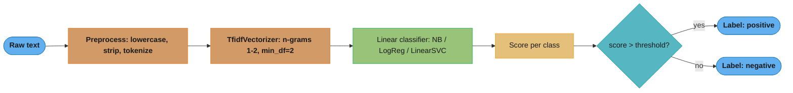
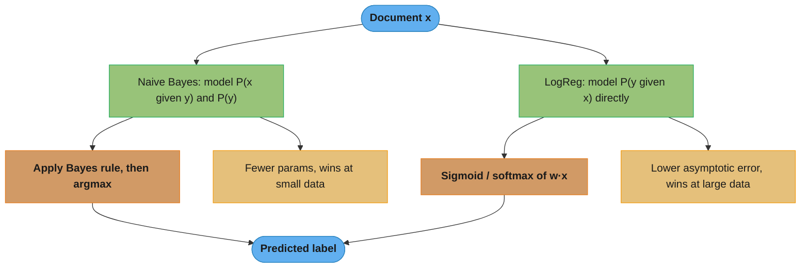
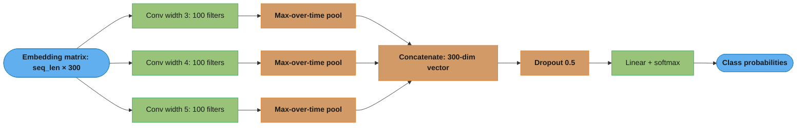
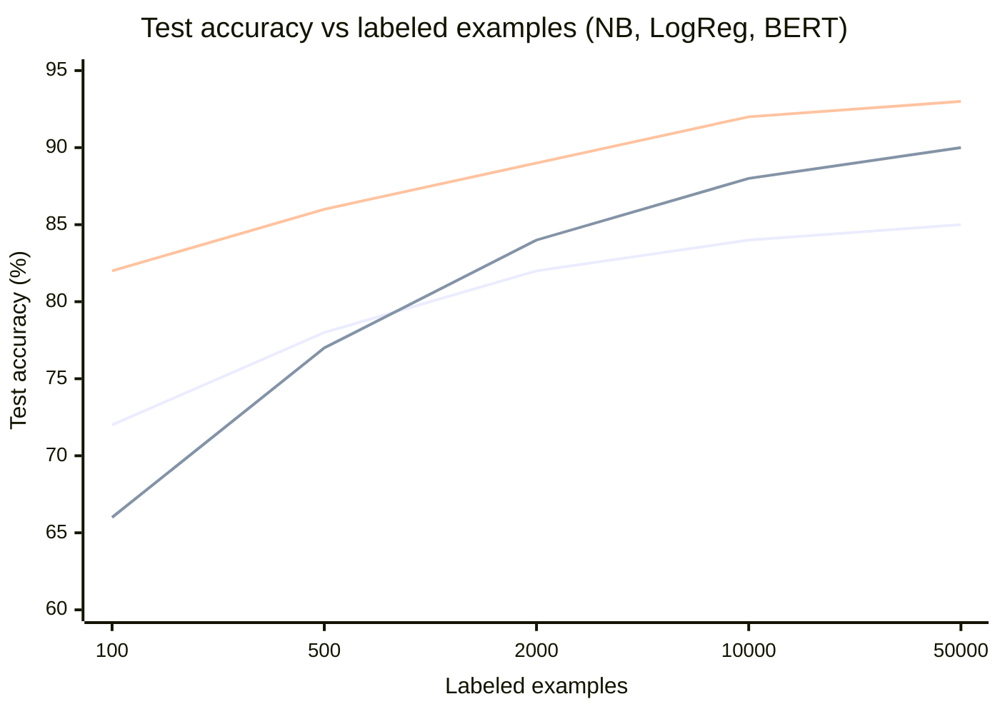
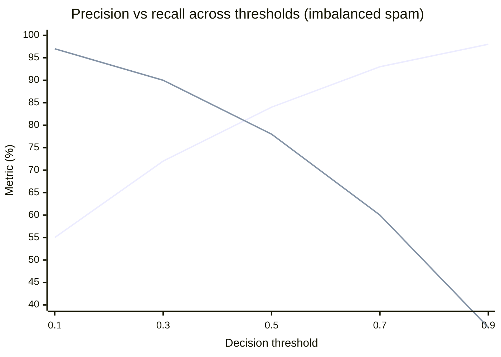

# Text Classification

> This file is a deep-dive sub-file of the [Natural Language Processing](README.md) module.
> It covers the classifier side of NLP: task framing, feature representations, the classical linear
> baselines (Naive Bayes, logistic regression, linear SVM, fastText), the first neural text model
> (TextCNN), class imbalance, and multi-label strategies.
> For the algorithm math (NB derivation, logistic/SVM optimization) see
> [../supervised_learning/README.md](../supervised_learning/README.md),
> [../supervised_learning/linear_models.md](../supervised_learning/linear_models.md), and
> [../supervised_learning/bayesian_methods.md](../supervised_learning/bayesian_methods.md).
> For encoder fine-tuning see [bert_and_pretrained_models.md](bert_and_pretrained_models.md).
> For the production system (serving, cascade, active learning) see
> [../case_studies/design_nlp_classification_pipeline.md](../case_studies/design_nlp_classification_pipeline.md).

---

## 1. Concept Overview

Text classification assigns one or more predefined labels to a piece of text: spam vs ham, a support ticket's intent, a product review's sentiment, a news article's topic, a comment's toxicity types. It is the single most common NLP task in production — content moderation, ticket routing, document tagging, compliance screening, and product categorization are all text classification underneath.

The task decomposes into two decisions that this file treats as separable: **how you turn text into numbers** (feature representation: bag-of-words counts, TF-IDF weights, dense embeddings, or contextual embeddings) and **which classifier consumes those numbers** (Naive Bayes, logistic regression, linear SVM, fastText, TextCNN, or a fine-tuned encoder). The central engineering lesson, echoed in the [system-design case study](../case_studies/design_nlp_classification_pipeline.md), is that most text-classification problems do **not** need BERT: a TF-IDF + linear model baseline reaches within 5–15% of a fine-tuned transformer at a fraction of the training cost, serving latency, and operational complexity. You earn the right to fine-tune BERT by first proving a linear baseline is not good enough.

Text is the domain where the "naive" independence assumption of Naive Bayes and the linear-kernel-wins property of SVMs both hold up unusually well, because bag-of-words features are extremely high-dimensional (tens of thousands of vocabulary terms) and sparse (a document touches a few hundred of them). Understanding *why* linear models thrive in that regime is the intuition this file builds before layering on neural models.

---

## 2. Intuition

**One-line analogy:** A text classifier is a spam-scoring machine that adds up "guilt points" — each word contributes a learned weight toward or against a class, and the sum crosses a threshold.

**Mental model:** Picture a document as a giant sparse checklist over a 30,000-word vocabulary — mostly zeros, with a spike wherever a word appears. A linear classifier is a single learned weight per checkbox: `free` +2.1 toward spam, `meeting` −1.4, `viagra` +5.7. Score a document by summing the weights of the checked boxes. Naive Bayes learns those weights from per-class word frequencies (a generative story: "how would a spam author generate words?"); logistic regression and SVM learn them by directly optimizing the decision boundary (a discriminative story: "what weights best separate spam from ham?").

**Why it matters:** In a 30,000-dimensional sparse space, classes are almost always linearly separable — there is enough room to draw a flat hyperplane between them — so the extra capacity of a nonlinear kernel or a deep network buys little and overfits easily. This is why a `LinearSVC` beats an RBF-kernel SVM on text, and why a 40-line TF-IDF pipeline is the correct first move.

**Key insight:** The bag-of-words assumption throws away word *order* ("dog bites man" == "man bites dog"), yet works because word *identity* carries most of the topical signal. Order matters exactly where BoW fails — negation ("not good"), sarcasm, and syntax — and that gap is precisely what n-grams (fastText), convolution windows (TextCNN), and self-attention (BERT) exist to close.

---

## 3. Core Principles

**Generative vs discriminative.** Naive Bayes is *generative*: it models `P(x | y)` and `P(y)`, then applies Bayes' rule to rank classes by `P(y | x)`. Logistic regression, SVM, and neural nets are *discriminative*: they model `P(y | x)` (or a decision boundary) directly. Ng & Jordan (2002) showed generative NB has higher asymptotic error but reaches it with far fewer examples, so **NB wins at small data, discriminative models win at large data** — a crossover you can see in a learning curve.

**High dimensionality favors linear models.** Bag-of-words puts a document in `R^|V|` with `|V|` = 10K–1M. In such high dimensions, data is almost always linearly separable (Cover's theorem intuition), so a linear decision boundary suffices; nonlinear kernels add parameters that overfit the sparse tail. Linear SVM's hinge loss finds the max-margin separating hyperplane, which generalizes well in exactly this regime.

**Sparsity and the independence assumption.** Each document activates a few hundred of the `|V|` features. Naive Bayes' per-feature independence assumption is false (words co-occur) but the *ranking* of `P(y | x)` across classes is robust to the miscalibrated magnitudes, so `argmax` stays correct even when the probabilities are wildly overconfident.

**Feature weighting encodes document structure.** Raw counts overweight frequent function words. TF-IDF down-weights terms common across documents (`idf = log(N / df)`) and up-weights rare discriminative terms. Sublinear TF (`1 + log(tf)`) dampens the effect of a word repeated many times in one document.

**Class imbalance breaks accuracy.** Spam, fraud, and toxic-comment datasets are heavily skewed. Accuracy rewards predicting the majority class; you must switch to precision/recall/F1 on the minority class, apply class weights or resampling, and move the decision threshold rather than defaulting to 0.5.

**Decision boundary between a baseline and BERT.** Fine-tuning an encoder is justified when the linear baseline's errors are concentrated in cases that require word order, long-range context, or semantics that BoW cannot see, AND the accuracy gap clears the latency/cost bar. Otherwise the baseline ships. See [§9](#9-when-to-use--when-not-to-use).

---

## 4. Types / Architectures / Strategies

### 4.1 Task Framings

| Framing | Labels per document | Loss / output | Example |
|---------|---------------------|---------------|---------|
| **Binary** | Exactly 1 of 2 | Sigmoid + BCE, or softmax(2) | Spam vs ham |
| **Multiclass** | Exactly 1 of K | Softmax + cross-entropy | Ticket intent (billing/tech/sales) |
| **Multi-label** | 0..K simultaneously | K independent sigmoids + BCE | Toxic-comment types (toxic, threat, insult) |
| **Hierarchical** | 1 path in a taxonomy | Per-level softmax, or flat with masking | Product category tree (Electronics → Phones → Cases) |

Multiclass assumes labels are mutually exclusive; multi-label does not. A frequent bug is training a K-way softmax on a genuinely multi-label problem, which forces the labels to compete and suppresses all but the top one.

### 4.2 Feature Representations

| Representation | Dimensionality | Captures order? | Captures semantics? | Typical pairing |
|----------------|----------------|-----------------|---------------------|-----------------|
| Bag-of-words (counts) | `|V|` sparse | No | No | MultinomialNB |
| TF-IDF | `|V|` sparse | No | No | LogReg, LinearSVC |
| Char/word n-grams | `|V| + |ngrams|` sparse | Local only | No | fastText |
| Static embeddings (Word2Vec/GloVe) | 100–300 dense | No (avg pooling) | Yes (lexical) | TextCNN, averaged-vector LR |
| Contextual embeddings (BERT) | 768 dense | Yes | Yes (contextual) | Fine-tuned classifier head |

### 4.3 Classifier Families

| Model | Feature input | Strength | Weakness |
|-------|---------------|----------|----------|
| **MultinomialNB** | Counts / TF-IDF | Fastest to train, strong at tiny data | Independence assumption, poorly calibrated |
| **BernoulliNB** | Binary presence | Good for short text (tweets, titles) | Ignores counts |
| **LogisticRegression (MaxEnt)** | TF-IDF | Calibrated probabilities, interpretable weights | Needs more data than NB |
| **LinearSVC** | TF-IDF | Best accuracy of the linear family on long text | No native probabilities |
| **fastText** | Word + char n-grams | Sub-second training on millions of docs, robust to OOV | Shallow, no long-range context |
| **TextCNN** | Static embeddings | Learns local n-gram detectors, fast inference | No long-range dependency |
| **RNN/attention** | Embeddings | Models sequence and long-range order | Slow, largely superseded by transformers |
| **Fine-tuned BERT** | Sub-word tokens | State-of-the-art, handles order + semantics | Heavy training/serving cost |

### 4.4 Multinomial vs Bernoulli Naive Bayes

- **Multinomial NB** models each class as a bag from which words are drawn with class-conditional probabilities; the document likelihood multiplies `P(w | c)` once *per occurrence*. It uses word **counts**, so repeated words compound evidence. Default for medium/long documents.
- **Bernoulli NB** models each vocabulary term as an independent present/absent coin flip; it explicitly includes the probability of **absent** words as evidence. It uses binary **presence**, so it fits very short text (tweets, subject lines) where a word appearing twice is not more informative than once.
- **Laplace (add-one) smoothing, `alpha = 1`**, is mandatory: an unseen (word, class) pair yields `P(w | c) = 0`, which zeroes the entire product and makes the class impossible. Smoothing adds a pseudocount so no term can veto a class. `alpha` is tunable; smaller `alpha` (0.01–0.1) often helps on large vocabularies.

### 4.5 Multi-Label Strategies

| Strategy | Idea | Pros | Cons |
|----------|------|------|------|
| **Binary Relevance** | One independent binary classifier per label | Simple, parallelizable | Ignores label correlations |
| **Classifier Chains** | Feed earlier labels' predictions as features to later ones | Models correlations | Order-dependent, error propagation |
| **Label Powerset** | Treat each observed label-set as one class | Captures joint structure | Explodes combinatorially, sparse classes |
| **Neural BCE head** | K sigmoid outputs, per-label BCE loss | Scales, shares representation | Needs enough data per label |

---

## 5. Architecture Diagrams

### Text-classification pipeline (baseline path)



*The vectorizer (`fit` on train only) and classifier are the two learned stages; the threshold is a tuned decision, not a fixed 0.5. Fitting the vectorizer before the train/test split is the classic data-leakage bug (see [§10](#10-common-pitfalls)).*

### Naive Bayes (generative) vs logistic regression (discriminative)



*Both reach a label, but from opposite directions: NB reasons about how the class generates words; logistic regression carves the boundary that best separates classes. The crossover point is the learning curve below.*

### TextCNN (Kim 2014) convolution + max-over-time pooling



*Three filter widths (3, 4, 5) act as learned trigram/4-gram/5-gram detectors; 100 filters each gives 300 features after max-over-time pooling, which keeps the single strongest activation of each filter regardless of position — the pooling is what makes TextCNN length-invariant.*

### Learning curve: accuracy vs training-set size



*Bottom-to-top by low-data behavior: MultinomialNB (starts high ~72%, plateaus ~85%), TF-IDF LogReg (starts lower ~66%, overtakes NB near 2K examples, reaches ~90%), fine-tuned BERT (best throughout ~82–93%, its pretraining advantage largest at small data). The NB↔LogReg crossover is the Ng & Jordan effect; BERT's flat-high curve is why it wins when labels are scarce but rarely justifies its cost once you have 50K+ examples.*

### Precision and recall as the decision threshold moves



*Rising line = precision, falling line = recall. The default 0.5 threshold is rarely optimal on imbalanced data: raise it toward 0.7–0.9 when false positives are expensive (blocking a legitimate email), lower it toward 0.1–0.3 when misses are expensive (letting fraud through). Pick the threshold on a validation set to hit the operating point the product requires.*

---

## 6. How It Works — Detailed Mechanics

### 6.1 Multinomial Naive Bayes math

For document `x` with word counts, the class score under multinomial NB is:

```
log P(y=c | x) ∝ log P(c) + Σ_w  count(w, x) · log P(w | c)

with Laplace smoothing (alpha = 1):

P(w | c) = ( count(w, c) + alpha ) / ( Σ_w' count(w', c) + alpha · |V| )
```

The `alpha · |V|` term in the denominator is what keeps the smoothed probabilities a valid distribution. Work in log-space and sum (never multiply raw probabilities — hundreds of factors below 1 underflow to 0). Cross-link to [../supervised_learning/bayesian_methods.md](../supervised_learning/bayesian_methods.md) for the full derivation and the Dirichlet-prior view of smoothing.

### 6.2 The three linear baselines, side by side

```python
from __future__ import annotations

from sklearn.feature_extraction.text import TfidfVectorizer
from sklearn.linear_model import LogisticRegression
from sklearn.naive_bayes import MultinomialNB
from sklearn.svm import LinearSVC
from sklearn.pipeline import Pipeline
from sklearn.model_selection import train_test_split
from sklearn.metrics import f1_score


def build_linear_baselines(
    texts: list[str],
    labels: list[int],
    seed: int = 42,
) -> dict[str, float]:
    """Train MultinomialNB, LogisticRegression, and LinearSVC on the same
    TF-IDF features and return macro-F1 for each. The vectorizer lives INSIDE
    the Pipeline so it is fit on the training fold only (no leakage)."""
    X_train, X_test, y_train, y_test = train_test_split(
        texts, labels, test_size=0.2, stratify=labels, random_state=seed
    )

    # n-grams 1-2 capture short phrases ("not good"); min_df=2 drops hapax
    # legomena; sublinear_tf dampens repeated-word inflation.
    vectorizer = TfidfVectorizer(
        ngram_range=(1, 2),
        min_df=2,
        max_features=50_000,
        sublinear_tf=True,
        strip_accents="unicode",
    )

    models: dict[str, object] = {
        "MultinomialNB": MultinomialNB(alpha=1.0),                 # add-one smoothing
        "LogReg": LogisticRegression(C=1.0, max_iter=1000, class_weight="balanced"),
        "LinearSVC": LinearSVC(C=1.0, class_weight="balanced"),
    }

    results: dict[str, float] = {}
    for name, clf in models.items():
        pipe = Pipeline([("tfidf", vectorizer), ("clf", clf)])
        pipe.fit(X_train, y_train)
        preds = pipe.predict(X_test)
        results[name] = f1_score(y_test, preds, average="macro")
    return results
```

`LinearSVC` gives no `predict_proba`; wrap it in `CalibratedClassifierCV` if you need probabilities for thresholding. `class_weight="balanced"` reweights the loss inversely to class frequency — the first lever to pull under imbalance.

### 6.3 fastText: n-gram features + hierarchical softmax

fastText (Joulin et al., 2016) averages word and character-n-gram embeddings into a single document vector, then applies a linear classifier. Two tricks make it fast: **subword n-grams** give it robustness to OOV and typos, and **hierarchical softmax** replaces the `O(K)` softmax with an `O(log K)` Huffman-tree traversal, which matters when `K` is large (thousands of tags).

```python
import fasttext

# Training file: one doc per line, labels prefixed with __label__
#   __label__spam  win a free prize click here now
#   __label__ham   are we still on for the meeting tomorrow
def train_fasttext(train_path: str) -> fasttext.FastText._FastText:
    model = fasttext.train_supervised(
        input=train_path,
        lr=1.0,
        epoch=25,
        wordNgrams=2,      # include word bigrams as features
        dim=100,           # embedding dimension
        loss="hs",         # hierarchical softmax: O(log K) instead of O(K)
        minCount=2,
        bucket=200_000,    # hashing bucket for char n-grams
    )
    return model


def predict_fasttext(model: fasttext.FastText._FastText, text: str) -> tuple[str, float]:
    labels, probs = model.predict(text, k=1)
    return labels[0].replace("__label__", ""), float(probs[0])
```

On a million-document tag-classification task, fastText trains in seconds on a CPU and matches deep models within a couple of accuracy points — its speed is the headline feature.

### 6.4 TextCNN (Kim 2014)

```python
from __future__ import annotations

import torch
import torch.nn as nn
import torch.nn.functional as F


class TextCNN(nn.Module):
    """Kim (2014) sentence classifier: parallel conv filters of widths 3/4/5,
    100 filters each, max-over-time pooling, dropout, softmax."""

    def __init__(
        self,
        vocab_size: int,
        embed_dim: int = 300,
        num_classes: int = 2,
        filter_sizes: tuple[int, ...] = (3, 4, 5),
        num_filters: int = 100,
        dropout: float = 0.5,
        pad_idx: int = 0,
    ) -> None:
        super().__init__()
        self.embedding = nn.Embedding(vocab_size, embed_dim, padding_idx=pad_idx)
        # One Conv1d per filter width; in_channels = embed_dim (channels-first).
        self.convs = nn.ModuleList(
            [nn.Conv1d(embed_dim, num_filters, kernel_size=k) for k in filter_sizes]
        )
        self.dropout = nn.Dropout(dropout)
        # 3 widths × 100 filters = 300 features into the classifier.
        self.fc = nn.Linear(num_filters * len(filter_sizes), num_classes)

    def forward(self, x: torch.Tensor) -> torch.Tensor:
        # x: (batch, seq_len) token ids
        emb = self.embedding(x)                 # (batch, seq_len, embed_dim)
        emb = emb.transpose(1, 2)               # (batch, embed_dim, seq_len)
        # Conv -> ReLU -> max-over-time pool for each filter width.
        pooled = [
            F.max_pool1d(F.relu(conv(emb)), kernel_size=conv(emb).shape[2]).squeeze(2)
            for conv in self.convs
        ]
        feats = torch.cat(pooled, dim=1)        # (batch, num_filters * num_widths)
        feats = self.dropout(feats)
        return self.fc(feats)                   # (batch, num_classes) logits
```

Max-over-time pooling keeps only the single strongest activation of each filter across the whole sentence, so the network is invariant to *where* an informative phrase appears and to sentence length. Initialize `self.embedding` from pretrained Word2Vec/GloVe and either freeze it (CNN-static) or fine-tune it (CNN-non-static); non-static usually wins by 1–2 points.

### 6.5 Handling class imbalance

```python
import torch
import torch.nn as nn
import torch.nn.functional as F


class FocalLoss(nn.Module):
    """Down-weights easy, well-classified examples so training focuses on the
    hard minority class. gamma=2 is the Lin et al. (2017) default; alpha
    reweights the positive class."""

    def __init__(self, alpha: float = 0.25, gamma: float = 2.0) -> None:
        super().__init__()
        self.alpha = alpha
        self.gamma = gamma

    def forward(self, logits: torch.Tensor, targets: torch.Tensor) -> torch.Tensor:
        ce = F.binary_cross_entropy_with_logits(logits, targets, reduction="none")
        p_t = torch.exp(-ce)                    # model's prob of the true class
        focal = self.alpha * (1 - p_t) ** self.gamma * ce
        return focal.mean()
```

The imbalance toolkit, cheapest first: (1) **class weights** (`class_weight="balanced"` or a weighted loss), (2) **threshold moving** (tune the decision threshold on validation — see the PR diagram in [§5](#5-architecture-diagrams)), (3) **resampling** (SMOTE on TF-IDF vectors, or simple minority oversampling), (4) **focal loss** for neural models with extreme skew, (5) **ComplementNB** instead of MultinomialNB, which estimates parameters from the *complement* of each class and is markedly more robust to imbalance for text.

---

## 7. Real-World Examples

**Gmail spam filtering.** Google's spam classifier began life as a Naive Bayes model over word and header features and still uses linear models in its ensemble for their speed and interpretability; the per-word weights make it auditable ("why was this flagged?"). Modern Gmail layers deep models on top, but the fast linear layer scores the overwhelming majority of clearly-ham mail cheaply.

**fastText at Meta.** fastText was built to classify billions of posts and tags at Facebook scale where training a deep model per label was infeasible. On the DBpedia and Yelp benchmarks it matches character-CNNs while training in seconds on CPU instead of hours on GPU — the canonical example of a shallow model winning on the throughput axis.

**Jigsaw toxic-comment classification (multi-label).** The Kaggle Jigsaw dataset labels each Wikipedia comment with up to six non-exclusive types (toxic, severe_toxic, obscene, threat, insult, identity_hate). It is the textbook multi-label problem: a BCE head over six sigmoids, evaluated with per-label AUC and macro-F1, with heavy imbalance (threats are <0.3% of comments) forcing threshold tuning per label.

**Stack Overflow tag prediction (extreme multi-label / hierarchical).** Tens of thousands of possible tags per question makes label powerset impossible; production systems use binary relevance with a shared TF-IDF or embedding backbone plus hierarchical softmax to keep inference sub-linear in the tag count.

**Yelp / Amazon review sentiment.** The standard benchmark where TF-IDF + LinearSVC reaches ~93–95% on binary polarity — within a few points of BERT — and is the reference case for "why fine-tune?" A fine-tuned encoder earns its keep mainly on the negation and sarcasm subset that BoW cannot represent.

---

## 8. Tradeoffs

### Model family tradeoffs

| Model | Train time (100K docs) | Inference | Accuracy tier | Interpretable? |
|-------|------------------------|-----------|---------------|----------------|
| MultinomialNB | ~1 s | <0.1 ms | Baseline | Yes (log-odds per word) |
| LogisticRegression | ~10 s | <0.1 ms | Good | Yes (weights) |
| LinearSVC | ~20 s | <0.1 ms | Good+ | Yes (weights) |
| fastText | ~5 s | <0.1 ms | Good | Partly |
| TextCNN | minutes (GPU) | ~1 ms | Better | No |
| Fine-tuned BERT | hours (GPU) | 10–80 ms | Best | No |

### Feature representation tradeoffs

| Representation | Memory | OOV handling | Order sensitivity |
|----------------|--------|--------------|-------------------|
| BoW counts | Low (sparse) | Ignores OOV | None |
| TF-IDF | Low (sparse) | Ignores OOV | None (n-grams give local) |
| fastText n-grams | Medium | Robust (subword) | Local only |
| Contextual (BERT) | High (dense) | Robust (WordPiece) | Full |

### Multinomial vs Bernoulli NB

| Aspect | MultinomialNB | BernoulliNB |
|--------|---------------|-------------|
| Feature | Word counts | Binary presence |
| Uses word absence as signal | No | Yes (explicit) |
| Best document length | Medium/long | Short (titles, tweets) |
| Repeated words | Compound evidence | No extra weight |

---

## 9. When to Use / When NOT to Use

### Start with a linear baseline (TF-IDF + LogReg/LinearSVC) when:

- You are building the first version — always establish this number before anything else.
- Latency budget is tight (<1 ms) or you serve on CPU at high RPS.
- Training data is modest (hundreds to low tens of thousands of examples).
- The signal is largely topical/lexical (spam, topic tagging, coarse intent).
- You need interpretable, auditable per-word weights (compliance, moderation appeals).

### Use fastText when:

- You have millions of documents and need training measured in seconds.
- The label space is large (thousands of tags) — hierarchical softmax pays off.
- Inputs are noisy/multilingual with heavy OOV — subword n-grams are robust.

### Use TextCNN / neural models when:

- Local word-order patterns matter (negation, short idioms) but you cannot afford BERT.
- You have pretrained embeddings and 10K+ labeled examples.

### Fine-tune BERT (see [bert_and_pretrained_models.md](bert_and_pretrained_models.md)) when:

- The linear baseline's residual errors demonstrably require context/semantics/order (sarcasm, coreference, subtle intent).
- The accuracy gap clears the latency and cost bar — a 5% F1 gain that costs 100× inference is often not worth it.
- You have GPU serving and 5K+ labeled examples (fewer, and NB may still win — see the learning curve in [§5](#5-architecture-diagrams)).

### Do NOT reach for BERT when:

- You have not measured the linear baseline yet.
- The dataset is <1K examples (BERT overfits; NB is stronger).
- Serving is CPU-only at high throughput and latency-critical.

---

## 10. Common Pitfalls

### Pitfall 1 (BROKEN → FIX): fitting the vectorizer before the split — data leakage

```python
# BROKEN: vectorizer learns IDF statistics (and vocabulary) from the FULL
# dataset, including the test rows. The test set has leaked into training.
from sklearn.feature_extraction.text import TfidfVectorizer
from sklearn.model_selection import train_test_split
from sklearn.linear_model import LogisticRegression

vectorizer = TfidfVectorizer()
X = vectorizer.fit_transform(all_texts)          # <-- fit sees test rows
X_train, X_test, y_train, y_test = train_test_split(X, all_labels, test_size=0.2)
clf = LogisticRegression().fit(X_train, y_train)
# Reported accuracy is optimistically biased; it drops in production.
```

```python
# FIXED: split first, then fit the vectorizer on TRAIN only. A Pipeline makes
# this the default because fit()/predict() re-fit only on the training fold.
from sklearn.pipeline import Pipeline

X_train, X_test, y_train, y_test = train_test_split(all_texts, all_labels, test_size=0.2)
pipe = Pipeline([("tfidf", TfidfVectorizer()), ("clf", LogisticRegression())])
pipe.fit(X_train, y_train)                        # vectorizer.fit sees TRAIN only
acc = pipe.score(X_test, y_test)                  # honest estimate
```

Production incident pattern: a team reported 96% offline accuracy on spam that fell to 88% in production. Root cause: `fit_transform` on the concatenated corpus leaked test-set IDF and vocabulary into training. Moving the vectorizer inside a `Pipeline` (and into each cross-validation fold) closed the 8-point gap. In cross-validation, always put the vectorizer inside the fold, never vectorize once outside `cross_val_score`.

### Pitfall 2 (BROKEN → FIX): reporting accuracy on imbalanced spam

```python
# BROKEN: 98% of email is ham. A model that predicts "ham" for EVERYTHING
# scores 98% accuracy and catches ZERO spam.
from sklearn.metrics import accuracy_score
preds = ["ham"] * len(y_test)                     # trivial majority predictor
print(accuracy_score(y_test, preds))              # 0.98 — looks great, is useless
```

```python
# FIXED: evaluate precision/recall/F1 on the MINORITY (spam) class, and tune
# the threshold for the operating point the product needs.
from sklearn.metrics import classification_report, precision_recall_curve
import numpy as np

proba = pipe.predict_proba(X_test)[:, 1]          # P(spam)
prec, rec, thr = precision_recall_curve(y_test, proba, pos_label="spam")
# choose the smallest threshold with precision >= 0.95 (few false blocks)
target = np.argmax(prec >= 0.95)
chosen = thr[target] if target < len(thr) else 0.5
preds = np.where(proba >= chosen, "spam", "ham")
print(classification_report(y_test, preds))       # look at spam recall, not accuracy
```

### Pitfall 3: K-way softmax on a multi-label problem

Training a K-class softmax when documents can carry several labels forces the labels to compete for one probability budget, so only the single top label ever fires. Fix: use K independent sigmoids with `BCEWithLogitsLoss` (binary relevance), and threshold each label independently.

### Pitfall 4: no smoothing in Naive Bayes

A single unseen (word, class) pair drives `P(w | c) = 0`, which zeroes the whole product and makes the class impossible regardless of other evidence. Always keep `alpha >= ` a small positive value (`MultinomialNB(alpha=1.0)` by default); never set `alpha=0`.

### Pitfall 5: over-aggressive preprocessing

Stripping stopwords and punctuation, and lowercasing indiscriminately, can destroy signal: `not` and `no` are stopwords critical to sentiment; `FREE!!!` vs `free` distinguishes spam; casing distinguishes `US` (country) from `us`. Test each preprocessing step against the baseline rather than assuming it helps.

### Pitfall 6: SMOTE on sparse TF-IDF interpolates nonsense

SMOTE creates synthetic minority points by interpolating between neighbors, but interpolating two sparse TF-IDF vectors yields a dense vector that corresponds to no real document and can hurt linear models. Prefer class weights, threshold moving, or `ComplementNB` for text; if resampling, simple minority oversampling is safer than SMOTE on BoW features.

---

## 11. Technologies & Tools

| Tool | Purpose | Notes |
|------|---------|-------|
| `scikit-learn` | TF-IDF, MultinomialNB, LogisticRegression, LinearSVC, Pipeline, metrics | The linear-baseline workhorse; keep the vectorizer in a Pipeline |
| `fasttext` (Meta) | Ultra-fast n-gram linear classifier with hierarchical softmax | CPU training in seconds on millions of docs |
| `torch` / `torchtext` | TextCNN, RNN, custom neural classifiers | `nn.Conv1d` for TextCNN; pad and pack sequences |
| `transformers` (HuggingFace) | Fine-tuned encoder classifiers | See [bert_and_pretrained_models.md](bert_and_pretrained_models.md) |
| `imbalanced-learn` | Resampling (SMOTE, RandomOverSampler), pipeline integration | Prefer class weights first on sparse text |
| `scikit-multilearn` | Multi-label transformations (binary relevance, classifier chains, label powerset) | For non-neural multi-label |
| `spaCy` | Tokenization, sentence segmentation, lemmatization | Preprocessing front-end |
| `Optuna` | Hyperparameter search (C, alpha, ngram_range, thresholds) | Tune inside cross-validation folds |

---

## 12. Interview Questions with Answers

**Q: Why do linear models (logistic regression, linear SVM) usually beat nonlinear kernels on text?**
Text bag-of-words features are extremely high-dimensional and sparse, so classes are almost always linearly separable and a flat hyperplane suffices. Nonlinear kernels (RBF) add capacity that overfits the sparse tail and slow training from near-linear to `O(n^2)` in examples. A `LinearSVC` on TF-IDF typically matches or beats an RBF SVM at a fraction of the cost, which is why the linear kernel is the text default.

**Q: Why does Naive Bayes work well for text despite its independence assumption being false?**
The independence assumption produces miscalibrated probabilities but a correct class ranking, and classification only needs the `argmax`. Words in a spam email co-occur (violating independence), yet they all point toward the spam class, so the wrong magnitudes still yield the right winner. NB fails when you need the probability itself (thresholding, calibration), not just the top class.

**Q: When would you pick a TF-IDF baseline over fine-tuning BERT?**
Pick the baseline when the signal is topical/lexical, latency is tight, data is modest, or you have not yet measured a baseline. A TF-IDF + LinearSVC pipeline reaches within 5–15% of BERT on most classification tasks at <1 ms CPU inference versus 10–80 ms on GPU. You fine-tune BERT only when the residual errors demonstrably require order/context/semantics and the gap clears the cost bar.

**Q: What is the difference between Multinomial and Bernoulli Naive Bayes for text?**
Multinomial NB uses word counts and multiplies `P(w|c)` once per occurrence; Bernoulli NB uses binary presence and explicitly includes the probability that a word is absent. Multinomial suits medium/long documents where repeated words compound evidence; Bernoulli suits very short text (tweets, titles) where a word appearing twice is not more informative. Bernoulli's use of absence as a signal helps when the vocabulary is small and documents are short.

**Q: Why is Laplace smoothing necessary in Naive Bayes and what does alpha control?**
Without smoothing, an unseen (word, class) pair gives `P(w|c) = 0`, which zeroes the entire product and makes that class impossible no matter what other words say. Laplace smoothing adds a pseudocount `alpha` (default 1) to every count so no term can veto a class. Smaller `alpha` (0.01–0.1) trusts the data more and often helps on large vocabularies; `alpha=0` reintroduces the zero-probability bug.

**Q: You report 98% accuracy on a spam classifier. Why might that be meaningless?**
If 98% of email is ham, a model that always predicts "ham" scores 98% accuracy while catching zero spam. Accuracy is dominated by the majority class under imbalance, so you must report precision, recall, and F1 on the minority (spam) class, or PR-AUC. The fix is to evaluate the minority class and tune the decision threshold to the required operating point.

**Q: What is data leakage in a text-classification pipeline and how do you prevent it?**
Data leakage is when information from the test set influences training — most commonly fitting the TF-IDF vectorizer on the full corpus before splitting, which leaks test-set IDF statistics and vocabulary. It inflates offline metrics that then collapse in production. Prevent it by splitting first and fitting the vectorizer on the training fold only, ideally by putting it inside a `Pipeline` so cross-validation re-fits it per fold.

**Q: How do you handle class imbalance in text classification?**
Start with the cheapest lever and escalate: class weights, then threshold moving, then resampling, then focal loss. Concretely that is `class_weight="balanced"`, then a validation-tuned decision threshold, then oversampling, then focal loss for neural models, and `ComplementNB` in place of `MultinomialNB` for imbalanced text. Threshold moving is often the highest-leverage step because it directly targets the precision/recall operating point without retraining. Always tune the threshold on validation data, never on the test set.

**Q: Explain TextCNN's architecture and why max-over-time pooling matters.**
TextCNN (Kim 2014) runs parallel 1-D convolutions of widths 3, 4, and 5 (100 filters each) over the embedding sequence, acting as learned trigram/4-gram/5-gram detectors, then applies max-over-time pooling and a softmax. Max-over-time pooling keeps only each filter's single strongest activation across the whole sentence, making the model invariant to where an informative phrase occurs and to sentence length. The three filter widths concatenate to a 300-dim feature vector fed to the classifier.

**Q: How does fastText achieve such fast training and OOV robustness?**
fastText averages word and character-n-gram embeddings into one document vector and uses hierarchical softmax to reduce the output cost from `O(K)` to `O(log K)`. The character n-grams give it robustness to out-of-vocabulary words and typos because subwords of an unseen word are still known. On millions of documents it trains in seconds on CPU while matching deep models within a couple of accuracy points.

**Q: What is the generative-vs-discriminative distinction and how does it affect small-data behavior?**
Naive Bayes is generative — it models `P(x|y)` and `P(y)` — while logistic regression and SVM are discriminative, modeling `P(y|x)` or the boundary directly. Ng & Jordan (2002) showed generative NB has higher asymptotic error but converges to it with far fewer examples, so NB tends to win at small data and discriminative models win as data grows. This crossover is visible as the learning-curve intersection between NB and logistic regression.

**Q: How do you frame and train a multi-label classifier?**
Use K independent binary classifiers (binary relevance) or a neural head with K sigmoid outputs trained with per-label binary cross-entropy, then threshold each label independently. Do not use a K-way softmax, which forces labels to compete and suppresses all but the top one. To model label correlations, use classifier chains (feed earlier predictions as features) at the cost of order-dependence and error propagation.

**Q: Why prefer LinearSVC over an RBF-kernel SVM for text, and what does LinearSVC lack?**
LinearSVC trains in near-linear time and matches RBF accuracy on high-dimensional sparse text where a linear boundary already separates classes, whereas RBF is `O(n^2)` and overfits. The tradeoff: `LinearSVC` provides no `predict_proba`, so if you need calibrated probabilities for thresholding you wrap it in `CalibratedClassifierCV` (Platt scaling or isotonic). For pure top-1 prediction, the raw decision function is enough.

**Q: What does TF-IDF do and why is it better than raw counts?**
TF-IDF multiplies term frequency by inverse document frequency (`log(N / df)`), down-weighting words common across many documents (the, is) and up-weighting rare discriminative terms. Raw counts overweight frequent function words that carry little class signal. Sublinear TF (`1 + log(tf)`) further dampens a word repeated many times in one document so a single spammy repetition does not dominate the vector.

**Q: When is Bernoulli NB the right choice over Multinomial NB?**
Choose Bernoulli NB for very short documents — tweets, subject lines, product titles — where word presence matters more than count and the explicit absence signal is informative. Multinomial NB is better for medium/long documents where repeated words should compound evidence. Empirically Bernoulli wins on short-text tasks with small vocabularies and Multinomial wins as document length grows.

**Q: Why can preprocessing like stopword removal hurt a text classifier?**
Standard stopword lists remove words like not, no, and never that are decisive for sentiment and negation, and aggressive lowercasing collapses distinctions like US (country) vs us. Over-cleaning also drops punctuation such as the multiple exclamation marks that flag spam. Always A/B each preprocessing step against the baseline rather than assuming normalization helps.

**Q: How do you choose the decision threshold for a binary text classifier?**
Compute the precision-recall curve on a validation set and pick the threshold that meets the product's operating point. Use a high threshold when false positives are costly (blocking real email), a low one when misses are costly (letting fraud through). The default 0.5 is rarely optimal under imbalance. Fix the threshold on validation data and only then report metrics on the held-out test set.

**Q: Why is SMOTE risky on TF-IDF features?**
SMOTE synthesizes minority points by interpolating between sparse neighbor vectors, producing dense vectors that correspond to no real document and can degrade linear models. Text imbalance is better handled with class weights, threshold moving, or `ComplementNB`. If you must resample, simple minority oversampling is safer than SMOTE on bag-of-words features.

---

## 13. Best Practices

1. Always establish a TF-IDF + LinearSVC/LogReg baseline before any neural model — it is the number every later model must beat, and it often ships.
2. Keep the vectorizer inside a `Pipeline` so it is fit on the training fold only; this makes leakage the exception rather than the default.
3. Use `ngram_range=(1, 2)`, `min_df=2`, `sublinear_tf=True`, and `max_features` around 50K as strong TF-IDF defaults; tune with Optuna inside CV folds.
4. Under imbalance, report macro-F1 and minority-class recall, never accuracy; pull class weights, then threshold moving, before resampling.
5. Tune the decision threshold on a validation set to the product's precision/recall operating point instead of defaulting to 0.5.
6. For multi-label, use independent sigmoids + BCE and per-label thresholds; never a K-way softmax.
7. Keep `alpha >= ` a small positive value in Naive Bayes; default `alpha=1.0`, drop toward 0.1 on large vocabularies.
8. For neural text models, initialize embeddings from pretrained Word2Vec/GloVe and fine-tune them (CNN-non-static) for a 1–2 point gain.
9. A/B every preprocessing decision (stopwords, casing, punctuation) against the baseline; do not assume normalization helps.
10. Save the fitted vectorizer and classifier together (joblib) so training and serving share identical vocabulary and IDF — a mismatch silently corrupts predictions.

---

## 14. Case Study

### Problem: Support-Ticket Intent Classifier for a SaaS Helpdesk

**Context:** A B2B SaaS company routes 8,000 support tickets/day. Each ticket's free-text body must be classified into one of 6 intents (Billing, Bug, Feature-Request, How-To, Account-Access, Other) so it lands in the right agent queue. Misrouting costs an average 12-minute handoff delay; the SLA target is p99 < 50 ms classification so routing feels instant.

**Data:** 40K historically labeled tickets, heavily skewed: How-To 34%, Bug 26%, Billing 18%, Account-Access 12%, Feature-Request 7%, Other 3%.

**Phase 1 — Linear baseline (Day 1).**

```python
from sklearn.feature_extraction.text import TfidfVectorizer
from sklearn.svm import LinearSVC
from sklearn.pipeline import Pipeline
from sklearn.calibration import CalibratedClassifierCV

pipe = Pipeline([
    ("tfidf", TfidfVectorizer(ngram_range=(1, 2), min_df=3,
                              max_features=50_000, sublinear_tf=True)),
    # Calibrated so we get probabilities for the low-confidence review queue.
    ("clf", CalibratedClassifierCV(
        LinearSVC(C=1.0, class_weight="balanced"), cv=3)),
])
pipe.fit(train_texts, train_labels)
```

Result: macro-F1 0.81, training 90 seconds on a laptop, inference 0.4 ms/ticket. The weak spot was the rare classes — Feature-Request recall 0.58, Other recall 0.41 — because 3% of data cannot teach a linear model much, even with `class_weight="balanced"`.

**Phase 2 — Imbalance and threshold work (Week 1).**

Switched the loss to focus on rare classes and moved to a **per-class abstention threshold**: if the top calibrated probability is below a class-specific threshold, route the ticket to a human triage queue instead of guessing. Thresholds tuned on validation to keep each queue's precision >= 0.90. This lifted overall precision to 0.90 while sending 9% of tickets (mostly ambiguous Other/Feature-Request) to human triage. Feature-Request precision reached 0.88 at the cost of recall — an acceptable trade because a missed feature-request is cheaper than a misrouted one.

**Phase 3 — Does BERT earn its place? (Week 3).**

Fine-tuned DistilBERT (see [bert_and_pretrained_models.md](bert_and_pretrained_models.md)) on the same 40K tickets: macro-F1 0.87, +6 points over the baseline, concentrated in the ambiguous short tickets ("it broke again") where lexical features are thin and word order/context matters. But CPU inference was 25 ms/ticket versus 0.4 ms, and the 50 ms p99 SLA held only with GPU serving at $745/month.

**Decision — cascade.** Serve the linear model to everything (0.4 ms). When its top calibrated probability is below threshold (the ambiguous ~15% of tickets), escalate that ticket to DistilBERT on a small GPU pool. This delivers near-BERT accuracy (macro-F1 0.86) at ~15% of the GPU cost of running BERT on everything, and the fast path keeps p99 well under the SLA. This mirrors the cascade in the full [system-design case study](../case_studies/design_nlp_classification_pipeline.md), which adds active learning and drift monitoring on top.

**Results:**

- Macro-F1: 0.86 (vs 0.81 baseline, +5 points; +6 from full BERT at 6× the cost).
- p99 latency: 38 ms (fast path 0.4 ms; escalated path batched on GPU).
- 9% of tickets routed to human triage with per-queue precision >= 0.90.
- GPU cost: ~$110/month (cascade) vs ~$745/month (BERT on all traffic).

**Key decisions:**

- The linear baseline shipped first and still handles 85% of traffic — the cascade exists because a plain linear model was measured, not assumed inadequate.
- Per-class abstention thresholds, tuned on validation, turned an accuracy problem into a precision-with-coverage problem the business could reason about.
- BERT was adopted only for the ambiguous minority where its context modeling demonstrably helped, keeping the accuracy gain while avoiding 6× the serving bill.
