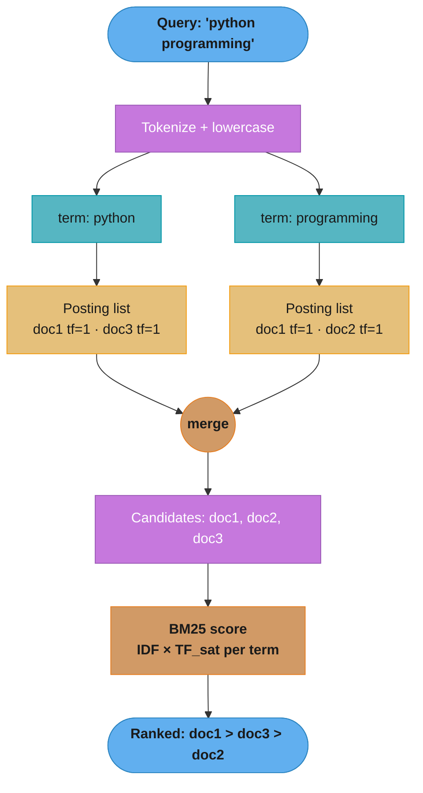
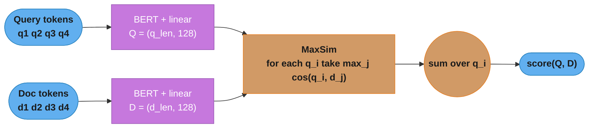
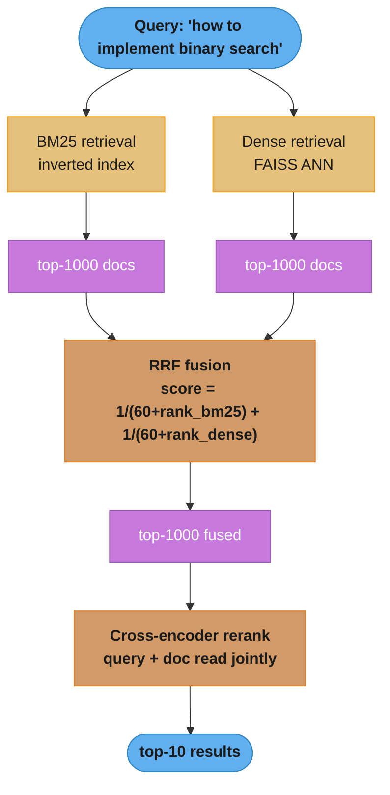

# Text Representation and Information Retrieval

> This file is a deep-dive sub-file of the [Natural Language Processing](README.md) module.
> It covers information retrieval fundamentals, sparse retrieval (BM25), dense retrieval (Sentence-BERT),
> late interaction (ColBERT), and hybrid search. RAG-focused retrieval with vector databases is covered
> in the LLM section (`llm/rag_fundamentals/`).

---

## 1. Concept Overview

Information retrieval (IR) is the problem of finding relevant documents from a large collection given a query. Before the transformer era, IR was dominated by sparse methods — representing documents and queries as sparse vectors over a vocabulary and computing similarity via lexical overlap. The key insight: if a document contains the same words as a query, it is probably relevant.

Modern IR has three paradigms:

1. **Sparse retrieval (BM25):** Lexical matching over inverted indexes. Fast, interpretable, no training needed. Still competitive for factual queries.
2. **Dense retrieval (bi-encoder):** Encode queries and documents into dense vector representations; find nearest neighbors. Handles semantic similarity and paraphrase.
3. **Late interaction (ColBERT):** Compute token-level similarity between query and document representations. Best quality but higher storage cost.

Understanding all three — and when to combine them — is a critical senior ML engineer skill for search, recommendation, and RAG system design interviews.

---

## 2. Intuition

One-line analogy: BM25 is an exact keyword matching expert; dense retrieval is a semantic understanding expert; ColBERT is an expert who reads both query and document carefully before scoring relevance.

Mental model: Imagine searching a library. BM25 is like searching the card catalog by exact title/keyword match — fast and precise for known-item search but fails for "books about dogs" when the title says "canine companions." Dense retrieval is like asking a librarian who understands synonyms and related concepts. ColBERT is like the librarian who reads the first page of candidate books and your query together before ranking.

Why it matters: The MS MARCO passage ranking benchmark shows BM25 achieves NDCG@10 of ~0.45; a dense retriever reaches ~0.65; adding a cross-encoder reranker pushes to ~0.75. Each step roughly doubles the compute cost. Understanding when each step's cost is justified is essential for production system design.

Key insight: Dense retrieval does not outperform BM25 on all queries. For queries with rare keywords (product IDs, specific names, unusual terms), BM25's exact lexical match is more reliable because the embedding model may not have seen those tokens in its training data.

---

## 3. Core Principles

**TF-IDF (foundational):** Term Frequency × Inverse Document Frequency weights terms by how discriminative they are. A term appearing frequently in a document and rarely in the corpus has high TF-IDF — a signal it characterizes this document. TF-IDF is the foundation that BM25 improves upon.

**The idea behind it.** "Score a term high in one document when it appears a lot *here* and almost nowhere *else* in the corpus." TF measures local prominence, IDF measures global rarity, and the product keeps only terms that are both. Either half alone is worthless: TF alone ranks every document by how often it says "the"; IDF alone ignores the document being scored entirely.

The two halves are separate calculations, so decode them separately.

`TF(t, d)` — term frequency, a *within-document* quantity:

| Symbol | What it is |
|--------|------------|
| `count(t, d)` | How many times term `t` literally occurs in document `d` |
| `\|d\|` | Length of document `d` in tokens |
| `TF = count(t, d) / \|d\|` | Share of this document made up of term `t`. A rate, not a raw count, so a 4000-word page does not beat a 40-word page just by being longer |

`IDF(t)` — inverse document frequency, a *corpus-wide* quantity that never looks at the document being scored:

| Symbol | What it is |
|--------|------------|
| `N` | Total number of documents in the corpus |
| `df(t)` | Document frequency: how many of those `N` documents contain `t` at least once. Note: presence only, count ignored |
| `N / df(t)` | "One in how many documents has this word." `df` small → big number → rare, discriminative term |
| `log(...)` | Compresses that ratio so a single ultra-rare term cannot swamp everything else |
| `IDF = log(N / df(t))` | The rarity weight. A term in every document gets `log(1) = 0` and contributes nothing |

**Walk one example.** A five-document corpus pushed all the way through:

```
  corpus, N = 5 documents
    d1  "python tutorial for beginners"     len 4
    d2  "python data science"               len 3
    d3  "java tutorial"                     len 2
    d4  "learn python programming"          len 3
    d5  "cooking recipes"                   len 2

  IDF = ln(N / df)          (corpus-wide, computed once at index time)
    term        df    N/df     IDF
    python       3    1.67    0.5108    <- in most docs: weak signal
    tutorial     2    2.50    0.9163
    java         1    5.00    1.6094    <- rare: strong signal
    cooking      1    5.00    1.6094

  TF-IDF for d1 "python tutorial for beginners", |d| = 4
    python      TF = 1/4 = 0.2500   x 0.5108  =  0.1277
    tutorial    TF = 1/4 = 0.2500   x 0.9163  =  0.2291   <- same count, higher score
                                                             purely because it is rarer

  TF-IDF for d2 "python data science", |d| = 3
    python      TF = 1/3 = 0.3333   x 0.5108  =  0.1703
    tutorial    TF = 0/3 = 0.0000   x 0.9163  =  0.0000   <- absent, contributes nothing

  Both documents contain "python" exactly once, yet d2 scores higher
  (0.1703 vs 0.1277) because d2 is shorter -- the same word is a bigger
  share of what d2 is about.
```

**Why the log is there, and what breaks without it.** In a 10,000-document corpus, `df = 1` gives `N/df = 10000` while `df = 5000` gives `N/df = 2` — a raw ratio of `5000x`. Taking logs turns that into `9.2103` vs `0.6931`, a ratio of `13.29x`. Without the log, one freak term appearing in a single document would dominate the sum for every query it touches, and a document matching that one term would outrank a document matching all the others. The log converts "how many times rarer" into "how many orders of magnitude rarer," which is the scale at which term rarity is actually informative.

**Why the smoothing `+1` is there.** A query term that appears in *zero* corpus documents has `df(t) = 0`, and `N / 0` is a division by zero that crashes the scorer at query time — not index time, so it is easy to miss in testing. Writing `IDF = log(N / (1 + df))` keeps the value finite (`ln(10000/1) = 9.2103` for the unseen term) and the ranking well-defined. BM25 uses a different smoothing constant for the same reason; that variant is decoded in Section 6.

**BM25 (Best Match 25):** Adds two critical improvements over TF-IDF:
1. **TF saturation:** Raw TF over-values repeated terms. "Python" appearing 50 times should not be 50x more evidence than appearing once. BM25 saturates TF: `TF_sat = TF × (k1 + 1) / (TF + k1)`. As TF→∞, TF_sat→(k1+1). With k1=1.2, TF_sat plateaus at 2.2.
2. **Length normalization:** Long documents naturally contain more term occurrences. BM25 normalizes for document length: shorter documents get a boost, longer get a penalty. `L_norm = 1 - b + b × (|d| / avgdl)` where b=0.75.

**Read it like this.** Saturation says "the tenth mention of a word tells you almost nothing the third one did not"; length normalization says "the tenth mention is less impressive in a 5,000-word document than in a 200-word one." Both exist because raw TF-IDF believes a word repeated 50 times is 50 times the evidence, and that belief is what keyword-stuffed pages exploit.

| Symbol | What it is |
|--------|------------|
| `TF` | Raw count of the term in this document — unbounded, `0` to whatever |
| `k1` | Saturation dial, default `1.2`. Bigger `k1` means repeated mentions keep earning credit for longer |
| `k1 + 1` | The ceiling the saturated value approaches. At `k1 = 1.2` that ceiling is `2.2` |
| `TF / (TF + k1)` | The saturating core: `0` at `TF = 0`, climbing toward `1` and never reaching it |
| `avgdl` | Mean document length across the whole corpus, in tokens |
| `\|d\| / avgdl` | How bloated this document is. `1.0` = exactly average, `4.0` = four times average |
| `b` | Normalization strength, default `0.75`. `b = 0` disables length correction, `b = 1` applies it fully |
| `L_norm` | The length penalty that gets multiplied into `k1` in the denominator. `> 1` penalizes, `< 1` rewards |

**Walk one example.** First saturation alone, holding length at exactly average so `L_norm = 1`:

```
  TF_sat = TF x (k1 + 1) / (TF + k1),   k1 = 1.2,  ceiling k1 + 1 = 2.2

    raw TF          1        2        3        5       10       50     1000
    TF_sat     1.0000   1.3750   1.5714   1.7742   1.9643   2.1484   2.1974
    value of
    each extra
    mention in
    this step      --  0.37500  0.19643  0.10138  0.03802  0.00460  0.00005

  The 2nd mention is worth 0.375. Each mention between 50 and 1000 is worth
  0.00005 -- about 7,500 times less. Stuffing a term 1000 times buys less
  than one honest second mention did.
```

Then length normalization alone, on a corpus whose average document is 200 tokens:

```
  L_norm = 1 - b + b x (|d| / avgdl),   b = 0.75,  avgdl = 200

    |d|          50      100     200     400     800
    |d|/avgdl   0.25     0.50    1.00    2.00    4.00
    L_norm     0.4375   0.6250  1.0000  1.7500  3.2500
                 ^                ^                ^
              boosted          neutral          penalized
```

`L_norm` sits in the denominator multiplied by `k1`, so a bigger `L_norm` shrinks the score. Set `b = 0` and every row above collapses to `1.0000` — long documents then win simply by containing more words, which is exactly the failure BM25 was written to fix. Set `b = 1` and the correction is total, which over-punishes genuinely comprehensive long documents; `0.75` is the empirical compromise.

**Inverted index:** The core data structure for sparse retrieval. For each term in the vocabulary, store a posting list: sorted list of (document_id, term_frequency) pairs. To retrieve documents containing "python programming": look up both posting lists, merge (AND/OR logic), rank by BM25 score. With skip pointers, merging posting lists of length n is O(n), not O(n²).

**Sentence embeddings:** Map a sentence to a single dense vector in a semantic space where similar sentences are nearby. `sim(sentence_a, sentence_b) = cosine(embed(a), embed(b))`. Training requires sentence pairs with similarity labels (NLI, STS benchmarks, or self-supervised methods).

**Put simply.** "Ignore how long the two arrows are; ask only whether they point the same way." Cosine is the angle between two embedding vectors, rescaled to `1` for identical direction, `0` for perpendicular, `-1` for opposite. Length is discarded on purpose, because vector length in embedding space tracks things like text length and token count — not meaning.

| Symbol | What it is |
|--------|------------|
| `embed(a)` | The encoder's output vector for sentence `a` — 384 or 768 numbers |
| `a · b` | Dot product: multiply the two vectors element-by-element and add up. Big when they agree coordinate-by-coordinate |
| `\|\|a\|\|` | L2 norm, the vector's length: `sqrt(a·a)` |
| `cos(a,b) = (a·b) / (\|\|a\|\| \|\|b\|\|)` | Dot product with both lengths divided out — pure direction, bounded to `[-1, 1]` |
| L2 normalization | Replacing `a` with `a / \|\|a\|\|` so its length becomes exactly `1` |

**Walk one example.** Three-dimensional toy vectors, where the axes are the counts of "cheap", "car", and "bicycle". The query is `q = [1, 1, 0]` ("cheap car"):

```
  doc A = [5, 5, 0]   same content as the query, said five times over (a long page)
  doc B = [0, 1, 1]   "car bicycle"  -- genuinely a different topic

                       ||v||     q.v     cosine(q,v)    euclidean(q,v)
    doc A            7.0711      10        1.0000          5.6569
    doc B            1.4142       1        0.5000          1.4142

  Euclidean distance ranks B (1.4142) as CLOSER than A (5.6569) -- exactly
  backwards. A is the query repeated; B is a different topic. Cosine gets
  it right: A = 1.0000 (identical direction), B = 0.5000.
```

That is the whole answer to "why cosine, not Euclidean": Euclidean distance punishes a document for being long, because a longer document produces a longer vector, and the raw gap between two vector tips grows with their length regardless of topic.

**What L2 normalization buys you.** Once every vector has length `1`, the denominator of the cosine formula is `1 × 1 = 1`, so the division disappears and **the dot product simply *is* the cosine**:

```
  q_unit = [0.7071, 0.7071, 0.0000]     (q divided by ||q|| = 1.4142)
  A_unit = [0.7071, 0.7071, 0.0000]     (A divided by ||A|| = 7.0711)
  B_unit = [0.0000, 0.7071, 0.7071]

    dot(q_unit, A_unit) = 1.0000   == cosine(q, A)
    dot(q_unit, B_unit) = 0.5000   == cosine(q, B)

  And on unit vectors, euclidean distance becomes a restatement of cosine:
    d(q_unit, B_unit)^2 = 1.0000     2 - 2 x cosine = 2 - 2(0.5) = 1.0000
```

This identity is why the FAISS code below builds an `IndexFlatIP` (inner product) index rather than an L2 index and why `encode()` ends in `F.normalize(..., p=2)`. Inner-product search is cheaper than cosine search — no per-comparison division, no square roots — and on normalized vectors it returns identical rankings. Skip the normalize step and `IndexFlatIP` silently starts ranking by *magnitude*, so the longest documents float to the top of every query. The last line above shows the other consequence: once vectors are normalized, sorting by cosine descending and sorting by Euclidean distance ascending produce the same order, so an HNSW or IVF index built on either metric is valid.

**Siamese architecture (Sentence-BERT):** Two BERT encoders with shared weights. Input: (sentence_a, sentence_b). Each sentence encoded independently to mean-pooled representation. Trained with cosine embedding loss on NLI data (entailment→similar, contradiction→dissimilar). At inference, pre-compute and store all document embeddings; query is encoded on-the-fly; nearest neighbor search finds top-K.

**Reciprocal Rank Fusion (RRF):** Given two ranked lists (e.g., BM25 rank and dense rank), fuse them without knowing individual scores. Score for document d = Σ_{system} 1/(k + rank(d, system)) where k=60 is a constant preventing top-ranked documents from dominating too strongly. Simple, calibration-free, often outperforms score-based fusion when score scales differ between systems.

**Stated plainly.** "Throw away both systems' scores, keep only their rank orders, and reward the document that several systems agreed was near the top." The formula never compares a BM25 number to a cosine number, which is the entire point — those two scales are not commensurable.

| Symbol | What it is |
|--------|------------|
| `rank(d, system)` | The 1-based position document `d` got in that system's list. Rank 1 is best |
| `k` | Damping constant, `60` by convention. It is added to every rank before inverting |
| `1 / (k + rank)` | One system's vote for `d`. Always positive, always shrinking as rank worsens |
| `Σ_system` | Sum the votes across systems. A document missing from a list simply contributes `0` |
| `score(d)` | The fused score, used only for sorting — its absolute value means nothing |

**Walk one example.** Four documents, ranked by BM25 and by a dense retriever, `k = 60`:

```
  doc     bm25 rank   dense rank    1/(60+r_bm25)  +  1/(60+r_dense)  =  fused
  ----------------------------------------------------------------------------
  docB         3           2          0.015873         0.016129        0.032002
  docD         2           8          0.016129         0.014706        0.030835
  docA         1          50          0.016393         0.009091        0.025484
  docC        --           1          0.000000         0.016393        0.016393

  docA is BM25's outright #1 and still finishes THIRD, because the dense
  retriever buried it at rank 50. docB, which neither system ranked first
  but both ranked near the top, wins. RRF rewards agreement over any single
  system's conviction.
```

**Why `k` is 60 and not 0.** The constant flattens the curve near the top of the list so rank 1 does not steamroll rank 2:

```
    k       score(rank 1)   score(rank 2)   how much better rank 1 is
    0          1.0000          0.5000            2.00x   (100% better)
    1          0.5000          0.3333            1.50x
   10          0.0909          0.0833            1.09x
   60          0.0164          0.0161            1.02x   (1.6% better)

  With k = 60, rank 1 is only 1.15x rank 10 -- but still 17.4x rank 1000,
  so the ordering signal survives while the top-of-list tyranny does not.
```

With `k = 0` a document that either system ranked first would nearly always win the fusion, which reduces the hybrid to "whichever retriever was more confident," discarding the second opinion you paid for. Cormack et al. (2009) found `60` worked well across diverse IR collections; it is not derived from theory, and it is worth re-tuning when one retriever is known to be much stronger than the other.

---

## 4. Types / Architectures / Strategies

### 4.1 Retrieval Paradigms

| Paradigm | Representation | Index | Similarity | Latency | Quality |
|----------|---------------|-------|------------|---------|---------|
| **BM25** | Sparse bag-of-words | Inverted index | TF-IDF-based score | <10ms | NDCG@10 ~0.45 |
| **Dense bi-encoder** | Dense vector (768d) | FAISS IVF or HNSW | Cosine/L2 | 20-50ms | NDCG@10 ~0.65 |
| **ColBERT late interaction** | Token matrix (32×128d) | Dense + inverted | MaxSim per token | 50-100ms | NDCG@10 ~0.68 |
| **Cross-encoder reranker** | Pair (query+doc) | No index (pairwise) | Classification score | 200-500ms for 100 docs | NDCG@10 ~0.75 |
| **SPLADE (learned sparse)** | Sparse BERT activations | Inverted index | Sparse dot product | <20ms | NDCG@10 ~0.63 |
| **Hybrid (BM25 + dense)** | Both | Both | RRF fusion | 30-60ms | NDCG@10 ~0.67 |

### 4.2 Dense Retrieval Models

| Model | Base | Dim | Training | MS MARCO MRR@10 |
|-------|------|-----|---------|-----------------|
| SBERT (all-MiniLM-L6-v2) | DistilBERT-6L | 384 | NLI + STS | 33.4 |
| SBERT (all-mpnet-base-v2) | MPNet | 768 | Multi-task | 35.3 |
| E5-small | 6L | 384 | Weakly supervised | 38.1 |
| E5-large | 24L | 1024 | Weakly supervised | 40.6 |
| BGE-large | 24L | 1024 | Contrastive + hard negatives | 41.9 |
| ColBERT-v2 | 12L | 128/token | Late interaction + distillation | 39.7 |

### 4.2.1 Reading the Retrieval Metrics

The two tables above are scored in `NDCG@10` and `MRR@10`, and Section 12 adds `Recall@K`. All three answer different questions, and all three are quoted constantly in interviews without being defined.

**What this actually says.** "MRR asks how fast you found *the* answer, NDCG asks how well you ordered *all* the good answers, and Recall@K asks whether the good answers made it into the bucket at all." Pick MRR when one correct result ends the task, NDCG when the user scans a whole page, Recall@K when a reranker downstream will do the ordering for you.

| Symbol | What it is |
|--------|------------|
| `rel_i` | Graded relevance of the document at position `i` — typically `0` irrelevant, `1` partial, `2` relevant, `3` perfect |
| `2^rel_i - 1` | The gain. Exponential, so one perfect hit (`7`) outweighs three partial hits (`1` each) |
| `log2(i + 1)` | The positional discount. Deeper positions divide the gain by more |
| `DCG@K` | Sum of discounted gains over the top `K` — raw, not comparable across queries |
| `IDCG@K` | The same sum computed on the *perfect* ordering of the same documents |
| `NDCG@K = DCG / IDCG` | Bounded `[0, 1]`. `1.0` means your ranking is already optimal |
| `rank_q(first_relevant)` | The position of the first relevant result for query `q`; `0` credit if there is none in the top `K` |
| `MRR@K` | Mean of `1 / rank_q` over all queries. `1.0` = every query's answer was at position 1 |
| `Recall@K` | (relevant documents appearing in the top `K`) / (all relevant documents that exist) |

**Walk one example.** NDCG@5 on a single query whose top five results grade out as `[3, 0, 2, 0, 1]`:

```
  your ranking            ideal ranking (same docs, best order)
  pos rel gain disc  contrib      pos rel gain disc  contrib
   1   3    7  1.0000  7.0000      1   3    7  1.0000  7.0000
   2   0    0  1.5850  0.0000      2   2    3  1.5850  1.8928
   3   2    3  2.0000  1.5000      3   1    1  2.0000  0.5000
   4   0    0  2.3219  0.0000      4   0    0  2.3219  0.0000
   5   1    1  2.5850  0.3869      5   0    0  2.5850  0.0000
                     --------                        --------
              DCG@5 = 8.8869                IDCG@5 = 9.3928

  NDCG@5 = 8.8869 / 9.3928 = 0.9461

  Almost all of the score comes from position 1 (7.0000 of 8.8869 = 79%).
  That is the exponential gain at work: a perfect result at the top is
  worth more than everything below it combined.
```

MRR and Recall on the same kind of data:

```
  MRR@10 over four queries, by position of the FIRST relevant result
    query     first relevant at     reciprocal rank
    q1              1                    1.0000
    q2              3                    0.3333
    q3         none in top 10            0.0000
    q4              2                    0.5000
                                       --------
                          MRR@10 = 1.8333 / 4 = 0.4583

  Recall@100 for one query with 8 known relevant documents,
  6 of which appear in the retriever's top 100:
    Recall@100 = 6 / 8 = 0.7500
```

Two reading notes for the tables above. First, the `MS MARCO MRR@10` column is reported on a 0-100 scale, so `33.4` means `MRR@10 = 0.334` — roughly "the first relevant passage sits around position 3 on average." Second, `Recall@K` is the metric with a hard downstream consequence: the `0.7500` above means a cross-encoder reranking those 100 candidates can never see the 2 missing documents, so `0.7500` is a ceiling on every metric computed after it, no matter how good the reranker is.

### 4.3 Hybrid Retrieval Strategies

| Strategy | Description | When to Use |
|----------|-------------|------------|
| **Serial hybrid** | BM25 first, dense reranks top-N | Large corpus, BM25 as cheap pre-filter |
| **Parallel fusion (RRF)** | Run BM25 and dense independently, fuse | When both contribute: factual + semantic queries |
| **Ensemble reranking** | Fuse N retrievers, then cross-encoder reranks top-K | Maximum quality, latency-tolerant |
| **SPLADE + dense** | SPLADE for rare terms, dense for semantics | Domain with specialized vocabulary |

---

## 5. Architecture Diagrams

### BM25 Inverted Index and Retrieval Flow



Each query term looks up its posting list in the inverted index; the lists are merged into a candidate set, scored with BM25, and ranked — doc1 wins because it matches both query terms while doc2 and doc3 match only one.

### Bi-Encoder vs Cross-Encoder

```mermaid
flowchart TD
    classDef io      fill:#61afef,stroke:#2e86c1,color:#1a1a1a,font-weight:bold
    classDef frozen  fill:#c678dd,stroke:#9b59b6,color:#fff
    classDef train   fill:#98c379,stroke:#27ae60,color:#1a1a1a
    classDef mathOp  fill:#d19a66,stroke:#e67e22,color:#1a1a1a,font-weight:bold
    classDef lossN   fill:#e06c75,stroke:#c0392b,color:#fff,font-weight:bold
    classDef req     fill:#56b6c2,stroke:#0097a7,color:#1a1a1a
    classDef base    fill:#e5c07b,stroke:#f39c12,color:#1a1a1a

    subgraph BE["Bi-Encoder — precompute + ANN search"]
        BQ(["Query"]) --> BQE["BERT encoder"]
        BD(["Document"]) --> BDE["BERT encoder (shared weights)"]
        BQE --> BQP["mean pool: q_emb (768d)"]
        BDE --> BDP["mean pool: d_emb (768d)"]
        BQP --> BCOS(("cosine"))
        BDP --> BCOS
        BCOS --> BS(["similarity score"])
    end
    subgraph CE["Cross-Encoder — joint, rerank only"]
        CQD(["query + SEP + doc, concatenated"]) --> CENC["BERT encoder (full attention)"]
        CENC --> CCLS["classifier head"]
        CCLS --> CS(["relevance score"])
    end

    class BQ,BD,BS,CQD,CS io
    class BQE,BDE,CENC frozen
    class BQP,BDP,CCLS,BCOS mathOp
```



The bi-encoder embeds query and document independently, so document vectors are precomputed once and searched with ANN — O(1) inference per query. The cross-encoder concatenates the pair for one joint forward pass, capturing full query↔document token interaction (higher quality) but precomputing nothing, so it is only affordable as a reranker over a short candidate list.

### ColBERT Late Interaction (MaxSim)



ColBERT keeps one vector per token instead of pooling. MaxSim matches each query token to its single best-matching document token and sums those maxima — so "beginners" can match "learn" and "tutorial" can match "scratch" even without exact lexical overlap, which a single pooled vector could not express.

### Hybrid Retrieval Pipeline (RRF + rerank)



BM25 and dense retrieval run in parallel, each returning top-1000; RRF fuses them by rank alone (no score calibration needed since the two score scales are incompatible), and a cross-encoder reranks the fused pool down to the final 10.

---

## 6. How It Works — Detailed Mechanics

### BM25 Full Derivation and Implementation

```python
import math
import re
from collections import Counter, defaultdict
from typing import List, Dict, Tuple


class BM25:
    """
    BM25 ranking function (Robertson and Ogilvie, 1994; Robertson et al., 1995).

    BM25 score for query Q and document D:
    score(Q, D) = sum_{t in Q} IDF(t) * (TF(t,D) * (k1+1)) / (TF(t,D) + k1*(1-b+b*|D|/avgdl))

    IDF(t) = log((N - df(t) + 0.5) / (df(t) + 0.5) + 1)
      N: total documents
      df(t): number of documents containing term t
      +0.5 smoothing prevents log(0) for ubiquitous terms

    k1=1.2: TF saturation parameter (higher = less saturation)
    b=0.75: Length normalization strength (0=no normalization, 1=full normalization)
    """

    def __init__(
        self,
        corpus: List[str],
        k1: float = 1.2,
        b: float = 0.75,
    ) -> None:
        self.k1 = k1
        self.b = b

        # Tokenize corpus
        self.tokenized_corpus = [self._tokenize(doc) for doc in corpus]
        self.N = len(corpus)
        self.avgdl = sum(len(doc) for doc in self.tokenized_corpus) / self.N

        # Build inverted index and compute IDF
        self.inverted_index: Dict[str, List[Tuple[int, int]]] = defaultdict(list)
        self.df: Dict[str, int] = defaultdict(int)

        for doc_id, tokens in enumerate(self.tokenized_corpus):
            tf_counter = Counter(tokens)
            for term, tf in tf_counter.items():
                self.inverted_index[term].append((doc_id, tf))
                self.df[term] += 1

        # Precompute IDF for all terms
        self.idf: Dict[str, float] = {}
        for term, df_count in self.df.items():
            self.idf[term] = math.log(
                (self.N - df_count + 0.5) / (df_count + 0.5) + 1
            )

    def _tokenize(self, text: str) -> List[str]:
        """Simple whitespace + lowercase tokenization."""
        return re.findall(r'\b[a-z]+\b', text.lower())

    def _score_doc(
        self,
        query_terms: List[str],
        doc_id: int,
    ) -> float:
        """BM25 score for a single document."""
        doc_len = len(self.tokenized_corpus[doc_id])
        doc_tf = Counter(self.tokenized_corpus[doc_id])

        score = 0.0
        for term in query_terms:
            if term not in self.idf:
                continue  # OOV term: skip (BM25 weakness for rare/novel queries)
            tf = doc_tf.get(term, 0)
            idf = self.idf[term]
            # TF saturation + length normalization
            tf_saturated = tf * (self.k1 + 1) / (
                tf + self.k1 * (1 - self.b + self.b * doc_len / self.avgdl)
            )
            score += idf * tf_saturated
        return score

    def retrieve(
        self,
        query: str,
        top_k: int = 10,
    ) -> List[Tuple[int, float]]:
        """
        Retrieve top-k documents for a query.
        Returns list of (doc_id, score) sorted by score descending.
        """
        query_terms = self._tokenize(query)
        if not query_terms:
            return []

        # Candidate docs: union of posting lists for all query terms
        candidate_ids: set = set()
        for term in query_terms:
            for doc_id, _ in self.inverted_index.get(term, []):
                candidate_ids.add(doc_id)

        # Score all candidates
        scored = [
            (doc_id, self._score_doc(query_terms, doc_id))
            for doc_id in candidate_ids
        ]
        scored.sort(key=lambda x: x[1], reverse=True)
        return scored[:top_k]
```

**What the formula is telling you.** `score(Q,D) = Σ_t IDF(t) × TF(t,D)×(k1+1) / (TF(t,D) + k1×(1-b+b×|D|/avgdl))` says: "for every query term, multiply how rare the term is by how convincingly this document uses it — where 'convincingly' saturates with repetition and is discounted for document bloat — then add those up." Everything TF-IDF did is still in there; BM25 only replaces the raw `TF` factor with a bounded, length-aware version.

| Symbol | What it is |
|--------|------------|
| `Σ_{t ∈ Q}` | Loop over the query's terms and add. Terms not in the corpus are skipped entirely (see the `continue` in `_score_doc`) |
| `IDF(t)` | Rarity weight, precomputed once per term at index time — never depends on the document being scored |
| `N - df(t) + 0.5` | Documents *without* the term, plus smoothing. Numerator of the odds ratio |
| `df(t) + 0.5` | Documents *with* the term, plus smoothing. Denominator |
| `+ 1` inside the log | Floor that keeps IDF at or above `0` even when every document has the term |
| `TF(t,D) × (k1+1)` | Numerator of the saturating TF term; `k1+1 = 2.2` is the ceiling it approaches |
| `k1 × (1 - b + b×\|D\|/avgdl)` | Denominator's length-scaled saturation constant. Long documents inflate this and shrink the score |
| `avgdl` | Corpus mean document length, computed in `__init__` as `sum(len(doc)) / N` |

**Walk one example.** A 10,000-document corpus, `avgdl = 200`, one query term with `df = 500`, `k1 = 1.2`, `b = 0.75`:

```
  IDF = ln((10000 - 500 + 0.5) / (500 + 0.5) + 1)
      = ln(9500.5 / 500.5 + 1) = ln(18.9820 + 1) = ln(19.9820) = 2.9948

  score = IDF x TF x (k1+1) / (TF + k1 x L),  L = 1 - b + b x (|D|/avgdl)

   TF   |D|      L        saturated TF        score
    1   200   1.0000        1.0000           2.9948   <- baseline: one mention,
                                                          average-length doc
    3   100   0.6250        1.7600           5.2709   <- 3 mentions in a SHORT doc
    3   200   1.0000        1.5714           4.7062   <- same 3 mentions, avg length
    3   800   3.2500        0.9565           2.8646   <- same 3 mentions, bloated doc:
                                                          scores BELOW the 1-mention doc

  Compare what plain TF-IDF (unbounded raw TF x IDF) would have given:
    TF =  1  ->  1 x 2.9948 =   2.9948
    TF =  3  ->  3 x 2.9948 =   8.9845
    TF = 30  -> 30 x 2.9948 =  89.8450   <- 30x the single-mention score

  BM25 for that same TF = 30 in an 800-token document is 5.8306 -- under 2x
  the baseline, not 30x. That gap between 89.8450 and 5.8306 is the whole
  reason BM25 replaced TF-IDF for ranking.
```

The third row is the one worth remembering: three mentions inside a bloated document score `2.8646`, *below* a single mention in an average-length document (`2.9948`). Raw TF-IDF can never produce that ordering, because raw TF only goes up.

**Why the `0.5` and the `+ 1` in the IDF are both load-bearing.** They guard two different failure modes at the extreme `df(t) = N`, a term present in every document:

```
  N = 10000

  no smoothing at all      : ln((N - N) / N)              = ln(0)      = -infinity
  with 0.5, without the +1 : ln((10000-10000+0.5)/10000.5) = ln(0.00005) = -9.9035
  with both (as written)   : ln(0.00005 + 1)                            =  0.00005
```

Without the `0.5`, the log of zero blows up the entire score to `-inf` — one ubiquitous term in the query destroys the ranking. With the `0.5` but without the `+ 1`, the IDF is a large *negative* number, so BM25 actively penalizes a document for containing "the" more often, which is nonsense. The `+ 1` floors it at essentially zero (`0.00005`): ubiquitous terms contribute nothing rather than doing harm. Compare a rare term in the same corpus — `df = 1` gives `IDF = 8.8050` — so the full dynamic range runs from `0.00005` up to `8.8050`, always non-negative.

### Sentence-BERT Training (Siamese Network)

```python
import torch
import torch.nn as nn
import torch.nn.functional as F
from transformers import AutoTokenizer, AutoModel
from typing import List, Tuple
import numpy as np


class SentenceBERT(nn.Module):
    """
    Sentence-BERT (Reimers & Gurevych, 2019).
    Siamese BERT with mean pooling for sentence embeddings.
    Fine-tuned on NLI data with softmax or cosine-similarity objective.
    """

    def __init__(self, model_name: str = "bert-base-uncased") -> None:
        super().__init__()
        self.encoder = AutoModel.from_pretrained(model_name)

    def mean_pool(
        self,
        token_embeddings: torch.Tensor,  # (batch, seq_len, hidden)
        attention_mask: torch.Tensor,    # (batch, seq_len)
    ) -> torch.Tensor:
        """
        Mean pooling over non-padding tokens.
        Critical: mask padding tokens before averaging.
        """
        mask = attention_mask.unsqueeze(-1).float()  # (batch, seq_len, 1)
        summed = (token_embeddings * mask).sum(dim=1)
        counts = mask.sum(dim=1).clamp(min=1e-9)
        return summed / counts  # (batch, hidden)

    def encode(
        self,
        input_ids: torch.Tensor,
        attention_mask: torch.Tensor,
    ) -> torch.Tensor:
        """Encode a batch of sentences to normalized embeddings."""
        outputs = self.encoder(input_ids=input_ids, attention_mask=attention_mask)
        embeddings = self.mean_pool(outputs.last_hidden_state, attention_mask)
        return F.normalize(embeddings, p=2, dim=-1)  # L2 normalize for cosine sim

    def forward(
        self,
        anchor_ids: torch.Tensor,
        anchor_mask: torch.Tensor,
        positive_ids: torch.Tensor,
        positive_mask: torch.Tensor,
        negative_ids: torch.Tensor,
        negative_mask: torch.Tensor,
    ) -> torch.Tensor:
        """
        Triplet loss forward pass.
        Margin-based: anchor should be closer to positive than negative by margin.
        """
        anchor_emb = self.encode(anchor_ids, anchor_mask)
        pos_emb = self.encode(positive_ids, positive_mask)
        neg_emb = self.encode(negative_ids, negative_mask)

        # Cosine similarity (negative = distance for triplet loss)
        pos_sim = F.cosine_similarity(anchor_emb, pos_emb)
        neg_sim = F.cosine_similarity(anchor_emb, neg_emb)

        # Triplet loss: max(0, margin + neg_sim - pos_sim)
        loss = F.relu(0.5 + neg_sim - pos_sim).mean()
        return loss


def build_faiss_index(
    embeddings: np.ndarray,  # (num_docs, embedding_dim)
    use_gpu: bool = False,
) -> "faiss.Index":
    """
    Build a FAISS index for approximate nearest neighbor search.
    Uses IVF (Inverted File) with product quantization for large corpora.
    """
    import faiss

    dim = embeddings.shape[1]
    num_docs = embeddings.shape[0]

    if num_docs < 10_000:
        # Small corpus: exact search (flat index)
        index = faiss.IndexFlatIP(dim)  # Inner product (= cosine if normalized)
    else:
        # Large corpus: approximate search with IVF
        nlist = max(int(num_docs ** 0.5), 100)  # sqrt(N) clusters
        quantizer = faiss.IndexFlatIP(dim)
        index = faiss.IndexIVFFlat(quantizer, dim, nlist, faiss.METRIC_INNER_PRODUCT)
        # Train the IVF clustering
        index.train(embeddings.astype(np.float32))
        index.nprobe = 10  # Search 10 clusters (10% of nlist for speed/quality tradeoff)

    if use_gpu:
        res = faiss.StandardGpuResources()
        index = faiss.index_cpu_to_gpu(res, 0, index)

    index.add(embeddings.astype(np.float32))
    return index
```

**In plain terms.** `nlist = sqrt(N)` with `nprobe` clusters searched says: "chop the corpus into `sqrt(N)` buckets so each bucket holds about `sqrt(N)` vectors, then at query time open only `nprobe` of them." The recall-versus-latency dial is entirely `nprobe`, and the arithmetic behind it is one line: you compare against `nprobe × (N / nlist)` vectors instead of all `N`.

| Symbol | What it is |
|--------|------------|
| `N` | Number of vectors in the index |
| `nlist` | How many k-means clusters `train()` carves the space into. `sqrt(N)` balances cluster count against cluster size |
| `N / nlist` | Average vectors per cluster. At `nlist = sqrt(N)` this is also `sqrt(N)` |
| `nprobe` | How many nearest clusters to actually scan at query time. The only knob you change after training |
| `nprobe × N / nlist` | Vectors compared per query — the real cost driver |
| `nlist / nprobe` | Speedup over exhaustive `IndexFlatIP` search |
| Recall@10 | Fraction of the true top-10 the approximate search actually returned. Missing them is the price of not scanning everything |

**Walk one example.** A 1M-vector index, `nlist = sqrt(1,000,000) = 1000`, so roughly 1,000 vectors per cluster:

```
  N = 1,000,000    nlist = 1000    1,000 vectors per cluster

   nprobe   vectors scanned   share of corpus   speedup vs flat
      1           1,000            0.100%          1000.0x
     10          10,000            1.000%           100.0x
     50          50,000            5.000%            20.0x
    100         100,000           10.000%            10.0x

  Scale to the 50M-product case study in Section 14 (nlist = 7071):
   nprobe   vectors scanned   share of corpus   speedup vs flat
     10          70,711            0.141%           707.1x
     50         353,557            0.707%           141.4x
```

The curve is the point: going from `nprobe = 1` to `nprobe = 10` costs 10x the work but buys most of the missing recall, because the true nearest neighbor is very often in one of the ten nearest clusters. Going from `50` to `100` doubles the work again for a much smaller recall gain. That is why Section 12's guidance is `nprobe = 10-50` for `recall@10 ~95%`, and why the 50M-product design in Section 14 sits at `nprobe = 50` — a 141x speedup while still touching only 0.707% of the corpus.

**Why recall is lost at all.** IVF assigns each vector to exactly one cluster at `add()` time. A query vector sitting near a cluster boundary has genuine neighbors on the far side of that boundary, and if the neighboring cluster is not among the `nprobe` opened, those documents are unreachable — no amount of rescoring recovers them. Raising `nprobe` opens more boundary clusters, which is precisely why recall climbs with it. This is also the mechanism behind Pitfall 4: `train()` fixes the boundaries, so 100K documents appended afterwards land in clusters drawn for a corpus that no longer exists, and queries aimed at the new material probe the wrong buckets.

### Reciprocal Rank Fusion

```python
from typing import List, Dict, Any


def reciprocal_rank_fusion(
    ranked_lists: List[List[Any]],  # Multiple ranked lists of document IDs
    k: int = 60,
) -> List[Tuple[Any, float]]:
    """
    Reciprocal Rank Fusion (Cormack et al., 2009).

    score(d) = sum_{r in ranked_lists} 1 / (k + rank(d, r))

    k=60: constant that dampens the impact of top-ranked documents.
    Lower k → higher weight to top-ranked documents.
    k=60 was found empirically to work well across diverse IR tasks.

    Advantages over score-based fusion:
    - No need to normalize scores across systems (scales may differ wildly)
    - Robust to outlier scores
    - Works with any number of ranked lists
    """
    rrf_scores: Dict[Any, float] = {}

    for ranked_list in ranked_lists:
        for rank, doc_id in enumerate(ranked_list, start=1):
            rrf_scores[doc_id] = rrf_scores.get(doc_id, 0.0) + 1.0 / (k + rank)

    # Sort by RRF score descending
    return sorted(rrf_scores.items(), key=lambda x: x[1], reverse=True)


def hybrid_retrieval(
    query: str,
    bm25_index: BM25,
    dense_index,                    # FAISS index
    query_encoder,                  # SentenceBERT model
    corpus: List[str],
    top_k: int = 10,
    top_n: int = 100,               # Retrieve top-N from each system before fusion
    k_rrf: int = 60,
) -> List[Tuple[str, float]]:
    """
    Hybrid retrieval: BM25 + dense bi-encoder, fused with RRF.
    """
    # BM25 retrieval
    bm25_results = bm25_index.retrieve(query, top_k=top_n)
    bm25_doc_ids = [doc_id for doc_id, _ in bm25_results]

    # Dense retrieval
    import numpy as np
    from transformers import AutoTokenizer
    tokenizer = AutoTokenizer.from_pretrained("bert-base-uncased")
    inputs = tokenizer(query, return_tensors="pt", max_length=128, truncation=True)
    with torch.no_grad():
        query_emb = query_encoder.encode(
            inputs["input_ids"], inputs["attention_mask"]
        ).numpy()

    distances, indices = dense_index.search(query_emb, top_n)
    dense_doc_ids = indices[0].tolist()

    # RRF fusion
    fused = reciprocal_rank_fusion([bm25_doc_ids, dense_doc_ids], k=k_rrf)

    # Return top-k with document text
    results = []
    for doc_id, score in fused[:top_k]:
        if 0 <= doc_id < len(corpus):
            results.append((corpus[doc_id], score))
    return results
```

### ColBERT MaxSim Scoring

```python
import torch
import torch.nn.functional as F
from transformers import AutoTokenizer, AutoModel


class ColBERT(torch.nn.Module):
    """
    ColBERT: Contextualized Late Interaction over BERT (Khattab & Zaharia, 2020).

    Key idea: Don't pool to a single vector — keep per-token representations.
    Score = sum over query tokens of max similarity over document tokens.

    Storage cost: 32 tokens × 128 dims × 4 bytes = 16KB per document
    vs bi-encoder: 768 dims × 4 bytes = 3KB per document (~5x more storage)
    """

    def __init__(
        self,
        model_name: str = "bert-base-uncased",
        dim: int = 128,  # Compressed dimension (from 768 → 128 via linear layer)
    ) -> None:
        super().__init__()
        self.encoder = AutoModel.from_pretrained(model_name)
        self.linear = torch.nn.Linear(self.encoder.config.hidden_size, dim, bias=False)
        self.dim = dim

    def encode(
        self,
        input_ids: torch.Tensor,
        attention_mask: torch.Tensor,
    ) -> torch.Tensor:
        """Encode to per-token compressed embeddings."""
        outputs = self.encoder(input_ids=input_ids, attention_mask=attention_mask)
        token_embeddings = outputs.last_hidden_state  # (batch, seq_len, hidden)
        compressed = self.linear(token_embeddings)    # (batch, seq_len, dim)
        return F.normalize(compressed, p=2, dim=-1)   # L2 normalize per token

    def maxsim_score(
        self,
        query_embeddings: torch.Tensor,     # (q_len, dim) — normalized
        doc_embeddings: torch.Tensor,       # (d_len, dim) — normalized
    ) -> float:
        """
        MaxSim: for each query token, find max similarity over all doc tokens.
        score = sum_i max_j cosine(q_i, d_j)

        Inner product of normalized vectors = cosine similarity.
        """
        # (q_len, d_len) — all pairwise cosine similarities
        sim_matrix = torch.matmul(query_embeddings, doc_embeddings.T)

        # Max over document dimension: (q_len,)
        max_sims = sim_matrix.max(dim=-1).values

        # Sum over query dimension: scalar
        return max_sims.sum().item()
```

**What it means.** `score(Q,D) = Σ_i max_j cos(q_i, d_j)` says: "for every word in the query, find the single word in the document that best answers it, then add up how good those best answers were." Nothing in the formula requires those answers to come from the same part of the document, which is exactly what lets one query match a document that covers its parts in scattered places.

| Symbol | What it is |
|--------|------------|
| `Q` | Query token matrix, shape `(q_len, 128)` — one L2-normalized vector per query token, not one per query |
| `D` | Document token matrix, shape `(d_len, 128)` |
| `Q @ D.T` | The full `(q_len, d_len)` grid of pairwise cosine similarities. Normalized inputs make matmul = cosine |
| `max_j` | Row-wise maximum: each query token's best match anywhere in the document |
| `Σ_i` | Sum those row maxima. More query tokens satisfied = higher score |
| "late" interaction | Q and D are encoded independently (so D is precomputable), and only the cheap similarity grid is computed at query time |

**Walk one example.** Query tokens `[capital, france, attractions]` against document tokens `[Paris, is, the, Eiffel]`:

```
  cosine grid (Q @ D.T), rows = query tokens, cols = document tokens

                Paris     is     the   Eiffel      row max
  capital        0.82    0.05   0.03    0.21         0.82   <- matched "Paris"
  france         0.74    0.02   0.01    0.35         0.74   <- matched "Paris" too
  attractions    0.30    0.04   0.02    0.68         0.68   <- matched "Eiffel"
                                                    ------
                                  score(Q, D)  =     2.24

  Note "Paris" is the best match for TWO query tokens -- MaxSim allows reuse.
  And "attractions" scored off a completely different token. A single pooled
  768d vector has to encode both of those relationships at once; the grid
  just represents them separately.
```

Compare that `2.24` against the average of all 12 cells, `0.2725`: most of the grid is noise (the `is`/`the` columns), and taking the row max is what discards it. Sum instead of average across rows means longer queries produce larger scores, so ColBERT scores are comparable *between documents for one query*, never across queries.

**What the extra expressiveness costs.** Storing per-token vectors instead of one pooled vector:

```
  bi-encoder :  768 dims x 4 bytes                =   3,072 bytes/doc
  ColBERT    :  32 tokens x 128 dims x 4 bytes    =  16,384 bytes/doc

  ratio = 16,384 / 3,072 = 5.33x

  at 1M documents :  3.07 GB  ->  16.38 GB
```

The dimension drop from 768 to 128 (the `self.linear` projection) is what keeps that ratio at `5.33x` instead of `32x` — without it, 32 full-width token vectors would be 32 times a pooled vector. This is also why Best Practice 9 recommends INT8 compression of the document token embeddings: it takes the 4 bytes per dimension down to 1, restoring the storage bill to roughly bi-encoder levels for under 0.5 MRR@10 of quality.

---

## 7. Real-World Examples

**Elasticsearch BM25 (ubiquitous):** Elasticsearch uses BM25 as its default similarity function since v5.0 (2016). Parameters k1 and b are configurable per field. The index_options: "positions" stores term positions for phrase matching. Elasticsearch processes ~1B queries/day at LinkedIn and Airbnb, still using BM25 as the core ranking function with ML rescoring on top.

**GitHub Code Search (2023):** Hybrid search combining exact-match BM25 (on code tokens, with code-specific tokenization that understands camelCase and snake_case splits) with dense retrieval using CodeBERT embeddings. BM25 handles class and function name search (exact match critical); dense handles semantic code search ("sort array without extra memory" → in-place sorting algorithms).

**Bing Multi-Lingual Search:** SBERT-trained multilingual model (XLM-R base) encodes queries and passages in 100 languages into a shared embedding space. Enables cross-lingual retrieval: query in English retrieves relevant French documents. Deployed with FAISS IVF index over 5 billion passages, serving results in <50ms.

**ColBERT in Stanford DSP (Stanford NLP):** Used as the retrieval component in multi-hop reasoning tasks (HotpotQA). ColBERT's per-token MaxSim is critical for multi-hop: the query "who was the director of the film where [PERSON] played the lead" requires matching "director" to "directed by" and the person name to a specific character name — token-level matching handles these compositional queries better than pooled bi-encoders.

**SPLADE for e-commerce (Amazon):** Learned sparse retrieval (SPLADE) expands product queries with related terms at index time. "wireless headphones" in the query expands to ["headphones", "wireless", "bluetooth", "earbuds", "audio"] at retrieval time via the model's BERT-based term expansion. This provides the speed of BM25 (inverted index) with semantics of dense retrieval.

---

## 8. Tradeoffs

| Property | BM25 | Dense (SBERT) | ColBERT | Cross-Encoder |
|----------|------|--------------|---------|--------------|
| Index size (1M docs) | ~500MB | ~3GB (768d FP32) | ~16GB (32tok×128d) | No index |
| Query latency | <10ms | 20-50ms | 50-100ms | 500ms+ |
| MS MARCO NDCG@10 | 0.45 | 0.65 | 0.68 | 0.75 (as reranker) |
| OOV term handling | Exact match | Semantic generalization | Semantic + token precision | Semantic + full context |
| Training required | None | Yes (NLI/STS data) | Yes (hard negatives) | Yes (pairwise labels) |
| Updates (new docs) | Fast (append) | Re-encode new docs | Re-encode new docs | No index |
| Interpretability | High (term weights) | Low (dense vectors) | Medium (token scores) | Low |

| BM25 Failure Modes | When Dense Helps |
|--------------------|-----------------|
| Vocabulary mismatch ("buy" vs "purchase") | Dense understands synonyms |
| Paraphrase ("how to sort" vs "sorting algorithms") | Dense captures semantics |
| Abbreviations ("ML" vs "machine learning") | Dense trained on similar contexts |
| Polysemy ("bank" = financial institution vs river bank) | Dense uses context |

| Dense Failure Modes | When BM25 Helps |
|--------------------|-----------------|
| Rare proper nouns ("XYZ-123 product code") | BM25 exact match is reliable |
| Numeric specifics ("section 7.3.2") | BM25 matches exactly |
| Code identifiers (`transformers.BertModel`) | BM25 handles special tokens |
| Domain jargon not in training data | BM25 lexical match works |

---

## 9. When to Use / When NOT to Use

### Use BM25 when:

- Corpus update latency must be minimal (new documents indexed in milliseconds)
- Queries are keyword-like with exact terminology (product codes, error codes, API names)
- Infrastructure constraints: no GPU, 100MB memory budget
- Queries and documents share vocabulary reliably (same language, same domain)
- System baseline before investing in dense retrieval

### Use dense retrieval when:

- Semantic similarity matters (paraphrase, synonym, cross-lingual)
- Zero-shot retrieval in a new domain (pre-trained dense models generalize better than BM25 on semantics)
- FAQ matching: "how do I reset my password" → matches "account recovery" even without keyword overlap
- > 10K queries/day justify the GPU infrastructure cost

### Use ColBERT when:

- Maximum retrieval quality without full cross-encoder cost
- Multi-hop reasoning (token-level matching captures compositional queries better)
- Storage budget allows ~5x of dense retrieval
- Latency budget allows 50-100ms

### Use cross-encoder reranking when:

- The top-K results from a fast retriever need maximum precision sorting
- Latency SLA allows 200-500ms (rerank only top 50-100 candidates)
- Training data exists for supervised pairwise scoring

### Do NOT use dense retrieval alone when:

- Corpus contains rare terms that the embedding model was not trained on
- Updates are frequent (re-encoding cost per new document, FAISS index rebuild)
- Exact match is critical (product IDs, legal citations)

---

## 10. Common Pitfalls

### Pitfall 1: BM25 tokenization mismatch between index and query time

```python
# BROKEN: Different tokenization at index time vs query time
# Index time: lower-case only
tokenizer_at_index = lambda text: text.lower().split()

# Query time: lowercase + stopword removal
tokenizer_at_query = lambda text: [
    w for w in text.lower().split() if w not in stopwords
]

# "the python tutorial" query removes "the" at query time,
# but "the" was indexed. Documents containing "the python tutorial"
# are not matched on "the" — inconsistent scoring.

# FIXED: Use the IDENTICAL tokenization pipeline at index and query time
def tokenize(text: str) -> list[str]:
    return re.findall(r'\b[a-z]+\b', text.lower())  # single function used everywhere
```

### Pitfall 2: Embedding domain gap

```python
# BROKEN: Using general-purpose SBERT for specialized domain
model = SentenceTransformer("all-MiniLM-L6-v2")  # trained on general English

# Legal documents contain "whereas", "hereinafter", "indemnification"
# Medical documents contain "myocardial infarction", "contraindicated"
# These terms may not be in the training distribution

# FIXED: Domain-specific fine-tuning with in-domain pairs
from sentence_transformers import SentenceTransformer, InputExample, losses
from torch.utils.data import DataLoader

# Create in-domain training pairs (anchor: query, positive: relevant doc)
train_examples = [
    InputExample(texts=["chest pain", "acute myocardial infarction"], label=1.0),
    InputExample(texts=["chest pain", "gastric reflux"], label=0.3),
    # ... 10K+ pairs from domain
]

train_dataloader = DataLoader(train_examples, shuffle=True, batch_size=16)
train_loss = losses.CosineSimilarityLoss(model)
model.fit(train_objectives=[(train_dataloader, train_loss)], epochs=3, warmup_steps=100)
```

### Pitfall 3: Not tuning hybrid fusion weight

```python
# Naive assumption: alpha=0.5 for BM25 + 0.5 for dense is optimal
# Reality: task-dependent
# - Factual keyword queries: BM25 contribution ~0.7, dense ~0.3
# - Semantic queries: BM25 ~0.3, dense ~0.7

# FIXED: Tune alpha on a validation set
# Score combination: final_score = alpha * bm25_score + (1-alpha) * dense_score
# (after normalizing each to [0,1] range)

def tune_hybrid_alpha(
    queries: list[str],
    relevant_docs: list[list[int]],
    bm25_scores: list[list[float]],
    dense_scores: list[list[float]],
    alphas: list[float] = [0.1, 0.2, 0.3, 0.4, 0.5, 0.6, 0.7, 0.8, 0.9],
) -> float:
    """
    Grid search over alpha on validation set.
    Evaluate with NDCG@10 or MRR@10 on held-out queries.
    """
    best_alpha, best_ndcg = 0.5, 0.0
    for alpha in alphas:
        combined = [
            alpha * b + (1 - alpha) * d
            for b, d in zip(bm25_scores, dense_scores)
        ]
        ndcg = compute_ndcg(combined, relevant_docs, k=10)  # implement separately
        if ndcg > best_ndcg:
            best_ndcg, best_alpha = ndcg, alpha
    return best_alpha

# Alternative: RRF (no alpha tuning needed, but still tune k)
```

### Pitfall 4: FAISS index staleness

```python
# BROKEN: Add documents to FAISS without rebuilding when using IVF
# IVF clusters are computed at train() time; new documents fall into
# existing clusters even if they'd create better clusters

index = faiss.IndexIVFFlat(quantizer, dim, nlist)
index.train(existing_embeddings)
index.add(existing_embeddings)

# Later: 100K new documents added to corpus
index.add(new_embeddings)  # Added, but clusters are stale
# Result: poor recall for queries matching new document space

# FIXED: Rebuild index periodically (weekly or when >10% new documents)
def rebuild_index(all_embeddings: np.ndarray) -> faiss.Index:
    nlist = max(int(len(all_embeddings) ** 0.5), 100)
    quantizer = faiss.IndexFlatIP(dim)
    index = faiss.IndexIVFFlat(quantizer, dim, nlist, faiss.METRIC_INNER_PRODUCT)
    index.train(all_embeddings)
    index.add(all_embeddings)
    return index
```

### Pitfall 5: Cross-encoder used without first-stage retrieval

```python
# BROKEN: Cross-encoder applied to all 1M documents for a single query
# 1M documents × 200ms each = 55 hours per query

cross_encoder = CrossEncoder("cross-encoder/ms-marco-MiniLM-L-6-v2")
scores = cross_encoder.predict([(query, doc) for doc in all_million_docs])  # impossible

# FIXED: Always use cross-encoder as a reranker on top of fast first-stage retrieval
bm25_top100 = bm25_index.retrieve(query, top_k=100)
candidates = [(query, doc_id_to_text[doc_id]) for doc_id, _ in bm25_top100]
scores = cross_encoder.predict(candidates)  # 100 pairs × 2ms each = 0.2s total
```

---

## 11. Technologies & Tools

| Tool | Purpose | Notes |
|------|---------|-------|
| `rank_bm25` (Python) | BM25 implementation | pip install rank-bm25; in-memory, pure Python |
| Elasticsearch / OpenSearch | Production BM25 + scoring | Distributed, supports custom scoring plugins |
| `sentence-transformers` | SBERT models + training | Built-in data loaders, losses, evaluation |
| FAISS (Facebook) | Dense vector ANN search | CPU/GPU; flat, IVF, HNSW, PQ variants |
| Annoy (Spotify) | ANN search for read-heavy workloads | Memory-mapped, perfect for multiple readers |
| ScaNN (Google) | State-of-the-art ANN for Google scale | Best recall/latency at 10B+ vectors |
| ColBERT (Stanford) | Late interaction retrieval | `colbert-ir/colbertv2.0` on HuggingFace |
| BEIR benchmark | IR evaluation benchmark | 18 datasets, standardized evaluation |
| `pyserini` | BM25 + dense retrieval research library | Wraps Anserini (Lucene) + FAISS |

---

## 12. Interview Questions with Answers

**Q: Derive the BM25 score formula and explain each component.**
BM25 score for term t in document d given query Q: `score(Q,D) = Σ_{t∈Q} IDF(t) × TF_sat(t,D)`. The IDF component `log((N - df(t) + 0.5) / (df(t) + 0.5) + 1)` weights terms by rarity — common terms ("the", "is") get near-zero IDF; rare discriminative terms get high IDF. The 0.5 additive smoothing prevents log(0) when df(t)=N (all documents contain the term). The TF saturation component `TF(t,D) × (k1+1) / (TF(t,D) + k1 × (1 - b + b × |D|/avgdl))` handles two problems with raw TF: (1) saturation via k1 — at k1=1.2, TF_sat plateaus near 2.2 even as TF→∞, preventing a document containing a term 100 times from scoring 100x more than one containing it once; (2) length normalization via b — documents longer than average get penalized (|D|/avgdl > 1), preventing long documents from dominating purely by having more term occurrences. k1=1.2, b=0.75 are empirically optimal across TREC benchmarks.

**Q: When does BM25 outperform dense retrieval?**
BM25 outperforms dense retrieval for three query types: (1) Rare proper nouns and identifiers — "TSMC N3P process technology" contains model-specific jargon that a general-purpose dense encoder likely maps to a poor representation since it wasn't in training data; BM25 exact-matches the exact term in documents. (2) Numeric and code search — "Python 3.11.2 release notes" or "`torch.nn.functional.scaled_dot_product_attention`" benefit from exact character-level matching. (3) Adversarial out-of-distribution queries — for queries with deliberately unusual vocabulary, the dense encoder's generalization is a liability. The MS MARCO benchmark shows BM25 outperforms BGE-large by 3-5 NDCG@10 points on the FIQA (financial QA) and Quora duplicate-questions subsets, where vocabulary overlap is high and keyword precision matters.

**Q: Why must the tokenizer be identical at BM25 index time and query time?**
A tokenizer mismatch between indexing and querying silently reduces recall with no error, because a query term tokenized differently never matches its indexed form. If the index keeps stopwords but the query pipeline strips them (or one lowercases and the other does not, or one stems), the two token streams diverge and BM25 scores documents inconsistently — a document that truly contains the query phrase may not match on some terms. The failure is invisible: no exception is raised, results are just quietly worse. The fix is to route index and query text through a single shared tokenization function, and to version it so a change forces a full reindex.

**Q: Why does directly summing BM25 and cosine similarity scores produce poor rankings?**
BM25 scores are unbounded (commonly 0 to 30+) while cosine similarity is bounded to [-1, 1], so a raw sum lets BM25 dominate and drowns out the dense signal. The two systems produce scores on completely different, uncalibrated scales that vary per query, so neither min-max nor z-score normalization is reliable across queries. This is exactly why Reciprocal Rank Fusion is preferred: RRF discards the raw scores and fuses on rank position alone (`1/(k+rank)`), which is scale-free and needs no per-query calibration. If you must combine scores directly, normalize each to [0,1] on a validation set and tune the blend weight alpha — but RRF usually matches or beats that with zero tuning.

**Q: What is the recall@K ceiling in a retrieve-then-rerank pipeline?**
A reranker can only reorder candidates the first-stage retriever surfaced, so first-stage recall@K is a hard ceiling on final quality. If BM25 recall@100 is 0.80, then 20% of relevant documents never enter the reranker's input and no cross-encoder — however powerful — can recover them. This makes first-stage recall@100 the single most important metric to monitor: a drop there caps the whole system even when reranker quality is unchanged. Practical levers are widening K (retrieve top-500 instead of top-100), adding a parallel retriever (hybrid BM25 + dense) to cover each other's blind spots, and alerting on recall@100 in production separately from end-to-end NDCG.

**Q: What do the BM25 parameters k1 and b control, and how should you tune them?**
k1 controls term-frequency saturation (higher k1 means repeated terms keep adding weight for longer) and b controls length-normalization strength (b=0 disables it, b=1 applies full normalization). Defaults are k1=1.2 and b=0.75, empirically strong across TREC benchmarks. Raise k1 for corpora where genuine repetition signals relevance — regulatory or legal text repeats "compliance", "disclosure" heavily, so the enterprise case study bumped k1 to 1.5 to avoid over-saturating those terms. Lower b when document lengths are uniform (length penalty adds noise), raise it toward 1 when short and long documents are mixed and long ones are unfairly dominating. Tune both on a labeled validation set via grid search against NDCG@10.

**Q: Why does a general-purpose embedding model underperform on legal or medical retrieval, and how do you fix it?**
General-purpose sentence encoders were trained on everyday English, so specialized jargon falls outside their training distribution and maps to poor, undifferentiated vectors. Terms like "indemnification", "hereinafter", or "myocardial infarction" were rarely or never seen with their domain meaning, so the encoder cannot place them in a useful region of embedding space — general-purpose SBERT models drop 5-15 NDCG points on legal, medical, and code corpora. The primary fix is domain fine-tuning: build in-domain (query, relevant-doc) pairs and continue training with a contrastive or cosine-similarity loss, which typically recovers most of the gap in a few epochs. As a complement, keep BM25 in a hybrid setup so rare in-domain terms are still matched by exact lexical overlap even before fine-tuning lands.

**Q: Explain Sentence-BERT training objective and why it differs from standard BERT.**
Standard BERT fine-tuned on NLI uses a three-class classification head on `[CLS]` of the concatenated pair [A, SEP, B]. This requires running BERT on every pair at inference time — for finding the most similar sentence among 10K candidates, you need 10K forward passes. Sentence-BERT (Reimers & Gurevych, 2019) solves this by training a siamese network: two BERT encoders with shared weights, each processing one sentence independently, then a mean-pooled representation is compared via cosine similarity. Training uses NLI pairs: entailment → high similarity target (label 1), contradiction → low similarity target (label 0). The key advantage: pre-compute and store all document embeddings offline; for a new query, one BERT forward pass + cosine search over stored embeddings. The price: quality slightly below cross-encoder because the pair is not jointly processed. In practice, SBERT MRR@10 on MS MARCO is ~35 vs cross-encoder ~37.

**Q: What is ColBERT late interaction and why is it better than pooled bi-encoders?**
ColBERT keeps per-token BERT representations instead of pooling to a single vector. Query encoding: BERT → linear projection → (q_len, 128) token embeddings. Document encoding: same structure → (d_len, 128). Scoring: `MaxSim(Q, D) = Σ_i max_j cosine(q_i, d_j)` — for each query token, find its best-matching document token and sum. This is strictly more expressive than bi-encoder pooling: pooling loses which specific aspects of the document match which aspects of the query. For "capital city of France Paris attractions," ColBERT's query token "capital" can match "Paris" (capital) specifically, while "attractions" matches "Eiffel Tower" — the pooled vector would need to encode all of this in one 768-dimensional vector. Storage cost: ~16KB per document (32 tokens × 128 dims × 4 bytes) vs ~3KB for a pooled 768d FP32 vector. ColBERT-v2 achieves MRR@10=39.7 on MS MARCO vs BGE-large's 41.9 but with lower infrastructure complexity than a cross-encoder.

**Q: How does Reciprocal Rank Fusion work and why is k=60 used?**
RRF combines ranked lists without requiring score normalization: `score(d) = Σ_r 1/(k + rank_r(d))` where the sum is over all ranked lists. The k constant prevents the formula from being dominated by the #1 ranked document — without k, rank=1 gives score 1.0 while rank=2 gives 0.5 (2x difference); with k=60, rank=1 gives 1/61 while rank=2 gives 1/62 (1.6% difference). k=60 was found empirically to work well across diverse IR tasks in Cormack et al. (2009). Practical advantage: BM25 scores and dense similarity scores have completely different scales and cannot be directly summed or averaged without careful calibration. RRF ignores scores entirely (uses only ranks), making it robust to scale differences. Typical hybrid gain: BM25 alone NDCG@10=0.45, dense alone=0.65, BM25+dense RRF=0.67 (2 points over dense alone, essentially for free).

**Q: What FAISS index type should you use for different corpus sizes and latency requirements?**
For <100K documents: `IndexFlatIP` (exact brute-force cosine search). Exact results, no approximation. At 100K documents with 768d FP32 vectors: 300MB index, ~5ms query. For 100K-10M documents: `IndexIVFFlat` with `nlist=sqrt(N)` clusters. Train clusters via k-means, then assign documents. Set `nprobe=10-50` (fraction of clusters to search at query time). Recall@10 ~95% with 10x speedup over flat. For >10M documents: `IndexIVFPQ` (IVF + product quantization) compresses vectors 4-32x via quantization. 1B documents in 4GB vs 3TB for flat FP32. Recall drops to ~85% but serves 1B-scale retrieval. For maximum quality with reasonable latency: HNSW (Hierarchical Navigable Small World graph). Query traverses a multi-layer graph structure. Recall@10 ~99% with ~2ms latency for 1M documents but high RAM usage and no GPU support. Production rule: start with IVFFlat, switch to IVFPQ if memory is a constraint, switch to HNSW if recall matters more than memory.

**Q: How do you handle the cold-start problem for new documents in a dense retrieval system?**
Three strategies: (1) Async re-encoding pipeline: new documents are added to an in-memory BM25 index immediately (milliseconds), then encoded by the dense model and added to the FAISS index asynchronously (minutes). Queries during this window use BM25-only for new documents. (2) Online quantized encoding: use a smaller, faster embedding model (all-MiniLM-L6-v2 at ~10ms vs E5-large at ~50ms) for new documents to reduce re-encoding latency. (3) Nearest neighbor approximation: compute a new document's approximate embedding by averaging the embeddings of its most similar BM25 results from the existing corpus (no GPU inference needed). Production choice depends on freshness requirements: news search needs option 1 with <5-minute indexing; product catalog allows hourly batch re-encoding.

**Q: What is SPLADE and why is it sometimes preferred over dense retrieval?**
SPLADE (Formal et al., 2021) uses a BERT-based model to expand both queries and documents into sparse representations — BERT's MLM head predicts relevance scores for all vocabulary terms, and SPLADE applies a log(1+ReLU(x)) transformation to produce sparse vectors. The key insight: "wireless headphones" query activates "bluetooth", "earbuds", "audio", "wireless", "headphones" with positive weights (semantic expansion via BERT's language modeling knowledge). These expanded sparse vectors are stored in a standard inverted index, giving BM25-like inference speed. SPLADE achieves MRR@10~35 on MS MARCO — between BM25 (~30) and dense BGE-large (~42). It is preferred over dense retrieval when: (1) inverted index infrastructure already exists and cannot be replaced; (2) rare term precision matters (SPLADE explicitly adds rare relevant terms to the sparse representation); (3) latency <20ms is required (FAISS ANN has 20-50ms; inverted index has <10ms).

**Q: Describe a production search system architecture for an e-commerce site with 50M products.**
First-stage retrieval: Parallel BM25 and dense retrieval running simultaneously, each returning top-1000 candidates. BM25 handles exact product name/ID queries (critical for finding specific products); dense retrieval handles semantic queries ("birthday gift for dad" → "men's watches", "whiskey gifts"). Index: BM25 on Elasticsearch (distributed, real-time updates for new products); dense on FAISS IVFFlat with nprobe=50 (50M products, 384d all-MiniLM-L6-v2 embeddings = 75GB RAM). Fusion: RRF with k=60 over top-1000 from each. Second-stage reranking: Cross-encoder on top-100 fused results (MiniLM cross-encoder, ~5ms/pair, 100 pairs = 500ms — acceptable for web search). Third stage: Business rules (out-of-stock penalty, margin-based boost, brand exclusions) applied to top-20. Personalization: user embedding added as soft constraint to dense retrieval query. Latency budget: BM25 10ms + dense 30ms (parallel) + fusion 1ms + reranking 500ms = 541ms total. Optimize by reducing reranking to top-50 when p99 latency exceeds 400ms.

**Q: How does the inverted index enable sub-second search over billions of documents?**
The inverted index is a map from each unique term to a posting list: a sorted array of (document_id, term_frequency) pairs. For a query "python programming tutorial", the retrieval engine fetches three posting lists (one per query term) and performs a sorted merge to find documents containing any or all terms. Merge using DAAT (Document-At-A-Time) traversal: maintain a pointer per posting list, advance the pointer of the list pointing to the smallest document ID. BM25 score for each document is computed on-the-fly using precomputed IDF values and stored TF values. Skip pointers enable O(sqrt(n)) merging of large posting lists by skipping blocks of documents. Sharding: for a 1B-document index, distribute posting lists across 100 shards, run queries in parallel, merge top-K results (scatter-gather pattern). Lucene (Elasticsearch's underlying engine) achieves <10ms P99 for simple keyword queries over 1B documents using compressed posting lists (VBYTE encoding) + SIMD-optimized merge operations.

**Q: Compare bi-encoder and cross-encoder for a reranking use case.**
Bi-encoder: query and document are encoded independently → their embeddings compared via cosine similarity. Advantage: encodings can be precomputed and stored; O(1) per query after index construction. Disadvantage: full interaction between query and document is lost — the model cannot see how specific query tokens relate to specific document tokens. Cross-encoder: query and document are concatenated and jointly encoded: BERT([CLS] query [SEP] document [SEP]). The model can attend from any query token to any document token — full interaction is captured. Disadvantage: cannot precompute anything; every query-document pair requires a fresh BERT forward pass. Quality: cross-encoder achieves MRR@10~37 on MS MARCO vs bi-encoder ~35 — a 2-point gap that translates to meaningful user experience improvement. Production pattern: bi-encoder for first-stage retrieval (precomputed, O(log N) ANN search); cross-encoder for reranking top-50-100 (fresh inference on small candidate set).

**Q: What is the "vocabulary mismatch problem" and which retrieval approaches solve it?**
Vocabulary mismatch: a user queries "inexpensive car" but a relevant document says "affordable vehicle" — no shared term, zero BM25 score. Classical solutions: (1) query expansion — add synonyms from WordNet or a thesaurus before BM25 retrieval; (2) relevance feedback — retrieve initial results, extract key terms, re-query with expanded terms (Rocchio algorithm). Modern solutions: (3) dense retrieval — SBERT maps "inexpensive car" and "affordable vehicle" to nearby vectors; no vocabulary constraint; (4) SPLADE — BERT expands both query and document at encoding time, adding "cheap", "budget", "automobile", "car", "vehicle" to the sparse representation. Dense retrieval has the best semantic coverage but fails on rare proper nouns (vocabulary mismatch in the other direction). Hybrid BM25 + dense covers both failure modes.

**Q: How do you evaluate the quality of an IR system?**
Standard metrics: (1) NDCG@K (Normalized Discounted Cumulative Gain): rewards relevant documents at higher ranks more than lower ranks, accounts for graded relevance (highly relevant, partially relevant, irrelevant). `DCG@K = Σ_{i=1}^{K} (2^rel_i - 1) / log2(i+1)`; divide by ideal DCG to normalize. Standard on TREC and BEIR benchmarks. (2) MRR@K (Mean Reciprocal Rank): `MRR = (1/|Q|) Σ_q 1/rank_q(first_relevant)`. Good for tasks where one relevant result is sufficient (FAQ retrieval, QA). (3) Recall@K: fraction of all relevant documents that appear in the top-K. Critical for reranking setups — first-stage retrieval recall@100 bounds reranker maximum performance. Production evaluation: click-through rate and dwell time correlate with NDCG in web search, but not in all domains (e.g., medical search requires clinical expert judgments). Always use offline evaluation on held-out queries first; shadow-mode online evaluation before full rollout.

---

## 13. Best Practices

1. Start with BM25 as your retrieval baseline before building dense retrieval infrastructure — it takes one hour to set up and often achieves 70-80% of what is possible with heavy investments.
2. Use RRF over score-based fusion whenever combining BM25 and dense scores — their score scales are incompatible and RRF requires no calibration.
3. Normalize FAISS embeddings to unit length before building an IndexFlatIP index — this makes inner product equivalent to cosine similarity.
4. Set FAISS nprobe dynamically based on latency budget — for p95 < 50ms target, start nprobe=10 and increase until latency budget is exhausted.
5. Use the same tokenization in BM25 index and query time — mismatches silently reduce recall with no error message.
6. Fine-tune the sentence embedding model on in-domain pairs before production deployment — general-purpose SBERT models drop 5-15 NDCG points on specialized domains (legal, medical, code).
7. Monitor retrieval recall@100 in production alongside quality metrics — recall@100 dropping means the first-stage is failing to surface candidates that the reranker could handle.
8. Build an evaluation dataset of 300+ query-relevant_doc pairs from production queries before deploying any retrieval change — ground truth labels from click logs are a reasonable proxy.
9. For ColBERT deployment, compress document token embeddings to INT8 (4x size reduction) — quality drop is <0.5 MRR@10.
10. When using cross-encoder reranking, cap reranking pool at 50-100 candidates — quality gains from increasing to 200+ are marginal while latency increases linearly.

---

## 14. Case Study

### Problem: Enterprise Knowledge Base Search for 10M Documents

**Context:** A financial services firm has 10M internal documents (research reports, regulatory filings, internal memos) and 5,000 employees submitting 50K queries/day. Previous keyword search (Elasticsearch BM25 v5) has NPS of -12; users report finding irrelevant or no results for conceptual queries.

**Measurement:** Offline evaluation on 500 labeled query-document pairs by domain experts. Baseline BM25: NDCG@10 = 0.38 (below industry standard of 0.50+ for enterprise search).

**System Design:**

```
Query: "impact of fed rate hikes on mortgage rates 2024"
         |                          |
    [BM25 on Elasticsearch]    [Dense: E5-large-v2]
    k1=1.5, b=0.75             (FAISS IVFFlat, nprobe=50)
    top-200 docs               top-200 docs
         |                          |
              [RRF Fusion, k=60]
                    |
               top-200 fused
                    |
    [Cross-encoder: cross-encoder/ms-marco-MiniLM-L-6-v2]
    Fine-tuned on 5K in-domain pairs
                    |
               top-10 results
```

**Implementation and results:**

| System | NDCG@10 | Latency p95 |
|--------|---------|-------------|
| BM25 baseline | 0.38 | 12ms |
| Dense only (E5-large) | 0.51 | 45ms |
| BM25 + Dense RRF | 0.54 | 50ms |
| + Cross-encoder rerank (top-50) | 0.61 | 480ms |
| + In-domain fine-tuning of cross-encoder | 0.67 | 480ms |

**Key findings:**

- Dense retrieval alone improved NDCG by 13 points on semantic queries ("monetary policy implications") but degraded by 4 points on specific-term queries ("10-K filing Apple Inc 2023").
- RRF hybrid recovered the BM25 strength on specific queries while keeping dense semantic gains.
- Cross-encoder fine-tuning on 5K in-domain pairs (from 200 sampled queries × 25 judged documents each) added 6 NDCG points — the single largest improvement step.
- Latency: 480ms p95 was acceptable for document search (not real-time autocomplete). Reducing rerank pool from 50 to 25 docs: latency 240ms, NDCG 0.65 (acceptable tradeoff for time-sensitive analysts).
- BM25 k1 was tuned from default 1.2 to 1.5 for financial text — regulatory documents repeat key terms heavily; higher k1 reduces over-saturation on "regulation", "compliance", "disclosure".
