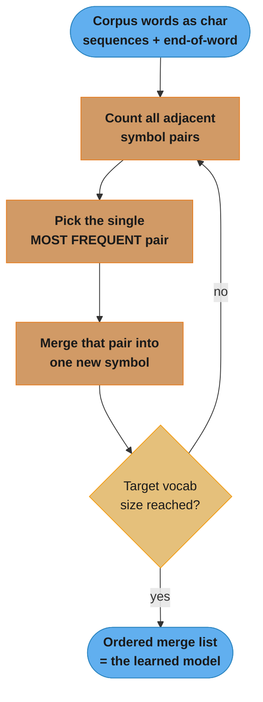
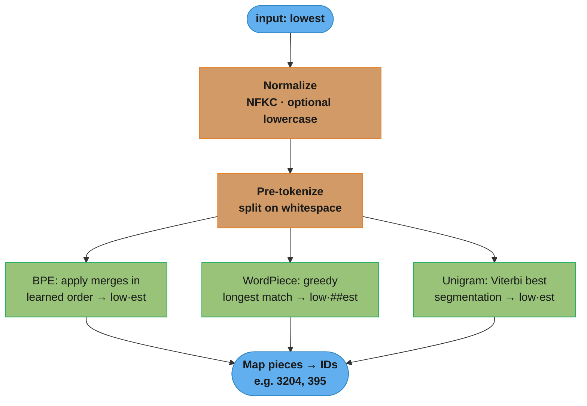
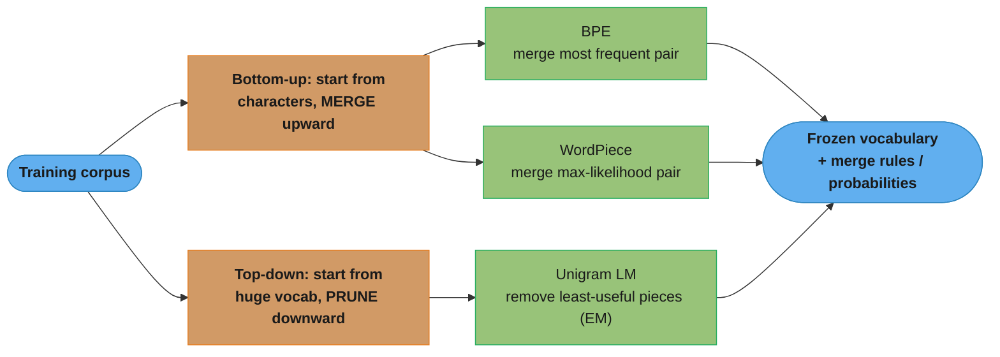
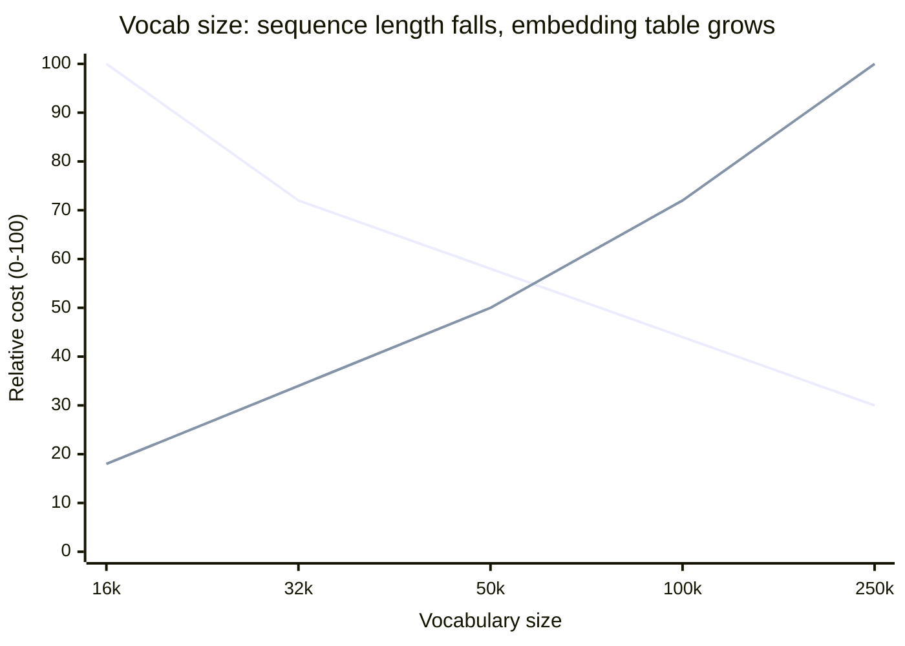
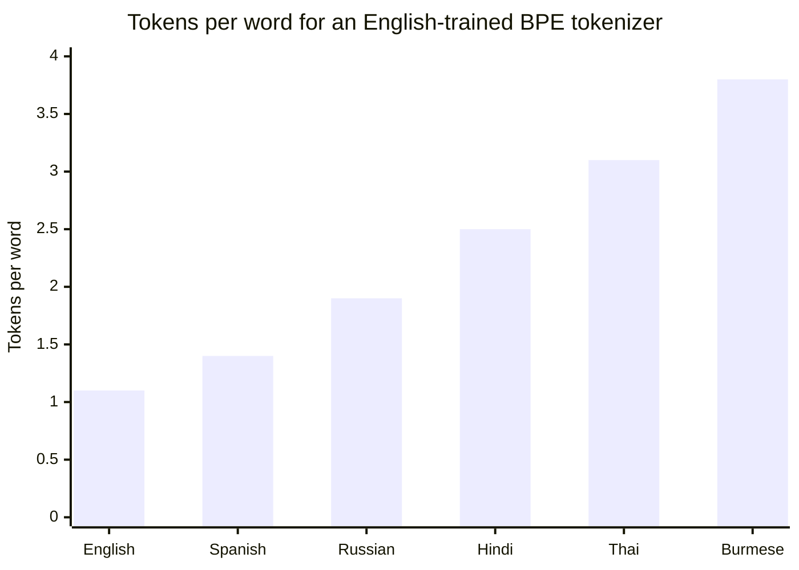

# Tokenization Deep Dive (BPE, WordPiece, Unigram, SentencePiece)

> This file is a deep-dive sub-file of the [Natural Language Processing](README.md) module.
> It covers subword tokenization algorithms (BPE, WordPiece, Unigram LM), byte-level and
> SentencePiece variants, vocabulary sizing, normalization, and train/inference parity.
> The same tokenizers power modern LLMs — see `llm/tokenization_and_embeddings/` for how
> tokenization interacts with context windows, embeddings, and inference cost.

---

## 1. Concept Overview

Tokenization is the first transformation in every NLP pipeline: it converts a raw string into a sequence of integer IDs that a model can embed. It is also the most underestimated component. The choice of tokenizer fixes the model's vocabulary, determines its out-of-vocabulary (OOV) behavior, controls how many tokens a given text consumes (and therefore compute and cost), and silently encodes assumptions about language, casing, and whitespace.

There are three families:

1. **Word-level**: split on whitespace/punctuation. Simple, but the vocabulary explodes (English has ~1M word forms; morphologically rich languages far more), and any unseen word maps to a single `<UNK>` token, destroying information.
2. **Character-level**: vocabulary is tiny (~100s of symbols) and there is no OOV, but sequences become very long and each token carries little meaning, so models must learn composition from scratch.
3. **Subword-level**: the modern default. Frequent words stay whole ("the", "running"); rare words split into meaningful pieces ("tokenization" -> "token" + "ization"); truly novel strings fall back to characters or bytes. This bounds vocabulary size while eliminating hard OOV.

The dominant subword algorithms are **Byte-Pair Encoding (BPE)**, **WordPiece**, and the **Unigram language model**, usually delivered through the **SentencePiece** or **HuggingFace tokenizers** libraries. Understanding how they differ — and how they fail — is a core senior NLP skill, because a tokenizer mismatch produces silent, hard-to-debug correctness bugs.

---

## 2. Intuition

One-line analogy: a subword tokenizer is a compression codebook for text. Common strings get short codes (one token); rare strings get spelled out from smaller pieces.

Mental model: imagine you must transmit English using a fixed dictionary of 30,000 entries. You would not store every word — you would store common whole words plus reusable fragments ("un-", "-ing", "-tion") so you can reconstruct anything. BPE builds that dictionary by greedily merging the most frequent adjacent pieces; Unigram builds it by starting huge and pruning the least useful pieces.

Why it matters: tokenization sits on the critical path of every request. A tokenizer that needs 1.4 tokens per word ("fertility" 1.4) versus 1.1 makes sequences ~27% longer — directly increasing latency, memory, and (for paid APIs) cost, while shrinking how much real content fits in a fixed context window.

Key insight: there is no "UNK" in a well-built byte-level tokenizer. By falling back to the 256 raw bytes, it can encode any string in any language, emoji, or binary blob — so OOV becomes "more tokens," never "lost information."

---

## 3. Core Principles

1. **Bound the vocabulary, eliminate hard OOV.** Subword units cap the embedding table (typically 30k-100k rows) while guaranteeing every input is representable.
2. **Frequency drives granularity.** Frequent sequences become single tokens; rare ones fragment. This concentrates model capacity where data is.
3. **Tokenization is learned from a corpus, then frozen.** The merge rules / vocabulary are fit once on training data and must be identical at train and inference time. The tokenizer is part of the model artifact.
4. **Normalization happens before segmentation.** Unicode NFKC, optional lowercasing, and whitespace handling change the byte stream the algorithm sees, so they must also be frozen with the tokenizer.
5. **Pieces are not morphemes.** Subword boundaries are statistical, not linguistic. "tokenization" might split as "token"+"ization" or "tok"+"eni"+"zation" depending on corpus frequencies — do not over-interpret them.

---

## 4. Types / Architectures / Strategies

### 4.1 Algorithm comparison

| Algorithm | Build direction | Merge/score criterion | Used by | Tokenizer at inference |
|-----------|-----------------|-----------------------|---------|------------------------|
| BPE | Bottom-up (merge) | Most frequent adjacent pair | GPT-2/3/4, RoBERTa, LLaMA (byte BPE) | Apply learned merges in order |
| WordPiece | Bottom-up (merge) | Pair that maximizes corpus likelihood (`freq(ab) / (freq(a)·freq(b))`) | BERT, DistilBERT, ELECTRA | Greedy longest-match-first |
| Unigram LM | Top-down (prune) | Remove pieces whose removal least hurts corpus likelihood | T5, ALBERT, XLNet, mBART | Viterbi most-likely segmentation |

### 4.2 Pre-tokenization and the whitespace marker

Before subword segmentation, most tokenizers split on whitespace/punctuation (pre-tokenization). Because whitespace itself carries information ("newyork" vs "new york"), tokenizers mark word boundaries:

- WordPiece marks **continuation** with `##`: `playing` -> `play`, `##ing`.
- BPE/SentencePiece mark a **leading space** with `Ġ` (byte-BPE) or `▁` (U+2581, SentencePiece): `Ġplaying` means " playing" with a preceding space.

This is why `"hello"` and `" hello"` can tokenize differently — a frequent source of subtle bugs.

### 4.3 Byte-level vs character-level fallback

- **Character BPE**: unknown characters (rare CJK, emoji) can still hit `<UNK>` if not in the base alphabet.
- **Byte-level BPE** (GPT-2 onward): the base alphabet is the 256 possible bytes, so *every* UTF-8 string is encodable with zero OOV. The cost is that non-ASCII characters consume 2-4 tokens each.

### 4.4 SentencePiece: language-agnostic, raw-stream

SentencePiece treats input as a raw Unicode stream including spaces (encoded as `▁`), with no language-specific pre-tokenization. This makes it ideal for languages without whitespace word boundaries (Chinese, Japanese, Thai) and for fully reversible detokenization. It can train either BPE or Unigram under the hood.

---

## 5. Architecture Diagrams

### BPE Training — the Merge Loop



Worked trace on corpus `low×5, lower×2, newest×6, widest×3`: `("e","s")` appears 9 times → merge `es`; then `("es","t")`=9 → `est`; then `("l","o")`=7 → `lo`; and so on. The merges are recorded in order — that ordered list is the entire BPE model.

**Read it like this.** "Count every adjacent pair in the corpus, glue the single most common one together, and repeat — the ordered list of winners *is* the model."

There is no objective function and no gradient here. BPE is pure greedy counting, which is why it trains in minutes on gigabytes of text and why its output is fully reproducible from the corpus alone.

| Symbol | What it is |
|--------|------------|
| `low x 5` | A word *type* and its corpus frequency; all 5 occurrences merge together |
| `("e","s")` | One adjacent symbol pair — a merge candidate |
| `count(pair)` | Sum of the frequencies of every word containing it, **not** a count of word types |
| merge rank | Position in the ordered output list; rank 0 is applied first at encode time |
| `</w>` | End-of-word marker used in the §6 code; omitted in this trace to match the prose |

**Walk one example.** Four merges on the toy corpus, with the pair counts that decide each one:

```
  corpus: 16 word occurrences, 79 symbols to start

    l o w        x5
    l o w e r    x2
    n e w e s t  x6
    w i d e s t  x3

  merge 1  counts: ("e","s")=9  ("s","t")=9  ("w","e")=8  ("l","o")=7  ("o","w")=7
           9 = newest(6) + widest(3)        -> merge es    symbols 79 -> 70
           l o w    l o w e r    n e w es t    w i d es t

  merge 2  counts: ("es","t")=9  ("l","o")=7  ("o","w")=7  ("e","w")=6  ("n","e")=6
           the symbol just created wins now  -> merge est   symbols 70 -> 61
           l o w    l o w e r    n e w est    w i d est

  merge 3  counts: ("l","o")=7  ("o","w")=7  ("e","w")=6  ("n","e")=6  ("w","est")=6
           7 = low(5) + lower(2)             -> merge lo    symbols 61 -> 54
           lo w     lo w e r    n e w est    w i d est

  merge 4  counts: ("lo","w")=7  ("e","w")=6  ("n","e")=6  ("w","est")=6
                                             -> merge low   symbols 54 -> 47
           low      low e r     n e w est    w i d est

  After 4 merges: 79 -> 47 symbols, a 40.5% shrink; 4.94 -> 2.94 symbols per word.

  Merge 5 is a THREE-WAY TIE at 6 -- ("e","w"), ("n","e"), ("w","est") -- and the
  implementation's tie-break picks the winner. Ties are exactly why two BPE
  trainers can disagree on the same corpus and still both be "correct".
```

**Why the order is the artifact, not a detail.** Each merge changes the counts for the next round: after `es` exists, the pair `("es","t")` is created out of nothing and immediately wins. That dependency chain means the merge list is only meaningful read front-to-back — reorder it and rank 3 fires before the symbol it needs even exists, so the same text segments differently (§12, first question).

### Applying a Tokenizer at Inference



Normalization and pre-tokenization are frozen with the tokenizer and run before any segmentation. The three algorithms then diverge on HOW they segment — replay ranked merges (BPE), greedy longest-match with `##` markers (WordPiece), or most-probable Viterbi split (Unigram) — but all end at the same integer IDs.

### The Three Algorithm Families — Build Direction



BPE and WordPiece both grow the vocabulary bottom-up by merging (differing only in the merge criterion — frequency vs likelihood ratio), while Unigram starts with a huge candidate set and prunes it top-down. Same goal, opposite directions (§4.1).

### Vocabulary-Size Tradeoff



The two curves cross: the descending line is sequence length (fewer, longer tokens as vocab grows → less attention compute), the ascending line is the embedding + output-softmax table size (grows linearly with vocab). Monolingual models settle near 32k-50k; heavily multilingual ones push to 100k-250k to keep fertility low (§4.1, §8).

**What the formula is telling you.** "Every extra vocabulary row costs you `d_model` parameters permanently, while every token it saves you costs nothing at all once training is done."

The ascending curve is the arithmetic `V × d_model`; the descending curve is `L ∝ fertility`, and attention pays `L²`. That squared term is the whole reason the crossover exists rather than the vocab simply being as small as possible.

| Symbol | What it is |
|--------|------------|
| `V` | Vocabulary size — the number of rows in the embedding table |
| `d_model` | Hidden width of the model; each vocab row is a vector of this length |
| `V × d_model` | Parameters in the input embedding table |
| `2 × V × d_model` | Total when the output softmax is a separate, untied matrix |
| fertility | Tokens per word — what actually sets sequence length `L` for fixed text |
| `L²` | Attention cost, which is why saving tokens pays back superlinearly |

**Walk one example.** A 7B-class model, `d_model = 4096`, sweeping the vocab sizes on the chart:

```
  V        V x d_model     fp16 bytes    untied (x2)    share of a 7B budget
  16k         65.5 M         131 MB        131.1 M           0.94%
  32k        131.1 M         262 MB        262.1 M           1.87%
  50k        205.9 M         412 MB        411.7 M           2.94%
  100k       409.6 M         819 MB        819.2 M           5.85%
  250k      1024.0 M        2048 MB       2048.0 M          14.63%

  The trade, stated as one decision -- go from 32k to 128k:

    parameters added   (128000 - 32000) x 4096 = 393.2 M   (1.87% -> 7.49% of 7B)
    fertility falls    1.4 -> 1.1 tokens/word
    sequence length    1.1 / 1.4 = 0.786          -> 21.4% shorter
    attention work     1 - 0.786^2 = 0.383        -> 38.3% less

  You buy a 38.3% cut in attention compute on EVERY token of EVERY request
  with a one-time 5.6-percentage-point increase in parameter count.
```

That asymmetry — one-time parameter cost against per-request compute savings — is why large multilingual models keep pushing vocab upward, and why a 250k vocab still stops short: at 14.63% of the budget the embedding table starts competing with the layers that do the actual reasoning.

### Fertility Tax Across Languages



A tokenizer whose merges were learned mostly on English has few multi-character pieces for other scripts, so the same meaning fragments into 2-4x more tokens — directly raising latency, cost, and effective context loss for under-represented languages (§7).

**Stated plainly.** "Fertility is just tokens divided by words — and because you are billed per token and your context window is measured in tokens, it is simultaneously an exchange rate on price and a divisor on how much you can say."

| Symbol | What it is |
|--------|------------|
| fertility `f` | Tokens emitted ÷ words in the text, measured on *your* data with *your* tokenizer |
| `f_other / f_en` | The tokenization tax — how many times more tokens the same meaning costs |
| `f × words` | Sequence length for a fixed passage |
| `C / f` | Words of real content that fit in a `C`-token context window |

**Walk one example.** The same 1,000-word passage, translated, through one English-trained BPE tokenizer, with an 8,192-token window:

```
  language    fertility    tokens    tax vs English    words fitting in 8,192 tokens
  English        1.1        1100         1.00x                  7447
  Spanish        1.4        1400         1.27x                  5851
  Russian        1.9        1900         1.73x                  4311
  Hindi          2.5        2500         2.27x                  3276
  Thai           3.1        3100         2.82x                  2642
  Burmese        3.8        3800         3.45x                  2155

  Read the Spanish row against the English row: 1.4 / 1.1 = 1.27, the same
  "~27% longer" figure quoted in Section 2.

  Read the Burmese row: identical meaning, identical per-token price, but
  3.45x the bill AND 3.45x less of the window available for actual content.
  Neither number appears anywhere in the model's accuracy metrics.
```

The tax compounds in a way a single ratio hides: the Burmese user pays 3.45x more *and* hits the truncation limit 3.45x sooner, so their long documents get cut while an English user's do not. That is why fertility, not accuracy, is the headline fairness metric for a multilingual tokenizer.

---

## 6. How It Works — Detailed Mechanics

### BPE from scratch (training)

```python
from collections import Counter
from typing import Dict, List, Tuple


def get_pair_counts(vocab: Dict[Tuple[str, ...], int]) -> Counter:
    """Count frequency of each adjacent symbol pair across the corpus."""
    pairs: Counter = Counter()
    for symbols, freq in vocab.items():
        for i in range(len(symbols) - 1):
            pairs[(symbols[i], symbols[i + 1])] += freq
    return pairs


def merge_pair(
    vocab: Dict[Tuple[str, ...], int], pair: Tuple[str, str]
) -> Dict[Tuple[str, ...], int]:
    """Replace every occurrence of `pair` with its concatenation."""
    merged: Dict[Tuple[str, ...], int] = {}
    a, b = pair
    for symbols, freq in vocab.items():
        new_symbols: List[str] = []
        i = 0
        while i < len(symbols):
            if i < len(symbols) - 1 and symbols[i] == a and symbols[i + 1] == b:
                new_symbols.append(a + b)
                i += 2
            else:
                new_symbols.append(symbols[i])
                i += 1
        merged[tuple(new_symbols)] = freq
    return merged


def train_bpe(corpus: Dict[str, int], num_merges: int) -> List[Tuple[str, str]]:
    """
    corpus: {word: frequency}. Returns ordered list of learned merges.
    Each word starts as a tuple of characters plus an end-of-word marker.
    """
    vocab: Dict[Tuple[str, ...], int] = {
        tuple(word) + ("</w>",): freq for word, freq in corpus.items()
    }
    merges: List[Tuple[str, str]] = []
    for _ in range(num_merges):
        pairs = get_pair_counts(vocab)
        if not pairs:
            break
        best = max(pairs, key=pairs.get)   # most frequent adjacent pair
        vocab = merge_pair(vocab, best)
        merges.append(best)
    return merges


if __name__ == "__main__":
    corpus = {"low": 5, "lower": 2, "newest": 6, "widest": 3}
    merges = train_bpe(corpus, num_merges=10)
    print(merges)
    # [('e', 's'), ('es', 't'), ('l', 'o'), ('lo', 'w'), ('n', 'e'), ...]
```

### Applying learned BPE merges (encoding)

```python
from typing import List, Tuple


def encode_bpe(word: str, merges: List[Tuple[str, str]]) -> List[str]:
    """Apply merges in the order they were learned (rank = priority)."""
    symbols: List[str] = list(word) + ["</w>"]
    rank = {pair: i for i, pair in enumerate(merges)}

    while True:
        # find the highest-priority (lowest-rank) adjacent pair present
        candidate, best_rank = None, len(merges)
        for i in range(len(symbols) - 1):
            pair = (symbols[i], symbols[i + 1])
            if pair in rank and rank[pair] < best_rank:
                candidate, best_rank = pair, rank[pair]
        if candidate is None:
            break
        # merge every occurrence of the chosen pair
        a, b = candidate
        merged, i = [], 0
        while i < len(symbols):
            if i < len(symbols) - 1 and symbols[i] == a and symbols[i + 1] == b:
                merged.append(a + b)
                i += 2
            else:
                merged.append(symbols[i])
                i += 1
        symbols = merged
    return symbols
```

The critical detail: **BPE applies merges in learned order**, so the merge ranks are part of the artifact. Ship the wrong merge file and identical text produces different tokens.

### WordPiece scoring vs BPE

BPE merges the most *frequent* pair. WordPiece instead merges the pair that most increases corpus likelihood, which is the pair maximizing:

```
score(a, b) = freq(a, b) / (freq(a) * freq(b))
```

This prefers merging pieces that occur together more often than chance would predict, so it favors statistically "bound" pairs over merely frequent ones. At inference, WordPiece does **greedy longest-match-first** from the start of each word, emitting `##` continuations.

**In plain terms.** "Do not merge the pair you see most often — merge the pair that would be most *surprised* to be seen apart."

| Symbol | What it is |
|--------|------------|
| `freq(a, b)` | How often `a` is immediately followed by `b` — the observed pair count |
| `freq(a)`, `freq(b)` | How often each piece occurs anywhere, independent of the other |
| `freq(a) * freq(b)` | The denominator: roughly what the pair count would be *by chance* |
| the whole ratio | Observed ÷ expected — pointwise mutual information with the log stripped off |
| `##` | Inference-side marker that a piece continues the previous one, not a training term |

**Walk one example.** The same toy corpus BPE trained on in §5, scored both ways:

```
  corpus: low x5  lower x2  newest x6  widest x3
  character counts: l=7  o=7  w=16  e=17  r=2  n=6  s=9  t=9  i=3  d=3

  pair        freq(a,b)  freq(a)  freq(b)  count rank   score = ab / (a * b)
  ("e","s")       9        17        9       1st        9 / (17 * 9) = 0.0588
  ("s","t")       9         9        9       1st (tie)  9 / ( 9 * 9) = 0.1111
  ("w","e")       8        16       17       3rd        8 / (16 *17) = 0.0294
  ("l","o")       7         7        7       4th        7 / ( 7 * 7) = 0.1429
  ("i","d")       3         3        3       8th        3 / ( 3 * 3) = 0.3333  <- wins

  BPE picks ("e","s")  -- it is simply the most frequent pair, count 9.
  WordPiece picks ("i","d") -- count only 3, but i and d appear 3 times each and
  ALWAYS together, so the merge destroys no information and buys a piece whose
  behaviour is fully predictable.

  ("w","e") is the instructive loser: count 8, nearly the most frequent, but it
  scores WORST (0.0294) because w and e are both everywhere. Seeing them adjacent
  is what you would expect by chance, so merging them teaches the model nothing.
```

**Why the denominator has to be there.** Delete `freq(a) * freq(b)` and the score collapses to `freq(a,b)` — WordPiece becomes BPE exactly. The denominator is what converts "common" into "informative": it penalises pairs made of already-ubiquitous pieces and rewards pairs that are genuinely bound. In practice this is why BERT's vocabulary contains many morpheme-like pieces (`##ization`, `##able`) rather than the most frequent character bigrams of English.

### Unigram language model (pruning + Viterbi)

```python
# Conceptual sketch of Unigram LM tokenization (the SentencePiece default).
# Training:
#   1. Seed a large candidate vocabulary (e.g. all substrings up to length k).
#   2. Assign each piece a probability via EM (maximize corpus likelihood).
#   3. Iteratively REMOVE the ~20% of pieces whose deletion least reduces
#      likelihood, until the target vocab size is reached.
# Encoding (inference):
#   Use Viterbi to find the segmentation with the highest product of piece
#   probabilities -> the single most likely split.
#
# Unigram supports "subword regularization": sample alternative segmentations
# during training as data augmentation (improves robustness ~0.5-1 BLEU on MT).
```

**What it means.** "Give every candidate piece a probability, score a whole split by multiplying its pieces' probabilities, keep the best split — then delete whichever pieces the best splits never actually needed."

| Symbol | What it is |
|--------|------------|
| `p(piece)` | Unigram probability of a piece, fit by EM; all pieces sum to 1 |
| `P(seg)` | Product of its pieces' probabilities — the "unigram" assumption is that pieces are independent |
| `log P(seg)` | The same score written as a sum, which is what Viterbi actually accumulates |
| corpus loss | `-Σ_x log P(best segmentation of x)` — the quantity EM minimises |
| `loss(piece)` | Rise in corpus loss if that piece were deleted — the pruning criterion |
| Viterbi | Dynamic program over character positions; `O(n × max_piece_len)`, not exponential |
| EM | Expectation-Maximization: re-estimate `p(piece)` from how often the best splits use it |

**Walk one example.** Segmenting `lowest` against a toy piece vocabulary whose probabilities sum to 1.0:

```
  low 0.30   est 0.25   e 0.10   s 0.09   w 0.08   t 0.07   lo 0.06   we 0.03   o 0.02

  candidate segmentations of "lowest"
    low | est          0.30 * 0.25                  = 0.075000    log = -2.590
    lo  | w   | est    0.06 * 0.08 * 0.25           = 0.001200    log = -6.725
    low | e   | s | t  0.30 * 0.10 * 0.09 * 0.07    = 0.000189    log = -8.574
    lo  | we  | s | t  0.06 * 0.03 * 0.09 * 0.07    = 0.000011    log = -11.387

  Viterbi returns the top row, low|est -- 62.5x more likely than the runner-up.
  Note it does NOT simply take the longest first piece: it compares whole-word
  products, which is the difference from WordPiece's greedy longest-match.

  Now the PRUNING criterion -- how much would deleting each piece hurt?
    delete "lo"   -> best split is still low|est     log stays  -2.590   loss = 0.000
    delete "est"  -> best split becomes low|e|s|t    log falls  -8.574   loss = 5.984

  "lo" is free to prune; "est" is load-bearing. Each round Unigram computes this
  loss for every piece, drops the worst ~20%, re-runs EM on what remains, and
  repeats until the vocabulary hits its target size.
```

**Why probabilities, and not just counts.** Because Unigram carries a real distribution over segmentations, it can *sample* from it rather than always taking the argmax — that is subword regularization, and it is impossible for BPE and WordPiece, which have only a deterministic rule and no notion of "the second-best split is 62.5x less likely." The same distribution is what makes pruning principled: the loss above is measured in nats of corpus likelihood, a comparable currency across every candidate piece.

### Using a production tokenizer

```python
from transformers import AutoTokenizer

bert = AutoTokenizer.from_pretrained("bert-base-uncased")      # WordPiece
gpt2 = AutoTokenizer.from_pretrained("gpt2")                   # byte-level BPE

text = "Tokenization isn't trivial."
print(bert.tokenize(text))
# ['token', '##ization', 'isn', "'", 't', 'trivial', '.']
print(gpt2.tokenize(text))
# ['Token', 'ization', 'Ġisn', "'t", 'Ġtrivial', '.']   (Ġ marks a leading space)

print(len(gpt2.encode("café")), "tokens for 'café'")
# 'é' is 2 UTF-8 bytes -> byte-level BPE may use 2-3 tokens for one accented char
```

### Training a custom tokenizer

```python
from tokenizers import Tokenizer, models, trainers, pre_tokenizers

def train_custom_bpe(files: list[str], vocab_size: int = 32_000) -> Tokenizer:
    tok = Tokenizer(models.BPE(unk_token="[UNK]"))
    tok.pre_tokenizer = pre_tokenizers.ByteLevel(add_prefix_space=True)
    trainer = trainers.BpeTrainer(
        vocab_size=vocab_size,
        special_tokens=["[PAD]", "[UNK]", "[CLS]", "[SEP]", "[MASK]"],
        min_frequency=2,
    )
    tok.train(files, trainer)
    return tok
```

---

## 7. Real-World Examples

**GPT-2/3/4 (byte-level BPE, `tiktoken`):** ~50k vocabulary over raw bytes, so any string is encodable with no `<UNK>`. The trade-off is visible in pricing: non-English text and code use more tokens per character, so the same content costs more in languages like Thai or Telugu than in English.

**BERT (WordPiece, 30k vocab):** lowercased `bert-base-uncased` splits `"unaffordable"` -> `["una", "##fford", "##able"]`. The `##` continuation markers let the model reconstruct word boundaries.

**LLaMA / T5 (SentencePiece):** treat text as a raw stream with `▁` for spaces, enabling clean multilingual handling and lossless detokenization (no Python-side join heuristics).

**Multilingual fertility gap:** a tokenizer trained mostly on English assigns ~1.1 tokens/word in English but 2-4 tokens/word in Hindi or Burmese. This "tokenization tax" both raises cost and shrinks effective context for under-represented languages — a documented fairness concern, and the reason multilingual models (mBERT, XLM-R, BLOOM) train tokenizers on balanced multilingual corpora.

**Code models (StarCoder, Code Llama):** add tokens for indentation runs and common code patterns; a tokenizer that wastes tokens on `\n    ` (newline + 4 spaces) inflates every Python file by 20-40%.

---

## 8. Tradeoffs

| Dimension | Word-level | Character-level | Subword (BPE/WP/Unigram) |
|-----------|-----------|-----------------|--------------------------|
| Vocab size | Huge (100k-1M+) | Tiny (~100-300) | Bounded (16k-100k) |
| OOV behavior | Hard `<UNK>` | None | None (byte fallback) |
| Sequence length | Short | Very long | Moderate |
| Per-token meaning | High | Very low | Medium-high |
| Morphology | Poor | Implicit | Good |

| Dimension | BPE | WordPiece | Unigram LM |
|-----------|-----|-----------|------------|
| Merge criterion | Frequency | Likelihood ratio | Likelihood-pruning |
| Determinism | Single segmentation | Single (greedy) | Best Viterbi (can sample) |
| Subword regularization | No (native) | No | Yes |
| Multilingual no-whitespace | Needs byte-level | Needs pre-tok | Native (SentencePiece) |

| Vocab size | Sequence length | Embedding table | Notes |
|-----------|-----------------|-----------------|-------|
| 16k | Longer | Small | More fragments, cheaper embeddings |
| 32k | Balanced | Medium | Common default (BERT, LLaMA-1) |
| 100k+ | Shorter | Large | Fewer tokens/word, bigger softmax/embedding cost |

---

## 9. When to Use / When NOT to Use

### Use subword tokenization when

- Training or fine-tuning any transformer (it is effectively mandatory).
- The domain has rich morphology, compounds, or frequent novel strings (chemistry, code, biomedical).
- You need guaranteed coverage of arbitrary input including emoji and mixed scripts (use byte-level).

### Prefer a custom-trained tokenizer when

- Your domain vocabulary is far from the pretrained tokenizer's corpus (e.g. genomic sequences, source code, a non-English language), and fertility on your data is high (>1.6 tokens/word).

### Reuse the pretrained tokenizer (do NOT retrain) when

- You are fine-tuning an existing model — the tokenizer is tied to the learned embeddings; swapping it invalidates them.
- Your data distribution is close to the original corpus; a custom tokenizer adds risk for marginal gains.

### Consider word/character level only when

- Word-level: small closed-vocabulary classical pipelines (TF-IDF already does this).
- Character-level: tasks where spelling is the signal (language ID, some morphological tagging).

---

## 10. Common Pitfalls

### Pitfall 1: Train/inference tokenizer mismatch

```python
# BROKEN: model trained with the uncased WordPiece tokenizer,
# inference accidentally loads the cased one -> token IDs diverge -> garbage output
from transformers import AutoTokenizer
train_tok = AutoTokenizer.from_pretrained("bert-base-uncased")   # training
infer_tok = AutoTokenizer.from_pretrained("bert-base-cased")     # MISMATCH

# FIX: always save the tokenizer with the model checkpoint and load both
# from the same directory.
model.save_pretrained("./artifact")
train_tok.save_pretrained("./artifact")
infer_tok = AutoTokenizer.from_pretrained("./artifact")
```

Production incident pattern: a config typo points inference at a different tokenizer revision. There is no crash — IDs are valid, just wrong — so accuracy silently collapses while every health check passes.

### Pitfall 2: Silent truncation at max length

```python
# BROKEN: a 900-token contract truncated to 512; the operative clause is at the end
enc = tok(long_text, max_length=512, truncation=True)   # tokens 512-900 discarded

# FIX: sliding window with stride (mean/max-pool per-window outputs) or a
# long-context encoder. At minimum, log when truncation fires.
enc = tok(long_text, max_length=512, truncation=True, stride=128,
          return_overflowing_tokens=True)
```

A legal-NLP team shipped a model that ignored ~30% of every long document because the relevant text sat past token 512 — caught only after recall on long inputs cratered.

### Pitfall 3: Leading-space sensitivity in byte-level BPE

```python
# "hello" and " hello" tokenize differently in GPT-2 style tokenizers
gpt2.tokenize("hello")    # ['hello']
gpt2.tokenize(" hello")   # ['Ġhello']
# Concatenating pre-tokenized pieces without preserving spaces shifts every ID.
# FIX: tokenize whole strings, not manually-spliced fragments; use add_prefix_space
# consistently between training and inference.
```

### Pitfall 4: Counting characters instead of tokens for limits/cost

A 280-character tweet is not 280 tokens, and "4 chars per token" is only an English average. For code, JSON, or non-Latin scripts it can be 1-2 chars/token. Always measure with the actual tokenizer (`len(tok.encode(text))`) before enforcing a context or cost budget.

**The idea behind it.** "Characters-per-token is an exchange rate that moves with the content — quoting a context budget in characters is quoting it in the wrong currency."

| Symbol | What it is |
|--------|------------|
| `chars / tokens` | The observed exchange rate for one specific piece of text |
| 4 chars/token | The English-prose rule of thumb, and *only* that |
| `len(tok.encode(text))` | The only number a context limit or an invoice actually uses |
| headroom | `context_limit - prompt_tokens` — what is left over for the model's answer |

**Walk one example.** A 4,000-character input, budgeted with the rule of thumb as `4000 / 4 = 1000` tokens:

```
  content type              chars/token    actual tokens    vs the 1000 estimate
  English prose                 4.0            1000                1.00x
  minified JSON                 2.0            2000                2.00x
  Python with indentation       1.6            2500                2.50x
  Thai / Devanagari             1.2            3333                3.33x

  Now spend it in a 4,096-token window:

    planned    4096 - 1000 = 3096 tokens of headroom for the answer
    actual     4096 - 3333 =  763 tokens of headroom on the Thai input

  The answer gets truncated to a quarter of its intended length. No exception is
  raised, no health check fails, and the metric that moves is user complaints.
```

Note the failure is one-sided: the estimate is never *too high*, only too low, because 4 chars/token is an upper bound reached only by clean English prose. Any budget built on it silently over-commits on exactly the inputs — code, JSON, non-Latin scripts — where headroom matters most.

### Pitfall 5: Adding special tokens but forgetting to resize embeddings

```python
# BROKEN: new special tokens get IDs with no embedding rows -> index error / noise
tok.add_special_tokens({"additional_special_tokens": ["[ENTITY]"]})

# FIX: resize the model's embedding table to match the new vocab size
model.resize_token_embeddings(len(tok))
```

---

## 11. Technologies & Tools

| Tool | Use Case | Notes |
|------|----------|-------|
| HuggingFace `tokenizers` | Fast BPE/WordPiece/Unigram training + inference | Rust-backed, ~100x faster than pure Python |
| `transformers.AutoTokenizer` | Load the exact tokenizer for any model | Ties tokenizer to checkpoint |
| SentencePiece | Language-agnostic BPE/Unigram, raw stream | Used by T5, LLaMA, mBART |
| `tiktoken` | OpenAI's byte-level BPE | Fast token counting for GPT models |
| `subword-nmt` | Original BPE implementation (Sennrich 2016) | Reference for MT pipelines |
| spaCy / Moses | Pre-tokenization, detokenization | Word/punct splitting before subword |

---

## 12. Interview Questions with Answers

**Q: Why must BPE apply its merges in the exact order they were learned, and what breaks if you do not?**
Merge rank is priority: applying merges out of order produces different, wrong token boundaries for the same text, so the ordered merge list is part of the model artifact and must ship with it. BPE encoding repeatedly applies the highest-ranked (earliest-learned) applicable merge, so `es` before `est` before `lo` is not arbitrary — it reconstructs the training-time segmentation. If you ship a reordered or truncated merge file, identical input yields different IDs and the model silently degrades, with no crash to alert you.

**Q: Why can two tokenizers with the same vocabulary size still produce different token counts on the same text?**
Because the segmentation algorithm and the specific pieces kept differ, so a BPE, WordPiece, and Unigram tokenizer of equal vocab size split the same string into different numbers of pieces. Vocab size only bounds the table; which 32k pieces you keep depends on frequency (BPE), likelihood ratio (WordPiece), or likelihood-pruning (Unigram), and how you segment depends on ranked-merge replay vs greedy-longest-match vs Viterbi. This is why you must measure fertility with the actual tokenizer rather than assuming equal-vocab tokenizers cost the same.

**Q: Why do modern models use subword tokenization instead of word-level?**
Word-level tokenization forces an enormous vocabulary and still cannot represent unseen words, mapping them to a single `<UNK>` token that destroys information. Subword tokenization caps the vocabulary (typically 30k-100k) while guaranteeing any input is representable by falling back to smaller pieces or bytes. It also shares parameters across morphologically related words ("run", "running", "runner" share the "run" piece), which improves generalization and handles rare/novel strings gracefully.

**Q: Explain BPE training in one paragraph.**
Start with each word as a sequence of characters (plus an end-of-word marker). Count all adjacent symbol pairs across the corpus, merge the single most frequent pair into a new symbol, and repeat. Each merge adds one entry to the vocabulary; the ordered list of merges is the learned model. After `vocab_size - base_alphabet` merges you stop. At inference you re-apply those merges in the same learned order, so frequent sequences collapse into single tokens and rare ones stay fragmented.

**Q: How does WordPiece differ from BPE?**
Both are bottom-up merge algorithms, but they choose merges differently. BPE merges the most *frequent* adjacent pair. WordPiece merges the pair that maximizes corpus likelihood, scoring `freq(a,b) / (freq(a)·freq(b))`, which favors pairs that co-occur more than chance rather than merely frequent ones. At inference WordPiece does greedy longest-match-first segmentation and marks continuation pieces with `##`, whereas BPE replays its ranked merge list.

**Q: How does the Unigram language model tokenizer work, and how is it different?**
Unigram is top-down. It seeds a large candidate vocabulary, assigns each piece a probability via EM to maximize corpus likelihood, then iteratively prunes the pieces whose removal least hurts likelihood until it reaches the target size. At inference it uses Viterbi to pick the single most probable segmentation. Unlike BPE/WordPiece it can also *sample* alternative segmentations (subword regularization), which acts as data augmentation and improves robustness.

**Q: What is byte-level BPE and why is it useful?**
Byte-level BPE (introduced with GPT-2) uses the 256 possible bytes as the base alphabet instead of Unicode characters. Because every UTF-8 string decomposes into bytes, there is no possible OOV — any text, emoji, or even binary is encodable. The cost is that non-ASCII characters span multiple bytes and therefore consume 2-4 tokens each, inflating sequence length for non-English text.

**Q: What is the `##` prefix in BERT's tokens and the `Ġ`/`▁` marker in GPT/SentencePiece?**
They encode word-boundary/whitespace information. WordPiece uses `##` to mark a *continuation* piece (`play`, `##ing` reconstructs "playing"). Byte-level BPE uses `Ġ` to mark a piece that was preceded by a space, and SentencePiece uses `▁` (U+2581) for the same purpose. Without these markers, detokenization could not tell "newyork" from "new york."

**Q: Why can "hello" and " hello" produce different token IDs?**
In byte-level BPE and SentencePiece, the leading space is part of the token. " hello" becomes a single `Ġhello`/`▁hello` token, while "hello" at the start of a string has no leading space and tokenizes as `hello`. This matters when you splice pre-tokenized fragments together: dropping or adding spaces shifts the IDs and can degrade model output.

**Q: How does vocabulary size trade off against sequence length and model size?**
A larger vocabulary means more text fits in each token, so sequences are shorter (less attention compute, which is quadratic in length) — but the embedding and output-softmax tables grow linearly with vocab size, adding parameters and memory. A smaller vocabulary shrinks those tables but fragments text into more tokens, lengthening sequences. Common practice lands at 32k-50k for monolingual and 100k-250k for heavily multilingual models.

**Q: What is tokenizer "fertility" and why does it matter?**
Fertility is the average number of tokens per word (or per character) the tokenizer produces on a given text. High fertility means longer sequences, which increase latency, memory, and API cost while reducing how much real content fits in a fixed context window. A tokenizer trained mostly on English has low fertility on English (~1.1) but high fertility (2-4) on under-represented languages — both a cost and a fairness issue.

**Q: A fine-tuned model gives nonsense in production but worked in evaluation. Tokenization is suspect — how do you debug?**
First confirm the inference tokenizer is byte-for-byte identical to the training one (same name, revision, casing, special tokens) — load both from the saved artifact, not from a hub name. Encode a known sentence with both and diff the IDs. Check normalization settings (lowercasing, NFKC), `add_prefix_space`, and whether special tokens were added after training without `resize_token_embeddings`. A mismatch produces valid-but-wrong IDs, so there is no crash — only silently wrong outputs.

**Q: Should you train a custom tokenizer or reuse a pretrained one?**
Reuse the pretrained tokenizer whenever you fine-tune an existing model — it is bound to the learned embeddings, so replacing it invalidates them. Train a custom tokenizer only when pretraining from scratch or when your domain is far from the original corpus (code, genomics, a non-English language) and measured fertility is high (>1.6 tokens/word). Even then, you must train the model embeddings to match, so a custom tokenizer implies a (re)training budget.

**Q: How do you add domain-specific or special tokens to an existing tokenizer safely?**
Use `add_tokens` / `add_special_tokens`, then immediately call `model.resize_token_embeddings(len(tokenizer))` so the embedding and output layers gain rows for the new IDs. New tokens start with random embeddings, so they need fine-tuning data to become useful. Adding too many rare tokens wastes capacity; reserve this for high-frequency domain markers (e.g. `[ENTITY]`, code keywords).

**Q: Why does the same English sentence cost more tokens in some non-Latin languages?**
The tokenizer's merges were learned mostly from English-heavy data, so it has few multi-character tokens for other scripts and falls back to byte- or character-level pieces. A Hindi or Thai sentence therefore fragments into many more tokens than its English translation. Multilingual models mitigate this by training the tokenizer on balanced multilingual corpora so common pieces exist for many scripts.

**Q: What is subword regularization and which algorithm supports it?**
Subword regularization samples among multiple valid segmentations of the same text during training instead of always using the single best one, acting as data augmentation that makes the model robust to tokenization ambiguity. The Unigram LM (via SentencePiece) supports it natively because it has a probability distribution over segmentations; BPE has a dropout variant (BPE-dropout) that randomly skips merges to achieve a similar effect. Gains are typically ~0.5-1 BLEU on low-resource translation.

**Q: How should you count tokens for a context-window or cost budget?**
Always run the actual model tokenizer: `len(tokenizer.encode(text))`. Character- or word-based estimates ("4 chars per token") are English averages that break badly on code, JSON, math, or non-Latin scripts where the ratio can be 1-2 chars/token. For OpenAI models use `tiktoken` with the model-specific encoding; for HF models use the model's own tokenizer.

**Q: Why is whitespace and newline handling important for code models?**
Code is dense with repeated whitespace (indentation, blank lines). A tokenizer that spends one token per space or per `\n    ` inflates every file by 20-40%, wasting context and compute. Code-oriented tokenizers add tokens for common indentation runs and language patterns, dramatically lowering fertility on source files and improving effective context length.

**Q: What is the difference between WordPiece's greedy longest-match and Unigram's Viterbi at inference?**
WordPiece greedily takes the longest vocabulary prefix at each position, while Unigram runs Viterbi to find the globally most probable segmentation. The greedy match is a fast local choice that never backtracks, so it can make a locally-optimal cut that leaves a worse overall split; Viterbi instead weighs whole-word piece-probability products and may prefer a shorter first piece when the total is more likely. This is also why Unigram can sample alternative segmentations (subword regularization) whereas greedy WordPiece cannot.

**Q: Why does character-level tokenization eliminate OOV but is rarely used for large models?**
Character tokenization has no OOV because its tiny alphabet covers everything, but it produces very long sequences where each token carries little meaning. Those long sequences make attention cost, which is quadratic in length, explode, and they force the model to learn word composition from scratch. A 10-character word becomes 10 tokens instead of 1-2 subwords, so context windows fill far faster and training is slower to converge. Subword tokenization is the practical middle ground — bounded vocabulary, no hard OOV via byte fallback, and moderate sequence length — which is why nearly all transformers use it.

---

## 13. Best Practices

1. Treat the tokenizer as part of the model artifact: save it with the checkpoint and load both from the same directory. Never reference a bare hub name in production.
2. Pin the tokenizer revision/hash; a silent upstream update can change IDs.
3. Measure fertility on a sample of your real data before fixing context/cost budgets; do not rely on character heuristics.
4. Log (and ideally alarm on) truncation events so silent information loss on long inputs is visible.
5. When fine-tuning, reuse the model's tokenizer unchanged; only add tokens when necessary and always `resize_token_embeddings` afterward.
6. For multilingual or no-whitespace languages, prefer SentencePiece (Unigram) for lossless, language-agnostic handling.
7. Validate train/inference parity with a golden test: a fixed list of strings whose expected token IDs are asserted in CI.
8. For new special tokens, give them descriptive names and verify they survive a save/load round-trip (some fast tokenizers normalize unexpectedly).

---

## 14. Case Study

**Scenario: a domain tokenizer for a Python code-search model.** A team fine-tunes an encoder to embed code snippets for semantic search over an internal monorepo. Using the off-the-shelf `bert-base-uncased` WordPiece tokenizer, they observe fertility of 2.3 tokens/word on code — identifiers like `getUserById` shatter into `get`, `##user`, `##by`, `##id`, and every 4-space indent costs a token. Sequences routinely blow past 512 tokens, truncating function bodies.

They train a custom byte-level BPE tokenizer on 5M lines of internal code.

```python
from tokenizers import Tokenizer, models, trainers, pre_tokenizers, decoders

def train_code_tokenizer(files: list[str], vocab_size: int = 50_000) -> Tokenizer:
    tok = Tokenizer(models.BPE(unk_token="[UNK]"))
    tok.pre_tokenizer = pre_tokenizers.ByteLevel(add_prefix_space=False)
    tok.decoder = decoders.ByteLevel()
    trainer = trainers.BpeTrainer(
        vocab_size=vocab_size,
        special_tokens=["[PAD]", "[UNK]", "[CLS]", "[SEP]", "[MASK]"],
        min_frequency=3,
        # seed the alphabet with indentation runs so they become single tokens
        initial_alphabet=pre_tokenizers.ByteLevel.alphabet(),
    )
    tok.train(files, trainer)
    return tok
```

**Result.** Fertility drops from 2.3 to 1.35 tokens/word on held-out code; the median snippet now fits in 380 tokens instead of 650, eliminating truncation for ~95% of functions. Because the model is trained from the new tokenizer's embeddings, the swap is safe — they did not try to bolt the new tokenizer onto pretrained `bert-base` weights.

**Put simply.** "The compression ratio is just new fertility over old — and since sequence length scales by exactly that factor, it is the single number that tells you whether the 512-token limit still bites."

| Symbol | What it is |
|--------|------------|
| `f_old`, `f_new` | Tokens per word before and after retraining the tokenizer (2.3 and 1.35 here) |
| `f_new / f_old` | The length multiplier applied to every sequence |
| `1 - f_new/f_old` | Fraction of tokens removed — the compression win |
| median tokens | The snippet-length statistic that decides whether truncation fires at 512 |

**Walk one example.** Pushing this project's two fertility numbers through:

```
  f_old = 2.3 tokens/word        f_new = 1.35 tokens/word

  length multiplier    1.35 / 2.3     = 0.587
  tokens removed       1 - 0.587      = 41.3%
  median snippet       650 x 0.587    = 381 tokens   (the reported 380, confirmed)

  Why that clears the limit -- the whole point of the exercise:
    before   median 650 > 512   the MEDIAN function was already being truncated
    after    median 381 < 512   131 tokens of headroom on the median function

  And the compute win is bigger than the token win, because attention is
  quadratic in length:
    (381 / 650)^2 = 0.344   ->   65.6% less attention work per snippet

  A 41.3% cut in tokens buys a 65.6% cut in attention compute.
```

The lesson to carry into an interview: fertility is not a cosmetic metric. It multiplies straight through into truncation rate (a correctness bug), attention cost (a latency and dollar figure), and effective context (a capability ceiling) — which is why the team tracks it as a dataset metric alongside label balance rather than as a tokenizer implementation detail.

**Broken -> fix encountered during the build:**

```python
# BROKEN: they first tried swapping only the tokenizer on a pretrained checkpoint
tokenizer = train_code_tokenizer(files)          # 50k new vocab
model = AutoModel.from_pretrained("bert-base-uncased")   # 30k-row embeddings
# -> token IDs 30000-49999 index out of range; the model never saw these pieces

# FIX: a new tokenizer requires (re)training the embedding table. Either pretrain
# from scratch with the new tokenizer, or resize + continue-pretrain on domain data.
model.resize_token_embeddings(len(tokenizer))
# then run masked-LM continued pretraining on the code corpus before fine-tuning
```

**Validation.** A golden CI test asserts token IDs for 50 canonical snippets so a future tokenizer change cannot silently shift embeddings. Fertility and truncation rate are tracked as dataset metrics, the same way the team tracks label balance.

**Interview discussion points.** Why fertility is the right headline metric for a code tokenizer; why you cannot reuse pretrained embeddings with a new vocabulary; how byte-level fallback guarantees coverage of arbitrary identifiers and Unicode in comments; and how train/inference parity is enforced as a test, not a hope.

---

## See Also

- [Natural Language Processing](README.md) — parent module (preprocessing, embeddings, BERT)
- [bert_and_pretrained_models.md](bert_and_pretrained_models.md) — WordPiece in BERT, fine-tuning, tokenizer/model parity
- [text_representation_and_retrieval.md](text_representation_and_retrieval.md) — how tokenized text feeds BM25 and dense retrieval
- `../../llm/tokenization_and_embeddings/` — tokenization at LLM scale: context windows, embeddings, inference cost
- `../../llm/foundations_and_architecture/` — how token embeddings enter the transformer
