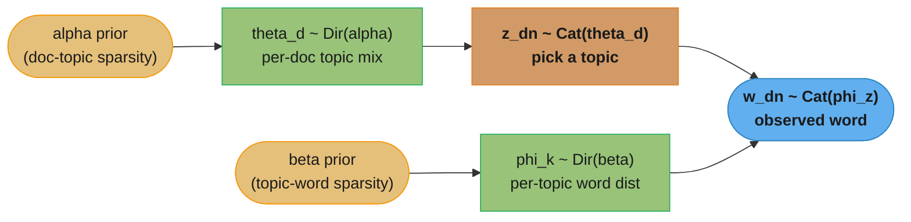
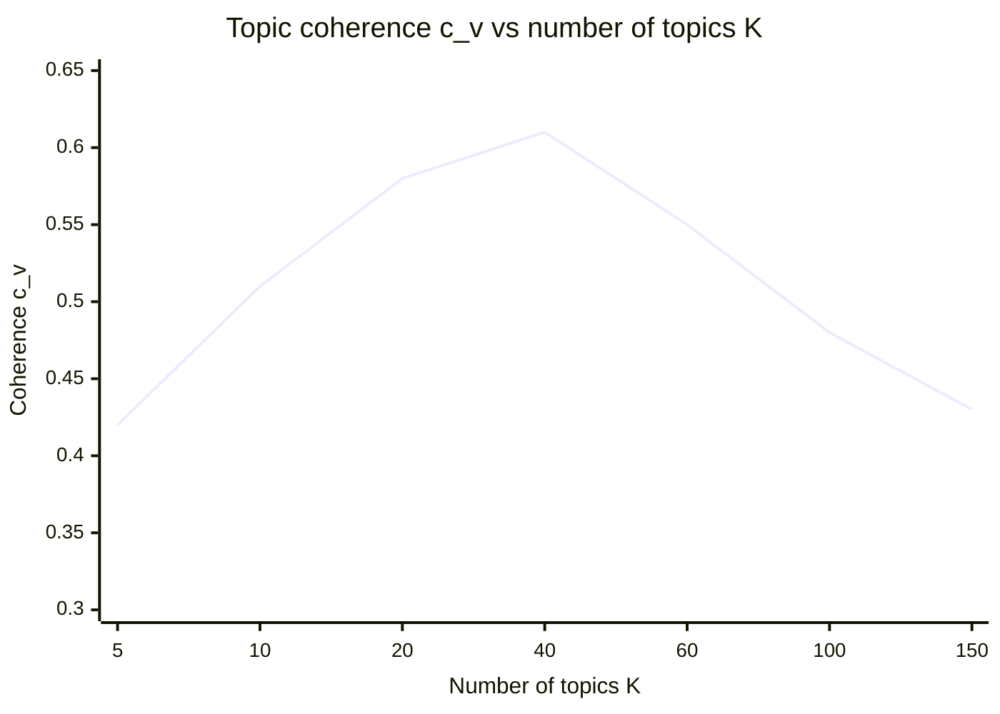
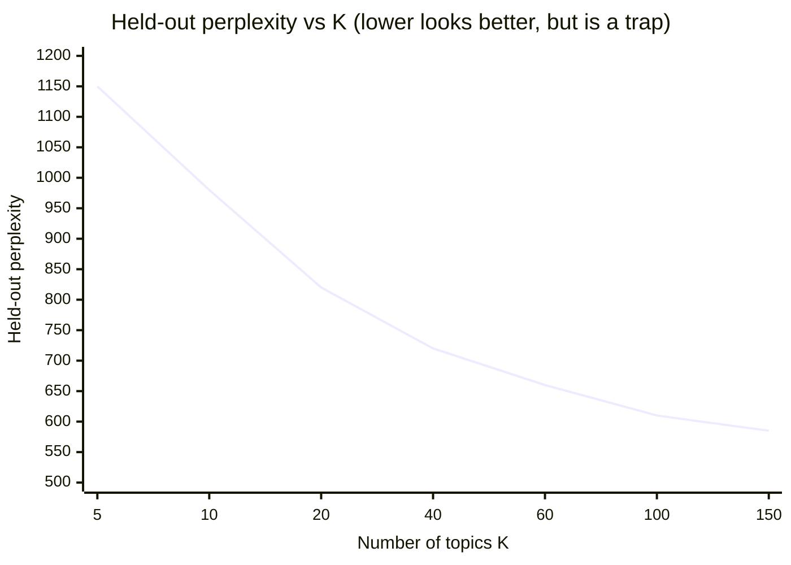
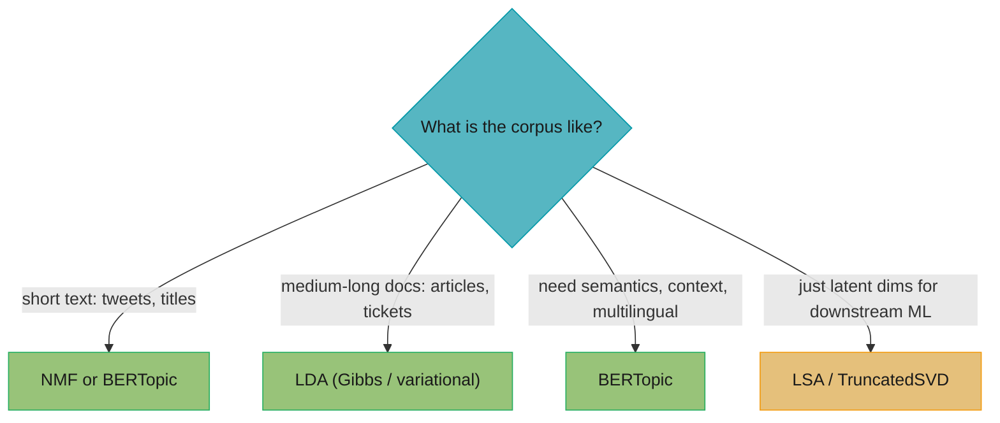
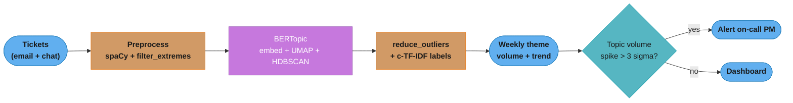

# Topic Modeling

> This file is a deep-dive sub-file of the [Natural Language Processing](README.md) module.
> It covers unsupervised discovery of latent themes: LSA/LSI, pLSA, LDA, NMF, BERTopic, and
> neural topic models, plus evaluation (perplexity vs coherence) and choosing the number of topics.
>
> Related: dimensionality reduction and clustering — [../unsupervised_learning/README.md](../unsupervised_learning/README.md);
> the EM algorithm and its monotonicity — [../unsupervised_learning/gaussian_mixtures_and_em.md](../unsupervised_learning/gaussian_mixtures_and_em.md);
> perplexity as an information-theoretic quantity — [../information_theory/README.md](../information_theory/README.md);
> TF-IDF / BM25 term weighting — [text_representation_and_retrieval.md](text_representation_and_retrieval.md).

---

## 1. Concept Overview

Topic modeling is the unsupervised discovery of the latent themes running through a document
collection. Each **topic** is a probability distribution over the vocabulary (the "sports" topic
puts high mass on *game, team, score, coach*); each **document** is a mixture of those topics (a
story about a stadium bond referendum is 50% sports, 30% finance, 20% politics). No labels are
required — the structure is inferred purely from word co-occurrence.

The distinction from clustering is **mixed membership**. k-means or DBSCAN assign each document to
exactly one cluster; a topic model lets a single document draw from *many* topics at once. That
matches how real documents work, and it is the entire reason topic models exist.

The lineage is a straight line of increasing sophistication:

- **LSA/LSI** (Deerwester et al., 1990): truncated SVD on the term-document matrix — pure linear algebra.
- **pLSA** (Hofmann, 1999): a probabilistic latent-variable model fit by EM, but with no priors.
- **LDA** (Blei, Ng, Jordan, 2003): pLSA plus Dirichlet priors — the field's workhorse for two decades.
- **NMF**: non-negative matrix factorization — non-probabilistic, parts-based, fast, strong on short text.
- **BERTopic / neural topic models** (2020–2022): contextual embeddings replace bag-of-words.

Every one of these is, at its core, a **low-rank factorization** of a term-document matrix into a
document-topic matrix and a topic-word matrix, where the shared inner dimension `K` is the number
of topics. That framing ties topic modeling directly to the SVD/PCA machinery in
[../unsupervised_learning/README.md](../unsupervised_learning/README.md).

---

## 2. Intuition

**One-line analogy:** a topic model reverse-engineers a recipe book — you see only the finished
dishes (documents) and must infer the underlying ingredient palettes (topics) each dish drew from.

**Mental model:** imagine how a document *could* have been generated. First pick a mixture of
topics for the document (60% cooking, 30% travel, 10% health). Then, for each word slot, roll a die
weighted by that mixture to choose a topic, and roll a second die weighted by that topic's
vocabulary to emit a word. A topic model runs this story *backwards*: given only the emitted words,
it recovers the two sets of dice — the per-document mixtures and the per-topic vocabularies.

**Why it matters:** hand-labeling millions of support tickets, reviews, or news articles is
impossible. Topic modeling gives an unsupervised, *interpretable* first pass at "what is this corpus
about" — themes you can name, count, and trend over time without a single annotation.

**Key insight:** mixed membership is the feature, but the bag-of-words assumption is the price. The
model captures that a document is genuinely part-sports and part-finance, but it throws away word
order, syntax, and negation — "not good" and "good" look identical to LDA.

---

## 3. Core Principles

**Bag-of-words / exchangeability.** Documents are represented as unordered word counts. Formally,
words within a document are treated as *exchangeable* (de Finetti); order carries no signal. This is
what makes the math tractable and also what limits the model.

**Latent variables.** Topics are hidden. The only observed quantity is the words; everything else —
which topic generated each word, each document's topic mixture — is inferred.

**Two distributions.** LDA is defined by `theta` (per-document topic distribution, a point on the
`K`-dimensional simplex) and `phi` (per-topic word distribution, a point on the `V`-dimensional
simplex, where `V` is vocabulary size). Learning means recovering both.

**Dirichlet priors and sparsity.** LDA places a `Dir(alpha)` prior on every `theta` and a
`Dir(beta)` prior on every `phi`. `alpha < 1` biases documents toward *few* topics; `beta < 1`
biases topics toward *few* words. This sparsity is what makes the topics human-readable.

**Low-rank factorization.** The term-document matrix `X` (shape `V × D`) is approximated by the
product of a `V × K` topic-word matrix and a `K × D` topic-document matrix. LSA does this with SVD,
NMF with non-negative factors, LDA with a probabilistic generative model. `K` is the rank.

**Non-negativity (NMF).** Forcing both factors `≥ 0` means topics *add up* — you can only combine
parts, never cancel them. Additive-parts structure tends to produce more coherent topics than SVD's
signed components.

**Intrinsic evaluation.** There is no ground-truth label, so quality is measured intrinsically:
held-out **perplexity** (predictive) and **coherence** (interpretability). These do not agree — a
central practical tension covered in §6 and §8.

---

## 4. Types / Architectures / Strategies

### 4.1 LSA / LSI — SVD on the term-document matrix

Build a TF-IDF-weighted term-document matrix `X` (`V × D`), then take its truncated SVD
`X ≈ U_k Σ_k V_k^T`. The `k` retained singular dimensions are the **latent semantic** axes; documents
and terms both project into this shared `k`-dimensional space, so synonyms (*car*, *automobile*) that
co-occur with the same neighbors land near each other. This is exactly PCA on the term-document
matrix (see [../unsupervised_learning/README.md](../unsupervised_learning/README.md)). Fast and
deterministic, but components can be **negative** (uninterpretable as "topics"), it is not a
probabilistic model, and it offers no principled way to score new documents.

**Read it like this.** `X ≈ U_k Σ_k V_k^T` says: "rebuild the whole term-document matrix out of only
`k` reusable ingredient patterns, keeping the `k` that explain the most variance and throwing the
rest away as noise."

The compression is the point. You are not summarizing `X` for its own sake — you are forcing every
document through a `k`-wide bottleneck so that documents which *cannot* be told apart by those `k`
patterns end up close together. That is how *car* and *automobile*, which never co-occur, land in the
same neighborhood.

| Symbol | What it is |
|--------|------------|
| `X` | The `V × D` term-document matrix. One column per document, one row per vocabulary term |
| `U_k` | `V × k`. Each column is a latent axis expressed in word space — the "topic" direction |
| `Σ_k` | `k × k` diagonal of singular values, largest first. Each entry is that axis's strength |
| `V_k^T` | `k × D`. Each column says how much of each latent axis a given document contains |
| `k` | The retained rank. The whole knob: small `k` = heavy compression, `k = rank(X)` = no loss |
| `≈` | Not equality. The discarded singular values are exactly the error you accept |

**Walk one example.** A 4-term by 3-document matrix, truncated to `k = 2`:

```
  X (4 terms x 3 docs)          singular values of X
    3  1  0                       s1 = 5.0763
    2  1  0                       s2 = 3.8549
    0  1  4                       s3 = 0.6090   <- the one we drop
    0  0  3

  energy share  s_i^2 / sum(s^2) :  0.6285   0.3624   0.0090
  keeping k = 2 retains 0.6285 + 0.3624 = 0.9910  ->  99.1% of the variance

  rank-2 reconstruction X_2         reconstruction error
     2.937   1.159  -0.026            ||X - X_2||_F^2 = 0.3708
     2.070   0.824   0.029            and  s3^2        = 0.3708   <- identical
     0.117   0.704   4.048
    -0.163   0.412   2.933            Discarding a singular value costs exactly
                                      its square. Nothing more, nothing less.
```

Two things fall out. First, the error is *predictable*: Eckart-Young says the squared error equals the
sum of the squares of everything you dropped, so `explained_variance_ratio_.sum()` in §6.5 is not a
heuristic — it is the exact fraction you kept. Second, look at the reconstruction: `-0.026` and
`-0.163` are **negative**. A "topic" that contributes negative mass to a word has no reading as a
probability, and that single fact is why LSA lost to LDA and NMF for interpretable themes.

### 4.2 pLSA — probabilistic latent semantic analysis

Hofmann's model: `P(w, d) = P(d) Σ_z P(z | d) P(w | z)`, with a latent topic `z`, fit by EM. It is a
genuine probabilistic model, but `P(z | d)` is a free parameter *per document*, so the parameter count
grows with the corpus — it **overfits** and cannot assign topics to an unseen document. LDA's
Dirichlet prior on `P(z | d)` is precisely the fix.

**Stated plainly.** `P(w, d) = P(d) Σ_z P(z | d) P(w | z)` says: "to see word `w` in document `d`,
first pick the document, then pick one of the `K` topics using that document's private topic mix, then
pick a word from that topic's vocabulary — and since you never saw which topic was picked, add up
every way it could have happened."

The `Σ_z` is a **marginalization**, not an average of predictions. The topic is a latent variable that
genuinely occurred but was never recorded, so the only honest probability is the sum over all the
values it could have taken.

| Symbol | What it is |
|--------|------------|
| `P(d)` | How likely you are to pick document `d` at all. Usually just proportional to its length |
| `z` | The latent topic index, `1..K`. Never observed — the whole reason inference is needed |
| `P(z \| d)` | Document `d`'s topic mixture. In pLSA this is a **free parameter per document** |
| `P(w \| z)` | Topic `z`'s word distribution. Shared across the entire corpus |
| `Σ_z` | Sum over all `K` topics — "we do not know which topic fired, so count every possibility" |

**Walk one example.** Where pLSA's parameter count comes from, and why it explodes:

```
  corpus: D = 480,000 documents, V = 14,200 terms, K = 40 topics

  P(w | z)  : shared topic-word table    ->  K x V  = 40 x 14,200   =    568,000 params
  P(z | d)  : one mixture PER DOCUMENT   ->  D x K  = 480,000 x 40  = 19,200,000 params
                                                                      ----------
                                                                      19,768,000

  97.1% of the model is per-document bookkeeping that does not generalize.
  Add one new document -> you must add 40 brand-new free parameters for it,
  and there is no prior telling you what they should look like. That is the
  "cannot fold in an unseen document" failure in the Section 8 table.
```

LDA changes exactly one line of that ledger: `P(z | d)` stops being a free parameter and becomes a
*draw* from `Dir(alpha)`. The 19.2M numbers collapse into `K` prior parameters (or one, if symmetric),
and a new document gets its mixture by inference under that prior instead of by fitting from scratch.

### 4.3 LDA — Latent Dirichlet Allocation (the workhorse)

The generative story for a corpus with `K` topics and vocabulary size `V`:

1. For each topic `k = 1..K`: draw a word distribution `phi_k ~ Dir(beta)`.
2. For each document `d`: draw a topic mixture `theta_d ~ Dir(alpha)`.
3. For each word slot `n` in document `d`: draw a topic `z_dn ~ Categorical(theta_d)`, then draw the
   word `w_dn ~ Categorical(phi_{z_dn})`.

**What this actually says.** The three steps together are the joint probability
`P(w, z, theta, phi | alpha, beta) = P(phi | beta) P(theta | alpha) P(z | theta) P(w | z, phi)`,
which reads: "roll `K` vocabulary dice once for the whole corpus, roll one topic-mix die per document,
then per word slot roll the document's mix to pick a topic and that topic's vocabulary die to pick a
word."

The critical asymmetry is *how often each die is rolled*. `phi` is drawn `K` times for the entire
corpus; `theta` is drawn once per document; `z` and `w` are drawn once per **token**. That is why
topics are sharp (millions of tokens of evidence each) while a short document's `theta` is mush (ten
tokens of evidence) — the short-text failure in §10, Pitfall 6, read straight off the generative story.

| Symbol | What it is |
|--------|------------|
| `phi_k` | Topic `k`'s word distribution — a `V`-long vector summing to 1. Corpus-wide, shared |
| `theta_d` | Document `d`'s topic mixture — a `K`-long vector summing to 1. Private to that document |
| `z_dn` | Which topic produced the `n`-th word of document `d`. One integer per token, never observed |
| `w_dn` | The word actually written. The only thing you ever see |
| `Dir(alpha)` | The prior that generates `theta`. Its concentration decides sparse vs blurry mixtures |
| `Dir(beta)` | The prior that generates `phi`. Same role, one level down at the word layer |
| `Categorical(p)` | A single weighted die roll returning an index, with probabilities `p` |

**Walk one example.** Generate a 3-word document forwards, then read off what inference must undo.
`K = 2` (topic 0 = billing, topic 1 = shipping), `theta_d = [0.7, 0.3]`:

```
  phi[topic 0 = billing ]:  refund 0.050   card 0.040   ship 0.001
  phi[topic 1 = shipping]:  refund 0.002   card 0.001   ship 0.060

  P(word) = sum over both topics of  theta[k] * phi[k][word]

  word    via topic 0        via topic 1        P(word)
  refund  0.7*0.050=0.035000 0.3*0.002=0.000600 0.035600
  card    0.7*0.040=0.028000 0.3*0.001=0.000300 0.028300
  ship    0.7*0.001=0.000700 0.3*0.060=0.018000 0.018700

  P(document) = 0.035600 x 0.028300 x 0.018700 = 1.8840e-05
  log P       = -10.8795
  per-word perplexity = exp(10.8795 / 3) = 37.58
```

Notice `ship`: 96.3% of its probability came from topic 1 even though the document is only 30%
shipping, because topic 0 essentially never emits that word. Inference exploits exactly this — a token
gets attributed to the topic that explains it best, *weighted* by how much the document already leans
that way. Those two forces are literally the two factors in the Gibbs update in §6.1.

**Hyperparameters.** `alpha` (doc-topic concentration) and `beta` (topic-word concentration), both
symmetric Dirichlet parameters. Common defaults: `alpha = 50/K` or `0.1`, `beta = 0.01` (Griffiths &
Steyvers). Lower `alpha` → each document commits to fewer topics; lower `beta` → each topic commits to
fewer words. gensim can also learn asymmetric `alpha` from data (`alpha='auto'`), which usually helps.

**The idea behind it.** A symmetric `Dir(alpha)` over `K` outcomes says: "hand out one unit of
probability across `K` buckets — and `alpha` decides whether I am allowed to dump nearly all of it in
one or two buckets (`alpha < 1`) or must spread it fairly evenly (`alpha > 1`)."

The mental image that makes it stick: `alpha` is a **pseudo-count**. Before seeing a single word, the
model pretends it has already observed `alpha` tokens of every topic in this document. Set
`alpha = 0.1` and that pretend-evidence is almost nothing, so real counts dominate instantly and the
mixture goes spiky. Set `alpha = 10` and every topic starts with 10 free tokens, so a 42-token
document can never escape the prior's pull toward uniform.

| Symbol | What it is |
|--------|------------|
| `alpha` | Doc-topic concentration. Pseudo-count of each topic added to every document before data |
| `beta` | Topic-word concentration. Pseudo-count of each vocabulary word added to every topic |
| `alpha < 1` | Sparse: each document commits to a couple of topics. This is what you want |
| `alpha > 1` | Diffuse: every document is a blurry blend of all `K` topics. Unreadable |
| `50/K` | Griffiths & Steyvers' default. At `K = 40` that is `1.25`; at `K = 500` it is `0.1` |
| Asymmetric `alpha` | A different concentration per topic, learned from data (`alpha='auto'`) |

**Walk one example.** Draw one `theta_d` from `Dir(alpha)` with `K = 5` at three settings, sorted
largest-first (numpy default_rng seed 7):

```
  alpha      theta_d sorted descending                          top-1    top-2 mass
  0.10   0.5406  0.4118  0.0476  0.0000  0.0000                 0.5406     0.9524
  1.00   0.4000  0.2279  0.1910  0.1149  0.0663                 0.4000     0.6279
  10.0   0.2608  0.2291  0.1947  0.1808  0.1345                 0.2608     0.4900

  alpha = 0.1  -> two topics hold 95.2% of the document. Nameable.
  alpha = 1.0  -> flat prior, no pressure either way. Data decides alone.
  alpha = 10   -> spread 49.0% over the top two; uniform would be 40.0%.
                  The document is "a bit of everything" and means nothing.
```

`beta` does the identical thing one layer down, over `V` words instead of `K` topics — and because `V`
is huge (14,200 in the §14 case study versus `K = 40`), it needs to be far smaller to have the same
sparsifying effect, which is exactly why the conventional defaults are `beta = 0.01` against
`alpha = 0.1`. Drop `beta` and you get the fix prescribed for the junk-topic pitfall in §10: sparser
topics that stop absorbing boilerplate. Raise it and every topic drifts toward the corpus unigram
distribution, so all `K` topics start looking like the same list of common words.

### 4.4 NMF — non-negative matrix factorization

Factorize `X ≈ W H` with `W, H ≥ 0`, minimizing either the Frobenius norm `||X - WH||²` or the
generalized KL divergence. `W` (`V × K`) holds the topics, `H` (`K × D`) the document loadings.
Non-negativity yields **parts-based**, additive topics. NMF is faster than LDA, deterministic given
initialization, and frequently **more coherent on short text** (tweets, ticket titles, review
sentences) where LDA's per-document Dirichlet has too little data to work with. It has no
probabilistic generative story, but in practice that rarely matters for theme mining.

**Put simply.** `min ||X - WH||²` subject to `W, H ≥ 0` says: "explain the corpus as a stack of `K`
non-negative ingredient piles, where every document is built by *adding* piles together — no pile may
ever subtract from another."

That one inequality constraint is the entire difference from LSA, and it is what buys
interpretability. SVD can express "this document is topic 1 *minus* topic 2," which is meaningless as
a theme. NMF cannot, so each column of `W` has to stand on its own as a coherent set of words.

| Symbol | What it is |
|--------|------------|
| `X` | The `V × D` TF-IDF matrix. NMF takes TF-IDF, unlike LDA which needs raw counts |
| `W` | `V × K`, all entries `≥ 0`. Column `k` is topic `k` as a weight over the vocabulary |
| `H` | `K × D`, all entries `≥ 0`. Column `d` is how much of each topic document `d` uses |
| `\|\|A\|\|²` | Frobenius norm squared: square every entry of `A` and add them all up |
| `W, H ≥ 0` | The constraint doing all the work. Parts add, never cancel |
| KL variant | Alternative objective; penalizes ratio error instead of absolute error, better for counts |

**Walk one example.** The same 4-term by 3-document matrix used for LSA above, now factored at
`K = 2` with non-negative factors:

```
  X          W (V x K)        H (K x D)
  3 1 0      1.4  0.0         2.0  0.8  0.0
  2 1 0      1.0  0.0         0.0  0.2  2.1
  0 1 4      0.2  1.9
  0 0 3      0.0  1.5      topic 0 = terms 1,2  |  topic 1 = terms 3,4

  WH                          residual E = X - WH
  2.80  1.12  0.00             0.20  -0.12   0.00
  2.00  0.80  0.00             0.00   0.20   0.00
  0.40  0.54  3.99            -0.40   0.46   0.01
  0.00  0.30  3.15             0.00  -0.30  -0.15

  ||X - WH||_F^2 = 0.5786        ||X||_F^2 = 41.0
  relative error = 0.5786 / 41.0 = 1.41%
```

Every entry of `W` and `H` is `≥ 0`, so "topic 0" is genuinely readable as *terms 1 and 2*, with no
negative mass anywhere — contrast the `-0.026` and `-0.163` that the rank-2 SVD produced on this exact
matrix. NMF pays for that: its 1.41% error is worse than SVD's optimal `0.3708 / 41.0 = 0.90%`,
because Eckart-Young guarantees no rank-2 approximation beats the SVD. **You trade a little
reconstruction accuracy for topics a human can name** — which is the whole bargain of topic modeling.

### 4.5 BERTopic and neural topic models

BERTopic drops bag-of-words entirely: embed each document with a sentence transformer, reduce
dimensionality with UMAP, cluster with HDBSCAN, and describe each cluster with a **class-based
TF-IDF** (c-TF-IDF) that weights terms by how distinctive they are to that cluster. It captures
semantics and context, handles short text, auto-selects the number of topics (HDBSCAN finds it), and
works multilingually. **Top2Vec** is a close cousin. **Neural topic models** — ProdLDA, the Embedded
Topic Model (ETM), CombinedTM — keep the probabilistic framing but replace variational EM with an
amortized encoder (a VAE), integrating word embeddings for better coherence.

### 4.6 Extensions

- **Dynamic Topic Models (DTM)** — topics *evolve* over time; the topic-word distributions drift
  across time slices (Blei & Lafferty on 100+ years of *Science*).
- **Hierarchical (hLDA, nested CRP)** — topics form a *tree*, from broad to specific.
- **Correlated Topic Models (CTM)** — replace the Dirichlet with a logistic-normal prior so topics
  can be *correlated* (a "genetics" topic co-occurring with "disease"), which Dirichlet cannot express.

---

## 5. Architecture Diagrams

### 5.1 The LDA generative story (plate model as a flow)



Only `w_dn` (blue) is observed; inference runs this story backwards to recover the green latent
distributions `theta_d` and `phi_k` from the words alone.

### 5.2 The BERTopic pipeline


BERTopic replaces bag-of-words with a frozen embedding model (purple), then discovers the number of
topics automatically from cluster density rather than requiring `K` up front.

### 5.3 Coherence peaks then falls — the real elbow for choosing K



Coherence rises, peaks around `K = 40` (`c_v ≈ 0.61`), then degrades as topics fragment into
near-duplicates. The peak is the defensible choice.

### 5.4 Perplexity keeps falling — why it is the wrong selection criterion



Perplexity monotonically *improves* with more topics, so optimizing it alone pushes `K` toward 150+
and yields incoherent, overfit topics. Compare with §5.3: the two curves disagree, and coherence wins.

### 5.5 Choosing an algorithm



The corpus shape — document length and whether you need semantics or just latent features — drives
the choice more than any accuracy number.

---

## 6. How It Works — Detailed Mechanics

### 6.1 LDA inference: collapsed Gibbs sampling

Exact posterior inference over `theta`, `phi`, and every `z_dn` is intractable. **Collapsed Gibbs
sampling** integrates out `theta` and `phi` analytically (the Dirichlet-multinomial conjugacy makes
this closed-form) and samples only the topic assignments `z`. For each word token, resample its
topic conditioned on all other assignments:

```
P(z_i = k | z_{-i}, w) proportional to
    (n_{d,k}^{-i} + alpha)  x  (n_{k, w_i}^{-i} + beta) / (n_k^{-i} + V*beta)
```

where `n_{d,k}` = words in document `d` currently assigned to topic `k`, `n_{k,w}` = times word `w`
is assigned to topic `k`, `n_k` = total tokens in topic `k`, and `-i` means "excluding the current
token." The first factor is *"this document already likes topic k"*; the second is *"topic k already
likes this word."* Run ~1000 sweeps with a ~100-iteration burn-in, then read `phi` and `theta` off
the final counts. MALLET and tomotopy implement this efficiently.

**What the formula is telling you.** "Pull this one word out of the model, ask every topic two
questions — *how much does this document already use you?* and *how much do you already use this
word?* — multiply the two answers, and reassign the word to a topic drawn in proportion to that
product."

There are no gradients, no matrices, no learning rate. It is pure counting: pluck a token, decrement
two counters, score `K` options, sample, increment two counters, move to the next token. That is the
whole algorithm, and it is why a C++ implementation like tomotopy is so fast.

| Symbol | What it is |
|--------|------------|
| `z_i = k` | The proposal: assign token `i` to topic `k`. We compute a score for every `k` |
| `n_{d,k}^{-i}` | Tokens in this document already on topic `k`, **not counting token `i`** |
| `n_{k,w_i}^{-i}` | Times this word type sits in topic `k` corpus-wide, excluding token `i` |
| `n_k^{-i}` | Total tokens in topic `k` across the corpus. The normalizer for factor two |
| `+ alpha` | Doc-side pseudo-count. Keeps a topic's score above zero even at `n_{d,k} = 0` |
| `+ beta` | Word-side pseudo-count. Same job, and the reason unseen words never get probability 0 |
| `V*beta` | Total pseudo-mass added to topic `k`'s denominator — `beta` for each of `V` words |
| `-i` | "Leave-one-out." Without it a token would vote for its own current topic |
| `proportional to` | Not a probability yet. Score all `K`, then divide by the sum to normalize |

**Walk one example.** Resample the word *refund* in a support ticket. `K = 3`, `alpha = 0.1`,
`beta = 0.01`, `V = 14,200` (so `V*beta = 142`). The ticket has 42 tokens, 41 after removing this one:

```
  factor 1 = n_dk + alpha        factor 2 = (n_kw + beta) / (n_k + V*beta)
  --------------------------------------------------------------------------------
  topic          n_dk   +alpha   n_kw   +beta      n_k   denom      score      P(k)
  0 shipping       24    24.10      3    3.01   52,000   52,142   1.391e-03   0.1453
  1 billing        12    12.10    180  180.01  310,000  310,142   7.023e-03   0.7337
  2 login           5     5.10     20   20.01   88,000   88,142   1.158e-03   0.1210
                                                          sum   = 9.572e-03   1.0000

  Sample from [0.1453, 0.7337, 0.1210] -> "billing" with probability 73.4%.
  Increment n_d,billing and n_billing,refund. Next token.
```

Read the fight between the two factors. The **document** prefers shipping (24 tokens already there
versus 12 for billing — factor 1 favors shipping 2:1). The **word** overwhelmingly prefers billing:
*refund* appears 180 times in the billing topic against 3 in shipping, and even after normalizing by
topic size billing wins that factor 10.1:1. Multiplied, the word evidence overrules the document
context and billing takes 73.4% of the mass. This is mixed membership happening mechanically — the
ticket stays mostly-shipping, but *this particular word* gets attributed to billing.

**Why `-i` and why sampling rather than argmax.** Drop the `-i` and the token's current assignment is
included in the counts scoring its own move, so it reinforces itself and the chain freezes on the
first random initialization. And note the update *samples* from `[0.1453, 0.7337, 0.1210]` rather
than taking the max — 26.6% of the time this token goes somewhere other than billing. That
willingness to make locally-worse moves is what lets the chain escape bad configurations, and it is
also the reason LDA is not reproducible across seeds (§10, Pitfall 5) and why you burn in ~100 sweeps
before trusting any counts.

### 6.2 LDA inference: variational EM

The alternative is **mean-field variational inference**: approximate the intractable posterior with a
factorized distribution `q(theta) q(z) q(phi)` and maximize the Evidence Lower BOund (ELBO) by
alternating an E-step (update the per-document variational parameters `gamma`) and an M-step (update
topic parameters). This is the same EM machinery — with the same monotone-improvement guarantee —
derived for GMMs in
[../unsupervised_learning/gaussian_mixtures_and_em.md](../unsupervised_learning/gaussian_mixtures_and_em.md).
scikit-learn's `LatentDirichletAllocation` uses **online variational Bayes** (Hoffman et al., 2010),
which processes mini-batches and scales to millions of documents. Gibbs tends to find slightly more
coherent topics; variational is faster and streams.

The ELBO being maximized is:

```
ELBO(q) = E_q[ log P(w, z, theta, phi | alpha, beta) ] - E_q[ log q(theta, z, phi) ]

and it relates to the quantity you actually want by:

log P(w | alpha, beta)  =  ELBO(q)  +  KL( q || true posterior )
                              ^                   ^
                        what we maximize     always >= 0, never computed
```

**In plain terms.** "The true log-likelihood is out of reach, so maximize a quantity that is provably
never above it — and because the gap between them is a KL divergence that can only shrink, pushing
this lower bound up must drag the real thing up with it."

That single identity is why the method works at all. `log P(w)` is a fixed constant for your corpus,
so `ELBO + KL = constant`: every point you gain on the ELBO is a point of KL you removed, meaning your
approximation `q` got closer to the true posterior. You get to optimize an intractable objective by
never touching it.

| Symbol | What it is |
|--------|------------|
| `log P(w \| alpha, beta)` | The evidence — log-probability of the observed words with everything else integrated out. Intractable |
| `q(theta, z, phi)` | The **approximate** posterior you invent. Mean-field forces it to factorize |
| `E_q[...]` | Average under `q`. Tractable precisely because `q` factorizes |
| First term | "Does `q` put its mass where the model says the data is likely?" Fit |
| Second term | Negative entropy of `q`. Penalizes over-confident, collapsed approximations |
| `KL(q \|\| posterior)` | The slack. Zero only if `q` is exactly right, which mean-field forbids |
| `gamma` | The per-document variational parameters updated in the E-step — `q(theta_d)`'s Dirichlet |

**Walk one example.** Two iterations on one document, watching the bound close:

```
  iteration   ELBO      implied KL gap        (log P(w) = -1250.0, fixed and unknown)
  ---------------------------------------------------------------------------------
  init      -1400.0     -1250.0 - (-1400.0) = 150.0      q is far from the posterior
  iter 1    -1310.0     -1250.0 - (-1310.0) =  60.0      gained 90.0, gap shrank 90.0
  iter 2    -1268.0     -1250.0 - (-1268.0) =  18.0      gained 42.0, gap shrank 42.0
  ...
  converged -1262.0     -1250.0 - (-1262.0) =  12.0      <- ELBO stops rising here

  The residual 12.0 never goes away. That is the mean-field factorization error:
  q was forced to treat theta and z as independent when the posterior couples them.
```

The monotone rise is guaranteed — same coordinate-ascent argument as EM for Gaussian mixtures in
[../unsupervised_learning/gaussian_mixtures_and_em.md](../unsupervised_learning/gaussian_mixtures_and_em.md).
The permanent residual gap is the honest cost, and it is the mechanical reason variational LDA lands on
slightly less coherent topics than collapsed Gibbs (§8): Gibbs is asymptotically exact and pays only
in runtime, while variational buys speed by accepting a posterior it can never fully reach. Note also
that gensim's `log_perplexity` returns a bound derived from this ELBO, not the true held-out
likelihood — so the perplexity number in §6.4 is itself an approximation of an approximation.

### 6.3 Fitting LDA and selecting K by coherence (gensim)

```python
from __future__ import annotations
from gensim.corpora import Dictionary
from gensim.models import LdaModel, CoherenceModel
import matplotlib.pyplot as plt


def build_corpus(tokenized_docs: list[list[str]]) -> tuple[Dictionary, list]:
    """Build a gensim dictionary + bag-of-words corpus with sane frequency filters."""
    dictionary = Dictionary(tokenized_docs)
    # Drop terms in <5 docs (noise) or >50% of docs (near-stopwords). Critical: without
    # max filtering, boilerplate words dominate every topic.
    dictionary.filter_extremes(no_below=5, no_above=0.5, keep_n=50_000)
    corpus = [dictionary.doc2bow(doc) for doc in tokenized_docs]
    return dictionary, corpus


def sweep_num_topics(
    tokenized_docs: list[list[str]],
    dictionary: Dictionary,
    corpus: list,
    k_values: tuple[int, ...] = (5, 10, 20, 40, 60, 100, 150),
) -> dict[int, float]:
    """Fit LDA at each K and score c_v coherence. Returns {K: coherence}."""
    scores: dict[int, float] = {}
    for k in k_values:
        lda = LdaModel(
            corpus=corpus,
            id2word=dictionary,
            num_topics=k,
            alpha="auto",        # learn asymmetric doc-topic prior from data
            eta=0.01,            # gensim calls beta "eta"; 0.01 -> sparse topics
            passes=10,
            iterations=400,
            random_state=42,     # LDA is stochastic; fix the seed for reproducibility
        )
        cm = CoherenceModel(
            model=lda, texts=tokenized_docs, dictionary=dictionary, coherence="c_v"
        )
        scores[k] = cm.get_coherence()
        print(f"K={k:3d}  c_v={scores[k]:.3f}")
    return scores
```

### 6.4 Broken then fix: choosing K by perplexity alone

```python
from gensim.models import LdaModel
import numpy as np


# BROKEN: pick the K that minimizes held-out perplexity.
def choose_k_by_perplexity(corpus_train, corpus_test, dictionary,
                           k_values=(5, 10, 20, 40, 60, 100, 150)) -> int:
    best_k, best_perp = None, float("inf")
    for k in k_values:
        lda = LdaModel(corpus_train, id2word=dictionary, num_topics=k, random_state=42)
        # log_perplexity returns per-word log-bound; exp(-x) is perplexity.
        perp = np.exp(-lda.log_perplexity(corpus_test))
        if perp < best_perp:
            best_perp, best_k = perp, k
    return best_k        # -> returns 150; perplexity always falls as K grows.
# Result: 150 tiny, overlapping topics. Humans read them and see noise; several are
# near-duplicates ("payment / pay / paid / billing" split across four topics). Chang
# et al. (2009) "Reading Tea Leaves" showed perplexity is NEGATIVELY correlated with
# human topic interpretability.


# FIXED: select the K that maximizes c_v coherence (the interpretability proxy).
def choose_k_by_coherence(scores: dict[int, float]) -> int:
    # scores from sweep_num_topics() in 6.3
    return max(scores, key=scores.get)   # -> returns 40, the coherence peak.
```

**What it means.** `perplexity = exp(-log_perplexity)` — where gensim's `log_perplexity` is the mean
per-word log-probability — says: "convert an average log-probability back into a word count, and read
the answer as *the model is as confused as if it were guessing uniformly among this many words at
every position*."

Perplexity is an **effective branching factor**, and that is the only interpretation worth carrying
into an interview. A perplexity of 720 against a 14,200-word vocabulary means the model narrowed each
next-word decision from 14,200 equally-likely options down to about 720 — real information, but still
enormous uncertainty. This is the same quantity as `exp(cross-entropy)` in
[../information_theory/README.md](../information_theory/README.md).

| Symbol | What it is |
|--------|------------|
| `log_perplexity` | Mean log-probability **per word**, always negative. gensim returns the ELBO bound |
| `-log_perplexity` | Flip the sign: mean per-word surprise, in nats. Bigger = more surprised |
| `exp(...)` | Undoes the log, turning nats of surprise into an equivalent number of choices |
| Perplexity `= 1` | Perfect: the model knew the next word with certainty |
| Perplexity `= V` | Worst useful case: the model learned nothing beyond "some word from the vocab" |
| Per-word, not per-doc | Normalized by token count, so long and short documents stay comparable |

**Walk one example.** The perplexity curve from §5.4, converted back to what the model is actually doing:

```
   K     perplexity   log_perplexity   effective choices out of V = 14,200
  ----------------------------------------------------------------------
    5       1150         -7.0475        1 in 12.3 of the vocabulary
   40        720         -6.5793        1 in 19.7                     <- coherence peak
  150        585         -6.3716        1 in 24.3                     <- perplexity's pick

  Going K = 40 -> 150 improves perplexity by 720 - 585 = 135 (18.8% better),
  while c_v coherence falls 0.61 -> 0.43 (29.5% worse).

  You bought a fifth off the branching factor and paid for it with topics
  no human can read. Nobody deploys a branching factor.
```

The trap is now mechanical rather than mysterious. Perplexity rewards **any** extra capacity that
predicts held-out words a bit better, and 150 near-duplicate topics do predict slightly better than 40
clean ones — splitting "billing" into five shards lets each shard specialize on its own vocabulary
slice. The metric has no term at all for *"can a person name this topic,"* which is the only thing you
actually shipped for. Chang et al. (2009) measured the correlation and found it **negative**.

The lesson: perplexity measures *predictive* fit and keeps improving as you add capacity; it does not
measure whether a human can read the topics. Always select `K` (and compare models) on **coherence**,
then eyeball the top-10 words of each topic before shipping.

### 6.5 NMF, LSA, and BERTopic in scikit-learn / BERTopic

```python
from sklearn.feature_extraction.text import TfidfVectorizer
from sklearn.decomposition import NMF, TruncatedSVD, LatentDirichletAllocation
import numpy as np


def top_words(components: np.ndarray, feature_names: np.ndarray, n: int = 10) -> list[list[str]]:
    """Return the top-n highest-weight words per topic (row) of a factor matrix."""
    return [[feature_names[i] for i in row.argsort()[::-1][:n]] for row in components]


def fit_nmf_and_lsa(docs: list[str], k: int = 40) -> None:
    # NMF works best on TF-IDF and short text; often more coherent than LDA on tickets.
    tfidf = TfidfVectorizer(max_df=0.5, min_df=5, stop_words="english")
    X = tfidf.fit_transform(docs)
    features = np.array(tfidf.get_feature_names_out())

    nmf = NMF(n_components=k, init="nndsvd", random_state=42, max_iter=400)
    nmf.fit(X)                              # nndsvd init -> deterministic, avoids random restarts
    print("NMF topic 0:", top_words(nmf.components_, features)[0])

    lsa = TruncatedSVD(n_components=k, random_state=42)   # LSA/LSI: SVD on the TF-IDF matrix
    lsa.fit(X)
    print("LSA explains", f"{lsa.explained_variance_ratio_.sum():.1%}", "of variance")

    # LDA in sklearn uses RAW COUNTS, not TF-IDF (it is a generative count model).
    from sklearn.feature_extraction.text import CountVectorizer
    counts = CountVectorizer(max_df=0.5, min_df=5, stop_words="english")
    Xc = counts.fit_transform(docs)
    lda = LatentDirichletAllocation(
        n_components=k, learning_method="online", batch_size=256,
        doc_topic_prior=0.1, topic_word_prior=0.01, random_state=42,
    )
    lda.fit(Xc)


def fit_bertopic(docs: list[str]):
    from bertopic import BERTopic
    from sentence_transformers import SentenceTransformer

    embedder = SentenceTransformer("all-MiniLM-L6-v2")   # 384-dim, fast, frozen
    model = BERTopic(embedding_model=embedder, min_topic_size=25, calculate_probabilities=False)
    topics, _ = model.fit_transform(docs)   # HDBSCAN auto-selects the number of topics
    # -1 is the outlier topic; reduce_outliers() can reassign those documents.
    return model, topics
```

Note the two silent traps encoded above: **sklearn LDA expects raw counts** (feeding it TF-IDF
quietly degrades topics), and **NMF should use `init="nndsvd"`** for deterministic, restart-free
factorization.

---

## 7. Real-World Examples

**Support-ticket theme mining.** SaaS companies run NMF or BERTopic over months of Zendesk/Intercom
tickets to surface the top drivers of contact — "password reset," "billing dispute," "shipping
delay" — without manual tagging. Product teams trend topic volume week over week to catch a spiking
issue days before it hits dashboards. NMF is favored because ticket bodies are short.

**Review aspect discovery.** Amazon and Yelp-style pipelines apply topic models to product/restaurant
reviews to extract recurring aspects (*battery life, screen, shipping, price*), then join topic
proportions with star ratings to learn which themes drive dissatisfaction. Aspect-based sentiment
sits on top of the discovered topics.

**News aggregation and de-duplication.** Google-News-style systems cluster the day's articles into
stories; topic-model or embedding-cluster signals group coverage of the same event across outlets and
surface emerging themes. BERTopic's semantic clustering has largely displaced LDA here.

**Scientific-literature trends.** Blei & Lafferty's **Dynamic Topic Model** ran on ~120 years of the
journal *Science*, showing a topic drift from "atomic theory" vocabulary in 1900 toward "quantum" and
later "neural" vocabulary — a canonical demonstration of topics evolving over time. arXiv and PubMed
trend dashboards use the same idea.

**Legal and compliance discovery.** e-Discovery platforms use LDA/NMF to organize millions of
documents in litigation into themes so reviewers can prioritize, a mixed-membership fit since a single
contract touches indemnity, liability, and termination at once.

---

## 8. Tradeoffs

| Method | Interpretable topics | Speed | Short text | Probabilistic | Needs K up front | Scores new docs |
|--------|---------------------|-------|-----------|---------------|-----------------|-----------------|
| **LSA/LSI** | Weak (signed components) | Fast | OK | No | Yes | Via projection |
| **pLSA** | Medium | Medium | Poor | Yes | Yes | **No** |
| **LDA** | Good | Slow (Gibbs) / Medium (VI) | Poor | Yes | Yes | Yes |
| **NMF** | Good (often best on short) | Fast | **Good** | No | Yes | Yes (transform) |
| **BERTopic** | Good | Medium (needs GPU for embed) | **Good** | No | **No (auto)** | Yes |

| Inference | Speed | Coherence | Scales to millions | Streaming |
|-----------|-------|-----------|--------------------|-----------|
| **Collapsed Gibbs** | Slower | Usually higher | Harder | No |
| **Batch variational EM** | Faster | Slightly lower | Yes | No |
| **Online variational Bayes** | Fastest | Lowest of the three | Yes | **Yes** |

| Evaluation metric | Measures | Correlates with human judgment | Use for |
|-------------------|----------|-------------------------------|---------|
| **Perplexity** | Predictive fit on held-out text | Negatively (Chang 2009) | Never for K selection alone |
| **UMass coherence** | Intra-corpus co-occurrence (log) | Weakly | Fast internal sanity check |
| **UCI / c_uci** | PMI over an external reference corpus | Moderately | When a reference corpus exists |
| **c_v coherence** | Sliding-window NPMI + cosine | **Best available proxy** | Default for K selection |
| **Topic diversity** | Fraction of unique top words | Complements coherence | Detect redundant/duplicate topics |

### Decoding the coherence formulas

The three coherence measures in that table are three different answers to one question — *given that
`refund` is a top word of this topic, how unsurprised should I be to also see `billing`?* Their
formulas:

```
UMass :  C = sum over word pairs of   log( ( D(w_i, w_j) + 1 ) / D(w_j) )

PMI   :  PMI(w_i, w_j) = log(  P(w_i, w_j) / ( P(w_i) * P(w_j) )  )

NPMI  :  NPMI(w_i, w_j) = PMI(w_i, w_j) / ( -log P(w_i, w_j) )      in [-1, +1]

c_v   :  NPMI over a sliding window (size 110), then cosine similarity between each
         top word's NPMI vector and the sum vector of all top words, averaged.
```

**All three are asking one question.** Every one of them asks: "do these words show up together *more than
chance would predict*?" — and the differences are only in what counts as "together" (whole document
versus a 110-word window) and how the raw ratio is squashed into a comparable scale.

| Symbol | What it is |
|--------|------------|
| `D(w_j)` | Number of documents containing word `w_j` |
| `D(w_i, w_j)` | Number of documents containing **both**. The co-occurrence count |
| `+ 1` in UMass | Smoothing. Without it a never-co-occurring pair gives `log 0 = -infinity` |
| `P(w_i) * P(w_j)` | What the joint probability **would** be if the two words were independent |
| The PMI ratio | Observed joint over independent-baseline joint. `> 1` means real association |
| `-log P(w_i, w_j)` | NPMI's normalizer. Divides out the fact that rare pairs inflate raw PMI |
| Sliding window | c_v's "together" = within 110 tokens, so long documents cannot fake proximity |
| Cosine step | c_v's extra layer: does each word point the same *direction* as the topic overall? |

**Walk one example.** Three word pairs scored on the §14 corpus (`D = 480,000` tickets), showing why
NPMI is the one that behaves:

```
  pair                 D(wi)   D(wj)   D(wi,wj)    UMass      PMI     NPMI
  ------------------------------------------------------------------------
  refund / billing      1,800   1,500     1,200   -0.2223   5.3629   0.8951
  refund / sincerely    1,800   4,800        90   -3.9655   1.6094   0.1875
  refund / stadium      1,800     300         2   -4.6052   0.5754   0.0464

  refund/billing    : 1,200 of refund's 1,800 tickets also say billing. Genuine topic.
  refund/sincerely  : co-occurs 90 times, but 'sincerely' is boilerplate in 4,800
                      tickets, so the overlap is barely above chance. NPMI 0.19 says so.
  refund/stadium    : 2 co-occurrences out of 480,000. Coincidence, and NPMI 0.05 agrees.
```

Watch what each metric does to the middle row, the one that matters. `UMass` is unbounded and its
magnitude is dominated by how *common* `w_j` is, so `sincerely`'s high document frequency drags the
score to `-3.97` — a big-looking number that mixes "unrelated" with "frequent" and cannot be compared
across corpora. Raw `PMI` says `1.61`, positive and seemingly meaningful, but PMI's ceiling depends on
the pair's rarity, so `1.61` for a common pair and `1.61` for a rare pair mean different things. Only
`NPMI` produces `0.19` on a fixed `[-1, +1]` scale where `0` is exactly chance — which is why `c_v` is
built on NPMI and why it is the one measure that tracks human ratings.

### Reading the topic-diversity score

`diversity = (unique words across all topics' top-N lists) / (K * N)` — usually with `N = 10`.

**Stated another way.** "Line up the top-10 words from every topic, count how many distinct words you
actually got, and divide by how many you *would* have gotten if no two topics shared a single word."

Coherence alone cannot catch redundancy: five near-duplicate "billing" topics each score *excellent*
coherence, because each one's top words really do co-occur. Diversity is the metric that notices they
are the same five topics.

| Symbol | What it is |
|--------|------------|
| `K` | Number of topics |
| `N` | Top words inspected per topic. `10` is the convention |
| `K * N` | Total word slots — the count you would see with zero overlap between topics |
| unique count | Distinct word types across all those slots |
| `= 1.0` | Perfect: no word appears in two topics' top-10 lists |
| `-> 0` | Collapse: every topic is showing you the same handful of words |

**Walk one example.** The same two `K` settings that perplexity and coherence disagreed about:

```
  K     slots = K*10   unique top words   diversity   verdict
  --------------------------------------------------------------------------------
   40        400              352           0.880     healthy, topics mostly distinct
  150      1,500              690           0.460     over half the slots are repeats
   47        470              441           0.938     illustrative K = 47 run, well separated

  At K = 150 the model produced 690 distinct words to fill 1,500 slots. That is
  the "billing / pay / paid / payment split across four topics" failure from Sec 6.4,
  visible as a single number before anyone reads a topic.
```

Track diversity next to coherence, exactly as Best Practice 8 prescribes: coherence tells you each
topic is internally sensible, diversity tells you they are not all the *same* sensible topic. A model
scoring high on one and low on the other is the classic over-fragmented `K`.

---

## 9. When to Use / When NOT to Use

### Use topic modeling when

- The corpus is **unlabeled** and you need an interpretable, exploratory map of its themes.
- **Mixed membership** is realistic — documents genuinely span several themes at once.
- You want a corpus-level lens: theme prevalence, trends over time, cohort comparisons.
- Themes will feed a human (analyst dashboards, tagging suggestions), not a hard downstream decision.

### Choose a specific method when

- **LDA** — medium-to-long documents (articles, tickets, reviews with a few paragraphs) where you want
  a probabilistic mixed-membership model and per-document topic proportions.
- **NMF** — short text or when you need speed and determinism; frequently the most coherent on tweets
  and one-line ticket subjects.
- **BERTopic** — you need semantic/contextual grouping, multilingual support, or want `K` chosen
  automatically, and you can afford to embed the corpus.
- **LSA/TruncatedSVD** — you only need low-dimensional latent *features* for a downstream classifier,
  not human-readable topics.

### Do NOT use topic modeling when

- You already have **labels** — train a supervised classifier (see
  [bert_and_pretrained_models.md](bert_and_pretrained_models.md)); topic models will be fuzzier.
- You need **precise per-document categorization** — topic proportions are soft and noisy, not
  reliable single-label assignments.
- Documents are **very short and you insist on vanilla LDA** — the per-document Dirichlet starves;
  switch to NMF, BERTopic, or pool short texts (e.g., all a user's tweets) into pseudo-documents.
- **Word order, negation, or sentiment** are the signal — bag-of-words discards them.

---

## 10. Common Pitfalls

### Pitfall 1: choosing K by perplexity (incoherent topics)

Covered as the broken→fix in §6.4. Perplexity falls monotonically with `K`, so optimizing it selects
150+ fragmented, near-duplicate topics that no human can read. **Fix:** sweep `K` on `c_v` coherence,
pick the peak (§5.3), and read the top-10 words per topic before shipping.

### Pitfall 2: no preprocessing — stopwords hijack every topic

```python
# BROKEN: raw tokens. "the", "and", "to" appear in every doc and dominate every topic.
tokens = [doc.lower().split() for doc in docs]

# FIXED: remove stopwords, prune by document frequency, lemmatize.
import spacy
nlp = spacy.load("en_core_web_sm", disable=["parser", "ner"])
tokens = [
    [t.lemma_ for t in nlp(doc.lower())
     if t.is_alpha and not t.is_stop and len(t) > 2]
    for doc in docs
]
# Then dictionary.filter_extremes(no_below=5, no_above=0.5) prunes corpus-wide near-stopwords.
```

A single unfiltered `max_df` is the most common reason "all my topics look the same."

### Pitfall 3: a giant background/junk topic

LDA often allocates one topic to soak up boilerplate ("please, thank you, regards, sincerely" in
emails/tickets). Do not delete it blindly — it is doing useful work absorbing noise from the *real*
topics. Better: add domain stopwords, raise `min_df`, or lower `beta` for sparser topics.

### Pitfall 4: comparing coherence across different preprocessing

Coherence numbers are only comparable when the dictionary, tokenization, and reference corpus are held
fixed. A team once "improved" `c_v` from 0.48 to 0.61 — but they had also changed the stopword list
and `min_df`, so the two numbers measured different vocabularies. **Fix:** freeze preprocessing;
change one variable at a time.

### Pitfall 5: assuming reproducibility (LDA and NMF are stochastic)

LDA (random init + sampling) and NMF (random init) give *different* topics on different seeds. A
dashboard that re-ran nightly showed "topic 7" meaning something different each morning. **Fix:** set
`random_state`, use `init="nndsvd"` for NMF (deterministic), and for LDA either fix the seed or run
several seeds and keep the most coherent. Never assume topic *ids* are stable across retrains — align
topics by top-word overlap.

### Pitfall 6: vanilla LDA on short text

Tweets and ticket subjects average 8–15 tokens; LDA's per-document Dirichlet has almost no evidence
per document and produces mush. **Fix:** NMF on TF-IDF, BERTopic, or pool related short texts into
pseudo-documents before fitting LDA.

### Pitfall 7: treating topic proportions as ground-truth labels

`theta_d` is a soft, noisy estimate. Thresholding it into hard categories for a billing or compliance
decision propagates model uncertainty into that decision. Keep topics for exploration and analytics;
train a supervised model if you need reliable labels.

---

## 11. Technologies & Tools

| Tool | Purpose | Notes |
|------|---------|-------|
| `gensim` | LDA, LSI, NMF, `CoherenceModel` | The de-facto Python topic-modeling library; streaming corpora |
| `scikit-learn` | `LatentDirichletAllocation`, `NMF`, `TruncatedSVD` | LDA uses online variational Bayes; remember it needs raw counts |
| `BERTopic` | Embedding + UMAP + HDBSCAN + c-TF-IDF | Modern default for semantic/short-text topics; auto-K |
| `Top2Vec` | Joint document/word embedding clustering | Alternative neural topic model, no K needed |
| MALLET | Java, optimized collapsed Gibbs LDA | Historically higher-quality topics than variational; `gensim` wrapper |
| `tomotopy` | Fast C++ Gibbs LDA/HDP/DTM/CTM with Python bindings | Much faster than pure-Python Gibbs; supports many variants |
| `pyLDAvis` | Interactive intertopic-distance + relevance visualization | The standard way to inspect and label LDA topics |
| OCTIS | Topic-model evaluation and hyperparameter search framework | Standardized coherence/diversity benchmarking |
| spaCy / NLTK | Tokenization, lemmatization, stopword removal | Preprocessing quality dominates topic quality |

---

## 12. Interview Questions with Answers

**Q: How is topic modeling different from clustering documents?**
Topic modeling gives each document a mixture of many topics, whereas clustering assigns each document to exactly one group. This mixed-membership is the core distinction: k-means forces a stadium-bond article into a single cluster, but LDA can represent it as 50% sports, 30% finance, 20% politics. Topics are also distributions over words (interpretable), while clusters are just centroids. Use clustering when documents are genuinely single-theme and you need hard assignments; use topic modeling when documents span themes and you want interpretable, soft structure.

**Q: Why is perplexity a poor way to choose the number of topics?**
Perplexity measures predictive fit and falls monotonically as you add topics, so optimizing it pushes K toward hundreds of overfit, incoherent topics. Chang et al.'s 2009 "Reading Tea Leaves" showed perplexity is actually *negatively* correlated with human interpretability. The fix is to select K by coherence (c_v), which peaks at a moderate K and then declines as topics fragment into near-duplicates. Always eyeball the top-10 words per topic before finalizing K.

**Q: Walk through the LDA generative story.**
For each topic draw a word distribution phi from Dir(beta); for each document draw a topic mixture theta from Dir(alpha); then for each word slot pick a topic z from theta and a word from phi_z. That is the whole model: two Dirichlet-drawn distributions and two categorical draws per word. Inference reverses it — given only the observed words, recover theta (per-document mixtures) and phi (per-topic vocabularies). The Dirichlet priors are what enforce sparse, readable topics and let LDA generalize to unseen documents.

**Q: What do the alpha and beta hyperparameters control in LDA?**
Alpha is the document-topic Dirichlet concentration and beta is the topic-word concentration; both below 1 induce sparsity. Low alpha (e.g. 0.1 or 50/K) makes each document concentrate on a few topics; low beta (e.g. 0.01) makes each topic concentrate on a few words, which is what makes topics readable. High values spread mass out, producing blurry documents and generic topics. gensim can learn an asymmetric alpha from data (`alpha='auto'`), which usually improves quality over a fixed symmetric prior.

**Q: Compare collapsed Gibbs sampling and variational inference for LDA.**
Collapsed Gibbs integrates out theta and phi and samples each word's topic from count-based conditionals, while variational inference approximates the posterior with a factorized distribution and maximizes an ELBO. Gibbs is stochastic, slower, and usually finds slightly more coherent topics; variational (especially online/mini-batch variational Bayes) is faster, deterministic per seed, and scales to millions of documents by streaming. sklearn uses online variational Bayes; MALLET and tomotopy use optimized Gibbs. Variational inference here is the same EM machinery used for Gaussian mixtures.

**Q: How does LSA differ from LDA?**
LSA is a truncated SVD of the term-document matrix (pure linear algebra), while LDA is a probabilistic generative model with Dirichlet priors. LSA's latent components can be negative and are hard to read as topics; LDA's topics are proper probability distributions over words. LSA is fast and deterministic and great for producing latent features for downstream models, but it gives no principled way to score new documents or reason about uncertainty. LDA is slower but yields interpretable, mixed-membership topics and a generative story.

**Q: When would you choose NMF over LDA?**
Choose NMF for short text and when you need speed and determinism, since it is often more coherent than LDA on tweets, titles, and ticket subjects. NMF factorizes the TF-IDF matrix into two non-negative factors, so topics are additive parts rather than a probabilistic mixture, and with `init="nndsvd"` it is fully deterministic. LDA's per-document Dirichlet starves on very short documents, whereas NMF has no such assumption. The tradeoff: NMF has no generative model or uncertainty estimates, which rarely matters for theme mining.

**Q: What is topic coherence and how is c_v computed?**
Coherence scores how semantically related a topic's top words are, as a proxy for human interpretability. c_v combines an NPMI (normalized pointwise mutual information) computed over a sliding window with a cosine-similarity aggregation over the top-N words, and empirically tracks human ratings best among coherence measures. UMass uses intra-corpus log co-occurrence (fast, weaker), and UCI/c_uci uses PMI against an external reference corpus. Use c_v as the default for selecting K and comparing models, holding preprocessing fixed so the numbers stay comparable.

**Q: How do you choose the number of topics K?**
Sweep K over a range like 5 to 150, score each with c_v coherence, and pick the peak or point of diminishing returns. Do not use perplexity, which keeps falling with K. Then sanity-check by reading the top words of each topic and checking topic diversity (fraction of unique top words) to detect near-duplicates. BERTopic sidesteps the choice entirely by letting HDBSCAN discover the number of clusters from density. Domain knowledge about how many themes you expect is a valid prior on the range.

**Q: Why does LDA struggle on short text and how do you fix it?**
LDA infers each document's topic mixture from that document's words, so a 10-word tweet gives almost no evidence and yields noisy, mushy topics. Fixes: use NMF or BERTopic, which do not rely on a per-document Dirichlet, or pool related short texts (all of a user's tweets, all replies in a thread) into pseudo-documents before fitting LDA. Biterm Topic Model is a purpose-built alternative that models word-pair co-occurrence across the whole corpus rather than per document.

**Q: What does the Dirichlet prior add to pLSA to give LDA?**
The Dirichlet prior on the document-topic distribution turns pLSA's per-document free parameters into draws from a shared prior, which prevents overfitting and lets the model assign topics to unseen documents. pLSA's P(z|d) grows with the corpus size and has no generative story for new documents, so it overfits and cannot generalize. LDA's prior regularizes the mixtures and completes the Bayesian generative model. This is exactly why LDA superseded pLSA as the standard.

**Q: How does BERTopic work and how does it differ from LDA?**
BERTopic embeds documents with a sentence transformer, reduces dimensions with UMAP, clusters with HDBSCAN, and describes each cluster with class-based TF-IDF. Unlike LDA it is not bag-of-words: contextual embeddings capture semantics and word order, so "not good" and "good" differ. It handles short text, works multilingually, and auto-selects the number of topics from cluster density rather than requiring K. The tradeoffs are that it needs an embedding step (GPU-friendly), assigns each document to one dominant topic (less mixed-membership), and produces an outlier "-1" topic you may want to reassign.

**Q: How do you label or interpret the discovered topics?**
Read each topic's top 10–15 highest-probability words and assign a human-readable name; pyLDAvis's relevance slider (lambda) helps by trading off topic-specific versus globally-frequent terms. Also inspect the most representative documents for each topic (highest theta), which grounds the label in real examples. Beware that some topics are junk or background — flag them explicitly. For production, you can prompt an LLM with the top words to draft candidate labels, then have a human confirm.

**Q: Are topic models reproducible across runs?**
No — LDA (random init plus sampling) and NMF (random init) produce different topics and different topic ids on different seeds. Fix the random seed, use `init="nndsvd"` for deterministic NMF, and never assume topic id 7 means the same thing after a retrain; align topics across runs by top-word overlap. For stable dashboards, either freeze a model and only re-fit on a schedule with alignment, or run multiple seeds and keep the most coherent. Reproducibility discipline is essential when topics drive recurring reports.

**Q: Can you assign topics to a new, unseen document?**
LDA, NMF, and BERTopic can; pLSA cannot. LDA infers the new document's topic mixture by running inference with the learned phi fixed (`transform` in sklearn), NMF projects it onto the learned W, and BERTopic embeds and assigns it to the nearest cluster. pLSA has per-document parameters with no prior, so there is no mechanism to score a document outside the training set — a key reason it was replaced by LDA. This "fold-in" ability matters whenever you serve topic assignments online.

**Q: What are dynamic and hierarchical topic models?**
Dynamic Topic Models let a topic's word distribution drift across time slices, so you can track how a theme's vocabulary evolves (Blei & Lafferty on a century of *Science*). Hierarchical models (hLDA, nested Chinese Restaurant Process) organize topics into a tree from broad to specific, and Correlated Topic Models replace the Dirichlet with a logistic-normal prior so topics can co-occur (genetics with disease), which the Dirichlet's near-independence cannot express. Reach for these when time evolution, topic granularity, or topic correlation is the actual question. tomotopy implements DTM, hLDA, and CTM efficiently.

---

## 13. Best Practices

1. Preprocess aggressively before modeling — lowercase, remove stopwords (plus domain stopwords),
   lemmatize, and prune with `filter_extremes(no_below=5, no_above=0.5)`. Preprocessing quality
   dominates topic quality more than any hyperparameter.
2. Select K by c_v coherence, never perplexity; sweep a range, pick the peak, and read the top words.
3. Feed sklearn `LatentDirichletAllocation` **raw counts**, not TF-IDF — it is a generative count
   model. Feed NMF and LSA TF-IDF.
4. Use `init="nndsvd"` for NMF and a fixed `random_state` for LDA to get reproducible, restart-free
   topics.
5. On short text, prefer NMF or BERTopic; only use LDA on documents with at least a paragraph, or pool
   short texts into pseudo-documents.
6. Validate topics with `pyLDAvis` and by inspecting representative documents before trusting them; a
   good coherence number can still hide a junk topic.
7. Hold preprocessing fixed when comparing coherence across models or K values — otherwise the numbers
   are not comparable.
8. Track topic diversity (fraction of unique top words) alongside coherence to catch redundant,
   near-duplicate topics that coherence alone rewards.
9. Align topics by top-word overlap across retrains; never assume topic ids are stable, especially for
   recurring dashboards.
10. Keep topic proportions for exploration and analytics; if you need reliable per-document labels,
    train a supervised classifier on the themes you discover.

---

## 14. Case Study

### Problem: Mining Themes from Customer Support Tickets

**Context:** A B2B SaaS company receives ~40,000 support tickets per month across email and chat.
Leadership wants a weekly, unsupervised view of "what are customers contacting us about," trended over
time, with no manual tagging — and an early-warning signal when a theme spikes.

**Data:** 480,000 tickets from the last 12 months. Ticket bodies average 42 tokens (short); subjects
average 9 tokens. Roughly 15% are near-boilerplate ("please help," "thanks," signatures).

**Phase 1 — Preprocessing (Week 1)**

spaCy pipeline: lowercase, lemmatize, drop stopwords, non-alpha, and tokens shorter than 3
characters. Added domain stopwords (*ticket, support, please, regards, team, company-name*).
Built a gensim dictionary and applied `filter_extremes(no_below=10, no_above=0.4, keep_n=50_000)`,
which cut the vocabulary from 61,000 to 14,200 terms. Skipping this step in a pilot had produced three
topics that were entirely email boilerplate.

**Phase 2 — Model bake-off (Week 2)**

```python
# Short tickets -> LDA expected to struggle; compare against NMF and BERTopic on c_v.
# K swept over (10, 20, 30, 40, 60, 80) for LDA and NMF.
#
# Results (c_v coherence at each model's best K):
#   LDA  (K=30, gensim, alpha='auto', eta=0.01):   c_v = 0.49   <- short text hurts
#   NMF  (K=40, TF-IDF, init='nndsvd'):             c_v = 0.58   <- best classical
#   BERTopic (all-MiniLM-L6-v2, min_topic_size=50): c_v = 0.61, 47 topics + outliers
```

BERTopic won on coherence and auto-selected 47 topics, but produced a large outlier ("-1") bucket.
NMF was a close, cheaper second and fully deterministic. Perplexity would have chosen LDA at K=80 —
rejected, since those 80 topics fragmented "billing" across five near-duplicates.

**Phase 3 — Final design (Week 3)**

Chose **BERTopic** for its coherence, semantic grouping (it correctly merged "can't log in,"
"password reset," and "MFA locked out" that NMF split), and automatic K. Applied `reduce_outliers()`
to reassign 82% of the -1 bucket to their nearest topic. Labeled topics by combining the top c-TF-IDF
words with an LLM-drafted name, confirmed by a support lead.



**Phase 4 — Production and monitoring**

- Nightly batch re-embeds new tickets and assigns them to the frozen topic model; the full model is
  re-fit monthly with topic alignment by top-word overlap so ids stay stable in the dashboard.
- Weekly per-topic volume is z-scored against the trailing 8-week mean; a spike above 3 sigma pages
  the on-call PM.

**Results:**

- 47 human-labeled themes replacing zero prior structure; top-10-word coherence `c_v = 0.61`.
- Detected a **spike in "SSO login failure"** tickets 4 days before it surfaced in NPS — traced to a
  SAML certificate rotation, fixed before it hit renewal conversations.
- Support routing improved: tickets pre-tagged with the top predicted theme cut average handle time by
  11% by giving agents context on arrival.
- Cost: embeddings run in ~9 minutes/night on one T4 GPU; monthly re-fit ~25 minutes.

**Key decisions:**

- BERTopic over LDA because tickets are short — LDA's `c_v` of 0.49 versus BERTopic's 0.61 was the
  deciding gap.
- Selected on coherence, not perplexity — an early perplexity-driven LDA at K=80 split "billing" into
  five useless near-duplicate topics.
- Kept topics for analytics and routing suggestions only; the SLA-breach escalation decision stayed
  rule-based rather than trusting soft topic proportions.
