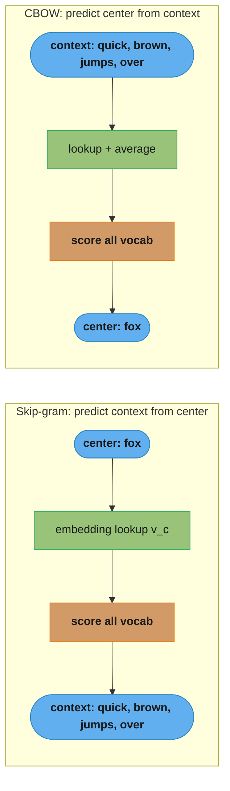
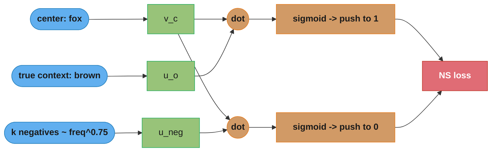
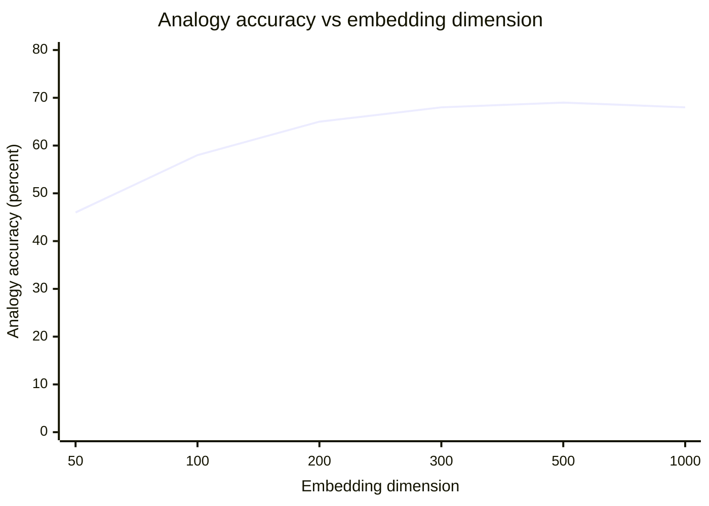
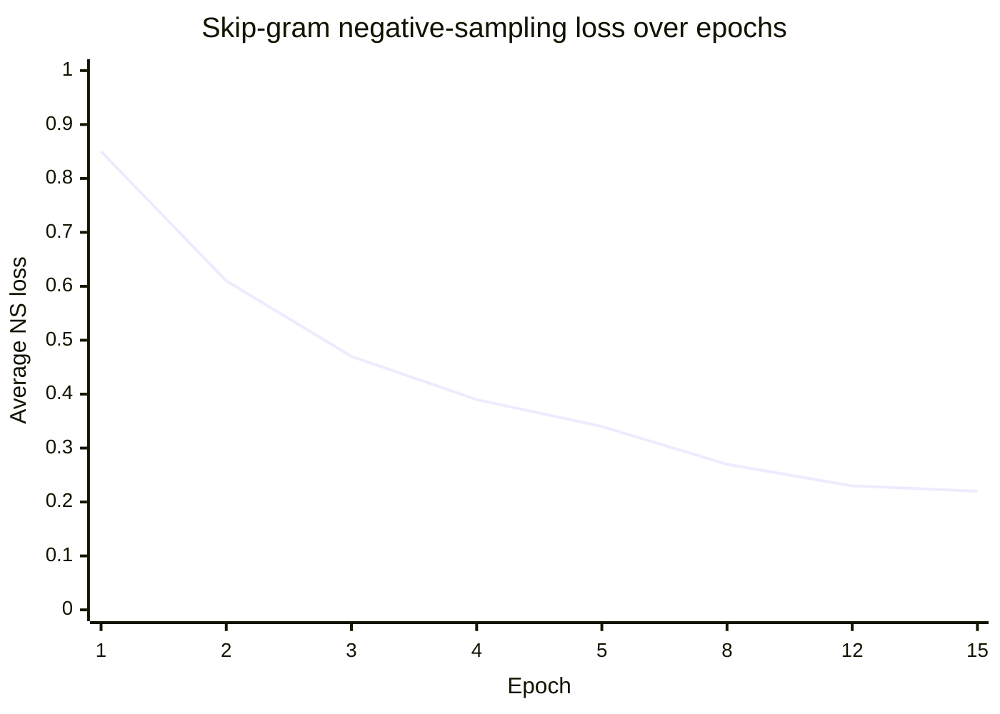

# Word Embeddings (Classic / Static)

> This file is a deep-dive sub-file of the [Natural Language Processing](README.md) module.
> It covers **static** word embeddings — word2vec (skip-gram, CBOW), GloVe, and fastText — where each
> word type gets exactly one vector regardless of context.
> Contextual embeddings (one vector per token *occurrence*) are covered in
> [BERT and Pretrained Models](bert_and_pretrained_models.md) and in the LLM section
> ([tokenization_and_embeddings](../../llm/tokenization_and_embeddings/), [embeddings_and_similarity_search](../../llm/embeddings_and_similarity_search/)).
> Sparse/lexical representations (TF-IDF, BM25) and dense retrieval live in
> [Text Representation and Retrieval](text_representation_and_retrieval.md).

---

## 1. Concept Overview

A word embedding maps every word in a vocabulary to a dense real-valued vector, typically of dimension
100–300, such that words with similar meanings land near each other. This replaced the one-hot / bag-of-words
world (a 1M-dimensional sparse vector where every word is orthogonal to every other) with a compact geometry
where `cosine("king", "queen")` is large and `cosine("king", "banana")` is small.

The breakthrough was **word2vec** (Mikolov et al. at Google, 2013): a shallow neural network trained on a
self-supervised task — predict a word from its neighbors, or its neighbors from it. No labels needed; the
signal is the raw text itself. Training on ~100 billion words of Google News produced 300-dim vectors that
famously supported vector arithmetic: `vec("king") - vec("man") + vec("woman") ≈ vec("queen")`. Two other
families followed: **GloVe** (Stanford, 2014) reframed the problem as factorizing a global word-word
co-occurrence matrix (count-based, aggregate statistics rather than streaming windows), and **fastText**
(Facebook, 2016) extended skip-gram with character n-grams, giving embeddings for out-of-vocabulary words and
capturing morphology (shared root of "run", "running", "runner").

These are called **static** embeddings because a word gets one fixed vector after training. "bank" (river)
and "bank" (finance) collapse into a single averaged vector — the biggest limitation, and the reason
contextual models (BERT, GPT) superseded them for most tasks. Static embeddings remain the right tool when
you need cheap, fast, offline vectors: feature inputs to classical models, fuzzy matching, initialization for
downstream networks, and any latency- or memory-constrained setting.

---

## 2. Intuition

**One-line analogy:** A word embedding is a word's GPS coordinate learned entirely from the company it keeps.

**Mental model:** Imagine cutting every word out of a billion sentences and sorting them by which words sit
nearby. "coffee" ends up next to "tea", "espresso", "mug", "morning"; "python" lands between two clusters
(snakes and code) and gets stuck at their average. Words are defined by their neighbors, not by a dictionary —
the **distributional hypothesis** (Firth, 1957): *"You shall know a word by the company it keeps."*

**Why it matters:** Dense geometry turns semantics into arithmetic — similarity becomes a dot product,
analogies become vector addition, and downstream models get a 300-dim input instead of a 1M-dim sparse one, so
they need far less data to generalize (they see "physician" and "doctor" as near-identical even if training
only had "doctor").

**Key insight:** word2vec never actually cares about its prediction task. Predicting context words is a
*pretext* — the real product is the weight matrix of the hidden layer. After training, the network's output
head is thrown away; the input embedding matrix `W ∈ R^{V×d}` is the deliverable. The task exists only to
force the geometry into shape.

---

## 3. Core Principles

**Distributional hypothesis.** Meaning is approximated by distribution over contexts. Two words that appear
in interchangeable contexts ("cat" / "dog" both follow "the", precede "barked/meowed", co-occur with "pet")
should get similar vectors. Every method here is a different way to compress a word's context distribution
into ~300 numbers.

**Skip-gram objective.** Given a center word `w_t`, maximize the probability of each context word `w_{t+j}`
within a window of size `c` (typically 5). The training objective averaged over the corpus is:

```
maximize  (1/T) Σ_t  Σ_{-c ≤ j ≤ c, j≠0}  log P(w_{t+j} | w_t)
```

with the naive softmax `P(w_o | w_c) = exp(u_o · v_c) / Σ_{w=1}^{V} exp(u_w · v_c)`, where `v_c` is the
center ("input") vector and `u_o` is the context ("output") vector. Each word has **two** vectors during
training; the input vectors are usually kept as the final embeddings.

**The softmax bottleneck.** The denominator sums over the entire vocabulary `V`. With `V = 1,000,000` and
`d = 300`, every training example costs 300M multiply-adds just for the normalizer — infeasible for the
billions of (center, context) pairs in a real corpus. word2vec is only tractable via two approximations that
avoid the full sum: negative sampling and hierarchical softmax.

**Negative sampling (the loss that is actually used).** Replace the `V`-way classification with a binary
one: is this (center, context) pair real, or was the context word drawn at random? For each true pair, draw
`k` negative words `w_i` from a noise distribution and maximize:

```
J = log σ(u_o · v_c)  +  Σ_{i=1}^{k} E_{w_i ~ P_n(w)} [ log σ(-u_{w_i} · v_c) ]
```

where `σ(x) = 1/(1+e^{-x})`. The first term pushes the true context up (toward σ=1); each negative term pushes
a random word down (toward σ=0). Cost per example is `O(k·d)`, not `O(V·d)`. The noise distribution is the
**unigram raised to the 3/4 power**, `P_n(w) ∝ freq(w)^{0.75}`, which flattens it so rare words are sampled
more than pure frequency allows. Use `k = 5–20` for small datasets, `k = 2–5` for large ones.

**Hierarchical softmax (the alternative).** Arrange the vocabulary as leaves of a binary Huffman tree.
`P(w | v_c)` becomes a product of `log₂(V) ≈ 20` binary decisions along the root-to-leaf path, each a
sigmoid over an inner-node vector, dropping cost from `O(V)` to `O(log V)`. Frequent words get shorter Huffman
paths, so they are cheaper. In practice negative sampling wins on frequent words and small `k`; hierarchical
softmax wins on rare words and very large vocabularies.

**Subsampling of frequent words.** Words like "the", "a", "of" co-occur with everything and carry little
signal. Each occurrence of word `w_i` is discarded with probability `P(discard) = 1 - sqrt(t / f(w_i))`,
where `f(w_i)` is the word's frequency and `t ≈ 1e-5`. This removes most stopword pairs, speeds training ~2x,
and improves rare-word vectors by widening effective windows.

**CBOW (Continuous Bag of Words).** The mirror image of skip-gram: average the context word vectors and
predict the center word. It trains ~faster (one prediction per window vs `2c`) and is better on frequent
words, but skip-gram gives better rare-word and small-corpus vectors because each context word becomes its
own training signal.

**GloVe — global co-occurrence factorization.** Build a global co-occurrence matrix `X` where `X_ij` counts
how often word `j` appears in the context of word `i` across the whole corpus. GloVe learns vectors so that
`w_i · w̃_j + b_i + b̃_j ≈ log(X_ij)`, minimizing a **weighted** least-squares loss:

```
J = Σ_{i,j}  f(X_ij) · ( w_i · w̃_j + b_i + b̃_j - log X_ij )²
```

The weighting function `f(x) = (x/x_max)^α` if `x < x_max` else `1` (`x_max = 100`, `α = 0.75`) damps very
frequent co-occurrences and zeroes out `X_ij = 0` cells so the sum skips empties. The insight GloVe exploits:
**ratios** of co-occurrence probabilities encode meaning — `P(ice|solid)/P(steam|solid)` is large,
`P(ice|gas)/P(steam|gas)` is small — and log-bilinear vectors capture exactly those ratios.

**fastText — subword embeddings.** Represent each word as itself plus its character n-grams (typically 3–6),
delimited by markers `<` and `>`: "where" (n=3) → `<wh, whe, her, ere, re>, <where>`. The word vector is the
**sum** of its subword vectors. Two payoffs: (1) OOV words get a vector by summing their known n-grams (no
`<UNK>`), and (2) morphology is shared — "running", "runner", "runs" all include the `run` root n-grams, so
they cluster even if some are rare.

---

## 4. Types / Architectures / Strategies

### 4.1 Method comparison

| Method | Company / Year | Learns from | OOV handling | Sweet spot |
|--------|----------------|-------------|--------------|-----------|
| **word2vec skip-gram** | Google, 2013 | local windows (streaming) | none (`<UNK>`) | small corpora, rare words, analogies |
| **word2vec CBOW** | Google, 2013 | local windows (streaming) | none (`<UNK>`) | large corpora, frequent words, speed |
| **GloVe** | Stanford, 2014 | global co-occurrence matrix | none (`<UNK>`) | reproducible, count-based, medium corpora |
| **fastText** | Facebook, 2016 | local windows + char n-grams | compositional (sum n-grams) | morphology-rich languages, typos, OOV |

### 4.2 Skip-gram vs CBOW

| Dimension | Skip-gram | CBOW |
|-----------|-----------|------|
| Direction | center → context | context → center |
| Predictions / window | `2c` (one per context word) | 1 (one center word) |
| Training speed | slower | ~faster |
| Rare-word quality | better | worse |
| Small-corpus quality | better | worse |
| Frequent-word quality | good | better |
| Default choice | when in doubt, skip-gram | when corpus is huge and words are common |

### 4.3 Softmax approximations

| Approach | Cost / example | Best for | Notes |
|----------|----------------|----------|-------|
| Full softmax | `O(V·d)` | never (baseline only) | intractable at `V = 1M` |
| Negative sampling | `O(k·d)`, `k = 5–20` | frequent words, small `k` | uses `freq^0.75` noise dist |
| Hierarchical softmax | `O(d·log V)` | rare words, huge vocab | Huffman tree, ~20 decisions at `V = 1M` |

### 4.4 Key hyperparameters (typical values)

| Hyperparameter | Typical | Effect |
|----------------|---------|--------|
| Dimension `d` | 100–300 | more dims → capacity, then diminishing returns past ~300 |
| Window `c` | 5 (2–10) | larger → more topical/semantic; smaller → more syntactic |
| Negative samples `k` | 5–20 small / 2–5 large | more → better but slower |
| Subsample threshold `t` | 1e-5 | lower → more aggressive stopword dropping |
| Min count | 5 | drop words seen fewer than 5 times |
| Epochs | 5–15 | more for small corpora |
| Noise power | 0.75 | flattens unigram for negative sampling |

---

## 5. Architecture Diagrams

### Skip-gram vs CBOW



*Skip-gram fans a center word out to each neighbor (2c predictions/window); CBOW averages neighbors to predict the middle. Same window, opposite arrows.*

### Negative sampling: one true pair vs k noise words



*Instead of normalizing over 1M words, each step does k+1 binary decisions: raise the true neighbor's dot product, lower k random words'.*

### fastText: OOV word built from character n-grams


*fastText never emits UNK: an unseen word gets a vector by summing its known n-grams, and shared roots (kick / kicking / kicker) overlap.*

### Analogy accuracy vs embedding dimension



*Analogy accuracy rises to ~300 dims then plateaus — why 300 is the word2vec/GloVe default; bigger vectors mostly waste memory.*

### Skip-gram negative-sampling training loss



*A healthy run drops fast then flattens; loss falling toward zero on a small corpus signals memorization — check analogy scores.*

---

## 6. How It Works — Detailed Mechanics

### From-scratch skip-gram with negative sampling (numpy)

The full training core — forward, negative sampling, and exact gradients for a single (center, context) pair,
vectorized over the `k` negatives.

```python
import numpy as np
from collections import Counter
from typing import Iterator

rng = np.random.default_rng(42)


def build_vocab(corpus: list[list[str]], min_count: int = 5) -> tuple[dict[str, int], np.ndarray]:
    """Return word->id map and the freq^0.75 negative-sampling distribution."""
    counts = Counter(w for sent in corpus for w in sent)
    vocab = {w: i for i, (w, c) in enumerate(counts.items()) if c >= min_count}
    freqs = np.array([counts[w] for w in vocab], dtype=np.float64)
    noise = freqs ** 0.75            # flatten the unigram: rare words sampled more
    noise /= noise.sum()
    return vocab, noise


class SkipGramNS:
    def __init__(self, vocab_size: int, dim: int = 300, k: int = 10, lr: float = 0.025):
        # Xavier-ish init; W_in are the vectors we keep, W_out are the "context" vectors
        self.W_in = (rng.random((vocab_size, dim)) - 0.5) / dim
        self.W_out = np.zeros((vocab_size, dim))
        self.k = k
        self.lr = lr

    def train_pair(self, center: int, context: int, noise: np.ndarray) -> float:
        v_c = self.W_in[center]                              # (dim,)
        # sample k negatives; resample the rare collision with the true context
        negs = rng.choice(len(noise), size=self.k, p=noise)
        targets = np.concatenate(([context], negs))         # (k+1,)
        labels = np.concatenate(([1.0], np.zeros(self.k)))  # 1 for true, 0 for noise

        u = self.W_out[targets]                             # (k+1, dim)
        scores = u @ v_c                                    # (k+1,)
        pred = 1.0 / (1.0 + np.exp(-scores))                # sigmoid

        # Loss = -[ label*log(pred) + (1-label)*log(1-pred) ]  summed over the k+1
        eps = 1e-9
        loss = -(labels * np.log(pred + eps) + (1 - labels) * np.log(1 - pred + eps)).sum()

        # Gradients: dL/dscore = (pred - label)
        grad = (pred - labels)                              # (k+1,)
        grad_v_c = grad @ u                                 # (dim,) accumulate over targets
        grad_u = np.outer(grad, v_c)                        # (k+1, dim)

        self.W_out[targets] -= self.lr * grad_u
        self.W_in[center]   -= self.lr * grad_v_c
        return float(loss)


def generate_pairs(sent: list[int], window: int = 5) -> Iterator[tuple[int, int]]:
    for i, center in enumerate(sent):
        dyn = rng.integers(1, window + 1)                   # dynamic window: nearer words weighted more
        for j in range(max(0, i - dyn), min(len(sent), i + dyn + 1)):
            if j != i:
                yield center, sent[j]
```

Two interview subtleties: (1) **the gradient `pred - label` is the entire backward pass** — a clean
consequence of pairing sigmoid with binary cross-entropy; (2) the **dynamic window** (sampling smaller than
the max) is word2vec's cheap way of down-weighting far context, since distant words are seen with lower
effective probability.

### Training with gensim (production path)

Nobody hand-rolls this in practice; gensim's C-backed word2vec trains 100M+ tokens in minutes.

```python
from gensim.models import Word2Vec, FastText

sentences: list[list[str]] = [["the", "quick", "brown", "fox"], ...]  # tokenized

w2v = Word2Vec(
    sentences,
    vector_size=300,     # d
    window=5,            # c
    min_count=5,         # drop rare words
    sg=1,                # 1 = skip-gram, 0 = CBOW
    hs=0, negative=10,   # negative sampling with k=10 (hs=1 would use hierarchical softmax)
    ns_exponent=0.75,    # noise distribution power
    sample=1e-5,         # subsampling threshold t
    epochs=10,
    workers=8,
)
w2v.wv.most_similar("king", topn=5)
w2v.wv.most_similar(positive=["king", "woman"], negative=["man"], topn=1)  # -> ~queen

# fastText: identical API, adds subword n-grams -> OOV vectors
ft = FastText(sentences, vector_size=300, window=5, min_n=3, max_n=6, sg=1, epochs=10)
ft.wv["kubernetesing"]  # returns a vector even though it was never seen
```

### Analogy arithmetic and evaluation

```python
import numpy as np


def analogy(wv, a: str, b: str, c: str, topn: int = 1) -> list[tuple[str, float]]:
    """a is to b as c is to ?  e.g. analogy(wv, 'man', 'king', 'woman') -> queen."""
    target = wv[b] - wv[a] + wv[c]
    target /= np.linalg.norm(target)
    # exclude the three query words from the answer (the classic 3COSADD rule)
    return wv.most_similar(positive=[target], topn=topn + 3)


# Intrinsic eval: Spearman correlation of model cosine vs human ratings (WordSim-353, SimLex-999)
from scipy.stats import spearmanr
model_sims = [wv.similarity(w1, w2) for w1, w2, _ in pairs if w1 in wv and w2 in wv]
human_sims = [h for w1, w2, h in pairs if w1 in wv and w2 in wv]
correlation = spearmanr(model_sims, human_sims).correlation  # ~0.65-0.75 for good vectors
```

### Loading pretrained GloVe as a frozen torch embedding layer

```python
import numpy as np
import torch
import torch.nn as nn


def load_glove(path: str) -> dict[str, np.ndarray]:
    """Parse glove.6B.300d.txt: '<word> f1 f2 ... f300' per line, 400K words."""
    emb: dict[str, np.ndarray] = {}
    with open(path, encoding="utf-8") as f:
        for line in f:
            parts = line.rstrip().split(" ")
            emb[parts[0]] = np.asarray(parts[1:], dtype=np.float32)
    return emb


def build_embedding_layer(
    vocab: dict[str, int], glove: dict[str, np.ndarray], dim: int = 300, freeze: bool = True
) -> nn.Embedding:
    weight = torch.empty(len(vocab), dim)
    nn.init.normal_(weight, std=0.1)                     # fallback for OOV words
    hits = 0
    for word, idx in vocab.items():
        if word in glove:
            weight[idx] = torch.from_numpy(glove[word])
            hits += 1
    print(f"GloVe coverage: {hits}/{len(vocab)} = {hits / len(vocab):.1%}")
    # freeze=True for tiny datasets (prevents overfitting); unfreeze once you have >50K examples
    return nn.Embedding.from_pretrained(weight, freeze=freeze, padding_idx=vocab.get("<pad>", 0))
```

---

## 7. Real-World Examples

**Google — word2vec (2013).** The original release trained on ~100 billion words of Google News and shipped
3 million 300-dim phrase vectors (`GoogleNews-vectors-negative300.bin`, ~3.5GB) — the default pretrained
embedding for a decade of NLP pipelines and the source of the `king - man + woman ≈ queen` demo. Training
used skip-gram with negative sampling (`k=5`), subsampling at `t=1e-5`, and phrase detection ("New_York" as
one token).

**Stanford — GloVe (2014).** Pennington, Socher, and Manning released `glove.6B` (400K words, 6B tokens of
Wikipedia + Gigaword) through `glove.840B.300d` (2.2M words, 840B tokens of Common Crawl). GloVe became the
academic standard because it is deterministic given the co-occurrence matrix and trains on aggregate counts,
making runs reproducible.

**Facebook — fastText (2016).** Bojanowski et al. released pretrained vectors for **157 languages** built
from character n-grams — transformative for morphologically rich languages (Finnish, Turkish, Arabic) where
word2vec's vocabulary explodes. fastText also powers Facebook's fast supervised text classifier, used
internally for language identification and tagging at scale.

**Airbnb / Spotify — everything2vec (2016–2018).** Airbnb applied skip-gram to **click sequences** — a session
of viewed listings is a "sentence", each listing a "word" — to drive similar-listing recs and search
personalization (KDD 2018 best paper). The same skip-gram-negative-sampling core powers item2vec (co-viewed
products), node2vec (graph walks), and Spotify track embeddings — word2vec's most durable legacy, cross-linked
in [Recommender Systems](../recommender_systems/README.md).

---

## 8. Tradeoffs

### Static embeddings vs contextual embeddings

| Dimension | Static (word2vec/GloVe/fastText) | Contextual (BERT/GPT) |
|-----------|----------------------------------|-----------------------|
| Vectors per word | 1 (fixed) | 1 per occurrence (context-dependent) |
| Polysemy ("bank") | collapsed to average | disambiguated by context |
| Inference cost | O(1) lookup, no model | full transformer forward pass |
| Memory | one `V×d` matrix (~1.2GB at V=1M, d=300) | model weights (100M–100B params) |
| Offline/edge use | trivial (a dict of arrays) | needs GPU/accelerator for latency |
| Training data | raw unlabeled text | raw unlabeled text |
| Best when | speed/memory bound, classical ML features | accuracy bound, ambiguity matters |

### word2vec vs GloVe vs fastText

| Property | word2vec | GloVe | fastText |
|----------|----------|-------|----------|
| Paradigm | predictive (local windows) | count-based (global matrix) | predictive + subword |
| OOV words | none | none | compositional |
| Morphology | ignored | ignored | captured via n-grams |
| Reproducibility | stochastic (SGD order) | deterministic given matrix | stochastic |
| Memory at train | streams windows, low RAM | co-occurrence matrix can be huge | streams + n-gram buckets |
| Typo robustness | poor | poor | good (shared n-grams) |

### Negative sampling vs hierarchical softmax

| | Negative sampling | Hierarchical softmax |
|--|-------------------|----------------------|
| Cost/example | `O(k·d)` | `O(d·log V)` |
| Frequent words | fast, high quality | short Huffman path -> cheap |
| Rare words | needs many negatives to cover them | longer Huffman path, but still `O(log V)` |
| Simplicity | very simple binary loss | binary tree bookkeeping |
| Default | yes (word2vec default `negative=5`) | use for very large vocab / rare-word focus |

---

## 9. When to Use / When NOT to Use

### Use static word embeddings when:

- You need **fast, cheap, offline vectors** — a dictionary lookup, no model to serve, sub-microsecond latency.
- Feeding **classical ML** (logistic regression, XGBoost, small CNN/LSTM) where a 300-dim dense input beats a
  1M-dim sparse one and cuts data requirements.
- You have a **specialized domain corpus** and want cheap in-domain vectors (product titles, log lines, DNA
  k-mers) — word2vec on 100M tokens takes minutes on a laptop.
- **Cold-start / bootstrapping** a downstream network's embedding layer (init with GloVe, then fine-tune).
- Morphology or OOV robustness dominates (misspellings, agglutinative languages) → **fastText**.

### Do NOT use static embeddings when:

- **Polysemy matters** — "bank", "apple", "python" need context → use contextual
  ([BERT](bert_and_pretrained_models.md), LLM embeddings).
- The task is **semantic sentence/passage similarity or retrieval** — averaging word vectors is a weak encoder;
  use SBERT/dense retrievers ([Text Representation and Retrieval](text_representation_and_retrieval.md),
  [embeddings_and_similarity_search](../../llm/embeddings_and_similarity_search/)).
- You need **state-of-the-art accuracy** on classification/NER/QA and have GPU budget — fine-tune a transformer.
- The corpus is **tiny** (<1M tokens) — vectors will be noisy; prefer pretrained GloVe/fastText.

---

## 10. Common Pitfalls

### Pitfall 1: Averaging word vectors ignoring stopwords and OOV

```python
# BROKEN: naive mean over all tokens; 'the'/'of' dominate, OOV crashes
def sentence_vec_broken(wv, tokens: list[str]) -> np.ndarray:
    return np.mean([wv[t] for t in tokens], axis=0)  # KeyError on OOV; stopwords swamp signal

# FIXED: skip OOV, weight by smooth inverse frequency (SIF), remove the top principal component
def sentence_vec(wv, tokens: list[str], word_freq: dict[str, float], a: float = 1e-3) -> np.ndarray:
    vecs = [(a / (a + word_freq.get(t, 0.0))) * wv[t] for t in tokens if t in wv]
    if not vecs:
        return np.zeros(wv.vector_size)
    return np.mean(vecs, axis=0)  # then subtract common component across corpus (Arora SIF)
```

Averaging raw word vectors is the most common misuse. SIF weighting (down-weight frequent words) plus removing
the first principal component beats plain averaging by 10+ points on sentence-similarity benchmarks — but a
real sentence encoder (SBERT) beats both.

### Pitfall 2: Cosine vs dot product with unnormalized vectors

```python
# BROKEN: dot product on raw word2vec vectors conflates similarity with word frequency
sim = query_vec @ candidate_vec          # frequent words have larger norms -> biased ranking

# FIXED: L2-normalize, then dot == cosine
q = query_vec / np.linalg.norm(query_vec)
c = candidate_vec / np.linalg.norm(candidate_vec)
sim = q @ c                              # cosine, frequency-invariant direction similarity
```

Word2vec vector **norms grow with word frequency**. Use cosine (normalized) for semantic similarity; raw dot
product silently ranks common words higher.

### Pitfall 3: Training on too little data and expecting good analogies

```python
# BROKEN: 500K-token corpus, expecting king-man+woman=queen
w2v = Word2Vec(small_corpus, vector_size=300, min_count=5, epochs=5)  # vectors are noise

# FIXED: use pretrained vectors, optionally continue-train on your domain text
from gensim.models import KeyedVectors
base = KeyedVectors.load_word2vec_format("GoogleNews-vectors-negative300.bin", binary=True)
# or: init a fresh model with pretrained weights, then train a few epochs on domain data
```

Analogy geometry needs billions of tokens — on small corpora start from pretrained vectors and adapt, never train 300-dim from scratch on <10M tokens.

### Pitfall 4: Bias baked into the embeddings

```python
# The classic WEAT finding: gender bias measured in the geometry itself
# analogy(wv, 'man', 'programmer', 'woman') -> 'homemaker'  (Bolukbasi et al. 2016)
# analogy(wv, 'man', 'doctor', 'woman')     -> 'nurse'
```

Embeddings learn societal bias from the corpus (WEAT — Word Embedding Association Test — quantifies it as an
effect size between target and attribute word sets). Downstream models inherit it: a resume-ranker on biased
vectors can systematically down-rank one gender. Debias (Bolukbasi/Hard-Debias) and audit with WEAT before
deploying. See [Responsible AI / Fairness](../case_studies/cross_cutting/responsible_ai_fairness_and_explainability.md).

### Pitfall 5: Vocabulary mismatch between training and serving

```python
# BROKEN: tokenizer at serving lowercases differently / strips punctuation differently
train_tok = "iPhone"           # trained token
serve_tok = "iphone"           # serving token -> OOV -> zero vector -> silent quality drop

# FIXED: freeze one tokenization function, use it identically for train and serve; log OOV rate
oov_rate = sum(t not in wv for t in serve_tokens) / len(serve_tokens)
assert oov_rate < 0.05, f"OOV rate {oov_rate:.1%} too high — tokenizer drift?"
```

Silent OOV from tokenizer drift is a top production failure. Pin the tokenizer, and monitor OOV rate as a
first-class metric — a spike means the vocabulary no longer matches the traffic.

---

## 11. Technologies & Tools

| Tool | Purpose | Notes |
|------|---------|-------|
| `gensim` | Train/load word2vec, fastText, load GloVe | C-backed, multi-threaded; the standard for classic embeddings |
| `fasttext` (Facebook) | Official fastText train + supervised classifier | `min_n`/`max_n` control n-gram range; 157 pretrained languages |
| GloVe (Stanford C) | Build co-occurrence matrix + factorize | Downloadable `glove.6B` / `glove.840B` vectors |
| `GoogleNews-vectors-negative300.bin` | Pretrained word2vec (3M words, 300d) | ~3.5GB; the canonical demo vectors |
| `WEAT` / `responsibly` | Measure and mitigate embedding bias | Bolukbasi debias, WEAT effect sizes |
| `scipy.stats.spearmanr` | Intrinsic eval vs WordSim-353 / SimLex-999 | correlation with human similarity ratings |
| `torch.nn.Embedding.from_pretrained` | Load GloVe/word2vec as a (frozen) layer | `freeze=True` for small data; `padding_idx` for pads |
| `annoy` / `faiss` | Approximate nearest-neighbor over vectors | fast `most_similar` at V = millions |

---

## 12. Interview Questions with Answers

**Q: Why does word2vec use negative sampling instead of the full softmax?**
The full softmax normalizes over the entire vocabulary, costing `O(V·d)` per example — infeasible at V=1M.
Negative sampling replaces the V-way classification with `k+1` independent binary decisions (real pair vs `k`
noise words), dropping cost to `O(k·d)` with `k=5–20`. The trick works because we do not need calibrated
probabilities — we only need vectors whose dot products separate true neighbors from random words. Use `k`
around 5–20 for small corpora and 2–5 for large ones.

**Q: What exactly is the negative sampling loss?**
It maximizes `log σ(u_o · v_c) + Σ_{i=1}^{k} log σ(-u_{n_i} · v_c)` for each (center, true-context) pair. The
first term raises the sigmoid of the true pair's dot product toward 1; each negative term raises the sigmoid
of the *negated* dot product, pushing random words toward 0. Negatives are drawn from `P(w) ∝ freq(w)^0.75`,
and the gradient at each score reduces to the clean `(sigmoid − label)`.

**Q: What is the distributional hypothesis?**
Words that occur in similar contexts tend to have similar meanings ("know a word by the company it keeps",
Firth 1957). Every embedding method operationalizes it by compressing a word's context distribution into a
dense vector. It is why "physician" and "doctor" — which share neighbors — land near each other even without
a dictionary. The hypothesis also explains the core limitation: words with multiple senses get averaged.

**Q: Why is the noise distribution raised to the 3/4 power?**
Raising unigram frequencies to 0.75 flattens the distribution so rare words are sampled as negatives more
often than pure frequency would allow. Pure unigram sampling would draw "the"/"of" almost every time,
wasting negatives on uninformative words; uniform sampling would ignore frequency entirely. The 0.75 power is
an empirical compromise Mikolov found best, boosting rare-word representation quality.

**Q: What is the difference between skip-gram and CBOW, and which is better?**
Skip-gram predicts context words from the center word; CBOW averages the context and predicts the center.
Skip-gram makes `2c` predictions per window so it extracts more signal per sentence — better on rare words
and small corpora — while CBOW is faster and slightly better on frequent words in large corpora. Default to
skip-gram when unsure, especially with limited data or when rare-word quality matters.

**Q: Why does each word have two vectors during training?**
word2vec learns an "input" vector `v_w` (used when the word is the center) and an "output" vector `u_w`
(used when the word is a context/negative). Separating them makes the optimization well-behaved — a word is
rarely its own neighbor, so tying the two would create odd self-similarity constraints. After training the
input matrix is kept as the embeddings; some setups average the two.

**Q: How does GloVe differ from word2vec?**
GloVe is count-based: it factorizes a global word-word co-occurrence matrix rather than streaming local
windows. It fits `w_i · w̃_j + b_i + b̃_j ≈ log X_ij` with a weighted least-squares loss, so it uses aggregate
corpus statistics directly and is deterministic given the matrix. word2vec is predictive and stochastic.
Quality is comparable; GloVe is favored for reproducibility, word2vec for streaming/online training.

**Q: What does GloVe's weighting function f(x) do?**
It damps the influence of very frequent co-occurrences and zeroes out empty cells so the loss skips them.
`f(x) = (x/x_max)^0.75` for `x < x_max=100`, else 1 — this stops ultra-frequent pairs like ("the","of") from
dominating the least-squares objective while still giving them nonzero weight. Without it, common-word
co-occurrences would swamp the informative rare-pair signal.

**Q: How does fastText handle out-of-vocabulary words?**
It represents each word as the sum of its character n-gram vectors (typically 3–6 chars), so an unseen word
still gets a vector by summing whatever known n-grams it contains. This also captures morphology — "running",
"runner", "runs" share the "run" n-grams — and makes vectors robust to typos. The cost is a larger memory
footprint for the n-gram buckets and slightly noisier vectors for very short words.

**Q: Why do word2vec vectors support analogies like king - man + woman = queen?**
Because consistent semantic relationships become roughly parallel offset vectors in the space — the
"male→female" direction is approximately the same vector whether applied to king/queen or actor/actress. The
skip-gram objective encodes such regularities as linear structure since it factorizes a (shifted PMI) matrix.
Note analogy accuracy is modest (~60–70% on the Google set) and the query words are excluded from candidate
answers (the 3COSADD rule).

**Q: What is subsampling of frequent words and why does it help?**
Each occurrence of a word is dropped with probability `1 - sqrt(t/f(w))` (`t≈1e-5`), removing most
stopword occurrences. It speeds training ~2x and improves rare-word vectors by effectively widening windows
(dropping "the" brings content words closer together). Frequent words carry little contextual signal, so
discarding most of their occurrences loses almost nothing.

**Q: What is the difference between intrinsic and extrinsic evaluation of embeddings?**
Intrinsic evaluation tests the vectors directly — analogy accuracy (Google set), similarity correlation with
human ratings (WordSim-353, SimLex-999, via Spearman). Extrinsic evaluation measures downstream task
performance (NER F1, classification accuracy) when the embeddings are used as features. Intrinsic scores are
cheap but can disagree with extrinsic — always validate on the actual downstream task before choosing.

**Q: Why are static embeddings bad at polysemy, and what fixes it?**
A static method assigns one vector per word type, so "bank" (river) and "bank" (finance) are forced into a
single averaged point in space. The fix is contextual embeddings (ELMo, BERT, GPT), which produce a different
vector for each occurrence based on surrounding words. If you must stay static, sense-specific embeddings
(one vector per word sense) are a partial workaround, but transformers dominate here.

**Q: How is bias measured in word embeddings?**
The WEAT (Word Embedding Association Test) computes an effect size for how much more strongly one set of
target words (e.g., male vs female names) associates with attribute words (e.g., career vs family) in cosine
space. Embeddings trained on human text reliably show gender, race, and age bias — famously
`man:programmer :: woman:homemaker`. Debias with projection methods (Bolukbasi) and audit with WEAT before a
model that inherits these vectors reaches production.

**Q: Should you use dot product or cosine similarity with word2vec vectors?**
Cosine, because word2vec vector norms grow with word frequency, so a raw dot product biases toward frequent
words. L2-normalizing both vectors makes the dot product equal to cosine, comparing direction (semantics)
independent of magnitude (frequency). Most `most_similar` implementations normalize internally for exactly
this reason.

**Q: How would you get a sentence embedding from word vectors?**
The cheap baseline is a weighted average — SIF (smooth inverse frequency) down-weights common words and then
removes the top principal component, beating plain averaging by ~10 points on similarity tasks. But averaging
discards word order and is a weak encoder; for real semantic similarity or retrieval use SBERT or a dense
encoder. Static-vector averaging is fine only as a fast, low-resource baseline.

**Q: When would you choose fastText over word2vec or GloVe?**
Choose fastText when morphology or OOV robustness matters — inflected/agglutinative languages (Finnish,
Turkish), noisy user text with typos, or any setting where words unseen at training must still get vectors.
Its subword composition provides all three. The tradeoffs are higher memory for n-gram buckets and slightly
noisier vectors for very short words, so for clean English with a fixed vocabulary word2vec/GloVe are fine.

**Q: Why is 300 the standard embedding dimension?**
Because analogy and similarity quality rises steeply up to roughly 300 dimensions then plateaus, so more
dimensions mostly waste memory and compute. Google News word2vec, GloVe's headline vectors, and most
fastText releases all ship at 300. Smaller (50–100) is fine for lightweight or low-resource settings;
going well above 300 rarely pays off for static embeddings.

---

## 13. Best Practices

1. **Prefer pretrained vectors unless you have >100M in-domain tokens** — training 300-dim vectors from
   scratch on small corpora yields noise; start from GloVe/fastText and adapt.
2. **Pick skip-gram with negative sampling as the default** (`sg=1, negative=10`); switch to CBOW only for
   very large corpora where speed dominates and words are common.
3. **Always L2-normalize before computing similarity** — word2vec norms encode frequency, so raw dot products
   bias toward common words.
4. **Use fastText when OOV, typos, or morphology matter** — its subword composition removes `<UNK>` entirely.
5. **Set `min_count≈5` and subsample (`sample=1e-5`)** — drops noise words and stopwords, speeds training,
   improves rare-word quality.
6. **Evaluate extrinsically, not just intrinsically** — high analogy scores do not guarantee downstream gains;
   validate on the real task.
7. **Pin the tokenizer across train and serve, and monitor OOV rate** — silent tokenizer drift is a top
   production failure mode.
8. **Audit for bias with WEAT before shipping** — embeddings inherit societal bias; debias or document it,
   especially for hiring/lending/moderation.
9. **Freeze pretrained embeddings on tiny datasets, unfreeze past ~50K examples** — prevents early overfitting
   of the embedding layer, then lets it adapt.
10. **Do not use averaged word vectors as your production sentence encoder** — SIF is a baseline only; use
    SBERT/dense retrievers for real similarity/retrieval.

---

## 14. Case Study

### Problem: Bootstrapping embeddings for a niche domain with limited data

**Context:** A fintech company needs to classify support tickets into 40 intent categories. The domain has
heavy jargon ("ACH return", "chargeback reversal", "3DS", "SEPA mandate") that general-English GloVe barely
covers. Labeled data is scarce: **8,000 tickets**. Unlabeled ticket text is more plentiful but still modest:
**12M tokens** — far below the billions word2vec needs to form good geometry from scratch.

**Data profile:** GloVe (`glove.6B.300d`) coverage on the ticket vocabulary is only **71%** — the missing 29%
are exactly the domain terms and product names carrying the intent signal. Training word2vec from scratch on
12M tokens gives noisy vectors (intrinsic correlation ~0.31 vs ~0.70 for pretrained).

**Phase 1 — Baseline (Day 1).** TF-IDF (unigrams + bigrams, 50K features) + Logistic Regression. Macro-F1:
**0.68**. Fast and offline, but jargon synonyms ("chargeback" vs "dispute") are unrelated features, so rare
intents suffer. Baseline detail: [text_representation_and_retrieval.md](text_representation_and_retrieval.md).

**Phase 2 — Frozen GloVe features (Week 1).** Averaged GloVe vectors (SIF-weighted, OOV skipped) into a
300-dim input for the same classifier. Macro-F1: **0.70**. Marginal — the 29% OOV domain terms (the
discriminative ones) fell back to zero vectors.

**Phase 3 — fastText on domain text + retrofitting (Week 2)**

```python
from gensim.models import FastText

# Train fastText on the 12M-token unlabeled ticket corpus: subword n-grams give
# OOV coverage for jargon AND handle the frequent typos in user-written tickets.
ft = FastText(
    domain_sentences, vector_size=300, window=5, min_count=3,
    min_n=3, max_n=6, sg=1, negative=10, sample=1e-5, epochs=25,  # more epochs: small corpus
)
# OOV coverage jumps to ~100% (compositional); "ACH", "chargeback", "SEPA" now have vectors.
print(ft.wv.most_similar("chargeback", topn=5))  # -> dispute, reversal, refund, claim, ...
```

Domain fastText fixed OOV but its **general**-word geometry ("payment", "account") was weaker than GloVe's
(only 12M tokens). Solution: a **hybrid init** — GloVe where available, domain-fastText for the OOV terms —
then fine-tune, keeping general structure while adding domain sense.

**Phase 4 — Fine-tuned embedding layer in a small network**

```python
import torch.nn as nn

# Hybrid init: GloVe for the 71% it covers, domain fastText for the 29% it doesn't.
# freeze=False because we now let 8K labels adapt the layer (with a low LR to avoid drift).
emb = build_hybrid_embedding(vocab, glove, domain_ft, dim=300)  # from Section 6 pattern
model = nn.Sequential(emb, nn.LSTM(300, 128, batch_first=True), ...)  # BiLSTM + linear head
# LR: 1e-3 for the head, 1e-4 for the embedding layer (discriminative LR prevents forgetting)
```

Macro-F1: **0.81**. The BiLSTM over hybrid embeddings captured word order and domain synonyms TF-IDF missed.

**Phase 5 — Reality check against a transformer.** Fine-tuning DeBERTa-v3-base (see
[bert_and_pretrained_models.md](bert_and_pretrained_models.md)) on the same 8K tickets hit Macro-F1 **0.87** —
better, since contextual vectors disambiguate "return" (product vs ACH), but it needs a GPU at serving
(18ms/ticket vs 0.4ms) and 4x the memory. **Decision:** two-tier routing — the static-embedding BiLSTM
(0.4ms, CPU-only) handles the ~85% of tickets it classifies with confidence >0.9, and the rest escalate to
DeBERTa. Blended Macro-F1 **0.85** at **~1/5** the average serving cost of DeBERTa-everywhere.

**Results:**

| Stage | Approach | Macro-F1 | Latency | Serving |
|-------|----------|----------|---------|---------|
| Baseline | TF-IDF + LR | 0.68 | 0.1ms | CPU |
| P2 | Frozen GloVe avg | 0.70 | 0.3ms | CPU |
| P4 | Hybrid GloVe+fastText, fine-tuned BiLSTM | 0.81 | 0.4ms | CPU |
| P5 | DeBERTa-v3-base | 0.87 | 18ms | GPU |
| Final | Confidence routing (BiLSTM → DeBERTa) | 0.85 | ~3ms avg | mostly CPU |

**Key decisions:**

- **fastText over word2vec** for the domain corpus — its subword composition solved the 29% OOV jargon and
  the typo-heavy user text that word2vec would have dropped to `<UNK>`.
- **Hybrid init (GloVe + domain fastText)** beat either alone; **discriminative learning rates** (1e-4 on the
  embedding layer, 1e-3 on the head) let 8K labels adapt the vectors without destroying pretrained structure —
  the small-data analog of transformer catastrophic-forgetting guardrails.
- **Static embeddings were not obsolete** — they delivered 94% of the transformer's F1 at 1/5 the cost by
  handling the easy majority, reserving the transformer for the ambiguous tail. Cross-links:
  [feature_engineering](../feature_engineering/README.md),
  [embeddings_and_similarity_search](../../llm/embeddings_and_similarity_search/).
