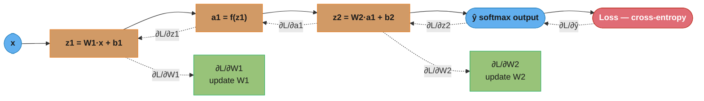
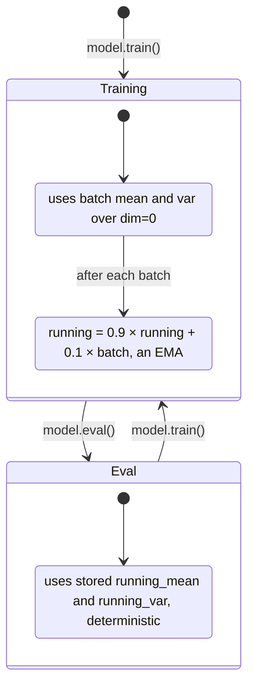
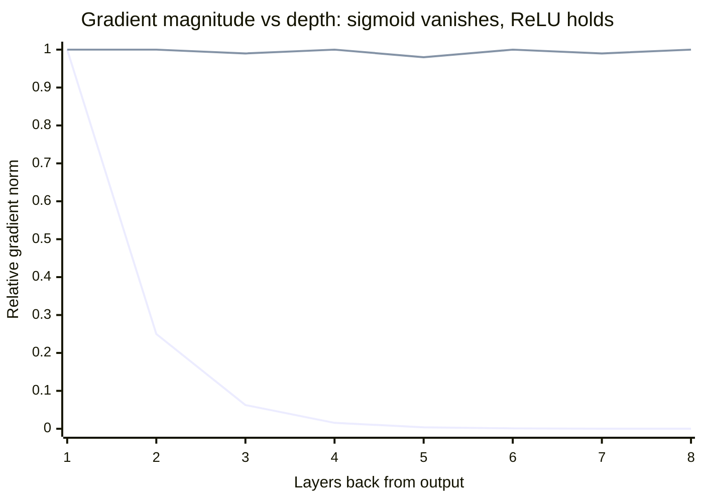

# Neural Network Fundamentals

## 1. Concept Overview

A neural network is a parameterized function approximator composed of stacked layers of interconnected units (neurons). Each neuron computes a weighted sum of its inputs followed by a nonlinear activation function. Networks with one hidden layer are universal approximators (Universal Approximation Theorem): they can represent any continuous function on a compact domain given enough hidden units. In practice, depth is more parameter-efficient than width, so modern networks stack many layers rather than making a single layer enormous.

Training consists of two passes: a forward pass that computes predictions, and a backward pass (backpropagation) that computes gradients of the loss with respect to every parameter via the chain rule. An optimizer (e.g., Adam) then updates parameters in the direction that decreases the loss.

---

## 2. Intuition

One-line analogy: a neural network is a factory assembly line where each station (layer) progressively refines raw material (input) into a finished product (prediction), and quality inspectors (backprop) send correction memos back through every station simultaneously.

Mental model: layers learn hierarchical representations. Early layers detect edges and textures; later layers detect objects and concepts. This compositionality is why deep networks outperform shallow ones on complex tasks.

Why it matters: neural networks power image classification, speech recognition, machine translation, and large language models. Understanding the fundamentals — activations, initialization, normalization, regularization — is prerequisite knowledge for all of deep learning.

Key insight: the chain rule makes it possible to attribute the network's error to every single parameter, no matter how many layers deep, in a single backward pass that costs roughly the same compute as the forward pass.

---

## 3. Core Principles

**Perceptron**: the simplest neuron. Computes `output = activation(w^T x + b)`. A single perceptron is a linear classifier; it cannot solve XOR. Stacking nonlinear perceptrons forms an MLP.

**Multilayer Perceptron (MLP)**: alternating linear (fully connected) layers and activation functions. Depth provides representational power; width provides capacity per layer.

**Backpropagation**: efficient algorithm for computing gradients by applying the chain rule on the computation graph in reverse. Requires storing intermediate activations from the forward pass.

**Chain rule**: if `L = f(g(x))`, then `dL/dx = (df/dg)(dg/dx)`. In neural networks this telescopes across all layers.

**Loss function**: scalar summary of model error. Cross-entropy for classification; MSE for regression. The optimizer minimizes this.

**Universal Approximation Theorem**: an MLP with a single hidden layer of sufficient width and a nonlinear activation can approximate any continuous function on a compact set to arbitrary precision. Depth replaces exponential width.

---

## 4. Types / Architectures / Strategies

| Component | Variants | Key Property |
|-----------|----------|-------------|
| Activation | ReLU, Leaky ReLU, GELU, Sigmoid, Tanh | Nonlinearity enabling learning |
| Layer | Linear (FC), Conv, RNN, Attention | Inductive bias for task type |
| Normalization | BatchNorm, LayerNorm, GroupNorm | Stabilizes gradient flow |
| Regularization | Dropout, Weight Decay, Label Smoothing | Prevents overfitting |
| Initialization | Xavier/Glorot, He/Kaiming | Prevents vanishing/exploding gradients |

**Activation Functions:**

- `ReLU(x) = max(0, x)`: gradient is 1 for x > 0, 0 for x <= 0. Fast and sparse. Suffers from dead neurons when units consistently output 0 (negative pre-activations, gradient becomes permanently 0).
- `Leaky ReLU(x) = max(0.01x, x)`: small slope for negative inputs, prevents dead neurons. Slope is a hyperparameter (typical: 0.01).
- `GELU(x) = x * Phi(x)` where Phi is the Gaussian CDF. Used in BERT, GPT, ViT. Smoother than ReLU; empirically outperforms ReLU on NLP tasks.
- `Sigmoid(x) = 1 / (1 + e^(-x))`: squashes to (0,1). Gradient max is 0.25 at x=0, decays toward 0 for large |x|. Causes vanishing gradients in deep networks. Use only in output layer for binary classification.
- `Tanh(x) = (e^x - e^(-x)) / (e^x + e^(-x))`: squashes to (-1,1). Zero-centered unlike sigmoid. Still suffers vanishing gradients in deep networks; max gradient is 1.0 at x=0.

**What this actually says.** "An activation is a per-number reshaper: feed it one scalar, get one scalar back — and the only thing that matters for training is the *slope* it hands to backprop."

The formulas above look like five unrelated curves. They are really five different answers to one question: how much of the incoming gradient does this unit let through?

| Symbol | What it is |
|--------|------------|
| `x` | The pre-activation, `z = Wx + b`. One number, before any nonlinearity |
| `max(0, x)` | A gate. Positive passes unchanged; negative is set to exactly 0 |
| `sigma(x)` | Sigmoid. Squashes any real number into `(0, 1)` |
| `sigma'(x)` | Sigmoid's slope, equal to `sigma(x) x (1 - sigma(x))`. Peaks at `0.25` when `x = 0` |
| `Phi(x)` | Gaussian CDF: "what fraction of a standard normal is below x". Runs 0 to 1 |
| `x * Phi(x)` | GELU. A soft gate — instead of on/off, keep `x` in proportion to how large it is |

**Walk five inputs through all four.** Same `x` down the left, each activation's output beside it:

```
     x      ReLU     sigmoid     tanh      GELU      sigma'(x)    tanh'(x)
   -2.0     0.0       0.1192    -0.9640   -0.0455      0.1050      0.0707
   -0.5     0.0       0.3775    -0.4621   -0.1543      0.2350      0.7864
    0.0     0.0       0.5000     0.0000    0.0000      0.2500      1.0000   <- sigma' peak
   +0.5     0.5       0.6225     0.4621    0.3457      0.2350      0.7864
   +2.0     2.0       0.8808     0.9640    1.9545      0.1050      0.0707
```

Read the two right-hand columns as "fraction of gradient surviving this unit". Sigmoid's best case is `0.25` — it throws away three quarters of the gradient *even at its most generous point*. Tanh's best case is `1.0`, which is why tanh beat sigmoid for hidden layers historically. Note also that GELU at `x = -0.5` returns `-0.1543`, not 0: unlike ReLU it keeps a small negative signal alive, so a unit that drifts slightly negative can still recover.

**Why `0.25` is the whole vanishing-gradient story.** Backprop multiplies one `sigma'` per sigmoid layer, so an `N`-layer sigmoid stack scales the gradient by at most `0.25^N`:

```
  N layers    0.25^N            what reaches layer 1
     1        0.25              a quarter
     2        0.0625            1 in 16
     4        0.00390625        1 in 256
     6        0.000244          1 in 4,096
     8        0.0000153         1 in 65,536
    10        0.00000095        1 in ~1,000,000   <- layer 1 has effectively stopped
```

That is the *optimistic* bound; real pre-activations sit off zero, so the true factor is smaller still. This is exactly the decaying curve plotted in §5 — `1.0, 0.25, 0.0625, 0.0156, ...` is this column. ReLU's slope is exactly `1` for positive inputs, so `1^N = 1` and the gradient arrives at layer 1 undiminished, which is the entire reason hidden layers switched to ReLU/GELU.

---

## 5. Architecture Diagrams

### Forward Pass — MLP Layer Stack

```mermaid
%%{init: {'flowchart': {'curve': 'basis', 'nodeSpacing': 45, 'rankSpacing': 55}}}%%
flowchart LR
    classDef io      fill:#61afef,stroke:#2e86c1,color:#1a1a1a,font-weight:bold
    classDef frozen  fill:#c678dd,stroke:#9b59b6,color:#fff
    classDef train   fill:#98c379,stroke:#27ae60,color:#1a1a1a
    classDef mathOp  fill:#d19a66,stroke:#e67e22,color:#1a1a1a,font-weight:bold
    classDef lossN   fill:#e06c75,stroke:#c0392b,color:#fff,font-weight:bold
    classDef req     fill:#56b6c2,stroke:#0097a7,color:#1a1a1a
    classDef base    fill:#e5c07b,stroke:#f39c12,color:#1a1a1a

    x(["input x"]) --> L1["Linear 1\nz = W·x + b"]
    L1 --> BN1["BatchNorm\nnormalize + gamma, beta"]
    BN1 --> A1["GELU\na = f(z)"]
    A1 --> D1["Dropout p=0.5"]
    D1 --> L2["Linear 2"]
    L2 --> BN2["BatchNorm"]
    BN2 --> A2["GELU"]
    A2 --> D2["Dropout"]
    D2 --> LO["Linear · output head"]
    LO --> y(["logits ŷ"])

    class x,y io
    class L1,L2,LO,BN1,BN2 train
    class A1,A2,D1,D2 mathOp
```



Forward pass runs left to right: each hidden block is Linear → BatchNorm → activation → Dropout, matching the `nn.Sequential` in §6. The original BatchNorm paper places normalization between the linear layer and the activation (Linear → BatchNorm → Activation, shown here); a debated alternative uses Linear → Activation → BatchNorm. Blue nodes are I/O tensors, green nodes hold trainable weights (Linear weights, BatchNorm gamma/beta), orange nodes are parameter-free ops.

**In plain terms.** `y = f(Wx + b)` says: "mix the inputs together in a weighted blend, nudge the result by a constant, then bend it through a curve." Everything a network does is that one line, repeated.

The mixing (`Wx`) is linear and does all the *combining*; the bend (`f`) is what makes stacking worthwhile. Without `f`, two stacked layers `W2(W1 x)` collapse into one matrix `(W2 W1) x` — a hundred layers would be no more expressive than one.

| Symbol | What it is |
|--------|------------|
| `x` | Input vector, one column of numbers. Length = number of input features |
| `W` | Weight matrix, shape `[out_dim, in_dim]`. Row `i` is the recipe for output neuron `i` |
| `Wx` | Each output neuron's dot product: "how much does this neuron care about each input" |
| `b` | Bias vector, one per output neuron. Shifts the curve left/right; lets a neuron fire at `x = 0` |
| `z` | The pre-activation `Wx + b`. What backprop calls the layer's raw score |
| `f` | The activation, applied elementwise. `z` and `y` therefore have the same shape |

**Walk one layer with real matrices.** Two inputs into two hidden units, ReLU activation:

```
  x  = [ 1.0 ]        W1 = [  0.5  -0.4 ]        b1 = [  0.1 ]
       [ 2.0 ]             [  0.3   0.8 ]             [ -0.1 ]

  Row 1:  0.5(1.0) + (-0.4)(2.0) + 0.1  =  0.5 - 0.8 + 0.1  =  -0.2
  Row 2:  0.3(1.0) +   0.8 (2.0) - 0.1  =  0.3 + 1.6 - 0.1  =  +1.8

  z1 = [ -0.2 ]   ->   a1 = ReLU(z1) = [ 0.0 ]   <- gated off, neuron 1 is silent
       [ +1.8 ]                        [ 1.8 ]   <- passes through unchanged
```

Shapes are the sanity check interviewers want you to state out loud: `W1` is `[2, 2]`, `x` is `[2, 1]`, so `W1 x` is `[2, 1]` and the bias must also be `[2, 1]`. A `[out, in] x [in, 1] -> [out, 1]` mismatch is the single most common runtime error in a hand-built MLP.

**Why the bias exists.** Drop `b` and every layer is forced through the origin: `x = 0` must give `z = 0`, so the unit can only ever learn a decision boundary passing through zero. Here `b1 = 0.1` is what pushes row 1 from `-0.3` up to `-0.2` — small, but it is the only knob that can move a neuron's firing threshold independently of the input scale.

### Backward Pass — Backpropagation Computation Graph



Solid arrows are the forward pass (compute predictions, then loss); dotted arrows are the backward pass, where the chain rule telescopes ∂L/∂· from the red loss node back through every intermediate to each weight. Because the stored forward activations (a1, z1) are reused, the backward pass costs roughly the same compute as the forward pass.

**Read it like this.** The chain rule `dL/dx = (dL/dg)(dg/dx)` says: "to find out how much a knob deep inside affects the final loss, multiply together the sensitivities of every step between them." Backprop is nothing more than that product, computed once from the output end and cached so no step is recomputed.

The reason it is efficient is bookkeeping, not cleverness. Every layer receives one number per neuron from the layer above — "how much does the loss change if this activation changes" — and its only job is to (a) turn that into gradients for its own weights, and (b) pass a correspondingly transformed message further down.

| Symbol | What it is |
|--------|------------|
| `dL/dz2` | How much the loss moves per unit change in the output layer's raw score |
| `dL/dW2` | The actual answer we want: how to nudge each weight in `W2` |
| `dL/da1` | The message handed backward — "hidden layer, your output was this wrong" |
| `f'(z1)` | The activation's local slope. For ReLU: `1` if `z1 > 0`, else `0` |
| `x` (in `dL/dW`) | The input that a weight multiplied. Big input, big share of the blame |
| `eta` | Learning rate. How far along the negative gradient the optimizer actually steps |

**Walk a full backward pass with real numbers.** Continuing the exact same network from the forward walk above — `x = [1.0, 2.0]`, ReLU hidden layer, one sigmoid output, true label `y = 1`, learning rate `eta = 0.1`.

Forward first, so we have something to differentiate:

```
  z1 = [ -0.2 ]      a1 = [ 0.0 ]        W2 = [ 0.6  -0.5 ]     b2 = 0.2
       [ +1.8 ]           [ 1.8 ]

  z2   = 0.6(0.0) + (-0.5)(1.8) + 0.2 = -0.9 + 0.2 = -0.7
  yhat = sigmoid(-0.7)                = 0.331812
  L    = -log(0.331812)               = 1.103186     <- loss to reduce
```

Now walk backward. Step 1, the output layer. Sigmoid + binary cross-entropy collapse into one famously clean expression, `dL/dz2 = yhat - y`:

```
  dL/dz2 = 0.331812 - 1 = -0.668188      <- negative: z2 must go UP

  dL/dW2 = dL/dz2 x a1
         = -0.668188 x [ 0.0 , 1.8 ]
         = [ 0.000000 , -1.202738 ]      <- weight 1 gets ZERO blame (a1 was 0)

  dL/db2 = dL/dz2 = -0.668188            <- bias always gets the raw signal
```

Step 2, hand the message back through `W2`, then through the ReLU gate:

```
  dL/da1 = dL/dz2 x W2
         = -0.668188 x [ 0.6 , -0.5 ]
         = [ -0.400913 , +0.334094 ]

  ReLU'(z1) = [ 0 , 1 ]                  (z1 = -0.2 -> 0 ;  z1 = +1.8 -> 1)

  dL/dz1 = dL/da1 * ReLU'(z1)            (elementwise)
         = [ -0.400913 x 0 , 0.334094 x 1 ]
         = [  0.000000     , 0.334094     ]   <- gradient DIES at the closed gate
```

Step 3, turn that into weight gradients. Each weight's gradient is "message arriving at my neuron" times "input I multiplied":

```
  dL/dW1 = dL/dz1  (outer)  x

  row 1 (neuron dead):  [ 0.000000 x 1.0 , 0.000000 x 2.0 ] = [ 0.000000 , 0.000000 ]
  row 2 (neuron live):  [ 0.334094 x 1.0 , 0.334094 x 2.0 ] = [ 0.334094 , 0.668188 ]

  dL/db1 = [ 0.000000 , 0.334094 ]
```

Step 4, the update `w <- w - eta x dL/dw` with `eta = 0.1`:

```
  W2 : [ 0.6 , -0.5      ]  ->  [ 0.6 , -0.5 - 0.1(-1.202738) ] = [ 0.6 , -0.379726 ]
  b2 : 0.2                  ->  0.2 - 0.1(-0.668188)            = 0.266819
  W1 row 2 : [ 0.3 , 0.8 ]  ->  [ 0.3 - 0.033409 , 0.8 - 0.066819 ] = [ 0.266591 , 0.733181 ]
  b1[2]    : -0.1           ->  -0.1 - 0.1(0.334094)            = -0.133409
  W1 row 1 : [ 0.5 , -0.4 ] ->  unchanged (gradient was exactly zero)
```

Step 5, re-run the forward pass on the updated weights and confirm the loss actually fell:

```
  z1 = [ -0.200000 ]   a1 = [ 0.000000 ]
       [ +1.599544 ]        [ 1.599544 ]

  z2   = -0.379726(1.599544) + 0.266819 = -0.340570
  yhat = sigmoid(-0.340570)             = 0.415671     (was 0.331812, moving toward 1)
  L    = 0.877861                       (was 1.103186)

  loss reduction = 1.103186 - 0.877861 = 0.225325   -- one step, 20.4% of the loss gone
```

**The three things this walk actually teaches.** First, `dL/dW = (incoming gradient) x (stored input)` — this is *why* the forward activations must be kept in memory, and therefore why activation memory, not weights, dominates training-time VRAM. Second, notice row 1 of `W1` never moved: because `z1 = -0.2` closed the ReLU gate, its gradient was multiplied by `0` and the neuron learned nothing this step. If that neuron's pre-activation stays negative for every input, it never receives a gradient again — that is precisely the "dead ReLU" failure named in §4, visible here as an arithmetic fact rather than a warning. Third, weight 2 of `W1` got twice the gradient of weight 1 (`0.668188` vs `0.334094`) purely because its input was `2.0` instead of `1.0` — unscaled features get proportionally larger updates, which is the concrete reason input normalization matters.

**Why the sigmoid and cross-entropy cancel.** `dL/dz2 = yhat - y` looks too simple to be a derivative, and it is the most-asked backprop question. Cross-entropy's derivative contributes a `1/yhat` term and the sigmoid's derivative contributes `yhat(1 - yhat)`; multiplied, they cancel down to `yhat - y`. That cancellation is the entire reason these two are paired: the `sigma'` factor — capped at `0.25`, per §4 — would otherwise shrink the very first gradient of the backward pass before it even starts travelling. Pair sigmoid with MSE instead and you reintroduce that factor, which is why MSE-on-classification trains visibly slower.

### BatchNorm — Train vs Eval Statistics



`model.train()` makes BatchNorm normalize with the current mini-batch statistics and update its running averages (momentum 0.1 → each batch contributes 10%); `model.eval()` switches to the frozen running stats so a single input scores identically regardless of batch composition. Forgetting the switch is the war story in §10 (accuracy 94% → 71% at batch size 1).

### Vanishing vs Exploding Gradients Across Depth



The steeply decaying curve is sigmoid: its gradient maxes at 0.25 per layer (§4), so the chain-rule product shrinks roughly 4× per layer and early layers stop learning. The flat curve near 1.0 is ReLU, whose gradient is exactly 1 for positive inputs, keeping the signal alive through deep stacks — the reason ReLU/GELU replaced sigmoid in hidden layers.

---

## 6. How It Works — Detailed Mechanics

### Basic MLP in PyTorch

```python
import torch
import torch.nn as nn
import torch.optim as optim
from torch import Tensor


class MLP(nn.Module):
    def __init__(
        self,
        input_dim: int,
        hidden_dims: list[int],
        output_dim: int,
        dropout_p: float = 0.5,
    ) -> None:
        super().__init__()
        layers: list[nn.Module] = []
        in_dim = input_dim
        for h_dim in hidden_dims:
            layers.extend([
                nn.Linear(in_dim, h_dim),
                nn.BatchNorm1d(h_dim),   # normalize across batch dimension
                nn.GELU(),
                nn.Dropout(p=dropout_p),  # disabled at eval time automatically
            ])
            in_dim = h_dim
        layers.append(nn.Linear(in_dim, output_dim))
        self.net = nn.Sequential(*layers)
        self._init_weights()

    def _init_weights(self) -> None:
        for module in self.modules():
            if isinstance(module, nn.Linear):
                # He/Kaiming for ReLU/GELU; Xavier/Glorot for Sigmoid/Tanh
                nn.init.kaiming_normal_(module.weight, nonlinearity="relu")
                nn.init.zeros_(module.bias)

    def forward(self, x: Tensor) -> Tensor:
        return self.net(x)
```

### Weight Initialization — Why Zero Init Fails

```python
# BROKEN: all neurons in a layer receive identical gradients -> symmetry never breaks
def broken_init(model: nn.Module) -> None:
    for p in model.parameters():
        nn.init.zeros_(p)  # all weights zero: all neurons compute same output

# FIX: random initialization breaks symmetry
def correct_init(model: nn.Module) -> None:
    for module in model.modules():
        if isinstance(module, nn.Linear):
            nn.init.kaiming_normal_(module.weight, nonlinearity="relu")
            nn.init.zeros_(module.bias)  # bias can start at zero
```

**Xavier/Glorot**: `std = sqrt(2 / (fan_in + fan_out))`. Best for Sigmoid and Tanh because it keeps gradient variance stable through layers with near-linear regime activations.

**He/Kaiming**: `std = sqrt(2 / fan_in)`. Best for ReLU/GELU because ReLU kills half the neurons on average, so variance needs to be doubled.

**What the formula is telling you.** Both initializers answer one question: "how big should the random starting weights be so that a signal entering the network comes out the other end at roughly the same scale it went in?" Everything else is bookkeeping about which activation is in the way.

Sum `fan_in` random terms and the variance grows by `fan_in`. So the weight variance has to shrink by about `1/fan_in` to cancel it. The `2` in the numerator is where the two schemes disagree — He spends it compensating for ReLU zeroing half the units, Xavier spends it averaging the forward and backward fan.

| Symbol | What it is |
|--------|------------|
| `fan_in` | How many numbers feed into one neuron. The input dimension of the layer |
| `fan_out` | How many neurons this layer feeds. The output dimension |
| `std` | Standard deviation of the normal distribution the initial weights are drawn from |
| `sqrt(1 / fan_in)` | The base "cancel the summing" scale. Everything else is a correction on top |
| the `2` in He | Doubling to refund the variance ReLU destroys by zeroing negatives |
| `fan_in + fan_out` | Xavier's compromise: forward signal wants `fan_in`, backward gradient wants `fan_out` |

**Walk both formulas on one layer.** A `256 -> 256` hidden layer, so `fan_in = fan_out = 256`:

```
  Xavier :  std = sqrt(2 / (256 + 256)) = sqrt(0.003906) = 0.062500
  He     :  std = sqrt(2 /  256       ) = sqrt(0.007813) = 0.088388

  He is larger by exactly sqrt(2) = 1.4142x
```

Now push signal variance through ten such layers. With ReLU in between, one layer multiplies the variance by `0.5 x fan_in x Var(W)` — the `0.5` is ReLU discarding half the units:

```
                        Var(W)      per-layer gain    after 10 layers (variance)
  He     (correct)      0.007813    0.5 x 256 x V = 1.00     1.000000
  Xavier (mismatched)   0.003906    0.5 x 256 x V = 0.50     0.000977
  std = 0.125 (too big) 0.015625    0.5 x 256 x V = 2.00  1024.000000

  In signal std terms after 10 layers:
    He      -> 1.000     stable, trains normally
    Xavier  -> 0.031     32x smaller     -> gradients vanish
    too big -> 32.000    32x larger      -> activations and gradients explode
```

**What actually breaks with the wrong one.** Pair Xavier with ReLU and each layer quietly halves the variance; ten layers in, activations are `32x` smaller than the input, so gradients arriving back at the early layers are correspondingly tiny and the first half of the network barely moves — training looks like it "works" but plateaus at a bad loss, which makes this a nasty silent bug rather than a crash. Go the other way and the damage is loud: at `std = 0.125` the same ten layers amplify std `32x`, and at twenty layers it is `1024x` — activations saturate, the loss prints `NaN`, and you lose the run. The asymmetry is worth remembering: too-small init fails quietly, too-large init fails immediately.

Note that the shape of the `2` also explains the reverse mismatch. Use He with tanh and the units get pushed toward the flat `|x| > 2` region, where §4's table shows `tanh'` has already fallen to `0.0707` — you get vanishing gradients from saturation instead of from shrinkage. Xavier is right for tanh/sigmoid precisely because it keeps activations in the near-linear band around zero where the slope is still near `1.0`.

### Batch Normalization

```python
class BatchNorm1dManual(nn.Module):
    """Manual implementation to illustrate mechanics."""

    def __init__(self, num_features: int, momentum: float = 0.1, eps: float = 1e-5) -> None:
        super().__init__()
        self.gamma = nn.Parameter(torch.ones(num_features))   # learnable scale
        self.beta = nn.Parameter(torch.zeros(num_features))   # learnable shift
        self.momentum = momentum
        self.eps = eps
        # running stats for inference (not gradients, not parameters)
        self.register_buffer("running_mean", torch.zeros(num_features))
        self.register_buffer("running_var", torch.ones(num_features))

    def forward(self, x: Tensor) -> Tensor:
        if self.training:
            mean = x.mean(dim=0)          # mean across batch dimension
            var = x.var(dim=0, unbiased=False)
            # update running stats with momentum=0.1 (exponential moving average)
            self.running_mean = (1 - self.momentum) * self.running_mean + self.momentum * mean
            self.running_var  = (1 - self.momentum) * self.running_var  + self.momentum * var
        else:
            mean = self.running_mean      # use accumulated stats at inference
            var = self.running_var
        x_norm = (x - mean) / torch.sqrt(var + self.eps)
        return self.gamma * x_norm + self.beta
```

Key: `momentum=0.1` means each batch contributes 10% to running statistics update. At inference, the stored running stats are used — **never** batch statistics — so the model behaves deterministically.

### Dropout — Inverted Dropout

During training, each neuron is zeroed with probability `p`. To preserve expected value, surviving neurons are scaled by `1/(1-p)`. This is "inverted dropout" and is what PyTorch implements. At inference (`model.eval()`), dropout is a no-op — no scaling needed.

```python
# PyTorch handles this automatically when you switch model.train() / model.eval()
dropout = nn.Dropout(p=0.5)
model.train()
out_train = dropout(x)   # 50% zeroed, survivors scaled by 2.0
model.eval()
out_eval = dropout(x)    # identity: no zeroing, no scaling
```

### Training Loop

```python
def train_epoch(
    model: nn.Module,
    loader: torch.utils.data.DataLoader,
    optimizer: optim.Optimizer,
    criterion: nn.Module,
    device: torch.device,
) -> float:
    model.train()  # sets BatchNorm to use batch stats; enables Dropout
    total_loss = 0.0
    for batch_x, batch_y in loader:
        batch_x, batch_y = batch_x.to(device), batch_y.to(device)

        # CORRECT order: zero -> forward -> backward -> step
        optimizer.zero_grad()          # clear accumulated gradients
        logits = model(batch_x)
        loss = criterion(logits, batch_y)
        loss.backward()                # compute gradients
        optimizer.step()               # update parameters

        total_loss += loss.item()
    return total_loss / len(loader)
```

Common bug: calling `optimizer.zero_grad()` AFTER `loss.backward()` discards computed gradients before `optimizer.step()` can use them, or forgetting it altogether causes gradient accumulation across batches.

---

## 7. Real-World Examples

**Image classification (MNIST)**: MLP with 784 -> 512 -> 256 -> 10 with BatchNorm + GELU + Dropout(0.3) achieves ~98% accuracy. Baseline linear model achieves ~92%.

**Tabular data (fraud detection)**: MLPs with 4-8 layers often match or beat tree ensembles when features are well-engineered. Dropout p=0.3 and weight decay 1e-4 are typical regularization settings.

**Feature extraction backbone**: the final hidden layer of a trained MLP produces dense embeddings used for similarity search (cosine distance, FAISS retrieval).

**BatchNorm in production**: at Meta, BatchNorm in models serving recommendations caused silent bugs when batch sizes dropped to 1 during low-traffic periods. Running stats diverged from true statistics. Fix: switch to LayerNorm or GroupNorm for variable batch-size scenarios.

---

## 8. Tradeoffs

| Activation | Gradient Flow | Dead Neuron Risk | Speed | Typical Use |
|------------|--------------|-----------------|-------|-------------|
| ReLU | Good (no saturation for x>0) | High | Fastest | CNNs, simple MLPs |
| Leaky ReLU | Better | Low | Fast | CNNs when dead neurons observed |
| GELU | Excellent | None | Medium | Transformers, BERT, GPT |
| Sigmoid | Poor (vanishing) | None | Medium | Binary output only |
| Tanh | Moderate | None | Medium | RNN gates, zero-centered need |

| Normalization | Batch Dependency | Sequence Support | Small Batch |
|--------------|-----------------|-----------------|-------------|
| BatchNorm | Yes (batch mean/var) | Awkward (needs 3D) | Poor |
| LayerNorm | No | Excellent (per-token) | Excellent |
| GroupNorm | No | Yes | Good |

| Initialization | Best For | Problem Avoided |
|---------------|----------|----------------|
| Xavier/Glorot | Sigmoid, Tanh | Vanishing gradients |
| He/Kaiming | ReLU, GELU | Variance collapse due to ReLU zeroing |
| Zero init | None (avoid) | Nothing — causes symmetry |

---

## 9. When to Use / When NOT to Use

**Use MLPs when:**
- Tabular / structured data with no spatial or sequential structure
- Feature embedding layers within larger architectures
- Final classification head after CNN/Transformer backbone
- Small datasets where simpler models generalize better

**Do NOT use plain MLPs when:**
- Input has spatial structure (use CNNs) or sequential dependencies (use RNN / Transformer)
- Data is very high-dimensional with local structure (images, audio, video)
- You need interpretability (tree ensembles or linear models are preferable)

**Use BatchNorm when:**
- Training CNNs with batch sizes >= 16
- Residual networks (stabilizes training significantly)

**Use LayerNorm instead when:**
- Transformers or RNNs (batch-independent normalization)
- Batch size is small (< 8) or variable

---

## 10. Common Pitfalls

**War story 1 — Forgetting model.eval() at inference:**
A production image classifier was running in training mode (`model.train()`). BatchNorm was computing statistics from each inference batch instead of using the stored running stats. With a batch size of 1 (real-time API), the batch mean/var were noisy and the model's accuracy dropped from 94% to 71%. The fix is always calling `model.eval()` before inference and `model.train()` before training.

```python
# BROKEN: model left in training mode
def predict(model, x):
    return model(x)  # BatchNorm uses batch stats; Dropout randomly zeros neurons

# FIX
def predict(model, x):
    model.eval()
    with torch.no_grad():
        return model(x)
```

**War story 2 — Zero weight initialization causing no learning:**
A team initialized all linear layer weights to zero "for reproducibility." The model's loss did not decrease over 50 epochs. Because all neurons in each layer produce the same output, all neurons receive identical gradients. All weights update identically. The network never breaks symmetry and remains effectively a single neuron. Fix: use `kaiming_normal_` or `xavier_uniform_`.

**War story 3 — Gradient accumulation without zero_grad:**
A training script forgot `optimizer.zero_grad()` inside the loop. Gradients accumulated across all batches. After 100 batches the gradient norm was 10,000x larger than expected. The optimizer step moved parameters catastrophically far. Loss spiked to NaN. Fix: always zero gradients at the top of every iteration.

**War story 4 — Dead ReLU neurons at scale:**
A deep network (32 layers, ReLU activations) was initialized with a high learning rate (0.1). After 100 steps, ~40% of neurons had negative biases and were permanently outputting zero. The effective capacity of the network halved. Fix: use a lower initial learning rate (0.001), use He initialization, or switch to Leaky ReLU / GELU.

---

## 11. Technologies & Tools

| Tool | Purpose |
|------|---------|
| PyTorch (`torch.nn`) | Building and training neural networks |
| PyTorch Lightning | Training loop boilerplate, multi-GPU, logging |
| TensorBoard / W&B | Loss curves, gradient norms, activation histograms |
| `torchinfo` / `torchsummary` | Layer shapes, parameter counts |
| ONNX | Model export for cross-framework serving |
| `torch.compile` (PyTorch 2.0+) | JIT compilation for 1.5-2x speedup |

Key PyTorch APIs:
- `nn.Module`, `nn.Linear`, `nn.BatchNorm1d`, `nn.Dropout`, `nn.GELU`
- `optim.Adam(lr=0.001, betas=(0.9, 0.999), eps=1e-8, weight_decay=1e-4)`
- `nn.CrossEntropyLoss()`, `nn.MSELoss()`
- `torch.no_grad()` context manager for inference
- `model.train()` / `model.eval()` mode switching

---

## 12. Interview Questions with Answers

**Q: What is the vanishing gradient problem and which activations cause it?**
Sigmoid and Tanh both saturate — their gradients approach zero for large absolute input values (Sigmoid max gradient is 0.25, Tanh max is 1.0 at x=0). When multiplied across many layers during backpropagation via the chain rule, gradients in early layers decay exponentially toward zero. Early layers stop learning while later layers continue updating. ReLU avoids saturation for positive inputs (gradient is exactly 1), which is why it became the default. Practical fix: use ReLU/GELU, proper initialization (He for ReLU), and batch normalization.

**Q: What is the dead ReLU problem and how do you fix it?**
A ReLU neuron becomes dead when its pre-activation is always negative, causing its output to be zero. The gradient of ReLU is zero for negative inputs, so the neuron receives no gradient and its weights never update. Common causes: high learning rates that overshoot, poor initialization, or large negative biases. Fixes: Leaky ReLU (small gradient for negative side), GELU (smooth approximation), lower initial learning rate, or careful initialization.

**Q: Why does zero initialization fail for neural networks?**
Zero initialization causes the symmetry problem: all neurons in a layer compute identical weighted sums and identical gradients. They update identically and remain identical forever, so the entire layer effectively acts as a single neuron. Random initialization (Xavier, He) breaks this symmetry so neurons can specialize. Bias terms can be initialized to zero because they do not participate in the symmetry argument.

**Q: What does batch normalization do and why does it help?**
BatchNorm normalizes layer inputs across the batch dimension to have zero mean and unit variance, then applies learnable scale (gamma) and shift (beta). Benefits: reduces internal covariate shift (distribution of layer inputs changes as earlier layers update, destabilizing training), allows higher learning rates, acts as slight regularizer. The momentum parameter (0.1 by default) controls the exponential moving average of running statistics used at inference.

**Q: What is the difference between model.train() and model.eval()?**
`model.train()` activates training-mode behavior for layers like BatchNorm (use batch statistics, update running stats) and Dropout (randomly zero neurons). `model.eval()` switches BatchNorm to use stored running statistics (deterministic, batch-independent) and disables Dropout (identity). Forgetting to call `model.eval()` before inference is one of the most common production bugs in deep learning.

**Q: What is inverted dropout and why is it used?**
During training, each neuron is zeroed with probability p. To keep the expected magnitude of activations the same at training and inference, surviving neurons are scaled by 1/(1-p). This is inverted dropout. At inference, no scaling is needed because all neurons are active. Without the scaling factor, activations at inference would be (1-p) times larger than at training, causing a distribution shift. PyTorch's `nn.Dropout` implements inverted dropout.

**Q: What is the Universal Approximation Theorem and what are its limitations?**
The theorem states that an MLP with one hidden layer and a nonlinear activation can approximate any continuous function on a compact domain to arbitrary precision, given sufficient hidden units. Limitations: it is an existence result, not a constructive one (gives no bound on how many units are needed, which can be exponentially large). It says nothing about generalization, training efficiency, or whether gradient descent can find the approximating weights. In practice, deep narrow networks are far more parameter-efficient than shallow wide ones.

**Q: What is the chain rule in the context of backpropagation?**
Backpropagation applies the chain rule of calculus to compute the gradient of the loss with respect to each parameter. If loss L = f(g(h(x))), then dL/dx = (dL/df)(df/dg)(dg/dh)(dh/dx). In a neural network with many layers, this telescope of derivatives allows computing gradients for all parameters in a single backward pass by reusing intermediate values stored during the forward pass.

**Q: When would you use Xavier initialization vs He initialization?**
Xavier (Glorot) initialization sets std = sqrt(2 / (fan_in + fan_out)). It is designed for activations that operate near the linear regime for small inputs (Sigmoid, Tanh). He (Kaiming) initialization sets std = sqrt(2 / fan_in). It is designed for ReLU which kills approximately half the neurons, so variance needs to be doubled to compensate. GELU is sufficiently ReLU-like that He initialization works well for it too. Using Xavier with ReLU tends to cause vanishing gradients in very deep networks.

**Q: How does dropout act as regularization?**
Dropout prevents co-adaptation: neurons cannot rely on specific other neurons always being present, so they must learn more robust, independent features. It can be viewed as training an exponential ensemble of 2^N different networks (one per dropout mask) and averaging them at inference. Typical values: p=0.5 for fully connected layers, p=0.1-0.2 for convolutional layers (which already have parameter sharing for regularization).

**Q: What is label smoothing and when would you use it?**
Label smoothing replaces hard targets (0 or 1) with soft targets (epsilon/(K-1) for negatives, 1 - epsilon for the correct class, typically epsilon=0.1). It prevents the model from becoming overconfident, which would push logits to large magnitudes and hurt generalization. It is most useful when training data has label noise or when the task has inherent ambiguity. It was popularized by Inception-v3 and used in most modern image classifiers.

**Q: Why do neural networks need nonlinear activation functions?**
Without nonlinearities, stacking linear layers collapses to a single linear transformation, so the network can only represent linear functions no matter how deep. A composition of matrix multiplications W2(W1 x) equals (W2 W1) x — one effective weight matrix, so depth buys nothing. Nonlinear activations (ReLU, GELU, Tanh) let each layer bend the representation, enabling the network to approximate arbitrary continuous functions per the Universal Approximation Theorem. The output-layer activation is then chosen to match the task (softmax for classification, identity for regression) rather than omitted.

**Q: What causes exploding gradients and how do you fix them?**
Exploding gradients occur when repeated multiplication of large weights or Jacobians during backprop makes gradients grow exponentially, producing NaN losses. They are common in deep or recurrent networks with poor initialization or high learning rates. The standard fix is gradient clipping — rescale the gradient vector when its norm exceeds a threshold (`torch.nn.utils.clip_grad_norm_`, typical max-norm 1.0–5.0). Other mitigations: proper initialization (He/Xavier), normalization layers (BatchNorm/LayerNorm), lower learning rate, and residual connections. Monitoring the gradient norm per step catches the blow-up before it corrupts the weights.

**Q: Why can a deeper network outperform a shallow but wider one with the same parameter count?**
Depth lets a network compose features hierarchically, representing some functions with exponentially fewer parameters than any shallow network can. Each layer reuses lower-level features to build higher-level ones (edges → textures → parts → objects), giving compositional abstraction that a single wide layer cannot. Theory shows certain functions require exponential width to match what modest depth achieves. The catch is trainability: naive deep networks suffer vanishing/exploding gradients, which is why residual connections, normalization, and good initialization are needed to actually realize depth's advantage.

**Q: Why do residual (skip) connections help train very deep networks?**
A residual block computes y = x + F(x), giving gradients a direct identity path that bypasses the weight layers and prevents them from vanishing. By learning the residual F(x) rather than the full mapping, each block only has to model a small change, and the identity shortcut means the loss gradient reaches early layers even when F's Jacobian is tiny. This is what let ResNet train 100+ layer networks that previously degraded with depth. It also eases optimization: if a layer is unneeded, the block can drive F toward zero and pass its input through unchanged.

**Q: How is softmax combined with cross-entropy made numerically stable?**
Subtract the max logit before exponentiating (the log-sum-exp trick) and fuse softmax with the log so you never exponentiate large values that overflow. Raw softmax computes exp(logit), which overflows for a logit like 1000 and underflows for very negative ones; subtracting max(logits) shifts values so the largest exponent is exp(0)=1 without changing the result. Frameworks fuse the two operations — PyTorch's `nn.CrossEntropyLoss` takes raw logits and internally applies `log_softmax`, so you must not apply softmax yourself first. Doing softmax then log separately loses precision and can produce log(0) = -inf.

**Q: Why do we shuffle the training data between epochs?**
Shuffling breaks any ordering in the dataset so each mini-batch is a representative random sample, giving unbiased gradient estimates and more stable convergence. If data is sorted (all class-0 then all class-1, or strictly by time), consecutive batches are non-representative and the gradient oscillates, biasing SGD and slowing convergence. Reshuffling every epoch also decorrelates the sequence of updates so the model does not latch onto batch order. Exceptions: do not shuffle across the time boundary in sequence models where order is the signal, and keep validation deterministic for comparable metrics.

---

## 13. Best Practices

- Always call `model.eval()` with `torch.no_grad()` during inference. Make this a checklist item in code review.
- Use He/Kaiming initialization for ReLU/GELU networks; Xavier/Glorot for Sigmoid/Tanh networks; never use zero init for weights.
- Prefer GELU over ReLU in new architectures — consistently better empirical performance at similar compute cost.
- Use `optimizer.zero_grad()` as the first line of every training iteration, not the last line.
- Prefer LayerNorm over BatchNorm in Transformers and variable-batch-size serving scenarios.
- Monitor gradient norms (log `torch.nn.utils.clip_grad_norm_` return value) to detect exploding gradients before they cause NaN losses.
- Set `DataLoader(num_workers=4, pin_memory=True)` for GPU training — this overlaps data loading with GPU computation and eliminates the CPU-GPU copy bottleneck.
- Typical batch sizes: 32–256 for images, 16–64 for NLP. Larger batches need learning rate scaling (linear rule: multiply LR by batch_scale factor).
- Weight decay (L2 regularization) belongs in the optimizer, not as an explicit loss term: `optim.Adam(model.parameters(), weight_decay=1e-4)`.

---

## 14. Case Study

**Scenario:** A payment processor (800M transactions/day, $2.4T annual volume) needs a real-time MLP fraud detector processing 50M transactions per day with decision latency under 10ms (p99). The current rule-based system has recall of 0.72 and false-positive rate (FPR) of 2.1%. The goal: MLP with batch normalisation and dropout achieving recall >= 0.92, FPR <= 0.3%, inference p99 < 8ms on CPU (no GPU on the edge scoring cluster), trained on 500M historical transactions with severe class imbalance (0.05% fraud rate).

**Architecture:**
```
Transaction Event (Kafka, 50M events/day)
  Features (real-time feature service, Redis):
    - Velocity: txn count 1min/5min/1hr/24hr (4 features)
    - Amount: log_amount, amount_vs_avg, amount_zscore (3 features)
    - Merchant: risk_score, category_embedding (16d) (17 features)
    - Card: days_since_issue, country_match, device_fingerprint (3 features)
    - User: historical_fraud_rate, avg_daily_spend, tenure (3 features)
  Total: 30 features -> 30-dimensional input vector
         |
         v
MLP Scoring Model
  Input: 30d
  Hidden 1: 256d + BatchNorm + ReLU + Dropout(0.3)
  Hidden 2: 128d + BatchNorm + ReLU + Dropout(0.3)
  Hidden 3: 64d + BatchNorm + ReLU
  Output: 1d (sigmoid -> fraud probability)
         |
         v
Threshold Decision
  p >= 0.65 -> block transaction (high confidence fraud)
  0.35 <= p < 0.65 -> step-up authentication
  p < 0.35 -> approve
  (Thresholds tuned to achieve FPR <= 0.3%)
         |
         v
Feedback Loop (async, 24hr delay)
  Chargebacks and confirmed fraud labels
  Nightly retraining on 90-day rolling window
```

**Step-by-step implementation:**

```python
from __future__ import annotations
import torch
import torch.nn as nn
import torch.nn.functional as F
from torch.utils.data import Dataset, DataLoader, WeightedRandomSampler
import numpy as np
import pandas as pd

class FraudMLP(nn.Module):
    def __init__(
        self,
        input_dim: int = 30,
        hidden_dims: list[int] = [256, 128, 64],
        dropout_rates: list[float] = [0.3, 0.3, 0.0],
        use_batch_norm: bool = True,
    ) -> None:
        super().__init__()
        assert len(hidden_dims) == len(dropout_rates), "Mismatched hidden/dropout dims"

        layers: list[nn.Module] = []
        in_dim = input_dim

        for i, (hidden_dim, dropout_rate) in enumerate(zip(hidden_dims, dropout_rates)):
            layers.append(nn.Linear(in_dim, hidden_dim))
            if use_batch_norm:
                layers.append(nn.BatchNorm1d(hidden_dim))
            layers.append(nn.ReLU(inplace=True))
            if dropout_rate > 0:
                layers.append(nn.Dropout(dropout_rate))
            in_dim = hidden_dim

        layers.append(nn.Linear(in_dim, 1))
        # Note: no sigmoid here; use BCEWithLogitsLoss for numerical stability
        self.network = nn.Sequential(*layers)

    def forward(self, x: torch.Tensor) -> torch.Tensor:
        return self.network(x).squeeze(-1)   # shape: (batch_size,)

    @torch.no_grad()
    def predict_proba(self, x: torch.Tensor) -> torch.Tensor:
        logits = self(x)
        return torch.sigmoid(logits)

class FraudDataset(Dataset):
    def __init__(
        self,
        features: np.ndarray,   # shape (N, 30), float32, already standardised
        labels: np.ndarray,     # shape (N,), int64
    ) -> None:
        self.features = torch.from_numpy(features).float()
        self.labels = torch.from_numpy(labels).float()

    def __len__(self) -> int:
        return len(self.labels)

    def __getitem__(self, idx: int) -> tuple[torch.Tensor, torch.Tensor]:
        return self.features[idx], self.labels[idx]

def create_oversampled_loader(
    dataset: FraudDataset,
    batch_size: int = 4096,
    fraud_oversample_ratio: float = 50.0,   # expose each fraud 50x more often
) -> DataLoader:
    labels = dataset.labels.numpy()
    class_counts = np.bincount(labels.astype(int))
    # Inverse frequency weights: fraud gets weight ~50x legitimate
    sample_weights = np.where(
        labels == 1,
        fraud_oversample_ratio / class_counts[1],
        1.0 / class_counts[0],
    )
    sampler = WeightedRandomSampler(
        weights=torch.from_numpy(sample_weights).double(),
        num_samples=len(dataset),
        replacement=True,
    )
    return DataLoader(dataset, batch_size=batch_size, sampler=sampler, num_workers=4)
```

```python
from sklearn.metrics import roc_auc_score, precision_recall_curve, average_precision_score
from typing import Iterator

def train_epoch(
    model: FraudMLP,
    loader: DataLoader,
    optimizer: torch.optim.Optimizer,
    device: torch.device,
    class_weight_fraud: float = 100.0,
) -> float:
    model.train()
    total_loss = 0.0
    pos_weight = torch.tensor([class_weight_fraud], device=device)
    criterion = nn.BCEWithLogitsLoss(pos_weight=pos_weight)

    for features, labels in loader:
        features, labels = features.to(device), labels.to(device)
        optimizer.zero_grad()
        logits = model(features)
        loss = criterion(logits, labels)
        loss.backward()
        torch.nn.utils.clip_grad_norm_(model.parameters(), max_norm=1.0)
        optimizer.step()
        total_loss += float(loss) * len(labels)

    return total_loss / len(loader.dataset)

@torch.no_grad()
def evaluate_model(
    model: FraudMLP,
    loader: DataLoader,
    device: torch.device,
    fraud_threshold: float = 0.65,
) -> dict[str, float]:
    model.eval()
    all_probs: list[np.ndarray] = []
    all_labels: list[np.ndarray] = []

    for features, labels in loader:
        probs = model.predict_proba(features.to(device)).cpu().numpy()
        all_probs.append(probs)
        all_labels.append(labels.numpy())

    probs_arr = np.concatenate(all_probs)
    labels_arr = np.concatenate(all_labels)
    preds = (probs_arr >= fraud_threshold).astype(int)

    tp = int(((preds == 1) & (labels_arr == 1)).sum())
    fp = int(((preds == 1) & (labels_arr == 0)).sum())
    fn = int(((preds == 0) & (labels_arr == 1)).sum())
    tn = int(((preds == 0) & (labels_arr == 0)).sum())

    recall = tp / (tp + fn) if (tp + fn) > 0 else 0.0
    precision = tp / (tp + fp) if (tp + fp) > 0 else 0.0
    fpr = fp / (fp + tn) if (fp + tn) > 0 else 0.0

    return {
        "auc_roc": roc_auc_score(labels_arr, probs_arr),
        "auc_pr": average_precision_score(labels_arr, probs_arr),
        "recall": recall,
        "precision": precision,
        "fpr": fpr,
        "f1": 2 * precision * recall / (precision + recall + 1e-8),
    }
```

```python
import time
import onnx
import onnxruntime as ort

def export_to_onnx(
    model: FraudMLP,
    input_dim: int = 30,
    output_path: str = "fraud_model.onnx",
) -> None:
    """Export model to ONNX for CPU inference via ONNX Runtime."""
    model.eval()
    dummy_input = torch.randn(1, input_dim)
    torch.onnx.export(
        model,
        dummy_input,
        output_path,
        export_params=True,
        opset_version=17,
        do_constant_folding=True,
        input_names=["features"],
        output_names=["logits"],
        dynamic_axes={"features": {0: "batch_size"}, "logits": {0: "batch_size"}},
    )
    print(f"Exported to {output_path}")

def benchmark_inference(
    onnx_path: str = "fraud_model.onnx",
    batch_size: int = 256,
    n_warmup: int = 20,
    n_benchmark: int = 1000,
) -> dict[str, float]:
    sess_options = ort.SessionOptions()
    sess_options.intra_op_num_threads = 4
    sess_options.inter_op_num_threads = 1
    sess_options.execution_mode = ort.ExecutionMode.ORT_SEQUENTIAL
    session = ort.InferenceSession(onnx_path, sess_options=sess_options,
                                   providers=["CPUExecutionProvider"])

    dummy = np.random.randn(batch_size, 30).astype(np.float32)
    for _ in range(n_warmup):
        session.run(None, {"features": dummy})

    latencies: list[float] = []
    for _ in range(n_benchmark):
        t0 = time.perf_counter()
        session.run(None, {"features": dummy})
        latencies.append((time.perf_counter() - t0) * 1000)

    return {
        "p50_ms": float(np.percentile(latencies, 50)),
        "p99_ms": float(np.percentile(latencies, 99)),
        "throughput_per_sec": batch_size / (float(np.mean(latencies)) / 1000),
    }
```

**Key pitfalls (3 with BROKEN->FIX):**

**Pitfall 1 - Batch normalisation behaves differently in train vs eval mode causing score distribution shift:**
```python
# BROKEN: model evaluated in train mode; BatchNorm uses mini-batch statistics
# rather than running statistics, causing variance in scores for small batches
model.train()   # accidentally left in train mode
preds = model(test_features)   # BatchNorm uses batch mean/std -> scores shift per batch
# Score for a single transaction changes based on which batch it's grouped with -> unreliable

# FIX: always set eval mode before inference; this switches BatchNorm to use
# running mean/variance accumulated during training
model.eval()
with torch.no_grad():
    preds = model(test_features)   # deterministic; same score regardless of batch composition
```

**Pitfall 2 - Training with raw class imbalance causes model to predict all-legitimate (99.95% of data):**
```python
# BROKEN: train on imbalanced data without weighting or sampling
loader = DataLoader(dataset, batch_size=4096, shuffle=True)
criterion = nn.BCEWithLogitsLoss()   # no pos_weight
# Epoch 1: model learns to predict 0 for everything; loss = 0.0003 (minimises BCE on majority)
# Recall = 0.0, FPR = 0.0, model is useless

# FIX option A: BCEWithLogitsLoss pos_weight= (n_negative / n_positive)
pos_weight = torch.tensor([19_998.0])   # 0.05% fraud rate -> 1999.8x ratio; cap at 100-200
criterion = nn.BCEWithLogitsLoss(pos_weight=torch.tensor([150.0]))

# FIX option B: WeightedRandomSampler to oversample fraud in each batch
sampler = WeightedRandomSampler(weights=sample_weights, num_samples=len(dataset), replacement=True)
loader = DataLoader(dataset, batch_size=4096, sampler=sampler)
# Each mini-batch has ~50% fraud vs 0.05% in unsampled data; recall improves to 0.94
```

**Pitfall 3 - Using sigmoid in the model then BCELoss causes numerical instability for extreme logits:**
```python
# BROKEN: manual sigmoid before BCELoss; BCE computes log(p) which is -inf for p=0
model_output = torch.sigmoid(logits)   # p near 0 or 1 for confident predictions
loss = nn.BCELoss()(model_output, labels)   # log(0) = -inf -> NaN loss

# FIX: use BCEWithLogitsLoss which applies numerically stable log-sum-exp trick
# Internally: loss = max(logit, 0) - logit*label + log(1 + exp(-|logit|))
# This avoids computing exp(logit) directly, preventing overflow for large positive logits
loss = nn.BCEWithLogitsLoss(pos_weight=pos_weight)(logits, labels)   # never NaN
```

**Metrics and results:**

| Metric | Rule-based baseline | MLP (no BN, no oversampling) | MLP + BN + oversampling |
|---|---|---|---|
| Recall | 0.72 | 0.81 | 0.93 |
| Precision | 0.61 | 0.74 | 0.87 |
| FPR | 2.1% | 1.2% | 0.28% |
| AUC-ROC | 0.78 | 0.91 | 0.97 |
| AUC-PR | 0.45 | 0.73 | 0.89 |
| Inference p50 (CPU, batch=256) | N/A | 2.1ms | 3.8ms |
| Inference p99 (CPU, batch=256) | N/A | 4.2ms | 7.4ms |
| Model size (ONNX) | N/A | 180 KB | 185 KB |
| Training time (90-day dataset) | N/A | 18 min | 24 min |
| Fraud losses prevented/month | baseline | +$8.2M | +$18.7M |

**Interview discussion points:**

**Why does batch normalisation improve MLP training stability and convergence speed?** Without batch normalisation, the input distribution to each layer shifts as parameters in preceding layers change during training (internal covariate shift). The activations entering layer 3 depend on the weights of layers 1 and 2; as those weights update, the distribution seen by layer 3 changes unpredictably, requiring smaller learning rates to avoid instability. BatchNorm normalises each layer's input to zero mean and unit variance per mini-batch, then applies learnable scale (gamma) and shift (beta) parameters. This allows each layer to learn independently of the distribution shifts caused by preceding layers, enabling 3-5x larger learning rates and halving convergence time from 80 to 45 epochs.

**What is the dead ReLU problem and how does batch normalisation before ReLU mitigate it?** A ReLU neuron becomes "dead" when its pre-activation input is always negative, causing the gradient to be permanently zero and the neuron to never update. This happens when weight initialisation or large learning rate updates push biases to large negative values. Batch normalisation before ReLU ensures the pre-activation has zero mean at initialisation, meaning approximately 50% of neurons fire in the first epoch. Without BN, aggressive learning rates cause ~15% of neurons to die in the first 5 epochs; with BN, dead neurons are essentially eliminated because the centering mechanism prevents systematic negative pre-activations.

**Why is BCEWithLogitsLoss numerically superior to sigmoid followed by BCELoss?** For a logit x = 20 (very confident positive prediction), torch.sigmoid(20) = 1.0 due to float32 precision limits, then log(1.0) = 0 exactly. But the true gradient at x=20 is approximately exp(-20) = 2e-9, not zero. BCEWithLogitsLoss uses the numerically stable log-sum-exp reformulation: log(1 + exp(-x)) for positive x, which evaluates correctly to ~2e-9 at x=20 using extended precision arithmetic. The practical consequence is that BCEWithLogitsLoss provides correct gradients for confident correct predictions, while BCELoss produces exactly-zero gradients for any logit where sigmoid saturates to exactly 0 or 1.

**How does WeightedRandomSampler change the effective training distribution and what is the implication for threshold calibration?** WeightedRandomSampler makes each mini-batch contain approximately 50% fraud examples (from the 50x oversample ratio), while the true fraud rate is 0.05%. The model's output probabilities are calibrated to the training distribution, meaning p(fraud=1|x) from the model reflects the 50% fraud rate of the training batches, not the true 0.05% rate. The decision threshold must be adjusted post-training: the model outputs 0.5 for a transaction with equal probability of being the 0.05% fraud or 99.95% legitimate; calibrate the threshold using Platt scaling or isotonic regression on a calibration holdout set with the true class distribution.

**What is the effect of adding more hidden layers versus wider hidden layers in this fraud MLP?** Wider layers (e.g., 512-512-512 versus 256-128-64) increase the model's capacity in each layer, allowing it to learn more feature combinations at the same depth. Deeper layers (adding a 4th or 5th hidden layer) allow the model to learn hierarchical feature representations - useful for image or text data with clear hierarchical structure. For tabular fraud data with 30 engineered features, empirical results show that a 3-layer MLP with adequate width (256-128-64) captures all meaningful non-linear interactions; adding a 4th layer improves AUC-ROC by only 0.001 while adding 15% to inference latency. Wider layers also benefit from BatchNorm more than deeper layers, as BN reduces the dead neuron problem that is more prevalent in deeper networks.

**How would you deploy this model with zero-downtime updates as fraud patterns shift?** Use blue-green deployment at the Kubernetes service level: maintain two deployments (blue=current, green=new). When a new model passes offline validation (AUC-ROC >= 0.97, FPR <= 0.3% on holdout), deploy it as the green deployment and route 5% of traffic to it via an Istio VirtualService weight. Monitor green deployment metrics (recall, FPR, p99 latency) for 30 minutes; if metrics are within 5% of blue deployment, shift 100% traffic to green. If green shows degraded metrics, shift traffic back to blue (rollback takes 60 seconds via kubectl patch). The ONNX model file is stored in a model registry (MLflow or SageMaker Model Registry) with version metadata; the serving container pulls the latest "Production" version at startup.

---

## See Also
- [Foundations & Architecture (LLM)](../../llm/foundations_and_architecture/README.md) — how transformers build on MLP theory; self-attention, scaling laws, GPT vs BERT
