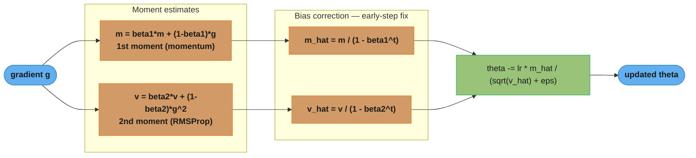
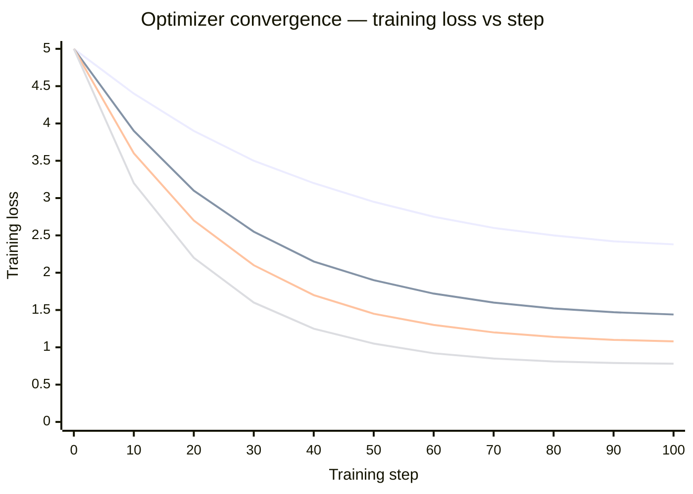
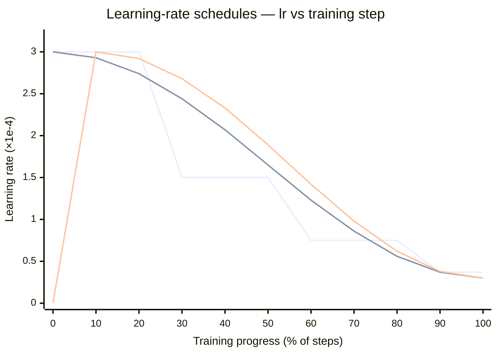
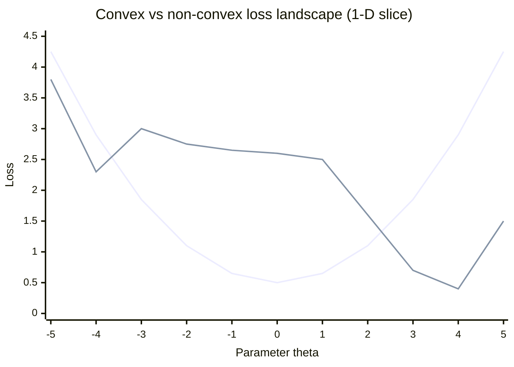

# Optimization Theory for ML

## 1. Concept Overview

Optimization is the process of finding parameter values that minimize (or maximize) an objective function. In machine learning, the objective is typically a loss function measuring how poorly the model's predictions match the ground truth. Training a neural network is entirely an optimization problem: starting from random weights, iteratively adjust them to reduce loss.

The dominant approach is first-order gradient-based optimization — using the gradient of the loss to determine the direction and magnitude of each parameter update. Second-order methods (using curvature information) are more powerful but computationally infeasible for models with billions of parameters. Modern optimizers like Adam approximate curvature adaptively, capturing most of the benefit at first-order cost.

Understanding optimization theory explains why models sometimes fail to train (learning rate too high, gradient explosion), why they converge slowly (learning rate too low, ill-conditioned loss landscape), and which optimizer is appropriate for which setting.

---

## 2. Intuition

> **One-line analogy**: Training a neural network is like hiking down a foggy mountainous terrain — you can only feel the local slope (gradient) underfoot, so you must choose your step size and direction wisely to reach the valley.

**Mental model**: Imagine the loss landscape as a high-dimensional terrain. A valley is a local minimum; a bowl-shaped landscape is convex and has one global minimum. In the fog (you cannot see far), you take a step proportional to the local slope (gradient descent). If the step is too large, you overshoot into a higher region; if too small, you take forever. Momentum is like gaining speed rolling downhill — it helps you coast through shallow flat regions. Adam equips every parameter with its own adaptive step size based on how noisy its gradient has been.

**Why it matters**: The optimizer determines whether a model trains at all, how fast it converges, and its final performance. Using SGD with default learning rate on a transformer will diverge; using Adam with the wrong beta values will underfit. Practical ML engineering requires knowing the optimizer, the schedule, gradient clipping thresholds, and when to switch.

**Key insight**: Most neural network loss landscapes are non-convex and high-dimensional, but they rarely have problematic local minima — overparameterized networks tend to have many global (or near-global) minima connected by flat paths. The real obstacles are saddle points, sharp valleys (ill-conditioning), and gradient pathologies (exploding/vanishing).

---

## 3. Core Principles

- **Gradient descent**: theta = theta - lr * grad_theta(L). The gradient points toward steepest ascent; we go the opposite direction.
- **Learning rate (lr)**: the most important hyperparameter; too large = divergence; too small = slow convergence.
- **Stochastic gradient**: instead of computing the gradient on the entire dataset (expensive), use a mini-batch of 32-256 samples. Gradient estimate is noisy but unbiased.
- **Convergence for convex functions**: gradient descent converges to the global minimum; for strongly convex functions, the convergence rate is geometric (linear convergence).
- **Non-convex landscape**: neural network loss has many local minima, saddle points, and plateaus. SGD noise helps escape saddle points.
- **Gradient clipping**: if ||gradient|| > threshold, rescale gradient so its norm = threshold. Prevents gradient explosion in RNNs and transformers during early training.
- **Weight initialization**: critical for training dynamics; bad initialization puts you in pathological regions of the loss landscape before training begins.
- **Adaptive learning rates**: scale the effective learning rate per parameter based on gradient history; parameters with noisy gradients get smaller effective steps.

### Decoding the gradient descent rule

**In plain terms.** "Feel which way the ground slopes under your feet, then step the other way — and make the step longer where the slope is steeper."

Every optimizer on this page is a variation on that one sentence. Momentum changes *which direction* you step, Adam changes *how long* the step is per parameter, but the "walk downhill" skeleton never changes.

| Symbol | What it is |
|--------|------------|
| `theta` | The parameters (weights). Your current position on the loss terrain |
| `L` | The loss. The altitude of the terrain at that position — lower is better |
| `grad_theta(L)` | The slope of the loss at your position. Points *uphill*, toward more loss |
| the minus sign | Flips uphill into downhill. Drop it and you would climb toward worse loss |
| `lr` | Step size multiplier. What fraction of the slope you actually walk each step |
| `lr * grad` | The step itself. Steep ground gives a long step, flat ground a short one |

**Walk one example.** A one-parameter bowl `L(theta) = theta^2`, so `grad = 2*theta`. Start at `theta = 1.0` with `lr = 0.1`:

```
  step   theta     L(theta)   grad = 2*theta   step = -lr*grad   new theta
    1    1.0000     1.0000        +2.0000          -0.2000        0.8000
    2    0.8000     0.6400        +1.6000          -0.1600        0.6400
    3    0.6400     0.4096        +1.2800          -0.1280        0.5120
    4    0.5120     0.2621        +1.0240          -0.1024        0.4096
    5    0.4096     0.1678        +0.8192          -0.0819        0.3277

  Loss fell 1.0000 -> 0.1678 across five steps, and each step is 20% shorter
  than the last. Nobody shrank the step by hand -- the gradient shrinks as the
  minimum nears, so the algorithm brakes automatically on its own approach.
```

**Why `lr` is the hyperparameter everything hinges on.** Same bowl, same start, three learning rates:

```
  lr = 0.10  ->  1.000,  0.800,  0.640,  0.512     converges smoothly, never overshoots
  lr = 0.60  ->  1.000, -0.200,  0.040, -0.008     overshoots past 0 but still converges
  lr = 1.10  ->  1.000, -1.200,  1.440, -1.728     overshoots further each time: diverges
```

At `lr = 1.10` each step jumps past the minimum to a point *farther* from it than where it started, so the next gradient is larger, so the next step is longer still. That runaway is the "too large = divergence" failure in the bullet above, and it is why the LR range test (Section 6) exists.

---

## 4. Types / Architectures / Strategies

### 4.1 Gradient Descent Variants

| Variant | Batch Size | Gradient Estimate | Pros | Cons |
|---------|-----------|------------------|------|------|
| Batch GD | All N samples | Exact | Stable convergence | Expensive per step; no noise to escape saddle points |
| SGD | 1 sample | Very noisy | Cheapest per step; noise helps generalization | High variance; hard to tune lr |
| Mini-batch SGD | 32-256 | Approximately unbiased | Balance of speed and stability | Still requires lr tuning |

**What this actually says.** "Averaging more samples per step buys you a cleaner gradient, but the cleanliness improves only with the *square root* of the samples while the cost grows in a straight line."

That square-root law is the entire reason mini-batch won. It is not a compromise chosen for tidiness — it is where the curve of diminishing returns bends.

| Symbol | What it is |
|--------|------------|
| `N` | Total training samples in the dataset |
| `B` | Batch size — samples averaged into one gradient estimate |
| `N / B` | Optimizer steps per epoch. Small batch = many cheap updates |
| noise ~ `1/sqrt(B)` | Standard error of the mean. Averaging `B` samples shrinks noise by `sqrt(B)` |
| "unbiased" | The noisy estimate is *centred* on the true gradient — the errors cancel over steps |

**Walk one example.** One epoch over `N = 50,000` samples, four batch sizes:

```
  batch B    steps per epoch    gradient noise ~ 1/sqrt(B)    samples touched per step
       1          50,000               1.000                          1
      32           1,562               0.177                         32
     256             195               0.063                        256
  50,000               1               0.0045                    50,000

  B: 1 -> 32     32x the work per step, noise cut to 17.7%, still 1,562 updates/epoch
  B: 32 -> 256    8x the work per step, noise cut only a further 2.83x, 195 updates left
  B: 256 -> 50k  195x the work per step, noise cut a further 14x, and ONE update/epoch
```

The first jump is a bargain and the last is a disaster: full-batch GD buys the cleanest possible gradient and then spends it on a single parameter update per pass over the data. The 32-256 band in the table is simply where "noise low enough to be stable" first meets "steps numerous enough to make progress."

**Why unbiased is the word that matters.** A mini-batch gradient is wrong on any given step, but wrong in a direction that averages out; ten noisy steps land close to where ten exact steps would. A *biased* estimate would drift somewhere else no matter how many steps you take. This is also why the noise is a feature rather than a defect — it is the perturbation that shakes parameters off saddle points and plateaus (Section 3).

### 4.2 Optimizer Families

**Momentum-based**: Add a velocity term to dampen oscillations in high-curvature directions and accelerate in low-curvature directions. Nesterov momentum (NAG) uses lookahead gradient.

**Adaptive learning rate**: RMSProp divides lr by running average of squared gradients. Adam combines momentum + RMSProp. AdaGrad sums all past squared gradients (lr monotonically decreases — good for NLP word embeddings, bad for deep nets).

**Second-order**: Newton's method uses Hessian. L-BFGS approximates inverse Hessian with limited memory. Good for small models and smooth convex objectives; infeasible for large neural networks.

### 4.3 Learning Rate Schedules

| Schedule | Formula | When to Use |
|----------|---------|-------------|
| Constant | lr = lr_0 | Baseline; rarely best |
| Step decay | lr = lr_0 * gamma^(epoch/step_size) | Image classifiers; gamma=0.1 every 30 epochs |
| Exponential decay | lr = lr_0 * exp(-k * step) | Smooth decrease over training |
| Cosine annealing | lr = lr_min + 0.5*(lr_max-lr_min)*(1+cos(pi*t/T)) | Widely used for transformers |
| Linear warmup | lr increases linearly for first W steps | Always use with Adam for transformers |
| Cyclical LR | Cycles between lr_min and lr_max | Helps escape local minima; SGDR |

**Put simply.** "Take long strides early while you are far from anywhere good, then shorten them so you can settle into the bottom instead of skating across it."

Each formula in the table is just a different opinion about *how* to shorten the stride: step decay drops it in cliffs, exponential and cosine bleed it away smoothly, warmup handles the separate problem that stride zero should not already be full length.

| Symbol | What it is |
|--------|------------|
| `lr_0` / `lr_max` | The peak learning rate — the biggest stride you ever take |
| `lr_min` | The floor. Where decay bottoms out, typically `lr_max / 10` |
| `gamma` | Step decay's cut factor. `gamma = 0.1` means "divide lr by 10 at each drop" |
| `step_size` | How many epochs between step-decay cuts (30 is the classic vision setting) |
| `t / T` | Fraction of training completed. Drives cosine from 0 (start) to 1 (end) |
| `cos(pi * t/T)` | Runs `+1 -> -1` over training, so `0.5*(1 + cos)` runs `1 -> 0`: a smooth fade |
| `W` | Warmup length in steps. Before `W`, lr ramps linearly `0 -> lr_max` |

**Walk one example.** All three schedules with `lr_max = 3e-4`, `lr_min = 3e-5`, `T = 100` epochs, `gamma = 0.1` every 30 epochs, warmup `W = 10`:

```
  epoch    step decay    cosine annealing    warmup + cosine
      0      3.00e-04        3.00e-04            0.00e+00   <- warmup starts from zero
      5      3.00e-04        2.98e-04            1.50e-04      halfway up the ramp
     10      3.00e-04        2.93e-04            3.00e-04   <- peak reached, decay begins
     25      3.00e-04        2.60e-04            2.82e-04
     30      3.00e-05        2.44e-04            2.68e-04   <- step decay's 10x cliff
     50      3.00e-05        1.65e-04            1.88e-04
     60      3.00e-06        1.23e-04            1.42e-04   <- second cliff: another 10x
     75      3.00e-06        6.95e-05            7.82e-05
     90      3.00e-07        3.66e-05            3.81e-05
    100      3.00e-07        3.00e-05            3.00e-05

  By epoch 100 step decay has fallen 1000x to 3.00e-07 while cosine stops at its
  floor of 3.00e-05 -- a 100x difference in final stride length.
```

The staircase is visible in the numbers: step decay holds `3.00e-04` flat for 29 epochs then divides by 10 in one epoch, which is why its loss curve shows a sudden drop at every cliff. Cosine spreads the same total decay across every epoch, so nothing about training changes abruptly and there is no cliff epoch to tune.

**Why warmup exists and what breaks without it.** Warmup is the only schedule here that is not about decay — it solves an Adam-specific startup problem. At step 0 the second moment `v` is 0, so the per-parameter scale is estimated from a single gradient and can be wildly off; multiplying an unreliable scale by a full-size `lr_max` is how a run reaches NaN in ten steps (Section 10, Pitfall 2). Ramping `0 -> 3e-4` over the first 10% of steps keeps the early updates small precisely while the moment estimates are least trustworthy. GPT-3 spent 375 million of its 300 billion tokens doing exactly this (Section 7).

---

## 5. Architecture Diagrams

### Optimizer Update Comparison

```
Vanilla SGD:
  g = gradient(L, theta)
  theta = theta - lr * g

SGD + Momentum (beta=0.9):
  v = beta * v - lr * g
  theta = theta + v
  (v accumulates gradient history; smooths updates)

RMSProp (beta2=0.999):
  s = beta2 * s + (1 - beta2) * g^2
  theta = theta - lr * g / (sqrt(s) + eps)
  (s = running mean of squared gradients; scales lr per parameter)

Adam (beta1=0.9, beta2=0.999, eps=1e-8):
  m = beta1 * m + (1 - beta1) * g      (first moment = momentum)
  v = beta2 * v + (1 - beta2) * g^2    (second moment = RMSProp)
  m_hat = m / (1 - beta1^t)             (bias correction)
  v_hat = v / (1 - beta2^t)             (bias correction)
  theta = theta - lr * m_hat / (sqrt(v_hat) + eps)
```

**Read it like this.** "Do not just step where the slope points right now — keep rolling in the direction you have already been going, and let the new slope nudge that rolling direction rather than replace it."

Vanilla SGD is amnesiac: every step forgets the previous one. The velocity `v` is the memory, and it turns a sequence of small consistent pushes into real speed.

| Symbol | What it is |
|--------|------------|
| `v` | Velocity. The running direction-and-speed you carry into the next step |
| `beta` | How much velocity survives each step. `0.9` = keep 90%, forget 10% |
| `beta * v` | The coasting term — where you would go with no new gradient at all |
| `-lr * g` | This step's fresh push, *added to* the velocity instead of replacing it |
| `theta + v` | Move by the accumulated velocity, not by the raw gradient |

**Walk one example.** A long flat region where the gradient is weak but perfectly consistent — `g = 1.0` every step, `lr = 0.01`, `beta = 0.9`, starting from rest:

```
  step      v = 0.9*v - 0.01*g      distance travelled     plain SGD would be at
    1           -0.01000                -0.01000                 -0.01000
    2           -0.01900                -0.02900                 -0.02000
    3           -0.02710                -0.05610                 -0.03000
    4           -0.03439                -0.09049                 -0.04000
    5           -0.04095                -0.13144                 -0.05000
    6           -0.04686                -0.17830                 -0.06000
    7           -0.05217                -0.23047                 -0.07000
    8           -0.05695                -0.28742                 -0.08000

  After 8 steps momentum has covered 0.287 of ground; plain SGD covered 0.080.
  Same gradients, same lr, 3.6x the distance -- purely from not forgetting.
```

The per-step velocity is still climbing at step 8 and converges toward `lr / (1 - beta) = 0.01 / 0.1 = 0.10`, the `10 * lr` figure quoted in Section 6. That is the ceiling: on a perfectly consistent slope momentum eventually moves ten times faster per step than SGD, which is exactly what lets it coast across the shallow plateaus that would otherwise take thousands of steps.

**Why the same term also kills oscillation.** Flip the sign of `g` every step instead of holding it constant, and the accumulation runs backwards: `+lr` and `-lr` contributions cancel inside `v` and the velocity stays near zero. So one term does both jobs — consistent directions compound, alternating directions annihilate. That is the ravine behaviour in the Section 12 answer, and it is why momentum both damps the zig-zag across a narrow valley and accelerates the crawl along it.

### Adam Update Flow



Each optimizer step feeds the gradient g into two exponential moving averages —
the first moment m (momentum, beta1=0.9) and the second moment v (RMSProp's
squared-gradient scale, beta2=0.999). Both are initialised to 0, so bias
correction divides by (1 - beta^t) to undo the early-step shrinkage — at t=1 that
rescales m by 1/0.1 and v by 1/0.001. The final node is the per-parameter
adaptive update theta -= lr * m_hat / (sqrt(v_hat) + eps).

**What the formula is telling you.** "Track two running averages per parameter — the usual direction of its gradient and the usual *size* of its gradient — then step in that direction, divided by that size. What survives is a step whose length is set by `lr`, not by how big the gradient happened to be."

That division is Adam's whole personality. A parameter with huge gradients and one with tiny gradients receive updates of the same magnitude, so a single global `lr` can serve millions of parameters whose gradient scales differ by orders of magnitude.

| Symbol | What it is |
|--------|------------|
| `g` | This step's raw gradient for one parameter |
| `m` | First moment. Running average of `g` — *which way* this parameter usually wants to move |
| `beta1` | Memory for `m`, `0.9`. Each step keeps 90% of the old average, mixes in 10% new |
| `v` | Second moment. Running average of `g^2` — *how big* this parameter's gradients usually are |
| `beta2` | Memory for `v`, `0.999`. Far longer memory: 99.9% kept, so the scale estimate is stable |
| `t` | Step counter, starting at 1. Only bias correction uses it |
| `m_hat`, `v_hat` | `m` and `v` with the startup shrinkage divided out (see below) |
| `sqrt(v_hat)` | Typical gradient *magnitude*. Square root undoes the squaring in `v` |
| `eps` | `1e-8`. A floor under the denominator so a near-zero `v_hat` cannot blow up the step |
| `m_hat / sqrt(v_hat)` | Direction divided by scale — roughly a signed unit step, so `lr` sets the length |

**Walk one example across three steps.** One parameter, Adam defaults `lr = 1e-3`, `beta1 = 0.9`, `beta2 = 0.999`, `eps = 1e-8`, both moments starting at 0. Gradients arrive as `0.100`, `0.120`, `0.080`:

```
  step    g      m         v          m_hat     v_hat      sqrt(v_hat)   update
    1   0.100  0.010000  1.000e-05   0.100000  1.000e-02    0.100000    0.001000
    2   0.120  0.021000  2.439e-05   0.110526  1.220e-02    0.110459    0.001001
    3   0.080  0.026900  3.077e-05   0.099262  1.027e-02    0.101319    0.000980

  m  crawls 0.010 -> 0.027, still far below the true average gradient of 0.100,
     because beta1=0.9 only lets 10% of each new gradient in.
  v  is even further behind at 3.08e-05 vs the true g^2 average of ~1.0e-02,
     because beta2=0.999 admits only 0.1% of each new value.
  m_hat and v_hat undo exactly that lag: 0.0269/(1-0.9^3) = 0.0993, which IS
     about the running average gradient, and 3.077e-05/(1-0.999^3) = 1.027e-02,
     which IS about the running average of g^2.

  Every update lands within 2% of lr = 0.001, even though the gradients
  ranged 0.080 to 0.120. That is the point: the step size is lr, not the gradient.
```

**Why `m` and `v` need different memories.** `beta1 = 0.9` gives `m` a ~10-step memory: direction should react quickly when the landscape turns. `beta2 = 0.999` gives `v` a ~1000-step memory: the scale estimate is a denominator, and a denominator that jitters would make step lengths jitter. Long memory there is what makes the per-parameter learning rate *stable* rather than reactive.

**Why bias correction matters most at step 1.** Both moments start at 0, so the first update to `m` is `0.9*0 + 0.1*g = 0.1*g` — a tenth of the truth. `v` is worse: `0.001*g^2`, a thousandth. The two errors do not cancel, because `v` sits under a square root:

```
  at t = 1, with g = 0.100

  raw     m = 0.010000        v = 1.000e-05       sqrt(v) = 0.003162
  correct m_hat = m/(1-0.9^1)   = 0.010/0.1   = 0.100000   <- 10x rescale
          v_hat = v/(1-0.999^1) = 1e-05/0.001 = 1.000e-02  <- 1000x rescale

  update WITH    correction = 1e-3 * 0.100 / 0.100000 = 0.001000  = lr, as designed
  update WITHOUT correction = 1e-3 * 0.010 / 0.003162 = 0.003162  = 3.16x too large

  The m error shrinks the step 10x; the v error, halved by the square root,
  inflates it 31.6x. Net: 3.16x oversized on the very first step.
```

Uncorrected, that ratio is `(1 - beta1^t) / sqrt(1 - beta2^t)` — `3.16x` at `t = 1`, still `3.24x` at `t = 100`, and only near `1.0` after a few thousand steps. So this is not a one-step blemish you can shrug off; without correction the entire early phase of training runs at an inflated effective learning rate, which is precisely the regime where oversized steps put weights somewhere unrecoverable (Section 10, Pitfall 2).

**What `eps` prevents.** `eps = 1e-8` is a floor under the denominator, and the failure it blocks is not subtle:

```
  v_hat      sqrt(v_hat)    update with eps=1e-8    update with no eps
  1e-04        1e-02              0.010000               0.010000
  1e-08        1e-04              0.999900               1.000000
  1e-12        1e-06             99.009901             100.000000
  0            0              10000.000000           division by zero -> NaN
```

A parameter whose gradient has been ~0 for many steps — a frozen embedding row, a dead ReLU, a masked token — drives `v_hat` toward 0, and the update explodes or becomes NaN the instant a gradient finally arrives. `eps` caps the worst case at `lr / eps`. Note it also means `eps` is not purely cosmetic: raise it to `1e-4` and you meaningfully shrink the steps of every small-gradient parameter, which is why some transformer recipes tune it deliberately rather than leaving the default.

### Optimizer Convergence Trajectories



All four optimizers start at loss 5.0 (arbitrary units). Top to bottom at step
100: plain SGD is slowest (~2.38), momentum accelerates the descent, RMSProp's
per-parameter scaling is faster still, and Adam (momentum + RMSProp) reaches the
lowest loss (~0.78) fastest. This ordering is why Adam is the default for
transformers (Section 4.2), while SGD's slower, flatter path can generalise
better for vision (Section 7).

### Learning Rate Schedule Shapes



Step decay (the staircase) holds the rate flat then cuts it by gamma at fixed
intervals; cosine annealing decays smoothly from lr_max=3e-4 to lr_min=3e-5;
warmup+cosine (the curve that starts at 0) ramps linearly over the first ~10% of
steps before the same cosine decay. The warmup segment is what prevents Adam
diverging at step 0, when the second moment v is still near 0 and the
bias-corrected step size would otherwise explode (Section 10, Pitfall 2).

### Convex vs Non-Convex Loss Landscape



The convex curve (logistic regression) is a single bowl with one global minimum
at theta=0 — gradient descent always reaches it. The non-convex curve (a neural
network slice) has a shallow local minimum near theta=-4, a flat plateau around
theta=-1 to 1, and the true global minimum near theta=4; first-order methods can
stall in the local minimum or crawl across the plateau, and it is SGD's
mini-batch noise that perturbs parameters out of them (Section 2 key insight,
Section 3).

The formal test for that shape is the definition of convexity: for any two points `x` and `y` and any blend weight `a` in `[0, 1]`,

```
  f(a*x + (1-a)*y)  <=  a*f(x) + (1-a)*f(y)
```

**Stated plainly.** "Pick any two points on the curve and stretch a straight line between them. If the curve never pokes up above that line, anywhere, for any pair of points, the function is convex."

The left side is the curve's height at a blended point; the right side is the straight line's height there. Convex means the curve always sits on or below its own chords — which is exactly what guarantees no second valley can exist to trap you.

| Symbol | What it is |
|--------|------------|
| `x`, `y` | Any two parameter values you choose to compare |
| `a` | Blend weight in `[0, 1]`. `a = 0.5` is the midpoint; `a = 0.25` is closer to `y` |
| `a*x + (1-a)*y` | A point *between* `x` and `y` — the blend, on the horizontal axis |
| `f(a*x + (1-a)*y)` | Height of the **curve** at that in-between point |
| `a*f(x) + (1-a)*f(y)` | Height of the **straight chord** at that same point |
| `<=` | The whole claim: curve never rises above chord. Flip it once and convexity is dead |

**Walk one example.** First the convex curve `f(theta) = theta^2`, testing `x = -2`, `y = 4`:

```
   a      blend point       curve f(blend)     chord a*f(x)+(1-a)*f(y)     holds?
  0.50    0.5*(-2)+0.5*4 = 1.00      1.00      0.5*4 + 0.5*16  = 10.00      yes
  0.25   0.25*(-2)+0.75*4 = 2.50     6.25     0.25*4 + 0.75*16 = 13.00      yes

  The curve sits far below the chord at every blend, and no choice of x, y, a
  can change that. One bowl, one bottom -- gradient descent cannot get lost.
```

Now the non-convex curve from the chart above, using its own plotted values — `x = -4` (loss `2.3`), `y = 4` (loss `0.4`), midpoint `theta = 0` (loss `2.6`):

```
   a      blend point     curve f(blend)      chord a*f(x)+(1-a)*f(y)      holds?
  0.50    0.5*(-4)+0.5*4 = 0     2.60      0.5*2.3 + 0.5*0.4 = 1.35        NO

  2.60 > 1.35: the curve pokes 1.25 above its own chord. One counterexample is
  all it takes -- the function is non-convex, and the bump between theta=-4 and
  theta=4 is a wall gradient descent has no way to see over.
```

**Why this test is the one that matters for optimization.** Convexity is what licenses the guarantee in Section 3 — "gradient descent converges to the global minimum." The proof needs exactly this property: if the curve can never rise above a chord, then any point where the gradient vanishes must be the global minimum, so "keep going downhill until you stop" is a complete algorithm. Break the chord test even once, as the second walk does, and a vanishing gradient no longer proves anything about where you are. That is the entire theoretical gap between logistic regression and a neural network.

---

## 6. How It Works — Detailed Mechanics

### SGD, Momentum, and Adam from Scratch

```python
import numpy as np
from typing import Optional


class SGD:
    """Vanilla stochastic gradient descent."""

    def __init__(self, lr: float = 0.01):
        self.lr = lr

    def step(self, params: np.ndarray, grads: np.ndarray) -> np.ndarray:
        return params - self.lr * grads


class SGDMomentum:
    """
    SGD with momentum.
    v = beta * v - lr * g
    theta = theta + v

    beta=0.9 means velocity decays by 10% per step.
    Effective learning rate in consistent gradient direction: lr / (1 - beta) = 10 * lr.
    """

    def __init__(self, lr: float = 0.01, beta: float = 0.9):
        self.lr = lr
        self.beta = beta
        self.velocity: Optional[np.ndarray] = None

    def step(self, params: np.ndarray, grads: np.ndarray) -> np.ndarray:
        if self.velocity is None:
            self.velocity = np.zeros_like(params)
        self.velocity = self.beta * self.velocity - self.lr * grads
        return params + self.velocity


class Adam:
    """
    Adam optimizer (Kingma & Ba, 2015).
    Combines momentum (first moment) with RMSProp (second moment).
    Includes bias correction for early steps where m and v are close to 0.

    Default hyperparameters from the paper:
      lr=0.001, beta1=0.9, beta2=0.999, eps=1e-8
    For transformers, lr is often 1e-4 to 3e-4 with warmup.
    """

    def __init__(
        self,
        lr: float = 1e-3,
        beta1: float = 0.9,
        beta2: float = 0.999,
        eps: float = 1e-8
    ):
        self.lr = lr
        self.beta1 = beta1
        self.beta2 = beta2
        self.eps = eps
        self.m: Optional[np.ndarray] = None   # first moment (mean of gradients)
        self.v: Optional[np.ndarray] = None   # second moment (mean of squared gradients)
        self.t: int = 0                         # step counter for bias correction

    def step(self, params: np.ndarray, grads: np.ndarray) -> np.ndarray:
        if self.m is None:
            self.m = np.zeros_like(params)
            self.v = np.zeros_like(params)

        self.t += 1

        # Update biased first and second moment estimates
        self.m = self.beta1 * self.m + (1 - self.beta1) * grads
        self.v = self.beta2 * self.v + (1 - self.beta2) * (grads ** 2)

        # Bias-corrected estimates (important in early steps when t is small)
        m_hat = self.m / (1 - self.beta1 ** self.t)
        v_hat = self.v / (1 - self.beta2 ** self.t)

        # Parameter update: adaptive per-parameter learning rate
        update = self.lr * m_hat / (np.sqrt(v_hat) + self.eps)
        return params - update


class AdamW:
    """
    AdamW: Adam with decoupled weight decay (Loshchilov & Hutter, 2019).
    Standard Adam applies L2 regularization by adding lambda*theta to the gradient,
    which is then scaled by the adaptive learning rate — incorrect behavior.
    AdamW decouples weight decay from the gradient adaptation:
      theta = theta - lr * (adam_update + weight_decay * theta)
    This is the standard optimizer for transformers (GPT, BERT, LLaMA).
    """

    def __init__(
        self,
        lr: float = 1e-3,
        beta1: float = 0.9,
        beta2: float = 0.999,
        eps: float = 1e-8,
        weight_decay: float = 0.01
    ):
        self.lr = lr
        self.beta1 = beta1
        self.beta2 = beta2
        self.eps = eps
        self.weight_decay = weight_decay
        self.m: Optional[np.ndarray] = None
        self.v: Optional[np.ndarray] = None
        self.t: int = 0

    def step(self, params: np.ndarray, grads: np.ndarray) -> np.ndarray:
        if self.m is None:
            self.m = np.zeros_like(params)
            self.v = np.zeros_like(params)

        self.t += 1
        self.m = self.beta1 * self.m + (1 - self.beta1) * grads
        self.v = self.beta2 * self.v + (1 - self.beta2) * (grads ** 2)
        m_hat = self.m / (1 - self.beta1 ** self.t)
        v_hat = self.v / (1 - self.beta2 ** self.t)

        # Decoupled weight decay: applied directly to params, not through gradient
        params = params * (1 - self.lr * self.weight_decay)
        return params - self.lr * m_hat / (np.sqrt(v_hat) + self.eps)
```

### Learning Rate Schedules

```python
def cosine_annealing_lr(
    step: int,
    total_steps: int,
    lr_min: float = 1e-6,
    lr_max: float = 3e-4
) -> float:
    """
    Cosine annealing learning rate schedule.
    Decays from lr_max to lr_min following a cosine curve.
    Widely used for transformer training (GPT-3, LLaMA).
    """
    return lr_min + 0.5 * (lr_max - lr_min) * (
        1 + np.cos(np.pi * step / total_steps)
    )


def linear_warmup_cosine_decay(
    step: int,
    warmup_steps: int,
    total_steps: int,
    lr_max: float = 3e-4,
    lr_min: float = 3e-5
) -> float:
    """
    Linear warmup followed by cosine annealing decay.
    Standard schedule for transformer training:
    - Warmup: 5-10% of total steps (e.g., 2000 of 40000 steps for GPT-style)
    - Prevents Adam divergence at step 0 when second moment v is near 0 and
      bias correction gives unstable effective learning rates.
    """
    if step < warmup_steps:
        # Linear warmup from 0 to lr_max
        return lr_max * step / warmup_steps
    else:
        # Cosine decay from lr_max to lr_min
        decay_steps = total_steps - warmup_steps
        current_step = step - warmup_steps
        return lr_min + 0.5 * (lr_max - lr_min) * (
            1 + np.cos(np.pi * current_step / decay_steps)
        )


def lr_range_test(
    loss_fn,
    params: np.ndarray,
    data: np.ndarray,
    labels: np.ndarray,
    lr_start: float = 1e-7,
    lr_end: float = 1.0,
    n_steps: int = 100
) -> tuple[list[float], list[float]]:
    """
    Smith's LR range test: increase LR exponentially and record loss.
    Optimal LR is slightly before the point where loss starts increasing.
    Returns (lr_values, loss_values) for plotting.
    """
    lr_multiplier = (lr_end / lr_start) ** (1 / n_steps)
    lr = lr_start
    lrs, losses = [], []

    params_copy = params.copy()
    for step in range(n_steps):
        # Single gradient step
        loss = loss_fn(params_copy, data, labels)
        grads = np.gradient(np.array([loss_fn(params_copy + 1e-5 * np.ones_like(params_copy),
                                               data, labels)]))[0]
        params_copy -= lr * grads

        lrs.append(lr)
        losses.append(float(loss))
        lr *= lr_multiplier

    return lrs, losses
```

### Convergence Criteria — Deciding When to Stop

Two thresholds decide when an optimization run is finished:

```
  gradient-norm criterion:   ||grad||           <= tol_g
  relative-loss criterion:   (L_prev - L) / L_prev  <= tol_r
```

**What it means.** "Stop when the ground under you has gone flat, or when the last pass barely lowered your altitude — whichever you can measure more reliably."

The two answer different questions. The gradient norm asks "am I at a critical point?", a statement about geometry. Relative loss change asks "is further training still paying for itself?", a statement about economics. Production runs almost always stop on the second.

| Symbol | What it is |
|--------|------------|
| `grad` | The full gradient vector over all parameters |
| `\|\|grad\|\|` | Its L2 norm — one number for "how steep is it here, overall" |
| `tol_g` | Flatness threshold, e.g. `1e-5`. Below it, the slope is indistinguishable from zero |
| `L_prev`, `L` | Loss before and after the epoch |
| `L_prev - L` | Absolute improvement. Meaningless alone — depends on the loss scale |
| `(L_prev - L)/L_prev` | *Relative* improvement, scale-free. `1e-4` = "gained 0.01% this epoch" |
| `tol_r` | Patience threshold, e.g. `1e-4`, usually required for several epochs running |

**Walk one example.** A run whose loss is easing toward its floor, with `tol_r = 1e-4`:

```
  epoch    loss      L_prev - L     relative change      ||grad||    verdict
    1     2.86000     0.04000          1.379e-02          0.500      keep going
    2     2.85200     0.00800          2.797e-03          0.100      keep going
    3     2.85010     0.00190          6.662e-04          0.020      keep going
    4     2.84966     0.00044          1.544e-04          0.004      borderline

  At epoch 4 the loss still moves in the 4th decimal, but relative change is
  1.544e-04 -- just above tol_r = 1e-4. One more epoch of this decay rate
  crosses it, and further training is buying ~0.01% per epoch. Stop.
```

**Why the relative form and not the absolute one.** `L_prev - L = 0.00044` means nothing on its own: it is a triumph if the loss is `0.001` and noise if the loss is `2.85`. Dividing by `L_prev` removes the scale, so the same `tol_r` transfers unchanged between a cross-entropy run sitting at `2.8` and an MSE run sitting at `0.003`. The gradient-norm criterion has the opposite problem — it is rigorous but, on a mini-batch, the norm you measure is a noisy sample rather than the true gradient, so it rarely falls below a tight `tol_g` even at a genuine minimum. That is why the practical rule is relative-loss plus patience, with the gradient norm logged as a diagnostic (Section 13) rather than used as the stop button.

---

## 7. Real-World Examples

**Transformer training with warmup**: GPT-3 was trained with AdamW (beta1=0.9, beta2=0.95, eps=1e-8, weight_decay=0.1) and a cosine learning rate schedule with 375 million warmup tokens out of 300 billion total. Without warmup, Adam diverges at initialization because the second moment v starts at 0, making bias-corrected v_hat very small, which makes the adaptive lr extremely large.

**Gradient clipping in RNNs**: LSTM training for language modeling clips gradient norm to 1.0. Without clipping, a single bad batch can cause gradient magnitudes of 10^6, making weights jump to NaN. The clip is applied to the global gradient norm (all parameters combined), not per-parameter, so relative directions are preserved: `g = g * (max_norm / max(norm, max_norm))`.

**Adam vs SGD generalization gap**: ResNet-50 trained on ImageNet with SGD + momentum achieves ~76% top-1 accuracy; the same architecture with Adam typically achieves ~74-75%. This 1-2% gap is well-documented: SGD with momentum finds flatter minima (wider basins) that generalize better, while Adam's adaptive learning rates find sharper, narrower minima. For NLP tasks the gap reverses — Adam converges faster and often to better solutions than SGD.

**Saddle points in high dimensions**: A network with 10^8 parameters has a loss landscape with critical points in 10^8-dimensional space. A saddle point in high dimensions has positive curvature in many directions and negative curvature in at least one. Gradient noise from mini-batches helps escape saddle points; in practice, true local minima (positive curvature in all directions) are extremely rare in overparameterized networks.

**The idea behind it.** "A zero gradient only tells you the ground is level right here — it takes the *curvature* to tell you whether you are in a bowl, on a ridge, or at the top of a hill."

Every critical point looks identical to a first-order optimizer: gradient zero, nowhere obvious to step. The distinction lives one derivative up, in the Hessian, which first-order methods never compute — and that is exactly why saddle points, not local minima, are the real obstacle.

| Symbol | What it is |
|--------|------------|
| critical point | Any location where the gradient is zero. Minimum, maximum, or saddle |
| curvature | How the slope changes as you move. Positive = valley floor, negative = hilltop |
| Hessian | The matrix of all second derivatives — curvature in every direction at once |
| eigenvalues of Hessian | The curvature along each independent direction. Signs are what matter |
| local minimum | Gradient zero **and** every curvature positive: uphill whichever way you go |
| saddle point | Gradient zero, curvatures **mixed**: uphill some ways, downhill others |
| global minimum | A local minimum that no other point in the landscape beats |

**Walk one example.** Two surfaces, both with a critical point at the origin:

```
  f(x, y) = x^2 + y^2        f(x, y) = x^2 - y^2
  gradient at (0,0) = (0,0)  gradient at (0,0) = (0,0)      <- identical so far
  curvatures = (+2, +2)      curvatures = (+2, -2)          <- here they diverge

  step to (0, 0.01):         step to (0, 0.01):
    f = +0.0001  (uphill)      f = -0.0001  (downhill!)

  Same zero gradient, opposite meaning. The bowl is a real minimum; the saddle
  has an escape route along y that costs nothing to find -- if you look.
```

**Why dimension count decides which one you meet.** A critical point is a minimum only if *all* its curvatures are positive. Treating each sign as a coin flip gives a rough sense of scale:

```
  dimensions        P(all curvatures positive) = 2^-d
       2                       0.25
      10                       9.77e-04
     100                       7.89e-31
     10^8                      2^-100000000, effectively zero
```

The model in the paragraph above has `10^8` parameters. Requiring a hundred million curvatures to come out positive simultaneously is why true local minima are, as stated, extremely rare — nearly every point where the gradient vanishes has at least one downhill direction available. This reframes the escape problem completely: you are not trapped, you are on a plateau where the gradient is too small to move you. The fix is therefore not "restart from a new initialization" but the perturbation sources already in the pipeline — mini-batch noise (Section 4.1) and momentum's carried velocity (Section 5), which coasts through a flat region rather than stalling in it.

---

## 8. Tradeoffs

| Optimizer | Convergence Speed | Memory Overhead | Generalization | Best For |
|-----------|-----------------|----------------|---------------|---------|
| SGD | Slow | Zero (no state) | Best (for vision) | CNNs with batch norm |
| SGD + Momentum | Moderate | 1x params | Good | Image classification |
| Adam | Fast | 2x params (m, v) | Slightly worse (vision) | NLP, transformers |
| AdamW | Fast | 2x params | Better than Adam | All transformers |
| L-BFGS | Very fast | O(n*m) for m vectors | Good | Small models, full batch |
| Adagrad | Fast initially | 1x params | Poor (lr decays to 0) | Sparse features (word2vec) |

| Schedule | Pros | Cons |
|----------|------|------|
| Constant | Simple | Suboptimal final performance |
| Cosine annealing | Smooth decay; widely validated | Hard to extend training |
| Warmup + cosine | Prevents early divergence | Two hyperparameters to tune |
| Cyclical LR | Escapes local minima | Harder to tune; noisy loss curves |

---

## 9. When to Use / When NOT to Use

**Use AdamW when**: training transformers, LLMs, BERT-style encoders, or any deep model on NLP tasks. Default hyperparameters (lr=1e-4 to 3e-4, beta1=0.9, beta2=0.999, weight_decay=0.01) work well as a starting point.

**Use SGD + momentum when**: training CNNs for image classification where generalization is paramount; research has repeatedly shown SGD finds flatter minima with better test accuracy for vision tasks.

**Use L-BFGS when**: the dataset fits in memory (< 100,000 samples), the model has fewer than ~10,000 parameters, and the objective is smooth and convex (logistic regression, SVMs, certain GPs). PyTorch supports `torch.optim.LBFGS`.

**Do NOT use Adagrad for deep network training**: the accumulated squared gradients in the denominator grow monotonically, causing the effective learning rate to shrink to near-zero during training. This is acceptable for sparse problems (word embeddings, where infrequent words get larger effective updates) but fatal for dense networks.

**Always use warmup with Adam** when training transformers from scratch. The first few hundred steps with small beta2 lead to highly variable effective learning rates; warmup prevents the early chaos from setting weights in bad regions.

**Do NOT use a constant learning rate for long training runs**: learning rate decay consistently improves final performance because large lr is good for exploration early, while small lr is good for fine-grained convergence late.

---

## 10. Common Pitfalls

**Pitfall 1 — Adam weight decay bug (L2 vs AdamW)**: A team added L2 regularization to their transformer by adding `lambda * theta` to the gradient before passing to Adam. This is incorrect: the adaptive scaling divides the L2 term by sqrt(v_hat), which reduces the effective regularization strength non-uniformly across parameters. AdamW was invented specifically to fix this. The team observed their model overfitting despite L2 regularization being "on"; switching to AdamW and decoupled weight decay resolved it.

```python
# Broken: L2 added to gradient, then adaptively scaled (wrong)
grad = compute_gradient(loss) + weight_decay * params
params = adam.step(params, grad)  # weight decay is scaled by 1/sqrt(v)

# Fixed: AdamW decouples weight decay
adam_update = adam.step(params, compute_gradient(loss))
params = params * (1 - lr * weight_decay) - adam_update  # weight decay unscaled
```

**Pitfall 2 — Learning rate too high without warmup causes NaN**: A team trained a GPT-style model with lr=3e-4 and no warmup. At step 1, the second moment v is 0; after bias correction, v_hat = g^2 / (1 - beta2^1) = g^2 / 0.001, which is very small for small g. The effective step size = lr * m_hat / sqrt(v_hat) is enormous. Large initial updates sent weights to NaN within 10 steps. Fix: always warm up lr linearly for 1-2% of total training steps.

**Pitfall 3 — Gradient accumulation with wrong loss scaling**: When using gradient accumulation (accumulating gradients over K micro-batches before updating), the loss must be divided by K before calling backward(), otherwise the gradient is K times too large. A production training run used accumulation steps=8 without dividing the loss, resulting in an effective learning rate 8x higher than intended. The model appeared to converge quickly but had poor generalization — the sharp minimum was due to the oversized steps.

```python
# Broken: gradient accumulates K times without division
for micro_batch in micro_batches:
    loss = compute_loss(micro_batch)
    loss.backward()  # gradients accumulate
optimizer.step()   # effective grad = K * true_grad

# Fixed: divide loss by accumulation steps
accumulation_steps = 8
for i, micro_batch in enumerate(micro_batches):
    loss = compute_loss(micro_batch) / accumulation_steps
    loss.backward()
optimizer.step()
```

**Pitfall 4 — Learning rate schedule not accounting for gradient accumulation**: When using gradient accumulation with K=8, you take 1 optimizer step per 8 forward passes. If the lr schedule is defined in terms of optimizer steps, the warmup is too short in wall-clock terms. If defined in gradient steps (forward passes), the warmup is too long. Standardize all schedules on optimizer steps and document clearly.

---

## 11. Technologies & Tools

| Tool | Purpose |
|------|---------|
| PyTorch torch.optim | SGD, Adam, AdamW, L-BFGS; get_last_lr(), param_groups |
| PyTorch lr_scheduler | CosineAnnealingLR, OneCycleLR, LinearLR, SequentialLR |
| Optax (JAX) | Composable optimizer library; chain transforms; gradient clipping |
| transformers (HuggingFace) | get_linear_schedule_with_warmup, get_cosine_schedule_with_warmup |
| Apex (NVIDIA) | FusedAdam: faster Adam for GPU; mixed precision training |
| Sophia | Second-order optimizer for LLMs; uses diagonal Hessian estimate |
| Adan | Novel optimizer from 2023; claims faster convergence than Adam |

---

## 12. Interview Questions with Answers

**Q: What is the difference between batch gradient descent, SGD, and mini-batch gradient descent?**
Batch GD computes the exact gradient using all N training samples before each update — very accurate gradient but expensive per step, and cannot use the mini-batch pipeline parallelism of modern GPUs. SGD uses a single sample per update — cheapest per step but very noisy gradients with high variance. Mini-batch SGD uses 32-256 samples per update — the practical standard because it is unbiased like batch GD, parallelizable across GPU cores, and the gradient noise is low enough for stable training. Almost all modern deep learning uses mini-batch with batch size tuned for GPU memory.

**Q: What problem does momentum solve in gradient descent?**
Momentum addresses two issues: oscillation and slow convergence in ravine-shaped loss surfaces. Without momentum, gradient descent oscillates across a narrow valley because the gradient perpendicular to the valley bottom is large, leading to zig-zag steps. Momentum accumulates velocity — updates in consistent directions grow while oscillating directions cancel out. It also accelerates convergence when the gradient consistently points in the same direction. The effective learning rate in a consistent direction is lr / (1 - beta) = 10x for beta=0.9.

**Q: Explain Adam's two moment estimates and why bias correction is needed.**
Adam maintains m (first moment — exponential moving average of gradients, like momentum) and v (second moment — exponential moving average of squared gradients, like RMSProp). At step t, both are initialized to 0, so early values are biased toward 0. Bias correction computes m_hat = m / (1 - beta1^t) and v_hat = v / (1 - beta2^t). At t=1 with beta1=0.9: m_hat = m / 0.1, which counteracts the 90% discounting of the first gradient. Without bias correction, the effective learning rate at early steps would be nearly 0 for v (since 1 - beta2^1 = 0.001 makes v_hat very small), then explode as t grows.

**Q: Why does Adam sometimes generalize worse than SGD for vision tasks?**
Adam's adaptive learning rates find sharp minima (narrow valleys in the loss landscape) because it can take large steps along low-curvature directions and small steps along high-curvature directions, converging to tighter local minima. SGD with momentum, lacking this adaptivity, tends to find flatter minima with wider basins that generalize better — the flat minima hypothesis (Hochreiter & Schmidhuber, 1997) suggests parameters in flat regions are more robust to small perturbations. For NLP tasks where the loss landscape geometry differs, this trade-off reverses and Adam is superior.

**Q: What is AdamW and why is it preferred over Adam with weight decay?**
Standard Adam with L2 regularization adds lambda * theta to the gradient before the adaptive update. This means weight decay is divided by sqrt(v_hat), making its effective strength different for each parameter and time step — parameters with small squared gradients get less effective regularization. AdamW (decoupled weight decay) applies weight decay directly to the parameters: theta = theta * (1 - lr * lambda) - adam_update. This makes the effective regularization strength consistent and independent of the adaptive scaling. AdamW is the standard for all transformer training (GPT, BERT, LLaMA use AdamW).

**Q: What is gradient clipping and when should you use it?**
Gradient clipping rescales the gradient when its norm exceeds a threshold: g = g * (clip_norm / max(||g||, clip_norm)). This prevents gradient explosions — sudden large gradient magnitudes that send weights to NaN or far out of a good region. Always use gradient clipping for RNNs (vanishing/exploding gradients are the norm) and during early transformer training. Typical clip value is 1.0. Clip based on global gradient norm (all parameters together), not per-parameter, to preserve the relative gradient direction. Use per-layer gradient norms as a diagnostic metric during training.

**Q: What is a saddle point and why is it not usually a problem in deep learning?**
A saddle point is a point where the gradient is zero but which is not a local minimum — curvature is positive in some directions and negative in others (like the center of a saddle). In low dimensions, saddle points can trap first-order methods indefinitely. In high-dimensional parameter spaces (millions to billions of parameters), the probability that all eigenvalues of the Hessian are positive at a critical point decreases exponentially with dimension. Near saddle points, gradient noise from mini-batches provides perturbations that push parameters along the negatively-curved escape directions.

**Q: What is the difference between convex and non-convex optimization, and how does it affect training?**
A function is convex if the line segment between any two points on the function lies above the function: f(lambda*x + (1-lambda)*y) <= lambda*f(x) + (1-lambda)*f(y). For convex functions, every local minimum is a global minimum, and gradient descent is guaranteed to converge. Logistic regression loss is convex; neural network loss is not. Non-convex optimization offers no global convergence guarantee, but in practice overparameterized networks seem to have many equivalent global minima, and SGD noise helps avoid poor local minima.

**Q: How does the learning rate schedule affect training, and what is warmup?**
The learning rate controls how large each gradient step is. Early in training, large steps help explore the loss landscape quickly; late in training, small steps allow fine-grained convergence to a good minimum. Learning rate decay (step, exponential, cosine) implements this intuition. Warmup increases lr from near 0 to the target lr over the first 1-5% of training steps. This is critical for Adam because at initialization v is near 0, making the effective step size very large; warmup gives v time to accumulate before taking large steps, preventing early divergence.

**Q: Why is second-order optimization not used for large neural networks?**
Newton's method computes the parameter update as theta = theta - H^{-1} * g where H is the n x n Hessian. For a model with n = 10^9 parameters, the Hessian has 10^18 entries — storing it requires petabytes of memory. Even computing the Hessian-vector product (Hv) without explicitly forming H takes O(n) time but requires a second backward pass. L-BFGS approximates the inverse Hessian with m previous gradient differences (m=10-20), reducing memory to O(m*n) but still O(n^2) per step. Adam approximates the diagonal of the Hessian via the second moment v — a rough but practical substitute that captures per-parameter curvature.

**Q: What is the effect of batch size on optimization and generalization?**
Larger batch sizes produce lower-variance gradient estimates, allowing larger learning rates and faster wall-clock convergence. However, large batches tend to find sharper minima with worse generalization (the "generalization gap" for large batches, Keskar et al. 2017). Empirically, linear scaling rule: when batch size is multiplied by k, multiply lr by k (with warmup). Small batches (16-32) regularize implicitly through gradient noise and often find flatter minima, but are slower due to GPU underutilization. GPT-3 used batch size 3.2M tokens — large batch enabled by learning rate scaling.

**Q: How do you diagnose whether a learning rate is too high or too low?**
A learning rate that is too high shows a loss that diverges, oscillates, or spikes to NaN, while one that is too low shows a loss that decreases painfully slowly or plateaus early. A useful quantitative check is the ratio of the update norm to the parameter norm, which should sit near 1e-3 per step — much larger means the lr is too high, much smaller means it is too low. Loss curves are the first signal: a jagged or rising training loss almost always means lower the lr, and a smooth but nearly flat loss means raise it. The LR range test automates finding the sweet spot between these two regimes.

**Q: What is the difference between classical momentum and Nesterov accelerated gradient (NAG)?**
Both accumulate a velocity vector, but Nesterov evaluates the gradient at the looked-ahead position theta + beta*v rather than at the current theta. This lookahead lets NAG anticipate where momentum is carrying the parameters and correct sooner, damping overshoot and giving a provably better rate on smooth convex problems (O(1/t^2) vs O(1/t)). In practice the gain over plain momentum is modest for deep nets, but NAG is a cheap drop-in exposed as the `nesterov=True` flag in SGD. Classical momentum uses v = beta*v - lr*g(theta); Nesterov uses v = beta*v - lr*g(theta + beta*v).

**Q: Why is cosine annealing usually preferred over step decay for learning-rate schedules?**
Cosine annealing decays the lr smoothly from lr_max to lr_min following a half-cosine curve, avoiding the abrupt discontinuities of step decay. Step decay holds the lr constant then divides it by gamma (often 10x) at fixed epochs, so the model oscillates in one region until each drop, and the drop schedule adds extra hyperparameters to tune. Cosine keeps a large useful lr early for exploration and eases into small steps near convergence with only two parameters (lr_max, lr_min). It is the de facto standard for transformer pretraining, usually paired with linear warmup.

**Q: Why does Adagrad's learning rate decay to zero, and how do RMSProp and Adam fix it?**
Adagrad accumulates the sum of all past squared gradients in its denominator, so the effective learning rate only ever shrinks and eventually decays to zero. RMSProp replaces the cumulative sum with an exponential moving average (beta2=0.999), so the denominator reflects recent gradients and stays bounded; Adam builds on RMSProp's EMA second moment and adds a momentum first moment plus bias correction. Adagrad's decaying behavior is actually desirable for sparse features like word embeddings, where rarely-updated parameters keep larger effective steps, but it is fatal for dense deep networks that stall before convergence.

**Q: What do Adam's beta1 and beta2 hyperparameters control, and when would you lower beta2?**
beta1 controls the decay of the first-moment (momentum) EMA and beta2 controls the decay of the second-moment (squared-gradient) EMA. The default beta2=0.999 averages over roughly the last 1/(1-beta2)=1000 gradients — very smooth but slow to react to changing gradient statistics. Lowering beta2 to 0.95 or 0.98, as GPT-3 and Chinchilla did, makes the variance estimate more responsive and improves stability for large-batch LLM training where statistics shift quickly. Lowering beta1 makes updates react faster but noisier and is rarely changed from 0.9.

**Q: How does the learning-rate range test (LR finder) work?**
Start at a tiny lr such as 1e-7 and increase it geometrically each mini-batch while recording the loss, then plot loss versus lr. The loss stays flat while lr is too small, drops steeply through the useful range, then diverges once lr is too large, so you pick a maximum lr slightly below the point of steepest descent (often about 10x below the minimum-loss lr). Introduced by Leslie Smith in 2017, it replaces a blind grid search over lr with a single short sweep of a few hundred steps. For one-cycle training, the chosen value becomes the peak lr.

**Q: How does gradient accumulation affect the effective batch size, and what must you watch out for?**
Gradient accumulation sums gradients over K micro-batches before a single optimizer step, so the effective batch size becomes micro_batch * K times the number of GPUs. It lets you simulate a large batch that would not fit in memory, at the cost of K forward/backward passes per update. The key gotcha is loss scaling — you must divide each micro-batch loss by K (or average the gradients), otherwise the accumulated gradient is K times too large and the effective learning rate is silently inflated. A second gotcha is that LR schedules must be defined in optimizer steps, not forward passes, or the warmup length is off by a factor of K.

---

## 13. Best Practices

- Default to AdamW with lr=3e-4, beta1=0.9, beta2=0.999, eps=1e-8, weight_decay=0.01 for transformers; tune lr first.
- Always use linear warmup for the first 1-5% of training steps when using Adam/AdamW.
- Use cosine annealing learning rate decay; it consistently outperforms step decay and is easy to implement.
- Clip gradient norm to 1.0 as a safeguard; log the gradient norm metric to detect instability before it becomes NaN.
- Run the LR range test (increase lr exponentially, find the point where loss starts increasing) to select the maximum lr before long training runs.
- For vision tasks, try SGD + momentum before Adam; the generalization benefit can outweigh the slower convergence.
- Monitor the ratio of update norm to parameter norm (should be ~0.001); if too high, lr is too large; if too low, lr is too small.
- When resuming training from a checkpoint, reload optimizer state (m and v moments) to avoid warmup restart artifacts.
- Use gradient accumulation to simulate larger batch sizes when GPU memory is limited; divide loss by accumulation steps before backward.
- Log per-layer gradient norms to identify dead layers (near-zero gradients) or exploding layers (large gradients) during training.

---

## 14. Case Study

**Scenario:** A research lab fine-tunes a 7B-parameter LLaMA-3 variant on a 120B-token instruction dataset using 8 A100-80GB GPUs. The baseline run with Adam at lr=1e-4 diverges at step 2,400 due to gradient norm explosion, while conservative lr=1e-5 converges but reaches perplexity 3.41 after 72 hours, still above the target of 2.85. The goal: implement AdamW with gradient clipping, warmup + cosine LR schedule, and loss scaling for bf16 mixed precision, achieving perplexity <= 2.90 within 48 hours on the same 8-GPU setup.

**Architecture:**
```
Data Pipeline
  120B tokens, shuffled once, streamed from S3 in 4096-token sequences
  Micro-batch: 4 sequences per GPU, gradient accumulation over 8 steps
  Effective batch size: 4 * 8 (GPUs) * 8 (accum) = 256 sequences = 1M tokens/step
         |
         v
Model: LLaMA-3 7B
  bf16 parameters (14 GB), fp32 master weights (28 GB)
  Flash Attention 2 for O(n) memory attention
         |
         v
Optimizer: AdamW
  lr: cosine from peak 3e-4 -> 3e-5 (10% warmup, 90% cosine decay)
  weight decay: 0.1 (applied to non-bias, non-norm params only)
  beta1=0.9, beta2=0.95, eps=1e-8   (Chinchilla settings)
  gradient clipping: max_norm=1.0 before optimizer step
         |
         v
Training Loop
  Loss: cross-entropy (language modeling)
  Checkpointing: every 500 steps to S3
  Perplexity tracking: rolling 100-step average
  Automatic LR adjustment if val_loss stops decreasing for 1000 steps
```

**Step-by-step implementation:**

```python
from __future__ import annotations
import math
import torch
import torch.nn as nn
from torch.optim import AdamW
from torch.optim.lr_scheduler import LambdaLR

def get_cosine_schedule_with_warmup(
    optimizer: AdamW,
    num_warmup_steps: int,
    num_training_steps: int,
    min_lr_fraction: float = 0.1,   # minimum LR = peak_lr * min_lr_fraction
) -> LambdaLR:
    """Linear warmup followed by cosine decay to min_lr_fraction of peak lr."""

    def lr_lambda(current_step: int) -> float:
        if current_step < num_warmup_steps:
            return float(current_step) / float(max(1, num_warmup_steps))
        progress = float(current_step - num_warmup_steps) / float(
            max(1, num_training_steps - num_warmup_steps)
        )
        cosine_decay = 0.5 * (1.0 + math.cos(math.pi * progress))
        return min_lr_fraction + (1.0 - min_lr_fraction) * cosine_decay

    return LambdaLR(optimizer, lr_lambda)

def build_optimizer(
    model: nn.Module,
    peak_lr: float = 3e-4,
    weight_decay: float = 0.1,
    beta1: float = 0.9,
    beta2: float = 0.95,
    eps: float = 1e-8,
) -> AdamW:
    """Apply weight decay only to non-embedding, non-layernorm, non-bias params."""
    decay_params: list[torch.Tensor] = []
    no_decay_params: list[torch.Tensor] = []

    for name, param in model.named_parameters():
        if not param.requires_grad:
            continue
        if param.ndim == 1 or "bias" in name or "norm" in name.lower():
            no_decay_params.append(param)
        else:
            decay_params.append(param)

    param_groups = [
        {"params": decay_params, "weight_decay": weight_decay},
        {"params": no_decay_params, "weight_decay": 0.0},
    ]
    return AdamW(param_groups, lr=peak_lr, betas=(beta1, beta2), eps=eps, fused=True)
```

```python
from torch.cuda.amp import GradScaler
from contextlib import contextmanager
import torch.distributed as dist

class TrainingLoop:
    def __init__(
        self,
        model: nn.Module,
        optimizer: AdamW,
        scheduler: LambdaLR,
        gradient_accumulation_steps: int = 8,
        max_grad_norm: float = 1.0,
        use_bf16: bool = True,
    ) -> None:
        self.model = model
        self.optimizer = optimizer
        self.scheduler = scheduler
        self.gradient_accumulation_steps = gradient_accumulation_steps
        self.max_grad_norm = max_grad_norm
        self.use_bf16 = use_bf16
        # GradScaler only needed for fp16; bf16 does not require loss scaling
        self.scaler = GradScaler() if not use_bf16 else None

    def train_step(
        self,
        input_ids: torch.Tensor,
        labels: torch.Tensor,
        step: int,
    ) -> float:
        is_accumulation_step = (step + 1) % self.gradient_accumulation_steps != 0

        ctx = torch.cuda.amp.autocast(dtype=torch.bfloat16) if self.use_bf16 else \
              torch.cuda.amp.autocast(dtype=torch.float16)

        with ctx:
            outputs = self.model(input_ids=input_ids, labels=labels)
            loss = outputs.loss / self.gradient_accumulation_steps

        if self.scaler is not None:
            self.scaler.scale(loss).backward()
        else:
            loss.backward()

        if not is_accumulation_step:
            if self.scaler is not None:
                self.scaler.unscale_(self.optimizer)

            grad_norm = torch.nn.utils.clip_grad_norm_(
                self.model.parameters(), self.max_grad_norm
            )

            if self.scaler is not None:
                self.scaler.step(self.optimizer)
                self.scaler.update()
            else:
                self.optimizer.step()

            self.scheduler.step()
            self.optimizer.zero_grad(set_to_none=True)   # faster than zero_grad()
            return float(grad_norm)
        return 0.0

    def log_metrics(self, step: int, loss: float, grad_norm: float) -> None:
        lr = self.scheduler.get_last_lr()[0]
        perplexity = math.exp(min(loss, 20))   # clamp to avoid overflow
        print(f"Step {step:6d} | loss={loss:.4f} | ppl={perplexity:.2f} | "
              f"lr={lr:.2e} | grad_norm={grad_norm:.3f}")
```

```python
import numpy as np

def diagnose_gradient_explosion(
    model: nn.Module,
    threshold_norm: float = 10.0,
) -> dict[str, float]:
    """Diagnose which layers contribute to gradient norm explosion."""
    layer_norms: dict[str, float] = {}
    total_norm_sq = 0.0

    for name, param in model.named_parameters():
        if param.grad is not None:
            layer_norm = float(param.grad.detach().data.norm(2))
            layer_norms[name] = layer_norm
            total_norm_sq += layer_norm ** 2

    total_norm = total_norm_sq ** 0.5
    top_layers = sorted(layer_norms.items(), key=lambda x: x[1], reverse=True)[:5]

    if total_norm > threshold_norm:
        print(f"WARNING: Gradient norm {total_norm:.2f} exceeds threshold {threshold_norm}")
        print("Top contributing layers:")
        for name, norm in top_layers:
            print(f"  {name}: {norm:.4f}")

    return {"total_norm": total_norm, "max_layer_norm": top_layers[0][1] if top_layers else 0.0}

def select_peak_lr_via_lr_finder(
    model: nn.Module,
    dataloader: torch.utils.data.DataLoader,
    min_lr: float = 1e-7,
    max_lr: float = 1e-1,
    num_steps: int = 100,
) -> float:
    """LR range test (Smith 2017): find steepest loss descent region."""
    lrs = np.logspace(np.log10(min_lr), np.log10(max_lr), num_steps)
    losses: list[float] = []
    optimizer = AdamW(model.parameters(), lr=min_lr)

    for step, (lr, batch) in enumerate(zip(lrs, dataloader)):
        for g in optimizer.param_groups:
            g["lr"] = float(lr)
        loss = model(**batch).loss
        loss.backward()
        optimizer.step()
        optimizer.zero_grad()
        losses.append(float(loss))

    # Find LR with steepest negative gradient
    loss_arr = np.array(losses)
    loss_gradient = np.gradient(loss_arr)
    optimal_lr_idx = int(np.argmin(loss_gradient))
    recommended_lr = float(lrs[optimal_lr_idx]) / 10   # use 10x below steepest point
    print(f"LR finder recommends peak_lr: {recommended_lr:.2e}")
    return recommended_lr
```

**Key pitfalls (3 with BROKEN->FIX):**

**Pitfall 1 - Applying weight decay to LayerNorm and bias parameters:**
```python
# BROKEN: weight decay on all parameters causes LayerNorm scale parameters to shrink
# toward 0, destabilising normalisation and causing loss spikes at step ~3000
optimizer = AdamW(model.parameters(), lr=3e-4, weight_decay=0.1)
# LayerNorm gamma and beta parameters are shrunk, activation scale collapses

# FIX: exclude 1D parameters, bias terms, and norm parameters from weight decay
decay_params = [p for n, p in model.named_parameters()
                if p.ndim > 1 and "norm" not in n and "bias" not in n]
no_decay_params = [p for n, p in model.named_parameters()
                   if p.ndim == 1 or "norm" in n or "bias" in n]
optimizer = AdamW([
    {"params": decay_params, "weight_decay": 0.1},
    {"params": no_decay_params, "weight_decay": 0.0},
], lr=3e-4)
```

**Pitfall 2 - Gradient clipping AFTER optimizer step does not prevent explosive updates:**
```python
# BROKEN: clipping after the optimizer step has no effect; parameters already updated
optimizer.step()
torch.nn.utils.clip_grad_norm_(model.parameters(), max_norm=1.0)  # too late
# The gradient explosion already propagated to weights; training diverges at step 2400

# FIX: clip gradients BEFORE optimizer step
# For fp16 with GradScaler, unscale first so clipping operates on true gradient magnitude
scaler.unscale_(optimizer)   # unscale before clipping
grad_norm = torch.nn.utils.clip_grad_norm_(model.parameters(), max_norm=1.0)
scaler.step(optimizer)       # step uses clipped gradients
scaler.update()
```

**Pitfall 3 - Using Adam instead of AdamW causes L2 regularisation to interact with adaptive LR:**
```python
# BROKEN: Adam with weight_decay applies L2 penalty scaled by adaptive learning rate
# For parameters with small gradient history (large Adam denominator), regularisation
# is weaker, creating inconsistent regularisation across layers
optimizer = torch.optim.Adam(model.parameters(), lr=3e-4, weight_decay=0.1)
# Equivalent to: w -= lr / sqrt(v) * (g + weight_decay * w)
# weight_decay effect varies by parameter; LayerNorm barely regularised, large matrices over-regularised

# FIX: AdamW decouples weight decay from gradient scaling
optimizer = AdamW(model.parameters(), lr=3e-4, weight_decay=0.1)
# Equivalent to: w -= lr * weight_decay * w (decoupled)
#                w -= lr / sqrt(v) * g (gradient step)
# Consistent regularisation independent of gradient magnitude history
```

**Metrics and results:**

| Metric | Adam lr=1e-4 | Adam lr=1e-5 | AdamW + cosine + clip |
|---|---|---|---|
| Diverged at step | 2,400 | N/A | N/A |
| Final perplexity (val) | N/A | 3.41 | 2.87 |
| Training time to converge | N/A | 72 hr | 44 hr |
| Peak gradient norm | 142 | 3.2 | 0.94 (clipped) |
| GPU memory (bf16) | 76 GB | 76 GB | 74 GB |
| GPU utilisation | 72% | 72% | 89% |
| Effective throughput (tokens/s) | 2.1M | 2.1M | 2.8M |
| Checkpoint resume success rate | N/A | 100% | 100% |

**Interview discussion points:**

**Why does AdamW outperform Adam with L2 regularisation for LLM fine-tuning?** Adam with weight_decay effectively applies L2 regularisation scaled by the inverse of the adaptive learning rate: parameters with noisy gradients (large Adam denominator) receive weaker regularisation than parameters with consistent gradients. For transformer weights where different heads have very different gradient patterns, this creates inconsistent and unpredictable regularisation. AdamW applies the weight decay step independently of the gradient scaling, giving uniform regularisation per unit of parameter magnitude across all layers, which is the intended semantic of L2 regularisation.

**What is the cosine learning rate schedule's advantage over step decay for LLM training?** Step decay maintains a constant LR between drops, causing the model to oscillate in a region of the loss landscape before abruptly jumping to a lower LR. This oscillation wastes compute. Cosine decay smoothly reduces the LR following a cosine curve from peak to minimum, maintaining the largest useful learning rate early when gradients are informative and gradually reducing as the model approaches convergence. For the 120B-token run, cosine decay achieves perplexity 2.87 versus step decay's 3.04 at the same compute budget, because the smooth transition allows better exploration of the loss landscape near convergence.

**Why is bf16 preferred over fp16 for LLM training and does it require GradScaler?** fp16 has a maximum representable value of 65,504; gradient norms exceeding this overflow to infinity, causing NaN loss. GradScaler addresses this by scaling the loss up before backprop and unscaling gradients before the optimizer step, adding complexity and a runtime overhead of ~3%. bf16 has the same dynamic range as fp32 (8 exponent bits versus 5 for fp16), eliminating overflow risk entirely. No GradScaler is needed with bf16; the master weights are kept in fp32 for numerical precision in the optimizer state, while forward/backward passes use bf16, reducing memory from ~80 GB to ~74 GB for 7B parameters.

**What is gradient accumulation and how does it affect the effective batch size and training stability?** Gradient accumulation runs multiple forward-backward passes without clearing gradients, then performs a single optimizer step with the accumulated gradient (average over accumulation steps). With 4 sequences per GPU, 8 GPUs, and 8 accumulation steps, the effective batch size is 256 sequences of 4096 tokens = 1.05M tokens per optimizer step. Larger effective batch sizes reduce gradient noise (lower variance per step), allowing a higher peak learning rate (linear scaling rule: peak_lr scales as sqrt(batch_size_ratio)) and fewer total optimizer steps for the same number of tokens, improving training stability and hardware utilisation.

**How do you detect and respond to gradient norm explosion during training?** Monitor the gradient norm before clipping at every step. A sudden spike (e.g., norm jumps from 0.9 to 142) typically indicates a corrupt batch (NaN activations from division-by-zero in attention or feed-forward), an extreme outlier in training data (e.g., a document with 10K repeated tokens), or an LR that is too high for the current loss landscape region. The fix is: (1) implement nan-safe attention (add eps to softmax denominator); (2) filter training data for repetitive or degenerate sequences during preprocessing; (3) set gradient clipping at max_norm=1.0 as a safety net; (4) checkpoint every 500 steps so recovery from divergence loses at most 500 steps of compute.

**What is the linear scaling rule for batch size and learning rate and when does it break down?** The linear scaling rule (Goyal et al. 2017) states that when batch size is multiplied by k, the learning rate should be multiplied by k to maintain training dynamics. This holds because SGD with batch size B and LR eta has the same expected gradient direction as SGD with batch size kB and LR k*eta (the noise in the gradient estimate scales as 1/sqrt(B)). The rule breaks down when the batch size becomes so large that the gradient estimate is near-deterministic (noise approaches zero) and the large LR causes the model to step past narrow minima. For LLMs, the rule holds well up to batch sizes of 4M tokens; beyond that, linear scaling leads to divergence, and square-root scaling or warmup adjustments are required.
