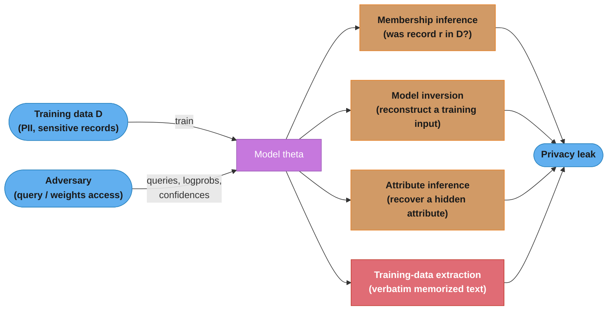
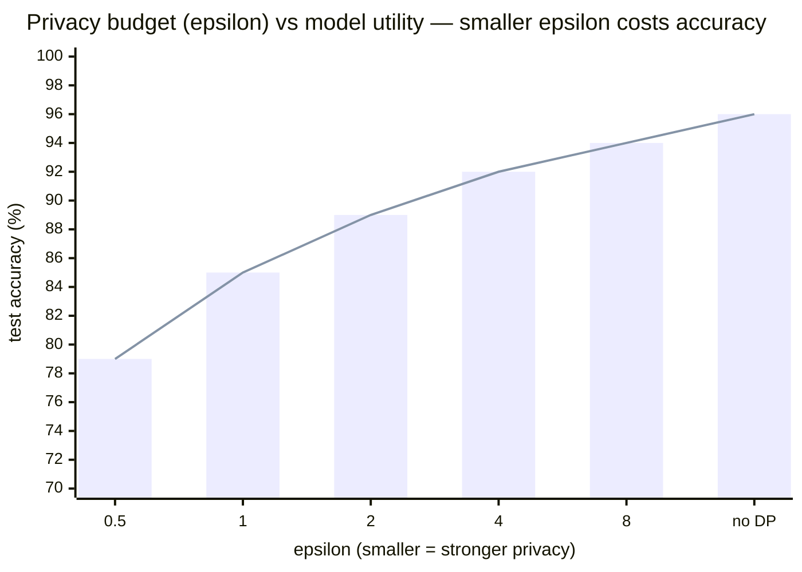
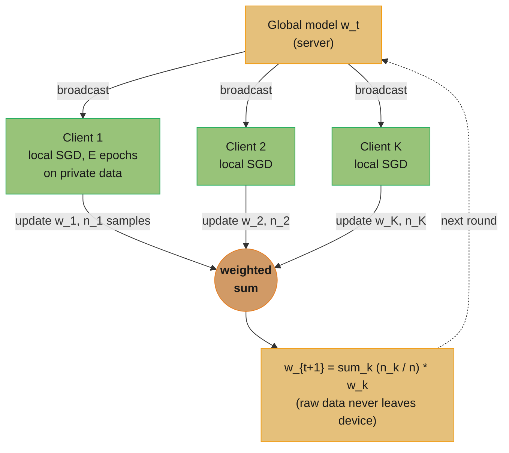
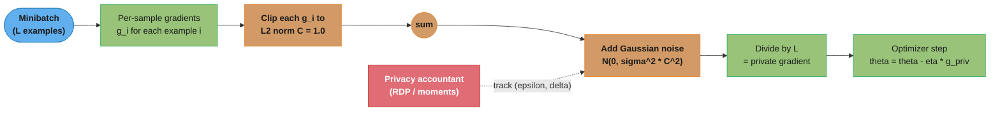
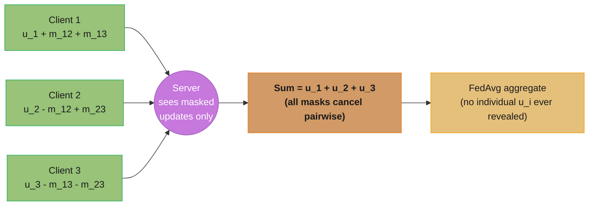
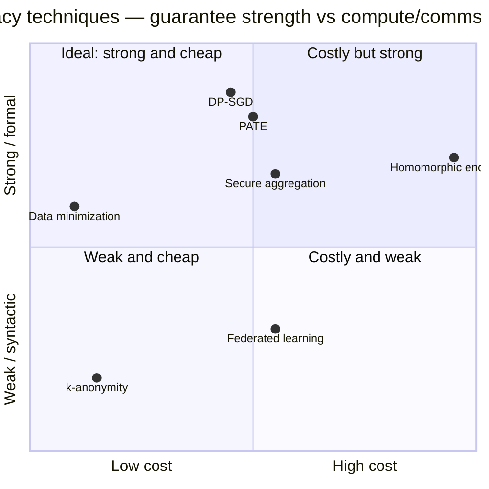

# Privacy-Preserving Machine Learning

> Phase 7 (Advanced Topics). This module covers how to train and serve models when
> the training data is sensitive and an adversary is trying to recover it: the threat
> models (membership inference, model inversion, attribute inference, training-data
> extraction), the formal defense (differential privacy and DP-SGD), and the systems
> defenses (federated learning, secure aggregation, PATE, split learning). The
> LLM-scale treatment of DP-SGD, PII pipelines, and machine unlearning lives in
> `../../llm/llm_security/privacy_and_data_governance.md`; membership inference as an
> *attack* is owned by `../adversarial_ml_and_robustness/README.md`. This module is the
> ML-native, cross-cutting home for the privacy *defenses* and their math.

---

## 1. Concept Overview

Standard ML assumes you own the data, keep it in one place, and only care that the model is accurate. Privacy-preserving ML drops those assumptions. The data may belong to millions of users who never consented to it leaving their device; regulation (GDPR, HIPAA, CCPA) may forbid centralizing it; and the trained model itself is an attack surface that leaks its training data.

Two failures drive the field. First, **models memorize**: a trained network is a lossy — sometimes lossless — compressor of its training set, and adversaries with only query access can recover records from it. Second, **centralization is a liability**: the moment sensitive data lands in one bucket, it becomes a breach target, a subpoena target, and a compliance obligation.

The defenses split into two families that are often combined:

1. **Formal / algorithmic privacy** — mathematically bound how much any single record can influence the model. **Differential privacy (DP)** is the gold standard, realized in training as **DP-SGD** (per-sample gradient clipping + calibrated noise) and in analytics as the **Laplace/Gaussian mechanisms**. The guarantee is a number, ε, you can put in a contract.
2. **Architectural / cryptographic privacy** — change *where* computation happens so raw data never centralizes. **Federated learning (FL)** trains on-device and ships only model updates; **secure aggregation** hides even those updates from the server; **PATE** transfers knowledge from private teachers to a public student; **split learning**, **homomorphic encryption**, and **k-anonymity** round out the toolbox.

For a senior engineer the job is to (a) name the threat model precisely — who the adversary is, what they can access, what they want — and (b) pick the minimum combination of these techniques that meets the guarantee at an acceptable utility and compute cost. DP alone does not stop centralization; FL alone gives no formal guarantee. The strongest production systems (Gboard, Apple analytics) stack **FL + secure aggregation + DP** on purpose.

---

## 2. Intuition

**One-line analogy**: Differential privacy is adding just enough static to a phone call that no one can tell whether you personally were on the line, while the *conversation's meaning* still comes through. Federated learning is never making the call from a central switchboard — everyone speaks from home and only the summary is shared.

**Mental model**: Picture the training set as a crowd photograph. A non-private model is a high-resolution print — zoom in and you can identify individual faces (memorized records). Differential privacy is deliberately blurring the photo by a calibrated amount: the crowd's shape (the learnable signal) survives, but no single face is recoverable. The blur radius is ε — smaller ε means more blur, stronger privacy, and a fuzzier (less accurate) model. Federated learning is a different move entirely: never assemble the crowd in one room. Each person describes their own corner; you stitch the descriptions together (FedAvg) without ever seeing the people.

**Why it matters**: The failure modes are concrete and expensive. Membership-inference attacks have revealed which patients were in a disease cohort from a diagnostic model's confidence scores. Model-inversion attacks have reconstructed recognizable faces from a face-recognition model. Training-data extraction pulled real names, emails, and phone numbers out of GPT-2 and ChatGPT. And centralizing user text to train a keyboard model is a GDPR and breach liability that federated learning was built to avoid.

**Key insight**: Privacy is not a binary you bolt on at the end — it is a *quantified budget* (ε) you spend across every query, every training step, and every model release, tracked by an accountant exactly like money. Once you see it as a budget, the engineering follows: minimize what you spend it on (data minimization), get the best utility per unit spent (Gaussian over Laplace, RDP accounting over basic composition), and never centralize data you can compute on in place.

---

## 3. Core Principles

1. **Differential privacy is the only defense with a formal, composable guarantee.** Everything else (FL, k-anonymity, redaction) is either a systems mitigation or an empirical heuristic that can fail under a clever adversary. If a regulator or auditor asks "prove it," only DP produces a proof: an (ε, δ) bound.
2. **Privacy is a budget you spend and cannot recover.** Every release that touches the private data consumes ε. Composition theorems say how fast it drains across queries and training steps; once spent, the only way to answer more questions privately is to add more noise or stop.
3. **The guarantee is about *presence of one record*, not secrecy of the dataset.** DP bounds how much the output changes if any single individual is added or removed. It says nothing about population-level facts your data reveals (that smoking correlates with cancer is learnable and *should* be) — it protects the individual, not the correlation.
4. **Post-processing is free; pre-processing is not.** Any function of a DP output is still DP with the same ε (you cannot un-blur privacy by analyzing the noisy result). But touching the raw data again — even to "double-check" — spends budget.
5. **Federated learning moves the computation, not the risk.** Shipping updates instead of data removes the central honeypot, but the updates themselves leak (gradients can be inverted). FL is necessary, not sufficient; pair it with secure aggregation (hide individual updates) and DP (bound what the aggregate reveals).
6. **Data minimization dominates.** The cheapest privacy is data you never collected, never centralized, and never put in the weights. Every technique below is a fallback for data you genuinely must learn from.

---

## 4. Types / Architectures / Strategies

### 4.1 Threat-model taxonomy

Membership inference is owned by [adversarial_ml_and_robustness](../adversarial_ml_and_robustness/README.md) — the summary here frames it as the privacy harm DP is designed to bound.

| Attack | What the adversary recovers | Access needed | Canonical result |
|--------|-----------------------------|---------------|-----------------|
| Membership inference | Whether a specific record was in training | Confidence scores / logprobs, or shadow models | Was patient X in the cancer cohort? Strongest on overfit/duplicated records |
| Model inversion | A representative reconstruction of a training input | Query access + gradients or confidences | Fredrikson 2015: recovered recognizable faces from a face-recognition model |
| Attribute inference | A hidden sensitive attribute of a known individual | Query access + some known attributes | Infer sexual orientation, income, or health status from correlated features |
| Training-data extraction | Verbatim memorized sequences | Generation API | Carlini GPT-2: hundreds of memorized PII sequences; ChatGPT "repeat forever" divergence |
| Property inference | A global property of the training set | Model weights or many queries | Was this model trained mostly on one demographic? |

### 4.2 Defense taxonomy

| Technique | Category | What it protects against | Where it runs |
|-----------|----------|--------------------------|---------------|
| Differential privacy (DP-SGD, DP mechanisms) | Formal | Membership, inversion, extraction (bounded) | Training / analytics |
| Federated learning (FedAvg, FedProx) | Architectural | Data centralization / breach / residency | On-device + server |
| Secure aggregation | Cryptographic | Server seeing individual client updates | Aggregation step |
| PATE | Formal + architectural | Membership on private teachers | Teacher/student training |
| Split learning | Architectural | Client shipping raw features | Client + server |
| Homomorphic encryption | Cryptographic | Server seeing plaintext at all | Encrypted compute |
| k-anonymity / l-diversity / t-closeness | Syntactic | Re-identification via quasi-identifiers | Data release |

### 4.3 Differential privacy — the formal definition

A randomized mechanism M is **(ε, δ)-differentially private** if for all pairs of *neighboring* datasets D and D′ (differing in one record) and all output sets S:

```
Pr[M(D) ∈ S]  ≤  e^ε · Pr[M(D') ∈ S]  +  δ
```

- **ε (epsilon)** — the privacy-loss bound. Smaller is more private. ε ≤ 1 is strong; ε in 1–10 is common in practice; ε > 10 is weak (used only when the alternative is no privacy at all).
- **δ (delta)** — the probability the ε bound fails. Set δ ≪ 1/N (e.g. 1e-5 for N = 100k records) so a "catastrophic leak of one record" is astronomically unlikely.
- **Pure DP** (δ = 0) uses the Laplace mechanism; **approximate DP** (δ > 0) uses the Gaussian mechanism and is what DP-SGD relies on.

**Sensitivity** Δf is the maximum change in a function's output when one record changes: `Δf = max_{D,D'} ||f(D) − f(D')||`. For a count query, Δf = 1 (one person changes the count by at most 1). Sensitivity determines how much noise you must add.

| Mechanism | Noise distribution | Scale | Gives |
|-----------|-------------------|-------|-------|
| **Laplace** | Laplace(0, Δf/ε) | b = Δf/ε | (ε, 0)-DP — pure |
| **Gaussian** | N(0, σ²) | σ = Δf·√(2 ln(1.25/δ))/ε | (ε, δ)-DP — approximate |

### 4.4 Composition — how the budget drains

| Composition | Rule for k mechanisms each (ε, δ) | When to use |
|-------------|-----------------------------------|-------------|
| **Basic (sequential)** | total ε = k·ε, total δ = k·δ | Small k; loosest bound |
| **Advanced** | total ε ≈ √(2k ln(1/δ′))·ε + k·ε(e^ε−1) | Many compositions; tighter |
| **RDP (Rényi DP)** | Track Rényi divergence at multiple orders α, convert to (ε, δ) once at the end | DP-SGD; the tightest practical accountant |

DP-SGD runs thousands of noisy gradient steps; basic composition would blow the budget instantly. **Rényi DP / the moments accountant** (Abadi et al. 2016) tracks the loss in a form that composes tightly, then converts to a final (ε, δ) — often 10× smaller ε than advanced composition for the same noise.

### 4.5 Federated learning strategies

| Variant | Change vs FedAvg | Solves |
|---------|------------------|--------|
| **FedAvg** | Baseline: local SGD, weighted average by client sample count | Communication cost |
| **FedProx** | Add proximal term μ/2·‖w − w_global‖² to local loss | Non-IID drift, stragglers |
| **FedAvgM / adaptive (FedAdam)** | Server-side momentum/Adam on aggregated update | Slow, unstable convergence |
| **Personalization (FedPer, per-FedAvg)** | Keep some layers local per client | Heterogeneous user distributions |
| **Cross-device vs cross-silo** | Millions of unreliable phones vs a few reliable orgs | Different reliability/scale regimes |

---

## 5. Architecture Diagrams

### 5.1 Attack surface — what a trained model leaks



The four attacks share one root cause — the model's behavior depends measurably on individual training records. Differential privacy attacks that root by bounding exactly that dependence.

### 5.2 The core DP tradeoff — privacy budget vs utility



Utility rises as ε grows because larger ε means less noise. The curve is steep at small ε and flattens past ε ≈ 4–8, which is why practitioners rarely pay for ε < 1 unless a regulator demands it — the marginal privacy gain costs disproportionate accuracy. Exact numbers depend on task and model; these are representative of a mid-size image or text classifier under DP-SGD.

### 5.3 Federated averaging (FedAvg) — one round



FedAvg replaces "centralize the data" with "centralize the *updates*." Each client trains E local epochs, and the server averages the resulting weights in proportion to each client's sample count. Hundreds to thousands of rounds converge a production keyboard model; only model deltas — never raw keystrokes — cross the network.

---

## 6. How It Works — Detailed Mechanics

### 6.1 The Laplace and Gaussian mechanisms

```python
import numpy as np


def laplace_mechanism(true_value: float, sensitivity: float, epsilon: float) -> float:
    """(epsilon, 0)-DP for a scalar query. Noise scale b = sensitivity / epsilon.
    Example: a COUNT query has sensitivity 1 (one person changes the count by <=1),
    so at epsilon=1 we add Laplace noise with scale 1.0."""
    scale = sensitivity / epsilon
    return true_value + np.random.laplace(loc=0.0, scale=scale)


def gaussian_mechanism(
    true_value: float, sensitivity: float, epsilon: float, delta: float
) -> float:
    """(epsilon, delta)-DP. sigma = sensitivity * sqrt(2 ln(1.25/delta)) / epsilon.
    Gaussian composes far better than Laplace (via RDP), which is why DP-SGD uses it."""
    sigma = sensitivity * np.sqrt(2.0 * np.log(1.25 / delta)) / epsilon
    return true_value + np.random.normal(loc=0.0, scale=sigma)


# A private count of 10,000 users at epsilon=1, sensitivity=1:
#   noisy = laplace_mechanism(10_000, sensitivity=1.0, epsilon=1.0)
#   -> typically within +/- a few of 10,000; the +/-1 of one user is hidden in the noise.
```

### 6.2 DP-SGD — the algorithm

DP-SGD (Abadi et al. 2016) makes gradient descent differentially private with three modifications to every step:

1. **Compute per-sample gradients** — not the usual averaged minibatch gradient. You need each example's gradient to bound its individual influence.
2. **Clip each per-sample gradient** to a fixed L2 norm C (typically C = 1.0). This caps any single record's contribution: no outlier can dominate.
3. **Sum, add Gaussian noise** scaled to C and the noise multiplier σ, then divide by the batch size. The noise is what buys the privacy; the clipping is what makes the noise *sufficient*.

A **privacy accountant** (RDP / moments accountant) tracks cumulative (ε, δ) across all steps.



Clipping bounds each record's influence to C; the calibrated Gaussian noise then makes any single record statistically invisible, and the accountant reports the total ε spent.

**Reading the accountant with real numbers.** The spent ε is a function of four quantities: the noise multiplier σ, the sampling rate q = batch_size / N, the number of steps T, and δ. As a concrete anchor, a noise multiplier σ ≈ 1.1 at sampling rate q ≈ 0.001 over T ≈ 10,000 steps lands around ε ≈ 2–3 at δ = 1e-5 under RDP accounting. Two levers move ε the most: raising σ (more noise, lower ε, worse utility) and lowering q or T (fewer "looks" at the data, lower ε). This is why DP-SGD often uses *large* batches — a large batch amortizes the fixed noise across more examples, improving the utility you get per unit of ε. Opacus inverts this relationship: you give it target_epsilon and it solves for the σ that lands there after your chosen number of epochs.

### 6.3 DP-SGD — broken, then fixed

```python
# BROKEN: "adding noise to SGD" without per-sample clipping is NOT differential privacy.
import torch


def dp_sgd_broken(model, batch_x, batch_y, optimizer, sigma: float = 1.1) -> None:
    optimizer.zero_grad()
    loss = torch.nn.functional.cross_entropy(model(batch_x), batch_y)
    loss.backward()                                  # AVERAGED batch gradient only
    for p in model.parameters():
        p.grad += torch.randn_like(p.grad) * sigma   # noise added post-hoc
    optimizer.step()
# Why it's broken:
#   1. No PER-SAMPLE clipping -> an outlier's gradient can be huge; its influence is
#      unbounded, so no finite noise level gives a valid epsilon. The DP proof needs
#      a bound on how much ONE record moves the gradient (the sensitivity C).
#   2. No privacy accountant -> you cannot state any epsilon. "We added noise" is not
#      a guarantee; DP is a proof, and this code cannot produce one.
```

```python
# FIX: Opacus attaches per-sample gradient computation, clipping, noise, and an
# RDP accountant to a standard PyTorch training loop.
import torch
from opacus import PrivacyEngine
from torch.utils.data import DataLoader


def make_private(
    model: torch.nn.Module,
    optimizer: torch.optim.Optimizer,
    loader: DataLoader,
    epochs: int,
    target_epsilon: float = 3.0,
    target_delta: float = 1e-5,
    max_grad_norm: float = 1.0,      # this is C, the per-sample clipping norm
) -> tuple[torch.nn.Module, torch.optim.Optimizer, DataLoader, PrivacyEngine]:
    engine = PrivacyEngine()
    # Opacus solves for the noise multiplier sigma that hits target_epsilon after
    # `epochs` passes, given the sampling rate and delta -- the accountant runs backwards.
    model, optimizer, loader = engine.make_private_with_epsilon(
        module=model,
        optimizer=optimizer,
        data_loader=loader,
        epochs=epochs,
        target_epsilon=target_epsilon,
        target_delta=target_delta,
        max_grad_norm=max_grad_norm,
    )
    return model, optimizer, loader, engine


def train_dp(model, optimizer, loader, engine, epochs: int, delta: float = 1e-5) -> None:
    model.train()
    for _ in range(epochs):
        for x, y in loader:                          # Opacus hooks give per-sample grads
            optimizer.zero_grad()
            loss = torch.nn.functional.cross_entropy(model(x), y)
            loss.backward()                          # per-sample clip happens here
            optimizer.step()                         # noise added here
        eps = engine.get_epsilon(delta)              # spent budget so far
        print(f"epsilon spent: {eps:.2f} (delta={delta})")
```

At LLM scale this same recipe becomes **DP-LoRA** (clip and noise only the adapter gradients) — see [privacy_and_data_governance](../../llm/llm_security/privacy_and_data_governance.md) for why full DP pre-training is impractical and what production LLM teams do instead.

### 6.4 Federated averaging with Flower

```python
import flwr as fl
import torch
from collections import OrderedDict


class FlowerClient(fl.client.NumPyClient):
    """Runs on-device: trains E local epochs on private data, returns only the
    updated weights and the local sample count -- never the raw data."""

    def __init__(self, model: torch.nn.Module, train_loader, local_epochs: int = 5):
        self.model = model
        self.train_loader = train_loader
        self.local_epochs = local_epochs

    def get_parameters(self, config) -> list:
        return [v.cpu().numpy() for v in self.model.state_dict().values()]

    def set_parameters(self, parameters: list) -> None:
        keys = self.model.state_dict().keys()
        state = OrderedDict({k: torch.tensor(v) for k, v in zip(keys, parameters)})
        self.model.load_state_dict(state, strict=True)

    def fit(self, parameters: list, config) -> tuple[list, int, dict]:
        self.set_parameters(parameters)              # start from global model w_t
        opt = torch.optim.SGD(self.model.parameters(), lr=0.01)
        n = 0
        for _ in range(self.local_epochs):           # E local epochs
            for x, y in self.train_loader:
                opt.zero_grad()
                loss = torch.nn.functional.cross_entropy(self.model(x), y)
                loss.backward()
                opt.step()
                n += len(x)
        # return updated weights + sample count -> server weights the average by n
        return self.get_parameters(config), n, {}


# Server side: FedAvg aggregates client weights in proportion to n_k.
# Sample only a fraction of the client fleet each round (bandwidth + straggler control).
strategy = fl.server.strategy.FedAvg(
    fraction_fit=0.01,          # e.g. 1% of a million-device fleet per round
    min_fit_clients=100,        # need >=100 clients before aggregating a round
    min_available_clients=1_000,
)
# fl.server.start_server(config=fl.server.ServerConfig(num_rounds=1_000), strategy=strategy)
```

**FedProx** for non-IID data adds one term to the client's local loss: `loss += (mu / 2) * ||w - w_global||^2`, with μ typically 0.001–1.0. When each client's data is skewed (one user types mostly in Spanish, another in code), unconstrained local training drifts far from the global model and averaging diverges; the proximal term tethers each client to w_global, trading a little local fit for stable global convergence.

### 6.5 Secure aggregation — why the server must not see one update

FedAvg hides raw data but not the *updates*, and a single client's gradient can be inverted to reconstruct its training examples (gradient-inversion attacks recover images pixel-accurately from one update). **Secure aggregation** (Bonawitz et al. 2017) lets the server learn only the *sum* of client updates, never any individual one.

The intuition is pairwise-cancelling masks. Every pair of clients (i, j) agrees on a shared random mask m_ij (via Diffie-Hellman key exchange + a PRG). Client i adds m_ij and subtracts m_ji; the masks are equal and opposite, so when the server sums all clients the masks cancel exactly, leaving the true sum — but each individual masked update looks like uniform noise.



Masks m_ij and −m_ij cancel in the sum, so the server recovers Σuᵢ without seeing any uᵢ. Shamir secret-sharing of the mask seeds lets the protocol recover the correct sum even when some clients drop mid-round (dropout is the norm on a phone fleet). Combined with DP noise, the server sees only a *noisy sum of many masked updates* — neither one client's data nor one client's gradient.

### 6.6 PATE — Private Aggregation of Teacher Ensembles

PATE (Papernot et al. 2017) gets DP "for free" from an ensemble and a data split:

1. Partition the private data into disjoint shards; train one **teacher** per shard (e.g. 250 teachers on MNIST). No teacher shares data with another.
2. To label a public, *unlabeled* example, each teacher votes; aggregate with **noisy argmax** (add Laplace/Gaussian noise to the vote counts — the "GNMax" aggregator). When teachers agree strongly, a little noise doesn't change the answer, and the privacy cost is tiny; when they disagree, the noise abstains, spending little budget on ambiguous cases.
3. Train a **student** on the public data with these noisy labels. The student — the only artifact you ship — never touched private data directly; its ε depends only on how many noisy-label queries you spent, which is small because public unlabeled data is cheap.

PATE's elegance: the privacy analysis is *data-dependent* — strong teacher consensus means near-zero privacy cost, so a good ensemble achieves excellent ε with high accuracy, often beating DP-SGD on the same task.

### 6.7 The rest of the toolbox

- **Split learning** — cut the network at a layer. The client runs layers 1..k on its raw data and sends only the *activations* ("smashed data") at the cut; the server runs the rest and sends gradients back. Raw features never leave the client, and the server never sees the full model. Weakness: activations can still leak (pair with noise), and it serializes clients unless combined with FL.
- **k-anonymity / l-diversity / t-closeness** — syntactic anonymization of tabular releases. *k-anonymity*: every record is indistinguishable from at least k−1 others on quasi-identifiers (zip, age, sex) — defeats naive re-identification but not attribute disclosure if all k share a sensitive value. *l-diversity* fixes that by requiring l distinct sensitive values per group; *t-closeness* further requires each group's sensitive-value distribution to be within t of the global distribution. All are provably weaker than DP (the Netflix Prize de-anonymization broke k-anonymity-style releases via auxiliary data) — use DP when you can.
- **Homomorphic encryption (HE)** — compute directly on ciphertext (Paillier is additively homomorphic; CKKS/BFV support approximate/integer arithmetic; TFHE supports arbitrary gates). The server aggregates encrypted gradients and never sees plaintext. Why it's rarely end-to-end: a single CKKS multiplication is 10³–10⁶× slower than plaintext, ciphertexts are large, and deep-network training needs enormous multiplicative depth. In practice HE appears in *narrow* spots — encrypted secure aggregation of a linear sum — not for training a whole model.
- **Data minimization** — collect fewer fields, aggregate on-device, shorten retention, and keep identifiers out of training sets. It is not a fancy algorithm, but it removes more risk per dollar than any cryptographic technique.

---

## 7. Real-World Examples

- **Google Gboard next-word prediction (federated learning, 2018–present)** — Google trained the Gboard keyboard's language and query-suggestion models with federated learning across a fleet of Android phones. Raw keystrokes never leave the device; each round samples a subset of eligible phones (charging, idle, on Wi-Fi), runs local SGD, and returns updates aggregated with **secure aggregation**. Later production models added **DP-FTRL** for formal ε guarantees. This is the canonical FL-at-scale deployment and the reference for FedAvg's round structure (hundreds of rounds, thousands of clients per round).
- **Apple on-device analytics (local differential privacy, 2016–present)** — Apple collects usage signals (popular emoji, new words, Safari energy-draining domains, health types) using **local DP**: each device adds noise to its own report *before* sending, so Apple never sees a true individual value. Apple publishes a per-datatype ε and enforces a **daily privacy budget** capping how much any user contributes; documented per-use ε values sit in the single digits (e.g. around 2–8 depending on the dataset). Local DP is weaker per-record than central DP but requires trusting no one with raw data.
- **US Census Bureau 2020 (central differential privacy)** — the 2020 Census is the largest DP deployment ever. The **TopDown Algorithm** injects discrete-Gaussian noise under zero-concentrated DP (zCDP) and post-processes to consistent, non-negative counts. The published person-level privacy-loss budget for the redistricting data was **ε ≈ 19.61** — deliberately large, reflecting the legal mandate to publish accurate small-area counts while still bounding re-identification, and a public lesson in how ε is a *policy* choice, not just a technical one.
- **Meta / Opacus** — Meta's open-source Opacus library made DP-SGD a drop-in for PyTorch (`PrivacyEngine.make_private_with_epsilon`), used for DP fine-tuning across industry; TensorFlow Privacy is the TF-side equivalent.
- **Flower (flwr)** — the framework-agnostic FL system used to prototype and deploy FedAvg/FedProx across PyTorch, TensorFlow, and JAX; the code sketch in §6.4 is its client/strategy API.
- **NVIDIA FLARE / OpenMined PySyft** — cross-silo FL in healthcare (hospitals jointly training on patient data none of them can share) and a broader privacy toolkit (FL, DP, HE, secure MPC).
- **Cross-silo FL in healthcare (EXAM, 2021)** — a consortium of 20 hospitals across five continents trained a COVID-19 outcome-prediction model with federated learning (NVIDIA FLARE), where each hospital's patient records never left its own firewall — only model updates were shared. The federated model generalized markedly better than any single-site model precisely because it learned from all sites' distributions without centralizing protected health information, the canonical demonstration that cross-silo FL solves a data-sharing deadlock regulation would otherwise make impossible.

---

## 8. Tradeoffs

### 8.1 Technique comparison

| Technique | Privacy guarantee | Utility cost | Compute / comms cost | Threat covered |
|-----------|-------------------|--------------|----------------------|----------------|
| **Differential privacy (DP-SGD)** | Formal (ε, δ) — provable | Medium–high (few to ~15 pts at small ε) | ~2–4× training (per-sample grads) | Membership, inversion, extraction |
| **Federated learning** | None by itself (data locality only) | Low–medium (non-IID, fewer effective samples) | High comms (many rounds × fleet) | Central breach, residency |
| **Secure aggregation** | Cryptographic on individual updates | None (exact sum) | Medium (key exchange, masks, dropout recovery) | Server seeing one client's update |
| **Homomorphic encryption** | Cryptographic on all plaintext | None (exact, up to CKKS approx) | Extreme (10³–10⁶× slowdown) | Server seeing any plaintext |
| **PATE** | Formal (ε, δ), data-dependent | Low if teachers agree | Medium (train N teachers + student) | Membership on teachers |
| **k-anonymity family** | Syntactic, no formal bound | Low (generalization/suppression) | Low | Naive re-identification |

### 8.2 Where each lands on guarantee vs cost



The upper-left is where you want to be: strong guarantee, low cost. Data minimization and DP-SGD/PATE dominate; homomorphic encryption is strong but priced out of end-to-end training; k-anonymity is cheap but weak. FL sits low on *formal* guarantee because it only relocates data — which is why production systems stack it with DP and secure aggregation.

### 8.3 Central vs local DP

| Dimension | Central DP (trusted curator) | Local DP (no trust) |
|-----------|------------------------------|---------------------|
| Who adds noise | The aggregator, once, to the aggregate | Each user, to their own value |
| Trust assumption | Curator sees raw data | No one sees raw data |
| Noise / utility | Less noise (√N advantage) → better utility | Much more noise → needs huge N |
| Example | US Census TopDown | Apple analytics, RAPPOR |

---

## 9. When to Use / When NOT to Use

### Use differential privacy when

- You must make a **formal, auditable** claim ("no individual's presence changes the model measurably") — regulated data (HIPAA, GDPR erasure obligations), public data releases, or any setting where an auditor can ask for a proof.
- You are fine-tuning on sensitive user-generated content and can afford a few points of accuracy for a provable ε (DP-LoRA on support transcripts, medical notes).

### Use federated learning when

- Data legally or practically **cannot centralize**: on-device user text (keyboards), cross-hospital medical data, data-residency-bound records. Pair it with secure aggregation and DP — FL alone is a locality property, not a privacy guarantee.

### Use secure aggregation when

- You run FL and must guarantee the **server cannot inspect a single client's update** (gradient-inversion is a real reconstruction attack). It is nearly free in utility, so use it by default in cross-device FL.

### Use PATE when

- You have **abundant public unlabeled data** and want strong data-dependent ε with better accuracy than DP-SGD — common in vision/NLP where unlabeled corpora are cheap.

### Do NOT

- Rely on **k-anonymity or "we removed names"** as your privacy story — auxiliary-data linkage (Netflix Prize, the Massachusetts governor re-identification) defeats syntactic anonymization; use DP for any real guarantee.
- Ship **FL without secure aggregation or DP** and call it private — the updates leak.
- Reach for **homomorphic encryption to train a whole model** — the 10³–10⁶× slowdown makes it a non-starter end-to-end; scope it to narrow linear aggregations.
- Set ε and forget it — track cumulative budget across every model release and query; composition drains it.

---

## 10. Common Pitfalls

### Pitfall 1: "We added noise, so it's differentially private"

The most common misconception. Noise gives DP only when paired with **bounded sensitivity** — for DP-SGD that means *per-sample* gradient clipping. Averaging the batch gradient and then adding noise (see §6.3 broken example) has unbounded sensitivity and no valid ε. If you cannot name the sensitivity and produce an ε from an accountant, you do not have DP.

### Pitfall 2: Forgetting composition — the budget silently drains

Teams set ε = 1 per query, run 50 queries, and believe they still have ε = 1. Basic composition gives ε = 50. Every training run, hyperparameter search, and model release on the same data spends budget. Track it with an accountant across the *entire* data lifetime, not per operation, and use RDP to compose tightly.

### Pitfall 3: Federated learning treated as automatic privacy

FL keeps raw data on-device, which stops centralization — but a single client's model update can be inverted to reconstruct its training examples (documented pixel-accurate image recovery from one gradient). A real incident pattern: an org ships FL, skips secure aggregation to "keep it simple," and the aggregation server (or anyone who compromises it) can reconstruct individual users' data. Fix: secure aggregation + DP noise on top of FL, always.

### Pitfall 4: Ignoring non-IID data in FL

FedAvg assumes clients are roughly IID. In reality each user's data is skewed (language, usage), and naive averaging **diverges or stalls** — the global model oscillates as heterogeneous local updates fight. Symptoms: accuracy plateaus far below centralized training. Fix: FedProx (proximal term, μ ≈ 0.01–1), server-side adaptive optimizers (FedAdam), or per-client personalization layers.

### Pitfall 5: Choosing ε by vibes

ε is not "set it to a small number." ε = 0.1 may destroy utility; ε = 50 may offer no real protection. Calibrate against the task (how much noise the model tolerates) and the policy (what the regulator/threat model requires), report it explicitly, and remember δ must be ≪ 1/N. The US Census's ε ≈ 19.61 looks huge until you understand it is a deliberate accuracy-vs-privacy policy decision, publicly justified.

### Pitfall 6: Clipping norm C set wrong in DP-SGD

C too small clips away the real gradient signal (the model won't learn); C too large means the calibrated noise (scaled to C) is enormous (utility collapses). The standard fix is C = 1.0 with per-layer or adaptive clipping, and to tune C jointly with the learning rate — DP-SGD is more sensitive to C than to almost any other hyperparameter.

### Pitfall 7: Local DP with too few users

Local DP's per-user noise only averages out with huge N. Deploying local DP to a 10k-user product and expecting Apple-quality aggregates yields garbage — the noise swamps the signal. Local DP needs millions of contributions; below that, prefer central DP with a trusted aggregator or secure aggregation.

---

## 11. Technologies & Tools

| Tool | Role | Notes |
|------|------|-------|
| Opacus (Meta) | DP-SGD for PyTorch | `PrivacyEngine.make_private_with_epsilon`; RDP accountant built in |
| TensorFlow Privacy | DP-SGD / DP optimizers for TF | Moments accountant; `DPKerasSGDOptimizer` |
| dp-accounting (Google) | Standalone RDP/PLD accountant | Compose budgets outside a training loop |
| Flower (flwr) | Framework-agnostic federated learning | FedAvg/FedProx/FedAdam strategies; PyTorch/TF/JAX clients |
| TensorFlow Federated (TFF) | FL research + simulation | Google's FL stack; models Gboard-style training |
| NVIDIA FLARE | Cross-silo FL (healthcare, finance) | Production FL orchestration |
| OpenMined PySyft | FL + DP + secure MPC + HE toolkit | Broad privacy-tech umbrella |
| Microsoft SEAL / OpenFHE / TenSEAL | Homomorphic encryption (BFV, CKKS) | TenSEAL wraps SEAL for tensors |
| Google RAPPOR | Local DP for aggregate statistics | The Chrome-telemetry local-DP reference |
| ARX / sdcMicro | k-anonymity / l-diversity / t-closeness | Syntactic anonymization for tabular releases |
| Google DP library / PipelineDP | DP aggregations at data-warehouse scale | Beam/Spark pipelines with DP SUM/COUNT/MEAN |
| Flower Datasets / LEAF | Federated benchmark datasets (non-IID splits) | Reproducible FL experiments and partitioning |

---

## 12. Interview Questions with Answers

**Q: What is differential privacy, in one precise sentence?**
Differential privacy guarantees that a mechanism's output distribution changes by at most a factor of e^ε (plus a small δ) when any single individual's record is added to or removed from the dataset. That "any one record barely matters" property is what makes membership, inversion, and extraction attacks provably bounded — an adversary seeing the output cannot confidently tell whether you were in the data. The knobs are ε (privacy loss, smaller = stronger) and δ (probability the bound fails, kept ≪ 1/N). Crucially it protects *presence of an individual*, not the population-level correlations the data reveals.

**Q: Explain DP-SGD and why you can't just add noise to normal SGD.**
DP-SGD makes training private with three per-step changes: compute per-sample gradients, clip each to a fixed L2 norm C (e.g. 1.0), then sum, add Gaussian noise scaled to C and the noise multiplier σ, and average. Plain "SGD + noise" fails because the averaged batch gradient has *unbounded* sensitivity — one outlier example can move it arbitrarily far, so no finite noise level yields a valid ε. The per-sample clipping is what bounds any single record's influence to C, which is the sensitivity the noise is calibrated against, and a privacy accountant (RDP/moments) tracks the cumulative (ε, δ) across thousands of steps.

**Q: What do ε and δ actually mean, and how do you pick them?**
ε bounds the multiplicative privacy loss (e^ε is the max ratio between output probabilities on neighboring datasets) and δ is the probability that bound is violated. ε ≤ 1 is strong, 1–10 is common, and >10 is weak but sometimes justified (the US Census used ε ≈ 19.61 as a deliberate policy choice); δ should be much smaller than 1/N so a catastrophic one-record leak is astronomically unlikely, typically 1e-5 for hundreds of thousands of records. You pick ε by balancing the utility the task tolerates against the guarantee the threat model or regulator demands, and you report it explicitly because it is meaningless without context.

**Q: What is membership inference and why does DP address it?**
Membership inference decides whether a specific record was in a model's training set, usually by exploiting that models are more confident on data they trained on than on unseen data. It is the canonical privacy harm — revealing someone was in a therapy-bot's fine-tuning set or a cancer cohort is itself sensitive — and it is precisely the attack DP's definition bounds, since DP guarantees the output barely changes whether or not any record was included. This module summarizes it; the attack mechanics (shadow models, loss thresholds) are owned by [adversarial_ml_and_robustness](../adversarial_ml_and_robustness/README.md). Strength correlates with overfitting and duplication, so deduplication and early stopping are privacy controls too.

**Q: What's the difference between the Laplace and Gaussian mechanisms?**
The Laplace mechanism adds noise scaled to Δf/ε and gives pure (ε, 0)-DP; the Gaussian mechanism adds noise with σ = Δf·√(2 ln(1.25/δ))/ε and gives approximate (ε, δ)-DP. You use Laplace when you need a hard guarantee with no failure probability (δ = 0) on low-sensitivity queries like counts, and Gaussian when you will compose many mechanisms — because Gaussian noise composes far more tightly under Rényi DP, which is exactly why DP-SGD, with its thousands of noisy steps, uses Gaussian. Both scale noise to the sensitivity Δf, the maximum output change from one record.

**Q: What is federated learning and does it provide privacy on its own?**
Federated learning trains a shared model by sending it to where the data lives (phones, hospitals), training locally, and returning only model updates that a server averages — raw data never centralizes. By itself it provides *data locality*, not a formal privacy guarantee, because individual updates can be inverted to reconstruct training examples (gradient-inversion attacks recover images from one gradient). That is why production FL (Gboard) layers secure aggregation so the server sees only the summed update, and DP so even the aggregate is provably private. FL solves the centralization/breach/residency problem; DP and secure aggregation solve the leakage problem.

**Q: Walk through the FedAvg algorithm.**
FedAvg repeats four steps each round: broadcast, local training, upload, aggregate. The server broadcasts the current global model to a sampled subset of clients; each client runs E epochs of local SGD on its own data and returns its updated weights plus its sample count; the server then sets the new global model to the sample-count-weighted average of the client weights and repeats for many rounds. Weighting by n_k ensures a client with more data has proportionally more influence, and sampling only a fraction of the fleet per round controls bandwidth and stragglers. A production keyboard model converges in hundreds to thousands of rounds with thousands of clients per round; only weight deltas, never keystrokes, cross the network.

**Q: How does secure aggregation let the server compute a sum without seeing any input?**
Every pair of clients shares a random mask that one adds and the other subtracts, so the masks cancel when the server sums all updates, leaving only the true sum. Each individual masked update looks like uniform random noise, so the server learns Σuᵢ but never any single uᵢ, which blocks gradient-inversion of one client's update. Key exchange (Diffie-Hellman) plus a PRG generates the masks cheaply, and Shamir secret-sharing of the mask seeds lets the protocol recover the correct sum even when some phones drop mid-round.

**Q: Explain PATE and when it beats DP-SGD.**
PATE trains an ensemble of "teacher" models on disjoint shards of the private data, then labels a public unlabeled dataset by noisy majority vote and trains a "student" on those noisy labels. The student, the only shipped model, never touches private data directly. It beats DP-SGD when you have abundant cheap public unlabeled data and the teachers agree strongly, because PATE's privacy analysis is *data-dependent*: strong consensus means the noisy vote rarely flips, so each query costs almost no budget, yielding better accuracy at the same ε. Its cost is training many teachers plus a student and needing that public dataset.

**Q: Why is homomorphic encryption rarely used to train a whole model?**
Homomorphic encryption lets you compute on ciphertext so the server never sees plaintext, but it is roughly 10³–10⁶× slower than plaintext, which makes whole-model training economically absurd. A single CKKS multiplication is enormously expensive, ciphertexts are large, and deep-network training needs huge multiplicative depth, so end-to-end HE is a non-starter beyond toy models. In practice HE shows up only in narrow, shallow spots — encrypted secure aggregation of a linear sum of gradients — while the heavy lifting stays in plaintext protected by DP and secure aggregation instead.

**Q: Why is k-anonymity considered weak, and what replaced it?**
k-anonymity ensures every record shares its quasi-identifiers with at least k−1 others, but it gives no formal guarantee and breaks under auxiliary-data linkage. It fails against attribute disclosure (if all k share a sensitive value you learn it anyway), and the Netflix Prize and Massachusetts-governor re-identifications both broke k-anonymity-style releases using outside data. l-diversity and t-closeness patch specific holes but stay syntactic with no formal adversary model. Differential privacy replaced them because its guarantee holds regardless of what auxiliary data the adversary has.

**Q: What is the privacy budget and why does composition matter?**
The privacy budget is the total ε you are willing to spend across everything that touches the private data; composition theorems say how fast repeated mechanisms drain it. Basic composition adds ε linearly (k queries at ε each cost kε), advanced composition grows roughly with √k, and Rényi DP / the moments accountant composes tightest by tracking Rényi divergence and converting to (ε, δ) once at the end — often giving 10× smaller ε than advanced composition for DP-SGD's thousands of steps. It matters because teams routinely underestimate spend: every training run, hyperparameter sweep, and release on the same data consumes budget, and once spent you cannot answer more questions privately without adding more noise.

**Q: What is the central vs local DP distinction?**
In central DP a trusted curator collects raw data and adds noise once to the aggregate; in local DP each user adds noise to their own value before it ever leaves the device, so no one is trusted with raw data. Central DP needs far less noise (roughly a √N advantage) and gives better utility, which is why the US Census uses it; local DP is stronger on trust (Apple never sees a true individual value) but requires millions of contributions for the noise to average out. Choose local DP when you cannot trust any aggregator and have huge N; otherwise central DP or secure aggregation gives much better accuracy.

**Q: How do you set the clipping norm C in DP-SGD, and why does it matter so much?**
C is the L2 norm each per-sample gradient is clipped to, and it is the sensitivity the noise is scaled against, so getting it wrong wrecks either learning or utility. Too small clips away the real signal and the model won't train; too large forces enormous calibrated noise and accuracy collapses. The standard starting point is C = 1.0, tuned jointly with the learning rate, sometimes with per-layer or adaptive clipping that sets C to a running quantile of observed gradient norms. DP-SGD is more sensitive to C than to nearly any other hyperparameter, so tune it first.

**Q: How would you design a private next-word-prediction keyboard?**
Use federated learning so keystrokes never leave the device: broadcast the global model, train locally, return only updates. Layer secure aggregation so the server sees only the summed update, never one user's gradient, and add DP (DP-FTRL or DP-SGD on the aggregate) so the model has a formal ε bound against membership and extraction. Handle non-IID data (each user's vocabulary differs) with FedProx or personalization layers, sample a small fraction of eligible devices (charging, idle, Wi-Fi) each round, and account the cumulative ε across the training run — this is exactly the Gboard architecture.

**Q: Can differential privacy help with GDPR's right to erasure?**
Indirectly but importantly: a DP-trained model provably changes by only a bounded amount from any one user's presence, so the weights reveal almost nothing about them. That largely satisfies the erasure obligation on the weights by construction — you still delete their raw records from corpora and logs. This is far stronger than machine unlearning, which tries to remove a record after the fact and often fails audits. The defensible architecture keeps personal data out of the weights so deletion requests never require surgery on a trained model; see [privacy_and_data_governance](../../llm/llm_security/privacy_and_data_governance.md).

**Q: What is model inversion and how is it different from membership inference?**
Model inversion reconstructs a representative input for a class or individual, whereas membership inference only decides yes/no whether a specific record was in training. Fredrikson recovered recognizable faces from a face-recognition model — inversion is a reconstruction attack (you get data back) and membership is a detection attack (you learn presence). Both exploit that the model's behavior depends on specific training records, so DP bounds both by limiting how much any single record influences the model. Returning coarse outputs (top-k labels, rounded confidences) instead of full probability vectors further blunts inversion.

**Q: What is attribute inference and why is it hard to defend against?**
Attribute inference recovers a hidden sensitive attribute of a person the adversary already knows — their health status, income, or orientation — from features the model correlates with it. It differs from membership inference (which asks if you were in the data) and inversion (which reconstructs an input): here the adversary already knows who you are and uses the model to fill in a secret field. It is hard to defend because the correlation the attacker exploits is often the *legitimate signal the model was built to learn* — you cannot noise it away without destroying utility. Mitigations focus on not exposing the correlated outputs, fairness/decorrelation constraints, and DP to bound how confidently any single record's attribute can be inferred.

**Q: How does gradient inversion work and why does it break naive federated learning?**
Gradient inversion reconstructs a client's raw training examples from the gradient (or weight update) it shares, by optimizing a synthetic input until its gradient matches the observed one. Published attacks (Deep Leakage from Gradients) recover pixel-accurate images and token-accurate text from a single small-batch update, which is exactly why "the data stays on the device" is not a privacy guarantee in FL. The larger the batch and the more local steps, the harder inversion becomes, but the reliable fixes are secure aggregation (the server sees only a sum of many updates, not one) and DP noise on the update (bounding what any gradient reveals). This is the concrete threat that makes the FL + secure-aggregation + DP stack non-optional.

**Q: What is split learning and when would you use it over federated learning?**
Split learning cuts the network at a layer so the client runs the first layers on its raw data and sends only the activations, while the server runs the rest. Raw features never leave the client and no single party holds the full model, so it splits both data exposure and model ownership. You'd prefer it over FL when the client is too weak to train the whole model (the server carries the heavy layers) or when you specifically want to split model ownership, and it sends less per step than shipping full weight updates. Its weaknesses are that the cut activations can still leak (pair with noise) and that vanilla split learning serializes clients, so in practice it is combined with federated learning (SplitFed) to parallelize across a fleet.

**Q: Why isn't secure aggregation alone enough — why add DP?**
Secure aggregation hides individual updates, but the aggregate it reveals can still leak information about one client. If the sum is dominated by one client, or an adversary controls all but one client, the remaining contribution is exposed, and even a clean aggregate can memorize outliers. DP fixes this by adding calibrated noise to the aggregate so it is provably insensitive to any single client's data regardless of the others. So secure aggregation protects the update at the server and DP bounds what the released model reveals — you need both for a real guarantee.

---

## 13. Best Practices

1. **Name the threat model first** — who the adversary is (curious server, external querier, colluding clients), what they access (updates, weights, confidences), and what they want (membership, reconstruction). It determines which techniques you even need.
2. **Make DP the default for any formal claim** — if you might have to prove privacy to an auditor or regulator, only DP produces a proof; everything else is a mitigation.
3. **Always use per-sample clipping and an accountant for DP-SGD** — "we added noise" is not DP; report the ε your accountant computes, and start with C = 1.0 tuned against the learning rate.
4. **Track the budget across the whole data lifetime** — compose every training run, sweep, and release with RDP; ε spent is gone.
5. **Never ship FL without secure aggregation and DP** — updates leak; the three-layer stack (FL + secure agg + DP) is the production standard.
6. **Handle non-IID explicitly in FL** — FedProx, adaptive server optimizers, or personalization; assume clients are skewed.
7. **Prefer central DP or secure aggregation over local DP unless you truly cannot trust an aggregator** — local DP's noise needs millions of users to average out.
8. **Minimize data before you encrypt it** — the cheapest privacy is fields you never collected and identifiers you keep out of the weights; every technique here is a fallback for data you genuinely must learn from.
9. **Report ε with its δ and its meaning** — an ε number without δ, the neighboring-dataset definition, and the composition method is uninterpretable.
10. **Red-team the privacy claim** — run membership-inference and gradient-inversion attacks against your own model before launch, exactly as [adversarial_ml_and_robustness](../adversarial_ml_and_robustness/README.md) prescribes for robustness.

---

## 14. Case Study

**Scenario: private next-word prediction for a mobile keyboard (Gboard-style).** A keyboard app with 40M daily active users wants to improve its next-word-prediction model. The training signal is *what users type* — among the most sensitive data a device holds — and the product ships in the EU (GDPR erasure obligations) and the US. Centralizing keystrokes to a server is both a breach liability and legally untenable. The team must improve the model without any raw text leaving a device.

**Requirements and constraints:**
- Model quality must approach centralized training (users notice a worse keyboard immediately).
- No raw keystrokes may centralize; the server must not be able to reconstruct any individual's typing.
- A formal, auditable privacy statement (an ε) is required for the EU launch.
- Client devices are phones: intermittent, battery- and bandwidth-constrained, and drop out mid-round constantly.

**Design — the three-layer stack:**

1. **Federated learning (FedAvg).** The server broadcasts the global model each round to a sampled subset — only devices that are charging, idle, and on Wi-Fi are eligible. Each device runs E = 5 local epochs of SGD on its own recent typing and returns weight deltas plus its sample count. The server averages weighted by sample count over ~1,000 rounds, sampling a few thousand devices per round. Raw text never leaves the phone.

2. **Secure aggregation.** To stop the server (or an attacker who compromises it) from inverting any single device's gradient, clients apply pairwise-cancelling masks so the server recovers only the *sum* of updates. Shamir secret-sharing of the mask seeds recovers the correct sum despite the high dropout rate typical of a phone fleet.

3. **Differential privacy (DP-FTRL).** DP noise is added to the aggregate with per-round clipping so the released model carries a formal (ε, δ) guarantee. The team targets ε ≈ 8 at δ = 1e-6 — strong enough to bound membership and extraction, loose enough to preserve prediction quality — tracked by an RDP accountant across all rounds.

**Non-IID handling.** Each user's vocabulary is highly skewed (one types in Spanish, another mostly code). Naive FedAvg oscillates, so the team adds a FedProx proximal term (μ = 0.01) tethering each local update to the global model, and keeps a small per-user personalization layer that never leaves the device.

**Broken → fix during the build.** The first prototype shipped FL *without* secure aggregation to hit the deadline, reasoning "the data already stays on-device." A red-team ran a gradient-inversion attack against a single captured update and reconstructed a recognizable fragment of one user's typed message — the aggregation server was a full reconstruction oracle.

```python
# BROKEN v1: FL with the server receiving raw per-client updates.
def aggregate_broken(client_updates: list[dict]) -> dict:
    # server sees each client's exact gradient -> invertible to raw text
    return fedavg(client_updates)

# FIX: clients mask updates so only the SUM is recoverable; server never sees one update.
def aggregate_fixed(masked_updates: list[dict]) -> dict:
    summed = secure_sum(masked_updates)   # pairwise masks cancel; individuals hidden
    return add_dp_noise(fedavg_from_sum(summed), clip=1.0, sigma=1.1)  # formal epsilon
```

Adding secure aggregation plus DP noise closed the hole: the server now sees only a noisy sum of thousands of masked updates.

**Communication-cost budget.** Federated learning's dominant cost is not compute but bandwidth: every round ships the model to thousands of devices and collects an update from each. With a ~10 MB model, ~5,000 participating devices per round, and ~1,000 rounds, naive FedAvg would move on the order of 100 TB of update traffic over training — before counting the broadcast. The team cut this with three standard levers: **update compression** (top-k sparsification + 8-bit quantization of the delta, roughly a 10–20× reduction), **client sampling** (only ~0.1% of eligible devices per round rather than the whole fleet), and **fewer, heavier local epochs** (E = 5 so each round extracts more learning per byte transmitted). Secure aggregation adds a modest constant overhead (mask setup and key exchange), acceptable against the reconstruction risk it removes.

**Quantified outcome.** Next-word-prediction top-1 accuracy reached within ~2 points of a hypothetical centralized model, at a formal ε ≈ 8 (δ = 1e-6). Communication cost was contained by sampling ~0.1% of eligible devices per round and compressing updates. Critically, the GDPR erasure story became tractable: raw text never centralized, and DP bounds any single user's influence on the weights, so "delete my data" resolves by deleting on-device state and logs rather than by impossible surgery on a trained model. The one-line lesson the team internalized: **federated learning relocates the data, but it takes secure aggregation to hide the update and differential privacy to bound the model — all three, or none of the guarantee.**

---

## See Also

- [adversarial_ml_and_robustness](../adversarial_ml_and_robustness/README.md) — membership inference, model inversion, and extraction as *attacks* (owner of the attack mechanics summarized here)
- [privacy_and_data_governance](../../llm/llm_security/privacy_and_data_governance.md) — DP-SGD/DP-LoRA at LLM scale, PII pipelines, machine unlearning, deletion fan-out
- [ai_regulations_and_compliance](../../llm/ai_regulations_and_compliance/README.md) — GDPR Art. 17/22, DPIA, and the legal frame for ε as a policy choice
- [generative_models](../generative_models/README.md) — DP for generative models and synthetic data as a (partial) privacy tool
- [model_evaluation_and_selection](../model_evaluation_and_selection/README.md) — calibration and confidence hygiene that blunt membership/inversion
