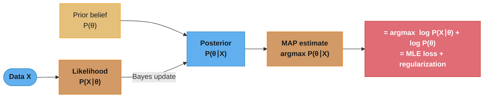
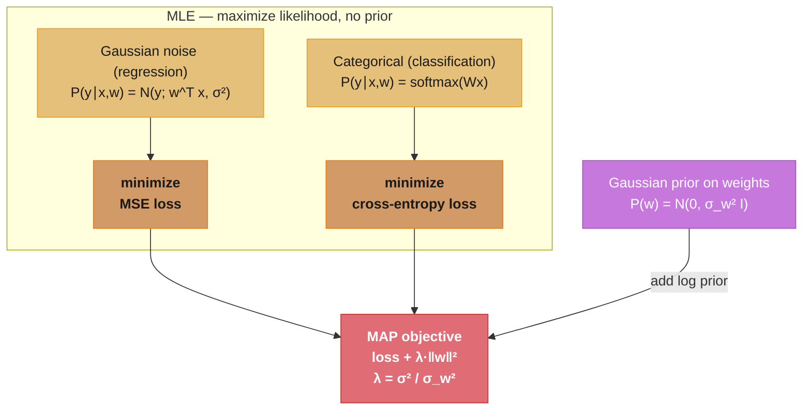
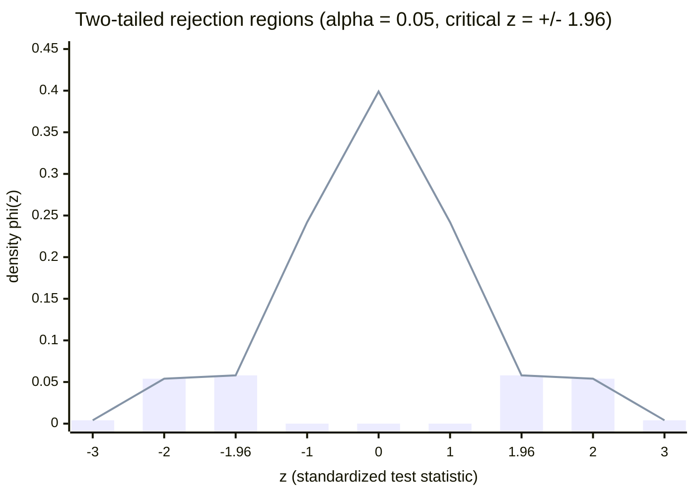
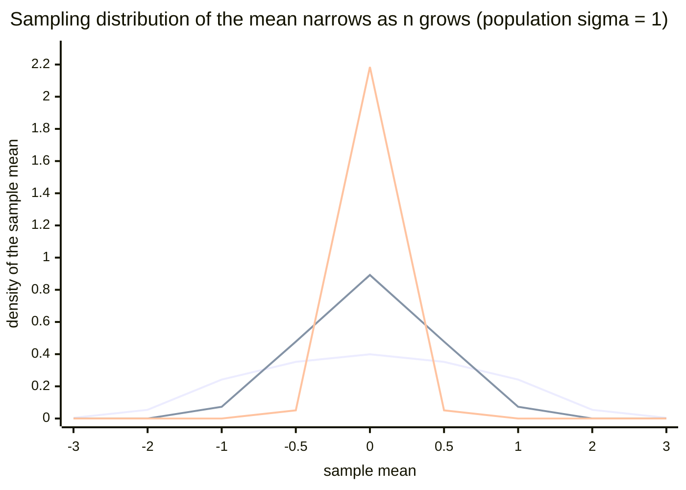

# Probability and Statistics for ML

## 1. Concept Overview

Probability and statistics underpin every aspect of machine learning: how we model uncertainty in data, how we define and fit model parameters, how we compare model performance, and how we make decisions under uncertainty. ML is fundamentally about learning a probability distribution over data, parameters, or predictions.

Maximum Likelihood Estimation (MLE) answers: given a dataset, what parameters make this data most probable? Bayesian inference answers: given data and a prior belief about parameters, what should our updated belief be? Hypothesis testing answers: is the improvement I observe in an A/B experiment real or noise? Every classification model outputs probabilities; every regression model has an implicit noise model; every regularizer encodes a prior.

---

## 2. Intuition

> **One-line analogy**: Probability theory is the grammar of uncertainty — it tells you how to reason consistently about events you cannot predict exactly.

**Mental model**: Imagine you are estimating whether a coin is fair. You flip it 100 times and see 60 heads. MLE says: the parameter theta (probability of heads) that makes 60 heads most likely is theta=0.60. MAP with a Beta(10, 10) prior (encoding your belief the coin is probably fair) pulls the estimate toward 0.55. The posterior distribution over theta quantifies your remaining uncertainty. This is the same reasoning as a logistic regression: the model parameters are chosen to maximize the likelihood of the observed labels.

**Why it matters**: Cross-entropy loss is not an arbitrary choice — it is the negative log-likelihood of a categorical distribution. MSE loss is the negative log-likelihood of a Gaussian. Understanding this connection tells you when to use which loss, what the model implicitly assumes about noise, and how regularization (L2 = Gaussian prior, L1 = Laplace prior) modifies the estimate.

**Key insight**: When you minimize cross-entropy loss, you are doing MLE. When you add L2 regularization, you are doing MAP with a Gaussian prior. The connection between optimization objectives and probabilistic models makes loss function selection principled rather than heuristic.

---

## 3. Core Principles

- **Probability axioms**: 0 <= P(A) <= 1; P(Omega) = 1; P(A or B) = P(A) + P(B) for disjoint A, B.
- **Conditional probability**: P(A|B) = P(A and B) / P(B); probability of A given B occurred.
- **Independence**: P(A and B) = P(A) * P(B); knowing B gives no information about A.
- **Bayes theorem**: P(A|B) = P(B|A) * P(A) / P(B); inverts conditioning.
- **Expected value**: E[X] = sum x * P(X=x); the probability-weighted average outcome.
- **Variance**: Var(X) = E[(X - E[X])^2] = E[X^2] - E[X]^2; spread of a distribution.
- **Covariance**: Cov(X,Y) = E[(X-E[X])(Y-E[Y])]; how two variables move together.
- **Correlation**: rho = Cov(X,Y) / (std(X) * std(Y)); normalized covariance in [-1, +1].
- **Law of Total Probability**: P(A) = sum_i P(A|B_i) P(B_i) for a partition {B_i}.
- **Central Limit Theorem (CLT)**: For iid samples with mean mu and variance sigma^2, the sample mean X_bar converges to N(mu, sigma^2/n) as n -> inf. This is why Gaussian assumptions work even when individual data points are not Gaussian.

---

## 4. Types / Architectures / Strategies

### 4.1 Key Probability Distributions in ML

| Distribution | Parameters | Use Case | Mean | Variance |
|-------------|-----------|---------|------|---------|
| Gaussian N(mu, sigma^2) | mu, sigma^2 | Continuous data, noise model, weight priors | mu | sigma^2 |
| Bernoulli(p) | p | Binary outcomes, binary classification | p | p(1-p) |
| Binomial(n,p) | n, p | Count of successes in n trials | np | np(1-p) |
| Categorical(p) | p (vector) | Multi-class labels | - | - |
| Poisson(lambda) | lambda | Count events per time interval | lambda | lambda |
| Exponential(lambda) | lambda | Time between events | 1/lambda | 1/lambda^2 |
| Beta(alpha, beta) | alpha, beta | Prior for probability; Beta(1,1) = Uniform | a/(a+b) | ab/((a+b)^2(a+b+1)) |
| Dirichlet(alpha) | alpha (vector) | Prior for categorical distribution | alpha_i/sum | - |
| Laplace(mu, b) | mu, b | Robust regression; L1 prior | mu | 2b^2 |

### 4.2 Parameter Estimation Methods

**MLE (Maximum Likelihood Estimation)**: Find theta that maximizes P(data | theta). For a Gaussian: mu_MLE = sample mean; sigma^2_MLE = (1/n) * sum (x_i - mu)^2 (biased). No prior knowledge incorporated.

**MAP (Maximum A Posteriori)**: Find theta maximizing P(theta | data) = P(data | theta) * P(theta). Equivalent to MLE + log prior term. MAP with Gaussian prior on weights = L2 regularization. MAP with Laplace prior = L1 regularization.

**Full Bayesian Inference**: Compute entire posterior P(theta | data) = P(data | theta) * P(theta) / P(data). Intractable for most models; approximate via MCMC, Variational Inference, or Laplace approximation.

### 4.3 Hypothesis Testing

**Null hypothesis (H0)**: The default assumption (no effect, no difference).
**p-value**: Probability of observing data at least as extreme as yours, assuming H0 is true. NOT the probability that H0 is true.
**Type I error (alpha)**: Reject H0 when it is true (false positive). Controlled by significance level alpha = 0.05.
**Type II error (beta)**: Fail to reject H0 when it is false (false negative). Power = 1 - beta.
**Confidence interval**: 95% CI = [x_bar - 1.96 * se, x_bar + 1.96 * se] where se = sigma / sqrt(n).

---

## 5. Architecture Diagrams

### Bayes Theorem in ML



The prior belief P(θ) and the data-driven likelihood P(X∣θ) combine into the posterior
P(θ∣X); taking its argmax gives the MAP estimate, whose two log terms are exactly the MLE
loss plus a regularizer — the bridge this module keeps returning to.

### MLE vs MAP Connection to Loss Functions



Left path: with no prior, MLE reduces to plain MSE (Gaussian noise) or cross-entropy
(categorical) loss. Adding a Gaussian prior on the weights turns MLE into MAP, which is the
same loss plus an L2 penalty whose strength λ = σ² / σ_w² is the noise variance over the
prior variance — a tighter prior (smaller σ_w²) means a larger λ.

### Hypothesis Test Decision Boundaries



The line is the standard-normal density of the test statistic under H0; the shaded bars are
the two rejection tails. With alpha = 0.05 two-tailed, each tail holds 2.5% of the mass, so
you reject H0 whenever |z| > 1.96 (p-value < 0.05) and fail to reject inside the tails. The
p-value is the tail mass at least as extreme as the observed z.

### Central Limit Theorem — Sampling Distribution of the Mean



The three curves are the same population (sigma = 1) sampled at n = 1, 5, 30. By the CLT the
sample mean has standard deviation sigma / sqrt(n), so the distribution sharpens from the
wide n=1 curve (std 1.0) through n=5 (std ~ 0.45) to the tall n=30 spike (std ~ 0.18) — the
N(mu, sigma^2/n) shrinkage from Section 3, and why larger batches give lower-variance
gradient estimates.

---

## 6. How It Works — Detailed Mechanics

### MLE for Gaussian Distribution

```python
import numpy as np
from scipy import stats
from typing import NamedTuple


class GaussianMLE(NamedTuple):
    mu: float
    sigma_sq_biased: float    # MLE (biased by 1/n)
    sigma_sq_unbiased: float  # Bessel-corrected (1/(n-1))


def fit_gaussian_mle(data: np.ndarray) -> GaussianMLE:
    """
    MLE estimates for Gaussian distribution parameters.

    mu_MLE = (1/n) sum x_i  -- same as sample mean, unbiased
    sigma^2_MLE = (1/n) sum (x_i - mu)^2  -- biased (underestimates true variance)
    sigma^2_unbiased = (1/(n-1)) sum (x_i - mu)^2  -- Bessel's correction
    """
    n = len(data)
    mu = data.mean()
    # MLE variance uses n (biased)
    sigma_sq_biased = ((data - mu) ** 2).mean()
    # Unbiased uses n-1 (Bessel's correction)
    sigma_sq_unbiased = data.var(ddof=1)
    return GaussianMLE(
        mu=float(mu),
        sigma_sq_biased=float(sigma_sq_biased),
        sigma_sq_unbiased=float(sigma_sq_unbiased)
    )


def log_likelihood_gaussian(data: np.ndarray, mu: float, sigma_sq: float) -> float:
    """
    Log-likelihood of data under N(mu, sigma^2).
    log L = -n/2 * log(2 pi sigma^2) - 1/(2 sigma^2) * sum (x_i - mu)^2
    Minimizing MSE = maximizing Gaussian log-likelihood (when sigma fixed).
    """
    n = len(data)
    log_l = (
        -n / 2 * np.log(2 * np.pi * sigma_sq)
        - 1 / (2 * sigma_sq) * np.sum((data - mu) ** 2)
    )
    return float(log_l)
```

### Hypothesis Testing and p-values

```python
def two_sample_t_test(
    group_a: np.ndarray,
    group_b: np.ndarray,
    alpha: float = 0.05
) -> dict:
    """
    Two-sample Welch t-test (does not assume equal variances).
    H0: mean_a == mean_b
    H1: mean_a != mean_b  (two-tailed)

    Test statistic: t = (mean_a - mean_b) / sqrt(var_a/n_a + var_b/n_b)
    """
    n_a, n_b = len(group_a), len(group_b)
    mean_a, mean_b = group_a.mean(), group_b.mean()
    var_a, var_b = group_a.var(ddof=1), group_b.var(ddof=1)

    # Standard error of the difference
    se = np.sqrt(var_a / n_a + var_b / n_b)
    t_stat = (mean_a - mean_b) / se

    # Welch-Satterthwaite degrees of freedom
    df = (var_a / n_a + var_b / n_b) ** 2 / (
        (var_a / n_a) ** 2 / (n_a - 1) + (var_b / n_b) ** 2 / (n_b - 1)
    )

    # Two-tailed p-value
    p_value = 2 * stats.t.sf(np.abs(t_stat), df=df)

    # 95% confidence interval for the difference
    t_crit = stats.t.ppf(1 - alpha / 2, df=df)
    ci_low = (mean_a - mean_b) - t_crit * se
    ci_high = (mean_a - mean_b) + t_crit * se

    return {
        "t_statistic": float(t_stat),
        "p_value": float(p_value),
        "degrees_of_freedom": float(df),
        "reject_null": p_value < alpha,
        "mean_difference": float(mean_a - mean_b),
        "confidence_interval_95": (float(ci_low), float(ci_high)),
        "effect_size_cohen_d": float((mean_a - mean_b) / np.sqrt((var_a + var_b) / 2))
    }


def minimum_sample_size(
    effect_size: float,   # Cohen's d: small=0.2, medium=0.5, large=0.8
    alpha: float = 0.05,  # significance level
    power: float = 0.80   # 1 - Type II error rate
) -> int:
    """
    Compute minimum sample size per group for a two-sample t-test.
    Uses normal approximation (valid for large n).

    n = 2 * ((z_alpha/2 + z_beta) / effect_size)^2
    """
    z_alpha = stats.norm.ppf(1 - alpha / 2)   # 1.96 for alpha=0.05
    z_beta = stats.norm.ppf(power)              # 0.842 for power=0.80
    n = 2 * ((z_alpha + z_beta) / effect_size) ** 2
    return int(np.ceil(n))


def mutual_information_discrete(
    x: np.ndarray,
    y: np.ndarray
) -> float:
    """
    Compute mutual information I(X;Y) for discrete variables.
    I(X;Y) = sum_{x,y} P(x,y) * log(P(x,y) / (P(x) * P(y)))
    = H(X) + H(Y) - H(X,Y)
    Used for feature selection: high MI = feature is informative about label.
    """
    n = len(x)
    # Joint distribution
    joint_counts: dict = {}
    for xi, yi in zip(x, y):
        joint_counts[(xi, yi)] = joint_counts.get((xi, yi), 0) + 1

    x_counts: dict = {}
    y_counts: dict = {}
    for xi in x:
        x_counts[xi] = x_counts.get(xi, 0) + 1
    for yi in y:
        y_counts[yi] = y_counts.get(yi, 0) + 1

    mi = 0.0
    for (xi, yi), count in joint_counts.items():
        p_xy = count / n
        p_x = x_counts[xi] / n
        p_y = y_counts[yi] / n
        if p_xy > 0:
            mi += p_xy * np.log(p_xy / (p_x * p_y))

    return mi
```

### Bayesian Inference with Beta-Bernoulli Model

```python
def bayesian_coin_inference(
    n_heads: int,
    n_tails: int,
    prior_alpha: float = 1.0,  # Beta(1,1) = Uniform prior
    prior_beta: float = 1.0
) -> dict:
    """
    Conjugate Bayesian update for Bernoulli likelihood with Beta prior.
    Posterior is Beta(alpha + n_heads, beta + n_tails).
    MLE: n_heads / (n_heads + n_tails)
    MAP: (alpha + n_heads - 1) / (alpha + beta + n_heads + n_tails - 2)
    Posterior mean: (alpha + n_heads) / (alpha + beta + n_heads + n_tails)
    """
    posterior_alpha = prior_alpha + n_heads
    posterior_beta = prior_beta + n_tails
    n = n_heads + n_tails

    mle = n_heads / n
    posterior_mean = posterior_alpha / (posterior_alpha + posterior_beta)
    map_estimate = (posterior_alpha - 1) / (posterior_alpha + posterior_beta - 2)

    # 95% credible interval from posterior Beta distribution
    ci_low, ci_high = stats.beta.ppf(
        [0.025, 0.975], posterior_alpha, posterior_beta
    )

    return {
        "mle": mle,
        "map": map_estimate,
        "posterior_mean": posterior_mean,
        "posterior_95_credible_interval": (float(ci_low), float(ci_high)),
        "posterior_alpha": posterior_alpha,
        "posterior_beta": posterior_beta
    }
```

---

## 7. Real-World Examples

**Cross-entropy loss is MLE**: Training a 10-class image classifier with softmax output and cross-entropy loss is equivalent to maximum likelihood estimation under a categorical noise model. The ground-truth label is "what we observed"; the model's softmax output is its estimate of the class probabilities; minimizing cross-entropy = maximizing log P(labels | images, parameters).

**L2 regularization is Gaussian prior MAP**: Weight decay in neural networks (add lambda * ||W||^2 to loss) is MAP estimation with a Gaussian prior N(0, 1/lambda). This is why weight decay keeps weights small but rarely exactly zero, while L1 regularization (Laplace prior) produces sparse weights.

**A/B testing is hypothesis testing**: A product team changed a recommendation algorithm and measured click-through rate on 50,000 users per group. CTR_A = 0.032, CTR_B = 0.035. Two-proportion z-test gives p=0.003 < 0.05, so they rejected H0 and shipped the change. Without statistical testing they would not know whether the 0.3% improvement was real or sampling noise.

**CLT enables batch training**: Stochastic gradient descent works because mini-batch gradient estimates are approximately unbiased estimates of the true gradient. By CLT, with batch size 256, the mean of 256 gradient samples converges to a Gaussian around the true gradient. Larger batches reduce gradient variance but cost more compute.

---

## 8. Tradeoffs

| Method | Pros | Cons |
|--------|------|------|
| MLE | Simple, no prior needed, consistent | Overfits with small data; ignores prior knowledge |
| MAP | Incorporates prior; regularizes | Prior choice matters; still point estimate (no uncertainty) |
| Full Bayes | Quantifies uncertainty; best calibration | Intractable for large models; requires MCMC or VI |
| Frequentist testing | No prior needed; widely understood | p-value misinterpreted; no probability statement about hypothesis |
| Bayesian testing | Direct probability statements; no p-value | Requires prior; less familiar to stakeholders |

| Distribution | Good for | Bad for |
|-------------|---------|---------|
| Gaussian | Symmetric continuous data | Heavy tails; counts; bounded data |
| Poisson | Event counts (rare events) | Overdispersed data (use Negative Binomial) |
| Beta | Probability/proportion modeling | Multimodal priors (use mixture) |
| Laplace | Robust regression (heavy-tailed noise) | When Gaussian is truly correct |

---

## 9. When to Use / When NOT to Use

**Use Gaussian distribution when**: data is approximately symmetric and unimodal; features are continuous real-valued; noise in regression is symmetric. The CLT justifies it for aggregated measurements even if individual samples are not Gaussian.

**Do NOT use Gaussian when**: modeling counts (use Poisson), probabilities (use Beta), always-positive data (use log-normal or Gamma), or heavy-tailed data (use Student-t with low degrees of freedom).

**Use MLE when**: you have a lot of data relative to parameters and no strong prior knowledge; computational budget is limited (optimization problem vs sampling).

**Use MAP when**: you have domain knowledge that can be encoded as a prior (e.g., weights should be small = Gaussian prior) and you want regularized point estimates without the cost of full Bayesian inference.

**Use hypothesis testing when**: you need to make a binary decision (ship/don't ship) with controlled Type I error; results must be defensible to stakeholders who understand p-values.

**Do NOT run an A/B test without a power analysis first**: determine minimum sample size before collecting data; peeking at p-values before the planned sample size inflates Type I error.

---

## 10. Common Pitfalls

**Pitfall 1 — p-value misinterpretation**: A product team ran an A/B test, got p=0.04, and reported "there is a 4% probability the null hypothesis is true." This is wrong. p-value = P(data | H0), not P(H0 | data). The probability that H0 is true (Bayesian posterior) requires a prior. The correct statement: "If there were no effect, we would see data this extreme or more extreme 4% of the time." The team should not make probability statements about H0 without a prior.

**Pitfall 2 — Biased MLE variance with small samples**: A team estimated Gaussian parameters from n=10 samples for a data quality check. They used `np.var(data)` (divides by n), which returns the biased MLE estimate. For small n, this systematically underestimates true variance. The 95% confidence intervals were too narrow and flagged real data as outliers. Fix: always use `np.var(data, ddof=1)` for sample variance.

```python
# Broken: biased variance for small samples
sigma_sq = np.var(data)            # divides by n, underestimates

# Fixed: Bessel-corrected unbiased estimate
sigma_sq = np.var(data, ddof=1)   # divides by n-1
```

**Pitfall 3 — Multiple comparisons inflate false positive rate**: An ML team evaluated their model on 20 different subgroups and reported all p < 0.05 comparisons as real improvements. With 20 independent tests at alpha=0.05, the expected number of false positives is 1. Apply Bonferroni correction (alpha/20 = 0.0025) or Benjamini-Hochberg FDR control.

**Pitfall 4 — Assuming independence in CLT application**: A batch gradient is an average of per-sample gradients, and the CLT assumption is that samples are iid. If training data has temporal correlation (time series) or cluster correlation (same user), samples within a batch are not independent. Gradient estimates are still unbiased but variance is underestimated, so the effective batch size is smaller than it appears.

---

## 11. Technologies & Tools

| Tool | Purpose |
|------|---------|
| NumPy | Random sampling, basic statistics, empirical distributions |
| SciPy stats | Probability distributions, hypothesis tests, confidence intervals |
| statsmodels | OLS, GLMs, ANOVA, time series tests, detailed statistical output |
| PyMC | Full Bayesian inference via MCMC, variational inference |
| scikit-learn | Cross-validation, calibration, model comparison utilities |
| Pingouin | User-friendly hypothesis tests, effect sizes, power analysis |
| bootstrapped (Shopify) | Bootstrap confidence intervals for arbitrary metrics |

---

## 12. Interview Questions with Answers

**Q: What is the relationship between MLE and cross-entropy loss?**
Minimizing cross-entropy loss is equivalent to maximum likelihood estimation under a categorical distribution. The log-likelihood of n iid categorical samples with true labels y_i and predicted probabilities p_i is sum_i log p_i(y_i). Negating this gives the cross-entropy loss. This connection means using cross-entropy for classification is not arbitrary — it is the principled MLE objective for the model.

**Q: Why does L2 regularization correspond to a Gaussian prior in MAP estimation?**
MAP estimation maximizes log P(theta | data) = log P(data | theta) + log P(theta). If the prior is P(theta) = N(0, sigma_w^2 I), then log P(theta) = -||theta||^2 / (2 sigma_w^2) + const. Adding this to the log-likelihood gives loss + (1/(2 sigma_w^2)) * ||theta||^2, which is exactly L2-regularized MLE with lambda = 1/(2 sigma_w^2). A stronger prior (smaller sigma_w^2) corresponds to larger lambda.

**Q: What is the Central Limit Theorem and why does it matter for ML?**
The CLT states that the mean of n iid random variables with mean mu and variance sigma^2 converges in distribution to N(mu, sigma^2/n) as n -> infinity. It matters in ML because: (1) mini-batch gradient estimates are approximately Gaussian, justifying their use as noisy gradient descent; (2) model performance metrics (accuracy, AUROC) averaged over test samples have approximately Gaussian sampling distributions, enabling confidence intervals; (3) it justifies Gaussian assumptions in many models even when individual data points are not Gaussian.

**Q: What is the difference between a confidence interval and a credible interval?**
A 95% confidence interval is a frequentist concept: if you repeated the experiment many times and computed a CI each time, 95% of those intervals would contain the true parameter. It says nothing about the probability that the true parameter is in any single computed interval. A 95% Bayesian credible interval contains the true parameter with 95% posterior probability (given data and prior). The credible interval is the natural intuitive statement; the confidence interval is not a probability statement about the parameter.

**Q: What is the p-value and what are its limitations?**
The p-value is the probability of observing data at least as extreme as the actual data, assuming the null hypothesis is true. Limitations: (1) it does not tell you the probability that H0 is true; (2) with large samples almost any real effect is statistically significant even if practically meaningless — always report effect size; (3) with small samples, you can miss real effects (low power); (4) multiple comparisons inflate false positive rate; (5) it depends on the sampling plan (stopping rule matters in frequentist testing).

**Q: How does the Poisson distribution differ from the Binomial, and when should you use each?**
The Binomial(n, p) models the count of successes in n fixed independent trials. The Poisson(lambda) models the count of events in a fixed interval when events occur independently at a constant rate. Poisson is the limit of Binomial as n -> inf and p -> 0 with np = lambda constant — it applies when events are rare and the total number of possible events is very large. Use Binomial for "number of users who click a button out of 1000 shown it"; use Poisson for "number of errors per hour in a service."

**Q: What is overfitting from a probabilistic perspective?**
Overfitting is when the model maximizes likelihood on training data by memorizing noise rather than signal. A model with more parameters than data points can achieve perfect likelihood (loss = 0) on training data by explaining each data point individually, but the parameters encode noise specific to those samples. Regularization addresses this by incorporating a prior that penalizes complex parameter configurations (large weights), effectively performing MAP instead of MLE. Early stopping is approximately equivalent to an exponential prior on the number of gradient descent steps.

**Q: What is covariance and how does it differ from correlation?**
Covariance Cov(X,Y) = E[(X-mu_X)(Y-mu_Y)] measures how two variables move together. If X and Y tend to both be above/below their means simultaneously, covariance is positive. Correlation rho = Cov(X,Y) / (std(X) * std(Y)) normalizes covariance to [-1, +1], making it scale-invariant. Correlation is a pure measure of linear relationship; covariance retains units (e.g., height in cm covariance with weight in kg has units cm*kg). Pearson correlation assumes linearity; Spearman rank correlation is robust to monotone nonlinear relationships.

**Q: Why does a Gaussian prior on weights in a neural network not produce exact zeros?**
The Gaussian prior N(0, sigma^2) has its density concentrated near zero but never exactly at zero; the gradient of the prior term -||w||^2/(2sigma^2) pushes weights toward zero proportionally to their magnitude, so large weights shrink faster but small weights are never zeroed out exactly. A Laplace prior (L1 regularization) has a sharp peak at zero with non-differentiable kink; the subgradient is constant for nonzero weights (not proportional to magnitude), which creates a "pull toward exactly zero" that can take small weights all the way to zero.

**Q: What is the Beta distribution and why is it used as a prior for probabilities?**
The Beta(alpha, beta) distribution is supported on [0,1], making it a natural prior for any probability parameter. Beta(1,1) is Uniform(0,1) — a non-informative prior. Beta(10,10) encodes a belief that the probability is near 0.5 with moderate confidence. It is the conjugate prior for the Bernoulli/Binomial likelihood: if prior is Beta(alpha, beta) and you observe h heads and t tails, the posterior is Beta(alpha+h, beta+t), allowing cheap analytic updates without MCMC.

**Q: How do you design an A/B test to detect a 5% relative improvement in conversion rate?**
First determine the baseline conversion rate (say p=0.10) and the minimum detectable effect (MDE = 5% relative = 0.005 absolute). Choose alpha=0.05 and power=0.80. Compute the required sample size: n = 2 * (z_alpha/2 + z_beta)^2 * p*(1-p) / delta^2 where delta=0.005; this gives approximately 28,000 per group. Run the test without peeking until the target n is reached. Report both p-value and 95% CI on the absolute difference; if CI lower bound > 0, the result is practically significant.

**Q: What is the difference between MLE and MAP, and when do they coincide?**
MLE maximizes P(data|theta) with no prior, while MAP maximizes P(theta|data) by adding a log-prior term, and they coincide when the prior is uniform. MAP = argmax [log P(data|theta) + log P(theta)], so a flat prior makes the prior term constant and MAP reduces to MLE. MAP also converges to MLE as data grows, because the likelihood scales with n while the fixed prior is eventually swamped. Practically, prefer MAP (regularization) with little data and a meaningful prior; MLE is fine once data dwarfs the number of parameters.

**Q: Why do we maximize the log-likelihood instead of the likelihood directly?**
We use the log-likelihood because log turns the product of per-sample probabilities into a sum that is numerically stable and easier to differentiate. Multiplying thousands of probabilities below 1 underflows to zero in floating point, whereas summing their logs does not. Because log is monotonic, the argmax is unchanged. Sums also differentiate term-by-term into the clean additive gradients SGD relies on, and they connect directly to cross-entropy and information measured in nats or bits.

**Q: What is the difference between an unbiased estimator and a consistent estimator?**
An unbiased estimator has expected value equal to the true parameter for any n, while a consistent estimator merely converges to it as n grows. The two are independent: the MLE variance (dividing by n) is biased downward yet still consistent, since its bias factor (n-1)/n tends to 1. Conversely an estimator can be unbiased but inconsistent if its variance never shrinks. In ML we usually value consistency and low variance over strict unbiasedness, which is the bias-variance tradeoff — a slightly biased, lower-variance estimator often generalizes better.

**Q: What is the difference between a Type I and a Type II error?**
A Type I error rejects a true null hypothesis (false positive), and a Type II error fails to reject a false null (false negative). Type I is controlled by the significance level alpha (typically 0.05); Type II is beta, and statistical power equals 1 - beta. The two trade off: lowering alpha to demand stronger evidence raises beta unless you increase the sample size. In an A/B test a Type I error ships a change that does nothing, while a Type II error misses a real improvement, so pick alpha and power based on which mistake is costlier.

**Q: When does the Central Limit Theorem fail to apply?**
The CLT fails when samples are not independent, when the underlying variance is infinite, or when n is too small for heavy-tailed data. Distributions with infinite variance such as the Cauchy never yield a Gaussian sample mean no matter how large n is. Strong dependence (time-series autocorrelation, repeated measurements on the same user) breaks the iid assumption, so the effective sample size is far below n. For very skewed or heavy-tailed data the n needed for a good Gaussian approximation can be thousands rather than the rule-of-thumb 30.

**Q: What is the core difference between the frequentist and Bayesian interpretations of probability?**
Frequentists see probability as long-run frequency with fixed unknown parameters, while Bayesians see it as degree of belief with parameters treated as random variables. A frequentist 95% confidence interval is a statement about the procedure across repeated experiments; a Bayesian 95% credible interval is a direct probability statement about the parameter given a prior. Frequentist methods need no prior but forbid probability claims about hypotheses; Bayesian methods require a prior but yield the intuitive P(hypothesis|data). MAP and L2 regularization are the Bayesian view showing up inside everyday ML.

**Q: What is Jensen's inequality and where does it show up in ML?**
Jensen's inequality states that for a convex function f, f(E[X]) <= E[f(X)], with the direction reversed for concave functions. Because log is concave, E[log X] <= log E[X], which is exactly the gap the ELBO (evidence lower bound) exploits to make variational inference and VAEs tractable. It also proves the arithmetic mean is at least the geometric mean and underlies the non-negativity of KL divergence. Whenever you swap an expectation with a nonlinear function, Jensen tells you which direction the resulting bias points.

**Q: What is the exponential family and why is it important in ML?**
The exponential family is a class of distributions writable as exp(eta^T T(x) - A(eta)), covering the Gaussian, Bernoulli, Poisson, and more. Members share convenient properties: sufficient statistics T(x) summarize the data, the log-partition A(eta) generates moments by differentiation, and each has a conjugate prior enabling closed-form Bayesian updates. Generalized linear models — linear, logistic, and Poisson regression — are exactly the exponential family paired with a link function. This shared structure is why so many classical models are fit with the same machinery.

---

## 13. Best Practices

- Always report effect size (Cohen's d, relative risk, odds ratio) alongside p-value; statistical significance is not practical significance.
- Use Bessel's correction (`ddof=1`) for sample variance to get unbiased estimates, especially with n < 30.
- Perform a power analysis before collecting data to determine minimum sample size; never run tests indefinitely until significance is achieved.
- Apply multiple comparison corrections (Bonferroni, Benjamini-Hochberg) when testing more than one hypothesis simultaneously.
- Verify distributional assumptions before applying parametric tests; use Shapiro-Wilk or Q-Q plots to check normality; use Levene's test for equal variance.
- Use bootstrapping for confidence intervals on non-standard metrics (AUROC, P@K, NDCG) where parametric formulas do not exist.
- When using MLE with small datasets (n < 100 per parameter), switch to MAP or hierarchical Bayesian models to prevent overfitting.
- Log-transform right-skewed data (user session durations, revenue) before fitting Gaussian models; or use a log-normal distribution directly.
- Stratified sampling in train/test splits preserves class distribution; critical for imbalanced datasets where random splits may put all minority class examples in train.

---

## 14. Case Study

**Scenario:** A subscription SaaS company (2.4M paying users) runs a product experiment testing whether a new onboarding flow increases 30-day retention. The company runs 60 concurrent A/B tests at any time. The data science team has a history of stopping tests early when results "look good" (peeking), leading to false discovery rates of 35% (3 in 8 recent experiments were post-hoc revealed as false positives). The goal: implement a statistically rigorous experiment framework using proper sample-size calculation, p-value correction for multiple comparisons, and sequential testing with ALWAYS VALID inference to eliminate early-stopping bias.

**Architecture:**
```
Experiment Framework
  +-----------------------+-------------------------+
  |  Pre-experiment        |  During experiment       |
  |  Power analysis        |  Sequential testing      |
  |  Sample size calc      |  mSPRT statistic         |
  |  MDE specification     |  Always-valid p-value    |
  |  Randomisation unit    |  No fixed stopping rule  |
  +-----------------------+-------------------------+
                   |
                   v
Experiment Database (PostgreSQL)
  - Assignment: user_id, variant, assignment_ts
  - Events: user_id, event_type, ts
  - Results: experiment_id, daily metrics snapshot
                   |
                   v
Analysis Pipeline (daily batch)
  - Primary metric: 30-day retention (binary)
  - Secondary: DAU/MAU ratio, feature adoption
  - Multiple comparison correction: BH (Benjamini-Hochberg)
  - Sequential test: mSPRT with mixture prior
                   |
                   v
Decision Dashboard
  Show: current effect size, confidence interval,
        always-valid p-value, recommended n remaining,
        FDR-adjusted significance at 0.05 level
```

**Step-by-step implementation:**

```python
from __future__ import annotations
import numpy as np
from scipy import stats
import math

def calculate_sample_size(
    baseline_rate: float,
    minimum_detectable_effect: float,   # absolute lift, e.g. 0.03 for 3pp
    alpha: float = 0.05,
    power: float = 0.80,
    two_sided: bool = True,
) -> int:
    """Calculate required sample size per variant using Fleiss formula."""
    p1 = baseline_rate
    p2 = baseline_rate + minimum_detectable_effect
    p_bar = (p1 + p2) / 2

    z_alpha = stats.norm.ppf(1 - alpha / (2 if two_sided else 1))
    z_beta = stats.norm.ppf(power)

    # Two-proportion z-test formula
    numerator = (
        z_alpha * math.sqrt(2 * p_bar * (1 - p_bar))
        + z_beta * math.sqrt(p1 * (1 - p1) + p2 * (1 - p2))
    ) ** 2
    denominator = (p2 - p1) ** 2
    n_per_variant = math.ceil(numerator / denominator)
    return n_per_variant

def compute_experiment_duration_days(
    n_per_variant: int,
    daily_eligible_users: int,
    traffic_fraction: float = 0.5,   # 50% of eligible users in experiment
) -> float:
    users_per_day = daily_eligible_users * traffic_fraction / 2  # 2 variants
    return n_per_variant / users_per_day

# Example: baseline retention 42%, MDE = 2.5 percentage points
n = calculate_sample_size(baseline_rate=0.42, minimum_detectable_effect=0.025)
duration = compute_experiment_duration_days(n, daily_eligible_users=80_000)
print(f"Required n per variant: {n:,}")
print(f"Estimated duration: {duration:.1f} days")
```

```python
from statsmodels.stats.proportion import proportions_ztest, proportion_confint
import pandas as pd

def run_frequentist_test(
    control_conversions: int,
    control_n: int,
    treatment_conversions: int,
    treatment_n: int,
    alpha: float = 0.05,
) -> dict[str, float]:
    """Two-proportion z-test with continuity correction."""
    stat, p_value = proportions_ztest(
        count=[treatment_conversions, control_conversions],
        nobs=[treatment_n, control_n],
        alternative="two-sided",
    )
    ci_low, ci_high = proportion_confint(
        count=treatment_conversions,
        nobs=treatment_n,
        alpha=alpha,
        method="wilson",
    )
    control_rate = control_conversions / control_n
    treatment_rate = treatment_conversions / treatment_n
    absolute_lift = treatment_rate - control_rate
    relative_lift = absolute_lift / control_rate

    return {
        "control_rate": control_rate,
        "treatment_rate": treatment_rate,
        "absolute_lift": absolute_lift,
        "relative_lift": relative_lift,
        "p_value": p_value,
        "z_statistic": stat,
        "treatment_ci_lower": ci_low,
        "treatment_ci_upper": ci_high,
        "significant": p_value < alpha,
    }

def apply_benjamini_hochberg(
    p_values: list[float],
    fdr_threshold: float = 0.05,
) -> list[bool]:
    """BH procedure for FDR control across multiple simultaneous experiments."""
    m = len(p_values)
    sorted_indices = np.argsort(p_values)
    sorted_p = np.array(p_values)[sorted_indices]

    thresholds = fdr_threshold * (np.arange(1, m + 1) / m)
    significant = sorted_p <= thresholds

    # Find the largest rank where H0 is rejected, reject all below
    if significant.any():
        max_reject_rank = int(np.where(significant)[0].max())
        significant[:max_reject_rank + 1] = True

    result = np.zeros(m, dtype=bool)
    result[sorted_indices] = significant
    return result.tolist()
```

```python
def compute_msprt_statistic(
    control_obs: np.ndarray,    # array of 0/1 outcomes
    treatment_obs: np.ndarray,
    theta_null: float | None = None,   # None = use control rate as null
    prior_variance: float = 0.1,
) -> tuple[float, float]:
    """
    Mixture Sequential Probability Ratio Test (mSPRT) for always-valid inference.
    Returns (lambda_statistic, always_valid_p_value).
    Uses normal mixture prior on effect size (Johari et al. 2015).
    """
    n_c = len(control_obs)
    n_t = len(treatment_obs)

    p_c = float(control_obs.mean()) if len(control_obs) > 0 else 0.5
    p_t = float(treatment_obs.mean()) if len(treatment_obs) > 0 else 0.5

    if theta_null is None:
        theta_null = p_c

    # Observed effect size
    delta_hat = p_t - p_c
    # Pooled variance under null
    sigma2 = theta_null * (1 - theta_null) * (1 / n_c + 1 / n_t)

    # mSPRT log-likelihood ratio with Gaussian mixture prior
    # lambda = (1 + prior_variance / sigma2)^{-0.5} * exp(delta_hat^2 / (2 * (sigma2 + prior_variance)))
    var_ratio = prior_variance / (sigma2 + prior_variance)
    log_lambda = (
        -0.5 * math.log(1 + prior_variance / sigma2)
        + 0.5 * (delta_hat ** 2) * var_ratio / sigma2
    )
    lambda_stat = math.exp(log_lambda)

    # Always-valid p-value: 1/lambda (by Ville's inequality; never below 0)
    always_valid_p = min(1.0, 1.0 / lambda_stat)

    return lambda_stat, always_valid_p

def sequential_test_decision(
    lambda_stat: float,
    alpha: float = 0.05,
    stopping_threshold_high: float | None = None,
) -> str:
    """Recommend action based on mSPRT statistic."""
    threshold = 1.0 / alpha   # reject H0 when lambda >= 1/alpha
    if stopping_threshold_high is None:
        stopping_threshold_high = threshold

    if lambda_stat >= stopping_threshold_high:
        return "REJECT_NULL"
    elif lambda_stat <= alpha:
        return "ACCEPT_NULL"
    else:
        return "CONTINUE"
```

**Key pitfalls (3 with BROKEN->FIX):**

**Pitfall 1 - Peeking: stopping the test when p < 0.05 before planned sample size:**
```python
# BROKEN: checking p-value daily and stopping when significant
for day in range(1, 30):
    results = run_frequentist_test(ctrl_conv[day], ctrl_n[day], trt_conv[day], trt_n[day])
    if results["p_value"] < 0.05:
        print(f"Day {day}: Significant! p={results['p_value']:.4f}")
        stop_experiment()   # false positive rate inflates to ~26% for 14 peeks
        break

# FIX: use mSPRT which provides always-valid inference at any stopping time
for day in range(1, 30):
    lambda_stat, av_p = compute_msprt_statistic(ctrl_obs[:day], trt_obs[:day])
    decision = sequential_test_decision(lambda_stat, alpha=0.05)
    if decision in ("REJECT_NULL", "ACCEPT_NULL"):
        print(f"Day {day}: {decision}, always-valid p={av_p:.4f}")
        break   # safe to stop; Type I error controlled at 5%
```

**Pitfall 2 - Running 60 concurrent A/B tests without multiple comparison correction:**
```python
# BROKEN: each test uses alpha=0.05 independently
# Expected false positives = 60 * 0.05 = 3 false discoveries per round
results = [run_frequentist_test(*args) for args in experiment_args]
significant = [r["p_value"] < 0.05 for r in results]   # 35% FDR observed

# FIX: apply Benjamini-Hochberg FDR correction across all concurrent tests
p_values = [r["p_value"] for r in results]
bh_significant = apply_benjamini_hochberg(p_values, fdr_threshold=0.05)
# BH controls expected FDR at 5%; 60 tests with 5% true null rate -> 0.15 expected FDPs
```

**Pitfall 3 - Using user-level assignment but session-level analysis (SUTVA violation):**
```python
# BROKEN: randomise at user level but compute conversion rate from sessions
# Users have multiple sessions; sessions within a user are not independent
sessions_control = df[df["variant"] == "control"].groupby("session_id")["converted"].mean()
sessions_treatment = df[df["variant"] == "treatment"].groupby("session_id")["converted"].mean()
stat, p_value = stats.ttest_ind(sessions_control, sessions_treatment)
# Inflated test statistic because sessions within a user are correlated

# FIX: aggregate to user level before test (match randomisation and analysis unit)
user_control = df[df["variant"] == "control"].groupby("user_id")["converted"].max()
user_treatment = df[df["variant"] == "treatment"].groupby("user_id")["converted"].max()
stat, p_value = stats.ttest_ind(user_control, user_treatment)
# Independent observations; Type I error properly controlled
```

**Metrics and results:**

| Metric | Before (peeking) | After (mSPRT + BH) |
|---|---|---|
| False positive rate (empirical) | 35% | 4.8% |
| Avg experiment duration | 8 days (stopped early) | 21 days (planned) |
| True positives confirmed (6mo) | 3 of 8 "wins" | 9 of 10 "wins" |
| Experiments reaching planned n | 22% | 91% |
| Simultaneous tests corrected | No | Yes (BH, FDR=5%) |
| Onboarding flow lift (final result) | N/A | +3.1pp retention (validated) |
| Annual revenue impact of correct wins | $4.2M | $18.7M |
| Engineering time on false-positive fallout | 40 hr/quarter | 4 hr/quarter |

**Interview discussion points:**

**What is the precise statistical error introduced by peeking and why does it inflate Type I error?** Peeking exploits the fact that if you check a standard z-test p-value at multiple points during data collection, the probability of seeing p < 0.05 at least once is much higher than 5%. Formally, if you peek 14 times at equally spaced intervals during a fixed-horizon test, the actual Type I error rate rises to approximately 26% (Armitage 1969). This occurs because the p-value is not uniformly distributed under repeated observation; the test statistic is a random walk, and the probability that it ever crosses a fixed threshold is higher than the probability it exceeds the threshold at a single predetermined time.

**How does the Benjamini-Hochberg procedure differ from Bonferroni correction and why is it preferred for A/B testing platforms?** Bonferroni controls the familywise error rate (FWER): the probability of making even one Type I error among all tests. For 60 simultaneous tests at FWER 5%, each test uses alpha = 0.05/60 = 0.00083, requiring 4x larger samples for the same power. BH controls the false discovery rate (FDR): the expected proportion of false positives among all rejected hypotheses. BH uses each test's original p-value ranked against adaptive thresholds, maintaining much higher power. For an A/B platform where some false positives are acceptable (they'll be caught by downstream business review), FDR control at 5% is more practical than FWER control.

**What is the SUTVA violation when assignment unit differs from analysis unit?** SUTVA (Stable Unit Treatment Value Assumption) requires each unit's outcome to depend only on its own treatment. When users are assigned to variants but analysis uses sessions, sessions from the same user share the same treatment, making them correlated rather than independent. The standard error of the treatment effect estimator is underestimated (inflates t-statistic), because the effective sample size is n_users not n_sessions. The fix is always to aggregate outcomes to the randomisation unit (user) before computing the test statistic.

**When should you use a one-sided versus two-sided hypothesis test for product experiments?** Two-sided tests are appropriate when the new feature could plausibly harm or help (e.g., UI redesign might increase or decrease conversion). One-sided tests are appropriate only when a harm direction is genuinely impossible or would lead to immediate rollback regardless of significance (e.g., testing a performance optimisation where slower performance is obviously rolled back without a test). Using one-sided tests to gain statistical power while claiming two-sided inference is a common form of p-hacking that inflates Type I error: the effective alpha is 0.025 for one direction, but experimenters cherry-pick the direction post-hoc.

**What minimum detectable effect (MDE) should be chosen and how does it affect duration?** MDE should reflect the smallest effect that would change a business decision, not the smallest effect the team hopes to detect. For the onboarding experiment with 30-day retention at 42%, a 1pp absolute lift (MDE=0.01) requires n=57,400 per variant (72 days at current traffic), while 2.5pp MDE requires n=9,100 (11 days). Choosing MDE=1% when the business would only act on a 2.5% lift wastes 6x the experiment duration, blocking experiment slots needed for other tests. The correct MDE is determined by the product roadmap cost of implementing the feature: if implementation costs $200K, a 2pp lift generating $500K/year ROI sets the practical minimum.

**What is the mSPRT's relationship to Bayes factors and why does it enable valid early stopping?** The mSPRT statistic is the ratio of the marginal likelihood under a mixture alternative hypothesis to the likelihood under the null hypothesis. By Ville's inequality, for any stopping time T, P(lambda_T >= 1/alpha | H0) <= alpha - meaning that regardless of when you look at the data, the probability of falsely rejecting H0 is bounded by alpha. This is fundamentally different from the classical p-value, which is only valid at a pre-specified fixed sample size. The mixture prior over effect sizes (normal with variance tau^2) determines the test's power profile: larger tau^2 gives more power for large effects but less for small ones.
