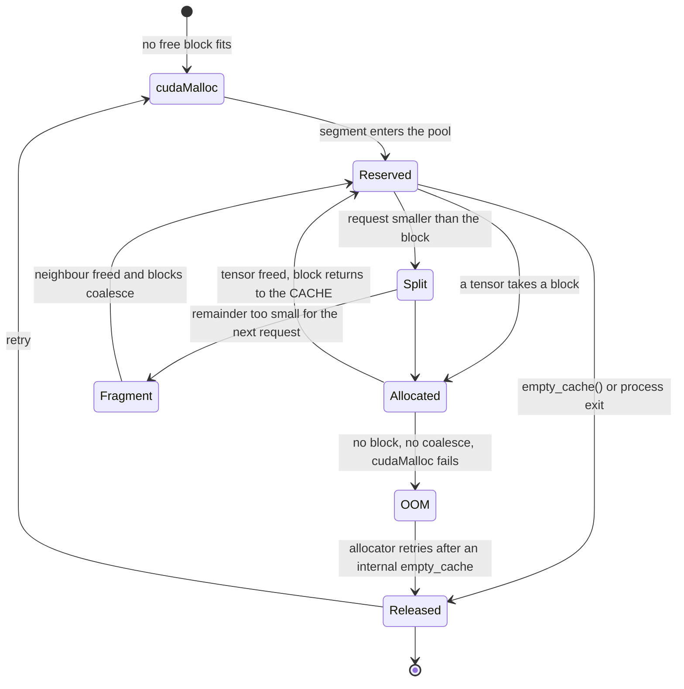
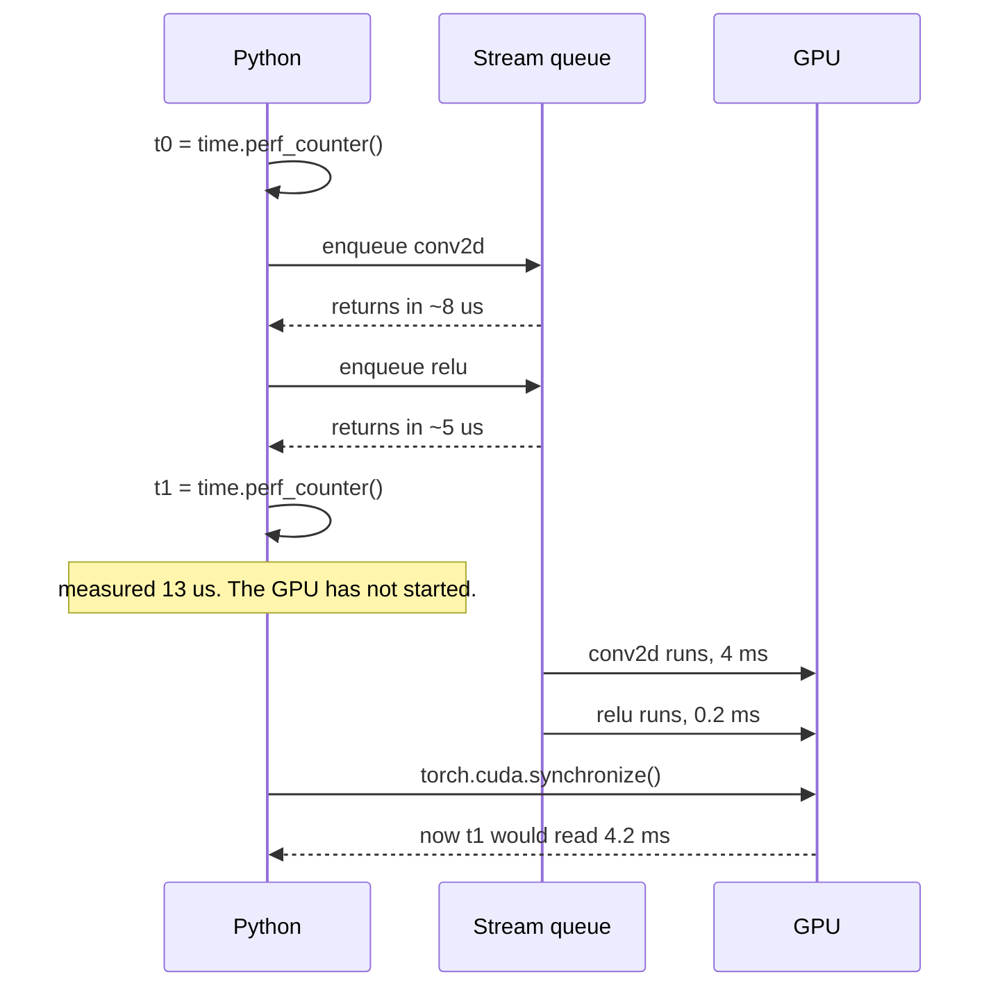
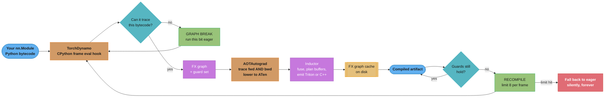
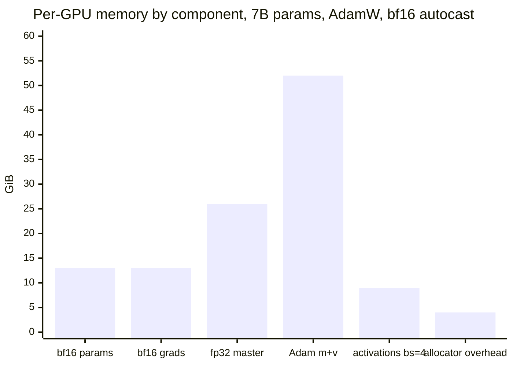

# PyTorch Deep Dive

---

## 1. Concept Overview

PyTorch is the runtime almost every deep-learning job in this repository actually executes on.
[Training Deep Networks](../training_deep_networks/training_deep_networks.md) tells you what a
good training loop contains; [Distributed Training](../distributed_training/distributed_training.md)
tells you how to split it across GPUs; [GPU and Hardware
Optimization](../gpu_and_hardware_optimization/gpu_and_hardware_optimization.md) tells you what
the silicon can do. This page is about the layer in between — what the framework does with your
Python between `loss.backward()` and the kernel launch, and why that layer is the reason your
job is slow, non-deterministic, or out of memory.

**This module targets PyTorch 2.13.0**, released 2026-07-08. Every default, error string,
signature and dtype policy quoted below was read out of an installed 2.13.0 package
(CPython 3.13, macOS arm64, CPU/MPS build), not from documentation. Claims that require a CUDA
device — allocator internals, NCCL, CUDA graphs — are marked as such and are sourced from the
API surface plus the mechanisms described here, not from a run on this machine. Where a
behaviour changed at a known version the tag is inline: `[2.13]`, `[2.6+]`.

The thesis of this page, and the sentence to carry into an interview:

> **PyTorch is an eager interpreter with a tape recorder bolted on, sitting on a caching
> allocator and an asynchronous launch queue. Nearly every surprising thing it does — the OOM
> at a memory level you thought was fine, the timing that lies, the recompile storm, the
> gradient that is silently wrong — falls out of one of those four facts.**

The stack, from your `for batch in loader:` down to the metal:

| Layer | What it is | Where it bites you |
|---|---|---|
| **Python frontend** | `torch.nn`, `torch.optim`, `DataLoader` | `__setattr__` magic decides what is a parameter |
| **Autograd** | A tape recorded during forward, replayed backward | Accumulation, retained graphs, leaked activations |
| **Dispatcher** | Routes `aten::add` by device, dtype, and layered keys (autograd, autocast, functionalization) | Autocast policy, inference mode, subclass surprises |
| **ATen / c10** | The operator library and `TensorImpl` — sizes, strides, storage | Views, contiguity, `.view()` vs `.reshape()` |
| **Caching allocator** | A per-device, per-stream block cache in front of `cudaMalloc` | Reserved-vs-allocated, fragmentation, `empty_cache()` |
| **Launch queue** | Kernels enqueued on a CUDA stream, returning immediately | Every timing bug you have ever written |
| **Kernels** | cuBLAS, cuDNN, hand-written ATen CUDA, Inductor-generated Triton | Nondeterministic atomics, TF32 |

The compiler stack — `torch.compile`, TorchDynamo, AOTAutograd, Inductor, `torch.export` — is
a second path that replaces the middle of that table with a captured graph. It is no longer
experimental; it is the default answer to "make this faster", and as of 2.13 it is also the
official replacement for TorchScript, whose `torch.jit.script` and `torch.jit.trace` now emit
a deprecation warning on every call.

**Where this module sits.** LR schedules, warmup, clipping and augmentation belong to
[Training Deep Networks](../training_deep_networks/training_deep_networks.md). The taxonomy of
data/tensor/pipeline parallelism, ZeRO stages and the ring-allreduce volume formula belong to
[Distributed Training](../distributed_training/distributed_training.md); this page covers only
PyTorch's *mechanism* for DDP and FSDP. Roofline, occupancy, arithmetic intensity and MFU
belong to [GPU and Hardware
Optimization](../gpu_and_hardware_optimization/gpu_and_hardware_optimization.md) and to the
[CUDA section](../../cuda/README.md) — in particular [Streams, Events and
Concurrency](../../cuda/streams_events_and_concurrency/streams_events_and_concurrency.md),
[CUDA Graphs](../../cuda/cuda_graphs/cuda_graphs.md) and [Memory Management and Data
Transfer](../../cuda/memory_management_and_data_transfer/memory_management_and_data_transfer.md).
Production LLM serving belongs to [NVIDIA Triton Inference
Server](../../technologies/nvidia_triton_inference_server/nvidia_triton_inference_server.md)
and [Inference Engines](../../llm/inference_engines/inference_engines.md). What is left, and
what this page is, is the framework's implementation.

---

## 2. Intuition

**One-line analogy.** PyTorch is a tape recorder wired to a warehouse. Every operation you run
is played immediately (eager) and simultaneously written to a tape (autograd) so it can be
played backwards; every tensor you allocate comes from a warehouse that never returns pallets
to the supplier (the caching allocator), and every instruction you issue to the GPU goes into
an outbox that is emptied by someone else (the stream).

**Mental model: four independent facts, and every mystery is one of them.**

1. *A tensor is a view over a byte buffer.* Shape and strides are metadata. Most operations that
   look like they reshape data only rewrite metadata, and the ones that cannot are exactly the
   ones that copy.
2. *The graph is built during forward and consumed during backward.* It is not a program you
   compiled; it is a record of what just ran. Keep a reference to any node and you keep every
   activation it points at.
3. *Memory is not returned when you free a tensor.* It returns to PyTorch's cache, so the
   number `nvidia-smi` shows is a high-water mark of the cache, not of your model.
4. *`kernel(x)` returns before the kernel runs.* Your Python is a producer feeding a queue.

**Why it matters.** Every one of the four is *invisible when things work*. Nothing tells you
that your loss list is pinning 40 GB of activations; nothing tells you that your benchmark
measured queue-insertion time; nothing tells you that `torch.compile` recompiled eleven times
and is now running eager. PyTorch's ergonomics come from hiding these, and the senior-engineer
skill is knowing which one is lying to you today.

**Key insight: eager mode's cost is not arithmetic, it is coordination.**

A `y = a + b` on two 4096-element fp32 tensors moves 48 KB and does 4096 flops. On an H100 that
kernel runs in roughly a microsecond. But dispatching it — Python bytecode, a dispatcher lookup
across device/dtype/autograd keys, autograd node construction, an allocation from the caching
allocator, and a kernel launch — costs on the order of 5-10 microseconds of CPU time. In that
regime the GPU is idle waiting for its next instruction, and you are **launch-bound**: the
profile shows low SM utilization and gaps between kernels, and adding a bigger GPU changes
nothing.

That single observation explains the entire PyTorch 2 compiler stack. Inductor's biggest win is
not smarter math; it is *fusing forty tiny kernels into three* so there are thirty-seven fewer
launches and thirty-seven fewer round trips through global memory. It also explains CUDA graphs
(replay a recorded launch sequence with one call), and why the same optimizations do almost
nothing for a model that is one enormous GEMM. Ask "how big are my kernels" before you ask
"which compiler flag".

---

## 3. Core Principles

**A tensor is `(storage, offset, sizes, strides, dtype, device)`.** Nothing else. Two tensors
sharing a storage are aliases: write through one, see it through the other. Every "does this
copy?" question is answered by asking whether the result can be expressed as new metadata over
the same bytes.

**Autograd records the graph that ran, not the program you wrote.** A Python `if` is resolved at
execution time and only the taken branch is on the tape. This is the entire content of "dynamic
graphs", and it is why a `print` inside a model works, why a data-dependent control flow is
trivially expressible, and why `torch.compile` has to work so hard: there is no graph until
something runs.

**Gradients accumulate; they are never overwritten.** `backward()` adds into `.grad`. This is a
feature (gradient accumulation, multiple losses, shared modules) with one consequence you must
handle manually: `zero_grad()` exists because the framework will not guess when your step
boundary is.

**Freeing a tensor does not free GPU memory.** It returns a block to the caching allocator. The
process's memory footprint is monotonically non-decreasing under normal operation, and that is
the design working, not a leak.

**Everything on a CUDA device is asynchronous unless it is not.** Kernel launches, `H2D`/`D2H`
copies from pinned memory, and most collectives return immediately. Synchronization happens at
`.item()`, `.cpu()`, `print()`, `torch.cuda.synchronize()`, an allocator retry, and at a few
implicit points. Correctness is guaranteed by stream ordering; *your measurements* are not.

**Precision is per-operator, not per-model.** Autocast maintains an allowlist: matmul-shaped ops
run in the low dtype, reductions and normalizations stay fp32. Mixed precision is not "cast the
model to half"; casting the model to half is what people do instead and is how they get NaNs.

**The compiler is a guard machine.** `torch.compile` does not compile your function; it compiles
*one specialization* of it plus a set of guards that decide whether the specialization is still
valid. Every performance problem with `torch.compile` is a guard problem.

**Determinism is opt-in and incomplete.** The fast kernels are nondeterministic by construction
(atomics, split-K reductions, autotuned algorithm selection). You can buy determinism within one
process on one GPU model at a real speed cost; you cannot buy bit-exactness across GPU
architectures, and you should stop trying.

---

## 4. Types / Architectures / Strategies

### The two execution modes

| | Eager | Compiled (`torch.compile`) |
|---|---|---|
| When the graph exists | Never — ops dispatch one at a time | Captured at first call, cached per guard set |
| Python in the loop | Every op | Only at graph boundaries |
| Debuggability | `pdb` anywhere, `print` anywhere | Breakpoints cause graph breaks; use `TORCH_LOGS` |
| Warm-up cost | Zero | Seconds to minutes on first call, per shape bucket |
| Failure mode | Slow | Recompile storm, silent fallback to eager |
| Correct choice for | Research iteration, small models, dynamic control flow | Anything you will run more than a few thousand steps |

### The four ways to leave PyTorch

| Path | Produces | Status in 2.13 | Use when |
|---|---|---|---|
| `torch.export` + AOTInductor | A `.pt2` archive with precompiled kernels, no Python | **The current path.** `strict=False` is the default | You need a C++/Triton-runnable artifact with no warm-up cliff |
| `torch.onnx.export` | ONNX graph. **`dynamo=True` is the default** `[2.13]` | Current, and now built on `torch.export` | The consumer is ONNX Runtime, TensorRT, OpenVINO, CoreML |
| `torch.jit.script` / `trace` | TorchScript | **Deprecated** — every call warns "switch to `torch.compile` or `torch.export`" | Only to keep an existing artifact loading |
| `state_dict` + code | A tensor dict | Eternal | The consumer is another PyTorch process you control |

**Say the TorchScript sentence out loud in an interview**, because a lot of material is stale on
it: TorchScript is not "the way to deploy PyTorch" any more. In 2.13 both entry points emit a
`UserWarning` with the exact text ``` `torch.jit.script` is deprecated. Please switch to
`torch.compile` or `torch.export`.``` TorchScript modules still load and still run — Triton's
PyTorch backend still accepts them — but nothing new should be written against it.

### Memory-reduction strategies, ordered by what they cost you

| Strategy | Saves | Costs | Notes |
|---|---|---|---|
| Larger `zero_grad(set_to_none=True)` hygiene | one full gradient copy | nothing | the default since 2.0 |
| bf16 autocast | ~40% of activations | nothing on Ampere+ | see §6 dtype policy |
| Gradient accumulation | activations for the extra micro-batches | wall-clock, not throughput | strategy lives in Training Deep Networks |
| Activation checkpointing | activations, ~sqrt(N) with uniform segments | ~25-35% more compute | recompute in backward |
| `expandable_segments:True` | fragmentation headroom | a small allocator overhead | usually free; see §6 |
| CPU offload (FSDP) | parameters and optimizer state | PCIe bandwidth, often 2x step time | last resort |
| FSDP / ZeRO-3 | params, grads, optimizer state / N | all-gather traffic | strategy lives in Distributed Training |

### Precision strategies

| Strategy | Master weights | Loss scaling | When |
|---|---|---|---|
| fp32 | fp32 | no | debugging a numerical problem, tiny models |
| **bf16 autocast** | fp32 | **not needed** | the default on Ampere/Hopper/Blackwell |
| fp16 autocast + `GradScaler` | fp32 | **required** | Volta/Turing, or a kernel path only tuned for fp16 |
| Pure bf16 (`model.bfloat16()`) | bf16 | no | inference only — see §10 |
| fp8 (e4m3 fwd / e5m2 bwd) | fp32 + per-tensor scales | scale management | Hopper+ with Transformer Engine or torchao |

### Data-loading strategies

| Shape | `num_workers` | Notes |
|---|---|---|
| Tensors already in RAM | `0` | worker IPC costs more than the load |
| JPEG/audio decode on CPU | `4-8` per GPU | the common case; CPU-bound decode is the whole point |
| Memory-mapped tokenized text | `2-4` | cheap; too many workers duplicates page cache pressure |
| GPU decode (DALI, nvJPEG) | `0-2` | the decode is not on the CPU any more |

---

## 5. Architecture Diagrams

**The dispatch path for one operator, and what `torch.compile` bypasses**

```mermaid
flowchart LR
    classDef io      fill:#61afef,stroke:#2e86c1,color:#1a1a1a,font-weight:bold
    classDef frozen  fill:#c678dd,stroke:#9b59b6,color:#fff
    classDef train   fill:#98c379,stroke:#27ae60,color:#1a1a1a
    classDef mathOp  fill:#d19a66,stroke:#e67e22,color:#1a1a1a,font-weight:bold
    classDef lossN   fill:#e06c75,stroke:#c0392b,color:#fff,font-weight:bold
    classDef req     fill:#56b6c2,stroke:#0097a7,color:#1a1a1a
    classDef base    fill:#e5c07b,stroke:#f39c12,color:#1a1a1a

    py(["Python<br/>y = a + b"]) --> disp{"Dispatcher<br/>key stack"}
    disp -->|"Autocast key"| ac["Cast to bf16<br/>if op is on the list"]
    ac -->|"Autograd key"| ag["Record AddBackward0<br/>save what backward needs"]
    ag -->|"CUDA key"| aten["ATen kernel<br/>cuBLAS, cuDNN, ATen CUDA"]
    aten --> alloc["Caching allocator<br/>hand back a block"]
    alloc --> q[["Stream launch queue<br/>returns immediately"]]
    q --> gpu(["GPU executes<br/>later"])

    comp(["torch.compile"]) -.->|"captures once,<br/>skips per-op dispatch"| aten

    class py,gpu io
    class disp req
    class ac,ag mathOp
    class aten frozen
    class alloc base
    class q lossN
    class comp train
```



Everything between the Python call and the kernel runs **per operator, per step, on the CPU**.
That is the 5-10 microseconds §2 named, and it is what fusion removes.

**Storage, strides, and the exact reason `.view()` fails**

The one place ASCII earns its keep on this page: the meaning is in the column alignment.

```
  t = torch.arange(24).reshape(2, 3, 4)      sizes (2,3,4)  strides (12,4,1)  contiguous

  storage (one flat int64 buffer, 24 elements, offset 0)
  idx :  0  1  2  3 | 4  5  6  7 | 8  9 10 11 |12 13 14 15 |16 17 18 19 |20 21 22 23
  val :  0  1  2  3 | 4  5  6  7 | 8  9 10 11 |12 13 14 15 |16 17 18 19 |20 21 22 23
         \__row 0__/ \__row 1__/ \__row 2__/  \__row 0__/  \__row 1__/  \__row 2__/
         \_________ batch 0 ___________/      \_________ batch 1 ___________/

  address(i,j,k) = offset + 12*i + 4*j + 1*k        <- strides ARE the address formula

  u = t.transpose(1, 2)                      sizes (2,4,3)  strides (12,1,4)  NOT contiguous
  same storage, same bytes, only the formula changed:
  address(i,j,k) = offset + 12*i + 1*j + 4*k

  Read u row-major (the order .view(2,12) requires):
    want :  u[0,0,0] u[0,0,1] u[0,0,2] u[0,1,0] u[0,1,1] u[0,1,2] ...
    addr :     0        4        8        1        5        9     ...
    step :        +4       +4       -7       +4       +4      ...
                                    ^^^ not a constant stride -> no metadata can express it

  v = t.expand-style broadcast: torch.arange(3).unsqueeze(1).expand(3, 4)
    sizes (3,4)  strides (1,0)  storage = 3 elements, 24 bytes TOTAL
    stride 0 on dim 1 means "do not move" -> 12 logical elements over 3 real ones
```

`.view()` requires that the requested shape be expressible as a *constant* stride pattern over
the existing bytes. Above, reading `u` in row-major order needs the step sequence
`+4, +4, -7, +4, +4, -7, ...`, which no `(size, stride)` pair encodes — so `.view(2,12)` raises
`RuntimeError: view size is not compatible with input tensor's size and stride (at least one
dimension spans across two contiguous subspaces). Use .reshape(...) instead.` (verified string,
2.13.0). `.reshape()` tries `view` first and silently falls back to `contiguous().view()`,
which allocates and copies. Confirmed on 2.13: `t.transpose(1,2).reshape(2,12)` returns a tensor
whose storage pointer differs from `t`'s.

**The autograd tape: forward builds it, backward consumes and frees it**

```mermaid
flowchart LR
    classDef io      fill:#61afef,stroke:#2e86c1,color:#1a1a1a,font-weight:bold
    classDef frozen  fill:#c678dd,stroke:#9b59b6,color:#fff
    classDef train   fill:#98c379,stroke:#27ae60,color:#1a1a1a
    classDef mathOp  fill:#d19a66,stroke:#e67e22,color:#1a1a1a,font-weight:bold
    classDef lossN   fill:#e06c75,stroke:#c0392b,color:#fff,font-weight:bold
    classDef req     fill:#56b6c2,stroke:#0097a7,color:#1a1a1a
    classDef base    fill:#e5c07b,stroke:#f39c12,color:#1a1a1a

    subgraph fwd["Forward — builds the tape"]
        w(["W leaf<br/>requires_grad"]) --> mm["MmBackward0<br/>saves x"]
        x(["x input<br/>no grad"]) --> mm
        mm --> rl["ReluBackward0<br/>saves output sign"]
        rl --> sm["SumBackward0"]
    end
    sm --> loss(["loss<br/>grad_fn = SumBackward0"])
    loss -->|"backward()"| b1["SumBackward0<br/>broadcast ones"]
    b1 --> b2["ReluBackward0<br/>mask by sign"]
    b2 --> b3["MmBackward0<br/>g @ x.T"]
    b3 --> acc[["AccumulateGrad<br/>W.grad += g"]]
    b3 -.->|"frees saved tensors"| free(["activations released"])

    class w,x,loss io
    class mm,rl,sm mathOp
    class b1,b2,b3 frozen
    class acc train
    class free lossN
```



`next_functions` is the edge list, verified live: `loss.grad_fn` is `SumBackward0` and its
`next_functions[0][0]` is `MmBackward0`. `AccumulateGrad` is the only node that writes to
`.grad`, and it does `+=`, never `=`. Note the dotted edge: the saved activations are freed as
backward walks past them, which is why a second `backward()` on the same graph raises
`RuntimeError: Trying to backward through the graph a second time (or directly access saved
tensors after they have already been freed)`.

**Caching-allocator block lifecycle — where `reserved` and `allocated` diverge**



`torch.cuda.memory_allocated()` counts only the `Allocated` state.
`torch.cuda.memory_reserved()` counts `Allocated + Reserved + Fragment`. `nvidia-smi` shows
`reserved` plus the CUDA context (typically 300-600 MB) plus NCCL buffers plus cuDNN workspaces.
Three numbers, three meanings; comparing the wrong pair is the most common memory
misdiagnosis there is.

**Why your timing code is wrong**



The queue is the point. Without a `synchronize()` — or a pair of `torch.cuda.Event`s recorded on
the stream — you measured how fast Python can fill an outbox. Note there is no `;` anywhere in
those Note bodies, because a semicolon truncates a sequenceDiagram note and takes the whole
fence down at build time.

**The `torch.compile` pipeline, and the three places it can go wrong**



The three failure modes in one picture: a **graph break** shrinks the region you optimized, a
**recompile** pays compilation cost repeatedly, and hitting the **recompile limit** silently
gives up. The limit is `torch._dynamo.config.recompile_limit`, verified `= 8` in 2.13, with
`accumulated_recompile_limit = 256` across all specializations of a frame.

**Where a training step's memory actually goes (7B model, bf16 autocast, AdamW, per GPU)**



Optimizer state dominates and it is the thing people forget. AdamW keeps two fp32 moments per
parameter — 8 bytes each — so a 7B model carries 52 GiB of moments before a single activation
exists. That is why the first memory lever at scale is ZeRO/FSDP sharding of optimizer state,
not activation checkpointing; the sharding strategy itself is
[Distributed Training](../distributed_training/distributed_training.md)'s subject.

---

## 6. How It Works — Detailed Mechanics

### The tensor: storage, view, and what actually copies

Every tensor is a `TensorImpl` holding a pointer to a `Storage` (a reference-counted byte
buffer), a `storage_offset`, a `sizes` vector, a `strides` vector, a dtype and a device. Strides
are measured in **elements, not bytes**, and they are literally the coefficients of the address
polynomial shown in §5.

```python
import torch

t = torch.arange(24).reshape(2, 3, 4)
t.shape, t.stride(), t.is_contiguous(), t.storage_offset()
# (torch.Size([2, 3, 4]), (12, 4, 1), True, 0)

u = t.transpose(1, 2)
u.shape, u.stride(), u.is_contiguous()
# (torch.Size([2, 4, 3]), (12, 1, 4), False)     <- zero bytes moved
```

"Contiguous" is not a property of the data; it is the statement *strides are the descending
cumulative product of sizes*, i.e. row-major with no gaps. A transpose breaks it by permuting
the strides. `channels_last` is the other important non-default layout, and it is *also*
contiguous, just under a different rule:

```python
c = torch.randn(2, 3, 4, 5).to(memory_format=torch.channels_last)
c.stride()                                    # (60, 1, 15, 3)  -> NCHW sizes, NHWC bytes
c.is_contiguous()                             # False
c.is_contiguous(memory_format=torch.channels_last)   # True
```

This matters because cuDNN's tensor-core convolution kernels want NHWC. Feeding them NCHW makes
cuDNN insert transposes around every convolution. `model.to(memory_format=torch.channels_last)`
plus the same on your input is a genuine, free speedup on convolutional networks — and it is
also why `x.is_contiguous()` returning `False` in a CNN is normal rather than a bug.

**The operations that never copy:** `view`, `reshape` when it can, `transpose`, `permute`, `t`,
`squeeze`, `unsqueeze`, `expand`, `narrow`, basic slicing with a step, `detach`, `real`/`imag`,
`as_strided`. **The operations that always copy:** `contiguous` on a non-contiguous tensor,
`clone`, `repeat` (as opposed to `expand`), advanced/fancy indexing with a tensor or list,
`to()` across device or dtype, `flatten` on non-contiguous input, and `reshape` in its fallback
path.

**`expand` versus `repeat` is the memory question you will be asked.** `expand` sets stride 0 on
the broadcast dimension, which means "when this index advances, do not move". Verified on 2.13:
`torch.arange(3).unsqueeze(1).expand(3, 4)` has strides `(1, 0)` and its storage is **24 bytes**
— three int64 values backing twelve logical elements. `repeat(1, 4)` materializes all twelve.
Broadcasting in `a + b` is exactly this trick applied implicitly, which is why broadcasting is
free on the input side and expensive only in the *output*, which must be materialized at the
broadcast shape.

The trap that follows: **a stride-0 tensor is read-only in spirit**. Writing in-place through it
writes the same byte many times. PyTorch raises on the obvious cases
(`RuntimeError: unsupported operation: more than one element of the written-to tensor refers to
a single memory location`) but you can defeat the check with `as_strided`, and gradients flowing
back into an expanded tensor sum over the expanded dimension, which is correct and surprising.

### The dispatcher, in one paragraph

`torch.add(a, b)` does not call a function; it looks up `aten::add.Tensor` in a table keyed by a
bitset of *dispatch keys* computed from the arguments and the ambient context. The keys are
layered: `Autocast` (cast inputs per policy, redispatch), `Autograd` (build the backward node,
redispatch), `Functionalize`, then a backend key (`CPU`, `CUDA`, `MPS`, `Meta`). Each layer
handles its concern and redispatches down. This is why `no_grad` is cheap (it clears a key
rather than branching in every kernel), why autocast composes with everything, and why
`torch.compile` can be worthwhile purely by skipping the traversal.

### Autograd: leaves, `requires_grad`, and `grad_fn`

A **leaf** is a tensor with no `grad_fn` — created by you, not by an operation. Parameters are
leaves. Only leaves with `requires_grad=True` receive a `.grad`.

```python
w = torch.randn(3, 3, requires_grad=True)
x = torch.randn(3, 3)                      # requires_grad=False

w.is_leaf                  # True
(w * 2).is_leaf            # False
x.requires_grad            # False
(w @ x).requires_grad      # True   <- propagates if ANY input requires grad
(w @ x).sum().grad_fn      # <SumBackward0 object at ...>
(w @ x).sum().grad_fn.next_functions[0][0]   # <MmBackward0 object at ...>
```

`requires_grad` propagates forward through *any* input, which is the rule that makes freezing
work: set `requires_grad=False` on the backbone and no backward node is built for it, so you
save both compute and the activation memory those nodes would have pinned. Freezing by simply
not passing parameters to the optimizer does *not* save memory — the graph is still built.

**Non-leaf tensors do not get `.grad`.** Accessing `.grad` on one warns and returns `None`; use
`.retain_grad()` or an autograd hook if you actually want it.

**The version counter.** Every storage carries a version that in-place ops bump. Backward nodes
record the version they saved; if it changed, you get the most useful error message in PyTorch:

```
RuntimeError: one of the variables needed for gradient computation has been modified by an
inplace operation: [torch.FloatTensor [2, 2]], which is output 0 of Sigmoid, is at version 1;
expected version 0 instead.
```

Verified on 2.13 from `s = v.sigmoid(); s.add_(1.0); s.sum().backward()`. Sigmoid saves its
*output* for backward (because `d/dx sigmoid = y(1-y)`), so mutating the output corrupts it. The
lesson generalizes: `relu_`, `+=` on an activation, and `nn.ReLU(inplace=True)` are safe when
the op saves its *input*, unsafe when it saves its *output*. When you cannot tell, run once with
`torch.autograd.set_detect_anomaly(True)` — it is slow, and it points at the forward op that
built the offending node.

### Gradient accumulation and `zero_grad(set_to_none=True)`

`backward()` calls `AccumulateGrad`, which does `p.grad += g`. Verified: two consecutive
`backward()` calls on freshly built graphs took the gradient norm from 6.469 to 12.938 — exactly
doubled.

```python
opt.zero_grad()                    # set_to_none=True is the DEFAULT (verified signature)
loss.backward()
opt.step()
```

`set_to_none=True` sets `p.grad = None` instead of writing zeros. Three consequences, and the
third is the one that catches people:

1. **It is faster and saves memory.** No `memset` kernel over every parameter, and the gradient
   buffer is actually released between steps rather than held at zero.
2. **`p.grad` is `None`, not a zero tensor.** Code that reads `p.grad.norm()` before the first
   backward now raises `AttributeError`. Verified: after the default `zero_grad()`,
   `type(m.lin.weight.grad)` is `NoneType`.
3. **Optimizers skip parameters whose grad is `None`.** For SGD-with-momentum this changes
   behaviour on a parameter that received no gradient this step: with zeros, momentum still
   decays and still updates the parameter; with `None`, the parameter is untouched. Usually the
   `None` behaviour is what you wanted, but if you are debugging a divergence after upgrading
   from a pre-2.0 codebase, this is a real difference.

Pass `set_to_none=False` to get the legacy behaviour back; verified to leave `grad.abs().sum()`
at exactly `0.0` rather than `None`.

### `no_grad` vs `inference_mode` vs `detach` — the genuine differences

All three stop gradient tracking. They are not interchangeable, and 2.13 enforces the
differences with hard errors.

| | `torch.no_grad()` | `torch.inference_mode()` | `.detach()` |
|---|---|---|---|
| Scope | context manager | context manager | one tensor |
| Output `requires_grad` | `False` | `False` | `False` |
| Output `is_inference()` | **`False`** | **`True`** | `False` |
| Version counter tracked | yes | **no** | yes |
| View metadata tracked | yes | **no** | yes |
| Output usable in autograd later | **yes** | **no — raises** | yes |
| Shares storage with input | n/a | n/a | **yes** |
| Speed | fast | **fastest** | n/a |

`inference_mode` is faster because it skips version-counter bumps and view-tracking metadata
entirely — work `no_grad` still does in case you later want to record. The price is that the
resulting tensors are permanently marked, and 2.13 will not let you smuggle them back into
training. All four error strings below are verbatim from 2.13.0:

```python
with torch.inference_mode():
    b = w * 2
b.is_inference()            # True

b.add_(1.0)
# RuntimeError: Inplace update to inference tensor outside InferenceMode is not allowed.
# You can make a clone to get a normal tensor before doing inplace update.

b.requires_grad_(True)
# RuntimeError: Setting requires_grad=True on inference tensor outside InferenceMode is not allowed.

(b * w).sum().backward()
# RuntimeError: Inference tensors cannot be saved for backward. Please do not use Tensors
# created in inference mode in computation tracked by autograd.

b.clone().is_inference()    # False   <- the documented escape hatch
```

The practical rule: **`inference_mode` for a serving process and for `@torch.inference_mode()`
on a predict endpoint; `no_grad` for a validation loop inside a training script**, because
validation outputs sometimes feed something that later needs a graph (a distillation teacher, an
EMA update, a metric that calls `backward`), and the clone-to-escape dance is not worth the
microseconds. The single most common production incident here is a batch-inference service that
caches an `inference_mode` output and later feeds it to a fine-tuning path.

`detach()` is different in kind: it returns a *new tensor sharing the same storage* with
`requires_grad=False` and `is_leaf=True`. Verified: `w.detach().data_ptr() == w.data_ptr()` is
`True`. Because it shares storage, mutating the detached tensor mutates the original — this is
what makes `.detach()` the right tool for "read this value out of the graph" and the wrong tool
for "give me an independent copy" (that is `.detach().clone()`).

And **`.data` is not a fourth option, it is a footgun.** It gives you a detached alias while
bypassing the version counter, so an in-place write through `.data` produces a silently wrong
gradient with no error. It exists for backward compatibility. Use `detach()`.

### Custom `autograd.Function`, double backward, and `gradcheck`

The modern signature separates `forward` from context setup, which is what lets the same
function work under `vmap` and `torch.compile`:

```python
class Square(torch.autograd.Function):
    @staticmethod
    def forward(x):                                    # no ctx argument
        return x * x

    @staticmethod
    def setup_context(ctx, inputs, output):
        (x,) = inputs
        ctx.save_for_backward(x)

    @staticmethod
    def backward(ctx, grad_out):
        (x,) = ctx.saved_tensors
        return 2 * x * grad_out

a = torch.randn(4, dtype=torch.double, requires_grad=True)
torch.autograd.gradcheck(Square.apply, (a,))    # True (verified on 2.13)
```

Three rules that are not optional. **Use `ctx.save_for_backward` for tensors, never
`ctx.my_tensor = x`** — only `save_for_backward` participates in version checking and in the
graph's memory accounting, so the attribute form is how you leak activations and how you get
silently wrong gradients after an in-place write. **Return exactly one gradient per forward
input**, `None` for the ones that do not need one. **`gradcheck` in float64** — it compares
your analytic gradient against a central finite difference, and float32 noise will fail a
correct implementation. `gradgradcheck` does the same for second order.

**Double backward** works when every op in your backward is itself differentiable:

```python
x = torch.randn(3, requires_grad=True)
y = (x ** 3).sum()
g,  = torch.autograd.grad(y, x, create_graph=True)   # create_graph is the whole trick
gg, = torch.autograd.grad(g.sum(), x)
torch.allclose(gg, 6 * x)                             # True (verified)
```

`create_graph=True` makes the *backward pass itself* recorded, so a second differentiation has a
tape to walk. You need this for gradient penalties (WGAN-GP), for MAML-style meta-learning (see
[Meta-Learning and Few-Shot](../meta_learning_and_few_shot/meta_learning_and_few_shot.md)), and
for Hessian-vector products. It costs memory — the backward graph is now retained — and it is a
classic slow leak when someone leaves `create_graph=True` in a training loop by copy-paste.
`backward(create_graph=True)` additionally creates a reference cycle through `.grad`; prefer
`torch.autograd.grad`, which returns gradients instead of accumulating them.

### Gradient checkpointing: the recompute-versus-memory trade

`torch.utils.checkpoint.checkpoint(fn, *args, use_reentrant=False)` runs `fn` under `no_grad`,
saves only its *inputs*, and re-runs `fn` with grad enabled during backward to rebuild the
activations it needs.

For a network of N uniform layers, checkpointing every layer stores O(1) activations and
recomputes everything: minimal memory, roughly one extra forward pass (~33% more compute for a
forward-plus-backward step, since backward is about twice a forward). Checkpointing every
sqrt(N)-th layer stores O(sqrt(N)) and recomputes O(sqrt(N)) — the classic sublinear-memory
point, and usually the right one.

**`use_reentrant` is not optional in practice.** In 2.13 omitting it produces:

```
UserWarning: torch.utils.checkpoint: the use_reentrant parameter should be passed explicitly.
Starting in PyTorch 2.9, calling checkpoint without use_reentrant will raise an exception.
use_reentrant=False is recommended...
```

Note that the warning text says 2.9 will raise; on 2.13.0 it still warns and still runs, so the
message is stale in PyTorch itself. Pass `use_reentrant=False` anyway — the reentrant
implementation cannot handle a checkpointed region with no `requires_grad` inputs, breaks with
`torch.autograd.grad` (as opposed to `backward`), and does not compose with `torch.compile`.

Three traps. **RNG state**: dropout inside a checkpointed region must produce the same mask on
recompute. PyTorch stashes and restores the CPU and CUDA RNG state for you by default
(`preserve_rng_state=True`); turning it off to save the stash cost silently changes your dropout
mask between forward and backward, which is a subtly wrong gradient. **BatchNorm**: the
recompute re-runs the forward, so running statistics get updated **twice** per step unless the
module is in eval mode or you use `SyncBatchNorm`. **Reentrant + DDP** need
`static_graph=True` or `find_unused_parameters=True` because the recompute confuses the
autograd hook bookkeeping.

### Hooks — the four kinds and the one that surprises people

| Hook | Registered on | Fires | Typical use |
|---|---|---|---|
| `register_forward_pre_hook` | Module | before forward | input inspection, casting |
| `register_forward_hook` | Module | after forward | feature extraction, activation stats |
| `register_full_backward_hook` | Module | after grads w.r.t. module inputs | per-layer gradient norms |
| `Tensor.register_hook` | Tensor | when that tensor's grad is computed | clipping/inspecting one gradient |

The surprise: **a forward hook that stores its output keeps the whole graph alive.** The idiom
for feature extraction is `feats[name] = out.detach()` — without `detach()` you have built the
same leak as §10's war story, one layer at a time. Note also that `register_full_backward_hook`
gives you gradients with respect to the module's *inputs and outputs*, not its parameters; for
parameter gradients use `p.register_post_accumulate_grad_hook` or read `p.grad` after backward.

For memory work, `torch.autograd.graph.saved_tensors_hooks` is the powerful one — it intercepts
every tensor as it is saved for backward, which is how CPU-offload-of-activations and
quantized-activation schemes are implemented in a dozen lines.

### The caching allocator, and the three numbers that disagree

`cudaMalloc` is a synchronizing call that costs tens to hundreds of microseconds. A training
step allocates thousands of tensors. So PyTorch never calls it per tensor: it grabs large
**segments** from the driver and hands out **blocks** from them, keeping freed blocks in
size-bucketed pools for reuse. The allocator is per-device and **per-stream** — a block freed on
stream A cannot be reused on stream B without an event-based handshake, which is one reason
multi-stream code has surprising memory behaviour.

```python
torch.cuda.memory_allocated()      # bytes in live tensors                    -> "allocated"
torch.cuda.memory_reserved()       # bytes the allocator holds from the driver -> "reserved"
torch.cuda.max_memory_allocated()  # peak of the first, since last reset
torch.cuda.max_memory_reserved()   # peak of the second
torch.cuda.memory_stats()          # ~90 counters, including num_ooms and the retry counters
torch.cuda.reset_peak_memory_stats()
```

**`nvidia-smi` shows a third number** and it is always the largest: `reserved`, plus the CUDA
context (300-600 MB before you allocate anything), plus cuDNN and cuBLAS workspaces, plus NCCL
communication buffers, plus any other library in the process. A gap of a gigabyte between
`nvidia-smi` and `memory_reserved()` is normal. A large gap between `memory_reserved()` and
`memory_allocated()` is the interesting one — that is your fragmentation.

**`empty_cache()` is usually cargo cult.** It returns *unused* cached segments to the driver.
It does not free anything a live tensor holds, it makes your next allocations slower because
they must call `cudaMalloc` again, and it synchronizes the device. It is the right call in
exactly two situations: you are about to hand the GPU to another framework or process in the
same container, and you have just finished a phase with a wildly different allocation profile
(e.g. moving from training at batch 64 to evaluation at batch 512) and want the allocator to
re-plan. Sprinkling it in a training loop to "fix" an OOM converts a memory problem into a
memory-and-latency problem. Note the allocator already calls it internally on an allocation
failure before it gives up, which is what makes the manual call redundant in the OOM case
specifically.

### Fragmentation and `PYTORCH_CUDA_ALLOC_CONF`

The signature of fragmentation is an OOM message whose own numbers say there is room:

```
torch.OutOfMemoryError: CUDA out of memory. Tried to allocate 2.00 GiB. GPU 0 has a total
capacity of 79.15 GiB of which 1.87 GiB is free. Process 12345 has 77.28 GiB memory in use.
Of the allocated memory 64.12 GiB is allocated by PyTorch, and 11.43 GiB is reserved by
PyTorch but unallocated.
```

Read that last clause. 11.43 GiB is sitting in the cache in blocks none of which is 2 GiB
contiguous. Classic causes: variable sequence lengths (every batch wants a slightly different
block size), a validation loop at a different batch size interleaved with training, and
`torch.compile` autotuning allocating odd workspace sizes.

```bash
# The one to try first. Uses CUDA virtual memory so a segment can grow in place
# instead of the allocator needing a new contiguous physical region.
export PYTORCH_CUDA_ALLOC_CONF=expandable_segments:True

# Older, blunter: never let a block larger than 128 MiB be split.
export PYTORCH_CUDA_ALLOC_CONF=max_split_size_mb:128

# Trigger a garbage-collect-and-coalesce pass when reserved exceeds 80% of the budget.
export PYTORCH_CUDA_ALLOC_CONF=garbage_collection_threshold:0.8

# Combine with commas.
export PYTORCH_CUDA_ALLOC_CONF=expandable_segments:True,garbage_collection_threshold:0.8
```

`expandable_segments:True` is the modern answer and it is close to free — it removes most
fragmentation OOMs on variable-shape workloads. It is set via environment variable rather than
API because the allocator reads it once at first CUDA initialization; setting it after your
first `.cuda()` does nothing. Two caveats: it can interact badly with libraries that take raw
pointers into PyTorch memory and assume a stable mapping, and it changes the memory-snapshot
picture, so profile with the setting you will ship.

### A real OOM debugging walkthrough

The tool is the memory snapshot. It records every allocation and free with a Python stack, and
`https://docs.pytorch.org/memory_viz` renders it as a timeline you can click.

```python
import torch

torch.cuda.memory._record_memory_history(max_entries=200_000)   # start recording

try:
    for step, batch in enumerate(loader):
        train_step(batch)
        if step == 20:
            break
except torch.OutOfMemoryError:
    pass
finally:
    torch.cuda.memory._dump_snapshot("oom_snapshot.pickle")
    torch.cuda.memory._record_memory_history(enabled=None)      # stop
```

Then the reading order, which is the part that is actually a skill:

**1. Is the peak at the same place every step, or growing?** A sawtooth that returns to the same
floor is a *sizing* problem — the model plus batch genuinely does not fit; go to §4's
memory-reduction table. A staircase that never returns is a *leak*; go to step 3.

**2. If it is sizing, where is the peak?** The peak of a training step is almost always at the
top of backward for the *first* few layers, because forward activations are all still alive and
gradients are being materialized. In the viewer, that is the tallest point of the stacked plot;
click a block and read the allocating stack.

**3. If it is a leak, sort the snapshot's live blocks by age.** Blocks allocated during step 1
that are still alive at step 20 are your leak, and the stack tells you who allocated them. In
practice it is one of four things: a Python list holding tensors with `grad_fn`, a forward hook
storing undetached outputs, a metric object accumulating tensors instead of floats, or
`create_graph=True` left in.

**4. Cross-check with the counters.** `torch.cuda.memory_stats()["num_ooms"]`,
`["num_alloc_retries"]` and the `inactive_split_bytes.all.current` entry. A high
`num_alloc_retries` with no OOM means you are *already* fragmenting and paying for it in
latency — the allocator is doing an internal `empty_cache()` and retrying on your critical path.

**5. Only then change something.** In order of cost: `expandable_segments:True`, then
`zero_grad(set_to_none=True)` hygiene, then bf16 autocast, then activation checkpointing, then
a smaller micro-batch with accumulation, then sharding.

For a live view rather than a post-mortem, `torch.cuda.memory_summary()` prints the allocator's
own table, and `torch.cuda.set_per_process_memory_fraction(0.8)` is the useful trick for making
an OOM happen *early and reproducibly* while you work on it.

### Asynchronous execution, streams, and correct timing

A CUDA kernel launch is a write to a command queue. `torch.cuda.synchronize()` blocks until the
queue drains. The ops that implicitly synchronize — and therefore the ops that make your
profile look wrong — are `.item()`, `.tolist()`, `float(t)`, `.cpu()`/`.numpy()`, `print(t)`,
any Python `if t > 0`, `torch.cuda.synchronize()`, an allocator retry, and a `D2H` copy to
non-pinned memory.

**Broken — the most common benchmark in machine learning:**

```python
import time
t0 = time.perf_counter()
for _ in range(100):
    y = model(x)
t1 = time.perf_counter()
print(f"{(t1 - t0) / 100 * 1e3:.3f} ms")     # measures Python, not the GPU
```

**Fixed — warm up, then synchronize, or use CUDA events:**

```python
import time, torch

for _ in range(10):                       # warm up: cuDNN algo selection, allocator, autotune
    model(x)
torch.cuda.synchronize()

t0 = time.perf_counter()
for _ in range(100):
    y = model(x)
torch.cuda.synchronize()                  # THE line that was missing
t1 = time.perf_counter()
print(f"wall: {(t1 - t0) / 100 * 1e3:.3f} ms")

# Or, measuring only GPU time, with no CPU-side wait in the loop:
start = torch.cuda.Event(enable_timing=True)
end   = torch.cuda.Event(enable_timing=True)
start.record()
for _ in range(100):
    y = model(x)
end.record()
torch.cuda.synchronize()
print(f"gpu:  {start.elapsed_time(end) / 100:.3f} ms")   # elapsed_time returns MILLISECONDS
```

The warm-up is not superstition. The first call pays cuDNN's algorithm search (if
`cudnn.benchmark=True`), the allocator's first `cudaMalloc` for every size in the model, lazy
module initialization, and — under `torch.compile` — the entire compilation. Reporting a
first-iteration number is the second most common benchmarking error after the missing
synchronize.

**Streams.** All PyTorch work runs on the *current stream*, which is the default stream unless
you say otherwise. Two kernels on the same stream are ordered; two kernels on different streams
may overlap. The reason to use a side stream is to overlap communication with compute (which
DDP does for you) or to overlap `H2D` copies with compute (which `pin_memory` +
`non_blocking=True` does for you). Hand-rolled multi-stream code needs
`torch.cuda.Stream`/`Event` and `record_stream` to tell the allocator a block is still in use by
another stream; get that wrong and you get memory corruption that looks like a numerical bug.
The full stream semantics are [CUDA / Streams, Events and
Concurrency](../../cuda/streams_events_and_concurrency/streams_events_and_concurrency.md)'s
subject.

### `pin_memory`, `non_blocking`, and the copy that silently blocks

A `H2D` copy can only be asynchronous from **page-locked (pinned)** host memory, because the DMA
engine needs a physical address the OS will not move. Pageable memory forces the driver to stage
through an internal pinned buffer, which is a synchronous, slower copy.

```python
loader = DataLoader(ds, batch_size=64, num_workers=8,
                    pin_memory=True,          # workers write batches into pinned memory
                    persistent_workers=True,
                    prefetch_factor=4)

for x, y in loader:
    x = x.to("cuda", non_blocking=True)       # only async because pin_memory=True
    y = y.to("cuda", non_blocking=True)
    out = model(x)                            # enqueued after the copies on the same stream
```

**`non_blocking=True` without `pin_memory=True` is a no-op** — it does not error, it just
quietly performs a synchronous copy. That pairing is the single most common "I enabled the fast
path and nothing happened" in PyTorch. And pinning is not free: pinned memory cannot be swapped,
so a large `prefetch_factor` on many workers can exhaust host memory or trigger the OOM killer
on a container with a tight memory limit.

The `D2H` direction has a sharper trap. `y_gpu.to("cpu", non_blocking=True)` returns
immediately, and the destination CPU tensor **is not populated yet**. Reading it without a
synchronize gives you whatever was in that buffer. This is a genuine correctness bug and it is
usually intermittent, which makes it expensive.

### CUDA graphs and the launch-bound regime

When kernels are small, launch overhead dominates. A CUDA graph records a sequence of launches
once and replays the whole thing with a single call, cutting per-kernel CPU cost to near zero.

```python
static_x = torch.randn(32, 128, device="cuda")     # fixed address, fixed shape
static_y = torch.empty(32, 10,  device="cuda")

g = torch.cuda.CUDAGraph()
for _ in range(3):                                  # warm up on a side stream first
    model(static_x)
torch.cuda.synchronize()

with torch.cuda.graph(g):
    static_y.copy_(model(static_x))

for batch in loader:
    static_x.copy_(batch)      # you must write into the SAME buffer
    g.replay()                 # one launch for the entire graph
    result = static_y.clone()  # and read out of the SAME buffer
```

The constraints are severe and they are the whole story: **static shapes, static memory
addresses, no CPU synchronization inside the capture, no dynamic control flow, no CPU-side RNG.**
Anything that allocates during replay is a bug. You do not usually write this by hand —
`torch.compile(mode="reduce-overhead")` applies CUDA graphs for you, and
`torch.cuda.make_graphed_callables` wraps a module including its backward. Reach for the manual
API only for a tight inference loop you fully control. Mechanism detail lives in
[CUDA / CUDA Graphs](../../cuda/cuda_graphs/cuda_graphs.md).

The number that tells you whether it matters: if your average kernel duration is under about
20-30 microseconds and your profile shows gaps between kernels, you are launch-bound and graphs
or fusion will help a lot. If your kernels are milliseconds long, they will do nothing.

### `torch.compile` and TorchDynamo — how the graph is captured

`torch.compile(fn)` installs a **CPython frame evaluation hook** (PEP 523). When your function is
about to execute, Dynamo intercepts the frame, symbolically executes the *bytecode*, and builds
an FX graph of the tensor operations plus a set of **guards** — cheap runtime predicates that
must hold for the compiled artifact to be valid. It then rewrites the bytecode to call the
compiled artifact when the guards pass.

Working at bytecode level is why Dynamo handles Python that a tracer cannot: it sees the actual
control flow, can resolve Python-level branches into the graph as specializations, and can fall
back mid-function rather than all-or-nothing.

```python
model = torch.compile(model)                       # backend="inductor", mode="default"
model = torch.compile(model, mode="max-autotune")  # slow compile, benchmarks kernel variants
model = torch.compile(model, mode="reduce-overhead")  # adds CUDA graphs
model = torch.compile(model, fullgraph=True)       # RAISE on any graph break, do not fall back
```

Verified available modes in 2.13: `default`, `lite`, `reduce-overhead`,
`max-autotune-no-cudagraphs`, `max-autotune`. Verified backends: `inductor` (default),
`cudagraphs`, `openxla`, `tvm`.

**`fullgraph=True` is the flag to develop with.** It converts a silent performance regression
into a loud error naming the exact bytecode that broke the graph. Ship whatever you like; debug
with `fullgraph=True`.

### Guards and recompilation — the biggest real-world failure mode

Every compiled artifact is guarded on the properties Dynamo specialized against: tensor dtype,
device, rank, whether it requires grad, contiguity, the *values* of Python scalars and strings
it baked in, module and function identities, and the shapes it decided to treat as static. When
a guard fails, Dynamo compiles a new specialization. When a frame accumulates
`recompile_limit` (verified `= 8` in 2.13) specializations, **it stops trying and runs eager
forever**, with a warning most people never see.

Measured on 2.13.0 with `torch._dynamo.testing.CompileCounter`, which counts backend
invocations:

| What varies across calls | Distinct values | Compilations |
|---|---|---|
| Tensor shape | 10 | **2** |
| Python `int` argument | 12 | **2** |
| Python `float` argument | 10 | **2** |
| Same value passed as a 0-d tensor | 12 | **1** |
| `bool` flag | 2 | 2 |
| `requires_grad` flipping | 2 | 2 |
| Contiguity flipping | 2 | 2 |
| dtype churn (fp32/fp64/fp16/bf16) | 4 | **4** |
| `str` argument | 6 | **6** |
| A fresh `nn.Linear` instance each call | 6 | **1** |
| Shapes including 0 and 1 | 8 | 3 |

Two things to take from that table, because a lot of `torch.compile` advice predates them.

**Varying shapes are mostly a solved problem.** `torch._dynamo.config.automatic_dynamic_shapes`
is `True` by default: the first call compiles a static specialization, the second call with a
different size marks that dimension dynamic and recompiles *once*, and every subsequent size
reuses it. Ten distinct sequence lengths cost two compilations, not ten. The same automatic
promotion now applies to Python `int` and `float` arguments. Sizes `0` and `1` still specialize
separately, because `1` participates in broadcasting and `0` in empty-tensor semantics — that
is the third compilation in the last row.

**What still storms is anything Dynamo cannot make symbolic.** A `str` argument recompiles per
distinct value: six strings, six compilations, and ten strings hit the limit at eight —
verified, with the log line `torch._dynamo hit config.recompile_limit (8)`. dtype churn
recompiles per dtype. So does device, rank, and layout. The modern recompile storm is not
`batch_size=37`; it is a config string, a mode name, or a dtype threaded through the forward.

Finding it:

```bash
TORCH_LOGS="recompiles" python train.py       # prints the exact guard that failed, per recompile
TORCH_LOGS="graph_breaks,recompiles" python train.py
TORCH_LOGS="+dynamo" python train.py          # very verbose
```

```python
import torch._dynamo as dynamo
print(dynamo.utils.compile_times())            # where compile seconds went
explanation = dynamo.explain(fn)(*args)        # graph_count, graph_break_count, break_reasons
```

Fixes, in order of preference: **pass a tensor instead of a Python scalar** when the value
varies (verified: 1 compilation instead of 2, and no risk of the value being baked in); **hoist
the string or flag out of the compiled region** so the specialization is made once; **bucket
your shapes** by padding to multiples of 8 or 128 if you are on a version or a path where
dynamic shapes are not kicking in; **`dynamic=True`** to force symbolic shapes from the first
call and skip the static specialization; and only as a last resort raise
`torch._dynamo.config.recompile_limit`, which trades compile time for not falling back.

### Graph breaks

A graph break is Dynamo saying "I cannot trace this bytecode, so I will end the graph here, run
this bit in Python, and start a new graph after". It is not an error and nothing warns by
default. The cost is real: two graphs of half the size fuse less well than one, and each
boundary is a return to the Python interpreter with the tensors materialized.

Measured on 2.13 with `dynamo.explain` over a function containing both a data-dependent branch
and a `print`:

```
graph_count 2   graph_break_count 1   op_count 2
break reason: generic_jump TensorVariable()
```

Note what is *not* in that result: `print()` did **not** cause a break in 2.13. Dynamo now
handles common Python side effects by replaying them at the graph boundary. Advice telling you
to remove every `print` from a compiled model is out of date; advice telling you to remove
data-dependent branches is not.

What still breaks a graph today: a data-dependent Python branch on a tensor value
(`if loss > 0:` — the `generic_jump` above), `.item()` / `.cpu()` / `.numpy()`, calling into an
unsupported C extension, `try`/`except` around tensor code in some shapes, and an unsupported
builtin or third-party library call.

The fix for the important one is `torch.cond`, which puts the branch *inside* the graph:

```python
# breaks the graph — Dynamo must know which branch to trace
def f(x):
    if x.sum() > 0:
        return x * 2
    return x * 3

# stays in one graph
from torch import cond
def f(x):
    return cond(x.sum() > 0, lambda t: t * 2, lambda t: t * 3, (x,))
```

`torch._dynamo.config.capture_scalar_outputs = True` (default `False`, verified) lets Dynamo
keep going past a `.item()` by introducing an unbacked symbolic integer, at the cost of guards
it cannot resolve statically. Useful; not a default for a reason.

### AOTAutograd and Inductor

Once Dynamo has an FX graph of the *forward*, **AOTAutograd** traces it again, ahead of time,
to produce a joint forward-and-backward graph lowered to ATen operators, then partitions it back
into a forward graph and a backward graph. Two consequences worth knowing:

- **The backward is compiled too.** This is why `torch.compile` speeds up training and not just
  inference, and why the first *backward* pass is also slow.
- **The partitioner decides what to save versus recompute.** It can choose to recompute a cheap
  elementwise op in backward rather than keep its output alive, which is automatic, targeted
  activation checkpointing. It is also why compiled peak memory sometimes differs from eager in
  either direction.

**Inductor** then takes the ATen graph and does the work that produces the speedup: it
decomposes into a small IR, **fuses** adjacent elementwise and reduction operations into as few
kernels as possible, plans buffer reuse and inplace-ing, picks layouts, and generates code —
**Triton** for GPU, C++ with OpenMP for CPU. In 2.13 Inductor gained a second GPU code path via
a CuTeDSL backend for some operations, alongside Triton. Generated kernels are compiled and
cached on disk (`/tmp/torchinductor_$USER` by default, relocatable with `TORCHINDUCTOR_CACHE_DIR`
and shareable in CI via the remote FX graph cache) so subsequent runs skip most of the work.

To see what it produced:

```bash
TORCH_COMPILE_DEBUG=1 python train.py        # dumps the FX graphs and generated Triton
TORCH_LOGS="output_code" python train.py     # just the generated kernels
```

Reading the generated Triton is unusually productive. Fusion decisions are visible as the number
of `@triton.jit` functions, and a model you expected to fuse into three kernels arriving as
twenty tells you exactly where a graph break or a layout change interrupted it. Triton itself is
[CUDA / Triton and Kernel DSLs](../../cuda/triton_and_kernel_dsls/triton_and_kernel_dsls.md)'s
subject.

### `torch.export` and AOTInductor — the deployment path

`torch.compile` is a JIT: it needs Python, and it compiles on first call. `torch.export`
produces an **`ExportedProgram`** — a serializable, ahead-of-time, whole-graph capture with no
Python dependency at runtime.

```python
import torch
from torch.export import Dim, export

example = (torch.randn(1, 3, 224, 224),)
dynamic_shapes = {"x": {0: Dim("batch", min=1, max=64)}}     # batch is dynamic, HW is not

ep = export(model.eval(), example, dynamic_shapes=dynamic_shapes)   # strict=False is DEFAULT
torch.export.save(ep, "model.pt2")

# Compile it to a self-contained artifact with precompiled kernels:
path = torch._inductor.aoti_compile_and_package(ep, package_path="model.pt2")
runner = torch._inductor.aoti_load_package(path)
out = runner(torch.randn(8, 3, 224, 224))
```

Three currency points, all verified against 2.13.0. **`strict` defaults to `False`** — the
non-strict path uses `__torch_function__`-based tracing and accepts far more real-world code
than the original Dynamo-strict export; opt into `strict=True` when you want the stronger
soundness guarantees. **`Dim.AUTO` and `Dim.DYNAMIC` exist**, so you can ask export to infer
which dimensions are dynamic instead of naming ranges by hand. And **AOTInductor's packaged
`.pt2` is what Triton Inference Server's `platform: "torch_aoti"` consumes** — see
[NVIDIA Triton Inference
Server](../../technologies/nvidia_triton_inference_server/nvidia_triton_inference_server.md).

Export is stricter than `torch.compile` by design: there are no graph breaks, so anything Dynamo
cannot capture is an error rather than a fallback. Data-dependent shapes are the usual blocker,
and the usual remedies are `torch.cond`, `torch._check()` assertions that tell export a bound it
cannot infer, and `Dim` ranges.

**ONNX changed too.** `torch.onnx.export` in 2.13 has **`dynamo=True` as its default**
(verified from the signature) — the exporter is now built on `torch.export` rather than on the
old TorchScript tracer. If you have a script passing `dynamo=True` explicitly, it is now
redundant; if you have one relying on the legacy tracer's quirks, it needs `dynamo=False` and a
migration plan.

### Mixed precision: the op-level dtype policy

`autocast` does not cast your model. It intercepts operators at the dispatcher and casts their
*inputs* according to a per-operator policy, which is the whole reason mixed precision is
numerically safe. Verified live on 2.13.0 under `torch.autocast("cpu", dtype=torch.bfloat16)`:

| Operator | Output dtype under autocast | Why |
|---|---|---|
| `matmul`, `mm`, `bmm`, `addmm` | **bf16** | tensor-core path, error tolerant |
| `conv1d/2d/3d` | **bf16** | same |
| `nn.Linear` | **bf16** | it is an `addmm` |
| `softmax`, `log_softmax` | fp32 | exponentials overflow |
| `layer_norm`, `batch_norm`, `group_norm` | fp32 | variance in half precision loses precision |
| `sum`, `mean`, `cumsum` | fp32 | reduction error accumulates over N terms |
| `pow`, `exp`, `log` | fp32 | range |
| `mse_loss`, `cross_entropy` | fp32 | loss must not be quantized |
| `add`, `mul` on two fp32 inputs | fp32 | promote-to-widest rule |
| `add(bf16, fp32)` | fp32 | promote-to-widest rule |

Three categories, then: **cast to low precision** (the GEMM family), **keep in fp32**
(reductions, normalizations, losses, transcendentals), and **promote to the widest input**
(elementwise ops, so mixing dtypes never silently downcasts).

```python
scaler = torch.amp.GradScaler("cuda")        # only needed for fp16

for x, y in loader:
    opt.zero_grad(set_to_none=True)
    with torch.autocast("cuda", dtype=torch.bfloat16):
        out = model(x)
        loss = criterion(out, y)             # loss comes back fp32
    loss.backward()                          # backward inherits the forward's dtypes
    opt.step()
```

Note where the context manager ends: **around the forward and the loss only, never around
`backward()` or `step()`.** Backward runs each op in the dtype its forward used, recorded on the
tape; wrapping it changes nothing and wrapping `step()` risks casting an optimizer update.

### `GradScaler` — why fp16 needs it and bf16 does not

The dynamic ranges, verified from `torch.finfo` on 2.13.0:

| dtype | max | min normal | eps | mantissa bits |
|---|---|---|---|---|
| fp32 | 3.40e38 | 1.18e-38 | 1.19e-7 | 23 |
| **fp16** | **65504** | **6.10e-5** | 9.77e-4 | 10 |
| **bf16** | **3.39e38** | **1.18e-38** | 7.81e-3 | 7 |
| fp8 e4m3 | 448 | — | — | 3 |
| fp8 e5m2 | 57344 | — | — | 2 |

bf16 has the *same exponent range as fp32* and fewer mantissa bits. fp16 trades range for
precision. Gradients in a deep network are routinely in the 1e-6 to 1e-8 range, which is
**below fp16's smallest normal value** — they flush to zero and the parameter never updates.
Nothing errors; the model just learns worse.

`GradScaler` fixes it by multiplying the loss by a large constant before backward (so gradients
land inside fp16's range), then dividing them out before the optimizer step:

```python
scaler = torch.amp.GradScaler("cuda")
# verified defaults: init_scale=65536.0, growth_factor=2.0, backoff_factor=0.5,
#                    growth_interval=2000

for x, y in loader:
    opt.zero_grad(set_to_none=True)
    with torch.autocast("cuda", dtype=torch.float16):
        loss = criterion(model(x), y)
    scaler.scale(loss).backward()          # gradients are now scale x larger
    scaler.unscale_(opt)                   # REQUIRED before clipping — see below
    torch.nn.utils.clip_grad_norm_(model.parameters(), 1.0)
    scaler.step(opt)                       # unscales if you did not, then skips the step on inf/nan
    scaler.update()                        # halve the scale on overflow, double it every 2000 clean steps
```

The scale is **dynamic**: start at 65536, halve on any inf/nan (and skip that step entirely),
double after 2000 consecutive clean steps. So the first few iterations of every fp16 run
legitimately produce skipped steps while the scaler finds the ceiling; a warning about an
inf/nan on step 3 is not a bug.

**The clipping trap is the one that bites.** `clip_grad_norm_` on scaled gradients clips the
*scaled* norm, which means your effective clip threshold is `1.0 / scale` — off by a factor of
65536, i.e. no clipping at all early on and wild clipping later. You must call
`scaler.unscale_(opt)` first. The same applies to any gradient inspection: logging a gradient
norm without unscaling logs a meaningless number that changes when the scaler changes.

**With bf16, delete the scaler.** There is nothing for it to do, one fewer moving part, and no
skipped steps. bf16 on Ampere and later is the default recommendation; fp16 remains correct on
Volta and Turing, which have no bf16 tensor cores.

### fp8, where it is real

fp8 is genuinely in production on Hopper and Blackwell, and it is genuinely not a drop-in. Two
formats: **e4m3** (4 exponent bits, 3 mantissa, max 448) for forward activations and weights,
**e5m2** (max 57344) for gradients, because backward needs range more than precision. Both
verified present as `torch.float8_e4m3fn` and `torch.float8_e5m2` in 2.13.

What makes it hard is that a dynamic range of 448 requires **per-tensor scaling factors**
maintained across steps — an amax history per tensor, with a delayed or just-in-time scaling
policy. That bookkeeping is why you use NVIDIA's **Transformer Engine** or **torchao**'s
`float8` recipes rather than casting tensors yourself. Master weights and optimizer state stay
fp32 or bf16; only the GEMM inputs are fp8. Realistic expectation on H100 for a large
transformer: roughly 1.3-1.5x over bf16 end-to-end, not the 2x the raw tensor-core ratio
suggests, because everything that is not a GEMM is unchanged.

### `DataLoader` workers, fork versus spawn, and the CUDA-in-worker error

`num_workers=N` forks or spawns N processes, each with its own copy of the dataset object, each
producing whole batches and sending them to the main process over shared memory.

```python
loader = DataLoader(
    ds,
    batch_size=64,
    num_workers=8,          # rule of thumb: start at 4x GPUs, tune by watching GPU idle time
    pin_memory=True,        # workers write into page-locked memory
    persistent_workers=True,# do NOT tear down and respawn workers every epoch
    prefetch_factor=4,      # batches queued PER WORKER -> 8 x 4 = 32 batches in flight
    drop_last=True,         # avoids a ragged last batch recompiling your compiled model
)
```

`persistent_workers=True` matters more than it sounds. Without it, every epoch pays full worker
startup — and with `spawn`, startup means re-importing your entire module tree in eight
processes. On a dataset with many short epochs this can be a double-digit percentage of wall
clock.

**The start method is the source of the classic error.** `fork` (Linux default) copies the parent
process, including its initialized CUDA context, which CUDA does not support — any CUDA call in
the child then fails. `spawn` (macOS default since 3.8, and Windows) starts a fresh interpreter,
which is safe but requires everything to be picklable and re-importable.

```
RuntimeError: Cannot re-initialize CUDA in forked subprocess. To use CUDA with
multiprocessing, you must use the 'spawn' start method.
```

**Broken:**

```python
class DS(torch.utils.data.Dataset):
    def __getitem__(self, i):
        x = load(i)
        return x.cuda()          # a CUDA call inside a forked worker
```

**Fixed** — workers produce CPU tensors, the main process moves them:

```python
class DS(torch.utils.data.Dataset):
    def __getitem__(self, i):
        return load(i)           # stays on CPU

for x, y in loader:
    x = x.to("cuda", non_blocking=True)
    y = y.to("cuda", non_blocking=True)
```

That is not merely a workaround, it is the correct design: worker processes exist to use spare
CPU cores for decode and augmentation, and a per-sample `.cuda()` would serialize eight
processes onto one device anyway.

Two more worker traps. **A dataset holding an open file handle, a database connection, or a
CUDA tensor does not survive forking safely** — open them lazily in `worker_init_fn` or on first
`__getitem__`, keyed by `torch.utils.data.get_worker_info().id`. And **each worker gets a
different seed offset but the same base seed**, so a dataset using `random` or `numpy.random`
directly (rather than `torch`) can produce identical augmentations across workers on some
versions; seed explicitly in `worker_init_fn` if your augmentation is not torch-based.

**Am I input-bound or GPU-bound?** Three checks, cheapest first. Watch `nvidia-smi dmon` or
`nvidia-smi --query-gpu=utilization.gpu --format=csv -l 1`: utilization oscillating between 0
and 100 rather than sitting high means the GPU is starving. Replace the loader with a single
pre-loaded batch in a loop — if step time collapses, the loader is the bottleneck. Or profile
with `torch.profiler` and look at the gap between the last kernel of step N and the first of
step N+1. `DataLoader` also gained `in_order=False` `[2.6+]` (verified in the 2.13 signature),
which lets a fast worker's batch overtake a slow worker's — useful when sample cost is highly
variable and you do not need deterministic ordering.

### `nn.Module` internals — what `__setattr__` decides

`nn.Module.__setattr__` is overridden and it is the whole registration mechanism. Assigning an
`nn.Parameter` puts it in `self._parameters`; assigning an `nn.Module` puts it in
`self._modules`; anything else is a plain Python attribute. Buffers only get registered through
an explicit `register_buffer` call.

```python
class M(nn.Module):
    def __init__(self):
        super().__init__()
        self.lin   = nn.Linear(4, 4)               # -> _modules
        self.p     = nn.Parameter(torch.zeros(2))  # -> _parameters
        self.register_buffer("run", torch.zeros(4))# -> _buffers
        self.plain = torch.zeros(3)                # -> INVISIBLE. plain attribute.
        self.lst   = [nn.Linear(2, 2)]             # -> INVISIBLE. plain list.
        self.ml    = nn.ModuleList([nn.Linear(2, 2)])  # -> _modules
```

Verified output on 2.13:

```
params:            ['p', 'lin.weight', 'lin.bias', 'ml.0.weight', 'ml.0.bias']
buffers:           ['run']
state_dict keys:   ['p', 'run', 'lin.weight', 'lin.bias', 'ml.0.weight', 'ml.0.bias']
'plain' in state_dict:  False
```

The two invisible lines are the bug. `self.plain` is not moved by `.to("cuda")`, not saved by
`state_dict()`, and if it had `requires_grad=True` it would not be in `parameters()` so the
optimizer would never see it. `self.lst = [layer]` is worse: the layer's parameters exist, are
never registered, are never optimized, and are never checkpointed — the model trains, the loss
goes down (the rest of the network compensates), and the layer is randomly initialized again on
every load. **Always `nn.ModuleList` / `nn.ModuleDict` / `nn.ParameterList`, never a plain
container.**

**Parameter versus buffer** is a two-question test: does the optimizer update it (parameter), and
does it need to be saved and moved with the model (both)? BatchNorm's `running_mean` and
`running_var` are the canonical buffers — learned from data but not by gradient descent.
Verified: `nn.BatchNorm1d(4).state_dict()` is
`['weight', 'bias', 'running_mean', 'running_var', 'num_batches_tracked']`, with
`num_batches_tracked` an `int64` scalar. Use `persistent=False` on `register_buffer` for
something derived that you do not want in the checkpoint — a causal mask, a positional-encoding
table — which keeps device movement without bloating every checkpoint file.

Also note: assigning a raw tensor over an existing parameter name raises rather than silently
demoting it, which is a useful guard —
`TypeError: cannot assign 'torch.FloatTensor' as parameter 'p' (torch.nn.Parameter or None expected)`.

### `state_dict` — the strict and prefix traps

`state_dict()` returns an `OrderedDict` of **detached** tensors (verified:
`sd['p'].requires_grad` is `False`, and `state_dict(keep_vars=True)` gives you the live
parameters instead). It is a shallow structure of names to tensors, with no architecture
information whatsoever — which is why loading requires the class definition.

```python
result = model.load_state_dict(sd, strict=False)
result.missing_keys      # in the model, absent from the dict   -> stayed at init
result.unexpected_keys   # in the dict, absent from the model   -> silently discarded
```

**`strict=False` is where checkpoints go to die.** It is genuinely necessary for transfer
learning (loading a backbone into a model with a new head) and genuinely dangerous everywhere
else, because a wholly failed load returns successfully. The rule: never call it without
inspecting the returned `_IncompatibleKeys` and asserting the sets are what you expected.
Verified behaviour — popping the `run` buffer and reloading gives
`missing_keys=['run'], unexpected_keys=[]`, with no exception.

**The DDP prefix trap.** `DistributedDataParallel` wraps your model as `self.module`, so every
key gains a `module.` prefix:

```python
ddp_model.state_dict().keys()    # 'module.lin.weight', ...
model.state_dict().keys()        # 'lin.weight', ...
```

Save `ddp_model.module.state_dict()`, not `ddp_model.state_dict()`. If you inherited a
checkpoint saved the wrong way:

```python
from collections import OrderedDict
clean = OrderedDict((k.removeprefix("module."), v) for k, v in sd.items())
model.load_state_dict(clean)     # or: torch.nn.modules.utils.consume_prefix_in_state_dict_if_present
```

The consequence of getting it wrong is exactly the `strict=False` failure above: every key is
unexpected, every key is missing, nothing loads, no exception, and your "fine-tuned" model is
randomly initialized. This shows up as an evaluation score at chance level that everyone
initially blames on the data.

**Two more.** `torch.save(model)` pickles the class by reference, so the checkpoint breaks when
you move or rename the module — always save the `state_dict`, never the model.
`torch.load(..., weights_only=True)` is the default in recent versions and is a genuine security
boundary: a pickled checkpoint from an untrusted source executes arbitrary code on load. Do not
reflexively pass `weights_only=False` to make an error go away.

### `train()` and `eval()` — exactly two layers, and neither is gradients

`model.eval()` sets `self.training = False` recursively. It changes the behaviour of precisely
two families of layer:

- **Dropout** — active in train, an identity in eval.
- **BatchNorm** — in train, normalizes by the *batch* statistics and updates the running
  averages; in eval, normalizes by the stored running averages and updates nothing.

That is all. It does **not** disable gradient computation, does not save memory, and does not
speed anything up. LayerNorm, GroupNorm, RMSNorm and every attention layer behave identically in
both modes, which is why a pure transformer without dropout is unaffected by `eval()` except for
its dropout layers.

The two errors are symmetric and both common. **Forgetting `eval()` before validation** means
your BatchNorm running statistics are being updated by validation data (leakage) and your
predictions depend on batch composition, so the same sample scores differently in different
batches. **Forgetting `train()` after validation** silently disables dropout for the rest of
training and freezes BatchNorm's statistics — the model still trains, converges to a worse
place, and nothing in your logs says why. Use a context manager or a `finally`.

The fine-tuning subtlety worth knowing: freezing a BatchNorm layer by setting
`requires_grad=False` on its affine parameters does **not** stop its running statistics from
updating, because those are buffers, not parameters. Small-batch fine-tuning then corrupts
statistics estimated over millions of images. Call `.eval()` on the BatchNorm modules
specifically, or swap to GroupNorm.

### DDP mechanism: gradient bucketing overlapped with backward

The strategy questions — when data parallel, when tensor parallel, the ring-allreduce volume
formula — belong to
[Distributed Training](../distributed_training/distributed_training.md). What belongs here is
*how PyTorch implements it*, because that is what determines your scaling efficiency.

At construction, DDP broadcasts rank 0's parameters and buffers to every rank, then assigns
parameters to **buckets** in approximately reverse order of construction. It registers an
autograd hook on every parameter. As backward proceeds and a bucket's parameters all have
gradients, DDP fires an asynchronous `allreduce` on that bucket **immediately** — while backward
is still computing gradients for earlier layers.

That overlap is the whole design. Backward computes from the last layer to the first; the last
layers' gradients are ready first; so DDP reduces them while the rest of backward runs, and by
the time backward finishes only the final bucket's communication remains.

```python
model = DDP(model, device_ids=[local_rank])
# verified defaults on 2.13:
#   bucket_cap_mb=None  -> _DEFAULT_BUCKET_CAP_MB = 25 (MiB)
#   the FIRST bucket is smaller (dist._DEFAULT_FIRST_BUCKET_BYTES) to start comms sooner
#   find_unused_parameters=False
#   gradient_as_bucket_view=False
#   static_graph=False
#   broadcast_buffers=None -> True
```

Bucket size is a real tuning knob: too small and you pay per-collective latency many times, too
large and you delay the first `allreduce` and lose overlap. 25 MiB is a reasonable default;
`bucket_cap_mb=50` sometimes helps on fast interconnects, and 2.13 also accepts a
`bucket_cap_mb_list` for per-bucket sizes.

**`gradient_as_bucket_view=True` is close to free memory.** It makes `p.grad` a view into the
communication bucket rather than a separate tensor, saving one full copy of the gradients. The
reason it is not the default is that it interacts with anything that reassigns `p.grad`.

**`find_unused_parameters=True` is expensive and is usually a symptom.** DDP's hooks wait for
every parameter to receive a gradient before declaring a bucket ready. If some parameters get no
gradient this iteration — a conditionally executed branch, a multi-task head not used by this
batch — DDP hangs waiting, or errors with the message about parameters that "did not receive
grad". Setting `find_unused_parameters=True` makes DDP traverse the autograd graph from the
outputs on **every iteration** to discover which parameters actually participated. That
traversal is pure overhead on the critical path, typically 5-15% of step time on a large model.
Prefer restructuring: make all branches run, or split into separate DDP models, or use
`static_graph=True` if the set of unused parameters is the same every iteration (which lets DDP
discover it once, and additionally enables an optimization where activation checkpointing works
without the flag).

**The collective renames in 2.13.** `all_gather_into_tensor` is now `all_gather_single` and
`reduce_scatter_tensor` is now `reduce_scatter_single`. Both old names still resolve (verified),
but new code should use the new ones.

### FSDP: sharding units and state_dict modes

FSDP shards parameters, gradients and optimizer state across ranks, all-gathering a unit's full
parameters just before it runs and freeing them immediately after. The **sharding unit** — what
gets wrapped — is the decision that determines both peak memory and communication efficiency:
wrap too coarsely and you all-gather more than you need at once; wrap too finely and you pay
collective latency per tiny unit. The standard answer is one transformer block per unit.

```python
from torch.distributed.fsdp import fully_shard, MixedPrecisionPolicy   # FSDP2

for block in model.layers:
    fully_shard(block, mp_policy=MixedPrecisionPolicy(param_dtype=torch.bfloat16))
fully_shard(model)
```

`fully_shard` is **FSDP2**, verified present in 2.13 alongside the original
`FullyShardedDataParallel` class. FSDP2's model is per-parameter sharding via `DTensor` rather
than the flat-parameter approach of FSDP1, which composes much better with `torch.compile`,
tensor parallelism and per-parameter optimizer settings. 2.13 also added opt-in overlap of
reduce-scatter and all-gather over a dedicated process group.

**The state_dict modes are where FSDP checkpoints go wrong.** A sharded model's `state_dict()`
does not return the whole model by default:

| Mode | Each rank returns | Use for |
|---|---|---|
| `FULL_STATE_DICT` | the complete unsharded model, gathered to rank 0 (or all) | export, publishing a checkpoint |
| `SHARDED_STATE_DICT` | that rank's shard, as `DTensor`s | training checkpoints — the right default |
| `LOCAL_STATE_DICT` | that rank's flat parameter, opaque | almost never |

`FULL_STATE_DICT` requires the whole model to fit in one rank's CPU or GPU memory, which for a
70B model it does not — so a naive `torch.save(model.state_dict())` OOMs the moment you scale
past what one node holds. Use `torch.distributed.checkpoint` (DCP) with
`SHARDED_STATE_DICT` for training checkpoints; it writes in parallel from every rank and, the
part that matters operationally, **resharding is supported** — a checkpoint written by 64 ranks
loads into a 32-rank job. Convert to `FULL_STATE_DICT` once, offline, when you publish.

### Determinism and reproducibility

The honest hierarchy, from cheap to impossible:

```python
import torch, random, numpy as np

def seed_everything(seed: int = 0) -> None:
    random.seed(seed)
    np.random.seed(seed)
    torch.manual_seed(seed)              # seeds CPU and ALL CUDA devices

seed_everything(0)
torch.use_deterministic_algorithms(True)          # raise on any nondeterministic kernel
torch.backends.cudnn.benchmark = False            # stop autotuning algorithm choice
torch.backends.cudnn.deterministic = True
torch.utils.deterministic.fill_uninitialized_memory = True   # verified default: True
# and, for the CUDA >= 10.2 cuBLAS reduction path:
#   CUBLAS_WORKSPACE_CONFIG=:4096:8
```

Also seed the DataLoader: pass a `generator=` and a `worker_init_fn` that seeds `random` and
`numpy` per worker, or your augmentations vary run to run no matter what you did to torch.

**What makes things nondeterministic in the first place.** Floating-point addition is not
associative: `(a + b) + c != a + (b + c)` in general. Fast GPU reductions use **atomics** —
many threads adding into one accumulator in whatever order they finish — so the sum's rounding
depends on thread scheduling and changes between identical runs. The ops that do this include
`index_add_`/`scatter_add_` on CUDA, `index_select` backward, embedding-bag backward,
`nll_loss2d` backward, most pooling backward passes, and many `interpolate` backwards.
Separately, `cudnn.benchmark=True` **times several convolution algorithms on the first call and
picks the fastest**, which means the algorithm — and therefore the arithmetic — can differ
between runs on the same hardware.

`torch.use_deterministic_algorithms(True)` makes PyTorch either select a deterministic kernel or
raise `RuntimeError: <op> does not have a deterministic implementation`, which is far better
than a silent difference. The cost is real: deterministic scatter and pooling backwards can be
several times slower.

**What you cannot have.** Bit-exact results across different GPU architectures, different CUDA
or cuDNN versions, different world sizes, or different batch sizes. Different SM counts change
how a reduction is split; a different cuDNN version ships different kernels; a different world
size changes the allreduce tree, and floating-point allreduce is not associative either. This is
not a PyTorch limitation you can configure around.

So set the reproducibility bar where it belongs: **the artifact, not the arithmetic.** Pin the
container image digest, the PyTorch and CUDA versions, the seed, the data version and the exact
config; log all of them to MLflow (see
[MLflow Deep Dive](../mlflow_deep_dive/mlflow_deep_dive.md)); and assert that your metrics land
within a tolerance rather than that your loss matches to 7 decimal places. Reserve
`use_deterministic_algorithms(True)` for debugging a specific divergence and for tests that
genuinely need it, not for every training run.

Note that TF32 is a separate axis and a common surprise: on Ampere and later, `torch.backends.
cuda.matmul.allow_tf32` and `torch.get_float32_matmul_precision()` control whether an "fp32"
matmul actually runs with 10-bit mantissas on tensor cores. Verified defaults on 2.13.0:
`allow_tf32` is `False` and `float32_matmul_precision` is `"highest"`. Setting
`torch.set_float32_matmul_precision("high")` is a large free speedup on Ampere+ and a change in
your numerics — decide it deliberately rather than discovering it.

---

## 7. Real-World Examples

**Meta** wrote PyTorch and runs the largest deployments of it; the Llama family was trained on
PyTorch with FSDP, and the public `torchtitan` reference codebase is a readable, real
implementation of FSDP2 plus tensor parallelism plus `torch.compile` composed together. It is
the best place to see what the primitives on this page look like at scale.

**Hugging Face `transformers`** is the reason most people's PyTorch code looks the way it does.
It is worth knowing which of its conveniences are PyTorch mechanisms in disguise:
`Trainer`'s `gradient_checkpointing_enable()` is `torch.utils.checkpoint` per block, its
`fp16`/`bf16` flags are `autocast` plus `GradScaler`, and `accelerate` underneath it is DDP,
FSDP or DeepSpeed selected by a config file.

**vLLM and SGLang** build on PyTorch but *replace* the parts this page describes. They bypass
the caching allocator for the KV cache (paged attention manages its own blocks), bypass
`DataLoader` entirely, and use CUDA graphs aggressively for decode. That is why their wheels pin
an exact PyTorch version — they depend on internals, not just the public API. See
[Inference Engines](../../llm/inference_engines/inference_engines.md).

**PyTorch Lightning** is the most common way teams get the practices on this page for free:
`Trainer(precision="bf16-mixed", accumulate_grad_batches=4, strategy="fsdp")` wires autocast,
accumulation and sharding correctly. The tradeoff is the usual framework one — when something
breaks, you now need to know both Lightning's abstraction and the PyTorch mechanism underneath,
which is precisely why this page is worth reading even if you never write a raw loop.

**Where PyTorch gets replaced.** JAX plus XLA is the real alternative at the research-scale end,
and the honest comparison is that JAX's functional purity and `jit`/`pmap` model make
whole-program compilation and TPU targeting cleaner, while PyTorch's eager default makes
debugging and ecosystem adoption easier. On the deployment end, PyTorch is frequently *left*
rather than replaced: export to ONNX or a `.pt2` archive and run under ONNX Runtime, TensorRT or
Triton, because a Python process with a GIL is not the right thing to put behind a p99 latency
SLO.

---

## 8. Tradeoffs

**Execution mode**

| Axis | Eager | `torch.compile` | `torch.export` + AOTInductor |
|---|---|---|---|
| Startup cost | none | seconds to minutes, cached on disk | build-time only |
| Speedup, memory-bound model | baseline | 1.3-2.5x typical | similar, plus no warm-up |
| Speedup, GEMM-bound model | baseline | 1.0-1.2x | same |
| Dynamic control flow | free | graph break or `torch.cond` | must be `torch.cond` |
| Debuggability | full | `TORCH_LOGS`, `fullgraph=True` | poor — debug before exporting |
| Python required at runtime | yes | yes | **no** |
| Failure mode | slow | silent eager fallback | loud export error |

**Precision**

| Axis | fp32 | bf16 autocast | fp16 autocast | fp8 |
|---|---|---|---|---|
| Extra machinery | none | none | `GradScaler` | scale management |
| Range problems | none | none | **gradient underflow** | activation overflow |
| Precision problems | none | 7 mantissa bits | 10 mantissa bits | 2-3 mantissa bits |
| Hardware | anything | Ampere+ | Volta+ | Hopper+ |
| Typical speedup | baseline | 1.5-2x | 1.5-2x | 1.3-1.5x over bf16 |

**What each PyTorch design choice costs**

| Choice PyTorch made | What it buys | What it costs |
|---|---|---|
| Eager by default | debuggable, Pythonic, dynamic control flow is free | per-op dispatch overhead; no whole-program view |
| Define-by-run autograd | the graph matches the code that ran | activations pinned by any reference to the graph |
| Caching allocator | `cudaMalloc` off the hot path | `nvidia-smi` no longer means what you think; fragmentation |
| Gradients accumulate | accumulation and multi-loss are free | you must call `zero_grad` |
| Async launches | CPU and GPU overlap without effort | every naive benchmark is wrong |
| Op-level autocast policy | numerically safe mixed precision | a policy you must know to reason about dtypes |
| `state_dict` is names to tensors | framework-independent, inspectable, portable | no architecture; `strict=False` silently loads nothing |
| Guard-based compilation | Python stays Python | recompilation is the dominant failure mode |

**Compiler modes**

| Mode | Compile time | Runtime | Use |
|---|---|---|---|
| `default` | seconds | good | almost always |
| `reduce-overhead` | seconds | best for small kernels (adds CUDA graphs) | inference, small batches, launch-bound models |
| `max-autotune` | minutes | best for large GEMMs | a model you will run for days |
| `max-autotune-no-cudagraphs` | minutes | as above, without the static-address constraint | when CUDA graphs conflict with your memory pattern |

---

## 9. When to Use / When NOT to Use

**Use `torch.compile` when** the model will run more than a few thousand steps, the shapes come
from a bounded set, and you can afford a warm-up. It is close to a free 1.3-2x on anything
memory-bound. **Do not** use it for a script that runs for thirty seconds, inside a debugger, or
in a hyperparameter sweep of hundreds of short trials where you would pay compilation per trial.

**Use `inference_mode` when** the process only ever serves. **Do not** use it in a validation
loop inside a training script, in anything computing an EMA or a distillation target, or
anywhere a tensor might escape into a graph later — `no_grad` is the safe default there.

**Use activation checkpointing when** activations dominate your memory profile and you have
compute headroom. **Do not** reach for it before bf16 autocast and `expandable_segments:True`,
and do not use it on a model whose forward has side effects or non-restorable RNG.

**Use fp16 when** you are on Volta or Turing, or a kernel you need is only tuned for fp16.
**Do not** use it on Ampere or later: bf16 gives the same speed with no scaler, no skipped
steps and no underflow class of bug.

**Use `find_unused_parameters=True` when** you genuinely cannot restructure a conditional model
and `static_graph=True` does not apply. **Do not** use it as a reflex to make a DDP hang go away
— the hang is telling you something real about your model, and the flag costs 5-15% of every
step forever.

**Use `empty_cache()` when** handing the GPU to another process or crossing a phase boundary with
a very different allocation profile. **Do not** put it in a training loop.

**Use `torch.export` when** you need an artifact that runs without Python, with no warm-up
cliff, in a C++ or Triton runtime. **Do not** start there — get the model working and fast under
`torch.compile` first, because export's errors are much harder to diagnose.

**Use `use_deterministic_algorithms(True)` when** debugging a divergence or in a test that needs
it. **Do not** enable it globally in production training and then wonder about the slowdown, and
do not promise anyone bit-exactness across GPU generations.

**Use a raw PyTorch training loop when** the loop *is* the research, or you need control a
framework hides. **Do not** hand-roll one for standard supervised training — Lightning,
`accelerate` or `transformers.Trainer` implement everything in §6 correctly, and the failure
modes on this page are exactly what they save you from.

---

## 10. Common Pitfalls

**Pitfall 1 — accumulating loss tensors into a Python list, and OOMing at step 900.** A team's
fine-tune ran fine for roughly 900 steps and then died with a CUDA OOM whose numbers made no
sense: the model plus batch was 22 GB on an 80 GB card. The snapshot showed thousands of live
blocks allocated in step 1 through step 900 and never freed.

```python
# BROKEN
losses = []
for x, y in loader:
    loss = criterion(model(x), y)
    loss.backward(); opt.step(); opt.zero_grad()
    losses.append(loss)                    # loss still carries grad_fn
print(sum(losses) / len(losses))
```

`loss` is a tensor with a `grad_fn`, and that node holds references to every activation saved
for backward. Appending it pins the *entire computation graph of that step* — hundreds of
megabytes — and doing it for 900 steps pins hundreds of gigabytes' worth until the allocator
runs out. **Fix:**

```python
losses.append(loss.item())        # a Python float. Or loss.detach() if you need a tensor.
```

`.item()` also synchronizes, so in a very tight loop prefer accumulating into a device-side
running total and reading it once per epoch. The same bug wears three other costumes: a forward
hook storing undetached activations, a metric class doing `self.total += loss`, and a progress
bar formatting `f"{loss}"` into a retained string list.

**Pitfall 2 — a benchmark that measured Python.** An engineer reported that replacing a fused
attention kernel with a hand-written one made the model 40x faster. The benchmark had no
`torch.cuda.synchronize()`, so both numbers were the time to enqueue launches; the hand-written
version enqueued fewer, larger Python calls. After adding a warm-up and a synchronize, the
"faster" version was 2.3x slower. **Fix:** the timing recipe in §6, every time. Better, use
`torch.profiler`, which is stream-aware and cannot be fooled this way.

**Pitfall 3 — `.cuda()` inside a `DataLoader` worker.** The `RuntimeError: Cannot re-initialize
CUDA in forked subprocess` is at least loud. The insidious variant is a team that "fixed" it by
setting `multiprocessing_context="spawn"`, which worked — and then every epoch took 40 extra
seconds re-importing the module tree in eight processes, and their dataset's lazily opened HDF5
handle stopped being shared. **Fix:** keep worker output on the CPU and move it in the main
process with `pin_memory=True` plus `non_blocking=True`. Reach for `spawn` when you need it, and
pair it with `persistent_workers=True`.

**Pitfall 4 — a recompilation storm nobody noticed.** A ranking model got 1.6x from
`torch.compile` in a benchmark and 0.85x in production. `TORCH_LOGS="recompiles"` showed the
guard failing on a `str` argument: the forward took a `mode: str` parameter that varied across
three request types, and a fourth code path passed a dynamically built string. Eight
specializations later Dynamo hit `config.recompile_limit (8)`, silently disabled itself for that
frame, and the model ran eager plus guard-checking overhead — slower than eager alone.
**Fix:** hoist the string out of the compiled region and dispatch to three separately compiled
callables. Also: run `fullgraph=True` in CI, and assert
`torch._dynamo.utils.compile_times()` stops growing after warm-up.

**Pitfall 5 — clipping scaled gradients.** With fp16 and a `GradScaler`,
`clip_grad_norm_(params, 1.0)` called before `scaler.unscale_(opt)` clips against a norm that is
65536x too large — so no clipping happens at all, and the run that clipping was supposed to
stabilize diverges around the point the scaler backs off. **Fix:** `scaler.unscale_(opt)` first,
then clip, then `scaler.step(opt)`. Or move to bf16 and delete the scaler.

**Pitfall 6 — `self.layers = [block1, block2]`.** A model with a plain Python list of modules
trained for a week. The list's parameters were never in `model.parameters()`, so the optimizer
never updated them and `state_dict()` never saved them. The network compensated, the loss went
down, and the checkpoint reloaded those blocks at random initialization every time — which
presented as "the model is worse after reload" and was blamed on the data pipeline for three
days. **Fix:** `nn.ModuleList`. Add a startup assertion comparing
`sum(p.numel() for p in model.parameters())` against the number your architecture predicts.

**Pitfall 7 — `load_state_dict(strict=False)` loading nothing.** A checkpoint saved as
`ddp_model.state_dict()` carried a `module.` prefix on every key. Loading it into the unwrapped
model with `strict=False` — added earlier to handle a changed head — matched **zero** keys,
raised nothing, and produced a model at chance accuracy. **Fix:** save
`ddp_model.module.state_dict()`; strip the prefix when loading a legacy file; and never call
`strict=False` without asserting on the returned `missing_keys` and `unexpected_keys`.

**Pitfall 8 — `model.half()` instead of autocast.** Someone converted a model to fp16 wholesale
to save memory. Training produced NaNs within 200 steps. Casting the *model* runs LayerNorm's
variance, softmax's exponentials and the loss reduction in fp16, all of which autocast
deliberately keeps in fp32, and it puts the master weights in fp16 so updates smaller than the
weight's ulp vanish entirely. **Fix:** `torch.autocast` with bf16 and fp32 master weights.
`model.half()` is defensible for *inference only*, and even then bf16 is the safer cast.

**Pitfall 9 — forgetting `model.train()` after validation.** A run's validation loop called
`model.eval()` and returned early on an exception path, so the model stayed in eval for the rest
of training. Dropout was off and BatchNorm statistics were frozen; the model overfit and nobody
could see why the regularization "stopped working" at epoch 12. **Fix:** a context manager or a
`try/finally` around every eval block, and log `model.training` alongside your metrics.

**Pitfall 10 — reading a `non_blocking=True` device-to-host copy immediately.**
`preds = logits.to("cpu", non_blocking=True)` followed directly by `preds.numpy()` reads a
buffer the DMA has not filled. This is intermittent — it works when the GPU happens to be idle
— and it presents as occasional garbage predictions in a batch-scoring job. **Fix:**
`torch.cuda.synchronize()` (or an event wait) before touching the destination, or just drop
`non_blocking` on the `D2H` path where the win is small anyway.

---

## 11. Technologies & Tools

- **PyTorch** — the framework. Version 2.13.0, released 2026-07-08, BSD-3-Clause, governed by the PyTorch Foundation under the Linux Foundation.
- **torch.compile** — the JIT entry point. Modes `default`, `lite`, `reduce-overhead`, `max-autotune`, `max-autotune-no-cudagraphs`.
- **TorchDynamo** — the CPython frame-evaluation hook that captures an FX graph plus guards from bytecode. Where graph breaks and recompiles come from.
- **AOTAutograd** — traces forward and backward ahead of time into a joint ATen graph and partitions it, deciding what to save versus recompute.
- **TorchInductor** — the default backend: fuses, plans buffers, and emits Triton for GPU and C++/OpenMP for CPU.
- **Triton** — the GPU kernel DSL Inductor generates into. Not to be confused with NVIDIA Triton Inference Server.
- **torch.export** — ahead-of-time whole-graph capture producing an `ExportedProgram`. `strict=False` is the default in 2.13.
- **AOTInductor** — compiles an `ExportedProgram` into a self-contained `.pt2` archive with precompiled kernels and no Python runtime dependency.
- **TorchScript** — **deprecated in 2.13**: `torch.jit.script` and `torch.jit.trace` both emit a warning directing you to `torch.compile` or `torch.export`. Existing artifacts still load.
- **torch.amp** — `autocast` and `GradScaler`. Defaults `init_scale=65536.0`, `growth_factor=2.0`, `backoff_factor=0.5`, `growth_interval=2000`.
- **torch.utils.checkpoint** — activation checkpointing. Always pass `use_reentrant=False`.
- **torch.profiler** — the stream-aware profiler; activities `CPU`, `CUDA`, `XPU`, `MTIA`, `HPU`. Exports Chrome traces and TensorBoard data.
- **torch.cuda.memory._record_memory_history** — the memory snapshot recorder, dumped with `_dump_snapshot` and rendered at the PyTorch memory-viz page. The tool for an OOM.
- **PYTORCH_CUDA_ALLOC_CONF** — allocator tuning; `expandable_segments:True` is the first thing to try against fragmentation.
- **CUDA graph capture:** **torch.cuda.CUDAGraph**, **torch.cuda.graph**, **torch.cuda.make_graphed_callables** — launch-overhead elimination for static-shape workloads.
- **torch.cuda.Event** — the correct GPU timer. `elapsed_time` returns milliseconds.
- **DistributedDataParallel** — gradient bucketing overlapped with backward. Default bucket 25 MiB, smaller first bucket.
- **FSDP2** — per-parameter `DTensor` sharding through `torch.distributed.fsdp.fully_shard`, composing with `torch.compile` and tensor parallelism.
- **torch.distributed.checkpoint** — sharded, parallel, reshardable checkpointing. The right way to save an FSDP model.
- **NCCL** — the GPU collective library underneath `torch.distributed` on NVIDIA hardware.
- **torch.nn.attention** — `sdpa_kernel` backend selection (`FLASH_ATTENTION`, `EFFICIENT_ATTENTION`, `CUDNN_ATTENTION`, `MATH`) and **FlexAttention** for custom masks and score modifications.
- **torch.func** — composable transforms: `grad`, `vmap`, `jacrev`, `jacfwd`, `hessian`, `functional_call`, `stack_module_state`.
- **torch.ao.quantization** — the quantization surface; **torchao** is where the modern fp8 and low-bit recipes live.
- **TORCH_LOGS** — the diagnostic entry point: `recompiles`, `graph_breaks`, `output_code`, `+dynamo`.
- **Adjacent runtimes and servers:** **TorchServe**, **NVIDIA Triton**, **ONNX Runtime**, **TensorRT**, **OpenVINO**, **ExecuTorch**, **vLLM**, **SGLang**
- **Training frameworks above it:** **PyTorch Lightning**, **accelerate**, **transformers Trainer**, **DeepSpeed**, **torchtitan**, **torchtune**, **Ray Train**
- **Profiling and observability:** **NVIDIA Nsight Systems**, **Nsight Compute**, **Holistic Trace Analysis**, **TensorBoard**, **MLflow**, **Weights & Biases**
- **Alternatives:** **JAX** with **XLA**, **TensorFlow**, **MLX**

---

## 12. Interview Questions with Answers

**Q: Why does `.view()` fail on a transposed tensor when `.reshape()` succeeds?**
**Short:** `view` only rewrites metadata, so it needs the new shape expressible as constant strides over the same bytes; `reshape` falls back to copying.

A view must be describable as a `(sizes, strides, offset)` triple over the *existing* storage. After `t.transpose(1,2)` the strides are `(12,1,4)`, and reading that tensor in row-major order requires the step sequence `+4, +4, -7, +4, +4, -7, ...` — not a constant stride, so no metadata can express it. PyTorch raises `RuntimeError: view size is not compatible with input tensor's size and stride (at least one dimension spans across two contiguous subspaces). Use .reshape(...) instead.` `reshape` attempts `view` first and silently falls back to `contiguous().view()`, which allocates a new buffer and copies. The practical consequence is that `reshape` is the safe call and `view` is the one that tells you when a copy is about to happen — which is exactly why performance-sensitive code prefers `view` plus an explicit `contiguous()`.

**Q: Why do you have to call `zero_grad()` at all?**
**Short:** `backward()` accumulates into `.grad` with `+=` rather than overwriting, so without a reset every step sums with every previous step.

`AccumulateGrad` is the only autograd node that writes to `.grad` and it always adds. Verified: two backward passes on the same weights take the gradient norm from 6.469 to 12.938. Accumulation is deliberate — it is what makes gradient accumulation over micro-batches, multiple losses on one graph, and shared modules called several times all work with no special API. The framework cannot know where your step boundary is, so you declare it. Since PyTorch 2.0 the default is `zero_grad(set_to_none=True)`, which sets `.grad = None` rather than writing zeros: faster, releases the buffer, and it changes SGD-with-momentum behaviour for parameters that got no gradient this step, which is the one thing to check when porting an old codebase.

**Q: What is the difference between `torch.no_grad()` and `torch.inference_mode()`?**
**Short:** `inference_mode` additionally skips version-counter and view tracking, so its outputs are permanently marked and raise if used in autograd later.

Both disable gradient recording. `inference_mode` goes further: it turns off the version counter and view metadata that `no_grad` still maintains in case you later want to record, which makes it measurably faster. The price is that its outputs are marked `is_inference() == True` forever, and 2.13 enforces that with hard errors — `Inference tensors cannot be saved for backward`, `Inplace update to inference tensor outside InferenceMode is not allowed`, and `Setting requires_grad=True on inference tensor outside InferenceMode is not allowed`. The escape hatch is `.clone()`, which produces a normal tensor. Use `inference_mode` in a serving process; use `no_grad` in a validation loop inside a training script, where an output might legitimately flow into an EMA update, a distillation target or a metric that calls backward.

**Q: Your training OOMs at step 900 after running fine. What is the most likely cause?**
**Short:** Something is holding tensors that still carry a `grad_fn`, so every retained loss pins that step's entire activation graph.

A steady-state training loop has a flat memory profile — if it grows, something accumulates. The canonical version is `losses.append(loss)` in a Python list: the loss tensor holds a `grad_fn`, that node holds references to every activation saved for backward, and hundreds of megabytes per step never get freed. The same bug appears as a forward hook storing undetached outputs, a metric object doing `self.total += loss`, or `create_graph=True` left in from a gradient-penalty experiment. Diagnose with `torch.cuda.memory._record_memory_history()` plus `_dump_snapshot()` and sort live blocks by age — anything allocated at step 1 and alive at step 900 is your leak, and the snapshot carries the allocating Python stack. Fix with `.item()` or `.detach()`.

**Q: Why does `nvidia-smi` show 40 GB when `torch.cuda.memory_allocated()` says 12 GB?**
**Short:** Those are three different numbers: live tensors, the caching allocator's total reservation, and the whole process including the CUDA context and library workspaces.

`memory_allocated()` counts bytes in live tensors. `memory_reserved()` counts everything the allocator has taken from the driver, including freed blocks it is holding for reuse. `nvidia-smi` shows `reserved` plus the CUDA context (300-600 MB before you allocate anything), cuDNN and cuBLAS workspaces, and NCCL buffers. So a gap between `nvidia-smi` and `memory_reserved()` is normal and uninteresting. The gap that *is* interesting is between `reserved` and `allocated` — that is cached-but-unusable memory, and a large one means fragmentation. Compare the right pair before concluding anything, and use `memory_stats()` for the full picture.

**Q: When should you call `torch.cuda.empty_cache()`?**
**Short:** Almost never in a training loop; it only returns unused cached blocks, slows the next allocations, and the allocator already does it internally before an OOM.

`empty_cache()` releases *unused* cached segments back to the driver. It cannot free anything a live tensor holds, so it does not fix a real out-of-memory condition, and the allocator already performs an internal cache flush and retry before raising `OutOfMemoryError` — which makes the manual call redundant in exactly the case people reach for it. What it costs is a device synchronization plus slower subsequent allocations, because those must call `cudaMalloc` again. The two legitimate uses are handing the GPU to another process or framework in the same container, and crossing a phase boundary with a very different allocation profile, such as moving from batch-64 training to batch-512 evaluation. For fragmentation, `PYTORCH_CUDA_ALLOC_CONF=expandable_segments:True` is the real answer.

**Q: Your benchmark says a GPU op takes 13 microseconds. What is wrong?**
**Short:** CUDA kernel launches are asynchronous, so without a synchronize you measured how fast Python enqueued work, not how long the GPU took.

A launch is a write to a stream queue that returns immediately. Timing a loop of launches with `time.perf_counter()` measures the CPU-side enqueue cost, typically 5-10 microseconds per op, which is why the number looks impossibly good. Fix it with a warm-up loop (the first call pays cuDNN algorithm selection, first-touch allocations and, under `torch.compile`, the whole compilation), then `torch.cuda.synchronize()` before both timestamps. For GPU-only time without stalling the CPU inside the loop, record `torch.cuda.Event(enable_timing=True)` on either side and read `start.elapsed_time(end)`, which returns milliseconds. Better still, use `torch.profiler`, which is stream-aware and cannot be fooled this way.

**Q: You set `non_blocking=True` and nothing got faster. Why?**
**Short:** An asynchronous host-to-device copy requires page-locked memory, so `non_blocking=True` without `pin_memory=True` silently performs a synchronous copy.

The DMA engine needs a physical address the OS will not page out, so only pinned host memory can be copied asynchronously. From pageable memory the driver stages through an internal pinned buffer, which is both synchronous and slower. `non_blocking=True` does not error in that case — it is simply ignored, which is why the flag has a reputation for doing nothing. Set `pin_memory=True` on the `DataLoader` so workers write batches into pinned memory, then `non_blocking=True` on the `.to("cuda")`. Note pinning is not free: pinned pages cannot be swapped, so a large `prefetch_factor` across many workers can exhaust host memory. And in the device-to-host direction `non_blocking=True` is a correctness hazard — the destination is not populated when the call returns.

**Q: Why does fp16 training need a `GradScaler` when bf16 does not?**
**Short:** bf16 has fp32's exponent range while fp16's smallest normal is 6.1e-5, so typical gradients around 1e-7 flush to zero without loss scaling.

Verified from `torch.finfo`: fp16's max is 65504 and its smallest normal is 6.10e-5, while bf16 spans the same 3.39e38 range as fp32 with fewer mantissa bits. Deep-network gradients routinely sit between 1e-6 and 1e-8 — below fp16's normal range — so they underflow to zero and those parameters simply stop learning, with no error anywhere. `GradScaler` multiplies the loss by a large factor (default `init_scale=65536.0`) before backward so gradients land in range, then unscales before the step, halving the scale on any inf/nan and doubling it after 2000 clean steps. bf16 trades mantissa bits for range, and for gradients range is what matters, so no scaler is needed. On Ampere and later, use bf16 and delete the scaler.

**Q: What does `torch.autocast` actually cast?**
**Short:** Not the model — it casts individual operators' inputs by an allowlist, so GEMMs run in low precision while reductions, norms and losses stay fp32.

Autocast is a dispatcher layer, not a model transformation. Verified live on 2.13: under `autocast(dtype=torch.bfloat16)`, `matmul`, `conv2d` and `nn.Linear` produce bf16, while `softmax`, `log_softmax`, `layer_norm`, `sum`, `pow`, `mse_loss` and `cross_entropy` all produce fp32, and an elementwise op on mixed inputs promotes to the widest. The three categories are cast-down (the tensor-core GEMM family), keep-in-fp32 (reductions, normalizations, transcendentals, losses) and promote-to-widest (elementwise). That policy is why mixed precision is numerically safe and why `model.half()` is not — casting the whole model runs variance, exponentials and the loss in half precision and stores master weights in half. Wrap only the forward and the loss; never `backward()` or `step()`.

**Q: What is a graph break in `torch.compile` and how do you find one?**
**Short:** It is Dynamo ending a graph at bytecode it cannot trace, running that part in Python and starting a new graph — silent, and it costs you fusion.

Dynamo symbolically executes bytecode; when it hits something untraceable it emits the graph so far, falls back to the interpreter for that region, and resumes capture afterwards. Nothing warns. The cost is that two half-size graphs fuse worse than one, and each boundary materializes tensors and returns to Python. Find them with `TORCH_LOGS="graph_breaks"` or `torch._dynamo.explain(fn)(*args)`, which reports `graph_count`, `graph_break_count` and the reason string. Develop with `fullgraph=True`, which turns the silent break into an error naming the bytecode. Note that in 2.13 a plain `print()` no longer breaks the graph — Dynamo replays common side effects — so that piece of older advice is stale. Data-dependent branches on tensor values still break, and `torch.cond` is the fix.

**Q: What actually causes `torch.compile` to recompile, and what does not any more?**
**Short:** Guard failures on dtype, device, layout, and Python string or object values; varying tensor shapes and Python numbers are now handled by automatic dynamic shapes.

Every compiled artifact carries guards on the properties it specialized against. Measured on 2.13 with `CompileCounter`: ten distinct tensor shapes cost **2** compilations, twelve distinct Python ints cost **2**, and ten distinct floats cost **2** — because `automatic_dynamic_shapes` is `True` by default, so the second distinct value promotes the dimension or scalar to symbolic and everything after reuses it. What still storms is anything Dynamo cannot make symbolic: six distinct `str` arguments cost **6** compilations, and four dtypes cost **4**. Sizes 0 and 1 also specialize separately, because 1 broadcasts and 0 is empty. So the modern recompile storm is a mode string or a dtype threaded through forward, not `batch_size=37`. Diagnose with `TORCH_LOGS="recompiles"`, which prints the exact failing guard.

**Q: What happens when `torch.compile` hits its recompile limit?**
**Short:** It stops compiling that frame and runs eager permanently, so you pay guard-checking overhead on top of eager and end up slower than not compiling.

The limit is `torch._dynamo.config.recompile_limit`, verified `= 8` in 2.13, with `accumulated_recompile_limit = 256` across all specializations. On the ninth guard failure for a frame, Dynamo logs `torch._dynamo hit config.recompile_limit (8)` and permanently disables compilation for it. Verified: ten distinct string arguments produce exactly eight compilations and then stop. This is the worst outcome because it is invisible — the model still produces correct results, the process still looks compiled, and throughput is *below* eager because you are still paying guard evaluation. Catch it in CI by asserting that `torch._dynamo.utils.compile_times()` stops growing after warm-up, and fix the cause rather than raising the limit.

**Q: Is TorchScript still the way to deploy a PyTorch model?**
**Short:** No. `torch.jit.script` and `torch.jit.trace` are deprecated in 2.13 and both warn on every call, pointing you to `torch.compile` or `torch.export`.

The verified 2.13 warning text is ``` `torch.jit.script` is deprecated. Please switch to `torch.compile` or `torch.export`.``` The current path is `torch.export.export(...)` to an `ExportedProgram`, then `torch._inductor.aoti_compile_and_package(...)` to a `.pt2` archive containing precompiled kernels and no Python dependency — which is what Triton Inference Server's `platform: "torch_aoti"` backend consumes. TorchScript modules still load and still run, so existing artifacts are not broken, but nothing new should be written against it. The related currency point: `torch.onnx.export` now defaults to `dynamo=True` and is built on `torch.export` rather than the old TorchScript tracer.

**Q: What is the difference between a parameter and a buffer, and how does registration happen?**
**Short:** Parameters are updated by the optimizer, buffers are saved and moved but not optimized, and both are registered by `nn.Module.__setattr__` or `register_buffer`.

`nn.Module.__setattr__` inspects what you assign: an `nn.Parameter` goes into `_parameters`, an `nn.Module` into `_modules`, everything else becomes a plain attribute. Buffers require an explicit `register_buffer(name, tensor)`. Both appear in `state_dict()` and both are moved by `.to(device)`; only parameters appear in `parameters()` and reach the optimizer. BatchNorm's `running_mean`, `running_var` and `num_batches_tracked` are the canonical buffers — learned from data but not by gradient descent. The failure mode is a plain assignment: `self.plain = torch.zeros(3)` is verified absent from `state_dict()`, never moved to the GPU, and never optimized. Use `persistent=False` for a derived buffer such as a causal mask that you do not want in every checkpoint.

**Q: What breaks if you put submodules in a plain Python list?**
**Short:** Nothing registers them, so their parameters never reach the optimizer or the checkpoint, and the model silently trains and reloads with those blocks at random init.

`self.layers = [nn.Linear(2,2)]` stores a list, and `__setattr__` has no reason to look inside it. Verified: the contained module's parameters do not appear in `named_parameters()` and its weights do not appear in `state_dict()`. The forward still runs and the loss still goes down because the rest of the network compensates, so nothing looks wrong until a reload produces a much worse model and everyone blames the data pipeline. Use `nn.ModuleList`, `nn.ModuleDict` or `nn.ParameterList`. A cheap permanent guard is a startup assertion comparing `sum(p.numel() for p in model.parameters())` against the parameter count your architecture predicts.

**Q: A fine-tuned checkpoint loads without error and the model performs at chance. What happened?**
**Short:** Almost certainly a `module.` key prefix from DDP combined with `strict=False`, so every key mismatched, nothing loaded, and no exception was raised.

`DistributedDataParallel` wraps your model as `self.module`, so `ddp_model.state_dict()` produces keys like `module.lin.weight`. Loading that into an unwrapped model with `strict=True` raises immediately, which is the good outcome. With `strict=False` — usually added earlier for a legitimate reason, such as a replaced classification head — every key lands in `unexpected_keys`, every model key lands in `missing_keys`, the call returns successfully, and the weights are still at initialization. Save `ddp_model.module.state_dict()`; strip the prefix on load for legacy files; and make it a rule that `strict=False` is always followed by an assertion on the returned `missing_keys` and `unexpected_keys` sets.

**Q: What exactly does `model.eval()` change?**
**Short:** Only dropout and batch normalization. It does not disable gradients, does not save memory, and does not make anything faster.

`eval()` sets `self.training = False` recursively. Dropout becomes an identity; BatchNorm switches from batch statistics to its stored running averages and stops updating them. LayerNorm, GroupNorm, RMSNorm and attention are unaffected. The two symmetric errors are both common: forgetting `eval()` before validation lets validation data update your BatchNorm statistics and makes predictions depend on batch composition, while forgetting `train()` afterwards silently disables dropout for the rest of the run — the model converges worse and nothing says why. Use a `try/finally` or a context manager. Note also that freezing BatchNorm by setting `requires_grad=False` does not stop the running statistics updating, because those are buffers; call `.eval()` on those modules specifically.

**Q: How does DDP overlap communication with computation?**
**Short:** It buckets gradients in roughly reverse construction order and fires an async allreduce on each bucket the moment its parameters have gradients, while backward is still running.

At construction DDP broadcasts rank 0's state and groups parameters into buckets of about 25 MiB (verified `_DEFAULT_BUCKET_CAP_MB = 25`, with a deliberately smaller first bucket so communication starts sooner). An autograd hook on each parameter marks it ready; when a whole bucket is ready DDP launches an asynchronous allreduce on it. Because backward proceeds from the last layer to the first, the last layers' gradients are ready first, so most of the communication happens underneath the remaining backward computation. Bucket size is a genuine tuning knob — too small multiplies per-collective latency, too large delays the first allreduce and loses overlap. `gradient_as_bucket_view=True` makes `p.grad` a view into the bucket, saving a full copy of the gradients.

**Q: What does `find_unused_parameters=True` actually cost, and when do you need it?**
**Short:** It makes DDP traverse the autograd graph every iteration to discover which parameters participated, typically 5-15% of step time, and it is usually a symptom of a fixable model.

DDP marks a bucket ready only when all its parameters have gradients. If a conditional branch or an unused multi-task head produces no gradient, DDP waits forever or errors. `find_unused_parameters=True` makes it walk the graph from the outputs on **every** iteration to find the participating set, which is pure overhead on the critical path. Prefer restructuring: run all branches, split into separate DDP models, or use `static_graph=True` when the unused set is identical every iteration — that lets DDP discover it once and additionally makes activation checkpointing work without the flag. Reach for `find_unused_parameters` only when the participating set genuinely varies per batch and you cannot change the model.

**Q: Why can you not get bit-exact reproducibility across two different GPUs?**
**Short:** Floating-point addition is not associative and a different GPU splits reductions differently, so the same math sums in a different order and rounds differently.

Determinism has a hierarchy. Within one process on one GPU you can get it: seed everything, `torch.use_deterministic_algorithms(True)`, `cudnn.benchmark=False`, and `CUBLAS_WORKSPACE_CONFIG=:4096:8`. Across GPU architectures you cannot, because a different SM count changes how a reduction is partitioned, a different cuDNN version ships different kernels, and a different world size changes the allreduce tree — and none of those additions are associative. The underlying source of nondeterminism even on one device is atomics: `scatter_add_`, embedding backward and most pooling backwards have many threads accumulating into one location in scheduling order. `cudnn.benchmark=True` adds another axis by timing convolution algorithms and picking the fastest, which can differ between runs. Set the reproducibility bar at the artifact — pinned image digest, versions, seed, data version — and assert metrics within a tolerance.

**Q: Why does the same model use different amounts of memory on two consecutive runs?**
**Short:** The caching allocator's layout depends on allocation order and history, so fragmentation differs, and with `cudnn.benchmark=True` the selected algorithms differ too.

Peak *allocated* memory is deterministic for a fixed model, batch and dtype. Peak *reserved* memory is not: the allocator's segments and splits depend on the exact order and sizes of requests, so a slightly different first few steps leave a different set of reusable blocks. Layer on `cudnn.benchmark=True`, which autotunes convolution algorithms on the first call and can pick one with a larger workspace, and on variable input shapes, which request block sizes the allocator has not cached. The observable symptom is a job that OOMs one time in five. Diagnose with `memory_stats()["num_alloc_retries"]` — a nonzero value means the allocator is already flushing and retrying on your critical path — and fix with `PYTORCH_CUDA_ALLOC_CONF=expandable_segments:True`.

**Q: What is the storage-versus-view distinction and why does it matter for correctness?**
**Short:** A view shares the same bytes as its base, so an in-place write through either is visible through both, and autograd's version counter is what catches the resulting wrong gradients.

A tensor is `(storage, offset, sizes, strides, dtype, device)`. `transpose`, `permute`, `squeeze`, `expand`, basic slicing and `detach` all produce a new metadata triple over the same `Storage`. Verified: `w.detach().data_ptr() == w.data_ptr()`. That aliasing is why `y = x[0]; y += 1` mutates `x`, and it is why `.detach()` is the wrong tool when you want an independent copy — use `.detach().clone()`. Autograd protects you with a per-storage version counter: a backward node records the version of each saved tensor and raises `one of the variables needed for gradient computation has been modified by an inplace operation` if it changed. The exception is `.data`, which gives you an alias while *bypassing* the counter, so an in-place write through it produces a silently wrong gradient. Never use `.data`.

**Q: How do you decide whether you are input-bound or GPU-bound?**
**Short:** Watch whether GPU utilization oscillates instead of staying high, then replace the loader with one preloaded batch and see if step time collapses.

Three checks, cheapest first. `nvidia-smi --query-gpu=utilization.gpu --format=csv -l 1` swinging between 0 and 100 rather than sitting high means the GPU is starving between batches. The decisive test is substituting a single pre-loaded batch in a loop: if step time drops sharply, the data pipeline is the bottleneck and no model optimization will help. Third, `torch.profiler` and measure the gap between the last kernel of step N and the first of step N+1. If you are input-bound the levers are `num_workers` (start at about four per GPU), `persistent_workers=True` to stop paying startup every epoch, `prefetch_factor`, `pin_memory=True` with `non_blocking=True`, cheaper decode, or moving decode to the GPU with DALI. If you are GPU-bound, then `torch.compile`, bf16 and larger batches are the levers.

**Q: Why does calling `.cuda()` inside a `DataLoader` worker fail?**
**Short:** With the fork start method the child inherits the parent's already-initialized CUDA context, which CUDA does not support, so any CUDA call in the worker errors.

The message is `RuntimeError: Cannot re-initialize CUDA in forked subprocess. To use CUDA with multiprocessing, you must use the 'spawn' start method.` `fork` is Linux's default and copies the parent's address space including CUDA state that cannot be shared this way. `spawn` starts a fresh interpreter and works, but it re-imports your whole module tree in every worker and requires everything to be picklable, so per-epoch startup becomes expensive unless you also set `persistent_workers=True`. The correct fix is not the start method at all: keep worker output on the CPU and move it in the main process with `pin_memory=True` and `non_blocking=True`. Workers exist to use spare CPU cores for decode and augmentation, and a per-sample `.cuda()` would serialize them onto one device anyway.

**Q: What is `retain_graph=True` and why is needing it usually a smell?**
**Short:** It stops backward freeing the saved activations so you can differentiate the same graph again, and needing it usually means you should have recomputed the forward.

Backward frees each node's saved tensors as it walks past them, which is why a second `backward()` raises `Trying to backward through the graph a second time (or directly access saved tensors after they have already been freed)`. `retain_graph=True` suppresses the freeing. It is genuinely required when you have several losses that must each be differentiated through one shared forward and you cannot sum them first. It is usually a smell because the common cases have better answers: sum the losses and call backward once; or, for a GAN, run separate forwards for the generator and discriminator steps with `.detach()` at the boundary. The cost of getting it wrong is that every retained graph pins its activations, which is a fast route to the OOM in pitfall 1. Note that `retain_graph` and `create_graph` are different: the latter makes the backward pass itself differentiable, for double backward.

**Q: How does activation checkpointing trade memory for compute, and what does it break?**
**Short:** It saves only a segment's inputs and re-runs the forward during backward, costing roughly one extra forward pass and breaking anything with unrestored side effects.

`torch.utils.checkpoint.checkpoint(fn, *args, use_reentrant=False)` runs `fn` under `no_grad`, keeps only its inputs, and re-executes it with grad enabled during backward. Checkpointing every layer gives O(1) activation memory for about 33% more compute; checkpointing every sqrt(N)-th layer gives the O(sqrt(N)) sublinear point and is usually the right choice. Three things it breaks. Dropout must produce the same mask on recompute — PyTorch stashes and restores RNG state by default, and disabling that silently corrupts your gradient. BatchNorm running statistics get updated twice per step, because the forward runs twice. And the reentrant implementation does not compose with `torch.compile` or with `torch.autograd.grad`, which is why `use_reentrant=False` is the recommendation and why 2.13 warns when you omit the argument.

**Q: What does AOTAutograd do that Dynamo does not?**
**Short:** Dynamo captures only the forward from bytecode; AOTAutograd traces forward and backward together into ATen ops and decides what to save versus recompute.

Dynamo's output is an FX graph of the forward plus guards. AOTAutograd then re-traces it ahead of time to build a joint forward-and-backward graph lowered to ATen operators, and partitions it back into two graphs. Two consequences matter. First, the backward is compiled too — this is why `torch.compile` accelerates training and not just inference, and why the first backward is also slow. Second, the partitioner chooses which intermediate values to save and which to recompute in backward, which is automatic, targeted activation checkpointing and the reason compiled peak memory can differ from eager in either direction. Inductor then takes the ATen graph and does the fusion and codegen. Knowing the three stages is what lets you read `TORCH_LOGS` output and tell a capture problem from a lowering problem.

**Q: What is `torch.export` and how does it differ from `torch.compile`?**
**Short:** `torch.compile` is a JIT that needs Python and can fall back on graph breaks; `torch.export` is an ahead-of-time whole-graph capture that errors instead.

`torch.compile` installs a frame hook, compiles on first call, caches per guard set, and silently falls back to eager on anything it cannot trace. `torch.export` produces a serializable `ExportedProgram` with no graph breaks permitted, which you can then feed to `torch._inductor.aoti_compile_and_package` to get a `.pt2` archive with precompiled kernels and no Python runtime dependency. Two 2.13 specifics: `strict` now defaults to **`False`**, using a `__torch_function__`-based tracer that accepts much more real code than the original Dynamo-strict path, and `Dim.AUTO` / `Dim.DYNAMIC` let export infer dynamic dimensions instead of you naming ranges. The practical order is to get the model correct and fast under `torch.compile` first, because export's errors are harder to diagnose, then export for deployment.

**Q: How does broadcasting work at the stride level, and what does it cost?**
**Short:** A broadcast dimension gets stride 0, meaning "advancing this index does not move", so the input costs nothing and only the materialized output costs memory.

Broadcasting aligns shapes from the right and expands any dimension of size 1 by setting its stride to 0. Verified: `torch.arange(3).unsqueeze(1).expand(3, 4)` has strides `(1, 0)` and a storage of **24 bytes** — three int64 values presenting as twelve logical elements. So the broadcast *inputs* are free; what costs memory is the output, which must be materialized at the broadcast shape. That is the whole content of the classic pairwise-distance blowup, where a `(N,1,D)` minus `(1,N,D)` allocates an N-by-N-by-D tensor. `expand` is the explicit form of this and `repeat` is the materializing one, so prefer `expand` whenever the consumer only reads. The trap is that in-place writes through a stride-0 tensor hit the same byte many times, and gradients flowing back into an expanded dimension sum over it.

**Q: When is `channels_last` worth setting, and why is `is_contiguous()` then False?**
**Short:** On convolutional networks, because cuDNN's tensor-core kernels want NHWC bytes; the tensor is contiguous under the channels-last rule, not the default row-major one.

`model.to(memory_format=torch.channels_last)` plus the same on the input reorders the bytes to NHWC while keeping NCHW logical indexing. Verified: a `(2,3,4,5)` channels-last tensor has strides `(60,1,15,3)`, reports `is_contiguous()` as `False` and `is_contiguous(memory_format=torch.channels_last)` as `True`. It is worth doing because cuDNN's fastest convolution kernels are written for NHWC, so feeding NCHW makes cuDNN insert a transpose around every convolution. The gain is real on convolutional networks with mixed precision and essentially nil on transformers, which have no convolutions. The thing to internalize is that a `False` from `is_contiguous()` in a CNN is expected rather than a bug — check against the memory format you actually chose.

**Q: What is the difference between `detach()` and `clone()`?**
**Short:** `detach` gives a new tensor sharing the same storage with gradient tracking off; `clone` copies the data and stays in the graph. Use both together for an independent value.

`detach()` returns a tensor with the same `data_ptr` (verified), `requires_grad=False` and `is_leaf=True` — it cuts the graph edge but shares bytes, so mutating either is visible through both. `clone()` allocates and copies but is itself a differentiable operation, so gradients flow through it back to the source. The combinations: `.detach()` to read a value out of the graph cheaply, `.clone()` to get an independent copy that still participates in autograd, `.detach().clone()` for a fully independent snapshot, and `.item()` for a scalar as a Python float. Getting this wrong shows up as either a mysterious in-place mutation of your source tensor or as pitfall 1's memory leak, depending on which half you forgot.

**Q: Why is `nn.ReLU(inplace=True)` sometimes safe and sometimes not?**
**Short:** It depends on whether the preceding op saved its output for backward; if it did, overwriting it corrupts the saved tensor and autograd's version counter raises.

In-place ops overwrite a buffer and bump the storage's version counter. Backward nodes record the version of each tensor they saved and raise if it changed — the verified message names the op, the tensor and both versions. Whether that happens depends on what the *previous* op needs: sigmoid and tanh save their **output** (their derivatives are functions of the output), so writing over it is fatal; a matmul saves its **inputs**, so an in-place ReLU on its output is fine. ReLU itself only needs the sign, so it can be in-place safely. That is why `inplace=True` after a `Linear` or `Conv2d` is the standard idiom and after a `Sigmoid` is a bug. The memory saved is one activation per layer, which is real but modest — if you are not sure, leave it off, and use `torch.autograd.set_detect_anomaly(True)` to find the forward op that built the offending node.

**Q: How do you save an FSDP checkpoint for a model that does not fit on one GPU?**
**Short:** Use `torch.distributed.checkpoint` with `SHARDED_STATE_DICT` so every rank writes its own shard in parallel, and convert to a full state dict offline only when publishing.

`FULL_STATE_DICT` gathers the entire unsharded model to one rank, which requires it to fit in that rank's CPU or GPU memory — for a 70B model it does not, so a naive `torch.save(model.state_dict())` OOMs at exactly the scale where checkpointing matters most. `SHARDED_STATE_DICT` has each rank emit its own shard as `DTensor`s, and `torch.distributed.checkpoint` writes them in parallel. The operationally important property is that DCP supports **resharding**: a checkpoint written by 64 ranks loads into a 32-rank job, which is what lets you resume on whatever capacity you get. Reserve `FULL_STATE_DICT` for a one-off offline conversion when you publish a model. `LOCAL_STATE_DICT` returns opaque flat parameters and is almost never what you want.

**Q: What is FSDP2 and why did `fully_shard` replace the wrapper class?**
**Short:** FSDP2 shards per parameter using DTensor instead of one flat buffer per unit, which composes with `torch.compile`, tensor parallelism and per-parameter optimizer settings.

The original `FullyShardedDataParallel` flattened all parameters in a wrapping unit into one contiguous buffer and sharded that. It worked, but the flat parameter is opaque: you cannot address an individual weight, which makes per-parameter learning rates, frozen subsets, tensor-parallel composition and `torch.compile` all awkward. `fully_shard` (verified present in 2.13 alongside the old class) shards each parameter individually as a `DTensor` carrying its own placement, so the model still looks like a normal module tree with normally addressable parameters. The sharding *unit* — what you call `fully_shard` on — remains the key decision, and one transformer block per unit is the standard answer: too coarse and you all-gather more than you need at once, too fine and you pay collective latency per unit.

**Q: When do CUDA graphs help, and what do they forbid?**
**Short:** They help when kernels are small enough that launch overhead dominates, and they forbid dynamic shapes, changing memory addresses, and any synchronization inside the capture.

A CUDA graph records a launch sequence once and replays it with a single call, cutting per-kernel CPU cost to near zero. That is worth a lot when average kernel duration is under roughly 20-30 microseconds and the profile shows gaps between kernels; it is worth nothing when kernels are milliseconds long. The constraints are severe: static shapes, static input and output buffer addresses (you must `copy_` into the same tensors and read from the same tensors every replay), no CPU synchronization during capture, no dynamic control flow, and no allocation during replay. You rarely write this by hand — `torch.compile(mode="reduce-overhead")` applies graphs for you and `torch.cuda.make_graphed_callables` wraps a module including its backward. The manual `torch.cuda.CUDAGraph` API is for a tight inference loop you fully control.

**Q: Why does `requires_grad=False` on a frozen backbone save memory when leaving it out of the optimizer does not?**
**Short:** No backward nodes are built for it, so its activations are never saved; excluding it from the optimizer only stops the update, after the graph already exists.

`requires_grad` propagates forward: an op's output requires grad if any input does. Setting it `False` across a backbone means the forward through those layers builds no autograd nodes, so nothing is saved for backward and those activations are freed as soon as they are consumed. That is often the largest single memory item in a fine-tune. Merely omitting the backbone from the optimizer's parameter list leaves the graph fully built and every activation pinned; you save the optimizer state, which for AdamW is 8 bytes per parameter, but not the activations. Do both: `requires_grad_(False)` on the frozen module *and* pass only the trainable parameters to the optimizer, since passing frozen ones allocates moment buffers that will never be used.

**Q: What are the three numbers `torch.cuda.memory_stats()` gives you that a memory summary does not?**
**Short:** `num_ooms`, `num_alloc_retries` and the inactive-split bytes — the last two tell you fragmentation is already costing latency before it ever OOMs.

`memory_summary()` prints a readable table; `memory_stats()` returns roughly ninety counters, and three of them are diagnostic in a way the table is not. `num_ooms` counts how many times the allocator actually failed. `num_alloc_retries` counts how many times it had to flush its cache and retry a `cudaMalloc` — a nonzero and growing value means you are fragmenting badly enough to pay a device synchronization on your critical path, with no OOM to tell you. `inactive_split_bytes.all.current` is the memory sitting in split blocks too small to satisfy requests, which is the direct fragmentation measure. Watch the retries counter in a long training job the way you would watch GC pauses in a JVM service; the fix is usually `PYTORCH_CUDA_ALLOC_CONF=expandable_segments:True`.

**Q: What does `torch.func` give you that ordinary autograd does not?**
**Short:** Composable function transforms — `grad`, `vmap`, `jacrev`, `hessian` — that operate on pure functions instead of accumulating into `.grad`, so they nest.

`torch.func` (the former functorch) provides `grad`, `grad_and_value`, `vmap`, `vjp`, `jvp`, `jacrev`, `jacfwd`, `hessian`, `functional_call` and `stack_module_state`. The difference from `backward()` is that these are transforms of functions: `grad(f)` returns a new function computing the gradient, rather than a side effect on `.grad`. Because they are transforms, they compose — `vmap(grad(f))` gives per-sample gradients in one batched pass, which is what makes DP-SGD tractable (see [Privacy-Preserving ML](../privacy_preserving_ml/privacy_preserving_ml.md)), and `jacrev(jacrev(f))` gives a Hessian. `functional_call` lets you run an `nn.Module` with an externally supplied parameter dict, which is the mechanism behind MAML-style inner loops and model ensembling via `stack_module_state`. Reach for it for per-sample gradients, Jacobians and meta-learning; ordinary autograd remains the right tool for a training loop.

**Q: What single change would you try first on a training job that is 30% slower than you expect?**
**Short:** Profile it first — the answer differs completely depending on whether you are input-bound, launch-bound, or genuinely compute-bound, and guessing wastes days.

Run `torch.profiler` for a handful of steps and look at three things: the gap between steps (input-bound), the gaps between kernels within a step (launch-bound), and the kernel mix (compute-bound). If input-bound, tune `num_workers`, `persistent_workers`, `prefetch_factor` and `pin_memory`, or move decode to the GPU. If launch-bound — small kernels with visible gaps — apply `torch.compile`, ideally `mode="reduce-overhead"`, which fuses and adds CUDA graphs. If compute-bound, the levers are bf16 autocast, `channels_last` for convolutions, `set_float32_matmul_precision("high")` for TF32 on Ampere and later, and a larger batch. The reason to profile rather than guess is that all three symptoms present identically as "GPU utilization looks low", and each of the three fixes does nothing for the other two.

---

## 13. Best Practices

**Write the training loop with the four defaults on.** `zero_grad(set_to_none=True)` (already the
default), `torch.autocast` with bf16 on Ampere and later, `pin_memory=True` plus
`non_blocking=True` on the transfer, and `persistent_workers=True` on the loader. Those four cost
nothing and remove four whole categories of problem.

**Never let a tensor with a `grad_fn` outlive its step.** `.item()` for logging, `.detach()` when
you need the tensor. Make it a code-review rule, because it is the single most common source of
a mysterious OOM and it is invisible in a diff unless you are looking for it.

**Assert on your parameter count at startup.** One line — `sum(p.numel() for p in
model.parameters())` compared against what the architecture predicts — catches the plain-list
registration bug, a mis-wired `nn.ModuleDict`, and an unexpectedly frozen module, all of which
otherwise present as "the model is a bit worse".

**Never call `load_state_dict(strict=False)` without inspecting the result.** Bind the return
value and assert that `missing_keys` and `unexpected_keys` are exactly the sets you intended. A
silent no-op load is the most expensive checkpoint bug there is.

**Benchmark with a warm-up and a synchronize, or do not benchmark.** Ten warm-up iterations,
`torch.cuda.synchronize()` on both sides, or `torch.cuda.Event` pairs. Report the median, not the
mean, and always state hardware, batch size, dtype, sequence length and PyTorch version — a
number without those is not a measurement.

**Develop with `fullgraph=True`, ship with whatever you like.** It converts silent graph breaks
into errors that name the offending bytecode. Pair it with `TORCH_LOGS="recompiles"` in CI and an
assertion that compile time stops growing after warm-up, so a recompile storm fails the build
rather than halving production throughput.

**Pass tensors, not Python scalars, into compiled regions when the value varies.** Verified: a
varying 0-d tensor costs one compilation where a varying Python int costs two, and a varying
string costs one per value. Hoist mode flags and config strings out of the compiled function
entirely.

**Reach for `expandable_segments:True` before you reach for a smaller batch.** It is close to
free and it removes most fragmentation OOMs on variable-shape workloads. Order the memory levers
by cost: allocator config, then bf16, then checkpointing, then micro-batching, then sharding.

**Use `no_grad` in validation and `inference_mode` in serving.** The extra speed of
`inference_mode` is not worth a hard error the first time a validation output feeds an EMA or a
distillation target.

**Save `state_dict`, never the model object; save `ddp_model.module.state_dict()`, never the
wrapper's.** And for anything sharded, use `torch.distributed.checkpoint` with
`SHARDED_STATE_DICT` so the checkpoint reshards.

**Unscale before you clip.** With fp16 and a `GradScaler`, `scaler.unscale_(opt)` must precede
`clip_grad_norm_`, or your clip threshold is off by the scale factor. On Ampere and later the
better move is bf16 and no scaler at all.

**Set the reproducibility bar at the artifact.** Pin the image digest, PyTorch and CUDA versions,
seed, data version and config, and log them (see
[MLflow Deep Dive](../mlflow_deep_dive/mlflow_deep_dive.md)). Assert metrics within a tolerance.
Reserve `use_deterministic_algorithms(True)` for debugging a specific divergence.

**Decide TF32 deliberately.** `torch.set_float32_matmul_precision("high")` is a large free
speedup on Ampere and later and a real change to your numerics. Verified 2.13 defaults are
`allow_tf32=False` and `"highest"`, so you will not get it by accident — but you also will not
get the speedup until you ask.

**Read the generated Triton once.** `TORCH_LOGS="output_code"` on a model you understand teaches
more about what Inductor does than any amount of documentation, and it makes "why did this not
fuse" a question you can answer instead of guess at.

---

## 14. Case Study

**Rescuing a vision fine-tuning job that was slow, unreliable, and quietly wrong**

A team fine-tunes a ConvNeXt-scale image classifier on 4x A100-80GB, single node, DDP. The
symptoms when the work started:

- ~2.9 s per step at batch 32 per GPU, against a napkin estimate of about 1.1 s
- OOM roughly one run in four, at a random step between 400 and 1500
- Validation accuracy 3.1 points below a single-GPU baseline on the same data
- `torch.compile` was enabled and "did not help"

**Step 1 — profile before touching anything.** Six steps under `torch.profiler` with
`ProfilerActivity.CPU` and `CUDA`, exported as a Chrome trace. Three findings. There is a 480 ms
gap between the last kernel of one step and the first of the next — the GPU is starving. Within a
step, the kernel timeline is dense but the *kernel count* is far higher than the model's op count
suggests. And `torch._dynamo.utils.compile_times()` is still growing at step 300.

Order of work is set by that: fix the input pipeline (biggest single number), then the compile
problem, then the memory, then the accuracy bug.

**Step 2 — the 480 ms gap.** The loader had `num_workers=2`, no `persistent_workers`, no
`pin_memory`, and a `__getitem__` doing PIL decode plus a torchvision transform chain. Two of
those numbers were set during a debugging session eight months earlier and never revisited.

```python
loader = DataLoader(train_ds, batch_size=32, shuffle=True,
                    num_workers=8, pin_memory=True,
                    persistent_workers=True, prefetch_factor=4, drop_last=True)
# and in the loop:
x = x.to("cuda", non_blocking=True)
y = y.to("cuda", non_blocking=True)
```

Verified by the single-preloaded-batch test before and after: step time with a fixed batch was
1.35 s, so 1.55 s of the 2.9 s was pipeline. After the change the inter-step gap dropped to
under 20 ms. **2.9 s -> 1.40 s.**

**Step 3 — the compile problem.** `TORCH_LOGS="recompiles"` on ten steps printed the failing
guard immediately: the forward took an `aug_mode: str` argument ("light", "heavy", "none")
selected per batch by a curriculum schedule, and a fourth path built a string dynamically. Nine
distinct values, so Dynamo hit `config.recompile_limit (8)` around step 260 and permanently
fell back to eager for that frame — which is why compiling "did not help": the model was running
eager *plus* guard evaluation.

The fix was structural, not a flag. The augmentation choice moved out of the model entirely into
the dataset, so the compiled forward takes only tensors:

```python
# before: model.forward(self, x, aug_mode: str)   <- guard on a string, 9 values, 9 specializations
# after:  augmentation happens in __getitem__; forward takes only tensors
model = torch.compile(model, fullgraph=True)      # now passes; would have raised before
```

`fullgraph=True` was then left on in CI. Also added: an assertion that
`compile_times()` stops changing after step 50. **1.40 s -> 0.95 s.**

**Step 4 — the intermittent OOM.** Memory snapshot over 600 steps with
`_record_memory_history(max_entries=200_000)`. The profile was a sawtooth returning to a stable
floor — so not a leak — but `memory_reserved()` sat at 71 GiB against `memory_allocated()` of
54 GiB, and `memory_stats()["num_alloc_retries"]` was 340 and climbing. That is textbook
fragmentation, caused here by a validation pass at batch 128 interleaved every 200 steps with
training at batch 32.

```bash
export PYTORCH_CUDA_ALLOC_CONF=expandable_segments:True
```

Reserved dropped to 58 GiB, retries to 0 over the same 600 steps, and the OOM stopped
reproducing across twelve runs. No batch-size change, no checkpointing, no `empty_cache()`
anywhere. Cost: nothing measurable.

**Step 5 — the 3.1-point accuracy gap, which was two bugs.** This is the part that mattered
most and took the longest, because nothing errored.

The first bug: the validation function called `model.eval()` and returned early on an exception
path that fired whenever a batch had fewer than 8 samples. From then on the model stayed in
eval, so dropout was off and BatchNorm statistics were frozen for the remainder of training.
Fixed with `try/finally` and by logging `model.training` alongside the metrics — which is how it
was found, since the logged flag went `False` at epoch 3 and never came back.

The second bug: checkpoints were saved as `torch.save(ddp_model.state_dict(), path)`, so every
key carried the `module.` prefix. The evaluation script loaded them into an unwrapped model with
`strict=False` — added months earlier when the classifier head changed. Every key was
unexpected, every key was missing, nothing loaded, no exception. The reported "3.1 points below
baseline" was in fact an *untrained* head on a correctly trained backbone, and the number was
not even stable between evaluation runs.

```python
# save
torch.save(ddp_model.module.state_dict(), path)

# load
result = model.load_state_dict(torch.load(path, weights_only=True), strict=False)
assert not result.unexpected_keys, result.unexpected_keys
assert set(result.missing_keys) <= EXPECTED_NEW_HEAD_KEYS, result.missing_keys
```

Those two assertions are now in the shared checkpoint utility and would have caught this on day
one.

**Step 6 — bf16 and `channels_last`, once everything else was correct.**

```python
model = model.to(memory_format=torch.channels_last)
x = x.to("cuda", non_blocking=True).to(memory_format=torch.channels_last)

with torch.autocast("cuda", dtype=torch.bfloat16):
    loss = criterion(model(x), y)
loss.backward()
```

No `GradScaler`, because bf16 does not need one. `channels_last` matters here specifically
because the model is convolutional and cuDNN's tensor-core kernels want NHWC.
**0.95 s -> 0.61 s.**

**Result**

| Change | Step time | Cumulative speedup | Other effect |
|---|---|---|---|
| Baseline | 2.90 s | 1.0x | OOM 1 run in 4 |
| DataLoader: workers 8, persistent, pinned, non_blocking | 1.40 s | 2.07x | inter-step gap 480 ms -> 20 ms |
| Removed the `str` argument from the compiled forward | 0.95 s | 3.05x | recompiles 9 -> 1, `fullgraph=True` passes |
| `expandable_segments:True` | 0.95 s | 3.05x | reserved 71 -> 58 GiB, retries 340 -> 0, **OOM gone** |
| bf16 autocast + `channels_last` | 0.61 s | **4.75x** | activation memory down ~40% |
| `eval()`/`train()` and DDP prefix fixes | 0.61 s | 4.75x | **accuracy gap closed: +3.4 points** |

**What the team took away, and what generalizes.**

The 4.75x came from four changes, none of which was a model change, a hardware change, or a
clever kernel. Two were configuration lines that had been wrong since a debugging session
nobody remembered.

**Profile first, in that specific order.** The largest single win was the data pipeline, and no
amount of compiler work would have found it — the symptom of every one of these problems is
"GPU utilization looks low".

**`torch.compile` failed silently, which is its characteristic failure.** It produced correct
results the entire time and was slower than not compiling. The only reason anyone found out was
`TORCH_LOGS="recompiles"`. Treat "compile did not help" as a bug report to investigate, never as
a verdict on the compiler.

**The accuracy bug was worth more than the speedup and was invisible.** Two silent failures —
a mode flag stuck at `eval` and a `strict=False` load matching zero keys — combined to make a
correctly trained model look 3.1 points worse than baseline for weeks. Neither raised anything.
Both are now assertions.

**Nobody called `empty_cache()`.** The OOM was fragmentation, and the fix was one environment
variable. The instinct to sprinkle `empty_cache()` would have added a synchronization to the hot
path and left the problem in place.
