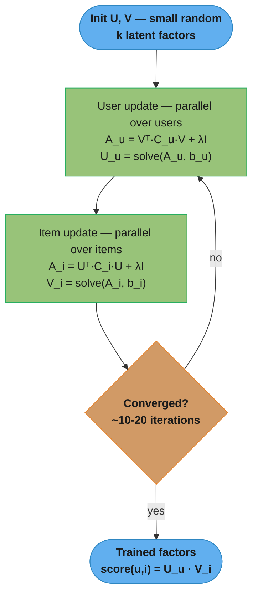
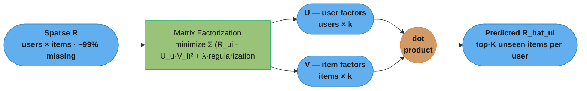
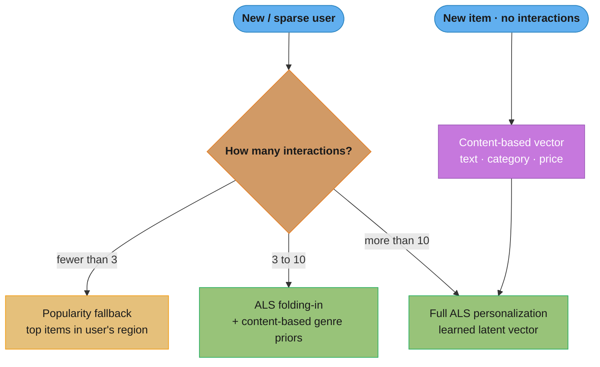

# Collaborative Filtering

## 1. Concept Overview

Collaborative filtering (CF) is a recommendation paradigm that predicts a user's preferences based solely on the collective behavior of all users, without requiring any knowledge of item content. The central hypothesis is: users who have interacted similarly in the past will interact similarly in the future. CF is the backbone of most large-scale commercial recommendation systems and was the dominant technique validated by the Netflix Prize (2009).

Two major families exist: memory-based CF (similarity computed directly from the interaction matrix) and model-based CF (a compact model is learned from the matrix, most importantly matrix factorization). Modern systems use implicit feedback (clicks, purchases, dwell time) rather than explicit ratings.

---

## 2. Intuition

One-line analogy: If you and a stranger both loved the same 50 obscure films, you will probably love the 51st film they loved — without either of you reading a plot summary.

Mental model: Imagine a giant spreadsheet where rows are users and columns are items. Most cells are blank. CF finds users (or items) with similar fill patterns and uses their data to fill in your blanks. The insight is that structure in this sparse matrix — clusters of users with similar taste — carries more predictive signal than any individual item's metadata.

Why matrix factorization outperforms neighborhood methods: instead of storing all pairwise similarities, MF compresses the entire matrix into two low-rank matrices capturing the underlying latent structure (genres, moods, price sensitivity) that drives preferences.

Key insight: ALS (Alternating Least Squares) for implicit feedback solves the problem that clicks have no explicit negatives — the confidence weighting c_ui = 1 + alpha * r_ui (alpha = 40 typical) treats high-interaction items with high confidence and treats all unobserved items as weakly negative.

---

## 3. Core Principles

**User-User CF**: Identify the K most similar users to the target user (cosine similarity or Pearson correlation on interaction vectors). Aggregate their ratings for candidate items, weighted by similarity.

**Item-Item CF**: Identify the K most similar items to each item the target user has liked. Aggregate similarity-weighted scores for candidates. More stable than user-user CF because item similarities change slowly; Amazon patented and deployed this at scale in 2003.

**Matrix Factorization**: Factorize R (n_users x n_items) into U (n_users x k) and V (n_items x k). Prediction: R_hat[u, i] = U[u] · V[i]. Latent dimension k = 50–200 typical. Regularization prevents overfitting on sparse data.

**Implicit vs Explicit Feedback**: Explicit ratings (1–5 stars) are sparse and biased. Implicit signals (clicks, purchases, play counts) are abundant. ALS for implicit treats all unobserved interactions as weakly negative rather than missing, which is the correct Bayesian treatment.

**Confidence Weighting**: c_ui = 1 + alpha * r_ui. A single click (r_ui = 1) gives confidence 41 (with alpha=40). Zero interactions gives confidence 1. High-confidence items dominate the ALS update.

**BPR (Bayesian Personalized Ranking)**: Pairwise loss — for each user u, observed item i, and unobserved item j: maximize P(u prefers i over j). Directly optimizes ranking rather than rating prediction. Better than MSE for implicit feedback evaluation by ranking metrics.

---

## 4. Types / Architectures / Strategies

### 4.1 Memory-Based: User-User CF

```
For target user u:
1. Compute cosine_similarity(u, all_other_users) on interaction vectors
2. Select top-K similar users (K = 20-100)
3. For each item i not seen by u:
   score(u, i) = sum over k-neighbors: sim(u, k) * rating(k, i) / sum(|sim(u, k)|)
4. Recommend top-N items by score
```

Weakness: O(U * I) computation per request; does not scale past ~1M users without pre-computation.

### 4.2 Memory-Based: Item-Item CF

```
Pre-compute offline:
  item_sim[i, j] = cosine_similarity(R[:, i], R[:, j])
  Store top-K similar items per item

At request time for user u:
  For each item i not interacted by u:
    score(u, i) = sum over items j in history(u): item_sim[i, j] * rating(u, j)
```

Advantage: similarities pre-computed offline; request-time lookup is O(|history| * K). Used by Amazon "Customers Also Bought."

**What this actually says.** "Cosine asks whether two people rated the same things in the same *proportions*; Pearson asks whether they agreed on what was *above and below their own average*." Cosine sees magnitude, Pearson sees shape, and on the same pair they can point in opposite directions.

| Symbol | What it is |
|--------|------------|
| `R[u]` | User u's rating row, restricted to the items both users rated |
| `dot(a, b)` | Sum of elementwise products; large when both vectors are large together |
| `norm(a)` | Vector length, `sqrt(sum of squares)`; divides magnitude out of the comparison |
| `cos(a, b)` | `dot(a, b) / (norm(a) * norm(b))`. 1 = same direction, 0 = unrelated |
| `mean(R[u])` | The user's own rating average — their "generous or stingy" baseline |
| `Pearson(a, b)` | Cosine applied *after* subtracting each user's own mean |

**Walk one example.** Two users, three co-rated items, scored both ways:

```
                     i1     i2     i3
  Ana (A)           5.0    4.0    3.0
  Ben (B)           3.0    4.0    5.0

  COSINE (raw vectors)
    dot(A, B) = 5*3 + 4*4 + 3*5 = 15 + 16 + 15 = 46
    norm(A)   = sqrt(25 + 16 + 9)  = sqrt(50) = 7.0711
    norm(B)   = sqrt(9  + 16 + 25) = sqrt(50) = 7.0711
    cos       = 46 / (7.0711 * 7.0711) = 46 / 50 = 0.92
                                          <- "almost identical taste"

  PEARSON (mean-centred first)
    mean(A) = 4.0   ->   A' = [ +1.0,  0.0, -1.0 ]
    mean(B) = 4.0   ->   B' = [ -1.0,  0.0, +1.0 ]
    dot(A', B') = (+1)(-1) + 0 + (-1)(+1) = -2
    norm(A') = norm(B') = sqrt(2) = 1.4142
    Pearson  = -2 / (1.4142 * 1.4142) = -2 / 2 = -1.00
                                          <- "perfectly opposite taste"
```

Same pair, same numbers, and the two metrics disagree as violently as they possibly can: `+0.92` against `-1.00`. Cosine is dominated by the shared *level* — both users handed out ratings in the 3-to-5 band, so their raw vectors nearly line up. Pearson throws that shared level away and keeps only the deviations, where Ana ranked i1 highest and Ben ranked it lowest. When the rating scale carries a strong per-user bias (some users never give below a 4), Pearson is the honest metric; for implicit 0/1 click vectors there is no personal mean to remove and cosine is the standard choice. The identical arithmetic run on matrix *columns* instead of rows gives item-item similarity.

### 4.3 Matrix Factorization — SVD (Explicit)

Minimizes: sum over observed (u, i): (R[u, i] - U[u] · V[i])^2 + lambda * (||U[u]||^2 + ||V[i]||^2)

Solved via SGD or Alternating Least Squares. For explicit ratings, sklearn TruncatedSVD or Surprise SVD work well. Does not scale gracefully to implicit feedback.

**Read it like this.** "Every user is a short list of taste scores, every item is a short list of trait scores, and a predicted rating is just those two lists multiplied together term by term."

That one sentence is the whole of matrix factorization. `R ~ U V^T` claims the giant ratings table is not really giant — it is two skinny tables in disguise, and every missing cell falls out of a dot product you can do on paper.

| Symbol | What it is |
|--------|------------|
| `R` | The observed ratings table, n_users by n_items, mostly blank |
| `U` | User factor matrix, n_users by k. Row `U[u]` is user u's taste vector |
| `V` | Item factor matrix, n_items by k. Row `V[i]` is item i's trait vector |
| `k` | Latent dimension. 50-200 in production, 2 in the walk below |
| `V^T` | V transposed, k by n_items, so that `U V^T` comes out shaped like `R` |
| `U[u] . V[i]` | Dot product: multiply the two length-k vectors elementwise, then add |
| `R_hat[u, i]` | The predicted rating — defined for every cell, including the blank ones |

**Walk one example.** Three users, three films, `k = 2`. Latent factor f1 turned out to mean "sci-fi" and f2 "romance"; nobody told the model that.

```
  U (3 x 2)  users             V (3 x 2)  items
               f1     f2                      f1     f2
    Ana       1.0    0.2         Alien       4.0    1.0
    Ben       0.9    0.1         BladeRun    3.8    1.2
    Cara      0.1    1.0         NottingH    1.0    4.5

  R_hat = U x V^T   (3 x 3), where every cell is one dot product

               Alien   BladeRun   NottingH
    Ana         4.20      4.04       1.90     <- this cell was blank in R
    Ben         3.70      3.54       1.35
    Cara        1.40      1.58       4.60

  The blank cell, by hand:
    R_hat[Ana, NottingH] = U[Ana] . V[NottingH]
                         = (1.0 x 1.0) + (0.2 x 4.5)
                         = 1.0 + 0.9
                         = 1.90            <- do not recommend it

  Same user, a film she loved, for contrast:
    R_hat[Ana, Alien]    = (1.0 x 4.0) + (0.2 x 1.0)
                         = 4.0 + 0.2
                         = 4.20
```

Ana and Ben carry almost the same taste vector (`[1.0, 0.2]` against `[0.9, 0.1]`), so the model predicts almost the same rating for them on every film — and nobody supplied that similarity, it emerged from fitting the observed cells alone. Cara's vector points the other way and her predictions invert. Nothing in the factors is labelled "sci-fi" either; the f1 axis only earns that name because the two sci-fi films both score high on it.

**The idea behind it.** "Fit the observed ratings — but among all the factorizations that fit equally well, take the one built from the smallest numbers."

| Symbol | What it is |
|--------|------------|
| `sum over observed (u, i)` | Only cells that actually hold a rating; blanks contribute nothing |
| `(R[u,i] - U[u] . V[i])^2` | Squared error on one observed cell — the fit term |
| `lambda` | Penalty weight, 0.001-0.1 typical. Zero means no penalty at all |
| `norm(U[u])^2` | Sum of squares of user u's factor values — how "big" the vector is |
| `lambda * (...)` | Rent charged per unit of factor magnitude, paid on every update |

**Walk one example.** Why the fit term alone cannot pick an answer. One observed rating, `R = 4.04`, and for clarity one factor (`k = 1`), so the model has to choose numbers `u` and `v` with `u * v = 4.04`:

```
                      u          v      u*v    fit error   u^2 + v^2   lambda-term
  solution A       2.0100     2.0100    4.04      0.00          8.08       0.0808
  solution B      40.4000     0.1000    4.04      0.00       1632.17      16.3217
  solution C     404.0000     0.0100    4.04      0.00     163216.00    1632.1600

  lambda = 0.01, total loss = fit error + lambda-term
    A -> 0.0808        B -> 16.3217        C -> 1632.1600
  (solution A is u = v = sqrt(4.04), so u^2 + v^2 = 4.04 + 4.04 = 8.08 exactly)
```

Set `lambda = 0` and all three rows have loss exactly `0.00` — the optimizer has no reason to prefer any of them and will happily drift toward C, where a single unseen item with a modest factor value produces a wild prediction. Add the penalty and A wins by four orders of magnitude over C. This is the failure mode where training loss sits near zero while held-out Recall@K stays on the floor. It bites hardest on sparse rows: with `k = 100` factors and a user who rated 3 items, the fit term pins down 3 directions and leaves 97 completely free, so `lambda` is the only thing choosing among them.

**In plain terms.** Unpacking what "solved via SGD" means for the loss just above: "measure how wrong this one prediction is, then nudge the user vector toward the item vector and the item vector toward the user vector, in proportion to that error — while shrinking both a little."

| Symbol | What it is |
|--------|------------|
| `e_ui` | Prediction error, `R[u,i] - U[u] . V[i]`. Positive means we under-predicted |
| `eta` | Learning rate, 0.005-0.05 typical. How far to step |
| `e_ui * V[i]` | Gradient direction: push U toward the item vector when we under-predicted |
| `lambda * U[u]` | The regularizer's contribution — pull the vector back toward zero each step |
| `+=` | One rating, one update. SGD touches only the two rows involved, not the matrix |

**Walk one example.** One rating, mid-training, with `eta = 0.01` and `lambda = 0.01`:

```
  Ana on BladeRun, observed R = 4.04
  Current vectors:  U[Ana] = [0.80, 0.20]      V[BladeRun] = [3.80, 1.20]

  predict = 0.80*3.80 + 0.20*1.20 = 3.04 + 0.24 = 3.28
  e_ui    = 4.04 - 3.28 = 0.76                     <- under-predicted

  U update:  e*V        = [0.76*3.80, 0.76*1.20] = [2.8880, 0.9120]
             lambda*U   = [0.0080, 0.0020]
             difference = [2.8800, 0.9100]
             U <- [0.80, 0.20] + 0.01*[2.8800, 0.9100] = [0.8288, 0.2091]

  V update:  e*U        = [0.76*0.80, 0.76*0.20] = [0.6080, 0.1520]
             lambda*V   = [0.0380, 0.0120]
             difference = [0.5700, 0.1400]
             V <- [3.80, 1.20] + 0.01*[0.5700, 0.1400] = [3.8057, 1.2014]

  new predict = 0.8288*3.8057 + 0.2091*1.2014 = 3.4054
  new error   = 4.04 - 3.4054 = 0.6346             <- 0.76 shrank in one step
```

Both updates are computed from the same pre-update vectors. Notice that U moved far more than V (`+0.0288` on the first factor against `+0.0057`): the step size is proportional to the *other* vector, and `V[BladeRun] = [3.80, 1.20]` is much longer than `U[Ana] = [0.80, 0.20]`. This is why SGD interleaves ratings one at a time and needs many epochs, where ALS below jumps straight to the exact optimum of one side per half-step.

### 4.4 Matrix Factorization — ALS (Implicit)

Loss: sum over all (u, i): c_ui * (p_ui - U[u] · V[i])^2 + lambda * (||U||^2 + ||V||^2)

where p_ui = 1 if r_ui > 0 else 0 (binary preference), c_ui = 1 + alpha * r_ui (confidence).

ALS alternates closed-form updates:
- Fix V, solve for each U[u] independently (parallelizable)
- Fix U, solve for each V[i] independently (parallelizable)

Convergence: ~10–20 iterations. Closed-form solution per user/item: linear system solve (k x k matrix, fast).

**Stated plainly.** "A click is not a rating, it is evidence. `c_ui = 1 + alpha * r_ui` converts 'how many times you touched this' into 'how sure I am that you like it' — and never lets that certainty fall to zero."

| Symbol | What it is |
|--------|------------|
| `r_ui` | Raw implicit count: clicks, plays, purchases. Zero if never touched |
| `p_ui` | Binary preference, 1 if `r_ui > 0` else 0. This is what ALS actually fits |
| `alpha` | Confidence scaling, 40 typical. What one interaction is worth |
| `c_ui` | Weight on that cell's squared error. Never zero, so unobserved cells still count |
| `1 +` | The floor. It is what makes unobserved items *weak negatives* rather than *missing* |

**Walk one example.** With `alpha = 40`:

```
                      r_ui    p_ui    c_ui = 1 + 40*r_ui    weight vs unseen
  never played           0       0             1                   1x
  played once            1       1            41                  41x
  played 5 times         5       1           201                 201x
  played 30 times       30       1          1201                1201x
```

Two things fall out of that table. Unobserved cells carry weight `1`, not `0`, so the loss genuinely does sum over *all* cells — ALS is told "assume they do not like it, but only faintly", which is what supplies the negatives that implicit feedback never gives you. And the weighting is linear in the count, so a 30-play track pulls `1201/41 = 29.3x` harder on the factors than a single play. That linearity is the popularity-bias lever: swapping in `c_ui = 1 + alpha * log(1 + r_ui)` gives `1 + 40*log(31) = 138.4` instead of `1201`, compressing the heaviest interactions' influence by `8.7x`.

**What the formula is telling you.** "Freeze every item vector, and finding the best user vector stops being learning at all — it becomes one small linear system you can solve exactly."

| Symbol | What it is |
|--------|------------|
| `C_u` | Diagonal matrix of that user's confidences, one entry per item |
| `V^T C_u V` | A k by k matrix: item vectors weighted by how much this user cares |
| `lambda I` | Ridge term added to the diagonal; also what guarantees `A_u` is invertible |
| `A_u` | `V^T C_u V + lambda I` — always k by k, whatever the catalogue size |
| `b_u` | `V^T C_u p_u` — the right-hand side, pulled toward items the user touched |
| `solve(A_u, b_u)` | Exact solution `U[u] = inv(A_u) b_u`. No learning rate, no epochs |

**Walk one example.** Same three items and factors as Section 4.3, with `k = 2`, `alpha = 40`, `lambda = 0.01`. A brand-new user has played Alien once and nothing else:

```
  V = [[4.0, 1.0], [3.8, 1.2], [1.0, 4.5]]    c_u = [41, 1, 1]    p_u = [1, 0, 0]

  V^T V           = [[31.44, 13.06],       4^2 + 3.8^2 + 1^2       = 31.44
                     [13.06, 22.69]]       4*1 + 3.8*1.2 + 1*4.5   = 13.06
                                           1^2 + 1.2^2 + 4.5^2     = 22.69

  V^T (C_u - I) V = 40 * outer(v_Alien, v_Alien)
                  = 40 * [[16, 4], [4, 1]]
                  = [[640, 160], [160, 40]]     <- only the touched item contributes

  A_u = V^T V + V^T (C_u - I) V + lambda*I
      = [[671.45, 173.06],
         [173.06,  62.70]]

  b_u = V^T (c_u * p_u) = 41 * [4.0, 1.0] = [164.0, 41.0]

  U[u] = solve(A_u, b_u) = [0.2623, -0.0702]

  Scores that vector produces:
    Alien     = 0.2623*4.0 + (-0.0702)*1.0 =  0.979   <- the one click, refit
    BladeRun  = 0.2623*3.8 + (-0.0702)*1.2 =  0.913   <- never touched
    NottingH  = 0.2623*1.0 + (-0.0702)*4.5 = -0.053   <- never touched
```

BladeRun scores `0.913` off zero interactions — that is collaborative filtering visible in a single number. Its factor vector runs nearly parallel to Alien's, so any user pulled toward Alien is dragged toward it as well, while NottingH points elsewhere and lands negative. Note the shapes too: `A_u` is 2x2 here and 100x100 in production regardless of whether the catalogue holds 6,000 items or 10 million, which is why each per-user solve is cheap and why the loop parallelizes cleanly. Pre-computing `V^T V` once per half-step is what leaves only the small `(C_u - I)` correction per user, and that correction touches solely the items the user actually interacted with.

### 4.5 BPR

Loss: -sum over (u, i, j): log(sigma(U[u] · V[i] - U[u] · V[j])) + regularization

where i is observed, j is uniformly sampled unobserved. Gradient ascent via SGD on triplets.

---

## 5. Architecture Diagrams

### 5.1 ALS Alternating Update Loop



ALS freezes one factor matrix and solves the other in closed form, then swaps: each user and each item update is an independent k×k linear solve, so the whole step parallelizes cleanly across Spark workers. Convergence typically takes 10-20 alternations, and pre-computing VᵀV (or UᵀU) once per half-step keeps every per-entity solve cheap.

### 5.2 Collaborative Filtering Similarity

```
User-Item Matrix R (sparse):
         i1  i2  i3  i4  i5
   u1  [  5   ?   3   ?   1 ]
   u2  [  ?   4   ?   2   ? ]
   u3  [  1   ?   ?   5   3 ]
   u4  [  ?   2   4   ?   ? ]

User similarity = cosine between ROWS     -> sim(u1,u3) high if overlapping items rated alike
Item similarity = cosine between COLUMNS  -> sim(i1,i3) high if raters of i1 rate i3 alike
? = unobserved (99%+ of cells in real systems)
```

The matrix keeps its ASCII form because row/column alignment is the point: user-user similarity compares rows, item-item similarity compares columns.

### 5.3 Matrix Factorization — Latent Factors



Factorization compresses the sparse matrix into two dense low-rank matrices whose product reconstructs it; each user and item becomes a k-dimensional vector (k = 50-200), and a predicted score is just the dot product of the two vectors. The latent dimensions emerge on their own — genre, mood, price sensitivity — none of them supplied as features.

### 5.4 Cold-Start Routing



Cold start is a routing decision on interaction volume: too few signals fall back to popularity, a handful get a fast folding-in solve seeded by content priors, and rich histories earn full ALS personalization. New items enter through a content-based vector until enough collaborative signal accrues to place them in the learned factor space.

---

## 6. How It Works — Detailed Mechanics

```python
from __future__ import annotations

import numpy as np
from scipy.sparse import csr_matrix
from scipy.sparse.linalg import spsolve
from dataclasses import dataclass, field
from typing import Optional
import time


# ─────────────────────────────────────────────────────────────────────────────
# ALS for Implicit Feedback (from scratch, NumPy)
# ─────────────────────────────────────────────────────────────────────────────

@dataclass
class ALSConfig:
    n_factors: int = 128          # latent dimension k
    n_iterations: int = 15        # ALS alternating steps
    regularization: float = 0.01  # L2 regularization lambda
    alpha: float = 40.0           # confidence scaling factor
    random_state: int = 42


class ImplicitALS:
    """Alternating Least Squares for implicit feedback collaborative filtering.

    Based on Hu, Koren, Volinsky (2008) — Collaborative Filtering for Implicit
    Feedback Datasets.
    """

    def __init__(self, config: ALSConfig) -> None:
        self.config = config
        self.user_factors: Optional[np.ndarray] = None   # (n_users, k)
        self.item_factors: Optional[np.ndarray] = None   # (n_items, k)

    def fit(
        self,
        interactions: np.ndarray,  # (n_users, n_items) raw counts (clicks, plays)
    ) -> "ImplicitALS":
        cfg = self.config
        rng = np.random.default_rng(cfg.random_state)
        n_users, n_items = interactions.shape

        # Confidence matrix: C[u, i] = 1 + alpha * r[u, i]
        # preference matrix: P[u, i] = 1 if r[u,i] > 0 else 0
        C = 1.0 + cfg.alpha * interactions           # (n_users, n_items)
        P = (interactions > 0).astype(np.float32)    # (n_users, n_items)

        # Initialize factor matrices randomly
        self.user_factors = rng.normal(0, 0.01, (n_users, cfg.n_factors)).astype(np.float32)
        self.item_factors = rng.normal(0, 0.01, (n_items, cfg.n_factors)).astype(np.float32)

        lambda_I = cfg.regularization * np.eye(cfg.n_factors, dtype=np.float32)

        for iteration in range(cfg.n_iterations):
            t0 = time.time()

            # ── Update user factors ──────────────────────────────────────────
            # For each user u:
            #   A_u = V.T @ diag(C[u]) @ V + lambda * I
            #   b_u = V.T @ diag(C[u]) @ P[u]
            #   user_factors[u] = inv(A_u) @ b_u
            V = self.item_factors                    # (n_items, k)
            VtV = V.T @ V                            # (k, k)  pre-compute

            for u in range(n_users):
                c_u = C[u]       # (n_items,)
                p_u = P[u]       # (n_items,)
                # Only non-zero confidences differ from VtV
                # Efficient: VtV + V.T @ diag(c_u - 1) @ V
                # For simplicity here we use dense; in practice use sparse C
                diag_cu = np.diag(c_u - 1.0)
                A_u = VtV + V.T @ diag_cu @ V + lambda_I
                b_u = V.T @ (c_u * p_u)
                self.user_factors[u] = np.linalg.solve(A_u, b_u)

            # ── Update item factors ──────────────────────────────────────────
            U = self.user_factors                    # (n_users, k)
            UtU = U.T @ U                            # (k, k)

            for i in range(n_items):
                c_i = C[:, i]    # (n_users,)
                p_i = P[:, i]    # (n_users,)
                diag_ci = np.diag(c_i - 1.0)
                A_i = UtU + U.T @ diag_ci @ U + lambda_I
                b_i = U.T @ (c_i * p_i)
                self.item_factors[i] = np.linalg.solve(A_i, b_i)

            elapsed = time.time() - t0
            print(f"Iteration {iteration + 1}/{cfg.n_iterations}  ({elapsed:.2f}s)")

        return self

    def recommend(
        self,
        user_id: int,
        top_k: int = 10,
        filter_interacted: bool = True,
        interactions: Optional[np.ndarray] = None,
    ) -> list[tuple[int, float]]:
        """Return top-K item recommendations for a user."""
        assert self.user_factors is not None, "Call fit() first"
        user_vec = self.user_factors[user_id]               # (k,)
        scores = self.item_factors @ user_vec               # (n_items,)

        if filter_interacted and interactions is not None:
            interacted_mask = interactions[user_id] > 0
            scores[interacted_mask] = -np.inf

        top_indices = np.argpartition(scores, -top_k)[-top_k:]
        top_indices = top_indices[np.argsort(scores[top_indices])[::-1]]
        return [(int(idx), float(scores[idx])) for idx in top_indices]

    def similar_items(self, item_id: int, top_k: int = 10) -> list[tuple[int, float]]:
        """Find similar items using item factor cosine similarity."""
        assert self.item_factors is not None
        query = self.item_factors[item_id]
        norms = np.linalg.norm(self.item_factors, axis=1)
        query_norm = np.linalg.norm(query)
        similarities = (self.item_factors @ query) / (norms * query_norm + 1e-9)
        similarities[item_id] = -np.inf  # exclude self
        top_indices = np.argpartition(similarities, -top_k)[-top_k:]
        top_indices = top_indices[np.argsort(similarities[top_indices])[::-1]]
        return [(int(idx), float(similarities[idx])) for idx in top_indices]


# ─────────────────────────────────────────────────────────────────────────────
# SVD via sklearn for Explicit Ratings
# ─────────────────────────────────────────────────────────────────────────────

from sklearn.decomposition import TruncatedSVD


def svd_recommend_explicit(
    rating_matrix: np.ndarray,   # (n_users, n_items), NaN for missing
    user_id: int,
    n_components: int = 50,
    top_k: int = 10,
) -> list[tuple[int, float]]:
    """SVD-based recommendation for explicit rating matrix.

    Note: fills NaN with 0 — a known approximation; use ALS for better results.
    """
    filled = np.nan_to_num(rating_matrix, nan=0.0)
    svd = TruncatedSVD(n_components=n_components, random_state=42)
    U_reduced = svd.fit_transform(filled)   # (n_users, k)
    V_reduced = svd.components_             # (k, n_items)

    # Reconstruct predicted ratings for this user
    predicted = U_reduced[user_id] @ V_reduced   # (n_items,)

    # Mask already rated items
    rated_mask = ~np.isnan(rating_matrix[user_id])
    predicted[rated_mask] = -np.inf

    top_indices = np.argpartition(predicted, -top_k)[-top_k:]
    top_indices = top_indices[np.argsort(predicted[top_indices])[::-1]]
    return [(int(idx), float(predicted[idx])) for idx in top_indices]


# ─────────────────────────────────────────────────────────────────────────────
# BPR (Bayesian Personalized Ranking) — SGD training
# ─────────────────────────────────────────────────────────────────────────────

class BPR:
    """Bayesian Personalized Ranking for implicit feedback.

    Loss: -E[log sigma(x_uij)] + regularization
    where x_uij = U[u] · (V[i] - V[j])
    i = observed item, j = uniformly sampled unobserved item
    """

    def __init__(
        self,
        n_users: int,
        n_items: int,
        n_factors: int = 64,
        learning_rate: float = 0.01,
        regularization: float = 0.01,
        n_epochs: int = 20,
        random_state: int = 42,
    ) -> None:
        rng = np.random.default_rng(random_state)
        self.U = rng.normal(0, 0.01, (n_users, n_factors)).astype(np.float32)
        self.V = rng.normal(0, 0.01, (n_items, n_factors)).astype(np.float32)
        self.lr = learning_rate
        self.reg = regularization
        self.n_epochs = n_epochs
        self.n_items = n_items

    def _sample_negative(
        self,
        user_id: int,
        positive_items: set[int],
        rng: np.random.Generator,
    ) -> int:
        """Sample a negative item (not interacted by user)."""
        while True:
            j = int(rng.integers(0, self.n_items))
            if j not in positive_items:
                return j

    def fit(
        self,
        interactions: dict[int, set[int]],   # {user_id: set of item_ids}
        n_samples_per_epoch: int = 100_000,
    ) -> "BPR":
        rng = np.random.default_rng(42)
        user_ids = list(interactions.keys())

        for epoch in range(self.n_epochs):
            total_loss = 0.0
            for _ in range(n_samples_per_epoch):
                # Sample user
                u = int(rng.choice(user_ids))
                pos_items = interactions[u]
                if not pos_items:
                    continue
                # Sample positive item
                i = int(rng.choice(list(pos_items)))
                # Sample negative item
                j = self._sample_negative(u, pos_items, rng)

                # Compute BPR loss gradient
                x_uij = float(np.dot(self.U[u], self.V[i] - self.V[j]))
                sigmoid = 1.0 / (1.0 + np.exp(-x_uij))
                # Gradient of log(sigmoid(x_uij)) w.r.t. x_uij = 1 - sigmoid
                grad_coef = 1.0 - sigmoid

                # Update factors
                self.U[u] += self.lr * (grad_coef * (self.V[i] - self.V[j]) - self.reg * self.U[u])
                self.V[i] += self.lr * (grad_coef * self.U[u] - self.reg * self.V[i])
                self.V[j] += self.lr * (-grad_coef * self.U[u] - self.reg * self.V[j])

                total_loss -= np.log(sigmoid + 1e-9)

            avg_loss = total_loss / n_samples_per_epoch
            print(f"Epoch {epoch + 1}/{self.n_epochs}  BPR loss: {avg_loss:.4f}")

        return self

    def recommend(self, user_id: int, top_k: int = 10) -> list[tuple[int, float]]:
        scores = self.V @ self.U[user_id]
        top_indices = np.argpartition(scores, -top_k)[-top_k:]
        top_indices = top_indices[np.argsort(scores[top_indices])[::-1]]
        return [(int(idx), float(scores[idx])) for idx in top_indices]


# ─────────────────────────────────────────────────────────────────────────────
# Cold Start Fallback
# ─────────────────────────────────────────────────────────────────────────────

def popularity_fallback(
    interaction_counts: np.ndarray,   # (n_items,) total interactions per item
    user_interacted: set[int],
    top_k: int = 10,
) -> list[tuple[int, float]]:
    """Return most popular items the user has not interacted with.

    Used as cold-start fallback when user has fewer than 5 interactions.
    """
    scores = interaction_counts.copy().astype(float)
    for item_id in user_interacted:
        scores[item_id] = -np.inf
    top_indices = np.argpartition(scores, -top_k)[-top_k:]
    top_indices = top_indices[np.argsort(scores[top_indices])[::-1]]
    return [(int(idx), float(scores[idx])) for idx in top_indices]
```

---

## 7. Real-World Examples

**Netflix Prize**: The 2009 winning solution combined over 100 models, but pure matrix factorization (SVD++) achieved ~8.5% RMSE improvement by itself. SVD++ extended standard MF by incorporating implicit feedback signals (which movies a user rated, regardless of the rating value) into the user vector. This was a key insight: the act of rating something tells you something about the user even if the rating is negative.

**Amazon Item-Item CF**: Amazon's 2003 paper "Amazon.com Recommendations: Item-to-Item Collaborative Filtering" described computing item-item similarities from the co-purchase graph. The key insight was that item-item similarities are more stable over time than user-user similarities (new users arrive constantly; item relationships change slowly). This allows pre-computing the full similarity table offline, making real-time recommendations O(1) lookups.

**Spotify "implicit" ALS**: Spotify used ALS on implicit play-count data to power Discover Weekly's initial artist-level recommendations. The confidence parameter alpha=40 was found empirically — too low and the model treats all items equally, too high and popular items dominate at the expense of long-tail discovery.

**Last.fm scrobble data**: One of the classic implicit CF benchmarks. Users' listening histories (scrobble counts) fed into ALS produce latent factor spaces where distance correlates strongly with musical genre and style — emergent behavior not provided as input features.

---

## 8. Tradeoffs

| Method | Training Complexity | Prediction Complexity | Quality | Cold Start |
|--------|--------------------|-----------------------|---------|------------|
| User-User CF | O(U^2 * I) | O(K * I) per request | Medium | Poor |
| Item-Item CF | O(I^2 * U) offline | O(history * K) | Medium-High | User: OK |
| SVD (explicit) | O(U * I * k) | O(k) | Good | Poor |
| ALS (implicit) | O(iters * (U+I) * k^2) | O(k) | Very Good | Poor |
| BPR | O(epochs * samples) | O(k) | Good (ranking) | Poor |

| Parameter | Recommended Range | Effect if Too Low | Effect if Too High |
|-----------|------------------|------------------|--------------------|
| n_factors (k) | 64–256 | Underfits; misses subtle taste | Overfits; slow |
| alpha | 20–60 | Ignores interaction frequency | Over-weights popular items |
| regularization | 0.001–0.1 | Overfits to observed cells | Underfits, factors collapse to 0 |
| n_iterations | 10–20 | Converges poorly | Diminishing returns |

---

## 9. When to Use / When NOT to Use

**Use user-user CF when:**
- Catalog is small and static (<50K items)
- Interpretability is required ("users like you also liked...")
- You want a quick baseline without training

**Use item-item CF when:**
- Catalog is static and item counts are manageable
- User histories are short (few interactions) — item similarities are more reliable
- Real-time serving is required with minimal infrastructure

**Use ALS for implicit feedback when:**
- You have click/purchase logs without explicit ratings
- You need a trained model that generalizes to new users' interaction histories
- Catalog is large but manageable (up to ~10M items with distributed ALS)

**Use BPR when:**
- Your offline evaluation metric is a ranking metric (NDCG, MRR), not RMSE
- You have implicit feedback and want to directly optimize ranking
- Training data is dense enough for efficient triplet sampling

**Do NOT use memory-based CF when:**
- User base > 5M (pairwise similarity computation is prohibitive)
- Catalog changes rapidly (new items invalidate pre-computed similarities)
- Latency requirements are strict (<50ms) without pre-computation infrastructure

**Do NOT use SVD for implicit feedback:**
- SVD minimizes squared error on observed ratings only; it ignores the unobserved cells that ALS treats as weak negatives. This leads to poor ranking quality for implicit data.

---

## 10. Common Pitfalls

**Pitfall 1 — Wrong loss function for implicit feedback**: A team used SVD minimizing MSE on click counts (treating 0 as a known negative rating). The model learned to recommend only non-clicked items because the vast majority of zeros dominated the gradient. The fix: use ALS with binary preference P[u,i] = 1 if r[u,i] > 0 and confidence weighting, so unobserved interactions are treated as weakly negative, not strongly negative.

**Pitfall 2 — Not filtering already-interacted items at serving time**: In production, ALS scores all items including those the user has already purchased. Users received recommendations for items they bought last week. The fix: maintain a per-user interacted set in Redis; filter at serving time before returning recommendations. This is a filter_interacted=True flag — always enable it.

**Pitfall 3 — Alpha parameter too high causing popularity collapse**: alpha=400 was accidentally configured in a production ALS job. The confidence for a single click became 401 vs. 1 for unobserved — so even one interaction created an enormous gradient. Result: after 5 iterations, the model recommended the same 50 most popular items to all users regardless of history. Fix: use alpha=40 as default, validate with diversity metric ILD; if ILD drops significantly between iterations, reduce alpha.

**Pitfall 4 — Training on raw play counts without log transformation**: A music service fed raw play counts (0–5000 plays per song) into ALS. Songs a user played 1000 times dominated the latent factors. Fix: apply log transformation r_ui = log(1 + r_ui) before computing confidence, so the difference between 100 and 1000 plays is less dramatic than between 1 and 2 plays.

**Pitfall 5 — Not parallelizing ALS user/item updates**: ALS was run serially (one user at a time on a single core). 5M users x 128 factors x 15 iterations took 18 hours. Fix: the user updates are fully independent — distribute across Spark workers. With 200 cores, same job runs in ~7 minutes. The `implicit` library's ALS implementation handles this automatically with Cython/GPU acceleration.

---

## 11. Technologies & Tools

| Tool | Type | Notes |
|------|------|-------|
| `implicit` (Python) | ALS + BPR | Fast Cython/GPU ALS, production-grade, used by Spotify |
| `LightFM` | Hybrid CF+CB | Supports user/item features alongside CF; useful for cold start |
| `Surprise` | SVD, KNN | Research/prototyping, not production scale |
| `RecBole` | Research framework | 70+ models, unified interface for benchmarking |
| `PyTorch` | Custom MF/BPR | Full control for non-standard loss functions |
| `Apache Spark MLlib` | Distributed ALS | Production-scale; handles 100M+ users via Spark workers |
| `FAISS` | ANN for item retrieval | After ALS, store item vectors in FAISS for fast nearest neighbor |

---

## 12. Interview Questions with Answers

**Q: What is the difference between user-user and item-item collaborative filtering?**
User-user CF finds the K users most similar to the target user (by cosine similarity on their interaction vectors) and aggregates their ratings for unseen items. Item-item CF finds, for each item the target user has interacted with, the K most similar items, and scores candidates by weighted similarity. Item-item is preferred in practice because item similarities are more stable over time (user preferences shift; item relationships do not), and the similarity table can be pre-computed offline, making serving O(1).

**Q: How does ALS handle the fact that implicit feedback has no true negatives?**
ALS for implicit (Hu, Koren, Volinsky 2008) introduces a binary preference matrix P[u,i] = 1 if r[u,i] > 0, and a confidence matrix C[u,i] = 1 + alpha * r[u,i]. For unobserved interactions, P[u,i] = 0 and C[u,i] = 1 — a low but nonzero confidence that the user dislikes the item. For observed interactions, confidence scales with frequency. The model learns to satisfy high-confidence preferences strongly while only weakly satisfying low-confidence (unobserved) preferences. This avoids the pathology of treating all unobserved items as equally irrelevant.

**Q: What is the role of the confidence parameter alpha in ALS?**
Alpha scales the raw interaction counts into confidence values: c_ui = 1 + alpha * r_ui. With alpha = 40, a user who clicked an item once has confidence 41 vs. confidence 1 for a non-clicked item. Alpha controls how much weight positive interactions receive relative to unobserved items. Typical values: 40 for e-commerce click data, 1 for binary (clicked or not) data. Too high: popular items dominate and diversity collapses. Too low: the model cannot distinguish between items the user loves and items they have never seen.

**Q: Why does BPR outperform ALS for ranking tasks?**
ALS minimizes a weighted squared error loss — it optimizes rating prediction. BPR directly optimizes a pairwise ranking loss: for each user, the model is penalized whenever a non-interacted item is scored higher than an interacted item. Since the downstream evaluation metric (NDCG, MRR) cares about ranking order, BPR's training objective is more aligned with the evaluation. Empirically, BPR achieves better NDCG and MRR at equivalent factor dimensionality, though ALS can achieve better RMSE.

**Q: Explain the cold start problem in collaborative filtering and your mitigation strategy.**
User cold start: a new user has no interaction history, so their latent vector cannot be computed. Item cold start: a new item has no interactions, so its latent vector is unknown. Mitigations for user cold start: show popular or trending items; use an onboarding quiz to infer initial preferences; or use a content-based fallback using any available demographic/context features. Mitigations for item cold start: compute item embeddings from content features (text, category, price) using a content-based model; inject new items into ALS using the item embedding from content as initialization; run more frequent ALS updates (hourly batch) to incorporate early signals quickly.

**Q: How would you evaluate a collaborative filtering model offline?**
Use a temporal train/test split: train on interactions before date T, test on interactions after T. Metrics: Recall@K (fraction of test interactions recovered in top-K recommendations), NDCG@K (ranking quality), MRR. Avoid random train/test splits — they cause data leakage because future interactions of the same user inform the model about that user's preferences. Also evaluate diversity (ILD) to detect popularity bias, and measure coverage (fraction of catalog that appears in recommendations for at least one user).

**Q: What happens if you set regularization too low in matrix factorization?**
With regularization lambda close to 0, user and item latent vectors can grow arbitrarily large to minimize training loss on observed cells. This causes severe overfitting: the model perfectly predicts observed interactions but fails on unobserved ones. In practice, you see training loss near zero but poor Recall@K on the test set. The fix: set lambda in the range 0.001–0.1 (empirically tuned), or use cross-validation on a held-out validation split to select lambda.

**Q: How does SVD++ extend standard matrix factorization?**
SVD++ augments the user latent vector with an implicit feedback component: user_vector_u = user_factor_u + (1/sqrt(|N(u)|)) * sum over j in N(u) of implicit_factor_j, where N(u) is the set of items user u has interacted with (regardless of rating value) and implicit_factor_j is a learned vector for each item. This captures the notion that which items a user chose to interact with (not just how they rated them) is informative. SVD++ won the Netflix Prize and typically outperforms standard MF by 2–5% RMSE.

**Q: What is the complexity of item-item CF pre-computation and how would you scale it?**
Naive item-item similarity computation requires O(I^2 * U) time (for all item pairs, compute cosine similarity on user interaction vectors of length U). For 1M items, this is 10^12 operations — infeasible. Scalable approaches: (1) use MinHash/LSH to approximate nearest items in O(I * U) with a false-negative tradeoff; (2) compute similarities only for item pairs that share at least one user (co-occurrence filtering, sparse matrix multiply); (3) use approximate nearest neighbor on item embeddings from a trained ALS model (FAISS). The `implicit` library computes item similarities via the ALS item factor dot products, which is O(I^2 * k) but k is small (128) vs. U (millions).

**Q: What is the sparsity problem in collaborative filtering and why does it matter?**
The user-item interaction matrix for a large platform (200M users, 10M items) contains 2 * 10^15 cells. With 50M total interactions, sparsity is 1 - 50M/(2*10^15) > 99.999%. Algorithms that operate on the dense matrix (naive SVD) fail because most entries are unknown. Matrix factorization addresses this by optimizing only over observed cells (plus weak signals for unobserved in ALS). Neighborhood methods fail because most user pairs share zero common items, making cosine similarity undefined. Remedies: use product graph (items frequently co-purchased) to find similar items even with sparse direct interactions; use session data (within-session views) to fill in co-occurrence signal.

**Q: Compare ALS and SGD for training matrix factorization.**
ALS alternates between closed-form updates for user factors (holding item factors fixed) and item factors (holding user factors fixed). Each update is an exact solution to a linear system, so convergence per iteration is reliable. Parallelizes perfectly — each user/item update is independent. Best for implicit feedback with the confidence weighting structure. SGD (stochastic gradient descent) processes one (user, item) pair at a time, updating both factors by gradient step. More flexible (any loss function), lower memory, but requires careful learning rate scheduling. ALS converges in 10–20 iterations and is preferred for large-scale implicit CF; SGD is used for explicit feedback and custom losses like BPR.

**Q: How would you handle new users arriving between ALS training runs?**
Strategy 1: folding in. Given a new user's interaction vector r_new (length n_items), compute their user factor analytically using the fixed item factor matrix V: u_new = solve((V.T @ diag(c_new) @ V + lambda*I), V.T @ (c_new * p_new)). This is a single linear solve with pre-computed V.T @ V. No retraining required. Limitation: the new user's interactions do not influence item factors until the next training run. Strategy 2: real-time online updates via SGD — process the new user's interactions as they arrive. Strategy 3: content-based cold start — use available features (age group, country, onboarding preferences) to select an initial user factor from the learned factor space (nearest centroid assignment).

**Q: What is item frequency bias in ALS and how do you correct it?**
Frequently interacted items accumulate high confidence weights across many users. Their item factors are trained on far more data and become large-magnitude vectors. When computing dot products for ranking, high-magnitude item factors dominate even for users who have never interacted with those items. Correction: L2-normalize item factors before computing recommendation scores; or apply popularity-based score discounting: score(u,i) = U[u] · V[i] / log(1 + popularity(i)). The `implicit` library includes a popularity-based filter option for this reason.

**Q: Describe how you would A/B test a new collaborative filtering model.**
Design: split users randomly into control (current model) and treatment (new ALS model) groups. Ensure the split is at the user level (not request level) to avoid interference. Run for at least 2 weeks to capture weekly seasonal patterns. Primary metrics: click-through rate, session watch/listen time, conversion rate. Secondary metrics: diversity (ILD), long-tail coverage, return rate (did users come back?). Statistical test: two-sample t-test or Mann-Whitney U for continuous metrics; chi-squared for binary. Guard against novelty effect: users may click on new recommendations simply because they are different, not because they are better. Require sustained improvement over the full test period.

**Q: Why does collaborative filtering suffer from popularity bias?**
Popular items have more interactions and thus more evidence in the training data. Their latent factors are trained on thousands of data points while long-tail items are trained on tens. This makes popular items' factors more accurate and their dot product scores more extreme. At serving time, the model consistently ranks popular items higher. This creates a feedback loop: popular items get recommended more, receive more clicks, become more popular. Corrections: (1) downweight popular items in the confidence matrix (c_ui = 1 + alpha * log(1 + r_ui)); (2) apply re-ranking diversity constraints; (3) evaluate with coverage and novelty metrics alongside NDCG.

**Q: Why does filling unobserved cells with zero and running SVD hurt implicit-feedback recommendations?**
Zero-filling tells SVD that every unobserved pair is a confirmed negative rating, so the millions of zeros dominate the squared-error loss and the model is pulled toward predicting zero everywhere. Implicit feedback has no true negatives — a missing click may mean the user never saw the item — so treating absence as a hard zero is simply wrong. ALS fixes this with a binary preference plus confidence weighting, so unobserved cells are only weakly negative rather than strongly negative.

**Q: Why apply a log transformation to raw interaction counts before ALS?**
Raw counts let a song played 1000 times dominate the latent factors, so log1p compression makes the gap between 100 and 1000 plays far smaller than the gap between 1 and 2 plays. Power users and binge-listened items otherwise skew the confidence weights and collapse diversity toward a few heavy-tail items. The transform r = log(1 + count) preserves ordering while damping the tail, which is often more impactful than tuning n_factors or lambda.

**Q: What is the difference between memory-based and model-based collaborative filtering?**
Memory-based CF computes similarities directly from the interaction matrix at prediction time, while model-based CF learns a compact model — usually latent factors — offline and predicts from it. Memory-based (user-user, item-item) is simple and interpretable but scales poorly and needs the full matrix at serving; model-based (matrix factorization, ALS, BPR) compresses the matrix into low-rank factors that generalize better on sparse data and serve as O(k) dot products. Most large systems use model-based factors, often keeping item-item neighborhoods for the "similar items" rail.

**Q: How does negative sampling work in BPR and why does the sampling strategy matter?**
For each observed (user, item) pair BPR draws an unobserved item as a negative and trains the user to score the positive above it, so the sampler's distribution directly shapes what the model learns. Uniform sampling is cheap but wastes most updates on easy negatives the model already ranks low; popularity-based or dynamic hard-negative sampling speeds convergence and sharpens tail ranking, at the risk of drawing false negatives (items the user would actually like). Tune the sampler alongside the learning rate, and always exclude the user's known positives from the negative pool.

---

## 13. Best Practices

1. Use ALS with implicit feedback rather than SVD for click/purchase data — ALS treats unobserved interactions as weak negatives, which is the correct assumption.
2. Always apply log transformation to raw interaction counts before computing confidence: r = log(1 + count). Raw counts heavily skew toward power users.
3. Set alpha between 20 and 60; validate with ILD (intra-list diversity) — if diversity collapses, reduce alpha.
4. Use temporal train/test split with at least 7 days of test data. Never use random split for sequential user behavior.
5. Filter already-interacted items at serving time — always. Store per-user interaction sets in Redis with TTL matching your catalog update frequency.
6. Pre-compute item-item similarity table for "similar items" use cases; do not recompute per request.
7. For cold-start users (fewer than 5 interactions), fall back to popularity-based recommendations — CF models perform worse than popularity for very sparse users.
8. Monitor item coverage (fraction of catalog recommended to at least one user) weekly. Coverage below 20% indicates severe popularity bias.
9. Implement "folding in" for new users between training runs — one linear solve gives a good user vector without full retraining.
10. Use distributed ALS (Apache Spark MLlib or `implicit` with GPU) for catalogs > 1M items — serial ALS will not complete in acceptable wall-clock time.

---

## 14. Case Study

**Problem**: A podcast platform (8M users, 300K shows, 200M listen events/month) wants to power a personalized homepage with "Shows You'll Love" recommendations. 35% of users are new with fewer than 3 listen events.

**Approach**:

```
DATA PIPELINE (Apache Spark, nightly):
  Input: listen_events table (user_id, show_id, seconds_listened, timestamp)
  Preprocessing:
    r_ui = log(1 + seconds_listened / show_duration)  # normalized listen fraction
    Filter: only events from last 90 days
    Filter: shows with < 10 total listeners removed (too sparse)

ALS TRAINING:
  n_factors = 128
  alpha     = 40
  lambda    = 0.01
  n_iters   = 15
  Runtime:  ~45 minutes on 50 Spark executors (8M users x 300K shows)

SERVING:
  User factors (8M x 128) → Redis (TTL 24h), ~400MB with float16
  Item factors (300K x 128) → FAISS IVF256 index, ~150MB
  Request time:
    1. Fetch user_factor from Redis (1ms)
       If missing: popularity_fallback()  [35% of traffic]
    2. FAISS ANN search: top-100 candidates (2ms)
    3. Filter listened shows (Redis set lookup, 1ms)
    4. Return top-20

COLD START HANDLING:
  < 3 listens: popularity-based (top 50 shows in user's country)
  3-10 listens: ALS folding-in with content-based genre priors
  > 10 listens: full ALS personalization

RESULTS after 4 weeks:
  Listen-through rate (>50% of episode): +22% vs. popularity baseline
  Weekly active users: +8% (discovery leading to retention)
  Long-tail show listens (rank > 1000): +41% (ALS surfaces niche content)
  Cold-start CTR (popularity fallback): +6% vs. previous random baseline
```

The key lesson: the log transformation of listen duration was more impactful than the choice of hyperparameters. A user who listened to 100% of a 1-hour episode should have slightly more signal than one who listened to 100% of a 3-minute episode — the log normalization captures this without letting episode length dominate the confidence weighting.
