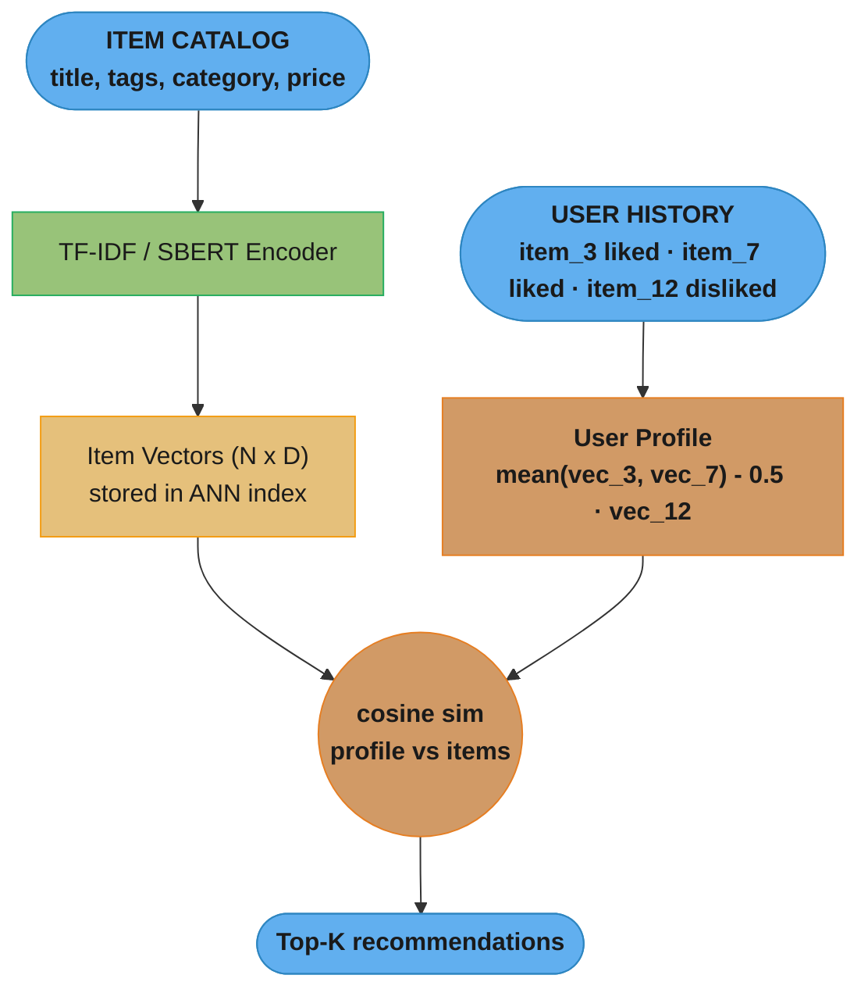
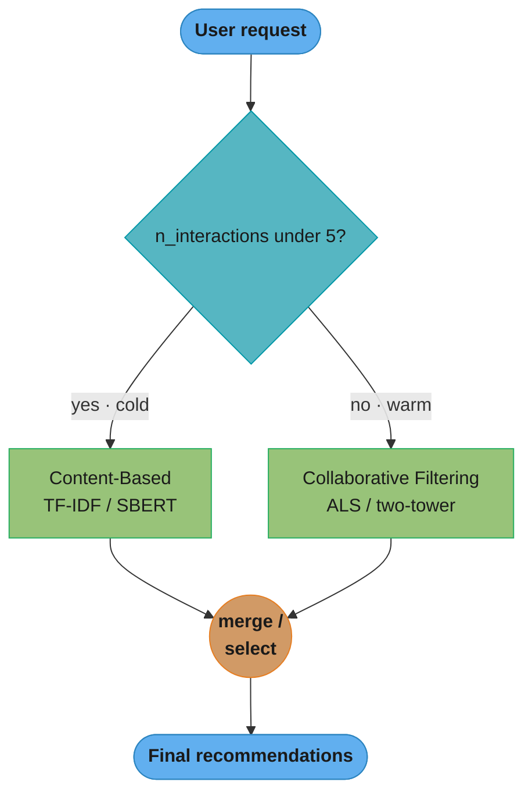
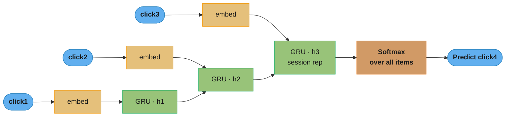
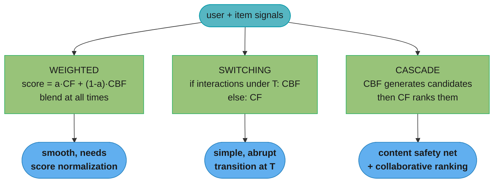

# Content-Based and Hybrid Recommenders

## 1. Concept Overview

Content-based filtering (CBF) recommends items based on their intrinsic features and a user profile built from the features of items they have liked — no other users' data is required. Hybrid recommenders combine CBF with collaborative filtering (CF) to leverage both content signals and cross-user behavior, mitigating the weaknesses of each approach in isolation.

CBF's defining advantage is immediate recommendation capability for new items and new users with partial profile information — where CF systems go blind. Its defining limitation is the inability to provide serendipitous cross-category discovery: a user who has only watched action films will only be recommended action films. Hybrid systems solve this by introducing CF signals when sufficient history exists while gracefully falling back to CBF when it does not.

Session-based and graph-based recommenders are specialized forms of content and hybrid approaches that handle ultra-short context windows and relational structure, respectively.

---

## 2. Intuition

One-line analogy: Content-based filtering is a librarian who reads every book and recommends titles with the same genre, themes, and writing style as books you loved — never needing to know what other patrons read.

Mental model for user profile: A content-based user profile is the weighted centroid of the feature vectors of all items the user has liked. If you liked three adventure novels, your profile vector is the average of their TF-IDF or embedding vectors, and new items close to that centroid in feature space are recommended.

Why hybrid wins: CF gives you serendipity (items outside your usual categories that users like you loved). CBF gives you safety (items similar to what you explicitly liked). Hybrid systems achieve both: CBF handles cold start and interpretability, CF handles discovery once sufficient history exists.

Key insight for session-based recommendation: In many contexts (e-commerce, news), users' preferences within a single session are far more predictive of their next action than their 6-month history. A user who just clicked three hiking boot articles wants hiking boots — not running shoes (which their 6-month history might suggest).

---

## 3. Core Principles

**Item Profile**: A feature vector representing an item's content. For text: TF-IDF over description, title, tags. For structured data: normalized numerical features + one-hot categoricals. For rich media: embeddings from pre-trained models (SBERT for text, CLIP for images).

**User Profile**: Built from the item profiles of liked items. Simplest: arithmetic mean of liked item vectors. Better: recency-weighted mean (recent likes count more). Best: an attention-weighted aggregation learned end-to-end.

**Content Similarity**: Cosine similarity between item feature vectors. Range [-1, 1] for unit-normalized vectors; in practice always [0, 1] for TF-IDF/count vectors. Threshold ~0.7 indicates high content similarity.

**Feedback Integration**: Explicit ratings weight each liked item's profile contribution. Implicit feedback (clicks, purchases) treated as binary. Negative feedback (thumbs down, skipped) subtracts from the profile.

**Hybrid Strategies**: Weighted (linear blend of CF and CBF scores), switching (choose CF or CBF based on data availability), cascade (CBF filters broad candidates, CF ranks them), feature augmentation (item content features as input to CF model — the two-tower approach).

---

## 4. Types / Architectures / Strategies

### 4.1 Content-Based Filtering

**TF-IDF Similarity**: Represent items as TF-IDF vectors over their text content. Compute user profile as weighted mean of liked item TF-IDF vectors. Cosine similarity for recommendation scoring. Simple, fast, interpretable. Works well for news, job listings, legal documents.

**Neural Content Embeddings**: Use pre-trained sentence transformers (SBERT, E5) to embed item text into dense 384-768 dim vectors. Superior to TF-IDF for semantic matching ("comfortable shoes" matches "cushioned footwear"). These embeddings can feed directly into the item tower of a two-tower model.

**Attribute-Based Filtering**: Structured item attributes (genre, director, year, price range). User profile = distribution over attribute values for liked items. Recommendation = items matching the modal attribute values. Used in product recommendation where attribute filters are explicit.

### 4.2 Knowledge-Based Recommenders

Explicit constraint satisfaction: user specifies requirements (budget < $500, CPU > 3GHz, RAM >= 16GB). The system returns items satisfying all constraints. No learning required — rule-based matching. Used for high-involvement purchases (cars, laptops, apartments).

Case-Based Reasoning (CBR): given a target item the user likes, find other items with minimal feature distance. Requires explicit feature weighting (which attributes matter most for similarity).

### 4.3 Hybrid Architectures

**Weighted Hybrid**: score = alpha * CF_score + (1 - alpha) * CBF_score. Alpha tuned per user (high alpha when CF data is rich, low alpha for cold-start users). Simple and robust.

**Switching Hybrid**: if n_interactions(user) < threshold (e.g., 5): use CBF; else: use CF. Binary switch — avoids poor CF on sparse users. Limitation: abrupt transition.

**Cascade Hybrid**: CBF generates candidate set (high recall, interpretable). CF ranks the CBF candidates (high precision, serendipity). Best of both: content-based safety net + collaborative ranking.

**Feature Augmentation Hybrid**: Item content features (text embeddings, category) fed as inputs to a CF model (two-tower). CF operates on both behavioral and content signal. This is the dominant production approach — two-tower models are inherently hybrid.

### 4.4 Session-Based Recommenders

**GRU4Rec**: Gated Recurrent Unit over item sequence within a session. No persistent user model — only the current session's interactions. Suitable when sessions are independent (anonymous users, news browsing).

**NARM (Neural Attentive Recommendation Machine)**: GRU encoder over session + attention mechanism that identifies which session items are most informative for the next click. Outperforms GRU4Rec on most benchmarks.

**SASRec** (also covered in deep_learning_recommenders.md): Transformer-based; handles both session-level and long-term history via positional encoding.

### 4.5 Graph-Based Recommenders

**PinSage (Pinterest)**: Graph convolutional network on a bipartite user-pin interaction graph. Each pin's embedding is computed by aggregating feature vectors from its most-visited graph neighbors. Scales to 3B pins via importance-based neighborhood sampling (random walk visit counts determine neighbor weights). Pin embeddings capture visual style and conceptual similarity.

**LightGCN**: Simplified GCN without feature transformation — only graph signal propagation. User/item embeddings propagated through the interaction graph layer by layer. Each propagation step averages over direct neighbors; final embedding = mean across layers (capturing 1-hop, 2-hop, K-hop neighbors). Outperforms standard MF on sparse datasets.

---

## 5. Architecture Diagrams

### 5.1 Content-Based Filtering Pipeline



Items are encoded once into an ANN index; the user profile is the (recency-weighted)
mean of liked item vectors minus a fraction of disliked ones, and recommendations are
the items closest to that profile by cosine similarity.

### 5.2 Hybrid Switching Architecture



The switch is a hard threshold on interaction count: sparse users route to CBF (which
needs no history), warm users route to CF. It is simple and robust but transitions
abruptly — a weighted hybrid smooths this by blending both scores.

### 5.3 LightGCN Propagation

```
Layer 0 (initial embeddings):
  User A: [0.2, 0.8, 0.1]
  Item 1: [0.5, 0.3, 0.6]
  Item 2: [0.1, 0.9, 0.4]

Layer 1 (aggregate direct neighbors):
  User A interacted with Item 1 and Item 2
  e_A_L1 = (e_item1_L0 + e_item2_L0) / 2

Layer 2 (aggregate 2-hop neighbors):
  e_A_L2 = mean of Layer 1 embeddings of Item 1's and Item 2's neighbors

Final embedding:
  e_A_final = (e_A_L0 + e_A_L1 + e_A_L2) / 3   (mean pooling across layers)
```

### 5.4 Session-Based GRU4Rec



The GRU threads a hidden state through the session: each click updates the state, and
the final state h3 (a compressed summary of the whole session) drives a softmax over
the catalog to predict the next click — no persistent user model required.

### 5.5 Hybrid Strategies — Weighted vs Switching vs Cascade



All three consume the same CF and CBF signals but combine them differently: weighted
blends every request, switching picks one model by interaction count, and cascade uses
CBF for high-recall candidate generation then CF for precise ranking.

---

## 6. How It Works — Detailed Mechanics

```python
from __future__ import annotations

import numpy as np
from sklearn.feature_extraction.text import TfidfVectorizer
from sklearn.metrics.pairwise import cosine_similarity
from dataclasses import dataclass, field
from typing import Optional
import torch
import torch.nn as nn
import torch.nn.functional as F


# ─────────────────────────────────────────────────────────────────────────────
# TF-IDF Content-Based Recommender
# ─────────────────────────────────────────────────────────────────────────────

@dataclass
class ItemCatalog:
    item_ids: list[int]
    descriptions: list[str]    # one per item
    categories: list[str]      # one per item


class TFIDFContentRecommender:
    """Content-based recommender using TF-IDF over item descriptions.

    User profile = weighted mean of liked item TF-IDF vectors.
    Recommendation = items with highest cosine similarity to user profile.
    """

    def __init__(
        self,
        max_features: int = 50_000,
        ngram_range: tuple[int, int] = (1, 2),
    ) -> None:
        self.vectorizer = TfidfVectorizer(
            max_features=max_features,
            ngram_range=ngram_range,
            sublinear_tf=True,   # log(1 + tf) — reduces dominance of high-freq terms
            strip_accents="unicode",
            min_df=2,
        )
        self.item_matrix: Optional[np.ndarray] = None
        self.item_ids: Optional[list[int]] = None

    def fit(self, catalog: ItemCatalog) -> "TFIDFContentRecommender":
        """Compute TF-IDF vectors for all items."""
        self.item_ids = catalog.item_ids
        self.item_matrix = self.vectorizer.fit_transform(catalog.descriptions).toarray()
        # Normalize rows to unit length for cosine similarity = dot product
        norms = np.linalg.norm(self.item_matrix, axis=1, keepdims=True)
        self.item_matrix = self.item_matrix / (norms + 1e-9)
        return self

    def build_user_profile(
        self,
        liked_item_ids: list[int],
        liked_weights: Optional[list[float]] = None,   # e.g., [1.0, 0.8, 0.5] recency-weighted
        disliked_item_ids: Optional[list[int]] = None,
        dislike_weight: float = 0.5,
    ) -> Optional[np.ndarray]:
        """Build user profile as weighted mean of liked item vectors minus disliked."""
        assert self.item_matrix is not None
        id_to_idx = {iid: i for i, iid in enumerate(self.item_ids)}

        if not liked_item_ids:
            return None   # cold start: no profile

        weights = liked_weights or [1.0] * len(liked_item_ids)
        liked_vecs = np.array([
            self.item_matrix[id_to_idx[iid]] * w
            for iid, w in zip(liked_item_ids, weights)
            if iid in id_to_idx
        ])
        user_profile = liked_vecs.mean(axis=0)   # (n_features,)

        if disliked_item_ids:
            disliked_vecs = np.array([
                self.item_matrix[id_to_idx[iid]]
                for iid in disliked_item_ids
                if iid in id_to_idx
            ])
            if len(disliked_vecs) > 0:
                user_profile -= dislike_weight * disliked_vecs.mean(axis=0)

        norm = np.linalg.norm(user_profile)
        if norm == 0:
            return None
        return user_profile / norm

    def recommend(
        self,
        user_profile: np.ndarray,
        exclude_item_ids: Optional[set[int]] = None,
        top_k: int = 10,
    ) -> list[tuple[int, float]]:
        """Return top-K items by cosine similarity to user profile."""
        assert self.item_matrix is not None
        scores = self.item_matrix @ user_profile   # (N,) cosine similarity

        exclude_ids = exclude_item_ids or set()
        id_to_idx = {iid: i for i, iid in enumerate(self.item_ids)}
        for iid in exclude_ids:
            if iid in id_to_idx:
                scores[id_to_idx[iid]] = -np.inf

        top_indices = np.argpartition(scores, -top_k)[-top_k:]
        top_indices = top_indices[np.argsort(scores[top_indices])[::-1]]
        return [(self.item_ids[i], float(scores[i])) for i in top_indices]


# ─────────────────────────────────────────────────────────────────────────────
# Hybrid Recommender (Weighted + Switching)
# ─────────────────────────────────────────────────────────────────────────────

class HybridRecommender:
    """Weighted/switching hybrid combining CBF and CF scores.

    Strategy:
      n_interactions < cold_start_threshold: use CBF only
      n_interactions >= warm_threshold: use CF only
      in between: linear interpolation (alpha based on interaction count)
    """

    def __init__(
        self,
        cold_start_threshold: int = 5,
        warm_threshold: int = 20,
    ) -> None:
        self.cold_start_threshold = cold_start_threshold
        self.warm_threshold = warm_threshold

    def compute_alpha(self, n_interactions: int) -> float:
        """CF weight alpha: 0 = pure CBF, 1 = pure CF."""
        if n_interactions < self.cold_start_threshold:
            return 0.0
        if n_interactions >= self.warm_threshold:
            return 1.0
        # Linear interpolation between thresholds
        return (n_interactions - self.cold_start_threshold) / (
            self.warm_threshold - self.cold_start_threshold
        )

    def blend_scores(
        self,
        cbf_scores: dict[int, float],   # {item_id: cbf_score}
        cf_scores: dict[int, float],    # {item_id: cf_score}
        n_interactions: int,
        top_k: int = 10,
    ) -> list[tuple[int, float]]:
        alpha = self.compute_alpha(n_interactions)
        all_items = set(cbf_scores) | set(cf_scores)

        blended: list[tuple[int, float]] = []
        for item_id in all_items:
            cbf = cbf_scores.get(item_id, 0.0)
            cf = cf_scores.get(item_id, 0.0)
            score = (1 - alpha) * cbf + alpha * cf
            blended.append((item_id, score))

        blended.sort(key=lambda x: x[1], reverse=True)
        return blended[:top_k]


# ─────────────────────────────────────────────────────────────────────────────
# GRU4Rec: Session-Based Recommendation
# ─────────────────────────────────────────────────────────────────────────────

class GRU4Rec(nn.Module):
    """Session-based recommendation using GRU.

    Input: sequence of item IDs within current session
    Output: probability distribution over all items (next click prediction)
    """

    def __init__(
        self,
        n_items: int,
        embed_dim: int = 64,
        hidden_dim: int = 128,
        n_layers: int = 1,
        dropout: float = 0.25,
    ) -> None:
        super().__init__()
        self.item_embed = nn.Embedding(n_items + 1, embed_dim, padding_idx=0)
        self.gru = nn.GRU(
            input_size=embed_dim,
            hidden_size=hidden_dim,
            num_layers=n_layers,
            batch_first=True,
            dropout=dropout if n_layers > 1 else 0.0,
        )
        self.dropout = nn.Dropout(dropout)
        self.output_proj = nn.Linear(hidden_dim, n_items)

    def forward(
        self,
        item_seq: torch.Tensor,           # (B, N) padded session sequences
        seq_lengths: torch.Tensor,        # (B,) actual lengths before padding
    ) -> torch.Tensor:
        embed = self.dropout(self.item_embed(item_seq))   # (B, N, embed_dim)

        # Pack padded sequence for efficient GRU processing
        packed = nn.utils.rnn.pack_padded_sequence(
            embed, seq_lengths.cpu(), batch_first=True, enforce_sorted=False
        )
        gru_out, _ = self.gru(packed)
        gru_out, _ = nn.utils.rnn.pad_packed_sequence(gru_out, batch_first=True)  # (B, N, H)

        # Use output at the last real position (not padding)
        batch_size = item_seq.shape[0]
        last_idx = (seq_lengths - 1).clamp(min=0)
        last_hidden = gru_out[torch.arange(batch_size), last_idx, :]  # (B, H)

        logits = self.output_proj(self.dropout(last_hidden))   # (B, n_items)
        return logits

    def bpr_loss(
        self,
        logits: torch.Tensor,          # (B, n_items)
        positive_item_ids: torch.Tensor,  # (B,) true next items
        negative_item_ids: torch.Tensor,  # (B,) sampled negative items
    ) -> torch.Tensor:
        """BPR loss: positive items should score higher than negative items."""
        pos_scores = logits.gather(1, positive_item_ids.unsqueeze(1)).squeeze(1)
        neg_scores = logits.gather(1, negative_item_ids.unsqueeze(1)).squeeze(1)
        return -F.logsigmoid(pos_scores - neg_scores).mean()


# ─────────────────────────────────────────────────────────────────────────────
# LightGCN: Graph Collaborative Filtering
# ─────────────────────────────────────────────────────────────────────────────

class LightGCN(nn.Module):
    """LightGCN: Simplified Graph Convolutional Network for Recommendation.

    He et al., 2020 (LightGCN: Simplifying and Powering Graph Convolution
    Network for Recommendation)

    No feature transformation or nonlinearity — only graph signal propagation.
    """

    def __init__(
        self,
        n_users: int,
        n_items: int,
        embed_dim: int = 64,
        n_layers: int = 3,
    ) -> None:
        super().__init__()
        self.n_users = n_users
        self.n_items = n_items
        self.n_layers = n_layers

        # Initial learnable embeddings
        self.user_embed = nn.Embedding(n_users, embed_dim)
        self.item_embed = nn.Embedding(n_items, embed_dim)
        nn.init.normal_(self.user_embed.weight, std=0.01)
        nn.init.normal_(self.item_embed.weight, std=0.01)

    def propagate(
        self,
        adj_matrix: torch.sparse.Tensor,  # normalized adjacency (n_users+n_items, n_users+n_items)
    ) -> tuple[torch.Tensor, torch.Tensor]:
        """Run LightGCN propagation and return final user/item embeddings."""
        all_embed = torch.cat([self.user_embed.weight, self.item_embed.weight])  # (N+M, D)
        layer_embeds = [all_embed]

        for _ in range(self.n_layers):
            # E_{l+1} = D^{-1/2} A D^{-1/2} E_l  (symmetric normalization)
            all_embed = torch.sparse.mm(adj_matrix, all_embed)
            layer_embeds.append(all_embed)

        # Final = mean of all layer embeddings (captures multi-hop structure)
        final_embed = torch.stack(layer_embeds, dim=0).mean(dim=0)  # (N+M, D)

        user_final = final_embed[:self.n_users]
        item_final = final_embed[self.n_users:]
        return user_final, item_final

    def bpr_loss(
        self,
        user_ids: torch.Tensor,          # (B,)
        pos_item_ids: torch.Tensor,      # (B,)
        neg_item_ids: torch.Tensor,      # (B,)
        adj_matrix: torch.sparse.Tensor,
        reg_weight: float = 1e-4,
    ) -> torch.Tensor:
        user_final, item_final = self.propagate(adj_matrix)

        u_vecs = user_final[user_ids]         # (B, D)
        pos_vecs = item_final[pos_item_ids]   # (B, D)
        neg_vecs = item_final[neg_item_ids]   # (B, D)

        pos_scores = (u_vecs * pos_vecs).sum(dim=-1)
        neg_scores = (u_vecs * neg_vecs).sum(dim=-1)
        bpr = -F.logsigmoid(pos_scores - neg_scores).mean()

        # L2 regularization on initial embeddings (not final — avoids over-smoothing)
        reg = reg_weight * (
            self.user_embed.weight[user_ids].norm(dim=-1).pow(2).mean()
            + self.item_embed.weight[pos_item_ids].norm(dim=-1).pow(2).mean()
            + self.item_embed.weight[neg_item_ids].norm(dim=-1).pow(2).mean()
        )
        return bpr + reg
```

---

## 7. Real-World Examples

**Spotify Discover Weekly (Hybrid)**: Spotify combines collaborative filtering on the user-playlist interaction graph (playlists treated as "documents," songs as "words" — word2vec on playlists gives song embeddings) with NLP on playlist titles and song metadata for content signals. The discovery that song embeddings from CF (playlist co-occurrence) captured musical style without explicit genre labels was a breakthrough — songs similar in embedding space are musically similar even when their metadata says otherwise.

**Netflix CBF + CF Cascade**: Netflix's "More Like This" feature is content-based: given the film you just finished, recommend films with similar genre, tone, and themes using content embeddings from their Tagflix metadata system. This CBF system operates independently of user history and provides immediate recommendations even for new titles added to the catalog hours ago. Their main homepage, by contrast, uses collaborative signals (what similar users watch).

**Airbnb Listing Recommendation (Feature Augmentation Hybrid)**: Airbnb's listing recommendation embeds both the listing's content features (location, amenities, photos via CLIP embeddings, price range) and behavioral signals (similar listings that other travelers booked in the same trip context) into a shared embedding space. The two-tower model is feature augmentation hybrid — content features are inputs to the item tower, behavioral signals train the dot-product objective.

**Pinterest PinSage**: Pinterest has 3 billion pins, with new pins added by users continuously. Pure CF fails because most pins have zero interactions when first created. PinSage uses graph convolutions on the user-pin bipartite graph, incorporating visual and text features. A new pin's embedding is computed from its image (ResNet) and description (word2vec) features, then refined by aggregating embeddings of similar pins in the graph. Cold start is handled naturally — content features provide the initial embedding.

**Amazon "Customers Also Bought" vs "Customers Also Viewed"**: Amazon maintains two distinct item-item systems. "Customers Also Bought" is collaborative (items frequently co-purchased). "Customers Also Viewed" is session-based (items viewed in the same session, regardless of purchase). Both are content-agnostic CF systems, but the session-based signal captures browsing intent (not just purchase intent), making it more useful for discovery.

---

## 8. Tradeoffs

| Approach | Cold Start (User) | Cold Start (Item) | Discovery | Interpretability | Scalability |
|----------|------------------|------------------|-----------|-----------------|-------------|
| Content-Based | Good (with features) | Excellent | Poor | High | Good |
| Collaborative Filtering | Poor | Poor | Excellent | Low | Good |
| Weighted Hybrid | Medium | Medium | Good | Medium | Good |
| Cascade Hybrid | Good | Good | Good | Medium | Good |
| Session-Based | Excellent | Good | Medium | Low | Good |
| Graph-Based | Good | Good | Excellent | Low | Complex |

| Content Representation | Pros | Cons |
|-----------------------|------|------|
| TF-IDF | Fast, interpretable, no training | Misses semantics ("sneakers" vs "trainers") |
| SBERT embeddings | Semantic matching | Requires transformer; 384-768 dim |
| Category/attribute | Explicit, interpretable | Requires good metadata |
| Image embeddings (CLIP) | Captures visual style | Requires image preprocessing |

---

## 9. When to Use / When NOT to Use

**Use content-based filtering when:**
- New items are added frequently (news: 1000s of articles/day)
- Cold start is a dominant use case (new users, new items)
- Regulatory/compliance requires explainable recommendations ("because you liked X")
- User privacy constraints prevent sharing cross-user data (GDPR-restricted contexts)

**Use session-based recommendation when:**
- Users are anonymous (no login, no persistent history)
- Current intent matters more than long-term preference (e-commerce browse session)
- Session length is 5-20 interactions

**Use graph-based recommendation (LightGCN, PinSage) when:**
- User-item interactions form a rich graph with social or co-consumption edges
- Items have visual/text features AND interaction graph is available
- Catalog is large but sparsely interacted (catalog>>interactions)

**Use hybrid when:**
- You need both cold-start handling and collaborative discovery
- Different user segments need different recommendation strategies

**Do NOT use pure content-based when:**
- Discovery (cross-category serendipity) is a business goal
- Item metadata is sparse or unreliable
- User preferences are complex and content features do not capture them

**Do NOT use GRU4Rec when:**
- Sessions are longer than 100 items — attention mechanisms (SASRec) handle long dependencies better
- Users have rich long-term history — session-only models discard valuable persistent preferences

---

## 10. Common Pitfalls

**Pitfall 1 — TF-IDF over-indexing on rare terms**: A news recommendation system's TF-IDF vectorizer assigned extremely high weights to rare technical jargon appearing in one article. Users interested in "machine learning" were recommended an article about "backpropagation gradient saturation in sigmoid activations" because it contained rare technical terms matching the user's recent reads. Fix: apply sublinear TF (log(1+tf)), set max_df=0.95 (ignore terms in >95% of documents), set min_df=3 (ignore terms appearing in <3 documents). Vocabulary size ~50K with these filters produces stable TF-IDF vectors.

**Pitfall 2 — Stale content embeddings for fast-moving catalogs**: A news recommender pre-computed TF-IDF vectors in a nightly batch job. Articles published during the day had no embeddings and never appeared in recommendations. Users saw only yesterday's news in their personalized feed. Fix: compute embeddings for new items in a streaming pipeline (Kafka → embedding service → FAISS online add); for FAISS IVF, use IDMap wrapper to add items without rebuilding the index.

**Pitfall 3 — User profile drift without recency weighting**: A movie recommender built user profiles as simple means over all liked items. A user who watched 100 action movies in 2022 and 5 romantic comedies in 2024 was still recommended action movies because the 100 action movies dominated the mean. Fix: apply exponential decay weighting to liked item contributions — weight = exp(-lambda * days_since_like), with lambda tuned so items >180 days old contribute <10% of their original weight.

**Pitfall 4 — Session-based model ignoring session boundaries**: GRU4Rec was trained on a sequential log of all user events, without segmenting into sessions. A user's click on a laptop in one session and shoes in the next session were treated as a single sequence. The model tried to predict shoes given laptop context — a meaningless signal. Fix: segment events into sessions by time gap (>30 min gap = new session) or by explicit session ID. Train GRU4Rec on session sequences, not user-lifetime sequences.

**Pitfall 5 — LightGCN over-smoothing with too many layers**: A team increased LightGCN from 3 to 6 layers to capture longer-range graph structure. NDCG@10 dropped from 0.31 to 0.24. Root cause: over-smoothing — with many propagation layers, all user and item embeddings converge to similar vectors (graph Laplacian smoothing destroys local structure). Fix: 2-4 layers is optimal for most recommendation graphs; validate with offline NDCG before increasing layers; apply dropout on graph adjacency (DropEdge) to prevent over-smoothing.

---

## 11. Technologies & Tools

| Tool | Category | Notes |
|------|----------|-------|
| scikit-learn TfidfVectorizer | Content features | TF-IDF; fast; no GPU required |
| sentence-transformers (SBERT) | Content embeddings | Semantic text embeddings; 384-768 dim |
| CLIP (OpenAI) | Multimodal embeddings | Image + text in same embedding space |
| LightFM | Hybrid CF+CBF | Explicit support for user/item features alongside CF |
| RecBole | Research framework | GRU4Rec, NARM, LightGCN, SASRec implementations |
| PyTorch Geometric | Graph models | PinSage, LightGCN in production-grade framework |
| FAISS | ANN for content vectors | Same tooling as neural retrieval |
| Apache Kafka | Streaming embeddings | Compute embeddings for new items in real-time pipeline |
| Feast | Feature store | Serve user/item content features at low latency |

---

## 12. Interview Questions with Answers

**Q: How does content-based filtering work and when does it outperform collaborative filtering?**
Content-based filtering builds an item feature vector (TF-IDF, embeddings, attribute vectors) for each item, then builds a user profile as the weighted mean of liked item vectors. Recommendations are items with the highest cosine similarity to the user profile. CBF outperforms CF when: (1) items are new with no interactions (item cold start — a news article published 1 hour ago has no CF signal); (2) users are new with no history (user cold start — CBF can use demographic/onboarding features); (3) the catalog has rich metadata that captures user preferences (product specifications, article topics); (4) privacy constraints prevent cross-user data sharing.

**Q: What is the difference between a switching hybrid and a weighted hybrid recommender?**
A switching hybrid selects either CBF or CF based on a condition — typically the number of user interactions. Below a threshold (e.g., 5 interactions), it uses CBF; above, it uses CF. Simple and avoids poor CF on sparse users, but creates an abrupt transition. A weighted hybrid always blends both: score = alpha * CF_score + (1-alpha) * CBF_score, where alpha can be a function of interaction count (smooth interpolation) or a globally tuned constant. Weighted hybrid is smoother and allows both signals to contribute at all stages, but requires both models to produce comparable score ranges (normalization needed).

**Q: Explain how Spotify's Discover Weekly works and what makes it a hybrid system.**
Discover Weekly uses collaborative filtering on a user-playlist co-occurrence graph: playlists containing song X and song Y indicate they are similar — analogous to word2vec where playlists are "sentences" and songs are "words." The resulting song embeddings capture musical style. This is the CF component. Additionally, NLP on playlist titles and song metadata (genre tags, artist descriptions) provides content signals that help bootstrap embeddings for new songs and explain recommendations. The hybrid: CF for the majority of signal (collaborative song similarity), content-based for cold-start songs and fallback when CF signal is weak.

**Q: What is LightGCN and how does it differ from standard matrix factorization?**
LightGCN propagates user and item embeddings through the interaction graph over multiple hops without any feature transformation or nonlinearity — just weighted neighborhood averaging. Standard MF gives each user and item a static embedding optimized by minimizing prediction error on observed interactions. LightGCN additionally captures multi-hop structure: a user's embedding is influenced by items they interacted with (1-hop), and by other users who interacted with those same items (2-hop), and so on. This propagation captures collaborative transitivity — "users who liked what you liked also liked X" — more explicitly than MF. LightGCN typically outperforms standard MF by 5-15% NDCG on sparse interaction graphs.

**Q: How would you handle the cold start problem for new news articles in a content-based system?**
Immediately upon publication, compute the article's TF-IDF or SBERT embedding from its title, headline, and first paragraph (full article may not be available). Insert this embedding into the FAISS index using FAISS IDMap wrapper (allows online addition without index rebuild). The article is now available for content-based recommendation within seconds. As clicks accumulate (within hours for popular articles), a collaborative signal builds. Transition: after 10+ clicks, incorporate click-through rate as a quality feature; after 100+ clicks, add CF-based item-item similarity signals. For hyper-fresh content (< 1 hour old), add a "freshness bonus" to prevent new articles from being buried behind older, well-established content.

**Q: What is PinSage and how does it handle Pinterest's scale of 3 billion pins?**
PinSage is a graph convolutional network that computes pin embeddings by aggregating feature vectors from neighboring pins in the user-pin interaction graph. The key scalability innovation is importance-based neighborhood sampling: instead of using all neighbors (infeasible for popular pins with millions of interactions), PinSage runs short random walks from each pin and uses visit counts to weight neighbors — frequently co-visited pins have higher weight. This stochastic sampling makes GCN tractable at 3B pins. Training uses curriculum learning (easy negatives first, then hard negatives from within the same semantic cluster). Batch size must account for the aggregated neighbors — each training example requires features from its K sampled neighbors.

**Q: How do you prevent the "filter bubble" problem in content-based recommendation?**
Filter bubbles occur when CBF continuously recommends items similar to what the user has already liked, reinforcing existing preferences without exposing them to new categories. Mitigations: (1) periodic exploration injection — replace 10% of CBF recommendations with items from adjacent categories (detected via user profile centroid's nearest categories not yet represented); (2) novelty constraint — require a minimum fraction of recommendations from items the user has not seen before; (3) hybrid: introduce CF signals as the user history grows — CF naturally provides cross-user discovery; (4) serendipity re-ranking — explicitly maximize the fraction of recommendations that are "surprising" (high content quality but low similarity to user profile).

**Q: How does a cascade hybrid recommender work and what are its advantages?**
A cascade hybrid uses CBF at the retrieval stage to generate a candidate set, then uses CF to rank those candidates. CBF provides: (1) guaranteed item relevance (all candidates share content overlap with user's history); (2) cold-start handling (content features work without interactions); (3) efficiency (CBF is fast at candidate generation). CF then provides: (1) collaborative ranking — items that users like you preferred are ranked higher; (2) serendipity within the CBF-filtered set. Advantage over weighted hybrid: the CF model operates on a pre-filtered set, reducing noise and improving ranking precision. Limitation: if CBF filters too aggressively, it may remove items the user would have loved but which don't match their content profile.

**Q: When would you choose GRU4Rec over SASRec for session-based recommendation?**
GRU4Rec is preferred when: sessions are very short (2-5 clicks) where attention has limited benefit; training data is small (GRU converges faster); serving latency is critical (GRU inference is faster than Transformer for short sequences). SASRec is preferred when: sessions are long (20+ items) where long-range dependencies matter; you have large training datasets (Transformer benefits from scale); you need to jointly model session context and long-term history in a single model. For most production systems with typical session lengths of 5-20 items, SASRec outperforms GRU4Rec by 5-15% on NDCG@10.

**Q: How does user profile drift affect content-based recommendations and how do you address it?**
User interests change over time — the user's preference 2 years ago may not reflect their current taste. A static profile built from all interactions overweights historical preferences. Addressing drift: (1) recency weighting — weight liked item contributions by exp(-lambda * days_since_interaction), tuning lambda so items older than 6 months contribute <20% of original weight; (2) sliding window — build profile from only the last K interactions or last T days; (3) separate short-term and long-term profiles — a long-term profile captures stable preferences (genre); a short-term profile (last 10 interactions) captures current session context; blend them at recommendation time. The optimal window depends on the domain: news (1-7 days), music (30 days), films (90 days).

**Q: How would you evaluate a content-based recommender system offline?**
Temporal split evaluation: train profile on user interactions before date T, evaluate recall@K and NDCG@K on interactions at T+1 to T+7. For CBF specifically: also measure catalog coverage (fraction of catalog ever recommended), and serendipity (fraction of recommendations that are "surprising" — not obviously similar to user history). A pure CBF system should achieve high coverage on new items (item cold start test: measure recall@K exclusively for items added after training date T). Also run ablation studies: compare TF-IDF vs. SBERT embeddings, and profile window size (7 days vs. 30 days vs. all history). CBF should significantly outperform a popularity baseline for warm users; the gap narrows for cold-start users.

**Q: What is the "semantic gap" in content-based filtering and how do neural embeddings address it?**
The semantic gap is the discrepancy between surface-level content features (exact keywords, tags) and user intent (what the content means to them). TF-IDF treats "machine learning" and "ML" as completely different terms; it misses that "comfortable sneakers" and "cushioned running shoes" are equivalent. Neural content embeddings (SBERT, CLIP) map text into a semantic vector space where "machine learning" and "ML" are close vectors, and "comfortable sneakers" and "cushioned running shoes" are close. This allows content-based filtering to correctly recommend semantically equivalent items even without exact keyword overlap. The gap also exists for images: two photos of the same style of room that share no visual similarity features can be semantically equivalent; CLIP embeddings capture this.

**Q: How does LightFM implement a hybrid collaborative and content-based model?**
LightFM learns embeddings for user and item IDs (collaborative signal) and also for user and item features (content signal). For a user, their embedding is the sum of their user ID embedding and all their feature embeddings (e.g., age_group, country). For an item, their embedding is the sum of their item ID embedding and their content feature embeddings (e.g., category, tag). The prediction is the dot product of user and item composite embeddings. This allows LightFM to generalize to new users/items by using only feature embeddings when ID embeddings are unavailable. With enough interactions, ID embeddings dominate (CF behavior); with sparse data, feature embeddings dominate (CBF behavior). The transition is learned automatically.

**Q: How do you handle multimodal content in a content-based recommender (text + image + structured data)?**
Strategy 1: early fusion — concatenate all feature vectors and train a single content model. Risk: modalities have very different scales and semantics. Requires normalization. Strategy 2: late fusion — compute separate similarity scores for each modality and blend: score = w_text * text_sim + w_image * image_sim + w_structured * struct_sim. Weights tuned per domain (fashion: image_sim dominates; job listings: text dominates). Strategy 3: shared embedding via CLIP-like training — train a model to align text and image embeddings in the same space. Items represented by a single vector combining all modalities. For production: use a pre-trained multimodal encoder (CLIP for image+text) and separately handle structured data as additional dense features in the item tower.

**Q: What is the advantage of using graph-based collaborative filtering over standard MF for sparse interactions?**
Graph-based CF (LightGCN, PinSage) propagates embeddings through multi-hop neighborhoods, allowing users/items with few direct interactions to inherit signal from their neighbors. Consider a new item with 3 interactions: its direct neighbors in the graph are 3 users, but its 2-hop neighbors include all items those users have also interacted with. LightGCN's propagation effectively trains the new item's embedding on 3 + (possibly hundreds of) 2-hop examples. Standard MF trains only on the 3 direct interactions, severely underfitting. On sparse datasets, LightGCN typically outperforms standard MF by 10-20% NDCG because of this neighborhood aggregation effect. The advantage diminishes for dense datasets where direct interactions are sufficient.

**Q: Describe how you would build a session-based recommender for anonymous e-commerce users.**
Problem: no user IDs, no long-term history — only the current session's click sequence. Solution: GRU4Rec or SASRec trained on session sequences. Training data: extract session sequences from click logs (session = events with < 30 min gap); target = next clicked item. Model input: item IDs of current session events; output: probability over all items. Feature augmentation: add item attributes (category, price bucket, brand) as item features to the embedding layer — improves cold-start for new items within sessions. Serving: session state stored in a client-side cookie or session store (Redis, TTL 30 min); each click updates the model input and triggers a new inference call. The stateless nature of session models is an advantage — no user database required.

**Q: Why must CF and CBF scores be normalized before blending in a weighted hybrid?**
Because CF and CBF produce scores on different scales, so adding them raw lets one signal silently dominate the blend. A matrix-factorization CF dot product might range over [-8, 12] while a cosine-similarity CBF score sits in [0, 1]; a naive score = alpha·CF + (1-alpha)·CBF is then governed almost entirely by CF regardless of alpha, because its magnitudes are an order larger. Fix: bring both to a common scale before blending — min-max or z-score normalization per request, or convert each to a rank/percentile and blend the ranks. Only after normalization does the alpha parameter actually control the relative contribution. This is the most common reason a "tuned" weighted hybrid behaves like pure CF in production.

**Q: How does a feature-augmentation hybrid differ from a weighted hybrid?**
A feature-augmentation hybrid feeds content features as inputs into a single model, whereas a weighted hybrid blends the scores of two separate models. In feature augmentation — the dominant production approach — the item tower of a two-tower model takes content features (text embeddings, category, price) alongside the item ID embedding, so one model learns to weigh behavioral and content signal jointly and end-to-end. A weighted hybrid instead trains an independent CF model and an independent CBF model, then linearly combines their outputs, requiring score normalization and a hand-tuned alpha. Feature augmentation is more powerful (interactions between content and behavior are learned, not assumed additive) and handles cold start naturally, since content features remain informative when ID embeddings are untrained; the tradeoff is less interpretability and a single model to retrain rather than two loosely coupled ones.

---

## 13. Best Practices

1. Use SBERT or other pre-trained sentence transformers instead of TF-IDF for text-heavy catalogs — semantic matching significantly outperforms keyword matching.
2. Apply recency weighting to user profiles — exponential decay with 180-day half-life is a robust default for most domains.
3. For hybrid systems, tune the alpha blending parameter per user segment, not globally — cold-start users need CBF, warm users need CF.
4. Always maintain a separate "freshness" retrieval source alongside CBF/CF — ensures new items are surfaced even before their content embeddings fully represent them.
5. Set max_df=0.9 and min_df=3 in TF-IDF to eliminate stop words and ultra-rare jargon without requiring a custom stop list.
6. For session-based models, segment events by time gap (30 min) before training — failure to do this is the most common data preprocessing error.
7. LightGCN: use 2-3 propagation layers; add DropEdge regularization for graphs with degree imbalance (popular items have too many edges).
8. Monitor catalog coverage daily for CBF systems — if coverage drops (same items always recommended), the user profile centroid has drifted too far from catalog diversity.
9. For image-heavy catalogs (fashion, real estate), include CLIP embeddings as item features — visual similarity captures style better than text metadata.
10. Test CBF specifically on cold-start items (added after training cutoff) — a metric that many teams skip but which is the primary use case for CBF.

---

## 14. Case Study

**Problem**: A legal research platform (50K attorneys, 20M legal documents, 5K new documents/day) wants to recommend relevant case law and statutes. Attorneys are warm users (heavy research history) but new documents are added constantly and must be immediately discoverable.

**Approach**:

```
CONTENT-BASED PIPELINE (handles new documents immediately):
  Document representation:
    - Legal citation network (document A cites document B -> graph edge)
    - TF-IDF on case summary + headnotes + holding (max_features=100K)
    - Legal domain SBERT (fine-tuned on legal corpus) for semantic similarity
    - Practice area taxonomy: 200 categories (labor, IP, contract, ...)

  Item vector: concat([tfidf_vec (normalized), sbert_embed (384-dim)])
  Stored in FAISS IVFFlat; new documents added in real-time streaming pipeline

  User profile:
    - Weighted mean of read/saved document vectors (recency decay, 90-day window)
    - Practice area distribution (fraction of time in each of 200 areas)
    - Updated nightly (batch) + immediate update on document save action

HYBRID PIPELINE:
  < 10 documents read: pure content-based (TF-IDF similarity)
  10-50 documents: 30% CF weight (weighted hybrid)
  > 50 documents: cascade (CBF candidate generation -> CF ranking)

CF COMPONENT (for warm users):
  Item-item CF: attorneys who saved document X also saved Y (co-save graph)
  ALS on save events (alpha=40, k=64)
  Provides cross-practice-area discovery (unexpected but relevant citations)

SESSION-BASED (for active research sessions):
  GRU4Rec on within-session document views (session = uninterrupted 4-hour research block)
  Captures "current matter" context — attorney researching specific case should see related docs

RESULTS after 2 months:
  Document discovery time (time to find relevant case): -35%
  New document CTR (< 24h since publication): +89% vs. keyword search baseline
  Cross-practice-area discovery: +22% (attorneys finding relevant precedent outside primary area)
  Cold-start document recall@20: 71% (vs. 0% with pure CF)
```
